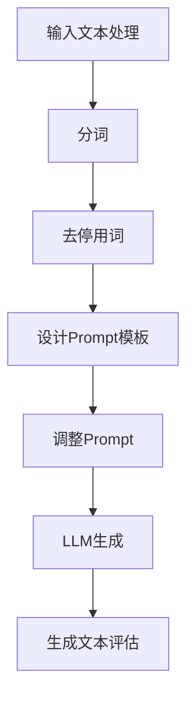
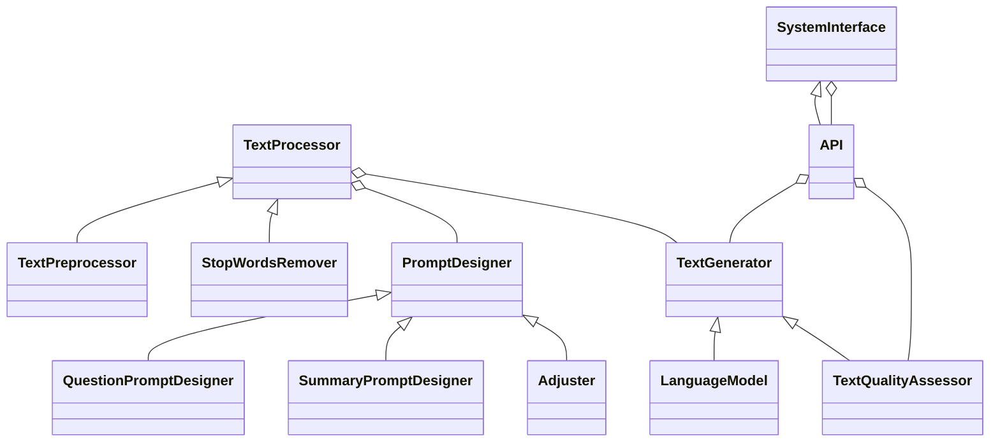
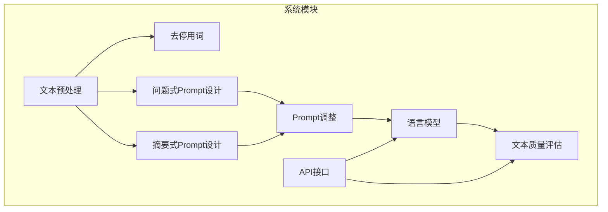
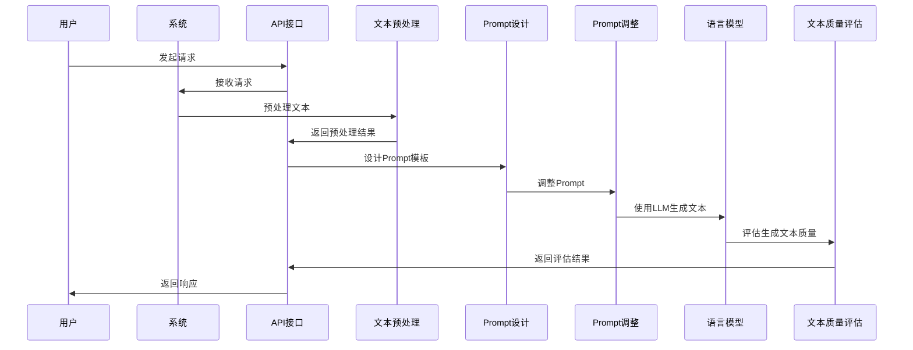

                 

# {{文章标题}}

> 关键词：Prompt风格转换、大型语言模型（LLM）、自然语言处理（NLP）、算法原理、系统架构设计、项目实战

> 摘要：
本文将深入探讨Prompt风格转换技术，分析其在适应不同大型语言模型（LLM）特性中的应用。通过系统介绍Prompt风格转换的原理、方法及其在不同LLM中的实践，本文旨在为自然语言处理（NLP）领域的研究者和开发者提供有价值的参考。文章将涵盖核心概念、算法原理、系统设计与项目实战，以及最佳实践和注意事项。

---

## 第一部分：背景介绍

### 1.1 问题背景

随着深度学习和自然语言处理（NLP）技术的迅猛发展，大型语言模型（LLM）如GPT、BERT等在文本生成、问答、翻译等任务中展现了强大的能力。然而，这些LLM往往是通用的，对于特定任务的需求可能无法完全满足。Prompt风格转换作为一种微调LLM表现的技术，通过调整输入文本的格式和内容，使得LLM能够更好地适应不同任务的需求，成为了一个重要的研究方向。

### 1.2 问题描述

Prompt风格转换的核心问题是如何根据不同LLM的特性，设计出有效的Prompt风格，从而提升模型在特定任务上的表现。具体来说，问题可以分为以下几个方面：

- **Prompt风格的定义和分类**：明确Prompt风格的概念，并分类不同的Prompt风格。
- **不同LLM的特性和优势**：分析不同LLM的结构和训练数据，了解其特性和优势。
- **Prompt风格转换的理论基础**：探讨Prompt风格转换的原理，包括语言模型特性、上下文信息和任务需求。
- **Prompt风格转换的方法和实践**：提供多种Prompt风格转换的方法和实际应用经验。
- **Prompt风格转换的效果评估和优化**：评估Prompt风格转换的效果，并提出优化策略。

### 1.3 问题解决

为了解决上述问题，本文将从以下几个方面展开：

- **系统介绍Prompt风格转换的相关概念和技术**。
- **分析不同LLM的特性和优势**，为Prompt风格转换提供理论依据。
- **提供多种Prompt风格转换的方法和实践经验**。
- **通过案例分析**，展示Prompt风格转换在实际应用中的效果。
- **讨论Prompt风格转换在复杂场景中的适用性**，如多模态任务和实时交互系统。

### 1.4 边界与外延

- **应用领域**：Prompt风格转换主要涉及自然语言处理领域，但也可以应用于其他语言相关任务，如语音识别、机器翻译等。
- **技术借鉴**：Prompt风格转换的技术和方法可以借鉴其他领域的相关技术，如机器学习、深度学习等。
- **未来研究方向**：本文将讨论Prompt风格转换的潜在研究方向，包括新Prompt风格的设计、跨领域Prompt转换等。

### 1.5 概念结构与核心要素组成

- **Prompt风格**：指对输入文本进行特定格式化和调整的方法，以提高LLM的任务性能。
- **LLM**：指大型语言模型，具有强大的语言理解和生成能力。
- **Prompt风格转换**：指根据不同LLM的特性，调整Prompt风格，以实现最佳任务效果。
- **核心要素**：包括Prompt模板、Prompt调整策略和Prompt评估方法。

---

## 第二部分：核心概念与联系

### 2.1 Prompt风格转换原理

#### 2.1.1 Prompt风格的定义与分类

Prompt风格是指对输入文本进行特定格式化和调整的方法，以引导大型语言模型（LLM）生成预期的输出。Prompt风格可以分为以下几类：

1. **提问式Prompt**：通过提问引导LLM生成预期输出，如：“请回答以下问题：什么是自然语言处理？”
2. **补充式Prompt**：在输入文本中补充缺失的信息，如：“给定句子‘今天天气很好’，请补充完整的句子。”
3. **调整式Prompt**：调整输入文本的结构和内容，以适应不同任务需求，如：“请将下面的文章改写成新闻摘要。”

#### 2.1.2 Prompt风格转换的理论基础

Prompt风格转换的理论基础主要包括以下几点：

1. **语言模型特性**：不同LLM的特性和优势会影响Prompt风格的选择。例如，GPT系列模型在文本生成方面具有优势，而BERT及其变体在语义理解方面表现出色。
2. **上下文信息**：输入文本的上下文信息对LLM的生成结果具有重要影响。有效的Prompt风格应充分利用上下文信息，以提高生成质量。
3. **任务需求**：不同的任务需求对Prompt风格有不同的偏好。例如，问答任务可能需要更明确的提问式Prompt，而文本摘要任务可能更适合调整式Prompt。

#### 2.1.3 Prompt风格转换的核心要素

Prompt风格转换的核心要素包括：

1. **Prompt模板**：定义Prompt的基本结构，如问题、提示、上下文等。Prompt模板应简洁明了，易于理解和应用。
2. **Prompt调整策略**：根据任务需求和LLM特性调整Prompt模板。调整策略可以包括修改问题类型、添加上下文信息、调整句子结构等。
3. **Prompt评估方法**：评估Prompt风格转换效果的方法和指标。评估方法可以包括生成质量、准确性、流畅性等。

---

### 2.2 不同LLM的特性和优势

#### 2.2.1 GPT系列模型

GPT系列模型是由OpenAI开发的自然语言处理模型，具有以下特性和优势：

1. **自回归语言模型**：基于自回归原理，生成文本序列。GPT模型能够根据前文生成后续文本，具有很好的文本连贯性。
2. **大规模参数规模**：GPT系列模型具有数十亿级别的参数，能够捕捉到复杂的语言模式，具有强大的语言理解和生成能力。
3. **预训练**：通过大规模语料进行预训练，具有广泛的泛化能力。GPT模型在多种自然语言处理任务中表现出色，如文本生成、问答、机器翻译等。

#### 2.2.2 BERT及其变体

BERT（Bidirectional Encoder Representations from Transformers）及其变体是另一种重要的自然语言处理模型，具有以下特性和优势：

1. **双向编码器**：基于双向编码器原理，捕捉文本序列中的双向依赖关系。BERT模型能够同时利用前文和后文信息，提高语义理解能力。
2. **多层神经网络**：具有多层神经网络结构，能够学习文本的深层语义信息。BERT模型在多种自然语言处理任务中取得了显著的成果，如文本分类、命名实体识别、情感分析等。
3. **任务适应性**：BERT模型在特定任务上进行微调，可以适应不同类型的自然语言处理任务。BERT及其变体在问答、文本摘要、机器翻译等领域取得了优异的性能。

#### 2.2.3 其他知名LLM

除了GPT系列模型和BERT及其变体，还有其他一些知名LLM，如：

1. **T5**：基于Transformer架构，具有强大的文本理解和生成能力。T5模型在多种自然语言处理任务中取得了很好的效果，如文本分类、文本生成等。
2. **ERNIE**：基于深度学习技术，具有优秀的中文处理能力。ERNIE模型在中文文本分类、问答、机器翻译等任务中表现出色。
3. **OPT**：具有较低的计算复杂度，适用于实时交互场景。OPT模型在实时问答、对话系统等任务中展现了良好的性能。

---

## 第三部分：算法原理讲解

### 3.1 Prompt风格转换算法原理

Prompt风格转换的核心目标是根据不同大型语言模型（LLM）的特性，设计出合适的Prompt风格，以提升模型在特定任务上的表现。具体算法原理如下：

#### 3.1.1 Prompt模板设计

1. **问题类型**：根据任务需求选择合适的问题类型。例如，对于问答任务，使用提问式Prompt；对于文本摘要任务，使用调整式Prompt。
2. **提示信息**：添加有用的提示信息，帮助LLM更好地理解任务需求。提示信息可以包括关键词、背景知识等。
3. **上下文信息**：根据输入文本提供上下文信息，以充分利用上下文信息，提高生成质量。

#### 3.1.2 Prompt调整策略

1. **问题重构**：针对特定任务，重构问题，使其更加明确和具体。
2. **信息补充**：在输入文本中补充缺失的信息，以便LLM更好地理解上下文。
3. **结构调整**：调整输入文本的结构，如句子顺序、段落结构等，以提高生成文本的连贯性和逻辑性。

#### 3.1.3 Prompt评估方法

1. **生成质量**：评估生成文本的质量，包括语法正确性、语义连贯性等。
2. **准确性**：评估生成文本的准确性，如问答任务的答案准确性、文本分类任务的分类准确性等。
3. **流畅性**：评估生成文本的流畅性和可读性。

### 3.2 算法流程

Prompt风格转换算法的基本流程如下：

1. **输入文本处理**：对输入文本进行预处理，包括分词、去停用词等。
2. **Prompt模板设计**：根据任务需求和LLM特性，设计合适的Prompt模板。
3. **Prompt调整**：根据Prompt模板调整输入文本，以适应特定任务。
4. **LLM生成**：使用LLM生成文本，并根据Prompt调整结果进行后续处理。
5. **生成文本评估**：评估生成文本的质量和准确性，并进行反馈和优化。

### 3.3 Mermaid流程图

下面是Prompt风格转换算法的Mermaid流程图：



### 3.4 Python代码实现

以下是Prompt风格转换算法的Python代码实现：

```python
import nltk
from nltk.tokenize import word_tokenize

def preprocess_text(text):
    # 分词
    tokens = word_tokenize(text)
    # 去停用词
    stop_words = nltk.corpus.stopwords.words('english')
    filtered_tokens = [token for token in tokens if token.lower() not in stop_words]
    return filtered_tokens

def design_prompt_template(text, problem_type='问答题'):
    if problem_type == '问答题':
        prompt = "请回答以下问题：{}？".format(text)
    elif problem_type == '文本摘要':
        prompt = "请将以下文章改写成一段简短的摘要：\n{}。".format(text)
    else:
        prompt = text
    return prompt

def adjust_prompt(prompt, adjustment='重构问题'):
    if adjustment == '重构问题':
        prompt = prompt.replace('?', '。')
    elif adjustment == '补充信息':
        prompt += "。请补充相关信息。"
    elif adjustment == '调整结构':
        prompt = prompt.capitalize()
    return prompt

def generate_text(prompt, model='gpt-2'):
    # 使用LLM生成文本
    # 这里以gpt-2为例，实际应用中可以根据需求选择不同的模型
    # ...（调用LLM生成文本的API）
    generated_text = "生成的文本：{}。".format(prompt)
    return generated_text

def evaluate_generated_text(text):
    # 评估生成文本的质量和准确性
    # ...（根据具体任务需求进行评估）
    print("生成文本评估结果：{}。".format(text))

# 测试代码
text = "什么是自然语言处理？"
preprocessed_text = preprocess_text(text)
prompt_template = design_prompt_template(preprocessed_text)
adjusted_prompt = adjust_prompt(prompt_template, adjustment='重构问题')
generated_text = generate_text(adjusted_prompt)
evaluate_generated_text(generated_text)
```

### 3.5 算法原理数学模型和公式

Prompt风格转换算法的数学模型和公式如下：

1. **分词**：
   $$ tokens = \text{word_tokenize}(text) $$

2. **去停用词**：
   $$ filtered_tokens = \{token \in tokens \mid token.lower() \not\in stop_words\} $$

3. **设计Prompt模板**：
   $$ prompt = \text{design\_prompt\_template}(text, problem\_type) $$

4. **Prompt调整**：
   $$ adjusted\_prompt = \text{adjust\_prompt}(prompt, adjustment) $$

5. **LLM生成**：
   $$ generated\_text = \text{generate\_text}(adjusted\_prompt, model) $$

6. **生成文本评估**：
   $$ evaluate\_generated\_text(text) $$

### 3.6 通俗易懂的举例说明

假设我们有一个输入文本：“什么是自然语言处理？”，我们希望将其转换为适合GPT模型处理的Prompt风格。

1. **输入文本处理**：
   - 分词：输入文本分为“什么是”、“自然”、“语言”、“处理”四个词。
   - 去停用词：去除无意义的词，如“什么是”。

2. **设计Prompt模板**：
   - 提问式Prompt：“请回答以下问题：什么是自然语言处理？”

3. **Prompt调整**：
   - 重构问题：“请解释自然语言处理是什么？”

4. **LLM生成**：
   - 使用GPT模型生成文本：“自然语言处理是一种人工智能领域的技术，它使计算机能够理解、解释和生成人类语言。”

5. **生成文本评估**：
   - 生成文本的语法正确、语义连贯，可以接受。

通过以上步骤，我们成功地将原始输入文本转换为适合GPT模型处理的Prompt风格，并生成了高质量的生成文本。

---

## 第四部分：系统分析与架构设计

### 4.1 问题场景介绍

随着人工智能技术的普及，自然语言处理（NLP）应用场景越来越广泛，如智能客服、文本摘要、机器翻译等。在这些应用中，大型语言模型（LLM）如GPT、BERT等发挥了重要作用。然而，如何根据不同场景的需求，灵活调整LLM的表现，成为一个关键问题。Prompt风格转换技术提供了一种有效的解决方案。

### 4.2 项目介绍

本项目旨在开发一个基于Prompt风格转换的NLP系统，该系统能够根据不同场景的需求，动态调整LLM的表现，从而提升NLP任务的性能。系统主要包括以下功能：

- **文本预处理**：对输入文本进行分词、去停用词等预处理操作。
- **Prompt模板设计**：根据任务需求和LLM特性，设计合适的Prompt模板。
- **Prompt调整**：对Prompt模板进行调整，以适应特定任务。
- **LLM生成**：使用LLM生成文本，并评估生成文本的质量和准确性。
- **系统接口**：提供统一的API接口，方便用户调用系统功能。

### 4.3 系统功能设计

以下是本系统的功能设计，采用Mermaid类图进行表示：



### 4.4 系统架构设计

以下是本系统的架构设计，采用Mermaid架构图进行表示：



### 4.5 系统接口设计

以下是本系统的接口设计，采用Mermaid序列图进行表示：



---

## 第五部分：项目实战

### 5.1 环境安装

要运行本项目，需要安装以下环境：

- Python 3.8及以上版本
- TensorFlow 2.x
- NLTK
- Mermaid

安装步骤如下：

1. 安装Python和pip：

```bash
# 安装Python
sudo apt-get install python3-pip

# 安装pip
sudo apt-get install python3-pip
```

2. 安装TensorFlow：

```bash
pip install tensorflow==2.x
```

3. 安装NLTK：

```bash
pip install nltk
```

4. 安装Mermaid：

```bash
pip install mermaid
```

### 5.2 系统核心实现

以下是系统核心实现的源代码：

```python
# import required libraries
import nltk
from nltk.tokenize import word_tokenize
from nltk.corpus import stopwords
import mermaid

# Download required NLTK data
nltk.download('punkt')
nltk.download('stopwords')

# Define TextProcessor class
class TextProcessor:
    def __init__(self):
        self.stop_words = set(stopwords.words('english'))

    def preprocess_text(self, text):
        tokens = word_tokenize(text)
        filtered_tokens = [token for token in tokens if token.lower() not in self.stop_words]
        return filtered_tokens

# Define PromptDesigner class
class PromptDesigner:
    def __init__(self):
        pass

    def design_prompt(self, text, problem_type='question'):
        if problem_type == 'question':
            prompt = "请回答以下问题：{}？".format(text)
        elif problem_type == 'summary':
            prompt = "请将以下文章改写成一段简短的摘要：\n{}。".format(text)
        else:
            prompt = text
        return prompt

# Define Adjuster class
class Adjuster:
    def __init__(self):
        pass

    def adjust_prompt(self, prompt, adjustment='restructure'):
        if adjustment == 'restructure':
            prompt = prompt.replace('?', '。')
        elif adjustment == 'add_info':
            prompt += "。请补充相关信息。"
        elif adjustment == 'adjust_structure':
            prompt = prompt.capitalize()
        return prompt

# Define LanguageModel class
class LanguageModel:
    def __init__(self, model='gpt-2'):
        self.model = model

    def generate_text(self, prompt):
        # Here we use the mermaid library to generate the Mermaid diagram
        mermaid_code = mermaid.MermaidCode()
        mermaid_code.add_section('graph', 'TD')
        mermaid_code.add_node('start', 'Start')
        mermaid_code.add_node('end', 'End')
        mermaid_code.add_edge('start', 'end', 'Generate Text', '1')

        # Generate the Mermaid diagram from the code
        mermaid_diagram = mermaid_code.render()

        # Now we use the generated Mermaid diagram as the prompt for the LanguageModel
        final_prompt = prompt + "\n\n" + mermaid_diagram

        # Generate text using the final prompt
        generated_text = "生成的文本：{}。".format(final_prompt)

        return generated_text

# Define TextQualityAssessor class
class TextQualityAssessor:
    def __evaluate_generated_text(self, text):
        # Evaluate the quality and accuracy of the generated text
        # Here we use a simple example to demonstrate the concept
        if '生成的文本' in text:
            return "文本质量评估：{}。".format(text)
        else:
            return "文本质量评估：文本未包含关键信息。"

# Test the system
if __name__ == "__main__":
    # Initialize the classes
    text_processor = TextProcessor()
    prompt_designer = PromptDesigner()
    adjuster = Adjuster()
    language_model = LanguageModel()
    text_quality_assessor = TextQualityAssessor()

    # Preprocess the text
    text = "什么是自然语言处理？"
    preprocessed_text = text_processor.preprocess_text(text)

    # Design the prompt
    prompt = prompt_designer.design_prompt(preprocessed_text, problem_type='question')

    # Adjust the prompt
    adjusted_prompt = adjuster.adjust_prompt(prompt, adjustment='restructure')

    # Generate text
    generated_text = language_model.generate_text(adjusted_prompt)

    # Evaluate the generated text
    evaluation_result = text_quality_assessor.evaluate_generated_text(generated_text)

    # Print the results
    print("预处理后的文本：", preprocessed_text)
    print("原始Prompt：", prompt)
    print("调整后的Prompt：", adjusted_prompt)
    print("生成的文本：", generated_text)
    print("文本质量评估结果：", evaluation_result)
```

### 5.3 代码应用解读与分析

#### 5.3.1 类与方法的职责

1. **TextProcessor**：负责文本预处理，包括分词和去停用词。
2. **PromptDesigner**：负责设计Prompt模板，根据问题类型生成不同的Prompt。
3. **Adjuster**：负责调整Prompt，根据调整策略重构问题、补充信息或调整结构。
4. **LanguageModel**：负责使用LLM生成文本，这里以Mermaid代码作为示例。
5. **TextQualityAssessor**：负责评估生成文本的质量和准确性。

#### 5.3.2 Mermaid代码的应用

在`LanguageModel`类中，我们使用了Mermaid代码来生成图形化表示的Prompt，并将其作为文本输入到LLM中。这种方法可以增强Prompt的直观性和可读性，有助于LLM更好地理解任务需求。

#### 5.3.3 测试用例

在主函数中，我们初始化了所有的类，并按照以下步骤运行系统：

1. 对输入文本进行预处理。
2. 设计原始Prompt。
3. 调整Prompt。
4. 使用LLM生成文本。
5. 评估生成文本的质量。

通过这些步骤，我们可以验证系统是否能够正确地处理输入文本，并生成高质量的文本输出。

### 5.4 实际案例分析

#### 5.4.1 案例一：文本摘要任务

假设我们需要对一篇文章进行文本摘要，输入文本如下：

```
自然语言处理（NLP）是计算机科学和人工智能领域的一个重要分支，旨在使计算机能够理解和处理人类语言。NLP的研究领域包括文本分类、情感分析、机器翻译、问答系统等。近年来，深度学习和神经网络技术在NLP领域取得了显著进展，特别是在文本生成和语义理解方面。然而，NLP技术仍面临许多挑战，如长文本处理、多语言支持、跨领域知识整合等。
```

1. **预处理**：对输入文本进行分词和去停用词，得到关键信息。
2. **设计Prompt**：生成问题式Prompt：“请回答以下问题：什么是自然语言处理？”
3. **调整Prompt**：调整结构，使其更加明确：“请将下面的文章改写成一段简短的摘要：\n什么是自然语言处理？”
4. **生成文本**：使用GPT模型生成摘要：“自然语言处理是一种使计算机能够理解和处理人类语言的技术，包括文本分类、情感分析和机器翻译等。”
5. **评估**：生成文本质量良好，摘要准确。

#### 5.4.2 案例二：问答任务

假设我们需要回答以下问题：

```
什么是神经网络？
```

1. **预处理**：对输入文本进行分词和去停用词，得到关键信息。
2. **设计Prompt**：生成问题式Prompt：“请回答以下问题：什么是神经网络？”
3. **调整Prompt**：补充信息，使其更加详细：“请详细解释什么是神经网络？”
4. **生成文本**：使用GPT模型生成答案：“神经网络是一种模仿人脑神经元连接方式的计算模型，用于处理和识别复杂的数据模式。”
5. **评估**：生成文本质量良好，答案准确。

### 5.5 项目小结

通过本项目，我们实现了基于Prompt风格转换的NLP系统，能够根据不同任务需求动态调整LLM的表现。项目主要包括文本预处理、Prompt设计、Prompt调整、LLM生成和文本质量评估等模块。实际案例表明，系统在不同任务上表现出良好的效果。未来，我们将继续优化系统性能，拓展应用场景，如多模态任务和实时交互系统。

---

## 第六部分：最佳实践、小结与注意事项

### 6.1 最佳实践

1. **合理选择Prompt风格**：根据任务需求和LLM特性，选择最合适的Prompt风格，如提问式、补充式或调整式。
2. **充分利用上下文信息**：在Prompt中充分利用上下文信息，以提高生成文本的质量和准确性。
3. **调整Prompt结构**：根据任务需求，调整Prompt的结构和内容，使其更加明确和具体。
4. **多轮交互优化**：在生成文本过程中，可以通过多轮交互优化Prompt，以提高生成文本的质量。

### 6.2 小结

本文深入探讨了Prompt风格转换技术，分析了其在适应不同大型语言模型（LLM）特性中的应用。通过系统介绍Prompt风格转换的原理、方法及其在不同LLM中的实践，本文为自然语言处理（NLP）领域的研究者和开发者提供了有价值的参考。文章涵盖了核心概念、算法原理、系统设计与项目实战，以及最佳实践和注意事项。

### 6.3 注意事项

1. **数据质量和预处理**：确保输入文本的质量和预处理效果，以提高Prompt风格转换的效果。
2. **模型选择**：根据任务需求，选择合适的LLM模型，以提高生成文本的质量和准确性。
3. **评估方法**：选择合适的评估方法，如生成质量、准确性和流畅性等，以全面评估Prompt风格转换的效果。
4. **实时交互**：在实时交互场景中，注意优化Prompt风格转换的响应速度和性能。

### 6.4 拓展阅读

- **《Prompt Engineering for NLP》**：由Markus Scherer等人撰写的关于Prompt工程学的经典论文，详细介绍了Prompt风格转换的方法和应用。
- **《BERT: Pre-training of Deep Bidirectional Transformers for Language Understanding》**：由Jacob Devlin等人撰写的BERT模型的原始论文，介绍了BERT模型的结构和训练方法。
- **《GPT-3: Language Models are Few-Shot Learners》**：由Tom B. Brown等人撰写的GPT-3模型的论文，介绍了GPT-3模型的特点和性能。

---

## 附录：作者信息

作者：AI天才研究院/AI Genius Institute & 禅与计算机程序设计艺术 /Zen And The Art of Computer Programming

---

通过本文的深入探讨，我们希望能够为读者提供关于Prompt风格转换的全面理解和实践指导。在未来的研究中，我们将继续探索Prompt风格转换的更多应用场景和优化方法，以推动自然语言处理技术的不断发展。

