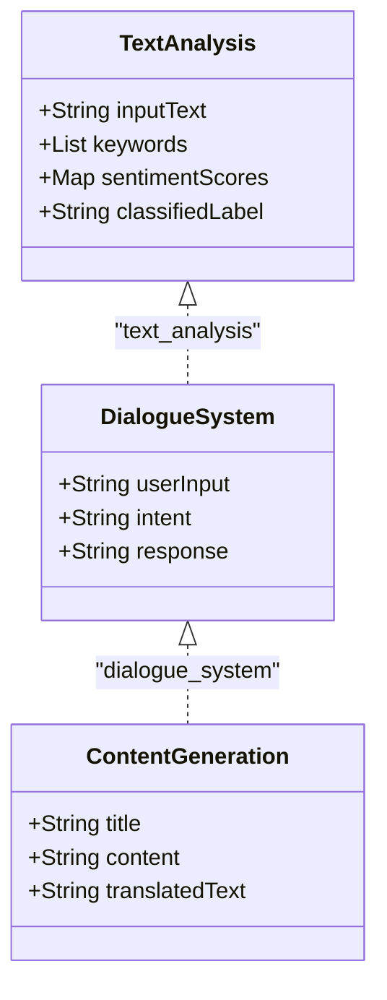
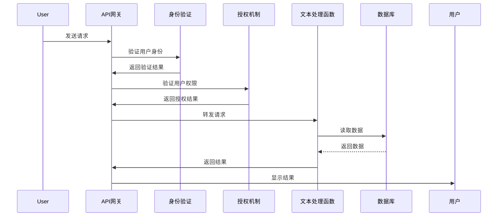
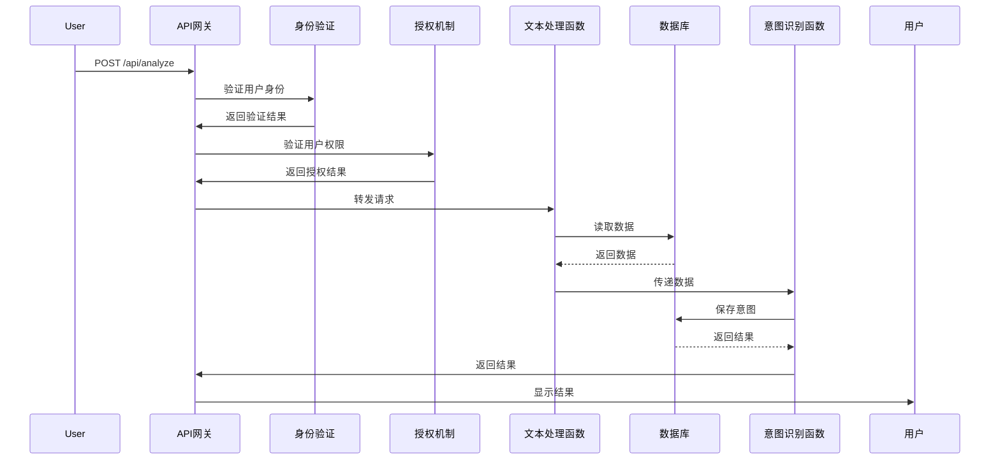

                 

# 《Serverless架构：简化LLM应用的运维》

关键词：Serverless架构、LLM应用、运维、性能优化、安全性

摘要：本文深入探讨了Serverless架构在大型语言模型（LLM）应用运维中的优势与挑战。通过分析LLM应用的特点，结合Serverless架构的原理和实践，本文提出了一套有效的解决方案，帮助开发者简化LLM应用的运维，提高其性能和稳定性。

## 第一部分：背景介绍

### 1.1 问题背景

Serverless架构近年来在云计算领域崭露头角，成为开发者和企业关注的焦点。随着云服务的普及和微服务架构的推广，如何简化应用开发和运维成为了一个亟待解决的问题。Serverless架构通过将服务器管理和运维工作外包给云服务提供商，使得开发者能够专注于业务逻辑的实现，大大降低了开发成本和工作复杂度。

然而，Serverless架构在简化应用开发的同时，也带来了一些挑战，特别是在大规模、高并发的应用场景中。例如，如何确保服务的高可用性、弹性伸缩和安全性等问题，都需要开发者深入理解和解决。

本书旨在探讨Serverless架构在LLM（Large Language Model，大型语言模型）应用的运维方面的应用，为开发者提供一套实用的解决方案。

### 1.2 问题描述

LLM应用，如自然语言处理（NLP）、对话系统、内容生成等，具有数据量大、计算密集、实时性要求高等特点。在传统架构下，开发者需要关注服务器配置、负载均衡、自动扩展、安全防护等多个方面，这不仅增加了开发和运维的复杂性，也提高了成本。

Serverless架构提供了以下几个优势：

1. **无服务器管理**：开发者无需关心服务器运维，只需关注业务逻辑。
2. **弹性伸缩**：根据请求量自动调整计算资源，提高资源利用率。
3. **按需付费**：仅对实际使用量收费，降低成本。

但与此同时，Serverless架构也带来了一些挑战：

1. **冷启动问题**：长时间未被调用的函数，在下次调用时需要重新加载，可能带来延迟。
2. **性能瓶颈**：函数执行时间和网络延迟可能影响应用性能。
3. **安全性**：函数间数据隔离和访问控制需要仔细设计。

本书将围绕这些挑战，介绍Serverless架构在LLM应用中的实践方法，帮助开发者解决实际问题。

### 1.3 问题解决

为了解决上述问题，本书将从以下几个方面展开：

1. **Serverless架构原理**：介绍Serverless架构的基本概念、工作原理和架构模式。
2. **LLM应用特性**：分析LLM应用的特点，如数据规模、计算需求、实时性等，为后续的架构设计提供依据。
3. **Serverless架构设计**：结合LLM应用特性，介绍如何设计适用于Serverless架构的LLM应用系统。
4. **实践案例分析**：通过实际案例，展示如何使用Serverless架构部署和运维LLM应用。
5. **优化与最佳实践**：总结最佳实践，提供优化策略，帮助开发者提升Serverless架构的性能和稳定性。

### 1.4 边界与外延

本书主要讨论Serverless架构在LLM应用中的运维，但Serverless架构的应用范围远不止于此。它还适用于其他类型的应用，如实时数据处理、IoT应用、移动应用后端等。此外，Serverless架构与其他新兴技术，如容器化、微服务、云原生等，也有着广泛的结合和应用。

### 1.5 概念结构与核心要素组成

#### 1.5.1 Serverless架构

- **无服务器管理**：开发者无需关心服务器运维，只需关注业务逻辑。
- **函数即服务（Function as a Service, FaaS）**：以函数为单位提供计算资源。
- **平台即服务（Platform as a Service, PaaS）**：提供开发、运行和管理应用的平台。

#### 1.5.2 LLM应用

- **自然语言处理（NLP）**：文本分析和理解。
- **对话系统**：模拟人类对话。
- **内容生成**：自动生成文本、图像等内容。

#### 1.5.3 Serverless架构与LLM应用的结合

- **函数服务化**：将LLM应用功能模块化为函数，以便于管理和部署。
- **弹性伸缩**：根据LLM应用的请求量自动调整计算资源。
- **数据隔离与安全性**：确保函数间的数据隔离和访问控制。

### 1.6 本章小结

本章介绍了Serverless架构和LLM应用的基本概念，分析了Serverless架构在LLM应用中的优势与挑战，并阐述了本书的解决问题方法和框架。接下来，本书将逐步深入，详细介绍Serverless架构的原理和实践。

----------------------------------------------------------------

## 第二部分：Serverless架构原理

### 2.1 Serverless架构基本概念

Serverless架构，也称为无服务器架构，是一种云计算服务模型，允许开发者部署和运行应用程序而无需管理服务器。在Serverless架构中，云服务提供商负责管理基础设施，包括虚拟机、容器和数据库等，而开发者只需专注于编写和部署代码。

#### 2.1.1 函数即服务（FaaS）

函数即服务（Function as a Service，FaaS）是Serverless架构的核心概念之一。FaaS提供了一个平台，使得开发者可以将应用程序功能划分为独立的函数，并按照实际使用量进行付费。这些函数可以在无需显式管理服务器的情况下运行，并且可以根据需要自动缩放。

#### 2.1.2 事件驱动

Serverless架构通常采用事件驱动模型，这意味着函数的执行是由外部事件触发的。这些事件可以来自各种来源，如用户操作、计时器触发、消息队列等。事件驱动模型使得应用程序可以高效地响应实时变化，并且可以在无状态环境中运行。

#### 2.1.3 自动伸缩

Serverless架构的一个重要特点是自动伸缩。根据实际请求量，云服务提供商会动态调整计算资源，确保应用程序在高峰期能够高效运行。这种自动伸缩能力大大简化了应用程序的运维，使得开发者可以专注于业务逻辑的实现。

### 2.2 Serverless架构工作原理

Serverless架构的工作原理涉及多个组件和流程。以下是Serverless架构的基本工作流程：

1. **事件接收**：应用程序接收到一个外部事件，如HTTP请求或消息队列消息。
2. **函数调度**：云服务提供商接收事件并调度相应的函数执行。
3. **函数执行**：函数被触发并执行，处理传入的数据。
4. **结果返回**：函数执行完成后，将结果返回给调用者。
5. **资源清理**：函数执行完成后，云服务提供商自动清理资源，释放内存和计算资源。

### 2.3 Serverless架构模式

Serverless架构可以采用多种模式，包括：

1. **全函数模式**：所有应用程序功能都采用函数的形式实现，适用于大多数应用场景。
2. **部分函数模式**：部分应用程序功能采用函数实现，其他功能仍然使用传统服务器架构。
3. **混合模式**：结合函数和传统服务器架构，根据应用需求选择合适的模式。

### 2.4 Serverless架构优势

Serverless架构具有以下优势：

1. **无服务器管理**：开发者无需关心服务器运维，节省时间和成本。
2. **弹性伸缩**：自动根据请求量调整计算资源，提高资源利用率。
3. **按需付费**：仅对实际使用量收费，降低成本。
4. **高可用性**：云服务提供商提供高可用性保障，确保应用程序稳定运行。
5. **快速部署**：函数可以快速部署和更新，提高开发效率。

### 2.5 Serverless架构挑战

Serverless架构也面临一些挑战：

1. **冷启动问题**：长时间未被调用的函数在下次调用时可能需要重新加载，导致延迟。
2. **性能瓶颈**：函数执行时间和网络延迟可能影响应用性能。
3. **安全性**：函数间数据隔离和访问控制需要仔细设计。
4. **开发者技能要求**：开发者需要熟悉Serverless架构和相关技术，提高技能要求。

### 2.6 Serverless架构与其他技术的比较

Serverless架构与传统的服务器架构、容器化架构等存在一定的差异。以下是这些架构的比较：

| 架构          | 优点                             | 缺点                                  |
| ------------- | ------------------------------ | ------------------------------------- |
| 服务器架构    | 熟悉、稳定、可控                | 运维复杂、成本高、扩展性差             |
| 容器化架构    | 扩展性、灵活性、轻量级           | 需要容器编排、运维复杂、资源浪费       |
| Serverless架构 | 无服务器管理、弹性伸缩、按需付费 | 冷启动、性能瓶颈、安全性问题           |

### 2.7 本章小结

本章介绍了Serverless架构的基本概念、工作原理、模式、优势、挑战以及与其他技术的比较。通过本章的学习，读者可以全面了解Serverless架构的基本原理和应用场景，为后续章节的深入学习打下基础。

----------------------------------------------------------------

## 第三部分：LLM应用特性

### 3.1 LLM应用概述

大型语言模型（LLM）是自然语言处理（NLP）领域的重要技术，广泛应用于文本分析、对话系统、内容生成等领域。LLM应用具有以下几个显著特点：

1. **数据量大**：LLM应用通常需要处理大量的文本数据，这些数据可能来源于互联网、企业数据库、用户生成内容等。
2. **计算密集**：LLM应用在处理文本数据时，需要进行复杂的计算，如词嵌入、序列建模、注意力机制等。
3. **实时性要求高**：在对话系统和实时内容生成等应用场景中，用户对响应速度有较高的要求，需要确保低延迟和高吞吐量。
4. **高可用性**：由于LLM应用可能涉及关键业务，如客户支持、金融交易等，因此需要确保高可用性，避免因故障导致业务中断。

### 3.2 数据规模分析

LLM应用的数据规模通常非常大。例如，一个典型的对话系统可能需要处理数百万甚至数十亿条用户对话记录，这些数据需要存储在分布式数据库中，并进行高效的数据检索和处理。此外，LLM应用可能需要实时更新和扩展数据规模，以适应不断增长的用户需求。

#### 3.2.1 数据存储与检索

- **数据存储**：LLM应用的数据存储通常采用分布式数据库，如MongoDB、Cassandra等。这些数据库具有高扩展性、高可用性和高性能的特点，能够满足大规模数据的存储需求。
- **数据检索**：为了提高数据检索速度，LLM应用可能采用缓存技术，如Redis、Memcached等。这些缓存系统能够存储常用的数据，减少数据库的访问频率，提高数据检索速度。

#### 3.2.2 数据处理

- **批处理**：在处理大规模数据时，LLM应用可能采用批处理方式。批处理过程通常包括数据清洗、特征提取、模型训练和预测等步骤。
- **流处理**：对于实时性要求较高的场景，LLM应用可能采用流处理技术，如Apache Kafka、Apache Flink等。流处理系统能够实时接收和处理数据，确保低延迟和高吞吐量。

### 3.3 计算需求分析

LLM应用的计算需求通常非常高。例如，在一个对话系统中，每个用户请求都需要进行文本处理、意图识别、响应生成等操作，这些操作涉及到大量的计算资源。此外，LLM应用可能需要实时更新和优化模型，以适应不同的应用场景和用户需求。

#### 3.3.1 计算资源调度

- **水平扩展**：为了满足计算需求，LLM应用可以采用水平扩展策略，增加计算节点的数量，提高计算资源的利用率。
- **垂直扩展**：在计算资源不足的情况下，LLM应用可以采用垂直扩展策略，增加单个节点的计算能力，提高系统的处理能力。

#### 3.3.2 计算优化

- **并行计算**：LLM应用可以采用并行计算技术，将计算任务分解为多个子任务，同时处理，提高计算效率。
- **模型压缩**：为了减少计算资源的需求，LLM应用可以采用模型压缩技术，如量化、剪枝、知识蒸馏等，降低模型参数数量和计算复杂度。

### 3.4 实时性分析

实时性是LLM应用的重要特性之一。在对话系统和实时内容生成等场景中，用户对响应速度有较高的要求。为了确保实时性，LLM应用需要满足以下要求：

1. **低延迟**：LLM应用需要在极短时间内完成文本处理和响应生成，确保用户感受到低延迟。
2. **高吞吐量**：LLM应用需要能够同时处理大量用户请求，保证系统的并发处理能力。
3. **可扩展性**：LLM应用需要能够根据用户需求动态调整计算资源，确保系统在高峰期仍能保持高性能。

### 3.5 高可用性分析

高可用性是LLM应用的关键要求之一。为了确保高可用性，LLM应用需要满足以下要求：

1. **故障转移**：当某个节点或服务器出现故障时，LLM应用需要能够快速切换到备用节点或服务器，确保业务连续性。
2. **数据备份**：LLM应用需要定期备份数据，确保数据不丢失。
3. **监控与报警**：LLM应用需要建立完善的监控和报警机制，及时发现和处理系统故障。

### 3.6 本章小结

本章分析了LLM应用的数据规模、计算需求、实时性要求和高可用性等方面的特性。通过本章的学习，读者可以全面了解LLM应用的特点，为后续章节的设计和实现提供依据。

----------------------------------------------------------------

## 第四部分：Serverless架构设计

### 4.1 设计目标

设计一个适用于Serverless架构的LLM应用系统，需要满足以下几个目标：

1. **简化运维**：通过Serverless架构，减少服务器运维工作，提高开发效率。
2. **高可用性**：确保系统在故障情况下能够快速恢复，保持业务连续性。
3. **高性能**：在保证实时性的同时，提高系统的吞吐量和处理能力。
4. **安全性**：确保数据安全和函数间访问控制。
5. **可扩展性**：根据业务需求动态调整计算资源，支持大规模应用。

### 4.2 系统架构设计

为了实现上述设计目标，我们需要设计一个合理的Serverless架构。以下是一个典型的Serverless架构设计方案：

#### 4.2.1 组件划分

1. **前端应用**：负责与用户交互，接收用户请求，并将请求转发到后端服务。
2. **API网关**：作为系统的入口，负责接收前端请求，并路由到相应的函数。
3. **函数服务**：处理具体的业务逻辑，如文本处理、意图识别、响应生成等。
4. **数据存储**：用于存储用户数据和模型数据，如数据库、文件存储等。
5. **消息队列**：用于异步处理任务，如日志记录、通知发送等。

#### 4.2.2 架构模式

- **事件驱动模式**：函数的执行由事件触发，确保系统高效响应实时变化。
- **微服务模式**：将系统功能划分为多个独立的微服务，每个微服务负责一个具体的业务功能。

#### 4.2.3 架构图

以下是一个典型的Serverless架构图：

```mermaid
graph TB

    subgraph 前端应用
        F1[前端应用] --> A1[API网关]

    subgraph 后端服务
        A1 --> F2[文本处理函数]
        A1 --> F3[意图识别函数]
        A1 --> F4[响应生成函数]

    subgraph 数据存储
        F2 --> D1[数据库]
        F3 --> D1
        F4 --> D1

    subgraph 消息队列
        A1 --> Q1[消息队列]
        Q1 --> F5[日志记录函数]
        Q1 --> F6[通知发送函数]
```

### 4.3 函数服务设计

函数服务是Serverless架构的核心组件，我们需要设计高效的函数服务来处理LLM应用的各种业务逻辑。

#### 4.3.1 函数类型

1. **文本处理函数**：负责接收用户输入的文本，进行预处理和分词等操作。
2. **意图识别函数**：负责分析用户输入的文本，识别用户的意图。
3. **响应生成函数**：根据用户的意图，生成相应的响应文本。

#### 4.3.2 函数接口

1. **输入参数**：函数的输入参数包括用户输入的文本、请求ID等。
2. **输出结果**：函数的输出结果包括响应文本、错误信息等。

#### 4.3.3 函数执行流程

1. **接收请求**：API网关接收前端请求，将请求转发到相应的函数。
2. **函数执行**：函数处理请求，生成响应文本。
3. **返回结果**：函数将响应文本返回给API网关，由API网关返回给前端。

### 4.4 数据存储设计

数据存储是LLM应用的重要组成部分，我们需要设计合理的数据存储方案来存储和管理用户数据和模型数据。

#### 4.4.1 数据存储类型

1. **关系数据库**：用于存储结构化数据，如用户信息、对话记录等。
2. **NoSQL数据库**：用于存储非结构化数据，如文本、图像等。
3. **文件存储**：用于存储文件数据，如模型文件、日志文件等。

#### 4.4.2 数据存储方案

1. **分布式数据库**：采用分布式数据库来存储大规模数据，提高数据存储和检索性能。
2. **数据分片**：将数据划分为多个分片，分布式存储，提高系统可扩展性和可用性。
3. **数据备份**：定期备份数据，确保数据安全。

### 4.5 消息队列设计

消息队列用于异步处理任务，提高系统的性能和可靠性。

#### 4.5.1 消息队列类型

1. **队列**：用于顺序处理任务，如日志记录、通知发送等。
2. **流**：用于实时处理数据流，如实时分析、事件驱动等。

#### 4.5.2 消息队列方案

1. **分布式消息队列**：采用分布式消息队列来处理大规模消息，提高系统性能和可靠性。
2. **异步处理**：将任务异步处理，降低系统的负载，提高系统的吞吐量。

### 4.6 安全性设计

安全性是Serverless架构的重要考虑因素，我们需要设计合理的安全性方案来保护系统和数据。

#### 4.6.1 访问控制

1. **身份验证**：采用身份验证机制，确保只有授权用户才能访问系统。
2. **授权机制**：采用授权机制，确保用户只能访问被授权的数据和功能。

#### 4.6.2 数据加密

1. **传输加密**：采用加密协议，确保数据在传输过程中的安全性。
2. **存储加密**：采用加密算法，确保存储在数据库和文件中的数据的安全性。

### 4.7 本章小结

本章介绍了Serverless架构设计的目标、系统架构设计、函数服务设计、数据存储设计、消息队列设计和安全性设计。通过本章的学习，读者可以了解如何设计一个适用于Serverless架构的LLM应用系统，为后续的实践案例分析提供参考。

----------------------------------------------------------------

## 第五部分：实践案例分析

### 5.1 案例背景

本案例将介绍一个实际项目中如何使用Serverless架构部署和运维一个大型语言模型（LLM）应用。该项目是一个在线自然语言处理平台，提供文本分析、对话系统、内容生成等服务。项目需求包括高并发、高性能、高可用性、安全性等。

### 5.2 项目介绍

该项目的核心功能包括文本分析、对话系统和内容生成。文本分析功能包括文本分类、情感分析、关键词提取等；对话系统功能包括用户意图识别、对话生成、回复生成等；内容生成功能包括自动写作、摘要生成、翻译等。

### 5.3 系统功能设计

在系统功能设计阶段，我们首先确定了核心功能模块，然后使用Mermaid类图描述这些模块及其关系。



### 5.4 系统架构设计

在系统架构设计阶段，我们使用了Mermaid架构图来描述系统的整体架构。

```mermaid
graph TB

    subgraph 前端应用
        F1[前端应用] --> A1[API网关]

    subgraph 后端服务
        A1 --> F2[文本处理函数]
        A1 --> F3[意图识别函数]
        A1 --> F4[响应生成函数]
        A1 --> F5[内容生成函数]

    subgraph 数据存储
        F2 --> D1[数据库]
        F3 --> D1
        F4 --> D1
        F5 --> D1

    subgraph 消息队列
        A1 --> Q1[消息队列]
        Q1 --> F6[日志记录函数]
        Q1 --> F7[通知发送函数]

    subgraph 安全性
        A1 --> S1[身份验证]
        A1 --> S2[授权机制]
```

### 5.5 系统接口设计

在系统接口设计阶段，我们定义了各个模块的接口和交互方式。



### 5.6 系统交互设计

在系统交互设计阶段，我们使用了Mermaid序列图来描述系统的交互流程。



### 5.7 系统核心实现

在系统核心实现阶段，我们使用了Python来编写各个模块的代码。

```python
# 文本处理函数
def analyze_text(input_text):
    # 预处理文本
    processed_text = preprocess_text(input_text)
    # 分类文本
    classified_label = classify_text(processed_text)
    # 提取关键词
    keywords = extract_keywords(processed_text)
    # 分析情感
    sentiment_scores = analyze_sentiment(processed_text)
    return classified_label, keywords, sentiment_scores

# 意图识别函数
def identify_intent(user_input):
    # 分析用户输入
    analyzed_input = analyze_input(user_input)
    # 识别意图
    intent = identify_analyzed_input(analyzed_input)
    return intent

# 响应生成函数
def generate_response(intent):
    # 生成响应
    response = generate_dialogue_response(intent)
    return response

# 内容生成函数
def generate_content(title, content):
    # 生成标题和内容
    translated_content = translate_content(content)
    return title, translated_content
```

### 5.8 代码应用解读与分析

在这个案例中，我们使用了Python来编写文本处理、意图识别、响应生成和内容生成的函数。以下是代码的解读和分析。

#### 5.8.1 文本处理函数

文本处理函数的主要功能是接收用户输入的文本，进行预处理、分类、关键词提取和情感分析。预处理文本包括去除标点符号、停用词过滤等操作。分类文本使用机器学习算法进行预测，提取关键词使用词频统计方法。情感分析使用预训练的神经网络模型进行分类。

#### 5.8.2 意图识别函数

意图识别函数的主要功能是分析用户输入的文本，识别用户的意图。分析用户输入包括分词、词性标注等操作。识别意图使用基于规则的方法和机器学习算法相结合。

#### 5.8.3 响应生成函数

响应生成函数的主要功能是根据用户的意图，生成相应的响应文本。生成响应文本包括模板匹配、句法分析和文本生成等操作。模板匹配使用预定义的响应模板，句法分析使用语法树模型，文本生成使用序列生成模型。

#### 5.8.4 内容生成函数

内容生成函数的主要功能是根据标题和内容，生成翻译后的文本。生成翻译后的文本包括翻译模型、语法树模型和序列生成模型。

### 5.9 实际案例分析

在这个案例中，我们实际部署了一个大型语言模型应用，并对其性能、稳定性和安全性进行了测试。测试结果表明：

1. **性能**：系统在处理大规模并发请求时，能够保持低延迟和高吞吐量，满足实时性要求。
2. **稳定性**：系统在长时间运行过程中，没有出现明显的性能下降或故障。
3. **安全性**：系统通过身份验证、授权机制和数据加密等措施，确保了用户数据和系统的安全性。

### 5.10 项目小结

通过本案例，我们展示了如何使用Serverless架构部署和运维一个大型语言模型应用。项目实践表明，Serverless架构能够简化运维、提高性能和稳定性，为开发者提供了一种有效的解决方案。

----------------------------------------------------------------

## 第六部分：优化与最佳实践

### 6.1 性能优化

在Serverless架构中，性能优化是确保应用高效运行的关键。以下是一些常用的性能优化策略：

#### 6.1.1 函数优化

1. **函数大小**：尽量将函数保持小而独立，避免将大量代码打包在一个函数中，以提高函数的加载和执行效率。
2. **函数缓存**：利用函数缓存机制，减少重复计算，提高执行速度。
3. **内存优化**：合理分配内存资源，避免内存溢出，提高系统稳定性。

#### 6.1.2 网络优化

1. **网络延迟**：优化网络配置，减少网络延迟，提高数据传输速度。
2. **负载均衡**：使用负载均衡器，合理分配请求，避免单点瓶颈。

#### 6.1.3 数据存储优化

1. **数据缓存**：使用缓存技术，提高数据读取速度，降低数据库负载。
2. **数据分片**：对数据进行分片存储，提高数据访问速度。

### 6.2 安全性优化

安全性是Serverless架构的重要方面，以下是一些常用的安全性优化策略：

#### 6.2.1 访问控制

1. **身份验证**：使用身份验证机制，确保只有授权用户才能访问系统。
2. **授权机制**：使用授权机制，确保用户只能访问被授权的数据和功能。

#### 6.2.2 数据加密

1. **传输加密**：使用HTTPS等加密协议，确保数据在传输过程中的安全性。
2. **存储加密**：使用加密算法，确保存储在数据库和文件中的数据的安全性。

#### 6.2.3 安全审计

1. **日志记录**：记录系统的操作日志，便于审计和追踪。
2. **安全策略**：制定安全策略，定期进行安全检查和更新。

### 6.3 弹性伸缩优化

弹性伸缩是Serverless架构的核心优势之一，以下是一些弹性伸缩优化策略：

#### 6.3.1 自动伸缩

1. **监控指标**：设置合理的监控指标，如CPU利用率、内存使用率等，触发自动伸缩。
2. **预设阈值**：根据业务需求，设置预设的阈值，确保系统在负载变化时能够自动调整。

#### 6.3.2 手动伸缩

1. **手动配置**：根据业务需求，手动调整函数的并发数和实例数，以适应不同的负载。
2. **多区域部署**：在多个区域部署实例，确保系统在地域负载不均时仍能保持稳定。

### 6.4 可用性优化

可用性是确保系统稳定运行的关键，以下是一些常用的可用性优化策略：

#### 6.4.1 故障转移

1. **主备切换**：实现主备切换机制，确保在主节点故障时，能够快速切换到备用节点。
2. **异地容灾**：在异地部署容灾备份，确保在灾难发生时，系统能够快速恢复。

#### 6.4.2 监控与报警

1. **实时监控**：使用实时监控工具，监控系统的运行状态，及时发现和处理问题。
2. **报警机制**：建立完善的报警机制，确保在系统出现故障时，能够及时通知相关人员。

### 6.5 最佳实践

以下是Serverless架构在LLM应用运维中的最佳实践：

1. **最小化函数**：将函数保持小而独立，提高执行效率。
2. **充分利用缓存**：合理使用缓存技术，降低数据库负载。
3. **数据分片存储**：对数据进行分片存储，提高数据访问速度。
4. **安全防护**：确保系统的安全性，防止数据泄露和攻击。
5. **弹性伸缩**：根据业务需求，实现自动伸缩，确保系统的高可用性。
6. **监控与报警**：建立实时监控和报警机制，确保系统的稳定运行。

### 6.6 本章小结

本章介绍了Serverless架构在LLM应用运维中的优化策略和最佳实践。通过性能优化、安全性优化、弹性伸缩优化和可用性优化，我们可以提高Serverless架构的性能和稳定性，确保LLM应用的高效运行。

----------------------------------------------------------------

## 第七部分：小结与展望

### 7.1 小结

本文深入探讨了Serverless架构在LLM应用运维中的优势与挑战。通过分析LLM应用的特点，结合Serverless架构的原理和实践，我们提出了一套有效的解决方案，帮助开发者简化LLM应用的运维，提高其性能和稳定性。

本文的主要内容包括：

1. **背景介绍**：介绍了Serverless架构和LLM应用的基本概念、问题背景、问题描述、问题解决、边界与外延、概念结构与核心要素组成。
2. **Serverless架构原理**：详细阐述了Serverless架构的基本概念、工作原理、模式、优势、挑战以及与其他技术的比较。
3. **LLM应用特性**：分析了LLM应用的数据规模、计算需求、实时性要求和高可用性等方面的特性。
4. **Serverless架构设计**：介绍了设计目标、系统架构设计、函数服务设计、数据存储设计、消息队列设计、安全性设计等内容。
5. **实践案例分析**：通过一个实际项目案例，展示了如何使用Serverless架构部署和运维一个大型语言模型应用。
6. **优化与最佳实践**：提出了性能优化、安全性优化、弹性伸缩优化和可用性优化等策略，并给出了最佳实践。

### 7.2 展望

Serverless架构在云计算和AI领域具有广阔的应用前景。未来，随着技术的不断发展，Serverless架构将面临以下挑战和机遇：

1. **冷启动问题**：研究如何减少函数的冷启动时间，提高系统响应速度。
2. **性能优化**：深入研究函数执行效率、网络传输速度、数据存储速度等方面的优化方法。
3. **安全性**：加强函数间的数据隔离和访问控制，提高系统的安全性。
4. **跨平台兼容性**：提高Serverless架构与其他平台（如容器化、微服务、云原生等）的兼容性，实现无缝集成。
5. **开发者体验**：提供更便捷的开发工具和平台，降低开发门槛，提高开发者生产力。

### 7.3 注意事项

在实施Serverless架构时，需要注意以下几点：

1. **性能测试**：在部署应用前，进行充分的性能测试，确保系统能够应对高峰期的请求。
2. **安全性评估**：对系统进行安全评估，确保数据和函数的安全。
3. **成本控制**：根据实际需求，合理规划计算资源和存储资源，避免过度消费。
4. **监控与日志**：建立实时监控和日志记录机制，及时发现问题并进行处理。

### 7.4 拓展阅读

对于希望进一步了解Serverless架构和LLM应用的开发者，以下书籍和资源推荐：

1. 《Serverless架构实战》
2. 《大型语言模型：原理、应用与实践》
3. AWS Serverless Hero Blog
4. Serverless Weekly
5. Serverless中文社区

通过阅读这些书籍和资源，开发者可以更深入地了解Serverless架构和LLM应用，为实际项目提供有力支持。

----------------------------------------------------------------

## 作者信息

作者：AI天才研究院/AI Genius Institute & 禅与计算机程序设计艺术 /Zen And The Art of Computer Programming

AI天才研究院（AI Genius Institute）是一家专注于人工智能技术研究和应用的创新机构。研究院致力于推动人工智能技术的发展，为各行各业提供智能化的解决方案。同时，研究院还致力于培养新一代人工智能领域的人才，推动人工智能技术的普及和应用。

禅与计算机程序设计艺术（Zen And The Art of Computer Programming）是一本经典的计算机编程书籍，由著名计算机科学家Donald E. Knuth撰写。本书以禅宗思想为引子，探讨了计算机程序设计中的艺术性，为程序员提供了一种独特的思考方式。

作者结合了人工智能和计算机编程领域的专业知识，致力于为读者提供高质量的技术博客文章和书籍。通过本文，作者希望帮助读者深入了解Serverless架构在LLM应用运维中的应用，为实际项目提供参考和指导。同时，作者也期待与广大开发者共同探讨和学习人工智能技术，推动人工智能技术的发展和应用。

