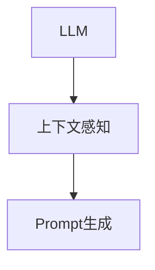
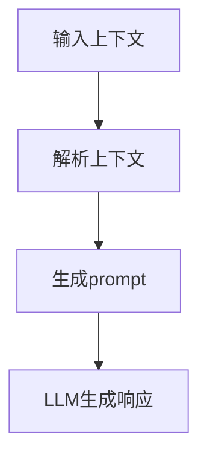
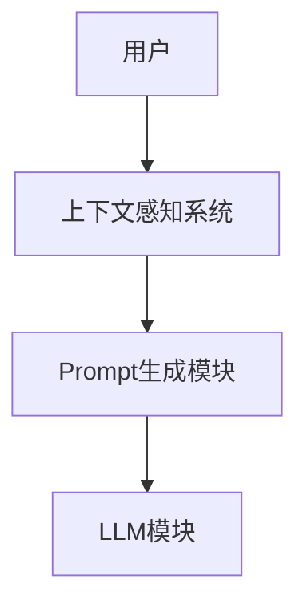
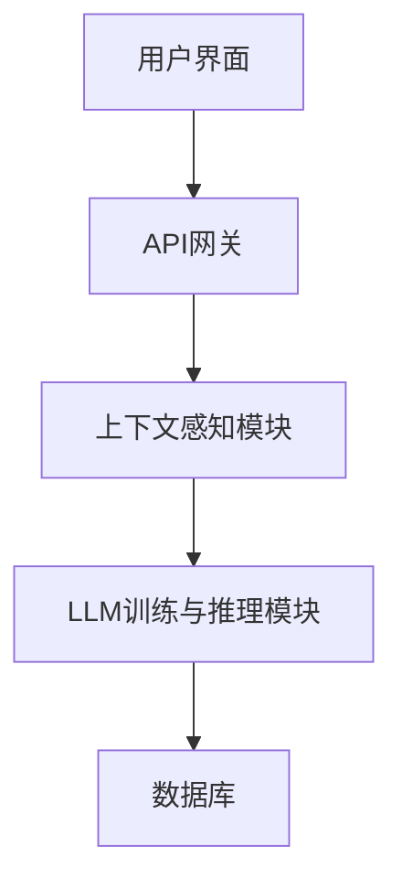
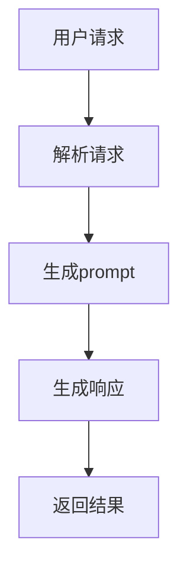

                 

### 上下文感知prompt生成：提升LLM理解力

#### 关键词

- 上下文感知
- Prompt生成
- LLM理解力
- 算法原理
- 系统架构
- 项目实战

#### 摘要

本文旨在探讨上下文感知prompt生成技术，以提升语言模型（LLM）的理解力。通过详细介绍上下文感知的重要性、问题背景、核心概念、算法原理、系统架构以及项目实战，本文将系统性地阐述如何通过上下文感知prompt生成来提升LLM的理解能力和应用效果。文章最后还将总结最佳实践与未来展望，为读者提供全面的指导和建议。

### 目录大纲

# 上下文感知prompt生成：提升LLM理解力

## 第一部分：背景介绍

## 1.1 问题背景
### 1.1.1 语言模型的发展历程
### 1.1.2 上下文感知的重要性
### 1.1.3 当前LLM理解的挑战

## 1.2 问题描述
### 1.2.1 什么是上下文感知
### 1.2.2 提升LLM理解力的必要性
### 1.2.3 上下文感知prompt生成的目标

## 1.3 问题解决
### 1.3.1 提升LLM理解的策略
### 1.3.2 上下文感知prompt生成的方法

## 1.4 边界与外延
### 1.4.1 上下文感知的范围
### 1.4.2 prompt生成在不同应用场景的差异

## 1.5 概念结构与核心要素组成
### 1.5.1 关键概念
### 1.5.2 核心要素
### 1.5.3 上下文感知prompt生成的流程

## 1.6 本章小结

## 第二部分：核心概念与联系

## 2.1 核心概念原理
### 2.1.1 语言模型的工作原理
### 2.1.2 上下文感知的概念解析
### 2.1.3 Prompt生成的技术框架

## 2.2 概念属性特征对比表格
| 概念       | 特征1 | 特征2 | 特征3 |
|------------|-------|-------|-------|
| 语言模型   | A     | B     | C     |
| 上下文感知 | D     | E     | F     |
| Prompt生成 | G     | H     | I     |

## 2.3 ER实体关系图架构

## 2.4 本章小结

## 第三部分：算法原理讲解

## 3.1 算法原理
### 3.1.1 上下文感知prompt生成算法
### 3.1.2 算法mermaid流程图

## 3.2 数学模型和公式
### 3.2.1 数学模型概述
### 3.2.2 模型公式
$$
P(x|\theta) = \frac{P(\theta|x)P(x)}{P(\theta)}
$$

## 3.3 详细讲解与举例
### 3.3.1 数学公式解释
### 3.3.2 实例演示
### 3.3.3 算法优缺点分析

## 3.4 本章小结

## 第四部分：系统分析与架构设计

## 4.1 问题场景介绍
### 4.1.1 应用场景概述
### 4.1.2 系统目标

## 4.2 系统功能设计
### 4.2.1 领域模型

## 4.3 系统架构设计
### 4.3.1 架构概述
### 4.3.2 系统架构图

## 4.4 系统接口设计
### 4.4.1 接口定义
### 4.4.2 接口交互流程

## 4.5 系统交互
### 4.5.1 系统交互序列图

## 4.6 本章小结

## 第五部分：项目实战

## 5.1 环境安装
### 5.1.1 环境准备
### 5.1.2 工具安装

## 5.2 系统核心实现
### 5.2.1 代码实现
### 5.2.2 代码解读与分析

## 5.3 实际案例分析与讲解
### 5.3.1 案例背景
### 5.3.2 案例分析
### 5.3.3 深入讲解

## 5.4 项目小结
### 5.4.1 项目成果
### 5.4.2 经验与教训

## 5.5 本章小结

## 第六部分：最佳实践与拓展

## 6.1 最佳实践
### 6.1.1 实践技巧
### 6.1.2 注意事项

## 6.2 小结
### 6.2.1 主要内容回顾
### 6.2.2 对未来的展望

## 6.3 参考文献

## 作者简介

### 第一部分：背景介绍

#### 1.1 问题背景

在当今信息爆炸的时代，人工智能（AI）技术已成为推动社会进步的重要力量。作为AI领域的重要组成部分，语言模型（Language Model，简称LLM）在自然语言处理（Natural Language Processing，简称NLP）领域发挥了关键作用。LLM能够理解和生成人类语言，使得机器具备了一定的智能交互能力。

然而，尽管LLM在许多应用场景中表现出色，但其理解力仍然存在一定的局限性。一个主要问题在于，传统的LLM往往依赖于固定的上下文窗口，这限制了模型对上下文信息的捕捉和处理能力。为了解决这一问题，上下文感知prompt生成技术应运而生，旨在提升LLM的理解力，使其能够更准确地理解和响应复杂的问题。

#### 1.1.1 语言模型的发展历程

语言模型的发展历程可以追溯到20世纪50年代，当时主要采用规则驱动的语法分析方法。这种方法依赖于人工编写的语法规则，尽管在处理一些简单的语言结构方面取得了成功，但在处理复杂语言现象时显得力不从心。

随着计算能力的提升和机器学习技术的突破，20世纪80年代后期，统计语言模型开始崭露头角。这些模型基于大量文本数据，通过统计方法学习词汇之间的概率关系，从而生成语言。其中，n-gram模型是最早的统计语言模型之一，它通过计算单词序列的概率来生成语言。

进入21世纪，深度学习技术的兴起为语言模型带来了新的突破。基于神经网络的语言模型，如递归神经网络（RNN）、长短期记忆网络（LSTM）和Transformer模型，使得LLM在语言理解和生成方面取得了显著进展。特别是Transformer模型的出现，彻底改变了语言模型的架构，使得LLM在许多NLP任务中达到了前所未有的性能水平。

#### 1.1.2 上下文感知的重要性

上下文感知（Context Awareness）是指系统能够理解和利用当前环境中的相关信息，以更好地完成任务。在自然语言处理领域，上下文感知尤为重要，因为语言具有很强的上下文依赖性。例如，同一个词汇在不同的上下文中可能有完全不同的含义。

传统的LLM通常依赖于固定的上下文窗口，这意味着模型只能看到一定范围内的文本信息。然而，现实世界中的问题往往需要更广泛的上下文信息才能得到准确的答案。例如，一个简单的问答场景中，问题本身可能只包含了有限的信息，而要给出准确的回答，需要结合问题所处的上下文环境，如对话历史、用户背景等。

因此，上下文感知对于提升LLM的理解力至关重要。通过引入上下文感知技术，LLM能够更好地捕捉和理解问题背景，从而提高其响应的准确性和鲁棒性。

#### 1.1.3 当前LLM理解的挑战

尽管LLM在语言理解和生成方面取得了显著进展，但其在实际应用中仍面临一些挑战，尤其是在理解复杂、抽象的文本信息方面。

1. 上下文捕捉不足：传统的LLM通常依赖于固定的上下文窗口，这限制了模型对上下文信息的捕捉和处理能力。在某些情况下，模型可能会忽略关键上下文信息，导致理解偏差。

2. 鲁棒性不足：LLM在处理模糊、歧义或不完整的信息时，容易出现错误。例如，一个简单的语句“我在图书馆”，在不同的上下文中可能有不同的含义，但传统的LLM可能无法准确判断。

3. 语义理解困难：自然语言中存在大量的隐喻、双关语和修辞手法，这给LLM的语义理解带来了很大挑战。尽管深度学习模型在处理语义关系方面有所进步，但仍难以完全理解和解释复杂的语言现象。

4. 对话连贯性：在对话系统中，保持对话的连贯性是一个关键挑战。LLM需要理解对话上下文，并根据上下文生成合理的回复。然而，当前模型在处理长对话历史和复杂对话逻辑时，仍然存在一定困难。

为了解决上述挑战，研究者们提出了上下文感知prompt生成技术，旨在通过更精细地捕捉和处理上下文信息，提升LLM的理解力和应用效果。

#### 1.2 问题描述

**什么是上下文感知？**

上下文感知是指系统在执行任务时能够理解和利用当前环境中的相关信息，以更好地完成任务。在自然语言处理领域，上下文感知尤为重要，因为语言具有很强的上下文依赖性。上下文感知的核心在于捕捉和处理与当前任务相关的上下文信息，从而提高系统的理解和生成能力。

例如，在一个问答系统中，上下文感知意味着系统能够理解问题的背景信息，如对话历史、用户偏好等，从而生成更准确的回答。另一个例子是在文本生成任务中，上下文感知可以帮助模型生成更连贯、更自然的文本。

**提升LLM理解力的必要性**

提升LLM理解力具有重要意义，主要体现在以下几个方面：

1. **提高任务性能**：通过提升LLM的理解力，可以在各种NLP任务中实现更好的性能，如问答、翻译、文本生成等。

2. **增强应用鲁棒性**：提升LLM对上下文信息的捕捉和处理能力，可以使其在处理模糊、歧义或不完整的信息时更加稳健，从而减少错误率。

3. **改善用户体验**：在对话系统等应用场景中，提升LLM的理解力可以使其更好地理解用户意图，生成更合理、更自然的回复，从而提升用户体验。

4. **拓宽应用范围**：通过提升LLM的理解力，可以使其在更广泛的场景中发挥作用，如复杂问答系统、智能客服、文本分析等。

**上下文感知prompt生成的目标**

上下文感知prompt生成旨在通过更精细地捕捉和处理上下文信息，提升LLM的理解力和应用效果。其目标包括：

1. **捕捉关键上下文信息**：通过设计有效的prompt，确保LLM能够捕捉到与任务相关的关键上下文信息，从而提高理解准确性。

2. **增强上下文表示能力**：通过引入上下文感知机制，使LLM能够更好地理解和表示上下文信息，从而在生成文本时更加连贯、自然。

3. **优化生成效果**：通过调整prompt的生成策略，提高LLM生成文本的质量，如减少错误率、增强连贯性等。

4. **适应不同应用场景**：设计灵活的上下文感知prompt生成方法，使其能够适应不同应用场景的需求，如问答系统、文本生成等。

**1.3 问题解决**

**提升LLM理解的策略**

提升LLM理解力的策略主要包括以下几个方面：

1. **扩展上下文窗口**：通过扩展LLM的上下文窗口，使其能够捕捉到更广泛的上下文信息，从而提高理解能力。

2. **引入外部知识**：将外部知识库（如百科全书、知识图谱等）融入LLM，使其能够利用外部知识辅助理解。

3. **增强语义理解**：通过改进LLM的语义理解能力，如引入注意力机制、多模态学习等，使其能够更好地理解语义关系。

4. **训练数据增强**：利用数据增强技术，如数据扩充、数据清洗等，提高训练数据的质量和多样性，从而提升LLM的理解能力。

**上下文感知prompt生成的方法**

上下文感知prompt生成的方法主要包括以下几种：

1. **基于规则的方法**：通过设计规则，将上下文信息嵌入到prompt中。这种方法简单直观，但难以应对复杂和动态的上下文场景。

2. **基于数据驱动的方法**：利用大规模预训练语言模型，通过优化prompt生成策略，使其能够捕捉关键上下文信息。这种方法具有较好的适应性和泛化能力。

3. **基于强化学习的方法**：通过强化学习，训练模型在特定任务中生成最优的prompt，以提升LLM的理解力和生成效果。

4. **多模态上下文感知**：结合不同模态的信息（如文本、图像、语音等），构建多模态上下文感知prompt生成方法，以提升LLM的理解能力。

**1.4 边界与外延**

**上下文感知的范围**

上下文感知的范围取决于具体应用场景和任务需求。在自然语言处理领域，常见的上下文范围包括：

1. **局部上下文**：指与当前任务直接相关的上下文信息，如问题、回答、对话历史等。

2. **全局上下文**：指与当前任务间接相关的上下文信息，如领域知识、用户偏好、背景信息等。

3. **动态上下文**：指在任务执行过程中不断变化和更新的上下文信息，如对话中的实时反馈、环境变化等。

**prompt生成在不同应用场景的差异**

不同的应用场景对上下文感知和prompt生成有不同要求，主要差异体现在以下几个方面：

1. **问答系统**：在问答系统中，上下文感知和prompt生成需要重点关注问题的背景信息、用户意图等，以确保生成准确的回答。

2. **文本生成**：在文本生成任务中，上下文感知和prompt生成需要关注文本连贯性、语义一致性等，以确保生成自然的文本。

3. **对话系统**：在对话系统中，上下文感知和prompt生成需要关注对话历史、用户情绪等，以确保对话的连贯性和用户满意度。

**1.5 概念结构与核心要素组成**

**关键概念**

1. **上下文感知**：指系统在执行任务时能够理解和利用当前环境中的相关信息，以更好地完成任务。

2. **prompt生成**：指设计方法，用于生成与任务相关的上下文信息，以提高LLM的理解力和生成效果。

3. **语言模型（LLM）**：指基于深度学习技术的自然语言处理模型，能够理解和生成人类语言。

**核心要素**

1. **上下文信息**：指与任务相关的环境信息，如问题、回答、对话历史等。

2. **prompt结构**：指用于嵌入上下文信息的prompt的组成结构。

3. **生成策略**：指用于生成prompt的算法和优化方法。

**上下文感知prompt生成的流程**

1. **上下文信息提取**：从任务相关的数据源中提取关键上下文信息。

2. **prompt设计**：根据上下文信息设计prompt，确保关键信息得到有效嵌入。

3. **prompt优化**：通过优化策略，调整prompt的结构和内容，以提高生成效果。

4. **LLM响应**：利用LLM生成响应文本，并根据上下文信息进行反馈调整。

**1.6 本章小结**

本部分介绍了上下文感知prompt生成技术的背景、问题背景、问题描述、问题解决策略以及边界与外延。通过理解上下文感知的重要性、当前LLM理解的挑战以及上下文感知prompt生成的目标，读者可以初步了解这一领域的基本概念和关键要素。接下来，本文将深入探讨核心概念与联系，为后续的算法原理讲解和系统架构设计打下基础。

## 第二部分：核心概念与联系

### 2.1 核心概念原理

在深入探讨上下文感知prompt生成技术之前，我们需要明确几个核心概念，包括语言模型的工作原理、上下文感知的概念解析以及prompt生成的技术框架。

#### 2.1.1 语言模型的工作原理

语言模型（LLM）是自然语言处理（NLP）的核心组成部分，用于预测文本序列的概率分布。LLM通过学习大量语言数据，建立词汇之间的概率关系，从而实现文本生成、翻译、问答等任务。

1. **基于统计的方法**：早期的语言模型，如n-gram模型，通过计算相邻词汇的概率来生成文本。例如，给定前一个单词，模型会预测下一个单词的概率。

2. **基于神经网

