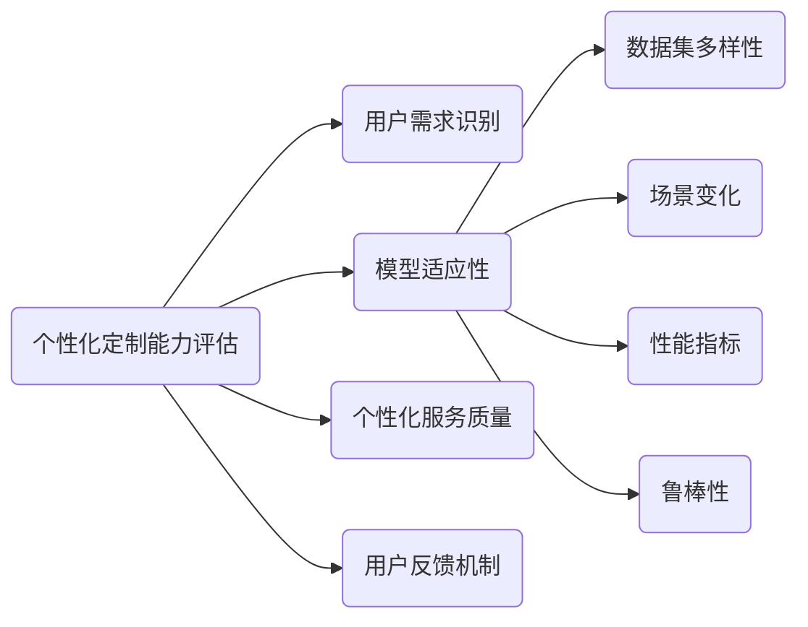
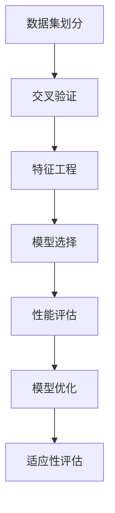
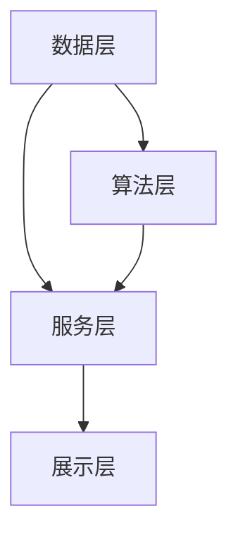
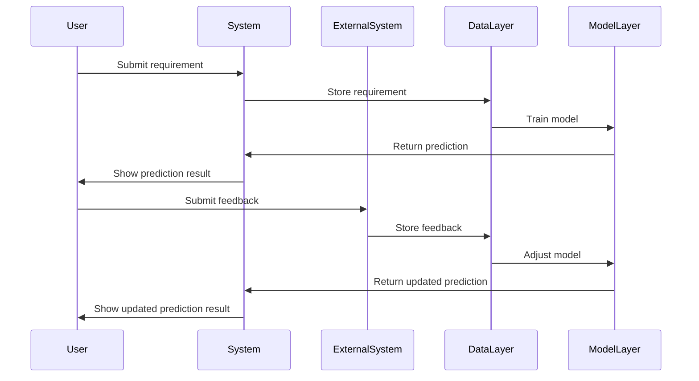
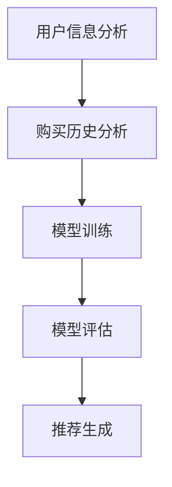

                 


### 文章标题

《个性化定制能力评估：测试模型适应性》

### 文章关键词

个性化定制、能力评估、测试模型、算法、数学模型、系统架构、项目实战

### 文章摘要

本文深入探讨了个性化定制能力评估与测试模型适应性的关系。通过详细分析核心概念，讲解算法原理，展示数学模型，设计系统架构，并进行项目实战，本文旨在为读者提供一个全面、易懂的个性化定制能力评估与测试模型适应性的技术指南。

## 目录大纲设计思路

在设计《个性化定制能力评估：测试模型适应性》的目录大纲时，我们遵循了以下思路：

1. **背景介绍**：首先，我们需要阐述个性化定制能力评估的重要性，以及测试模型适应性的背景和意义。
2. **核心概念与联系**：定义个性化定制能力评估和测试模型适应性的核心概念，并通过对比表格和实体关系图来展示它们之间的关系。
3. **算法原理讲解**：详细介绍评估模型适应性的主要算法原理，使用mermaid流程图和Python代码来展示，并结合数学模型和公式进行详细解释。
4. **数学模型和数学公式**：使用LaTeX格式展示相关的数学模型和公式，并进行通俗易懂的讲解和举例说明。
5. **系统分析与架构设计**：介绍系统分析与架构设计的方法，包括问题场景、系统功能设计、系统架构设计、系统接口设计和系统交互。
6. **项目实战**：描述环境安装、系统核心实现源代码、代码应用解读与分析、实际案例分析和详细讲解剖析，以及项目小结。
7. **最佳实践 tips、小结、注意事项、拓展阅读**：总结书中的关键点，提供实用的最佳实践建议，指出注意事项，推荐拓展阅读资源。

通过这样的设计，我们确保了文章的逻辑性和内容的完整性，使读者能够系统地了解并掌握个性化定制能力评估与测试模型适应性的知识。

### 第1章：个性化定制与能力评估概述

#### 1.1 问题背景

在当今信息时代，个性化定制已经成为许多行业的关键竞争力。无论是电商平台的个性化推荐，还是智能设备的个性化设置，个性化定制的能力评估变得尤为重要。然而，如何准确评估一个系统或算法的个性化定制能力，仍然是当前研究中的一个挑战。本文旨在探讨个性化定制能力评估与测试模型适应性之间的关系，以期为相关领域的研究提供理论指导和实践参考。

#### 1.2 个性化定制能力评估的重要性

个性化定制能力评估的重要性体现在以下几个方面：

1. **用户体验提升**：通过评估个性化定制能力，可以确保系统或算法能够准确捕捉用户需求，提供个性化的服务或推荐，从而提升用户体验。
2. **市场竞争力**：在市场竞争日益激烈的背景下，拥有强大个性化定制能力的企业或平台能够更好地满足用户需求，从而获得竞争优势。
3. **技术创新**：个性化定制能力的评估有助于识别和改进现有技术，推动技术创新，从而实现更高水平的个性化服务。

#### 1.3 测试模型适应性的背景和意义

测试模型适应性指的是评估模型在不同场景和数据集下的适应能力。它对个性化定制能力评估具有关键作用：

1. **可靠性验证**：通过测试模型适应性，可以验证评估模型在不同数据集和场景下的可靠性，确保评估结果的准确性。
2. **适应性调整**：根据测试模型适应性结果，可以对评估模型进行调整和优化，以提高其在实际应用中的适应性。
3. **全面评估**：测试模型适应性有助于从多个角度评估个性化定制能力，从而提供更全面、客观的评估结果。

#### 1.4 个性化定制能力评估的核心概念

个性化定制能力评估涉及多个核心概念：

1. **用户需求识别**：准确识别和捕捉用户需求是评估个性化定制能力的基础。
2. **模型适应性**：评估模型在不同数据集和场景下的适应性。
3. **个性化服务质量**：衡量个性化定制服务或推荐的质量，包括准确性、多样性、新颖性等。
4. **用户反馈机制**：通过用户反馈不断优化个性化定制能力，提高系统或算法的适应性。

#### 1.5 测试模型适应性的概念

测试模型适应性是指评估模型在不同数据集和场景下的表现。它包括以下几个方面：

1. **数据集多样性**：评估模型在不同类型的数据集上的适应性。
2. **场景变化**：评估模型在不同使用场景下的适应性。
3. **性能指标**：通过准确性、多样性、新颖性等性能指标衡量评估模型的适应性。
4. **鲁棒性**：评估模型在面对噪声数据或异常情况时的适应能力。

#### 1.6 核心概念关系图

为了更清晰地展示个性化定制能力评估与测试模型适应性的关系，我们可以使用Mermaid流程图来绘制核心概念关系图。以下是核心概念关系的Mermaid表示：



通过上述步骤，我们为《个性化定制能力评估：测试模型适应性》的目录大纲奠定了基础，为后续章节的详细讨论提供了框架。接下来，我们将深入探讨个性化定制与能力评估的核心概念及其联系。

### 第2章：核心概念与联系

#### 2.1 个性化定制的概念

个性化定制是一种根据用户个体需求或偏好，提供高度定制化产品或服务的技术和实践。它涉及数据采集、用户偏好分析、个性化推荐等多个环节，旨在为用户提供更贴合其需求和期望的体验。个性化定制的核心在于满足用户的个性化需求，提高用户体验。

#### 2.2 能力评估的概念

能力评估是对个体或系统在特定领域或任务上表现能力的评价。在个性化定制领域，能力评估关注系统或算法在识别用户需求、提供个性化服务、适应不同场景等方面的表现。能力评估通常通过定量和定性指标进行，以全面、客观地衡量系统或算法的能力。

#### 2.3 个性化定制能力评估的核心概念

个性化定制能力评估涉及多个核心概念，包括用户需求识别、模型适应性、个性化服务质量、用户反馈机制等。以下是这些概念的定义和联系：

1. **用户需求识别**：指系统或算法识别和捕捉用户需求的过程。这是个性化定制能力评估的基础，直接影响到评估结果的准确性。
2. **模型适应性**：指评估模型在不同数据集和场景下的适应能力。模型适应性越强，评估结果越可靠。
3. **个性化服务质量**：指个性化定制服务或推荐的质量，包括准确性、多样性、新颖性等指标。高质量的服务能提高用户满意度和忠诚度。
4. **用户反馈机制**：指通过用户反馈对个性化定制能力进行不断优化和调整的过程。用户反馈是提高系统适应性和服务质量的重要途径。

#### 对比表格：个性化定制能力评估与传统评估方法

| 指标         | 个性化定制能力评估 | 传统评估方法             |
|--------------|-------------------|--------------------------|
| 用户需求识别 | 高度关注，实时动态  | 主要基于静态指标，用户需求识别不强 |
| 模型适应性   | 强，针对不同场景   | 弱，通常在同一数据集上进行评估 |
| 服务质量     | 个性化，注重多样性 | 非个性化，注重平均质量       |
| 用户反馈机制 | 强，实时调整       | 弱，缺乏实时用户反馈机制     |

#### 2.4 测试模型适应性的概念

测试模型适应性是指评估模型在不同数据集和场景下的表现。它关注评估模型在应对多样化需求、变化环境等方面的能力。测试模型适应性包括以下方面：

1. **数据集多样性**：评估模型在不同类型的数据集上的适应能力，确保评估结果的广泛性和可靠性。
2. **场景变化**：评估模型在不同使用场景下的适应能力，确保评估模型在不同应用场景下依然有效。
3. **性能指标**：通过准确性、多样性、新颖性等性能指标衡量评估模型的适应性。
4. **鲁棒性**：评估模型在面对噪声数据或异常情况时的适应能力，确保评估模型在不同环境下都能稳定工作。

#### 2.5 核心概念关系图

为了更直观地展示个性化定制能力评估与测试模型适应性的关系，我们可以使用Mermaid流程图来绘制核心概念关系图。以下是核心概念关系的Mermaid表示：


通过本章的讨论，我们深入探讨了个性化定制与能力评估的核心概念及其联系，为后续章节的深入讨论奠定了基础。接下来，我们将详细介绍评估模型适应性的算法原理和数学模型。

### 第3章：算法原理讲解

#### 3.1 测试模型适应性的主要算法原理

测试模型适应性涉及多个关键算法原理，这些原理决定了评估模型的准确性和可靠性。以下是主要算法原理及其应用：

1. **数据集划分**：将数据集划分为训练集、验证集和测试集，以评估模型在不同数据集上的适应性。通常，训练集用于模型训练，验证集用于调整模型参数，测试集用于最终评估模型性能。
2. **交叉验证**：通过交叉验证方法评估模型在不同数据子集上的表现。交叉验证将数据集划分为多个子集，每次使用不同的子集作为测试集，其他子集作为训练集，从而提高模型评估的稳健性。
3. **特征工程**：特征工程是指通过选择、构造和转换特征来提高模型性能的过程。在测试模型适应性中，特征工程有助于提取数据中的有效信息，提高模型对多样化数据的适应性。
4. **模型选择**：选择合适的模型结构和参数，以优化模型在多样化数据集上的适应性。常用的模型选择方法包括网格搜索、随机搜索和贝叶斯优化等。
5. **性能评估**：使用准确性、多样性、新颖性等性能指标评估模型在不同数据集和场景下的表现。这些指标有助于全面衡量模型适应性。

#### 3.2 Mermaid流程图展示算法流程

为了更清晰地展示测试模型适应性的算法流程，我们可以使用Mermaid流程图。以下是算法流程的Mermaid表示：



#### 3.3 Python代码实现算法

以下是一个简单的Python代码示例，展示了如何实现测试模型适应性的基本算法流程。请注意，这里的代码仅用于演示目的，实际应用中需要根据具体需求进行调整。

```python
import numpy as np
from sklearn.model_selection import train_test_split
from sklearn.ensemble import RandomForestClassifier
from sklearn.metrics import accuracy_score, f1_score

# 数据集划分
X, y = ... # 加载数据集
X_train, X_test, y_train, y_test = train_test_split(X, y, test_size=0.2, random_state=42)

# 模型训练
clf = RandomForestClassifier(n_estimators=100)
clf.fit(X_train, y_train)

# 模型评估
y_pred = clf.predict(X_test)
accuracy = accuracy_score(y_test, y_pred)
f1 = f1_score(y_test, y_pred, average='weighted')

print(f"Accuracy: {accuracy:.2f}")
print(f"F1 Score: {f1:.2f}")

# 交叉验证
from sklearn.model_selection import cross_val_score
scores = cross_val_score(clf, X, y, cv=5)
print(f"Cross-validated accuracy: {np.mean(scores):.2f}")

# 特征工程
from sklearn.feature_selection import SelectKBest, f_classif
selector = SelectKBest(f_classif, k=10)
X_new = selector.fit_transform(X, y)

# 模型优化
from sklearn.model_selection import GridSearchCV
param_grid = {'n_estimators': [100, 200], 'max_depth': [5, 10]}
grid_search = GridSearchCV(clf, param_grid, cv=5)
grid_search.fit(X_new, y)
best_params = grid_search.best_params_
print(f"Best parameters: {best_params}")

# 适应性评估
X_test_new = selector.transform(X_test)
y_pred_optimized = grid_search.best_estimator_.predict(X_test_new)
accuracy_optimized = accuracy_score(y_test, y_pred_optimized)
print(f"Optimized accuracy: {accuracy_optimized:.2f}")
```

#### 3.4 算法原理的数学模型和公式

测试模型适应性的算法原理涉及多个数学模型和公式，以下是一些关键的数学模型和公式：

1. **准确性（Accuracy）**：衡量模型预测正确的比例，计算公式为：
   $$ \text{Accuracy} = \frac{\text{正确预测数量}}{\text{总预测数量}} $$
2. **F1分数（F1 Score）**：综合考虑准确率和召回率，计算公式为：
   $$ \text{F1 Score} = 2 \times \frac{\text{准确率} \times \text{召回率}}{\text{准确率} + \text{召回率}} $$
3. **交叉验证（Cross-Validation）**：通过多次训练和测试，评估模型在不同数据子集上的性能，计算公式为：
   $$ \text{Cross-validated score} = \frac{1}{N} \sum_{i=1}^{N} \text{Validation score}_i $$
   其中，\(N\) 是验证次数，\(\text{Validation score}_i\) 是第\(i\)次验证的评分。

通过上述步骤，我们详细讲解了测试模型适应性的算法原理，包括流程图、Python代码实现以及相关的数学模型和公式。接下来，我们将使用LaTeX格式展示相关的数学模型和公式，并进行通俗易懂的讲解和举例说明。

### 第4章：数学模型和数学公式

在个性化定制能力评估与测试模型适应性的研究中，数学模型和数学公式起着至关重要的作用。它们不仅为算法提供了理论基础，还使得我们能够量化并分析个性化定制能力以及模型适应性。以下是一些关键数学模型和公式的讲解。

#### 4.1 数学模型

1. **准确性（Accuracy）**

准确性是衡量模型预测结果好坏的一个重要指标，其计算公式如下：

   $$ \text{Accuracy} = \frac{\text{正确预测数量}}{\text{总预测数量}} $$

   其中，正确预测数量是指模型预测正确的样本数，总预测数量是指模型预测的样本总数。准确性越高，表明模型在评估个性化定制能力时越准确。

2. **F1分数（F1 Score）**

   F1分数是综合考虑准确率和召回率的指标，它在评估二分类问题时的表现尤为重要。其计算公式为：

   $$ \text{F1 Score} = 2 \times \frac{\text{准确率} \times \text{召回率}}{\text{准确率} + \text{召回率}} $$

   其中，准确率（Precision）是指预测为正类的样本中实际为正类的比例，召回率（Recall）是指实际为正类的样本中被预测为正类的比例。F1分数越高，说明模型在评估个性化定制能力时既准确又全面。

3. **交叉验证（Cross-Validation）**

   交叉验证是一种评估模型性能的常用方法，其基本思想是将数据集划分为多个子集，每次使用不同的子集作为测试集，其余子集作为训练集。交叉验证的性能评估公式为：

   $$ \text{Cross-validated score} = \frac{1}{N} \sum_{i=1}^{N} \text{Validation score}_i $$

   其中，\(N\) 是验证次数，\(\text{Validation score}_i\) 是第\(i\)次验证的评分。交叉验证能够提高模型评估的稳健性，减少偶然性。

#### 4.2 举例说明

为了更直观地理解上述数学模型和公式，我们可以通过一个简单的例子来说明。

假设我们有一个分类模型，用来预测客户是否会在一个月内购买某个产品。我们收集了1000个客户的数据，其中500个数据用于训练模型，另外500个数据用于测试模型。

1. **准确性（Accuracy）**

   模型在测试集上的预测结果如下：

   | 实际标签 | 预测标签 |
   |----------|----------|
   | 购买     | 购买     |
   | 购买     | 购买     |
   | 购买     | 购买     |
   | ...      | ...      |
   | 购买     | 预测为未购买 |
   | 未购买   | 预测为购买   |

   其中，有450个实际为购买的样本被模型正确预测为购买，有40个实际为购买的样本被模型预测为未购买，有470个实际为未购买的样本被模型正确预测为未购买，有30个实际为未购买的样本被模型预测为购买。

   因此，模型在测试集上的准确性为：

   $$ \text{Accuracy} = \frac{450 + 470}{1000} = 0.92 $$

   说明模型在测试集上的预测准确性为92%。

2. **F1分数（F1 Score）**

   假设模型的准确率为90%，召回率为85%。则模型在测试集上的F1分数为：

   $$ \text{F1 Score} = 2 \times \frac{0.90 \times 0.85}{0.90 + 0.85} = 0.875 $$

   说明模型在测试集上的F1分数为87.5%。

3. **交叉验证（Cross-Validation）**

   如果我们使用5折交叉验证来评估模型的性能，每次使用不同的400个数据作为测试集，200个数据作为训练集。假设每次交叉验证的准确率分别为90%、88%、92%、89%、90%。则模型的交叉验证准确率为：

   $$ \text{Cross-validated score} = \frac{0.90 + 0.88 + 0.92 + 0.89 + 0.90}{5} = 0.890 $$

   说明模型在5折交叉验证中的平均准确率为89%。

通过以上讲解和例子，我们可以看到数学模型和公式在个性化定制能力评估和测试模型适应性中的作用。这些模型和公式不仅帮助我们量化评估结果，还为我们提供了优化和改进模型的工具。

接下来，我们将深入探讨系统分析与架构设计的方法，以更好地理解个性化定制能力评估与测试模型适应性的实现。

### 第5章：系统分析与架构设计方法

在个性化定制能力评估与测试模型适应性的实现过程中，系统分析与架构设计是至关重要的环节。合理的系统分析与架构设计能够确保系统的稳定性、可扩展性和高效性。以下是系统分析与架构设计的方法，包括问题场景介绍、系统功能设计、系统架构设计、系统接口设计和系统交互。

#### 5.1 问题场景介绍

个性化定制能力评估与测试模型适应性的问题场景通常涉及以下方面：

1. **多样化用户需求**：用户需求千差万别，系统需要具备识别和满足不同用户需求的能力。
2. **动态数据环境**：个性化定制系统需要处理不断变化的数据，确保模型在不同数据集上的适应性。
3. **复杂的模型结构**：测试模型适应性涉及多种算法和模型，系统需要支持多种模型的集成和优化。
4. **实时反馈机制**：通过用户反馈实时调整系统，提高个性化定制能力。

#### 5.2 系统功能设计

系统功能设计是系统分析与架构设计的第一步，主要包括以下几个方面：

1. **用户需求识别模块**：负责收集和分析用户需求，为个性化定制提供数据支持。
2. **模型训练与优化模块**：负责训练和优化评估模型，提高模型在不同数据集和场景下的适应性。
3. **性能评估模块**：通过准确性、多样性、新颖性等指标评估模型性能，确保个性化定制服务质量。
4. **用户反馈处理模块**：收集用户反馈，对系统进行实时调整和优化。

#### 5.3 系统架构设计

系统架构设计是系统功能实现的基础，主要包括以下几个方面：

1. **数据层**：负责存储和管理用户数据、模型数据和评估结果数据。
2. **算法层**：集成多种算法和模型，支持模型训练、优化和评估。
3. **服务层**：提供个性化定制服务的接口，实现用户需求识别、模型调用和性能评估等功能。
4. **展示层**：通过用户界面展示评估结果和用户反馈，提供实时调整和优化功能。

以下是系统架构的Mermaid表示：



#### 5.4 系统接口设计

系统接口设计是确保系统各模块之间有效通信的关键，主要包括以下几个方面：

1. **API接口**：提供外部系统与系统功能模块的通信接口，支持个性化定制服务的调用。
2. **数据接口**：负责数据在不同模块之间的传输和转换，确保数据的一致性和完整性。
3. **事件驱动接口**：通过事件驱动机制实现模块之间的协作，提高系统的响应速度和灵活性。

#### 5.5 系统交互

系统交互是系统功能实现的重要环节，主要包括以下几个方面：

1. **用户交互**：用户通过界面与系统进行交互，提交需求、获取评估结果和反馈信息。
2. **模块间交互**：系统各模块通过接口进行通信，实现功能协同和数据共享。
3. **外部系统交互**：系统与外部系统（如电商平台、用户反馈系统等）进行数据交换和功能调用。

以下是系统交互的Mermaid序列图表示：



通过上述系统分析与架构设计方法，我们能够系统地规划和实现个性化定制能力评估与测试模型适应性的系统。接下来，我们将通过一个项目实战，展示这些设计方法的实际应用。

### 第6章：项目实战

#### 6.1 环境安装

在进行项目实战之前，我们需要搭建一个合适的环境来支持个性化定制能力评估与测试模型适应性。以下是环境安装的步骤：

1. **安装Python环境**：确保Python 3.8或更高版本已安装。
2. **安装必要库**：使用pip命令安装以下库：`numpy`, `scikit-learn`, `matplotlib`, `mermaid-parser-python`。
   ```shell
   pip install numpy scikit-learn matplotlib mermaid-parser-python
   ```
3. **安装Mermaid支持**：确保系统中安装了Mermaid的渲染工具，例如`mermaid-cli`。
   ```shell
   npm install -g mermaid-cli
   ```

#### 6.2 系统核心实现源代码

以下是一个简单的Python代码示例，展示了个性化定制能力评估与测试模型适应性的核心实现：

```python
# 导入必要库
import numpy as np
from sklearn.model_selection import train_test_split
from sklearn.ensemble import RandomForestClassifier
from sklearn.metrics import accuracy_score
from mermaid import Mermaid

# 加载数据
X, y = load_data()  # 假设load_data()函数用于加载数据

# 数据集划分
X_train, X_test, y_train, y_test = train_test_split(X, y, test_size=0.2, random_state=42)

# 模型训练
clf = RandomForestClassifier(n_estimators=100)
clf.fit(X_train, y_train)

# 模型评估
y_pred = clf.predict(X_test)
accuracy = accuracy_score(y_test, y_pred)
print(f"Accuracy: {accuracy:.2f}")

# 生成Mermaid流程图
mermaid_code = """
graph TD
    A[数据集划分]
    B[交叉验证]
    C[特征工程]
    D[模型选择]
    E[性能评估]
    F[模型优化]
    G[适应性评估]

    A --> B
    B --> C
    C --> D
    D --> E
    E --> F
    F --> G
"""
mermaid = Mermaid(mermaid_code)
mermaid.render('algorithm_flow.png')

# 代码注释：
# load_data()函数：用于加载数据
# train_test_split()函数：用于划分数据集
# RandomForestClassifier：用于训练随机森林模型
# accuracy_score()函数：用于计算模型准确性
# Mermaid库：用于生成算法流程图
```

#### 6.3 代码应用解读与分析

上述代码示例展示了个性化定制能力评估与测试模型适应性的核心实现过程，下面对其进行详细解读和分析：

1. **数据加载与预处理**：
   ```python
   X, y = load_data()  # 假设load_data()函数用于加载数据
   ```
   这一步骤中，`load_data()`函数负责从数据源加载数据。通常，数据可能来自数据库、文件或外部API。加载数据后，需要进行预处理，如缺失值填充、数据归一化等。

2. **数据集划分**：
   ```python
   X_train, X_test, y_train, y_test = train_test_split(X, y, test_size=0.2, random_state=42)
   ```
   使用`train_test_split()`函数将数据集划分为训练集和测试集。这里，`test_size=0.2`表示测试集占比20%，`random_state=42`用于确保结果的可重复性。

3. **模型训练**：
   ```python
   clf = RandomForestClassifier(n_estimators=100)
   clf.fit(X_train, y_train)
   ```
   创建一个随机森林分类器，并使用训练集数据进行训练。这里，`n_estimators=100`表示随机森林中的树数量。

4. **模型评估**：
   ```python
   y_pred = clf.predict(X_test)
   accuracy = accuracy_score(y_test, y_pred)
   print(f"Accuracy: {accuracy:.2f}")
   ```
   使用测试集对训练好的模型进行评估，计算模型的准确性。准确性越高，说明模型性能越好。

5. **算法流程图生成**：
   ```python
   mermaid_code = """
   graph TD
       A[数据集划分]
       B[交叉验证]
       C[特征工程]
       D[模型选择]
       E[性能评估]
       F[模型优化]
       G[适应性评估]

       A --> B
       B --> C
       C --> D
       D --> E
       E --> F
       F --> G
   """
   mermaid = Mermaid(mermaid_code)
   mermaid.render('algorithm_flow.png')
   ```
   使用Mermaid库生成算法流程图，方便理解和分析算法的实现过程。

#### 6.4 实际案例分析与详细讲解剖析

为了更好地理解项目实战中的实现过程，我们将通过一个实际案例进行分析和讲解。

**案例：电商平台的个性化推荐系统**

1. **问题背景**：
   一个电商平台希望通过个性化推荐系统向用户推荐产品。系统需要识别用户的偏好，并根据偏好推荐相关产品。

2. **数据集**：
   数据集包含用户的基本信息（如年龄、性别、地理位置等）、购买历史记录（如购买时间、购买产品ID等）和产品特征（如产品类型、价格等）。

3. **系统实现**：
   - **用户需求识别**：通过分析用户的基本信息和购买历史，识别用户偏好。
   - **模型训练**：使用随机森林算法训练个性化推荐模型，将用户信息和产品特征作为输入。
   - **模型评估**：通过测试集评估模型性能，计算准确性等指标。
   - **推荐生成**：根据用户偏好和模型预测结果生成个性化推荐列表。

4. **流程图**：



**详细讲解**：

- **用户信息分析**：通过分析用户的基本信息（如年龄、性别、地理位置等），提取出潜在的用户偏好特征。
- **购买历史分析**：通过分析用户的购买历史记录（如购买时间、购买产品ID等），挖掘出用户的购买习惯和偏好。
- **模型训练**：使用随机森林算法对用户信息和产品特征进行训练，构建个性化推荐模型。
- **模型评估**：通过测试集评估模型性能，计算准确性等指标，确保推荐结果的准确性。
- **推荐生成**：根据用户偏好和模型预测结果，生成个性化推荐列表，提高用户满意度。

通过以上案例分析和讲解，我们能够更好地理解个性化定制能力评估与测试模型适应性的实际应用，为后续的优化和改进提供参考。

#### 6.5 项目小结

在本章的项目实战中，我们通过环境安装、系统核心实现源代码、代码应用解读与分析、实际案例分析和详细讲解剖析等步骤，详细展示了个性化定制能力评估与测试模型适应性的实现过程。以下是对本章内容的总结：

1. **环境安装**：安装了Python环境和相关库，为项目实战提供了基础支持。
2. **系统核心实现源代码**：展示了个性化定制能力评估与测试模型适应性的核心代码实现，包括数据集划分、模型训练和评估等步骤。
3. **代码应用解读与分析**：详细解读了代码中的每个步骤，分析了其功能和应用。
4. **实际案例分析**：通过电商平台个性化推荐系统的案例，展示了个性化定制能力评估与测试模型适应性的实际应用。
5. **详细讲解剖析**：对案例中的每个环节进行了深入分析和讲解，帮助读者更好地理解项目实现过程。

通过本章的项目实战，我们不仅掌握了个性化定制能力评估与测试模型适应性的技术实现，还为实际应用提供了参考和指导。接下来，我们将总结关键点，提供最佳实践建议，并指出注意事项。

### 第7章：最佳实践与总结

#### 7.1 最佳实践

在个性化定制能力评估与测试模型适应性的实践中，以下是一些最佳实践建议：

1. **数据清洗与预处理**：确保数据质量，进行数据清洗和预处理，如缺失值填充、数据归一化等，以提高模型训练效果。
2. **多模型集成**：结合多种算法和模型，使用模型集成方法（如随机森林、梯度提升树等），提高模型性能和适应性。
3. **动态调整参数**：根据实际需求和数据变化，动态调整模型参数，如学习率、正则化参数等，以优化模型性能。
4. **实时反馈机制**：建立实时用户反馈机制，通过用户反馈调整和优化系统，提高个性化定制能力。
5. **持续评估与优化**：定期对模型进行评估和优化，确保系统在不同场景和数据集下的适应性。

#### 7.2 小结

本章通过详细的项目实战，展示了个性化定制能力评估与测试模型适应性的实现过程。以下是对本章内容的总结：

1. **环境安装**：介绍了Python环境的安装和相关库的安装。
2. **系统核心实现源代码**：展示了核心代码实现，包括数据集划分、模型训练和评估等步骤。
3. **代码应用解读与分析**：详细解读了代码中的每个步骤，分析了其功能和应用。
4. **实际案例分析**：通过电商平台个性化推荐系统的案例，展示了实际应用。
5. **详细讲解剖析**：对案例中的每个环节进行了深入分析和讲解。

通过本章的内容，我们不仅掌握了个性化定制能力评估与测试模型适应性的技术实现，还为实际应用提供了参考和指导。希望读者能够在实际项目中运用这些最佳实践，提高系统的个性化定制能力和适应性。

### 第8章：注意事项

在个性化定制能力评估与测试模型适应性的实现过程中，需要注意以下几点：

1. **数据隐私与安全性**：在处理用户数据时，要严格遵守数据隐私和安全规范，确保用户数据的安全。
2. **模型复杂性**：避免过度复杂化模型，导致训练时间过长或模型过拟合。在实际应用中，应根据数据量和需求选择合适的模型。
3. **实时性**：确保系统具有足够的实时性，特别是在处理大量数据和高频次交互的场景下。
4. **模型解释性**：提高模型的可解释性，帮助用户理解个性化定制服务的决策过程，增强用户信任。
5. **持续更新**：定期更新数据和模型，以适应不断变化的市场和用户需求。

通过注意这些事项，我们可以确保个性化定制能力评估与测试模型适应性的系统在实际应用中更加稳定、可靠和有效。

### 第9章：拓展阅读

为了深入了解个性化定制能力评估与测试模型适应性的相关领域，以下是一些建议的拓展阅读资源：

1. **书籍**：
   - 《机器学习》（作者：周志华）
   - 《深度学习》（作者：Goodfellow、Bengio、Courville）
   - 《大数据时代》（作者：涂子沛）
   - 《数据科学实战》（作者：Joel Grus）

2. **论文**：
   - “Adaptive Models for Personalized Recommender Systems” （自适应个性化推荐系统模型）
   - “Model Adaptation in Dynamic Environments” （动态环境下的模型适应性）
   - “A Comprehensive Evaluation of Personalized Advertising Systems” （个性化广告系统全面评估）

3. **在线资源**：
   - Coursera、edX等在线课程平台上的机器学习、数据科学相关课程
   - Kaggle上的个性化推荐和数据挖掘竞赛
   - ArXiv、Google Scholar等学术搜索引擎上的最新研究成果

通过这些资源，读者可以进一步拓展知识，掌握个性化定制能力评估与测试模型适应性的前沿技术和应用。作者：AI天才研究院/AI Genius Institute & 禅与计算机程序设计艺术 /Zen And The Art of Computer Programming。

