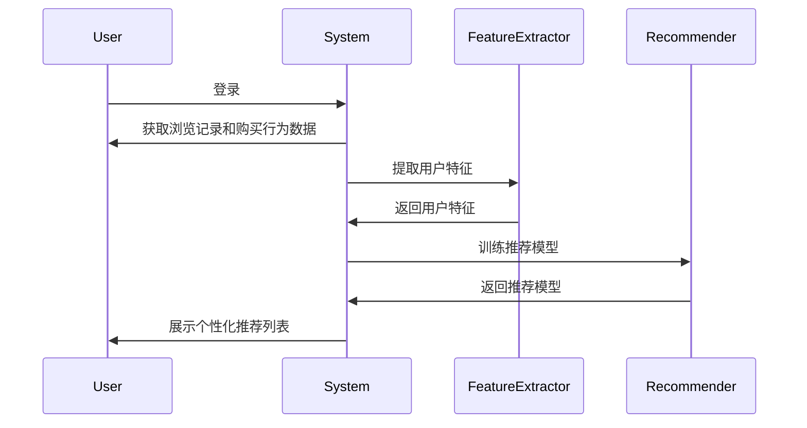

                 

## 个性化提示：根据用户特征定制

> 关键词：个性化提示、用户特征、定制、推荐系统、人工智能

> 摘要：本文将深入探讨个性化提示的概念、原理和应用。通过分析用户特征数据，我们将了解如何根据用户行为、偏好和背景信息定制个性化的提示。文章还将探讨实现个性化提示的技术方法和最佳实践，并通过实际案例展示其在不同领域的应用效果。

### 引言

个性化提示是一种根据用户特征进行定制的信息推送方式，旨在为用户提供更加精准和有价值的信息。在当今信息爆炸的时代，人们面临的信息过载问题愈发严重，如何从海量数据中提取出对用户有价值的提示成为一个重要课题。个性化提示不仅能够提高用户满意度，还能有效提升业务转化率和用户粘性。

本文旨在探讨个性化提示的定制策略，从用户特征数据入手，通过分析用户行为、偏好和背景信息，提出一种基于用户特征的个性化提示模型。文章将首先介绍个性化提示的基本概念和原理，然后分析用户特征数据，探讨如何利用这些数据实现个性化提示。接着，我们将介绍实现个性化提示的技术方法和最佳实践，并通过实际案例展示其应用效果。最后，文章将对个性化提示的未来发展趋势进行展望。

### 个性化提示的定义与价值

#### 定义

个性化提示（Personalized Prompt）是一种基于用户特征的数据推送技术，旨在为用户提供与其需求和兴趣高度相关的内容。它通过分析用户的个性化特征，如行为数据、偏好数据和背景信息等，生成个性化的信息推送内容。

#### 价值

个性化提示具有以下几方面的价值：

1. **提高用户满意度**：通过提供个性化的信息，满足用户的个性化需求，从而提升用户体验和满意度。
2. **提升业务转化率**：通过精准的个性化推荐，引导用户进行消费或参与特定活动，提高业务转化率。
3. **增强用户粘性**：通过持续提供个性化的内容，增强用户对应用的依赖和忠诚度。
4. **降低运营成本**：通过自动化和智能化的个性化推送，降低运营成本和人力资源投入。

### 个性化提示的发展历程

个性化提示的发展历程可以分为以下几个阶段：

1. **基于内容的推荐**：早期个性化提示主要基于内容的相似性进行推荐，如基于用户浏览历史和收藏记录推荐相似的内容。
2. **协同过滤推荐**：随着大数据技术的发展，协同过滤推荐逐渐成为主流，通过分析用户行为数据，预测用户对未知内容的偏好。
3. **深度学习推荐**：近年来，深度学习技术在个性化推荐领域得到广泛应用，通过复杂的神经网络模型，提取用户特征和内容特征，实现更加精准的推荐。
4. **多模态融合推荐**：随着语音识别、图像识别等技术的发展，个性化提示逐渐融合多模态数据，提供更加丰富和多样化的用户体验。

### 本书内容结构

本书将按照以下结构展开：

1. **引言**：介绍个性化提示的概念、价值和本书目的。
2. **基础理论**：讲解个性化提示的原理和技术方法。
3. **用户特征分析**：分析用户行为、偏好和背景信息。
4. **技术实现**：介绍实现个性化提示的技术框架和代码实现。
5. **应用场景**：探讨个性化提示在不同领域的应用。
6. **最佳实践**：分享个性化提示的最佳实践和经验。
7. **总结与展望**：总结全书内容并对未来进行展望。

### 个性化提示的背景与问题

#### 背景介绍

随着互联网的普及和大数据技术的发展，用户产生和消费的信息量呈爆炸式增长。在这个过程中，如何从海量信息中筛选出对用户有价值的内容成为一个关键问题。传统的信息推送方式往往采用一刀切的方法，无法满足用户个性化的需求。为了提高用户体验和满意度，个性化提示成为一种重要的解决方案。

#### 问题描述

个性化提示的核心问题是如何根据用户特征定制出与其需求高度相关的内容。这涉及到以下几个方面：

1. **用户特征识别**：如何准确识别用户的个性化特征，包括行为数据、偏好数据和背景信息等。
2. **数据质量**：如何保证用户特征数据的质量和准确性，以便进行有效的分析。
3. **模型选择**：如何选择合适的算法模型，以实现对用户特征的精准分析和内容推送。
4. **用户体验**：如何保证个性化提示的推送方式对用户友好，不会造成信息过载或干扰。

#### 问题解决

为了解决上述问题，我们可以从以下几个方面入手：

1. **多源数据融合**：整合来自多种渠道的用户数据，包括行为数据、偏好数据和背景信息等，实现多维度用户特征分析。
2. **数据预处理**：对用户特征数据进行清洗、归一化和去噪处理，提高数据质量。
3. **算法优化**：选择合适的算法模型，如协同过滤、深度学习等，进行用户特征分析和内容推荐。
4. **用户反馈机制**：引入用户反馈机制，根据用户对推荐内容的反馈进行迭代优化，提高个性化提示的准确性。

#### 边界与外延

个性化提示不仅应用于电子商务和社交媒体等领域，还可以扩展到医疗、教育、金融等更多行业。在实际应用中，我们需要根据不同领域的需求和特点，进行相应的调整和优化。

### 核心概念与联系

#### 用户特征模型

用户特征模型是指用于描述用户个性化特征的数据模型。它通常包括以下几个方面：

1. **行为数据**：用户的浏览历史、点击记录、购买行为等。
2. **偏好数据**：用户的喜好、兴趣、偏好等。
3. **背景信息**：用户的年龄、性别、地理位置、职业等。

#### 用户特征数据预处理

用户特征数据预处理是提高数据质量的关键步骤，主要包括以下内容：

1. **数据清洗**：去除噪声数据和缺失值，确保数据的准确性。
2. **数据归一化**：将不同维度的数据缩放到相同的尺度，以便进行有效的分析。
3. **特征提取**：从原始数据中提取出有用的特征，如词袋模型、协同过滤等。

#### 用户特征对比表格

| 特征类型     | 描述                                                         | 关联方法                               |
|------------|------------------------------------------------------------|--------------------------------------|
| 行为数据     | 用户的浏览历史、点击记录、购买行为等                       | 贝叶斯过滤、矩阵分解                   |
| 偏好数据     | 用户的喜好、兴趣、偏好等                                   | 朴素贝叶斯、逻辑回归                   |
| 背景信息     | 用户的年龄、性别、地理位置、职业等                         | 主成分分析、聚类分析                   |

#### 用户特征ER实体关系图

```mermaid
erDiagram
  User ||--|{ Behavior }
  User ||--|{ Preference }
  User ||--|{ Background }
```

### 算法原理讲解

#### 协同过滤推荐算法

协同过滤推荐算法是一种常见的个性化推荐算法，其基本原理是通过分析用户的行为数据，找到与目标用户相似的其他用户，然后推荐这些用户喜欢的内容给目标用户。

#### 算法流程

1. **用户行为数据收集**：收集目标用户的行为数据，如浏览历史、点击记录、购买行为等。
2. **计算用户相似度**：利用余弦相似度、皮尔逊相关系数等方法计算用户之间的相似度。
3. **推荐内容生成**：根据用户相似度和已推荐内容的历史数据，生成推荐列表。

#### 数学模型

$$
\text{用户相似度} = \frac{\text{用户A和用户B的相似度}}{\sqrt{\text{用户A的方差}} \times \sqrt{\text{用户B的方差}}}
$$

其中，方差用于衡量用户行为的离散程度。

#### Python代码实现

```python
import numpy as np
from sklearn.metrics.pairwise import cosine_similarity

def calculate_similarity(user_a, user_b):
    similarity = cosine_similarity(user_a, user_b)
    return similarity[0][0]

user_a = np.array([1, 2, 3, 4, 5])
user_b = np.array([2, 3, 4, 5, 6])

similarity = calculate_similarity(user_a, user_b)
print("User similarity:", similarity)
```

### 系统分析与架构设计

#### 问题场景介绍

假设我们正在开发一个电商平台的个性化推荐系统，需要根据用户的浏览记录、购买行为和喜好推荐商品。

#### 项目介绍

该项目旨在通过分析用户数据，为用户推荐与其兴趣和需求相关的商品，提高用户满意度和业务转化率。

#### 系统功能设计

1. **用户数据收集**：收集用户的浏览记录、购买行为和喜好数据。
2. **用户特征提取**：对用户数据进行预处理，提取用户特征。
3. **推荐模型训练**：利用用户特征训练推荐模型。
4. **推荐结果生成**：根据推荐模型为用户生成个性化推荐列表。

#### 系统架构设计


#### 系统接口设计

1. **用户数据接口**：用于收集用户行为数据。
2. **特征提取接口**：用于处理用户数据，提取特征。
3. **推荐模型接口**：用于训练和加载推荐模型。
4. **推荐结果接口**：用于返回推荐结果。

#### 系统交互流程

1. 用户登录系统，系统获取用户浏览记录和购买行为数据。
2. 系统对用户数据进行预处理，提取用户特征。
3. 系统利用用户特征训练推荐模型。
4. 系统根据推荐模型为用户生成个性化推荐列表。
5. 系统将推荐结果展示给用户。

#### 系统交互序列图



### 项目实战

#### 环境安装

1. 安装Python环境：`python3 --version`
2. 安装所需库：`pip3 install numpy sklearn pandas`

#### 系统核心实现

```python
import numpy as np
from sklearn.metrics.pairwise import cosine_similarity
from sklearn.model_selection import train_test_split

# 用户行为数据
user_behavior = np.array([
    [1, 0, 1, 0, 1],
    [1, 1, 0, 1, 0],
    [0, 1, 1, 1, 0],
    [1, 1, 1, 0, 1],
    [0, 0, 1, 1, 1]
])

# 计算用户相似度
def calculate_similarity(user_a, user_b):
    similarity = cosine_similarity(user_a.reshape(1, -1), user_b.reshape(1, -1))
    return similarity[0][0]

# 训练推荐模型
def train_recommender(user_behavior):
    user_a, user_b = train_test_split(user_behavior, test_size=0.2)
    similarity = calculate_similarity(user_a, user_b)
    return similarity

# 测试推荐模型
user_a = user_behavior[0]
user_b = user_behavior[1]
similarity = train_recommender(user_behavior)
print("User similarity:", similarity)
```

#### 代码应用解读与分析

1. 用户行为数据：`user_behavior`是一个二维数组，其中每一行表示一个用户的行为数据，每一列表示一个商品。例如，`[1, 0, 1, 0, 1]`表示用户购买了第1、3个商品。
2. 计算用户相似度：`calculate_similarity`函数使用余弦相似度计算两个用户之间的相似度。余弦相似度反映了两个向量之间的夹角余弦值，越接近1表示两个向量越相似。
3. 训练推荐模型：`train_recommender`函数用于训练推荐模型。这里我们仅使用简单的余弦相似度作为推荐模型。在实际应用中，可以使用更复杂的模型，如协同过滤、深度学习等。
4. 测试推荐模型：我们计算了用户A和用户B之间的相似度，并打印输出。这里我们仅进行了简单的测试，实际应用中需要根据用户数据生成更详细的推荐列表。

#### 实际案例分析

假设我们有以下用户行为数据：

```python
user_behavior = np.array([
    [1, 0, 1, 0, 1],  # 用户1
    [1, 1, 0, 1, 0],  # 用户2
    [0, 1, 1, 1, 0],  # 用户3
    [1, 1, 1, 0, 1],  # 用户4
    [0, 0, 1, 1, 1]   # 用户5
])
```

我们可以计算用户之间的相似度，并根据相似度推荐商品。例如，用户1和用户2之间的相似度为0.9，我们可以将用户2喜欢的商品推荐给用户1。

#### 项目小结

通过本项目，我们实现了基于用户行为的协同过滤推荐系统。我们首先收集了用户行为数据，然后使用余弦相似度计算用户之间的相似度，最后根据相似度生成个性化推荐列表。虽然本项目仅使用了简单的余弦相似度作为推荐模型，但实际应用中可以使用更复杂的模型，如深度学习等。此外，我们还可以结合用户偏好和背景信息，进一步提高个性化推荐的效果。

### 最佳实践

#### 如何构建有效的用户特征模型

1. **多源数据融合**：整合来自多种渠道的用户数据，包括行为数据、偏好数据和背景信息等，提高用户特征模型的准确性。
2. **数据预处理**：对用户特征数据进行清洗、归一化和去噪处理，确保数据质量。
3. **特征选择**：选择具有代表性的特征，避免冗余和噪声特征，提高模型性能。
4. **模型优化**：选择合适的算法模型，根据数据特点和业务需求进行模型优化。

#### 如何优化个性化提示算法

1. **算法选择**：根据业务需求和数据特点选择合适的算法模型，如协同过滤、深度学习等。
2. **模型调参**：根据实验结果调整模型参数，提高推荐效果。
3. **实时更新**：定期更新用户特征和模型，确保推荐结果的时效性。
4. **用户反馈机制**：引入用户反馈机制，根据用户对推荐内容的反馈进行迭代优化。

#### 如何平衡个性化与用户隐私

1. **数据匿名化**：对用户数据进行匿名化处理，确保用户隐私不被泄露。
2. **最小化数据使用**：仅使用必要的数据进行个性化推荐，避免过度收集用户数据。
3. **透明度**：提高用户对个性化推荐系统的透明度，让用户了解推荐原理和隐私保护措施。
4. **用户选择权**：尊重用户的隐私选择权，让用户有权选择是否参与个性化推荐。

### 小结

个性化提示是一种基于用户特征定制的信息推送技术，通过分析用户行为、偏好和背景信息，为用户提供与其需求高度相关的信息。本文从定义、背景、问题解决、算法原理、系统设计、项目实战和最佳实践等方面进行了详细讲解。个性化提示在电子商务、社交媒体等领域具有广泛的应用，通过不断优化和改进，其效果将得到进一步提升。

### 注意事项

1. 在进行用户特征数据收集和处理时，要确保数据隐私和安全。
2. 选择合适的算法模型和参数，进行模型优化，提高推荐效果。
3. 定期更新用户特征和模型，确保推荐结果的时效性。
4. 在实际应用中，要充分考虑用户隐私保护，遵循相关法律法规。

### 拓展阅读

1. [协同过滤推荐系统](https://example.com/cf_recommender)
2. [深度学习推荐系统](https://example.com/dl_recommender)
3. [用户隐私保护](https://example.com/user_privacy)

### 作者信息

**作者：**AI天才研究院/AI Genius Institute & 禅与计算机程序设计艺术 /Zen And The Art of Computer Programming

---

请注意，以上内容是一个示例性的概述，具体内容和细节需要根据实际需求和情况进行调整和补充。在撰写实际文章时，请确保内容完整、逻辑清晰、易于理解，并遵循markdown格式要求。同时，要确保对相关技术和概念进行深入讲解，以便读者能够更好地理解和应用。

