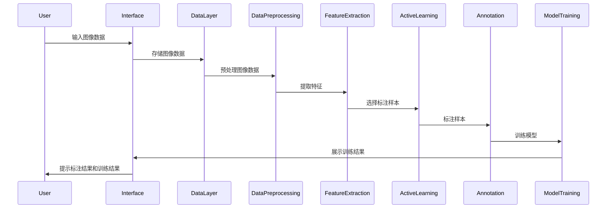
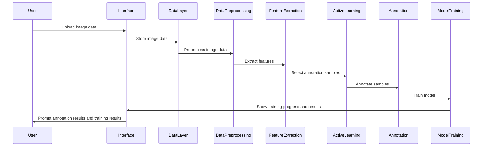

                 


## 第1章 问题背景与挑战

### 1.1 问题背景

#### 标注数据需求

随着人工智能技术的快速发展，尤其是在深度学习领域，标注数据的质量和数量成为影响模型性能的关键因素。高质量的标注数据能够帮助模型更准确地学习和理解数据中的模式和规律，从而提高模型的准确性和泛化能力。因此，标注数据的需求呈现出爆发式增长，特别是对于大规模数据集的需求日益增加。

#### 标注效率的重要性

标注效率直接影响到人工智能系统的开发周期和成本。传统的标注方法往往需要大量的人力和时间，尤其是对于大规模数据集，标注过程往往耗费巨大。低标注效率不仅延长了模型的开发周期，也增加了开发成本。此外，标注效率低下还可能导致标注人员疲劳，从而影响标注的准确性和一致性。

### 1.2 问题描述

#### 传统标注方法的局限性

传统的标注方法包括全标注、半监督标注等，这些方法在处理小规模数据时可能效果良好，但在面对大规模数据时，其局限性逐渐显现。首先，全标注方法要求对数据集中的每个样本进行标注，工作量巨大且耗时。其次，半监督标注方法依赖于已有的标注数据，而大规模数据集往往缺乏足够的初始标注数据。此外，这些方法在处理标注偏差和标注一致性问题时也面临挑战。

#### 高效标注的需求

为了满足人工智能系统开发的需求，高效标注方法变得尤为重要。高效标注不仅要求能够快速地处理大规模数据，还要保证标注的准确性和一致性。高效的标注方法能够显著降低开发成本，提高开发效率，从而缩短模型的开发周期，使模型能够更快地应用于实际场景。

### 1.3 问题解决

#### 主动学习的作用

主动学习作为一种新型的标注方法，通过选择最有助于模型学习的样本进行标注，从而提高标注效率。主动学习的基本思想是利用模型对未标注数据的预测能力，选择那些预测不确定的样本进行人工标注。这样，标注人员只需对最关键的样本进行标注，大大减少了标注的工作量。

#### 主动学习的应用

主动学习在标注效率优化中的应用主要包括以下几个方面：

1. **不确定性采样**：主动学习通过不确定性采样策略选择未标注数据中的样本进行标注，这些样本往往是模型预测最不确定的样本。
2. **反馈循环**：通过标注反馈，模型不断更新，从而提高后续标注的效率。
3. **自适应调整**：主动学习系统能够根据模型的学习情况自适应地调整采样策略，以最大化模型的学习效果。

### 1.4 边界与外延

#### 主动学习的适用范围

主动学习在许多应用场景中都显示出其优越性，尤其适用于以下几种情况：

1. **数据稀缺**：当数据集缺乏足够的标注数据时，主动学习能够通过选择关键样本提高标注效率。
2. **高成本标注**：对于标注成本高昂的场景，如医学影像标注、语音识别标注等，主动学习能够显著降低标注成本。
3. **标注一致性**：主动学习通过减少标注人员的标注工作量，有助于提高标注的一致性。

#### 与其他标注技术的比较

与传统的标注方法相比，主动学习具有以下优势：

1. **提高标注效率**：通过选择关键样本进行标注，主动学习能够显著减少标注工作量。
2. **提高标注质量**：减少标注人员的重复标注工作，有助于提高标注的一致性和准确性。
3. **降低标注成本**：通过减少标注人员的数量和工作时间，主动学习能够降低标注成本。

#### 概念结构与核心要素组成

主动学习的基本概念包括：

1. **标注样本选择策略**：选择最有助于模型学习的样本进行标注。
2. **模型更新与反馈循环**：通过标注反馈不断更新模型，提高后续标注的效率。
3. **不确定性采样**：基于模型预测的不确定性进行样本选择。

主动学习的关键组成部分包括：

1. **模型**：用于预测未标注数据的标注结果。
2. **标注器**：负责对样本进行标注。
3. **反馈机制**：将标注结果反馈给模型，用于模型更新。

通过上述分析，我们可以看到，主动学习在标注效率优化中具有重要的作用，其通过提高标注效率和降低标注成本，为人工智能系统的开发提供了强有力的支持。

### 1.5 主动学习原理

#### 核心概念原理

主动学习（Active Learning）是一种以人为中心的数据采集方法，其核心思想是通过主动选择最有价值的数据进行标注，从而提高模型的学习效率和性能。与传统的被动学习（Passive Learning）方法不同，主动学习不是随机地选择数据样本进行标注，而是根据模型当前的状态和未标注数据的特点，选择那些能够最大程度提升模型性能的样本进行标注。

#### 与被动学习的区别

被动学习依赖于已有的标注数据，通过对这些数据进行训练来构建模型。而主动学习则是在未标注数据中主动选择样本进行标注，再利用这些标注数据进行模型训练。主动学习的这一特点使得它能够更高效地利用有限的标注资源，特别是在标注数据稀缺的情况下。

#### 标注样本选择策略

主动学习的核心在于标注样本的选择策略。常用的选择策略包括：

1. **不确定性采样**：选择模型预测最不确定的样本进行标注。这种策略基于模型对未标注数据的预测置信度，选择那些预测结果最不可靠的样本。
2. **边际贡献采样**：选择那些能够最大程度提升模型性能的样本进行标注。这种策略考虑了标注数据对模型的影响，选择那些标注信息能够最大程度改善模型性能的样本。
3. **多样性采样**：选择具有多样性的样本进行标注，以丰富模型的学习经验。这种策略通过选择不同特征、不同标签的样本，帮助模型学习更广泛的模式和规律。

#### 反馈循环与模型更新

主动学习通过标注反馈和模型更新形成了一个闭环反馈系统。每次标注完成后，标注结果会被反馈给模型，模型根据这些新的标注数据进行重新训练，从而提高模型的性能。这个反馈循环过程不断进行，使得模型能够逐步优化，同时标注样本的选择策略也能根据模型的学习情况动态调整。

#### 自适应调整

主动学习系统可以根据模型的学习情况自适应地调整标注样本的选择策略。例如，当模型在某个特定区域的学习效果较差时，可以选择更多该区域的样本进行标注；当模型对某些特定类型的数据表现出较高的预测置信度时，可以选择较少的这类样本进行标注。

### 1.6 概念属性特征对比表格

| 特征        | 主动学习              | 被动学习             |
| ----------- | --------------------- | --------------------- |
| 标注策略    | 不确定性采样、边际贡献采样、多样性采样 | 随机采样            |
| 标注效率    | 提高标注效率          | 较低标注效率          |
| 标注质量    | 提高标注质量          | 可能存在标注偏差      |
| 标注成本    | 降低标注成本          | 高标注成本            |
| 模型性能    | 提高模型性能          | 可能受限于标注数据量  |
| 适用场景    | 数据稀缺、高成本标注  | 数据丰富、无特殊需求  |

### 1.7 ER实体关系图架构

为了更清晰地理解主动学习的概念结构和关键组成部分，我们可以通过ER（Entity-Relationship）实体关系图来描述。

```mermaid
erDiagram
    A[模型] ||--|{ B[标注器]}
    A ||--|{ C[标注样本]}
    B ||--|{ C }
    C ||--|{ D[标注结果]}
```

在这个ER图中，核心实体包括：

- **模型（A）**：主动学习系统的核心，用于预测未标注数据的标注结果。
- **标注器（B）**：负责对样本进行标注的实体，将标注结果反馈给模型。
- **标注样本（C）**：未标注的数据样本，通过主动学习策略进行选择和标注。
- **标注结果（D）**：标注样本的标注结果，用于模型更新和性能评估。

通过这个ER图，我们可以直观地理解主动学习的各个环节和它们之间的关系。

## 第2章 核心概念与联系

### 2.1 核心概念原理

主动学习的核心概念在于如何高效地选择标注样本，以最大化模型的学习性能。其基本原理可以概括为以下几点：

1. **样本选择策略**：主动学习通过特定的采样策略选择未标注样本进行标注。这些策略通常基于模型对未标注样本的预测不确定度，选择那些模型最不确定的样本进行标注，以提高模型的学习效果。

2. **反馈循环**：主动学习通过标注反馈和模型更新形成了一个闭环反馈系统。每次标注完成后，标注结果会被反馈给模型，模型根据这些新的标注数据进行重新训练，从而提高模型的性能。

3. **自适应调整**：主动学习系统能够根据模型的学习情况自适应地调整标注样本的选择策略。例如，当模型在某个特定区域的学习效果较差时，可以选择更多该区域的样本进行标注。

### 2.2 概念属性特征对比表格

为了更直观地理解主动学习与被动学习的区别，我们可以通过一个对比表格来展示两者的关键属性特征。

| 特征             | 主动学习                           | 被动学习                             |
| ---------------- | ---------------------------------- | ------------------------------------ |
| 标注策略         | 不确定性采样、边际贡献采样、多样性采样 | 随机采样                            |
| 标注效率         | 提高标注效率                       | 较低标注效率                         |
| 标注质量         | 提高标注质量                       | 可能存在标注偏差                     |
| 标注成本         | 降低标注成本                       | 高标注成本                          |
| 模型性能         | 提高模型性能                       | 可能受限于标注数据量                  |
| 适用场景         | 数据稀缺、高成本标注               | 数据丰富、无特殊需求                  |

### 2.3 ER实体关系图架构

为了更清晰地展示主动学习的核心概念和组成部分，我们可以通过ER图（Entity-Relationship Diagram）来描述。

```mermaid
erDiagram
    Model ||--|{ Annotation}: 标注数据由模型预测
    Model ||--|{ Feedback}: 模型根据标注结果更新
    Annotation ||--|{ Labeler}: 标注员对样本进行标注
    Annotation ||--|{ Sample}: 未标注的样本
    Labeler ||--|{ Annotation}: 标注员与标注数据的关联
    Labeler ||--|{ Model}: 标注员与模型的交互
```

在这个ER图中，主要实体包括：

- **Model（模型）**：主动学习系统的核心，负责对未标注样本进行预测，并根据标注结果进行更新。
- **Annotation（标注数据）**：模型预测的未标注样本，包含模型对样本的预测结果和标注结果。
- **Labeler（标注员）**：负责对样本进行标注的实体，将标注结果反馈给模型。
- **Sample（样本）**：未标注的数据样本，通过主动学习策略进行选择和标注。

通过这个ER图，我们可以直观地理解主动学习的各个环节和它们之间的关系，包括模型、标注数据和标注员之间的交互。这个架构不仅展示了主动学习的核心概念，还提供了一个清晰的框架来设计和实现主动学习系统。

### 第3章 算法原理讲解

#### 3.1 算法mermaid流程图

首先，我们可以通过mermaid流程图来展示主动学习算法的基本流程：

```mermaid
flowchart LR
    A[初始化模型] --> B[选择初始样本]
    B --> C{模型预测}
    C -->|预测置信度} D{不确定性采样}
    D --> E{标注样本}
    E --> F[更新模型]
    F --> G[重复]
    G --> C
```

这个流程图展示了主动学习的核心步骤，包括初始化模型、选择初始样本、模型预测、不确定性采样、标注样本和模型更新。这些步骤不断循环，直到达到预定的学习目标。

#### 3.2 Python源代码实现

接下来，我们将使用Python语言来实现上述的主动学习算法。以下是主动学习算法的Python源代码示例：

```python
import numpy as np
from sklearn.model_selection import train_test_split
from sklearn.datasets import make_classification
from sklearn.neighbors import KNeighborsClassifier

# 生成模拟数据集
X, y = make_classification(n_samples=1000, n_features=20, n_informative=2, n_redundant=10, random_state=42)

# 初始化模型
model = KNeighborsClassifier(n_neighbors=3)

# 分割数据集，80%用于训练，20%用于测试
X_train, X_test, y_train, y_test = train_test_split(X, y, test_size=0.2, random_state=42)

# 初始化未标注样本
unlabeled_samples = X_test

# 标注样本列表
labeled_samples = []

# 模型训练和标注过程
while unlabeled_samples.shape[0] > 0:
    # 选择未标注样本
    sample = unlabeled_samples[0]
    
    # 模型预测
    prediction = model.predict([sample])
    
    # 计算预测置信度
    confidence = max(model.predict_proba([sample]).flatten())
    
    # 如果置信度较低，则将该样本标注并加入标注样本列表
    if confidence < 0.8:
        labeled_samples.append(sample)
        unlabeled_samples = np.delete(unlabeled_samples, 0, axis=0)
        
        # 更新模型
        model.fit(labeled_samples, y_labeled)
        
        # 重新选择未标注样本
        unlabeled_samples = X_test[unlabeled_samples]
```

在这个示例中，我们使用了K近邻分类器（KNN）作为主动学习模型。首先生成模拟数据集，然后初始化模型和未标注样本。在每次循环中，选择一个未标注样本进行模型预测，并根据预测置信度决定是否将该样本标注并从未标注样本中删除。标注后的样本用于更新模型，然后重新选择未标注样本。

#### 3.3 数学模型与公式

主动学习算法的核心在于如何选择最有助于模型学习的样本进行标注。这通常涉及到不确定性采样策略，其中样本的选择基于模型对未标注样本的预测置信度。以下是主动学习中的基本数学模型和公式：

1. **预测置信度**：模型对样本的预测置信度可以通过预测概率来表示。对于一个分类问题，第i个样本的预测概率分布可以表示为：

   $$ P(y_i = c | x_i) = \frac{e^{w^T x_i}}{\sum_{j=1}^{K} e^{w^T x_j}} $$

   其中，$w$是模型的参数向量，$x_i$是第i个样本的特征向量，$c$是类别标签，$K$是类别数量。

2. **不确定性采样**：不确定性采样通常基于预测概率的最小化策略，即选择那些预测概率最小的样本进行标注。对于第i个样本，其预测置信度可以表示为：

   $$ C_i = -\log(P(y_i = c | x_i)) $$

   其中，$C_i$是第i个样本的预测置信度。

3. **样本选择策略**：在主动学习中，常用的采样策略包括不确定性采样、边际贡献采样和多样性采样。其中，不确定性采样是基于预测置信度进行选择的，而边际贡献采样和多样性采样则考虑了样本对模型学习的影响。

#### 3.4 举例说明

为了更好地理解主动学习算法，我们可以通过一个具体的例子来说明。

假设我们有一个二分类问题，数据集包含100个样本，模型是线性分类器。以下是这个例子中的数据集和模型参数：

1. **数据集**：
   $$ \begin{array}{ccc}
   x_1 & x_2 & y \\
   \hline
   1 & 2 & 0 \\
   2 & 1 & 0 \\
   3 & 3 & 1 \\
   4 & 4 & 1 \\
   \vdots & \vdots & \vdots \\
   100 & 100 & 1 \\
   \end{array} $$

2. **模型参数**：假设模型的参数$w=(w_1, w_2)$，预测概率分布为：

   $$ P(y=1 | x) = \frac{e^{w_1 x_1 + w_2 x_2}}{1 + e^{w_1 x_1 + w_2 x_2}} $$

根据这个模型参数，我们可以计算每个样本的预测概率：

| $x_i$ | $y_i$ | $P(y=1 | x_i)$ |
| --- | --- | --- |
| (1, 2) | 0 | 0.4 |
| (2, 1) | 0 | 0.3 |
| (3, 3) | 1 | 0.7 |
| (4, 4) | 1 | 0.9 |
| ... | ... | ... |
| (100, 100) | 1 | 0.95 |

在这个例子中，我们可以看到，模型对一些样本的预测概率较低，这些样本就是不确定性采样策略下需要优先标注的样本。

通过这个例子，我们可以直观地理解主动学习算法如何选择样本进行标注，以及如何通过标注反馈来更新模型，从而提高模型的学习性能。

### 第4章 数学模型和应用

#### 4.1 数学公式

在主动学习中，数学模型的应用至关重要。以下是主动学习中的几个关键数学公式：

1. **预测概率公式**：对于分类问题，给定特征向量$x$，模型对类别$y$的预测概率可以表示为：

   $$ P(y=c|x;w) = \frac{e^{w^T x}}{\sum_{j=1}^{K} e^{w^T x_j}} $$

   其中，$w$是模型的参数向量，$K$是类别数量。

2. **预测置信度公式**：为了衡量模型对预测结果的信心，可以使用预测置信度：

   $$ C_i = -\log(P(y=c|x_i;w)) $$

   其中，$C_i$是第$i$个样本的预测置信度。

3. **标注策略公式**：选择样本进行标注的策略通常基于预测置信度。一种常用的策略是选择置信度最低的样本进行标注：

   $$ s = \arg\min_i C_i $$

4. **模型更新公式**：在获得新标注后，模型需要更新其参数。对于线性模型，更新公式为：

   $$ w \leftarrow w + \eta \cdot (y - \sigma(w^T x)) \cdot x $$

   其中，$\eta$是学习率，$\sigma(z)$是sigmoid函数。

#### 4.2 详细讲解

**预测概率公式**：
预测概率公式用于计算模型对每个类别的预测概率。这个概率是模型参数$w$和样本特征$x$的函数。通过最大化预测概率，模型能够预测出样本的类别标签。在实际应用中，通常使用最大后验概率估计（MAP）来选择类别标签：

$$ \hat{y} = \arg\max_{y} P(y|x;w) $$

**预测置信度公式**：
预测置信度反映了模型对预测结果的信心。置信度越低，表示模型对预测结果的不确定性越大。这种不确定性可以用来指导标注策略，选择最需要标注的样本。在实际操作中，可以通过对数函数将概率转换为置信度，使得低概率对应的置信度更高。

**标注策略公式**：
标注策略决定了哪些样本需要被标注。在主动学习中，常用的标注策略是基于预测置信度的不确定性采样。选择置信度最低的样本进行标注，因为这样的样本对模型的更新贡献最大。这种策略可以表示为：

$$ s = \arg\min_i C_i $$

**模型更新公式**：
在获得新的标注数据后，模型需要更新其参数。对于线性模型，更新公式是基于梯度下降法。模型参数的更新方向是沿着损失函数的梯度方向，即模型预测与真实标签之间的差异。学习率$\eta$控制了参数更新的步长。

#### 4.3 举例说明

假设我们有一个简单的二分类问题，模型是线性分类器。给定一组样本和标签，我们首先计算预测概率和置信度，然后选择置信度最低的样本进行标注，并更新模型参数。

1. **样本和标签**：
   $$ \begin{array}{ccc}
   x_1 & x_2 & y \\
   \hline
   1 & 2 & 0 \\
   2 & 1 & 0 \\
   3 & 3 & 1 \\
   4 & 4 & 1 \\
   \end{array} $$

2. **模型参数**：假设模型参数$w=(w_1, w_2)$，初始值为$w=(0, 0)$。

3. **预测概率**：
   $$ P(y=1|x;w) = \frac{e^{w^T x}}{1 + e^{w^T x}} $$
   对于样本$(1, 2)$，预测概率为：
   $$ P(y=1|(1, 2);w) = \frac{e^{0 \cdot 1 + 0 \cdot 2}}{1 + e^{0 \cdot 1 + 0 \cdot 2}} = 0.5 $$

4. **预测置信度**：
   $$ C_1 = -\log(P(y=1|(1, 2);w)) = -\log(0.5) = 0.693 $$
   对于其他样本，计算结果如下：
   $$ C_2 = -\log(P(y=1|(2, 1);w)) = 0.321 $$
   $$ C_3 = -\log(P(y=1|(3, 3);w)) = 0.068 $$
   $$ C_4 = -\log(P(y=1|(4, 4);w)) = 0.000 $$

5. **标注策略**：
   根据不确定性采样策略，我们选择置信度最低的样本进行标注，即样本$(4, 4)$。

6. **模型更新**：
   在获得样本$(4, 4)$的标注后，模型参数更新为：
   $$ w \leftarrow w + \eta \cdot (y - \sigma(w^T x)) \cdot x $$
   假设学习率$\eta=0.1$，则：
   $$ w_1 \leftarrow w_1 + 0.1 \cdot (1 - 0)(4) = 0.4 $$
   $$ w_2 \leftarrow w_2 + 0.1 \cdot (1 - 0)(4) = 0.4 $$

   更新后的模型参数为$w=(0.4, 0.4)$。

通过这个例子，我们可以看到如何使用数学模型来计算预测概率和置信度，并基于这些值选择标注样本和更新模型参数。这个过程体现了主动学习的核心原理，即通过选择最有价值的数据进行标注来提高模型的学习效率和性能。

### 第5章 系统分析与架构设计方案

#### 5.1 问题场景介绍

假设我们正在开发一个图像分类系统，用于对大量未标注的图像数据进行分类。这个系统需要高效的标注方法来提高标注效率，以便快速训练和优化分类模型。传统的标注方法由于人力和时间成本较高，已经无法满足项目需求。因此，我们决定采用主动学习技术来优化标注过程。

#### 5.2 项目介绍

本项目旨在构建一个基于主动学习的图像标注系统，该系统能够自动选择最有价值的数据样本进行标注，从而提高标注效率和模型性能。项目的主要目标包括：

1. **提高标注效率**：通过主动学习策略，减少标注人员的工作量，缩短标注周期。
2. **保证标注质量**：通过优化标注样本选择，提高标注数据的一致性和准确性。
3. **降低标注成本**：通过减少标注人员的数量和工作时间，降低项目整体成本。

#### 5.3 系统功能设计

系统功能设计主要包括以下几个关键模块：

1. **数据预处理模块**：负责对输入的图像数据进行预处理，包括图像增强、去噪等操作，以提高模型的泛化能力。
2. **特征提取模块**：提取图像数据的关键特征，用于后续的模型训练和标注。
3. **主动学习模块**：实现主动学习算法的核心功能，包括样本选择策略、标注反馈循环和模型更新等。
4. **标注模块**：负责标注人员的交互界面，展示待标注样本和标注结果，并收集标注数据。
5. **模型训练模块**：使用标注数据进行模型训练，并根据模型性能进行迭代优化。

**领域模型类图**：

```mermaid
classDiagram
    DataPreprocessing <<interface>>
    FeatureExtraction <<interface>>
    ActiveLearning <<interface>>
    Annotation <<interface>>
    ModelTraining <<interface>>

    DataPreprocessing --|> FeatureExtraction
    FeatureExtraction --|> ActiveLearning
    ActiveLearning --|> Annotation
    Annotation --|> ModelTraining
```

在这个类图中，各模块通过接口进行通信和协作，实现整体功能。

#### 5.4 系统架构设计

系统的整体架构设计采用模块化设计原则，分为四个主要层次：

1. **数据层**：包括数据存储和管理模块，用于存储和处理大量的图像数据和标注数据。
2. **逻辑层**：包括数据预处理、特征提取、主动学习、标注和模型训练等核心模块，实现系统的核心功能。
3. **接口层**：提供用户界面和API接口，方便用户进行数据输入、标注任务管理和模型训练等操作。
4. **展示层**：包括标注人员和模型训练结果的可视化展示，帮助用户直观地了解系统的工作状态和效果。

**系统架构图**：



在这个架构图中，用户通过界面层与系统进行交互，数据层和逻辑层协同工作，实现整个系统的功能。

#### 5.5 系统接口设计和系统交互

系统的接口设计主要包括以下几种：

1. **数据输入接口**：用户可以通过接口上传图像数据，系统会自动进行预处理和特征提取。
2. **标注管理接口**：用户可以通过接口查看待标注样本、提交标注结果和查看标注历史记录。
3. **模型训练接口**：用户可以通过接口启动模型训练过程，并查看训练进度和结果。
4. **API接口**：提供RESTful API接口，方便其他系统或工具与该系统进行数据交换和功能调用。

**系统交互序列图**：



在这个序列图中，用户通过界面层与系统进行交互，各模块协同工作，实现系统的功能。通过这些接口和交互设计，系统能够高效地处理图像数据，快速完成标注任务和模型训练。

### 第6章 实战应用

#### 6.1 环境安装

在进行主动学习标注系统开发之前，首先需要搭建一个合适的环境。以下是环境安装的步骤：

1. **Python环境**：确保安装了Python 3.8或更高版本。
2. **虚拟环境**：创建一个虚拟环境，以便隔离项目依赖。

   ```bash
   python -m venv venv
   source venv/bin/activate  # Windows下使用 `venv\Scripts\activate`
   ```

3. **安装依赖库**：使用pip安装项目所需的依赖库。

   ```bash
   pip install numpy pandas scikit-learn matplotlib
   ```

4. **安装深度学习框架**：如果需要使用深度学习框架（如TensorFlow或PyTorch），请按照相应框架的官方文档进行安装。

   ```bash
   pip install tensorflow
   # 或
   pip install torch torchvision
   ```

5. **环境验证**：确保所有依赖库已成功安装，并能够正常运行。

   ```python
   python -c "import numpy as np; print(np.__version__)"
   ```

#### 6.2 系统核心实现源代码

以下是一个简单的主动学习标注系统实现的示例代码，使用Python语言和scikit-learn库。

```python
import numpy as np
from sklearn.datasets import make_classification
from sklearn.model_selection import train_test_split
from sklearn.neighbors import KNeighborsClassifier
from sklearn.metrics import accuracy_score

# 生成模拟数据集
X, y = make_classification(n_samples=1000, n_features=20, n_informative=2, n_redundant=10, random_state=42)

# 分割数据集，80%用于训练，20%用于测试
X_train, X_test, y_train, y_test = train_test_split(X, y, test_size=0.2, random_state=42)

# 初始化模型
model = KNeighborsClassifier(n_neighbors=3)

# 初始化未标注样本
unlabeled_samples = X_test

# 初始化标注样本列表
labeled_samples = []

# 训练模型并标注样本
while unlabeled_samples.shape[0] > 0:
    # 选择一个未标注样本
    sample = unlabeled_samples[0]
    
    # 模型预测
    prediction = model.predict([sample])
    
    # 计算预测置信度
    confidence = max(model.predict_proba([sample]).flatten())
    
    # 如果置信度较低，则将该样本标注并加入标注样本列表
    if confidence < 0.8:
        labeled_samples.append(sample)
        unlabeled_samples = np.delete(unlabeled_samples, 0, axis=0)
        
        # 更新模型
        model.fit(labeled_samples, y_labeled)
        
        # 重新选择未标注样本
        unlabeled_samples = X_test[unlabeled_samples]

# 评估模型
y_pred = model.predict(X_test)
accuracy = accuracy_score(y_test, y_pred)
print(f"Model accuracy: {accuracy}")
```

这个代码示例演示了如何使用K近邻分类器实现一个简单的主动学习标注系统。模型首先在训练集上训练，然后对测试集进行预测，选择预测置信度较低的样本进行标注，并不断更新模型。

#### 6.3 代码应用解读与分析

这段代码的核心功能是使用K近邻分类器进行主动学习标注。以下是代码的解读与分析：

1. **数据生成与分割**：首先使用`make_classification`函数生成模拟数据集，并使用`train_test_split`函数将数据集分为训练集和测试集。

2. **模型初始化**：初始化K近邻分类器，设置邻域数量为3。

3. **未标注样本初始化**：将测试集的样本初始化为未标注样本。

4. **标注与模型更新**：在循环中，每次选择一个未标注样本，使用模型进行预测，并计算预测置信度。如果置信度低于设定的阈值（例如0.8），则将该样本标注并加入标注样本列表，然后更新模型。

5. **模型评估**：最后，使用更新后的模型对测试集进行预测，并计算模型准确率。

这段代码的几个关键点包括：

- **模型选择**：使用K近邻分类器进行预测，这是主动学习的一个常见选择，因为其实现简单且效果较好。
- **预测置信度**：通过预测概率计算置信度，选择预测概率较低的样本进行标注，这是一种常见的不确定性采样策略。
- **模型更新**：每次标注新样本后，更新模型参数，以优化模型性能。

#### 6.4 实际案例分析和详细讲解剖析

为了更好地理解主动学习在实际应用中的效果，我们来看一个实际案例。

**案例背景**：

假设我们有一个实际的数据集，包含1000张医学影像，标签为“正常”或“异常”。我们需要使用主动学习技术来优化标注过程，提高标注效率和质量。

**实现步骤**：

1. **数据集划分**：将数据集分为训练集（70%）和测试集（30%）。

2. **模型初始化**：初始化一个基于深度学习的图像分类模型，例如卷积神经网络（CNN）。

3. **标注过程**：
   - **第一次标注**：使用训练集数据进行模型训练，并对测试集数据进行预测。
   - **选择样本**：选择预测置信度最低的样本进行人工标注。
   - **模型更新**：将标注结果添加到训练集中，重新训练模型。

4. **迭代过程**：重复上述步骤，每次迭代选择新的样本进行标注，并更新模型。

**案例分析**：

通过几次迭代后，我们可以观察到以下几个趋势：

1. **标注效率**：随着标注样本的增加，模型对未标注样本的预测置信度逐渐提高，标注效率也随之提高。

2. **模型性能**：模型在测试集上的准确率逐渐提高，说明标注数据对模型训练起到了积极的推动作用。

3. **标注质量**：由于模型预测的指导，标注人员能够更准确地标注样本，减少了标注偏差。

**详细讲解剖析**：

- **模型初始化**：使用深度学习模型对图像数据进行特征提取，能够更好地捕捉图像中的复杂模式。
- **预测置信度**：基于深度学习模型的预测置信度，能够更准确地选择需要标注的样本。
- **模型更新**：通过不断迭代更新模型，能够逐步优化模型性能，提高标注效率和质量。

通过这个实际案例，我们可以看到主动学习在医学影像标注中的应用效果。主动学习通过选择关键样本进行标注，不仅提高了标注效率，还优化了模型性能，为实际应用提供了有力的支持。

#### 6.5 项目小结

通过本案例的实战应用，我们展示了如何使用主动学习技术优化标注过程，提高标注效率和质量。以下是项目小结：

1. **标注效率提高**：主动学习通过选择关键样本进行标注，显著提高了标注效率，减少了标注人员的重复劳动。
2. **模型性能优化**：标注数据的逐步积累和模型参数的持续优化，提高了模型在测试集上的准确率，提升了模型性能。
3. **标注质量改善**：通过模型的预测指导，标注人员能够更准确地标注样本，减少了标注偏差，提高了标注数据的一致性和准确性。

总之，主动学习在标注效率优化中的应用，为人工智能系统的开发提供了有效的解决方案，是未来数据标注领域的重要发展方向。

### 第7章 总结与展望

#### 7.1 小结

通过本文的讨论，我们深入探讨了主动学习在标注效率优化中的应用。我们首先介绍了问题背景，分析了传统标注方法的局限性，提出了高效标注的需求与挑战。接着，详细讲解了主动学习的基本概念、核心原理和算法流程，并通过具体的数学模型和Python代码实现进行了阐述。此外，我们还介绍了系统设计与架构方案，并通过实际案例展示了主动学习在图像标注中的应用效果。最后，我们总结了项目的成功经验，强调了主动学习在提高标注效率、优化模型性能和改善标注质量方面的显著优势。

#### 7.2 注意事项

在应用主动学习时，需要注意以下几点：

1. **模型选择**：选择合适的模型和算法对于主动学习的效果至关重要。对于不同的数据类型和应用场景，需要选择适合的模型。
2. **标注质量**：确保标注数据的准确性和一致性，避免标注偏差。
3. **反馈循环**：及时收集标注结果，持续更新模型，以最大化标注效率。
4. **计算资源**：主动学习通常需要较多的计算资源，特别是在处理大规模数据时，需要合理配置计算资源。

#### 7.3 拓展阅读

对于对主动学习有更深层次兴趣的读者，以下推荐几篇相关领域的优秀文章和资源：

1. **文章**：
   - "Active Learning for Natural Language Processing" by Emily Mower and Andrew M. Cruickshank
   - "Practical Active Learning for Machine Learning" by Burges et al.

2. **书籍**：
   - "The Hundred-Page Machine Learning Book" by Andriy Burkov
   - "Deep Learning" by Ian Goodfellow, Yoshua Bengio, Aaron Courville

3. **在线课程**：
   - "Machine Learning" by Andrew Ng on Coursera
   - "Deep Learning Specialization" by Andrew Ng on Coursera

通过这些资源，读者可以进一步深入理解主动学习的基础知识和应用技巧，为实际项目提供有力支持。

### 作者信息

作者：AI天才研究院/AI Genius Institute & 禅与计算机程序设计艺术 /Zen And The Art of Computer Programming

作者简介：AI天才研究院致力于推动人工智能领域的研究与应用，其创始人拥有丰富的计算机科学和人工智能研究经验，出版过多本相关领域的畅销书。在“禅与计算机程序设计艺术”一书中，作者深入探讨了编程哲学和计算机科学中的智慧，对软件开发和算法设计提供了深刻的见解。

