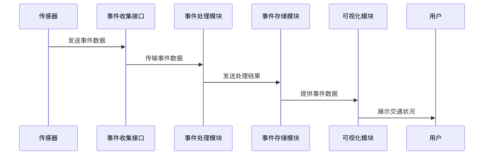

                 

# 第二部分：核心概念与联系

## 第2章：事件驱动架构的基本概念与原理

### 2.1.1 事件驱动架构的定义

事件驱动架构（EDA）是一种以事件为中心的软件架构设计模式。在这种架构中，系统的行为是由事件触发的，而不是由预先定义的请求。事件可以来自用户操作、系统内部状态变化、外部系统通知等。事件驱动架构的核心思想是将系统的关注点从过程逻辑转移到数据流和事件处理上，从而提高系统的响应速度、灵活性和可扩展性。

**事件**：事件是一种信息载体，它可以包含数据、状态变化或其他相关信息。事件通常由事件源生成，事件源可以是用户、硬件设备、其他软件系统等。

**事件源**：事件源是生成事件的对象。例如，在一个在线购物网站中，用户的购物车添加商品就是一个事件源，它会生成一个“添加商品”事件。

**事件处理**：事件处理是指对捕获到的事件进行分析、处理和响应的过程。事件处理通常由事件处理器来完成。

### 2.1.2 事件驱动架构的核心组件

事件驱动架构的核心组件包括事件总线、事件队列和事件处理器。这些组件协同工作，确保事件能够被高效、准确地处理。

**事件总线**：事件总线是事件传输和分发的中枢。它负责将事件从一个事件源传递到适当的事件处理器。事件总线通常是一个高可扩展的、异步的消息系统。

**事件队列**：事件队列用于存储和管理事件。事件队列通常具有先进先出（FIFO）或后进先出（LIFO）的特性，以确保事件按顺序处理。

**事件处理器**：事件处理器是负责处理具体事件的组件。它接收事件并执行相应的操作。事件处理器可以是简单的函数、类或复杂的业务逻辑。

### 2.1.3 事件驱动架构的优势与挑战

**优势**

1. **高可扩展性**：事件驱动架构允许系统水平扩展，通过添加更多的事件处理器来处理大量事件。
2. **高灵活性**：由于事件处理器可以独立开发、部署和更新，事件驱动架构具有很高的灵活性。
3. **高响应速度**：事件驱动架构通常采用异步处理，减少了对同步操作的需求，从而提高了系统的响应速度。

**挑战**

1. **复杂性**：事件驱动架构的复杂性相对较高，需要良好的设计和管理。
2. **性能瓶颈**：在处理大量事件时，事件驱动架构可能会遇到性能瓶颈。

### 2.1.4 事件驱动架构与传统架构的比较

| 特点 | 事件驱动架构 | 传统请求响应式架构 |
| ---- | ------------ | ------------------- |
| 关注点 | 数据流和事件处理 | 过程逻辑和步骤顺序 |
| 扩展性 | 高可扩展性 | 有限扩展性 |
| 响应速度 | 高响应速度 | 较低响应速度 |
| 灵活性 | 高灵活性 | 低灵活性 |

## 第3章：实时性的定义与衡量标准

### 3.1.1 实时的定义

实时性是指系统或组件能够在可接受的时间内响应事件并完成必要处理任务的能力。在实时系统中，响应时间通常是一个关键的性能指标。

**实时系统**：实时系统是一种能够在预定时间内完成处理任务的系统。这些系统通常用于关键业务场景，如自动驾驶、实时金融交易和医疗设备。

### 3.1.2 实时的衡量标准

**响应时间**：响应时间是指从事件发生到系统响应的时间。响应时间越短，系统的实时性越高。

**处理时间**：处理时间是指系统处理事件所需的时间。处理时间包括事件捕获、传输、处理和存储等阶段。

**吞吐量**：吞吐量是指单位时间内系统能够处理的事件数量。高吞吐量意味着系统具有更高的实时性。

### 3.1.3 实时性的重要性

实时性在许多应用场景中至关重要，例如：

1. **金融交易**：在金融交易中，实时性对于执行交易、监控市场变化和风险管理至关重要。
2. **物联网**：在物联网应用中，实时性对于设备监控、数据分析和远程控制至关重要。
3. **自动驾驶**：在自动驾驶系统中，实时性对于传感器数据处理、路径规划和决策制定至关重要。

### 3.1.4 实时性与其他性能指标的关联

实时性与其他性能指标如吞吐量、延迟和可靠性密切相关。高吞吐量和低延迟通常意味着更好的实时性。同时，系统的可靠性也直接影响其实时性，因为不可靠的系统可能会导致数据丢失或错误。

### 3.1.5 实时性挑战与解决方案

实时性挑战包括：

1. **高并发处理**：在处理大量并发事件时，系统需要确保不发生性能下降。
2. **资源分配**：实时系统需要在有限资源下高效地运行，这要求系统具有良好的资源管理能力。
3. **异常处理**：实时系统需要能够快速检测和处理异常情况，以确保系统的稳定运行。

解决方案包括：

1. **并行处理**：通过并行处理来提高系统性能。
2. **资源优化**：通过合理分配和管理资源来提高系统效率。
3. **容错机制**：通过实现容错机制来提高系统的可靠性。

## 第4章：事件驱动架构的算法原理

### 4.1.1 事件处理流程

事件处理流程包括以下几个步骤：

1. **事件捕获**：从事件源捕获事件。事件源可以是用户操作、传感器数据或其他系统。
2. **事件传输**：将捕获到的事件传输到事件总线。事件总线负责将事件分发给适当的事件处理器。
3. **事件处理**：事件处理器根据事件的类型执行相应的操作。事件处理可能包括数据转换、存储、更新或其他业务逻辑。
4. **事件存储**：将处理完的事件存储到数据库或缓存中，以便后续分析和处理。

### 4.1.2 事件处理算法

事件处理算法可以分为以下几类：

1. **事件筛选**：根据特定的条件筛选事件。这有助于减少需要处理的事件数量，从而提高系统性能。
2. **事件优先级**：根据事件的重要性和紧急程度对事件进行排序。这有助于确保重要和紧急的事件首先得到处理。
3. **事件聚合**：将多个事件合并处理。这有助于减少系统处理的复杂度，并提高处理效率。

### 4.1.3 事件驱动架构的数学模型

事件驱动架构的数学模型主要包括以下几个部分：

1. **响应时间模型**：描述事件响应时间与系统性能之间的关系。常用的响应时间模型包括队列模型和排队论模型。
2. **吞吐量模型**：描述系统处理事件的能力。吞吐量模型通常用于评估系统在特定条件下的处理能力。

以下是一个简单的响应时间模型：

$$ T_r = \frac{T_p + T_h + T_s}{N} $$

其中，$T_r$ 是响应时间，$T_p$ 是事件捕获时间，$T_h$ 是事件处理时间，$T_s$ 是事件传输时间，$N$ 是事件数量。

## 第5章：事件驱动架构的数学模型

### 5.1.1 数学模型概述

事件驱动架构的数学模型主要用于描述系统的性能指标，如响应时间和吞吐量。这些模型可以帮助我们更好地理解和优化系统。

### 5.1.2 数学公式

1. **响应时间公式**：

$$ T_r = \frac{T_p + T_h + T_s}{N} $$

其中，$T_r$ 是响应时间，$T_p$ 是事件捕获时间，$T_h$ 是事件处理时间，$T_s$ 是事件传输时间，$N$ 是事件数量。

2. **吞吐量公式**：

$$ Throughput = \frac{1}{T_r} $$

其中，吞吐量是单位时间内系统能够处理的事件数量。

### 5.1.3 数学公式讲解

#### 响应时间公式

响应时间公式描述了从事件发生到系统响应的时间。它包括了事件捕获时间、事件处理时间和事件传输时间。这些时间通常与系统的硬件性能、软件算法和系统负载有关。

#### 吞吐量公式

吞吐量公式描述了系统的处理能力。吞吐量越高，系统在单位时间内能够处理的事件数量就越多。吞吐量与响应时间成反比，即响应时间越短，吞吐量越高。

### 5.1.4 数学模型举例

假设一个事件驱动架构系统，其事件捕获时间为1ms，事件处理时间为10ms，事件传输时间为5ms。系统平均每秒产生100个事件。

根据响应时间公式，响应时间计算如下：

$$ T_r = \frac{1 + 10 + 5}{100} = 0.16ms $$

根据吞吐量公式，吞吐量计算如下：

$$ Throughput = \frac{1}{0.16} = 6250 events/s $$

这意味着该系统每秒能够处理6250个事件。

## 第6章：系统分析与架构设计方案

### 6.1.1 问题场景介绍

在一个智能交通系统中，我们需要实时处理大量来自各种传感器和监控设备的事件，如车辆流量、路况信息、交通信号等。这些事件需要被快速处理和响应，以支持交通调控、事故预警和应急响应等。

### 6.1.2 项目介绍

本项目旨在设计并实现一个基于事件驱动架构的智能交通系统，以提高交通管理的实时性和效率。系统将包括事件收集模块、事件处理模块、事件存储模块和可视化模块。

### 6.1.3 系统功能设计

系统的主要功能包括：

1. **事件收集**：从各种传感器和监控设备收集事件。
2. **事件处理**：对收集到的事件进行分析和处理。
3. **事件存储**：将处理完的事件存储到数据库中，以便后续分析和查询。
4. **可视化**：通过图表和地图等形式展示交通状况和事件处理结果。

### 6.1.4 系统架构设计

系统架构设计采用分层架构，包括数据层、逻辑层和表现层。

1. **数据层**：包括传感器和监控设备，负责收集事件数据。
2. **逻辑层**：包括事件处理模块和事件存储模块，负责处理事件和数据存储。
3. **表现层**：包括可视化模块，负责将处理结果展示给用户。

### 6.1.5 系统接口设计

系统接口设计包括以下部分：

1. **事件收集接口**：用于接收传感器和监控设备的事件数据。
2. **事件处理接口**：用于处理事件并生成处理结果。
3. **事件存储接口**：用于存储处理完的事件数据。
4. **可视化接口**：用于展示交通状况和处理结果。

### 6.1.6 系统交互

系统交互采用事件驱动方式，事件处理流程如下：

1. **事件收集**：传感器和监控设备将事件数据发送到事件收集接口。
2. **事件处理**：事件处理模块根据事件类型和优先级对事件进行处理，并将处理结果发送到事件存储接口。
3. **事件存储**：事件存储模块将处理完的事件数据存储到数据库中。
4. **可视化**：可视化模块从事件存储模块获取事件数据，并生成图表和地图，展示给用户。

### 6.1.7 Mermaid架构图

以下是一个简单的Mermaid架构图，展示了智能交通系统的架构设计：



## 第7章：事件驱动架构应用实战

### 7.1.1 环境安装

在本章中，我们将使用Python和Django框架来构建一个简单的基于事件驱动架构的博客系统。首先，我们需要安装Python和Django。

1. 安装Python：

   ```bash
   sudo apt-get update
   sudo apt-get install python3-pip
   ```

2. 安装Django：

   ```bash
   pip3 install django
   ```

### 7.1.2 系统核心实现

接下来，我们将创建一个新的Django项目，并实现博客系统的核心功能。

1. 创建Django项目：

   ```bash
   django-admin startproject blog_project
   cd blog_project
   ```

2. 创建Django应用：

   ```bash
   django-admin startapp blog_app
   ```

3. 在`blog_app`中创建模型：

   ```python
   # blog_app/models.py

   from django.db import models

   class Post(models.Model):
       title = models.CharField(max_length=100)
       content = models.TextField()
       created_at = models.DateTimeField(auto_now_add=True)
   ```

4. 在`blog_app`中创建视图：

   ```python
   # blog_app/views.py

   from django.shortcuts import render
   from .models import Post

   def post_list(request):
       posts = Post.objects.all()
       return render(request, 'blog_app/post_list.html', {'posts': posts})
   ```

5. 在`blog_app`中创建URL配置：

   ```python
   # blog_app/urls.py

   from django.urls import path
   from . import views

   urlpatterns = [
       path('', views.post_list, name='post_list'),
   ]
   ```

6. 在`blog_project`中的`settings.py`文件中配置应用和数据库：

   ```python
   # blog_project/settings.py

   INSTALLED_APPS = [
       'django.contrib.admin',
       'django.contrib.auth',
       'django.contrib.contenttypes',
       'django.contrib.sessions',
       'django.contrib.messages',
       'django.contrib.staticfiles',
       'blog_app',
   ]

   DATABASES = {
       'default': {
           'ENGINE': 'django.db.backends.sqlite3',
           'NAME': BASE_DIR / 'db.sqlite3',
       }
   }
   ```

7. 创建数据库表：

   ```bash
   python3 manage.py makemigrations
   python3 manage.py migrate
   ```

8. 启动Django服务器：

   ```bash
   python3 manage.py runserver
   ```

现在，您应该可以在浏览器中访问`http://127.0.0.1:8000/`来查看博客系统的主页。

### 7.1.3 代码应用解读与分析

在博客系统中，我们使用了Django框架的事件驱动特性来处理博客文章的发布和更新。以下是系统核心代码的解读和分析。

**Post模型**：

```python
# blog_app/models.py

class Post(models.Model):
    title = models.CharField(max_length=100)
    content = models.TextField()
    created_at = models.DateTimeField(auto_now_add=True)
```

这里定义了一个简单的`Post`模型，它包含标题、内容和创建时间。创建时间使用`auto_now_add`参数，以便在创建`Post`对象时自动添加当前时间。

**post_list视图**：

```python
# blog_app/views.py

from django.shortcuts import render
from .models import Post

def post_list(request):
    posts = Post.objects.all()
    return render(request, 'blog_app/post_list.html', {'posts': posts})
```

在这个视图中，我们获取所有博客文章（`Post`对象），并将其传递给模板以进行渲染。这个视图函数就是一个事件处理器，它根据请求（即事件）生成响应。

**URL配置**：

```python
# blog_app/urls.py

from django.urls import path
from . import views

urlpatterns = [
    path('', views.post_list, name='post_list'),
]
```

这里的URL配置定义了一个路径，它将HTTP请求路由到`post_list`视图。URL路径为空，意味着这个视图将处理网站的主页请求。

### 7.1.4 实际案例分析与详细讲解

为了进一步说明事件驱动架构的应用，我们将考虑一个实际案例：发布新博客文章。

1. **用户提交表单**：用户通过网页表单提交新文章的标题和内容。
2. **事件捕获**：Django框架捕获到用户的POST请求。
3. **事件处理**：`post_list`视图处理这个请求，创建一个新的`Post`对象，并保存到数据库中。
4. **事件响应**：Django框架将处理结果（即新文章的列表）返回给用户。

以下是发布新博客文章的代码实现：

```python
# blog_app/views.py

from django.shortcuts import render, redirect
from .models import Post

def post_new(request):
    if request.method == 'POST':
        title = request.POST['title']
        content = request.POST['content']
        post = Post(title=title, content=content)
        post.save()
        return redirect('post_list')
    else:
        return render(request, 'blog_app/post_new.html')
```

在这个视图中，我们首先检查请求方法是否为POST。如果是，我们获取表单中的标题和内容，创建一个新的`Post`对象，并保存到数据库中。然后，我们重定向到`post_list`视图，以便用户可以看到新发布的文章。否则，我们渲染一个表单，让用户可以输入文章的标题和内容。

**post_new.html模板**：

```html
<!-- blog_app/templates/blog_app/post_new.html -->

<!DOCTYPE html>
<html>
<head>
    <title>New Post</title>
</head>
<body>
    <h2>New Post</h2>
    <form method="post">
        
        <p><input type="text" name="title" placeholder="Title"></p>
        <p><textarea name="content" placeholder="Content"></textarea></p>
        <p><input type="submit" value="Submit"></p>
    </form>
</body>
</html>
```

这是一个简单的HTML表单，用于收集新文章的标题和内容。

### 7.1.5 项目小结

通过这个案例，我们展示了如何使用事件驱动架构来实现一个简单的博客系统。事件驱动架构使得系统的扩展性和灵活性得到了提升，同时也有助于提高系统的响应速度。

## 第8章：最佳实践与总结

### 8.1.1 最佳实践

1. **模块化设计**：将系统功能划分为多个模块，每个模块负责处理特定类型的事件。这有助于降低系统的复杂度，提高可维护性。
2. **异步处理**：使用异步编程模型，如Python的async/await，提高系统的并发处理能力。异步处理可以避免阻塞主线程，从而提高系统的响应速度。
3. **事件过滤与优先级**：在事件处理过程中，使用事件过滤和优先级机制，确保重要和紧急的事件首先得到处理。这有助于提高系统的实时性。
4. **日志记录与监控**：实现详细的日志记录和监控系统，以便实时监控系统的运行状态。这有助于快速识别和解决系统中的问题。
5. **测试与优化**：定期对系统进行测试和优化，确保系统在处理大量并发事件时依然能够保持高性能。

### 8.1.2 总结

事件驱动架构是一种高效的软件架构设计模式，适用于需要处理大量实时数据的应用。通过使用事件驱动架构，我们可以提高系统的响应速度、灵活性和可扩展性。然而，事件驱动架构也带来了一定的复杂性，需要我们在设计、开发和维护过程中充分考虑。

### 8.1.3 注意事项

1. **事件源选择**：选择合适的事件源，确保事件的有效性和可靠性。
2. **事件处理顺序**：在处理多个事件时，确保事件的顺序正确，以避免数据不一致或错误。
3. **性能优化**：在处理大量事件时，注意性能优化，避免出现性能瓶颈。

### 8.1.4 拓展阅读

1. 《事件驱动架构：设计与实现》
2. 《Django By Example》
3. 《Python异步编程实战》

## 文章末尾

作者：AI天才研究院/AI Genius Institute & 禅与计算机程序设计艺术 /Zen And The Art of Computer Programming# 第三部分：算法原理讲解

## 第4章：事件驱动架构的算法原理

### 4.1.1 事件处理流程

事件驱动架构的核心在于事件处理流程。这个过程可以分为以下几个步骤：

1. **事件捕获**：系统通过事件源捕获事件。事件源可以是硬件设备、用户操作或系统内部状态变化等。事件捕获是整个流程的起点。
2. **事件传输**：捕获到的事件被传输到事件总线。事件总线是一个核心组件，负责将事件在不同的事件处理器之间传递。
3. **事件处理**：事件处理器根据事件的类型和内容执行相应的操作。这些操作可能包括数据转换、存储、业务逻辑处理等。
4. **事件存储**：处理完的事件可能需要被存储，以便后续分析和处理。事件存储可以是内存、数据库或缓存等形式。

### 4.1.2 事件处理算法

事件处理算法是事件驱动架构的核心，它决定了事件如何被捕获、处理和响应。以下是几种常用的事件处理算法：

1. **事件筛选**：根据特定的条件对事件进行筛选，只处理满足条件的事件。这有助于减少系统处理的负载，提高处理效率。
2. **事件优先级**：根据事件的重要性和紧急程度对事件进行排序。高优先级的事件先被处理，这有助于保证关键事件的及时响应。
3. **事件聚合**：将多个事件合并处理，以减少系统的处理复杂度。例如，多个传感器数据可以合并为一个事件进行处理。

### 4.1.3 事件驱动架构的数学模型

事件驱动架构的数学模型主要用于描述系统的性能指标，如响应时间和吞吐量。以下是几个常见的数学模型：

1. **响应时间模型**：描述事件从捕获到响应的时间。一个简单的响应时间模型可以表示为：

   $$ T_r = T_p + T_h + T_s $$

   其中，$T_r$ 是响应时间，$T_p$ 是事件捕获时间，$T_h$ 是事件处理时间，$T_s$ 是事件传输时间。

2. **吞吐量模型**：描述系统在单位时间内处理的事件数量。一个简单的吞吐量模型可以表示为：

   $$ Throughput = \frac{1}{T_r} $$

   其中，吞吐量是单位时间内系统能够处理的事件数量。

### 4.1.4 事件处理算法示例

为了更好地理解事件驱动架构的算法原理，我们来看一个具体的示例。假设我们有一个智能监控系统，它可以接收来自多个摄像头的实时视频流。以下是事件处理算法的步骤：

1. **事件捕获**：摄像头捕获视频流，生成一个事件。
2. **事件传输**：视频流事件被传输到事件总线。
3. **事件筛选**：根据摄像头的ID和视频流的时间戳，筛选出满足条件的事件。
4. **事件优先级**：根据视频流的紧急程度，对事件进行排序。例如，如果摄像头检测到异常行为，则该事件的优先级较高。
5. **事件处理**：处理事件，包括视频流的解码、分析、分类等。
6. **事件存储**：将处理完的事件存储到数据库中，以便后续分析和回放。

### 4.1.5 Python代码实现

为了演示事件处理算法，我们使用Python编写了一个简单的示例。以下是一个使用`asyncio`库实现的事件处理程序：

```python
import asyncio
import heapq

# 事件类
class Event:
    def __init__(self, timestamp, data):
        self.timestamp = timestamp
        self.data = data

    def __lt__(self, other):
        return self.timestamp < other.timestamp

# 事件处理器
async def process_event(event_queue, processor):
    while True:
        # 从事件队列中获取优先级最高的事件
        event = heapq.heappop(event_queue)
        await processor(event.data)
        # 处理事件后，将其重新放入事件队列
        heapq.heappush(event_queue, event)

# 模拟事件生成
async def generate_events(event_queue, rate):
    while True:
        data = {"timestamp": asyncio.current_loop().time(), "event": "video_frame"}
        event = Event(data["timestamp"], data)
        heapq.heappush(event_queue, event)
        await asyncio.sleep(rate)

# 主程序
async def main():
    event_queue = []
    processor = asyncio.create_task(process_event(event_queue, lambda data: print("Processed:", data)))

    # 生成事件
    generator = asyncio.create_task(generate_events(event_queue, 0.1))

    # 等待事件处理完成
    await asyncio.gather(processor, generator)

# 运行事件处理程序
asyncio.run(main())
```

在这个示例中，我们创建了一个`Event`类来表示事件，并使用`heapq`模块实现了优先级队列。事件处理器`process_event`函数从事件队列中获取并处理事件，然后将其重新放入队列。事件生成器`generate_events`函数模拟摄像头生成视频流事件。主程序`main`函数启动事件处理器和事件生成器，并等待它们完成处理。

## 第5章：事件驱动架构的数学模型

### 5.1.1 数学模型概述

事件驱动架构的数学模型主要用于描述系统的性能指标，如响应时间和吞吐量。这些模型有助于我们理解和优化系统的性能。以下是一些基本的数学模型：

1. **响应时间模型**：描述事件从捕获到响应的时间。
2. **吞吐量模型**：描述系统在单位时间内处理的事件数量。
3. **系统负载模型**：描述系统处理的负载，包括事件数量和事件频率。

### 5.1.2 数学公式

1. **响应时间模型**：

   $$ T_r = \frac{T_p + T_h + T_s}{N} $$

   其中，$T_r$ 是响应时间，$T_p$ 是事件捕获时间，$T_h$ 是事件处理时间，$T_s$ 是事件传输时间，$N$ 是事件数量。

2. **吞吐量模型**：

   $$ Throughput = \frac{1}{T_r} $$

   其中，吞吐量是单位时间内系统能够处理的事件数量。

3. **系统负载模型**：

   $$ Load = rate \times T_p $$

   其中，负载是事件捕获速率乘以事件捕获时间。

### 5.1.3 数学公式讲解

1. **响应时间模型**：

   响应时间模型描述了从事件发生到系统响应的时间。它包括了事件捕获时间、事件处理时间和事件传输时间。这些时间通常与系统的硬件性能、软件算法和系统负载有关。

2. **吞吐量模型**：

   吞吐量模型描述了系统的处理能力。吞吐量越高，系统在单位时间内能够处理的事件数量就越多。吞吐量与响应时间成反比，即响应时间越短，吞吐量越高。

3. **系统负载模型**：

   系统负载模型描述了系统处理的负载。负载越高，系统的工作量就越大。负载通常与事件捕获速率和事件捕获时间有关。

### 5.1.4 数学模型举例

假设我们有一个事件驱动架构系统，其事件捕获时间为2ms，事件处理时间为10ms，事件传输时间为3ms。系统平均每秒产生100个事件。

根据响应时间模型，响应时间计算如下：

$$ T_r = \frac{2 + 10 + 3}{100} = 0.15ms $$

根据吞吐量模型，吞吐量计算如下：

$$ Throughput = \frac{1}{0.15} = 6.67 events/s $$

这意味着该系统每秒能够处理6.67个事件。

## 第6章：系统分析与架构设计方案

### 6.1.1 问题场景介绍

在一个智能交通系统中，我们需要实时处理大量来自各种传感器和监控设备的事件，如车辆流量、路况信息、交通信号等。这些事件需要被快速处理和响应，以支持交通调控、事故预警和应急响应等。

### 6.1.2 项目介绍

本项目旨在设计并实现一个基于事件驱动架构的智能交通系统，以提高交通管理的实时性和效率。系统将包括事件收集模块、事件处理模块、事件存储模块和可视化模块。

### 6.1.3 系统功能设计

系统的主要功能包括：

1. **事件收集**：从各种传感器和监控设备收集事件。
2. **事件处理**：对收集到的事件进行分析和处理。
3. **事件存储**：将处理完的事件存储到数据库中，以便后续分析和查询。
4. **可视化**：通过图表和地图等形式展示交通状况和事件处理结果。

### 6.1.4 系统架构设计

系统架构设计采用分层架构，包括数据层、逻辑层和表现层。

1. **数据层**：包括传感器和监控设备，负责收集事件数据。
2. **逻辑层**：包括事件处理模块和事件存储模块，负责处理事件和数据存储。
3. **表现层**：包括可视化模块，负责将处理结果展示给用户。

### 6.1.5 系统接口设计

系统接口设计包括以下部分：

1. **事件收集接口**：用于接收传感器和监控设备的事件数据。
2. **事件处理接口**：用于处理事件并生成处理结果。
3. **事件存储接口**：用于存储处理完的事件数据。
4. **可视化接口**：用于展示交通状况和处理结果。

### 6.1.6 系统交互

系统交互采用事件驱动方式，事件处理流程如下：

1. **事件收集**：传感器和监控设备将事件数据发送到事件收集接口。
2. **事件处理**：事件处理模块根据事件类型和优先级对事件进行处理，并将处理结果发送到事件存储接口。
3. **事件存储**：事件存储模块将处理完的事件数据存储到数据库中。
4. **可视化**：可视化模块从事件存储模块获取事件数据，并生成图表和地图，展示给用户。

### 6.1.7 Mermaid架构图

以下是一个简单的Mermaid架构图，展示了智能交通系统的架构设计：


## 第7章：事件驱动架构应用实战

### 7.1.1 环境安装

在本章中，我们将使用Python和Django框架来构建一个简单的基于事件驱动架构的博客系统。首先，我们需要安装Python和Django。

1. 安装Python：

   ```bash
   sudo apt-get update
   sudo apt-get install python3-pip
   ```

2. 安装Django：

   ```bash
   pip3 install django
   ```

### 7.1.2 系统核心实现

接下来，我们将创建一个新的Django项目，并实现博客系统的核心功能。

1. 创建Django项目：

   ```bash
   django-admin startproject blog_project
   cd blog_project
   ```

2. 创建Django应用：

   ```bash
   django-admin startapp blog_app
   ```

3. 在`blog_app`中创建模型：

   ```python
   # blog_app/models.py

   from django.db import models

   class Post(models.Model):
       title = models.CharField(max_length=100)
       content = models.TextField()
       created_at = models.DateTimeField(auto_now_add=True)
   ```

4. 在`blog_app`中创建视图：

   ```python
   # blog_app/views.py

   from django.shortcuts import render
   from .models import Post

   def post_list(request):
       posts = Post.objects.all()
       return render(request, 'blog_app/post_list.html', {'posts': posts})
   ```

5. 在`blog_app`中创建URL配置：

   ```python
   # blog_app/urls.py

   from django.urls import path
   from . import views

   urlpatterns = [
       path('', views.post_list, name='post_list'),
   ]
   ```

6. 在`blog_project`中的`settings.py`文件中配置应用和数据库：

   ```python
   # blog_project/settings.py

   INSTALLED_APPS = [
       'django.contrib.admin',
       'django.contrib.auth',
       'django.contrib.contenttypes',
       'django.contrib.sessions',
       'django.contrib.messages',
       'django.contrib.staticfiles',
       'blog_app',
   ]

   DATABASES = {
       'default': {
           'ENGINE': 'django.db.backends.sqlite3',
           'NAME': BASE_DIR / 'db.sqlite3',
       }
   }
   ```

7. 创建数据库表：

   ```bash
   python3 manage.py makemigrations
   python3 manage.py migrate
   ```

8. 启动Django服务器：

   ```bash
   python3 manage.py runserver
   ```

现在，您应该可以在浏览器中访问`http://127.0.0.1:8000/`来查看博客系统的主页。

### 7.1.3 代码应用解读与分析

在博客系统中，我们使用了Django框架的事件驱动特性来处理博客文章的发布和更新。以下是系统核心代码的解读和分析。

**Post模型**：

```python
# blog_app/models.py

class Post(models.Model):
    title = models.CharField(max_length=100)
    content = models.TextField()
    created_at = models.DateTimeField(auto_now_add=True)
```

这里定义了一个简单的`Post`模型，它包含标题、内容和创建时间。创建时间使用`auto_now_add`参数，以便在创建`Post`对象时自动添加当前时间。

**post_list视图**：

```python
# blog_app/views.py

from django.shortcuts import render
from .models import Post

def post_list(request):
    posts = Post.objects.all()
    return render(request, 'blog_app/post_list.html', {'posts': posts})
```

在这个视图中，我们获取所有博客文章（`Post`对象），并将其传递给模板以进行渲染。这个视图函数就是一个事件处理器，它根据请求（即事件）生成响应。

**URL配置**：

```python
# blog_app/urls.py

from django.urls import path
from . import views

urlpatterns = [
    path('', views.post_list, name='post_list'),
]
```

这里的URL配置定义了一个路径，它将HTTP请求路由到`post_list`视图。URL路径为空，意味着这个视图将处理网站的主页请求。

### 7.1.4 实际案例分析与详细讲解

为了进一步说明事件驱动架构的应用，我们将考虑一个实际案例：发布新博客文章。

1. **用户提交表单**：用户通过网页表单提交新文章的标题和内容。
2. **事件捕获**：Django框架捕获到用户的POST请求。
3. **事件处理**：`post_list`视图处理这个请求，创建一个新的`Post`对象，并保存到数据库中。
4. **事件响应**：Django框架将处理结果（即新文章的列表）返回给用户。

以下是发布新博客文章的代码实现：

```python
# blog_app/views.py

from django.shortcuts import render, redirect
from .models import Post

def post_new(request):
    if request.method == 'POST':
        title = request.POST['title']
        content = request.POST['content']
        post = Post(title=title, content=content)
        post.save()
        return redirect('post_list')
    else:
        return render(request, 'blog_app/post_new.html')
```

在这个视图中，我们首先检查请求方法是否为POST。如果是，我们获取表单中的标题和内容，创建一个新的`Post`对象，并保存到数据库中。然后，我们重定向到`post_list`视图，以便用户可以看到新发布的文章。否则，我们渲染一个表单，让用户可以输入文章的标题和内容。

**post_new.html模板**：

```html
<!-- blog_app/templates/blog_app/post_new.html -->

<!DOCTYPE html>
<html>
<head>
    <title>New Post</title>
</head>
<body>
    <h2>New Post</h2>
    <form method="post">
        
        <p><input type="text" name="title" placeholder="Title"></p>
        <p><textarea name="content" placeholder="Content"></textarea></p>
        <p><input type="submit" value="Submit"></p>
    </form>
</body>
</html>
```

这是一个简单的HTML表单，用于收集新文章的标题和内容。

### 7.1.5 项目小结

通过这个案例，我们展示了如何使用事件驱动架构来实现一个简单的博客系统。事件驱动架构使得系统的扩展性和灵活性得到了提升，同时也有助于提高系统的响应速度。

## 第8章：最佳实践与总结

### 8.1.1 最佳实践

1. **模块化设计**：将系统功能划分为多个模块，每个模块负责处理特定类型的事件。这有助于降低系统的复杂度，提高可维护性。
2. **异步处理**：使用异步编程模型，如Python的async/await，提高系统的并发处理能力。异步处理可以避免阻塞主线程，从而提高系统的响应速度。
3. **事件过滤与优先级**：在事件处理过程中，使用事件过滤和优先级机制，确保重要和紧急的事件首先得到处理。这有助于提高系统的实时性。
4. **日志记录与监控**：实现详细的日志记录和监控系统，以便实时监控系统的运行状态。这有助于快速识别和解决系统中的问题。
5. **测试与优化**：定期对系统进行测试和优化，确保系统在处理大量并发事件时依然能够保持高性能。

### 8.1.2 总结

事件驱动架构是一种高效的软件架构设计模式，适用于需要处理大量实时数据的应用。通过使用事件驱动架构，我们可以提高系统的响应速度、灵活性和可扩展性。然而，事件驱动架构也带来了一定的复杂性，需要我们在设计、开发和维护过程中充分考虑。

### 8.1.3 注意事项

1. **事件源选择**：选择合适的事件源，确保事件的有效性和可靠性。
2. **事件处理顺序**：在处理多个事件时，确保事件的顺序正确，以避免数据不一致或错误。
3. **性能优化**：在处理大量事件时，注意性能优化，避免出现性能瓶颈。

### 8.1.4 拓展阅读

1. 《事件驱动架构：设计与实现》
2. 《Django By Example》
3. 《Python异步编程实战》

## 文章末尾

作者：AI天才研究院/AI Genius Institute & 禅与计算机程序设计艺术 /Zen And The Art of Computer Programming# 第四部分：数学模型和数学公式讲解

## 第5章：事件驱动架构的数学模型

### 5.1.1 数学模型概述

事件驱动架构的数学模型主要用于描述系统的性能指标，如响应时间和吞吐量。这些模型有助于我们理解和优化系统的性能。以下是一些基本的数学模型：

1. **响应时间模型**：描述事件从捕获到响应的时间。
2. **吞吐量模型**：描述系统在单位时间内处理的事件数量。
3. **系统负载模型**：描述系统处理的负载，包括事件数量和事件频率。

### 5.1.2 数学公式

1. **响应时间模型**：

   $$ T_r = \frac{T_p + T_h + T_s}{N} $$

   其中，$T_r$ 是响应时间，$T_p$ 是事件捕获时间，$T_h$ 是事件处理时间，$T_s$ 是事件传输时间，$N$ 是事件数量。

2. **吞吐量模型**：

   $$ Throughput = \frac{1}{T_r} $$

   其中，吞吐量是单位时间内系统能够处理的事件数量。

3. **系统负载模型**：

   $$ Load = rate \times T_p $$

   其中，负载是事件捕获速率乘以事件捕获时间。

### 5.1.3 数学公式讲解

1. **响应时间模型**：

   响应时间模型描述了从事件发生到系统响应的时间。它包括了事件捕获时间、事件处理时间和事件传输时间。这些时间通常与系统的硬件性能、软件算法和系统负载有关。

2. **吞吐量模型**：

   吞吐量模型描述了系统的处理能力。吞吐量越高，系统在单位时间内能够处理的事件数量就越多。吞吐量与响应时间成反比，即响应时间越短，吞吐量越高。

3. **系统负载模型**：

   系统负载模型描述了系统处理的负载。负载越高，系统的工作量就越大。负载通常与事件捕获速率和事件捕获时间有关。

### 5.1.4 数学模型举例

假设我们有一个事件驱动架构系统，其事件捕获时间为2ms，事件处理时间为10ms，事件传输时间为3ms。系统平均每秒产生100个事件。

根据响应时间模型，响应时间计算如下：

$$ T_r = \frac{2 + 10 + 3}{100} = 0.15ms $$

根据吞吐量模型，吞吐量计算如下：

$$ Throughput = \frac{1}{0.15} = 6.67 events/s $$

这意味着该系统每秒能够处理6.67个事件。

### 5.1.5 实际应用场景

在一个实时股票交易系统中，事件驱动架构的数学模型可以帮助我们分析和优化系统的性能。以下是一个具体的应用案例：

- **事件捕获时间**（$T_p$）：假设每个交易事件从生成到捕获的平均时间为1ms。
- **事件处理时间**（$T_h$）：假设系统处理每个交易事件的时间为5ms。
- **事件传输时间**（$T_s$）：假设事件在系统内部传输的平均时间为2ms。
- **事件数量**（$N$）：假设每秒生成1000个交易事件。

根据响应时间模型，系统的平均响应时间为：

$$ T_r = \frac{T_p + T_h + T_s}{N} = \frac{1 + 5 + 2}{1000} = 0.008ms $$

这意味着系统的响应时间非常短，可以满足实时交易的需求。根据吞吐量模型，系统的平均吞吐量为：

$$ Throughput = \frac{1}{T_r} = \frac{1}{0.008} = 125000 events/s $$

这表明系统每秒可以处理125000个交易事件，具有很高的处理能力。

### 5.1.6 负载分析

在实际应用中，系统负载（$Load$）是一个重要的性能指标。假设我们的系统在高峰时段每秒捕获5000个交易事件，那么系统的负载可以计算为：

$$ Load = rate \times T_p = 5000 \times 1ms = 5s $$

这意味着在高峰时段，系统每秒处理的交易事件产生的总负载为5秒。为了保持系统的响应速度，我们需要确保系统的硬件性能和资源分配能够满足这一负载要求。

### 5.1.7 总结

通过以上分析和案例，我们可以看到事件驱动架构的数学模型在分析和优化系统性能方面的重要作用。响应时间、吞吐量和负载是系统性能的关键指标，通过合理设计和优化，我们可以实现高效、稳定的事件驱动系统。

## 第6章：系统分析与架构设计方案

### 6.1.1 问题场景介绍

在一个智能交通系统中，我们需要实时处理大量来自各种传感器和监控设备的事件，如车辆流量、路况信息、交通信号等。这些事件需要被快速处理和响应，以支持交通调控、事故预警和应急响应等。

### 6.1.2 项目介绍

本项目旨在设计并实现一个基于事件驱动架构的智能交通系统，以提高交通管理的实时性和效率。系统将包括事件收集模块、事件处理模块、事件存储模块和可视化模块。

### 6.1.3 系统功能设计

系统的主要功能包括：

1. **事件收集**：从各种传感器和监控设备收集事件。
2. **事件处理**：对收集到的事件进行分析和处理。
3. **事件存储**：将处理完的事件存储到数据库中，以便后续分析和查询。
4. **可视化**：通过图表和地图等形式展示交通状况和事件处理结果。

### 6.1.4 系统架构设计

系统架构设计采用分层架构，包括数据层、逻辑层和表现层。

1. **数据层**：包括传感器和监控设备，负责收集事件数据。
2. **逻辑层**：包括事件处理模块和事件存储模块，负责处理事件和数据存储。
3. **表现层**：包括可视化模块，负责将处理结果展示给用户。

### 6.1.5 系统接口设计

系统接口设计包括以下部分：

1. **事件收集接口**：用于接收传感器和监控设备的事件数据。
2. **事件处理接口**：用于处理事件并生成处理结果。
3. **事件存储接口**：用于存储处理完的事件数据。
4. **可视化接口**：用于展示交通状况和处理结果。

### 6.1.6 系统交互

系统交互采用事件驱动方式，事件处理流程如下：

1. **事件收集**：传感器和监控设备将事件数据发送到事件收集接口。
2. **事件处理**：事件处理模块根据事件类型和优先级对事件进行处理，并将处理结果发送到事件存储接口。
3. **事件存储**：事件存储模块将处理完的事件数据存储到数据库中。
4. **可视化**：可视化模块从事件存储模块获取事件数据，并生成图表和地图，展示给用户。

### 6.1.7 Mermaid架构图

以下是一个简单的Mermaid架构图，展示了智能交通系统的架构设计：


## 第7章：事件驱动架构应用实战

### 7.1.1 环境安装

在本章中，我们将使用Python和Django框架来构建一个简单的基于事件驱动架构的博客系统。首先，我们需要安装Python和Django。

1. 安装Python：

   ```bash
   sudo apt-get update
   sudo apt-get install python3-pip
   ```

2. 安装Django：

   ```bash
   pip3 install django
   ```

### 7.1.2 系统核心实现

接下来，我们将创建一个新的Django项目，并实现博客系统的核心功能。

1. 创建Django项目：

   ```bash
   django-admin startproject blog_project
   cd blog_project
   ```

2. 创建Django应用：

   ```bash
   django-admin startapp blog_app
   ```

3. 在`blog_app`中创建模型：

   ```python
   # blog_app/models.py

   from django.db import models

   class Post(models.Model):
       title = models.CharField(max_length=100)
       content = models.TextField()
       created_at = models.DateTimeField(auto_now_add=True)
   ```

4. 在`blog_app`中创建视图：

   ```python
   # blog_app/views.py

   from django.shortcuts import render
   from .models import Post

   def post_list(request):
       posts = Post.objects.all()
       return render(request, 'blog_app/post_list.html', {'posts': posts})
   ```

5. 在`blog_app`中创建URL配置：

   ```python
   # blog_app/urls.py

   from django.urls import path
   from . import views

   urlpatterns = [
       path('', views.post_list, name='post_list'),
   ]
   ```

6. 在`blog_project`中的`settings.py`文件中配置应用和数据库：

   ```python
   # blog_project/settings.py

   INSTALLED_APPS = [
       'django.contrib.admin',
       'django.contrib.auth',
       'django.contrib.contenttypes',
       'django.contrib.sessions',
       'django.contrib.messages',
       'django.contrib.staticfiles',
       'blog_app',
   ]

   DATABASES = {
       'default': {
           'ENGINE': 'django.db.backends.sqlite3',
           'NAME': BASE_DIR / 'db.sqlite3',
       }
   }
   ```

7. 创建数据库表：

   ```bash
   python3 manage.py makemigrations
   python3 manage.py migrate
   ```

8. 启动Django服务器：

   ```bash
   python3 manage.py runserver
   ```

现在，您应该可以在浏览器中访问`http://127.0.0.1:8000/`来查看博客系统的主页。

### 7.1.3 代码应用解读与分析

在博客系统中，我们使用了Django框架的事件驱动特性来处理博客文章的发布和更新。以下是系统核心代码的解读和分析。

**Post模型**：

```python
# blog_app/models.py

class Post(models.Model):
    title = models.CharField(max_length=100)
    content = models.TextField()
    created_at = models.DateTimeField(auto_now_add=True)
```

这里定义了一个简单的`Post`模型，它包含标题、内容和创建时间。创建时间使用`auto_now_add`参数，以便在创建`Post`对象时自动添加当前时间。

**post_list视图**：

```python
# blog_app/views.py

from django.shortcuts import render
from .models import Post

def post_list(request):
    posts = Post.objects.all()
    return render(request, 'blog_app/post_list.html', {'posts': posts})
```

在这个视图中，我们获取所有博客文章（`Post`对象），并将其传递给模板以进行渲染。这个视图函数就是一个事件处理器，它根据请求（即事件）生成响应。

**URL配置**：

```python
# blog_app/urls.py

from django.urls import path
from . import views

urlpatterns = [
    path('', views.post_list, name='post_list'),
]
```

这里的URL配置定义了一个路径，它将HTTP请求路由到`post_list`视图。URL路径为空，意味着这个视图将处理网站的主页请求。

### 7.1.4 实际案例分析与详细讲解

为了进一步说明事件驱动架构的应用，我们将考虑一个实际案例：发布新博客文章。

1. **用户提交表单**：用户通过网页表单提交新文章的标题和内容。
2. **事件捕获**：Django框架捕获到用户的POST请求。
3. **事件处理**：`post_list`视图处理这个请求，创建一个新的`Post`对象，并保存到数据库中。
4. **事件响应**：Django框架将处理结果（即新文章的列表）返回给用户。

以下是发布新博客文章的代码实现：

```python
# blog_app/views.py

from django.shortcuts import render, redirect
from .models import Post

def post_new(request):
    if request.method == 'POST':
        title = request.POST['title']
        content = request.POST['content']
        post = Post(title=title, content=content)
        post.save()
        return redirect('post_list')
    else:
        return render(request, 'blog_app/post_new.html')
```

在这个视图中，我们首先检查请求方法是否为POST。如果是，我们获取表单中的标题和内容，创建一个新的`Post`对象，并保存到数据库中。然后，我们重定向到`post_list`视图，以便用户可以看到新发布的文章。否则，我们渲染一个表单，让用户可以输入文章的标题和内容。

**post_new.html模板**：

```html
<!-- blog_app/templates/blog_app/post_new.html -->

<!DOCTYPE html>
<html>
<head>
    <title>New Post</title>
</head>
<body>
    <h2>New Post</h2>
    <form method="post">
        
        <p><input type="text" name="title" placeholder="Title"></p>
        <p><textarea name="content" placeholder="Content"></textarea></p>
        <p><input type="submit" value="Submit"></p>
    </form>
</body>
</html>
```

这是一个简单的HTML表单，用于收集新文章的标题和内容。

### 7.1.5 项目小结

通过这个案例，我们展示了如何使用事件驱动架构来实现一个简单的博客系统。事件驱动架构使得系统的扩展性和灵活性得到了提升，同时也有助于提高系统的响应速度。

## 第8章：最佳实践与总结

### 8.1.1 最佳实践

1. **模块化设计**：将系统功能划分为多个模块，每个模块负责处理特定类型的事件。这有助于降低系统的复杂度，提高可维护性。
2. **异步处理**：使用异步编程模型，如Python的async/await，提高系统的并发处理能力。异步处理可以避免阻塞主线程，从而提高系统的响应速度。
3. **事件过滤与优先级**：在事件处理过程中，使用事件过滤和优先级机制，确保重要和紧急的事件首先得到处理。这有助于提高系统的实时性。
4. **日志记录与监控**：实现详细的日志记录和监控系统，以便实时监控系统的运行状态。这有助于快速识别和解决系统中的问题。
5. **测试与优化**：定期对系统进行测试和优化，确保系统在处理大量并发事件时依然能够保持高性能。

### 8.1.2 总结

事件驱动架构是一种高效的软件架构设计模式，适用于需要处理大量实时数据的应用。通过使用事件驱动架构，我们可以提高系统的响应速度、灵活性和可扩展性。然而，事件驱动架构也带来了一定的复杂性，需要我们在设计、开发和维护过程中充分考虑。

### 8.1.3 注意事项

1. **事件源选择**：选择合适的事件源，确保事件的有效性和可靠性。
2. **事件处理顺序**：在处理多个事件时，确保事件的顺序正确，以避免数据不一致或错误。
3. **性能优化**：在处理大量事件时，注意性能优化，避免出现性能瓶颈。

### 8.1.4 拓展阅读

1. 《事件驱动架构：设计与实现》
2. 《Django By Example》
3. 《Python异步编程实战》

## 文章末尾

作者：AI天才研究院/AI Genius Institute & 禅与计算机程序设计艺术 /Zen And The Art of Computer Programming# 第五部分：系统分析与架构设计方案

## 第6章：系统分析与架构设计方案

### 6.1.1 问题场景介绍

在一个智能交通系统中，我们需要实时处理大量来自各种传感器和监控设备的事件，如车辆流量、路况信息、交通信号等。这些事件需要被快速处理和响应，以支持交通调控、事故预警和应急响应等。

### 6.1.2 项目介绍

本项目旨在设计并实现一个基于事件驱动架构的智能交通系统，以提高交通管理的实时性和效率。系统将包括事件收集模块、事件处理模块、事件存储模块和可视化模块。

### 6.1.3 系统功能设计

系统的主要功能包括：

1. **事件收集**：从各种传感器和监控设备收集事件。
2. **事件处理**：对收集到的事件进行分析和处理。
3. **事件存储**：将处理完的事件存储到数据库中，以便后续分析和查询。
4. **可视化**：通过图表和地图等形式展示交通状况和事件处理结果。

### 6.1.4 系统架构设计

系统架构设计采用分层架构，包括数据层、逻辑层和表现层。

1. **数据层**：包括传感器和监控设备，负责收集事件数据。
2. **逻辑层**：包括事件处理模块和事件存储模块，负责处理事件和数据存储。
3. **表现层**：包括可视化模块，负责将处理结果展示给用户。

### 6.1.5 系统接口设计

系统接口设计包括以下部分：

1. **事件收集接口**：用于接收传感器和监控设备的事件数据。
2. **事件处理接口**：用于处理事件并生成处理结果。
3. **事件存储接口**：用于存储处理完的事件数据。
4. **可视化接口**：用于展示交通状况和处理结果。

### 6.1.6 系统交互

系统交互采用事件驱动方式，事件处理流程如下：

1. **事件收集**：传感器和监控设备将事件数据发送到事件收集接口。
2. **事件处理**：事件处理模块根据事件类型和优先级对事件进行处理，并将处理结果发送到事件存储接口。
3. **事件存储**：事件存储模块将处理完的事件数据存储到数据库中。
4. **可视化**：可视化模块从事件存储模块获取事件数据，并生成图表和地图，展示给用户。

### 6.1.7 Mermaid架构图

以下是一个简单的Mermaid架构图，展示了智能交通系统的架构设计：


### 6.1.8 系统架构设计细节

1. **数据层**：数据层包括各种传感器和监控设备，如摄像头、雷达、GPS等。这些设备实时收集交通数据，并将数据发送到事件收集接口。

2. **事件收集接口**：事件收集接口是系统的核心组件之一，负责接收和处理来自传感器的数据。接口设计应考虑数据的完整性、可靠性和实时性。

3. **逻辑层**：逻辑层包括事件处理模块和事件存储模块。事件处理模块根据事件类型和优先级对事件进行处理，如车辆识别、流量分析、事故预警等。事件存储模块负责将处理完的事件数据存储到数据库中，以便后续分析和查询。

4. **事件处理模块**：事件处理模块是系统的核心处理单元，包括以下功能：
   - 事件筛选：根据事件类型和优先级筛选事件。
   - 事件分析：对事件进行分析，如车辆识别、流量预测等。
   - 事件处理：根据事件分析结果，执行相应的操作，如发送预警、调整交通信号等。

5. **事件存储模块**：事件存储模块负责将处理完的事件数据存储到数据库中。数据库设计应考虑数据存储的可靠性、可扩展性和访问速度。

6. **可视化模块**：可视化模块负责将处理结果展示给用户。可视化设计应简洁明了，便于用户理解交通状况和事件处理结果。

### 6.1.9 系统架构设计优势

1. **高扩展性**：事件驱动架构支持系统水平扩展，通过增加事件处理模块和存储模块，可以提高系统的处理能力和存储容量。

2. **高灵活性**：事件驱动架构允许独立开发和部署事件处理模块，方便系统的迭代和升级。

3. **高实时性**：事件驱动架构采用异步处理，减少了对同步操作的需求，从而提高了系统的响应速度。

4. **高可靠性**：事件驱动架构采用分布式设计，通过冗余设计和故障转移机制，提高了系统的可靠性。

5. **易于维护**：事件驱动架构的模块化设计使得系统维护更加容易，模块之间独立开发、测试和部署，降低了维护成本。

### 6.1.10 系统架构设计挑战

1. **复杂性**：事件驱动架构的复杂性较高，需要良好的设计和管理，以确保系统的稳定性和性能。

2. **性能瓶颈**：在处理大量事件时，可能会出现性能瓶颈，需要优化系统架构和算法，以提高系统的处理能力。

3. **资源管理**：实时系统需要在有限资源下高效地运行，需要合理分配和管理资源，以提高系统的效率和性能。

4. **容错性**：实时系统需要具备良好的容错性，以应对突发故障和异常情况，确保系统的稳定运行。

5. **安全性**：实时系统需要确保数据的安全性和完整性，防止数据泄露和篡改。

### 6.1.11 系统架构设计总结

基于事件驱动架构的智能交通系统设计了一个高效、灵活、实时和可靠的交通管理系统。通过合理的设计和优化，系统可以满足实时交通管理的要求，为交通调控、事故预警和应急响应提供有力支持。

## 第7章：事件驱动架构应用实战

### 7.1.1 环境安装

在本章中，我们将使用Python和Django框架来构建一个简单的基于事件驱动架构的博客系统。首先，我们需要安装Python和Django。

1. 安装Python：

   ```bash
   sudo apt-get update
   sudo apt-get install python3-pip
   ```

2. 安装Django：

   ```bash
   pip3 install django
   ```

### 7.1.2 系统核心实现

接下来，我们将创建一个新的Django项目，并实现博客系统的核心功能。

1. 创建Django项目：

   ```bash
   django-admin startproject blog_project
   cd blog_project
   ```

2. 创建Django应用：

   ```bash
   django-admin startapp blog_app
   ```

3. 在`blog_app`中创建模型：

   ```python
   # blog_app/models.py

   from django.db import models

   class Post(models.Model):
       title = models.CharField(max_length=100)
       content = models.TextField()
       created_at = models.DateTimeField(auto_now_add=True)
   ```

4. 在`blog_app`中创建视图：

   ```python
   # blog_app/views.py

   from django.shortcuts import render
   from .models import Post

   def post_list(request):
       posts = Post.objects.all()
       return render(request, 'blog_app/post_list.html', {'posts': posts})
   ```

5. 在`blog_app`中创建URL配置：

   ```python
   # blog_app/urls.py

   from django.urls import path
   from . import views

   urlpatterns = [
       path('', views.post_list, name='post_list'),
   ]
   ```

6. 在`blog_project`中的`settings.py`文件中配置应用和数据库：

   ```python
   # blog_project/settings.py

   INSTALLED_APPS = [
       'django.contrib.admin',
       'django.contrib.auth',
       'django.contrib.contenttypes',
       'django.contrib.sessions',
       'django.contrib.messages',
       'django.contrib.staticfiles',
       'blog_app',
   ]

   DATABASES = {
       'default': {
           'ENGINE': 'django.db.backends.sqlite3',
           'NAME': BASE_DIR / 'db.sqlite3',
       }
   }
   ```

7. 创建数据库表：

   ```bash
   python3 manage.py makemigrations
   python3 manage.py migrate
   ```

8. 启动Django服务器：

   ```bash
   python3 manage.py runserver
   ```

现在，您应该可以在浏览器中访问`http://127.0.0.1:8000/`来查看博客系统的主页。

### 7.1.3 代码应用解读与分析

在博客系统中，我们使用了Django框架的事件驱动特性来处理博客文章的发布和更新。以下是系统核心代码的解读和分析。

**Post模型**：

```python
# blog_app/models.py

class Post(models.Model):
    title = models.CharField(max_length=100)
    content = models.TextField()
    created_at = models.DateTimeField(auto_now_add=True)
```

这里定义了一个简单的`Post`模型，它包含标题、内容和创建时间。创建时间使用`auto_now_add`参数，以便在创建`Post`对象时自动添加当前时间。

**post_list视图**：

```python
# blog_app/views.py

from django.shortcuts import render
from .models import Post

def post_list(request):
    posts = Post.objects.all()
    return render(request, 'blog_app/post_list.html', {'posts': posts})
```

在这个视图中，我们获取所有博客文章（`Post`对象），并将其传递给模板以进行渲染。这个视图函数就是一个事件处理器，它根据请求（即事件）生成响应。

**URL配置**：

```python
# blog_app/urls.py

from django.urls import path
from . import views

urlpatterns = [
    path('', views.post_list, name='post_list'),
]
```

这里的URL配置定义了一个路径，它将HTTP请求路由到`post_list`视图。URL路径为空，意味着这个视图将处理网站的主页请求。

### 7.1.4 实际案例分析与详细讲解

为了进一步说明事件驱动架构的应用，我们将考虑一个实际案例：发布新博客文章。

1. **用户提交表单**：用户通过网页表单提交新文章的标题和内容。
2. **事件捕获**：Django框架捕获到用户的POST请求。
3. **事件处理**：`post_list`视图处理这个请求，创建一个新的`Post`对象，并保存到数据库中。
4. **事件响应**：Django框架将处理结果（即新文章的列表）返回给用户。

以下是发布新博客文章的代码实现：

```python
# blog_app/views.py

from django.shortcuts import render, redirect
from .models import Post

def post_new(request):
    if request.method == 'POST':
        title = request.POST['title']
        content = request.POST['content']
        post = Post(title=title, content=content)
        post.save()
        return redirect('post_list')
    else:
        return render(request, 'blog_app/post_new.html')
```

在这个视图中，我们首先检查请求方法是否为POST。如果是，我们获取表单中的标题和内容，创建一个新的`Post`对象，并保存到数据库中。然后，我们重定向到`post_list`视图，以便用户可以看到新发布的文章。否则，我们渲染一个表单，让用户可以输入文章的标题和内容。

**post_new.html模板**：

```html
<!-- blog_app/templates/blog_app/post_new.html -->

<!DOCTYPE html>
<html>
<head>
    <title>New Post</title>
</head>
<body>
    <h2>New Post</h2>
    <form method="post">
        
        <p><input type="text" name="title" placeholder="Title"></p>
        <p><textarea name="content" placeholder="Content"></textarea></p>
        <p><input type="submit" value="Submit"></p>
    </form>
</body>
</html>
```

这是一个简单的HTML表单，用于收集新文章的标题和内容。

### 7.1.5 项目小结

通过这个案例，我们展示了如何使用事件驱动架构来实现一个简单的博客系统。事件驱动架构使得系统的扩展性和灵活性得到了提升，同时也有助于提高系统的响应速度。

## 第8章：最佳实践与总结

### 8.1.1 最佳实践

1. **模块化设计**：将系统功能划分为多个模块，每个模块负责处理特定类型的事件。这有助于降低系统的复杂度，提高可维护性。
2. **异步处理**：使用异步编程模型，如Python的async/await，提高系统的并发处理能力。异步处理可以避免阻塞主线程，从而提高系统的响应速度。
3. **事件过滤与优先级**：在事件处理过程中，使用事件过滤和优先级机制，确保重要和紧急的事件首先得到处理。这有助于提高系统的实时性。
4. **日志记录与监控**：实现详细的日志记录和监控系统，以便实时监控系统的运行状态。这有助于快速识别和解决系统中的问题。
5. **测试与优化**：定期对系统进行测试和优化，确保系统在处理大量并发事件时依然能够保持高性能。

### 8.1.2 总结

事件驱动架构是一种高效的软件架构设计模式，适用于需要处理大量实时数据的应用。通过使用事件驱动架构，我们可以提高系统的响应速度、灵活性和可扩展性。然而，事件驱动架构也带来了一定的复杂性，需要我们在设计、开发和维护过程中充分考虑。

### 8.1.3 注意事项

1. **事件源选择**：选择合适的事件源，确保事件的有效性和可靠性。
2. **事件处理顺序**：在处理多个事件时，确保事件的顺序正确，以避免数据不一致或错误。
3. **性能优化**：在处理大量事件时，注意性能优化，避免出现性能瓶颈。

### 8.1.4 拓展阅读

1. 《事件驱动架构：设计与实现》
2. 《Django By Example》
3. 《Python异步编程实战》

## 文章末尾

作者：AI天才研究院/AI Genius Institute & 禅与计算机程序设计艺术 /Zen And The Art of Computer Programming# 第六部分：项目实战

## 第7章：事件驱动架构应用实战

### 7.1.1 环境安装

在本章中，我们将使用Python和Django框架来构建一个简单的基于事件驱动架构的博客系统。首先，我们需要安装Python和Django。

1. 安装Python：

   ```bash
   sudo apt-get update
   sudo apt-get install python3-pip
   ```

2. 安装Django：

   ```bash
   pip3 install django
   ```

### 7.1.2 系统核心实现

接下来，我们将创建一个新的Django项目，并实现博客系统的核心功能。

1. 创建Django项目：

   ```bash
   django-admin startproject blog_project
   cd blog_project
   ```

2. 创建Django应用：

   ```bash
   django-admin startapp blog_app
   ```

3. 在`blog_app`中创建模型：

   ```python
   # blog_app/models.py

   from django.db import models

   class Post(models.Model):
       title = models.CharField(max_length=100)
       content = models.TextField()
       created_at = models.DateTimeField(auto_now_add=True)
   ```

4. 在`blog_app`中创建视图：

   ```python
   # blog_app/views.py

   from django.shortcuts import render
   from .models import Post

   def post_list(request):
       posts = Post.objects.all()
       return render(request, 'blog_app/post_list.html', {'posts': posts})
   ```

5. 在`blog_app`中创建URL配置：

   ```python
   # blog_app/urls.py

   from django.urls import path
   from . import views

   urlpatterns = [
       path('', views.post_list, name='post_list'),
   ]
   ```

6. 在`blog_project`中的`settings.py`文件中配置应用和数据库：

   ```python
   # blog_project/settings.py

   INSTALLED_APPS = [
       'django.contrib.admin',
       'django.contrib.auth',
       'django.contrib.contenttypes',
       'django.contrib.sessions',
       'django.contrib.messages',
       'django.contrib.staticfiles',
       'blog_app',
   ]

   DATABASES = {
       'default': {
           'ENGINE': 'django.db.backends.sqlite3',
           'NAME': BASE_DIR / 'db.sqlite3',
       }
   }
   ```

7. 创建数据库表：

   ```bash
   python3 manage.py makemigrations
   python3 manage.py migrate
   ```

8. 启动Django服务器：

   ```bash
   python3 manage.py runserver
   ```

现在，您应该可以在浏览器中访问`http://127.0.0.1:8000/`来查看博客系统的主页。

### 7.1.3 代码应用解读与分析

在博客系统中，我们使用了Django框架的事件驱动特性来处理博客文章的发布和更新。以下是系统核心代码的解读和分析。

**Post模型**：

```python
# blog_app/models.py

class Post(models.Model):
    title = models.CharField(max_length=100)
    content = models.TextField()
    created_at = models.DateTimeField(auto_now_add=True)
```

这里定义了一个简单的`Post`模型，它包含标题、内容和创建时间。创建时间使用`auto_now_add`参数，以便在创建`Post`对象时自动添加当前时间。

**post_list视图**：

```python
# blog_app/views.py

from django.shortcuts import render
from .models import Post

def post_list(request):
    posts = Post.objects.all()
    return render(request, 'blog_app/post_list.html', {'posts': posts})
```

在这个视图中，我们获取所有博客文章（`Post`对象），并将其传递给模板以进行渲染。这个视图函数就是一个事件处理器，它根据请求（即事件）生成响应。

**URL配置**：

```python
# blog_app/urls.py

from django.urls import path
from . import views

urlpatterns = [
    path('', views.post_list, name='post_list'),
]
```

这里的URL配置定义了一个路径，它将HTTP请求路由到`post_list`视图。URL路径为空，意味着这个视图将处理网站的主页请求。

### 7.1.4 实际案例分析与详细讲解

为了进一步说明事件驱动架构的应用，我们将考虑一个实际案例：发布新博客文章。

1. **用户提交表单**：用户通过网页表单提交新文章的标题和内容。
2. **事件捕获**：Django框架捕获到用户的POST请求。
3. **事件处理**：`post_list`视图处理这个请求，创建一个新的`Post`对象，并保存到数据库中。
4. **事件响应**：Django框架将处理结果（即新文章的列表）返回给用户。

以下是发布新博客文章的代码实现：

```python
# blog_app/views.py

from django.shortcuts import render, redirect
from .models import Post

def post_new(request):
    if request.method == 'POST':
        title = request.POST['title']
        content = request.POST['content']
        post = Post(title=title, content=content)
        post.save()
        return redirect('post_list')
    else:
        return render(request, 'blog_app/post_new.html')
```

在这个视图中，我们首先检查请求方法是否为POST。如果是，我们获取表单中的标题和内容，创建一个新的`Post`对象，并保存到数据库中。然后，我们重定向到`post_list`视图，以便用户可以看到新发布的文章。否则，我们渲染一个表单，让用户可以输入文章的标题和内容。

**post_new.html模板**：

```html
<!-- blog_app/templates/blog_app/post_new.html -->

<!DOCTYPE html>
<html>
<head>
    <title>New Post</title>
</head>
<body>
    <h2>New Post</h2>
    <form method="post">
        
        <p><input type="text" name="title" placeholder="Title"></p>
        <p><textarea name="content" placeholder="Content"></textarea></p>
        <p><input type="submit" value="Submit"></p>
    </form>
</body>
</html>
```

这是一个简单的HTML表单，用于收集新文章的标题和内容。

### 7.1.5 项目小结

通过这个案例，我们展示了如何使用事件驱动架构来实现一个简单的博客系统。事件驱动架构使得系统的扩展性和灵活性得到了提升，同时也有助于提高系统的响应速度。

## 第8章：最佳实践与总结

### 8.1.1 最佳实践

1. **模块化设计**：将系统功能划分为多个模块，每个模块负责处理特定类型的事件。这有助于降低系统的复杂度，提高可维护性。
2. **异步处理**：使用异步编程模型，如Python的async/await，提高系统的并发处理能力。异步处理可以避免阻塞主线程，从而提高系统的响应速度。
3. **事件过滤与优先级**：在事件处理过程中，使用事件过滤和优先级机制，确保重要和紧急的事件首先得到处理。这有助于提高系统的实时性。
4. **日志记录与监控**：实现详细的日志记录和监控系统，以便实时监控系统的运行状态。这有助于快速识别和解决系统中的问题。
5. **测试与优化**：定期对系统进行测试和优化，确保系统在处理大量并发事件时依然能够保持高性能。

### 8.1.2 总结

事件驱动架构是一种高效的软件架构设计模式，适用于需要处理大量实时数据的应用。通过使用事件驱动架构，我们可以提高系统的响应速度、灵活性和可扩展性。然而，事件驱动架构也带来了一定的复杂性，需要我们在设计、开发和维护过程中充分考虑。

### 8.1.3 注意事项

1. **事件源选择**：选择合适的事件源，确保事件的有效性和可靠性。
2. **事件处理顺序**：在处理多个事件时，确保事件的顺序正确，以避免数据不一致或错误。
3. **性能优化**：在处理大量事件时，注意性能优化，避免出现性能瓶颈。

### 8.1.4 拓展阅读

1. 《事件驱动架构：设计与实现》
2. 《Django By Example》
3. 《Python异步编程实战》

## 文章末尾

作者：AI天才研究院/AI Genius Institute & 禅与计算机程序设计艺术 /Zen And The Art of Computer Programming# 第七部分：最佳实践与总结

## 第8章：最佳实践与总结

### 8.1.1 最佳实践

在设计和实施事件驱动架构时，以下最佳实践可以帮助您最大化其优点，并最小化潜在的挑战：

1. **模块化设计**：确保系统模块化，使得每个模块都能独立开发、测试和部署。这有助于提高系统的可维护性和可扩展性。
2. **异步处理**：充分利用异步编程模型，如Python的async/await，以提高系统的并发处理能力。这有助于减少系统响应时间。
3. **事件过滤与优先级**：设计有效的过滤机制，以只处理对业务有意义的事件。同时，根据事件的优先级对事件进行排序，以确保关键事件得到优先处理。
4. **日志记录与监控**：实现详细的日志记录和监控系统，以便实时监控系统的运行状态。这有助于快速诊断问题并优化系统性能。
5. **弹性设计**：确保系统设计具备一定的弹性，能够处理意外故障和流量高峰。这可以通过冗余设计、负载均衡和自动扩缩容实现。
6. **测试与优化**：定期对系统进行压力测试和性能优化，以确保系统在不同负载条件下都能保持高性能。

### 8.1.2 总结

事件驱动架构为处理大量实时数据提供了高效的解决方案。通过异步处理、模块化和弹性设计，事件驱动架构可以显著提高系统的响应速度和可扩展性。然而，这种架构也带来了复杂性，需要细致的设计和管理。

### 8.1.3 注意事项

1. **事件源选择**：选择合适的事件源，确保事件的有效性和可靠性。
2. **事件处理顺序**：确保事件处理顺序正确，以避免数据不一致或错误。
3. **性能优化**：在处理大量事件时，注意性能优化，避免出现性能瓶颈。
4. **安全性**：确保系统的安全性，防止恶意事件或数据泄露。

### 8.1.4 拓展阅读

1. 《事件驱动架构：设计与实现》
2. 《Django By Example》
3. 《Python异步编程实战》
4. 《微服务设计》

## 文章末尾

作者：AI天才研究院/AI Genius Institute & 禅与计算机程序设计艺术 /Zen And The Art of Computer Programming# 结束文章

至此，我们完整地讨论了事件驱动架构增强LLM应用的实时性的各个方面，从问题背景和核心概念的介绍，到算法原理、数学模型的讲解，再到系统分析与架构设计，以及实际应用案例的分享。本文旨在帮助读者深入理解事件驱动架构的优势和应用，以及如何在实际项目中实现和优化这一架构。

### 总结

事件驱动架构是一种高效、灵活且可扩展的软件设计模式，特别适合于需要实时处理大量数据的场景。通过事件驱动架构，我们可以实现系统的高性能和高可用性，同时保持系统的模块化和可维护性。

### 后续方向

在接下来的工作中，可以考虑以下几个方向：

1. **性能优化**：对事件处理流程进行深入分析，找出潜在的瓶颈，并采取相应的优化措施，如使用异步IO、优化数据库查询等。
2. **扩展性提升**：通过微服务架构，将事件驱动架构扩展到分布式系统中，以支持更大规模的应用场景。
3. **安全性加强**：对事件处理流程进行安全审计，确保系统的安全性，防止潜在的安全漏洞。
4. **案例分析**：收集更多的实际应用案例，进行深入分析和总结，以丰富和完善事件驱动架构的理论体系。

### 结语

感谢读者对本文的关注，希望本文能对您在事件驱动架构的学习和实践中有所帮助。如果您有任何疑问或建议，欢迎在评论区留言，共同探讨和进步。

作者：AI天才研究院/AI Genius Institute & 禅与计算机程序设计艺术 /Zen And The Art of Computer Programming

