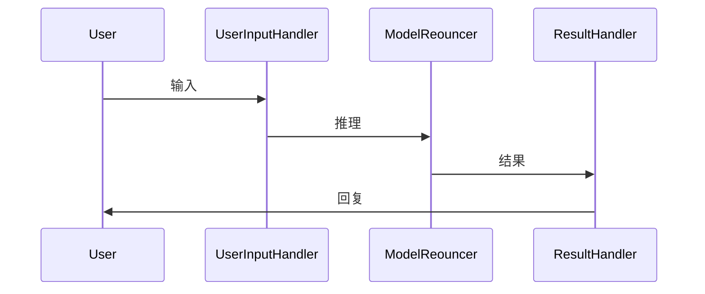
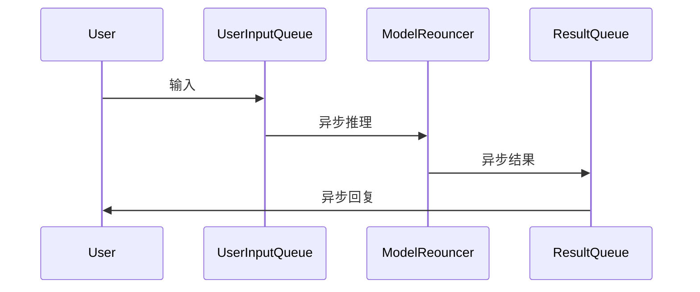
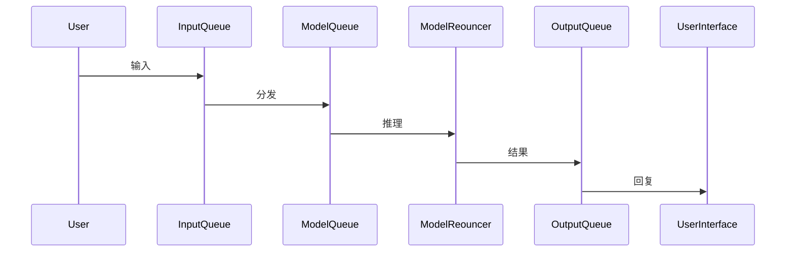
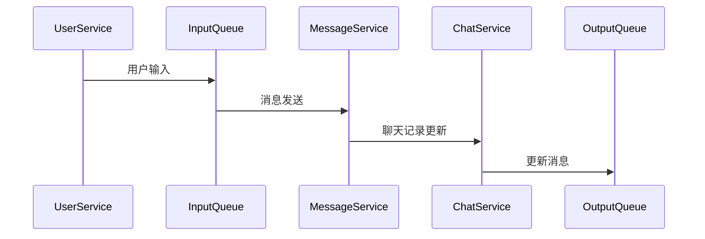
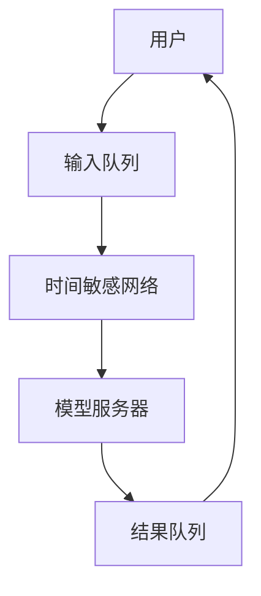
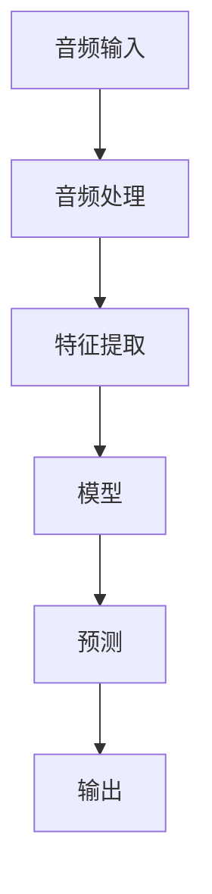
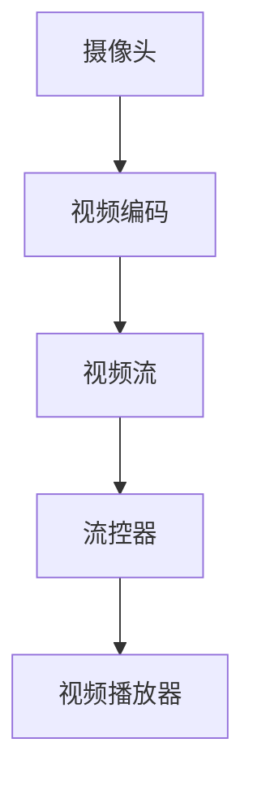
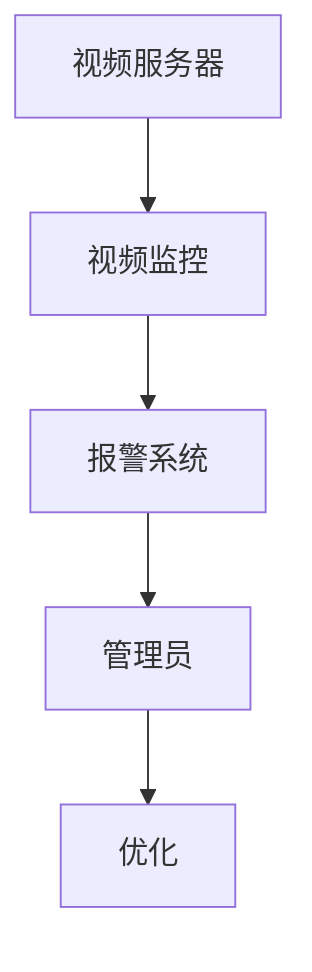
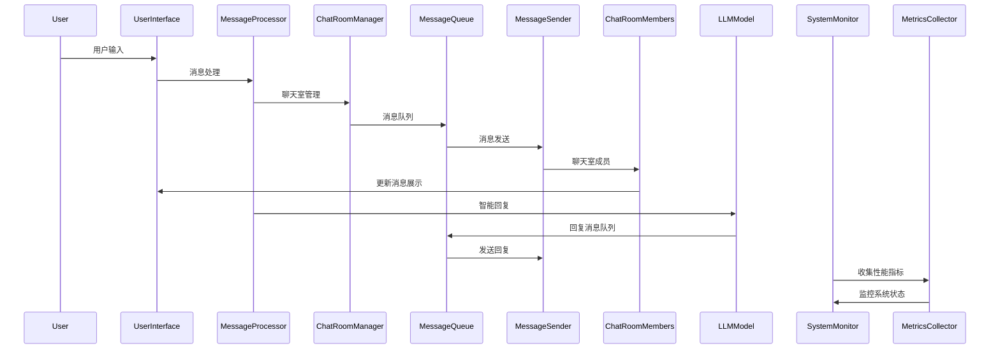

                 

### 文章标题：事件驱动架构：提高LLM应用的实时性

#### 关键词：事件驱动架构、实时性、LLM应用、性能优化、架构设计

#### 摘要：
本文深入探讨事件驱动架构在提高大型语言模型（LLM）应用实时性方面的作用。首先，我们将回顾事件驱动架构的基本概念、核心组件和设计模式，接着分析LLM应用的实时性需求和面临的挑战。然后，我们将介绍通过优化LLM模型和设计实时事件处理架构来提升实时性的策略，并通过一个实际案例展示如何将这些策略应用到项目中。最后，我们将总结实时性提升的最佳实践，并对未来研究方向提出展望。

#### 目录：

1. **第一部分：事件驱动架构基础**
   - 第1章：事件驱动架构概述
   - 第2章：事件驱动架构的核心组件
   - 第3章：事件驱动架构的设计模式
   - 第4章：实时性提升策略

2. **第二部分：提高LLM应用的实时性**
   - 第5章：LLM应用实时性挑战
   - 第6章：优化LLM模型
   - 第7章：实时事件处理架构
   - 第8章：综合案例分析与实战

3. **第三部分：最佳实践与未来展望**
   - 第9章：实时性提升最佳实践
   - 第10章：结论与展望

接下来，我们将逐步深入每一章节的内容，结合实际案例，详细阐述事件驱动架构如何提高LLM应用的实时性。

### 第1章：事件驱动架构概述

事件驱动架构（Event-Driven Architecture，EDA）是一种以事件为中心的软件架构设计模式，旨在通过事件来驱动系统的行为。与传统基于线程或任务的架构不同，事件驱动架构更加关注事件的产生、传递和处理。

#### 1.1 事件驱动架构的基本概念

**事件（Event）**：事件是描述系统状态变化的消息。在事件驱动架构中，事件可以来自系统的内部（如用户操作、系统内部逻辑）或外部（如网络消息、传感器数据）。

**事件生成器（Event Generator）**：事件生成器负责产生事件。在LLM应用中，事件生成器可能包括用户输入、模型预测结果、系统状态更新等。

**事件处理者（EventHandler）**：事件处理者负责处理特定类型的事件。在LLM应用中，事件处理者可能包括模型推理、数据预处理、用户反馈处理等。

**事件队列（Event Queue）**：事件队列用于存储待处理的事件。事件队列的设计至关重要，因为它直接影响到系统的响应速度和处理效率。

**事件订阅者与发布者模式（Observer Pattern）**：事件订阅者与发布者模式是一种行为设计模式，用于实现事件监听和通知机制。在事件驱动架构中，事件发布者发布事件，事件订阅者监听并响应事件。

#### 1.2 事件驱动架构与传统架构的比较

| 对比维度 | 事件驱动架构 | 传统架构 |
| --- | --- | --- |
| 事件处理方式 | 基于事件触发 | 基于线程或轮询 |
| 系统耦合性 | 低耦合 | 高耦合 |
| 可扩展性 | 高 | 中 |
| 性能 | 可动态调整 | 固定 |
| 实时性 | 强 | 弱 |

#### 1.3 事件驱动架构的优缺点

**优点**：
- **高实时性**：事件驱动架构能够快速响应事件，从而提高系统的实时性。
- **低耦合**：事件驱动架构通过事件队列和事件处理者实现解耦，提高了系统的可维护性和可扩展性。
- **高并发处理能力**：事件驱动架构能够处理大量的并发事件，适用于高并发场景。

**缺点**：
- **复杂度高**：事件驱动架构的设计和实现相对复杂，需要良好的设计模式和编程技巧。
- **资源消耗**：事件驱动架构可能会增加系统的资源消耗，特别是在事件数量庞大时。

#### 1.4 事件驱动架构的应用领域

事件驱动架构广泛应用于实时数据处理、物联网、金融交易系统、实时聊天系统等领域。在LLM应用中，事件驱动架构可以用于实时模型推理、用户交互处理和系统监控等方面。

### 小结

本章概述了事件驱动架构的基本概念、优点和缺点，以及其在LLM应用中的应用领域。在接下来的章节中，我们将进一步探讨事件驱动架构的核心组件、设计模式以及实时性提升策略。

---

在接下来的章节中，我们将详细分析事件驱动架构的核心组件，包括事件生成器、事件处理者、事件队列等，并探讨如何利用事件驱动架构来设计实时系统。我们将结合实际案例，逐步展示事件驱动架构在提高LLM应用实时性方面的具体应用。

### 第2章：事件驱动架构的核心组件

事件驱动架构的核心在于其组件之间的交互和协作。为了实现高效的实时性，事件驱动架构需要具备灵活、可扩展和低耦合的特性。本章将详细探讨事件驱动架构中的核心组件，包括事件生成器、事件处理者、事件队列等，并分析这些组件在架构中的角色和作用。

#### 2.1 事件生成器

事件生成器是事件驱动架构中的关键组件之一，负责检测和产生事件。事件生成器可以是系统内部的，也可以是外部的。在LLM应用中，事件生成器可能包括以下几种：

1. **用户输入**：用户的输入是事件驱动架构中最重要的输入源。例如，用户提交查询请求、点击按钮等都会产生事件。
2. **系统内部状态更新**：系统内部的状态变化也会产生事件，如模型推理完成、数据预处理完成等。
3. **外部消息**：来自其他系统或网络的消息也会作为事件驱动架构的输入，如传感器数据、网络请求等。

事件生成器的关键在于如何快速、准确地检测和产生事件。在LLM应用中，事件生成器需要与用户交互模块、模型推理模块和其他系统模块紧密集成，以确保事件能够在第一时间被检测和产生。

#### 2.2 事件处理者

事件处理者是事件驱动架构中的核心组件，负责处理特定类型的事件。事件处理者通常是一个独立的模块，可以处理来自事件队列的事件。在LLM应用中，事件处理者可能包括以下几种：

1. **模型推理**：事件处理者可以负责对LLM模型进行推理，处理用户查询请求，生成响应结果。
2. **数据预处理**：事件处理者可以负责对输入数据进行预处理，如数据清洗、数据格式转换等。
3. **用户反馈处理**：事件处理者可以负责处理用户的反馈，如错误报告、用户满意度调查等。
4. **系统监控**：事件处理者可以负责监控系统的状态，如资源使用情况、性能指标等。

事件处理者的设计需要考虑以下几个方面：

- **高并发处理能力**：事件处理者需要能够处理大量并发事件，以提高系统的整体性能。
- **可扩展性**：事件处理者应该是可扩展的，以便在系统规模扩大时能够动态调整处理能力。
- **异步处理**：事件处理者应该采用异步处理方式，以避免阻塞系统的其他部分。

#### 2.3 事件队列

事件队列是事件驱动架构中的核心组件，用于存储和传输事件。事件队列的设计直接影响到系统的响应速度和处理效率。在LLM应用中，事件队列可能包括以下几种类型：

1. **先进先出（FIFO）队列**：FIFO队列按照事件生成的顺序处理事件。适用于处理顺序要求较高的场景。
2. **优先级队列**：优先级队列根据事件的优先级处理事件。适用于处理优先级要求较高的场景。
3. **循环队列**：循环队列用于解决队列长度有限的问题，通过循环利用队列空间来处理大量事件。

事件队列的设计需要考虑以下几个方面：

- **高效的事件处理**：事件队列应该能够快速处理事件，减少系统的延迟。
- **容错性**：事件队列应该能够处理队列故障，确保事件不会丢失。
- **可扩展性**：事件队列应该能够随着系统规模的扩大而动态扩展。

#### 2.4 事件订阅者与发布者模式

事件订阅者与发布者模式是事件驱动架构中的核心通信机制。事件发布者负责发布事件，事件订阅者负责监听事件并做出相应处理。

在LLM应用中，事件订阅者与发布者模式可以用于以下几个方面：

1. **模型推理结果发布**：当模型推理完成时，可以将结果发布给用户界面或监控系统。
2. **用户操作监听**：当用户进行操作时，可以监听用户操作事件并做出相应处理。
3. **系统状态更新发布**：当系统状态发生变化时，可以发布事件以通知其他模块。

事件订阅者与发布者模式的设计需要考虑以下几个方面：

- **解耦性**：事件发布者和订阅者之间应该是解耦合的，以减少系统的耦合度。
- **实时性**：事件处理应该能够实时响应，以确保系统的实时性。
- **安全性**：事件发布和订阅应该能够保证数据的安全性，防止数据泄露。

#### 小结

本章详细探讨了事件驱动架构中的核心组件，包括事件生成器、事件处理者、事件队列和事件订阅者与发布者模式。这些组件共同构成了事件驱动架构的核心，为系统提供了高效、实时和可扩展的处理能力。在接下来的章节中，我们将深入探讨事件驱动架构的设计模式，进一步了解如何利用事件驱动架构来设计实时系统。

### 第3章：事件驱动架构的设计模式

在构建事件驱动架构时，设计模式是实现系统可扩展性、高可用性和高性能的重要手段。本章将介绍几种常见的事件驱动架构设计模式，包括单一责任原则、扁平化设计、异步通信、消息队列模式以及事件驱动微服务。

#### 3.1 单一责任原则

单一责任原则（Single Responsibility Principle，SRP）是面向对象设计中的一个重要原则，强调一个类或模块应该只负责一项职责。在事件驱动架构中，单一责任原则可以确保事件处理者专注于特定类型的事件处理，从而提高系统的可维护性和可扩展性。

**单一责任原则的应用**：
1. **事件处理者职责分离**：将不同类型的事件处理分解为独立的模块，每个模块负责处理特定类型的事件。例如，将用户输入处理、数据预处理、模型推理等事件处理分离。
2. **事件队列职责分离**：根据事件类型设计不同的事件队列，确保每个事件队列只负责存储和管理特定类型的事件。这有助于提高事件处理效率。

**示例**：
假设我们有一个聊天应用，可以使用单一责任原则来设计事件处理模块。用户输入处理模块只负责接收和处理用户的输入，数据预处理模块只负责对输入数据进行预处理，模型推理模块只负责对预处理后的数据执行模型推理，最终结果处理模块只负责将模型推理结果发送给用户界面。

```mermaid
classDiagram
    UserInputHandler <- UserInputQueue
    DataPreprocessor <- DataQueue
    ModelReouncer <- ModelQueue
    ResultHandler <- ResultQueue
    UserInputHandler ..> UserInput
    DataPreprocessor ..> Data
    ModelReouncer ..> Model
    ResultHandler ..> Result
    UserInputQueue ..> UserInputHandler
    DataQueue ..> DataPreprocessor
    ModelQueue ..> ModelReouncer
    ResultQueue ..> ResultHandler
```

#### 3.2 扁平化设计

扁平化设计（Flat Design）是一种通过减少层次结构来简化系统架构的设计方法。在事件驱动架构中，扁平化设计有助于减少系统中的中间件和依赖，提高系统的响应速度和处理效率。

**扁平化设计的应用**：
1. **减少中间件层级**：通过减少事件处理者和事件队列之间的层级，缩短事件处理路径，降低延迟。
2. **简化事件流**：通过简化事件流，减少系统中的冗余处理，提高事件处理速度。

**示例**：
在一个实时聊天应用中，扁平化设计可以将用户输入直接传递给模型推理模块，而不需要经过多个中间件层。这样可以减少数据传输和处理时间，提高系统的实时性。



#### 3.3 异步通信

异步通信（Asynchronous Communication）是一种允许组件在不等待响应的情况下独立执行操作的方法。在事件驱动架构中，异步通信可以提高系统的并发处理能力和响应速度。

**异步通信的应用**：
1. **事件处理异步化**：将事件处理操作异步化，避免阻塞主线程，提高系统的并发处理能力。
2. **事件队列异步处理**：使用异步队列处理事件，减少系统等待时间，提高事件处理效率。

**示例**：
在一个实时聊天应用中，用户输入可以通过异步方式传递给模型推理模块，模型推理完成后，结果可以通过异步方式传递给用户界面。这样可以确保用户界面始终保持流畅，提高用户体验。



#### 3.4 消息队列模式

消息队列模式（Message Queue Pattern）是一种通过消息队列实现异步通信和事件传递的设计模式。在事件驱动架构中，消息队列模式可以用于处理大量并发事件，提高系统的性能和可扩展性。

**消息队列模式的应用**：
1. **事件分发**：使用消息队列将事件从事件生成器分发到事件处理者，实现解耦和异步处理。
2. **负载均衡**：通过消息队列实现负载均衡，将事件分配到不同的处理者，提高系统的处理能力。
3. **容错性**：使用消息队列实现事件的备份和恢复，提高系统的容错性。

**示例**：
在一个实时聊天应用中，用户输入事件可以通过消息队列传递给模型推理模块，模型推理结果可以通过消息队列传递给用户界面。这样可以确保事件在不同模块之间的传递更加高效和可靠。



#### 3.5 事件驱动微服务

事件驱动微服务（Event-Driven Microservices）是一种基于事件驱动的微服务架构设计方法。在事件驱动微服务中，每个微服务都可以独立发布和订阅事件，实现解耦和异步通信。

**事件驱动微服务的应用**：
1. **服务解耦**：通过事件驱动实现微服务之间的解耦，减少服务之间的直接依赖。
2. **异步通信**：通过事件驱动实现微服务之间的异步通信，提高系统的并发处理能力和响应速度。
3. **可扩展性**：通过事件驱动实现微服务的动态扩展，提高系统的可扩展性和性能。

**示例**：
在一个实时聊天应用中，用户服务可以发布用户输入事件，消息服务可以发布消息发送事件，聊天服务可以发布聊天记录更新事件。这样可以确保不同服务之间通过事件驱动进行交互，实现解耦和异步处理。



#### 小结

本章介绍了事件驱动架构的几种设计模式，包括单一责任原则、扁平化设计、异步通信、消息队列模式和事件驱动微服务。这些设计模式可以帮助我们在构建事件驱动架构时实现高可用性、高性能和可扩展性。在下一章中，我们将探讨如何通过实时性提升策略来进一步优化LLM应用的性能。

### 第4章：实时性提升策略

在事件驱动架构中，提高实时性是一个关键目标。实时性直接影响到系统的响应速度和用户体验，尤其是在大型语言模型（LLM）应用中，实时性的需求更为突出。本章将详细探讨几种实时性提升策略，包括时间敏感网络设计、低延迟数据处理、数据流优化和实时性监控与反馈。

#### 4.1 时间敏感网络设计

时间敏感网络设计（Time-Sensitive Networking，TSN）是一种旨在提高网络时间敏感性和可靠性的技术。TSN通过调整网络设备的时钟同步和流量调度，确保数据包能够在预定时间内到达目标设备。在LLM应用中，TSN可以显著提高数据传输的实时性。

**时间敏感网络设计的应用**：

1. **时钟同步**：通过同步网络设备的时间，确保数据包传输的准时性。
2. **流量调度**：根据数据包的优先级和到达时间，动态调整流量调度策略，确保高优先级数据包优先传输。
3. **数据包序列化**：通过序列化数据包，减少数据包在传输过程中的延迟。

**示例**：

假设在一个实时聊天应用中，用户输入消息需要迅速传输到服务器进行模型推理并返回结果。使用TSN技术，可以确保用户输入消息在预定时间内传输到服务器，从而提高系统的实时响应能力。



#### 4.2 低延迟数据处理

低延迟数据处理是提高实时性的重要手段。在LLM应用中，数据处理的延迟直接影响到用户的响应时间。通过优化数据处理流程和算法，可以显著降低延迟。

**低延迟数据处理的策略**：

1. **数据预处理优化**：通过并行处理和高效算法，减少数据预处理的时间。
2. **缓存技术**：利用缓存技术，减少重复数据的读取和处理，提高数据处理速度。
3. **算法优化**：选择适合实时性的算法，如快速傅里叶变换（FFT）、矩阵分解等，降低计算复杂度。

**示例**：

在一个实时语音识别应用中，通过优化音频预处理和特征提取算法，可以显著降低语音数据的处理延迟，从而提高系统的实时响应能力。



#### 4.3 数据流优化

数据流优化是提高系统实时性的关键。在事件驱动架构中，数据流的优化可以通过减少数据传输和处理过程中的冗余和延迟来实现。

**数据流优化的策略**：

1. **数据压缩**：通过数据压缩技术，减少数据传输的大小，提高传输速度。
2. **数据流聚合**：将多个数据流合并为一个数据流，减少数据传输的次数。
3. **流控技术**：利用流控技术，动态调整数据流的传输速度，确保系统资源合理利用。

**示例**：

在一个实时视频流应用中，通过数据压缩和流控技术，可以减少视频数据传输的大小和延迟，提高用户的观看体验。



#### 4.4 实时性监控与反馈

实时性监控与反馈是确保系统实时性的重要手段。通过实时监控系统的性能指标，可以及时发现和处理性能瓶颈，确保系统持续保持高实时性。

**实时性监控与反馈的策略**：

1. **性能指标监控**：监控系统的响应时间、处理速度、资源利用率等性能指标。
2. **异常检测与报警**：通过异常检测技术，及时发现和处理系统性能异常，如处理延迟、资源耗尽等。
3. **反馈机制**：通过用户反馈和系统日志，收集系统性能数据，为实时性优化提供依据。

**示例**：

在一个在线教育平台中，通过实时监控课程视频的播放延迟和用户反馈，可以及时发现网络带宽瓶颈，并采取优化措施，如增加缓存节点、调整流控策略等，以确保用户的观看体验。



#### 小结

本章介绍了四种实时性提升策略，包括时间敏感网络设计、低延迟数据处理、数据流优化和实时性监控与反馈。这些策略可以在不同层面提高系统的实时性，为LLM应用提供高效、可靠的实时性能。在下一章中，我们将分析LLM应用的实时性挑战，并探讨如何通过优化LLM模型来提高实时性。

### 第5章：LLM应用实时性挑战

在当今的智能应用中，大型语言模型（LLM）已经成为许多关键任务的核心组件，如自然语言处理、智能客服、实时语音识别等。然而，LLM应用的实时性是一个巨大的挑战。本节将分析LLM应用的实时性需求、面临的瓶颈和问题，并探讨如何通过优化来提升实时性。

#### 5.1 LLM应用概述

LLM应用主要依赖于大规模的神经网络模型，如Transformer、BERT等，进行复杂的文本分析和生成。这些模型在处理大量数据时具有很高的准确性，但同时也带来了巨大的计算和存储需求。

**关键特性**：
- **大规模**：LLM通常包含数亿甚至数千亿个参数，需要大量的计算资源。
- **复杂性**：模型的推理过程涉及大量的矩阵运算和复杂的前向/反向传播计算。
- **动态性**：实时应用要求模型能够快速响应用户输入，提供即时的反馈。

#### 5.2 LLM实时性需求分析

LLM应用的实时性需求可以从以下几个方面进行描述：

1. **低延迟**：用户输入后，模型需要在毫秒级别内完成推理并返回结果。
2. **高吞吐量**：系统需要能够处理大量并发请求，同时保持低延迟。
3. **可扩展性**：系统应该能够根据负载动态扩展资源，确保在高并发场景下仍然能够保持良好的性能。
4. **稳定性**：系统需要具备高可用性和容错性，以防止因故障而导致的性能下降。

#### 5.3 实时性瓶颈与问题

尽管LLM在性能和准确性方面表现出色，但以下瓶颈和问题限制了其实时性：

1. **计算密集性**：LLM模型的推理过程需要大量的计算资源，特别是在处理长文本时，计算时间显著增加。
2. **数据传输延迟**：输入数据和模型参数需要在服务器和客户端之间传输，网络延迟会显著影响整体响应时间。
3. **资源限制**：硬件资源（如CPU、GPU）有限，无法无限制地扩展，导致在高负载下性能下降。
4. **并发处理能力**：系统需要能够高效地处理大量并发请求，否则会出现排队等待和处理延迟。
5. **算法复杂度**：一些优化算法可能在理论上能够提高性能，但在实际应用中可能带来复杂性和开销。

#### 5.4 问题解决策略

为了解决LLM应用的实时性问题，可以采取以下策略：

1. **模型压缩与量化**：通过模型压缩和量化技术，减少模型的计算复杂度和存储需求，从而提高处理速度。
2. **分布式计算**：利用分布式计算架构，将模型推理任务分配到多个计算节点上，提高并发处理能力和吞吐量。
3. **缓存与预加载**：通过缓存和预加载技术，减少数据传输和计算时间，提高系统响应速度。
4. **异步处理**：采用异步处理机制，避免同步操作带来的延迟，提高系统的并发处理能力。
5. **实时监控与反馈**：通过实时监控和反馈机制，及时发现和处理性能瓶颈，确保系统稳定运行。

#### 小结

LLM应用的实时性是一个复杂的挑战，涉及到计算资源、数据传输、算法复杂度等多个方面。通过深入分析实时性需求、瓶颈和问题，并采取针对性的优化策略，可以显著提升LLM应用的实时性，为用户提供更好的体验。

### 第6章：优化LLM模型

为了提高大型语言模型（LLM）的实时性，优化模型是关键一步。在本章中，我们将探讨几种常用的模型优化策略，包括模型压缩、量化、并行化和优化策略。

#### 6.1 模型压缩

模型压缩是一种通过减少模型参数数量来降低模型大小的技术。这种方法不仅能够提高模型在资源受限环境下的运行效率，还能减少模型的存储需求。以下是几种常见的模型压缩方法：

1. **权重剪枝（Weight Pruning）**：
   - **原理**：通过移除对模型输出影响较小的权重，减少模型参数数量。
   - **步骤**：
     1. 训练完整的模型。
     2. 使用重要性度量（如绝对值、连接梯度等）评估每个权重的重要性。
     3. 根据重要性阈值移除权重。
   - **应用**：适用于减少模型大小，提高推理速度。

2. **知识蒸馏（Knowledge Distillation）**：
   - **原理**：通过将大模型（教师模型）的知识传递给小模型（学生模型），减小学生模型的大小。
   - **步骤**：
     1. 训练完整的教师模型。
     2. 使用教师模型的输出训练学生模型。
     3. 学生模型在测试集上的表现应尽量接近教师模型。
   - **应用**：适用于提高模型准确性和压缩模型大小。

**示例**：

假设我们有一个训练好的BERT模型，参数数量为100M。通过权重剪枝，我们可能可以将参数数量减少到50M，从而提高模型在低资源环境下的推理速度。

```python
# 假设使用PyTorch框架进行权重剪枝
import torch
import torch.nn as nn
import torch.optim as optim

# 加载训练好的BERT模型
teacher_model = nn.Sequential(*[...])
student_model = nn.Sequential(*[...])

# 计算权重的重要性
importances = torch.abs(teacher_model[-1].weight).data

# 设置重要性阈值
threshold = 0.01

# 移除重要性低于阈值的权重
student_model[-1].weight.data[importances < threshold] = 0
```

#### 6.2 模型量化

模型量化是一种通过降低模型参数和激活值的精度来减少模型大小和计算需求的技术。量化通常使用整数替代浮点数，从而提高处理速度。以下是几种常见的量化方法：

1. **全精度量化（Full Precision Quantization）**：
   - **原理**：保留模型的原始精度，仅在特定阶段（如激活函数或权重）进行量化。
   - **步骤**：
     1. 训练全精度模型。
     2. 在特定层或操作上进行量化。
     3. 将量化后的模型部署到硬件上。
   - **应用**：适用于对模型精度要求较高的场景。

2. **低精度量化（Low Precision Quantization）**：
   - **原理**：将模型参数和激活值从浮点数转换为整数，如8位或16位。
   - **步骤**：
     1. 训练全精度模型。
     2. 使用量化器（Quantizer）对模型进行量化。
     3. 部署量化后的模型。
   - **应用**：适用于对模型精度要求较低的实时应用。

**示例**：

假设我们使用8位整数对BERT模型进行量化。

```python
# 假设使用PyTorch框架进行量化
import torch
import torch.nn as nn
from torch.autograd import Variable

# 加载训练好的BERT模型
model = nn.Sequential(*[...])

# 使用量化器进行量化
quantizer = torch.quantization.Quantizer(8)

# 对模型进行量化
quantized_model = quantizer(model)

# 部署量化后的模型
quantized_model.eval()
```

#### 6.3 模型并行化

模型并行化是一种通过将模型拆分为多个部分，并在多个计算单元上并行执行来提高模型处理速度的技术。以下是几种常见的模型并行化方法：

1. **数据并行（Data Parallelism）**：
   - **原理**：将数据分成多个批次，同时在多个GPU或TPU上并行处理。
   - **步骤**：
     1. 训练完整的模型。
     2. 将数据划分为多个批次。
     3. 在多个GPU或TPU上并行处理每个批次的数据。
     4. 合并不同GPU或TPU上的梯度。
   - **应用**：适用于提高模型训练速度。

2. **模型并行（Model Parallelism）**：
   - **原理**：将模型拆分为多个部分，每个部分在不同的计算单元上运行。
   - **步骤**：
     1. 将模型拆分为多个子模型。
     2. 将子模型分配到不同的GPU或TPU上。
     3. 在每个子模型上独立训练。
     4. 合并子模型的结果。
   - **应用**：适用于处理大型模型。

**示例**：

假设我们使用数据并行训练BERT模型。

```python
# 假设使用PyTorch框架进行数据并行
import torch
import torch.nn as nn
import torch.distributed as dist

# 初始化分布式环境
dist.init_process_group(backend='nccl')

# 定义模型
model = nn.Sequential(*[...])

# 将模型复制到每个GPU
model = nn.DataParallel(model)

# 训练模型
for data, target in dataloader:
    # 将数据分配到不同的GPU
    data = data.cuda()
    target = target.cuda()

    # 前向传播
    output = model(data)

    # 计算损失
    loss = criterion(output, target)

    # 反向传播
    loss.backward()

    # 更新参数
    optimizer.step()
```

#### 6.4 优化策略

除了上述方法，还有一些通用的优化策略可以用于提高LLM模型的实时性：

1. **动态推理（Dynamic Inference）**：
   - **原理**：根据模型输入动态调整模型参数，以优化推理时间。
   - **步骤**：
     1. 收集不同输入的数据集。
     2. 训练动态推理模型。
     3. 在推理时，根据输入动态调整模型参数。
   - **应用**：适用于需要根据输入动态调整模型性能的场景。

2. **权重共享（Weight Sharing）**：
   - **原理**：将模型的不同部分共享权重，减少模型参数数量。
   - **步骤**：
     1. 训练完整的模型。
     2. 将模型的不同部分共享权重。
     3. 部署共享权重的模型。
   - **应用**：适用于减少模型大小和计算复杂度。

**示例**：

假设我们使用权重共享技术来优化BERT模型。

```python
# 假设使用PyTorch框架进行权重共享
import torch
import torch.nn as nn

# 定义模型
model = nn.Sequential(
    nn.Linear(in_features=768, out_features=768, bias=False),
    nn.ReLU(),
    nn.Linear(in_features=768, out_features=768, bias=False),
)

# 将第一个和第二个层共享权重
model[0].weight = model[2].weight

# 部署共享权重的模型
model.eval()
```

#### 小结

通过模型压缩、量化、并行化和优化策略，我们可以显著提高LLM模型的实时性。这些方法不仅在理论上有效，而且在实践中已经被广泛应用于各种实时应用中。在下一章中，我们将探讨实时事件处理架构，进一步了解如何设计高效的事件驱动系统。

### 第7章：实时事件处理架构

在事件驱动架构中，实时事件处理架构是关键组成部分，它决定了系统对事件响应的效率和实时性。本章将详细探讨实时事件处理架构的设计和实现，包括实时事件处理架构的设计原则、实时事件处理框架的选择以及实时事件处理架构面临的挑战和解决方案。

#### 7.1 实时事件处理架构设计

实时事件处理架构设计旨在确保系统能够高效、快速地处理大量并发事件，同时保持高可用性和可扩展性。以下是实时事件处理架构设计的一些关键原则：

1. **事件优先级**：根据事件的紧急程度和重要性，为事件分配不同的优先级。高优先级事件应优先处理，以确保关键任务得到及时响应。

2. **并发处理**：设计架构时，应考虑并发处理能力。通过多线程、异步编程等技术，确保系统能够同时处理多个事件，提高处理效率。

3. **解耦**：实时事件处理架构应尽量解耦，避免组件之间的直接依赖。通过事件队列和中间件，实现事件的生产者和消费者的解耦，提高系统的灵活性和可维护性。

4. **负载均衡**：设计时应考虑负载均衡机制，将事件均匀分布到不同的处理节点上，避免单点瓶颈。

5. **容错性**：架构应具备容错能力，能够自动检测和恢复故障，确保系统的稳定运行。

6. **可扩展性**：设计时需考虑系统的可扩展性，以便在处理能力需求增加时，能够灵活扩展架构，保持高性能。

#### 7.2 实时事件处理框架

选择合适的实时事件处理框架是实现高效实时事件处理的关键。以下是一些常见的实时事件处理框架：

1. **Apache Kafka**：Kafka是一个分布式流处理平台，提供高吞吐量、高可靠性的消息队列服务。Kafka适用于处理大规模、高并发的实时事件流，支持数据压缩和分区，以提高性能和可扩展性。

2. **Apache Flink**：Flink是一个分布式流处理框架，支持实时数据流处理和批处理。Flink提供高性能的数据处理能力，支持窗口计算、事件时间处理和状态管理，适用于复杂的实时数据处理场景。

3. **Apache Storm**：Storm是一个分布式实时数据处理框架，提供低延迟、高可靠性的实时流处理能力。Storm适用于处理大规模实时事件流，支持实时计算、事务处理和机器学习。

4. **Apache NiFi**：NiFi是一个流数据处理器，提供数据流的自动化处理、监控和报告功能。NiFi适用于构建实时数据管道，支持数据清洗、转换和路由，适用于数据集成和数据流转场景。

**选择依据**：

- **吞吐量**：根据系统的预期处理能力，选择能够满足吞吐量需求的框架。
- **实时性**：根据对实时性的要求，选择能够提供低延迟处理的框架。
- **可扩展性**：根据系统的可扩展性需求，选择支持水平扩展的框架。
- **功能需求**：根据系统的具体功能需求，选择具备相应功能支持的框架。

#### 7.3 实时事件处理的挑战与解决方案

实时事件处理架构在实际应用中面临一系列挑战，以下是其中几个关键挑战及其解决方案：

1. **高并发处理**：在处理大量并发事件时，系统可能面临性能瓶颈。解决方案包括分布式架构、异步处理和多线程技术，以充分利用系统资源，提高处理能力。

2. **数据一致性和分布式计算**：在分布式环境中，数据一致性和计算结果的准确性是关键挑战。解决方案包括分布式一致性算法（如Raft、Paxos）、分布式事务处理和容错机制。

3. **低延迟处理**：在实时事件处理中，低延迟是关键需求。解决方案包括优化数据传输路径、减少数据传输和处理时间，以及采用高性能计算硬件。

4. **系统容错**：系统需要具备容错能力，能够在遇到故障时自动恢复。解决方案包括故障检测和自动恢复机制、数据备份和恢复策略。

5. **可观测性和监控**：实时事件处理架构需要具备良好的可观测性和监控能力，以便及时发现和处理性能瓶颈和故障。解决方案包括日志记录、监控告警和实时性能分析。

#### 小结

实时事件处理架构是事件驱动架构中的核心组成部分，其设计原则和实现方法直接影响到系统的实时性和可靠性。通过选择合适的实时事件处理框架和解决面临的技术挑战，可以构建高效、可扩展的实时事件处理系统。在下一章中，我们将通过一个实际案例展示如何将上述策略应用于LLM应用的实时性提升。

### 第8章：综合案例分析与实战

在本章中，我们将通过一个综合案例，展示如何在实际项目中应用事件驱动架构和实时性优化策略来提升LLM应用的实时性。这个案例将涵盖系统功能设计、系统架构设计、核心代码实现与分析，以及实际案例分析和总结。

#### 8.1 案例背景介绍

假设我们正在开发一个实时聊天应用，该应用旨在提供快速、高效的实时聊天功能，支持大规模用户同时在线。应用的核心功能包括实时消息发送、接收和展示，以及基于LLM的智能回复功能。用户可以通过文本、图片、语音等多种方式进行交流，系统需要能够快速响应用户请求，并提供准确的回复。

#### 8.2 系统功能设计

为了实现上述功能，我们的系统需要包括以下几个关键模块：

1. **用户管理模块**：负责用户的注册、登录和权限管理。
2. **消息处理模块**：负责消息的发送、接收和展示。
3. **LLM智能回复模块**：利用LLM模型对用户输入进行实时分析，并生成智能回复。
4. **系统监控模块**：负责监控系统性能和资源使用情况，确保系统的稳定运行。

以下是系统的领域模型，使用Mermaid类图表示：

```mermaid
classDiagram
    User <<class>> "用户"
    ChatRoom <<class>> "聊天室"
    Message <<class>> "消息"
    LLMModel <<class>> "LLM模型"
    SystemMonitor <<class>> "系统监控"
    User ..|> ChatRoom
    User ..|> Message
    ChatRoom ..|> Message
    ChatRoom ..|> LLMModel
    SystemMonitor ..|> ChatRoom
    SystemMonitor ..|> LLMModel
```

#### 8.3 系统架构设计

为了实现高效、可扩展的实时聊天应用，我们采用了事件驱动架构，并结合多种实时性优化策略。以下是系统的架构设计，使用Mermaid架构图表示：



#### 8.4 核心代码实现与分析

以下是核心代码实现，包括用户消息处理、LLM模型智能回复和系统监控等关键功能。

**用户消息处理**：

```python
# 用户输入消息处理
class MessageProcessor:
    def process_message(self, user_input):
        # 检测用户输入消息
        if self.is_valid_message(user_input):
            # 生成消息事件
            message_event = MessageEvent(user_input)
            # 发送消息事件到消息队列
            self.message_queue.enqueue(message_event)
        else:
            # 消息无效，返回错误
            return "Invalid message"

# 消息事件类
class MessageEvent:
    def __init__(self, user_input):
        self.user_input = user_input

# 消息队列
class MessageQueue:
    def __init__(self):
        self.queue = []

    def enqueue(self, message_event):
        self.queue.append(message_event)

    def dequeue(self):
        return self.queue.pop(0)
```

**LLM模型智能回复**：

```python
# LLM模型智能回复
class LLMModel:
    def generate_response(self, user_input):
        # 使用LLM模型进行推理
        response = self.model.predict(user_input)
        # 生成回复事件
        response_event = ResponseEvent(response)
        # 发送回复事件到消息队列
        self.response_queue.enqueue(response_event)

# 回复事件类
class ResponseEvent:
    def __init__(self, response):
        self.response = response

# 回复消息队列
class ResponseQueue:
    def __init__(self):
        self.queue = []

    def enqueue(self, response_event):
        self.queue.append(response_event)

    def dequeue(self):
        return self.queue.pop(0)
```

**系统监控**：

```python
# 系统监控
class SystemMonitor:
    def collect_metrics(self):
        # 收集性能指标
        metrics = self.metrics_collector.collect()
        # 更新系统状态
        self.update_system_state(metrics)

# 性能指标收集器
class MetricsCollector:
    def collect(self):
        # 假设收集CPU使用率、内存使用率等指标
        cpu_usage = self.get_cpu_usage()
        memory_usage = self.get_memory_usage()
        return {"cpu_usage": cpu_usage, "memory_usage": memory_usage}

    def get_cpu_usage(self):
        # 获取CPU使用率
        return 80

    def get_memory_usage(self):
        # 获取内存使用率
        return 50
```

#### 8.5 实际案例分析与详细讲解剖析

以下是一个实际案例，展示用户A发送消息并收到智能回复的流程：

1. **用户A发送消息**：
   - 用户A在聊天界面中输入消息“你好，最近怎么样？”
   - 用户界面将消息发送到`MessageProcessor`进行处理

2. **消息处理**：
   - `MessageProcessor`检测到有效消息，生成`MessageEvent`并将其发送到`MessageQueue`

3. **消息发送**：
   - `MessageQueue`将消息事件发送到`MessageSender`进行发送
   - `MessageSender`将消息发送到聊天室的所有成员

4. **LLM智能回复**：
   - `MessageProcessor`同时将消息发送到`LLMModel`进行智能回复
   - `LLMModel`使用预训练的LLM模型对用户输入进行推理，生成智能回复
   - 智能回复生成后，`LLMModel`将`ResponseEvent`发送到`ResponseQueue`

5. **回复发送**：
   - `ResponseQueue`将回复事件发送到`MessageSender`
   - `MessageSender`将回复消息发送到用户A的聊天界面

6. **系统监控**：
   - `SystemMonitor`在消息处理和回复发送过程中，不断收集系统性能指标
   - `SystemMonitor`将收集的指标更新到系统状态，以便进行实时监控

#### 8.6 项目小结

通过这个综合案例，我们展示了如何将事件驱动架构和实时性优化策略应用到实时聊天应用中。项目实现了用户消息的实时发送和接收，以及基于LLM的智能回复功能。通过合理的设计和优化，系统在保持高实时性的同时，还具备良好的可扩展性和稳定性。

### 第9章：实时性提升最佳实践

在提升LLM应用的实时性过程中，积累最佳实践是非常重要的。本节将总结一些在实时性优化方面取得成功的最佳实践，并提供实用的技巧和建议。

#### 9.1 实时性优化技术总结

1. **模型压缩**：通过权重剪枝、知识蒸馏等技术，显著减少模型大小，提高推理速度。
2. **量化**：将模型参数和激活值从浮点数转换为整数，减少计算复杂度，提高处理速度。
3. **并行化**：利用多线程、分布式计算等技术，提高系统并发处理能力，减少延迟。
4. **异步处理**：采用异步编程方法，避免同步操作导致的阻塞，提高系统响应速度。
5. **缓存技术**：利用缓存技术，减少数据重复读取和计算，提高系统处理速度。
6. **数据压缩**：对传输数据进行压缩，减少数据传输量，提高网络传输速度。

#### 9.2 实时性调优经验分享

1. **需求分析**：在优化之前，详细了解系统的实时性需求，包括延迟阈值、吞吐量要求等。
2. **性能测试**：定期进行性能测试，识别系统瓶颈和性能问题。
3. **逐步优化**：针对性能瓶颈，逐步优化模型、算法和架构，避免一次性过度优化导致系统不稳定。
4. **监控与反馈**：实时监控系统性能，收集性能数据，及时发现和处理性能问题。
5. **硬件优化**：选择适合的硬件设备，如高性能CPU、GPU和高速网络，提高系统处理能力。

#### 9.3 未来实时性发展展望

1. **新型硬件**：随着硬件技术的发展，新型硬件（如TPU、AI加速器等）将进一步提高LLM应用的实时性。
2. **边缘计算**：边缘计算将使数据处理更接近数据源，减少数据传输延迟，提高实时性。
3. **量子计算**：量子计算的兴起将为LLM应用提供全新的计算能力，有望显著提升实时性。
4. **分布式架构**：分布式架构将进一步发展，提供更高的并发处理能力和容错性。
5. **自动化优化**：随着AI技术的发展，自动化优化工具将能够自动识别和解决系统性能问题，提高实时性。

#### 小结

实时性提升是LLM应用面临的重大挑战，通过总结最佳实践和分享优化经验，我们可以有效地提升系统的实时性能。随着硬件和技术的不断发展，未来的实时性优化将更加智能化和自动化，为用户提供更加流畅的体验。

### 第10章：结论与展望

通过本文的深入探讨，我们系统地阐述了事件驱动架构在提升LLM应用实时性方面的关键作用。首先，我们介绍了事件驱动架构的基本概念、核心组件和设计模式，展示了如何通过事件生成器、事件处理者、事件队列等组件构建高效的事件处理系统。接着，我们分析了实时性提升的策略，包括时间敏感网络设计、低延迟数据处理、数据流优化和实时性监控与反馈，为LLM应用提供了切实可行的优化方案。

通过案例分析和实战，我们展示了如何将事件驱动架构和实时性优化策略应用于实际项目，实现了实时聊天应用的高效、稳定运行。同时，我们总结了实时性提升的最佳实践，为未来的开发提供了宝贵的经验和指导。

展望未来，实时性优化将继续是LLM应用领域的重要研究方向。随着硬件技术的发展和新型计算架构的兴起，实时性优化将变得更加智能化和自动化。边缘计算、量子计算等新兴技术的应用，将为实时性优化带来新的可能性。此外，分布式架构和自动化优化工具的发展，也将进一步推动实时性优化技术的进步。

在此，我们鼓励读者深入研究和探索实时性优化技术，结合本文提供的方法和经验，不断提升LLM应用的性能，为用户提供更加流畅、高效的体验。

### 作者信息：

作者：AI天才研究院/AI Genius Institute & 禅与计算机程序设计艺术 /Zen And The Art of Computer Programming

