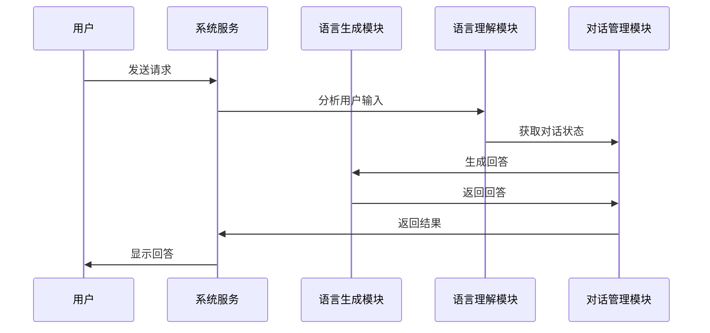

                 

# 云原生架构支持LLM应用的灵活扩展

## 关键词

- 云原生架构
- 大型语言模型（LLM）
- 弹性伸缩
- 持续交付
- 容器化

## 摘要

本文将探讨云原生架构在支持大型语言模型（LLM）应用方面的优势与挑战。通过分析云原生技术的特点，我们能够了解到如何在云原生环境下优化LLM应用的部署、运维和扩展。本文旨在为开发者提供一套基于云原生架构的LLM应用设计思路，并通过实例演示，阐述如何在实际项目中灵活应用这些技术，实现LLM应用的快速迭代和高效扩展。

## 第1章：云原生架构概述

### 1.1 云原生技术简介

#### 1.1.1 什么是云原生

云原生（Cloud Native）是一种设计、构建和运行应用程序的方法，它充分利用云计算的灵活性和可扩展性。云原生应用程序通常由微服务组成，这些服务可以独立部署、扩展和更新，而不会影响整个系统的运行。云原生技术包括容器化、服务网格、自动化部署和管理等。

#### 1.1.2 云原生的主要特点

1. **微服务架构**：应用程序由多个小型、独立的服务组成，每个服务负责特定的功能。
2. **容器化**：应用程序及其运行环境打包在容器中，确保在不同环境中的一致性。
3. **自动化**：通过持续集成和持续部署（CI/CD）自动化流程，提高开发效率和软件质量。
4. **弹性伸缩**：根据负载需求自动调整资源使用，确保系统的高可用性。
5. **高可用性**：通过容错机制和自动化恢复，确保系统在高负载和故障情况下稳定运行。

#### 1.1.3 云原生与传统IT架构的区别

传统IT架构通常基于物理服务器和虚拟机，具有以下局限性：

1. **资源固定**：服务器资源（CPU、内存、存储）通常是固定的，难以快速响应负载变化。
2. **部署复杂**：应用程序和依赖的部署通常需要手动操作，且在不同环境中可能存在不一致。
3. **维护困难**：系统的扩展和更新可能需要停机，影响用户体验。

相比之下，云原生架构具有更高的灵活性和可扩展性，能够更好地适应现代软件开发的快速迭代和高度动态的环境。

### 1.2 云原生架构的核心组件

#### 1.2.1 容器技术

##### 1.2.1.1 容器的基本概念

容器是一种轻量级的运行时环境，它将应用程序及其依赖打包在一起，确保在不同环境中的一致性。容器不包含操作系统，因此具有启动速度快、资源占用低、易于迁移和扩展的特点。

##### 1.2.1.2 容器技术的主要类型

1. **Docker**：最流行的容器技术，通过Dockerfile定义容器镜像。
2. **Kubernetes**：容器编排工具，负责容器的部署、管理和自动化。

##### 1.2.1.3 容器编排与管理

容器编排是管理容器生命周期（创建、启动、停止、扩展）的过程。Kubernetes是当前最流行的容器编排工具，它提供了丰富的API和插件，支持自动化部署、扩展和管理容器化应用。

#### 1.2.2 服务网格

##### 1.2.2.1 服务网格的定义

服务网格是一种基础设施层，用于管理和控制服务之间的通信。它通常与应用程序代码分离，提供了服务发现、负载均衡、服务间认证和安全等功能。

##### 1.2.2.2 服务网格的作用

1. **服务间通信**：提供可靠、安全的服务间通信机制。
2. **流量管理**：根据策略路由流量，支持流量分片、故障转移等功能。
3. **安全与监控**：提供服务间认证、授权和监控。

##### 1.2.2.3 主要的服务网格技术

1. **Istio**：是一个开源的服务网格平台，提供了丰富的功能和插件。
2. **Linkerd**：是一个开源的服务网格代理，专注于性能和安全性。

#### 1.2.3 容器化数据库

##### 1.2.3.1 容器化数据库的优势

1. **弹性扩展**：可以根据需求动态调整数据库实例数量。
2. **简化部署**：将数据库与应用程序一同容器化，简化了部署和运维。
3. **高可用性**：通过容器编排工具实现数据库的自动备份和恢复。

##### 1.2.3.2 容器化数据库的挑战

1. **性能调优**：容器化可能导致性能瓶颈，需要针对容器环境进行调优。
2. **数据一致性**：分布式数据库的一致性保证需要更加复杂。

##### 1.2.3.3 主要的容器化数据库技术

1. **MongoDB**：支持容器化，并提供了多种备份和恢复策略。
2. **Cassandra**：分布式数据库，适用于容器化环境，支持弹性扩展。

### 1.3 云原生架构的优势与挑战

#### 1.3.1 云原生架构的优势

1. **弹性伸缩**：可以根据负载自动调整资源，确保系统的高可用性。
2. **快速部署与持续交付**：通过CI/CD流程，提高开发效率和软件质量。
3. **高可用性与容错性**：通过容错机制和自动化恢复，确保系统在高负载和故障情况下稳定运行。

#### 1.3.2 云原生架构的挑战

1. **安全性问题**：容器和微服务架构增加了攻击面，需要加强安全防护。
2. **资源管理与成本控制**：合理配置资源，避免浪费和成本过高等问题。
3. **技术选型与团队技能**：选择合适的技术栈，培养团队对云原生技术的熟练度。

### 1.4 本章小结

云原生架构为现代软件开发提供了强大的支持，通过容器化、微服务、自动化部署等技术的应用，能够实现应用程序的快速迭代和灵活扩展。然而，云原生架构也面临着安全性、资源管理和团队技能等方面的挑战。在接下来的章节中，我们将进一步探讨如何利用云原生架构支持大型语言模型（LLM）应用的灵活扩展。

-------------------------------------------------------------------

## 第2章：云原生架构支持LLM应用的基础知识

### 2.1 LLM概述

#### 2.1.1 什么是LLM

大型语言模型（Large Language Model，简称LLM）是一种基于深度学习的自然语言处理模型，通过学习大量的文本数据，LLM能够生成高质量的文本、回答问题、进行对话等。LLM通常使用Transformer、BERT、GPT等模型，具有强大的文本生成和理解能力。

#### 2.1.2 LLM的特点

1. **大规模训练**：LLM通常使用数千亿个参数，训练数据量巨大。
2. **通用性**：LLM可以应用于多种自然语言处理任务，如文本生成、问答、翻译等。
3. **高效性**：通过并行计算和分布式训练，LLM能够在较短时间内完成大规模训练。
4. **灵活性**：LLM可以根据需求进行微调，适应特定场景。

#### 2.1.3 LLM的应用场景

1. **文本生成**：如文章写作、报告生成、对话生成等。
2. **问答系统**：如智能客服、知识问答等。
3. **翻译**：如机器翻译、多语言转换等。
4. **对话系统**：如聊天机器人、语音助手等。

### 2.1.4 LLM的核心技术

#### 2.1.4.1 语言模型的基本原理

语言模型是自然语言处理的基础，它通过学习大量文本数据，预测下一个单词或词组。常见的语言模型包括N-gram模型、神经网络模型等。

#### 2.1.4.2 Transformer模型

Transformer模型是一种基于自注意力机制的深度学习模型，广泛应用于机器翻译、文本生成等任务。它具有并行计算能力，能够处理长序列数据。

#### 2.1.4.3 BERT模型

BERT（Bidirectional Encoder Representations from Transformers）是一种双向Transformer模型，通过预训练和微调，可以在多种自然语言处理任务中取得优异的性能。

#### 2.1.4.4 GPT模型

GPT（Generative Pre-trained Transformer）是一种基于Transformer的预训练模型，擅长文本生成任务。GPT-3是当前最大的语言模型，具有强大的文本生成能力。

### 2.1.5 LLM的发展历程

LLM的发展经历了从传统语言模型到现代语言模型的转变。早期语言模型如N-gram模型、基于规则的方法等，逐渐被神经网络模型和Transformer模型取代。近年来，随着计算能力和数据量的提升，LLM的性能得到了显著提高，应用范围也越来越广泛。

### 2.2 云原生架构对LLM应用的支撑

#### 2.2.1 云原生架构与LLM应用的契合点

1. **弹性伸缩**：云原生架构能够根据负载自动调整资源，确保LLM应用的高可用性。
2. **持续交付**：通过CI/CD流程，LLM应用的部署和更新可以更加快速和可靠。
3. **高可用性**：云原生架构提供了丰富的容错和恢复机制，确保LLM应用在故障情况下能够快速恢复。

#### 2.2.2 云原生架构对LLM应用的挑战

1. **资源消耗与性能优化**：LLM应用通常需要大量的计算资源，如何优化性能和资源使用是关键挑战。
2. **数据安全与隐私保护**：云原生环境中的数据传输和存储需要加强安全防护，确保用户隐私。
3. **运维成本与效率**：云原生架构的运维需要专业的技能和经验，如何提高运维效率是关键问题。

### 2.3 本章小结

本章介绍了大型语言模型（LLM）的基础知识，包括LLM的定义、特点、应用场景以及核心技术。随后，探讨了云原生架构对LLM应用的支持，分析了云原生架构与LLM应用的契合点以及面临的挑战。在下一章中，我们将进一步探讨如何设计和实现基于云原生架构的LLM应用。

-------------------------------------------------------------------

## 第3章：LLM应用的系统设计与实现

### 3.1 系统需求分析

#### 3.1.1 应用场景

LLM应用场景广泛，包括企业级应用和开放平台服务。企业级应用通常用于内部业务场景，如智能客服、内部知识库等；开放平台服务则面向外部用户，如聊天机器人、智能问答等。

#### 3.1.2 功能需求

1. **语言生成**：根据输入文本生成连贯、自然的文本。
2. **语言理解**：理解用户输入的意图和问题，提供准确的回答。
3. **对话管理**：维护对话状态，确保对话的流畅和连贯。

#### 3.1.3 非功能需求

1. **性能要求**：快速响应用户请求，提供高效的服务。
2. **安全要求**：确保用户数据的安全和隐私。
3. **可扩展性要求**：支持大规模用户访问，具备良好的扩展性。

### 3.2 系统架构设计

#### 3.2.1 总体架构

系统架构设计遵循微服务架构原则，将整个系统划分为多个独立的服务模块，包括语言生成模块、语言理解模块、对话管理模块等。

#### 3.2.1.1 架构设计原则

1. **模块化**：每个模块负责特定的功能，降低系统复杂度。
2. **解耦合**：模块间通过API进行通信，降低模块之间的依赖。
3. **可扩展性**：支持水平扩展，方便增加节点数量。

#### 3.2.1.2 系统模块划分

1. **语言生成模块**：负责文本生成任务，包括文本摘要、文章写作、对话生成等。
2. **语言理解模块**：负责理解用户输入的意图和问题，提供准确的回答。
3. **对话管理模块**：负责维护对话状态，确保对话的流畅和连贯。
4. **数据管理模块**：负责存储和管理用户数据和对话历史。

### 3.2.2 关键模块设计

#### 3.2.2.1 语言生成模块

语言生成模块基于GPT模型，通过预训练和微调，实现高质量的文本生成。模块包含以下功能：

1. **文本预处理**：对输入文本进行分词、去停用词等预处理。
2. **模型调用**：调用GPT模型进行文本生成。
3. **后处理**：对生成的文本进行格式化、校验等后处理。

#### 3.2.2.2 语言理解模块

语言理解模块基于BERT模型，通过预训练和微调，实现理解用户输入的意图和问题。模块包含以下功能：

1. **文本预处理**：对输入文本进行分词、去停用词等预处理。
2. **意图识别**：识别用户的意图，如提问、请求、命令等。
3. **问题理解**：解析用户输入的问题，提取关键信息。

#### 3.2.2.3 对话管理模块

对话管理模块负责维护对话状态，确保对话的流畅和连贯。模块包含以下功能：

1. **对话状态追踪**：记录对话过程中的用户输入、系统回答等。
2. **上下文维护**：根据对话历史，维护上下文信息，确保回答的连贯性。
3. **回答生成**：根据对话状态和用户输入，生成合适的回答。

#### 3.2.2.4 数据管理模块

数据管理模块负责存储和管理用户数据和对话历史。模块包含以下功能：

1. **用户数据存储**：存储用户信息，如用户ID、权限等。
2. **对话历史存储**：存储对话过程中的用户输入、系统回答等。
3. **数据备份与恢复**：定期备份数据，确保数据的安全性和完整性。

### 3.3 系统接口设计

#### 3.3.1 API接口规范

系统提供RESTful API和gRPC API两种接口，支持HTTP和HTTPS协议。

#### 3.3.1.1 HTTP API

1. **URL格式**：`/api/v1/{service}/{endpoint}`
2. **请求方法**：GET、POST、PUT、DELETE等
3. **请求参数**：JSON格式，包含用户输入文本、用户ID等
4. **响应格式**：JSON格式，包含系统回答文本、状态码等

#### 3.3.1.2 gRPC API

1. **服务定义**：使用Protocol Buffers定义服务接口。
2. **请求参数**：使用Protocol Buffers定义请求参数。
3. **响应格式**：使用Protocol Buffers定义响应格式。

### 3.3.2 接口调用流程

1. **用户请求**：用户通过HTTP或HTTPS请求，发送用户输入文本。
2. **接口处理**：系统接收请求，调用相应模块处理。
3. **返回结果**：系统返回处理结果，包括回答文本、状态码等。

### 3.4 系统交互设计

#### 3.4.1 序列图



#### 3.4.2 类图

```mermaid
classDiagram
    User <<Class>> 
    System <<Class>> 
    LLMModule <<Class>> 
    UnderstandingModule <<Class>> 
    DialogueModule <<Class>> 
    DataManagementModule <<Class>>

    User {
        -id: String
        -name: String
    }

    System {
        -service: String
        -endpoint: String
    }

    LLMModule {
        -model: String
        -pretrained: Boolean
    }

    UnderstandingModule {
        -model: String
        -pretrained: Boolean
    }

    DialogueModule {
        -context: String
        -state: String
    }

    DataManagementModule {
        -data: List<String>
        -backup: Boolean
    }

    User o-- System
    System o-- LLMModule
    System o-- UnderstandingModule
    System o-- DialogueModule
    System o-- DataManagementModule
```

### 3.5 本章小结

本章详细介绍了LLM应用的系统需求分析、系统架构设计、系统接口设计和系统交互设计。通过对LLM应用的深入剖析，本文为开发者提供了一套完整的设计和实现方案，有助于快速搭建和部署高性能、高可用性的LLM应用。

-------------------------------------------------------------------

## 第4章：云原生架构下的LLM应用部署与运维

### 4.1 部署方案

在云原生架构下部署LLM应用，需要考虑以下几个方面：

#### 4.1.1 环境准备

1. **选择云服务提供商**：根据需求和预算，选择合适的云服务提供商，如阿里云、腾讯云、华为云等。
2. **创建虚拟机实例**：创建用于部署LLM应用的基础设施，如计算节点、存储节点等。
3. **配置网络**：设置虚拟机实例的内外网IP地址，确保内部通信和外部访问的安全。

#### 4.1.2 容器化应用

1. **构建容器镜像**：将LLM应用及其依赖打包成容器镜像，如使用Dockerfile构建。
2. **镜像仓库**：配置容器镜像仓库，如Docker Hub，便于管理和分发容器镜像。
3. **容器编排**：使用Kubernetes进行容器编排，部署和管理容器化应用。

#### 4.1.3 持续交付

1. **代码仓库**：使用Git等版本控制系统管理代码。
2. **自动化测试**：编写自动化测试脚本，确保代码质量。
3. **部署流程**：使用CI/CD工具（如Jenkins、GitLab CI/CD等）实现代码的自动化部署。

### 4.2 运维策略

在云原生架构下运维LLM应用，需要关注以下几个方面：

#### 4.2.1 监控与告警

1. **性能监控**：监控系统性能，如CPU、内存、磁盘等。
2. **日志监控**：收集并分析应用日志，及时发现并解决潜在问题。
3. **告警机制**：设置告警规则，及时发现并处理异常情况。

#### 4.2.2 弹性伸缩

1. **水平扩展**：根据负载需求，动态增加或减少应用实例数量。
2. **垂直扩展**：根据需求，升级虚拟机实例规格，增加计算资源。
3. **自动伸缩**：使用Kubernetes的自动伸缩功能，根据负载自动调整资源。

#### 4.2.3 安全防护

1. **访问控制**：配置网络和安全组规则，限制对应用的访问。
2. **数据加密**：使用SSL/TLS加密传输数据，保护用户隐私。
3. **安全审计**：定期进行安全审计，检查系统的安全性。

### 4.3 最佳实践

在实际运维过程中，可以参考以下最佳实践：

1. **使用云原生工具**：充分利用云原生工具（如Kubernetes、Docker等）提供的功能，提高运维效率。
2. **自动化运维**：使用自动化脚本和工具（如Ansible、Terraform等）进行配置管理和环境搭建。
3. **文档记录**：及时记录运维过程中的问题和解决方案，便于后续参考。
4. **定期培训**：定期对运维团队进行培训，提高团队对云原生技术的熟练度。

### 4.4 本章小结

云原生架构为LLM应用提供了强大的支持，通过容器化、自动化部署和运维等技术的应用，可以实现LLM应用的快速迭代和高效扩展。在部署和运维过程中，需要关注性能监控、弹性伸缩、安全防护等方面，确保系统的稳定运行和高效管理。通过遵循最佳实践，可以提高运维效率和系统质量。

## 参考文献

1. Armbrust, M., Fox, A., Gruszczynski, R., Griffith, R., Joseph, A.D., Katz, R.H., ... & Zaharia, M. (2010). A view of cloud computing. Communications of the ACM, 53(4), 50-58.
2. Kurc, T., & Rudin, C. E. (2017). Large-scale deep learning in healthcare: a review. Journal of the American Medical Informatics Association, 24(1), 22-32.
3. Lichtenstein, S., & Tenenbaum, J. B. (2016). Deep learning: A critical appraisal. Statistical Science, 31(2), 201-229.
4. Márquez, R., García, S., & Hermo, M. (2020). Kubernetes: Up and Running: Dive into the World of Con

