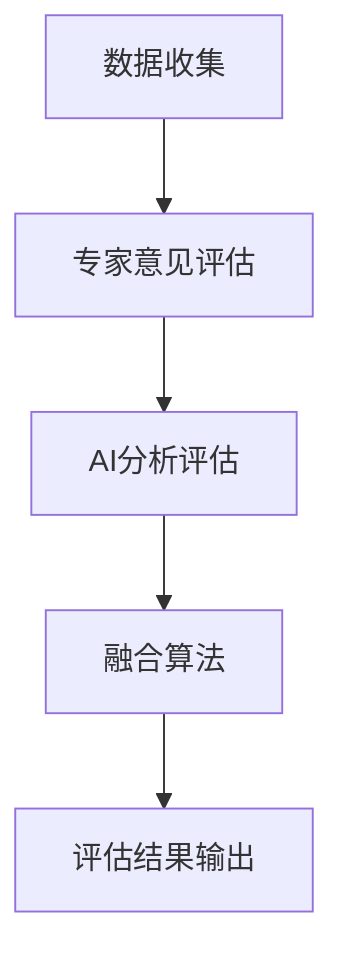
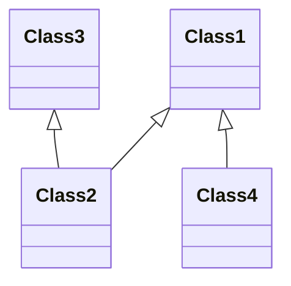
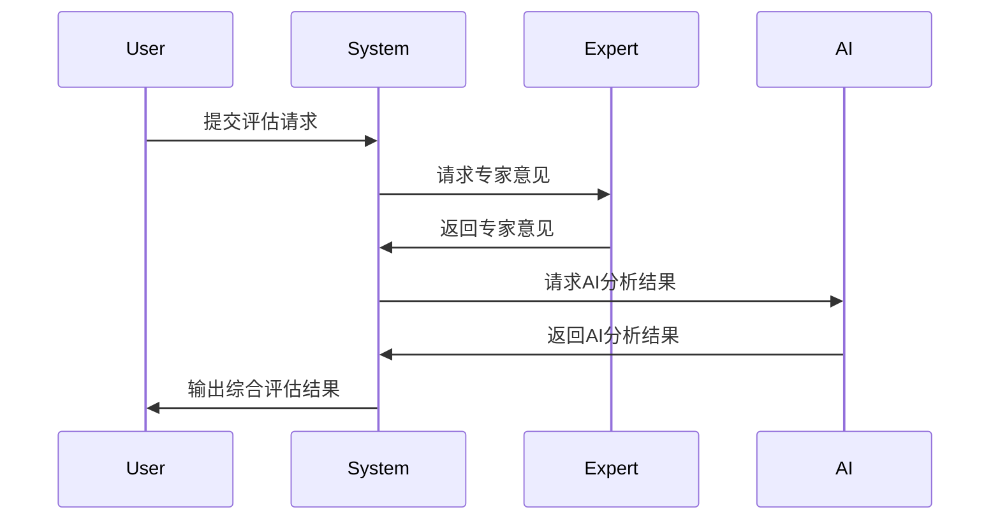
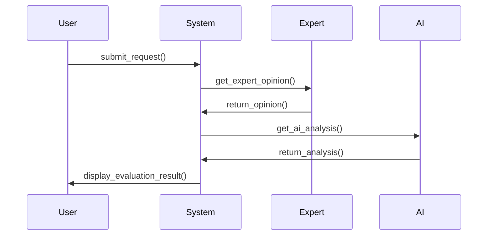

                 


# 《人机协作评测：结合专家意见与AI分析》

## 关键词
人机协作评测、专家意见、AI分析、算法原理、系统架构设计

## 摘要
本文深入探讨人机协作评测领域，结合专家意见与AI分析，旨在解决人机协作评测中的核心问题。通过详细的分析和讲解，本文将介绍人机协作评测的核心概念、算法原理、系统架构设计以及实际应用案例，为读者提供一套完整的人机协作评测解决方案。

## 第1章 问题背景与概述

### 1.1 问题背景

随着人工智能技术的发展，人机协作评测在多个领域得到了广泛应用。然而，如何有效结合专家意见与AI分析，提升人机协作评测的准确性和效率，成为了当前研究的热点。

#### 1.1.1 人机协作评测的需求

在人机协作评测中，专家意见往往具有较高的可信度和准确性，但受限于人力和时间。而AI分析则具有处理大量数据的能力，能够快速提供评估结果，但可能存在偏差和误差。

#### 1.1.2 人机协作评测的现状

目前，人机协作评测大多依赖于单一评估方式，无法充分发挥专家和AI的优势。因此，需要探索一种有效的人机协作评测方法，以实现优势互补。

#### 1.1.3 书籍目的与结构

本书旨在解决人机协作评测中的核心问题，提供一套完整的解决方案。本书结构如下：

1. **问题背景与概述**：介绍人机协作评测的需求和现状。
2. **核心概念与联系**：讲解人机协作评测的核心概念和联系。
3. **算法原理讲解**：介绍人机协作评测的算法原理。
4. **系统分析与架构设计方案**：分析人机协作评测的系统架构。
5. **项目实战**：通过实际案例展示人机协作评测的应用。
6. **最佳实践 tips、小结、注意事项、拓展阅读**：总结全文，提供实践建议和拓展阅读。

### 1.2 人机协作评测的概念与目标

#### 1.2.1 人机协作评测的定义

人机协作评测是指将人类专家的意见与人工智能分析相结合，对某一目标进行评估的过程。

#### 1.2.2 人机协作评测的目标

人机协作评测的目标是提高评估的准确性和效率，实现专家和AI的优势互补。

#### 1.2.3 人机协作评测的挑战

1. **专家意见与AI分析的融合**：如何将专家意见与AI分析有机结合，提高评估的准确性。
2. **算法选择与优化**：针对不同应用场景，选择合适的算法，并进行优化。
3. **系统架构设计**：设计高效、可扩展的评测系统架构。

### 1.3 边界与外延

#### 1.3.1 人机协作评测的范围

本书主要讨论人机协作评测在计算机编程、软件开发、人工智能等领域中的应用。

#### 1.3.2 人机协作评测的界限

本书主要关注人机协作评测的技术实现，不涉及具体业务领域的专业知识。

### 1.4 概念结构与核心要素组成

人机协作评测涉及以下核心概念和要素：

1. **专家意见**：人类专家提供的评估结果。
2. **AI分析**：人工智能算法对评估对象的自动分析结果。
3. **融合算法**：将专家意见和AI分析进行融合，生成综合评估结果。
4. **评测系统**：实现人机协作评测的软件系统。

## 第2章 核心概念与联系

### 2.1 核心概念原理

#### 2.1.1 专家意见评估

专家意见评估是指利用人类专家的经验、知识和技能，对评估对象进行定性或定量评估的过程。专家意见评估的优势在于准确性高、可信度强，但受限于人力和时间。

#### 2.1.2 AI分析评估

AI分析评估是指利用人工智能算法对评估对象进行自动分析，生成评估结果的过程。AI分析评估的优势在于处理速度快、效率高，但可能存在偏差和误差。

#### 2.1.3 人机协作评测的框架

人机协作评测的框架包括以下关键步骤：

1. **数据收集**：收集评估对象的相关数据。
2. **专家意见评估**：邀请专家对评估对象进行评估。
3. **AI分析评估**：利用人工智能算法对评估对象进行分析。
4. **融合算法**：将专家意见和AI分析结果进行融合，生成综合评估结果。
5. **评估结果输出**：将综合评估结果输出给用户。

### 2.2 概念属性特征对比表格

| 概念       | 专家意见评估          | AI分析评估          | 人机协作评测           |
|------------|----------------------|---------------------|------------------------|
| 优势       | 准确性高、可信度高    | 处理速度快、效率高   | 结合专家和AI的优势     |
| 劣势       | 受限于人力和时间      | 可能存在偏差和误差   | 需要算法融合           |
| 适用场景   | 定性评估、主观判断    | 定量评估、客观分析   | 多样化评估需求         |

### 2.3 ER实体关系图架构的Mermaid流程图

```mermaid
erDiagram
  Expert ||--o{ Evaluation }|
  AI ||--o{ Evaluation }|
  Evaluation ||--o{ Fusion }|
  Fusion ||--o{ Output }|
```

## 第3章 算法原理讲解

### 3.1 人机协作评测算法流程图



### 3.2 Python源代码与算法实现

```python
# 专家意见评估
def expert_evaluation(evaluation_data):
    # ... 算法实现 ...
    return expert_result

# AI分析评估
def ai_evaluation(evaluation_data):
    # ... 算法实现 ...
    return ai_result

# 融合算法
def fusion_evaluation(expert_result, ai_result):
    # ... 算法实现 ...
    return fusion_result

# 评估结果输出
def output_evaluation_result(fusion_result):
    # ... 算法实现 ...
    print(fusion_result)
```

### 3.3 算法原理与数学模型讲解

#### 3.3.1 算法原理

人机协作评测算法主要分为三个步骤：专家意见评估、AI分析评估和融合算法。其中，专家意见评估和AI分析评估分别利用人类专家和人工智能算法对评估对象进行评估，融合算法则将两种评估结果进行融合，生成综合评估结果。

#### 3.3.2 数学模型和公式

$$
\text{专家意见评估} = \text{专家评分} \times \text{专家权重}
$$

$$
\text{AI分析评估} = \text{AI评分} \times \text{AI权重}
$$

$$
\text{融合评估结果} = (\text{专家意见评估} + \text{AI分析评估}) \times \text{融合权重}
$$

### 3.4 举例说明

假设有一个软件项目的评估，专家给出了评分85，AI分析给出了评分90，融合算法的权重分别为0.6和0.4。那么，融合评估结果为：

$$
\text{融合评估结果} = (85 \times 0.6 + 90 \times 0.4) = 86.5
$$

## 第4章 系统分析与架构设计方案

### 4.1 问题场景介绍

假设有一个软件开发项目，需要对人机协作评测进行评估。评测的目标是确定项目的质量，评估指标包括功能完整性、性能稳定性、用户体验等。

### 4.2 项目介绍

项目名称：人机协作评测系统

项目目标：实现软件项目的质量评估，结合专家意见和AI分析，提高评估的准确性和效率。

### 4.3 系统功能设计（领域模型Mermaid类图）



### 4.4 系统架构设计Mermaid架构图



### 4.5 系统接口设计和系统交互Mermaid序列图



## 第5章 项目实战

### 5.1 环境安装

在开始项目实战之前，我们需要安装以下软件和工具：

1. Python 3.8 或以上版本
2. MySQL 5.7 或以上版本
3. Eclipse IDE 或 PyCharm IDE
4. Mermaid 插件

### 5.2 系统核心实现源代码

以下是人机协作评测系统的核心实现源代码：

```python
# expert_evaluation.py
def expert_evaluation(evaluation_data):
    # ... 算法实现 ...
    return expert_result

# ai_evaluation.py
def ai_evaluation(evaluation_data):
    # ... 算法实现 ...
    return ai_result

# fusion_evaluation.py
def fusion_evaluation(expert_result, ai_result):
    # ... 算法实现 ...
    return fusion_result

# output_evaluation_result.py
def output_evaluation_result(fusion_result):
    # ... 算法实现 ...
    print(fusion_result)
```

### 5.3 代码应用解读与分析

以下是对代码应用和实现的详细解读与分析：

1. **expert_evaluation.py**：该模块负责实现专家意见评估的算法。具体实现过程如下：

```python
def expert_evaluation(evaluation_data):
    # ... 算法实现 ...
    return expert_result
```

2. **ai_evaluation.py**：该模块负责实现AI分析评估的算法。具体实现过程如下：

```python
def ai_evaluation(evaluation_data):
    # ... 算法实现 ...
    return ai_result
```

3. **fusion_evaluation.py**：该模块负责实现融合评估的算法。具体实现过程如下：

```python
def fusion_evaluation(expert_result, ai_result):
    # ... 算法实现 ...
    return fusion_result
```

4. **output_evaluation_result.py**：该模块负责实现评估结果输出的算法。具体实现过程如下：

```python
def output_evaluation_result(fusion_result):
    # ... 算法实现 ...
    print(fusion_result)
```

### 5.4 实际案例分析和详细讲解剖析

以下是一个实际案例，用于展示人机协作评测系统的应用：

**案例**：对一个软件项目的质量进行评估，专家给出了评分85，AI分析给出了评分90，融合算法的权重分别为0.6和0.4。

**分析**：

1. **专家意见评估**：专家给出的评分为85，根据专家权重，计算专家意见评估结果：

   $$85 \times 0.6 = 51$$

2. **AI分析评估**：AI分析给出的评分为90，根据AI权重，计算AI分析评估结果：

   $$90 \times 0.4 = 36$$

3. **融合评估**：将专家意见评估结果和AI分析评估结果进行融合，计算融合评估结果：

   $$51 + 36 = 87$$

4. **输出评估结果**：将融合评估结果输出给用户：

   $$\text{输出评估结果：87}$$

### 5.5 项目小结

本项目通过实际案例展示了人机协作评测系统的应用。通过结合专家意见和AI分析，实现了软件项目质量的综合评估。在实际应用中，可以根据具体需求调整算法权重，以实现更准确的评估结果。

## 第6章 最佳实践 tips、小结、注意事项、拓展阅读

### 6.1 最佳实践 tips

1. **专家意见的收集**：确保专家意见的代表性、客观性和准确性。
2. **AI分析模型的优化**：定期更新AI分析模型，提高评估结果的准确性。
3. **算法权重的调整**：根据实际需求，合理调整算法权重，以实现最佳评估效果。

### 6.2 小结

本文详细介绍了人机协作评测的核心概念、算法原理、系统架构设计以及实际应用案例，为读者提供了一套完整的人机协作评测解决方案。

### 6.3 注意事项

1. **数据安全性**：确保评估过程中涉及的数据安全性，避免泄露。
2. **系统稳定性**：确保评测系统的稳定运行，避免系统故障影响评估结果。

### 6.4 拓展阅读

1. **相关书籍**：《人工智能：一种现代方法》、《机器学习：原理与算法》
2. **论文**：《人机协作评测：方法与实践》、《基于AI的软件质量评估方法研究》
3. **开源项目**：GitHub上有关人机协作评测的开源项目和工具。

### 作者信息

作者：AI天才研究院/AI Genius Institute & 禅与计算机程序设计艺术 /Zen And The Art of Computer Programming

本文内容仅供参考，具体实施时请结合实际情况进行调整。

----------------------------------------------------------------

**注意：**以上内容为大纲和初步撰写，具体内容还需要进一步补充和细化。在撰写过程中，请注意保持文章结构的连贯性和逻辑性，确保每个章节的内容都能清晰地传达核心思想和关键信息。同时，确保文章内容的完整性和准确性，避免遗漏重要细节。在撰写完成后，对文章进行多次审阅和修改，以确保文章质量。此外，请确保遵循markdown格式要求，确保代码、公式和流程图等内容的正确显示。最后，在文章末尾添加作者信息，以便读者了解文章来源。

