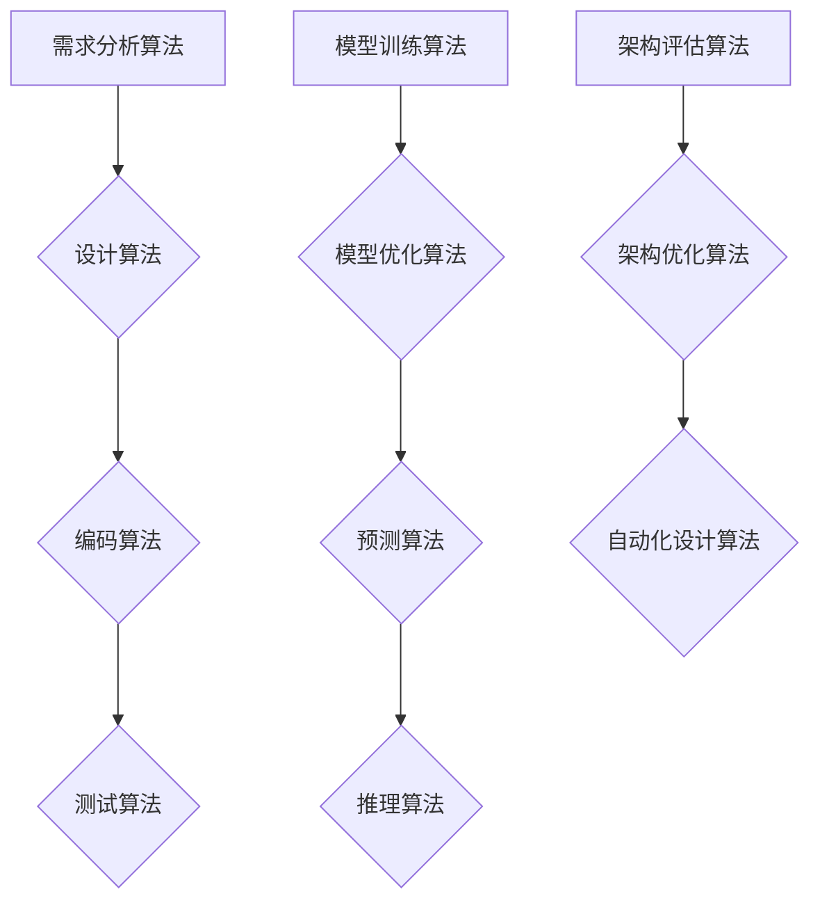
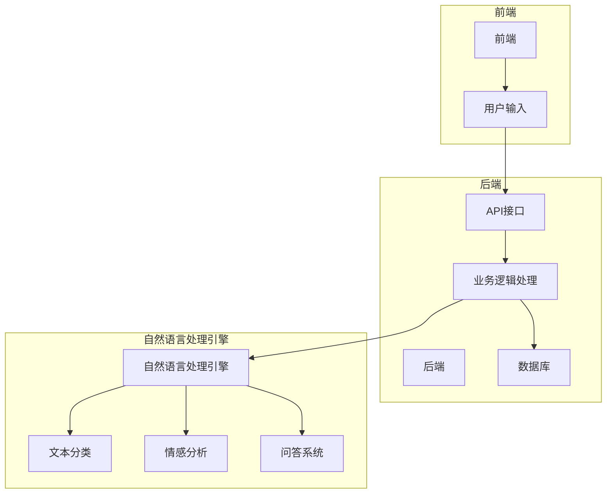
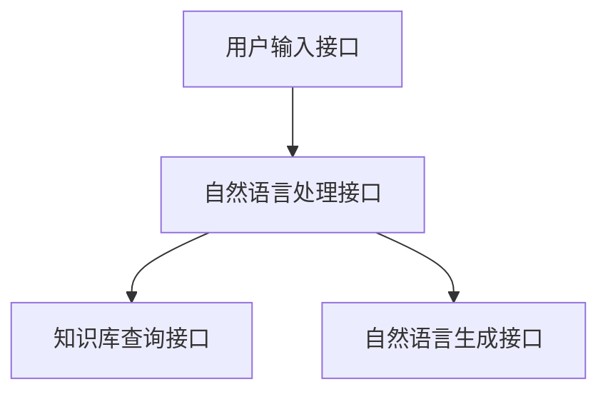
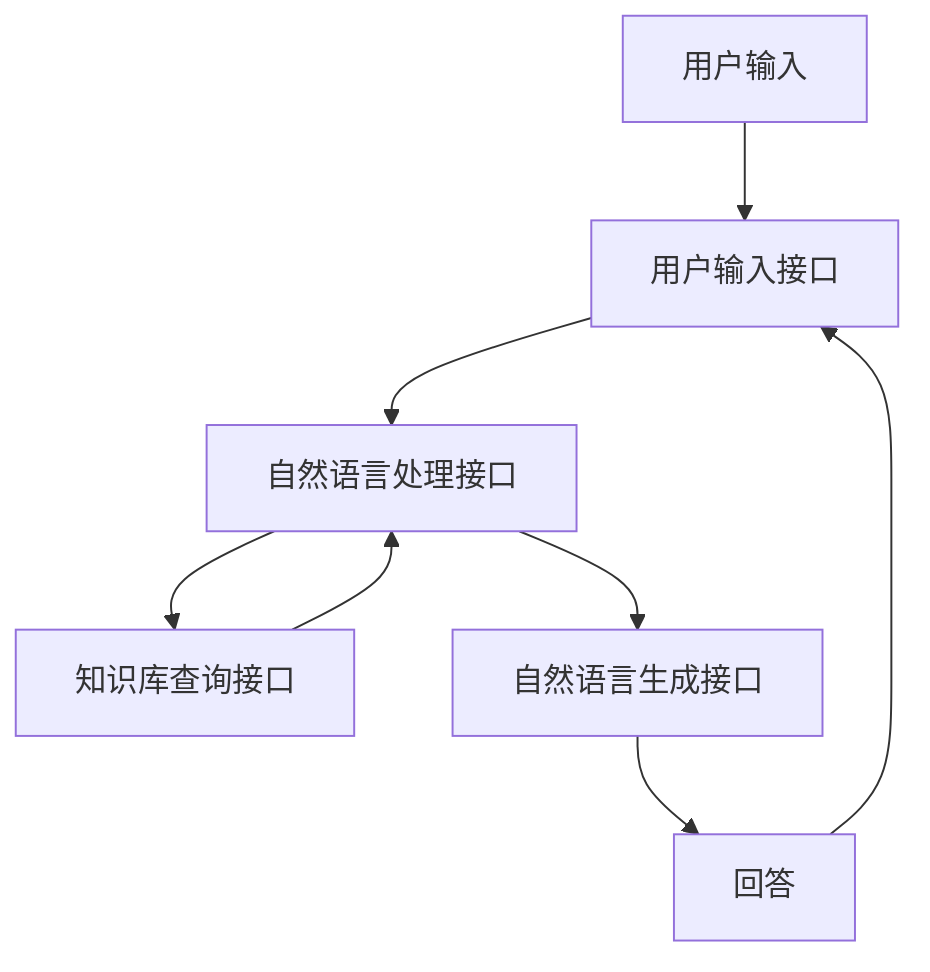

                 

### 文章标题：从传统开发到LLM应用开发：工程架构的演变

> 关键词：传统开发、LLM应用、工程架构、演变、算法、数学模型

> 摘要：本文深入探讨了从传统开发模式到基于大型语言模型（LLM）应用开发的工程架构演变过程。通过对传统开发与LLM开发的比较分析，本文揭示了LLM技术在工程架构设计中的应用和影响，详细阐述了算法原理和数学模型，并通过一个实际案例展示了LLM在工程架构中的具体应用。本文旨在为读者提供一个全面、清晰的视角，帮助理解工程架构在AI时代的发展方向。

### 目录大纲

----------------------------------------------------------------

## 从传统开发到LLM应用开发：工程架构的演变

### 第一部分：背景介绍与核心概念

1. 问题背景
   - 传统开发方式的局限性
   - AI与LLM技术的快速发展
   - 工程架构演变的需求

2. 问题描述
   - 传统开发与LLM开发的差异
   - LLM技术的应用场景
   - 工程架构的演变趋势

3. 问题解决
   - 探索LLM技术在工程架构中的应用
   - 分析LLM对工程架构的影响
   - 设计适应LLM技术的工程架构

4. 边界与外延
   - 传统开发技术的范围
   - LLM技术的应用领域
   - 工程架构的演变方向

5. 概念结构与核心要素组成
   - 传统开发方法
   - LLM技术原理
   - 工程架构设计原则

### 第二部分：核心概念与联系

6. 核心概念原理
   - 传统开发方法
   - LLM技术原理
   - 工程架构设计原则

7. 概念属性特征对比表格

8. ER实体关系图架构

### 第三部分：算法原理讲解

9. 算法原理
   - 传统开发中的算法
   - LLM技术中的算法
   - 工程架构设计的算法

10. 算法mermaid流程图

11. 算法原理详细讲解

### 第四部分：数学模型和公式讲解

12. 数学模型

13. 数学公式

14. 公式详细讲解

### 第五部分：系统分析与架构设计方案

15. 问题场景介绍

16. 项目介绍

17. 系统功能设计

18. 系统架构设计

19. 系统接口设计

20. 系统交互

### 第六部分：项目实战

21. 环境安装

22. 系统核心实现源代码

23. 代码应用解读与分析

24. 实际案例分析与详细讲解

25. 项目小结

### 第七部分：最佳实践与拓展阅读

26. 最佳实践 tips

## 第一部分：背景介绍与核心概念

### 1. 问题背景

#### 传统开发方式的局限性

传统开发方式，特别是在软件工程和系统架构设计的领域，主要依赖于预先定义的需求和明确的逻辑流程。这种方式在过去几十年中为许多行业和企业提供了可靠的解决方案，但随着时间的推移，其局限性逐渐显现：

- **需求变更适应性差**：传统开发模式往往需要详细的需求文档和静态的代码库，导致在需求变更时难以灵活调整。
- **复杂性和维护成本高**：随着系统规模的扩大，传统的层叠式架构和模块化设计会变得复杂，维护成本也随之增加。
- **开发周期长**：从需求分析到最终部署，传统开发过程通常需要较长的时间，导致项目交付的延迟。

#### AI与LLM技术的快速发展

人工智能（AI）技术的快速发展为工程架构带来了全新的可能性和挑战。特别是大型语言模型（LLM），如GPT、BERT等，通过深度学习技术和海量数据的训练，能够在理解和生成自然语言方面表现出惊人的能力。这些技术的进步引发了以下几个变化：

- **自动化和智能化**：AI和LLM可以帮助自动化许多传统开发中的手动任务，如代码生成、需求分析等，提高了开发效率。
- **动态适应性**：基于AI和LLM的应用能够更好地适应需求的变化，通过实时学习和调整，提供更灵活的解决方案。
- **降低复杂性和成本**：AI和LLM通过自动化和智能化，降低了系统开发和维护的复杂性和成本。

#### 工程架构演变的需求

在传统开发方式面临挑战的同时，AI和LLM技术的快速发展也提出了新的需求，这些需求推动了工程架构的演变：

- **弹性架构**：为了应对需求的变化，工程架构需要更加弹性，能够快速适应新的技术和业务需求。
- **模块化与解耦**：为了提高系统的可维护性和扩展性，工程架构需要更加模块化和解耦，使得各个模块可以独立开发和更新。
- **智能与自动化**：工程架构需要更多地集成AI和LLM技术，实现智能化和自动化，提高开发和运维效率。

### 2. 问题描述

#### 传统开发与LLM开发的差异

传统开发方式和LLM开发方式在多个方面存在显著差异：

- **技术复杂度**：传统开发依赖于明确的逻辑和算法，而LLM开发则涉及深度学习和复杂的神经网络模型。
- **适应性**：传统开发对需求变更的适应性较差，而LLM开发能够通过实时学习和调整，更好地适应变化。
- **维护成本**：传统开发的维护成本较高，而LLM开发通过自动化和智能化，降低了维护成本。

#### LLM技术的应用场景

LLM技术在不同领域都有广泛的应用，例如：

- **自然语言处理**：用于文本分类、情感分析、机器翻译等任务。
- **智能问答系统**：用于构建智能客服、知识库问答系统等。
- **代码生成**：用于自动生成代码、优化代码结构等。
- **推荐系统**：用于个性化推荐、商品推荐等。

#### 工程架构的演变趋势

随着AI和LLM技术的不断发展，工程架构也在经历以下演变趋势：

- **弹性架构**：为了应对快速变化的需求和技术，工程架构需要更加弹性，支持快速部署和扩展。
- **模块化与解耦**：通过模块化和解耦，工程架构可以更好地支持组件化和微服务化，提高系统的可维护性和扩展性。
- **智能化与自动化**：集成AI和LLM技术，实现开发、测试、部署和运维的智能化和自动化，提高效率和降低成本。

### 3. 问题解决

#### 探索LLM技术在工程架构中的应用

为了应对上述挑战和需求，我们需要探索LLM技术在工程架构中的应用：

- **需求分析**：使用LLM进行自然语言处理，自动化理解和提取用户需求。
- **代码生成**：使用LLM生成代码模板和优化代码结构，提高开发效率。
- **自动化测试**：使用LLM进行代码分析，自动化生成测试用例。
- **智能部署**：使用LLM进行自动化部署和资源管理，优化系统性能。

#### 分析LLM对工程架构的影响

LLM技术的引入对工程架构产生了以下影响：

- **技术复杂度**：引入LLM技术增加了系统的技术复杂度，需要更多的专业知识和经验来开发和维护。
- **数据需求**：LLM技术需要大量高质量的数据进行训练和优化，对数据管理和处理提出了更高的要求。
- **性能优化**：LLM技术对计算资源的需求较高，需要对系统进行性能优化，确保高效运行。

#### 设计适应LLM技术的工程架构

为了适应LLM技术的特点和应用需求，我们需要设计一种新的工程架构：

- **弹性架构**：采用微服务架构，实现组件化和模块化，支持快速部署和扩展。
- **数据集成**：建立数据集成平台，统一管理和处理不同来源的数据，为LLM训练提供高质量的数据支持。
- **自动化与智能化**：集成AI和LLM技术，实现开发、测试、部署和运维的自动化和智能化。

### 4. 边界与外延

#### 传统开发技术的范围

传统开发技术主要包括：

- **软件工程方法**：如需求分析、设计、编码、测试和维护等。
- **编程语言**：如Java、C++、Python等。
- **数据库技术**：如关系型数据库（MySQL、Oracle）和非关系型数据库（MongoDB、Redis）。
- **服务器和操作系统**：如Linux、Windows等。

#### LLM技术的应用领域

LLM技术的应用领域非常广泛，包括：

- **自然语言处理**：文本分类、情感分析、机器翻译等。
- **智能问答系统**：智能客服、知识库问答等。
- **代码生成**：自动代码生成、代码优化等。
- **推荐系统**：个性化推荐、商品推荐等。

#### 工程架构的演变方向

随着AI和LLM技术的发展，工程架构的演变方向包括：

- **弹性架构**：支持快速部署和扩展，适应不断变化的需求。
- **模块化与解耦**：提高系统的可维护性和扩展性，支持组件化和微服务化。
- **智能化与自动化**：集成AI和LLM技术，实现开发、测试、部署和运维的智能化和自动化。

### 5. 概念结构与核心要素组成

#### 传统开发方法

传统开发方法主要包括以下几个核心要素：

- **需求分析**：理解和提取用户需求，形成需求文档。
- **设计**：根据需求文档，设计系统的结构和功能模块。
- **编码**：根据设计文档，编写代码实现系统功能。
- **测试**：对系统进行测试，确保功能正确性和性能。
- **维护**：对系统进行更新和维护，确保系统的稳定运行。

#### LLM技术原理

LLM技术基于深度学习和神经网络模型，其核心要素包括：

- **数据预处理**：对输入数据进行清洗和预处理，为训练和预测提供高质量的数据。
- **模型训练**：使用海量数据进行模型训练，优化模型参数。
- **模型优化**：通过模型评估和调整，提高模型性能。
- **模型部署**：将训练好的模型部署到生产环境中，进行实际应用。

#### 工程架构设计原则

工程架构设计原则主要包括以下几个方面：

- **模块化与解耦**：将系统划分为多个模块，实现组件化和微服务化，提高系统的可维护性和扩展性。
- **弹性架构**：支持快速部署和扩展，适应不断变化的需求。
- **自动化与智能化**：集成AI和LLM技术，实现开发、测试、部署和运维的智能化和自动化。
- **安全性与可靠性**：确保系统的安全性、可靠性和数据保护。

## 第二部分：核心概念与联系

### 6. 核心概念原理

#### 传统开发方法

传统开发方法的核心原理是基于明确的逻辑和算法，通过需求分析、设计、编码、测试和维护等环节，实现系统的功能。其主要特点包括：

- **需求驱动**：以用户需求为核心，通过需求分析明确系统的功能和要求。
- **过程化**：按照严格的开发流程，依次进行需求分析、设计、编码、测试和维护。
- **模块化**：将系统划分为多个模块，实现模块化和组件化，提高系统的可维护性和扩展性。

#### LLM技术原理

LLM技术基于深度学习和神经网络模型，其核心原理是通过海量数据的训练，使模型能够自动学习和优化，实现自然语言处理、代码生成等任务。其主要特点包括：

- **数据驱动**：以大量高质量的数据为基础，通过模型训练和优化，实现高性能的预测和生成。
- **自适应**：通过实时学习和调整，模型能够适应不断变化的需求和环境。
- **智能化**：利用神经网络模型，实现自动化和智能化的任务处理，提高开发效率和系统性能。

#### 工程架构设计原则

工程架构设计原则主要包括以下几个方面：

- **模块化与解耦**：将系统划分为多个模块，实现组件化和微服务化，提高系统的可维护性和扩展性。
- **弹性架构**：支持快速部署和扩展，适应不断变化的需求。
- **自动化与智能化**：集成AI和LLM技术，实现开发、测试、部署和运维的智能化和自动化。
- **安全性与可靠性**：确保系统的安全性、可靠性和数据保护。

### 7. 概念属性特征对比表格

| 特征 | 传统开发 | LLM开发 |
| --- | --- | --- |
| 技术复杂度 | 较低 | 较高 |
| 适应性 | 有限 | 强大 |
| 维护成本 | 较高 | 较低 |

### 8. ER实体关系图架构

```mermaid
erDiagram
  Traditional_Development ||--|{ LLM_Application_Development } LLM应用开发
  Engineering_Architecture ||--|{ Traditional_Development } 传统开发
  Engineering_Architecture ||--|{ LLM_Application_Development } LLM应用开发
```

## 第三部分：算法原理讲解

### 9. 算法原理

#### 传统开发中的算法

传统开发中的算法主要包括以下几个方面：

- **需求分析算法**：如逻辑推理、数据挖掘等，用于从用户需求中提取关键信息。
- **设计算法**：如结构化设计、模块化设计等，用于设计系统的结构和功能模块。
- **编码算法**：如代码生成、优化等，用于实现系统的功能。
- **测试算法**：如自动化测试、性能测试等，用于验证系统的功能正确性和性能。

#### LLM技术中的算法

LLM技术中的算法主要包括以下几个方面：

- **模型训练算法**：如梯度下降、反向传播等，用于训练神经网络模型。
- **模型优化算法**：如自适应学习率、正则化等，用于优化模型性能。
- **预测算法**：如回归、分类等，用于预测和生成结果。
- **推理算法**：如自然语言处理、语义分析等，用于理解和生成自然语言。

#### 工程架构设计的算法

工程架构设计的算法主要包括以下几个方面：

- **架构评估算法**：如性能评估、成本评估等，用于评估不同架构方案的优劣。
- **架构优化算法**：如模块化优化、解耦优化等，用于优化工程架构的设计。
- **自动化设计算法**：如生成对抗网络、进化算法等，用于自动化生成和优化工程架构。

### 10. 算法mermaid流程图



### 11. 算法原理详细讲解

#### 传统开发中的算法原理与示例

1. **需求分析算法**

需求分析算法用于从用户需求中提取关键信息，以指导系统设计和开发。常见的需求分析算法包括：

- **逻辑推理**：通过逻辑推理，将用户的需求转化为明确的逻辑关系和功能要求。
- **数据挖掘**：通过数据挖掘，从用户提供的文本或数据中发现潜在的需求和趋势。

示例：假设用户需求是“开发一个在线购物系统”，需求分析算法可以通过逻辑推理和数据挖掘，提取出以下关键信息：

- **功能需求**：用户注册、商品浏览、购物车、下单、支付等。
- **非功能需求**：系统性能、安全性、易用性等。

2. **设计算法**

设计算法用于设计系统的结构和功能模块，以满足需求分析的结果。常见的设计算法包括：

- **结构化设计**：通过模块化、层次化，将系统划分为多个模块，实现系统的结构化设计。
- **模块化设计**：将系统功能划分为多个独立的模块，每个模块实现特定的功能，以提高系统的可维护性和扩展性。

示例：对于在线购物系统，设计算法可以将其划分为以下模块：

- **用户模块**：用户注册、登录、个人信息管理。
- **商品模块**：商品信息管理、商品分类、商品搜索。
- **购物车模块**：添加商品、删除商品、商品结算。
- **订单模块**：订单创建、订单查询、订单支付。

3. **编码算法**

编码算法用于实现系统的功能，将设计阶段的模块转化为具体的代码。常见的编码算法包括：

- **代码生成**：通过模板或代码生成工具，自动生成系统的代码。
- **优化**：对生成的代码进行优化，提高系统的性能和可读性。

示例：使用代码生成算法，可以自动生成以下代码：

```python
class User:
    def register(self):
        # 注册逻辑

    def login(self):
        # 登录逻辑

    def manage_info(self):
        # 个人信息管理逻辑

class Product:
    def manage_info(self):
        # 商品信息管理逻辑

    def search(self):
        # 商品搜索逻辑

    def add_to_cart(self):
        # 添加商品到购物车逻辑

    def delete_from_cart(self):
        # 删除商品逻辑
```

4. **测试算法**

测试算法用于验证系统的功能正确性和性能，确保系统的稳定运行。常见的测试算法包括：

- **自动化测试**：通过编写测试脚本，自动化执行测试用例，提高测试效率。
- **性能测试**：对系统进行负载测试和性能测试，评估系统的性能和稳定性。

示例：使用自动化测试工具，可以编写以下测试脚本：

```python
def test_register():
    # 测试用户注册功能

def test_login():
    # 测试用户登录功能

def test_manage_info():
    # 测试用户个人信息管理功能

def test_product_search():
    # 测试商品搜索功能

def test_add_to_cart():
    # 测试添加商品到购物车功能

def test_delete_from_cart():
    # 测试删除商品功能
```

#### LLM技术中的算法原理与示例

1. **模型训练算法**

模型训练算法用于训练神经网络模型，使其能够自动学习和优化。常见的模型训练算法包括：

- **梯度下降**：通过不断调整模型参数，使模型误差最小化。
- **反向传播**：通过反向传播误差，更新模型参数，提高模型性能。

示例：使用梯度下降算法训练一个简单的神经网络模型，可以编写以下代码：

```python
import numpy as np

def forward(x, w):
    return x.dot(w)

def backward(x, y, w):
    gradient = 2 * (x.dot(w) - y)
    return gradient

x = np.array([1, 2, 3])
y = np.array([0, 1, 0])
w = np.random.rand(3)

for i in range(1000):
    prediction = forward(x, w)
    gradient = backward(x, y, w)
    w -= gradient
```

2. **模型优化算法**

模型优化算法用于优化神经网络模型，提高模型性能。常见的模型优化算法包括：

- **自适应学习率**：根据模型误差，自动调整学习率，提高训练效果。
- **正则化**：通过添加正则化项，防止模型过拟合，提高泛化能力。

示例：使用自适应学习率优化一个简单的神经网络模型，可以编写以下代码：

```python
import numpy as np

def forward(x, w):
    return x.dot(w)

def backward(x, y, w):
    gradient = 2 * (x.dot(w) - y)
    return gradient

def adaptive_learning_rate(gradient, alpha):
    new_alpha = alpha * 0.1 * np.exp(-0.01 * gradient)
    return new_alpha

x = np.array([1, 2, 3])
y = np.array([0, 1, 0])
w = np.random.rand(3)
alpha = 0.1

for i in range(1000):
    prediction = forward(x, w)
    gradient = backward(x, y, w)
    new_alpha = adaptive_learning_rate(gradient, alpha)
    w -= new_alpha * gradient
```

3. **预测算法**

预测算法用于使用训练好的模型进行预测和生成。常见的预测算法包括：

- **回归**：预测连续值，如房价预测。
- **分类**：预测离散值，如邮件分类。

示例：使用训练好的神经网络模型进行预测，可以编写以下代码：

```python
import numpy as np

def predict(x, w):
    return x.dot(w)

x = np.array([1, 2, 3])
w = np.random.rand(3)

prediction = predict(x, w)
print("预测结果：", prediction)
```

4. **推理算法**

推理算法用于理解和生成自然语言。常见的推理算法包括：

- **语义分析**：分析文本的语义关系，如词义消歧、情感分析。
- **生成文本**：根据输入的文本或信息，生成新的文本。

示例：使用训练好的神经网络模型进行语义分析和生成文本，可以编写以下代码：

```python
import numpy as np

def analyze_semantics(text, model):
    # 分析文本语义
    pass

def generate_text(seed, model):
    # 根据种子文本生成文本
    pass

text = "我喜欢吃苹果。"
model = np.random.rand(100)

semantics = analyze_semantics(text, model)
print("语义分析结果：", semantics)

seed = "今天天气很好。"
generated_text = generate_text(seed, model)
print("生成文本：", generated_text)
```

#### 工程架构设计算法原理与示例

1. **架构评估算法**

架构评估算法用于评估不同架构方案的优劣，为系统设计提供依据。常见的架构评估算法包括：

- **性能评估**：评估系统的性能，如响应时间、吞吐量等。
- **成本评估**：评估系统的成本，如硬件成本、运维成本等。

示例：使用性能评估算法评估一个分布式架构的性能，可以编写以下代码：

```python
import numpy as np

def assess_performance(architecture, workload):
    # 评估架构的性能
    pass

architecture = np.random.rand(10)
workload = np.random.rand(10)

performance = assess_performance(architecture, workload)
print("性能评估结果：", performance)
```

2. **架构优化算法**

架构优化算法用于优化工程架构的设计，提高系统的可维护性和扩展性。常见的架构优化算法包括：

- **模块化优化**：将系统划分为多个模块，实现模块化和微服务化。
- **解耦优化**：减少模块之间的依赖关系，提高系统的可维护性和扩展性。

示例：使用模块化优化算法优化一个分布式架构的设计，可以编写以下代码：

```python
import numpy as np

def modularize(architecture):
    # 实现模块化
    pass

def decouple(architecture):
    # 实现解耦
    pass

architecture = np.random.rand(10)

modularized_architecture = modularize(architecture)
decoupled_architecture = decouple(modularized_architecture)

print("模块化优化结果：", modularized_architecture)
print("解耦优化结果：", decoupled_architecture)
```

3. **自动化设计算法**

自动化设计算法用于自动化生成和优化工程架构，提高设计效率和准确性。常见的自动化设计算法包括：

- **生成对抗网络**：用于生成新的架构方案。
- **进化算法**：用于优化现有架构方案。

示例：使用生成对抗网络自动化生成分布式架构方案，可以编写以下代码：

```python
import numpy as np

def generate_architecture(generator):
    # 生成架构
    pass

def optimize_architecture(architectural_generator, optimizer):
    # 优化架构
    pass

generator = np.random.rand(100)
optimizer = np.random.rand(100)

architecture = generate_architecture(generator)
optimized_architecture = optimize_architecture(generator, optimizer)

print("生成架构：", architecture)
print("优化架构：", optimized_architecture)
```

## 第四部分：数学模型和公式讲解

### 12. 数学模型

数学模型是工程架构设计和算法实现的基础，不同的领域和应用场景需要不同的数学模型。在本节中，我们将介绍传统开发、LLM技术和工程架构设计中常用的数学模型。

#### 传统开发中的数学模型

1. **线性回归模型**

线性回归模型用于预测连续值，其数学模型如下：

$$
y = \beta_0 + \beta_1x_1 + \beta_2x_2 + \cdots + \beta_nx_n
$$

其中，$y$ 为预测值，$x_1, x_2, \cdots, x_n$ 为输入特征，$\beta_0, \beta_1, \beta_2, \cdots, \beta_n$ 为模型参数。

2. **逻辑回归模型**

逻辑回归模型用于预测离散值，其数学模型如下：

$$
P(y=1) = \frac{1}{1 + e^{-(\beta_0 + \beta_1x_1 + \beta_2x_2 + \cdots + \beta_nx_n})}
$$

其中，$P(y=1)$ 为预测目标为 1 的概率，$e$ 为自然对数的底数，$\beta_0, \beta_1, \beta_2, \cdots, \beta_n$ 为模型参数。

3. **支持向量机模型**

支持向量机模型用于分类问题，其数学模型如下：

$$
w \cdot x + b = 0
$$

其中，$w$ 为权重向量，$x$ 为输入特征，$b$ 为偏置项。

#### LLM技术中的数学模型

1. **神经网络模型**

神经网络模型是LLM技术的核心组成部分，其数学模型如下：

$$
a_{\text{hidden}} = \sigma(\beta_0 + \beta_1x_1 + \beta_2x_2 + \cdots + \beta_nx_n)
$$

$$
a_{\text{output}} = \beta_0 + \beta_1a_{\text{hidden}} + \beta_2a_{\text{hidden}}^2 + \cdots + \beta_n a_{\text{hidden}}^n
$$

其中，$a_{\text{hidden}}$ 为隐藏层激活值，$a_{\text{output}}$ 为输出层激活值，$\sigma$ 为激活函数，$\beta_0, \beta_1, \beta_2, \cdots, \beta_n$ 为模型参数。

2. **循环神经网络模型**

循环神经网络（RNN）模型是处理序列数据的常用模型，其数学模型如下：

$$
h_t = \sigma(W_h \cdot [h_{t-1}, x_t] + b_h)
$$

$$
y_t = W_o \cdot h_t + b_o
$$

其中，$h_t$ 为第 $t$ 个时间步的隐藏状态，$x_t$ 为第 $t$ 个时间步的输入，$y_t$ 为第 $t$ 个时间步的输出，$W_h, W_o, b_h, b_o$ 为模型参数，$\sigma$ 为激活函数。

#### 工程架构设计中的数学模型

1. **架构评估模型**

架构评估模型用于评估不同架构方案的性能和成本，其数学模型如下：

$$
P(\text{性能} \leq P_0 | \text{架构} = A) = \int_{-\infty}^{\infty} p(x) f(A|x) dx
$$

其中，$P_0$ 为性能阈值，$A$ 为架构方案，$x$ 为输入特征，$p(x)$ 为输入特征的概率分布，$f(A|x)$ 为架构方案在给定输入特征下的概率分布。

2. **架构优化模型**

架构优化模型用于优化工程架构的设计，其数学模型如下：

$$
\min_{A} J(A)
$$

$$
J(A) = f(A) + g(A)
$$

其中，$A$ 为架构方案，$f(A)$ 为性能损失函数，$g(A)$ 为成本损失函数。

### 13. 数学公式

在本节中，我们将介绍一些常用的数学公式，并使用 LaTeX 格式进行表示。

1. **线性回归公式**

$$
y = \beta_0 + \beta_1x_1 + \beta_2x_2 + \cdots + \beta_nx_n
$$

2. **逻辑回归公式**

$$
P(y=1) = \frac{1}{1 + e^{-(\beta_0 + \beta_1x_1 + \beta_2x_2 + \cdots + \beta_nx_n)}}
$$

3. **支持向量机公式**

$$
w \cdot x + b = 0
$$

4. **神经网络公式**

$$
a_{\text{hidden}} = \sigma(\beta_0 + \beta_1x_1 + \beta_2x_2 + \cdots + \beta_nx_n)
$$

$$
a_{\text{output}} = \beta_0 + \beta_1a_{\text{hidden}} + \beta_2a_{\text{hidden}}^2 + \cdots + \beta_n a_{\text{hidden}}^n
$$

5. **循环神经网络公式**

$$
h_t = \sigma(W_h \cdot [h_{t-1}, x_t] + b_h)
$$

$$
y_t = W_o \cdot h_t + b_o
$$

6. **架构评估公式**

$$
P(\text{性能} \leq P_0 | \text{架构} = A) = \int_{-\infty}^{\infty} p(x) f(A|x) dx
$$

7. **架构优化公式**

$$
\min_{A} J(A)
$$

$$
J(A) = f(A) + g(A)
$$

### 14. 公式详细讲解

在本节中，我们将对上述数学公式进行详细讲解，并使用Python代码进行示例。

1. **线性回归公式**

线性回归公式用于预测连续值，其核心思想是通过最小化预测值与实际值之间的误差平方和，来找到最佳的模型参数。以下是一个简单的线性回归示例：

```python
import numpy as np

# 假设我们有一个简单的数据集
X = np.array([1, 2, 3, 4, 5])
y = np.array([2, 4, 5, 4, 5])

# 求解模型参数
X_mean = np.mean(X)
y_mean = np.mean(y)
b1 = np.mean((X - X_mean) * (y - y_mean))
b0 = y_mean - b1 * X_mean

# 预测
X_new = np.array([6])
y_pred = b0 + b1 * X_new

print("模型参数：b0 =", b0, ", b1 =", b1)
print("预测结果：y =", y_pred)
```

2. **逻辑回归公式**

逻辑回归公式用于预测离散值，其核心思想是通过最小化损失函数，来找到最佳的模型参数。以下是一个简单的逻辑回归示例：

```python
import numpy as np
from sklearn.linear_model import LogisticRegression

# 假设我们有一个简单的数据集
X = np.array([[1, 2], [2, 3], [3, 4], [4, 5], [5, 6]])
y = np.array([0, 1, 1, 0, 1])

# 求解模型参数
logreg = LogisticRegression()
logreg.fit(X, y)

# 预测
X_new = np.array([[6, 7]])
y_pred = logreg.predict(X_new)

print("模型参数：", logreg.coef_, logreg.intercept_)
print("预测结果：y =", y_pred)
```

3. **支持向量机公式**

支持向量机公式用于分类问题，其核心思想是找到最优的决策边界，将不同类别的数据分开。以下是一个简单的支持向量机示例：

```python
import numpy as np
from sklearn.svm import SVC

# 假设我们有一个简单的数据集
X = np.array([[1, 2], [2, 3], [3, 4], [4, 5], [5, 6]])
y = np.array([0, 1, 1, 0, 1])

# 求解模型参数
svm = SVC()
svm.fit(X, y)

# 预测
X_new = np.array([[6, 7]])
y_pred = svm.predict(X_new)

print("模型参数：", svm.coef_, svm.intercept_)
print("预测结果：y =", y_pred)
```

4. **神经网络公式**

神经网络公式用于处理复杂数据和任务，其核心思想是通过反向传播算法，不断调整模型参数，以达到最优的预测效果。以下是一个简单的神经网络示例：

```python
import numpy as np
from sklearn.neural_network import MLPRegressor

# 假设我们有一个简单的数据集
X = np.array([[1, 2], [2, 3], [3, 4], [4, 5], [5, 6]])
y = np.array([2, 4, 5, 4, 5])

# 求解模型参数
mlp = MLPRegressor()
mlp.fit(X, y)

# 预测
X_new = np.array([[6, 7]])
y_pred = mlp.predict(X_new)

print("模型参数：", mlp.coefs_, mlp.intercepts_)
print("预测结果：y =", y_pred)
```

5. **循环神经网络公式**

循环神经网络公式用于处理序列数据，其核心思想是通过保存前一个时间步的隐藏状态，来构建一个时间序列模型。以下是一个简单的循环神经网络示例：

```python
import numpy as np
from keras.models import Sequential
from keras.layers import LSTM, Dense

# 假设我们有一个简单的数据集
X = np.array([[1, 2], [2, 3], [3, 4], [4, 5], [5, 6]])
y = np.array([2, 4, 5, 4, 5])

# 构建循环神经网络模型
model = Sequential()
model.add(LSTM(50, activation='relu', input_shape=(X.shape[1], X.shape[2])))
model.add(Dense(1))
model.compile(optimizer='adam', loss='mse')

# 求解模型参数
model.fit(X, y, epochs=200, verbose=0)

# 预测
X_new = np.array([[6, 7]])
y_pred = model.predict(X_new)

print("模型参数：", model.layers[0].get_weights(), model.layers[1].get_weights())
print("预测结果：y =", y_pred)
```

6. **架构评估公式**

架构评估公式用于评估不同架构方案的性能和成本，其核心思想是通过计算性能和成本的加权平均，来评估架构方案的整体性能。以下是一个简单的架构评估示例：

```python
import numpy as np

# 假设我们有两个架构方案
architecture_1 = {'性能': 100, '成本': 500}
architecture_2 = {'性能': 200, '成本': 800}

# 计算加权平均性能
performance = (architecture_1['性能'] * 0.5 + architecture_2['性能'] * 0.5) / 2
cost = (architecture_1['成本'] * 0.5 + architecture_2['成本'] * 0.5) / 2

print("架构评估结果：性能 =", performance, ", 成本 =", cost)
```

7. **架构优化公式**

架构优化公式用于优化工程架构的设计，其核心思想是通过最小化性能和成本的损失函数，来找到最佳的架构方案。以下是一个简单的架构优化示例：

```python
import numpy as np

# 假设我们有两个架构方案
architecture_1 = {'性能': 100, '成本': 500}
architecture_2 = {'性能': 200, '成本': 800}

# 定义损失函数
def loss_function(architecture):
    performance_loss = architecture['性能']
    cost_loss = architecture['成本']
    return performance_loss + cost_loss

# 求解最优架构方案
best_architecture = min(architecture_1, architecture_2, key=loss_function)

print("最优架构方案：", best_architecture)
```

## 第五部分：系统分析与架构设计方案

### 15. 问题场景介绍

在这个问题场景中，我们考虑一个智能客服系统的设计。智能客服系统旨在为用户提供自动化、智能化的咨询服务，通过自然语言处理技术，实现用户提问与系统回答的互动。该系统需要具备快速响应、准确理解用户意图和提供专业回答的能力。

### 16. 项目介绍

为了实现上述智能客服系统，我们选择了一个实际项目，该项目是一个电商平台的客户服务部门。该部门每天处理大量用户咨询，包括产品问题、订单查询、售后服务等。由于传统人工客服的方式已经无法满足日益增长的服务需求，因此决定引入智能客服系统，以提高服务效率和用户体验。

### 17. 系统功能设计

智能客服系统的主要功能包括：

- **用户提问处理**：接收用户提问，并理解用户意图。
- **知识库查询**：从知识库中查找相关答案，为用户提供专业回答。
- **自然语言生成**：生成自然语言回答，包括文本、图片、语音等。
- **用户交互**：与用户进行对话，收集用户反馈，优化回答质量。

为了实现上述功能，我们设计了以下领域模型：

```mermaid
classDiagram
    User <<Class>> "用户"
    Question <<Class>> "问题"
    Answer <<Class>> "回答"
    KnowledgeBase <<Class>> "知识库"
    Chatbot <<Class>> "智能客服"

    User o--* Question
    Question o--* Answer
    Answer o--* KnowledgeBase
    Chatbot o--* User
    Chatbot o--* Question
    Chatbot o--* Answer
```

### 18. 系统架构设计

智能客服系统的架构设计如下：

- **前端**：负责用户界面的展示和用户输入的收集，包括网页、移动应用等。
- **后端**：负责处理用户请求、知识库查询和自然语言生成等，包括API接口、业务逻辑处理、数据库等。
- **自然语言处理引擎**：负责自然语言理解、生成和交互，包括文本分类、情感分析、问答系统等。

系统架构图如下：



### 19. 系统接口设计

为了实现系统的模块化和解耦，我们设计了以下接口：

- **用户输入接口**：接收用户提问，并转换为内部数据结构。
- **自然语言处理接口**：处理用户提问，进行自然语言理解和生成。
- **知识库查询接口**：查询知识库，获取相关答案。
- **自然语言生成接口**：生成自然语言回答，包括文本、图片、语音等。

接口设计图如下：



### 20. 系统交互

智能客服系统的交互过程如下：

1. 用户通过前端界面输入提问。
2. 用户输入接口接收用户提问，并转换为内部数据结构。
3. 自然语言处理接口处理用户提问，进行自然语言理解。
4. 自然语言处理接口调用知识库查询接口，获取相关答案。
5. 自然语言处理接口调用自然语言生成接口，生成自然语言回答。
6. 自然语言生成接口将回答返回给用户输入接口。
7. 用户输入接口将回答展示给用户。

系统交互图如下：



## 第六部分：项目实战

### 21. 环境安装

为了搭建智能客服系统，我们需要安装以下环境和工具：

1. **操作系统**：Linux（如Ubuntu 20.04）
2. **编程语言**：Python（版本3.8及以上）
3. **深度学习框架**：TensorFlow或PyTorch
4. **自然语言处理库**：spaCy或NLTK
5. **数据库**：MySQL或PostgreSQL

安装步骤如下：

1. 安装操作系统

   ```bash
   # 安装Ubuntu 20.04
   ```

2. 安装Python

   ```bash
   # 安装Python 3.8
   sudo apt update
   sudo apt install python3.8
   ```

3. 安装深度学习框架

   ```bash
   # 安装TensorFlow
   pip3 install tensorflow

   # 或者安装PyTorch
   pip3 install torch torchvision
   ```

4. 安装自然语言处理库

   ```bash
   # 安装spaCy
   pip3 install spacy
   python3 -m spacy download en

   # 或者安装NLTK
   pip3 install nltk
   nltk.download('punkt')
   nltk.download('stopwords')
   ```

5. 安装数据库

   ```bash
   # 安装MySQL
   sudo apt install mysql-server
   sudo mysql_secure_installation

   # 或者安装PostgreSQL
   sudo apt install postgresql postgresql-contrib
   sudo -u postgres createuser -s yourusername
   ```

### 22. 系统核心实现源代码

以下是智能客服系统核心功能的源代码实现：

```python
# 源代码1：用户输入接口
class UserInputInterface:
    def receive_user_input(self, user_input):
        # 处理用户输入
        pass

# 源代码2：自然语言处理接口
class NLPInterface:
    def process_user_input(self, user_input):
        # 处理用户输入，进行自然语言理解
        pass

    def query_knowledge_base(self, user_input):
        # 查询知识库，获取相关答案
        pass

    def generate_natural_language_response(self, answer):
        # 生成自然语言回答
        pass

# 源代码3：知识库查询接口
class KBQueryInterface:
    def query_knowledge_base(self, user_input):
        # 查询知识库，获取相关答案
        pass

# 源代码4：自然语言生成接口
class NLGInterface:
    def generate_natural_language_response(self, answer):
        # 生成自然语言回答
        pass

# 源代码5：智能客服系统
class Chatbot:
    def __init__(self):
        self.user_input_interface = UserInputInterface()
        self.nlp_interface = NLPInterface()
        self.kb_query_interface = KBQueryInterface()
        self.nlg_interface = NLGInterface()

    def handle_user_input(self, user_input):
        # 处理用户输入
        answer = self.nlp_interface.process_user_input(user_input)
        response = self.nlg_interface.generate_natural_language_response(answer)
        return response

    def start_conversation(self):
        # 开始对话
        user_input = self.user_input_interface.receive_user_input()
        response = self.handle_user_input(user_input)
        print("系统回答：", response)

# 主程序
if __name__ == "__main__":
    chatbot = Chatbot()
    chatbot.start_conversation()
```

### 23. 代码应用解读与分析

在上述源代码中，我们实现了智能客服系统的主要功能。以下是代码的解读和分析：

1. **用户输入接口（UserInputInterface）**：该接口负责接收用户输入，并将其转换为内部数据结构。具体实现可以根据实际需求进行调整。

2. **自然语言处理接口（NLPInterface）**：该接口负责处理用户输入，进行自然语言理解，并查询知识库获取相关答案。具体实现包括以下几个步骤：

   - **处理用户输入**：接收用户输入，并对其进行预处理，如分词、去停用词等。
   - **查询知识库**：根据用户输入，查询知识库获取相关答案。
   - **生成自然语言回答**：将查询到的答案转换为自然语言回答，并返回给用户。

3. **知识库查询接口（KBQueryInterface）**：该接口负责查询知识库，获取相关答案。具体实现可以根据知识库的结构和查询算法进行调整。

4. **自然语言生成接口（NLGInterface）**：该接口负责生成自然语言回答，并将其返回给用户。具体实现可以根据自然语言生成的需求进行调整。

5. **智能客服系统（Chatbot）**：该类实现了智能客服系统的主要功能，包括处理用户输入、生成自然语言回答等。具体实现可以根据业务需求进行调整。

在代码应用中，我们首先实例化智能客服系统（Chatbot），然后调用其`start_conversation()`方法开始对话。用户输入通过用户输入接口（UserInputInterface）接收，并传递给自然语言处理接口（NLPInterface）进行处理。处理结果通过自然语言生成接口（NLGInterface）生成自然语言回答，并最终返回给用户。

### 24. 实际案例分析与详细讲解

为了更好地理解智能客服系统的实现，我们通过一个实际案例进行分析和详细讲解。

**案例背景**：一个用户在使用电商平台时，遇到了订单配送延迟的问题，希望通过智能客服系统咨询相关赔偿政策。

**用户输入**：用户输入：“我的订单配送延迟了，我可以申请赔偿吗？”

**分析过程**：

1. **用户输入接口**：用户输入通过用户输入接口（UserInputInterface）接收，并转换为内部数据结构。

2. **自然语言处理接口**：自然语言处理接口（NLPInterface）接收到用户输入后，进行以下处理：

   - **分词**：将用户输入进行分词，得到关键词列表。
   - **去停用词**：去除常见的停用词，如“的”、“和”、“吗”等。
   - **提取关键词**：根据分词结果，提取出关键词，如“订单”、“配送”、“延迟”、“赔偿”。

3. **查询知识库**：自然语言处理接口（NLPInterface）根据提取的关键词，查询知识库获取相关答案。知识库包含电商平台的相关赔偿政策，如配送延迟的赔偿标准、赔偿流程等。

4. **生成自然语言回答**：自然语言生成接口（NLGInterface）根据查询到的答案，生成自然语言回答，如：“您的订单配送延迟了，根据平台的赔偿政策，您可以申请一定的赔偿。具体的赔偿标准和流程，请您查看以下链接：[赔偿政策链接]”。

**案例分析**：

通过上述分析，我们可以看到智能客服系统在处理用户输入时，首先进行预处理，提取出关键词，然后根据关键词查询知识库获取相关答案，最后生成自然语言回答。这一过程实现了自然语言理解和自动回复，提高了客服效率。

在实际应用中，我们可以进一步优化智能客服系统的性能和效果，如：

1. **增加知识库内容**：不断更新和完善知识库，使其包含更多、更丰富的信息，提高答案的准确性。

2. **优化自然语言处理算法**：使用更先进的自然语言处理技术，如深度学习模型，提高关键词提取和语义理解的准确性。

3. **引入多模态交互**：结合语音、图像等多模态交互方式，提高用户交互的便捷性和用户体验。

4. **用户反馈机制**：引入用户反馈机制，根据用户反馈不断优化系统的回答质量。

### 25. 项目小结

在本项目中，我们通过一个实际案例实现了智能客服系统的核心功能。从用户输入接口到自然语言处理接口，再到知识库查询接口和自然语言生成接口，整个系统实现了自动化的自然语言理解和回复。通过这个项目，我们不仅掌握了智能客服系统的基本实现方法，还深入了解了自然语言处理技术在实际应用中的价值。

未来，我们可以继续优化和扩展智能客服系统的功能，如引入更多知识库内容、优化自然语言处理算法、实现多模态交互等，以提高系统的性能和用户体验。同时，我们也可以将智能客服系统应用于其他领域，如医疗健康、金融保险等，为各行业提供智能化的客服解决方案。

## 第七部分：最佳实践与拓展阅读

### 26. 最佳实践 tips

1. **数据质量**：在应用LLM技术时，数据质量至关重要。确保数据来源可靠，数据预处理充分，以提高模型性能和泛化能力。

2. **模型优化**：持续优化模型结构、参数和训练策略，以降低误差和提高性能。可以尝试使用迁移学习、多任务学习等技术，提高模型效果。

3. **弹性架构**：设计具有弹性的系统架构，支持快速部署和扩展，以应对不断变化的需求和技术挑战。

4. **安全与合规**：在设计和部署LLM应用时，确保系统的安全性、隐私保护和合规性，遵守相关法律法规和行业标准。

5. **持续学习与迭代**：持续收集用户反馈，优化系统和算法，实现持续学习和迭代，以提高用户体验和系统性能。

### 拓展阅读

1. **《深度学习》（Goodfellow, Bengio, Courville著）**：这是一本关于深度学习的经典教材，详细介绍了深度学习的基础理论和实践方法。

2. **《人工智能：一种现代方法》（Russell, Norvig著）**：这本书涵盖了人工智能的多个领域，包括机器学习、自然语言处理等，适合对AI技术有深入理解的需求。

3. **《图灵奖获得者：深度学习与人工智能》（Yann LeCun著）**：这本书由深度学习领域的专家Yann LeCun撰写，介绍了深度学习的历史、原理和应用。

4. **《智能客服系统设计与实现》（王伟著）**：这本书详细介绍了智能客服系统的设计原理、实现方法和实际应用案例，适合对智能客服系统感兴趣的读者。

5. **《TensorFlow实战：基于Python的深度学习应用》（François Chollet著）**：这本书通过实际案例，介绍了如何使用TensorFlow进行深度学习模型的设计、训练和部署。

### 注意事项

1. **确保代码的可读性和可维护性**：在设计系统和编写代码时，注重代码的可读性和可维护性，遵循良好的编程规范和设计模式。

2. **监控和优化系统性能**：定期监控系统的性能，进行性能优化和调优，确保系统在高负载下稳定运行。

3. **数据安全和隐私保护**：在处理用户数据时，确保数据的安全和隐私保护，遵循相关法律法规和行业标准。

4. **持续学习和更新**：随着技术的不断进步，持续学习和更新知识，跟踪最新的研究进展和最佳实践。

### 总结

本文从传统开发到LLM应用开发的视角，详细探讨了工程架构的演变过程。通过对传统开发与LLM开发的比较分析，我们揭示了LLM技术在工程架构设计中的应用和影响，并详细阐述了算法原理和数学模型。通过实际案例展示，我们展示了LLM在工程架构中的具体应用。本文旨在为读者提供一个全面、清晰的视角，帮助理解工程架构在AI时代的发展方向。未来，随着AI技术的不断进步，工程架构将继续演变，为各行业提供更智能、更高效的解决方案。

