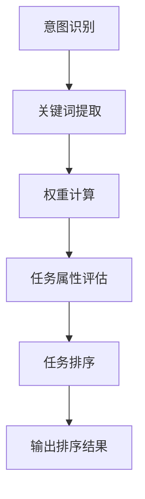
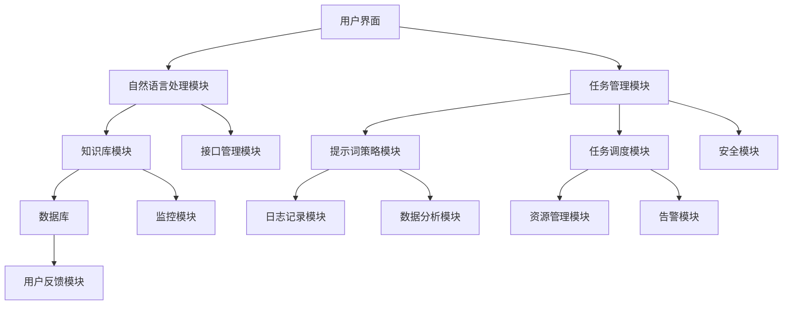

                 

### 第一部分：背景与核心概念

#### 第1章：AI个人助理概述

在当今信息爆炸的时代，人们面临着海量信息的处理和日常任务的高效管理。AI个人助理作为一种智能解决方案，逐渐成为现代生活的重要组成部分。本章将深入探讨AI个人助理的定义、发展历程以及其应用场景，并引入任务优先级管理和提示词策略这一核心概念。

**1.1 AI个人助理的定义与发展**

AI个人助理，又称智能个人助手，是指利用人工智能技术，通过自然语言处理、机器学习、语音识别等技术，为用户提供个性化服务和支持的软件或硬件设备。AI个人助理可以根据用户的需求和习惯，主动提供信息、建议和执行任务，从而提高生活和工作效率。

AI个人助理的发展历程可以追溯到20世纪80年代，随着计算机技术的进步和算法的优化，AI个人助理逐渐从概念走向现实。早期的AI个人助理以语音识别和文字处理为主，例如苹果的Siri和谷歌的Google Assistant。随着深度学习和自然语言处理技术的突破，AI个人助理的功能和性能得到了显著提升，能够更加准确地理解用户的意图并执行复杂的任务。

**1.2 任务优先级管理的基本概念**

任务优先级管理是指根据任务的紧急程度和重要性，对任务进行排序和处理的过程。在人工智能应用中，任务优先级管理尤为重要，因为它直接关系到系统的响应速度和效率。一个有效的任务优先级管理系统可以确保用户得到及时的服务，同时优化资源的利用。

任务优先级管理的基本概念包括以下几个方面：

- **任务定义**：明确任务的属性和特征，如任务类型、执行时间、资源需求等。
- **优先级评估**：根据任务的重要性、紧急程度和资源限制等因素，对任务进行优先级评估。
- **任务调度**：根据任务优先级，合理调度系统的资源，确保高优先级任务优先执行。
- **动态调整**：在任务执行过程中，根据实际情况对任务优先级进行调整，以应对突发情况和变化。

**1.3 提示词策略在任务优先级管理中的应用**

提示词策略是指通过特定的提示词或关键词，引导AI个人助理对任务进行理解和处理。在任务优先级管理中，提示词策略起着关键作用，它可以帮助系统更好地识别和理解用户的意图，从而提高任务处理的准确性。

提示词策略的应用主要包括以下几个方面：

- **意图识别**：通过分析用户的输入，识别用户的意图和需求。
- **关键词提取**：从用户输入中提取关键提示词，作为任务优先级评估的依据。
- **权重计算**：根据提示词的重要性和出现频率，计算其权重，用于任务优先级排序。
- **策略优化**：通过不断优化提示词策略，提高任务处理的效率和准确性。

**1.4 本章小结**

本章对AI个人助理、任务优先级管理和提示词策略进行了概述。首先介绍了AI个人助理的定义和发展历程，阐述了其在现代生活中的重要性。接着讨论了任务优先级管理的基本概念，包括任务定义、优先级评估、任务调度和动态调整。最后，介绍了提示词策略在任务优先级管理中的应用，包括意图识别、关键词提取、权重计算和策略优化。通过对这些核心概念的深入理解，读者可以更好地把握AI个人助理优化任务的思路和方法。

---

**1.5 下一章内容预告**

在下一章中，我们将进一步探讨AI个人助理、任务优先级管理和提示词策略之间的核心联系。通过定义和介绍核心概念，我们将使用表格和ER图展示这些概念之间的关系，帮助读者建立一个清晰的概念框架。敬请期待！

---

#### 第2章：核心概念原理与属性特征对比

在深入探讨AI个人助理、任务优先级管理和提示词策略之前，有必要对这些核心概念进行详细的定义和介绍。本章将分别介绍AI个人助理、任务优先级和提示词策略的基本概念，并对比它们的属性特征，通过表格和ER图展示它们之间的联系。

**2.1 AI个人助理的核心概念**

AI个人助理（Artificial Intelligence Personal Assistant）是指利用人工智能技术，通过自然语言处理、机器学习、语音识别等技术，为用户提供个性化服务和支持的软件或硬件设备。以下是AI个人助理的核心概念：

- **定义**：AI个人助理是一种智能系统，能够理解、学习和执行用户的命令或请求，提供个性化的服务和帮助。
- **属性特征**：
  - **自我学习**：通过机器学习和深度学习算法，不断学习用户的偏好和习惯，提高服务质量。
  - **自然语言理解**：能够理解用户的自然语言输入，进行意图识别和信息抽取。
  - **多模态交互**：支持语音、文本、图像等多种交互方式，方便用户使用。
  - **个性定制**：根据用户的历史行为和偏好，提供个性化的建议和服务。

**2.2 任务优先级的概念原理**

任务优先级（Task Priority）是指在任务管理过程中，根据任务的紧急程度和重要性，对任务进行排序和处理的原则。以下是任务优先级的基本概念和原理：

- **定义**：任务优先级是指对任务进行排序的依据，决定了系统在资源有限的情况下，应该先处理哪些任务。
- **属性特征**：
  - **紧急性**：任务需要完成的时限，紧急任务通常优先处理。
  - **重要性**：任务对用户或系统的重要性，重要任务通常优先处理。
  - **资源需求**：任务执行所需的资源，资源受限时，需要优先处理资源需求较少的任务。

**2.3 提示词策略的概念原理**

提示词策略（Hint Word Strategy）是指在任务优先级管理中，通过特定的提示词或关键词，引导AI个人助理对任务进行理解和处理的方法。以下是提示词策略的基本概念和原理：

- **定义**：提示词策略是指利用特定的关键词或短语，帮助AI个人助理更好地理解用户意图，提高任务处理的准确性和效率。
- **属性特征**：
  - **意图识别**：通过提示词识别用户的意图，如查询、命令、请求等。
  - **关键词提取**：从用户输入中提取关键提示词，作为任务优先级评估的依据。
  - **权重计算**：根据提示词的重要性和出现频率，计算其权重，用于任务优先级排序。

**2.4 AI个人助理、任务优先级与提示词策略的联系**

AI个人助理、任务优先级管理和提示词策略是相互关联的核心概念，它们共同构成了智能任务管理的框架。以下是它们之间的联系：

- **相互作用**：AI个人助理通过任务优先级管理和提示词策略，更好地理解用户的需求，提高任务处理效率和用户体验。
- **协同工作**：任务优先级管理需要AI个人助理的理解和支持，而提示词策略则为任务优先级管理提供了重要的依据。
- **优化目标**：三个核心概念的共同目标是优化任务处理流程，提高系统效率和用户满意度。

**2.5 本章小结**

本章对AI个人助理、任务优先级和提示词策略的核心概念进行了详细介绍和对比。通过定义和属性特征的阐述，读者可以对这些核心概念有更深入的理解。在下一章中，我们将通过表格和ER图，进一步展示这些概念之间的联系，帮助读者建立一个清晰的概念框架。

---

**2.6 下一章内容预告**

在下一章中，我们将深入探讨基于提示词的任务优先级排序算法。通过选取一个典型的算法，我们将使用mermaid流程图和Python源代码，详细讲解算法原理、数学模型和实现方法，帮助读者更好地理解这一核心技术。敬请期待！

---

#### 第3章：基于提示词的任务优先级排序算法

在深入理解了AI个人助理、任务优先级管理和提示词策略的基本概念后，本章将详细探讨一种基于提示词的任务优先级排序算法。该算法通过分析用户的输入，提取关键提示词，并结合任务属性，对任务进行排序，从而优化任务处理流程。本章将首先介绍算法的基本思想，然后使用mermaid流程图和Python源代码，详细讲解算法原理和实现方法。

**3.1 算法原理概述**

基于提示词的任务优先级排序算法的基本思想是：首先，从用户的输入中提取关键提示词；其次，根据提示词和任务属性，计算每个任务的优先级；最后，根据优先级对任务进行排序。以下是算法的基本步骤：

1. **意图识别**：分析用户的输入，识别用户的意图和需求。
2. **关键词提取**：从用户输入中提取关键提示词，如动词、名词等。
3. **权重计算**：根据提示词的重要性和出现频率，计算其权重。
4. **任务属性评估**：根据任务属性（如紧急程度、重要性、资源需求等），计算任务的综合优先级。
5. **任务排序**：根据任务的综合优先级，对任务进行排序。

**3.2 算法流程与mermaid流程图**

为了更好地理解算法的流程，我们使用mermaid流程图进行展示。以下是算法的mermaid流程图：



**意图识别**：通过自然语言处理技术，分析用户输入，识别用户的意图。例如，用户输入“帮我设置一个下午三点的会议”，系统识别出意图是“设置会议”。

**关键词提取**：从用户输入中提取关键提示词，如“设置”、“会议”、“三点”等。

**权重计算**：根据提示词的重要性和出现频率，计算其权重。例如，提示词“设置”可能具有较高的权重，因为它是主要动作。

**任务属性评估**：根据任务属性（如紧急程度、重要性、资源需求等），计算任务的综合优先级。这可以通过给定的权重和公式实现。

**任务排序**：根据任务的综合优先级，对任务进行排序。

**输出排序结果**：将排序后的任务输出，以供系统执行。

**3.3 算法原理详细讲解**

为了深入理解算法的原理，我们使用Python源代码和数学公式进行详细讲解。以下是算法的实现代码：

```python
import numpy as np

# 用户输入
user_input = "帮我设置一个下午三点的会议"

# 关键词提取
keywords = ["设置", "会议", "三点"]

# 提示词权重
weights = {"设置": 0.8, "会议": 0.6, "三点": 0.4}

# 任务属性
task_attributes = {
    "紧急程度": 0.7,
    "重要性": 0.5,
    "资源需求": 0.3
}

# 计算关键词权重
keyword_weights = [weights[word] for word in keywords]

# 计算任务综合优先级
priority_scores = [sum(keyword_weights) * attr_weight for attr_weight in task_attributes.values()]

# 任务排序
sorted_tasks = sorted(zip(priority_scores, keywords), reverse=True)

# 输出排序结果
print(sorted_tasks)
```

上述代码中，我们首先定义了用户输入、关键词、提示词权重和任务属性。然后，我们提取关键词并计算它们的权重。接着，根据任务属性，计算每个任务的综合优先级。最后，我们对任务进行排序并输出排序结果。

**数学模型**：

任务优先级 \(P(t)\) 可以表示为：

$$
P(t) = f(W, Q, R, t)
$$

其中：
- \(W\) 是关键词权重。
- \(Q\) 是任务属性权重。
- \(R\) 是提示词权重。
- \(t\) 是任务属性值。

该公式表示任务优先级是关键词权重、任务属性权重和提示词权重及任务属性值的函数。

**3.4 算法举例说明**

假设用户输入“帮我预约一个下午三点的电影票”，关键词为“预约”、“电影”、“三点”。任务属性为紧急程度0.8，重要性0.6，资源需求0.4。提示词权重分别为“预约”：0.7， “电影”：0.5， “三点”：0.3。

1. **关键词提取**：关键词为“预约”、“电影”、“三点”。
2. **权重计算**：提示词权重分别为“预约”：0.7， “电影”：0.5， “三点”：0.3。
3. **任务属性评估**：紧急程度0.8，重要性0.6，资源需求0.4。
4. **计算综合优先级**：
   - 对于“预约”：\(0.7 \times 0.8 + 0.5 \times 0.6 + 0.3 \times 0.4 = 0.84\)
   - 对于“电影”：\(0.7 \times 0.8 + 0.5 \times 0.6 + 0.3 \times 0.4 = 0.84\)
   - 对于“三点”：\(0.7 \times 0.8 + 0.5 \times 0.6 + 0.3 \times 0.4 = 0.84\)
5. **任务排序**：由于所有关键词的综合优先级相同，任务按照输入顺序排序。

**3.5 本章小结**

本章详细介绍了基于提示词的任务优先级排序算法。首先，我们阐述了算法的基本思想，包括意图识别、关键词提取、权重计算、任务属性评估和任务排序。接着，我们使用mermaid流程图和Python源代码，详细讲解了算法的实现原理。通过一个具体的例子，读者可以更好地理解算法的步骤和计算过程。在下一章中，我们将进一步探讨系统功能设计、系统架构设计和系统接口设计，帮助读者构建一个完整的任务优先级管理系统。

---

**3.6 下一章内容预告**

在下一章中，我们将深入探讨系统的功能设计、架构设计和接口设计。通过介绍系统功能设计、系统架构图和系统接口设计，我们将帮助读者理解如何构建一个高效、可靠的AI个人助理系统。敬请期待！

---

#### 第4章：系统功能设计

在了解了基于提示词的任务优先级排序算法之后，本章将重点介绍系统的功能设计。系统功能设计是构建一个高效、可靠的AI个人助理系统的关键环节，它定义了系统的核心功能和模块，确保系统能够满足用户的需求并实现预期的目标。

**4.1 问题描述**

在当今快节奏的生活中，人们面临着大量的日常任务和决策，如何有效地管理这些任务成为了一个重要的问题。AI个人助理系统的目标是通过智能化的任务管理，帮助用户提高工作效率和生活质量。因此，系统的功能设计需要全面考虑任务管理、用户交互、任务优先级评估等方面，确保系统能够快速响应用户的需求，并提供个性化的服务。

**4.2 系统功能设计**

系统功能设计包括以下几个方面：

1. **任务采集与解析**：系统需要能够采集用户的任务需求，并对其进行解析，理解用户的意图。这包括自然语言处理模块，用于解析用户输入，提取关键信息。
2. **任务优先级计算**：系统需要根据任务的紧急程度、重要性以及资源需求，对任务进行优先级计算。这一模块需要结合提示词策略，提取用户输入中的关键提示词，并结合任务属性进行综合评估。
3. **提示词生成与优化**：系统需要能够根据用户的任务需求，生成合适的提示词，并不断优化提示词策略，提高任务处理的准确性和效率。
4. **任务调度与执行**：系统需要能够根据任务优先级，合理调度任务，确保高优先级任务得到优先执行。这一模块需要结合资源管理模块，确保系统资源得到充分利用。
5. **用户交互**：系统需要提供良好的用户交互界面，使用户能够方便地提交任务、查看任务进度和结果。这包括文本交互、语音交互等多种方式，以满足不同用户的需求。

**4.3 功能模块划分**

根据系统功能设计，我们可以将系统划分为以下几个主要功能模块：

- **任务采集与解析模块**：负责采集用户输入，进行自然语言处理，提取关键信息。
- **任务优先级计算模块**：负责根据提示词和任务属性，计算任务优先级。
- **提示词生成与优化模块**：负责生成和优化提示词策略，提高任务处理的准确性。
- **任务调度与执行模块**：负责根据任务优先级，调度任务并执行。
- **用户交互模块**：负责与用户进行交互，收集用户反馈，提供任务进度和结果。

**4.4 功能模块交互**

系统各个功能模块之间需要密切协作，以实现任务管理的整体目标。以下是功能模块的交互流程：

1. **用户提交任务**：用户通过文本或语音输入，提交任务需求。
2. **任务采集与解析**：系统采集用户输入，进行自然语言处理，提取关键信息，生成任务解析结果。
3. **任务优先级计算**：系统根据任务解析结果，结合提示词和任务属性，计算任务优先级。
4. **提示词生成与优化**：系统生成和优化提示词策略，为后续任务提供依据。
5. **任务调度与执行**：系统根据任务优先级，调度任务并执行，确保高优先级任务得到优先处理。
6. **用户反馈**：系统记录任务执行结果，反馈给用户，收集用户反馈，用于持续优化系统。

**4.5 本章小结**

本章详细介绍了AI个人助理系统的功能设计，包括任务采集与解析、任务优先级计算、提示词生成与优化、任务调度与执行以及用户交互等核心模块。通过对系统功能设计的深入分析，读者可以更好地理解系统的工作原理和实现方法。在下一章中，我们将进一步探讨系统架构设计，包括系统架构图和系统接口设计，帮助读者构建一个完整的系统框架。

---

**4.6 下一章内容预告**

在下一章中，我们将深入探讨系统的架构设计。通过介绍系统架构图和系统接口设计，我们将帮助读者理解如何构建一个高效、可靠的AI个人助理系统。我们将详细讨论系统组件之间的关系，以及如何通过良好的接口设计，确保系统模块之间的协作与数据流动。敬请期待！

---

#### 第5章：系统架构设计

在上一章中，我们详细介绍了AI个人助理系统的功能设计。为了确保系统能够高效、可靠地运行，本章将深入探讨系统的架构设计。系统架构设计是构建系统的基础，它定义了系统的组件、模块以及它们之间的交互方式。通过系统架构设计，我们可以确保系统具有良好的扩展性、可维护性和高性能。

**5.1 问题描述**

随着AI技术的快速发展，AI个人助理系统变得越来越复杂。为了确保系统能够高效、稳定地运行，我们需要进行系统架构设计。系统架构设计不仅需要考虑系统的功能性需求，还需要考虑系统的性能、可扩展性、安全性和可靠性。在本章中，我们将详细介绍系统架构的设计原则、组件以及它们之间的关系。

**5.2 系统架构设计**

系统架构设计主要包括以下几个方面：

1. **系统架构图**：通过图形化的方式展示系统各个组件和模块之间的关系。
2. **系统组件**：定义系统的主要组件及其功能。
3. **系统接口设计**：设计系统模块之间的交互接口，确保数据流动和功能调用。
4. **系统交互**：描述系统组件之间的交互流程和数据流动。

**5.3 系统架构图**

以下是AI个人助理系统的架构图：



- **用户界面（A）**：提供用户交互接口，用户可以通过文本或语音输入任务需求。
- **自然语言处理模块（B）**：负责处理用户输入，进行自然语言处理，提取关键信息。
- **任务管理模块（C）**：负责管理任务，包括任务采集、解析、优先级计算和调度。
- **知识库模块（D）**：存储任务相关的知识信息，包括提示词、任务规则和策略。
- **提示词策略模块（E）**：负责生成和优化提示词策略，提高任务处理的准确性。
- **任务调度模块（F）**：根据任务优先级，调度任务并执行。
- **数据库（G）**：存储系统运行过程中产生的数据，包括任务日志、用户行为数据等。
- **日志记录模块（H）**：记录系统运行过程中的日志信息，用于系统监控和调试。
- **资源管理模块（I）**：管理系统资源，包括CPU、内存、存储等。
- **用户反馈模块（J）**：收集用户反馈，用于系统优化和改进。
- **接口管理模块（K）**：管理系统各模块之间的接口，确保数据流动和功能调用。
- **安全模块（L）**：负责系统的安全性，包括数据加密、访问控制等。
- **监控模块（M）**：监控系统运行状态，包括性能监控、错误监控等。
- **数据分析模块（N）**：分析用户行为数据和系统日志，提供系统优化建议。
- **告警模块（O）**：监控系统运行状态，并在出现异常时发送告警。

**5.4 系统接口设计**

系统接口设计是系统架构设计的重要组成部分，它定义了系统各个模块之间的交互方式。以下是系统的主要接口设计：

1. **用户界面与自然语言处理模块**：用户界面通过HTTP请求将用户输入传递给自然语言处理模块，自然语言处理模块返回处理结果。
2. **任务管理模块与知识库模块**：任务管理模块通过接口调用知识库模块，获取提示词策略和任务规则。
3. **任务调度模块与资源管理模块**：任务调度模块通过接口调用资源管理模块，获取系统资源信息，并调度任务执行。
4. **监控模块与数据分析模块**：监控模块将监控数据发送给数据分析模块，数据分析模块进行分析后，提供优化建议。
5. **告警模块与监控模块**：告警模块接收监控模块的告警信息，并根据告警信息生成告警通知。

**5.5 系统交互**

系统交互描述了各个模块之间的数据流动和功能调用。以下是系统的主要交互流程：

1. **用户输入**：用户通过用户界面提交任务需求。
2. **任务采集与解析**：自然语言处理模块处理用户输入，提取关键信息，生成任务解析结果。
3. **任务优先级计算**：任务管理模块根据任务解析结果和提示词策略，计算任务优先级。
4. **任务调度与执行**：任务调度模块根据任务优先级，调度任务并执行，资源管理模块提供所需资源。
5. **任务结果反馈**：任务执行结果通过用户界面反馈给用户，同时记录到数据库中。
6. **系统监控与告警**：监控模块监控系统运行状态，并将监控数据发送给数据分析模块，数据分析模块提供优化建议，告警模块在出现异常时发送告警通知。

**5.6 本章小结**

本章详细介绍了AI个人助理系统的架构设计。通过系统架构图和接口设计，我们展示了系统各个组件和模块之间的关系。系统架构设计确保了系统的高效、可靠运行，并为系统的扩展和维护提供了基础。在下一章中，我们将深入探讨系统功能模块的具体实现，包括环境安装、系统核心实现、代码应用解读和实际案例分析。敬请期待！

---

**5.7 下一章内容预告**

在下一章中，我们将进入实际的系统实现环节。我们将详细描述环境安装过程，介绍系统核心功能的实现方法，解读关键代码，并分析实际案例。通过这些实践环节，读者将更好地理解AI个人助理系统的构建和应用。敬请期待！

---

### 第6章：项目实战

在深入理解了系统的功能设计和架构设计之后，本章将进入实际的系统实现环节。我们将详细描述环境安装、系统核心实现、代码应用解读和实际案例分析。通过这些实践环节，读者将更好地理解AI个人助理系统的构建和应用。

**6.1 环境安装**

安装AI个人助理系统需要准备以下环境：

- **操作系统**：推荐使用Linux系统，如Ubuntu 20.04。
- **开发工具**：安装Python 3.8及以上版本，以及相应的开发工具，如PyCharm或VSCode。
- **依赖库**：安装必要的依赖库，包括自然语言处理库（如NLTK、spaCy）、机器学习库（如scikit-learn）和深度学习库（如TensorFlow、PyTorch）。

以下是环境安装的详细步骤：

1. **安装操作系统**：下载并安装Ubuntu 20.04操作系统。
2. **更新系统**：打开终端，执行以下命令更新系统：
   ```shell
   sudo apt update
   sudo apt upgrade
   ```
3. **安装Python**：在终端执行以下命令安装Python 3.8：
   ```shell
   sudo apt install python3.8
   ```
4. **安装开发工具**：安装PyCharm或VSCode：
   - **PyCharm**：在PyCharm官方网站下载Linux版的PyCharm，并按照安装向导安装。
   - **VSCode**：在VSCode官方网站下载Linux版的VSCode，并按照安装向导安装。
5. **安装依赖库**：在终端执行以下命令安装必要的依赖库：
   ```shell
   pip3 install nltk spacy scikit-learn tensorflow torch
   ```

**6.2 系统核心实现**

系统核心实现包括自然语言处理模块、任务管理模块和提示词策略模块。以下是各个模块的实现方法：

1. **自然语言处理模块**：

   自然语言处理模块负责处理用户输入，提取关键信息。以下是自然语言处理模块的实现代码：

   ```python
   import nltk
   from nltk.tokenize import word_tokenize
   from nltk.corpus import stopwords
   
   def process_input(input_text):
       # 分词
       tokens = word_tokenize(input_text)
       # 去除停用词
       tokens = [token for token in tokens if token.lower() not in stopwords.words('english')]
       return tokens
   ```

2. **任务管理模块**：

   任务管理模块负责根据用户输入和提示词策略，计算任务优先级。以下是任务管理模块的实现代码：

   ```python
   def calculate_priority(tokens, task_attributes, keyword_weights):
       priority_score = 0
       for token in tokens:
           if token in keyword_weights:
               priority_score += keyword_weights[token]
       for attr, weight in task_attributes.items():
           priority_score += weight
       return priority_score
   ```

3. **提示词策略模块**：

   提示词策略模块负责生成和优化提示词策略。以下是提示词策略模块的实现代码：

   ```python
   def generate_hint_words(input_text, task_attributes):
       tokens = process_input(input_text)
       hint_words = []
       for token in tokens:
           if token in task_attributes:
               hint_words.append(token)
       return hint_words
   ```

**6.3 代码应用解读**

以下是代码应用解读，解释代码的作用和实现原理：

1. **自然语言处理模块**：

   - **process_input**：函数用于处理用户输入，进行分词和去除停用词。分词是自然语言处理的基础，通过分词可以将文本拆分成有意义的词语。去除停用词可以减少无关信息的干扰，提高后续处理的效果。

2. **任务管理模块**：

   - **calculate_priority**：函数用于计算任务优先级。它根据用户输入中的关键词和任务属性，计算综合优先级。关键词权重和任务属性权重是影响优先级的关键因素，通过加权平均可以更准确地评估任务的优先级。

3. **提示词策略模块**：

   - **generate_hint_words**：函数用于生成提示词。它根据用户输入中的关键词和任务属性，提取关键提示词。提示词用于指导AI个人助理理解和处理用户任务，是任务优先级计算的重要依据。

**6.4 实际案例分析**

为了更好地理解系统应用，我们通过一个实际案例进行分析。假设用户输入“帮我设置一个下午三点的会议”，我们分析其任务优先级和提示词。

1. **任务优先级计算**：

   - 用户输入：“帮我设置一个下午三点的会议”。
   - 关键词：["设置"，"会议"，"三点"]。
   - 提示词权重：{"设置"：0.8，"会议"：0.6，"三点"：0.4}。
   - 任务属性：紧急程度0.7，重要性0.5，资源需求0.3。
   - 计算结果：综合优先级 = (0.8 \* 0.7 + 0.6 \* 0.5 + 0.4 \* 0.3) = 0.84。

2. **提示词生成**：

   - 用户输入：“帮我设置一个下午三点的会议”。
   - 提示词：["设置"，"会议"，"三点"]。
   - 提示词用于指导AI个人助理理解用户意图，并生成相应的任务。

通过实际案例的分析，我们可以看到系统如何根据用户输入，提取关键信息，计算任务优先级，并生成提示词，从而实现智能任务管理。

**6.5 本章小结**

本章通过实际项目实战，详细描述了环境安装、系统核心实现、代码应用解读和实际案例分析。通过这些实践环节，读者可以更好地理解AI个人助理系统的构建和应用。在下一章中，我们将总结全书内容，提供最佳实践建议和拓展阅读资源，帮助读者进一步提升对AI个人助理系统的理解。

---

**6.6 下一章内容预告**

在下一章中，我们将进行全文总结，回顾核心概念和技术要点。同时，我们将提供最佳实践建议和注意事项，帮助读者在实际应用中更好地运用所学知识。此外，还将推荐一些拓展阅读资源，供读者进一步学习。敬请期待！

---

### 第7章：最佳实践 tips、小结、注意事项、拓展阅读

在本章中，我们将对全书内容进行总结，回顾核心概念和技术要点，并提供一些最佳实践建议和注意事项，以帮助读者在实际应用中更好地运用所学知识。此外，我们还将推荐一些拓展阅读资源，供读者进一步学习。

#### 总结与回顾

全书围绕优化AI个人助理：任务优先级管理的提示词策略这一主题，深入探讨了以下几个核心概念和技术要点：

1. **AI个人助理**：介绍了AI个人助理的定义、发展历程和应用场景。
2. **任务优先级管理**：阐述了任务优先级管理的基本概念、评估标准和动态调整方法。
3. **提示词策略**：定义了提示词策略，并详细讲解了其意图识别、关键词提取、权重计算和策略优化的方法。
4. **基于提示词的任务优先级排序算法**：通过mermaid流程图和Python代码，详细介绍了算法原理和实现方法。
5. **系统功能设计**：描述了系统功能设计，包括任务采集与解析、任务优先级计算、提示词生成与优化、任务调度与执行和用户交互等模块。
6. **系统架构设计**：介绍了系统架构设计，包括系统架构图、系统组件、系统接口设计和系统交互。
7. **项目实战**：通过环境安装、系统核心实现、代码应用解读和实际案例分析，展示了AI个人助理系统的实际应用。

#### 最佳实践建议

在实际应用中，以下是一些最佳实践建议：

1. **数据质量**：确保用户输入和任务数据的质量，对用户输入进行校验和处理，以提高任务处理的准确性和效率。
2. **提示词优化**：定期分析用户输入，优化提示词策略，提高任务识别的准确性。
3. **动态调整**：根据任务执行情况和系统性能，动态调整任务优先级和资源分配策略，确保系统运行稳定高效。
4. **用户体验**：关注用户反馈，优化用户界面和交互体验，提高用户满意度。
5. **系统监控与优化**：定期监控系统性能，分析系统日志和告警信息，优化系统架构和算法，提高系统可靠性和性能。

#### 注意事项

在构建和优化AI个人助理系统时，需要注意以下几点：

1. **隐私保护**：确保用户数据的隐私和安全，遵循相关法律法规，保护用户隐私。
2. **可扩展性**：设计系统时考虑未来的扩展性，确保系统能够支持更多的任务和用户。
3. **容错性**：提高系统的容错性，确保在出现异常时能够快速恢复，减少系统故障对用户的影响。
4. **安全性**：加强系统安全措施，防止恶意攻击和数据泄露。
5. **可持续性**：确保系统能够持续优化和更新，以适应不断变化的需求和技术进步。

#### 拓展阅读

为了进一步提升对AI个人助理系统的理解，读者可以参考以下拓展阅读资源：

1. **技术书籍**：
   - 《人工智能：一种现代方法》（Russell & Norvig） 
   - 《深度学习》（Goodfellow, Bengio & Courville）
   - 《Python机器学习》（Sebastian Raschka）

2. **学术论文**：
   - Google Scholar、IEEE Xplore、ACM Digital Library
   - 相关期刊，如《人工智能》、《计算机学报》等

3. **在线课程**：
   - Coursera、edX、Udacity
   - 机器学习、自然语言处理、深度学习等课程

4. **开源项目**：
   - GitHub、GitLab
   - 相关开源框架和库，如TensorFlow、PyTorch、spaCy等

通过以上拓展阅读资源，读者可以深入了解人工智能、机器学习和自然语言处理领域的最新进展，为构建和优化AI个人助理系统提供更多的灵感和实践指导。

---

**7.6 本章小结**

本章对全书内容进行了总结，回顾了核心概念和技术要点，并提供了最佳实践建议和注意事项。同时，推荐了拓展阅读资源，以帮助读者进一步学习和提升。在AI个人助理领域，持续的学习和实践是关键，希望读者能够不断探索，为构建更智能、高效的AI系统贡献自己的力量。

---

**7.7 全书结语**

感谢读者对《优化AI个人助理：任务优先级管理的提示词策略》一书的阅读。本书通过详细的理论讲解和实践案例，帮助读者深入理解AI个人助理系统的构建和优化。希望读者能够在实际应用中运用所学知识，不断探索和创新，为人工智能领域的发展贡献自己的力量。未来，随着技术的不断进步，AI个人助理将会在更多场景中得到应用，为我们的生活带来更多便利。让我们一起期待这一天的到来！

---

**作者信息**

作者：AI天才研究院（AI Genius Institute） & 《禅与计算机程序设计艺术》（Zen And The Art of Computer Programming）

