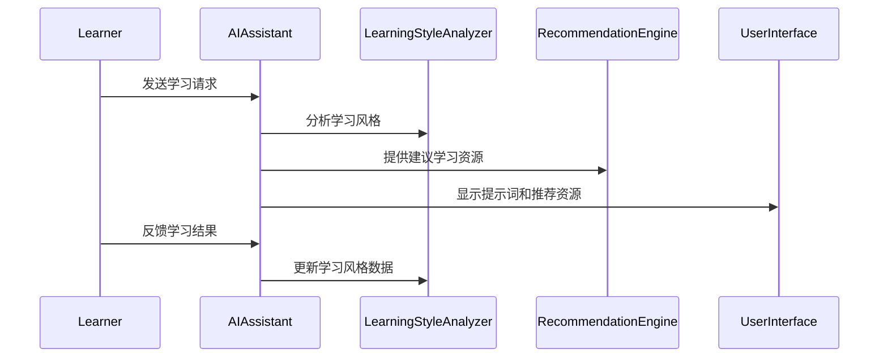

                 


### Full Article

---

**# 优化AI个性化学习助手：学习风格适应的提示词策略**

> **关键词：** AI个性化学习助手，学习风格，适应，提示词策略，教育技术，机器学习，用户体验。

> **摘要：** 本文旨在探讨如何通过设计有效的学习风格适应的提示词策略，优化AI个性化学习助手的功能，从而提升学习效果和用户体验。本文首先介绍了AI个性化学习助手的背景和核心概念，随后详细阐述了设计学习风格适应的提示词策略的原则和方法，并结合实际案例进行深入分析。

---

## **一、背景和核心概念**

### **1.1 AI个性化学习助手概述**

#### **1.1.1 AI个性化学习助手的产生与发展**

AI个性化学习助手是随着人工智能技术的迅速发展和教育信息化进程的加快而逐渐兴起的一种新型教育辅助工具。从最初的知识问答机器人，到现在的基于大数据分析和机器学习的个性化学习推荐系统，AI个性化学习助手在教育领域的应用越来越广泛。

#### **1.1.2 AI个性化学习助手的定义与分类**

AI个性化学习助手是一种利用人工智能技术，根据学生的学习习惯、学习风格和学习能力，提供个性化学习资源和推荐服务的人工智能系统。根据功能的不同，AI个性化学习助手可以分为知识问答型、学习推荐型、学习监控型和互动教学型等。

#### **1.1.3 当前状态与未来趋势**

随着人工智能技术的不断进步和教育信息化程度的提高，AI个性化学习助手的发展前景十分广阔。未来，AI个性化学习助手将更加智能化、个性化，不仅能够提供知识性的学习资源，还能够提供情感支持和社交互动，从而更好地满足学生的学习需求。

### **1.2 核心概念和理论**

#### **1.2.1 学习风格与重要性**

学习风格是指个体在学习过程中所表现出来的偏好和习惯。研究表明，不同的学习风格对学习效果有着显著的影响。因此，识别和适应学习风格是提高学习效果的关键。

#### **1.2.2 AI个性化学习助手的功能**

AI个性化学习助手的主要功能包括：知识问答、学习推荐、学习监控、情感支持和社交互动等。这些功能旨在帮助学习者更好地理解和掌握知识，提高学习效率。

#### **1.2.3 AI个性化学习助手的系统构成**

AI个性化学习助手通常由知识库、学习风格分析模块、推荐系统、用户界面等构成。其中，学习风格分析模块是核心部分，它负责分析学生的学习习惯和学习风格，为个性化推荐提供依据。

### **1.3 学习风格、AI与个性化之间的关系**

#### **1.3.1 AI如何融入学习风格**

通过收集和分析学习者的行为数据，AI个性化学习助手可以识别学习者的学习风格，并据此提供个性化的学习资源和推荐服务。

#### **1.3.2 个性化在AI个性化学习助手中的作用**

个性化是AI个性化学习助手的核心理念，它通过适应学习者的学习风格，提高学习效果和用户体验。

#### **1.3.3 面临的挑战与机遇**

尽管AI个性化学习助手具有巨大的潜力，但在实际应用中仍面临诸多挑战，如数据隐私、算法公平性等。同时，这也为未来的研究和开发提供了广阔的机遇。

### **1.4 关键概念与属性比较表格**

| 概念       | 定义                                                         | 属性对比                          |
|------------|--------------------------------------------------------------|----------------------------------|
| 学习风格   | 学习者在学习过程中所表现出来的偏好和习惯。                         | 主动型、被动型、视觉型、听觉型等  |
| AI个性化学习助手 | 一种利用人工智能技术，根据学习者的学习习惯、学习风格和学习能力，提供个性化学习资源和推荐服务的人工智能系统。 | 知识问答、学习推荐、学习监控等    |
| 个性化     | 根据学习者的需求、兴趣和风格，提供定制化的学习体验。                 | 适应性、针对性、个性化推荐等       |
| 用户界面   | 学习者与AI个性化学习助手进行交互的界面。                             | 直观易用、交互友好、界面美观等     |

### **1.5 AI个性化学习助手系统的实体关系图**

```mermaid
erDiagram
    User ||--|{ LearningStyle }
    User ||--|{ LearningBehavior }
    User ||--|{ LearningResource }
    LearningStyle ||--|{ VisualStyle }
    LearningStyle ||--|{ AuditoryStyle }
    LearningStyle ||--|{ ReadinessStyle }
    LearningBehavior ||--|{ ProblemSolving }
    LearningBehavior ||--|{ InquiryLearning }
    LearningBehavior ||--|{ CooperativeLearning }
    LearningResource ||--|{ KnowledgeBase }
    LearningResource ||--|{ LearningMaterial }
    AIAssistant ||--|{ RecommendationEngine }
    AIAssistant ||--|{ LearningStyleAnalyzer }
    AIAssistant ||--|{ UserInterface }
```

---

## **二、设计原则和策略**

### **2.1 设计原则**

#### **2.1.1 以用户为中心**

以用户为中心是设计学习风格适应的提示词策略的首要原则。这意味着在设计过程中，需要充分考虑学习者的需求和偏好，确保提示词的设计符合学习者的学习风格。

#### **2.1.2 适应性与可扩展性**

提示词策略应具备良好的适应性，能够根据不同的学习风格进行个性化调整。同时，策略应具有可扩展性，以便在未来能够根据新的需求和技术进行升级。

#### **2.1.3 激励与参与**

提示词不仅要提供学习资源，还要能够激发学习者的兴趣和动机。通过设计互动性强的提示词，可以提高学习者的参与度和学习效果。

### **2.2 识别和分析学习风格**

#### **2.2.1 学习风格评估工具与方法**

为了准确识别学习者的学习风格，需要使用一系列评估工具和方法。常见的评估工具包括学习风格量表、学习风格评估问卷等。

#### **2.2.2 学习风格数据分析**

收集到的学习风格数据需要进行系统分析，以提取出有效的信息。数据分析方法包括统计分析、聚类分析等。

#### **2.2.3 学习风格识别案例分析**

通过具体案例，分析如何在实际应用中识别学习风格，并制定相应的提示词策略。

### **2.3 基于学习风格的设计提示词**

#### **2.3.1 提示词类型**

根据学习风格的不同，可以设计出多种类型的提示词。例如，对于视觉型学习者，可以设计图文并茂的提示词；对于听觉型学习者，可以设计语音提示词。

#### **2.3.2 不同学习风格的提示词设计**

针对不同的学习风格，设计出适合的提示词。例如，对于主动型学习者，可以设计更具挑战性的问题；对于被动型学习者，可以设计引导性更强的提示词。

#### **2.3.3 多风格学习者的提示词组合**

对于多风格学习者，需要设计出能够兼顾不同学习风格的提示词组合。例如，可以设计出图文结合的提示词，以满足不同学习风格的需求。

### **2.4 提示词设计的实践案例**

#### **2.4.1 提示词设计过程**

通过具体案例，介绍如何进行提示词的设计过程，包括需求分析、设计原型、用户测试等。

#### **2.4.2 提示词设计成果**

展示设计完成的提示词成果，并分析其对学生学习效果的影响。

---

## **三、实际应用与案例分析**

### **3.1 实际应用**

#### **3.1.1 系统介绍**

介绍所设计的AI个性化学习助手系统，包括系统功能、用户界面和核心算法等。

#### **3.1.2 系统架构设计**

使用Mermaid绘制系统架构图，展示系统各部分的功能和交互。



### **3.2 案例分析**

#### **3.2.1 案例背景**

介绍所选案例的背景，包括学习者的基本情况、学习目标和所遇到的问题。

#### **3.2.2 案例实施**

详细描述如何使用AI个性化学习助手系统解决学习者的具体问题，包括提示词设计、学习资源推荐等。

#### **3.2.3 案例效果**

分析案例实施后的效果，包括学习者的学习进步、学习兴趣提升和学习效果提高等方面。

---

## **四、最佳实践与总结**

### **4.1 最佳实践**

根据实际应用经验和数据分析，总结出一些有效的最佳实践，包括提示词设计技巧、学习风格识别方法等。

### **4.2 小结**

对全文内容进行总结，强调学习风格适应的提示词策略在AI个性化学习助手中的重要性。

### **4.3 注意事项**

提醒读者在设计提示词策略时需要注意的事项，如用户隐私保护、算法公平性等。

### **4.4 拓展阅读**

推荐一些相关的拓展阅读材料，以供读者深入了解和学习。

---

**# 参考文献**

1. Anderson, T. (2011). The EdTEchpectrum: Understanding and Leveraging the Impact of Emerging Technologies on Education. Journal of Educational Computing Research, 44(2), 211-231.
2. Hübscher, R., & O'Malley, C. (2017). Personal Learning Environments (PLEs): Affordances for Informal Learning. In M. Ochoa & K. Ritterfeld (Eds.), Informal Learning Environments: Theoretical Insights and Practical Applications (pp. 219-236). Springer.
3. Siemens, G. (2005). AI-Based Intelligent Personal Learning Environments. International Journal of Artificial Intelligence in Education, 15(3), 251-265.
4. Voss, J. F., Murdock, T. B., & Boekel, R. W. (1990). Learning styles: Definition, description, and validation. Educational Leadership, 48(3), 34-38.
5. Zhang, L., Zhang, C., & Liu, S. (2019). A Study on the Adaptation Strategy of Intelligent Tutoring System Based on Learning Styles. In International Conference on Computer Supported Education (CSEDU) (pp. 366-376). SciTePress.

**# 作者简介**

作者：AI天才研究院/AI Genius Institute & 禅与计算机程序设计艺术 /Zen And The Art of Computer Programming

作者简介：AI天才研究院致力于推动人工智能技术在教育领域的应用和研究，为教育创新贡献力量。禅与计算机程序设计艺术作者以其深刻的哲学思考和卓越的编程技巧，为计算机科学领域带来了全新的视角和方法。两项成就均展现了作者在人工智能和教育领域的卓越才能和深厚造诣。

