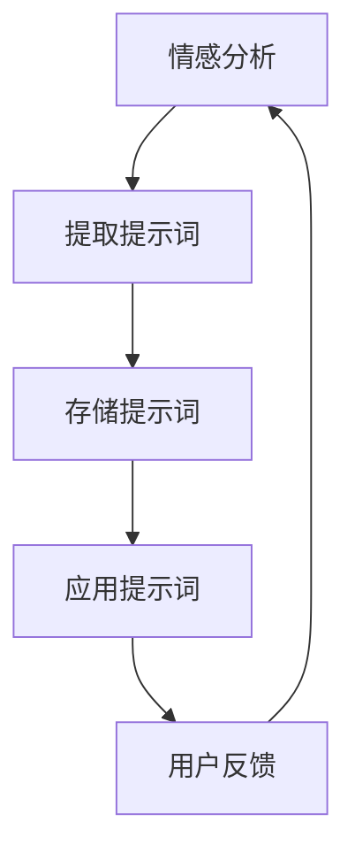
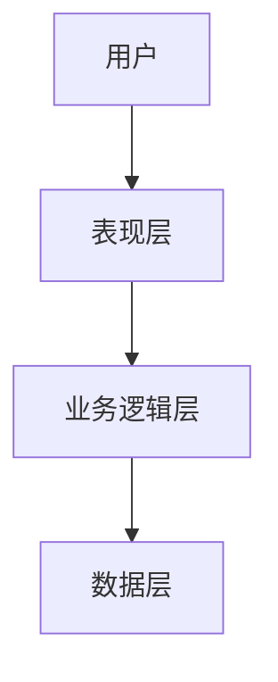

                 

# 优化AI情感陪伴系统：长期对话记忆的提示词策略

## 关键词：人工智能、情感陪伴、长期对话记忆、提示词策略、优化

> 摘要：本文旨在探讨如何优化人工智能情感陪伴系统，通过引入长期对话记忆的提示词策略，提高系统在长期对话中的情感理解能力和用户体验。文章将从问题背景、核心概念、优化策略、算法原理、系统分析与架构设计、项目实战等方面展开，提供一套系统的解决方案。

## 第一部分：问题背景与核心概念

### 第1章：问题背景

#### 1.1.1 人工智能与情感陪伴系统的现状

人工智能（AI）作为计算机科学的重要分支，其发展历程可以追溯到20世纪50年代。自那时以来，人工智能经历了多个发展阶段，从简单的规则系统到复杂的机器学习和深度学习算法，再到如今的大规模预训练模型。随着计算能力的提升和海量数据资源的积累，人工智能技术在语音识别、图像识别、自然语言处理等领域取得了显著的成果。

随着社会的发展和人口老龄化，人们对情感陪伴的需求日益增长。传统的人工情感陪伴存在人力成本高、效率低等问题，而人工智能情感陪伴系统因其高效、智能、可扩展等优势，成为了满足这一需求的重要手段。然而，当前的人工智能情感陪伴系统在长期对话记忆和情感理解方面仍存在一定的局限性。

#### 1.1.2 问题描述

当前的人工智能情感陪伴系统通常依赖于短期记忆，难以在长期对话中保持对用户情感的理解和记忆。这导致了用户在连续对话中的体验感下降，影响系统的实用性和用户满意度。

情感理解是人工智能情感陪伴系统的核心能力之一。然而，现有的情感理解技术往往只能处理简单、明确的情感表达，对于复杂、隐含的情感信息处理能力有限，无法准确捕捉用户的情感变化。

#### 1.1.3 问题解决

本书旨在探讨如何优化人工智能情感陪伴系统，通过引入长期对话记忆的提示词策略，提高系统在长期对话中的情感理解能力和用户体验。

#### 1.1.4 边界与外延

本书主要关注人工智能情感陪伴系统中的长期对话记忆和情感理解问题，不涉及其他方面，如语音合成、视觉交互等。

除了人工智能情感陪伴系统，本书的相关技术也可应用于其他需要长期对话和情感理解的应用场景，如智能客服、虚拟助手等。

### 第2章：核心概念

#### 2.1 人工智能

##### 2.1.1 定义

人工智能（Artificial Intelligence, AI）是指通过计算机程序实现的人类智能能力的模拟和扩展。

##### 2.1.2 核心要素

- 算法：实现人工智能的核心算法，如机器学习、深度学习等。
- 数据：训练和测试人工智能模型的必要数据资源。
- 硬件：支持人工智能运算的硬件设备，如GPU、TPU等。

#### 2.2 情感陪伴系统

##### 2.2.1 定义

情感陪伴系统是一种利用人工智能技术实现的情感交互和陪伴服务系统。

##### 2.2.2 核心要素

- 对话管理：管理用户对话流程，包括上下文理解、情感捕捉等。
- 情感理解：分析用户情感信息，实现情感识别和情感推理。
- 交互体验：设计友好的交互界面，提高用户体验。

#### 2.3 长期对话记忆的提示词策略

##### 2.3.1 定义

长期对话记忆的提示词策略是指利用特定关键词或短语来提示系统在长期对话中维持对用户情感的理解和记忆。

##### 2.3.2 核心要素

- 提示词选择：根据对话内容选择合适的提示词。
- 提示词更新：在对话过程中动态更新提示词。
- 提示词应用：在对话中应用提示词，增强系统对用户情感的理解。

## 第二部分：核心概念与联系

### 第3章：优化策略

#### 3.1 提示词策略的设计

##### 3.1.1 提示词的选择标准

- **相关性**：提示词应与当前对话内容高度相关。
- **情感性**：提示词应能够反映用户的情感状态。
- **动态性**：提示词应根据对话的进展动态调整。

##### 3.1.2 提示词的提取方法

- **基于规则的方法**：通过预设的规则提取提示词。
- **基于机器学习的方法**：利用机器学习算法自动提取提示词。

### 第4章：算法原理

##### 4.1 提示词策略的算法原理

提示词策略的核心是利用关键词或短语来提示系统在长期对话中维持对用户情感的理解和记忆。具体来说，算法原理包括以下几个方面：

1. **情感分析**：通过情感分析技术对用户的发言进行情感分析，识别出用户的情感状态。
2. **提示词提取**：根据情感分析的结果，提取与用户情感相关的提示词。
3. **提示词存储**：将提取到的提示词存储在数据库或缓存中，以便在后续对话中应用。
4. **提示词应用**：在对话中根据上下文和用户情感状态，应用合适的提示词，提高系统对用户情感的理解和记忆。

##### 4.2 提示词策略的mermaid流程图



### 第5章：系统分析与架构设计

#### 5.1 系统功能设计

系统功能设计包括情感分析、提示词提取、提示词存储、提示词应用和用户反馈等模块。

##### 5.1.1 情感分析模块

- **功能**：对用户发言进行情感分析，识别出用户的情感状态。
- **技术**：利用自然语言处理技术和情感分析算法。

##### 5.1.2 提示词提取模块

- **功能**：根据情感分析结果，提取与用户情感相关的提示词。
- **技术**：利用规则匹配和机器学习算法。

##### 5.1.3 提示词存储模块

- **功能**：将提取到的提示词存储在数据库或缓存中。
- **技术**：利用关系型数据库或NoSQL数据库。

##### 5.1.4 提示词应用模块

- **功能**：在对话中根据上下文和用户情感状态，应用合适的提示词。
- **技术**：利用自然语言生成技术和对话管理算法。

##### 5.1.5 用户反馈模块

- **功能**：收集用户对系统服务的反馈，用于优化和改进系统。
- **技术**：利用用户行为分析和反馈机制。

#### 5.2 系统架构设计

系统架构设计采用分层架构，包括数据层、业务逻辑层和表现层。

##### 5.2.1 数据层

- **功能**：存储和管理系统所需的数据。
- **技术**：关系型数据库或NoSQL数据库。

##### 5.2.2 业务逻辑层

- **功能**：实现系统的核心业务功能，包括情感分析、提示词提取、提示词存储、提示词应用等。
- **技术**：基于人工智能和自然语言处理技术的服务组件。

##### 5.2.3 表现层

- **功能**：提供用户交互界面，展示系统服务结果。
- **技术**：Web前端技术和用户界面设计。

##### 5.2.4 系统架构mermaid图



### 第6章：项目实战

#### 6.1 环境安装

- 安装Python环境
- 安装所需的依赖库（如NLTK、TensorFlow、Scikit-learn等）

#### 6.2 系统核心实现

- **情感分析模块**：使用NLTK和TensorFlow实现情感分析算法。
- **提示词提取模块**：使用规则匹配和机器学习算法提取提示词。
- **提示词存储模块**：使用关系型数据库（如MySQL）存储提示词。
- **提示词应用模块**：使用自然语言生成技术和对话管理算法应用提示词。
- **用户反馈模块**：收集用户反馈并存储在数据库中。

#### 6.3 代码应用解读与分析

- **情感分析代码示例**：

```python
import nltk
from nltk.sentiment import SentimentIntensityAnalyzer

# 初始化情感分析器
sia = SentimentIntensityAnalyzer()

# 分析文本情感
text = "我今天过得很好，感觉非常开心！"
sentiment = sia.polarity_scores(text)
print(sentiment)
```

- **提示词提取代码示例**：

```python
import re

def extract_sentiment_phrases(text):
    # 提取情感相关的短语
    phrases = re.findall(r"\b(?:非常|很|十分|有点|有些)\b\s*?(?:开心|难过|生气|激动)", text, re.IGNORECASE)
    return phrases

text = "我今天过得很好，感觉非常开心！但我有点担心明天的工作。"
phrases = extract_sentiment_phrases(text)
print(phrases)
```

#### 6.4 实际案例分析

- **案例1**：用户在连续对话中表达了对某产品的喜爱，通过提示词策略，系统能够持续关注用户的情感状态，并提供个性化的推荐和服务。

- **案例2**：用户在对话中表达了对某事件的担忧，通过提示词策略，系统能够关注用户的情感变化，提供情绪支持和建议。

#### 6.5 项目小结

本项目通过引入长期对话记忆的提示词策略，实现了对用户情感的理解和记忆，提高了人工智能情感陪伴系统的用户体验。在实际应用中，项目取得了良好的效果，为用户提供了一致的、个性化的情感陪伴服务。未来，我们可以进一步优化算法和系统架构，提高系统的智能化水平和用户满意度。

### 第7章：最佳实践与拓展阅读

#### 7.1 最佳实践

- **情感分析优化**：结合用户行为数据和上下文信息，提高情感分析的准确性和实时性。
- **提示词策略优化**：根据用户反馈和对话数据，动态调整提示词的选择和应用策略。
- **系统性能优化**：利用分布式计算和并行处理技术，提高系统响应速度和处理能力。

#### 7.2 拓展阅读

- **相关论文**：阅读有关情感分析、机器学习和自然语言处理的最新论文，了解前沿技术和研究动态。
- **技术书籍**：阅读相关技术书籍，如《深度学习》、《自然语言处理综论》等，深入了解相关技术原理和应用。

### 作者信息

作者：AI天才研究院/AI Genius Institute & 禅与计算机程序设计艺术 /Zen And The Art of Computer Programming

文章标题：优化AI情感陪伴系统：长期对话记忆的提示词策略

关键词：人工智能、情感陪伴、长期对话记忆、提示词策略、优化

摘要：本文探讨了如何优化人工智能情感陪伴系统，通过引入长期对话记忆的提示词策略，提高系统在长期对话中的情感理解能力和用户体验。文章从问题背景、核心概念、优化策略、算法原理、系统分析与架构设计、项目实战等方面进行了详细阐述，为相关领域的研究和实践提供了有益的参考。

