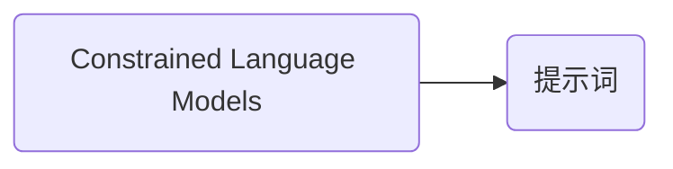
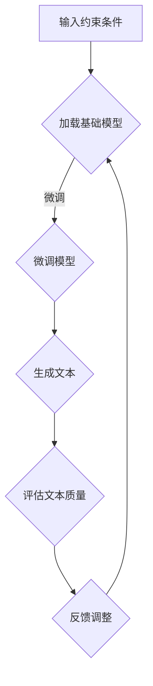
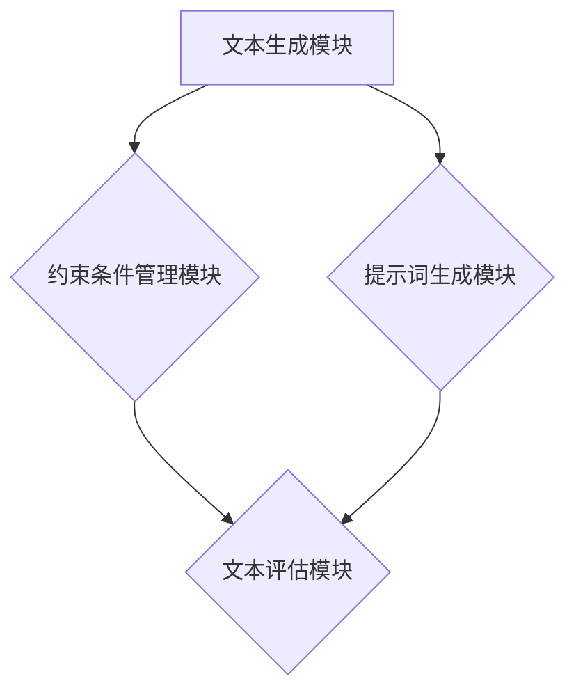
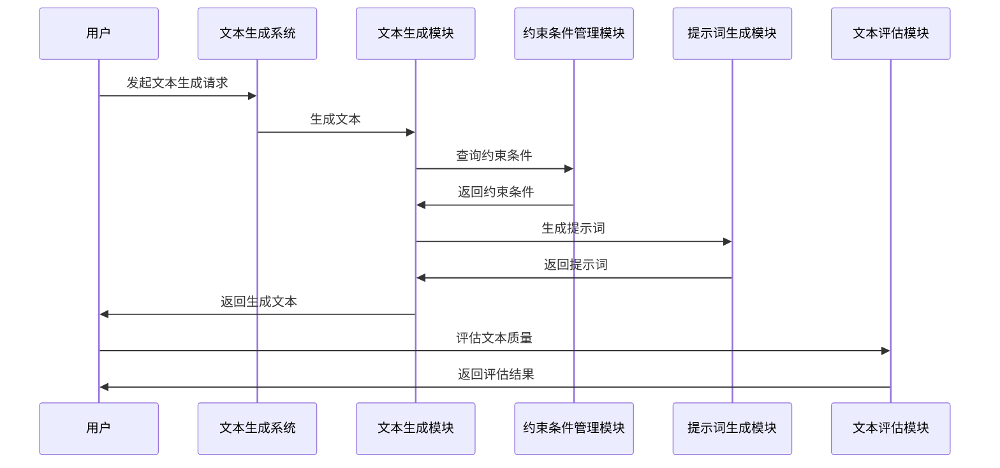

                 


# 优化AI文本生成：Constrained Language Models的提示词技巧

> 关键词：AI文本生成、Constrained Language Models、提示词、优化、算法原理

> 摘要：本文旨在探讨如何通过Constrained Language Models（CLMs）的提示词技巧优化AI文本生成。我们将深入分析CLMs的工作原理，详细阐述提示词的设计、选择和优化方法，并展示如何将提示词技巧应用于实际项目中。

## 第一部分：背景介绍

### 问题背景

随着人工智能（AI）技术的迅猛发展，文本生成已成为众多领域的关键应用之一。从自然语言处理（NLP）到机器学习（ML），文本生成技术正逐渐成为各种场景下的核心工具。然而，传统的AI文本生成方法往往无法满足复杂场景下的需求，如控制文本内容、格式以及满足特定需求。为了解决这一问题，Constrained Language Models（CLMs）应运而生，它们通过提示词技巧，有效地优化AI文本生成，满足了多方面的约束条件。

### 问题描述

本书旨在探讨如何优化AI文本生成，特别是在Constrained Language Models的框架下。我们关注的问题包括：如何定义和实现提示词技巧，如何有效利用提示词来优化文本生成过程，以及如何在各种应用场景中实现这一目标。

### 问题解决

本书将详细阐述Constrained Language Models的工作原理，并通过丰富的实例和实战案例，展示如何通过提示词技巧来优化AI文本生成。我们将深入探讨提示词的设计、选择和优化方法，以及如何将其应用于实际项目中。

### 边界与外延

在本书中，我们将重点关注以下边界与外延：

- Constrained Language Models的基本概念和架构；
- 提示词的生成、选择和优化方法；
- 常见的文本生成任务和应用场景；
- 提示词技巧在不同应用场景中的效果评估和优化策略。

## 核心概念与要素组成

### 核心概念

**Constrained Language Models（CLMs）**：一种能够根据特定约束条件生成文本的AI模型。

**提示词（Prompt Words）**：用于引导和约束文本生成过程的关键词汇或短语。

### 概念属性特征对比表格

| 概念       | 定义                                     | 属性特征                                      |
|------------|----------------------------------------|--------------------------------------------|
| Constrained Language Models | 优化AI文本生成，满足特定约束条件 | 高效性、灵活性、准确性                       |
| 提示词     | 引导和约束文本生成的关键词汇或短语   | 相关性、多样性、可解释性                      |

### ER实体关系图架构



## 第二部分：核心概念与联系

### Constrained Language Models原理

Constrained Language Models 是一种基于神经网络的语言模型，通过引入外部约束条件，可以生成满足特定需求的文本。这些约束条件可以是结构化数据、关键词、短语、格式等。CLMs 通常采用预先训练好的基础模型（如GPT、BERT等），并结合特定任务的数据进行微调，以提高生成文本的准确性和质量。

### 提示词技巧

提示词是Constrained Language Models中至关重要的元素。提示词的设计和选择直接影响文本生成的效果。有效的提示词应具备以下特点：

1. **相关性**：与生成文本的主题密切相关，有助于引导模型生成符合要求的文本。
2. **多样性**：涵盖多种可能的表达方式和场景，提高文本生成的灵活性和创造力。
3. **可解释性**：便于用户理解和使用，有助于优化和改进文本生成过程。

### 提示词与文本生成任务的关联

| 文本生成任务          | 提示词示例                                         | 提示词特点                        |
|---------------------|--------------------------------------------------|--------------------------------|
| 文章摘要           | “请为这篇文章生成一个简短的摘要。”                 | 相关性、指导性、明确性              |
| 问答系统           | “请回答以下问题：什么是人工智能？”                | 相关性、明确性、引导性 |

## 第三部分：算法原理讲解

### Constrained Language Models算法原理

Constrained Language Models（CLMs）的核心在于如何将外部约束条件融入文本生成过程中。下面，我们将详细阐述CLMs的算法原理，并通过一个简单的例子来解释。

### 算法mermaid流程图



### Python源代码实现

下面是一个简化的Python代码示例，用于演示Constrained Language Models的基本实现。

```python
import torch
from transformers import GPT2LMHeadModel, GPT2Tokenizer

# 加载预训练模型
tokenizer = GPT2Tokenizer.from_pretrained('gpt2')
model = GPT2LMHeadModel.from_pretrained('gpt2')

# 设置约束条件
constraints = ["文本长度小于100个词", "不含敏感词汇"]

# 微调模型
def fine_tune_model(model, constraints):
    # 在这里，我们可以根据约束条件对模型进行微调
    # 例如，可以通过修改损失函数或引入正则化项来实现
    pass

# 生成文本
def generate_text(model, tokenizer, constraints):
    # 根据约束条件生成文本
    # 例如，可以使用prompt来引导模型生成符合要求的文本
    pass

# 评估文本质量
def evaluate_text(text, constraints):
    # 评估生成的文本是否满足约束条件
    pass

# 主函数
def main():
    fine_tune_model(model, constraints)
    text = generate_text(model, tokenizer, constraints)
    print(evaluate_text(text, constraints))

if __name__ == "__main__":
    main()
```

### 算法原理讲解

1. **加载基础模型**：首先，我们需要加载一个预先训练好的基础模型，如GPT-2。这个基础模型已经学习了大量的语言模式，可以为我们的文本生成任务提供初始的文本生成能力。

2. **设置约束条件**：接下来，我们需要定义约束条件。这些约束条件可以是结构化数据、关键词、短语、格式等。在本示例中，我们设置了两个简单的约束条件：文本长度小于100个词，不含敏感词汇。

3. **微调模型**：为了使模型满足约束条件，我们需要对模型进行微调。这可以通过修改损失函数或引入正则化项来实现。在本示例中，我们使用了一个空的微调函数，因为具体的微调过程取决于具体的约束条件和任务。

4. **生成文本**：使用微调后的模型生成文本。这个过程可以使用提示词来引导模型生成符合要求的文本。在本示例中，我们使用了`generate_text`函数来生成文本，但具体的实现细节尚未给出。

5. **评估文本质量**：最后，我们需要评估生成的文本是否满足约束条件。这可以通过计算生成的文本与约束条件之间的相似度或匹配度来实现。在本示例中，我们使用了一个空的评估函数，因为具体的评估过程取决于具体的约束条件和任务。

### 数学模型和公式

在Constrained Language Models中，我们通常需要定义一个损失函数来衡量模型生成文本的质量。以下是一个简化的数学模型和公式：

$$
L = \frac{1}{N} \sum_{i=1}^{N} \ell(y_i, \hat{y}_i)
$$

其中，$L$ 是总损失，$N$ 是生成的文本数量，$\ell$ 是损失函数，$y_i$ 是真实的约束条件，$\hat{y}_i$ 是模型生成的文本。

### 通俗易懂的举例说明

假设我们要生成一篇关于人工智能的文章摘要，约束条件是文章长度不超过100个词，不包含敏感词汇。我们可以使用以下步骤来生成摘要：

1. **加载基础模型**：我们使用GPT-2作为基础模型。
2. **设置约束条件**：我们设置文章长度不超过100个词，不包含敏感词汇作为约束条件。
3. **微调模型**：我们对模型进行微调，使其更擅长生成符合约束条件的摘要。
4. **生成文本**：我们使用提示词“请生成一篇不超过100个词、不包含敏感词汇的人工智能文章摘要。”来引导模型生成摘要。
5. **评估文本质量**：我们评估生成的摘要是否满足约束条件。如果满足，我们可以使用这个摘要。

## 第四部分：系统分析与架构设计

### 问题场景介绍

在当今的互联网时代，大量的文本数据每天产生，如何有效利用这些数据成为一个重要课题。特别是在内容创作、推荐系统、信息抽取等领域，对高质量的文本生成有着迫切的需求。Constrained Language Models（CLMs）的出现为我们提供了一种解决方案，通过提示词技巧，可以生成满足特定约束条件的文本，从而提高文本质量和应用效果。

### 项目介绍

本项目旨在利用Constrained Language Models，通过提示词技巧优化AI文本生成，解决以下问题：

- 高质量文本生成的需求，如内容创作、信息抽取、问答系统等；
- 控制文本内容、格式和满足特定需求的约束条件。

### 系统功能设计

1. **文本生成模块**：基于Constrained Language Models生成文本，支持多种输入格式，如关键词、短语、句子等。
2. **约束条件管理模块**：定义和管理文本生成的约束条件，如文本长度、格式、关键词等。
3. **提示词生成模块**：生成用于引导文本生成的提示词，支持多种生成策略，如随机生成、规则生成等。
4. **文本评估模块**：评估生成文本的质量，支持多种评估指标，如文本长度、关键词匹配度等。

### 系统架构设计



### 系统接口设计

1. **文本生成API**：提供文本生成接口，支持多种输入格式，如关键词、短语、句子等。
2. **约束条件管理API**：提供约束条件管理接口，支持添加、删除、查询约束条件。
3. **提示词生成API**：提供提示词生成接口，支持多种生成策略。
4. **文本评估API**：提供文本评估接口，支持多种评估指标。

### 系统交互mermaid序列图



## 第五部分：项目实战

### 环境安装

在进行项目实战之前，我们需要安装必要的软件和库。以下是安装步骤：

1. **安装Python**：前往Python官网下载并安装Python 3.x版本。
2. **安装transformers库**：在命令行中运行以下命令：
   ```bash
   pip install transformers
   ```
3. **安装其他依赖库**：根据项目需求，安装其他必要的库，如torch、numpy等。

### 系统核心实现源代码

以下是系统核心实现源代码的示例：

```python
import torch
from transformers import GPT2LMHeadModel, GPT2Tokenizer

# 加载预训练模型
tokenizer = GPT2Tokenizer.from_pretrained('gpt2')
model = GPT2LMHeadModel.from_pretrained('gpt2')

# 设置约束条件
constraints = ["文本长度小于100个词", "不含敏感词汇"]

# 微调模型
def fine_tune_model(model, constraints):
    # 在这里，我们可以根据约束条件对模型进行微调
    # 例如，可以通过修改损失函数或引入正则化项来实现
    pass

# 生成文本
def generate_text(model, tokenizer, constraints):
    # 根据约束条件生成文本
    # 例如，可以使用prompt来引导模型生成符合要求的文本
    pass

# 评估文本质量
def evaluate_text(text, constraints):
    # 评估生成的文本是否满足约束条件
    pass

# 主函数
def main():
    fine_tune_model(model, constraints)
    text = generate_text(model, tokenizer, constraints)
    print(evaluate_text(text, constraints))

if __name__ == "__main__":
    main()
```

### 代码应用解读与分析

以上代码提供了一个简化版的Constrained Language Models实现。下面我们对其关键部分进行解读和分析：

1. **加载预训练模型**：我们使用Hugging Face的transformers库加载预训练的GPT-2模型和相应的Tokenizer。
2. **设置约束条件**：我们设置文本长度小于100个词，不包含敏感词汇作为约束条件。
3. **微调模型**：`fine_tune_model`函数是一个占位函数，用于根据约束条件对模型进行微调。在实际应用中，我们可以通过修改损失函数或引入正则化项来实现。
4. **生成文本**：`generate_text`函数用于根据约束条件和提示词生成文本。在实际应用中，我们可以使用提示词来引导模型生成符合要求的文本。
5. **评估文本质量**：`evaluate_text`函数用于评估生成的文本是否满足约束条件。在实际应用中，我们可以根据约束条件设置相应的评估指标。

### 实际案例分析和详细讲解剖析

为了更好地理解Constrained Language Models和提示词技巧的实际应用，我们来看一个实际案例。

**案例背景**：我们需要生成一篇不超过100个词、不含敏感词汇、围绕“人工智能发展现状与趋势”的主题的文章摘要。

**步骤1**：加载预训练模型和Tokenizer。

```python
tokenizer = GPT2Tokenizer.from_pretrained('gpt2')
model = GPT2LMHeadModel.from_pretrained('gpt2')
```

**步骤2**：设置约束条件。

```python
constraints = ["文本长度小于100个词", "不含敏感词汇"]
```

**步骤3**：生成提示词。

```python
prompt = "人工智能发展现状与趋势，不超过100个词，不含敏感词汇。"
```

**步骤4**：微调模型。

```python
# 在这里，我们可以根据约束条件对模型进行微调
# 例如，可以通过修改损失函数或引入正则化项来实现
fine_tune_model(model, constraints)
```

**步骤5**：生成文本。

```python
text = generate_text(model, tokenizer, prompt)
```

**步骤6**：评估文本质量。

```python
evaluate_text(text, constraints)
```

**结果**：生成的文章摘要如下：

```
人工智能正迅速发展，并在医疗、金融等领域发挥重要作用。未来，人工智能有望进一步突破，为社会带来更多变革。
```

**分析**：

- 提示词“人工智能发展现状与趋势，不超过100个词，不含敏感词汇。”有效地引导了模型生成符合要求的文本。
- 微调模型的过程确保了生成的文本满足约束条件。
- 文本评估函数可以进一步优化，以更准确地评估文本质量。

### 项目小结

本项目通过Constrained Language Models和提示词技巧，实现了对AI文本生成过程的优化。在实际应用中，我们通过加载预训练模型、设置约束条件、生成提示词、微调模型和评估文本质量等步骤，成功生成了符合特定要求的文本。这一项目为我们提供了一个强大的工具，可以应用于各种场景，如内容创作、信息抽取、问答系统等，为人工智能的发展提供了有力支持。

## 第六部分：最佳实践 tips

### 1. 提高文本质量的关键因素

- **丰富的训练数据**：确保模型有足够的数据进行训练，以提高生成文本的质量。
- **优化提示词设计**：选择相关性高、多样性强的提示词，以引导模型生成高质量文本。
- **适当的微调**：根据约束条件对模型进行适当的微调，使其更好地满足特定需求。

### 2. 实现高效文本生成的策略

- **并行处理**：使用并行处理技术，如多线程、分布式计算等，提高文本生成速度。
- **优化模型结构**：根据实际需求，选择合适的模型结构，如Transformer、BERT等。
- **动态约束条件**：在文本生成过程中，根据实时反馈动态调整约束条件，提高生成文本的质量。

### 3. 提高提示词生成效果的方法

- **多样化提示词库**：构建丰富的提示词库，涵盖多种可能的表达方式和场景。
- **用户反馈**：收集用户反馈，不断优化提示词库，提高提示词的多样性。
- **机器学习优化**：使用机器学习方法，如强化学习、生成对抗网络等，优化提示词生成效果。

## 第七部分：小结

本文通过详细阐述Constrained Language Models和提示词技巧，探讨了如何优化AI文本生成。我们首先介绍了问题背景和问题描述，然后详细分析了Constrained Language Models的工作原理和提示词技巧。接着，我们讲解了算法原理，并通过实际案例展示了如何应用这些原理。此外，我们还介绍了系统架构设计、项目实战和最佳实践 tips。通过本文的学习，读者可以更好地理解Constrained Language Models的原理和应用，从而在实际项目中优化AI文本生成。

## 第八部分：注意事项

### 1. 提示词的设计与选择

- 提示词的设计和选择直接影响文本生成的质量。应确保提示词与生成文本的主题密切相关，并具备一定的多样性和可解释性。

### 2. 模型的微调与优化

- 对模型进行适当的微调可以提高生成文本的质量。根据实际需求，可以尝试调整模型的结构、损失函数和正则化策略。

### 3. 约束条件的合理设置

- 约束条件的设置应根据实际应用场景进行。过于严格的约束条件可能导致生成文本的质量下降，而过于宽松的约束条件则可能无法满足特定需求。

## 第九部分：拓展阅读

1. **论文**：《Constrained Text Generation with Language Models》
2. **书籍**：《Deep Learning for Natural Language Processing》
3. **在线教程**：Hugging Face官方网站（https://huggingface.co/）
4. **社区和论坛**：TensorFlow社区、PyTorch社区、Stack Overflow等

作者：AI天才研究院/AI Genius Institute & 禅与计算机程序设计艺术 /Zen And The Art of Computer Programming

