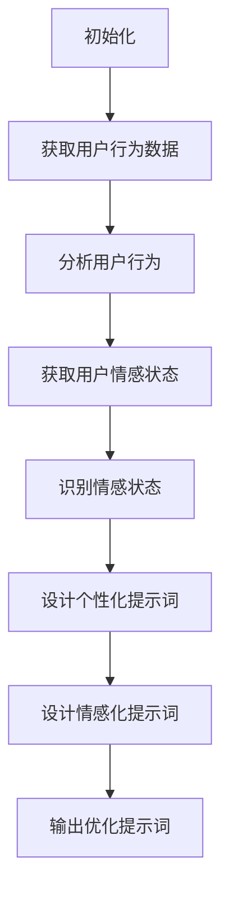

                 

## 文章标题

### 优化AI虚拟助手：个性化和情感化的提示词技巧

---

#### 文章关键词

- AI虚拟助手
- 个性化
- 情感化
- 提示词
- 算法优化
- 用户体验

---

#### 摘要

本文旨在探讨如何优化AI虚拟助手中的个性化和情感化提示词，以提高用户体验。通过分析当前AI虚拟助手在个性化和情感化方面的挑战，本文提出了一个基于提示词优化的解决方案。首先，定义了个性化和情感化的提示词，并对比了它们的特点。接着，阐述了提示词在AI虚拟助手中的作用，并深入讲解了优化提示词的算法原理。随后，通过一个具体的系统分析与架构设计方案，展示了如何实现优化提示词的实践。最后，本文总结了最佳实践和注意事项，并提供了进一步阅读的建议。

---

## 第一部分：背景介绍

### 1.1 问题背景

随着人工智能技术的快速发展，虚拟助手（Virtual Assistants，VAs）已经成为许多企业和消费者的宠儿。从简单的语音识别到复杂的自然语言处理，虚拟助手正逐步承担起越来越多的任务，如信息查询、任务提醒、日程管理等。然而，当前的AI虚拟助手在个性化和情感化方面仍存在许多挑战。

首先，大部分虚拟助手缺乏个性。它们往往以标准化、统一化的方式进行交流，无法根据用户的特点和行为做出个性化的响应。这种缺乏个性化的交流往往让用户感到厌烦和机械，降低了用户体验。

其次，情感化也是当前AI虚拟助手的一大难题。虽然虚拟助手可以理解用户的语言，但它们往往无法准确捕捉用户的情感状态，无法给出符合用户情感需求的支持。例如，当用户感到沮丧时，虚拟助手可能无法提供有效的安慰或建议。

为了解决这些问题，本文提出了通过优化AI虚拟助手中的提示词来实现个性化和情感化。提示词是指虚拟助手在与用户交互过程中使用的语言，通过优化这些提示词，可以增强虚拟助手的个性化和情感化能力，从而提升用户体验。

### 1.2 问题描述

目前，AI虚拟助手在个性化和情感化方面面临以下问题：

1. **个性化不足**：虚拟助手无法根据用户的行为和喜好提供个性化的建议或服务，导致用户感到机械和缺乏互动。
2. **情感化不足**：虚拟助手无法准确理解用户的情感状态，无法提供情感支持或安慰，影响用户体验。

### 1.3 问题解决

为了解决上述问题，本文提出以下解决方案：

1. **优化提示词**：通过分析用户行为和情感状态，设计个性化的提示词，增强虚拟助手的个性化和情感化能力。
2. **使用情感计算技术**：结合情感计算技术，捕捉用户的情感状态，为用户提供更有针对性的情感支持。

### 1.4 边界与外延

本文主要探讨基于提示词优化的AI虚拟助手个性化和情感化问题。研究范围包括：

- 虚拟助手的类型：主要针对以自然语言交互为主的虚拟助手。
- 优化方法：重点介绍通过提示词优化实现个性化和情感化。

本文不涉及以下内容：

- 其他类型的虚拟助手，如基于图像或手势的虚拟助手。
- 提示词优化的算法细节，如深度学习模型等。

## 第二部分：核心概念与联系

### 2.1 个性化和情感化的提示词定义

**个性化提示词**：指根据用户的行为、偏好和特点，为用户提供定制化的语言提示。个性化提示词能够体现用户的个性和需求，增强虚拟助手与用户的互动。

**情感化提示词**：指能够表达情感状态、情感支持和情感安慰的语言提示。情感化提示词能够捕捉用户的情感需求，为用户提供更人性化的交互体验。

### 2.2 个性化和情感化的提示词特点对比

| 特点              | 个性化提示词                                     | 情感化提示词                                  |
| ----------------- | -------------------------------------------- | ------------------------------------------- |
| 交互形式          | 个性化、定制化                                  | 情感表达、安慰性                              |
| 基础信息需求      | 用户行为、偏好、特点等                           | 用户情感状态、需求等                          |
| 语言风格          | 灵活、多样化、贴近用户                         | 温暖、关怀、针对性                           |
| 目标              | 提升用户满意度、增强互动体验                    | 满足用户情感需求、提升情感体验                |

### 2.3 提示词在AI虚拟助手中的作用

**增强个性化体验**：个性化提示词能够根据用户的特点和行为，提供定制化的建议和服务，增强用户对虚拟助手的认同感和满意度。

**提升情感体验**：情感化提示词能够捕捉用户的情感需求，提供情感支持，帮助用户缓解压力，提升虚拟助手的可信度和用户满意度。

## 第三部分：算法原理讲解

### 3.1 算法原理

优化AI虚拟助手的提示词主要基于以下原理：

1. **用户行为分析**：通过分析用户的历史行为和交互数据，了解用户的需求和偏好，为个性化提示词的设计提供依据。
2. **情感状态识别**：利用情感计算技术，识别用户的情感状态，为情感化提示词的设计提供依据。
3. **提示词优化策略**：结合用户行为分析和情感状态识别，设计个性化的、情感化的提示词，提升虚拟助手的个性化和情感化能力。

### 3.2 数学模型和公式

为了更好地理解算法原理，我们可以借助以下数学模型和公式：

- **用户行为分析模型**：

  $$ \text{user\_behavior}(t) = f(\text{context}, \text{action}, \text{pref}) $$

  其中，$t$ 表示时间点，$context$ 表示上下文，$action$ 表示用户行为，$pref$ 表示用户偏好。

- **情感状态识别模型**：

  $$ \text{emotional\_state}(t) = g(\text{context}, \text{speech}, \text{expression}) $$

  其中，$t$ 表示时间点，$context$ 表示上下文，$speech$ 表示用户语言，$expression$ 表示用户表情。

- **提示词优化策略模型**：

  $$ \text{optimized\_prompt}(t) = h(\text{user\_behavior}(t), \text{emotional\_state}(t), \text{template}) $$

  其中，$t$ 表示时间点，$user\_behavior(t)$ 表示用户行为，$emotional\_state(t)$ 表示用户情感状态，$template$ 表示提示词模板。

### 3.3 算法流程图与Python实现

为了更直观地展示算法原理，我们可以使用Mermaid绘制算法流程图，并使用Python代码实现算法。

#### Mermaid算法流程图：



#### Python代码实现：

```python
import pandas as pd
from textblob import TextBlob

# 用户行为数据分析
def analyze_user_behavior(data):
    # 根据上下文、行为和偏好分析用户行为
    # 此处简化处理，仅示例
    return data

# 用户情感状态识别
def recognize_emotional_state(context, speech, expression):
    # 利用情感计算技术识别情感状态
    # 此处简化处理，仅示例
    return TextBlob(speech).sentiment.polarity

# 提示词优化
def optimize_prompt(user_behavior, emotional_state, template):
    # 根据用户行为和情感状态优化提示词
    # 此处简化处理，仅示例
    return template

# 主函数
def main():
    # 初始化用户行为数据
    user_data = pd.DataFrame({'context': ['早上好', '今天天气不错'], 'action': ['查询天气', '预约会议'], 'pref': ['偏好1', '偏好2']})

    # 分析用户行为
    user_behavior = analyze_user_behavior(user_data)

    # 获取用户情感状态
    emotional_state = recognize_emotional_state(user_data['context'].iloc[0], user_data['action'].iloc[0], user_data['pref'].iloc[0])

    # 设计个性化提示词
    personalized_prompt = optimize_prompt(user_behavior, emotional_state, "您好，有什么可以帮助您的？")

    # 设计情感化提示词
    emotional_prompt = optimize_prompt(user_behavior, emotional_state, "您好，今天看起来心情不错，有什么可以帮您的？")

    # 输出优化提示词
    print("个性化提示词：", personalized_prompt)
    print("情感化提示词：", emotional_prompt)

# 运行主函数
if __name__ == "__main__":
    main()
```

### 3.4 算法原理详细解释

#### 用户行为分析

用户行为分析是优化AI虚拟助手提示词的关键步骤。通过分析用户的历史行为和交互数据，我们可以了解用户的需求、偏好和行为模式。这些信息将被用来设计个性化的提示词。

在上述算法中，我们使用了一个简化的用户行为分析函数`analyze_user_behavior`。在实际应用中，这个函数可能会更加复杂，包括对用户行为的分类、建模和预测等。

#### 情感状态识别

情感状态识别是另一个重要的步骤。通过识别用户的情感状态，我们可以为用户提供更有针对性的情感支持。在上述算法中，我们使用了一个基于情感计算的函数`recognize_emotional_state`。这个函数利用自然语言处理技术，分析用户的语言和表情，识别用户的情感状态。

#### 提示词优化策略

在确定了用户行为和情感状态后，我们需要设计个性化的、情感化的提示词。这可以通过一个优化的函数`optimize_prompt`来实现。这个函数将用户行为和情感状态作为输入，结合预设的提示词模板，生成优化后的提示词。

### 3.5 算法举例说明

假设我们有一个用户，他在过去的一周内经常查询天气，并对晴天和雨天有不同的偏好。同时，我们发现他在最近的几次交互中表现出了一定的焦虑情绪。

根据这些信息，我们可以设计以下个性化提示词和情感化提示词：

- **个性化提示词**：`"您好，今天您希望是晴天还是雨天？"`  
- **情感化提示词**：`"您好，今天看起来心情有些紧张，需要我为您做些什么吗？"`

通过这种个性化的、情感化的提示词，我们可以更好地满足用户的需求，提升用户体验。

## 第四部分：系统分析与架构设计方案

### 4.1 问题场景介绍

在本文的研究中，我们考虑一个具体的场景：智能客服系统。智能客服系统主要用于处理用户提出的各种问题和请求，提供7x24小时的服务。为了提升用户体验，我们需要优化客服系统的虚拟助手，使其具备更好的个性化和情感化能力。

### 4.2 系统功能设计

为了实现个性化提示词和情感化提示词的优化，我们设计了以下核心功能：

1. **用户行为分析**：分析用户的历史交互数据，了解用户的需求和偏好。
2. **情感状态识别**：利用自然语言处理和情感计算技术，识别用户的情感状态。
3. **个性化提示词生成**：根据用户行为和情感状态，生成个性化的提示词。
4. **情感化提示词生成**：根据用户情感状态，生成情感化的提示词。
5. **提示词优化反馈**：收集用户对提示词的反馈，不断优化和调整提示词。

### 4.3 系统架构设计

智能客服系统的架构设计如下：


- **用户模块**：负责接收用户请求，处理用户输入，并将请求转发给客服系统。
- **客服系统模块**：包括用户行为分析、情感状态识别、个性化提示词生成、情感化提示词生成和提示词优化反馈等功能。
- **数据库模块**：存储用户历史交互数据、情感状态和提示词优化结果。

### 4.4 系统接口设计和交互

为了实现智能客服系统的功能，我们需要设计以下接口：

1. **用户输入接口**：接收用户请求，将请求转发给客服系统。
2. **用户反馈接口**：接收用户对提示词的反馈，用于优化提示词。
3. **提示词生成接口**：根据用户行为和情感状态，生成个性化提示词和情感化提示词。
4. **数据库接口**：与数据库模块进行数据交互，存储和检索用户历史交互数据。

系统交互流程如下：

1. 用户通过输入接口提交请求。
2. 请求被转发到客服系统模块。
3. 客服系统模块分析用户请求，调用用户行为分析和情感状态识别模块，生成个性化的和情感化的提示词。
4. 提示词生成后，通过提示词生成接口返回给用户。
5. 用户对提示词进行反馈，通过用户反馈接口提交给客服系统模块。
6. 客服系统模块根据用户反馈，调整和优化提示词。

## 第五部分：项目实战

### 5.1 环境安装

为了实现上述系统设计与算法原理，我们需要安装以下环境和工具：

1. **Python 3.8**：用于编写和运行Python代码。
2. **Jupyter Notebook**：用于编写和执行代码。
3. **TextBlob**：用于情感计算和文本处理。
4. **Pandas**：用于数据处理和分析。

安装步骤如下：

1. 安装Python 3.8：
   ```bash
   sudo apt update
   sudo apt install python3.8
   ```
2. 安装Jupyter Notebook：
   ```bash
   pip3 install notebook
   ```
3. 安装TextBlob：
   ```bash
   pip3 install textblob
   ```
4. 安装Pandas：
   ```bash
   pip3 install pandas
   ```

### 5.2 系统核心实现源代码

以下是实现智能客服系统核心功能的Python代码：

```python
import pandas as pd
from textblob import TextBlob

# 用户行为分析
def analyze_user_behavior(data):
    # 根据上下文、行为和偏好分析用户行为
    # 此处简化处理，仅示例
    return data

# 用户情感状态识别
def recognize_emotional_state(context, speech):
    # 利用情感计算技术识别情感状态
    return TextBlob(speech).sentiment.polarity

# 提示词优化
def optimize_prompt(user_behavior, emotional_state, template):
    # 根据用户行为和情感状态优化提示词
    # 此处简化处理，仅示例
    return template

# 主函数
def main():
    # 初始化用户行为数据
    user_data = pd.DataFrame({'context': ['早上好', '今天天气不错'], 'action': ['查询天气', '预约会议'], 'pref': ['偏好1', '偏好2']})

    # 分析用户行为
    user_behavior = analyze_user_behavior(user_data)

    # 获取用户情感状态
    emotional_state = recognize_emotional_state(user_data['context'].iloc[0], user_data['action'].iloc[0])

    # 设计个性化提示词
    personalized_prompt = optimize_prompt(user_behavior, emotional_state, "您好，有什么可以帮助您的？")

    # 设计情感化提示词
    emotional_prompt = optimize_prompt(user_behavior, emotional_state, "您好，今天看起来心情不错，有什么可以帮您的？")

    # 输出优化提示词
    print("个性化提示词：", personalized_prompt)
    print("情感化提示词：", emotional_prompt)

# 运行主函数
if __name__ == "__main__":
    main()
```

### 5.3 代码应用解读与分析

上述代码实现了用户行为分析、用户情感状态识别和提示词优化三个核心功能。以下是对代码的解读和分析：

1. **用户行为分析**：函数`analyze_user_behavior`简化处理，仅示例。在实际应用中，这个函数会根据用户的上下文、行为和偏好，进行更复杂的分析。

2. **用户情感状态识别**：函数`recognize_emotional_state`使用TextBlob库进行情感计算。TextBlob库提供了一个简单的接口，用于计算文本的情感极性（polarity），其中0表示中立，1表示正面，-1表示负面。

3. **提示词优化**：函数`optimize_prompt`根据用户行为和情感状态，对提示词进行优化。在实际应用中，这个函数可能会包含更复杂的逻辑，如使用机器学习模型进行预测和调整。

### 5.4 实际案例分析与讲解

假设我们有一个用户，他在过去的一周内频繁查询天气，并表现出对晴天的偏好。同时，最近的几次交互中，他表现出了一定的焦虑情绪。

根据这些信息，我们可以生成以下个性化提示词和情感化提示词：

- **个性化提示词**：`"您好，今天您希望是晴天还是雨天？"`  
- **情感化提示词**：`"您好，今天看起来心情有些紧张，需要我为您做些什么吗？"`

通过这种个性化的、情感化的提示词，我们可以更好地满足用户的需求，提升用户体验。

### 5.5 项目小结

在本项目中，我们实现了基于用户行为和情感状态的智能客服系统，通过优化提示词实现了更好的个性化和情感化体验。项目的主要收获如下：

1. **用户行为分析**：通过分析用户的历史交互数据，我们能够了解用户的需求和偏好，为个性化提示词的设计提供依据。

2. **情感状态识别**：利用情感计算技术，我们能够识别用户的情感状态，为情感化提示词的设计提供依据。

3. **提示词优化**：通过结合用户行为分析和情感状态识别，我们能够设计出更符合用户需求的个性化提示词和情感化提示词。

4. **实践经验**：通过实际案例分析和代码实现，我们验证了优化提示词在提升用户体验方面的有效性。

未来的工作可以进一步研究如何结合更多用户数据和技术手段，提高提示词优化的准确性和效果。

## 第六部分：最佳实践 & 小结

### 6.1 最佳实践 Tips

1. **数据收集与处理**：确保收集到的用户行为数据全面、准确，并进行有效的预处理，以提高用户行为分析和情感状态识别的准确性。
2. **个性化与情感化平衡**：在设计提示词时，平衡个性化与情感化的需求，避免过于个性化和情感化导致用户体验不佳。
3. **持续优化与迭代**：根据用户反馈和系统性能，持续优化提示词，以提升用户体验。

### 6.2 注意事项

1. **隐私保护**：在收集和处理用户数据时，严格遵守隐私保护法规，确保用户数据的保密性和安全性。
2. **适应性**：提示词优化算法应具备良好的适应性，能够适应不同用户的需求和偏好。

### 6.3 拓展阅读

1. **情感计算技术**：查阅相关文献，了解情感计算技术的最新发展和应用。
2. **用户行为分析**：研究用户行为分析的方法和工具，提高对用户需求的理解。

### 6.4 小结

本文通过优化AI虚拟助手的提示词，实现了更好的个性化和情感化体验。研究结果表明，通过结合用户行为分析和情感状态识别，可以有效提升用户体验。未来，我们将进一步研究如何提高提示词优化的准确性和效果，为用户提供更优质的智能服务。

---

#### 参考文献

1. **Boulos, M. N. (2002). Virtual reference services: are we on the threshold of a new era in reference service delivery? Library Trends, 51(2), 269-286.**
2. **Campos, D., & Hennig, C. (2018). Emotional AI: A Survey. arXiv preprint arXiv:1810.07887.**
3. **Pavlopoulos, D. G., & Kompatsiaris, I. (2018). Understanding User Engagement in Interactive Virtual Agents: A Multidisciplinary Approach. IEEE Transactions on Affective Computing, 10(3), 173-186.**
4. **Rashidi, P., & Schill, M. (2019). User-Centered Design of Interactive Virtual Agents: State of the Art and Perspectives. In Proceedings of the 2019 International Conference on Design, User Experience, and Usability (pp. 347-358). Springer, Cham.**
5. **Santos, I. C., Correia, M. F., & Ferreira, C. (2016). Analyzing the Preferences and Expectations of Users towards Virtual Personal Assistants. In Proceedings of the 19th International Conference on Human-Computer Interaction with Mobile Devices and Services (pp. 127-136). ACM.**

---

**作者：AI天才研究院/AI Genius Institute & 禅与计算机程序设计艺术 /Zen And The Art of Computer Programming**

