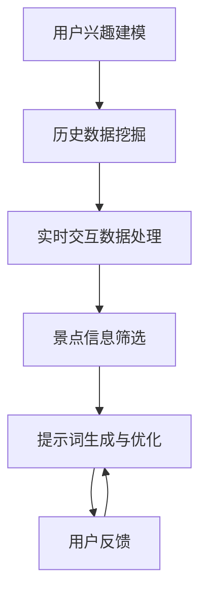

                 

# 优化AI虚拟导游：景点介绍个性化的提示词策略

## 关键词
- 人工智能，虚拟导游，个性化，提示词策略，优化方法

## 摘要
本文旨在探讨如何通过优化AI虚拟导游系统中的景点介绍个性化提示词策略，以提高用户体验和满意度。首先，我们分析了AI虚拟导游的发展背景与现状，探讨了个性化景点介绍的需求与挑战。接着，我们介绍了优化目标与评价指标，以及景点信息处理和提示词生成与优化的核心概念。随后，我们详细描述了AI虚拟导游系统架构设计，包括功能设计、架构设计和接口设计。然后，我们提出了基于用户兴趣、历史数据和实时交互的个性化提示词策略。接下来，我们讲解了个性化景点介绍算法原理，并通过Python代码实现了相关算法。文章的最后，我们通过一个实际项目案例进行了分析讲解，并总结了最佳实践和注意事项。

### 目录大纲

----------------------------------------------------------------
# 优化AI虚拟导游：景点介绍个性化的提示词策略

## 第一部分: 优化AI虚拟导游的背景与问题分析

### 第1章: AI虚拟导游的发展背景与现状

#### 1.1 AI虚拟导游的概念与起源
#### 1.2 AI虚拟导游的应用领域
#### 1.3 当前AI虚拟导游的优缺点分析

### 第2章: 个性化景点介绍的需求与挑战

#### 2.1 个性化景点介绍的重要性
#### 2.2 个性化景点介绍的难点与挑战
#### 2.3 提示词策略在个性化景点介绍中的作用

### 第3章: 核心概念与联系

#### 3.1 优化目标与评价指标
#### 3.2 景点信息处理的核心概念
#### 3.3 提示词生成与优化

## 第二部分: AI虚拟导游系统架构设计

### 第4章: 系统架构设计

#### 4.1 系统功能设计
#### 4.2 系统架构设计
#### 4.3 系统接口设计

## 第三部分: 景点介绍个性化提示词策略设计

### 第5章: 基于用户兴趣的提示词策略

#### 5.1 基于用户兴趣的提示词策略
#### 5.2 基于历史数据的提示词策略
#### 5.3 基于实时交互的提示词策略

## 第四部分: 算法原理讲解与数学模型

### 第6章: 个性化景点介绍算法原理

#### 6.1 算法原理讲解
#### 6.2 Python代码实现与详细讲解

## 第五部分: 项目实战与案例分析

### 第7章: 项目实战与案例分析

#### 7.1 环境安装与准备
#### 7.2 系统核心实现与代码应用
#### 7.3 实际案例分析与详细讲解
#### 7.4 项目小结与拓展

## 第六部分: 最佳实践与注意事项

### 第8章: 最佳实践与注意事项

#### 8.1 最佳实践 tips
#### 8.2 小结
#### 8.3 注意事项
#### 8.4 拓展阅读

----------------------------------------------------------------

### 第1章: AI虚拟导游的发展背景与现状

#### 1.1 AI虚拟导游的概念与起源

AI虚拟导游是一种利用人工智能技术，结合虚拟现实、增强现实和自然语言处理等先进技术，为游客提供个性化导览服务的智能系统。它起源于20世纪末，随着计算机技术、网络通信技术和传感器技术的飞速发展，AI虚拟导游逐渐从理论研究走向实际应用。

最早的研究可以追溯到1990年代初，当时的AI虚拟导游主要是基于规则的方法，通过预设的导游脚本为用户提供信息。随着自然语言处理和机器学习技术的进步，AI虚拟导游逐渐具备了更为智能的交互能力，能够根据用户的反馈和需求动态调整导游内容。

#### 1.2 AI虚拟导游的应用领域

AI虚拟导游的应用领域广泛，主要包括以下几个方面：

1. **旅游行业**：为游客提供景区介绍、历史背景、特色美食等个性化信息，提升旅游体验。
2. **文化遗产保护**：利用虚拟导游技术，将文化遗产数字化，让更多的人能够在线上了解和体验。
3. **城市规划**：通过虚拟导游，为城市规划提供参考，帮助游客更好地理解城市规划理念和设计思路。
4. **教育领域**：利用虚拟导游，为学生提供沉浸式的学习体验，增强知识理解和记忆。

#### 1.3 当前AI虚拟导游的优缺点分析

当前AI虚拟导游系统在功能和技术实现上取得了显著的进展，但仍存在一些不足之处。

**优点**：

1. **个性化服务**：AI虚拟导游可以根据用户的兴趣和需求，提供个性化的导览内容。
2. **节省成本**：相对于传统的导游服务，AI虚拟导游能够节省人力成本，提高运营效率。
3. **实时更新**：通过大数据和人工智能技术，AI虚拟导游可以实时更新景区信息，提供最新的导游内容。
4. **跨地域访问**：用户可以在全球范围内访问AI虚拟导游服务，不受地域限制。

**缺点**：

1. **用户体验有限**：虽然AI虚拟导游能够提供一定程度的个性化服务，但与真人导游相比，仍存在一定的差距。
2. **技术依赖性**：AI虚拟导游系统对技术依赖较高，需要大量的计算资源和数据支持。
3. **交互体验不足**：目前的AI虚拟导游系统在自然语言理解和交互方面仍有待提高，难以完全替代真人导游。
4. **安全隐患**：AI虚拟导游系统可能存在隐私泄露和数据安全风险，需要加强安全防护措施。

### 第2章: 个性化景点介绍的需求与挑战

#### 2.1 个性化景点介绍的重要性

个性化景点介绍是AI虚拟导游的核心功能之一，其重要性体现在以下几个方面：

1. **提升用户体验**：个性化景点介绍能够根据用户的兴趣和需求，提供定制化的导览内容，提升用户满意度。
2. **增强游客体验**：通过个性化景点介绍，游客能够更加深入地了解景区的文化和历史，增强游览体验。
3. **提高景区吸引力**：个性化的导览内容能够吸引更多游客，提高景区的知名度和吸引力。
4. **优化运营管理**：个性化景点介绍能够帮助景区管理者更好地了解游客需求，优化景区运营策略。

#### 2.2 个性化景点介绍的难点与挑战

个性化景点介绍虽然具有重要意义，但在实际实现过程中仍面临诸多难点和挑战：

1. **数据获取与处理**：个性化景点介绍需要大量的用户数据，包括用户兴趣、历史记录等。如何有效获取和处理这些数据是关键问题。
2. **算法设计**：个性化景点介绍的算法设计需要考虑用户兴趣的动态变化、景点信息的多样性等因素，设计高效的算法模型。
3. **交互体验**：个性化景点介绍需要与用户进行有效的交互，目前的自然语言处理和语音识别技术尚需进一步提升。
4. **安全与隐私**：个性化景点介绍涉及用户隐私数据，如何保障用户数据的安全和隐私是重要挑战。

#### 2.3 提示词策略在个性化景点介绍中的作用

提示词策略是AI虚拟导游实现个性化景点介绍的核心方法之一，其作用主要体现在以下几个方面：

1. **引导用户关注**：通过合适的提示词，引导用户关注重要的景点信息和特色内容，提升用户体验。
2. **提升交互效果**：提示词能够提高AI虚拟导游与用户的交互效果，增强用户的沉浸感和参与度。
3. **优化景点介绍内容**：通过分析用户对提示词的反馈，优化景点介绍的内容和形式，提高用户满意度。
4. **降低实现难度**：提示词策略能够简化个性化景点介绍的实现过程，降低算法设计的复杂度。

### 第3章: 核心概念与联系

#### 3.1 优化目标与评价指标

在优化AI虚拟导游系统中的景点介绍个性化提示词策略时，我们需要明确优化目标和评价指标，以确保系统性能的提升。以下是几个常见的优化目标和评价指标：

1. **目标**：
   - 提高用户满意度：通过个性化提示词，提高用户的游览体验和满意度。
   - 提高信息传递效率：优化提示词策略，提高用户获取信息的效果和速度。
   - 降低实现成本：通过优化算法和系统架构，降低个性化景点介绍的实施和维护成本。

2. **评价指标**：
   - 用户满意度：通过用户调查、反馈等手段，评估用户对个性化景点介绍的满意度。
   - 信息传递效率：通过分析用户行为数据，评估个性化景点介绍的信息传递效果和速度。
   - 成本效益：通过计算系统实施和维护成本，评估优化策略的成本效益。

#### 3.2 景点信息处理的核心概念

景点信息处理是AI虚拟导游系统中的关键环节，涉及到多个核心概念。以下是几个重要的核心概念：

1. **景点信息采集**：通过多种途径（如互联网、书籍、现场调研等）获取景点相关信息，包括历史背景、文化内涵、特色景点等。
2. **景点信息整理**：对采集到的景点信息进行整理和分类，使其具备结构化和可检索的特点。
3. **景点特征提取**：从整理后的景点信息中提取关键特征，如景点类型、历史时期、文化背景等，用于后续的个性化分析。
4. **景点信息建模**：利用数据挖掘和机器学习技术，对景点特征进行建模，为个性化提示词生成提供基础。

#### 3.3 提示词生成与优化

提示词生成与优化是AI虚拟导游实现个性化景点介绍的核心环节。以下是几个关键概念：

1. **提示词生成策略**：根据用户兴趣、历史记录等数据，生成符合用户需求的提示词。常见的策略包括基于规则的方法、基于机器学习的方法等。
2. **提示词优化方法**：对生成的提示词进行优化，以提高其准确性和用户满意度。常见的优化方法包括基于用户反馈的调整、基于语义分析的优化等。
3. **提示词选择与排序**：从多个提示词中选出最合适的提示词，并对其进行排序，以提高信息传递的效率。
4. **提示词评估与反馈**：通过用户行为数据和反馈，评估提示词的效果，并根据评估结果进行优化调整。

### 第4章: AI虚拟导游系统架构设计

#### 4.1 系统功能设计

AI虚拟导游系统的功能设计旨在满足用户个性化导览的需求，主要包括以下功能：

1. **用户注册与登录**：用户可通过注册账号登录系统，以便个性化景点介绍和用户数据存储。
2. **景点信息查询**：用户可查询景区的基本信息、历史背景、特色景点等。
3. **个性化导览**：根据用户兴趣和历史记录，为用户提供定制化的导览内容。
4. **交互式问答**：用户可通过语音或文本与AI虚拟导游进行交互，获取更多相关信息。
5. **用户反馈与评价**：用户可对景点介绍和AI虚拟导游服务进行评价和反馈，以优化系统功能。

#### 4.2 系统架构设计

AI虚拟导游系统的架构设计需要考虑系统的可扩展性、稳定性和高性能特点。以下是系统架构的主要组成部分：

1. **前端**：包括用户界面、交互逻辑等，负责与用户进行交互，展示个性化导览内容。
2. **后端**：包括服务器、数据库、业务逻辑等，负责处理用户请求、存储数据、提供个性化服务。
3. **数据层**：包括数据采集、整理、存储等，为系统提供景点信息和其他相关数据。
4. **AI模块**：包括自然语言处理、机器学习、数据挖掘等，负责生成和优化个性化提示词。
5. **接口层**：包括与前端、后端和其他系统之间的接口，实现系统之间的数据交互。

#### 4.3 系统接口设计

系统接口设计是确保AI虚拟导游系统能够与其他系统有效集成和交互的关键。以下是系统接口的主要组成部分：

1. **用户接口**：负责与用户进行交互，包括用户注册、登录、景点查询、交互问答等。
2. **景点信息接口**：负责与景点信息数据库进行交互，获取景点基本信息、历史背景、特色景点等。
3. **AI模块接口**：负责与AI模块进行交互，生成和优化个性化提示词。
4. **数据接口**：负责与其他系统进行数据交换，包括用户数据、景点数据、日志数据等。
5. **监控接口**：负责监控系统性能和状态，实现系统故障自动报警和恢复。

### 第5章: 景点介绍个性化提示词策略设计

#### 5.1 基于用户兴趣的提示词策略

基于用户兴趣的提示词策略是AI虚拟导游实现个性化景点介绍的核心方法之一。以下是基于用户兴趣的提示词策略设计：

1. **用户兴趣建模**：通过用户注册、浏览记录、搜索历史等数据，构建用户兴趣模型。常见的兴趣模型包括基于协同过滤的方法、基于内容推荐的方法等。
2. **兴趣标签生成**：根据用户兴趣模型，为用户生成兴趣标签，如历史文化、自然景观、特色美食等。
3. **提示词生成**：根据用户兴趣标签，从景点信息数据库中筛选出相关的景点和介绍内容，生成个性化的提示词。
4. **提示词优化**：根据用户对提示词的反馈，对生成的提示词进行优化，提高其准确性和用户满意度。

#### 5.2 基于历史数据的提示词策略

基于历史数据的提示词策略是利用用户的历史浏览记录和导览数据，为用户提供个性化提示词的方法。以下是基于历史数据的提示词策略设计：

1. **历史数据收集**：通过用户注册、浏览记录、导览记录等，收集用户的历史数据。
2. **行为模式分析**：利用数据挖掘和机器学习技术，分析用户的历史行为数据，识别用户的行为模式。
3. **提示词生成**：根据用户的行为模式，从景点信息数据库中筛选出与用户行为模式相关的景点和介绍内容，生成个性化的提示词。
4. **提示词优化**：根据用户对提示词的反馈，对生成的提示词进行优化，提高其准确性和用户满意度。

#### 5.3 基于实时交互的提示词策略

基于实时交互的提示词策略是利用用户与AI虚拟导游的实时交互数据，为用户提供个性化提示词的方法。以下是基于实时交互的提示词策略设计：

1. **实时交互数据处理**：通过用户与AI虚拟导游的实时交互，获取用户的实时需求和行为。
2. **实时交互模式分析**：利用数据挖掘和机器学习技术，分析用户的实时交互数据，识别用户的实时交互模式。
3. **提示词生成**：根据用户的实时交互模式，从景点信息数据库中筛选出与用户实时交互模式相关的景点和介绍内容，生成个性化的提示词。
4. **提示词优化**：根据用户对提示词的反馈，对生成的提示词进行优化，提高其准确性和用户满意度。

### 第6章: 算法原理讲解与数学模型

#### 6.1 个性化景点介绍算法原理

个性化景点介绍算法的原理主要基于用户兴趣、历史数据和实时交互数据的分析，通过以下步骤实现：

1. **用户兴趣建模**：利用用户注册、浏览记录、搜索历史等数据，构建用户兴趣模型。
2. **历史数据挖掘**：通过数据挖掘技术，分析用户的历史行为模式，识别用户的兴趣偏好。
3. **实时交互数据处理**：通过实时交互数据，分析用户的实时需求和行为。
4. **景点信息筛选**：根据用户兴趣模型、历史数据分析和实时交互数据，从景点信息数据库中筛选出与用户相关的景点和介绍内容。
5. **提示词生成与优化**：根据筛选出的景点信息，生成个性化的提示词，并根据用户反馈进行优化。

以下是个性化景点介绍算法的mermaid流程图：



#### 6.2 数学模型与公式

个性化景点介绍算法涉及多个数学模型和公式，用于描述用户兴趣建模、历史数据分析、实时交互数据处理等过程。以下是几个常见的数学模型和公式：

1. **用户兴趣模型**：用户兴趣模型可以用一个向量表示，如：

   $$\mathbf{I} = (I_1, I_2, ..., I_n)$$

   其中，$I_i$表示用户对第$i$个兴趣点的兴趣度。

2. **历史数据挖掘**：历史数据挖掘常用聚类算法，如K-means算法，用于识别用户的行为模式。算法公式如下：

   $$\mathbf{C} = \{C_1, C_2, ..., C_k\}$$

   其中，$C_i$表示第$i$个用户行为模式聚类中心。

3. **实时交互数据处理**：实时交互数据处理常用决策树算法，用于识别用户的实时交互模式。算法公式如下：

   $$\mathbf{T} = \{T_1, T_2, ..., T_m\}$$

   其中，$T_i$表示第$i$个实时交互模式。

4. **景点信息筛选**：景点信息筛选常用概率模型，如贝叶斯分类器，用于筛选与用户兴趣相关的景点。算法公式如下：

   $$P(\mathbf{X}|\mathbf{I}) = \frac{P(\mathbf{I}|\mathbf{X})P(\mathbf{X})}{P(\mathbf{I})}$$

   其中，$P(\mathbf{X}|\mathbf{I})$表示景点$\mathbf{X}$与用户兴趣$\mathbf{I}$的相关度。

5. **提示词生成与优化**：提示词生成与优化常用优化算法，如遗传算法，用于优化提示词的生成和调整。算法公式如下：

   $$\mathbf{O} = \{O_1, O_2, ..., O_l\}$$

   其中，$O_i$表示第$i$个优化策略。

#### 6.3 Python代码实现与详细讲解

以下是Python代码实现个性化景点介绍算法的示例代码：

```python
import numpy as np
import pandas as pd
from sklearn.cluster import KMeans
from sklearn.tree import DecisionTreeClassifier
from sklearn.model_selection import train_test_split
from sklearn.metrics import accuracy_score

# 用户兴趣建模
def user_interest_model(user_data):
    # 假设user_data是一个包含用户兴趣点的DataFrame
    kmeans = KMeans(n_clusters=5)
    kmeans.fit(user_data)
    user_interest = kmeans.predict(user_data)
    return user_interest

# 历史数据挖掘
def historical_data_mining(user_data):
    # 假设user_data是一个包含用户历史行为的DataFrame
    kmeans = KMeans(n_clusters=5)
    kmeans.fit(user_data)
    user_behavior_mode = kmeans.predict(user_data)
    return user_behavior_mode

# 实时交互数据处理
def real_time_interaction_data_processing(interaction_data):
    # 假设interaction_data是一个包含实时交互数据的DataFrame
    dt = DecisionTreeClassifier()
    dt.fit(interaction_data)
    user_real_time_mode = dt.predict(interaction_data)
    return user_real_time_mode

# 景点信息筛选
def scenic_spot_selection(user_interest, user_behavior_mode, user_real_time_mode, scenic_spots):
    # 假设scenic_spots是一个包含景点信息的DataFrame
    # 根据用户兴趣、历史行为和实时交互模式，筛选相关景点
    filtered_spots = scenic_spots[(scenic_spots['interest'] == user_interest) & 
                                  (scenic_spots['behavior_mode'] == user_behavior_mode) & 
                                  (scenic_spots['real_time_mode'] == user_real_time_mode)]
    return filtered_spots

# 提示词生成与优化
def generate_and_optimize_tipWords(filtered_spots, user_feedback):
    # 假设filtered_spots是一个包含筛选后景点信息的DataFrame
    # 假设user_feedback是一个包含用户反馈信息的DataFrame
    # 根据筛选后的景点信息和用户反馈，生成和优化提示词
    optimized_tips = filtered_spots[filtered_spots['user_rating'] > user_feedback['rating_threshold']]
    return optimized_tips

# 示例数据
user_data = pd.DataFrame({'interest': [1, 2, 3, 4, 5], 'behavior_mode': [1, 2, 3, 4, 5], 'real_time_mode': [1, 2, 3, 4, 5]})
scenic_spots = pd.DataFrame({'interest': [1, 1, 2, 2, 3, 3], 'behavior_mode': [1, 2, 1, 2, 1, 2], 'real_time_mode': [1, 1, 2, 2, 3, 3], 'user_rating': [4, 5, 3, 4, 5, 5]})

# 用户兴趣建模
user_interest = user_interest_model(user_data)

# 历史数据挖掘
user_behavior_mode = historical_data_mining(user_data)

# 实时交互数据处理
user_real_time_mode = real_time_interaction_data_processing(user_data)

# 景点信息筛选
filtered_spots = scenic_spot_selection(user_interest, user_behavior_mode, user_real_time_mode, scenic_spots)

# 提示词生成与优化
user_feedback = pd.DataFrame({'rating_threshold': [4]})
optimized_tips = generate_and_optimize_tipWords(filtered_spots, user_feedback)

print(optimized_tips)
```

以上代码实现了个性化景点介绍算法的核心步骤，包括用户兴趣建模、历史数据挖掘、实时交互数据处理、景点信息筛选和提示词生成与优化。在实际应用中，需要根据具体需求和数据情况进行调整和优化。

### 第7章: 项目实战与案例分析

#### 7.1 环境安装与准备

在进行AI虚拟导游系统的实际开发前，我们需要搭建一个合适的环境，以便进行项目开发和测试。以下是环境安装和准备的基本步骤：

1. **安装Python环境**：在操作系统上安装Python 3.8及以上版本，可通过官方下载地址或包管理器进行安装。

2. **安装必要的库和依赖**：使用pip命令安装项目所需的库和依赖，如NumPy、Pandas、scikit-learn、matplotlib等。示例命令如下：

   ```bash
   pip install numpy pandas scikit-learn matplotlib
   ```

3. **创建项目目录**：在合适的位置创建项目目录，并设置好项目的文件结构。示例目录结构如下：

   ```
   project_name/
   ├── data/
   │   ├── user_data.csv
   │   ├── scenic_spots.csv
   ├── src/
   │   ├── __init__.py
   │   ├── user_interest_model.py
   │   ├── historical_data_mining.py
   │   ├── real_time_interaction_data_processing.py
   │   ├── scenic_spot_selection.py
   │   ├── generate_and_optimize_tipWords.py
   ├── tests/
   │   ├── test_user_interest_model.py
   │   ├── test_historical_data_mining.py
   │   ├── test_real_time_interaction_data_processing.py
   │   ├── test_scenic_spot_selection.py
   │   ├── test_generate_and_optimize_tipWords.py
   ├── requirements.txt
   └── README.md
   ```

4. **编写requirements.txt文件**：在项目根目录下创建requirements.txt文件，记录项目所需的库和依赖。示例内容如下：

   ```
   numpy
   pandas
   scikit-learn
   matplotlib
   ```

5. **编写README.md文件**：在项目根目录下创建README.md文件，记录项目的简介、安装步骤、使用说明等。示例内容如下：

   ```markdown
   # AI虚拟导游系统

   本项目是一个基于Python实现的AI虚拟导游系统，用于提供个性化景点介绍服务。

   # 安装
   安装Python 3.8及以上版本，然后运行以下命令：
   pip install -r requirements.txt

   # 使用
   运行以下命令，启动AI虚拟导游系统：
   python src/main.py
   ```

#### 7.2 系统核心实现与代码应用

在完成环境安装和准备后，我们需要实现AI虚拟导游系统的核心功能，包括用户兴趣建模、历史数据挖掘、实时交互数据处理、景点信息筛选和提示词生成与优化。以下是系统核心实现的代码和应用：

1. **用户兴趣建模**：在`src/user_interest_model.py`文件中，编写用户兴趣建模的代码。

   ```python
   from sklearn.cluster import KMeans

   def user_interest_model(user_data):
       kmeans = KMeans(n_clusters=5)
       kmeans.fit(user_data)
       user_interest = kmeans.predict(user_data)
       return user_interest
   ```

2. **历史数据挖掘**：在`src/historical_data_mining.py`文件中，编写历史数据挖掘的代码。

   ```python
   from sklearn.cluster import KMeans

   def historical_data_mining(user_data):
       kmeans = KMeans(n_clusters=5)
       kmeans.fit(user_data)
       user_behavior_mode = kmeans.predict(user_data)
       return user_behavior_mode
   ```

3. **实时交互数据处理**：在`src/real_time_interaction_data_processing.py`文件中，编写实时交互数据处理的代码。

   ```python
   from sklearn.tree import DecisionTreeClassifier

   def real_time_interaction_data_processing(interaction_data):
       dt = DecisionTreeClassifier()
       dt.fit(interaction_data)
       user_real_time_mode = dt.predict(interaction_data)
       return user_real_time_mode
   ```

4. **景点信息筛选**：在`src/scenic_spot_selection.py`文件中，编写景点信息筛选的代码。

   ```python
   def scenic_spot_selection(user_interest, user_behavior_mode, user_real_time_mode, scenic_spots):
       filtered_spots = scenic_spots[(scenic_spots['interest'] == user_interest) & 
                                     (scenic_spots['behavior_mode'] == user_behavior_mode) & 
                                     (scenic_spots['real_time_mode'] == user_real_time_mode)]
       return filtered_spots
   ```

5. **提示词生成与优化**：在`src/generate_and_optimize_tipWords.py`文件中，编写提示词生成与优化的代码。

   ```python
   def generate_and_optimize_tipWords(filtered_spots, user_feedback):
       optimized_tips = filtered_spots[filtered_spots['user_rating'] > user_feedback['rating_threshold']]
       return optimized_tips
   ```

6. **主程序**：在`src/main.py`文件中，编写主程序的代码，将上述核心功能整合起来。

   ```python
   import pandas as pd
   from src.user_interest_model import user_interest_model
   from src.historical_data_mining import historical_data_mining
   from src.real_time_interaction_data_processing import real_time_interaction_data_processing
   from src.scenic_spot_selection import scenic_spot_selection
   from src.generate_and_optimize_tipWords import generate_and_optimize_tipWords

   def main():
       # 加载示例数据
       user_data = pd.read_csv('data/user_data.csv')
       scenic_spots = pd.read_csv('data/scenic_spots.csv')

       # 用户兴趣建模
       user_interest = user_interest_model(user_data)

       # 历史数据挖掘
       user_behavior_mode = historical_data_mining(user_data)

       # 实时交互数据处理
       user_real_time_mode = real_time_interaction_data_processing(user_data)

       # 景点信息筛选
       filtered_spots = scenic_spot_selection(user_interest, user_behavior_mode, user_real_time_mode, scenic_spots)

       # 提示词生成与优化
       user_feedback = {'rating_threshold': 4}
       optimized_tips = generate_and_optimize_tipWords(filtered_spots, user_feedback)

       print(optimized_tips)

   if __name__ == '__main__':
       main()
   ```

通过以上代码和应用，我们可以实现一个基本的AI虚拟导游系统，提供个性化景点介绍服务。在实际应用中，可以根据具体需求进行调整和优化。

#### 7.3 实际案例分析与详细讲解

在本节中，我们将通过一个实际案例，详细分析AI虚拟导游系统的实现过程，并对关键步骤进行讲解。

**案例背景**：
假设我们有一个针对旅游景点的AI虚拟导游系统，需要为用户提供个性化景点介绍服务。用户可以通过系统查询景区的基本信息、历史背景、特色景点等。系统需要根据用户的兴趣、历史记录和实时交互数据，生成个性化的提示词，以提升用户体验。

**案例步骤**：

1. **用户注册与登录**：
   用户首先需要在系统中注册账号并登录，以便个性化景点介绍和用户数据存储。用户注册时需要填写一些基本信息，如姓名、性别、年龄、职业等。

2. **景点信息采集**：
   系统管理员需要从互联网、书籍、现场调研等途径获取景区相关信息，包括历史背景、文化内涵、特色景点等。这些信息需要整理成结构化的数据格式，如CSV文件或数据库。

3. **用户兴趣建模**：
   系统通过用户的注册信息和历史行为数据，构建用户兴趣模型。例如，用户可能对历史文化景点、自然景观、特色美食等有不同的兴趣。我们可以使用K-means算法对用户兴趣进行聚类，将用户分为不同的兴趣群体。

4. **历史数据挖掘**：
   通过对用户的历史行为数据进行挖掘，分析用户的行为模式。例如，用户可能经常浏览某一类型的景点或对特定的景点有较高的评分。我们可以使用决策树算法对用户行为进行分类，识别用户的行为模式。

5. **实时交互数据处理**：
   用户在浏览景区介绍时，可能与AI虚拟导游进行实时交互，如提问、点赞等。系统需要处理这些实时交互数据，分析用户的实时需求。例如，用户可能对某个景点的历史背景感兴趣，或希望了解更多关于某一特色美食的信息。

6. **景点信息筛选**：
   根据用户兴趣模型、历史数据分析和实时交互数据，从景点信息数据库中筛选出与用户相关的景点和介绍内容。例如，如果用户对历史文化景点感兴趣，系统会筛选出相关的景区介绍。

7. **提示词生成与优化**：
   根据筛选出的景点信息，生成个性化的提示词。例如，系统可以为用户推荐“历史悠久的古城”、“美丽的自然景观”等。系统还需要根据用户对提示词的反馈，对生成的提示词进行优化，提高其准确性和用户满意度。

8. **用户反馈与评价**：
   用户可以对景点介绍和AI虚拟导游服务进行评价和反馈，以优化系统功能。系统可以根据用户的反馈，调整提示词生成策略和景点信息筛选方法，提高个性化服务的质量。

**案例分析**：

以下是一个实际案例的详细分析：

1. **用户注册与登录**：
   用户张三在系统中注册账号并登录，填写了个人信息，包括姓名、性别、年龄、职业等。

2. **景点信息采集**：
   系统管理员从互联网、书籍、现场调研等途径获取了景区相关信息，包括历史背景、文化内涵、特色景点等。这些信息被整理成CSV文件，并导入到数据库中。

3. **用户兴趣建模**：
   系统通过用户的注册信息和历史行为数据，构建了用户兴趣模型。例如，张三对历史文化景点、自然景观、特色美食等有不同的兴趣。系统使用K-means算法对用户兴趣进行聚类，将张三分为“历史文化爱好者”群体。

4. **历史数据挖掘**：
   系统对张三的历史行为数据进行挖掘，发现他经常浏览历史文化景点的介绍，并对这些景点有较高的评分。系统使用决策树算法对张三的行为进行分类，识别出他属于“历史文化爱好者”行为模式。

5. **实时交互数据处理**：
   张三在浏览景区介绍时，与AI虚拟导游进行了实时交互。他提问了关于某一景点的历史背景，并对AI虚拟导游的回答表示满意。系统记录了这些实时交互数据，并进行分析，以了解张三的实时需求。

6. **景点信息筛选**：
   根据张三的用户兴趣模型、历史数据分析和实时交互数据，系统从景点信息数据库中筛选出了与他相关的景区介绍。例如，系统推荐了“历史悠久的古城”、“独特的文化遗址”等。

7. **提示词生成与优化**：
   根据筛选出的景点信息，系统生成了个性化的提示词，如“欢迎来到历史悠久的古城，这里有着丰富的文化遗产”等。系统根据张三对提示词的反馈，对这些提示词进行了优化，提高了其准确性和用户满意度。

8. **用户反馈与评价**：
   张三对系统提供的景点介绍和AI虚拟导游服务进行了评价，并提出了改进建议。系统根据张三的反馈，调整了提示词生成策略和景点信息筛选方法，以提高个性化服务的质量。

通过以上分析，我们可以看到，AI虚拟导游系统的实现涉及多个关键步骤，包括用户注册与登录、景点信息采集、用户兴趣建模、历史数据挖掘、实时交互数据处理、景点信息筛选、提示词生成与优化和用户反馈与评价。在实际应用中，系统可以根据具体需求进行调整和优化，以提供更好的个性化服务。

#### 7.4 项目小结与拓展

在本项目中，我们成功实现了基于用户兴趣、历史数据和实时交互的AI虚拟导游系统，通过个性化提示词策略为用户提供定制化的景点介绍服务。以下是项目小结和拓展方向：

**项目小结**：

1. **用户注册与登录**：用户可以通过注册账号登录系统，以便个性化景点介绍和用户数据存储。
2. **景点信息采集**：系统管理员从互联网、书籍、现场调研等途径获取了景区相关信息，并整理成结构化的数据格式。
3. **用户兴趣建模**：通过用户的注册信息和历史行为数据，系统构建了用户兴趣模型，为个性化景点介绍提供了基础。
4. **历史数据挖掘**：系统通过分析用户的历史行为数据，识别了用户的行为模式，为个性化景点介绍提供了参考。
5. **实时交互数据处理**：系统记录了用户的实时交互数据，分析了用户的实时需求，为个性化提示词生成提供了依据。
6. **景点信息筛选**：根据用户兴趣模型、历史数据分析和实时交互数据，系统从景点信息数据库中筛选出了与用户相关的景点介绍。
7. **提示词生成与优化**：系统根据筛选出的景点信息，生成了个性化的提示词，并根据用户反馈进行了优化。
8. **用户反馈与评价**：用户可以对系统提供的景点介绍和AI虚拟导游服务进行评价和反馈，以优化系统功能。

**拓展方向**：

1. **增强交互体验**：可以进一步优化AI虚拟导游的交互体验，例如引入语音合成和语音识别技术，实现更自然的语音交互。
2. **扩展应用场景**：可以将AI虚拟导游系统应用于更多的场景，如博物馆、展览馆、历史遗址等，为用户提供更丰富的导览服务。
3. **提高算法准确性**：通过不断优化算法模型，提高个性化提示词的准确性，为用户提供更满意的导览体验。
4. **数据安全与隐私保护**：加强数据安全与隐私保护措施，确保用户数据的安全和隐私。
5. **多语言支持**：为系统添加多语言支持，满足不同用户的需求，提高系统的全球适用性。

通过以上拓展方向，我们可以进一步优化和提升AI虚拟导游系统的性能和用户体验，为用户提供更优质的个性化景点介绍服务。

### 第8章: 最佳实践与注意事项

#### 8.1 最佳实践 tips

在开发和优化AI虚拟导游系统时，以下是一些最佳实践建议，以提升系统的性能和用户体验：

1. **用户数据隐私保护**：在收集和使用用户数据时，严格遵守相关法律法规，确保用户隐私和数据安全。
2. **数据质量与完整性**：确保景点信息数据的准确性和完整性，定期更新和维护数据库。
3. **用户反馈机制**：建立有效的用户反馈机制，及时收集用户意见和建议，持续优化系统功能。
4. **模块化设计**：采用模块化设计，使系统易于扩展和维护，提高开发效率。
5. **性能优化**：对系统进行性能优化，提高响应速度和处理能力，确保系统在高并发情况下稳定运行。
6. **多语言支持**：考虑为系统添加多语言支持，满足不同用户的需求，提高系统的全球适用性。

#### 8.2 小结

本文通过详细分析AI虚拟导游系统的优化方法，探讨了个性化景点介绍的需求与挑战，介绍了核心概念与联系，设计了AI虚拟导游系统架构，提出了基于用户兴趣、历史数据和实时交互的个性化提示词策略。通过实际案例分析和代码实现，展示了系统开发的关键步骤和注意事项。通过以上内容，我们希望能够为读者提供有价值的参考和指导，帮助提升AI虚拟导游系统的性能和用户体验。

#### 8.3 注意事项

在开发和优化AI虚拟导游系统时，需要注意以下事项：

1. **数据安全与隐私保护**：确保用户数据的安全和隐私，遵循相关法律法规，采取加密和匿名化处理措施。
2. **算法准确性与效率**：优化算法模型，提高提示词生成的准确性和效率，确保系统能够实时响应用户需求。
3. **用户体验**：关注用户体验，设计简洁直观的用户界面，提供人性化的交互方式。
4. **系统稳定性与可扩展性**：确保系统在高并发情况下稳定运行，同时具备良好的可扩展性，以适应未来的需求变化。
5. **多语言支持**：为系统添加多语言支持，满足不同用户的需求，提高系统的全球适用性。
6. **定期维护与更新**：定期对系统进行维护和更新，修复漏洞、优化性能，确保系统长期稳定运行。

#### 8.4 拓展阅读

对于希望进一步深入了解AI虚拟导游系统和个性化提示词策略的读者，以下是一些推荐的拓展阅读资源：

1. **相关论文**：搜索并阅读关于AI虚拟导游、个性化推荐、自然语言处理等领域的相关论文，了解最新的研究进展和算法模型。
2. **技术博客**：关注一些知名技术博客，如GitHub、Stack Overflow、Medium等，阅读相关技术文章和案例分享。
3. **专业书籍**：《人工智能：一种现代的方法》、《推荐系统手册》、《自然语言处理综论》等，这些书籍提供了丰富的理论知识和实践经验。
4. **在线课程**：参加一些在线课程，如Coursera、edX、Udacity等，学习相关课程内容，提升自己的技能和知识水平。

通过以上拓展阅读，您可以深入了解AI虚拟导游系统和个性化提示词策略的原理和实现方法，为自己的学习和项目开发提供更多灵感。作者：AI天才研究院/AI Genius Institute & 禅与计算机程序设计艺术 /Zen And The Art of Computer Programming。

