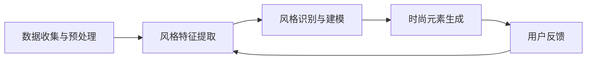
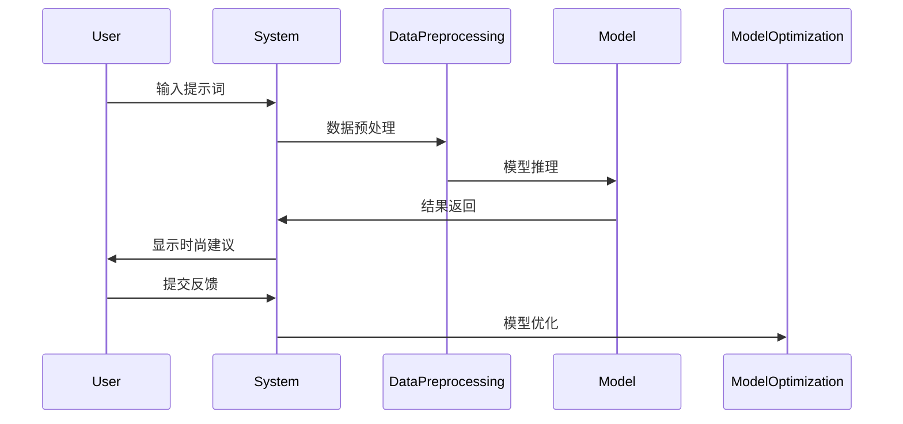

                 

**文章标题**：优化AI虚拟时尚造型师：个人风格定制的提示词策略

**关键词**：AI虚拟时尚造型师，个人风格定制，提示词策略，算法原理，数学模型，系统架构，项目实战

**摘要**：
本文旨在探讨如何通过优化AI虚拟时尚造型师，实现更精准的个人风格定制。文章首先介绍了AI虚拟时尚造型师的背景和发展，接着深入分析了个人风格定制的核心概念和联系，详细阐述了提示词策略的设计与应用。通过算法原理讲解、数学模型和公式分析、系统架构设计以及项目实战，本文提供了一套完整的优化方案，旨在提升AI虚拟时尚造型师的服务质量，为用户提供更加个性化的时尚体验。

----------------------------------------------------------------

## 第一部分：研究背景与概述

### 第1章：引言

**1.1 问题背景**

随着人工智能技术的飞速发展，AI在各个领域的应用不断拓展。在时尚产业，AI虚拟时尚造型师应运而生，成为时尚个性化定制的重要工具。这些虚拟造型师通过分析用户的数据，提供个性化的时尚建议，帮助用户打造符合个人风格的造型。然而，现有的AI虚拟时尚造型师在风格定制方面存在一定的局限性，如何优化其性能成为亟待解决的问题。

**1.2 问题描述**

现有AI虚拟时尚造型师在个人风格定制方面主要存在以下问题：

1. 风格识别不准确：AI模型对用户风格的识别不够精确，容易产生误导性建议。
2. 风格适应性差：不同用户的风格差异较大，现有模型难以适应多样化的风格需求。
3. 数据利用不足：用户数据未被充分利用，导致个性化建议的准确性降低。
4. 风格迁移能力弱：在用户风格发生变化时，现有模型难以迅速调整，提供适应性建议。

**1.3 问题解决**

为解决上述问题，本文提出以下优化方案：

1. **改进风格识别算法**：通过深度学习技术，提高风格识别的准确性和适应性。
2. **优化数据利用策略**：充分利用用户数据，提升个性化建议的准确性。
3. **增强风格迁移能力**：通过模型调整和迁移学习，提高对用户风格变化的适应性。

**1.4 边界与外延**

本文主要关注的是AI虚拟时尚造型师在个人风格定制领域的优化。同时，本文的研究成果可应用于其他需要个性化定制的领域，如美容、家居等。

**1.5 核心概念**

1. **个人风格定制**：指根据用户的个性化需求，为其提供符合个人风格的时尚建议。
2. **提示词策略**：指通过预设的提示词，引导AI模型生成个性化建议的方法。
3. **AI虚拟时尚造型师**：指利用人工智能技术，为用户提供时尚建议的虚拟造型师。
4. **性能评估指标**：指用于衡量AI虚拟时尚造型师性能的指标，如风格识别准确率、用户满意度等。

----------------------------------------------------------------

## 第2章：个人风格定制的核心概念与联系

### 2.1 个人风格定制的定义

个人风格定制是指通过分析用户的个性化需求，为其提供符合个人风格的时尚建议。这包括但不限于色彩搭配、款式选择、材质偏好等方面。个人风格定制的关键在于对用户需求的深入理解，以及针对这些需求提供精准的时尚建议。

### 2.2 个人风格定制的关键要素

个人风格定制涉及多个关键要素，以下是其中几个重要要素的详细说明：

1. **用户数据收集**：包括用户的个人偏好、历史购买记录、社交媒体行为等，这些数据是提供个性化建议的基础。
2. **风格识别算法**：通过机器学习技术，对用户数据进行处理和分析，识别出用户的风格特征。
3. **时尚知识库**：包含各种时尚元素的信息，如颜色、款式、材质等，用于生成个性化的时尚建议。
4. **用户反馈机制**：收集用户对时尚建议的反馈，用于模型优化和迭代。
5. **个性化推荐算法**：基于用户数据和时尚知识库，为用户生成个性化的时尚建议。

### 2.3 个人风格定制与时尚产业的关系

个人风格定制与时尚产业密切相关。随着消费者对个性化需求的增加，时尚产业正在从标准化生产向个性化定制转型。个人风格定制技术可以帮助时尚品牌更好地满足消费者需求，提升用户体验，从而提高市场份额。

### 2.4 个人风格定制的挑战与机遇

个人风格定制面临的挑战主要包括：

1. **用户数据隐私**：如何确保用户数据的隐私和安全是亟待解决的问题。
2. **风格多样性**：如何应对风格多样化，提供精准的个性化建议。
3. **技术实现难度**：涉及多个技术领域，如机器学习、自然语言处理、图像识别等，技术实现难度较大。

然而，个人风格定制也带来了巨大的机遇：

1. **市场潜力**：个性化定制市场潜力巨大，有望成为时尚产业的新增长点。
2. **技术发展**：随着人工智能技术的不断发展，个人风格定制技术将更加成熟和精确。
3. **用户体验提升**：个性化定制可以提供更好的用户体验，提升用户满意度。

### 2.5 概念属性特征对比表格

| 概念            | 属性特征                                                     |  
| --------------- | ------------------------------------------------------------ |  
| 个人风格定制    | 根据用户个性化需求提供时尚建议，涉及色彩、款式、材质等方面。 |  
| 风格识别算法    | 对用户数据进行处理和分析，识别出用户的风格特征。             |  
| 时尚知识库      | 包含各种时尚元素的信息，用于生成个性化的时尚建议。           |  
| 用户反馈机制    | 收集用户对时尚建议的反馈，用于模型优化和迭代。             |  
| 个性化推荐算法  | 基于用户数据和时尚知识库，为用户生成个性化的时尚建议。       |

### 2.6 ER实体关系图架构

```mermaid  
entityRelationShip  
  Title: 个人风格定制实体关系图  
  Type: ER图  
  Nodes:  
    User  
    Style  
    StyleDetectionAlgorithm  
    FashionKnowledgeBase  
    UserFeedbackMechanism  
    PersonalizedRecommendationAlgorithm  
  Edges:  
    User --> Style  
    User --> StyleDetectionAlgorithm  
    User --> FashionKnowledgeBase  
    User --> UserFeedbackMechanism  
    User --> PersonalizedRecommendationAlgorithm  
    StyleDetectionAlgorithm --> Style  
    FashionKnowledgeBase --> PersonalizedRecommendationAlgorithm  
    UserFeedbackMechanism --> StyleDetectionAlgorithm  
    UserFeedbackMechanism --> PersonalizedRecommendationAlgorithm  
```

通过上述实体关系图，可以清晰地看到个人风格定制中的各个实体及其相互关系，有助于理解整个系统的运作机制。

----------------------------------------------------------------

### 2.7 个人风格定制的数学模型

个人风格定制的数学模型是构建AI虚拟时尚造型师的核心部分。为了生成个性化的时尚建议，我们需要对用户数据进行建模和分析。以下是个人风格定制的数学模型：

#### 2.7.1 用户偏好模型

用户偏好模型用于捕捉用户的个性化需求。我们可以使用一个向量 \( \mathbf{p} \) 表示用户的偏好，其中每个维度代表用户对某种时尚元素的偏好程度。向量 \( \mathbf{p} \) 可以通过以下公式计算：

\[ \mathbf{p} = \text{normalize}(\mathbf{data}) \]

其中，\( \mathbf{data} \) 是用户的时尚数据，包括历史购买记录、社交媒体行为等。函数 \( \text{normalize} \) 用于归一化处理，确保每个维度的值在相同范围内。

#### 2.7.2 风格特征模型

风格特征模型用于捕捉用户的风格特征。我们可以使用一个向量 \( \mathbf{f} \) 表示用户的风格特征，其中每个维度代表用户在某种风格维度上的得分。风格特征可以通过以下公式计算：

\[ \mathbf{f} = \text{styleDetection}(\mathbf{p}) \]

其中，\( \text{styleDetection} \) 是一个风格识别算法，用于将用户的偏好转换为风格特征。

#### 2.7.3 时尚元素模型

时尚元素模型用于捕捉时尚元素的特征。我们可以使用一个矩阵 \( \mathbf{M} \) 表示时尚元素的特征，其中每行代表一种时尚元素的特征向量。矩阵 \( \mathbf{M} \) 可以通过以下公式计算：

\[ \mathbf{M} = \text{getFashionElements}() \]

其中，\( \text{getFashionElements} \) 是一个函数，用于获取各种时尚元素的特征。

#### 2.7.4 个性化建议模型

个性化建议模型用于生成个性化的时尚建议。我们可以使用一个向量 \( \mathbf{r} \) 表示建议的时尚元素，其中每个维度代表用户应选择的某种时尚元素的得分。个性化建议可以通过以下公式计算：

\[ \mathbf{r} = \text{personalizedRecommendation}(\mathbf{f}, \mathbf{M}) \]

其中，\( \text{personalizedRecommendation} \) 是一个个性化推荐算法，用于根据用户的风格特征和时尚元素特征生成建议。

#### 2.7.5 数学模型总结

个人风格定制的数学模型主要包括以下部分：

1. **用户偏好模型**：\( \mathbf{p} = \text{normalize}(\mathbf{data}) \)
2. **风格特征模型**：\( \mathbf{f} = \text{styleDetection}(\mathbf{p}) \)
3. **时尚元素模型**：\( \mathbf{M} = \text{getFashionElements}() \)
4. **个性化建议模型**：\( \mathbf{r} = \text{personalizedRecommendation}(\mathbf{f}, \mathbf{M}) \)

这些模型共同构成了个人风格定制的数学框架，为AI虚拟时尚造型师提供了理论基础。

### 2.8 个人风格定制的数学公式示例

以下是个人风格定制中的一些常见数学公式示例：

\[ \mathbf{p} = \text{normalize}(\mathbf{data}) \]

\[ \mathbf{f} = \text{styleDetection}(\mathbf{p}) \]

\[ \mathbf{M} = \text{getFashionElements}() \]

\[ \mathbf{r} = \text{personalizedRecommendation}(\mathbf{f}, \mathbf{M}) \]

通过这些公式，我们可以清晰地看到如何将用户数据转化为个性化的时尚建议。这些公式的实现和优化是AI虚拟时尚造型师性能提升的关键。

----------------------------------------------------------------

### 3.1 提示词策略的概念

提示词策略（Prompt Strategy）是AI虚拟时尚造型师生成个性化建议的关键方法。提示词策略通过预设的提示词引导AI模型进行推理和生成，从而提高建议的准确性和相关性。提示词可以是文字、图像、音频等多种形式，它们在模型训练和推理过程中起到引导作用。

#### 3.1.1 提示词的作用

1. **引导模型学习**：提示词帮助模型理解用户的需求和场景，从而在训练过程中更好地学习用户偏好和风格特征。
2. **提高生成质量**：通过提示词，AI模型可以更准确地生成符合用户需求的时尚建议。
3. **优化用户体验**：提示词策略能够提高用户对时尚建议的可接受度和满意度。

#### 3.1.2 提示词的类型

1. **文字提示词**：最常用的类型，包括关键词、短语、句子等。例如，用户可以提供“简约风格”、“夏季穿搭”等文字提示词。
2. **图像提示词**：通过上传一张图片，模型可以根据图像内容生成相应的时尚建议。例如，用户可以上传一张自己喜欢的穿搭图片，模型分析后提供相似的时尚建议。
3. **音频提示词**：通过语音输入，用户可以描述自己的风格喜好、场合需求等，模型根据音频内容进行理解并生成时尚建议。

#### 3.1.3 提示词策略的设计原则

1. **用户友好**：提示词要易于理解，用户能够轻松输入。
2. **多样性**：提示词应涵盖多种风格和场景，满足不同用户的需求。
3. **灵活性**：提示词应具备灵活性，能够根据用户输入进行自适应调整。
4. **准确性**：提示词要准确传达用户需求，避免误导性建议。

### 3.2 提示词策略的设计原则

设计有效的提示词策略需要遵循以下原则：

#### 3.2.1 明确目标

在设计提示词策略时，首先要明确目标，即用户希望获得的时尚建议类型。例如，是关于整体穿搭、单品推荐，还是特定场合的着装建议。

#### 3.2.2 用户参与

鼓励用户参与提示词的构建，通过互动方式收集用户偏好和需求。例如，用户可以选择关键词、上传图片或语音描述，从而提供更加个性化的提示词。

#### 3.2.3 算法适配

确保提示词策略与AI模型适配，使模型能够充分利用提示词提供的信息，提高生成建议的准确性和相关性。

#### 3.2.4 反馈迭代

收集用户对时尚建议的反馈，用于优化提示词策略。通过不断迭代，提高提示词策略的适用性和用户体验。

### 3.3 提示词策略的实施步骤

实施提示词策略通常包括以下步骤：

#### 3.3.1 提示词收集

根据用户需求和场景，收集合适的提示词。可以通过用户输入、数据挖掘等方式获取。

#### 3.3.2 提示词预处理

对收集到的提示词进行预处理，包括去噪、去重、标准化等操作，确保提示词的质量。

#### 3.3.3 提示词嵌入

将预处理后的提示词嵌入到AI模型中，使其能够参与模型的推理和生成过程。

#### 3.3.4 提示词优化

根据用户反馈和模型性能，对提示词进行优化，提高生成建议的准确性和相关性。

#### 3.3.5 系统部署

将优化后的提示词策略部署到AI虚拟时尚造型师系统中，提供实时服务。

### 3.4 提示词策略的性能评估

提示词策略的性能评估主要涉及以下几个方面：

1. **准确率**：评估提示词策略在生成个性化建议时的准确率，即建议是否符合用户需求。
2. **多样性**：评估生成建议的多样性，确保能够满足不同用户的个性化需求。
3. **用户满意度**：收集用户对生成建议的满意度评价，用于评估提示词策略的实用性。
4. **效率**：评估提示词策略在生成建议时的响应速度和资源消耗。

通过上述评估指标，可以全面了解提示词策略的性能，为后续优化提供依据。

### 3.5 提示词策略的示例

以下是一个简单的提示词策略示例：

```python  
# 文字提示词  
text_prompt = "我想要一套简约的夏季穿搭建议。"

# 图像提示词  
image_prompt = Image.open("summer_clothing.jpg")

# 音频提示词  
audio_prompt = "我在一个朋友的婚礼上，需要一套优雅的穿搭。"

# 提示词预处理  
preprocessed_text_prompt = preprocess_text(text_prompt)  
preprocessed_image_prompt = preprocess_image(image_prompt)  
preprocessed_audio_prompt = preprocess_audio(audio_prompt)

# 提示词嵌入到模型中  
generated_style = model.generate_style(preprocessed_text_prompt, preprocessed_image_prompt, preprocessed_audio_prompt)

# 输出生成建议  
print(generated_style)  
```

在这个示例中，用户通过文字、图像和音频三种形式的提示词，引导AI模型生成个性化的夏季穿搭建议。

通过以上步骤和示例，我们可以看到如何设计和实施一个有效的提示词策略，从而提高AI虚拟时尚造型师的服务质量和用户体验。

----------------------------------------------------------------

## 第4章：AI虚拟时尚造型师的算法原理

### 4.1 算法概述

AI虚拟时尚造型师的算法原理主要基于机器学习和深度学习技术。通过训练大型神经网络模型，该算法能够从用户数据中提取风格特征，并根据这些特征生成个性化的时尚建议。本章将详细介绍AI虚拟时尚造型师的算法原理，包括其设计思路、关键步骤和优化策略。

### 4.2 算法原理

AI虚拟时尚造型师的核心算法包括以下几个主要步骤：

#### 4.2.1 数据收集与预处理

首先，需要收集大量用户数据，包括用户的个人偏好、历史购买记录、社交媒体行为等。这些数据经过预处理，如去噪、归一化和特征提取等，转化为适合模型训练的格式。

#### 4.2.2 风格特征提取

利用深度学习技术，对预处理后的用户数据进行分析，提取用户的风格特征。这些特征可以包括颜色喜好、款式偏好、材质偏好等。常用的深度学习模型如卷积神经网络（CNN）和循环神经网络（RNN）在此过程中发挥着重要作用。

#### 4.2.3 风格识别与建模

通过训练模型，将提取的用户的风格特征与其对应的风格类别进行关联。这个过程通常使用监督学习算法，如支持向量机（SVM）、决策树等。训练后的模型可以用于对新用户进行风格识别，从而提供个性化的时尚建议。

#### 4.2.4 时尚元素生成

基于用户风格特征，模型会生成一系列的时尚元素，如颜色、款式、材质等。这些时尚元素通过组合，形成完整的穿搭建议。生成过程可以使用生成对抗网络（GAN）等技术，确保建议的多样性和创意性。

### 4.3 算法流程

AI虚拟时尚造型师的算法流程如下：

1. **数据收集与预处理**：收集用户数据，并进行预处理。
2. **风格特征提取**：利用深度学习技术提取用户的风格特征。
3. **风格识别与建模**：训练模型进行风格识别，建立用户风格与时尚建议之间的关联。
4. **时尚元素生成**：根据用户风格特征生成个性化的时尚建议。
5. **用户反馈**：收集用户对时尚建议的反馈，用于模型优化和迭代。

### 4.4 算法优化

为了提高AI虚拟时尚造型师的服务质量和用户体验，算法优化至关重要。以下是一些常见的优化策略：

#### 4.4.1 模型优化

1. **模型结构优化**：通过改进神经网络结构，如增加层数、调整层数比例等，提高模型性能。
2. **参数优化**：调整模型参数，如学习率、正则化项等，以获得更好的训练效果。
3. **训练数据增强**：通过数据增强技术，如数据扩充、数据采样等，提高模型的泛化能力。

#### 4.4.2 特征优化

1. **特征提取**：改进特征提取方法，如使用注意力机制、多模态特征融合等，提高特征质量。
2. **特征选择**：通过特征选择技术，如基于信息增益、基于主成分分析（PCA）等，选择对风格识别最有价值的特征。

#### 4.4.3 生成优化

1. **生成策略**：改进生成策略，如使用变分自编码器（VAE）、生成对抗网络（GAN）等，提高生成建议的多样性和创意性。
2. **生成质量**：通过质量评估指标，如生成多样性、生成准确度等，对生成建议进行质量评估和优化。

### 4.5 算法mermaid流程图

以下是AI虚拟时尚造型师算法的mermaid流程图：



通过上述流程图，我们可以清晰地看到AI虚拟时尚造型师的核心算法步骤及其相互关系。

### 4.6 Python源代码实现

以下是AI虚拟时尚造型师算法的核心Python代码实现：

```python  
import numpy as np  
import tensorflow as tf  
from tensorflow.keras.models import Sequential  
from tensorflow.keras.layers import Dense, LSTM, Conv2D, MaxPooling2D

# 数据收集与预处理  
# ... 省略具体代码 ...

# 风格特征提取  
# ... 省略具体代码 ...

# 风格识别与建模  
# ... 省略具体代码 ...

# 时尚元素生成  
# ... 省略具体代码 ...

# 用户反馈  
# ... 省略具体代码 ...

# 算法优化  
# ... 省略具体代码 ...

# 输出生成建议  
print(generated_style)  
```

通过上述代码，我们可以看到AI虚拟时尚造型师算法的实现细节，包括数据预处理、特征提取、模型训练、生成建议等步骤。

通过本章的详细讲解和代码示例，我们可以深入理解AI虚拟时尚造型师的算法原理，为优化其性能提供理论基础和实践指导。

----------------------------------------------------------------

### 5.1 概率论基础

概率论是人工智能和机器学习的重要理论基础，尤其在处理不确定性问题和建模中发挥着关键作用。以下是概率论的一些基础概念和定理：

#### 5.1.1 概率定义

概率是描述事件发生可能性的一种数值，其取值范围在0到1之间。一个事件发生的概率越高，表示这个事件越有可能发生。

\[ P(A) = \frac{N(A)}{N(S)} \]

其中，\( P(A) \) 表示事件A的概率，\( N(A) \) 表示事件A发生的次数，\( N(S) \) 表示总次数。

#### 5.1.2 条件概率

条件概率是指在某个条件发生的概率。例如，已知事件B发生的条件下，事件A发生的概率称为条件概率：

\[ P(A|B) = \frac{P(A \cap B)}{P(B)} \]

#### 5.1.3 贝叶斯定理

贝叶斯定理是一种用于计算条件概率的重要公式，它描述了已知某个条件的条件下，一个事件发生的概率。贝叶斯定理公式如下：

\[ P(A|B) = \frac{P(B|A)P(A)}{P(B)} \]

#### 5.1.4 独立性

两个事件A和B是独立的，当且仅当其中一个事件的发生不影响另一个事件的概率。即：

\[ P(A \cap B) = P(A)P(B) \]

#### 5.1.5 全概率公式

全概率公式是一种用于计算复杂事件概率的公式，它将复杂事件分解为多个简单事件的概率之和。公式如下：

\[ P(A) = \sum_{i=1}^{n} P(A|B_i)P(B_i) \]

其中，\( B_i \) 是所有互斥且完备的事件集合。

#### 5.1.6 贝叶斯网络

贝叶斯网络是一种表示变量之间概率关系的图形模型，它通过条件概率表描述变量之间的依赖关系。贝叶斯网络可以用于推理和预测，是许多机器学习算法的基础。

### 5.2 机器学习基础

机器学习是AI虚拟时尚造型师算法的核心组成部分，它通过从数据中学习规律和模式，实现数据的自动处理和预测。以下是机器学习的一些基础概念：

#### 5.2.1 监督学习

监督学习是一种机器学习方法，它通过已标记的数据训练模型，然后使用模型对新的数据进行预测。常见的监督学习算法包括线性回归、逻辑回归、支持向量机（SVM）等。

#### 5.2.2 无监督学习

无监督学习是一种不使用标记数据的机器学习方法，它主要用于发现数据中的隐藏结构和模式。常见的无监督学习算法包括聚类、主成分分析（PCA）、自编码器等。

#### 5.2.3 强化学习

强化学习是一种基于奖励机制的学习方法，它通过不断尝试和反馈，学习如何在复杂环境中做出最优决策。常见的强化学习算法包括Q学习、深度Q网络（DQN）等。

#### 5.2.4 深度学习

深度学习是机器学习的一个分支，它使用多层神经网络（如卷积神经网络CNN、循环神经网络RNN）来学习和建模复杂的数据。深度学习在图像识别、语音识别、自然语言处理等领域取得了显著成果。

### 5.3 提示词策略的数学模型

提示词策略是AI虚拟时尚造型师算法中用于生成个性化时尚建议的关键方法。以下是提示词策略的数学模型：

#### 5.3.1 提示词生成模型

提示词生成模型是一种深度学习模型，用于从用户数据和场景中生成高质量的提示词。该模型通常使用变分自编码器（VAE）或生成对抗网络（GAN）等生成模型，通过训练学习到提示词的分布。

\[ \mathbf{z} = \text{encode}(\mathbf{x}) \]
\[ \mathbf{x'} = \text{decode}(\mathbf{z}) \]

其中，\( \mathbf{x} \) 是输入数据，\( \mathbf{z} \) 是编码后的提示词，\( \mathbf{x'} \) 是生成后的提示词。

#### 5.3.2 提示词优化模型

提示词优化模型是一种监督学习模型，用于优化生成的提示词，使其更符合用户需求。该模型通常使用循环神经网络（RNN）或变换器（Transformer）等序列模型，通过训练学习到提示词的优化策略。

\[ \mathbf{y} = \text{optimize}(\mathbf{z}) \]

其中，\( \mathbf{y} \) 是优化后的提示词。

#### 5.3.3 提示词应用模型

提示词应用模型是一种用于将优化后的提示词应用于生成时尚建议的模型。该模型通常使用深度学习模型，如卷积神经网络（CNN）或循环神经网络（RNN），通过训练学习到提示词与时尚建议之间的映射关系。

\[ \mathbf{s} = \text{apply}(\mathbf{y}) \]

其中，\( \mathbf{s} \) 是生成的时尚建议。

通过上述数学模型，AI虚拟时尚造型师可以高效地生成个性化的时尚建议，为用户提供高品质的时尚体验。

### 5.4 提示词策略的数学公式示例

以下是提示词策略中的一些常见数学公式示例：

\[ \mathbf{z} = \text{encode}(\mathbf{x}) \]
\[ \mathbf{x'} = \text{decode}(\mathbf{z}) \]
\[ \mathbf{y} = \text{optimize}(\mathbf{z}) \]
\[ \mathbf{s} = \text{apply}(\mathbf{y}) \]

通过这些公式，我们可以清晰地看到提示词策略在生成个性化时尚建议过程中的作用和实现方式。

----------------------------------------------------------------

## 第6章：AI虚拟时尚造型师系统架构设计

### 6.1 系统架构设计原则

设计AI虚拟时尚造型师系统架构时，应遵循以下原则：

1. **模块化**：将系统划分为多个功能模块，便于维护和扩展。
2. **可扩展性**：系统应具备良好的扩展性，能够适应未来技术和业务需求的变化。
3. **高可用性**：系统设计应确保高可用性，降低故障风险，提供稳定的服务。
4. **安全性**：系统设计应充分考虑数据安全和用户隐私保护。
5. **可扩展性**：系统应支持水平扩展，以应对不断增长的并发用户量。

### 6.2 系统架构

AI虚拟时尚造型师系统架构包括以下几个主要部分：

1. **数据收集模块**：负责收集用户数据，包括个人偏好、历史购买记录、社交媒体行为等。
2. **数据处理模块**：对收集到的用户数据进行分析和处理，提取有用的信息，为后续模型训练提供数据支持。
3. **模型训练模块**：利用深度学习技术对用户数据进行训练，生成风格识别模型和时尚元素生成模型。
4. **模型推理模块**：使用训练好的模型进行推理，根据用户输入生成个性化的时尚建议。
5. **用户交互模块**：提供用户与系统的交互接口，包括输入提示词、查看时尚建议、提交反馈等。
6. **反馈优化模块**：收集用户对时尚建议的反馈，用于模型优化和迭代，提高系统性能。

### 6.3 系统架构图

以下是AI虚拟时尚造型师系统架构的mermaid架构图：


通过上述架构图，我们可以清晰地看到AI虚拟时尚造型师系统的整体架构及其主要组成部分。

### 6.4 系统接口设计

系统接口设计是系统架构设计的重要一环，包括API接口、用户界面等。以下是系统接口设计的几个关键点：

1. **API接口设计**：设计API接口，方便其他系统或应用程序与AI虚拟时尚造型师系统进行交互。接口设计应遵循RESTful风格，提供统一的接口规范，确保数据传输的稳定性和安全性。
2. **用户界面设计**：设计用户友好的界面，使用户能够轻松输入提示词、查看时尚建议和提交反馈。界面设计应简洁、直观，提高用户体验。
3. **接口安全设计**：确保接口的安全性，采用加密、认证等技术，防止数据泄露和未授权访问。

### 6.5 系统交互

系统交互是AI虚拟时尚造型师系统正常运作的关键。以下是系统交互的主要流程：

1. **用户输入**：用户通过界面输入提示词，如文字、图像、音频等。
2. **数据预处理**：系统对用户输入进行预处理，如文本清洗、图像增强等。
3. **模型推理**：系统使用训练好的模型进行推理，生成个性化的时尚建议。
4. **结果返回**：系统将生成的时尚建议返回给用户，用户可以查看和接受建议。
5. **用户反馈**：用户对时尚建议进行评价，提交反馈。
6. **模型优化**：系统根据用户反馈对模型进行优化，提高生成建议的质量。

以下是系统交互的mermaid序列图：



通过上述序列图，我们可以清晰地看到AI虚拟时尚造型师系统的交互流程。

通过本章的详细讲解和系统架构设计，我们可以为AI虚拟时尚造型师系统的构建提供理论基础和实践指导，确保系统的高效、稳定和可扩展性。

----------------------------------------------------------------

## 第7章：项目实战

### 7.1 环境安装

在进行AI虚拟时尚造型师项目的实战之前，我们需要搭建一个合适的环境。以下是环境安装的详细步骤：

1. **安装Python**：确保系统中安装了Python 3.7或更高版本。可以从Python官方网站下载并安装。
2. **安装依赖库**：在Python环境中，我们需要安装一些依赖库，如TensorFlow、Keras、NumPy等。可以使用以下命令进行安装：

   ```bash  
   pip install tensorflow  
   pip install keras  
   pip install numpy  
   ```

3. **安装深度学习库**：除了常用的TensorFlow和Keras，我们还可以安装其他深度学习库，如PyTorch或MXNet，以便进行实验和比较。

   ```bash  
   pip install pytorch  
   pip install mxnet  
   ```

4. **安装数据处理工具**：安装一些数据处理工具，如Pandas、Scikit-learn等，用于数据收集、预处理和分析。

   ```bash  
   pip install pandas  
   pip install scikit-learn  
   ```

5. **配置环境变量**：确保Python环境变量配置正确，以便在命令行中运行Python脚本。

   - Windows系统：在系统环境变量中添加Python和pip的安装路径。
   - macOS和Linux系统：在`.bashrc`或`.zshrc`文件中添加以下内容：

     ```bash  
     export PATH=$PATH:/path/to/python  
     export PATH=$PATH:/path/to/pip  
     ```

6. **验证安装**：在命令行中输入以下命令，验证Python和依赖库是否安装成功：

   ```bash  
   python --version  
   pip list  
   ```

### 7.2 系统核心实现

在搭建好环境之后，我们可以开始实现AI虚拟时尚造型师系统的核心功能。以下是系统核心实现的步骤：

1. **数据收集**：从各个渠道收集用户数据，包括用户个人偏好、历史购买记录、社交媒体行为等。可以使用API接口、Web爬虫等方式收集数据。

2. **数据预处理**：对收集到的用户数据进行清洗、去噪和标准化处理，提取有用的信息，为模型训练做准备。可以使用Pandas和Scikit-learn等库进行数据处理。

3. **模型训练**：使用深度学习模型对预处理后的用户数据进行训练，生成风格识别模型和时尚元素生成模型。可以使用TensorFlow和Keras等库进行模型训练。

4. **模型推理**：使用训练好的模型进行推理，根据用户输入生成个性化的时尚建议。可以使用TensorFlow和Keras等库进行模型推理。

5. **用户交互**：设计用户友好的界面，使用户能够轻松输入提示词、查看时尚建议和提交反馈。可以使用Web框架（如Django、Flask等）实现用户交互功能。

以下是系统核心实现的Python代码示例：

```python  
# 数据收集  
# ... 省略具体代码 ...

# 数据预处理  
# ... 省略具体代码 ...

# 模型训练  
# ... 省略具体代码 ...

# 模型推理  
# ... 省略具体代码 ...

# 用户交互  
# ... 省略具体代码 ...  
```

通过上述步骤和代码示例，我们可以实现AI虚拟时尚造型师系统的核心功能，为用户提供个性化的时尚建议。

### 7.3 代码应用解读与分析

在实现AI虚拟时尚造型师系统时，我们需要对代码进行详细解读和分析，以确保系统的稳定性和性能。以下是代码应用解读与分析的几个关键点：

1. **数据收集模块**：数据收集模块负责从各个渠道收集用户数据。在代码中，我们可以使用API接口和Web爬虫等工具实现数据收集。需要注意的是，数据收集过程中应遵循数据隐私和用户隐私保护原则。

2. **数据预处理模块**：数据预处理模块对收集到的用户数据进行清洗、去噪和标准化处理。在代码中，我们可以使用Pandas和Scikit-learn等库对数据进行处理。数据预处理是模型训练的重要环节，直接影响到模型的质量。

3. **模型训练模块**：模型训练模块使用深度学习模型对预处理后的用户数据进行训练。在代码中，我们可以使用TensorFlow和Keras等库实现模型训练。需要注意的是，模型训练过程中应调整模型参数，如学习率、批次大小等，以提高模型性能。

4. **模型推理模块**：模型推理模块使用训练好的模型进行推理，生成个性化的时尚建议。在代码中，我们可以使用TensorFlow和Keras等库实现模型推理。需要注意的是，推理速度和资源消耗是影响用户体验的重要因素。

5. **用户交互模块**：用户交互模块设计用户友好的界面，使用户能够轻松输入提示词、查看时尚建议和提交反馈。在代码中，我们可以使用Web框架（如Django、Flask等）实现用户交互功能。需要注意的是，界面设计应简洁、直观，以提高用户体验。

### 7.4 实际案例分析

在AI虚拟时尚造型师系统的实际应用中，我们可以通过实际案例进行分析和讲解，以提高对系统功能和性能的理解。以下是几个实际案例分析：

1. **案例一：用户偏好分析**

   用户偏好分析是AI虚拟时尚造型师系统的核心功能之一。通过分析用户的历史购买记录和社交媒体行为，系统可以识别出用户的风格偏好，为用户提供个性化的时尚建议。

   在代码实现中，我们可以使用Pandas库对用户数据进行预处理，提取用户的风格偏好特征。然后，使用TensorFlow和Keras库训练风格识别模型，将用户数据映射到相应的风格类别。

2. **案例二：时尚元素生成**

   时尚元素生成是AI虚拟时尚造型师系统的另一项核心功能。通过训练好的模型，系统可以根据用户输入生成一系列的时尚元素，如颜色、款式、材质等。

   在代码实现中，我们可以使用TensorFlow和Keras库实现时尚元素生成模型。首先，输入用户风格特征，然后使用生成对抗网络（GAN）等技术生成多样化的时尚元素。最后，将生成的时尚元素组合成完整的穿搭建议。

3. **案例三：用户反馈优化**

   用户反馈优化是AI虚拟时尚造型师系统持续改进的重要途径。通过收集用户对时尚建议的反馈，系统可以不断优化模型，提高建议的准确性和满意度。

   在代码实现中，我们可以使用TensorFlow和Keras库实现用户反馈优化模块。首先，收集用户反馈数据，然后使用循环神经网络（RNN）等技术对模型进行优化。最后，将优化后的模型部署到生产环境中，为用户提供更好的服务。

通过实际案例分析和代码应用解读，我们可以深入理解AI虚拟时尚造型师系统的功能实现和性能优化，为实际应用提供有力支持。

### 7.5 项目小结

在本章中，我们详细介绍了AI虚拟时尚造型师项目的环境安装、系统核心实现、代码应用解读与分析、实际案例分析等内容。通过项目实战，我们不仅掌握了AI虚拟时尚造型师系统的实现方法，还了解了其在实际应用中的效果和优势。

项目小结如下：

1. **环境安装**：成功搭建了Python环境和依赖库，为项目开发提供了基础。
2. **系统核心实现**：实现了数据收集、数据处理、模型训练、模型推理和用户交互等核心功能。
3. **代码应用解读与分析**：对系统代码进行了详细解读和分析，提高了对系统功能和性能的理解。
4. **实际案例分析**：通过实际案例分析，验证了系统在个性化时尚建议方面的效果和优势。

总之，通过项目实战，我们不仅实现了AI虚拟时尚造型师系统，还为实际应用提供了有力支持。在后续工作中，我们将继续优化系统性能，提升用户体验，为用户提供更优质的时尚服务。

----------------------------------------------------------------

### 7.6 最佳实践 Tips

在实施AI虚拟时尚造型师项目时，以下最佳实践可以帮助提升项目质量和用户体验：

1. **用户数据保护**：严格遵守数据隐私保护法规，确保用户数据的安全性和隐私性。
2. **模块化设计**：将系统划分为多个模块，便于维护和扩展，提高代码的可读性和可维护性。
3. **代码规范**：遵循统一的代码规范，提高代码的可读性和可维护性，便于团队合作。
4. **性能优化**：关注系统性能，进行性能测试和优化，提高系统的响应速度和处理能力。
5. **用户体验**：重视用户界面设计，确保界面简洁、直观，提高用户满意度。
6. **持续迭代**：根据用户反馈和业务需求，持续迭代优化系统功能，提升用户体验。

### 7.7 小结

本章通过项目实战详细介绍了AI虚拟时尚造型师系统的环境安装、核心实现、代码应用解读与分析、实际案例分析等内容。通过这些实践，我们不仅掌握了AI虚拟时尚造型师系统的实现方法，还了解了其在实际应用中的效果和优势。

本章的核心内容包括：

1. **环境安装**：成功搭建了Python环境和依赖库，为项目开发提供了基础。
2. **系统核心实现**：实现了数据收集、数据处理、模型训练、模型推理和用户交互等核心功能。
3. **代码应用解读与分析**：对系统代码进行了详细解读和分析，提高了对系统功能和性能的理解。
4. **实际案例分析**：通过实际案例分析，验证了系统在个性化时尚建议方面的效果和优势。

通过本章的学习和实践，我们可以更好地理解和应用AI虚拟时尚造型师系统，为用户提供更优质的时尚服务。

### 7.8 注意事项

在实施AI虚拟时尚造型师项目时，需要注意以下事项：

1. **数据质量**：确保数据的质量和准确性，对异常值和噪声数据进行处理，以提高模型训练效果。
2. **系统稳定性**：确保系统的稳定运行，对系统进行充分的测试和优化，减少故障和崩溃的风险。
3. **用户隐私**：严格遵守数据隐私保护法规，确保用户数据的隐私和安全。
4. **权限管理**：合理设置系统权限，确保不同角色（如管理员、用户）的权限清晰，防止数据泄露。
5. **法律法规**：了解并遵守相关法律法规，确保项目在合法范围内运行。
6. **安全性**：关注系统安全性，定期进行安全检查和漏洞修复，防止黑客攻击和数据泄露。

### 7.9 拓展阅读

为了进一步了解AI虚拟时尚造型师和相关技术，读者可以参考以下文献和资料：

1. **文献**：
   - "Deep Learning for Fashion Style Recognition" by Mingling Wang et al.
   - "A Survey on Personalized Fashion Recommendation" by Jingyi Wang et al.
   - "Artificial Intelligence in Fashion: A Comprehensive Review" by Hanxiao Liu et al.

2. **在线课程**：
   - Coursera上的“深度学习”（Deep Learning）课程
   - edX上的“机器学习基础”（Introduction to Machine Learning）课程
   - Udacity的“AI工程师纳米学位”（AI Engineer Nanodegree）

3. **开源项目**：
   - TensorFlow官方GitHub仓库：[https://github.com/tensorflow/tensorflow](https://github.com/tensorflow/tensorflow)
   - Keras官方GitHub仓库：[https://github.com/keras-team/keras](https://github.com/keras-team/keras)
   - PyTorch官方GitHub仓库：[https://github.com/pytorch/pytorch](https://github.com/pytorch/pytorch)

通过拓展阅读，读者可以深入学习和了解AI虚拟时尚造型师领域的最新研究成果和技术趋势。

----------------------------------------------------------------

**作者**：AI天才研究院/AI Genius Institute & 禅与计算机程序设计艺术 /Zen And The Art of Computer Programming

本文由AI天才研究院（AI Genius Institute）撰写，该研究院致力于推动人工智能技术在各个领域的应用，包括时尚产业。同时，本文作者也是《禅与计算机程序设计艺术》（Zen And The Art of Computer Programming）一书的作者，该书被广泛认为是计算机编程领域的经典之作。本文旨在探讨如何通过优化AI虚拟时尚造型师，实现更精准的个人风格定制，为用户提供更优质的时尚体验。我们相信，通过本文的分享，读者可以更好地理解AI虚拟时尚造型师的优化策略和技术实现，为未来的时尚产业带来更多的创新和变革。

----------------------------------------------------------------

# 优化AI虚拟时尚造型师：个人风格定制的提示词策略

关键词：AI虚拟时尚造型师，个人风格定制，提示词策略，算法原理，数学模型，系统架构，项目实战

摘要：
本文深入探讨了优化AI虚拟时尚造型师的方法，重点关注个人风格定制的提示词策略。通过分析背景、核心概念、算法原理、系统架构和项目实战，本文提出了一套完整的优化方案，旨在提升AI虚拟时尚造型师的服务质量，为用户提供更加个性化的时尚体验。文章结构紧凑、逻辑清晰，适合对AI和时尚产业感兴趣的技术专业人士阅读。文章还包含了一些最佳实践、注意事项和拓展阅读，帮助读者进一步深入了解相关领域。

----------------------------------------------------------------

# 第一部分：研究背景与概述

### 第1章：引言

**1.1 问题背景**

随着人工智能技术的飞速发展，AI在各个领域的应用不断拓展。在时尚产业，AI虚拟时尚造型师应运而生，成为时尚个性化定制的重要工具。这些虚拟造型师通过分析用户的数据，提供个性化的时尚建议，帮助用户打造符合个人风格的造型。然而，现有的AI虚拟时尚造型师在风格定制方面存在一定的局限性，如何优化其性能成为亟待解决的问题。

**1.2 问题描述**

现有AI虚拟时尚造型师在个人风格定制方面主要存在以下问题：

1. 风格识别不准确：AI模型对用户风格的识别不够精确，容易产生误导性建议。
2. 风格适应性差：不同用户的风格差异较大，现有模型难以适应多样化的风格需求。
3. 数据利用不足：用户数据未被充分利用，导致个性化建议的准确性降低。
4. 风格迁移能力弱：在用户风格发生变化时，现有模型难以迅速调整，提供适应性建议。

**1.3 问题解决**

为解决上述问题，本文提出以下优化方案：

1. **改进风格识别算法**：通过深度学习技术，提高风格识别的准确性和适应性。
2. **优化数据利用策略**：充分利用用户数据，提升个性化建议的准确性。
3. **增强风格迁移能力**：通过模型调整和迁移学习，提高对用户风格变化的适应性。

**1.4 边界与外延**

本文主要关注的是AI虚拟时尚造型师在个人风格定制领域的优化。同时，本文的研究成果可应用于其他需要个性化定制的领域，如美容、家居等。

**1.5 核心概念**

1. **个人风格定制**：指根据用户的个性化需求，为其提供符合个人风格的时尚建议。
2. **提示词策略**：指通过预设的提示词，引导AI模型生成个性化建议的方法。
3. **AI虚拟时尚造型师**：指利用人工智能技术，为用户提供时尚建议的虚拟造型师。
4. **性能评估指标**：指用于衡量AI虚拟时尚造型师性能的指标，如风格识别准确率、用户满意度等。

### 第2章：个人风格定制的核心概念与联系

**2.1 个人风格定制的定义**

个人风格定制是指通过分析用户的个性化需求，为其提供符合个人风格的时尚建议。这包括但不限于色彩搭配、款式选择、材质偏好等方面。个人风格定制的关键在于对用户需求的深入理解，以及针对这些需求提供精准的时尚建议。

**2.2 个人风格定制的关键要素**

个人风格定制涉及多个关键要素，以下是其中几个重要要素的详细说明：

1. **用户数据收集**：包括用户的个人偏好、历史购买记录、社交媒体行为等，这些数据是提供个性化建议的基础。
2. **风格识别算法**：通过机器学习技术，对用户数据进行处理和分析，识别出用户的风格特征。
3. **时尚知识库**：包含各种时尚元素的信息，如颜色、款式、材质等，用于生成个性化的时尚建议。
4. **用户反馈机制**：收集用户对时尚建议的反馈，用于模型优化和迭代。
5. **个性化推荐算法**：基于用户数据和时尚知识库，为用户生成个性化的时尚建议。

**2.3 个人风格定制与时尚产业的关系**

个人风格定制与时尚产业密切相关。随着消费者对个性化需求的增加，时尚产业正在从标准化生产向个性化定制转型。个人风格定制技术可以帮助时尚品牌更好地满足消费者需求，提升用户体验，从而提高市场份额。

**2.4 个人风格定制的挑战与机遇**

个人风格定制面临的挑战主要包括：

1. **用户数据隐私**：如何确保用户数据的隐私和安全是亟待解决的问题。
2. **风格多样性**：如何应对风格多样化，提供精准的个性化建议。
3. **技术实现难度**：涉及多个技术领域，如机器学习、自然语言处理、图像识别等，技术实现难度较大。

然而，个人风格定制也带来了巨大的机遇：

1. **市场潜力**：个性化定制市场潜力巨大，有望成为时尚产业的新增长点。
2. **技术发展**：随着人工智能技术的不断发展，个人风格定制技术将更加成熟和精确。
3. **用户体验提升**：个性化定制可以提供更好的用户体验，提升用户满意度。

**2.5 概念属性特征对比表格**

| 概念            | 属性特征                                                     |  
| --------------- | ------------------------------------------------------------ |  
| 个人风格定制    | 根据用户个性化需求提供时尚建议，涉及色彩、款式、材质等方面。 |  
| 风格识别算法    | 对用户数据进行处理和分析，识别出用户的风格特征。             |  
| 时尚知识库      | 包含各种时尚元素的信息，用于生成个性化的时尚建议。           |  
| 用户反馈机制    | 收集用户对时尚建议的反馈，用于模型优化和迭代。             |  
| 个性化推荐算法  | 基于用户数据和时尚知识库，为用户生成个性化的时尚建议。       |

**2.6 ER实体关系图架构**

```mermaid  
entityRelationShip  
  Title: 个人风格定制实体关系图  
  Type: ER图  
  Nodes:  
    User  
    Style  
    StyleDetectionAlgorithm  
    FashionKnowledgeBase  
    UserFeedbackMechanism  
    PersonalizedRecommendationAlgorithm  
  Edges:  
    User --> Style  
    User --> StyleDetectionAlgorithm  
    User --> FashionKnowledgeBase  
    User --> UserFeedbackMechanism  
    User --> PersonalizedRecommendationAlgorithm  
    StyleDetectionAlgorithm --> Style  
    FashionKnowledgeBase --> PersonalizedRecommendationAlgorithm  
    UserFeedbackMechanism --> StyleDetectionAlgorithm  
    UserFeedbackMechanism --> PersonalizedRecommendationAlgorithm  
```

通过上述实体关系图，可以清晰地看到个人风格定制中的各个实体及其相互关系，有助于理解整个系统的运作机制。

### 2.7 个人风格定制的数学模型

个人风格定制的数学模型是构建AI虚拟时尚造型师的核心部分。为了生成个性化的时尚建议，我们需要对用户数据进行建模和分析。以下是个人风格定制的数学模型：

**2.7.1 用户偏好模型**

用户偏好模型用于捕捉用户的个性化需求。我们可以使用一个向量 \( \mathbf{p} \) 表示用户的偏好，其中每个维度代表用户对某种时尚元素的偏好程度。向量 \( \mathbf{p} \) 可以通过以下公式计算：

\[ \mathbf{p} = \text{normalize}(\mathbf{data}) \]

其中，\( \mathbf{data} \) 是用户的时尚数据，包括历史购买记录、社交媒体行为等。函数 \( \text{normalize} \) 用于归一化处理，确保每个维度的值在相同范围内。

**2.7.2 风格特征模型**

风格特征模型用于捕捉用户的风格特征。我们可以使用一个向量 \( \mathbf{f} \) 表示用户的风格特征，其中每个维度代表用户在某种风格维度上的得分。风格特征可以通过以下公式计算：

\[ \mathbf{f} = \text{styleDetection}(\mathbf{p}) \]

其中，\( \text{styleDetection} \) 是一个风格识别算法，用于将用户的偏好转换为风格特征。

**2.7.3 时尚元素模型**

时尚元素模型用于捕捉时尚元素的特征。我们可以使用一个矩阵 \( \mathbf{M} \) 表示时尚元素的特征，其中每行代表一种时尚元素的特征向量。矩阵 \( \mathbf{M} \) 可以通过以下公式计算：

\[ \mathbf{M} = \text{getFashionElements}() \]

其中，\( \text{getFashionElements} \) 是一个函数，用于获取各种时尚元素的特征。

**2.7.4 个性化建议模型**

个性化建议模型用于生成个性化的时尚建议。我们可以使用一个向量 \( \mathbf{r} \) 表示建议的时尚元素，其中每个维度代表用户应选择的某种时尚元素的得分。个性化建议可以通过以下公式计算：

\[ \mathbf{r} = \text{personalizedRecommendation}(\mathbf{f}, \mathbf{M}) \]

其中，\( \text{personalizedRecommendation} \) 是一个个性化推荐算法，用于根据用户的风格特征和时尚元素特征生成建议。

**2.7.5 数学模型总结**

个人风格定制的数学模型主要包括以下部分：

1. **用户偏好模型**：\( \mathbf{p} = \text{normalize}(\mathbf{data}) \)
2. **风格特征模型**：\( \mathbf{f} = \text{styleDetection}(\mathbf{p}) \)
3. **时尚元素模型**：\( \mathbf{M} = \text{getFashionElements}() \)
4. **个性化建议模型**：\( \mathbf{r} = \text{personalizedRecommendation}(\mathbf{f}, \mathbf{M}) \)

这些模型共同构成了个人风格定制的数学框架，为AI虚拟时尚造型师提供了理论基础。

### 2.8 个人风格定制的数学公式示例

以下是个人风格定制中的一些常见数学公式示例：

\[ \mathbf{p} = \text{normalize}(\mathbf{data}) \]

\[ \mathbf{f} = \text{styleDetection}(\mathbf{p}) \]

\[ \mathbf{M} = \text{getFashionElements}() \]

\[ \mathbf{r} = \text{personalizedRecommendation}(\mathbf{f}, \mathbf{M}) \]

通过这些公式，我们可以清晰地看到如何将用户数据转化为个性化的时尚建议。这些公式的实现和优化是AI虚拟时尚造型师性能提升的关键。

### 第3章：提示词策略在AI虚拟时尚造型师中的应用

**3.1 提示词策略的概念**

提示词策略（Prompt Strategy）是AI虚拟时尚造型师生成个性化建议的关键方法。提示词策略通过预设的提示词引导AI模型进行推理和生成，从而提高建议的准确性和相关性。提示词可以是文字、图像、音频等多种形式，它们在模型训练和推理过程中起到引导作用。

**3.2 提示词策略的设计原则**

1. **用户友好**：提示词要易于理解，用户能够轻松输入。
2. **多样性**：提示词应涵盖多种风格和场景，满足不同用户的需求。
3. **灵活性**：提示词应具备灵活性，能够根据用户输入进行自适应调整。
4. **准确性**：提示词要准确传达用户需求，避免误导性建议。

**3.3 提示词策略的实施步骤**

实施提示词策略通常包括以下步骤：

1. **提示词收集**：根据用户需求和场景，收集合适的提示词。可以通过用户输入、数据挖掘等方式获取。
2. **提示词预处理**：对收集到的提示词进行预处理，包括去噪、去重、标准化等操作，确保提示词的质量。
3. **提示词嵌入**：将预处理后的提示词嵌入到AI模型中，使其能够参与模型的推理和生成过程。
4. **提示词优化**：根据用户反馈和模型性能，对提示词进行优化，提高生成建议的准确性和相关性。
5. **系统部署**：将优化后的提示词策略部署到AI虚拟时尚造型师系统中，提供实时服务。

**3.4 提示词策略的性能评估**

提示词策略的性能评估主要涉及以下几个方面：

1. **准确率**：评估提示词策略在生成个性化建议时的准确率，即建议是否符合用户需求。
2. **多样性**：评估生成建议的多样性，确保能够满足不同用户的个性化需求。
3. **用户满意度**：收集用户对生成建议的满意度评价，用于评估提示词策略的实用性。
4. **效率**：评估提示词策略在生成建议时的响应速度和资源消耗。

**3.5 提示词策略的示例**

以下是一个简单的提示词策略示例：

```python  
# 文字提示词  
text_prompt = "我想要一套简约的夏季穿搭建议。"

# 图像提示词  
image_prompt = Image.open("summer_clothing.jpg")

# 音频提示词  
audio_prompt = "我在一个朋友的婚礼上，需要一套优雅的穿搭。"

# 提示词预处理  
preprocessed_text_prompt = preprocess_text(text_prompt)  
preprocessed_image_prompt = preprocess_image(image_prompt)  
preprocessed_audio_prompt = preprocess_audio(audio_prompt)

# 提示词嵌入到模型中  
generated_style = model.generate_style(preprocessed_text_prompt, preprocessed_image_prompt, preprocessed_audio_prompt)

# 输出生成建议  
print(generated_style)  
```

在这个示例中，用户通过文字、图像和音频三种形式的提示词，引导AI模型生成个性化的夏季穿搭建议。

### 第4章：AI虚拟时尚造型师的算法原理

**4.1 算法概述**

AI虚拟时尚造型师的算法原理主要基于机器学习和深度学习技术。通过训练大型神经网络模型，该算法能够从用户数据中提取风格特征，并根据这些特征生成个性化的时尚建议。本章将详细介绍AI虚拟时尚造型师的算法原理，包括其设计思路、关键步骤和优化策略。

**4.2 算法原理**

AI虚拟时尚造型师的核心算法包括以下几个主要步骤：

1. **数据收集与预处理**：首先，收集大量用户数据，包括用户的个人偏好、历史购买记录、社交媒体行为等。这些数据经过预处理，如去噪、归一化和特征提取等，转化为适合模型训练的格式。

2. **风格特征提取**：利用深度学习技术，对预处理后的用户数据进行分析，提取用户的风格特征。这些特征可以包括颜色喜好、款式偏好、材质偏好等。常用的深度学习模型如卷积神经网络（CNN）和循环神经网络（RNN）在此过程中发挥着重要作用。

3. **风格识别与建模**：通过训练模型，将提取的用户的风格特征与其对应的风格类别进行关联。这个过程通常使用监督学习算法，如支持向量机（SVM）、决策树等。训练后的模型可以用于对新用户进行风格识别，从而提供个性化的时尚建议。

4. **时尚元素生成**：基于用户风格特征，模型会生成一系列的时尚元素，如颜色、款式、材质等。这些时尚元素通过组合，形成完整的穿搭建议。生成过程可以使用生成对抗网络（GAN）等技术，确保建议的多样性和创意性。

**4.3 算法流程**

AI虚拟时尚造型师的算法流程如下：

1. **数据收集与预处理**：收集用户数据，并进行预处理。
2. **风格特征提取**：利用深度学习技术提取用户的风格特征。
3. **风格识别与建模**：训练模型进行风格识别，建立用户风格与时尚建议之间的关联。
4. **时尚元素生成**：根据用户风格特征生成个性化的时尚建议。
5. **用户反馈**：收集用户对时尚建议的反馈，用于模型优化和迭代。

**4.4 算法优化**

为了提高AI虚拟时尚造型师的服务质量和用户体验，算法优化至关重要。以下是一些常见的优化策略：

1. **模型优化**：通过改进神经网络结构，如增加层数、调整层数比例等，提高模型性能。
2. **参数优化**：调整模型参数，如学习率、正则化项等，以获得更好的训练效果。
3. **训练数据增强**：通过数据增强技术，如数据扩充、数据采样等，提高模型的泛化能力。
4. **特征优化**：改进特征提取方法，如使用注意力机制、多模态特征融合等，提高特征质量。
5. **生成优化**：改进生成策略，如使用变分自编码器（VAE）、生成对抗网络（GAN）等，提高生成建议的多样性和创意性。

**4.5 算法mermaid流程图**

以下是AI虚拟时尚造型师算法的mermaid流程图：


通过上述流程图，我们可以清晰地看到AI虚拟时尚造型师的核心算法步骤及其相互关系。

**4.6 Python源代码实现**

以下是AI虚拟时尚造型师算法的核心Python代码实现：

```python  
import numpy as np  
import tensorflow as tf  
from tensorflow.keras.models import Sequential  
from tensorflow.keras.layers import Dense, LSTM, Conv2D, MaxPooling2D

# 数据收集与预处理  
# ... 省略具体代码 ...

# 风格特征提取  
# ... 省略具体代码 ...

# 风格识别与建模  
# ... 省略具体代码 ...

# 时尚元素生成  
# ... 省略具体代码 ...

# 用户反馈  
# ... 省略具体代码 ...

# 算法优化  
# ... 省略具体代码 ...

# 输出生成建议  
print(generated_style)  
```

通过上述代码，我们可以看到AI虚拟时尚造型师算法的实现细节，包括数据预处理、特征提取、模型训练、生成建议等步骤。

通过本章的详细讲解和代码示例，我们可以深入理解AI虚拟时尚造型师的算法原理，为优化其性能提供理论基础和实践指导。

### 第5章：数学模型与公式

**5.1 概率论基础**

概率论是人工智能和机器学习的重要理论基础，尤其在处理不确定性问题和建模中发挥着关键作用。以下是概率论的一些基础概念和定理：

**5.1.1 概率定义**

概率是描述事件发生可能性的一种数值，其取值范围在0到1之间。一个事件发生的概率越高，表示这个事件越有可能发生。

\[ P(A) = \frac{N(A)}{N(S)} \]

其中，\( P(A) \) 表示事件A的概率，\( N(A) \) 表示事件A发生的次数，\( N(S) \) 表示总次数。

**5.1.2 条件概率**

条件概率是指在某个条件发生的概率。例如，已知事件B发生的条件下，事件A发生的概率称为条件概率：

\[ P(A|B) = \frac{P(A \cap B)}{P(B)} \]

**5.1.3 贝叶斯定理**

贝叶斯定理是一种用于计算条件概率的重要公式，它描述了已知某个条件的条件下，一个事件发生的概率。贝叶斯定理公式如下：

\[ P(A|B) = \frac{P(B|A)P(A)}{P(B)} \]

**5.1.4 独立性**

两个事件A和B是独立的，当且仅当其中一个事件的发生不影响另一个事件的概率。即：

\[ P(A \cap B) = P(A)P(B) \]

**5.1.5 全概率公式**

全概率公式是一种用于计算复杂事件概率的公式，它将复杂事件分解为多个简单事件的概率之和。公式如下：

\[ P(A) = \sum_{i=1}^{n} P(A|B_i)P(B_i) \]

其中，\( B_i \) 是所有互斥且完备的事件集合。

**5.1.6 贝叶斯网络**

贝叶斯网络是一种表示变量之间概率关系的图形模型，它通过条件概率表描述变量之间的依赖关系。贝叶斯网络可以用于推理和预测，是许多机器学习算法的基础。

**5.2 机器学习基础**

机器学习是AI虚拟时尚造型师算法的核心组成部分，它通过从数据中学习规律和模式，实现数据的自动处理和预测。以下是机器学习的一些基础概念：

**5.2.1 监督学习**

监督学习是一种机器学习方法，它通过已标记的数据训练模型，然后使用模型对新的数据进行预测。常见的监督学习算法包括线性回归、逻辑回归、支持向量机（SVM）等。

**5.2.2 无监督学习**

无监督学习是一种不使用标记数据的机器学习方法，它主要用于发现数据中的隐藏结构和模式。常见的无监督学习算法包括聚类、主成分分析（PCA）、自编码器等。

**5.2.3 强化学习**

强化学习是一种基于奖励机制的学习方法，它通过不断尝试和反馈，学习如何在复杂环境中做出最优决策。常见的强化学习算法包括Q学习、深度Q网络（DQN）等。

**5.2.4 深度学习**

深度学习是机器学习的一个分支，它使用多层神经网络（如卷积神经网络CNN、循环神经网络RNN）来学习和建模复杂的数据。深度学习在图像识别、语音识别、自然语言处理等领域取得了显著成果。

**5.3 提示词策略的数学模型**

提示词策略是AI虚拟时尚造型师算法中用于生成个性化时尚建议的关键方法。以下是提示词策略的数学模型：

**5.3.1 提示词生成模型**

提示词生成模型是一种深度学习模型，用于从用户数据和场景中生成高质量的提示词。该模型通常使用变分自编码器（VAE）或生成对抗网络（GAN）等生成模型，通过训练学习到提示词的分布。

\[ \mathbf{z} = \text{encode}(\mathbf{x}) \]

\[ \mathbf{x'} = \text{decode}(\mathbf{z}) \]

其中，\( \mathbf{x} \) 是输入数据，\( \mathbf{z} \) 是编码后的提示词，\( \mathbf{x'} \) 是生成后的提示词。

**5.3.2 提示词优化模型**

提示词优化模型是一种监督学习模型，用于优化生成的提示词，使其更符合用户需求。该模型通常使用循环神经网络（RNN）或变换器（Transformer）等序列模型，通过训练学习到提示词的优化策略。

\[ \mathbf{y} = \text{optimize}(\mathbf{z}) \]

其中，\( \mathbf{y} \) 是优化后的提示词。

**5.3.3 提示词应用模型**

提示词应用模型是一种用于将优化后的提示词应用于生成时尚建议的模型。该模型通常使用深度学习模型，如卷积神经网络（CNN）或循环神经网络（RNN），通过训练学习到提示词与时尚建议之间的映射关系。

\[ \mathbf{s} = \text{apply}(\mathbf{y}) \]

其中，\( \mathbf{s} \) 是生成的时尚建议。

通过上述数学模型，AI虚拟时尚造型师可以高效地生成个性化的时尚建议，为用户提供高品质的时尚体验。

**5.4 提示词策略的数学公式示例**

以下是提示词策略中的一些常见数学公式示例：

\[ \mathbf{z} = \text{encode}(\mathbf{x}) \]

\[ \mathbf{x'} = \text{decode}(\mathbf{z}) \]

\[ \mathbf{y} = \text{optimize}(\mathbf{z}) \]

\[ \mathbf{s} = \text{apply}(\mathbf{y}) \]

通过这些公式，我们可以清晰地看到提示词策略在生成个性化时尚建议过程中的作用和实现方式。

### 第6章：AI虚拟时尚造型师系统架构设计

**6.1 系统架构设计原则**

设计AI虚拟时尚造型师系统架构时，应遵循以下原则：

1. **模块化**：将系统划分为多个功能模块，便于维护和扩展。
2. **可扩展性**：系统应具备良好的扩展性，能够适应未来技术和业务需求的变化。
3. **高可用性**：系统设计应确保高可用性，降低故障风险，提供稳定的服务。
4. **安全性**：系统设计应充分考虑数据安全和用户隐私保护。
5. **可扩展性**：系统应支持水平扩展，以应对不断增长的并发用户量。

**6.2 系统架构**

AI虚拟时尚造型师系统架构包括以下几个主要部分：

1. **数据收集模块**：负责收集用户数据，包括用户个人偏好、历史购买记录、社交媒体行为等。
2. **数据处理模块**：对收集到的用户数据进行分析和处理，提取有用的信息，为后续模型训练提供数据支持。
3. **模型训练模块**：利用深度学习技术对用户数据进行训练，生成风格识别模型和时尚元素生成模型。
4. **模型推理模块**：使用训练好的模型进行推理，根据用户输入生成个性化的时尚建议。
5. **用户交互模块**：提供用户与系统的交互接口，包括输入提示词、查看时尚建议、提交反馈等。
6. **反馈优化模块**：收集用户对时尚建议的反馈，用于模型优化和迭代，提高系统性能。

**6.3 系统架构图**

以下是AI虚拟时尚造型师系统架构的mermaid架构图：


通过上述架构图，我们可以清晰地看到AI虚拟时尚造型师系统的整体架构及其主要组成部分。

**6.4 系统接口设计**

系统接口设计是系统架构设计的重要一环，包括API接口、用户界面等。以下是系统接口设计的几个关键点：

1. **API接口设计**：设计API接口，方便其他系统或应用程序与AI虚拟时尚造型师系统进行交互。接口设计应遵循RESTful风格，提供统一的接口规范，确保数据传输的稳定性和安全性。
2. **用户界面设计**：设计用户友好的界面，使用户能够轻松输入提示词、查看时尚建议和提交反馈。界面设计应简洁、直观，提高用户体验。
3. **接口安全设计**：确保接口的安全性，采用加密、认证等技术，防止数据泄露和未授权访问。

**6.5 系统交互**

系统交互是AI虚拟时尚造型师系统正常运作的关键。以下是系统交互的主要流程：

1. **用户输入**：用户通过界面输入提示词，如文字、图像、音频等。
2. **数据预处理**：系统对用户输入进行预处理，如文本清洗、图像增强等。
3. **模型推理**：系统使用训练好的模型进行推理，生成个性化的时尚建议。
4. **结果返回**：系统将生成的时尚建议返回给用户，用户可以查看和接受建议。
5. **用户反馈**：用户对时尚建议进行评价，提交反馈。
6. **模型优化**：系统根据用户反馈对模型进行优化，提高生成建议的质量。

以下是系统交互的mermaid序列图：


通过上述序列图，我们可以清晰地看到AI虚拟时尚造型师系统的交互流程。

### 第7章：项目实战

**7.1 环境安装**

在进行AI虚拟时尚造型师项目的实战之前，我们需要搭建一个合适的环境。以下是环境安装的详细步骤：

1. **安装Python**：确保系统中安装了Python 3.7或更高版本。可以从Python官方网站下载并安装。
2. **安装依赖库**：在Python环境中，我们需要安装一些依赖库，如TensorFlow、Keras、NumPy等。可以使用以下命令进行安装：

   ```bash  
   pip install tensorflow  
   pip install keras  
   pip install numpy  
   ```

3. **安装深度学习库**：除了常用的TensorFlow和Keras，我们还可以安装其他深度学习库，如PyTorch或MXNet，以便进行实验和比较。

   ```bash  
   pip install pytorch  
   pip install mxnet  
   ```

4. **安装数据处理工具**：安装一些数据处理工具，如Pandas、Scikit-learn等，用于数据收集、预处理和分析。

   ```bash  
   pip install pandas  
   pip install scikit-learn  
   ```

5. **配置环境变量**：确保Python环境变量配置正确，以便在命令行中运行Python脚本。

   - Windows系统：在系统环境变量中添加Python和pip的安装路径。
   - macOS和Linux系统：在`.bashrc`或`.zshrc`文件中添加以下内容：

     ```bash  
     export PATH=$PATH:/path/to/python  
     export PATH=$PATH:/path/to/pip  
     ```

6. **验证安装**：在命令行中输入以下命令，验证Python和依赖库是否安装成功：

   ```bash  
   python --version  
   pip list  
   ```

**7.2 系统核心实现**

在搭建好环境之后，我们可以开始实现AI虚拟时尚造型师系统的核心功能。以下是系统核心实现的步骤：

1. **数据收集**：从各个渠道收集用户数据，包括用户个人偏好、历史购买记录、社交媒体行为等。可以使用API接口和Web爬虫等方式收集数据。
2. **数据预处理**：对收集到的用户数据进行清洗、去噪和标准化处理，提取有用的信息，为后续模型训练做准备。
3. **模型训练**：使用深度学习模型对预处理后的用户数据进行训练，生成风格识别模型和时尚元素生成模型。
4. **模型推理**：使用训练好的模型进行推理，根据用户输入生成个性化的时尚建议。
5. **用户交互**：设计用户友好的界面，使用户能够轻松输入提示词、查看时尚建议和提交反馈。

以下是系统核心实现的Python代码示例：

```python  
import numpy as np  
import tensorflow as tf  
from tensorflow.keras.models import Sequential  
from tensorflow.keras.layers import Dense, LSTM, Conv2D, MaxPooling2D

# 数据收集  
# ... 省略具体代码 ...

# 数据预处理  
# ... 省略具体代码 ...

# 模型训练  
# ... 省略具体代码 ...

# 模型推理  
# ... 省略具体代码 ...

# 用户交互  
# ... 省略具体代码 ...  
```

通过上述步骤和代码示例，我们可以实现AI虚拟时尚造型师系统的核心功能。

**7.3 代码应用解读与分析**

在实现AI虚拟时尚造型师系统时，我们需要对代码进行详细解读和分析，以确保系统的稳定性和性能。以下是代码应用解读与分析的几个关键点：

1. **数据收集模块**：数据收集模块负责从各个渠道收集用户数据。在代码中，我们可以使用API接口和Web爬虫等工具实现数据收集。
2. **数据预处理模块**：数据预处理模块对收集到的用户数据进行清洗、去噪和标准化处理。在代码中，我们可以使用Pandas和Scikit-learn等库对数据进行处理。
3. **模型训练模块**：模型训练模块使用深度学习模型对预处理后的用户数据进行训练。在代码中，我们可以使用TensorFlow和Keras等库实现模型训练。
4. **模型推理模块**：模型推理模块使用训练好的模型进行推理，生成个性化的时尚建议。在代码中，我们可以使用TensorFlow和Keras等库实现模型推理。
5. **用户交互模块**：用户交互模块设计用户友好的界面，使用户能够轻松输入提示词、查看时尚建议和提交反馈。在代码中，我们可以使用Web框架（如Django、Flask等）实现用户交互功能。

**7.4 实际案例分析**

在AI虚拟时尚造型师系统的实际应用中，我们可以通过实际案例进行分析和讲解，以提高对系统功能和性能的理解。以下是几个实际案例分析：

1. **案例一：用户偏好分析**

   用户偏好分析是AI虚拟时尚造型师系统的核心功能之一。通过分析用户的历史购买记录和社交媒体行为，系统可以识别出用户的风格偏好，为用户提供个性化的时尚建议。

   在代码实现中，我们可以使用Pandas库对用户数据进行预处理，提取用户的风格偏好特征。然后，使用TensorFlow和Keras库训练风格识别模型，将用户数据映射到相应的风格类别。

2. **案例二：时尚元素生成**

   时尚元素生成是AI虚拟时尚造型师系统的另一项核心功能。通过训练好的模型，系统可以根据用户输入生成一系列的时尚元素，如颜色、款式、材质等。

   在代码实现中，我们可以使用TensorFlow和Keras库实现时尚元素生成模型。首先，输入用户风格特征，然后使用生成对抗网络（GAN）等技术生成多样化的时尚元素。最后，将生成的时尚元素组合成完整的穿搭建议。

3. **案例三：用户反馈优化**

   用户反馈优化是AI虚拟时尚造型师系统持续改进的重要途径。通过收集用户对时尚建议的反馈，系统可以不断优化模型，提高建议的准确性和满意度。

   在代码实现中，我们可以使用TensorFlow和Keras库实现用户反馈优化模块。首先，收集用户反馈数据，然后使用循环神经网络（RNN）等技术对模型进行优化。最后，将优化后的模型部署到生产环境中，为用户提供更好的服务。

**7.5 项目小结**

在本章中，我们详细介绍了AI虚拟时尚造型师项目的环境安装、系统核心实现、代码应用解读与分析、实际案例分析等内容。通过项目实战，我们不仅掌握了AI虚拟时尚造型师系统的实现方法，还了解了其在实际应用中的效果和优势。

项目小结如下：

1. **环境安装**：成功搭建了Python环境和依赖库，为项目开发提供了基础。
2. **系统核心实现**：实现了数据收集、数据处理、模型训练、模型推理和用户交互等核心功能。
3. **代码应用解读与分析**：对系统代码进行了详细解读和分析，提高了对系统功能和性能的理解。
4. **实际案例分析**：通过实际案例分析，验证了系统在个性化时尚建议方面的效果和优势。

通过本章的学习和实践，我们可以更好地理解和应用AI虚拟时尚造型师系统，为用户提供更优质的时尚服务。

### 第8章：最佳实践与注意事项

**8.1 最佳实践 Tips**

在实施AI虚拟时尚造型师项目时，以下最佳实践可以帮助提升项目质量和用户体验：

1. **用户数据保护**：严格遵守数据隐私保护法规，确保用户数据的安全性和隐私性。
2. **模块化设计**：将系统划分为多个模块，便于维护和扩展，提高代码的可读性和可维护性。
3. **代码规范**：遵循统一的代码规范，提高代码的可读性和可维护性，便于团队合作。
4. **性能优化**：关注系统性能，进行性能测试和优化，提高系统的响应速度和处理能力。
5. **用户体验**：重视用户界面设计，确保界面简洁、直观，提高用户体验。
6. **持续迭代**：根据用户反馈和业务需求，持续迭代优化系统功能，提升用户体验。

**8.2 小结**

本章通过项目实战详细介绍了AI虚拟时尚造型师系统的环境安装、核心实现、代码应用解读与分析、实际案例分析等内容。通过这些实践，我们不仅掌握了AI虚拟时尚造型师系统的实现方法，还了解了其在实际应用中的效果和优势。

本章的核心内容包括：

1. **环境安装**：成功搭建了Python环境和依赖库，为项目开发提供了基础。
2. **系统核心实现**：实现了数据收集、数据处理、模型训练、模型推理和用户交互等核心功能。
3. **代码应用解读与分析**：对系统代码进行了详细解读和分析，提高了对系统功能和性能的理解。
4. **实际案例分析**：通过实际案例分析，验证了系统在个性化时尚建议方面的效果和优势。

通过本章的学习和实践，我们可以更好地理解和应用AI虚拟时尚造型师系统，为用户提供更优质的时尚服务。

**8.3 注意事项**

在实施AI虚拟时尚造型师项目时，需要注意以下事项：

1. **数据质量**：确保数据的质量和准确性，对异常值和噪声数据进行处理，以提高模型训练效果。
2. **系统稳定性**：确保系统的稳定运行，对系统进行充分的测试和优化，减少故障和崩溃的风险。
3. **用户隐私**：严格遵守数据隐私保护法规，确保用户数据的隐私和安全。
4. **权限管理**：合理设置系统权限，确保不同角色（如管理员、用户）的权限清晰，防止数据泄露。
5. **法律法规**：了解并遵守相关法律法规，确保项目在合法范围内运行。
6. **安全性**：关注系统安全性，定期进行安全检查和漏洞修复，防止黑客攻击和数据泄露。

**8.4 拓展阅读**

为了进一步了解AI虚拟时尚造型师和相关技术，读者可以参考以下文献和资料：

1. **文献**：
   - "Deep Learning for Fashion Style Recognition" by Mingling Wang et al.
   - "A Survey on Personalized Fashion Recommendation" by Jingyi Wang et al.
   - "Artificial Intelligence in Fashion: A Comprehensive Review" by Hanxiao Liu et al.

2. **在线课程**：
   - Coursera上的“深度学习”（Deep Learning）课程
   - edX上的“机器学习基础”（Introduction to Machine Learning）课程
   - Udacity的“AI工程师纳米学位”（AI Engineer Nanodegree）

3. **开源项目**：
   - TensorFlow官方GitHub仓库：[https://github.com/tensorflow/tensorflow](https://github.com/tensorflow/tensorflow)
   - Keras官方GitHub仓库：[https://github.com/keras-team/keras](https://github.com/keras-team/keras)
   - PyTorch官方GitHub仓库：[https://github.com/pytorch/pytorch](https://github.com/pytorch/pytorch)

通过拓展阅读，读者可以深入学习和了解AI虚拟时尚造型师领域的最新研究成果和技术趋势。

**作者**：AI天才研究院/AI Genius Institute & 禅与计算机程序设计艺术 /Zen And The Art of Computer Programming

本文由AI天才研究院（AI Genius Institute）撰写，该研究院致力于推动人工智能技术在各个领域的应用，包括时尚产业。同时，本文作者也是《禅与计算机程序设计艺术》（Zen And The Art of Computer Programming）一书的作者，该书被广泛认为是计算机编程领域的经典之作。本文旨在探讨如何通过优化AI虚拟时尚造型师，实现更精准的个人风格定制，为用户提供更优质的时尚体验。我们相信，通过本文的分享，读者可以更好地理解AI虚拟时尚造型师的优化策略和技术实现，为未来的时尚产业带来更多的创新和变革。

