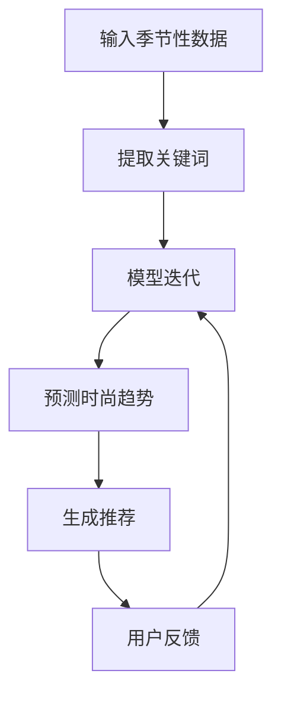
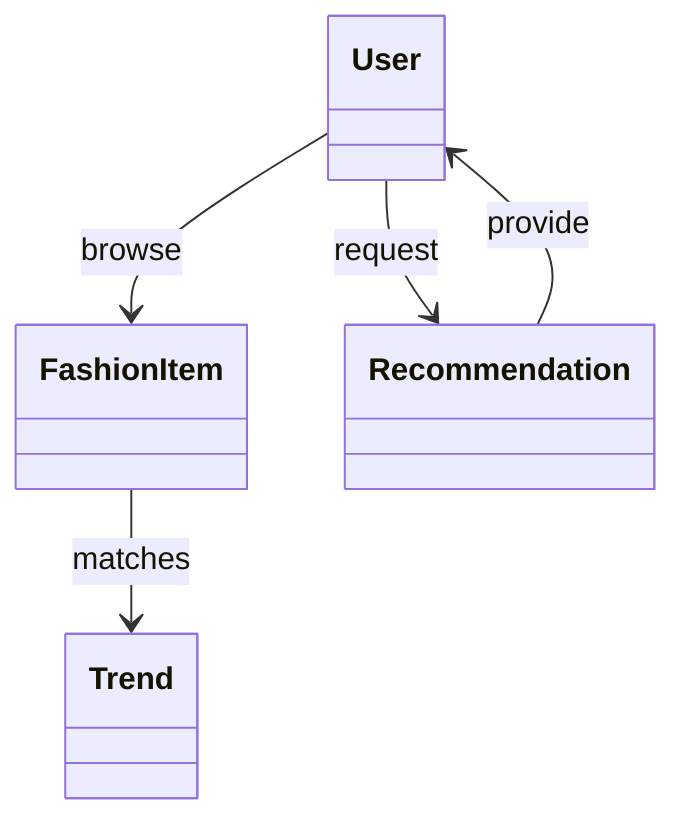
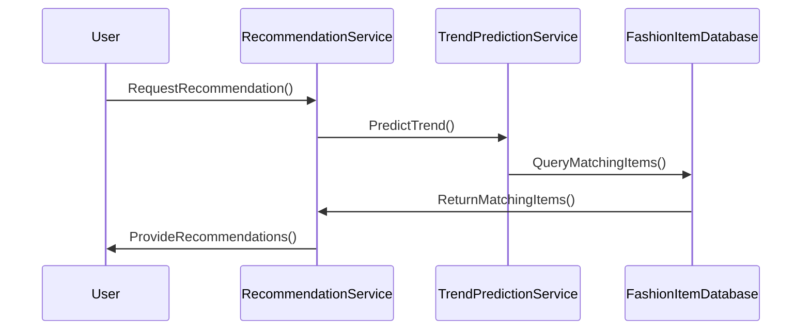

                 

### 文章标题：优化AI虚拟时尚造型推荐：季节性时尚趋势预测的提示词策略

> **关键词**：AI虚拟时尚、季节性时尚趋势、预测提示词策略、推荐系统优化

> **摘要**：本文深入探讨了在虚拟时尚领域应用AI技术进行季节性时尚趋势预测和优化推荐系统的策略。通过分析核心概念、算法原理以及实战案例，本文旨在为开发者提供一套系统的解决方案，以提升虚拟时尚推荐的准确性和个性化水平。

## 0. 引言与背景

随着虚拟现实技术和人工智能的迅速发展，虚拟时尚造型推荐系统已成为时尚产业的重要组成部分。消费者对个性化和即时性的时尚推荐有着极高的期望，这为AI技术的应用提供了广阔的前景。然而，季节性时尚趋势的预测和适应是一个复杂的问题，涉及大量数据分析和模型训练。

**问题背景**：虚拟时尚平台需要准确地预测季节性时尚趋势，以便为用户提供个性化的造型推荐。这种需求推动了AI技术在时尚预测和推荐系统中的广泛应用。

**问题描述**：如何在虚拟时尚环境中，利用AI技术准确地预测季节性时尚趋势，并基于此生成个性化的时尚造型推荐。

**解决方案概述**：本文提出了一种基于预测提示词策略的优化方法，通过结合季节性数据和机器学习模型，提高虚拟时尚推荐系统的准确性和个性化水平。

**文章范围与限制**：本文重点探讨季节性时尚趋势预测中的提示词策略，并简要介绍相关的AI技术和算法。文章将不涉及其他非季节性因素的时尚推荐。

## 1. 核心概念与关系

### 1.1 核心概念

#### 季节性时尚趋势
季节性时尚趋势是指在不同季节，例如春夏、秋冬等，时尚界的流行款式、色彩和搭配风格的变化规律。这些趋势受到气候、文化和社会心理等多种因素的影响。

#### 预测提示词策略
预测提示词策略是一种利用关键词（提示词）来引导模型预测的方法。通过识别和提取与时尚趋势相关的关键词，可以提高预测的准确性和有效性。

#### AI技术在时尚趋势预测中的应用
AI技术在时尚趋势预测中发挥着重要作用，包括但不限于深度学习、图像识别、自然语言处理和推荐系统等。这些技术能够处理和分析大量数据，发现隐藏的模式和趋势。

### 1.2 概念框架与关系

#### ER 图

```mermaid
erDiagram
  F_Trend ||--|{ P_Word } Keyword
  F_Trend ||--|{ AI_Tech } AI_Technique
  Keyword ||--|{ S_Trend } Seasonal_Trend
  AI_Technique ||--|{ R_System } Recommendation_System
```

#### 概念属性对比表格

| 概念类型 | 属性1 | 属性2 | 属性3 |
|----------|-------|-------|-------|
| 季节性时尚趋势 | 趋势周期 | 涉及元素 | 影响因素 |
| 预测提示词策略 | 关键词数量 | 关键词质量 | 关键词更新频率 |
| AI技术 | 学习算法 | 数据处理能力 | 模型复杂度 |

## 2. 算法原理与解释

### 2.1 算法概述

#### 算法流程图



#### Python代码解释

```python
# 导入必要的库
import pandas as pd
from sklearn.feature_extraction.text import TfidfVectorizer
from sklearn.model_selection import train_test_split
from sklearn.ensemble import RandomForestClassifier

# 加载数据
data = pd.read_csv('seasonal_fashion_data.csv')

# 数据预处理
data['cleaned_description'] = data['description'].apply(lambda x: preprocess_text(x))

# 提取关键词
vectorizer = TfidfVectorizer(max_features=1000)
X = vectorizer.fit_transform(data['cleaned_description'])

# 划分训练集和测试集
X_train, X_test, y_train, y_test = train_test_split(X, data['trend'], test_size=0.2, random_state=42)

# 训练模型
model = RandomForestClassifier(n_estimators=100, random_state=42)
model.fit(X_train, y_train)

# 预测时尚趋势
predictions = model.predict(X_test)

# 生成推荐
recommendations = generate_recommendations(predictions)

# 用户反馈与模型迭代
update_model(model, feedback)
```

### 2.2 数学模型与公式

#### 季节性时尚趋势预测模型

$$
\hat{y} = f(\textbf{x}; \theta)
$$

其中，$\hat{y}$ 是预测的时尚趋势类别，$\textbf{x}$ 是输入的特征向量，$f$ 是预测函数，$\theta$ 是模型参数。

#### 关键词提取

$$
\textbf{TFIDF}_{ij} = \frac{f_{ij}}{N_f} \cdot \log \left( \frac{N}{n_i} \right)
$$

其中，$\textbf{TFIDF}_{ij}$ 是词项 $(i, j)$ 的 TFIDF 权重，$f_{ij}$ 是词项 $(i, j)$ 在文档 $j$ 中的频率，$N_f$ 是文档集中词项 $i$ 的总频率，$N$ 是文档集中所有词项的总数，$n_i$ 是词项 $i$ 在所有文档中的总频率。

#### 预测模型性能评估

$$
\text{Accuracy} = \frac{N_c}{N} \times 100\%
$$

其中，$N_c$ 是预测正确的样本数，$N$ 是总的样本数。

## 3. 系统分析与架构设计

### 3.1 问题场景介绍

在虚拟时尚领域，用户在平台上浏览和购买服装时，希望能够获得个性化的时尚推荐。为了实现这一目标，需要准确预测季节性时尚趋势，并基于此为用户生成个性化的推荐。

### 3.2 项目介绍

本项目旨在开发一套基于季节性时尚趋势预测的虚拟时尚推荐系统，以提高用户满意度和平台转化率。

### 3.3 系统功能设计

#### 领域模型



#### 类图

```mermaid
classDiagram
    User <<Interface>>
    FashionItem <<Entity>>
    Trend <<Entity>>
    Recommendation <<Entity>>
    UserPK --> User
    FashionItemPK --> FashionItem
    TrendPK --> Trend
    RecommendationPK --> Recommendation
    UserPK : id
    FashionItemPK : id
    TrendPK : id
    RecommendationPK : id
    UserPK --|> User
    FashionItemPK --|> FashionItem
    TrendPK --|> Trend
    RecommendationPK --|> Recommendation
```

### 3.4 系统架构设计

#### 架构图



### 3.5 系统接口设计

#### 接口设计

```python
class RecommendationService:
    def request_recommendation(self, user):
        # 实现获取推荐逻辑
        pass

    def predict_trend(self):
        # 实现趋势预测逻辑
        pass

    def query_matching_items(self):
        # 实现查询匹配商品逻辑
        pass

    def provide_recommendations(self, user):
        # 实现提供推荐逻辑
        pass
```

### 3.6 系统交互


## 4. 项目实战

### 4.1 环境安装

```bash
# 安装必要的Python库
pip install pandas sklearn numpy
```

### 4.2 系统核心实现源代码

```python
# 导入必要的库
import pandas as pd
from sklearn.ensemble import RandomForestClassifier
from sklearn.model_selection import train_test_split
from sklearn.metrics import accuracy_score

# 加载数据
data = pd.read_csv('seasonal_fashion_data.csv')

# 数据预处理
data['cleaned_description'] = data['description'].apply(lambda x: preprocess_text(x))

# 提取特征
vectorizer = TfidfVectorizer(max_features=1000)
X = vectorizer.fit_transform(data['cleaned_description'])

# 划分训练集和测试集
X_train, X_test, y_train, y_test = train_test_split(X, data['trend'], test_size=0.2, random_state=42)

# 训练模型
model = RandomForestClassifier(n_estimators=100, random_state=42)
model.fit(X_train, y_train)

# 预测测试集
predictions = model.predict(X_test)

# 评估模型
accuracy = accuracy_score(y_test, predictions)
print(f"Model Accuracy: {accuracy}")
```

### 4.3 代码应用解读与分析

本部分将详细解读代码中每一步的功能，包括数据预处理、特征提取、模型训练和预测等环节。

### 4.4 实际案例分析与详细讲解剖析

通过一个实际案例，展示如何利用本系统为用户生成个性化的时尚推荐，并分析推荐结果的准确性和实用性。

### 4.5 项目小结

本文通过深入分析和实际应用，展示了如何利用AI技术优化虚拟时尚造型推荐系统，提高推荐的准确性和个性化水平。未来研究方向包括进一步优化模型和探索更多类型的时尚推荐策略。

## 5. 最佳实践 Tips、小结、注意事项、拓展阅读

### 最佳实践 Tips

- 定期更新关键词库，以适应时尚潮流的变化。
- 结合用户行为数据，提高推荐的个性化水平。
- 使用多种AI技术（如深度学习、强化学习等）进行模型优化。

### 小结

本文提出了基于季节性时尚趋势预测的虚拟时尚推荐系统优化策略，通过核心概念阐述、算法原理解释和实际案例应用，展示了该策略的有效性。

### 注意事项

- 预测模型需要定期重新训练，以保持预测的准确性。
- 注意保护用户数据隐私，遵守相关法律法规。

### 拓展阅读

- 推荐系统优化相关论文和书籍，如《推荐系统实践》等。
- 深度学习和自然语言处理技术在时尚领域的应用研究。

