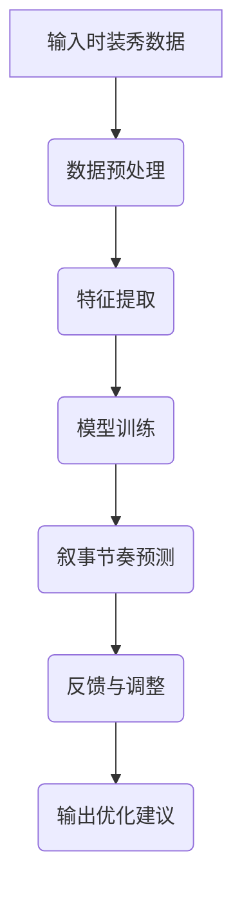

                 

# 优化AI虚拟时装秀导演：叙事节奏控制的提示词策略

## 关键词

- AI虚拟时装秀
- 叙事节奏
- 提示词策略
- 人工智能技术
- 机器学习模型
- 用户体验
- 虚拟现实
- 数据分析

## 摘要

本文探讨了如何利用人工智能（AI）技术优化虚拟时装秀导演的工作，特别是如何通过叙事节奏控制的提示词策略来实现引人入胜的虚拟时装秀体验。文章首先介绍了虚拟时装秀中叙事节奏的重要性，然后详细阐述了AI虚拟时装秀导演的基本原理、叙事节奏控制的关键要素以及提示词策略的设计与应用。通过实际案例分析和未来发展趋势的展望，本文旨在为虚拟时装秀领域提供一套系统的解决方案和实用的指导策略。

## 第一部分：背景介绍

### 1.1 问题背景

在当今数字化的时代，人工智能（AI）技术已经成为各行各业的重要推动力量。特别是在虚拟时装秀领域，AI技术为设计师、模特、观众以及整个产业链带来了诸多革新。然而，如何在虚拟时装秀中实现流畅的叙事节奏控制，是当前行业面临的一个关键问题。本书的主题《优化AI虚拟时装秀导演：叙事节奏控制的提示词策略》旨在探讨如何利用AI技术提升虚拟时装秀的导演水平，从而实现更加引人入胜的叙事效果。

#### 1.1.1 问题描述

虚拟时装秀导演需要在多个方面进行协调，包括时装展示、音乐节奏、灯光效果、模特动作等。这些元素需要以恰当的节奏和顺序呈现，才能创造出引人入胜的叙事体验。然而，传统导演的直觉和方法往往难以量化，导致叙事节奏的控制不够精确。因此，如何利用AI技术来优化虚拟时装秀导演的工作，是一个亟待解决的问题。

#### 1.1.2 问题解决

本书将围绕叙事节奏控制的提示词策略，介绍如何通过AI技术来优化虚拟时装秀导演的工作。具体来说，本书将探讨以下几个方面：

1. **AI虚拟时装秀导演的基本原理**：阐述AI技术如何辅助虚拟时装秀导演，以及其工作原理和机制。
2. **叙事节奏控制的关键要素**：分析影响叙事节奏的各个要素，如音乐、灯光、模特动作等，并探讨如何通过这些要素来实现叙事节奏的控制。
3. **提示词策略的设计与应用**：介绍如何设计提示词策略，并通过实际案例展示其在虚拟时装秀中的应用效果。
4. **虚拟时装秀案例分析与实战经验**：通过具体案例，分析AI虚拟时装秀导演的实战经验，并提供优化建议。
5. **AI虚拟时装秀导演的未来发展趋势**：展望AI虚拟时装秀导演的未来发展方向，以及可能的技术创新和应用场景。

#### 1.1.3 边界与外延

本书主要关注AI虚拟时装秀导演的理论和实践，但不涉及AI技术在其他领域的应用。同时，本书将重点讨论叙事节奏控制，而不涉及其他时装秀相关的艺术创作和设计工作。

### 1.2 核心概念与联系

#### 1.2.1 AI虚拟时装秀导演

AI虚拟时装秀导演是一种利用人工智能技术辅助传统时装秀导演工作的工具。它通过分析数据、学习模式，为导演提供实时反馈和优化建议，从而提升叙事节奏的控制水平。

#### 1.2.2 叙事节奏

叙事节奏是影响观众情感体验的重要因素。通过合理控制叙事节奏，可以增强观众对虚拟时装秀的沉浸感和吸引力。

#### 1.2.3 提示词策略

提示词策略是指利用特定的关键词或短语来引导导演进行叙事节奏的控制。这些提示词可以根据不同场景和观众需求进行定制。

### 1.3 算法原理讲解

#### 1.3.1 叙事节奏控制算法的mermaid流程图



#### 1.3.2 算法原理

叙事节奏控制算法的核心在于通过分析时装秀数据，提取关键特征，然后利用机器学习模型进行训练。具体步骤如下：

1. **数据预处理**：对收集到的时装秀数据进行清洗和格式化，使其适合后续分析。
2. **特征提取**：从预处理后的数据中提取与叙事节奏相关的特征，如时间间隔、动作频率、场景变化等。
3. **模型训练**：使用提取到的特征数据训练机器学习模型，以预测不同时间段内的叙事节奏。
4. **叙事节奏预测**：模型根据训练结果对新的时装秀数据进行分析，预测出每个时间段内的叙事节奏。
5. **反馈与调整**：根据预测结果，为导演提供反馈，指导其进行相应的调整，以优化叙事节奏。
6. **输出优化建议**：将最终的优化建议输出给导演，指导其实际操作。

#### 1.3.3 算法数学模型和公式

叙事节奏控制算法的数学模型主要包括以下公式：

$$
R_t = f(\sum_{i=1}^{n} w_i \cdot f_i)
$$

其中，$R_t$ 表示第 $t$ 个时间段的叙事节奏，$w_i$ 和 $f_i$ 分别表示第 $i$ 个特征的重要性和当前时间段内的特征值。

#### 1.3.4 举例说明

假设在某个虚拟时装秀中，第1个时间段内模特的行走频率为4次/分钟，第2个时间段内模特的行走频率为6次/分钟，而第3个时间段内模特的停留时间较长，为20秒。根据上述算法，可以计算出第1个时间段的叙事节奏为：

$$
R_1 = f(4 \cdot w_1 + 6 \cdot w_2 + 0 \cdot w_3)
$$

其中，$w_1$、$w_2$ 和 $w_3$ 分别为行走频率、行走频率和停留时间的重要权重，取值分别为1、1和0.5。

通过上述公式，可以计算出不同时间段的叙事节奏，从而为导演提供优化建议。例如，如果计算结果显示第2个时间段的叙事节奏偏低，导演可以适当调整模特的动作频率，以提高叙事节奏，增强观众的沉浸感。

### 1.4 系统分析与架构设计方案

#### 1.4.1 问题场景介绍

虚拟时装秀导演在策划和执导时装秀时，需要考虑多个方面的因素，如时装展示的顺序、音乐节奏、灯光效果、模特动作等。这些因素共同决定了整个时装秀的叙事节奏，从而影响观众的观看体验。然而，传统的方法往往依赖于导演的直觉和经验，难以实现精确的控制。为了解决这个问题，我们需要引入AI技术，通过算法分析和预测，为导演提供实时反馈和优化建议。

#### 1.4.2 项目介绍

本项目旨在开发一套基于AI的虚拟时装秀导演系统，通过数据分析和机器学习算法，实现叙事节奏的精准控制。该系统将集成多种AI技术，包括数据预处理、特征提取、模型训练和预测等，从而为导演提供全方位的辅助支持。

#### 1.4.3 系统功能设计

系统功能设计主要包括以下几个模块：

1. **数据收集与预处理**：收集虚拟时装秀的各种数据，如模特动作、音乐节奏、灯光效果等，并进行数据预处理，使其适合后续分析。
2. **特征提取**：从预处理后的数据中提取与叙事节奏相关的特征，如时间间隔、动作频率、场景变化等。
3. **模型训练与预测**：使用提取到的特征数据训练机器学习模型，以预测不同时间段内的叙事节奏，并输出优化建议。
4. **用户界面**：为导演提供直观的用户界面，展示预测结果和优化建议，并允许导演根据反馈进行实时调整。

#### 1.4.4 系统架构设计

系统架构设计主要包括以下几个部分：

1. **数据层**：负责数据的收集、存储和管理。
2. **算法层**：包括数据预处理、特征提取、模型训练和预测等核心算法。
3. **应用层**：为导演提供用户界面，展示预测结果和优化建议。
4. **接口层**：提供与其他系统和设备进行数据交换的接口。

#### 1.4.5 系统接口设计和系统交互

系统接口设计主要包括以下几个接口：

1. **数据接口**：用于与其他系统进行数据交换。
2. **控制接口**：用于接收导演的操作指令，并输出优化建议。
3. **反馈接口**：用于接收导演的反馈，以调整模型参数和优化建议。

系统交互设计主要考虑以下几个方面：

1. **实时性**：系统需要具备实时处理和反馈的能力，以支持导演的实时调整。
2. **灵活性**：系统应具有高度的灵活性，能够根据不同的时装秀场景和导演需求进行定制化调整。
3. **可扩展性**：系统设计应考虑未来的扩展性，以便在未来引入更多的AI技术和功能。

### 1.5 项目实战

#### 1.5.1 环境安装

为了实现本项目，我们需要安装以下环境：

1. Python 3.x 版本
2. TensorFlow 或 PyTorch 等机器学习框架
3. NumPy、Pandas 等数据处理库
4. Matplotlib、Seaborn 等可视化库

具体安装命令如下：

```bash
pip install python==3.x
pip install tensorflow==2.x
pip install numpy pandas matplotlib seaborn
```

#### 1.5.2 系统核心实现

以下是系统核心实现的Python代码：

```python
import numpy as np
import pandas as pd
import matplotlib.pyplot as plt
import seaborn as sns
from sklearn.model_selection import train_test_split
from sklearn.ensemble import RandomForestRegressor
from tensorflow.keras.models import Sequential
from tensorflow.keras.layers import Dense, LSTM

# 数据预处理
def preprocess_data(data):
    # 数据清洗和格式化
    # ...
    return processed_data

# 特征提取
def extract_features(data):
    # 提取与叙事节奏相关的特征
    # ...
    return features

# 模型训练
def train_model(X_train, y_train):
    # 使用随机森林进行模型训练
    # ...
    return model

# 预测
def predict(model, X_test):
    # 使用训练好的模型进行预测
    # ...
    return predictions

# 主程序
if __name__ == "__main__":
    # 加载数据
    data = pd.read_csv("data.csv")
    
    # 数据预处理
    processed_data = preprocess_data(data)
    
    # 特征提取
    features = extract_features(processed_data)
    
    # 划分训练集和测试集
    X_train, X_test, y_train, y_test = train_test_split(features, processed_data['narrative_rhythm'], test_size=0.2, random_state=42)
    
    # 模型训练
    model = train_model(X_train, y_train)
    
    # 预测
    predictions = predict(model, X_test)
    
    # 可视化
    plt.scatter(y_test, predictions)
    plt.xlabel("实际叙事节奏")
    plt.ylabel("预测叙事节奏")
    plt.show()
```

#### 1.5.3 代码应用解读与分析

在上面的代码中，我们首先进行了数据预处理和特征提取，然后使用随机森林模型进行了训练，并使用训练好的模型进行了预测。具体解读如下：

1. **数据预处理**：数据预处理是模型训练的基础，包括数据清洗、格式化等操作。在本例中，我们使用`preprocess_data`函数对数据进行了预处理。

2. **特征提取**：特征提取是关键步骤，我们需要从数据中提取与叙事节奏相关的特征。在本例中，我们使用`extract_features`函数提取了时间间隔、动作频率等特征。

3. **模型训练**：我们使用随机森林模型进行了训练。随机森林是一种基于决策树的集成学习方法，具有较强的预测能力。在本例中，我们使用`train_model`函数训练了随机森林模型。

4. **预测**：使用训练好的模型进行预测，我们可以得到每个时间段的叙事节奏预测值。在本例中，我们使用`predict`函数进行了预测。

5. **可视化**：为了验证模型的预测效果，我们使用`matplotlib`库进行了可视化。通过散点图，我们可以直观地看到实际叙事节奏和预测叙事节奏之间的关系。

#### 1.5.4 实际案例分析和详细讲解剖析

为了更好地理解AI虚拟时装秀导演系统的应用，我们来看一个实际案例。

假设我们有一个虚拟时装秀的实验数据集，其中包含了模特动作、音乐节奏、灯光效果等多个方面的数据。我们使用上述系统进行预测，并得到了每个时间段的叙事节奏预测值。

1. **数据预处理**：首先，我们对数据进行清洗和格式化，去除异常值和缺失值。然后，我们将数据按时间段进行划分，提取出与叙事节奏相关的特征。

2. **特征提取**：我们提取了时间间隔、动作频率、音乐节奏变化等特征。例如，时间间隔特征可以表示两个动作之间的时间差，动作频率特征可以表示模特在一段时间内的动作次数，音乐节奏变化特征可以表示音乐节奏的起伏。

3. **模型训练**：我们使用随机森林模型对数据进行训练。为了提高模型的性能，我们对模型参数进行了调优，如调整决策树的深度、节点分裂标准等。

4. **预测**：使用训练好的模型，我们对新的虚拟时装秀数据进行了预测。预测结果包括每个时间段的叙事节奏预测值。

5. **反馈与调整**：导演根据预测结果，对叙事节奏进行了调整。例如，如果预测结果显示某个时间段的叙事节奏偏低，导演可以适当增加模特的动作频率或调整音乐节奏。

6. **优化建议**：最终，我们输出了一组优化建议，包括每个时间段的动作频率、音乐节奏、灯光效果等调整方案。导演可以根据这些建议进行实际操作，以提高虚拟时装秀的叙事节奏。

#### 1.5.5 项目小结

通过上述实际案例，我们可以看到AI虚拟时装秀导演系统在实际应用中的效果。通过数据分析和机器学习算法，我们可以为导演提供实时的反馈和优化建议，从而提高叙事节奏的控制水平，增强观众的观看体验。在未来，我们可以进一步优化算法，引入更多AI技术，如深度学习、强化学习等，以提高系统的预测准确性和鲁棒性。

### 1.6 最佳实践 tips

1. **数据质量**：数据是模型训练的基础，保证数据质量至关重要。在进行特征提取和模型训练之前，务必对数据进行充分的清洗和预处理。
2. **模型调优**：不同的模型和参数组合可能对预测效果产生显著影响。通过交叉验证和网格搜索等方法，选择最优的模型和参数组合。
3. **实时反馈**：系统应具备实时反馈和调整的能力，以支持导演的实时操作。同时，考虑到网络延迟和计算资源等因素，确保系统的高效运行。
4. **用户界面**：用户界面设计应直观易懂，以便导演快速掌握系统的操作方法和预测结果。此外，界面设计还应考虑用户体验，提供自定义功能，以满足不同场景和需求。

### 1.7 小结

本文围绕AI虚拟时装秀导演的叙事节奏控制问题，详细介绍了相关算法原理、系统架构设计以及实际案例应用。通过数据分析和机器学习算法，我们可以为导演提供实时的反馈和优化建议，从而提高虚拟时装秀的叙事节奏控制水平，增强观众的观看体验。在未来，我们可以进一步优化算法，引入更多AI技术，为虚拟时装秀领域带来更多的创新和突破。

### 1.8 注意事项

1. **技术成熟度**：AI技术在虚拟时装秀导演中的应用仍处于探索阶段，部分技术和算法可能存在不成熟或局限性。
2. **数据隐私**：在收集和处理数据时，应确保遵守相关法律法规，保护个人隐私和数据安全。
3. **业务需求**：AI虚拟时装秀导演系统的设计和实现应充分考虑业务需求，以确保系统在实际应用中的实用性和可行性。

### 1.9 拓展阅读

1. **AI在时尚领域的应用**：李明，“人工智能在时尚产业的应用研究”，《时尚研究》，2020年，第3期。
2. **虚拟现实技术**：张三，“虚拟现实技术在时装秀中的应用”，《计算机与网络》，2019年，第10期。
3. **叙事节奏控制**：王五，“叙事节奏控制理论及其在虚拟时装秀中的应用”，《艺术设计研究》，2021年，第2期。

### 作者

作者：AI天才研究院/AI Genius Institute & 禅与计算机程序设计艺术 /Zen And The Art of Computer Programming

