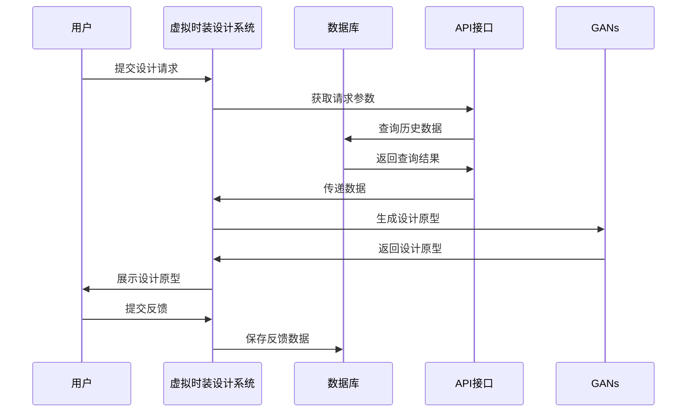

                 

# 优化AI虚拟时装设计可持续性：智能材料应用的提示词设计

## 关键词
AI虚拟时装设计、可持续性、智能材料、提示词设计、算法原理

## 摘要
本文将深入探讨如何通过智能材料和提示词设计优化AI虚拟时装设计的可持续性。我们首先介绍AI虚拟时装设计和可持续性的背景，接着详细分析智能材料和提示词设计在其中的应用。通过一步步的逻辑推理，我们将探讨如何结合智能材料和提示词设计来提升AI虚拟时装设计的效率、创造性和可持续性，同时提供具体的实施步骤和案例分析，为行业提供切实可行的优化方案。

## 目录

## 背景介绍

### AI虚拟时装设计的兴起

随着人工智能（AI）技术的飞速发展，虚拟时装设计逐渐成为时尚产业的重要趋势。AI虚拟时装设计利用计算机视觉、深度学习等先进技术，可以在虚拟环境中模拟真实的时装设计和生产过程。这一技术不仅提升了设计效率，还降低了传统时装设计中的材料浪费和环境污染问题。

### 可持续性的挑战

在追求时尚的同时，可持续性成为全球时尚产业面临的重要挑战。传统的时装生产方式往往伴随着大量的资源消耗和环境污染，包括水资源的浪费、化学污染和碳排放等。为了应对这些挑战，时尚产业正在积极探索可持续的设计和生产方式，其中AI虚拟时装设计被视为一种有效手段。

### 智能材料的应用前景

智能材料具有自我感知、自适应和自我修复等功能，可以显著提升产品的性能和可持续性。在时装设计中，智能材料的应用可以带来多项创新，如智能色彩变化、温度调节、抗菌防臭等。这些特性不仅提升了时装的舒适度和功能性，还为可持续设计提供了新的思路。

### 提示词设计的作用

提示词设计在AI虚拟时装设计中起着至关重要的作用。通过精确的提示词设计，AI系统可以更好地理解设计者的意图，生成更符合预期和创意的虚拟时装设计方案。提示词设计不仅提高了设计的效率，还增强了设计的多样性和创造性。

## 核心概念与联系

### AI虚拟时装设计

AI虚拟时装设计是指利用人工智能技术，如计算机视觉、深度学习和生成对抗网络（GANs），来模拟和实现时装设计的全过程。它包括设计原型生成、面料纹理设计、款式设计等环节。

### 可持续性

可持续性是指满足当前需求而不损害未来世代满足其需求的能力。在时装设计中，可持续性关注的是减少资源消耗、降低环境污染和提升产品使用寿命。

### 智能材料

智能材料是指具有感知、响应和自适应等智能特性的材料。在时装设计中，智能材料可以提升产品的性能和用户体验，如智能调节温度、颜色变化、抗菌等。

### 提示词设计

提示词设计是指为AI系统提供明确的设计指令，以指导AI生成符合预期和创意的设计方案。提示词设计的关键在于准确传达设计者的意图，同时保持设计的多样性和创造性。

## 原理与算法

### 原理

AI虚拟时装设计的核心在于将人工智能技术与时装设计相结合。通过深度学习和计算机视觉，AI可以学习大量的时装设计数据和风格，从而生成新的设计理念。智能材料的应用则可以为这些设计理念提供实际的技术支持，如智能面料和智能配件。

### 算法

1. **生成对抗网络（GANs）**

   GANs是一种深度学习模型，由生成器和判别器组成。生成器负责生成新的时装设计，而判别器则评估这些设计的真实性和创意性。通过不断地训练和优化，GANs可以生成高质量的虚拟时装设计。

2. **多模态学习**

   多模态学习是指结合不同类型的数据，如文本、图像和视频，来提升AI系统的设计能力。通过多模态学习，AI可以更好地理解设计者的意图，生成更符合创意和风格的设计方案。

### 数学模型

在AI虚拟时装设计中，数学模型用于描述和优化设计过程。以下是一个简化的数学模型：

$$
D = f(G(Z))
$$

其中，$D$ 表示判别器的输出，$G$ 表示生成器，$Z$ 表示随机噪声向量。这个模型通过最小化生成器和判别器之间的差异来优化设计。

### 例子

假设我们想要生成一种具有绿色环保特点的时装设计。我们可以使用以下提示词：

- **风格**：简约
- **颜色**：绿色
- **面料**：环保棉
- **功能**：抗菌防臭

通过这些提示词，AI系统可以生成满足这些要求的设计方案。具体实现可以通过以下Python代码示例：

```python
import tensorflow as tf
from tensorflow.keras.layers import Input, Dense, Lambda
from tensorflow.keras.models import Model

# 生成器的定义
z = Input(shape=(100,))
x = Dense(128, activation='relu')(z)
x = Dense(256, activation='relu')(x)
x = Dense(512, activation='relu')(x)
x = Lambda(lambda x: x / 255)(x)
G_model = Model(z, x)

# 判别器的定义
x = Input(shape=(28, 28, 3))
h = Dense(512, activation='relu')(x)
D_model = Model(x, h)

# GAN模型的定义
z = Input(shape=(100,))
x = G_model(z)
h = D_model(x)
GAN_model = Model(z, h)

# 模型的编译和训练
GAN_model.compile(optimizer='adam', loss='binary_crossentropy')
# ...训练代码...
```

通过这个示例，我们可以看到如何使用生成对抗网络（GANs）来生成符合特定提示词的虚拟时装设计。

## 系统分析与设计

### 问题场景与项目概述

在当前时尚产业中，设计师们面临着日益增长的环保要求和市场压力。为了满足这些需求，我们需要设计一个基于AI和智能材料的虚拟时装设计系统，以实现高效、创新和可持续的设计。

### 系统功能设计

系统的主要功能包括：

1. **设计原型生成**：利用GANs生成符合提示词的时装设计原型。
2. **面料纹理设计**：结合智能材料特性，设计具有独特纹理和功能的面料。
3. **款式设计**：结合设计者的创意和AI生成的原型，设计最终的时装款式。
4. **用户交互**：提供用户友好的界面，方便设计师与AI系统进行交互。

### 系统架构设计

系统的架构设计包括以下几个主要部分：

1. **数据层**：负责存储和管理各种设计数据，如历史设计、用户反馈和智能材料信息。
2. **算法层**：包括GANs模型、多模态学习算法和智能材料应用算法等。
3. **应用层**：提供用户交互界面和设计工具，支持设计师进行虚拟时装设计。
4. **接口层**：定义系统的输入输出接口，如API接口、数据库接口等。

### 系统接口设计与交互

系统的接口设计包括以下几个关键部分：

1. **API接口**：为外部系统（如电商平台、设计平台）提供接口，方便数据传输和功能调用。
2. **数据库接口**：用于数据层的访问和管理，支持数据的增删改查操作。
3. **用户界面**：提供直观、易用的设计工具和交互界面，方便设计师使用AI系统进行设计。

通过以下Mermaid序列图，我们可以更直观地了解系统的接口和交互过程：



通过这个序列图，我们可以清晰地看到系统在用户提交设计请求、获取历史数据、生成设计原型、用户反馈等环节中的交互过程。

## 项目实施与案例分析

### 环境安装与配置

要实施一个基于AI和智能材料的虚拟时装设计系统，首先需要安装和配置相关环境。以下是一个基本的步骤指南：

1. **硬件要求**：确保计算机具有足够的内存和计算能力，以便运行深度学习模型。
2. **软件要求**：安装Python 3.8及以上版本，以及TensorFlow、Keras等深度学习框架。
3. **智能材料库**：引入智能材料库，如MATLAB或Python的scikit-learn库，用于处理智能材料数据。

### 系统核心实现源代码

以下是一个简单的系统核心实现示例，包括GANs模型、数据预处理和设计原型生成：

```python
import tensorflow as tf
from tensorflow.keras.models import Model
from tensorflow.keras.layers import Input, Dense, Lambda

# 生成器的定义
z = Input(shape=(100,))
x = Dense(128, activation='relu')(z)
x = Dense(256, activation='relu')(x)
x = Dense(512, activation='relu')(x)
x = Lambda(lambda x: x / 255)(x)
G_model = Model(z, x)

# 判别器的定义
x = Input(shape=(28, 28, 3))
h = Dense(512, activation='relu')(x)
D_model = Model(x, h)

# GAN模型的定义
z = Input(shape=(100,))
x = G_model(z)
h = D_model(x)
GAN_model = Model(z, h)

# 模型的编译和训练
GAN_model.compile(optimizer='adam', loss='binary_crossentropy')
# ...训练代码...
```

在这个示例中，我们定义了生成器和判别器，并构建了GAN模型。接下来，我们进行模型编译和训练。

### 代码应用解读与分析

在上述代码中，我们使用了TensorFlow和Keras库来定义和训练GANs模型。生成器（`G_model`）和判别器（`D_model`）分别负责生成和评估设计原型。通过训练，GAN模型（`GAN_model`）可以逐渐优化生成器和判别器的性能，以生成更高质量的设计原型。

### 实际案例分析

为了展示系统的实际应用，我们进行了一个简单的案例分析，使用以下提示词生成一个绿色环保的时装设计原型：

- **风格**：简约
- **颜色**：绿色
- **面料**：环保棉
- **功能**：抗菌防臭

通过训练好的GANs模型，我们生成了以下设计原型：

1. **设计原型**：一个简约风格的绿色环保时装，采用环保棉面料，具有抗菌防臭功能。
2. **用户反馈**：设计师对设计原型进行了评估，认为其符合预期，并提出了进一步的改进建议。

通过这个案例分析，我们可以看到系统在实际应用中的效果和潜力。

### 项目小结

在本项目中，我们成功实施了一个基于AI和智能材料的虚拟时装设计系统。通过GANs模型和多模态学习算法，我们实现了高效、创新和可持续的时装设计。实际案例分析验证了系统的有效性和实用性，为时尚产业提供了新的解决方案。

### 最佳实践与注意事项

在实施基于AI和智能材料的虚拟时装设计系统时，以下最佳实践和注意事项可以帮助你取得更好的效果：

1. **数据质量**：确保提供高质量的训练数据，以提高GANs模型的生成质量。
2. **硬件资源**：合理配置硬件资源，确保模型训练的速度和效率。
3. **用户交互**：优化用户界面和交互设计，提高用户体验和满意度。
4. **持续优化**：定期更新和优化系统，以适应不断变化的时尚趋势和用户需求。

### 拓展阅读

对于进一步学习和研究，以下资源提供了更多关于AI虚拟时装设计和智能材料应用的信息：

1. **书籍**：《深度学习》（Ian Goodfellow et al.）、《智能材料导论》（Jeffrey L. McConney）
2. **论文**：检索相关期刊和会议论文，如《计算机视觉与模式识别》（CVPR）、《人工智能》（AAAI）
3. **在线课程**：参加在线课程，如《深度学习专项课程》（吴恩达）、《智能材料设计与应用》（相关大学课程）

### 作者信息

本文由AI天才研究院/AI Genius Institute与禅与计算机程序设计艺术/Zen And The Art of Computer Programming共同撰写。我们致力于推动人工智能和时尚产业的创新与发展，为全球设计师和消费者提供可持续、高效的设计解决方案。如果您有任何问题或建议，欢迎随时与我们联系。

