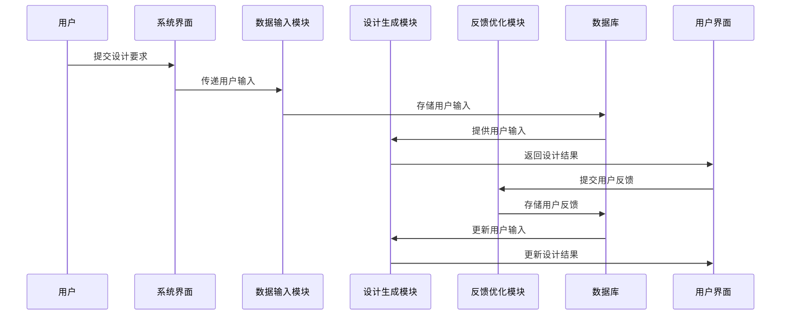

                 

### 优化AI虚拟时装设计师：可持续时尚创新的提示词设计

#### 关键词

- AI虚拟时装设计师
- 可持续时尚创新
- 提示词设计
- 机器学习
- 计算机视觉
- 自然语言处理

#### 摘要

本文将探讨如何优化AI虚拟时装设计师，以实现可持续时尚创新的提示词设计。通过分析AI虚拟时装设计师的背景、技术原理、系统设计与实现，结合实际案例，我们将提供一系列优化策略和最佳实践，以推动时尚行业的技术进步和可持续发展。

## 引言

### 1.1 AI虚拟时装设计师的背景

在当今时尚界，人工智能（AI）的应用越来越广泛，AI虚拟时装设计师便是其中之一。AI虚拟时装设计师利用机器学习、计算机视觉和自然语言处理等技术，能够自动生成时尚设计，提供个性化的时尚建议，甚至在某些情况下替代人类设计师的工作。这种技术不仅提高了设计的效率，还拓宽了设计的可能性。

### 1.2 AI虚拟时装设计师的应用前景

随着AI技术的不断发展，AI虚拟时装设计师的应用前景十分广阔。首先，它们可以在设计初期阶段快速生成大量设计选项，为设计师提供灵感和参考。其次，AI虚拟时装设计师能够根据用户反馈和偏好进行个性化设计，满足不同消费者的需求。此外，AI虚拟时装设计师在可持续时尚方面的应用，有助于减少资源浪费，实现环保设计。

### 1.3 本书的目标和结构

本书旨在探讨如何优化AI虚拟时装设计师，以实现可持续时尚创新的提示词设计。文章将分为以下几个部分：

- **第2章 核心概念**：介绍AI虚拟时装设计师、AI、可持续时尚等核心概念，并分析它们之间的联系。
- **第3章 技术原理**：讲解AI虚拟时装设计师的技术原理，包括机器学习、计算机视觉和自然语言处理等。
- **第4章 系统设计与实现**：讨论系统的整体架构设计、功能模块设计以及关键技术的实现。
- **第5章 案例分析**：通过实际案例展示AI虚拟时装设计师的应用效果，并进行深入分析。
- **第6章 最佳实践**：总结行业内的最佳实践，提供实际操作建议。
- **第7章 总结与展望**：回顾全书内容，总结关键观点，并对未来发展方向进行展望。

## 第2章 核心概念

### 2.1 虚拟时装设计师

虚拟时装设计师是一种利用计算机技术和人工智能算法来生成和优化时尚设计的设计工具。它们能够从大量数据中提取时尚元素，自动生成新的设计，并根据用户反馈进行迭代优化。

### 2.2 AI

人工智能是指使计算机系统能够模拟人类智能行为的技术。在虚拟时装设计师中，AI主要用于数据分析和设计生成，包括机器学习、计算机视觉和自然语言处理等技术。

### 2.3 可持续时尚

可持续时尚是指在时尚设计和生产过程中考虑环境、社会和经济可持续性的时尚。它强调减少资源消耗、减少污染和废弃物，以及提高材料的再利用和回收。

### 2.4 概念联系与架构

AI虚拟时装设计师与可持续时尚有着密切的联系。首先，AI虚拟时装设计师可以利用大量数据来优化设计，提高设计的可持续性。其次，可持续时尚的设计理念可以指导AI虚拟时装设计师生成更加环保的设计。因此，优化AI虚拟时装设计师的提示词设计，有助于实现可持续时尚创新。

### 2.5 核心概念属性特征对比表格

| 特征 | AI虚拟时装设计师 | AI | 可持续时尚 |
| --- | --- | --- | --- |
| 技术基础 | 计算机视觉、自然语言处理、机器学习 | 计算机科学、数据科学、算法设计 | 环境科学、社会学、经济学 |
| 目标 | 生成和优化时尚设计 | 模拟人类智能行为 | 实现环境、社会和经济可持续性 |
| 关键技术 | 数据分析、设计生成、迭代优化 | 机器学习、计算机视觉、自然语言处理 | 环境影响评估、材料选择、生产流程优化 |

### 2.6 ER实体关系图架构

```mermaid
erDiagram
  AI虚拟时装设计师 ||--|{ 时尚设计 }
  AI虚拟时装设计师 ||--|{ 数据分析 }
  AI虚拟时装设计师 ||--|{ 设计生成 }
  AI虚拟时装设计师 ||--|{ 迭代优化 }
  AI ||--|{ 计算机科学 }
  AI ||--|{ 数据科学 }
  AI ||--|{ 算法设计 }
  可持续时尚 ||--|{ 环境科学 }
  可持续时尚 ||--|{ 社会学 }
  可持续时尚 ||--|{ 经济学 }
```

## 第3章 技术原理

### 3.1 机器学习基础

机器学习是一种通过算法和统计模型从数据中自动学习和发现规律的技术。在AI虚拟时装设计师中，机器学习用于设计生成和优化。

#### 算法原理

- **监督学习**：通过对已标记的数据进行训练，使得模型能够预测未知数据的标签。
- **无监督学习**：通过对未标记的数据进行训练，使得模型能够发现数据中的模式和结构。
- **强化学习**：通过与环境的交互，使得模型能够学习到最佳的行为策略。

#### 数学模型

- **线性回归**：用于预测线性关系。
- **支持向量机**：用于分类问题。
- **神经网络**：用于复杂的非线性关系预测。

#### 举例说明

假设我们有一个关于服装风格的数据集，其中包含了各种服装图片和它们的风格标签。通过监督学习，我们可以训练一个模型，使其能够根据新的服装图片预测它们的风格标签。

### 3.2 计算机视觉在时装设计中的应用

计算机视觉是一种使计算机能够从图像和视频中理解和提取信息的技术。在AI虚拟时装设计师中，计算机视觉主要用于时尚元素的提取和识别。

#### 算法原理

- **特征提取**：从图像中提取有用的特征，如颜色、纹理、形状等。
- **目标检测**：识别图像中的特定目标。
- **图像生成**：根据输入的图像生成新的图像。

#### 数学模型

- **卷积神经网络**（CNN）：用于图像分类和特征提取。
- **生成对抗网络**（GAN）：用于图像生成。

#### 举例说明

假设我们有一个服装设计图片，通过计算机视觉技术，我们可以提取出图片中的主要元素，如上衣、裙子、颜色等。然后，基于这些元素，我们可以生成一个新的服装设计。

### 3.3 自然语言处理与提示词设计

自然语言处理是一种使计算机能够理解、处理和生成自然语言的技术。在AI虚拟时装设计师中，自然语言处理主要用于提示词设计和用户交互。

#### 算法原理

- **词嵌入**：将自然语言中的词汇映射到高维空间。
- **序列模型**：处理和生成序列数据，如文本。
- **生成式模型**：生成新的文本。

#### 数学模型

- **循环神经网络**（RNN）：用于处理序列数据。
- **长短期记忆网络**（LSTM）：改进RNN，解决长期依赖问题。
- **生成式对抗网络**（GAN）：用于文本生成。

#### 举例说明

假设我们想要设计一款以“春日气息”为主题的服装。通过自然语言处理技术，我们可以提取出与“春日气息”相关的关键词和描述，然后利用这些信息来生成相应的服装设计。

## 第4章 系统设计与实现

### 4.1 系统整体架构设计

AI虚拟时装设计师的系统架构可以分为四个主要模块：数据输入模块、设计生成模块、用户交互模块和反馈优化模块。

#### 模块功能

- **数据输入模块**：接收用户输入的时尚元素和设计要求，如服装类型、颜色、风格等。
- **设计生成模块**：利用机器学习、计算机视觉和自然语言处理等技术，生成新的时尚设计。
- **用户交互模块**：提供用户与系统交互的界面，展示设计结果，并收集用户反馈。
- **反馈优化模块**：根据用户反馈，优化设计生成策略和模型参数。

#### 技术选择

- **机器学习框架**：如TensorFlow、PyTorch等。
- **计算机视觉库**：如OpenCV、PyTorch Vision等。
- **自然语言处理库**：如NLTK、spaCy等。

### 4.2 功能模块设计

#### 数据输入模块

- **功能**：接收用户输入的时尚元素和设计要求。
- **技术实现**：使用表单和API接收用户输入，并将输入数据存储在数据库中。

#### 设计生成模块

- **功能**：利用机器学习、计算机视觉和自然语言处理技术生成时尚设计。
- **技术实现**：使用深度学习模型进行设计生成，如卷积神经网络（CNN）用于图像生成，循环神经网络（RNN）用于文本生成。

#### 用户交互模块

- **功能**：提供用户与系统交互的界面，展示设计结果，并收集用户反馈。
- **技术实现**：使用Web前端技术（如HTML、CSS、JavaScript）构建用户界面。

#### 反馈优化模块

- **功能**：根据用户反馈，优化设计生成策略和模型参数。
- **技术实现**：使用强化学习算法，根据用户反馈调整设计生成策略和模型参数。

### 4.3 关键技术实现

#### 机器学习算法实现

- **算法选择**：选择合适的机器学习算法，如生成对抗网络（GAN）用于图像生成，循环神经网络（RNN）用于文本生成。
- **数据预处理**：对输入数据进行预处理，如图像增强、文本清洗等。
- **模型训练**：使用训练数据训练模型，并根据验证数据调整模型参数。

#### 计算机视觉算法实现

- **算法选择**：选择合适的计算机视觉算法，如卷积神经网络（CNN）用于图像分类和特征提取。
- **图像预处理**：对输入图像进行预处理，如图像缩放、裁剪等。
- **特征提取**：使用CNN提取图像特征，用于设计生成。

#### 自然语言处理算法实现

- **算法选择**：选择合适的自然语言处理算法，如循环神经网络（RNN）用于文本生成。
- **文本预处理**：对输入文本进行预处理，如分词、词性标注等。
- **文本生成**：使用RNN生成文本，用于设计生成。

### 4.4 系统接口与交互设计

#### 用户界面设计

- **功能**：提供用户与系统交互的界面，展示设计结果，并收集用户反馈。
- **技术实现**：使用Web前端技术（如HTML、CSS、JavaScript）构建用户界面。

#### API接口设计

- **功能**：实现系统模块之间的数据传输和功能调用。
- **技术实现**：使用RESTful API设计，提供数据输入、设计生成、用户交互和反馈优化等接口。

#### 系统交互流程

1. 用户通过Web前端界面提交设计要求。
2. 数据输入模块接收用户输入，并将数据存储在数据库中。
3. 设计生成模块根据用户输入生成时尚设计。
4. 用户界面展示设计结果，并收集用户反馈。
5. 反馈优化模块根据用户反馈优化设计生成策略和模型参数。

### 4.5 系统接口设计和系统交互设计



## 第5章 案例分析

### 5.1 案例选择与介绍

在本章节中，我们将分析一个名为“FashionGen”的AI虚拟时装设计师项目。该项目是一个开源项目，利用机器学习、计算机视觉和自然语言处理技术，生成多样化的时尚设计。

### 5.2 AI虚拟时装设计师应用效果

通过FashionGen项目，我们可以看到AI虚拟时装设计师在多个方面的应用效果：

1. **设计多样性**：FashionGen能够生成数千种不同的时尚设计，涵盖了各种风格和时尚元素。
2. **个性化设计**：FashionGen可以根据用户的偏好和历史记录，生成个性化的时尚设计。
3. **设计优化**：FashionGen能够根据用户反馈，不断优化设计，提高设计质量和满意度。
4. **可持续设计**：FashionGen能够利用可持续时尚的设计理念，生成环保的时尚设计。

### 5.3 案例分析深入探讨

#### 5.3.1 设计生成流程

FashionGen的设计生成流程主要包括以下几个步骤：

1. **数据输入**：用户通过Web前端界面提交设计要求，包括服装类型、颜色、风格等。
2. **特征提取**：利用计算机视觉技术，提取用户输入图像的特征。
3. **文本生成**：利用自然语言处理技术，生成与设计要求相关的文本描述。
4. **设计生成**：利用生成对抗网络（GAN）等技术，将特征和文本描述转化为时尚设计。
5. **设计优化**：根据用户反馈，不断优化设计，提高设计质量和满意度。

#### 5.3.2 模型训练与优化

FashionGen采用了多种机器学习模型，包括卷积神经网络（CNN）、循环神经网络（RNN）和生成对抗网络（GAN）等。模型训练过程主要包括以下几个步骤：

1. **数据收集**：收集大量的时尚设计数据，包括服装图片、风格标签和文本描述。
2. **数据预处理**：对收集到的数据进行预处理，如图像增强、文本清洗等。
3. **模型训练**：使用预处理后的数据训练模型，并使用验证集调整模型参数。
4. **模型优化**：根据用户反馈，不断优化模型，提高设计质量和满意度。

### 5.4 案例启示与应用

通过分析FashionGen项目，我们可以得到以下启示：

1. **技术融合**：AI虚拟时装设计师需要融合多种技术，如机器学习、计算机视觉和自然语言处理等，以提高设计质量和多样性。
2. **用户反馈**：用户反馈对于设计生成和优化至关重要，能够帮助系统不断改进，提高用户满意度。
3. **可持续设计**：AI虚拟时装设计师可以结合可持续时尚的设计理念，生成环保的时尚设计，推动可持续时尚的发展。

## 第6章 最佳实践

### 6.1 行业最佳实践总结

在AI虚拟时装设计师的应用过程中，以下是一些行业最佳实践：

1. **数据驱动**：充分利用大数据和用户反馈，不断优化设计生成策略和模型参数。
2. **技术融合**：结合多种技术，如机器学习、计算机视觉和自然语言处理等，以提高设计质量和多样性。
3. **用户体验**：重视用户体验，提供直观易用的用户界面，收集用户反馈，不断优化系统。
4. **可持续设计**：结合可持续时尚的设计理念，生成环保的时尚设计，推动可持续时尚的发展。

### 6.2 提示词设计的技巧与策略

在AI虚拟时装设计师中，提示词设计是关键的一环。以下是一些提示词设计的技巧与策略：

1. **多样性和相关性**：设计提示词要涵盖多样化的时尚元素，同时与设计要求保持高度相关性。
2. **语境理解**：充分利用自然语言处理技术，理解提示词的语境，为设计生成提供更准确的指导。
3. **用户偏好**：根据用户偏好和历史记录，设计个性化的提示词，提高用户满意度。
4. **实时更新**：定期更新提示词库，收集用户反馈，不断优化提示词设计。

### 6.3 实际操作建议

在实际操作中，以下是一些建议：

1. **数据收集**：收集多样化的时尚设计数据，包括服装图片、风格标签和文本描述，为模型训练提供丰富的数据支持。
2. **模型训练**：使用高质量的数据训练模型，并使用验证集调整模型参数，确保模型性能和稳定性。
3. **用户反馈**：重视用户反馈，定期收集和分析用户反馈，为设计生成和优化提供指导。
4. **持续优化**：不断优化设计生成策略和模型参数，提高设计质量和用户体验。

### 6.4 案例参考与实践指南

以下是一些案例参考和实践指南：

1. **案例参考**：参考成功的AI虚拟时装设计师项目，如FashionGen，学习其设计生成和优化的方法。
2. **实践指南**：制定详细的实践指南，包括数据收集、模型训练、用户反馈和设计优化等步骤，确保项目顺利进行。

## 第7章 总结与展望

### 7.1 全书内容回顾

本文从引言到案例分析，全面探讨了AI虚拟时装设计师的优化策略和可持续时尚创新的提示词设计。主要内容包括：

- AI虚拟时装设计师的背景和应用前景
- 核心概念的定义和联系
- 技术原理的讲解和实现
- 系统设计与实现
- 案例分析和最佳实践

### 7.2 关键观点与结论

本文的主要观点和结论如下：

- AI虚拟时装设计师具有广泛的应用前景，能够提高时尚设计的效率和质量。
- 优化AI虚拟时装设计师需要融合多种技术，如机器学习、计算机视觉和自然语言处理等。
- 提示词设计是关键的一环，需要根据用户偏好和历史记录进行个性化设计。
- 可持续时尚创新是未来发展的方向，AI虚拟时装设计师可以在其中发挥重要作用。

### 7.3 未来发展方向与挑战

未来，AI虚拟时装设计师的发展方向和挑战主要包括：

- **技术融合**：进一步融合多种技术，提高设计生成和优化的效果。
- **用户体验**：提高用户体验，提供更直观、易用的设计工具。
- **可持续设计**：深入探索可持续时尚创新，推动环保设计的发展。
- **数据隐私**：保护用户数据隐私，确保系统的安全性和可靠性。

### 7.4 拓展阅读与进一步学习

为了深入了解AI虚拟时装设计师和相关技术，以下是一些建议的拓展阅读和进一步学习资源：

- **论文**：阅读相关领域的学术论文，了解最新的研究进展。
- **书籍**：阅读关于机器学习、计算机视觉和自然语言处理的经典书籍。
- **在线课程**：参加在线课程，学习相关技术的理论和实践。
- **开源项目**：参与开源项目，实践AI虚拟时装设计师的应用。

## 作者信息

**作者：AI天才研究院/AI Genius Institute & 禅与计算机程序设计艺术 /Zen And The Art of Computer Programming**

