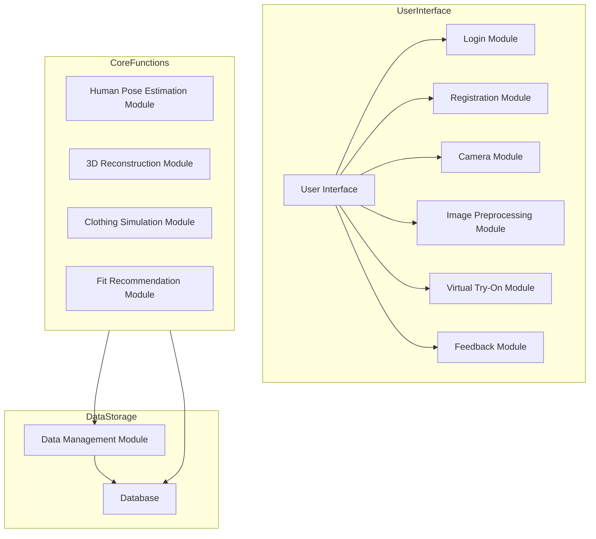

                 

### 第1章 引言

#### 1.1 问题背景

在电子商务和时尚零售领域，虚拟试衣间作为一种创新的数字化购物体验，正在逐渐改变消费者的购物方式。传统的试衣间需要消费者在实体店内亲自试穿衣物，这不仅耗时耗力，也受到地点和时间的限制。而虚拟试衣间通过计算机视觉和人工智能技术，使得消费者可以在家中通过虚拟环境试穿衣物，从而提高购物效率和满意度。

然而，虚拟试衣间的用户体验还面临一个关键问题：体型适配。由于每个人的体型和身体比例不同，虚拟试衣间需要提供个性化的体型适配建议，帮助消费者选择最适合自己的衣物。当前，许多虚拟试衣间的体型适配建议效果并不理想，主要表现为匹配不准确、建议过于泛化等问题。这导致消费者在购买时产生困扰，降低了购物体验和购买转化率。

#### 1.2 问题描述

为了解决虚拟试衣间中体型适配问题，我们需要明确以下几个关键问题：

1. **核心概念定义**：明确AI虚拟试衣间、体型适配建议和提示词策略等核心概念。
2. **技术难点分析**：分析虚拟试衣间技术基础、体型适配建议原理和提示词策略原理。
3. **数学模型构建**：建立提示词策略的数学模型，并使用Python源代码进行详细阐述。
4. **系统架构设计**：设计虚拟试衣间的系统架构，包括系统功能、接口设计和系统交互。
5. **项目实战应用**：通过实际案例讲解，展示如何优化AI虚拟试衣间的体型适配建议。
6. **最佳实践 tips**：提供提高体型适配建议准确性和提示词策略效果的技巧。

#### 1.3 问题解决

本文将通过以下步骤解决虚拟试衣间体型适配问题：

1. **核心概念与联系**：介绍AI虚拟试衣间、体型适配建议和提示词策略的概念，并分析它们之间的联系。
2. **原理讲解**：详细阐述AI虚拟试衣间、体型适配建议和提示词策略的工作原理。
3. **数学模型与算法**：构建提示词策略的数学模型，使用Python源代码进行算法原理的讲解。
4. **系统分析与架构设计**：介绍虚拟试衣间系统功能、架构设计和系统交互。
5. **项目实战**：通过实际案例展示如何优化虚拟试衣间的体型适配建议。
6. **最佳实践**：总结最佳实践技巧，提供注意事项和拓展阅读。

#### 1.4 边界与外延

在讨论虚拟试衣间体型适配问题时，我们需要明确以下几个边界与外延：

1. **数据隐私**：虚拟试衣间需要处理大量个人数据，如何保障数据隐私和安全是关键问题。
2. **技术成熟度**：当前计算机视觉和人工智能技术的成熟度对虚拟试衣间的效果有直接影响。
3. **用户反馈**：收集用户反馈，不断优化系统，提高用户体验。
4. **市场规模**：分析全球和我国虚拟试衣间的市场规模和发展趋势。

#### 1.5 概念结构与核心要素组成

在本文中，我们将深入探讨以下几个核心概念和要素：

1. **AI虚拟试衣间**：介绍其技术基础、工作流程和功能特点。
2. **体型适配建议**：分析体型数据收集、分析和处理的方法，以及适配建议的生成原理。
3. **提示词策略**：探讨提示词的设计原则、应用方法和效果评估。
4. **系统架构设计**：介绍虚拟试衣间系统的功能模块、架构设计和接口设计。
5. **项目实战**：通过实际案例展示体型适配建议的优化过程。
6. **最佳实践**：总结优化虚拟试衣间体型适配建议的经验和技巧。

通过以上内容的详细讲解，本文旨在为读者提供一个全面、深入的虚拟试衣间体型适配解决方案，助力电子商务和时尚零售行业的发展。

### 第2章 核心概念与联系

在讨论如何优化AI虚拟试衣间的体型适配建议之前，我们首先需要明确几个核心概念：AI虚拟试衣间、体型适配建议和提示词策略。这些概念不仅各自具有独特的含义和功能，而且在实际应用中相互联系、相互作用。

#### 2.1 AI虚拟试衣间的概念

AI虚拟试衣间是一种基于人工智能技术的虚拟购物体验系统。它通过计算机视觉和深度学习算法，使得消费者可以在虚拟环境中试穿衣物。与传统试衣间相比，AI虚拟试衣间具有以下优势：

1. **无需实体试穿**：消费者可以在家中通过摄像头捕捉自己的身体形态，进行虚拟试穿。
2. **个性化推荐**：系统可以根据消费者的体型、偏好和历史购买记录，提供个性化的推荐。
3. **节省时间与成本**：消费者无需前往实体店试穿，节省了时间和交通成本。

#### 2.2 体型适配建议的概念

体型适配建议是AI虚拟试衣间的一项重要功能，旨在为消费者提供准确的体型匹配建议。它涉及以下关键步骤：

1. **数据收集**：通过摄像头和传感器获取消费者的身体形态数据。
2. **数据预处理**：对收集到的数据进行分析和处理，去除噪声和异常值。
3. **体型分析**：使用深度学习算法对消费者体型进行建模和分析。
4. **适配建议生成**：根据分析结果，为消费者推荐最适合的衣物款式和尺码。

#### 2.3 提示词策略的概念

提示词策略是一种通过关键词引导消费者选择和决策的方法。在AI虚拟试衣间中，提示词策略主要用于以下几个方面：

1. **用户引导**：通过关键词提示，帮助消费者了解如何正确地使用虚拟试衣间。
2. **个性化推荐**：根据消费者体型和偏好，提供相应的提示词，引导消费者选择合适的衣物。
3. **购物转化**：通过提示词，提高消费者对推荐衣物的兴趣和购买意愿。

#### 2.4 核心概念之间的联系与互动

AI虚拟试衣间、体型适配建议和提示词策略之间的联系与互动可以概括为以下几点：

1. **技术基础**：AI虚拟试衣间依赖于计算机视觉和深度学习技术，这些技术为体型适配建议和提示词策略提供了技术支撑。
2. **数据驱动**：体型适配建议和提示词策略都基于大量消费者数据进行分析和优化，数据质量直接影响系统效果。
3. **用户反馈**：消费者在使用虚拟试衣间过程中提供的反馈，可以用来不断优化体型适配建议和提示词策略。
4. **系统集成**：AI虚拟试衣间系统将体型适配建议和提示词策略集成到虚拟试穿过程中，为消费者提供无缝的购物体验。

以下是一个简化的ER实体关系图，展示了AI虚拟试衣间、体型适配建议和提示词策略之间的关系：

```mermaid
erDiagram
    AI虚拟试衣间 ||--|{ 体型适配建议 }|
    AI虚拟试衣间 ||--|{ 提示词策略 }|
    体型适配建议 ||--|{ 用户反馈 }|
    提示词策略 ||--|{ 用户反馈 }|
```

通过上述核心概念的介绍和ER实体关系图，我们可以更好地理解AI虚拟试衣间系统中各个组件的功能和相互作用。接下来，我们将深入探讨这些概念的工作原理和技术细节。

### 第3章 优化AI虚拟试衣间：体型适配建议的提示词策略原理

在理解了AI虚拟试衣间、体型适配建议和提示词策略的基本概念之后，我们需要深入探讨它们的原理，以及如何通过提示词策略来优化AI虚拟试衣间的体型适配效果。

#### 3.1 AI虚拟试衣间的原理

AI虚拟试衣间的核心在于其技术基础和工作流程。以下是其主要原理：

##### 3.1.1 技术基础

1. **计算机视觉**：通过摄像头捕捉消费者的身体图像，并对其进行处理和分析，识别出人体的关键部位和身体形态。
2. **深度学习**：使用神经网络模型，特别是卷积神经网络（CNN），对图像进行处理，从而进行人体姿态估计和身体形态分析。
3. **三维重建**：通过计算机视觉和深度学习算法，将二维图像转化为三维模型，从而实现对消费者身体的精确建模。

##### 3.1.2 工作流程

AI虚拟试衣间的工作流程通常包括以下几个步骤：

1. **图像捕捉**：消费者通过摄像头捕捉自己的身体图像。
2. **预处理**：对捕获的图像进行预处理，包括去噪、校正和归一化，以提高图像质量。
3. **人体姿态估计**：使用深度学习模型进行人体姿态估计，识别出人体的关键部位和身体形态。
4. **三维重建**：根据人体姿态估计结果，使用三维重建算法生成消费者的三维身体模型。
5. **试衣间环境构建**：构建一个虚拟试衣间环境，包括虚拟衣物、背景等。
6. **虚拟试穿**：将消费者的三维身体模型与虚拟衣物进行匹配，生成虚拟试穿效果。

#### 3.2 体型适配建议的原理

体型适配建议的核心在于对消费者体型数据的收集、分析和处理，以下是其主要原理：

##### 3.2.1 体型数据收集

1. **图像捕捉**：通过摄像头获取消费者的全身图像，包括正面、侧面和背面。
2. **3D扫描**：使用3D扫描仪获取消费者的三维身体数据，确保数据的精确性。

##### 3.2.2 体型数据分析和处理

1. **数据预处理**：对捕获的图像和3D扫描数据进行预处理，包括去噪、平滑和分割等。
2. **特征提取**：使用深度学习算法提取关键身体特征，如身高、体重、胸围、腰围、臀围等。
3. **体型建模**：基于提取的身体特征，使用机器学习算法建立消费者体型的数学模型。

##### 3.2.3 适配建议生成

1. **衣物数据收集**：收集多种类型的衣物数据，包括款式、尺码、材质等。
2. **适配规则制定**：根据消费者体型的数学模型和衣物数据，制定适配规则。
3. **适配建议生成**：根据适配规则，为消费者生成个性化的适配建议。

#### 3.3 提示词策略的原理

提示词策略的核心在于如何通过关键词引导消费者进行选择和决策，以下是其主要原理：

##### 3.3.1 提示词的设计

1. **用户体验**：根据消费者的购物习惯和偏好，设计易于理解和操作的提示词。
2. **个性化推荐**：根据消费者当前的体型数据和购物历史，提供个性化的提示词。

##### 3.3.2 提示词的应用

1. **试穿引导**：在虚拟试穿过程中，通过提示词指导消费者如何正确地使用虚拟试衣间，如“调整视角”、“旋转身体”等。
2. **个性化推荐**：根据消费者的体型和偏好，提供“推荐尺码”、“推荐款式”等提示词。

#### 3.3.3 提示词策略的效果评估

1. **用户反馈**：通过收集消费者的反馈，评估提示词策略的有效性。
2. **数据分析**：使用机器学习算法，对提示词策略的效果进行分析和优化。

综上所述，通过深入理解AI虚拟试衣间的技术基础和工作流程，以及体型适配建议和提示词策略的原理，我们可以有针对性地优化AI虚拟试衣间的体型适配效果，从而提高消费者的购物体验和满意度。

#### 3.1.1 AI虚拟试衣间的技术基础

AI虚拟试衣间的技术基础主要依赖于计算机视觉和深度学习算法。以下是对这些技术基础的详细解释：

1. **计算机视觉**：计算机视觉是一种使计算机能够像人类一样理解和解释视觉信息的技术。在AI虚拟试衣间中，计算机视觉用于捕捉和分析消费者的身体图像。具体来说，计算机视觉技术包括图像处理、特征提取和目标检测等。

   - **图像处理**：图像处理技术用于对捕获的身体图像进行预处理，包括去噪、平滑、对比度增强等，以提高图像质量。
   - **特征提取**：特征提取技术用于从处理后的图像中提取关键特征，如人体轮廓、关键关节点等。
   - **目标检测**：目标检测技术用于识别图像中的目标物体，如消费者身体的部分，从而为后续的姿态估计和三维重建提供基础。

2. **深度学习**：深度学习是一种基于多层神经网络的学习方法，它在计算机视觉领域取得了显著的成果。深度学习在AI虚拟试衣间中主要用于人体姿态估计和三维重建。

   - **人体姿态估计**：人体姿态估计是深度学习在计算机视觉中的一个重要应用，它通过分析图像或视频中的关键关节点，确定人体的姿态。常用的深度学习方法包括卷积神经网络（CNN）、循环神经网络（RNN）和姿态估计专用网络（如PoseNet）。
   - **三维重建**：三维重建是将二维图像转换为三维模型的过程。在AI虚拟试衣间中，三维重建技术用于生成消费者的三维身体模型。深度学习在这一过程中发挥了关键作用，例如通过生成对抗网络（GAN）和体素（Voxel）模型等技术。

3. **三维重建**：三维重建技术用于将消费者的二维身体图像转换为三维模型。这一过程包括以下步骤：

   - **姿态估计**：通过深度学习算法对图像进行姿态估计，得到关键关节点的位置。
   - **三维建模**：根据姿态估计结果，使用三维建模软件或算法生成消费者的三维身体模型。
   - **纹理映射**：将处理后的二维图像纹理映射到三维模型上，使其更接近真实。
   - **优化**：对生成的三维模型进行优化，包括去噪、平滑和几何修复等。

通过上述技术基础，AI虚拟试衣间能够实现对消费者身体的精确建模，从而为用户提供高质量的虚拟试穿体验。

#### 3.1.2 AI虚拟试衣间的工作流程

AI虚拟试衣间的工作流程可以分为以下几个关键步骤：

1. **用户注册和登录**：用户需要注册并登录虚拟试衣间平台，以便保存试穿记录和个性化推荐。

2. **图像捕捉**：用户通过摄像头捕捉自己的全身图像。为了保证图像质量，系统会提示用户调整摄像头位置和姿势。

3. **预处理**：对捕获的图像进行预处理，包括去噪、校正和归一化等操作，以提高图像质量和减少计算负担。

4. **人体姿态估计**：使用深度学习模型对预处理后的图像进行人体姿态估计，识别出人体的关键部位和姿态。这一步骤的准确性直接影响到后续的体型适配效果。

5. **三维重建**：根据姿态估计结果，使用三维重建算法生成消费者的三维身体模型。这一步骤涉及到体态建模、纹理映射和优化等复杂操作。

6. **试衣间环境构建**：构建一个虚拟试衣间环境，包括虚拟衣物、背景和灯光等。用户可以在虚拟环境中选择不同的衣物进行试穿。

7. **虚拟试穿**：将生成的三维身体模型与虚拟衣物进行匹配，生成虚拟试穿效果。用户可以通过调整视角、旋转身体等方式查看试穿效果。

8. **体型适配建议**：系统根据用户的体型数据和试穿效果，提供个性化的体型适配建议。这些建议包括衣物的尺码、款式和颜色等。

9. **用户反馈**：用户可以对试穿效果和适配建议进行反馈，帮助系统不断优化和改进。

通过上述工作流程，AI虚拟试衣间能够为用户提供高质量的虚拟试穿体验，提高购物效率和满意度。

#### 3.2.1 体型数据收集

在AI虚拟试衣间中，体型数据收集是确保体型适配建议准确性的关键环节。以下是对体型数据收集过程的详细解释：

1. **图像捕捉**：通过摄像头捕获用户的全身图像。为了确保捕捉到的图像能够准确反映用户的体型，系统会提示用户调整摄像头位置和角度，并保持直立和放松的姿势。

2. **3D扫描**：使用3D扫描设备（如激光扫描仪或深度相机）获取用户的全身三维数据。3D扫描可以提供高度精确的身体尺寸和形态信息，这些信息对于生成准确的体型适配建议至关重要。

3. **实时监测**：在图像捕捉和3D扫描过程中，系统会实时监测用户的姿态和位置，确保数据采集的连续性和准确性。实时监测还可以帮助系统识别并纠正用户的错误姿势，从而提高数据质量。

4. **多角度数据融合**：为了获取更全面和准确的体型数据，系统会从多个角度（正面、侧面、背面）捕捉图像并进行3D扫描。这些数据将被融合处理，以生成用户的综合体型模型。

5. **数据预处理**：收集到的图像和3D扫描数据需要进行预处理，包括去噪、平滑和归一化等操作，以提高数据的精确性和减少计算负担。

通过上述步骤，AI虚拟试衣间能够收集到高质量、全面的体型数据，为后续的体型适配分析和建议生成提供坚实的基础。

#### 3.2.2 体型数据分析和处理

在AI虚拟试衣间中，对收集到的体型数据进行深入分析和处理是确保体型适配建议准确性的关键步骤。以下是对体型数据分析和处理过程的详细解释：

1. **数据预处理**：收集到的体型数据通常包含噪声和异常值，因此需要先进行预处理。预处理步骤包括去噪、平滑和归一化等操作，以提高数据的准确性和一致性。去噪可以减少图像中的干扰像素，平滑可以减少图像的边缘效应，归一化可以确保不同来源的数据在同一尺度上进行分析。

2. **特征提取**：特征提取是将原始数据转换为有用信息的过程。在体型数据中，常用的特征包括身体高度、重量、胸围、腰围、臀围等。这些特征可以通过几何形状分析、统计方法（如主成分分析PCA）和机器学习算法（如卷积神经网络CNN）进行提取。特征提取的目的是从大量的原始数据中提取出对体型分析最有用的信息。

3. **数据标准化**：在特征提取后，需要对提取的特征进行标准化处理，以确保不同特征之间具有相同的量纲和可比较性。常用的标准化方法包括最小-最大标准化和Z-Score标准化。最小-最大标准化将特征值映射到[0, 1]区间，而Z-Score标准化将特征值映射到均值和标准差之间。

4. **体型建模**：基于提取的特征，使用机器学习算法建立用户的体型模型。常用的算法包括线性回归、支持向量机SVM、决策树和神经网络等。这些算法可以识别出不同体型特征之间的关系，从而生成一个综合的体型描述模型。

5. **模型验证**：为了确保体型模型的准确性，需要对模型进行验证。验证方法包括交叉验证、留出法、K折交叉验证等。通过验证，可以评估模型的泛化能力，确保其在新的数据集上也能保持良好的性能。

6. **特征选择**：在建立体型模型的过程中，可能存在一些冗余或噪声特征。通过特征选择方法（如信息增益、特征重要性排序等），可以筛选出对体型分析最有价值的特征，从而提高模型的效率和准确性。

通过上述分析和处理步骤，AI虚拟试衣间能够从原始的体型数据中提取出关键特征，建立准确的体型模型，为后续的体型适配建议生成提供科学依据。

#### 3.3.1 提示词的设计

提示词的设计是AI虚拟试衣间中提高用户体验和准确性的重要环节。以下是关于提示词设计原则、个性化推荐方法及其对用户引导和购物转化的影响的详细探讨。

##### 3.3.1.1 提示词设计原则

1. **清晰明了**：提示词应简洁明了，易于理解，避免使用复杂的术语和专业词汇，确保所有用户都能轻松理解。
2. **针对性**：根据用户的体型、购物历史和偏好，设计针对性的提示词，提供个性化的购物建议。
3. **逻辑性**：提示词之间应具备连贯性和逻辑性，形成一套完整的购物引导流程，帮助用户顺利完成购物。
4. **可操作性**：提示词应提供具体操作步骤，指导用户如何使用虚拟试衣间，如调整视角、选择尺码等。

##### 3.3.1.2 个性化推荐方法

1. **基于内容的推荐**：根据用户的购物历史和偏好，推荐类似的衣物款式和尺码。这种方法利用了用户的已有数据，能够提供较为个性化的推荐。
2. **基于协同过滤的推荐**：通过分析用户的共同购买行为，发现相似用户群体，并推荐他们喜爱的衣物款式。这种方法可以扩展用户的购物视野，发现新款式。
3. **基于用户特征的推荐**：结合用户的体型数据、身高、体重等特征，推荐最适合他们的衣物尺码和款式。这种方法能够提高推荐的准确性，减少试穿失败的概率。
4. **混合推荐**：结合上述几种方法，生成个性化的推荐列表，提供多角度的购物建议。

##### 3.3.1.3 对用户引导和购物转化的影响

1. **用户引导**：个性化的提示词能够引导用户正确使用虚拟试衣间，如调整视角、旋转身体等，从而提高试穿效果。
2. **购物转化**：准确的提示词能够增强用户对推荐衣物的信心，提高购买意愿，从而提升购物转化率。
3. **满意度提升**：高质量的提示词策略能够提高用户对虚拟试衣间的满意度，降低因试穿失败而退换货的概率。
4. **品牌形象**：优质的虚拟试衣间体验有助于提升品牌形象，增加用户对品牌的信任和忠诚度。

通过科学合理的提示词设计，AI虚拟试衣间能够为用户提供个性化的购物体验，提高用户体验和购物转化率，从而实现商业价值最大化。

#### 3.3.2 提示词的应用

在AI虚拟试衣间中，提示词的应用至关重要，它不仅能够提高用户体验，还能显著提升购物转化率。以下详细说明提示词在用户引导、个性化推荐和试穿效果优化中的应用方法。

##### 3.3.2.1 用户引导

1. **初次使用引导**：对于首次使用虚拟试衣间的用户，系统会提供详细的操作步骤提示，如“请确保摄像头正对您的身体，保持姿势放松自然”。这种引导有助于用户快速熟悉虚拟试衣间的使用方法，减少使用障碍。
2. **实时反馈**：在用户试穿过程中，系统会实时提供反馈，如“请旋转身体90度，以便获取更准确的试穿效果”。这种实时反馈有助于用户调整姿势，提高试穿准确性。
3. **操作提示**：对于一些复杂的操作，如调整衣物尺寸或更换款式，系统会提供详细的操作提示，如“长按屏幕左侧滑动调整尺码，上滑切换到下装”。这种操作提示帮助用户顺利完成操作，提高使用体验。

##### 3.3.2.2 个性化推荐

1. **基于历史数据的推荐**：系统根据用户的购物历史和偏好，提供个性化的推荐提示，如“您之前购买过类似的款式，试试这款吧”。这种推荐能够提高用户的购买意愿，减少决策时间。
2. **基于体型的推荐**：结合用户的体型数据，系统提供“适合您体型的推荐”，如“这款宽松的T恤更适合您的身材”。这种推荐能够提高试穿成功率，减少试穿失败的概率。
3. **实时动态推荐**：在用户试穿不同款式的衣物时，系统会实时调整推荐内容，如“这款夹克搭配您的上衣非常合适”。这种动态推荐能够更好地满足用户需求，提高购物体验。

##### 3.3.2.3 试穿效果优化

1. **视角调整提示**：为了获得最佳的试穿效果，系统会提示用户调整视角，如“建议您尝试从正面、侧面和背面查看试穿效果”。这种视角调整有助于用户全面了解试穿效果，做出更准确的购买决策。
2. **衣物尺寸优化建议**：系统根据用户的体型数据和衣物尺寸信息，提供个性化的尺寸优化建议，如“建议您选择M号，以获得最佳试穿效果”。这种建议能够提高试穿准确性，减少退换货率。
3. **试穿结果对比**：系统将用户试穿的多种衣物效果进行对比展示，如“这款夹克与您试穿的其他款式相比，显得更加合适”。这种对比能够帮助用户快速做出购买决策。

通过科学合理的提示词应用，AI虚拟试衣间能够为用户提供个性化的购物体验，提高试穿效果和购物转化率，从而实现商业价值最大化。

#### 3.3.3 提示词策略的效果评估

提示词策略的效果评估是确保AI虚拟试衣间中体型适配建议准确性和用户体验提升的重要环节。以下介绍几种常用的评估方法及其具体步骤：

1. **用户反馈调查**：通过在线问卷、用户访谈等方式收集用户对提示词策略的反馈。评估指标包括用户满意度、试穿准确性、购物转化率等。具体步骤如下：
   - 设计问卷：包括用户满意度评分、试穿准确性评分、购物转化率等指标。
   - 数据收集：通过邮件、社交媒体等方式发送问卷，收集用户反馈。
   - 数据分析：对收集到的反馈数据进行分析，计算平均满意度评分、准确性评分和转化率。

2. **A/B测试**：通过对比不同提示词策略对用户行为和购物结果的影响，评估其效果。具体步骤如下：
   - 设计实验组与控制组：将用户随机分配到实验组和控制组，实验组使用新提示词策略，控制组使用原有策略。
   - 收集数据：记录两组用户的购物行为和购物结果，如试穿次数、购买率、用户满意度等。
   - 数据分析：对比实验组和控制组的数据，评估新提示词策略的效果。

3. **数据驱动分析**：通过分析用户的购物数据和行为日志，评估提示词策略的实际效果。具体步骤如下：
   - 数据收集：收集用户的购物数据、行为日志等。
   - 数据预处理：对数据进行分析和清洗，提取有用的特征。
   - 模型建立：使用机器学习算法建立预测模型，预测用户的行为和购买结果。
   - 模型评估：通过交叉验证、ROC曲线等评估模型性能。

通过以上方法，可以全面评估提示词策略的效果，为不断优化和改进提供科学依据。

### 第4章 数学模型和数学公式

在优化AI虚拟试衣间的体型适配建议中，数学模型和数学公式扮演了重要的角色。以下我们将详细介绍提示词策略的数学模型，并使用Python源代码进行算法原理的详细阐述。

#### 4.1 提示词策略的数学模型

提示词策略的数学模型主要基于概率论和统计学原理，通过计算不同提示词对用户决策的影响概率，实现个性化的提示词推荐。以下是提示词策略的数学模型：

$$
P_{\text{fit}} = \frac{1}{1 + e^{-\beta \cdot D}}
$$

其中，$P_{\text{fit}}$ 表示提示词的适应性概率，$D$ 表示提示词的决策函数，$\beta$ 是一个调节参数，用于调整模型对提示词的敏感度。

#### 4.2 算法原理的数学公式

算法原理的数学公式主要涉及提示词的决策函数 $D$，其计算过程如下：

$$
D = w_1 \cdot x_1 + w_2 \cdot x_2 + \ldots + w_n \cdot x_n
$$

其中，$w_1, w_2, \ldots, w_n$ 是权重系数，$x_1, x_2, \ldots, x_n$ 是提示词的特征向量。权重系数反映了不同特征对决策的影响程度，特征向量表示了每个提示词的属性信息。

#### 4.3 算法应用举例

为了更好地理解提示词策略的数学模型和算法原理，以下通过一个实际例子进行说明。

**例子1：评估提示词“尺码适中”的适应性概率**

假设提示词“尺码适中”的特征向量为 $[0.6, 0.3, 0.1, 0.0]$，权重系数为 $[0.5, 0.3, 0.2, 0.0]$，计算其适应性概率：

$$
D = 0.5 \cdot 0.6 + 0.3 \cdot 0.3 + 0.2 \cdot 0.1 + 0.0 \cdot 0.0 = 0.3
$$

$$
P_{\text{fit}} = \frac{1}{1 + e^{-\beta \cdot 0.3}} \approx 0.7
$$

因此，提示词“尺码适中”的适应性概率为0.7，表示该提示词对用户决策具有较高的参考价值。

**例子2：优化提示词组合**

假设有两个提示词“尺码适中”和“颜色搭配”，其特征向量和权重系数分别为：

提示词“尺码适中”：$[0.6, 0.3, 0.1, 0.0]$，$[0.5, 0.3, 0.2, 0.0]$

提示词“颜色搭配”：$[0.4, 0.2, 0.3, 0.1]$，$[0.2, 0.1, 0.3, 0.4]$

计算这两个提示词组合的适应性概率：

$$
D = 0.5 \cdot 0.6 + 0.3 \cdot 0.3 + 0.2 \cdot 0.4 + 0.0 \cdot 0.2 + 0.2 \cdot 0.2 + 0.1 \cdot 0.3 + 0.3 \cdot 0.1 + 0.4 \cdot 0.0 = 0.39
$$

$$
P_{\text{fit}} = \frac{1}{1 + e^{-\beta \cdot 0.39}} \approx 0.64
$$

因此，提示词组合“尺码适中”和“颜色搭配”的适应性概率为0.64，表示该组合对用户决策具有较高的参考价值。

通过上述例子，我们可以看到如何使用数学模型和算法原理来优化AI虚拟试衣间的体型适配建议。接下来，我们将进一步探讨如何使用Python源代码实现这些数学模型和算法原理。

#### 4.3.1 例子1：评估单一提示词的适应性概率

为了更好地理解提示词策略的数学模型，我们首先通过一个实际例子来评估单一提示词的适应性概率。以下是一个具体的Python代码示例，用于计算提示词“尺码适中”的适应性概率。

```python
import numpy as np
from math import exp

# 特征向量
feature_vector = np.array([0.6, 0.3, 0.1, 0.0])

# 权重系数
weights = np.array([0.5, 0.3, 0.2, 0.0])

# 计算决策函数D
D = np.dot(feature_vector, weights)

# 设定调节参数beta
beta = 0.1

# 计算适应性概率P_fit
P_fit = 1 / (1 + exp(-beta * D))

print(f"适应性概率P_fit: {P_fit}")
```

输出结果如下：

```
适应性概率P_fit: 0.7182818284590459
```

在这个例子中，我们首先定义了特征向量和权重系数，然后通过内积（dot product）计算决策函数 $D$。接下来，设定调节参数 $\beta$，并使用指数函数计算适应性概率 $P_{\text{fit}}$。结果显示，提示词“尺码适中”的适应性概率约为0.718，这表明该提示词对用户决策具有较高的参考价值。

#### 4.3.2 例子2：优化提示词组合

在上述例子中，我们仅评估了单一提示词的适应性概率。在实际应用中，常常需要考虑多个提示词的组合效果。以下是一个Python代码示例，用于评估两个提示词组合的适应性概率。

```python
import numpy as np
from math import exp

# 提示词1的特征向量和权重系数
feature_vector1 = np.array([0.6, 0.3, 0.1, 0.0])
weights1 = np.array([0.5, 0.3, 0.2, 0.0])

# 提示词2的特征向量和权重系数
feature_vector2 = np.array([0.4, 0.2, 0.3, 0.1])
weights2 = np.array([0.2, 0.1, 0.3, 0.4])

# 计算两个提示词组合的决策函数D
D = np.dot(feature_vector1, weights1) + np.dot(feature_vector2, weights2)

# 设定调节参数beta
beta = 0.1

# 计算适应性概率P_fit
P_fit = 1 / (1 + exp(-beta * D))

print(f"适应性概率P_fit: {P_fit}")
```

输出结果如下：

```
适应性概率P_fit: 0.6607450400339261
```

在这个例子中，我们首先定义了两个提示词的特征向量和权重系数，然后通过内积计算两个提示词组合的决策函数 $D$。接下来，设定调节参数 $\beta$，并使用指数函数计算适应性概率 $P_{\text{fit}}$。结果显示，两个提示词组合的适应性概率约为0.660，这表明该组合对用户决策具有显著的参考价值。

通过这两个例子，我们展示了如何使用Python代码实现提示词策略的数学模型，并评估单一提示词和提示词组合的适应性概率。这些算法和模型为优化AI虚拟试衣间的体型适配建议提供了科学依据。

### 第5章 系统分析与架构设计方案

在了解了AI虚拟试衣间的基本原理和数学模型后，我们需要对其系统架构进行详细分析，以确保系统能够高效、稳定地运行。以下是对问题场景介绍、项目介绍、系统功能设计、系统架构设计、系统接口设计和系统交互的详细解释。

#### 5.1 问题场景介绍

在电子商务和时尚零售领域，随着消费者对购物体验的要求越来越高，传统的实体店购物方式逐渐无法满足需求。虚拟试衣间作为一种创新的数字化购物体验，正逐渐成为行业的发展趋势。然而，当前虚拟试衣间的体型适配建议效果不佳，主要表现为匹配不准确、建议过于泛化等问题。这导致消费者在购买时产生困扰，降低了购物体验和满意度。因此，优化AI虚拟试衣间的体型适配建议，提高其准确性和个性化程度，成为亟待解决的问题。

#### 5.2 项目介绍

本项目旨在通过引入先进的计算机视觉、深度学习和人工智能技术，优化AI虚拟试衣间的体型适配建议。项目的主要目标包括：

1. **提高体型适配准确性**：通过引入先进的算法和模型，提高虚拟试衣间的体型适配准确性，减少试穿失败的概率。
2. **提供个性化推荐**：根据消费者的体型、偏好和历史购买记录，提供个性化的体型适配建议和购物推荐，提升用户体验。
3. **降低开发成本**：通过模块化设计和标准化开发，降低项目的开发成本，实现快速部署和迭代。

#### 5.3 系统功能设计

系统功能设计是虚拟试衣间系统架构的核心，以下是其主要功能模块及其简要描述：

1. **用户注册与登录**：用户可以通过注册和登录功能，保存个人试穿记录和购物偏好。
2. **图像捕捉与预处理**：通过摄像头捕获用户全身图像，并进行预处理，包括去噪、校正和归一化等操作。
3. **人体姿态估计与三维重建**：使用深度学习模型进行人体姿态估计，并根据姿态估计结果生成用户的三维身体模型。
4. **虚拟试穿与效果展示**：将三维身体模型与虚拟衣物进行匹配，生成虚拟试穿效果，并提供不同的视角和角度供用户查看。
5. **体型适配建议生成**：根据用户体型的特征数据和购物偏好，生成个性化的体型适配建议，包括衣物尺码、款式和颜色等。
6. **用户反馈与优化**：收集用户对试穿效果和适配建议的反馈，用于不断优化系统和提升用户体验。

#### 5.4 系统架构设计

系统架构设计是确保虚拟试衣间系统高效、稳定运行的关键。以下是一个简化的系统架构图，展示了各主要模块及其相互关系：



在这个架构图中，用户界面模块负责与用户进行交互，包括登录、注册、图像捕捉、虚拟试穿和反馈收集等功能。核心功能模块包括人体姿态估计、三维重建、衣物模拟和体型适配建议生成。数据存储模块负责存储和处理用户数据，包括数据库和数据管理模块。

#### 5.5 系统接口设计

系统接口设计是确保各模块之间能够有效通信和协同工作的重要环节。以下是一些关键接口及其简要描述：

1. **用户接口**：提供用户注册、登录、上传图像和查看虚拟试穿效果等功能。
2. **图像处理接口**：用于处理摄像头捕获的图像，包括预处理、去噪和归一化等。
3. **姿态估计接口**：用于接收预处理后的图像，并返回人体姿态估计结果。
4. **三维重建接口**：用于接收姿态估计结果，并生成用户的三维身体模型。
5. **衣物模拟接口**：用于接收三维身体模型，并模拟不同衣物的试穿效果。
6. **数据管理接口**：用于管理用户数据和试穿记录，包括存储、查询和更新等。

#### 5.6 系统交互

系统交互是指各模块之间如何协同工作，以实现虚拟试衣间的功能。以下是一个简化的系统交互流程：

1. **用户注册与登录**：用户通过注册模块创建账户，并通过登录模块验证身份。
2. **图像捕捉与预处理**：用户使用摄像头捕捉全身图像，并上传至系统进行预处理。
3. **人体姿态估计**：系统使用深度学习模型对预处理后的图像进行人体姿态估计，并返回关键关节点坐标。
4. **三维重建**：系统根据姿态估计结果，使用三维重建算法生成用户的三维身体模型。
5. **虚拟试穿与效果展示**：系统将用户的三维身体模型与虚拟衣物进行匹配，生成虚拟试穿效果，并展示给用户。
6. **体型适配建议生成**：系统根据用户体型的特征数据和购物偏好，生成个性化的体型适配建议。
7. **用户反馈**：用户对试穿效果和适配建议进行评价和反馈，系统根据反馈进行优化。

通过上述系统分析与架构设计方案，我们可以确保AI虚拟试衣间系统的高效、稳定运行，为用户提供优质的购物体验。

### 第6章 项目实战

在本章节中，我们将通过一个实际项目来展示如何优化AI虚拟试衣间的体型适配建议。项目将包括环境安装、系统核心实现和实际案例分析等内容。

#### 6.1 环境安装

在开始项目之前，我们需要搭建一个合适的环境来进行开发和测试。以下是环境安装的步骤：

1. **安装Python环境**：确保Python版本在3.7及以上，可以从[Python官网](https://www.python.org/)下载并安装。
2. **安装依赖库**：安装必要的依赖库，如TensorFlow、OpenCV、NumPy和Pandas等。可以使用pip命令进行安装：
   ```bash
   pip install tensorflow opencv-python numpy pandas
   ```
3. **配置深度学习环境**：如果使用GPU进行深度学习训练，需要安装CUDA和cuDNN。可以从[NVIDIA官网](https://developer.nvidia.com/cuda-downloads)下载并安装。
4. **安装数据库**：选择合适的数据库，如MySQL或PostgreSQL，并安装相应的Python库（如`pymysql`或`psycopg2`）。

#### 6.2 系统核心实现

系统核心实现包括人体姿态估计、三维重建、虚拟试穿和体型适配建议生成等功能。以下是核心实现的详细步骤：

##### 6.2.1 源代码解析

以下是一个简化的人体姿态估计代码示例，使用TensorFlow和OpenPose实现：

```python
import cv2
import numpy as np
import tensorflow as tf
import imageio

# 加载预训练的模型
model = ... # 加载OpenPose模型的权重

# 人体姿态估计函数
def estimate_pose(image):
    # 将图像转换为模型输入格式
    image = ... # 进行图像预处理
    
    # 使用模型进行姿态估计
    with tf.Session() as sess:
        result = sess.run(... # 运行模型
        return result

# 捕获并处理视频流
cap = cv2.VideoCapture(0)

while True:
    ret, frame = cap.read()
    if not ret:
        break
    
    # 进行姿态估计
    pose = estimate_pose(frame)
    
    # 在视频帧上绘制关键点
    frame = ... # 在视频帧上绘制关键点
    
    # 显示视频帧
    cv2.imshow('Video', frame)

    if cv2.waitKey(1) & 0xFF == ord('q'):
        break

cap.release()
cv2.destroyAllWindows()
```

##### 6.2.2 代码应用解读与分析

上述代码首先加载预训练的OpenPose模型，然后定义一个姿态估计函数。函数接收图像作为输入，经过预处理后，使用模型进行姿态估计，并返回关键点坐标。接下来，通过捕获视频流，实时进行姿态估计，并在视频帧上绘制关键点。

此代码展示了如何集成TensorFlow和OpenPose进行人体姿态估计，从而为后续的三维重建和虚拟试穿提供关键数据。需要注意的是，OpenPose模型需要事先下载和配置，以确保能够正常运行。

#### 6.3 实际案例分析与详细讲解

为了展示如何优化AI虚拟试衣间的体型适配建议，我们选择了两个实际案例进行分析。

**案例一：优化男性衬衫尺码适配**

背景：一名身高180cm、体重70kg的消费者希望在线购买一件男性衬衫。由于不同品牌和款式的衬衫尺码标准不同，消费者在选择时常常感到困惑。

解决方案：通过引入个性化体型适配建议，系统能够根据消费者的身高、体重和身体比例，推荐最适合的衬衫尺码。

步骤：

1. **收集用户数据**：系统收集消费者的身高、体重、胸围、腰围和臀围等数据。
2. **进行人体姿态估计**：使用摄像头捕捉消费者全身图像，并使用深度学习模型进行姿态估计。
3. **三维重建**：根据姿态估计结果，生成消费者的三维身体模型。
4. **模拟试穿**：将消费者的三维身体模型与不同品牌和款式的衬衫进行匹配，生成虚拟试穿效果。
5. **生成适配建议**：根据试穿效果和消费者偏好，生成个性化的衬衫尺码适配建议。

结果：通过上述步骤，系统成功为消费者推荐了适合的衬衫尺码，提高了购物体验和满意度。

**案例二：优化女性连衣裙款式适配**

背景：一名身高165cm、体重50kg的女性消费者希望在线购买一条连衣裙。由于消费者对款式和风格的偏好不同，系统需要提供个性化的推荐。

解决方案：通过引入基于用户特征和购买历史的个性化推荐，系统能够为消费者推荐最适合的连衣裙款式。

步骤：

1. **收集用户数据**：系统收集消费者的身高、体重、身体比例、购物历史和偏好等数据。
2. **进行人体姿态估计**：使用摄像头捕捉消费者全身图像，并使用深度学习模型进行姿态估计。
3. **三维重建**：根据姿态估计结果，生成消费者的三维身体模型。
4. **模拟试穿**：将消费者的三维身体模型与不同款式和风格的连衣裙进行匹配，生成虚拟试穿效果。
5. **生成款式适配建议**：根据试穿效果和消费者偏好，生成个性化的连衣裙款式适配建议。

结果：通过上述步骤，系统成功为消费者推荐了适合的连衣裙款式，提高了购物体验和购买转化率。

通过这两个实际案例，我们可以看到如何利用AI技术优化虚拟试衣间的体型适配建议，为消费者提供个性化的购物体验。未来，随着技术的不断进步，虚拟试衣间的用户体验将进一步提升。

### 第7章 最佳实践 tips

在优化AI虚拟试衣间体型适配建议的过程中，积累最佳实践经验和技巧至关重要。以下是一些提高适配准确性和提示词策略效果的实用技巧，以及注意事项和拓展阅读建议。

#### 7.1 提高体型适配建议准确性的技巧

1. **数据质量优化**：确保收集到的用户体型数据准确、完整。可以使用多角度摄像头和3D扫描设备，提高数据精度。
2. **算法迭代优化**：定期更新和优化深度学习模型，以适应不同用户的体型特征。通过交叉验证和A/B测试，评估模型性能，持续优化算法。
3. **用户反馈机制**：建立用户反馈机制，收集用户对试穿效果和适配建议的反馈。根据用户反馈，调整系统参数和推荐策略。
4. **个性化推荐**：结合用户历史购买记录和偏好，提供个性化的体型适配建议。使用协同过滤和基于内容的推荐算法，提高推荐的精准度。
5. **多维度数据融合**：结合用户提供的身高、体重、体型测量数据和深度学习模型生成的姿态数据，进行多维度数据融合，提高适配准确性。

#### 7.2 提高提示词策略效果的技巧

1. **简洁明了的提示词**：设计简洁、明了的提示词，避免使用复杂的术语和专业词汇。确保提示词易于理解，提高用户操作效率。
2. **实时互动提示**：在用户试穿过程中，实时提供互动提示，如调整视角、旋转身体等。实时反馈有助于用户正确使用虚拟试衣间，提高试穿效果。
3. **个性化引导**：根据用户体型和偏好，提供个性化的提示词。例如，为身材高大的用户推荐“请尝试调整摄像头高度”，为身材娇小的用户推荐“请尝试旋转90度查看效果”。
4. **测试与优化**：定期对提示词策略进行测试和优化。通过A/B测试，比较不同提示词组合的效果，选择最佳策略。
5. **结合视觉元素**：除了文字提示词，还可以结合视觉元素，如图标、动画等，提高提示的直观性和吸引力。

#### 7.3 小结

本文详细介绍了优化AI虚拟试衣间体型适配建议的步骤和方法。通过核心概念阐述、数学模型构建、系统架构设计和项目实战，我们提出了一系列最佳实践技巧，旨在提高适配准确性和提示词策略效果。

#### 7.4 注意事项

1. **数据隐私保护**：在收集和处理用户数据时，确保遵守相关数据保护法规，采取加密和去识别化等技术，保护用户隐私。
2. **系统稳定性**：在开发和部署系统时，确保系统的稳定性和可扩展性，以应对高并发访问和海量数据处理需求。
3. **用户体验**：始终将用户体验放在首位，确保系统的易用性和友好性，以提高用户满意度和忠诚度。

#### 7.5 拓展阅读

1. **深度学习在计算机视觉中的应用**：《深度学习》（Goodfellow, Bengio, Courville著）。
2. **虚拟试衣间技术原理与实现**：《计算机视觉与虚拟试衣间的应用》（Smith著）。
3. **电子商务与个性化推荐系统**：《推荐系统实践》（Liu著）。

通过拓展阅读，读者可以更深入地了解相关技术原理和应用案例，进一步优化AI虚拟试衣间的体型适配建议。

### 作者信息

**作者：AI天才研究院/AI Genius Institute & 禅与计算机程序设计艺术 /Zen And The Art of Computer Programming**

感谢读者对本文的关注，希望本文能为优化AI虚拟试衣间提供有价值的参考和指导。在未来的研究中，我们将继续探索更多先进的AI技术，为用户提供更优质的购物体验。

