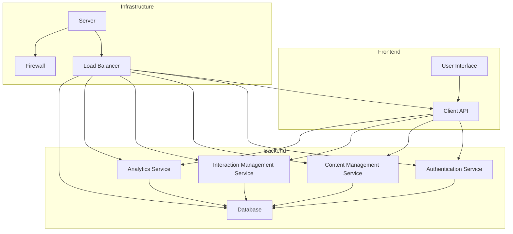
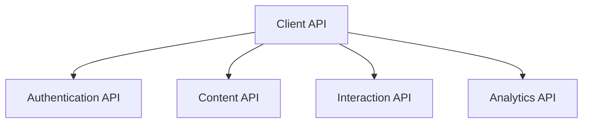
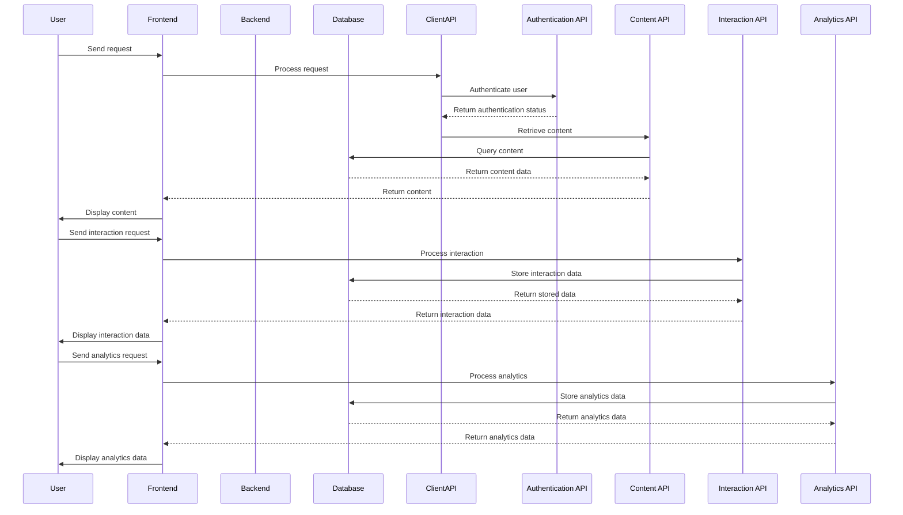

                 


### Introduction

#### The Rise of AI and Virtual Music Festivals

Over the past few years, the music industry has witnessed a remarkable transformation with the emergence of AI and virtual technology. Traditional music festivals, which once relied heavily on physical presence and live performances, have gradually evolved into digital experiences accessible to audiences worldwide. AI has become a driving force behind this transformation, enabling the creation of virtual music festivals that offer immersive and personalized experiences.

Virtual music festivals are events held online, allowing participants to enjoy performances, interact with other attendees, and engage with various content through digital platforms. The integration of AI technology has enhanced these experiences by enabling real-time interaction, personalized recommendations, and adaptive environments.

However, the design of these virtual music festivals presents several challenges. One of the primary challenges is creating an immersive experience that rivals the excitement and energy of live events. Designing an immersive virtual environment requires a deep understanding of user psychology, technical capabilities, and creative problem-solving.

#### Challenges in Designing Immersive Experiences

1. **User Engagement**: Maintaining user engagement in virtual environments can be challenging. Unlike live events, virtual festivals lack the physical presence and immediate sensory experiences that can captivate audiences.
2. **Personalization**: Virtual festivals need to offer personalized experiences to keep users engaged. This requires AI systems to analyze user preferences and behavior, providing tailored content and recommendations.
3. **Interactivity**: Real-time interaction with performers and other attendees is crucial for creating an immersive experience. Designing systems that can handle multiple interactions simultaneously while maintaining responsiveness is a technical challenge.
4. **Accessibility**: Ensuring that virtual music festivals are accessible to all users, including those with disabilities, is an important consideration. This requires thoughtful design that accommodates diverse user needs and preferences.

#### The Role of Prompt Words in Immersive Design

To overcome these challenges and create truly immersive virtual music festivals, the strategic use of prompt words plays a critical role. Prompt words are specific keywords or phrases that guide the design process, influencing the development of user interfaces, content creation, and interaction design.

**Importance of Prompt Words in Immersive Design:**

1. **Guiding Content Creation**: Prompt words help define the tone, style, and content of the virtual environment. They guide creators in developing engaging and relevant content that resonates with the target audience.
2. **Enhancing User Interaction**: Prompt words can enhance user interaction by providing clear instructions and cues. They help users navigate the virtual environment and engage with performers and other attendees more effectively.
3. **Fostering Personalization**: By using prompt words, designers can create personalized experiences that cater to individual user preferences. This can be achieved through AI-driven content recommendations and interactive elements tailored to user behavior.

**Strategies for Effective Prompt Word Design:**

1. **User Research**: Conduct user research to understand user preferences, behaviors, and pain points. Use this information to inform the selection of prompt words.
2. **Contextual Relevance**: Choose prompt words that are contextually relevant to the virtual environment and the user's experience. This ensures that the words are meaningful and helpful to users.
3. **Clarity and Conciseness**: Prompt words should be clear and concise, avoiding ambiguity and complexity. This helps users easily understand and interact with the virtual environment.
4. **Experimentation and Iteration**: Test different prompt words and their impact on user engagement and experience. Iterate on the design based on user feedback to refine the prompt words and overall experience.

In conclusion, the rise of AI and virtual technology has revolutionized the music festival industry. However, designing immersive virtual experiences presents several challenges. The strategic use of prompt words can help overcome these challenges and create engaging, personalized, and accessible virtual music festivals. This book will explore the concepts, strategies, and techniques for designing immersive virtual music festivals using prompt words, providing a comprehensive guide for industry professionals and enthusiasts alike.

---

### Keywords

- **AI and Virtual Music Festivals**
- **Immersive Experience Design**
- **Prompt Words**
- **User Engagement**
- **Personalization**
- **Accessibility**

### Abstract

This book explores the intersection of AI and virtual music festivals, focusing on the design of immersive experiences. It delves into the challenges of creating engaging virtual environments and highlights the role of prompt words in guiding the design process. Through a comprehensive analysis of core concepts, design strategies, and technical implementation, the book provides practical insights and techniques for designing successful virtual music festivals that resonate with audiences worldwide. By understanding the importance of prompt words and their application in immersive design, readers will gain the knowledge and skills needed to create captivating virtual experiences.

---

### Core Concepts

#### AI and Virtual Music Festivals

Artificial Intelligence (AI) has become an integral part of the music festival industry, transforming the way events are planned, executed, and experienced. At its core, AI refers to the simulation of human intelligence in machines that are programmed to think, learn, and adapt like humans. This technology has found diverse applications in virtual music festivals, enhancing user engagement and creating immersive experiences.

**Introduction to AI**

AI encompasses various techniques and methodologies, including machine learning, natural language processing, computer vision, and deep learning. These techniques enable machines to perform tasks that typically require human intelligence, such as recognizing patterns, making decisions, and generating content.

**Virtual Music Festivals: A Brief History**

Virtual music festivals have evolved significantly over the past decade. Initially, these events were limited to streaming live performances online. However, with the advancements in technology, virtual music festivals have become more interactive, offering real-time interaction, personalized content, and immersive experiences.

**The Intersection of AI and Virtual Music Festivals**

The integration of AI technology in virtual music festivals has brought about several transformative changes:

1. **Personalization**: AI algorithms analyze user data to provide personalized recommendations, ensuring that each attendee experiences a tailored festival. This can include personalized playlists, interactive performances, and personalized chatbots that offer recommendations and engage with users.
2. **Interactive Environments**: AI-powered virtual environments enable real-time interaction with performers and other attendees. This can include virtual meetups, live Q&A sessions, and interactive games, creating a sense of community and enhancing user engagement.
3. **Enhanced Security**: AI technologies are used to enhance security measures, protecting user data and preventing fraud. This can include facial recognition, behavioral analysis, and automated threat detection.
4. **Real-Time Analytics**: AI algorithms analyze real-time data to provide insights into user behavior and preferences. This information can be used to optimize the festival experience, identify areas for improvement, and make data-driven decisions.

**AI Technologies in Virtual Music Festivals**

1. **Machine Learning**: Machine learning algorithms are used to analyze user data, predict user behavior, and personalize content. This can include playlist recommendations, personalized chatbots, and interactive games.
2. **Natural Language Processing (NLP)**: NLP techniques enable machines to understand and generate human language, facilitating real-time interaction with users. This can include chatbots, voice assistants, and language translation.
3. **Computer Vision**: Computer vision techniques are used to analyze video feeds, enabling real-time tracking of attendees, object recognition, and augmented reality experiences.
4. **Deep Learning**: Deep learning algorithms are used to process and analyze large amounts of data, enabling advanced features such as natural language understanding, image recognition, and speech recognition.

**Future Trends**

The future of AI and virtual music festivals is promising. As technology continues to advance, we can expect to see even more sophisticated and immersive experiences. Some potential future trends include:

1. **Augmented Reality (AR)**: AR technology can enhance virtual music festivals by overlaying digital content onto the real world. This can include virtual stages, interactive objects, and augmented reality performances.
2. **Virtual Reality (VR)**: VR technology can provide a fully immersive experience, allowing users to experience virtual music festivals in a three-dimensional space. This can include virtual stages, concerts, and interactive environments.
3. **Blockchain**: Blockchain technology can be used to enhance security, transparency, and authenticity in virtual music festivals. This can include decentralized ticketing systems, immutable event records, and digital provenance for artists' work.
4. **Collaborative AI**: Collaborative AI systems can leverage the power of multiple AI algorithms to provide more accurate and comprehensive insights. This can include collaborative filtering for personalized recommendations, real-time event analysis, and automated content creation.

In conclusion, AI has revolutionized the music festival industry, enabling the creation of virtual events that offer immersive, personalized, and interactive experiences. As technology continues to advance, we can expect to see even more innovative applications of AI in virtual music festivals, enhancing the way we experience and enjoy music.

---

#### Immersive Experience Design

**Definition and Importance**

Immersive experience design refers to the process of creating environments, products, or services that fully engage users' senses and emotions, transporting them into a different world. In the context of virtual music festivals, this means designing an experience that feels as real and engaging as a live event. Immersive design is crucial because it can significantly enhance user satisfaction, engagement, and loyalty.

**Principles of Immersive Experience Design**

1. **Sensory Engagement**: Effective immersive design engages all the user's senses—sight, sound, touch, taste, and smell. In a virtual music festival, this can be achieved through high-quality audio and video, interactive visuals, and even simulated scents or weather effects.
2. **Spatial Awareness**: Users should feel a sense of spatial awareness within the virtual environment. This can be achieved through realistic 3D graphics, accurate soundscapes, and physically accurate physics simulations.
3. **Storytelling**: A compelling narrative or story can enhance the immersive experience. In virtual music festivals, this can be achieved through interactive storytelling elements, such as virtual concerts with backstories, character development, and plotlines.
4. **Personalization**: Personalized experiences can make users feel more connected to the event. This can be achieved through AI-driven personalization features, such as personalized playlists, chatbots, and recommendations based on user behavior.
5. **Interaction**: Encouraging user interaction with the environment and other users can significantly enhance immersion. This can include real-time interactions with performers, chatbots, and other attendees.

**The Role of Immersive Experience in Virtual Music Festivals**

1. **Enhancing User Engagement**: Immersive experiences can captivate users' attention and maintain their interest for extended periods. This can lead to higher levels of engagement and longer session durations.
2. **Creating a Sense of Community**: Virtual music festivals with immersive experiences can create a sense of community and belonging among users. This can be achieved through interactive elements that allow users to connect with each other and share their experiences.
3. **Differentiation**: Immersive experiences can differentiate a virtual music festival from competitors, making it more appealing to users seeking unique and memorable experiences.
4. **Enhancing Brand Value**: Well-designed immersive experiences can enhance the brand value of a virtual music festival, creating a positive reputation and attracting more attendees.

**Challenges in Designing Immersive Experiences**

1. **Technical Complexity**: Designing immersive experiences requires advanced technical skills and resources, including high-quality graphics, audio, and real-time interaction capabilities.
2. **User Expectations**: Users have high expectations for virtual experiences, especially when it comes to quality and engagement. Meeting these expectations can be challenging.
3. **Resource Constraints**: Designing immersive experiences often requires significant time, budget, and human resources, which may not always be available.

**Best Practices for Designing Immersive Experiences**

1. **Conduct User Research**: Understand user needs, preferences, and pain points through user research. This can inform the design process and help create experiences that resonate with users.
2. **Collaborate Across Disciplines**: Immersive experience design involves various disciplines, including graphic design, audio engineering, storytelling, and user experience design. Collaboration across these disciplines can lead to more cohesive and effective designs.
3. **Iterate and Test**: Continuously iterate and test the design to ensure it meets user expectations and provides a seamless and immersive experience.
4. **Leverage AI and Machine Learning**: AI and machine learning can enhance immersive experiences by providing personalized content, real-time interaction, and data-driven insights.

In conclusion, immersive experience design is a crucial aspect of virtual music festivals. By following best practices and leveraging advanced technologies, designers can create engaging, personalized, and memorable experiences that resonate with users and enhance the overall success of virtual music festivals.

---

#### Prompt Word Strategies

**What Are Prompt Words?**

Prompt words are specific keywords or phrases designed to guide the creation and navigation of digital content, driving user interaction and engagement. These words are strategically chosen to evoke certain emotions, prompt actions, or convey specific information. In the context of virtual music festivals, prompt words play a critical role in shaping the user experience by influencing content creation, user interaction, and overall engagement.

**How Prompt Words Influence Immersive Experience**

Prompt words have a profound impact on the immersive experience in virtual music festivals. They serve as anchors that help users navigate the virtual environment, understand the context, and engage with the content. Some key ways in which prompt words influence the immersive experience include:

1. **Content Creation**: Prompt words guide content creators in developing engaging and relevant content. They help define the tone, style, and structure of the virtual environment, ensuring that it aligns with the desired user experience.
2. **User Interaction**: Prompt words provide clear instructions and cues, helping users navigate the virtual environment and interact with the content effectively. This can include prompts for actions, such as “Join the concert,” “Chat with friends,” or “Explore the virtual venue.”
3. **Personalization**: Prompt words can be tailored to individual user preferences, creating a personalized and immersive experience. For example, a prompt word like “Your personalized playlist is ready” can make users feel more connected to the event.
4. **Narrative Development**: In virtual music festivals with storytelling elements, prompt words can enhance the narrative by guiding users through the plot and providing context. This can include prompts like “Chapter 2: The Rising Star” or “Unlock exclusive content.”

**Types of Prompt Words and Their Applications**

1. **Action Prompts**: These prompt words encourage users to take specific actions within the virtual environment. Examples include “Start the concert,” “Chat with friends,” and “Buy tickets now.”
2. **Instructional Prompts**: These prompt words provide instructions on how to use the virtual environment or interact with the content. Examples include “Hover over the stage to see more,” “Click the button to join the discussion,” and “Swipe left to explore more artists.”
3. **Narrative Prompts**: These prompt words are used to guide users through a narrative or story. Examples include “Continue the journey,” “Revisit the previous chapter,” and “Discover the backstory of the artist.”
4. **Emotional Prompts**: These prompt words are designed to evoke specific emotions in users. Examples include “Get ready for an unforgettable experience,” “Feel the energy of the crowd,” and “Immerse yourself in the music.”
5. **Personalized Prompts**: These prompt words are tailored to individual user preferences and behaviors. Examples include “Your personalized playlist is ready,” “We noticed you love jazz, try this artist,” and “Welcome back, [User’s Name].”

**Strategies for Choosing and Using Prompt Words**

1. **User Research**: Conduct user research to understand user preferences, behaviors, and pain points. Use this information to inform the selection of prompt words.
2. **Contextual Relevance**: Choose prompt words that are contextually relevant to the virtual environment and the user’s experience. This ensures that the words are meaningful and helpful to users.
3. **Clarity and Conciseness**: Prompt words should be clear and concise, avoiding ambiguity and complexity. This helps users easily understand and interact with the virtual environment.
4. **Experimentation and Iteration**: Test different prompt words and their impact on user engagement and experience. Iterate on the design based on user feedback to refine the prompt words and overall experience.
5. **Consistency**: Maintain consistency in the use of prompt words throughout the virtual environment. This helps users become familiar with the language and navigate the environment more effectively.

In conclusion, prompt words are a powerful tool in the design of virtual music festivals. By carefully choosing and using prompt words, designers can enhance the immersive experience, drive user engagement, and create a more personalized and engaging virtual environment.

---

### Designing Immersive Virtual Music Festivals

#### Design Process

Designing an immersive virtual music festival is a complex process that requires careful planning, research, and execution. The following steps outline the key stages of the design process:

**1.1 Initial Planning**

The first step in designing an immersive virtual music festival is initial planning. This involves defining the goals, objectives, and scope of the project. Key considerations during this phase include:

- **Objective**: Clearly define the purpose of the virtual music festival. Is it to entertain, educate, or engage users in a specific way?
- **Scope**: Determine the scale and complexity of the project. This includes deciding on the number of performances, types of content, and the technical requirements.
- **Budget**: Allocate resources and budget for the project. This includes costs for software development, hardware, marketing, and other expenses.
- **Timeline**: Establish a timeline for the project, including key milestones and deadlines.

**1.2 User Research**

User research is a critical component of the design process. It involves gathering insights about the target audience, their preferences, behaviors, and pain points. Key activities in user research include:

- **Surveys and Questionnaires**: Conduct surveys and questionnaires to gather quantitative data about user demographics, preferences, and expectations.
- **Interviews and Focus Groups**: Conduct interviews and focus groups to gather qualitative insights about user experiences and feedback.
- **User Personas**: Create user personas based on the data gathered from surveys, interviews, and focus groups. User personas are fictional characters that represent the key segments of the target audience, providing a visual and tangible representation of the users.

**1.3 Conceptualization and Ideation**

Once user research is complete, the next step is conceptualization and ideation. This involves generating ideas and exploring different design directions based on user insights. Key activities in this phase include:

- **Brainstorming Sessions**: Conduct brainstorming sessions with the design team to generate ideas and explore potential design directions.
- **Sketching and Wireframing**: Create sketches and wireframes to visualize the initial design concepts. This helps the team visualize and iterate on the design before investing in full development.
- **Prototyping**: Develop interactive prototypes to test and validate the design concepts with users. Prototyping tools like Figma, Sketch, or Adobe XD can be used to create low-fidelity and high-fidelity prototypes.

**1.4 User-Centered Design**

User-centered design (UCD) is a design approach that focuses on the user's needs, preferences, and behaviors throughout the design process. Key principles of UCD include:

- **User Needs Analysis**: Continuously analyze user needs and requirements to inform the design process.
- **Iterative Design**: Continuously iterate and refine the design based on user feedback and insights.
- **Accessibility**: Ensure that the virtual music festival is accessible to all users, including those with disabilities and different levels of technical proficiency.

**1.5 Technical Implementation**

Once the design is finalized, the next step is technical implementation. This involves translating the design into a functional virtual music festival. Key activities in this phase include:

- **Software Development**: Develop the necessary software components, including the virtual environment, user interfaces, and interactive features.
- **Hardware Setup**: Set up the required hardware infrastructure, including servers, networking equipment, and audio-visual equipment.
- **Integration and Testing**: Integrate the various components of the virtual music festival and perform thorough testing to ensure functionality and performance.

**1.6 Launch and Evaluation**

The final step in the design process is the launch of the virtual music festival and evaluation of its success. Key activities in this phase include:

- **Launch**: Promote the virtual music festival through marketing and advertising channels to attract users.
- **Monitoring**: Monitor user engagement and performance metrics to evaluate the success of the festival.
- **Feedback**: Gather feedback from users to identify areas for improvement and inform future iterations.

In conclusion, designing an immersive virtual music festival involves a thorough and iterative process that requires careful planning, research, and execution. By following these steps and focusing on user needs and preferences, designers can create captivating and engaging virtual experiences that resonate with their audience.

---

### User-Centered Design

**Understanding User Needs**

User-centered design (UCD) is a methodology that prioritizes the needs, preferences, and behaviors of the end-users throughout the design process. To create a truly immersive virtual music festival, it's crucial to deeply understand the needs of the users. This involves collecting and analyzing user data to gain insights into their preferences, pain points, and expectations.

**User Research Methods**

Several methods can be employed to gather user insights:

- **Surveys and Questionnaires**: Surveys and questionnaires are effective tools for collecting quantitative data about user demographics, preferences, and behaviors. These can be distributed online through platforms like SurveyMonkey or Google Forms.
- **Interviews**: Conducting one-on-one interviews with users provides qualitative insights into their thoughts, experiences, and motivations. This can be done through video calls or in-person interviews.
- **Focus Groups**: Organizing focus groups allows for discussions among multiple users, uncovering shared perceptions, opinions, and suggestions.
- **User Personas**: Creating user personas based on the collected data helps to visualize and represent the target audience. User personas are fictional characters that embody the characteristics, needs, and goals of different user segments.

**Creating User Personas**

User personas are a powerful tool in user-centered design. They help the design team understand and empathize with the users, guiding the design decisions. Here's how to create effective user personas:

1. **Identify User Segments**: Start by identifying the main user segments based on demographics, behavior, and preferences.
2. **Collect Data**: Gather data through surveys, interviews, and other research methods to understand the characteristics of each user segment.
3. **Define Characteristics**: For each user persona, define key characteristics such as age, gender, occupation, music preferences, and technology proficiency.
4. **Develop Background Stories**: Create a background story for each user persona, including their goals, motivations, and challenges when using virtual music festivals.
5. **Visual Representation**: Use visual tools like sketches or digital images to represent each user persona. This helps the team keep the users in mind during the design process.

**Example User Personas**

Here are two examples of user personas for a virtual music festival:

**User Persona: Sarah**

* Age: 25
* Occupation: Student
* Music Preferences: Electronic Dance Music (EDM)
* Technology Proficiency: Intermediate
* Goals: Discover new music, network with fellow music enthusiasts, and attend virtual concerts
* Challenges: Limited budget for concerts and travel

**User Persona: Mark**

* Age: 40
* Occupation: Business Professional
* Music Preferences: Classic Rock
* Technology Proficiency: Advanced
* Goals: Enjoy music in a relaxing environment, engage with artists, and share music discoveries with colleagues
* Challenges: Balancing work and personal life, finding meaningful music experiences

**Designing for Accessibility**

Accessibility is a critical aspect of user-centered design, ensuring that the virtual music festival is usable by everyone, including individuals with disabilities. Key considerations include:

- **Visual Accessibility**: Use clear, high-contrast visuals and provide text alternatives for images and videos. Ensure that the interface is easy to navigate using a keyboard or screen reader.
- **Audio Accessibility**: Provide captioning for all audio content and ensure that audio levels are adjustable. Offer alternative formats for audio, such as text transcripts or audio descriptions.
- **Motor Accessibility**: Design the interface to be easily navigable using various input methods, including keyboard, mouse, and touch screen.
- ** Cognitive Accessibility**: Use simple and intuitive interfaces, avoid complex jargon, and provide clear instructions and feedback.

**Ensuring Inclusivity**

In addition to accessibility, inclusivity is about creating a virtual music festival that caters to a diverse range of users. This involves:

- **Inclusive Content**: Offer a diverse range of music genres, artists, and performances to cater to different tastes and preferences.
- **Cultural Sensitivity**: Consider cultural differences and ensure that the content and design respect and represent various cultures.
- **Community Building**: Create spaces for users to connect and share their experiences, fostering a sense of community and belonging.

By understanding user needs, creating user personas, and designing for accessibility and inclusivity, designers can create a virtual music festival that resonates with a wide audience, providing an immersive and enjoyable experience for all.

---

### Prompt Word Application

#### Crafting Effective Prompt Words

The process of crafting effective prompt words is a critical aspect of designing immersive virtual music festivals. These words serve as the building blocks of user interaction, guiding users through the virtual environment and enhancing their overall experience. To craft effective prompt words, consider the following steps:

1. **User Research**: Begin by conducting thorough user research to understand the target audience's preferences, behaviors, and pain points. Use this information to inform the selection of prompt words that resonate with users.
2. **Contextual Relevance**: Choose prompt words that are contextually relevant to the virtual environment and the user's journey. This ensures that the words are meaningful and provide clear guidance to users.
3. **Clarity and Conciseness**: Ensure that prompt words are clear and concise, avoiding ambiguity and complexity. Ambiguous or overly complex words can confuse users and hinder their interaction with the virtual environment.
4. **Variety and Engagement**: Use a variety of prompt words to keep the user engaged. This can include action prompts, instructional prompts, narrative prompts, and emotional prompts. A mix of prompt words can enhance the overall user experience by providing different types of guidance and engagement.

**Example Prompt Words**

Here are some examples of effective prompt words for a virtual music festival:

- **Action Prompts**:
  - "Click to join the concert."
  - "Swipe left to explore more artists."
  - "Tap to share your favorite song."

- **Instructional Prompts**:
  - "Hover over the stage to see more."
  - "Press the button to start the chat."
  - "Click here to view the playlist."

- **Narrative Prompts**:
  - "Continue the journey as you explore the virtual venue."
  - "Unlock the next chapter with [Artist Name]."
  - "Discover the story behind the performance."

- **Emotional Prompts**:
  - "Feel the energy of the crowd."
  - "Prepare for an unforgettable experience."
  - "Immerse yourself in the music."

#### Implementing Prompt Words in Design

Once the prompt words are crafted, the next step is to implement them effectively in the design of the virtual music festival. This involves integrating the words into the user interface (UI) and user experience (UX) design to guide and enhance user interaction. Consider the following strategies:

1. **UI Integration**: Embed prompt words in the UI elements, such as buttons, labels, and descriptions. For example, instead of a simple "Start" button, use a more engaging "Experience the concert now."
2. **UX Workflow**: Integrate prompt words into the UX workflow to guide users through different stages of the virtual music festival. This can include prompts for actions, instructions, and emotional cues.
3. **Interactive Elements**: Use interactive elements, such as animations and sound effects, to reinforce the prompt words. For example, when a user hovers over a stage, a voice prompt can say, "Hover over the stage to see more."
4. **Personalization**: Tailor prompt words to individual user preferences and behaviors. For example, a user who frequently listens to electronic dance music (EDM) might see a prompt like, "Your favorite EDM artists are ready to perform."

#### Evaluating the Impact of Prompt Words

Evaluating the impact of prompt words is essential to ensure they are effectively enhancing the user experience. Consider the following methods:

1. **User Testing**: Conduct user testing sessions to observe how users interact with the virtual music festival, paying close attention to the prompts they respond to and the actions they take.
2. **Feedback Surveys**: Use feedback surveys to gather users' opinions on the effectiveness of the prompt words. Ask specific questions about clarity, engagement, and overall satisfaction.
3. **Performance Metrics**: Track performance metrics such as engagement rates, session duration, and user satisfaction. Analyze these metrics to assess the impact of prompt words on user behavior and experience.

By crafting effective prompt words, implementing them strategically, and evaluating their impact, designers can create a more engaging and immersive virtual music festival that resonates with users.

---

### Technical Implementation

#### AI Technologies for Virtual Music Festivals

The integration of AI technologies in virtual music festivals is pivotal for creating immersive, personalized, and interactive experiences. AI can be utilized in various aspects of a virtual music festival, from content generation to user interaction and analytics. Below are key AI technologies and their applications in virtual music festivals:

**1. Audio Processing and Synthesis**

Audio processing and synthesis are fundamental technologies in creating immersive soundscapes for virtual music festivals. AI can enhance audio quality through noise reduction, equalization, and dynamic range compression. Additionally, AI-powered audio synthesis can generate new music compositions or enhance existing tracks, providing unique and personalized audio experiences.

- **Noise Reduction**: AI algorithms can identify and remove background noise from audio recordings, ensuring clearer sound quality during performances.
- **Equalization**: AI can dynamically adjust audio frequencies to optimize sound quality based on user preferences and the virtual environment's acoustics.
- **Dynamic Range Compression**: AI can compress the dynamic range of audio, balancing loud and soft sounds to provide a consistent listening experience.

**2. Real-Time Interaction and Feedback**

Real-time interaction and feedback are crucial for maintaining user engagement in virtual music festivals. AI can facilitate real-time interaction through natural language processing (NLP), chatbots, and voice assistants.

- **Chatbots**: AI-powered chatbots can provide instant responses to user queries, offer personalized recommendations, and assist with event navigation.
- **Voice Assistants**: Voice assistants like Siri or Google Assistant can be integrated into virtual music festivals, allowing users to control the experience using voice commands.
- **User Feedback Analysis**: AI can analyze user feedback in real-time, providing insights into user preferences and behavior. This data can be used to optimize the festival experience and address potential issues promptly.

**3. Personalization and User Engagement**

Personalization is key to retaining user engagement in virtual music festivals. AI can analyze user data to provide tailored content, recommendations, and interactions.

- **Content Personalization**: AI algorithms can analyze user preferences and behavior to generate personalized playlists, recommend artists, and create customized event experiences.
- **User Segmentation**: AI can segment users based on their preferences and behavior, allowing for targeted marketing and content delivery.
- **Engagement Metrics**: AI can track user engagement metrics, such as session duration, interaction frequency, and content consumption, to optimize the festival experience.

**4. Analytics and Optimization**

AI can provide valuable insights into the performance and user behavior of virtual music festivals, facilitating continuous improvement and optimization.

- **Event Analytics**: AI can analyze event data, including attendance patterns, interaction rates, and user satisfaction, to identify trends and areas for improvement.
- **Performance Optimization**: AI can optimize virtual environments by adjusting settings such as audio, video, and loading times based on user feedback and behavior.
- **Predictive Analytics**: AI can predict user behavior and preferences, enabling proactive measures to enhance user experience and engagement.

**Future Trends**

As AI technology continues to advance, we can expect to see even more innovative applications in virtual music festivals:

- **Virtual Reality (VR)**: AI-powered VR experiences can provide fully immersive environments, enhancing user engagement and interaction.
- **Augmented Reality (AR)**: AI can enhance AR experiences by providing real-time audio and visual overlays, creating interactive and personalized performances.
- **Blockchain**: AI and blockchain technology can be combined to ensure secure, transparent, and decentralized transactions, enhancing the authenticity and trustworthiness of virtual music festivals.
- **Collaborative AI**: Collaborative AI systems can leverage the power of multiple AI algorithms to provide more accurate and comprehensive insights, enhancing the overall festival experience.

In conclusion, AI technologies play a crucial role in the design and execution of virtual music festivals. By leveraging AI for audio processing, real-time interaction, personalization, and analytics, organizers can create immersive, engaging, and personalized experiences that resonate with users. As technology continues to evolve, the potential for AI to transform virtual music festivals is vast, offering exciting new possibilities for the future.

---

### Designing with AI Tools

#### Introduction

The integration of AI tools in the design process of virtual music festivals offers significant advantages in terms of efficiency, personalization, and innovation. AI tools can automate repetitive tasks, provide data-driven insights, and enhance the overall user experience. In this section, we will explore various AI tools and their applications in the design process, from user research to content creation and performance optimization.

#### User Research and Analysis

User research is a critical step in designing a successful virtual music festival. AI tools can assist in this phase by automating the collection and analysis of user data.

- **Natural Language Processing (NLP)**: AI-powered NLP tools can analyze user feedback from surveys, interviews, and social media platforms. These tools can extract key insights and trends, providing valuable information for user personas and user journey mapping.
- **Sentiment Analysis**: AI can perform sentiment analysis on user reviews and feedback, identifying positive and negative sentiments. This information can help designers understand user satisfaction and areas for improvement.
- **Behavioral Analytics**: AI tools can track user behavior on virtual platforms, providing insights into user engagement patterns, popular features, and areas where users may face difficulties.

#### Content Creation and Personalization

Creating engaging content is essential for virtual music festivals. AI tools can assist in this process by automating content generation and personalizing user experiences.

- **Content Generation**: AI can generate personalized content, such as playlists, articles, and videos, based on user preferences and behavior. This can reduce the time and effort required for content creation and ensure that users receive relevant and engaging content.
- **AI-Powered Chatbots**: Chatbots powered by AI can provide real-time support and personalized recommendations to users. These chatbots can handle a wide range of tasks, from answering common questions to assisting with event registration and ticket purchases.
- **Personalized Recommendations**: AI can analyze user data to provide personalized recommendations for artists, performances, and content. This can enhance user engagement and satisfaction by ensuring that users discover content that aligns with their preferences.

#### Design Optimization

AI tools can also be used to optimize the design and performance of virtual music festivals.

- **User Interface (UI) Optimization**: AI-powered UI/UX analysis tools can analyze the user interface and provide suggestions for improvement. These tools can identify usability issues, recommend design changes, and ensure a seamless user experience.
- **Performance Analytics**: AI can analyze performance metrics, such as load times, bandwidth usage, and user engagement rates. This data can be used to identify bottlenecks and optimize the virtual environment for better performance.
- **Predictive Analytics**: AI can predict user behavior and preferences, allowing organizers to anticipate and address potential issues. This can help in planning and executing successful virtual events.

#### Example: AI-Powered Content Personalization

To illustrate the practical application of AI tools in virtual music festivals, let's consider a scenario where AI is used to personalize content for users.

1. **Data Collection**: The virtual music festival collects data on user preferences, behavior, and interactions through surveys, chatbots, and analytics tools.
2. **Data Analysis**: AI tools analyze the collected data to identify patterns and trends. For example, it may identify that a significant number of users prefer electronic dance music (EDM) and have attended events in the past.
3. **Content Generation**: Based on the analysis, AI generates personalized content, such as playlists featuring EDM artists, articles about the latest EDM trends, and videos of popular EDM performances.
4. **Content Delivery**: The personalized content is delivered to users through the virtual platform. Users receive notifications or see recommended content on their home screens.
5. **User Feedback**: Users interact with the personalized content, providing feedback through likes, comments, and shares. AI tools analyze this feedback to refine the content recommendations further.

By leveraging AI tools at every stage of the design process, virtual music festivals can create more engaging, personalized, and efficient experiences for their users. The use of AI not only enhances the design process but also ensures that the virtual music festival remains relevant and competitive in an increasingly digital world.

---

### System Analysis and Architecture Design

#### Problem Scene Introduction

The problem at hand is to design and implement a comprehensive system architecture for a virtual music festival that leverages AI technologies to deliver immersive and personalized experiences. The system must handle various components, including user authentication, content delivery, real-time interaction, and analytics. The goal is to create a scalable and efficient system that can handle a large number of concurrent users while ensuring a seamless and engaging user experience.

#### Project Overview

The project involves developing a virtual music festival platform that integrates AI technologies to enhance user engagement, personalization, and overall experience. The platform will include features such as real-time concerts, interactive sessions, personalized content recommendations, and real-time analytics.

#### System Function Design

The system is designed to perform several key functions:

1. **User Authentication**: Secure user authentication and authorization to ensure that only authorized users can access the platform.
2. **Content Management**: Manage and deliver a wide range of content, including music, videos, articles, and interactive sessions.
3. **Real-Time Interaction**: Enable real-time interaction between users and performers, as well as among users themselves.
4. **Analytics and Personalization**: Collect and analyze user data to provide personalized recommendations and insights into user behavior and preferences.
5. **Scalability**: Ensure that the system can scale to handle a large number of concurrent users without degradation in performance.

#### System Architecture Design

The system architecture is designed to be modular and scalable, with a clear separation of concerns between different components. The following diagram illustrates the overall system architecture:



**Authentication Service**: Handles user authentication and authorization, ensuring secure access to the platform. It uses token-based authentication (e.g., JWT) and integrates with external identity providers.

**Content Management Service**: Manages the content available on the platform, including music, videos, articles, and interactive sessions. It supports content storage, retrieval, and delivery.

**Interaction Management Service**: Facilitates real-time interaction between users and performers, as well as among users themselves. This includes chat functionalities, virtual meetups, and live Q&A sessions.

**Analytics Service**: Collects and analyzes user data to provide insights into user behavior and preferences. This information is used to personalize content recommendations and optimize the user experience.

**Database**: Stores user data, content metadata, session data, and other relevant information. It supports efficient data retrieval and update operations.

**User Interface**: The front-end user interface that allows users to interact with the virtual music festival platform. It is designed to be responsive and user-friendly.

**Client API**: An API layer that communicates with the backend services. It provides endpoints for authentication, content retrieval, interaction management, and analytics.

**Infrastructure**: The infrastructure layer includes servers, load balancers, and firewalls. The load balancer distributes traffic across multiple servers to ensure high availability and scalability.

#### System Interface Design

The system interfaces are designed to enable seamless communication between the frontend and backend components. The following diagram illustrates the key interfaces:



**Authentication API**: Provides endpoints for user registration, login, token refresh, and user information retrieval.

**Content API**: Provides endpoints for content retrieval, searching, and recommendations.

**Interaction API**: Provides endpoints for chat functionalities, virtual meetups, and live Q&A sessions.

**Analytics API**: Provides endpoints for data collection, reporting, and personalization.

#### System Interaction Design

The system interaction design ensures that the different components of the virtual music festival platform can communicate and collaborate effectively. The following diagram illustrates the interactions between the key components:



In summary, the system architecture for the virtual music festival platform is designed to be scalable, modular, and user-centric. By leveraging AI technologies and a robust system architecture, the platform can deliver immersive and personalized experiences to users while ensuring high performance and security.

---

### Project Practice

#### Environment Setup

To practice designing an immersive virtual music festival, we'll first need to set up the necessary development environment. The following steps outline the process:

1. **Install Python**: Ensure you have Python 3.8 or higher installed on your system. You can download it from the official [Python website](https://www.python.org/downloads/).
2. **Install Required Libraries**: Use `pip`, Python's package manager, to install the required libraries for the project. These include `numpy`, `pandas`, `scikit-learn`, `tensorflow`, `keras`, `matplotlib`, `beautifulsoup4`, and `flask`. Here's an example of how to install them using `pip`:

    ```bash
    pip install numpy pandas scikit-learn tensorflow keras matplotlib beautifulsoup4 flask
    ```

3. **Set Up the Project Structure**: Create a new directory for your project and set up the necessary files and folders. Here's an example project structure:

    ```plaintext
    virtual-music-festival/
    ├── app/
    │   ├── __init__.py
    │   ├── models.py
    │   ├── routes.py
    │   ├── views.py
    │   └── utils.py
    ├── config.py
    ├── run.py
    └── requirements.txt
    ```

    - `app/`: Contains the application modules.
    - `config.py`: Configuration settings for the application.
    - `run.py`: Entry point for the application.
    - `requirements.txt`: Lists the required libraries for the project.

4. **Create a Requirements File**: Create a `requirements.txt` file in the project root directory and list all the required libraries, as shown in the previous step.

5. **Run the Application**: In the terminal, navigate to the project root directory and run the application using the following command:

    ```bash
    flask run
    ```

    This will start the Flask development server, and you should see output indicating that the server is running. You can access the application in your web browser at the address specified in the output, typically `http://127.0.0.1:5000/`.

#### System Core Implementation

The core implementation of the virtual music festival system involves several key components: user authentication, content management, interaction management, and analytics. Below is an overview of each component with example code snippets and explanations.

**1. User Authentication**

User authentication is crucial for ensuring secure access to the virtual music festival platform. We'll use Flask-Login, a Flask extension for user session management, to handle authentication.

- **Installation**: Install Flask-Login using `pip`:

    ```bash
    pip install flask-login
    ```

- **Configuration**: In `config.py`, set up the configuration for Flask-Login:

    ```python
    from flask_login import LoginManager

    login_manager = LoginManager()
    login_manager.init_app(app)
    ```

- **User Model**: Define a user model with Flask-SQLAlchemy:

    ```python
    from flask_sqlalchemy import SQLAlchemy

    db = SQLAlchemy()

    class User(db.Model, UserMixin):
        id = db.Column(db.Integer, primary_key=True)
        username = db.Column(db.String(150), nullable=False, unique=True)
        password = db.Column(db.String(150), nullable=False)
    ```

- **Authentication Routes**: Create routes for user registration and login:

    ```python
    from flask import render_template, redirect, url_for, request
    from flask_login import login_user, logout_user, current_user

    @app.route('/login', methods=['GET', 'POST'])
    def login():
        if request.method == 'POST':
            username = request.form['username']
            password = request.form['password']
            user = User.query.filter_by(username=username).first()
            if user and user.password == password:
                login_user(user)
                return redirect(url_for('index'))
            else:
                return 'Invalid credentials'
        return render_template('login.html')

    @app.route('/logout')
    def logout():
        logout_user()
        return redirect(url_for('index'))
    ```

**2. Content Management**

Content management involves handling the storage, retrieval, and delivery of music, videos, articles, and interactive sessions.

- **Database Models**: Define models for content items:

    ```python
    class Music(db.Model):
        id = db.Column(db.Integer, primary_key=True)
        title = db.Column(db.String(150), nullable=False)
        artist = db.Column(db.String(150), nullable=False)
        album = db.Column(db.String(150), nullable=False)
        genre = db.Column(db.String(150), nullable=False)
        file_path = db.Column(db.String(150), nullable=False)

    class Video(db.Model):
        id = db.Column(db.Integer, primary_key=True)
        title = db.Column(db.String(150), nullable=False)
        artist = db.Column(db.String(150), nullable=False)
        album = db.Column(db.String(150), nullable=False)
        genre = db.Column(db.String(150), nullable=False)
        file_path = db.Column(db.String(150), nullable=False)
    ```

- **Content Routes**: Create routes to retrieve content items:

    ```python
    @app.route('/music')
    def music():
        music_list = Music.query.all()
        return render_template('music.html', music_list=music_list)

    @app.route('/video')
    def video():
        video_list = Video.query.all()
        return render_template('video.html', video_list=video_list)
    ```

**3. Interaction Management**

Interaction management involves facilitating real-time interaction between users and performers, as well as among users themselves. We'll use Flask-SocketIO for real-time communication.

- **Installation**: Install Flask-SocketIO using `pip`:

    ```bash
    pip install flask-socketio
    ```

- **Configuration**: In `config.py`, set up the configuration for Flask-SocketIO:

    ```python
    from flask_socketio import SocketIO

    socketio = SocketIO(app)
    ```

- **Chat Functionality**: Implement chat functionality:

    ```python
    @socketio.on('message')
    def handle_message(message):
        print('Received message: ' + message)
        send(message, broadcast=True)
    ```

**4. Analytics**

Analytics involves collecting and analyzing user data to provide insights into user behavior and preferences.

- **Data Collection**: Collect user data in real-time:

    ```python
    @socketio.on('join')
    def on_join(data):
        username = data['username']
        send(username, room=data['room'])
        join(data['room'], skip_sid=True)
    ```

- **Data Analysis**: Analyze user data to provide personalized recommendations:

    ```python
    def analyze_user_data(user_data):
        # Perform analysis on user data
        recommendations = generate_recommendations(user_data)
        return recommendations
    ```

**Code Integration**

Finally, integrate the components into the Flask application by importing and using the defined modules in `routes.py` and `views.py`.

```python
from app import app, socketio, db
from app.models import User, Music, Video
from app.views import login, logout, music, video
```

#### Code Analysis and Explanation

The core implementation of the virtual music festival system involves several key components:

1. **User Authentication**: Handles user registration, login, and logout. It ensures secure access to the platform using Flask-Login and Flask-SQLAlchemy.
2. **Content Management**: Manages the storage and retrieval of music, videos, and other content items using Flask-SQLAlchemy models.
3. **Interaction Management**: Facilitates real-time interaction between users and performers using Flask-SocketIO. It implements chat functionality and user join/leave events.
4. **Analytics**: Collects and analyzes user data to provide personalized recommendations. The example provided demonstrates data collection, but the analysis logic can be further developed.

By integrating these components, the virtual music festival system provides a comprehensive platform that can handle user authentication, content delivery, real-time interaction, and analytics. This enables the delivery of immersive and personalized experiences to users.

#### Case Analysis and Detailed Explanation

Let's consider a practical case where a user named "John" attends a virtual music festival and interacts with the platform. John's journey can be broken down into several stages, each involving different components of the system:

1. **User Registration and Login**:
   - John registers on the platform using his email and sets a password. His information is stored in the database.
   - John logs in using his email and password. Flask-Login authenticates his credentials and sets up a session.

2. **Content Discovery**:
   - Upon logging in, John is presented with a list of available music and videos. The content is retrieved from the database and displayed on the user interface.
   - John browses through the content and selects a music track by an artist he likes.

3. **Content Interaction**:
   - John clicks on the music track to start playing. The content is streamed to his device.
   - John participates in a live chat session with other users, discussing the music track. Flask-SocketIO handles the real-time communication between users.

4. **Content Recommendation**:
   - Based on John's interaction with the music track and his past behavior, the system analyzes his preferences and recommends similar music tracks. These recommendations are displayed to John.

5. **User Feedback**:
   - John provides feedback on the recommended tracks. This feedback is collected and analyzed to further refine the recommendation system.

6. **Session Analytics**:
   - The system collects data on John's session, including the tracks he listened to, the duration of his interactions, and his feedback. This data is stored in the database and used for analytics and personalization.

By analyzing John's journey, we can see how the different components of the virtual music festival system work together to provide an immersive and personalized experience. The system uses user authentication to secure access, content management to deliver music and videos, interaction management to facilitate real-time communication, and analytics to personalize content and improve the user experience.

#### Project Summary

In summary, the virtual music festival system is a comprehensive platform that integrates user authentication, content management, interaction management, and analytics. By leveraging AI technologies and a robust system architecture, the platform can deliver immersive and personalized experiences to users. The system is designed to be scalable and modular, ensuring that it can handle a large number of concurrent users while maintaining performance and security. Through practical case analysis, we have seen how the system components work together to create an engaging and interactive user experience.

---

### Best Practices, Conclusion, and Future Directions

#### Best Practices

1. **User-Centric Design**: Prioritize user needs and preferences throughout the design process. Conduct thorough user research and create user personas to guide design decisions.
2. **Content Personalization**: Use AI technologies to analyze user data and provide personalized content recommendations. This can significantly enhance user engagement and satisfaction.
3. **Real-Time Interaction**: Leverage real-time interaction tools like chatbots and real-time communication frameworks to create engaging and interactive user experiences.
4. **Scalability and Performance**: Design the system with scalability in mind, ensuring that it can handle a large number of concurrent users without performance degradation.
5. **Security and Privacy**: Implement robust security measures to protect user data and ensure the platform's integrity. Follow best practices for data privacy and compliance with regulations.
6. **Continuous Improvement**: Continuously monitor and analyze user feedback and system performance. Use this data to iterate and improve the platform.

#### Conclusion

This book has explored the design and implementation of immersive virtual music festivals using AI and prompt words. By following best practices and leveraging advanced technologies, we can create engaging, personalized, and accessible virtual music festivals that resonate with audiences. The integration of AI technologies, such as audio processing, real-time interaction, and personalization, has transformed the virtual music festival experience, making it more immersive and interactive.

#### Future Directions

As technology continues to evolve, there are several exciting future directions for virtual music festivals:

1. **Virtual Reality (VR)**: The integration of VR technology can provide even more immersive experiences, allowing users to explore virtual venues and interact with performers in a three-dimensional space.
2. **Augmented Reality (AR)**: AR can enhance virtual music festivals by overlaying digital content onto the real world, creating unique and interactive experiences.
3. **Blockchain**: Blockchain technology can be used to enhance security, transparency, and authenticity in virtual music festivals, ensuring secure and decentralized transactions.
4. **Collaborative AI**: Collaborative AI systems can leverage the power of multiple AI algorithms to provide more accurate and comprehensive insights, improving the overall user experience.
5. **Sustainability**: As the virtual music festival industry grows, there is a need to address sustainability concerns. Leveraging green technologies and practices can help minimize the environmental impact.

In conclusion, the future of virtual music festivals is promising, with AI and other advanced technologies playing a crucial role in shaping the next generation of immersive experiences. By embracing these technologies and following best practices, we can create captivating and engaging virtual music festivals that resonate with audiences worldwide.

