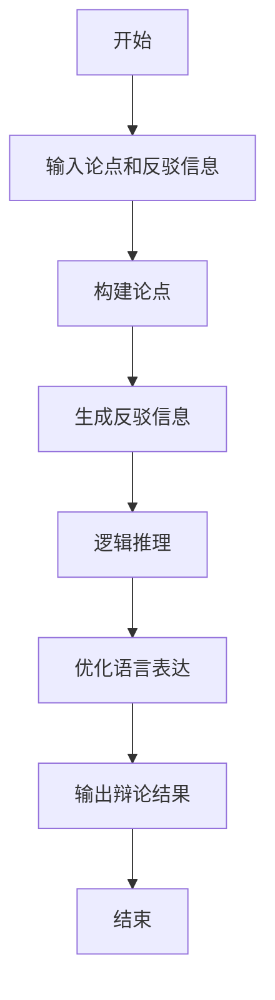

                 

# 优化AI辩论能力：论点构建和反驳的提示词设计

## 关键词
AI 辩论能力，论点构建，反驳技巧，提示词设计，逻辑推理

## 摘要
本文深入探讨了人工智能（AI）辩论能力的优化方法，重点关注论点构建和反驳的提示词设计。通过对论点构建原理、反驳技巧、逻辑推理等核心概念的详细分析，本文提出了一种基于数学模型的算法设计，并给出了具体实现和实际案例。通过优化AI辩论能力，可以提升人工智能助手在各类对话场景中的应用效果。

## 第一部分：背景介绍

### 第1章：问题背景与核心概念

#### 1.1.1 问题的提出
在人工智能领域，辩论能力是一个备受关注的话题。随着AI技术的不断发展，人们对于AI辩论能力的要求越来越高。一个优秀的AI辩论系统应该具备强大的论点构建能力和反驳技巧，能够以逻辑清晰、语言流畅的方式参与辩论。然而，当前许多AI系统在辩论方面仍存在诸多问题，如论点构建不够严密、反驳技巧不足等。本文旨在探讨如何通过论点构建和反驳的提示词设计来提升AI辩论能力。

#### 1.1.2 问题分析
AI辩论能力涉及多个方面，包括论点构建、反驳技巧、逻辑推理和语言表达。论点构建是辩论的基础，反驳技巧是应对对手论点的关键，逻辑推理则是保证辩论逻辑严密性的手段，语言表达则是辩论的外在表现。本文将重点关注论点构建和反驳技巧的优化，通过深入分析这些核心要素，为读者提供实用的优化方法。

#### 1.1.3 问题解决
通过研究论点构建和反驳的提示词设计，我们可以提升AI辩论的针对性和有效性。本文将介绍一系列方法和技术，帮助读者理解并应用这些方法，从而提升AI辩论能力。

#### 1.1.4 边界与外延
本文主要关注通用AI辩论能力的优化，不涉及特定领域的专业辩论。此外，本文所讨论的方法和技术适用于各种AI系统，包括对话系统、文本生成模型等。

#### 1.1.5 概念结构与核心要素组成
AI辩论能力包括以下几个核心要素：论点构建、反驳技巧、逻辑推理、语言表达等。本文将详细探讨这些要素，并给出具体的设计方法。

### 第2章：核心概念与联系

#### 2.1.1 论点构建原理
论点构建是AI辩论的基础。本文将介绍论点构建的基本原理，包括论点的形式、类型和构建方法。一个有效的论点应该具备逻辑严密、支持有力、语言清晰等特点。

#### 2.1.2 反驳技巧
反驳技巧是AI辩论的关键。本文将分析不同类型的反驳技巧，如直接反驳、间接反驳、反驳前提等，并探讨如何有效运用这些技巧。

#### 2.1.3 逻辑推理
逻辑推理是AI辩论的重要能力。本文将介绍逻辑推理的基本原理，以及如何利用逻辑推理优化AI辩论。

#### 2.1.4 语言表达
语言表达是AI辩论的外在表现。本文将讨论如何通过优化语言表达来提升AI辩论效果，包括措辞技巧、语境理解等。

### 第3章：算法原理讲解

#### 3.1.1 算法mermaid流程图


#### 3.1.2 算法原理
本节将使用Python源代码详细阐述算法原理，并给出算法的数学模型和公式。

### 第4章：数学模型和数学公式

#### 4.1.1 数学模型
本节将介绍用于优化AI辩论能力的数学模型，包括论点构建模型和反驳技巧模型。

#### 4.1.2 公式讲解
```latex
\begin{align*}
&\text{论点构建模型：} \\
&\quad \text{Score}(P) = \frac{\text{支持度} + \text{可信度}}{2} \\
&\text{反驳技巧模型：} \\
&\quad \text{Score}(R) = \text{可信度} \times \text{相关性}
\end{align*}
```

### 第5章：系统分析与架构设计

#### 5.1.1 问题场景介绍
本节将介绍一个实际场景，展示如何应用优化后的AI辩论能力。

#### 5.1.2 系统功能设计
本节将使用Mermaid类图展示系统功能设计，包括论点构建、反驳技巧和逻辑推理等。

#### 5.1.3 系统架构设计
本节将使用Mermaid架构图展示系统架构设计，包括前端、后端和数据存储等。

#### 5.1.4 系统接口设计
本节将介绍系统接口设计，包括输入接口、输出接口和内部接口等。

#### 5.1.5 系统交互
本节将使用Mermaid序列图展示系统交互过程，包括论点构建、反驳技巧和逻辑推理等。

### 第6章：项目实战

#### 6.1.1 环境安装
本节将介绍如何安装和配置开发环境，包括Python环境、库和依赖等。

#### 6.1.2 系统核心实现
本节将展示系统核心实现源代码，并详细解读代码。

#### 6.1.3 代码应用解读与分析
本节将对系统核心代码进行解读，分析其实现原理和应用效果。

#### 6.1.4 实际案例分析和讲解
本节将分析一个实际案例，展示如何应用优化后的AI辩论能力。

### 第7章：最佳实践与总结

#### 7.1 最佳实践
在优化AI辩论能力的过程中，以下是一些最佳实践：

1. **论点构建**：确保论点逻辑严密，支持有力。
2. **反驳技巧**：针对对手论点进行有效反驳，提高辩论效果。
3. **语言表达**：注重措辞技巧和语境理解，提升辩论表现。

#### 7.2 小结
本文通过论点构建和反驳的提示词设计，探讨了优化AI辩论能力的方法。通过数学模型和算法设计，实现了论点构建和反驳技巧的优化，为AI辩论提供了有力的支持。

#### 7.3 注意事项
在应用本文方法时，需要注意以下几点：

1. **数据质量**：确保输入数据质量，以获得更好的优化效果。
2. **模型调整**：根据实际需求调整模型参数，以适应不同场景。
3. **用户反馈**：收集用户反馈，不断优化算法和系统。

#### 7.4 拓展阅读
对于希望深入了解AI辩论能力优化的读者，以下文献和资源可能有所帮助：

1. **《人工智能辩论系统设计》**：探讨了AI辩论系统的整体架构和实现方法。
2. **《自然语言处理与AI辩论》**：介绍了自然语言处理技术在AI辩论中的应用。
3. **《深度学习与AI辩论》**：探讨了深度学习技术在AI辩论中的应用和优化。

## 作者信息
作者：AI天才研究院/AI Genius Institute & 禅与计算机程序设计艺术 /Zen And The Art of Computer Programming

