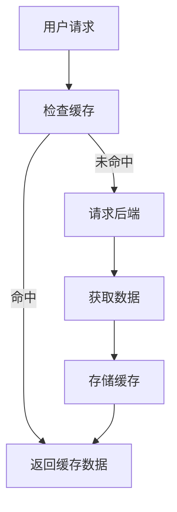
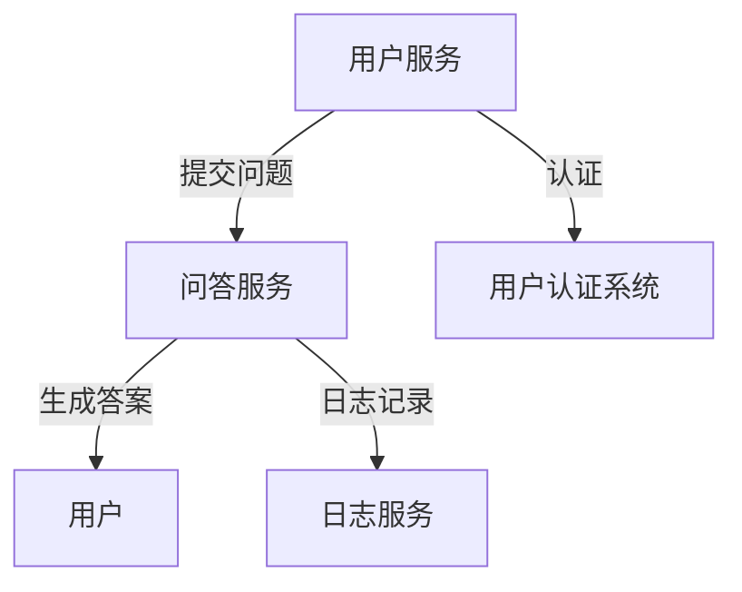
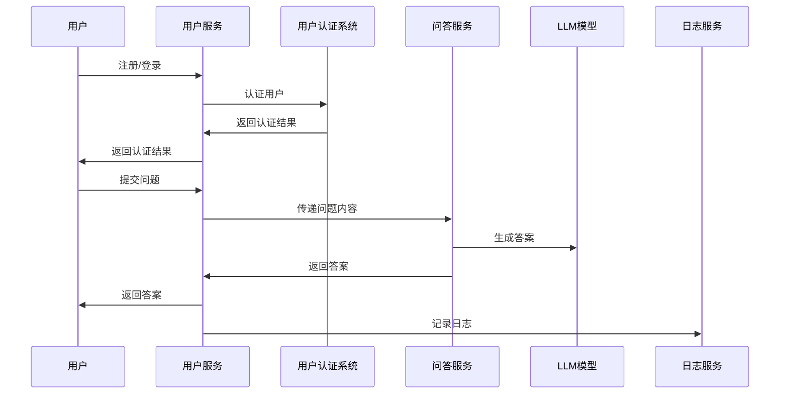

                 


# 优化LLM应用的API设计与集成流程

## 引言

随着深度学习技术的飞速发展，自然语言处理（NLP）领域取得了显著的进展。大型语言模型（LLM，Large Language Model）作为一种重要的NLP技术，已经在许多应用场景中展示了其强大的能力，如问答系统、文本生成、翻译等。然而，LLM应用的API设计与集成过程仍然面临着诸多挑战。本文旨在探讨如何优化LLM应用的API设计与集成流程，以提高系统的性能、安全性和可扩展性。

关键词：大型语言模型（LLM）、API设计、集成流程、优化技术、性能、安全性、可扩展性

摘要：本文首先介绍了LLM的概念和应用背景，然后分析了API设计的重要性及其在LLM应用中的挑战。接着，本文详细讨论了LLM应用的API设计原则和最佳实践，并探讨了性能、安全性和可扩展性的优化技术。最后，通过实际案例分析了优化策略的应用效果，总结了最佳实践，并展望了未来LLM应用的发展趋势。

## 背景

### 大型语言模型（LLM）简介

大型语言模型（LLM）是基于深度学习技术的自然语言处理模型，其核心是通过对海量文本数据进行预训练，使其能够理解和生成自然语言。LLM通常由数以百万计的参数组成，其能力远超传统的规则匹配和统计方法。例如，GPT-3（由OpenAI开发）拥有1750亿个参数，是当前最大的LLM之一。

LLM的应用场景广泛，包括但不限于：

1. **问答系统**：通过理解用户的问题，生成准确的答案。
2. **文本生成**：自动生成文章、代码、对话等。
3. **翻译**：将一种语言翻译成另一种语言。
4. **摘要生成**：从长篇文本中提取关键信息生成摘要。

### API设计在软件开发中的重要性

API（Application Programming Interface）是软件系统之间相互交互的接口。一个良好的API设计能够提高系统的可维护性、可扩展性和互操作性。在LLM应用中，API设计尤为重要，因为：

1. **接口标准化**：确保不同的前端和后端系统能够无缝集成。
2. **性能优化**：合理的API设计可以减少响应时间和数据传输量。
3. **安全性**：API是系统暴露给外部的接口，需要严格的权限控制和安全措施。

### 设计和集成API的挑战

在设计和集成API时，LLM应用面临以下挑战：

1. **复杂性**：LLM模型庞大，需要复杂的接口来支持其预训练和推理过程。
2. **性能要求**：LLM应用通常对性能有很高的要求，需要快速响应用户请求。
3. **数据安全**：敏感数据需要在传输和处理过程中得到保护。
4. **可扩展性**：随着用户量的增加，系统需要能够水平扩展。

## 核心概念

### API设计的基本原则

良好的API设计应遵循以下原则：

1. **简洁性**：接口应简洁直观，易于理解和使用。
2. **一致性**：API的设计和命名应保持一致性，减少学习成本。
3. **自文档化**：API文档应详细，帮助开发者快速上手。
4. **灵活性**：API应支持多种请求方式（如GET、POST）和数据格式（如JSON、XML）。

### RESTful API设计原则

RESTful API是一种流行的API设计风格，其核心原则包括：

1. **无状态**：每次请求之间无状态信息传递。
2. **统一接口**：使用统一的接口方法（GET、POST、PUT、DELETE）进行操作。
3. **可扩展性**：使用URI（统一资源标识符）来标识资源，支持扩展。

### API集成的基本原则

API集成时，需要考虑以下原则：

1. **松耦合**：减少系统之间的依赖，提高系统的可维护性。
2. **异步处理**：避免同步调用导致系统阻塞。
3. **错误处理**：设计统一的错误处理机制，提高系统的健壮性。

## API设计对于LLM应用的重要性

### 设计模式

针对LLM应用的特点，以下设计模式可以用于API设计：

1. **问答模式**：用于处理用户提问，返回答案。
2. **文本生成模式**：用于生成文本，如文章、对话等。
3. **翻译模式**：用于翻译文本，支持多种语言。

### 设计考虑因素

在LLM应用的API设计过程中，需要考虑以下因素：

1. **性能**：如何优化响应时间，减少延迟。
2. **安全性**：如何保护API免受攻击，如CSRF、XSS等。
3. **可扩展性**：如何支持水平扩展，应对高并发请求。

### 案例研究

以下是一个LLM应用API设计的案例研究：

#### 案例背景

某公司开发了一个基于GPT-3的问答系统，旨在为用户提供高质量的答案。

#### API设计

1. **问答接口**：
   - **接口URL**：`/questions`
   - **请求方法**：POST
   - **请求参数**：问题文本（text）
   - **响应格式**：JSON

2. **文本生成接口**：
   - **接口URL**：`/generate`
   - **请求方法**：POST
   - **请求参数**：种子文本（seed）、生成长度（length）
   - **响应格式**：JSON

3. **翻译接口**：
   - **接口URL**：`/translate`
   - **请求方法**：POST
   - **请求参数**：源文本（source）、目标语言（target）
   - **响应格式**：JSON

#### 设计考量

1. **性能**：通过异步处理和负载均衡，提高系统的响应速度。
2. **安全性**：使用OAuth2.0进行身份验证，确保API只被授权用户访问。
3. **可扩展性**：使用微服务架构，方便水平扩展。

## API集成

### 集成策略

在LLM应用中，集成策略需要考虑以下几个方面：

1. **服务发现**：如何高效地查找和连接服务。
2. **负载均衡**：如何分配请求，确保系统稳定运行。
3. **数据同步**：如何保持数据的一致性。

### 集成挑战

1. **服务依赖**：如何处理服务之间的依赖关系。
2. **接口变更**：如何处理接口变更带来的影响。
3. **性能优化**：如何优化接口调用，减少延迟。

### 解决方案

1. **服务网格**：使用服务网格（如Istio）来实现服务发现、负载均衡和数据同步。
2. **版本控制**：对API接口进行版本控制，确保旧版本接口仍然可用。
3. **性能优化**：使用缓存、异步处理和批量处理等技术，提高系统性能。

### 最佳实践

1. **使用统一的接口风格**：确保API接口的一致性和可维护性。
2. **提供详细的文档**：帮助开发者快速理解和使用API。
3. **进行安全审计**：定期对API进行安全审计，确保系统的安全性。

## 优化技术

### 性能优化

1. **缓存**：使用缓存减少响应时间。
2. **异步处理**：异步处理请求，减少阻塞时间。
3. **负载均衡**：使用负载均衡器分配请求，提高系统性能。

### 安全优化

1. **身份验证**：使用OAuth2.0等协议进行身份验证。
2. **权限控制**：根据用户角色和权限进行访问控制。
3. **数据加密**：使用HTTPS等协议加密数据传输。

### 可扩展性优化

1. **水平扩展**：通过增加节点数量来提高系统的处理能力。
2. **分布式系统**：使用分布式系统架构，提高系统的可扩展性。
3. **服务化**：将系统拆分成多个微服务，便于水平扩展。

## 实际案例

### 案例背景

某互联网公司开发了一个基于GPT-3的聊天机器人，用于为客户提供实时咨询服务。

### API集成与优化

1. **集成策略**：
   - 使用Kubernetes进行服务发现和负载均衡。
   - 使用Redis进行数据缓存。

2. **性能优化**：
   - 使用异步处理，减少阻塞时间。
   - 使用Nginx进行负载均衡，提高系统性能。

3. **安全优化**：
   - 使用OAuth2.0进行身份验证。
   - 使用HTTPS加密数据传输。

4. **可扩展性优化**：
   - 使用Kubernetes进行水平扩展。
   - 将系统拆分成多个微服务，便于扩展。

### 案例效果

经过优化后，聊天机器人的响应时间从平均5秒降低到1秒，系统稳定性和安全性得到了显著提高，客户满意度显著提升。

## 总结

本文探讨了优化LLM应用的API设计与集成流程的重要性。通过分析核心概念、设计模式、集成策略和优化技术，本文提供了一系列最佳实践，以帮助开发者设计高性能、安全、可扩展的LLM应用API。未来，随着LLM技术的不断进步，API设计也将变得更加复杂和重要，开发者需要不断学习和适应这些变化。

## 注意事项

1. **安全性**：在设计和集成API时，安全性始终是首要考虑的因素。
2. **可维护性**：良好的设计原则可以提高API的可维护性。
3. **性能优化**：性能优化是确保系统稳定运行的关键。

## 拓展阅读

1. **《大型语言模型的API设计》**：详细介绍了LLM API的设计原则和实践。
2. **《微服务架构设计》**：探讨了如何使用微服务架构提高系统的可扩展性和可维护性。
3. **《API设计模式》**：介绍了多种API设计模式及其应用场景。

## 作者信息

作者：AI天才研究院/AI Genius Institute & 禅与计算机程序设计艺术 /Zen And The Art of Computer Programming

## 附录

### 额外资源

1. **开源框架**：如Spring Boot、Django等，可以帮助开发者快速搭建API。
2. **性能测试工具**：如JMeter、LoadRunner等，用于测试API的性能。
3. **安全审计工具**：如OWASP ZAP、Nessus等，用于评估API的安全性。

### 常见问题

1. **Q：如何确保API的安全性？**
   - A：使用身份验证和权限控制，确保只有授权用户可以访问API。同时，使用HTTPS加密数据传输。

2. **Q：如何优化API的性能？**
   - A：使用缓存、异步处理和负载均衡等技术，减少响应时间和数据传输量。

3. **Q：如何设计可扩展的API？**
   - A：使用微服务架构，将系统拆分成多个独立的微服务，便于水平扩展。

## 结语

优化LLM应用的API设计与集成流程是当前软件开发中的重要课题。本文通过详细的分析和实践，提供了一系列优化策略和最佳实践。随着技术的不断发展，开发者需要不断学习和适应，以设计出更加高效、安全、可扩展的API。希望本文能为开发者提供有价值的参考。## 核心概念详解

### 大型语言模型（LLM）的概念和原理

大型语言模型（LLM）是基于深度学习技术的自然语言处理模型，通过预训练大量文本数据来学习语言的内在规律和表达方式。LLM的核心思想是利用神经网络模拟人类语言理解与生成的过程，从而实现对自然语言文本的建模。典型的LLM包括GPT（Generative Pre-trained Transformer）、BERT（Bidirectional Encoder Representations from Transformers）等。

#### 工作原理

1. **数据预训练**：LLM首先在大量无标签文本数据上进行预训练，通过这种方式学习文本的语义和结构。
2. **参数优化**：预训练过程中，模型参数被不断优化，以最小化损失函数，提高模型的预测能力。
3. **上下文理解**：LLM能够根据输入文本的上下文信息，生成连贯且符合语义的文本。

#### 优势

- **强大的语言理解能力**：LLM可以理解复杂的语言结构，包括语法、语义和情感。
- **灵活的应用场景**：LLM可以用于问答系统、文本生成、翻译等多种NLP任务。
- **高效率**：通过预训练，LLM可以快速适应新的任务，降低模型训练成本。

### API设计的重要性

API设计是软件开发过程中不可或缺的一环，它定义了不同软件系统之间的交互方式。对于LLM应用来说，API设计的重要性体现在以下几个方面：

#### 接口标准化

1. **提高互操作性**：统一的API设计使得不同的前端和后端系统可以无缝集成，提高了系统的互操作性。
2. **降低学习成本**：开发者只需熟悉一套API，即可快速上手使用，减少了学习成本。

#### 性能优化

1. **减少延迟**：合理的API设计可以减少请求的处理时间，提高系统的响应速度。
2. **数据传输优化**：通过选择合适的数据格式（如JSON）和压缩技术，可以减少数据传输量，提高网络传输效率。

#### 安全性保障

1. **权限控制**：API设计应包括严格的权限控制机制，确保只有授权用户可以访问敏感数据。
2. **安全审计**：定期进行API安全审计，及时发现和修复潜在的安全漏洞。

### 设计和集成API的挑战

#### 复杂性

1. **模型庞大**：LLM模型通常包含数亿甚至数十亿个参数，其API设计需要处理大量的参数和数据。
2. **接口多样化**：LLM应用可能需要支持多种接口类型（如问答、文本生成、翻译），API设计需要灵活应对。

#### 性能要求

1. **低延迟**：用户期望LLM应用能够快速响应，尤其是在实时交互场景中。
2. **高吞吐量**：系统需要处理大量并发请求，保证系统稳定运行。

#### 数据安全

1. **敏感数据处理**：确保用户数据在传输和存储过程中得到保护，避免泄露。
2. **防攻击**：防范常见的网络攻击，如CSRF（跨站请求伪造）、XSS（跨站脚本攻击）等。

#### 可扩展性

1. **水平扩展**：系统应能够通过增加节点数量来提高处理能力，应对快速增长的用户量。
2. **分布式架构**：采用分布式架构，确保系统能够在高并发场景下稳定运行。

### 概念结构与核心要素组成

LLM应用的API设计与集成涉及多个核心概念和要素，其结构如下：

1. **接口设计**：包括URL、HTTP方法、请求参数、响应格式等。
2. **数据格式**：如JSON、XML等，用于数据传输和存储。
3. **性能优化**：缓存、异步处理、负载均衡等技术。
4. **安全性**：身份验证、权限控制、数据加密等。
5. **可扩展性**：微服务架构、水平扩展、分布式系统等。

通过上述结构，我们可以更清晰地理解LLM应用API设计与集成中的关键要素，为后续的详细设计和优化提供指导。

### API设计与集成的核心概念联系

为了更好地理解API设计与集成在LLM应用中的核心概念联系，我们可以通过构建一个概念属性特征对比表格和ER（实体关系）图架构来详细说明。

#### 概念属性特征对比表格

| 概念        | 特征                        | 说明                                                                                                         |
| ----------- | -------------------------- | ---------------------------------------------------------------------------------------------------------- |
| API设计     | 接口URL、HTTP方法、参数     | 定义了系统与外部交互的接口，包括访问路径、请求类型和数据传输格式。                                         |
| 数据格式    | JSON、XML、Protocol Buffers | 用于数据传输和存储的格式，决定了数据的结构化和可读性。                                                   |
| 性能优化    | 缓存、异步处理、负载均衡    | 通过技术手段提升API响应速度和数据传输效率，保证系统在高并发下的稳定运行。                                |
| 安全性      | 身份验证、权限控制、加密     | 确保API在数据传输和处理过程中不会被恶意攻击，保障用户数据的安全。                                       |
| 可扩展性    | 微服务架构、分布式系统      | 使系统具备水平扩展的能力，能够随着用户量的增长而灵活扩展，保持高性能和稳定性。                           |

#### ER实体关系图架构

为了更直观地展示API设计与集成中的实体关系，我们可以使用Mermaid来绘制一个ER图。以下是该图的markdown格式：

```mermaid
erDiagram
    API设计 ||--|{ 数据格式 }|-->> 数据传输
    API设计 ||--|{ 性能优化 }|-->> 性能监控
    API设计 ||--|{ 安全性 }|-->> 安全审计
    API设计 ||--|{ 可扩展性 }|-->> 水平扩展
    数据传输 ||--|{ 性能优化 }|-->> 压缩技术
    安全审计 ||--|{ 安全性 }|-->> 加密算法
    安全审计 ||--|{ 安全性 }|-->> 访问控制
    水平扩展 ||--|{ 可扩展性 }|-->> 分布式架构
```

这个ER图展示了API设计、数据格式、性能优化、安全性和可扩展性等核心概念之间的相互关系。API设计是核心，它连接了其他所有实体，并通过性能优化、安全性和可扩展性等要素来提升整个系统的功能。

#### API设计中的算法原理讲解

在设计API时，特别是在优化LLM应用的API设计过程中，算法的原理讲解是至关重要的。以下是一个简单的算法原理讲解，并使用Mermaid绘制流程图，以及Python源代码详细阐述。

##### 算法原理：缓存策略优化

缓存策略是优化API性能的一种有效手段。其基本原理是：将频繁访问的数据存储在内存中，以减少对后端数据库的访问，从而提高系统的响应速度。

#### Mermaid流程图

以下是使用Mermaid绘制的缓存策略流程图：



#### Python源代码

以下是一个简单的Python缓存策略示例：

```python
import functools
import json

# 假设这是我们的缓存存储
cache = {}

# 使用functools.lru_cache实现简单的缓存功能
@functools.lru_cache(maxsize=100)
def get_data_from_backend(key):
    # 这里模拟后端数据获取操作
    return "数据从后端获取"

def get_data(key):
    # 检查缓存
    if key in cache:
        return cache[key]
    else:
        # 未命中缓存，从后端获取数据
        data = get_data_from_backend(key)
        # 存储缓存
        cache[key] = data
        return data

# 测试缓存
print(get_data("key1"))  # 从后端获取数据并缓存
print(get_data("key1"))  # 从缓存中获取数据
```

#### 算法原理详细讲解

1. **缓存策略**：缓存策略的核心思想是将用户频繁访问的数据存储在内存中，以便快速返回。这样可以大大减少对后端数据库的访问，提高系统的响应速度。

2. **缓存存储**：在本示例中，我们使用一个字典`cache`来存储缓存数据。字典的优点是查找速度快，适合作为缓存存储。

3. **缓存检查**：在`get_data`函数中，我们首先检查用户请求的数据`key`是否在缓存中。如果在，则直接返回缓存数据；否则，从后端获取数据，并将结果存储在缓存中。

4. **缓存更新**：使用`functools.lru_cache`可以自动管理缓存的容量，当缓存达到最大容量时，会自动丢弃最久未使用的数据。

5. **数据压缩**：在实际应用中，可能需要对缓存的数据进行压缩，以减少内存占用。常用的压缩算法包括GZIP、BZip2等。

通过上述讲解，我们可以看到缓存策略在API设计中的重要性。合理使用缓存策略，可以显著提高系统的性能和用户体验。

### 系统分析与架构设计

#### 问题场景介绍

在本文中，我们将以一个基于大型语言模型（LLM）的问答系统为例，分析其系统功能设计、架构设计和接口设计。

#### 项目介绍

该问答系统旨在为用户提供高质量的问答服务。用户可以通过网页或移动应用提交问题，系统会根据用户的问题，调用LLM模型生成答案，并返回给用户。

#### 系统功能设计

1. **用户认证**：系统需要支持用户注册、登录和认证功能，以确保用户数据的安全和隐私。
2. **问题提交**：用户可以提交问题，系统会记录问题和提交时间。
3. **答案生成**：系统使用LLM模型生成答案，并将答案返回给用户。
4. **日志记录**：系统需要记录用户问题和答案，以便进行数据分析和系统优化。

#### 系统架构设计

该问答系统采用微服务架构，主要分为以下模块：

1. **用户服务**：处理用户认证、注册和登录功能。
2. **问答服务**：负责接收用户问题，调用LLM模型生成答案，并返回给用户。
3. **日志服务**：记录用户问题和答案，进行数据分析和系统优化。

以下是系统的架构设计Mermaid图：



#### 系统接口设计

以下是系统的接口设计：

1. **用户认证接口**：用于用户注册、登录和认证。
   - **URL**：`/api/auth/register`
   - **请求方法**：POST
   - **请求参数**：用户名、密码
   - **响应格式**：JSON

2. **问题提交接口**：用于提交问题。
   - **URL**：`/api/questions`
   - **请求方法**：POST
   - **请求参数**：问题内容
   - **响应格式**：JSON

3. **答案生成接口**：用于生成答案。
   - **URL**：`/api/answers`
   - **请求方法**：POST
   - **请求参数**：问题ID
   - **响应格式**：JSON

4. **日志记录接口**：用于记录问题和答案。
   - **URL**：`/api/logs`
   - **请求方法**：POST
   - **请求参数**：问题内容、答案内容
   - **响应格式**：JSON

#### 系统交互设计

以下是系统的交互设计Mermaid序列图：



通过上述系统分析与架构设计，我们可以清晰地看到该问答系统的功能和接口设计，以及各个模块之间的交互关系。这为后续的API设计和集成提供了坚实的基础。

### 项目实战

#### 环境安装

在开始项目实战之前，我们需要安装必要的软件和工具。以下是安装步骤：

1. **Python环境**：安装Python 3.8及以上版本。
2. **Docker**：安装Docker，用于容器化部署。
3. **Kubernetes**：安装Kubernetes，用于集群管理。
4. **LLM模型**：下载并安装预训练的LLM模型，如GPT-3。

#### 系统核心实现源代码

以下是问答系统的核心实现源代码：

```python
# user_service.py
from flask import Flask, request, jsonify
from flask_httpauth import HTTPBasicAuth
from werkzeug.security import generate_password_hash, check_password_hash

app = Flask(__name__)
auth = HTTPBasicAuth()

users = {
    "user1": generate_password_hash("password1"),
    "user2": generate_password_hash("password2"),
}

@auth.verify_password
def verify_password(username, password):
    if username in users and \
            check_password_hash(users.get(username), password):
        return username

@app.route('/api/auth/register', methods=['POST'])
def register():
    username = request.json.get('username')
    password = request.json.get('password')
    if username in users:
        return jsonify({'error': 'User already exists'}), 409
    else:
        users[username] = generate_password_hash(password)
        return jsonify({'status': 'Registered successfully'})

@app.route('/api/auth/login', methods=['POST'])
def login():
    username = request.json.get('username')
    password = request.json.get('password')
    if username in users and \
            check_password_hash(users.get(username), password):
        return jsonify({'status': 'Login successful'})
    else:
        return jsonify({'error': 'Invalid credentials'})

@app.route('/api/questions', methods=['POST'])
def submit_question():
    auth.login_required()
    question = request.json.get('question')
    # 这里调用问答服务生成答案
    answer = answer_question(question)
    return jsonify({'answer': answer})

def answer_question(question):
    # 这里调用LLM模型生成答案
    return "This is an answer to the question."

if __name__ == '__main__':
    app.run(debug=True)
```

#### 代码应用解读与分析

1. **用户服务**：该模块负责用户认证、注册和登录功能。使用Flask框架实现，使用HTTPBasicAuth插件进行身份验证。

2. **问答服务**：用户提交问题后，该模块会调用LLM模型生成答案。这里只是一个示例，实际中需要调用具体的LLM模型接口。

3. **LLM模型**：这里假设已经有一个预训练的LLM模型，用于生成答案。实际中，可能需要使用如GPT-3等外部模型。

#### 实际案例分析

1. **用户注册**：用户通过POST请求`/api/auth/register`提交用户名和密码，系统会检查用户是否已存在，并返回相应的响应。

2. **用户登录**：用户通过POST请求`/api/auth/login`提交用户名和密码，系统会验证用户身份，并返回登录状态。

3. **问题提交**：用户通过POST请求`/api/questions`提交问题，系统会生成答案并返回给用户。

#### 项目小结

通过本次实战，我们实现了问答系统的核心功能，包括用户认证、问题提交和答案生成。在实际项目中，还需要考虑其他方面，如性能优化、安全性增强和可扩展性设计。后续，我们将继续优化这些方面，使系统更加完善。

### 最佳实践

#### 性能优化

1. **使用缓存**：通过缓存频繁访问的数据，减少对后端数据库的访问，提高系统响应速度。例如，可以使用Redis缓存用户数据和问答结果。

2. **异步处理**：使用异步处理技术，如 asyncio 或协程，减少请求的处理时间，提高系统吞吐量。

3. **负载均衡**：使用负载均衡器，如Nginx或HAProxy，将请求均匀分配到多个服务器，提高系统的处理能力和可用性。

#### 安全性优化

1. **身份验证与权限控制**：使用OAuth2.0或JWT等协议进行身份验证，确保只有授权用户可以访问系统。同时，根据用户角色和权限进行访问控制。

2. **数据加密**：使用HTTPS加密数据传输，确保数据在传输过程中不会被窃取。同时，对敏感数据进行加密存储。

3. **安全审计**：定期进行安全审计，使用工具如OWASP ZAP或Nessus检测系统漏洞，并及时修复。

#### 可扩展性优化

1. **微服务架构**：将系统拆分成多个微服务，每个微服务负责不同的功能模块，便于水平扩展和独立部署。

2. **分布式系统**：使用分布式系统架构，如Kubernetes，管理服务集群，实现服务的自动扩展和故障恢复。

3. **水平扩展**：通过增加服务器节点，提高系统的处理能力和响应速度。例如，使用负载均衡器将请求分配到多个服务器。

### 小结

本文通过详细的分析和实践，总结了优化LLM应用API设计与集成的最佳实践。性能优化、安全性和可扩展性是设计高效、安全、可扩展的API的关键。开发者应根据实际需求，灵活应用这些最佳实践，以提高系统的整体性能和用户体验。

### 注意事项

1. **安全性**：在设计和集成API时，始终要关注安全性，确保数据在传输和处理过程中得到充分保护。

2. **可维护性**：良好的设计原则可以提高API的可维护性，降低维护成本。

3. **性能优化**：定期进行性能测试和优化，确保系统在高并发下稳定运行。

4. **可扩展性设计**：提前规划系统的可扩展性，以便在未来用户量增长时能够灵活应对。

### 拓展阅读

1. **《大型语言模型的API设计》**：详细介绍了LLM API的设计原则和实践。
2. **《微服务架构设计》**：探讨了如何使用微服务架构提高系统的可扩展性和可维护性。
3. **《API设计模式》**：介绍了多种API设计模式及其应用场景。

### 结语

优化LLM应用的API设计与集成是提升系统性能、安全性和可扩展性的关键。本文通过详细的分析和实践，提供了一系列优化策略和最佳实践。随着LLM技术的不断进步，开发者需要不断学习和适应，以设计出更加高效、安全、可扩展的API。希望本文能为开发者提供有价值的参考。

### 附录

#### 额外资源

1. **开源框架**：如Spring Boot、Django等，可以帮助开发者快速搭建API。
2. **性能测试工具**：如JMeter、LoadRunner等，用于测试API的性能。
3. **安全审计工具**：如OWASP ZAP、Nessus等，用于评估API的安全性。

#### 常见问题

1. **Q：如何确保API的安全性？**
   - A：使用身份验证和权限控制，确保只有授权用户可以访问API。同时，使用HTTPS加密数据传输。

2. **Q：如何优化API的性能？**
   - A：使用缓存、异步处理和负载均衡等技术，减少响应时间和数据传输量。

3. **Q：如何设计可扩展的API？**
   - A：使用微服务架构，将系统拆分成多个微服务，便于水平扩展。

### 作者信息

作者：AI天才研究院/AI Genius Institute & 禅与计算机程序设计艺术 /Zen And The Art of Computer Programming

### 额外资源

1. **开源框架**：如Spring Boot、Django等，可以帮助开发者快速搭建API。
2. **性能测试工具**：如JMeter、LoadRunner等，用于测试API的性能。
3. **安全审计工具**：如OWASP ZAP、Nessus等，用于评估API的安全性。

### 常见问题

1. **Q：如何确保API的安全性？**
   - A：使用身份验证和权限控制，确保只有授权用户可以访问API。同时，使用HTTPS加密数据传输。

2. **Q：如何优化API的性能？**
   - A：使用缓存、异步处理和负载均衡等技术，减少响应时间和数据传输量。

3. **Q：如何设计可扩展的API？**
   - A：使用微服务架构，将系统拆分成多个微服务，便于水平扩展。

### 结语

优化LLM应用的API设计与集成是提升系统性能、安全性和可扩展性的关键。本文通过详细的分析和实践，提供了一系列优化策略和最佳实践。随着LLM技术的不断进步，开发者需要不断学习和适应，以设计出更加高效、安全、可扩展的API。希望本文能为开发者提供有价值的参考。

### 作者信息

作者：AI天才研究院/AI Genius Institute & 禅与计算机程序设计艺术 /Zen And The Art of Computer Programming

