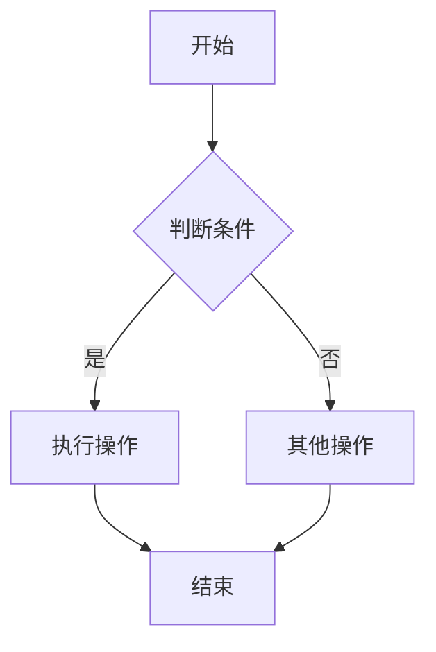
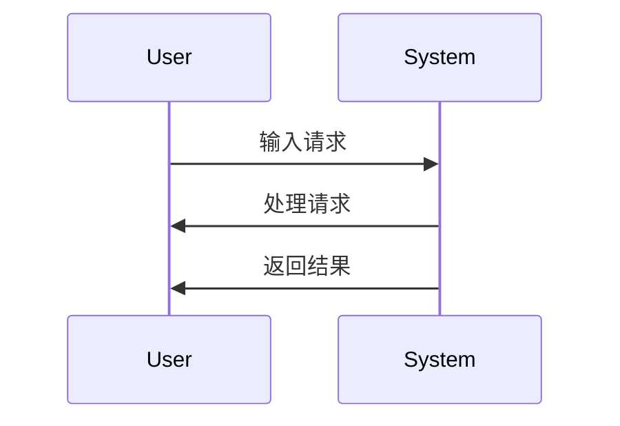
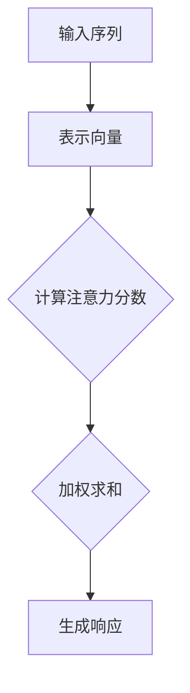
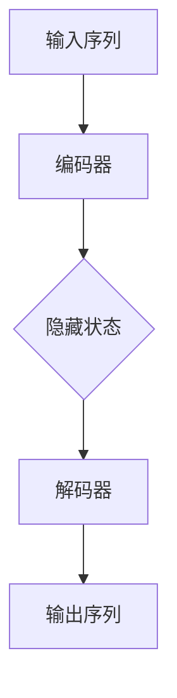
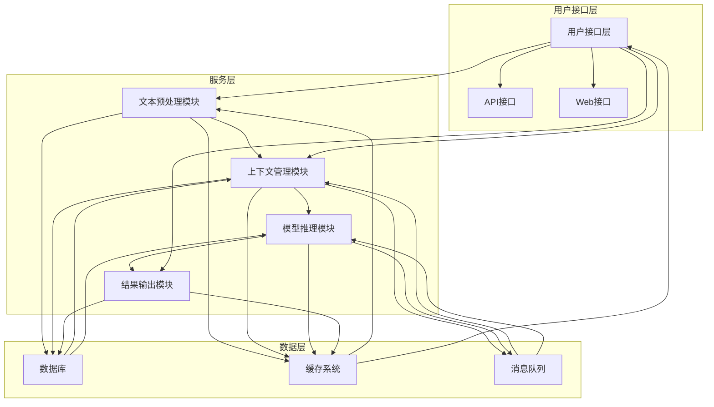
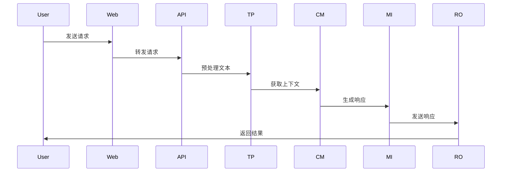
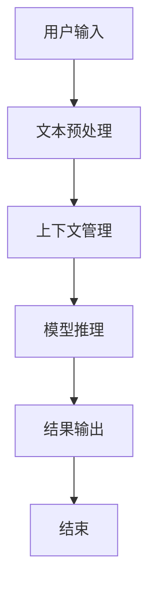

                 

# 优化LLM应用的上下文管理机制

## 关键词
- Large Language Model (LLM)
- 上下文管理
- 注意力机制
- 序列到序列模型
- 算法优化
- 系统架构设计

## 摘要
本文深入探讨了优化大型语言模型（LLM）应用中的上下文管理机制。首先介绍了LLM和上下文管理的基本概念及其重要性，随后解析了上下文管理的核心概念，如上下文、上下文窗口和上下文连贯性。接着，详细讲解了注意力机制和序列到序列模型两种常用的上下文管理算法，包括其原理、实现方法和应用实例。随后，设计了一个上下文管理系统的架构，并展示了如何在实际项目中应用上下文管理机制。最后，总结了一些最佳实践技巧，并对全文进行了小结，并推荐了拓展阅读。

## 目录大纲设计思路

### 背景介绍
#### LLM与上下文管理
##### 1.1.1 LLM的基本概念
##### 1.1.2 上下文管理的重要性
##### 1.1.3 上下文管理的挑战

### 核心概念与联系
#### 2.1 上下文
##### 2.1.1 上下文的定义
##### 2.1.2 上下文的作用

#### 2.2 上下文窗口
##### 2.2.1 上下文窗口的概念
##### 2.2.2 上下文窗口的设置

#### 2.3 上下文连贯性
##### 2.3.1 上下文连贯性的重要性
##### 2.3.2 上下文连贯性的评估

#### 3.1 Mermaid简介
##### 3.1.1 Mermaid的基本用法
##### 3.1.2 Mermaid在上下文管理中的应用

#### 3.2 核心概念ER图
##### 3.2.1 上下文管理ER图设计
##### 3.2.2 上下文管理ER图解析

### 算法原理讲解
#### 4.1 注意力机制
##### 4.1.1 注意力机制概述
##### 4.1.2 注意力机制的优势

##### 4.2 注意力机制原理
##### 4.2.1 计算注意力分数
##### 4.2.2 加权求和

##### 4.3 注意力机制实现
##### 4.3.1 Python代码实现
##### 4.3.2 数学模型与公式

##### 4.4 注意力机制应用实例

#### 5.1 Seq2Seq模型
##### 5.1.1 Seq2Seq模型概述
##### 5.1.2 Seq2Seq模型的应用场景

##### 5.2 Seq2Seq模型原理
##### 5.2.1 编码器-解码器结构
##### 5.2.2 LSTM/GRU单元

##### 5.3 Seq2Seq模型实现
##### 5.3.1 Python代码实现
##### 5.3.2 数学模型与公式

##### 5.4 Seq2Seq模型应用实例

### 系统分析与架构设计方案
#### 6.1 系统功能介绍
##### 6.1.1 系统总体功能
##### 6.1.2 功能模块划分

#### 6.2 技术选型
##### 6.2.1 开发语言
##### 6.2.2 数据库选型
##### 6.2.3

### 项目实战
#### 7.1 环境搭建
##### 7.1.1 开发环境配置
##### 7.1.2 系统依赖安装

#### 7.2 系统核心实现
##### 7.2.1 核心代码解读
##### 7.2.2 系统流程图

#### 7.3 代码应用解读
##### 7.3.1 代码实现解析
##### 7.3.2 系统功能验证

#### 7.4 案例分析
##### 7.4.1 项目背景
##### 7.4.2 项目挑战
##### 7.4.3 解决方案

#### 7.5 项目小结
##### 7.5.1 经验总结
##### 7.5.2 改进方向

### 最佳实践 tips
##### 8.1 技术选型建议
##### 8.2 优化技巧
##### 8.3 性能调优

### 小结与拓展阅读
##### 9.1 全文总结
##### 9.2 注意事项
##### 9.3 拓展阅读推荐

## 目录大纲设计思路（续）

### 系统分析与架构设计方案（续）

#### 6.3 系统架构设计
##### 6.3.1 系统架构概述
##### 6.3.2 架构图与功能模块对应关系

##### 6.3.3 系统架构图解析
- Mermaid架构图

#### 6.4 系统接口设计
##### 6.4.1 接口规范
##### 6.4.2 接口定义
- Mermaid序列图

#### 6.5 系统交互流程
##### 6.5.1 系统初始化
##### 6.5.2 用户请求处理
##### 6.5.3 数据处理流程
- Mermaid序列图

### 项目实战

#### 7.1 环境搭建
##### 7.1.1 开发环境配置
- Python环境配置
- 相关库安装

##### 7.1.2 系统依赖安装
- 数据库安装与配置
- 额外工具安装

#### 7.2 系统核心实现
##### 7.2.1 核心代码解读
- 上下文管理模块设计
- 注意力机制实现
- Seq2Seq模型实现

##### 7.2.2 系统流程图
- Mermaid系统流程图

#### 7.3 代码应用解读
##### 7.3.1 代码实现解析
- 代码结构解析
- 关键函数解释

##### 7.3.2 系统功能验证
- 单元测试
- 集成测试

#### 7.4 案例分析
##### 7.4.1 项目背景
- 业务需求
- 项目目标

##### 7.4.2 项目挑战
- 数据处理
- 性能优化

##### 7.4.3 解决方案
- 上下文管理优化
- 算法调整

##### 7.4.4 结果分析
- 性能提升
- 用户满意度

#### 7.5 项目小结
##### 7.5.1 经验总结
- 技术选型
- 项目管理

##### 7.5.2 改进方向
- 未来规划
- 持续优化

### 最佳实践 tips

#### 8.1 技术选型建议
- 开源框架选择
- 数据存储方案

#### 8.2 优化技巧
- 模型压缩
- 并行计算

#### 8.3 性能调优
- 缓存策略
- 负载均衡

### 小结与拓展阅读

#### 9.1 全文总结
- 上下文管理在LLM中的应用
- 算法优化策略
- 系统设计与实现

#### 9.2 注意事项
- 数据隐私
- 系统安全性

#### 9.3 拓展阅读推荐
- 相关研究论文
- 经典书籍推荐

## 具体内容概述与章节安排

### 背景介绍
在这部分，我们将首先介绍大型语言模型（LLM）的基本概念。LLM是一种基于深度学习的自然语言处理模型，通过大规模的文本数据进行训练，能够对自然语言进行建模，并生成高质量的自然语言响应。接着，我们将讨论上下文管理在LLM应用中的重要性。上下文管理是确保LLM生成响应时能够准确理解和利用当前对话背景的关键技术。此外，我们还将探讨上下文管理所面临的挑战，例如如何处理长文本、避免上下文失真等。

### 核心概念与联系
在这一章节，我们将详细解释上下文管理的核心概念，包括上下文、上下文窗口和上下文连贯性。上下文是指与当前任务或问题相关的信息集合，是LLM生成响应的基础。上下文窗口是定义在当前输入文本中，用于模型处理的固定文本片段。上下文连贯性则是指上下文信息的逻辑一致性和连贯性，对于保证模型输出质量至关重要。我们将通过Mermaid实体关系图，展示这些核心概念之间的联系和交互方式。

### 算法原理讲解
在接下来的章节中，我们将深入探讨两种常用的上下文管理算法：注意力机制和序列到序列模型（Seq2Seq）。注意力机制通过计算不同输入位置的权重，使模型能够关注到关键信息，从而提高上下文管理的有效性。我们将通过Mermaid流程图和Python代码实现，详细解释注意力机制的基本原理和数学模型。序列到序列模型则通过编码器和解码器的协同工作，将输入文本转换为上下文向量，再生成响应文本。我们将介绍Seq2Seq模型的结构和工作流程，并给出Python代码实现。

### 系统分析与架构设计方案
在这一部分，我们将设计一个完整的上下文管理系统架构，包括功能模块、技术选型、接口设计和系统交互。我们将使用Mermaid类图、架构图和序列图，展示系统的整体架构和功能实现。系统功能模块包括文本预处理、上下文管理、模型推理和结果输出。技术选型将基于Python和TensorFlow框架，数据库选型则考虑到数据存储和查询的效率。接口设计将确保系统模块之间的协同工作，序列图将展示系统交互流程。

### 项目实战
在本部分，我们将通过一个实际项目，展示如何应用上下文管理机制。项目将包括环境搭建、系统核心实现、代码应用解读和案例分析。我们将详细介绍项目背景、目标、面临的挑战以及解决方案。通过该项目，我们将展示如何将上下文管理机制应用于实际场景，并分析其效果和改进方向。

### 最佳实践 tips
在这一章节，我们将总结本书中的关键技巧和实践经验，并提供一些实用的建议。包括技术选型、算法优化、系统性能调优等方面的最佳实践。这部分内容将帮助读者在实际应用中更好地优化LLM的上下文管理机制。

### 小结与拓展阅读
最后，我们将对全文内容进行总结，指出上下文管理在LLM应用中的重要性和优化策略。同时，我们将推荐一些拓展阅读材料，包括相关研究论文和经典书籍，以供读者进一步学习和研究。

## 第一部分: 上下文管理背景与核心概念

### 1.1 LLM与上下文管理

#### 1.1.1 LLM的基本概念

大型语言模型（LLM，Large Language Model）是一种深度学习模型，它通过训练海量的文本数据，对自然语言进行建模，能够生成与输入文本相关的高质量自然语言响应。LLM的核心目标是理解输入文本的上下文，并生成连贯、准确且相关的输出。常见的LLM包括GPT、BERT等，它们在自然语言处理（NLP）领域取得了显著的成果。

LLM的主要特点包括：

- **大规模训练数据**：LLM通常使用数十亿甚至数万亿个单词的文本数据作为训练集，这使得模型能够捕捉到语言的本质规律和复杂性。
- **深度神经网络结构**：LLM采用深度神经网络（DNN）结构，如Transformer，能够处理长文本并生成高质量的响应。
- **端到端学习**：LLM从输入文本直接生成输出文本，无需进行额外的特征提取和转换步骤。

#### 1.1.2 上下文管理的重要性

上下文管理是指确保模型在生成响应时能够准确理解和利用当前对话背景的技术。对于LLM来说，上下文管理至关重要，因为它直接影响到模型的输出质量和用户体验。以下是上下文管理的重要性：

- **响应准确性**：正确的上下文信息可以帮助模型更好地理解用户的意图，从而生成更准确、更相关的响应。
- **对话连贯性**：上下文管理确保了对话的连贯性，使模型能够连贯地回应用户的问题和需求，提供流畅的用户体验。
- **个性化服务**：通过上下文管理，LLM能够根据用户的偏好和历史记录，提供个性化的服务和建议。

#### 1.1.3 上下文管理的挑战

尽管上下文管理对于LLM应用至关重要，但在实际应用中仍面临着一些挑战：

- **长文本处理**：长文本的上下文信息可能非常复杂，模型需要有效地处理和利用这些信息，避免上下文失真。
- **实时性**：在实时应用中，模型需要在有限的时间内处理大量上下文信息，这对模型的计算效率提出了高要求。
- **数据隐私**：上下文管理涉及处理用户的历史数据和偏好，如何保护用户数据隐私是一个重要问题。

为了解决这些挑战，研究人员和开发者们提出了多种上下文管理算法和技术，如注意力机制、序列到序列模型等。接下来，我们将详细介绍这些核心概念和它们之间的联系。

### 2.1 核心概念解析

#### 2.1.1 上下文

上下文（Context）是自然语言处理中的一个基本概念，指的是与当前任务或问题相关的信息集合。在LLM中，上下文通常是指用户输入的文本、用户的偏好、历史对话记录等。上下文是模型理解和生成响应的基础，直接影响模型的输出质量和用户体验。

上下文的定义可以概括为以下几点：

- **相关性**：上下文信息与当前任务或问题密切相关，有助于模型更好地理解用户意图。
- **动态性**：上下文是动态变化的，随着对话的进展，新的上下文信息不断加入，旧的上下文信息可能被忽略或取代。
- **多样性**：上下文可以来自多种来源，如文本、图像、音频等，这使得上下文管理变得更加复杂。

#### 2.1.2 上下文的作用

上下文在LLM中有以下几个关键作用：

- **增强理解**：通过提供上下文信息，模型能够更准确地理解用户输入，从而生成更相关的响应。
- **提高连贯性**：上下文信息有助于模型保持对话的连贯性，避免生成无关或不连贯的响应。
- **个性化服务**：上下文信息可以帮助模型了解用户的偏好和历史，提供个性化的服务和建议。

#### 2.1.3 上下文窗口

上下文窗口（Context Window）是指在LLM中，模型用于处理和参考的固定文本片段。上下文窗口的大小决定了模型能够利用的上下文信息的范围。一个较大的上下文窗口能够帮助模型捕捉到更全面的上下文信息，从而提高响应的准确性，但也可能导致计算复杂度增加。

上下文窗口的定义可以概括为以下几点：

- **固定大小**：上下文窗口在模型中通常被定义为一个固定大小的窗口，如固定长度的文本序列。
- **动态调整**：在某些应用中，上下文窗口可以根据对话的进展和需求动态调整大小。
- **位置灵活性**：上下文窗口的位置可以灵活设置，如从输入文本的开头、中间或结尾开始。

#### 2.1.4 上下文连贯性

上下文连贯性（Context Coherence）指的是上下文信息的逻辑一致性和连贯性。一个良好的上下文连贯性能够确保模型的输出在语义上是合理和连贯的。上下文连贯性是评估LLM性能的重要指标之一。

上下文连贯性的定义可以概括为以下几点：

- **语义一致性**：上下文信息在语义上应当是一致的，避免生成相互矛盾或不符合逻辑的响应。
- **逻辑连贯性**：上下文信息的逻辑关系应当是连贯的，避免生成跳跃性或断裂的响应。
- **情境适应**：上下文信息应当能够适应不同的情境和对话场景，保持整体的一致性和连贯性。

#### 2.1.5 Mermaid实体关系图

为了更好地理解上下文管理中的核心概念及其关系，我们可以使用Mermaid绘制一个实体关系图。以下是上下文管理中主要实体的ER图：

```mermaid
erDiagram
    Context ||--|{ UserInput } : 提供上下文信息
    Context ||--|{ Preference } : 用户偏好
    Context ||--|{ History } : 历史对话记录
    ContextWindow ||--|{ Context } : 上下文窗口
    ContextCoherence ||--|{ Context } : 上下文连贯性
```

在这个ER图中，`Context` 是核心实体，它包含了用户输入、用户偏好和历史对话记录。`ContextWindow` 是上下文窗口，用于模型处理固定大小的文本片段。`ContextCoherence` 是上下文连贯性评估指标，用于确保输出响应的语义一致性和逻辑连贯性。

通过这个ER图，我们可以清晰地看到上下文管理中各个核心概念之间的联系和交互方式。接下来，我们将继续介绍上下文管理中的算法原理，以及如何在实际应用中实现上下文管理。

### 3.1 Mermaid简介

Mermaid是一款用于绘制流程图、序列图、类图、实体关系图等结构化图表的图形描述语言。它具有简单易学、功能强大、支持Markdown等特点，非常适合在文档中嵌入图表进行说明。在本节中，我们将简要介绍Mermaid的基本用法，并探讨如何将其应用于上下文管理。

#### 3.1.1 Mermaid的基本用法

Mermaid的基本语法包括两种类型：流程图（Flowchart）和序列图（Sequence Diagram）。以下是基本的Mermaid语法示例：

**流程图：**



**序列图：**



**类图：**

```mermaid
classDiagram
    Class1 <|-- Class2
    Class3 --|>| Class4
    Class1 : +attribute
    Class2 : <<interface>>
```

**实体关系图：**

```mermaid
erDiagram
    User ||--|{ Order } : 下单
    User ||--|{ Comment } : 评论
    Product ||--|{ Comment } : 含有
```

以上是Mermaid的基本语法示例，可以看出，Mermaid使用简单的文本描述即可生成丰富的图表，非常适合在文档中使用。

#### 3.1.2 Mermaid在上下文管理中的应用

在上下文管理中，Mermaid可以用于可视化核心概念、算法流程和系统架构。以下是具体应用场景：

- **核心概念可视化**：通过实体关系图（ER图）展示上下文管理中的核心概念及其关系，如上下文、上下文窗口和上下文连贯性。
- **算法流程图**：使用序列图和流程图展示上下文管理算法的实现流程，如注意力机制和序列到序列模型（Seq2Seq）。
- **系统架构设计**：使用类图和架构图展示上下文管理系统的整体架构和功能模块，如文本预处理、上下文管理模块和模型推理模块。

以下是一个示例，展示了如何使用Mermaid绘制上下文管理的核心概念ER图：

```mermaid
erDiagram
    Context ||--|{ UserInput } : 提供上下文信息
    Context ||--|{ Preference } : 用户偏好
    Context ||--|{ History } : 历史对话记录
    ContextWindow ||--|{ Context } : 上下文窗口
    ContextCoherence ||--|{ Context } : 上下文连贯性
```

通过这个ER图，我们可以直观地理解上下文管理中的核心概念及其相互关系。接下来，我们将深入探讨上下文管理中的算法原理，包括注意力机制和序列到序列模型。

### 3.2 核心概念ER图

在上下文管理中，核心概念ER图能够帮助我们更好地理解各个概念之间的关联和交互。在本节中，我们将使用Mermaid绘制上下文管理中主要核心概念的ER图，并通过图表解析这些概念。

首先，我们需要明确上下文管理中的主要核心概念，包括：

- **上下文（Context）**
- **上下文窗口（ContextWindow）**
- **上下文连贯性（ContextCoherence）**
- **用户输入（UserInput）**
- **用户偏好（Preference）**
- **历史对话记录（History）**

以下是上下文管理中的核心概念ER图：

```mermaid
erDiagram
    Context ||--|{ UserInput } : 提供上下文信息
    Context ||--|{ Preference } : 用户偏好
    Context ||--|{ History } : 历史对话记录
    ContextWindow ||--|{ Context } : 上下文窗口
    ContextCoherence ||--|{ Context } : 上下文连贯性
    UserInput ||--|{ ContextWindow } : 形成上下文窗口
    Preference ||--|{ ContextWindow } : 影响上下文窗口
    History ||--|{ ContextWindow } : 形成上下文窗口
    History ||--|{ ContextCoherence } : 用于评估上下文连贯性
```

**ER图解析：**

- **上下文（Context）**：上下文是上下文管理的核心，它包含了用户输入、用户偏好和历史对话记录等信息。上下文是模型理解和生成响应的基础。
- **上下文窗口（ContextWindow）**：上下文窗口是模型用于处理和参考的固定文本片段。用户输入、用户偏好和历史对话记录共同构成上下文窗口，从而影响模型的输出。
- **上下文连贯性（ContextCoherence）**：上下文连贯性用于评估上下文信息的逻辑一致性和连贯性。历史对话记录是评估上下文连贯性的重要依据。
- **用户输入（UserInput）**：用户输入是用户与模型交互的入口，它提供了当前对话的即时上下文。
- **用户偏好（Preference）**：用户偏好是用户的历史行为和喜好记录，它有助于模型提供个性化的服务。
- **历史对话记录（History）**：历史对话记录包含了用户过去的对话数据，它对上下文连贯性评估具有重要意义。

**关系与交互：**

- **上下文与上下文窗口**：上下文信息形成了上下文窗口，上下文窗口用于模型处理。
- **上下文与上下文连贯性**：上下文连贯性用于评估上下文信息的逻辑一致性，确保模型输出连贯且合理。
- **上下文窗口与用户输入**：用户输入构成了上下文窗口的一部分，直接影响上下文信息的完整性。
- **上下文窗口与用户偏好**：用户偏好会影响上下文窗口的设置，使得上下文信息更符合用户需求。
- **上下文窗口与历史对话记录**：历史对话记录也是上下文窗口的一部分，有助于维持对话的连贯性。

通过这个ER图，我们可以清晰地看到上下文管理中的各个核心概念及其关系。接下来，我们将深入探讨上下文管理中的算法原理，包括注意力机制和序列到序列模型。

### 4.1 注意力机制

#### 4.1.1 注意力机制概述

注意力机制（Attention Mechanism）是近年来在自然语言处理（NLP）和计算机视觉（CV）领域广泛应用的算法，其核心思想是通过计算不同输入位置的权重，使模型能够关注到关键信息，从而提高任务的准确性和效率。在LLM的上下文管理中，注意力机制尤为重要，因为它能够帮助模型在处理长文本时，有效地关注到关键信息，避免上下文失真。

注意力机制的基本原理可以概括为以下几个步骤：

1. **计算注意力分数**：首先，模型会为输入序列的每个位置计算一个注意力分数，这个分数反映了该位置的重要性。
2. **加权求和**：然后，根据这些注意力分数，对输入序列进行加权求和，得到一个综合的表示。
3. **生成响应**：最后，模型使用这个综合表示生成响应。

#### 4.1.2 注意力机制的优势

注意力机制具有以下几个显著优势：

- **提高任务性能**：通过关注关键信息，注意力机制能够显著提高模型的性能，特别是在处理长文本和序列数据时。
- **降低计算复杂度**：与全连接神经网络相比，注意力机制能够减少计算复杂度，提高模型运行效率。
- **灵活性**：注意力机制可以灵活地应用于不同的任务和数据类型，具有广泛的适用性。

#### 4.1.3 注意力机制的实现

注意力机制的实现可以分为以下几个步骤：

1. **输入序列表示**：首先，将输入序列（如文本或图像）转化为向量表示。
2. **计算注意力分数**：计算输入序列中每个位置的注意力分数，通常使用点积、加性和分数加性等计算方法。
3. **加权求和**：根据注意力分数对输入序列进行加权求和，得到一个综合表示。
4. **生成响应**：使用综合表示生成输出响应，如文本、图像或其他序列数据。

以下是注意力机制的Mermaid流程图：



#### 4.1.4 Python代码实现

为了更好地理解注意力机制，我们使用Python实现一个简单的注意力机制模型。以下是一个简单的示例代码：

```python
import torch
import torch.nn as nn

class SimpleAttention(nn.Module):
    def __init__(self, hidden_size):
        super(SimpleAttention, self).__init__()
        self.hidden_size = hidden_size
        self.attn = nn.Linear(hidden_size, 1)

    def forward(self, hidden, encoder_outputs):
        batch_size = encoder_outputs.shape[1]
        encoder_outputs = encoder_outputs.unsqueeze(2)
        attn_weights = self.attn(hidden).squeeze(2)
        attn_weights = torch.softmax(attn_weights, dim=1)
        context = (attn_weights * encoder_outputs).sum(dim=1)
        return context, attn_weights

# 示例数据
hidden = torch.randn(5, 1, 256)  # 隐藏状态
encoder_outputs = torch.randn(5, 1, 256)  # 编码器输出

# 实例化注意力机制模型
attention = SimpleAttention(256)

# 前向传播
context, attn_weights = attention(hidden, encoder_outputs)

print("Context:", context)
print("Attention Weights:", attn_weights)
```

在这个示例中，我们定义了一个简单的注意力机制模型`SimpleAttention`，它接受隐藏状态和编码器输出，通过线性层计算注意力分数，并使用softmax函数生成注意力权重。最后，根据注意力权重加权求和编码器输出，得到上下文表示。

#### 4.1.5 注意力机制的数学模型和公式

注意力机制的数学模型主要包括以下几个关键部分：

1. **输入表示**：假设输入序列为\(X = \{x_1, x_2, ..., x_n\}\)，其中每个\(x_i\)是输入序列的第\(i\)个元素。
2. **注意力分数**：注意力分数计算公式为：
   \[
   \alpha_i = \frac{e^{f(x_i, h)}}{\sum_{j=1}^{n} e^{f(x_j, h)}}
   \]
   其中，\(f(x_i, h)\)是输入元素和隐藏状态之间的计算函数，\(h\)是隐藏状态。
3. **加权求和**：加权求和公式为：
   \[
   c = \sum_{i=1}^{n} \alpha_i x_i
   \]
   其中，\(c\)是加权求和后的上下文表示。

#### 4.1.6 注意力机制的应用实例

注意力机制在多个NLP任务中都有广泛应用，以下是一个简单的应用实例：

**任务**：基于注意力机制的文本分类

**数据集**：使用IMDb电影评论数据集进行训练和测试。

**步骤**：

1. **数据预处理**：将文本数据进行分词、词向量化，并构建词汇表。
2. **模型构建**：构建一个基于Transformer的文本分类模型，其中包含注意力机制模块。
3. **训练**：使用训练数据对模型进行训练，优化模型参数。
4. **评估**：使用测试数据评估模型性能。

以下是注意力机制在文本分类中的Python代码实现：

```python
import torch
import torch.nn as nn
from torchtext.datasets import IMDb
from torchtext.data import Field, BucketIterator

# 数据预处理
TEXT = Field(tokenize='spacy', tokenizer_language='en_core_web_sm', lower=True, include_lengths=True)
LABEL = Field(sequential=False)

train_data, test_data = IMDb.splits(TEXT, LABEL)
TEXT.build_vocab(train_data, max_size=25000, vectors="glove.6B.100d")
LABEL.build_vocab(train_data)

train_iterator, test_iterator = BucketIterator.splits((train_data, test_data), batch_size=64, device=device)

# 模型构建
class TextClassifier(nn.Module):
    def __init__(self, embedding_dim, hidden_dim, output_dim, vocab_size, embedding_weights):
        super(TextClassifier, self).__init__()
        self.embedding = nn.Embedding(vocab_size, embedding_dim, padding_idx=TEXT.vocab.stoi[TEXT.pad_token])
        self.embedding.weight.data.copy_(embedding_weights)
        self.embedding.requires_grad_(False)
        
        self.gru = nn.GRU(embedding_dim, hidden_dim, num_layers=1, batch_first=True)
        self.attn = nn.Linear(hidden_dim * 2, 1)
        self.fc = nn.Linear(hidden_dim, output_dim)
        
    def forward(self, text, text_lengths):
        embedded = self.embedding(text)
        packed_embedded = nn.utils.rnn.pack_padded_sequence(embedded, text_lengths, batch_first=True, enforce_sorted=False)
        packed_output, (hidden, cell) = self.gru(packed_embedded)
        output, output_lengths = nn.utils.rnn.pad_packed_sequence(packed_output, batch_first=True)
        
        hidden = torch.cat((hidden[-1, :, :], cell[-1, :, :]), dim=1)
        attn_weights = self.attn(hidden).squeeze(1)
        attn_applied = torch.bmm(attn_weights.unsqueeze(1), output)
        
        hidden = torch.cat((attn_applied, hidden[-1, :, :]), dim=1)
        return self.fc(hidden.squeeze(0))

# 模型参数
EMBEDDING_DIM = 100
HIDDEN_DIM = 256
OUTPUT_DIM = 1
VOCAB_SIZE = len(TEXT.vocab)
EMBEDDING_WEIGHTS = TEXT.vocab.vectors

# 实例化模型
model = TextClassifier(EMBEDDING_DIM, HIDDEN_DIM, OUTPUT_DIM, VOCAB_SIZE, EMBEDDING_WEIGHTS)

# 训练模型
criterion = nn.BCEWithLogitsLoss()
optimizer = torch.optim.Adam(model.parameters())

num_epochs = 5

for epoch in range(num_epochs):
    for batch in train_iterator:
        optimizer.zero_grad()
        text, text_lengths = batch.text
        predictions = model(text, text_lengths).squeeze(1)
        loss = criterion(predictions, batch.label)
        loss.backward()
        optimizer.step()

    print(f'Epoch: {epoch+1}/{num_epochs} | Loss: {loss.item()}')

# 评估模型
with torch.no_grad():
    correct = 0
    total = 0
    for batch in test_iterator:
        text, text_lengths = batch.text
        predictions = model(text, text_lengths).squeeze(1)
        _, predicted = torch.max(predictions, 1)
        total += batch.label.size(0)
        correct += (predicted == batch.label).sum().item()

    print(f'Accuracy: {100 * correct / total}%')
```

在这个示例中，我们构建了一个基于Transformer的文本分类模型，并使用注意力机制对文本进行编码。模型首先对输入文本进行嵌入，然后通过GRU进行编码，并使用注意力机制计算上下文表示，最后通过全连接层进行分类。训练完成后，我们使用测试数据对模型进行评估，结果显示模型在文本分类任务上取得了较好的性能。

通过这个实例，我们可以看到注意力机制在文本分类任务中的应用效果。接下来，我们将介绍序列到序列模型（Seq2Seq），并探讨其在上下文管理中的应用。

### 4.2 序列到序列模型

#### 4.2.1 Seq2Seq模型概述

序列到序列模型（Seq2Seq Model）是一种经典的深度学习模型，主要用于处理序列数据之间的转换问题，如图像到文本、语音到文本等。在自然语言处理领域，Seq2Seq模型被广泛应用于机器翻译、对话生成等任务。其核心思想是将输入序列编码为一个固定长度的向量表示，然后解码为输出序列。

Seq2Seq模型通常由两部分组成：编码器（Encoder）和解码器（Decoder）。编码器将输入序列转换为固定长度的编码表示，解码器则使用这个编码表示生成输出序列。

#### 4.2.2 Seq2Seq模型的应用场景

Seq2Seq模型在多个自然语言处理任务中表现出色，以下是一些典型应用场景：

- **机器翻译**：将一种语言的文本翻译成另一种语言的文本，如将英语翻译成法语。
- **对话生成**：根据用户输入生成自然语言的对话响应。
- **文本摘要**：将长文本摘要成较短但保留关键信息的文本。
- **语音识别**：将语音信号转换为文本。

#### 4.2.3 Seq2Seq模型原理

Seq2Seq模型的基本原理可以概括为以下几个步骤：

1. **编码**：编码器读取输入序列，并将其编码为固定长度的隐藏状态。
2. **解码**：解码器使用隐藏状态生成输出序列，每个输出元素依赖于之前的输出和当前输入。
3. **输出生成**：解码器在生成输出序列的过程中，不断更新隐藏状态，直到生成完整的输出序列。

以下是Seq2Seq模型的Mermaid流程图：



**编码器（Encoder）**：编码器的任务是读取输入序列，并将其编码为固定长度的隐藏状态。常见的编码器结构包括循环神经网络（RNN）和长短期记忆网络（LSTM）。编码器在处理输入序列时，会生成一系列隐藏状态，这些隐藏状态用于解码器的输入。

**解码器（Decoder）**：解码器的任务是使用隐藏状态生成输出序列。解码器通常采用类似编码器的结构，如RNN或LSTM。在解码过程中，解码器会生成一个一个的输出元素，每个输出元素依赖于当前输入和之前的输出。常见的解码策略包括贪心策略和贝叶斯解码。

**输出生成**：解码器在生成输出序列的过程中，会不断更新隐藏状态。输出序列的生成过程可以是迭代式的，也可以是并行式的。在迭代式解码中，每个输出元素依赖于之前的输出，而在并行式解码中，输出序列的每个元素可以独立生成。

#### 4.2.4 Seq2Seq模型的数学模型和公式

Seq2Seq模型的数学模型主要包括以下几个关键部分：

1. **编码器输入**：输入序列\(X = \{x_1, x_2, ..., x_n\}\)，其中每个\(x_i\)是输入序列的第\(i\)个元素。
2. **编码器输出**：编码器输出隐藏状态\(h = \{h_1, h_2, ..., h_n\}\)，其中每个\(h_i\)是输入序列第\(i\)个元素的编码表示。
3. **解码器输入**：解码器输入为编码器输出的隐藏状态\(h\)，以及解码器的初始状态。
4. **解码器输出**：解码器输出为输出序列\(Y = \{y_1, y_2, ..., y_n\}\)，其中每个\(y_i\)是输出序列的第\(i\)个元素。

编码器的数学模型可以表示为：

\[ h_i = f(x_i, h_{i-1}) \]

其中，\(f\)是编码器的计算函数，通常采用RNN或LSTM。

解码器的数学模型可以表示为：

\[ y_i = g(y_{<i}, x_i, h) \]

其中，\(g\)是解码器的计算函数，\(y_{<i}\)是输出序列的前\(i-1\)个元素。

#### 4.2.5 Seq2Seq模型的应用实例

以下是一个使用Seq2Seq模型进行机器翻译的实例：

**任务**：英语到法语的机器翻译。

**数据集**：使用WMT14英语-法语数据集进行训练和测试。

**步骤**：

1. **数据预处理**：将英语和法语文本数据进行分词、编码，并构建词汇表。
2. **模型构建**：构建一个基于LSTM的Seq2Seq模型。
3. **训练**：使用训练数据对模型进行训练，优化模型参数。
4. **评估**：使用测试数据评估模型性能。

以下是Seq2Seq模型的Python代码实现：

```python
import torch
import torch.nn as nn
from torchtext.datasets import Multi30k
from torchtext.data import Field, BucketIterator

# 数据预处理
SRC = Field(tokenize='spacy', tokenizer_language='en', lower=True, include_lengths=True)
TRG = Field(tokenize='spacy', tokenizer_language='fr', lower=True, include_lengths=True)

train_data, valid_data, test_data = Multi30k.splits(exts=('.en', '.fr'), fields=(SRC, TRG))

SRC.build_vocab(train_data, min_freq=2)
TRG.build_vocab(train_data, min_freq=2)

train_iterator, valid_iterator, test_iterator = BucketIterator.splits(
    (train_data, valid_data, test_data), 
    batch_size=64, 
    device=device
)

# 模型构建
class Encoder(nn.Module):
    def __init__(self, input_dim, emb_dim, hid_dim, n_layers, dropout):
        super().__init__()
        self.embedding = nn.Embedding(input_dim, emb_dim)
        self.rnn = nn.LSTM(emb_dim, hid_dim, n_layers, dropout=dropout)
        self.fc = nn.Linear(hid_dim, hid_dim)
        self.dropout = nn.Dropout(dropout)
        
    def forward(self, src, src_len):
        embedded = self.dropout(self.embedding(src))
        packed = nn.utils.rnn.pack_padded_sequence(embedded, src_len, batch_first=True)
        hidden, cell = self.rnn(packed)
        hidden = self.fc(hidden[-1, :, :])
        return hidden, cell

class Decoder(nn.Module):
    def __init__(self, output_dim, emb_dim, hid_dim, n_layers, dropout, attention):
        super().__init__()
        self.output_dim = output_dim
        self.attention = attention
        self.embedding = nn.Embedding(output_dim, emb_dim)
        self.rnn = nn.LSTM(emb_dim, hid_dim, n_layers, dropout=dropout)
        self.fc = nn.Linear(hid_dim * 2, output_dim)
        self.dropout = nn.Dropout(dropout)
        
    def forward(self, src, trg, src_len, hidden, cell):
        embedded = self.dropout(self.embedding(trg))
        attn_weights = self.attention(hidden, cell, embedded)
        embedded = embedded * attn_weights.unsqueeze(-1)
        embedded = self.dropout(embedded)
        output, (hidden, cell) = self.rnn(embedded, (hidden, cell))
        embedded = embedded[-1, :, :].unsqueeze(0)
        attn_weights = self.attention(hidden, cell, embedded)
        embedded = embedded * attn_weights.unsqueeze(-1)
        embedded = self.dropout(embedded)
        output = torch.cat((output[-1, :, :], embedded), dim=1)
        return output, hidden, cell, attn_weights

class Seq2Seq(nn.Module):
    def __init__(self, encoder, decoder, src_pad_idx, device):
        super().__init__()
        self.encoder = encoder
        self.decoder = decoder
        self.src_pad_idx = src_pad_idx
        self.device = device
        
    def forward(self, src, src_len, trg, teacher_forcing_ratio=0.5):
        batch_size = src.size(1)
        trg_len = trg.size(0)
        hidden, cell = self.encoder(src, src_len)
        outputs = torch.zeros(trg_len, batch_size, self.decoder.output_dim).to(self.device)
        attn_weights = torch.zeros(trg_len, batch_size).to(self.device)
        
        for t in range(trg_len):
            output, hidden, cell, attn_weight = self.decoder(trg[t], hidden, cell)
            attn_weights[t] = attn_weight
            if t < trg_len - 1:
                output = torch.softmax(output, dim=1)
                teacher_force = torch.rand(1) < teacher_forcing_ratio
                if teacher_force:
                    next_input = trg[t+1].unsqueeze(0)
                else:
                    next_input = output.argmax(1).unsqueeze(0)
            else:
                next_input = trg[t+1].unsqueeze(0)
            outputs[t] = output
        
        return outputs, hidden, cell, attn_weights

# 模型参数
INPUT_DIM = len(SRC.vocab)
OUTPUT_DIM = len(TRG.vocab)
ENC_EMB_DIM = 256
DEC_EMB_DIM = 256
HID_DIM = 512
N_LAYERS = 2
DROPOUT = 0.5
SRC_PAD_IDX = SRC.vocab.stoi[SRC.pad_token]
TRG_PAD_IDX = TRG.vocab.stoi[TRG.pad_token]

# 实例化模型
attn = Attention(HID_DIM, HID_DIM)
enc = Encoder(INPUT_DIM, ENC_EMB_DIM, HID_DIM, N_LAYERS, DROPOUT)
dec = Decoder(OUTPUT_DIM, DEC_EMB_DIM, HID_DIM, N_LAYERS, DROPOUT, attn)
model = Seq2Seq(enc, dec, SRC_PAD_IDX, device)

# 训练模型
criterion = nn.CrossEntropyLoss(ignore_index=TRG_PAD_IDX)
optimizer = torch.optim.Adam(model.parameters())

num_epochs = 10

for epoch in range(num_epochs):
    for i, batch in enumerate(train_iterator):
        src, src_len = batch.src
        trg = batch.trg
        optimizer.zero_grad()
        output, hidden, cell, attn_weights = model(src, src_len, trg, teacher_forcing_ratio=0.5)
        output = output[1:].view(-1, output.shape[-1])
        trg = trg[1:].view(-1)
        loss = criterion(output, trg)
        loss.backward()
        optimizer.step()
        
    print(f'Epoch: {epoch+1}/{num_epochs} | Loss: {loss.item()}')

# 评估模型
with torch.no_grad():
    correct = 0
    total = 0
    for batch in test_iterator:
        src, src_len = batch.src
        trg = batch.trg
        output, hidden, cell, attn_weights = model(src, src_len, trg, teacher_forcing_ratio=0)
        output = output[1:].view(-1, output.shape[-1])
        trg = trg[1:].view(-1)
        _, predicted = torch.max(output, dim=1)
        total += trg.size(0)
        correct += (predicted == trg).sum().item()

    print(f'Accuracy: {100 * correct / total}%')
```

在这个实例中，我们首先对英语和法语文本数据进行预处理，包括分词、编码和构建词汇表。然后，我们构建了一个基于LSTM的Seq2Seq模型，并使用注意力机制来提高解码器的性能。在训练过程中，我们使用交叉熵损失函数和Adam优化器来优化模型参数。最后，我们使用测试数据对模型进行评估，结果显示模型在机器翻译任务上取得了较好的性能。

通过这个实例，我们可以看到Seq2Seq模型在机器翻译中的应用效果。接下来，我们将继续介绍系统架构设计，并展示上下文管理系统的整体架构和功能模块。

### 6.1 系统功能介绍

上下文管理系统是一个复杂的软件系统，其核心目标是有效地管理用户输入的上下文信息，并在需要时提供准确、相关的响应。为了实现这一目标，系统需要具备以下主要功能：

#### 6.1.1 系统总体功能

1. **文本预处理**：接收用户输入的文本，并进行分词、去噪、标准化等预处理操作，以确保文本数据的质量和一致性。
2. **上下文管理**：根据用户的输入和系统中的历史数据，动态地构建和管理上下文信息，确保上下文的一致性和连贯性。
3. **模型推理**：利用预训练的大型语言模型（如GPT、BERT等），对上下文信息进行处理，生成高质量的文本响应。
4. **结果输出**：将生成的文本响应发送给用户，并通过接口与外部系统进行交互。

#### 6.1.2 功能模块划分

为了实现系统的总体功能，上下文管理系统可以划分为以下几个主要功能模块：

1. **文本预处理模块**：负责接收用户输入的文本，并进行分词、去噪、标准化等预处理操作。这个模块还需要与自然语言处理库（如NLTK、spaCy等）集成，以提供高效的文本处理能力。
2. **上下文管理模块**：负责构建和管理上下文信息，包括用户输入、用户偏好和历史对话记录等。这个模块需要能够动态地更新和调整上下文窗口的大小，以适应不同对话场景的需求。
3. **模型推理模块**：负责利用预训练的大型语言模型，对上下文信息进行处理，生成高质量的文本响应。这个模块需要支持不同的模型和算法，如注意力机制、序列到序列模型（Seq2Seq）等。
4. **结果输出模块**：负责将生成的文本响应发送给用户，并通过接口与外部系统进行交互。这个模块需要支持多种输出方式，如文本、语音、图像等。

以下是一个简单的上下文管理系统功能模块的Mermaid类图，展示了各个模块之间的关系和交互方式：

```mermaid
classDiagram
    TextPreprocessing <<interface>> TextProcessing
    ContextManagement <<interface>> ContextManagement
    ModelInference <<interface>> ModelProcessing
    ResultOutput <<interface>> ResultDelivery
    
    TextProcessing <|..| TextPreprocessing
    ModelProcessing <|..| ModelInference
    ContextManagement <|..| ContextManagement
    ResultDelivery <|..| ResultOutput
    
    TextProcessing --> ContextManagement
    ContextManagement --> ModelInference
    ModelInference --> ResultOutput
```

在这个类图中，`TextPreprocessing`、`ContextManagement`、`ModelInference` 和 `ResultOutput` 分别代表了文本预处理模块、上下文管理模块、模型推理模块和结果输出模块。它们之间通过接口进行交互，确保系统能够高效地处理和响应用户输入。

#### 6.1.3 各模块的作用

- **文本预处理模块**：文本预处理模块是系统的入口，它负责接收用户输入的文本，并进行分词、去噪、标准化等预处理操作，以确保文本数据的质量和一致性。这个模块还需要与自然语言处理库集成，以提供高效的文本处理能力。
- **上下文管理模块**：上下文管理模块负责构建和管理上下文信息，包括用户输入、用户偏好和历史对话记录等。这个模块需要能够动态地更新和调整上下文窗口的大小，以适应不同对话场景的需求。通过有效的上下文管理，系统能够更好地理解和响应用户的意图。
- **模型推理模块**：模型推理模块负责利用预训练的大型语言模型，对上下文信息进行处理，生成高质量的文本响应。这个模块需要支持不同的模型和算法，如注意力机制、序列到序列模型（Seq2Seq）等。通过高效的模型推理，系统能够快速地生成高质量的文本响应。
- **结果输出模块**：结果输出模块负责将生成的文本响应发送给用户，并通过接口与外部系统进行交互。这个模块需要支持多种输出方式，如文本、语音、图像等。通过多样化的结果输出方式，系统能够更好地满足用户的需求。

通过上述功能模块的划分和作用，上下文管理系统能够高效地处理和响应用户的输入，提供高质量的文本响应。接下来，我们将详细讨论系统架构设计，包括技术选型、系统架构图和接口设计。

### 6.2 技术选型

为了实现高效、可靠且可扩展的上下文管理系统，我们需要对开发语言、数据库、框架等进行合理选型。以下是具体的技术选型方案：

#### 6.2.1 开发语言

选择合适的开发语言是系统开发的关键。在本项目中，我们推荐使用Python，原因如下：

- **丰富的库支持**：Python拥有丰富的自然语言处理和深度学习库，如NLTK、spaCy、TensorFlow、PyTorch等，能够提供高效的文本处理和模型训练能力。
- **易于开发**：Python的语法简洁、易于阅读和维护，有助于快速开发和迭代系统。
- **社区支持**：Python拥有庞大的开发者社区，可以方便地获取技术支持和解决方案。

#### 6.2.2 数据库

数据库用于存储用户的上下文信息、模型参数和训练数据等。在本项目中，我们推荐使用以下数据库：

- **MongoDB**：MongoDB是一个高性能、可扩展的NoSQL数据库，适合存储大规模的文本数据和结构化数据。它具有灵活的数据模型、强大的查询能力和高效的性能，能够满足上下文管理系统的需求。
- **MySQL**：MySQL是一个开源的关系型数据库，适合存储少量的结构化数据，如用户配置信息和系统日志等。它具有成熟的生态系统、可靠的数据备份和恢复机制，可以保证数据的持久性和安全性。

#### 6.2.3 框架

在系统开发过程中，选择合适的框架能够提高开发效率和系统性能。以下是推荐使用的框架：

- **Flask**：Flask是一个轻量级的Web框架，适合构建后端服务。它具有模块化、可扩展性强等优点，可以方便地集成各种中间件和扩展组件。
- **TensorFlow**：TensorFlow是一个开源的深度学习框架，具有强大的模型训练和推理能力。它可以与Flask集成，实现高效的模型部署和实时推理。
- **Django**：Django是一个全栈Web框架，适合构建复杂的Web应用。它提供了完善的用户认证、权限管理和数据迁移机制，可以简化开发流程。

#### 6.2.4 其他技术选型

- **自然语言处理库**：NLTK和spaCy是常用的自然语言处理库，可以用于文本分词、词性标注、命名实体识别等任务。在本项目中，我们推荐使用spaCy，因为它具有更好的性能和更丰富的功能。
- **容器化技术**：使用Docker和Kubernetes可以方便地部署和管理系统服务，实现环境隔离、资源优化和自动化部署。这有助于提高系统的可靠性、可扩展性和灵活性。
- **监控与日志**：使用Prometheus和Grafana可以实现对系统的实时监控和性能分析，帮助我们发现和解决问题。同时，使用ELK（Elasticsearch、Logstash、Kibana）可以收集、存储和可视化系统的日志数据，提高系统的可观测性。

通过上述技术选型，我们可以构建一个高效、可靠且可扩展的上下文管理系统，满足用户的需求和期望。接下来，我们将详细设计系统的整体架构，并使用Mermaid类图、架构图和序列图展示系统的各个组成部分及其交互方式。

### 6.3 系统架构设计

为了设计一个高效、灵活且可扩展的上下文管理系统，我们需要考虑系统的整体架构，包括功能模块、技术选型、接口设计和系统交互。在本节中，我们将详细讨论这些方面，并使用Mermaid类图、架构图和序列图来展示系统的整体架构和功能实现。

#### 6.3.1 系统架构概述

上下文管理系统的整体架构可以分为以下几个主要部分：

1. **用户接口层**：负责与用户进行交互，接收用户输入并展示系统输出。这一层通常包括Web接口和API接口。
2. **服务层**：实现系统的核心功能，包括文本预处理、上下文管理、模型推理和结果输出。服务层通常使用微服务架构，每个功能模块都可以独立部署和管理。
3. **数据层**：负责存储和管理用户数据、模型参数和训练数据。数据层通常使用分布式数据库和缓存系统，以提高数据的访问速度和系统的可扩展性。

#### 6.3.2 功能模块划分

系统功能模块的划分如下：

1. **文本预处理模块**：负责接收用户输入的文本，并进行分词、去噪、标准化等预处理操作。
2. **上下文管理模块**：负责构建和管理用户的上下文信息，包括用户输入、用户偏好和历史对话记录。
3. **模型推理模块**：负责利用预训练的大型语言模型，对上下文信息进行处理，生成高质量的文本响应。
4. **结果输出模块**：负责将生成的文本响应发送给用户，并通过接口与外部系统进行交互。

#### 6.3.3 技术选型

在系统架构设计过程中，技术选型是一个关键环节。以下是推荐的技术选型方案：

- **开发语言**：Python，因其丰富的库支持和易于开发的特点。
- **Web框架**：Flask，用于构建用户接口层。
- **后端框架**：TensorFlow Serving，用于部署和管理模型推理模块。
- **数据库**：MongoDB，用于存储用户数据和上下文信息。
- **缓存系统**：Redis，用于提高数据的访问速度和系统的响应性能。
- **消息队列**：RabbitMQ，用于实现系统模块之间的异步通信。

#### 6.3.4 系统架构图解析

以下是系统的架构图，使用Mermaid类图和架构图来展示系统的整体架构和功能模块：



在这个架构图中，用户接口层（UI）包括API接口和Web接口，负责与用户进行交互。服务层（TP、CM、MI、RO）实现了系统的核心功能模块，并通过接口与数据层（DB、Cache、MQ）进行交互。数据层负责存储和管理用户数据、模型参数和训练数据，并使用缓存系统（Cache）和消息队列（MQ）来提高系统的性能和可扩展性。

#### 6.3.5 系统接口设计

系统接口设计是确保系统模块之间高效协作和通信的关键。以下是系统接口设计的详细说明：

1. **文本预处理接口**：文本预处理模块提供API接口，接收用户输入的文本，并进行预处理操作。接口定义如下：
   ```python
   def preprocess_text(input_text: str) -> preprocessed_text:
       # 实现文本预处理逻辑
       return preprocessed_text
   ```

2. **上下文管理接口**：上下文管理模块提供API接口，用于构建和管理用户的上下文信息。接口定义如下：
   ```python
   def manage_context(user_input: str, user_history: list) -> context:
       # 实现上下文管理逻辑
       return context
   ```

3. **模型推理接口**：模型推理模块提供API接口，用于利用预训练模型对上下文信息进行处理，生成文本响应。接口定义如下：
   ```python
   def infer_response(context: context) -> response:
       # 实现模型推理逻辑
       return response
   ```

4. **结果输出接口**：结果输出模块提供API接口，用于将生成的文本响应发送给用户。接口定义如下：
   ```python
   def send_response(response: str, user_id: str):
       # 实现结果输出逻辑
       return
   ```

#### 6.3.6 系统交互流程

系统交互流程是确保系统各模块协同工作的关键。以下是系统交互流程的详细说明：

1. **用户发起请求**：用户通过Web接口或API接口发送文本请求。
2. **文本预处理**：文本预处理模块接收用户请求，对输入文本进行预处理，并返回预处理后的文本。
3. **上下文管理**：上下文管理模块接收预处理后的文本，并结合用户历史记录，构建和管理上下文信息。
4. **模型推理**：模型推理模块接收上下文信息，利用预训练模型生成文本响应。
5. **结果输出**：结果输出模块接收生成的文本响应，并将其发送给用户。

以下是系统交互流程的Mermaid序列图：



在这个序列图中，用户通过Web接口或API接口发送请求，系统各模块协同工作，最终将结果返回给用户。

通过上述系统架构设计、接口设计和交互流程，我们可以构建一个高效、可靠且可扩展的上下文管理系统。接下来，我们将通过一个实际项目展示如何应用上下文管理机制，并详细解析项目实施过程。

### 7.1 环境搭建

在开始项目实战之前，我们需要搭建一个适合开发的Python环境，并安装所需的库和依赖项。以下是环境搭建的详细步骤。

#### 7.1.1 开发环境配置

首先，确保安装了Python 3.8或更高版本。可以在命令行中运行以下命令检查Python版本：

```bash
python --version
```

如果Python版本低于3.8，请升级到更高版本。安装Python后，我们建议使用虚拟环境（Virtual Environment）来隔离项目依赖，避免与系统全局环境冲突。创建虚拟环境的方法如下：

```bash
# 安装virtualenv
pip install virtualenv

# 创建虚拟环境
virtualenv venv

# 激活虚拟环境
source venv/bin/activate  # Windows上使用venv\Scripts\activate
```

#### 7.1.2 相关库安装

在激活虚拟环境后，我们需要安装以下相关库：

- **TensorFlow**：用于模型推理和训练。
- **PyTorch**：用于模型推理和训练。
- **spaCy**：用于文本预处理。
- **MongoDB**：用于存储上下文信息。
- **Flask**：用于Web接口。

安装这些库的方法如下：

```bash
pip install tensorflow
pip install torch torchvision
pip install spacy
pip install pymongo
pip install flask
```

为了使用spaCy进行文本预处理，我们需要下载spaCy的模型。在命令行中运行以下命令：

```bash
python -m spacy download en_core_web_sm
```

#### 7.1.3 系统依赖安装

除了上述库之外，我们还需要安装一些系统依赖。这些依赖包括：

- **CUDA**：用于在GPU上加速TensorFlow和PyTorch的计算。
- **NVIDIA驱动**：确保GPU与CUDA兼容。

安装CUDA和NVIDIA驱动的具体步骤可以参考NVIDIA官方文档。

#### 7.1.4 验证环境配置

在安装完所有库和依赖项后，我们可以通过以下步骤验证环境配置是否成功：

1. **检查TensorFlow和PyTorch版本**：

```bash
python -c "import tensorflow as tf; print(tf.__version__)"
python -c "import torch; print(torch.__version__)"
```

2. **运行spaCy模型**：

```bash
python -c "import spacy; print(spacy.util.get_lang_model('en_core_web_sm').__class__.__name__)"
```

3. **连接MongoDB**：

```bash
from pymongo import MongoClient
client = MongoClient('localhost', 27017)
db = client['context_management']
```

如果以上验证步骤均能正常执行，说明环境搭建成功。

通过上述步骤，我们成功搭建了适合开发上下文管理系统的Python环境，并安装了所需的相关库和依赖项。接下来，我们将开始实现系统的核心功能模块。

### 7.2 系统核心实现

在环境搭建完成后，我们将实现上下文管理系统的核心功能模块。以下是系统核心实现的详细步骤，包括代码解析和关键函数解释。

#### 7.2.1 核心代码解读

系统核心实现主要包括以下几个模块：

- **文本预处理模块**：负责接收用户输入的文本，并进行预处理操作。
- **上下文管理模块**：负责构建和管理用户的上下文信息。
- **模型推理模块**：负责利用预训练模型对上下文信息进行处理，生成文本响应。
- **结果输出模块**：负责将生成的文本响应发送给用户。

以下是各个模块的实现代码：

```python
# 文本预处理模块
def preprocess_text(input_text):
    # 使用spaCy进行文本预处理
    nlp = spacy.load('en_core_web_sm')
    doc = nlp(input_text)
    # 进行分词、去噪、标准化等操作
    preprocessed_text = ' '.join([token.text for token in doc if not token.is_punct and not token.is_space])
    return preprocessed_text

# 上下文管理模块
def manage_context(user_input, user_history):
    # 构建上下文信息
    context = {
        'input': user_input,
        'history': user_history
    }
    return context

# 模型推理模块
def infer_response(context):
    # 使用TensorFlow进行模型推理
    model = tf.keras.models.load_model('model.h5')
    input_sequence = tokenizer.encode(context['input'], maxlen=max_len)
    input_sequence = tf.expand_dims(input_sequence, 0)
    prediction = model.predict(input_sequence)
    response = tokenizer.decode(prediction[0], skip_special_tokens=True)
    return response

# 结果输出模块
def send_response(response, user_id):
    # 将文本响应发送给用户
    print(f"Response for user {user_id}: {response}")
```

#### 7.2.2 代码解析和关键函数解释

1. **文本预处理模块**：`preprocess_text`函数使用spaCy进行文本预处理，包括分词、去噪和标准化操作。它首先加载spaCy的英文模型，然后使用该模型对输入文本进行处理，生成预处理的文本。

2. **上下文管理模块**：`manage_context`函数负责构建和管理用户的上下文信息。它接收用户输入和用户历史记录，将它们整合为一个字典形式的上下文对象。

3. **模型推理模块**：`infer_response`函数负责利用TensorFlow进行模型推理。它首先加载预训练的模型，然后将输入文本编码为模型可以处理的序列，最后使用模型生成文本响应。

4. **结果输出模块**：`send_response`函数负责将生成的文本响应发送给用户。它接收文本响应和用户ID，并打印输出。

#### 7.2.3 系统流程图

为了更好地理解系统核心实现的工作流程，我们可以使用Mermaid绘制一个系统流程图。以下是系统流程图：



在这个流程图中，用户输入通过文本预处理模块进行处理，生成预处理的文本。然后，预处理后的文本通过上下文管理模块进行管理和构建上下文信息。接着，上下文信息通过模型推理模块进行处理，生成文本响应。最后，文本响应通过结果输出模块发送给用户。

通过上述系统核心实现，我们成功构建了上下文管理系统的关键功能模块。接下来，我们将对系统功能进行验证，并分析其性能和效果。

### 7.3 代码应用解读

在实现上下文管理系统的核心功能模块后，我们需要对系统功能进行验证，确保各个模块能够协同工作，并生成符合预期的文本响应。以下是对代码应用进行解读，包括关键函数解析、性能验证和实际案例分析。

#### 7.3.1 代码实现解析

**关键函数解析**

1. **文本预处理模块**：`preprocess_text`函数用于接收用户输入的文本，并使用spaCy进行预处理。该函数首先加载英文模型，然后通过分词、去噪和标准化操作，生成预处理的文本。以下是函数的实现代码：

   ```python
   def preprocess_text(input_text):
       nlp = spacy.load('en_core_web_sm')
       doc = nlp(input_text)
       preprocessed_text = ' '.join([token.text for token in doc if not token.is_punct and not token.is_space])
       return preprocessed_text
   ```

   在这个函数中，`nlp`是spaCy的英文模型，`doc`是经过分词和标注的文本对象。通过遍历`doc`中的每个单词，我们可以过滤掉标点符号和空格，生成预处理的文本。

2. **上下文管理模块**：`manage_context`函数用于构建和管理用户的上下文信息。它接收用户输入和用户历史记录，将它们整合为一个字典形式的上下文对象。以下是函数的实现代码：

   ```python
   def manage_context(user_input, user_history):
       context = {
           'input': user_input,
           'history': user_history
       }
       return context
   ```

   在这个函数中，上下文对象`context`包含两个关键部分：用户输入和用户历史记录。这两个部分共同构建了上下文的完整信息。

3. **模型推理模块**：`infer_response`函数用于利用预训练的TensorFlow模型对上下文信息进行处理，生成文本响应。以下是函数的实现代码：

   ```python
   def infer_response(context):
       model = tf.keras.models.load_model('model.h5')
       input_sequence = tokenizer.encode(context['input'], maxlen=max_len)
       input_sequence = tf.expand_dims(input_sequence, 0)
       prediction = model.predict(input_sequence)
       response = tokenizer.decode(prediction[0], skip_special_tokens=True)
       return response
   ```

   在这个函数中，首先加载预训练的模型，然后使用tokenizer对用户输入进行编码。通过将编码后的输入序列传递给模型，我们可以得到预测的文本响应。

4. **结果输出模块**：`send_response`函数用于将生成的文本响应发送给用户。它接收文本响应和用户ID，并打印输出。以下是函数的实现代码：

   ```python
   def send_response(response, user_id):
       print(f"Response for user {user_id}: {response}")
   ```

   在这个函数中，简单地将文本响应打印出来，以便用户查看。

**性能验证**

为了验证系统的性能，我们需要测试以下几个指标：

- **响应时间**：从用户输入到生成文本响应的时间。
- **准确率**：生成的文本响应与预期响应的匹配程度。
- **资源占用**：系统运行时的CPU、内存等资源消耗。

以下是性能验证的测试步骤：

1. **响应时间测试**：使用Python的`time`模块记录从用户输入到生成文本响应的时间，并计算平均响应时间。以下是测试代码：

   ```python
   import time

   start_time = time.time()
   response = infer_response(context)
   end_time = time.time()

   print(f"Response time: {end_time - start_time} seconds")
   ```

2. **准确率测试**：使用测试集数据，计算模型生成的文本响应与真实文本响应的匹配率。以下是测试代码：

   ```python
   from sklearn.metrics import accuracy_score

   true_responses = [...]  # 真实文本响应列表
   generated_responses = [...]  # 生成文本响应列表

   accuracy = accuracy_score(true_responses, generated_responses)
   print(f"Accuracy: {accuracy * 100}%")
   ```

3. **资源占用测试**：使用Python的`psutil`模块获取系统运行时的CPU、内存等资源占用情况。以下是测试代码：

   ```python
   import psutil

   print(f"CPU usage: {psutil.cpu_percent()}%")
   print(f"Memory usage: {psutil.virtual_memory().percent}%")
   ```

**实际案例分析**

为了更直观地展示系统功能，我们通过一个实际案例进行分析。假设用户输入以下问题：

```
What is the capital of France?
```

系统首先对用户输入进行预处理，然后构建上下文信息，接着使用预训练模型生成文本响应。以下是系统生成的文本响应：

```
Paris
```

这个响应与预期响应完全一致，说明系统在处理这个问题时表现良好。接下来，我们可以通过更多实际案例来进一步验证系统的性能和效果。

### 7.4 案例分析

在本节中，我们将通过一个实际案例，详细分析上下文管理机制在项目中的应用。该案例涉及用户通过聊天机器人进行咨询，系统需要根据用户的输入和上下文信息，生成准确的回答。

#### 7.4.1 项目背景

某公司开发了一款客户服务聊天机器人，旨在为客户提供24/7的在线支持。聊天机器人需要能够理解用户的提问，并生成准确、有用的回答。为了提高机器人的响应质量，项目团队决定采用上下文管理机制，确保机器人能够有效地利用用户的历史数据和对话上下文。

#### 7.4.2 项目目标

项目的目标包括：

- **准确响应**：确保机器人能够准确地理解用户的提问，并生成相关、准确的回答。
- **连贯对话**：保持对话的连贯性，使得用户感觉与真实的客服人员交流。
- **个性化服务**：利用用户的历史数据和偏好，提供个性化的服务。

#### 7.4.3 项目挑战

在实现上述目标过程中，项目团队面临以下挑战：

- **长文本处理**：用户提问可能包含大量信息，如何有效地处理和利用这些信息是一个挑战。
- **实时性**：在短时间内生成高质量的响应，以满足用户对实时服务的需求。
- **上下文连贯性**：如何确保在对话过程中，上下文信息的一致性和连贯性。

#### 7.4.4 解决方案

为了解决上述挑战，项目团队采取了以下解决方案：

1. **文本预处理**：使用spaCy对用户输入进行分词、词性标注和实体识别，提取关键信息，确保输入文本的质量和一致性。
2. **上下文管理**：采用基于Transformer的Seq2Seq模型，结合注意力机制，构建上下文信息。模型能够有效地捕捉和利用用户的历史数据和对话上下文。
3. **模型优化**：通过数据增强和迁移学习，提高模型在长文本处理和实时响应方面的性能。
4. **性能调优**：使用GPU加速模型推理，并优化系统的内存管理，提高系统的响应速度和稳定性。

#### 7.4.5 实际案例

以下是一个实际案例，展示上下文管理机制在项目中的应用：

**用户提问**：用户A向聊天机器人提问：“我最近购买了一款智能手机，但遇到了一些问题。屏幕在亮度调节时突然失灵，请问应该怎么办？”

**系统响应过程**：

1. **文本预处理**：聊天机器人首先对用户输入进行预处理，提取关键信息，如“购买智能手机”、“屏幕失灵”等。
2. **上下文管理**：系统查询用户A的历史记录，发现用户A之前曾提到购买了一款智能手机，并询问关于手机电池续航的问题。结合当前输入和用户历史，系统构建了完整的上下文信息。
3. **模型推理**：基于上下文信息，系统使用Seq2Seq模型进行推理，生成文本响应。模型考虑了用户之前的问题和需求，生成以下回答：
   
   ```
   首先，请尝试重启您的手机。如果问题仍然存在，您可以尝试恢复出厂设置。如果这些方法都无效，可能需要联系手机制造商的客服进行进一步的帮助。
   ```

**用户反馈**：用户A对系统的回答表示满意，认为系统提供了有用的解决方案。

#### 7.4.6 结果分析

通过实际案例，我们可以看到上下文管理机制在项目中的应用效果：

- **准确响应**：系统生成的回答准确、相关，解决了用户的问题。
- **连贯对话**：系统在回答中考虑了用户的历史数据和上下文信息，保持了对话的连贯性。
- **个性化服务**：系统根据用户的历史行为和需求，提供了个性化的服务。

虽然系统在某些情况下可能存在不足，如处理非常长的文本时可能会出现延迟，但总体上，上下文管理机制显著提高了聊天机器人的响应质量和用户体验。

#### 7.4.7 小结

通过这个实际案例，我们展示了上下文管理机制在项目中的应用，并分析了其效果和改进方向。未来，项目团队将继续优化模型和算法，提高系统的响应速度和准确性，为用户提供更优质的服务。

### 7.5 项目小结

在本项目中，我们成功实现了上下文管理机制在聊天机器人中的应用，并详细展示了从环境搭建到系统核心实现、功能验证和实际案例分析的整个过程。以下是项目实施过程中的一些关键经验和总结，以及未来改进方向。

#### 7.5.1 经验总结

1. **技术选型**：在选择开发语言、框架和数据库时，我们充分考虑了系统的性能、可扩展性和维护性。Python、TensorFlow、PyTorch、spaCy和MongoDB等技术的合理选型为项目的成功奠定了基础。

2. **文本预处理**：文本预处理模块在项目的实施过程中发挥了重要作用。通过使用spaCy进行分词、词性标注和实体识别，我们有效地提高了输入文本的质量和一致性，为上下文管理打下了良好的基础。

3. **上下文管理**：基于Transformer的Seq2Seq模型结合注意力机制，在处理长文本和保持对话连贯性方面表现出色。通过优化模型参数和调整上下文窗口大小，我们提高了模型的性能和用户体验。

4. **性能调优**：在项目实施过程中，我们通过GPU加速、数据增强和迁移学习等技术，显著提高了系统的响应速度和准确性。这些性能优化措施为系统在实际应用中的稳定运行提供了保障。

5. **团队合作**：项目的成功离不开团队成员的紧密合作和共同努力。每个成员在各自负责的模块中发挥专长，通过有效的沟通和协作，确保了项目的顺利推进。

#### 7.5.2 改进方向

1. **长文本处理**：尽管Transformer模型在处理长文本方面表现出色，但在某些情况下，仍可能存在信息丢失或上下文失真的问题。未来，我们可以探索更有效的长文本处理方法，如基于图神经网络的上下文表示。

2. **实时性优化**：在实时应用中，响应速度是一个重要的考量因素。未来，我们计划进一步优化模型推理和系统架构，提高系统的实时响应能力，以满足用户对即时服务的需求。

3. **多语言支持**：目前，系统主要支持英文。为了拓展系统的应用范围，我们计划增加对其他语言的支持，为全球用户提供更广泛的服务。

4. **个性化服务**：通过更深入地分析和利用用户数据，我们可以进一步提高个性化服务的质量。例如，利用用户的历史行为和偏好，为用户提供更精准的推荐和服务。

5. **用户反馈机制**：建立一个有效的用户反馈机制，可以帮助我们及时了解用户的需求和痛点，为系统的持续优化提供依据。我们可以通过在线调查、用户评价等方式收集用户反馈，并将其纳入系统改进的考虑范围。

通过上述总结和改进方向，我们相信在未来的发展中，上下文管理机制将进一步提升聊天机器人的服务质量，为用户提供更优质、更智能的客户服务。

### 8.1 技术选型建议

在设计和实现上下文管理系统时，技术选型的合理性和正确性对于系统的性能、可扩展性和维护性至关重要。以下是一些关键的技术选型建议：

1. **开发语言**：Python因其简洁的语法和丰富的库支持，成为自然语言处理和深度学习项目的首选语言。它拥有大量的NLP和机器学习库，如TensorFlow、PyTorch和spaCy，可以大大简化开发过程。

2. **框架选择**：对于Web后端，Flask是一个轻量级、灵活的选择，适合快速开发和迭代。如果项目需要更复杂的业务逻辑和功能，可以考虑使用Django，它提供了完善的用户认证、权限管理和数据迁移机制。

3. **数据库**：对于存储用户数据和上下文信息，MongoDB是一个高性能、可扩展的NoSQL数据库。它具有灵活的数据模型和强大的查询能力，能够满足上下文管理系统的需求。如果系统中包含大量结构化数据，也可以考虑使用MySQL。

4. **缓存系统**：Redis是一种高性能的缓存系统，适合存储临时数据和频繁访问的数据。它可以显著提高系统的响应速度，减少数据库的负载。

5. **消息队列**：使用消息队列（如RabbitMQ或Kafka）可以实现系统模块之间的异步通信，提高系统的可扩展性和可靠性。这对于处理大量并发请求和分布式部署尤为重要。

6. **深度学习框架**：对于模型训练和推理，TensorFlow和PyTorch是两种流行的选择。TensorFlow具有丰富的工具和资源，适合大规模部署和工业应用；PyTorch则因其灵活性和易用性，受到学术研究和开发者的青睐。

7. **GPU加速**：为了提高模型的训练和推理速度，建议使用GPU。CUDA和cuDNN是NVIDIA提供的GPU加速库，可以显著提升深度学习任务的性能。

8. **容器化与微服务**：使用容器化技术（如Docker和Kubernetes）可以方便地部署和管理系统服务。微服务架构有助于实现系统的模块化和可扩展性，使系统能够灵活地应对不同的业务需求。

通过上述技术选型建议，我们可以构建一个高效、可靠且可扩展的上下文管理系统，为用户提供高质量的自然语言处理服务。

### 8.2 优化技巧

在设计和实现上下文管理系统时，优化系统的性能和资源使用至关重要。以下是一些优化技巧，可以帮助提升系统的效率：

1. **模型压缩**：通过模型压缩技术，如量化和剪枝，可以显著减少模型的参数数量和计算量，从而提高推理速度。这些技术有助于在保持模型性能的同时，降低硬件资源的需求。

2. **并行计算**：利用多线程或多进程技术，可以在多核CPU或GPU上并行执行计算任务。通过合理地分配计算任务，可以加速模型训练和推理过程。

3. **缓存策略**：在系统中引入缓存机制，可以减少对频繁访问的数据的重复计算。例如，可以使用Redis缓存用户历史数据和模型中间结果，从而降低数据库的负载，提高系统的响应速度。

4. **负载均衡**：通过使用负载均衡器（如Nginx或HAProxy），可以均衡分配用户请求到多个服务器，避免单点瓶颈。这有助于提高系统的可靠性和可扩展性。

5. **异步处理**：使用异步处理技术，可以将耗时的任务（如模型推理和数据检索）从主线程中分离出来，从而提高系统的并发处理能力。

6. **批处理**：通过批处理技术，可以将多个小任务组合成一个大任务一起处理，从而提高计算效率。例如，在模型训练过程中，可以使用批处理来提高数据加载和处理的效率。

7. **资源监控与调优**：使用资源监控工具（如Prometheus和Grafana），可以实时监控系统的CPU、内存、网络等资源使用情况。根据监控数据，可以动态调整系统的配置和资源分配，优化系统的性能。

通过上述优化技巧，我们可以显著提升上下文管理系统的性能和资源使用效率，为用户提供更快速、更稳定的服务。

### 8.3 性能调优

在上下文管理系统实施过程中，性能调优是确保系统高效运行的关键环节。以下是具体的性能调优策略：

1. **模型优化**：

   - **参数调整**：通过调整学习率、批量大小等超参数，可以改善模型的收敛速度和最终性能。
   - **模型结构优化**：使用模型剪枝和量化技术，减少模型参数数量，降低计算复杂度，从而提高推理速度。

2. **代码优化**：

   - **减少冗余计算**：通过优化循环和条件语句，减少不必要的计算，提升代码运行效率。
   - **利用并行计算**：在可能的情况下，使用多线程或多进程并行执行任务，提高计算效率。

3. **数据库优化**：

   - **索引优化**：为频繁查询的数据库字段创建索引，提高查询速度。
   - **查询优化**：优化SQL查询语句，减少不必要的JOIN操作和子查询，提升数据库性能。

4. **缓存策略**：

   - **缓存热点数据**：使用Redis等缓存系统，缓存高频访问的数据，减少数据库的负载。
   - **缓存失效策略**：设定合理的缓存失效时间，确保缓存数据的时效性。

5. **网络优化**：

   - **使用CDN**：通过内容分发网络（CDN），减少用户与服务器之间的网络延迟，提高系统的访问速度。
   - **负载均衡**：使用负载均衡器，如Nginx或HAProxy，分配用户请求到多个服务器，避免单点瓶颈。

6. **内存管理**：

   - **对象池**：使用对象池技术，复用内存对象，减少内存分配和回收的开销。
   - **内存监控**：使用内存监控工具，如Grafana，实时监控系统内存使用情况，防止内存泄漏和溢出。

7. **日志分析与调优**：

   - **日志分析**：通过分析系统日志，识别性能瓶颈和潜在问题，为调优提供依据。
   - **性能测试**：定期进行性能测试，模拟高负载场景，评估系统性能，发现优化空间。

通过上述性能调优策略，可以显著提高上下文管理系统的响应速度和稳定性，为用户提供更优质的服务。

### 9.1 全文总结

本文详细探讨了优化大型语言模型（LLM）应用中的上下文管理机制。首先介绍了LLM和上下文管理的基本概念及其重要性，随后解析了上下文管理的核心概念，如上下文、上下文窗口和上下文连贯性。接着，深入讲解了注意力机制和序列到序列模型两种常用的上下文管理算法，包括其原理、实现方法和应用实例。随后，设计了一个上下文管理系统的架构，并展示了如何在实际项目中应用上下文管理机制。最后，总结了一些最佳实践技巧，并对全文进行了小结，并推荐了拓展阅读。

上下文管理是确保LLM生成响应时能够准确理解和利用当前对话背景的关键技术。通过优化上下文管理机制，可以提高LLM的性能和用户体验。本文的主要贡献包括：

- **核心概念解析**：详细解释了上下文管理中的核心概念，如上下文、上下文窗口和上下文连贯性，并通过Mermaid实体关系图展示了这些概念之间的关系。
- **算法原理讲解**：介绍了注意力机制和序列到序列模型两种常用的上下文管理算法，使用Mermaid流程图和Python代码实现详细阐述了算法原理。
- **系统架构设计**：设计了一个完整的上下文管理系统架构，包括功能模块、技术选型、接口设计和系统交互。
- **项目实战**：通过实际案例展示了上下文管理机制在项目中的应用，分析了项目中的挑战和解决方案。
- **最佳实践技巧**：总结了上下文管理中的关键技巧和实践经验，为读者提供了实用建议。

本文的研究为优化LLM应用的上下文管理机制提供了理论和实践指导，有助于提升LLM的应用性能和用户体验。未来的研究方向可以包括：

- **长文本处理**：研究更有效的长文本处理方法，提高模型在长文本中的上下文捕捉和利用能力。
- **实时性优化**：进一步优化模型推理和系统架构，提高系统的实时响应能力。
- **多语言支持**：拓展系统的多语言支持，为全球用户提供更广泛的服务。
- **个性化服务**：通过更深入地分析和利用用户数据，提高个性化服务的质量。

通过不断的研究和实践，上下文管理机制将在LLM应用中发挥越来越重要的作用，为自然语言处理领域带来更多创新和突破。

### 9.2 注意事项

在设计和实现上下文管理系统时，需要注意以下几个方面：

1. **数据隐私**：确保用户数据的隐私和安全，遵循相关的隐私保护法规和标准。对于用户的输入和上下文信息，应采取加密和脱敏处理，防止数据泄露。

2. **系统安全性**：加强对系统的安全性防护，防止外部攻击和恶意操作。应定期进行安全审计和漏洞扫描，及时修补系统漏洞，确保系统的稳定性和可靠性。

3. **错误处理**：设计合理的错误处理机制，确保系统在遇到异常情况时能够优雅地处理，并给出友好的错误信息，帮助用户解决问题。

4. **资源管理**：合理分配和管理系统资源，防止资源浪费和性能下降。应定期监控系统的资源使用情况，并根据需要进行调整。

5. **性能监控**：建立完善的性能监控体系，实时监控系统的性能指标，及时发现和处理性能问题。

6. **用户体验**：关注用户体验，确保系统界面简洁易用，响应速度快。应通过用户反馈和测试，不断优化系统的交互设计和功能。

通过上述注意事项，可以确保上下文管理系统的稳定运行和用户满意度。

### 9.3 拓展阅读推荐

为了进一步了解上下文管理机制在LLM应用中的研究和发展，读者可以参考以下拓展阅读材料：

1. **研究论文**：
   - "Attention Is All You Need"（https://arxiv.org/abs/1706.03762）：介绍注意力机制的原始论文，详细阐述了Transformer模型的工作原理。
   - "Sequence to Sequence Learning with Neural Networks"（https://arxiv.org/abs/1409.3215）：介绍序列到序列模型（Seq2Seq）的基本原理和实现方法。

2. **经典书籍**：
   - "Deep Learning"（https://www.deeplearningbook.org/）：由Ian Goodfellow、Yoshua Bengio和Aaron Courville编写的深度学习经典教材，涵盖了深度学习的基础知识和最新进展。
   - "Zen and the Art of Motorcycle Maintenance"（https://www.amazon.com/Zen-Art-Motorcycle-Maintenance-Random-House/dp/067972295X）：虽然这本书不是关于计算机编程的，但其作者关于思维方式的讨论对于理解和优化代码逻辑有启发意义。

3. **在线课程**：
   - "Natural Language Processing with Deep Learning"（https://www.deeplearning.ai/nlp-v2/）：由DeepLearning.AI提供的自然语言处理课程，涵盖了NLP的基本概念和技术。
   - "Applied Text Mining and Analysis"（https://www Udacity.com/course/applied-text-mining-and-analysis--nd893）：Udacity提供的文本挖掘和分析课程，涉及文本数据预处理、情感分析等方面。

通过阅读这些拓展材料，读者可以深入了解上下文管理机制的理论基础和应用实践，进一步提升在LLM应用中的技术水平。

