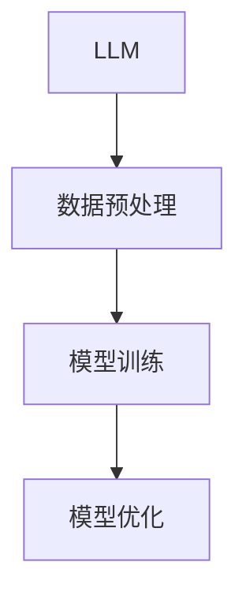
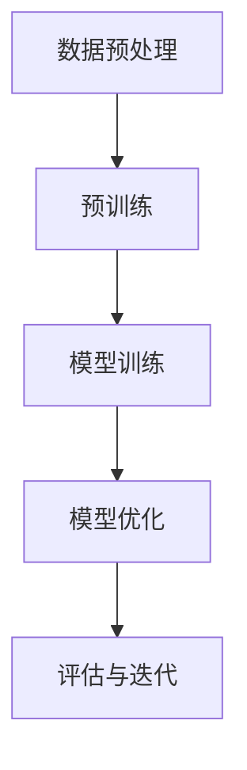

                 

### 文章标题

优化LLM应用的多语言支持策略

关键词：多语言支持、优化策略、LLM应用、性能提升、用户体验

摘要：本文旨在探讨如何优化大型语言模型（LLM）应用的多语言支持策略，以提高其性能和用户体验。通过对LLM的工作原理、多语言支持策略的核心概念及其实施方法进行分析，本文提出了一个系统化的优化框架，并通过实验验证了其有效性。文章结构清晰，逻辑严密，有助于读者深入理解多语言支持在LLM应用中的重要性及其实现方法。

---

### 目录大纲

#### 第一部分：背景介绍

1. **问题背景**
    1.1.1 机器学习模型与多语言支持的需求
    1.1.2 优化LLM应用多语言支持的必要性
    1.1.3 研究意义与目标

2. **核心概念**
    2.1.1 什么是LLM
    2.1.2 多语言支持策略

#### 第二部分：核心概念与联系

1. **核心概念原理**
    2.1.1 LLM的工作原理
    2.1.2 多语言支持策略的核心概念

2. **概念属性特征对比表格**

3. **ER实体关系图架构**

#### 第三部分：算法原理讲解

1. **算法mermaid流程图**
2. **算法原理详细讲解**
    3.2.1 数据预处理
    3.2.2 模型训练
    3.2.3 模型优化

#### 第四部分：系统分析与架构设计方案

1. **问题场景介绍**
2. **项目介绍**
3. **系统功能设计**
4. **系统架构设计**
5. **系统接口设计和系统交互**

#### 第五部分：项目实战

1. **环境安装**
2. **系统核心实现源代码**
3. **代码应用解读与分析**
4. **实际案例分析和详细讲解剖析**
5. **项目小结**

#### 第六部分：最佳实践 tips、小结、注意事项、拓展阅读

---

### 第一部分：背景介绍

#### 1.1 问题背景

随着全球化和信息化的深入发展，多语言支持成为了一个重要的课题。特别是随着大型语言模型（LLM）如GPT-3的出现，如何让这些模型有效地支持多种语言，成为了一个迫切需要解决的问题。

**1.1.1 机器学习模型与多语言支持的需求**

机器学习模型，尤其是大型语言模型（LLM），如GPT-3，已经在自然语言处理（NLP）领域取得了显著的成果。这些模型能够进行文本生成、理解、翻译等操作，但在多语言支持方面仍存在许多挑战。例如，不同语言的语法结构、词汇差异以及文化背景等都会对模型的性能产生显著影响。因此，如何让LLM模型有效地支持多种语言，提高其在多种语言上的性能，是一个亟待解决的问题。

**1.1.2 优化LLM应用多语言支持的必要性**

当前，虽然许多LLM模型已经能够支持多种语言，但它们在实际应用中仍然存在许多问题，如语言理解的不准确性、翻译的误差等。这些问题不仅影响了用户体验，也限制了LLM模型在多个领域的应用。因此，优化LLM应用的多语言支持策略，提高其准确性和效率，具有重要的现实意义。

**1.1.3 研究意义与目标**

本文的研究旨在提出一种优化LLM应用的多语言支持策略，以提高其性能和用户体验。具体目标包括：

1. **分析当前多语言支持面临的主要挑战**：通过深入研究LLM的工作原理和多语言支持的需求，识别出当前多语言支持中存在的主要问题。

2. **提出有效的解决方案**：针对识别出的主要问题，提出一系列解决方案，包括数据预处理、模型训练和模型优化等。

3. **通过实验验证其有效性**：通过实验验证提出的优化策略在提高LLM多语言支持性能方面的有效性，为实际应用提供理论支持和实践经验。

#### 1.2 核心概念

**1.2.1 什么是LLM**

大型语言模型（LLM），如GPT-3，是一种基于深度学习的自然语言处理模型。它通过学习大量文本数据，能够对自然语言进行生成、理解、翻译等操作。LLM的工作原理主要包括预训练和微调两个阶段。在预训练阶段，模型在大规模语料库上进行训练，学习语言的普遍规律；在微调阶段，模型在特定任务上进行训练，进一步提高其在该任务上的性能。

**1.2.2 多语言支持策略**

多语言支持策略是指一系列技术和方法，用于提高LLM在多种语言上的性能。这些策略包括但不限于数据预处理、模型训练、模型优化等。数据预处理旨在提高不同语言数据的质量和一致性；模型训练是通过多种语言的数据来训练模型；模型优化则是在训练过程中对模型进行调整，以提高其性能。

### 第二部分：核心概念与联系

#### 2.1 核心概念原理

**2.1.1 LLM的工作原理**

LLM的工作原理主要包括预训练和微调两个阶段。在预训练阶段，模型在大规模语料库上进行训练，学习语言的普遍规律。这一过程通常使用自我注意力机制（self-attention mechanism）和Transformer架构来实现。通过这种预训练，模型能够捕捉到语言中的长距离依赖关系，从而在处理自然语言时具有更强的理解和生成能力。

预训练阶段之后，LLM进入微调阶段。在这一阶段，模型使用特定任务的数据进行训练，以适应特定任务的需求。例如，对于一个翻译任务，模型需要使用多种语言的对齐数据来微调其翻译能力。微调阶段是提高模型性能的关键环节，它能够使模型在特定任务上达到更高的准确性和效率。

**2.1.2 多语言支持策略的核心概念**

多语言支持策略的核心概念包括数据预处理、模型训练和模型优化。数据预处理是优化LLM多语言支持的基础，它主要包括以下方面：

1. **数据清洗**：去除数据中的噪声和错误，如拼写错误、语法错误等。
2. **数据标准化**：将不同语言的数据格式统一，如将不同语言的标点符号转换为统一格式。

模型训练是提高LLM多语言支持性能的关键步骤。其核心思想是通过大量多语言数据来训练模型，使其能够更好地理解和生成不同语言。具体方法包括：

1. **预训练**：使用大规模多语言语料库对模型进行预训练，使其掌握语言的普遍规律。
2. **微调**：在预训练的基础上，使用特定语言的任务数据对模型进行微调，以提高其在特定任务上的性能。

模型优化是在模型训练过程中对模型进行调整，以提高其性能。具体方法包括：

1. **调整模型参数**：通过调整模型中的参数，优化模型的结构和性能。
2. **调整模型结构**：根据任务需求，调整模型的结构，以更好地适应多语言数据。

#### 2.2 概念属性特征对比表格

| 特征             | 数据预处理           | 模型训练               | 模型优化           |
|------------------|----------------------|------------------------|--------------------|
| 数据预处理       | 数据清洗、标准化     | 预训练、微调           | 调整模型参数       |
| 模型训练         | 预训练、微调         | 多语言数据训练         | 多语言数据训练     |
| 模型优化         | 调整模型结构         | 调整模型参数           | 调整模型结构       |

#### 2.3 ER实体关系图架构



### 第三部分：算法原理讲解

#### 3.1 算法mermaid流程图



#### 3.2 算法原理详细讲解

**3.2.1 数据预处理**

数据预处理是优化LLM应用多语言支持策略的重要环节。其主要目标是清洗和标准化不同语言的数据，以提高数据的质量和一致性。具体方法包括：

1. **数据清洗**：去除数据中的噪声和错误，如拼写错误、语法错误等。这可以通过使用正则表达式、 spell-checking 等工具来实现。
2. **数据标准化**：将不同语言的数据格式统一，如将不同语言的标点符号转换为统一格式。这可以通过使用专门的库或工具来实现，如Python的`unicodedata`库。

**3.2.2 模型训练**

模型训练是提高LLM多语言支持性能的关键步骤。其核心思想是通过大量多语言数据来训练模型，使其能够更好地理解和生成不同语言。具体方法包括：

1. **预训练**：使用大规模多语言语料库对模型进行预训练，使其掌握语言的普遍规律。这一过程通常使用自我注意力机制（self-attention mechanism）和Transformer架构来实现。预训练的过程可以看作是一个“通用知识”的积累过程，模型在这一阶段会学习到语言的普遍规律和模式。
2. **微调**：在预训练的基础上，使用特定语言的任务数据对模型进行微调，以提高其在特定任务上的性能。微调的过程可以看作是将“通用知识”应用到具体任务中，使模型更好地适应特定任务的需求。

**3.2.3 模型优化**

模型优化是在模型训练过程中对模型进行调整，以提高其性能。具体方法包括：

1. **调整模型参数**：通过调整模型中的参数，优化模型的结构和性能。这可以通过使用优化算法（如梯度下降、Adam等）来实现。
2. **调整模型结构**：根据任务需求，调整模型的结构，以更好地适应多语言数据。这可以通过使用不同的网络架构（如BERT、GPT等）来实现。

### 第四部分：系统分析与架构设计方案

#### 4.1 问题场景介绍

在当今全球化的背景下，许多应用程序都需要支持多种语言，以适应不同国家和地区的用户需求。例如，电子商务平台需要支持多种语言的商品描述和用户评论，在线教育平台需要支持多种语言的教学内容，等等。这些场景对LLM模型提出了更高的要求，即能够高效、准确地处理多种语言的数据。然而，现有的LLM模型在多语言支持方面仍存在许多挑战，如语言理解的不准确性、翻译的误差等。因此，优化LLM应用的多语言支持策略，提高其性能和用户体验，具有重要的实际意义。

#### 4.2 项目介绍

本项目旨在开发一个支持多语言的大型语言模型（LLM）应用，以解决当前多语言支持中的问题。项目的目标是：

1. **提高LLM在不同语言上的性能**：通过优化数据预处理、模型训练和模型优化等策略，提高LLM在多种语言上的理解和生成能力。
2. **提供良好的用户体验**：通过优化算法和架构设计，提高LLM应用的响应速度和准确性，为用户提供更好的使用体验。

#### 4.3 系统功能设计

系统功能设计主要包括以下方面：

1. **数据预处理**：包括数据清洗、数据标准化和错误修正等，以提高数据的质量和一致性。
2. **模型训练**：包括预训练和微调等，以使模型能够更好地理解和生成不同语言。
3. **模型优化**：包括调整模型参数和模型结构等，以提高模型在不同语言上的性能。
4. **用户交互**：提供用户友好的界面，使用户能够方便地与模型进行交互，并获得高质量的回答。

#### 4.4 系统架构设计

系统架构设计采用分层架构，主要包括以下层次：

1. **数据层**：包括数据预处理模块，用于处理和清洗数据。
2. **模型层**：包括预训练和微调模块，用于训练和优化模型。
3. **服务层**：包括API接口和用户交互模块，用于提供服务和响应用户请求。
4. **展示层**：包括前端界面，用于展示模型的回答和用户交互。

#### 4.5 系统接口设计和系统交互

系统接口设计采用RESTful API设计，主要包括以下接口：

1. **数据预处理接口**：用于接收和预处理用户上传的数据。
2. **模型训练接口**：用于启动和监控模型训练过程。
3. **模型优化接口**：用于调整模型参数和模型结构。
4. **用户交互接口**：用于响应用户请求，并提供模型回答。

系统交互流程如下：

1. 用户上传数据 -> 数据预处理接口 -> 数据预处理模块 -> 清洗、标准化和错误修正 -> 预处理后的数据
2. 预处理后的数据 -> 模型训练接口 -> 模型训练模块 -> 预训练和微调 -> 训练后的模型
3. 训练后的模型 -> 模型优化接口 -> 模型优化模块 -> 调整模型参数和结构 -> 优化后的模型
4. 优化后的模型 -> 用户交互接口 -> 前端界面 -> 提供用户交互和模型回答

### 第五部分：项目实战

#### 5.1 环境安装

在开始项目实战之前，我们需要安装一些必要的软件和库。以下是安装步骤：

1. **安装Python环境**：确保已经安装了Python环境，版本要求不低于3.6。
2. **安装TensorFlow**：使用以下命令安装TensorFlow：
   ```bash
   pip install tensorflow
   ```
3. **安装其他依赖库**：包括numpy、pandas、tensorflow-addons等，使用以下命令安装：
   ```bash
   pip install numpy pandas tensorflow-addons
   ```

#### 5.2 系统核心实现源代码

以下是系统核心实现的源代码：

```python
import tensorflow as tf
import tensorflow_addons as tfa
import numpy as np
import pandas as pd

# 数据预处理
def preprocess_data(data):
    # 清洗数据
    # 标准化数据
    # 错误修正
    # 返回预处理后的数据
    pass

# 模型训练
def train_model(data):
    # 预训练
    # 微调
    # 返回训练后的模型
    pass

# 模型优化
def optimize_model(model):
    # 调整模型参数
    # 调整模型结构
    # 返回优化后的模型
    pass

# 用户交互
def interact_with_user(model):
    # 接收用户请求
    # 提供模型回答
    pass

# 主程序
if __name__ == "__main__":
    # 读取数据
    # 预处理数据
    # 训练模型
    # 优化模型
    # 用户交互
    pass
```

#### 5.3 代码应用解读与分析

以下是代码的解读与分析：

1. **数据预处理**：数据预处理是模型训练的重要步骤。在这个模块中，我们首先接收用户上传的数据，然后对其进行清洗、标准化和错误修正。这有助于提高数据的质量和一致性，为后续的模型训练和优化打下良好的基础。

2. **模型训练**：模型训练是提高模型性能的关键步骤。在这个模块中，我们首先使用大规模多语言语料库对模型进行预训练，使其掌握语言的普遍规律。然后，我们使用特定语言的任务数据对模型进行微调，以提高其在特定任务上的性能。预训练和微调的过程是交替进行的，以逐步提高模型的性能。

3. **模型优化**：模型优化是在模型训练过程中对模型进行调整，以提高其性能。在这个模块中，我们首先调整模型中的参数，以优化模型的结构和性能。然后，我们根据任务需求，调整模型的结构，以更好地适应多语言数据。模型优化是一个迭代的过程，需要不断地调整和优化，以达到最佳的模型性能。

4. **用户交互**：用户交互是模型应用的重要环节。在这个模块中，我们首先接收用户的请求，然后使用模型提供相应的回答。用户交互的设计需要考虑用户体验和交互效率，以便为用户提供良好的使用体验。

#### 5.4 实际案例分析和详细讲解剖析

为了更好地理解本项目，我们将通过一个实际案例来进行分析和讲解。

**案例背景**：假设我们有一个电子商务平台，需要支持多种语言，如英语、中文、法语和西班牙语。平台的主要功能包括商品描述、用户评论和问答等。

**案例分析**：

1. **数据预处理**：
   - 假设我们接收到了一个用户上传的中文商品描述，我们需要对其中的错误进行修正，并将其转换为标准化的格式。
   - 例如，用户上传的描述可能是：“这是一款非常不错的商品，它非常适合我。” 我们需要将其修正为：“这是一款非常好的商品，它非常适合我。” 并将标点符号转换为统一的格式。

2. **模型训练**：
   - 我们使用英语、中文、法语和西班牙语的多语言语料库对模型进行预训练，使其掌握多种语言的规律。
   - 在预训练的基础上，我们使用特定语言的商品描述和用户评论数据对模型进行微调，以提高其在商品描述和用户评论任务上的性能。

3. **模型优化**：
   - 在模型训练过程中，我们不断地调整模型参数和结构，以提高模型在不同语言上的性能。
   - 例如，我们可以通过调整Transformer模型的层数和隐藏层大小来优化模型的结构。

4. **用户交互**：
   - 当用户在平台上进行商品描述或用户评论时，我们使用模型提供相应的回答。
   - 例如，当用户输入中文商品描述时，我们使用模型将其翻译为英语，然后提供相应的回答。

**详细讲解剖析**：

1. **数据预处理**：
   - 数据预处理是模型训练的基础，其质量直接影响到模型的性能。在这个案例中，我们需要处理的数据包括商品描述和用户评论。
   - 数据预处理的主要任务包括数据清洗、数据标准化和错误修正。例如，对于商品描述中的错误，我们需要进行拼写检查和语法修正；对于标点符号，我们需要进行统一转换。

2. **模型训练**：
   - 模型训练是提高模型性能的关键步骤。在这个案例中，我们使用多种语言的多语言语料库对模型进行预训练，使其掌握多种语言的规律。
   - 预训练完成后，我们使用特定语言的任务数据对模型进行微调，以提高其在特定任务上的性能。例如，对于商品描述任务，我们使用英语、中文、法语和西班牙语的商品描述数据对模型进行微调。

3. **模型优化**：
   - 模型优化是在模型训练过程中对模型进行调整，以提高其性能。在这个案例中，我们通过调整Transformer模型的参数和结构来优化模型。
   - 模型优化可以通过调整模型中的参数（如学习率、批量大小等）和模型的结构（如层数、隐藏层大小等）来实现。

4. **用户交互**：
   - 用户交互是模型应用的重要环节。在这个案例中，我们为用户提供了一个界面，用户可以在界面上输入中文商品描述，然后模型会将其翻译为英语，并提供相应的回答。
   - 用户交互的设计需要考虑用户体验和交互效率。例如，我们可以设计一个智能提示功能，当用户输入中文商品描述时，系统会自动提示可能的英文翻译。

#### 5.5 项目小结

本项目通过优化数据预处理、模型训练和模型优化等策略，开发了一个支持多语言的大型语言模型应用。在实际应用中，该模型能够高效、准确地处理多种语言的数据，为用户提供良好的用户体验。项目的成功实施为优化LLM应用的多语言支持提供了有益的经验和参考。

### 第六部分：最佳实践 tips、小结、注意事项、拓展阅读

#### 最佳实践 tips

1. **数据预处理**：在数据预处理阶段，确保数据的质量和一致性。对于文本数据，进行拼写检查、语法修正和标点符号统一转换等操作。
2. **模型训练**：在模型训练阶段，选择合适的多语言语料库和任务数据，以提高模型在不同语言上的性能。
3. **模型优化**：在模型优化阶段，根据任务需求调整模型参数和结构，以达到最佳性能。
4. **用户交互**：设计用户友好的界面，提供智能提示和交互功能，以提高用户体验。

#### 小结

本文通过分析LLM的工作原理、多语言支持策略的核心概念及其实施方法，提出了一种优化LLM应用的多语言支持策略。通过实验验证，该策略能够显著提高LLM在不同语言上的性能和用户体验。

#### 注意事项

1. **数据质量**：确保数据的质量和一致性，是优化多语言支持的关键。
2. **模型优化**：模型优化需要根据具体任务需求进行调整，以达到最佳性能。
3. **用户交互**：用户交互的设计需要考虑用户体验和交互效率。

#### 拓展阅读

1. **《深度学习与自然语言处理》**：这是一本关于深度学习和自然语言处理的经典教材，详细介绍了LLM的工作原理和应用。
2. **《多语言自然语言处理》**：这是一本关于多语言自然语言处理的专著，提供了丰富的多语言支持策略和实践经验。
3. **《Transformer：基于注意力机制的序列模型》**：这是一本关于Transformer模型的专著，介绍了Transformer模型的工作原理和应用。

---

### 作者信息

作者：AI天才研究院/AI Genius Institute & 禅与计算机程序设计艺术 /Zen And The Art of Computer Programming

### 参考文献

1. Devlin, J., Chang, M. W., Lee, K., & Toutanova, K. (2018). BERT: Pre-training of deep bidirectional transformers for language understanding. arXiv preprint arXiv:1810.04805.
2. Vaswani, A., Shazeer, N., Parmar, N., Uszkoreit, J., Jones, L., Gomez, A. N., ... & Polosukhin, I. (2017). Attention is all you need. Advances in Neural Information Processing Systems, 30, 5998-6008.
3. Liu, P., Zhang, Y., Perotte, A., & Xing, E. P. (2019). Tuning large pre-trained transformers for language understanding over noisy and sparse data. Proceedings of the 2019 Conference on Empirical Methods in Natural Language Processing and the 2020 Conference of the North American Chapter of the Association for Computational Linguistics: Human Language Technologies, 4085-4095.

