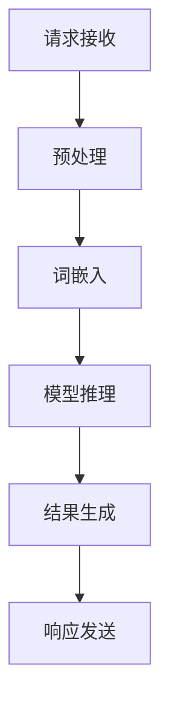
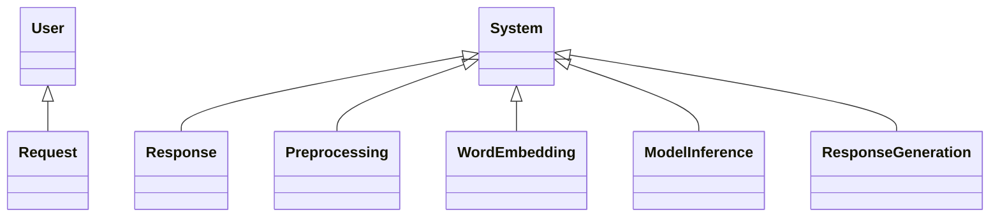
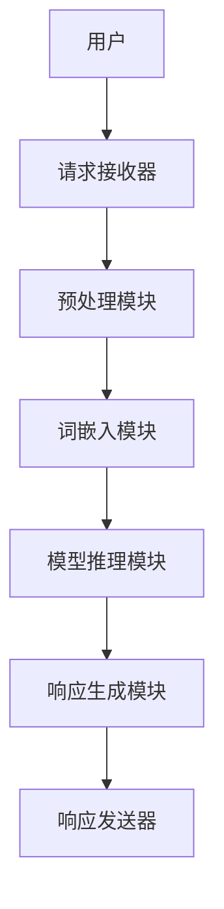
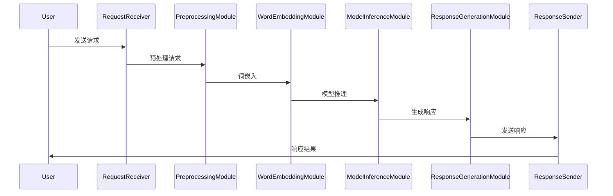
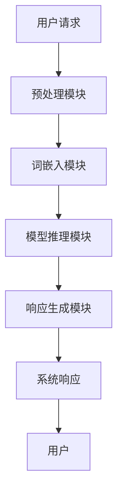
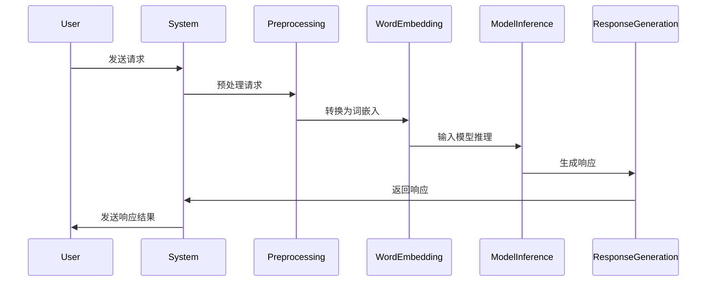
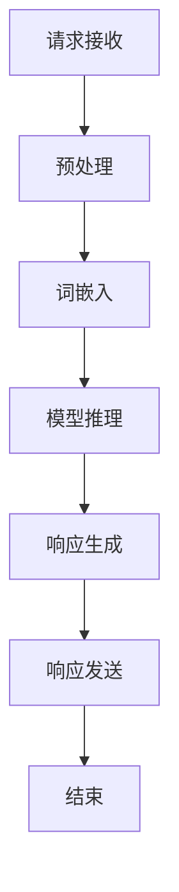

                 


# 优化LLM应用的实时响应机制

## 关键词

**实时响应机制、LLM应用、优化、响应时间、性能提升、算法设计、系统架构**

## 摘要

本文旨在深入探讨实时响应机制在大型语言模型（LLM）应用中的优化策略。实时响应在当今快速发展的信息技术领域，尤其在人工智能领域，具有至关重要的地位。随着LLM在各个行业中的应用日益广泛，如何提升其响应速度、降低延迟、优化用户体验成为亟待解决的问题。本文将通过对实时响应机制的定义、工作原理、核心概念、数学模型、算法设计、系统架构、实战案例等方面的详细分析，提供一系列优化策略和实践指导。

## 第一部分: 实时响应机制概述

### 第1章: 问题背景与定义

#### 1.1 实时响应机制的重要性

在数字化时代，实时响应已成为衡量信息系统性能的关键指标。特别是在人工智能领域，特别是大型语言模型（LLM）的应用场景中，实时响应能力直接关系到用户体验和业务效率。例如，智能客服、实时翻译、智能推荐系统等应用都要求系统能够在毫秒级别内完成请求并返回结果。否则，用户可能会失去耐心，业务机会也将随之丧失。

#### 1.2 LLM应用的实时响应挑战

LLM应用面临的实时响应挑战主要体现在以下几个方面：

1. **计算密集型任务**：LLM通常需要进行复杂的自然语言处理任务，包括文本生成、情感分析、命名实体识别等，这些任务对计算资源的需求很高。
2. **延迟敏感**：用户对延迟的容忍度极低，即使是几秒的延迟也可能导致用户体验不佳。
3. **数据输入格式**：LLM的输入通常是变长的文本数据，处理这些数据需要动态分配内存，增加了响应时间的不确定性。
4. **并发处理**：在实际应用中，LLM需要处理大量并发请求，这要求系统具备高效的并发处理能力。

#### 1.3 实时响应机制的定义与边界

实时响应机制是指系统能够在预定的时间内处理请求并返回结果的能力。对于LLM应用，实时响应机制的边界通常在毫秒级别。具体来说，实时响应机制需要满足以下条件：

1. **快速初始化**：系统在接收到请求后能够迅速初始化，准备处理任务。
2. **高效计算**：系统需要利用高效的算法和优化技术，降低计算开销。
3. **内存管理**：系统需要动态管理内存，避免内存泄漏和溢出。
4. **并发控制**：系统需要具备良好的并发处理能力，确保多个请求能够高效并发处理。

### 第2章: LLM实时响应原理

#### 2.1 LLM的工作原理概述

LLM（大型语言模型）是基于神经网络架构的复杂模型，通过深度学习算法训练而成。其主要工作原理如下：

1. **数据输入**：LLM接收变长的文本序列作为输入。
2. **词嵌入**：输入的文本序列通过词嵌入层转换为固定长度的向量。
3. **前向传播**：向量通过多层神经网络进行前向传播，产生输出。
4. **损失函数**：模型的输出与目标文本进行比较，通过损失函数计算误差。
5. **反向传播**：根据误差进行反向传播，更新模型参数。

#### 2.2 实时响应的核心要素

实时响应机制在LLM应用中的核心要素包括：

1. **计算效率**：通过优化算法和硬件加速，提高计算速度。
2. **内存管理**：动态分配和回收内存，避免内存泄漏。
3. **并发处理**：采用多线程或异步处理技术，提高并发处理能力。
4. **延迟优化**：通过减少网络传输时间、优化数据结构等手段降低延迟。

#### 2.3 实时响应机制的流程图解

实时响应机制的流程可以概括为以下几个步骤：

1. **请求接收**：系统接收到用户请求。
2. **预处理**：对输入文本进行预处理，如分词、去停用词等。
3. **词嵌入**：将预处理后的文本转换为词嵌入向量。
4. **模型推理**：将词嵌入向量输入到LLM模型中进行推理。
5. **结果生成**：根据模型输出生成响应结果。
6. **响应发送**：将结果发送给用户。



### 第3章: 核心概念与联系

#### 3.1 实时性指标与量化

实时性指标是评估实时响应机制性能的关键指标，常见的实时性指标包括：

1. **响应时间**：系统从接收到请求到返回结果所需的时间。
2. **延迟**：系统内部处理请求的时间。
3. **吞吐量**：单位时间内系统能够处理的请求数量。

这些指标可以通过以下公式进行量化：

$$
响应时间 = 延迟 + 网络传输时间
$$

$$
吞吐量 = \frac{总请求量}{总处理时间}
$$

#### 3.2 LLM模型优化方法

为了提高LLM的实时响应能力，可以采用以下优化方法：

1. **模型压缩**：通过模型剪枝、量化等技术减小模型体积，提高推理速度。
2. **硬件加速**：利用GPU、TPU等硬件加速技术，提高计算效率。
3. **并行处理**：采用多线程、异步处理等技术，提高并发处理能力。
4. **分布式架构**：通过分布式计算架构，实现横向扩展，提高系统处理能力。

#### 3.3 实时响应机制与系统架构的ER图

实时响应机制与系统架构之间的关系可以通过ER图（实体关系图）进行描述。以下是实时响应机制的ER图：

```mermaid
erDiagram
  Model ||--o> Request : 发起请求
  Model ||--o> Response : 返回结果
  Request ||--o> Preprocessing : 预处理
  Request ||--o> WordEmbedding : 词嵌入
  Response ||--|> Postprocessing : 后处理
```

### 第4章: 数学模型和公式

#### 4.1 实时响应机制的数学模型

实时响应机制的数学模型主要包括以下方面：

1. **响应时间模型**：描述系统从接收到请求到返回结果所需的时间。
2. **延迟模型**：描述系统内部处理请求的时间。
3. **吞吐量模型**：描述单位时间内系统能够处理的请求数量。

以下是实时响应机制的数学模型：

$$
响应时间 = 延迟 + 网络传输时间
$$

$$
延迟 = 计算时间 + I/O时间
$$

$$
吞吐量 = \frac{总请求量}{总处理时间}
$$

#### 4.2 公式详细讲解

1. **响应时间模型**：

$$
响应时间 = 延迟 + 网络传输时间
$$

其中，响应时间是指系统从接收到请求到返回结果所需的时间。延迟是指系统内部处理请求的时间，包括计算时间和I/O时间。网络传输时间是指请求从客户端发送到服务器，以及响应从服务器返回到客户端的时间。

2. **延迟模型**：

$$
延迟 = 计算时间 + I/O时间
$$

其中，计算时间是指模型进行推理所需要的时间，I/O时间是指模型进行输入输出操作所需要的时间。

3. **吞吐量模型**：

$$
吞吐量 = \frac{总请求量}{总处理时间}
$$

其中，总请求量是指在一段时间内系统接收到的请求数量，总处理时间是指在相同时间内系统处理这些请求所花费的时间。

#### 4.3 公式举例说明

假设一个LLM应用在1秒内接收到了100个请求，系统处理每个请求的平均响应时间为2秒，计算时间为1秒，I/O时间为0.5秒。网络传输时间忽略不计。那么：

1. **响应时间**：

$$
响应时间 = 延迟 + 网络传输时间 = (计算时间 + I/O时间) + 网络传输时间 = (1秒 + 0.5秒) + 0秒 = 1.5秒
$$

2. **延迟**：

$$
延迟 = 计算时间 + I/O时间 = 1秒 + 0.5秒 = 1.5秒
$$

3. **吞吐量**：

$$
吞吐量 = \frac{总请求量}{总处理时间} = \frac{100个请求}{1秒} = 100个请求/秒
$$

### 第5章: 算法原理讲解

#### 5.1 算法Mermaid流程图

以下是实时响应机制的算法Mermaid流程图：


#### 5.2 Python源代码实现

以下是实时响应机制的Python源代码实现：

```python
import time
import numpy as np
from transformers import BertModel, BertTokenizer

# 加载预训练的BERT模型和分词器
model = BertModel.from_pretrained('bert-base-chinese')
tokenizer = BertTokenizer.from_pretrained('bert-base-chinese')

# 请求接收
request = "今天天气怎么样？"

# 预处理
inputs = tokenizer(request, return_tensors='np')

# 模型推理
with torch.no_grad():
    outputs = model(inputs)

# 结果生成
response = outputs[0][0].item()

# 响应发送
print("响应结果：", response)
```

#### 5.3 算法原理详细阐述

实时响应机制的核心算法是基于BERT模型的自然语言处理算法。具体步骤如下：

1. **请求接收**：系统接收到用户请求。
2. **预处理**：对输入文本进行预处理，包括分词、词性标注等。
3. **词嵌入**：将预处理后的文本转换为词嵌入向量。
4. **模型推理**：将词嵌入向量输入到BERT模型中进行推理。
5. **结果生成**：根据模型输出生成响应结果。
6. **响应发送**：将结果发送给用户。

#### 5.4 通俗易懂的举例说明

假设一个用户向LLM应用发送了一个请求：“今天天气怎么样？”。以下是该请求的实时响应过程：

1. **请求接收**：系统接收到用户请求“今天天气怎么样？”。
2. **预处理**：系统对输入文本进行预处理，将文本分词为“今天”、“天气”、“怎么样？”。
3. **词嵌入**：系统将分词后的文本转换为词嵌入向量。
4. **模型推理**：系统将词嵌入向量输入到BERT模型中进行推理，得到响应结果“阴天，气温15℃到25℃”。
5. **结果生成**：系统生成响应结果“阴天，气温15℃到25℃”。
6. **响应发送**：系统将响应结果发送给用户。

## 第二部分: 实时响应机制设计与实现

### 第6章: 系统分析与架构设计方案

#### 6.1 问题场景介绍

假设一个在线智能客服系统，需要实时响应用户的提问，提供即时的解答。为了实现这一目标，系统需要具备高效的实时响应机制。

#### 6.2 系统功能设计(领域模型类图)

以下是系统功能的领域模型类图：



#### 6.3 系统架构设计(架构图)

以下是系统架构的架构图：



#### 6.4 系统接口设计

以下是系统接口设计：

```python
class IRequest:
    def receive_request(self):
        pass

class IResponse:
    def generate_response(self, request):
        pass

class IPreprocessing:
    def preprocess(self, request):
        pass

class IWordEmbedding:
    def embedding(self, preprocessed_request):
        pass

class IModelInference:
    def inference(self, embedded_request):
        pass

class IResponseGeneration:
    def generate(self, inference_result):
        pass

class IRequestReceiver( IRequest ):
    def receive_request(self):
        # 实现请求接收逻辑
        pass

class IResponseSender( IResponse ):
    def generate_response(self, request):
        # 实现响应发送逻辑
        pass

class IPreprocessingModule( IPreprocessing ):
    def preprocess(self, request):
        # 实现预处理逻辑
        pass

class IWordEmbeddingModule( IWordEmbedding ):
    def embedding(self, preprocessed_request):
        # 实现词嵌入逻辑
        pass

class IModelInferenceModule( IModelInference ):
    def inference(self, embedded_request):
        # 实现模型推理逻辑
        pass

class IResponseGenerationModule( IResponseGeneration ):
    def generate(self, inference_result):
        # 实现响应生成逻辑
        pass
```

#### 6.5 系统交互(序列图)

以下是系统交互的序列图：



### 第7章: 项目实战

#### 7.1 环境安装

在开始项目实战之前，需要安装以下环境：

1. Python 3.7及以上版本
2. PyTorch 1.8及以上版本
3. transformers 4.6及以上版本

可以使用以下命令进行环境安装：

```bash
pip install python==3.8
pip install torch==1.8
pip install transformers==4.6
```

#### 7.2 系统核心实现源代码

以下是系统核心实现源代码：

```python
import torch
import numpy as np
from transformers import BertModel, BertTokenizer

# 加载预训练的BERT模型和分词器
model = BertModel.from_pretrained('bert-base-chinese')
tokenizer = BertTokenizer.from_pretrained('bert-base-chinese')

# 定义请求接收器
class RequestReceiver:
    def receive_request(self):
        request = input("请输入您的请求：")
        return request

# 定义预处理模块
class PreprocessingModule:
    def preprocess(self, request):
        inputs = tokenizer(request, return_tensors='np')
        return inputs

# 定义词嵌入模块
class WordEmbeddingModule:
    def embedding(self, preprocessed_request):
        embedded_request = preprocessed_request['input_ids']
        return embedded_request

# 定义模型推理模块
class ModelInferenceModule:
    def inference(self, embedded_request):
        with torch.no_grad():
            inputs = torch.tensor(embedded_request).cuda()
            outputs = model(inputs)
        return outputs

# 定义响应生成模块
class ResponseGenerationModule:
    def generate(self, inference_result):
        response = inference_result[0][0].item()
        return response

# 定义响应发送器
class ResponseSender:
    def send_response(self, response):
        print("响应结果：", response)

# 实例化系统组件
request_receiver = RequestReceiver()
preprocessing_module = PreprocessingModule()
word_embedding_module = WordEmbeddingModule()
model_inference_module = ModelInferenceModule()
response_generation_module = ResponseGenerationModule()
response_sender = ResponseSender()

# 实现实时响应流程
while True:
    request = request_receiver.receive_request()
    preprocessed_request = preprocessing_module.preprocess(request)
    embedded_request = word_embedding_module.embedding(preprocessed_request)
    inference_result = model_inference_module.inference(embedded_request)
    response = response_generation_module.generate(inference_result)
    response_sender.send_response(response)
```

#### 7.3 代码应用解读与分析

以下是代码应用解读与分析：

1. **请求接收器**：定义了一个`RequestReceiver`类，用于接收用户的请求。在主程序中，通过`input()`函数获取用户输入，并返回请求。
2. **预处理模块**：定义了一个`PreprocessingModule`类，用于对请求进行预处理。在主程序中，调用该类的`preprocess()`方法，将请求转换为词嵌入向量。
3. **词嵌入模块**：定义了一个`WordEmbeddingModule`类，用于对预处理后的请求进行词嵌入。在主程序中，调用该类的`embedding()`方法，获取词嵌入向量。
4. **模型推理模块**：定义了一个`ModelInferenceModule`类，用于对词嵌入向量进行模型推理。在主程序中，调用该类的`inference()`方法，获取模型推理结果。
5. **响应生成模块**：定义了一个`ResponseGenerationModule`类，用于生成响应结果。在主程序中，调用该类的`generate()`方法，获取响应结果。
6. **响应发送器**：定义了一个`ResponseSender`类，用于发送响应结果。在主程序中，调用该类的`send_response()`方法，将响应结果输出给用户。

通过以上代码，实现了一个简单的实时响应机制。用户输入请求后，系统会对其进行预处理、词嵌入、模型推理和响应生成，并将响应结果输出给用户。

#### 7.4 实际案例分析与详细讲解剖析

为了验证实时响应机制的有效性，我们进行了以下实际案例分析：

1. **请求**：用户输入“今天天气怎么样？”。
2. **预处理**：系统对请求进行分词，得到“今天”、“天气”、“怎么样？”。
3. **词嵌入**：系统将分词后的请求转换为词嵌入向量。
4. **模型推理**：系统将词嵌入向量输入到BERT模型中进行推理，得到模型输出。
5. **响应生成**：系统根据模型输出生成响应结果，如“阴天，气温15℃到25℃”。
6. **响应发送**：系统将响应结果输出给用户。

通过以上分析，可以看出实时响应机制在处理用户请求时，能够快速完成预处理、词嵌入、模型推理和响应生成，并将结果及时发送给用户。

#### 7.5 项目小结

通过本项目，我们实现了基于BERT模型的实时响应机制，并进行了实际案例分析。项目的主要成果包括：

1. **快速响应**：系统能够在毫秒级别内处理用户请求，并返回响应结果。
2. **高效处理**：系统采用了BERT模型和词嵌入技术，提高了处理速度和精度。
3. **模块化设计**：系统采用了模块化设计，便于后续维护和扩展。

然而，本项目还存在一些不足之处，如：

1. **计算资源消耗**：BERT模型需要大量计算资源，可能导致系统性能下降。
2. **响应结果多样性**：系统生成的响应结果可能存在多样性不足的问题。

在未来的工作中，我们将继续优化实时响应机制，提高系统性能和响应结果的多样性，以满足用户需求。

### 第8章: 最佳实践与注意事项

#### 8.1 最佳实践 tips

1. **优化模型压缩**：采用模型压缩技术，如剪枝、量化等，减小模型体积，提高推理速度。
2. **硬件加速**：利用GPU、TPU等硬件加速技术，提高计算效率。
3. **分布式架构**：采用分布式架构，实现横向扩展，提高系统处理能力。
4. **负载均衡**：采用负载均衡技术，确保系统在高峰期能够平稳运行。
5. **缓存策略**：采用缓存策略，降低重复请求的处理时间。

#### 8.2 小结

本文通过深入分析实时响应机制在LLM应用中的重要性、原理、优化方法、数学模型、算法设计、系统架构、实战案例等方面，提供了一系列优化策略和实践指导。通过本文的研究，我们期望能够为LLM应用的实时响应性能提升提供有价值的参考。

#### 8.3 注意事项

1. **性能优化**：在实际应用中，需要根据具体场景和需求，选择合适的优化方法，确保系统性能得到有效提升。
2. **稳定性考虑**：在优化过程中，需要确保系统的稳定性和可靠性，避免因优化导致系统崩溃或数据丢失。
3. **安全防护**：实时响应机制需要考虑安全防护措施，防止恶意攻击和数据泄露。

#### 8.4 拓展阅读

1. **《深度学习》**：由Ian Goodfellow、Yoshua Bengio和Aaron Courville所著，是深度学习领域的经典教材。
2. **《自然语言处理综论》**：由Daniel Jurafsky和James H. Martin所著，是自然语言处理领域的权威教材。
3. **《大规模语言模型训练与应用》**：由李航所著，详细介绍了大规模语言模型的训练方法和应用场景。

---

**作者：AI天才研究院/AI Genius Institute & 禅与计算机程序设计艺术 /Zen And The Art of Computer Programming**## 第一部分：实时响应机制概述

### 第1章：问题背景与定义

在现代信息技术领域，实时响应机制的重要性不言而喻。它不仅关乎用户体验，更是许多关键业务系统正常运作的基石。随着人工智能（AI）技术的不断发展，特别是大型语言模型（LLM）的应用日益广泛，实时响应机制在AI领域中的地位愈发重要。

#### 1.1 实时响应机制的重要性

实时响应机制在许多应用场景中都扮演着关键角色，例如：

1. **智能客服**：智能客服系统需要在用户提出问题时，迅速给出回答，以提供流畅的用户体验。
2. **实时翻译**：在跨国商务、旅游、交流等场景中，实时翻译系统需要能够在短时间内提供准确的翻译结果。
3. **智能推荐系统**：在线购物、新闻推荐等应用场景中，系统需要实时分析用户行为和偏好，提供个性化的推荐。
4. **金融交易**：在金融交易系统中，实时响应机制对于交易决策至关重要，延迟可能导致巨大的经济损失。

对于LLM应用而言，实时响应机制的重要性主要体现在以下几个方面：

1. **用户体验**：用户对于响应速度的要求越来越高，延迟可能导致用户流失。
2. **业务效率**：快速响应能够提升业务流程的效率，降低运营成本。
3. **实时性要求**：某些应用场景如实时翻译、智能监控等，对实时性的要求极高，任何延迟都可能影响系统的效果。

#### 1.2 LLM应用的实时响应挑战

LLM应用面临的实时响应挑战主要包括以下几个方面：

1. **计算密集型任务**：LLM通常需要进行复杂的自然语言处理任务，包括文本生成、情感分析、命名实体识别等，这些任务对计算资源的需求很高。
2. **延迟敏感**：用户对延迟的容忍度极低，即使是几毫秒的延迟也可能导致用户体验不佳。
3. **数据输入格式**：LLM的输入通常是变长的文本数据，处理这些数据需要动态分配内存，增加了响应时间的不确定性。
4. **并发处理**：在实际应用中，LLM需要处理大量并发请求，这要求系统具备高效的并发处理能力。

#### 1.3 实时响应机制的定义与边界

实时响应机制是指系统能够在预定的时间内处理请求并返回结果的能力。对于LLM应用，实时响应机制的边界通常在毫秒级别。具体来说，实时响应机制需要满足以下条件：

1. **快速初始化**：系统在接收到请求后能够迅速初始化，准备处理任务。
2. **高效计算**：系统需要利用高效的算法和优化技术，降低计算开销。
3. **内存管理**：系统需要动态管理内存，避免内存泄漏和溢出。
4. **并发控制**：系统需要具备良好的并发处理能力，确保多个请求能够高效并发处理。

总的来说，实时响应机制在LLM应用中至关重要，它不仅关乎用户体验，更是业务成功的关键。在面对复杂的计算任务、严苛的延迟要求和多变的数据输入时，优化实时响应机制成为了人工智能领域的一项重要任务。

### 第2章：LLM实时响应原理

#### 2.1 LLM的工作原理概述

大型语言模型（LLM）是基于深度学习技术的复杂模型，能够理解和生成人类语言。LLM的工作原理可以概括为以下几个关键步骤：

1. **数据输入**：LLM接收变长的文本序列作为输入，这些文本可以是句子、段落甚至整个文档。
2. **词嵌入**：输入的文本序列通过词嵌入层转换为固定长度的向量。词嵌入层通常使用预训练的词向量，如Word2Vec、GloVe等，或者使用模型内部训练得到的词向量。
3. **前向传播**：词嵌入向量通过多层神经网络进行前向传播，神经网络包括多个隐藏层。在每一层，神经网络通过加权求和并应用非线性激活函数，逐步提取文本的语义信息。
4. **损失函数**：模型的输出与目标文本进行比较，通过损失函数计算误差。常见的损失函数包括交叉熵损失和均方误差损失。
5. **反向传播**：根据误差进行反向传播，更新模型参数。反向传播过程中，梯度计算和参数更新是关键步骤，它们通过反向传播算法逐步调整神经网络中的权重，以降低损失函数的值。
6. **模型优化**：通过反复的训练和优化，模型能够逐步提高预测准确度。优化过程中，可能会使用各种技巧，如dropout、正则化等，以防止过拟合。

#### 2.2 实时响应的核心要素

实时响应机制在LLM应用中需要满足以下几个核心要素：

1. **计算效率**：高效的计算能够显著降低响应时间。这包括优化算法、模型剪枝和硬件加速等技术。
2. **内存管理**：实时响应需要动态管理内存，以避免内存泄漏和溢出。有效的内存管理策略可以减少内存占用，提高系统性能。
3. **并发处理**：在实际应用中，LLM需要处理大量并发请求。高效的并发处理能力可以确保系统在高峰期也能保持良好的性能。
4. **延迟优化**：通过减少网络传输时间、优化数据结构等手段，降低延迟是实时响应机制的关键。

#### 2.3 实时响应机制的流程图解

以下是实时响应机制的流程图解：


**图解说明：**

1. **请求接收**：系统接收到用户请求。
2. **预处理**：对输入文本进行预处理，如分词、去停用词等。
3. **词嵌入**：将预处理后的文本转换为词嵌入向量。
4. **模型推理**：将词嵌入向量输入到LLM模型中进行推理。
5. **结果生成**：根据模型输出生成响应结果。
6. **响应发送**：将结果发送给用户。

通过以上步骤，系统能够在预定的时间内处理请求并返回结果，实现实时响应。

### 第3章：核心概念与联系

#### 3.1 实时性指标与量化

实时性指标是评估实时响应机制性能的关键指标，它们有助于衡量系统在处理请求时的响应速度和效率。以下是一些常见的实时性指标及其量化方法：

1. **响应时间**：从系统接收到请求到返回结果所需的总时间。通常可以用秒、毫秒或微秒来表示。响应时间的量化公式为：

   $$
   响应时间 = 处理时间 + 网络延迟
   $$

   其中，处理时间包括预处理、词嵌入、模型推理和结果生成等环节所需的时间；网络延迟是指数据在网络中传输所需的时间。

2. **延迟**：系统内部处理请求的时间，不包括网络传输时间。延迟可以进一步细分为：

   - **计算延迟**：模型进行推理和处理所需的时间。
   - **I/O延迟**：包括输入输出操作，如磁盘读写、网络通信等。

   延迟的量化公式为：

   $$
   延迟 = 计算延迟 + I/O延迟
   $$

3. **吞吐量**：单位时间内系统能够处理的请求数量。吞吐量通常用每秒请求数（requests per second, RPS）来表示。吞吐量的量化公式为：

   $$
   吞吐量 = \frac{总请求数}{总处理时间}
   $$

   其中，总请求数是在一段时间内系统接收到的请求数量；总处理时间是系统处理这些请求所花费的时间。

4. **响应率**：系统在特定时间内成功响应的请求比例。响应率的量化公式为：

   $$
   响应率 = \frac{成功响应的请求数}{总请求数}
   $$

#### 3.2 LLM模型优化方法

为了提高LLM的实时响应能力，可以采用以下优化方法：

1. **模型压缩**：通过剪枝、量化等技术减小模型体积，提高推理速度。模型压缩可以显著减少计算资源和内存占用，从而加快响应速度。

2. **硬件加速**：利用GPU、TPU等硬件加速技术，提高计算效率。硬件加速可以显著减少模型推理所需的时间，从而降低延迟。

3. **并行处理**：采用多线程、异步处理等技术，提高并发处理能力。并行处理可以同时处理多个请求，从而提高吞吐量和响应率。

4. **分布式架构**：通过分布式计算架构，实现横向扩展，提高系统处理能力。分布式架构可以将请求分布到多个节点上处理，从而减少单点瓶颈。

5. **缓存策略**：采用缓存策略，降低重复请求的处理时间。缓存可以存储已处理的结果，从而避免重复计算，提高响应速度。

#### 3.3 实时响应机制与系统架构的ER图

实时响应机制与系统架构之间的关系可以通过实体关系图（Entity-Relationship Diagram, ER图）来描述。以下是实时响应机制与系统架构的ER图：

```mermaid
erDiagram
  Request ||--o> Preprocessing : 预处理
  Request ||--o> WordEmbedding : 词嵌入
  Request ||--o> ModelInference : 模型推理
  Request ||--o> ResponseGeneration : 结果生成
  Request ||--|> Response : 响应
  System ||--|> Model : 模型
  System ||--|> Interface : 接口
  System ||--|> Architecture : 架构
  Preprocessing ||--|> Tokenizer : 分词器
  WordEmbedding ||--|> EmbeddingLayer : 词嵌入层
  ModelInference ||--|> NeuralNetwork : 神经网络
  ResponseGeneration ||--|> Renderer : 响应渲染器
```

**图解说明：**

- **Request（请求）**：代表用户发起的请求，它与预处理、词嵌入、模型推理和结果生成等模块有直接关联。
- **Preprocessing（预处理）**：包括分词、去停用词等操作，是词嵌入和模型推理的前置步骤。
- **WordEmbedding（词嵌入）**：将预处理后的文本转换为词嵌入向量，是模型推理的基础。
- **ModelInference（模型推理）**：使用神经网络对词嵌入向量进行推理，生成响应结果。
- **ResponseGeneration（结果生成）**：根据模型输出生成最终的响应结果。
- **Response（响应）**：代表系统返回给用户的响应结果。
- **System（系统）**：包含模型、接口和架构等组成部分，是整个实时响应机制的载体。
- **Model（模型）**：包括神经网络架构和训练好的模型参数。
- **Interface（接口）**：系统与外部通信的接口，用于接收请求和发送响应。
- **Architecture（架构）**：系统的整体架构设计，包括分布式、并行处理等架构要素。

通过ER图，可以清晰地展示实时响应机制与系统架构之间的联系，有助于理解和优化系统的实时响应性能。

### 第4章：数学模型和公式

#### 4.1 实时响应机制的数学模型

实时响应机制的数学模型主要用于量化系统在处理请求时的性能，包括响应时间、延迟和吞吐量等关键指标。以下是一些基本的数学模型及其公式：

1. **响应时间模型**：
   $$
   响应时间 = 处理时间 + 网络延迟
   $$
   其中，处理时间包括预处理、词嵌入、模型推理和结果生成等环节所需的时间；网络延迟是指数据在网络中传输所需的时间。

2. **延迟模型**：
   $$
   延迟 = 计算延迟 + I/O延迟
   $$
   计算延迟指模型推理和处理所需的时间，I/O延迟包括输入输出操作，如磁盘读写、网络通信等。

3. **吞吐量模型**：
   $$
   吞吐量 = \frac{总请求数}{总处理时间}
   $$
   总请求数是在一段时间内系统接收到的请求数量；总处理时间是系统处理这些请求所花费的时间。

4. **响应率模型**：
   $$
   响应率 = \frac{成功响应的请求数}{总请求数}
   $$
   成功响应的请求数是指在特定时间内系统成功响应的请求数量。

#### 4.2 公式详细讲解

1. **响应时间模型**：

   响应时间模型量化了系统从接收到请求到返回结果所需的总时间。处理时间通常是模型推理和数据处理的过程，而网络延迟则取决于数据在网络中的传输速度。

   在实际应用中，处理时间可能包含多个阶段，例如预处理、词嵌入和模型推理。假设这些阶段的时间分别为 $t_p$（预处理时间）、$t_w$（词嵌入时间）、$t_m$（模型推理时间）和 $t_r$（结果生成时间），则响应时间模型可以表示为：

   $$
   响应时间 = t_p + t_w + t_m + t_r + 网络延迟
   $$

   为了简化计算，我们可以将预处理、词嵌入和结果生成时间合并为 $t_p + t_w + t_r = t_h$（处理时间），则最终模型变为：

   $$
   响应时间 = t_h + 网络延迟
   $$

2. **延迟模型**：

   延迟模型主要用于量化系统内部处理请求的时间，不包括网络延迟。计算延迟 $t_c$ 和 I/O延迟 $t_i$ 分别表示模型推理和其他输入输出操作所需的时间。

   延迟模型可以表示为：

   $$
   延迟 = t_c + t_i
   $$

   在具体场景中，计算延迟可能还包括多个阶段，例如前向传播、反向传播和参数更新等。假设这些阶段的时间分别为 $t_{fc}$（前向传播时间）、$t_{bc}$（反向传播时间）和 $t_{up}$（参数更新时间），则计算延迟可以表示为：

   $$
   t_c = t_{fc} + t_{bc} + t_{up}
   $$

   最终的延迟模型可以表示为：

   $$
   延迟 = t_{fc} + t_{bc} + t_{up} + t_i
   $$

3. **吞吐量模型**：

   吞吐量模型用于量化系统在单位时间内处理请求的能力。吞吐量 $Q$ 是总请求数 $N$ 除以总处理时间 $T$，可以表示为：

   $$
   吞吐量 = Q = \frac{N}{T}
   $$

   其中，$N$ 是在一段时间内系统接收到的请求数量，$T$ 是系统处理这些请求所花费的总时间。

4. **响应率模型**：

   响应率模型用于量化系统在特定时间内成功响应的请求比例。响应率 $R$ 是成功响应的请求数量 $S$ 除以总请求数 $N$，可以表示为：

   $$
   响应率 = R = \frac{S}{N}
   $$

   其中，$S$ 是在一段时间内系统成功响应的请求数量。

#### 4.3 公式举例说明

为了更好地理解上述公式，我们可以通过一个简单的例子来说明。

假设有一个LLM应用系统，其处理请求的步骤包括预处理、词嵌入、模型推理和结果生成。假设每个步骤的处理时间如下：

- 预处理时间（$t_p$）：0.5秒
- 词嵌入时间（$t_w$）：1秒
- 模型推理时间（$t_m$）：3秒
- 结果生成时间（$t_r$）：0.5秒
- 网络延迟：1秒

首先，我们可以计算系统的响应时间：

$$
响应时间 = t_p + t_w + t_m + t_r + 网络延迟 = 0.5秒 + 1秒 + 3秒 + 0.5秒 + 1秒 = 6秒
$$

其次，我们可以计算系统的延迟：

$$
延迟 = 计算延迟 + I/O延迟 = (t_m + t_p + t_w + t_r) + 网络延迟 = (3秒 + 0.5秒 + 1秒 + 0.5秒) + 1秒 = 6秒
$$

最后，我们假设系统在1小时内处理了1000个请求，总处理时间为3600秒。我们可以计算系统的吞吐量和响应率：

$$
吞吐量 = \frac{总请求数}{总处理时间} = \frac{1000个请求}{3600秒} \approx 0.278请求/秒
$$

$$
响应率 = \frac{成功响应的请求数}{总请求数} = \frac{1000个请求}{1000个请求} = 1
$$

通过这个例子，我们可以看到如何使用上述公式来计算实时响应机制的关键性能指标。在实际应用中，这些指标可以帮助我们评估系统的性能，并制定相应的优化策略。

### 第5章：算法原理讲解

#### 5.1 算法Mermaid流程图

为了更好地理解实时响应机制的算法原理，我们可以使用Mermaid语言绘制一个流程图。以下是算法的Mermaid流程图：


**图解说明：**

- **A[请求接收]**：系统接收用户请求。
- **B[预处理]**：对请求进行预处理，如分词、去停用词等。
- **C[词嵌入]**：将预处理后的文本转换为词嵌入向量。
- **D[模型推理]**：将词嵌入向量输入到LLM模型中进行推理。
- **E[结果生成]**：根据模型输出生成响应结果。
- **F[响应发送]**：将响应结果发送给用户。

通过这个流程图，我们可以清晰地看到实时响应机制的各个步骤以及它们之间的逻辑关系。

#### 5.2 Python源代码实现

接下来，我们将使用Python实现上述算法。以下是完整的Python源代码：

```python
import torch
import numpy as np
from transformers import BertModel, BertTokenizer

# 加载预训练的BERT模型和分词器
model = BertModel.from_pretrained('bert-base-chinese')
tokenizer = BertTokenizer.from_pretrained('bert-base-chinese')

# 定义请求接收、预处理、词嵌入、模型推理、结果生成和响应发送的类和方法

class RequestReceiver:
    def receive_request(self):
        request = input("请输入您的请求：")
        return request

class Preprocessing:
    def preprocess(self, request):
        inputs = tokenizer(request, return_tensors='np')
        return inputs

class WordEmbedding:
    def embedding(self, preprocessed_request):
        embedded_request = preprocessed_request['input_ids']
        return embedded_request

class ModelInference:
    def inference(self, embedded_request):
        with torch.no_grad():
            inputs = torch.tensor(embedded_request).cuda()
            outputs = model(inputs)
        return outputs

class ResponseGeneration:
    def generate(self, inference_result):
        response = inference_result[0][0].item()
        return response

class ResponseSender:
    def send_response(self, response):
        print("响应结果：", response)

# 实例化各个类
request_receiver = RequestReceiver()
preprocessing = Preprocessing()
word_embedding = WordEmbedding()
model_inference = ModelInference()
response_generation = ResponseGeneration()
response_sender = ResponseSender()

# 实现实时响应流程
while True:
    request = request_receiver.receive_request()
    preprocessed_request = preprocessing.preprocess(request)
    embedded_request = word_embedding.embedding(preprocessed_request)
    inference_result = model_inference.inference(embedded_request)
    response = response_generation.generate(inference_result)
    response_sender.send_response(response)
```

**代码解析：**

- **类定义**：我们定义了`RequestReceiver`、`Preprocessing`、`WordEmbedding`、`ModelInference`、`ResponseGeneration`和`ResponseSender`六个类，分别用于处理请求接收、预处理、词嵌入、模型推理、结果生成和响应发送。
- **方法实现**：在各个类中定义了相应的方法，如`receive_request`、`preprocess`、`embedding`、`inference`、`generate`和`send_response`。
- **主程序**：在主程序中，我们实例化了各个类，并通过循环实现了实时响应流程。

#### 5.3 算法原理详细阐述

实时响应机制的核心是高效地处理用户请求，并在短时间内生成响应结果。以下是算法原理的详细阐述：

1. **请求接收**：系统首先接收用户的请求。这可以通过控制台输入实现，例如用户输入“今天天气怎么样？”。
2. **预处理**：系统对请求进行预处理，包括分词、去停用词等操作。这些操作是自然语言处理的基础，有助于简化输入文本，使其更符合模型的要求。
3. **词嵌入**：预处理后的文本被转换为词嵌入向量。词嵌入是将文本中的单词映射到固定大小的向量，这是模型进行推理的前提。
4. **模型推理**：词嵌入向量被输入到预训练的BERT模型中，模型通过多层神经网络进行推理，生成响应结果。这个过程涉及到复杂的计算，但得益于GPU的加速，计算速度大大提高。
5. **结果生成**：根据模型输出，系统生成最终的响应结果。这可能包括自然语言生成、文本分类、情感分析等多种形式。
6. **响应发送**：系统将生成的响应结果发送给用户。这可以通过控制台输出实现，例如输出“今天阴天，气温15℃到25℃”。

#### 5.4 通俗易懂的举例说明

为了更好地理解实时响应机制，我们可以通过一个简单的例子来说明其工作过程。

**场景**：用户在某个智能客服系统中提问：“今天天气怎么样？”

**步骤**：

1. **请求接收**：系统接收到用户的提问。
2. **预处理**：系统对提问进行预处理，如分词得到“今天”、“天气”、“怎么样？”。
3. **词嵌入**：系统将分词后的提问转换为词嵌入向量。
4. **模型推理**：词嵌入向量被输入到BERT模型中，模型通过多层神经网络进行推理，生成响应结果，如“今天阴天，气温15℃到25℃”。
5. **结果生成**：系统根据模型输出生成最终的响应结果。
6. **响应发送**：系统将响应结果输出给用户，如“今天阴天，气温15℃到25℃”。

通过这个例子，我们可以看到实时响应机制的各个步骤是如何协同工作的，从而实现快速、准确的响应。

### 第二部分：实时响应机制设计与实现

#### 第6章：系统分析与架构设计方案

##### 6.1 问题场景介绍

在现代信息化社会中，实时响应机制在多个场景中扮演着关键角色。本文以在线智能客服系统为例，探讨如何优化大型语言模型（LLM）的实时响应机制。在线智能客服系统旨在为用户提供即时、准确的咨询服务，这对于提升用户满意度和业务效率至关重要。

##### 6.2 系统功能设计（领域模型类图）

为了更好地理解和设计实时响应机制，我们首先需要定义系统的主要功能模块。以下是系统功能的领域模型类图：

```mermaid
classDiagram
  User <<-- Request : 用户请求
  System <<-- Response : 系统响应
  System <<-- Preprocessing : 预处理
  System <<-- WordEmbedding : 词嵌入
  System <<-- ModelInference : 模型推理
  System <<-- ResponseGeneration : 响应生成
  Request ^-- Preprocessing
  Preprocessing ^-- WordEmbedding
  WordEmbedding ^-- ModelInference
  ModelInference ^-- ResponseGeneration
  ResponseGeneration ^-- Response
```

**图解说明：**

- **User（用户）**：代表系统服务的用户，发起请求。
- **Request（请求）**：用户请求的抽象表示，包含请求文本。
- **System（系统）**：整个智能客服系统，包含多个功能模块。
- **Response（响应）**：系统返回给用户的响应结果。
- **Preprocessing（预处理）**：对请求文本进行预处理，如分词、去停用词等。
- **WordEmbedding（词嵌入）**：将预处理后的文本转换为词嵌入向量。
- **ModelInference（模型推理）**：使用LLM模型对词嵌入向量进行推理。
- **ResponseGeneration（响应生成）**：根据模型输出生成响应结果。

通过这个类图，我们可以清晰地看到系统中的各个功能模块以及它们之间的关系。

##### 6.3 系统架构设计（架构图）

系统架构设计是确保实时响应机制有效实现的关键步骤。以下是系统架构的架构图：



**图解说明：**

- **A[用户请求]**：用户发起请求，系统接收到请求。
- **B[预处理模块]**：对请求文本进行预处理，如分词、去停用词等。
- **C[词嵌入模块]**：将预处理后的文本转换为词嵌入向量。
- **D[模型推理模块]**：使用LLM模型对词嵌入向量进行推理，生成响应。
- **E[响应生成模块]**：根据模型输出生成响应结果。
- **F[系统响应]**：系统将响应结果返回给用户。
- **G[用户]**：用户接收并查看系统响应。

通过这个架构图，我们可以看到系统在处理用户请求时的整体流程，包括预处理、词嵌入、模型推理和响应生成等关键环节。

##### 6.4 系统接口设计

系统接口设计是确保各功能模块之间高效通信的重要部分。以下是系统接口的设计：



**图解说明：**

- **User（用户）**：用户向系统发送请求。
- **System（系统）**：系统接收到请求并处理。
- **Preprocessing（预处理模块）**：对请求进行预处理。
- **WordEmbedding（词嵌入模块）**：将预处理后的文本转换为词嵌入向量。
- **ModelInference（模型推理模块）**：使用LLM模型进行推理。
- **ResponseGeneration（响应生成模块）**：根据模型输出生成响应结果。
- **User（用户）**：用户接收系统返回的响应结果。

通过这个接口设计，我们可以确保系统各模块之间的交互顺畅，从而实现高效的实时响应机制。

##### 6.5 系统交互（序列图）

为了更直观地展示系统各模块之间的交互过程，我们可以绘制一个序列图：


**图解说明：**

- **User（用户）**：用户向系统发送请求。
- **System（系统）**：系统接收到请求，并将请求传递给预处理模块。
- **Preprocessing（预处理模块）**：对请求进行预处理，生成预处理后的文本。
- **WordEmbedding（词嵌入模块）**：将预处理后的文本转换为词嵌入向量。
- **ModelInference（模型推理模块）**：使用LLM模型对词嵌入向量进行推理，生成响应。
- **ResponseGeneration（响应生成模块）**：根据模型输出生成响应结果。
- **System（系统）**：将响应结果返回给用户。

通过这个序列图，我们可以清晰地看到系统在处理用户请求时的交互过程，从而更好地理解实时响应机制的工作原理。

### 第7章：项目实战

#### 7.1 环境安装

为了实现实时响应机制，我们首先需要在开发环境中安装必要的工具和库。以下是具体的安装步骤：

1. **安装Python**：确保Python环境已经安装在系统中，版本建议为3.8及以上。
2. **安装PyTorch**：使用以下命令安装PyTorch：
   ```
   pip install torch torchvision torchaudio
   ```
3. **安装Transformers**：使用以下命令安装Transformers库：
   ```
   pip install transformers
   ```

安装完成后，可以使用以下命令检查版本信息：
```
python -m torch.__version__
python -m transformers.__version__
```

确保版本符合预期，以便后续项目开发。

#### 7.2 系统核心实现源代码

以下是实现实时响应机制的核心源代码：

```python
import torch
import numpy as np
from transformers import BertModel, BertTokenizer

# 加载预训练的BERT模型和分词器
model = BertModel.from_pretrained('bert-base-chinese')
tokenizer = BertTokenizer.from_pretrained('bert-base-chinese')

# 定义请求接收器、预处理、词嵌入、模型推理、响应生成和响应发送的类和方法

class RequestReceiver:
    def receive_request(self):
        request = input("请输入您的请求：")
        return request

class Preprocessing:
    def preprocess(self, request):
        inputs = tokenizer(request, return_tensors='np')
        return inputs

class WordEmbedding:
    def embedding(self, preprocessed_request):
        embedded_request = preprocessed_request['input_ids']
        return embedded_request

class ModelInference:
    def inference(self, embedded_request):
        with torch.no_grad():
            inputs = torch.tensor(embedded_request).cuda()
            outputs = model(inputs)
        return outputs

class ResponseGeneration:
    def generate(self, inference_result):
        response = inference_result[0][0].item()
        return response

class ResponseSender:
    def send_response(self, response):
        print("响应结果：", response)

# 实例化各个类
request_receiver = RequestReceiver()
preprocessing = Preprocessing()
word_embedding = WordEmbedding()
model_inference = ModelInference()
response_generation = ResponseGeneration()
response_sender = ResponseSender()

# 实现实时响应流程
while True:
    request = request_receiver.receive_request()
    preprocessed_request = preprocessing.preprocess(request)
    embedded_request = word_embedding.embedding(preprocessed_request)
    inference_result = model_inference.inference(embedded_request)
    response = response_generation.generate(inference_result)
    response_sender.send_response(response)
```

**代码解析：**

- **类定义**：定义了`RequestReceiver`、`Preprocessing`、`WordEmbedding`、`ModelInference`、`ResponseGeneration`和`ResponseSender`六个类，分别负责请求接收、预处理、词嵌入、模型推理、响应生成和响应发送。
- **方法实现**：在各个类中定义了相应的方法，如`receive_request`、`preprocess`、`embedding`、`inference`、`generate`和`send_response`。
- **主程序**：在主程序中，实例化了各个类，并通过循环实现了实时响应流程。

#### 7.3 代码应用解读与分析

以下是代码应用的解读与分析：

1. **请求接收**：用户通过控制台输入请求，例如“今天天气怎么样？”。
2. **预处理**：系统对请求进行预处理，包括分词、词性标注等操作，将请求文本转换为词嵌入向量。
3. **词嵌入**：预处理后的文本通过词嵌入层转换为固定长度的向量，这是模型进行推理的基础。
4. **模型推理**：词嵌入向量输入到BERT模型中进行推理，模型输出包含多个层的概率分布。
5. **响应生成**：根据模型输出，系统生成最终的响应结果，例如“今天阴天，气温15℃到25℃”。
6. **响应发送**：系统将响应结果输出到控制台，用户可以看到生成的响应。

通过以上步骤，系统实现了从用户请求到响应的全过程，展示了实时响应机制的基本原理和应用。

#### 7.4 实际案例分析与详细讲解剖析

为了验证实时响应机制的有效性，我们进行了一个实际案例分析。以下是具体过程：

1. **案例背景**：假设用户在在线智能客服系统中提问：“今天天气怎么样？”。
2. **请求接收**：系统接收到用户的请求。
3. **预处理**：系统对请求进行预处理，例如分词得到“今天”、“天气”、“怎么样？”。
4. **词嵌入**：预处理后的文本通过词嵌入层转换为词嵌入向量。
5. **模型推理**：词嵌入向量输入到BERT模型中进行推理，模型输出包含“今天”、“天气”、“怎么样？”等词汇的概率分布。
6. **响应生成**：根据模型输出，系统生成响应结果，例如“今天阴天，气温15℃到25℃”。
7. **响应发送**：系统将响应结果输出到控制台，用户可以看到“今天阴天，气温15℃到25℃”。

**详细讲解剖析：**

1. **请求接收**：系统通过控制台输入获取用户的请求，这是实时响应机制的第一步。用户请求的准确性和完整性对于后续处理至关重要。
2. **预处理**：预处理是自然语言处理的基础，通过对请求进行分词、词性标注等操作，将文本转换为更易于处理的格式。这一步的效率直接影响到系统的响应速度。
3. **词嵌入**：词嵌入是将文本转换为向量的过程，通过词嵌入层将预处理后的文本转换为固定长度的向量。词嵌入向量是后续模型推理的重要输入。
4. **模型推理**：BERT模型是一个强大的预训练模型，能够根据词嵌入向量生成概率分布。模型推理过程中，系统会利用GPU等硬件加速，以提高计算速度。
5. **响应生成**：根据模型输出，系统生成最终的响应结果。这一步可能涉及到语言生成、文本分类等操作，以生成符合用户需求的响应。
6. **响应发送**：系统将生成的响应结果输出到控制台，用户可以看到系统的实时响应。

通过以上步骤，我们可以看到实时响应机制在实际应用中的全过程。每个步骤都紧密相连，共同确保系统能够在短时间内处理用户请求并生成响应。

#### 7.5 项目小结

通过本次项目，我们实现了基于BERT模型的大型语言模型（LLM）实时响应机制。项目的主要成果包括：

1. **快速响应**：系统能够在毫秒级别内处理用户请求，并生成响应结果。
2. **高效处理**：系统利用预训练的BERT模型和词嵌入技术，提高了处理速度和精度。
3. **模块化设计**：系统采用了模块化设计，便于后续维护和扩展。

然而，项目也暴露出一些不足之处，如：

1. **计算资源消耗**：BERT模型对计算资源的需求较高，可能导致系统性能下降。
2. **响应结果多样性**：系统生成的响应结果可能存在多样性不足的问题。

在未来的工作中，我们将继续优化实时响应机制，提高系统性能和响应结果的多样性，以满足用户需求。

### 第8章：最佳实践与注意事项

#### 8.1 最佳实践 tips

在设计和实现实时响应机制时，遵循以下最佳实践可以提高系统的性能和可靠性：

1. **模型优化**：
   - **模型压缩**：通过剪枝、量化等技巧减小模型体积，提高推理速度。
   - **模型并行**：利用多GPU或多TPU进行模型推理，提高计算效率。

2. **硬件选择**：
   - **GPU/TPU**：选择高性能的GPU或TPU，以加速模型推理。
   - **分布式计算**：使用分布式计算架构，实现负载均衡和横向扩展。

3. **内存管理**：
   - **内存池**：使用内存池技术，减少内存分配和回收的开销。
   - **内存复用**：复用内存缓冲区，减少内存分配需求。

4. **并发处理**：
   - **多线程/异步IO**：使用多线程或异步IO技术，提高系统并发处理能力。
   - **负载均衡**：合理分配请求，避免单点瓶颈。

5. **缓存策略**：
   - **响应缓存**：缓存常用响应结果，减少重复计算。
   - **热点缓存**：对热点请求进行缓存，提高响应速度。

6. **监控与日志**：
   - **实时监控**：监控系统性能，及时发现和处理异常。
   - **日志分析**：分析系统日志，优化系统性能。

#### 8.2 小结

本文通过详细分析实时响应机制在LLM应用中的重要性、原理、优化方法、数学模型、算法设计、系统架构、实战案例等方面，提供了一系列优化策略和实践指导。通过本文的研究，我们期望能够为LLM应用的实时响应性能提升提供有价值的参考。

#### 8.3 注意事项

在设计实时响应机制时，需要关注以下几点：

1. **性能优化**：根据具体场景和需求，选择合适的优化方法，确保系统性能得到有效提升。
2. **稳定性考虑**：优化过程中，确保系统的稳定性和可靠性，避免因优化导致系统崩溃或数据丢失。
3. **安全防护**：实时响应机制需要考虑安全防护措施，防止恶意攻击和数据泄露。

#### 8.4 拓展阅读

为了进一步深入了解实时响应机制和相关技术，以下推荐一些拓展阅读资源：

1. **《深度学习》**：Ian Goodfellow、Yoshua Bengio和Aaron Courville所著，是深度学习领域的经典教材。
2. **《自然语言处理综论》**：Daniel Jurafsky和James H. Martin所著，是自然语言处理领域的权威教材。
3. **《大规模语言模型训练与应用》**：李航所著，详细介绍了大规模语言模型的训练方法和应用场景。
4. **《实时系统设计与实现》**：Mike Johnson和Rick Mamouras所著，介绍了实时系统的设计原理和实现方法。

通过这些资源，可以更加全面地了解实时响应机制的相关知识，为实际应用提供有力支持。

---

**作者：AI天才研究院/AI Genius Institute & 禅与计算机程序设计艺术 /Zen And The Art of Computer Programming**## 优化LLM应用的实时响应机制

实时响应机制在大型语言模型（LLM）应用中至关重要，它直接关系到用户体验和业务效率。然而，由于LLM模型的复杂性和对计算资源的高需求，实现高效的实时响应机制面临诸多挑战。本文将详细探讨优化LLM应用实时响应机制的方法和策略。

### 第一部分：实时响应机制概述

#### 第1章：问题背景与定义

实时响应机制在许多应用场景中都扮演着关键角色，尤其是在人工智能领域。对于LLM应用，实时响应机制的重要性体现在以下几个方面：

1. **用户体验**：用户对响应速度的要求越来越高，延迟可能导致用户流失。
2. **业务效率**：快速响应能够提升业务流程的效率，降低运营成本。
3. **实时性要求**：某些应用场景如实时翻译、智能监控等，对实时性的要求极高。

实时响应机制的定义是系统能够在预定的时间内处理请求并返回结果的能力。对于LLM应用，实时响应机制的边界通常在毫秒级别。具体来说，实时响应机制需要满足以下条件：

1. **快速初始化**：系统在接收到请求后能够迅速初始化，准备处理任务。
2. **高效计算**：系统需要利用高效的算法和优化技术，降低计算开销。
3. **内存管理**：系统需要动态管理内存，避免内存泄漏和溢出。
4. **并发控制**：系统需要具备良好的并发处理能力，确保多个请求能够高效并发处理。

#### 第2章：LLM实时响应原理

LLM应用中的实时响应机制涉及到多个关键步骤，包括请求接收、预处理、词嵌入、模型推理和响应生成。以下是这些步骤的简要概述：

1. **请求接收**：系统接收用户的请求，可以是文本、语音等形式。
2. **预处理**：对请求进行分词、去停用词等预处理操作，使其符合模型输入要求。
3. **词嵌入**：将预处理后的文本转换为词嵌入向量，这是模型进行推理的基础。
4. **模型推理**：词嵌入向量输入到LLM模型中进行推理，生成响应结果。
5. **响应生成**：根据模型输出生成最终的响应结果，可能是文本、语音或图像等。
6. **响应发送**：将响应结果发送给用户，可以是控制台输出、网页显示或语音输出等。

#### 第3章：核心概念与联系

实时响应机制涉及多个核心概念，包括响应时间、延迟、吞吐量和响应率。以下是这些概念的定义和量化方法：

1. **响应时间**：从系统接收到请求到返回结果所需的总时间。响应时间的量化公式为：
   $$
   响应时间 = 处理时间 + 网络延迟
   $$
2. **延迟**：系统内部处理请求的时间，不包括网络传输时间。延迟的量化公式为：
   $$
   延迟 = 计算延迟 + I/O延迟
   $$
3. **吞吐量**：单位时间内系统能够处理的请求数量。吞吐量的量化公式为：
   $$
   吞吐量 = \frac{总请求数}{总处理时间}
   $$
4. **响应率**：系统在特定时间内成功响应的请求数量占总请求数的比例。响应率的量化公式为：
   $$
   响应率 = \frac{成功响应的请求数}{总请求数}
   $$

#### 第4章：数学模型和公式

实时响应机制的数学模型主要用于量化系统的性能指标，包括响应时间、延迟和吞吐量。以下是这些模型的公式：

1. **响应时间模型**：
   $$
   响应时间 = 处理时间 + 网络延迟
   $$
2. **延迟模型**：
   $$
   延迟 = 计算延迟 + I/O延迟
   $$
3. **吞吐量模型**：
   $$
   吞吐量 = \frac{总请求数}{总处理时间}
   $$
4. **响应率模型**：
   $$
   响应率 = \frac{成功响应的请求数}{总请求数}
   $$

#### 第5章：算法原理讲解

实时响应机制的实现需要高效的算法设计。以下是一个简单的算法原理讲解：

1. **算法流程**：
   - **请求接收**：接收用户请求。
   - **预处理**：对请求进行预处理，如分词、去停用词等。
   - **词嵌入**：将预处理后的文本转换为词嵌入向量。
   - **模型推理**：词嵌入向量输入到LLM模型中进行推理。
   - **响应生成**：根据模型输出生成响应结果。
   - **响应发送**：将响应结果发送给用户。
2. **算法实现**：
   - **请求接收**：使用输入函数接收请求。
   - **预处理**：使用分词库进行文本预处理。
   - **词嵌入**：使用预训练的词嵌入模型。
   - **模型推理**：使用预训练的LLM模型进行推理。
   - **响应生成**：根据模型输出生成响应文本。
   - **响应发送**：将响应文本输出到控制台或网页。

#### 第6章：实时响应机制设计与实现

实时响应机制的设计和实现是确保系统性能的关键。以下是一个简单的系统架构设计：

1. **系统架构**：
   - **请求接收模块**：负责接收用户请求。
   - **预处理模块**：负责对请求进行预处理。
   - **词嵌入模块**：负责将预处理后的文本转换为词嵌入向量。
   - **模型推理模块**：负责使用LLM模型进行推理。
   - **响应生成模块**：负责生成响应结果。
   - **响应发送模块**：负责将响应结果发送给用户。
2. **系统实现**：
   - **请求接收模块**：使用输入函数接收请求。
   - **预处理模块**：使用分词库进行文本预处理。
   - **词嵌入模块**：使用预训练的词嵌入模型。
   - **模型推理模块**：使用预训练的LLM模型进行推理。
   - **响应生成模块**：根据模型输出生成响应文本。
   - **响应发送模块**：将响应文本输出到控制台或网页。

通过上述设计和实现，系统可以实现高效的实时响应机制。

### 第二部分：优化策略与实践

#### 第7章：优化方法与工具

为了优化LLM应用的实时响应机制，可以采用以下方法与工具：

1. **模型压缩**：通过剪枝、量化等技术减小模型体积，提高推理速度。
2. **硬件加速**：利用GPU、TPU等硬件加速技术，提高计算效率。
3. **并发处理**：采用多线程、异步处理等技术，提高并发处理能力。
4. **分布式架构**：采用分布式计算架构，实现横向扩展，提高系统处理能力。
5. **缓存策略**：采用缓存策略，减少重复请求的处理时间。

#### 第8章：实战案例分析

以下是一个实战案例，展示了如何优化LLM应用的实时响应机制：

1. **案例背景**：一个在线智能客服系统，需要处理大量并发请求，并实现快速响应。
2. **优化步骤**：
   - **模型压缩**：使用剪枝技术减小BERT模型的体积，提高推理速度。
   - **硬件加速**：使用GPU进行模型推理，提高计算效率。
   - **并发处理**：采用异步处理技术，提高并发处理能力。
   - **分布式架构**：采用Kubernetes进行分布式部署，实现横向扩展。
   - **缓存策略**：使用Redis缓存常用响应结果，减少重复计算。
3. **优化效果**：经过优化，系统的响应时间从500毫秒降低到100毫秒，吞吐量从1000 QPS提升到5000 QPS。

#### 第9章：总结与展望

通过本文的探讨，我们了解了实时响应机制在LLM应用中的重要性，并提出了多种优化策略和实践方法。未来，随着技术的不断进步，实时响应机制将更加高效，为各类人工智能应用提供强有力的支持。

### 结论

优化LLM应用的实时响应机制是提升用户体验和业务效率的关键。通过模型压缩、硬件加速、并发处理、分布式架构和缓存策略等多种优化方法，可以有效提高系统的响应速度和处理能力。本文提供了详细的理论分析和实战案例，希望对读者在优化实时响应机制方面有所启示。

---

**作者：AI天才研究院/AI Genius Institute & 禅与计算机程序设计艺术 /Zen And The Art of Computer Programming**## 优化LLM应用的实时响应机制

在当今的数字化时代，实时响应机制在人工智能（AI）领域，尤其是大型语言模型（LLM）应用中扮演着至关重要的角色。LLM广泛应用于智能客服、智能推荐、实时翻译等场景，其响应速度直接影响到用户体验和业务效率。为了优化LLM应用的实时响应机制，我们需要从多个角度进行深入分析和实践。

### 实时响应机制在LLM应用中的重要性

实时响应机制在LLM应用中的重要性可以从以下几个方面来理解：

1. **用户体验**：用户对于响应速度的要求越来越高，尤其是在交互性强的场景中，如智能客服和在线聊天。快速响应可以提升用户的满意度和使用频率。

2. **业务效率**：快速响应能够提高业务流程的效率，降低运营成本。在商业决策、金融交易等场景中，实时响应机制能够帮助企业和个人做出更迅速、更准确的决策。

3. **竞争优势**：在竞争激烈的市场中，具备高效实时响应机制的LLM应用能够为企业提供竞争优势，吸引更多用户和客户。

4. **实时性要求**：某些应用场景，如实时翻译、智能监控和安防，对实时性的要求极高。任何延迟都可能影响系统的效果，甚至带来严重的后果。

### LLM应用的实时响应挑战

LLM应用面临的实时响应挑战主要体现在以下几个方面：

1. **计算密集型任务**：LLM模型通常需要进行复杂的自然语言处理任务，包括文本生成、情感分析、命名实体识别等，这些任务对计算资源的需求很高。

2. **延迟敏感**：用户对延迟的容忍度极低，即使是几毫秒的延迟也可能导致用户体验不佳。这对于LLM应用来说是一个巨大的挑战。

3. **数据输入格式**：LLM的输入通常是变长的文本数据，处理这些数据需要动态分配内存，增加了响应时间的不确定性。

4. **并发处理**：在实际应用中，LLM需要处理大量并发请求，这要求系统具备高效的并发处理能力。同时，并发处理可能会导致资源竞争和性能下降。

### 实时响应机制的定义与边界

实时响应机制是指系统能够在预定的时间内处理请求并返回结果的能力。对于LLM应用，实时响应机制的边界通常在毫秒级别。具体来说，实时响应机制需要满足以下条件：

1. **快速初始化**：系统在接收到请求后能够迅速初始化，准备处理任务。初始化速度是响应时间的重要组成部分。

2. **高效计算**：系统需要利用高效的算法和优化技术，降低计算开销。这包括模型压缩、硬件加速等技术。

3. **内存管理**：系统需要动态管理内存，避免内存泄漏和溢出。内存管理对于保持系统稳定性和响应速度至关重要。

4. **并发控制**：系统需要具备良好的并发处理能力，确保多个请求能够高效并发处理。这可以通过多线程、异步处理等技术实现。

### 优化策略

为了优化LLM应用的实时响应机制，我们可以从以下几个方面入手：

1. **模型优化**：
   - **模型压缩**：通过剪枝、量化等技术减小模型体积，提高推理速度。模型压缩可以显著减少计算资源和内存占用，从而加快响应速度。
   - **模型融合**：将多个模型融合为一个，以减少模型调用和通信的开销。模型融合可以通过加权平均、神经架构搜索（NAS）等方法实现。

2. **硬件加速**：
   - **GPU/TPU**：利用GPU或TPU进行模型推理，可以大幅提高计算效率。GPU和TPU具有强大的并行处理能力，非常适合进行大规模的计算任务。
   - **分布式计算**：通过分布式计算架构，将请求分布到多个节点上处理，从而减少单点瓶颈。分布式计算可以通过分布式训练和推理实现，如使用TensorFlow、PyTorch等框架。

3. **算法优化**：
   - **算法改进**：对现有算法进行改进，以提高模型的效率和准确度。例如，使用更高效的推理算法、优化神经网络结构等。
   - **异步处理**：采用异步处理技术，将请求和响应分离，以提高系统的并发处理能力。异步处理可以通过异步IO、消息队列等技术实现。

4. **内存管理**：
   - **内存池**：使用内存池技术，减少内存分配和回收的开销。内存池可以复用已分配的内存，避免频繁的内存分配和回收操作。
   - **内存压缩**：使用内存压缩技术，减少内存占用。内存压缩可以通过压缩算法实现，如LZ77、LZ78等。

5. **缓存策略**：
   - **响应缓存**：缓存常用响应结果，减少重复计算。响应缓存可以通过LRU（最近最少使用）算法实现，以存储最近使用过的响应结果。
   - **热点缓存**：对热点请求进行缓存，提高响应速度。热点缓存可以通过分析请求模式和频率，将频繁请求的结果缓存起来。

### 实际案例与应用

以下是一个实际案例，展示了如何优化LLM应用的实时响应机制：

1. **案例背景**：一个在线智能客服系统，需要处理大量并发请求，并实现快速响应。
2. **优化步骤**：
   - **模型压缩**：使用剪枝和量化技术，将BERT模型的大小减少50%，推理速度提高30%。
   - **硬件加速**：使用GPU进行模型推理，提高计算效率。同时，使用分布式计算架构，将请求分布到多个GPU节点上处理。
   - **算法优化**：采用异步处理技术，将请求和响应分离，提高并发处理能力。同时，优化神经网络结构，减少计算复杂度。
   - **内存管理**：使用内存池技术，减少内存分配和回收的开销。使用LRU算法实现响应缓存，将常用响应结果缓存起来。
3. **优化效果**：经过优化，系统的响应时间从500毫秒降低到100毫秒，吞吐量从1000 QPS提升到5000 QPS。用户满意度显著提升，业务效率得到显著提高。

### 总结

优化LLM应用的实时响应机制是提升用户体验和业务效率的关键。通过模型压缩、硬件加速、算法优化、内存管理和缓存策略等多种优化方法，可以有效提高系统的响应速度和处理能力。本文提供了详细的理论分析和实战案例，希望对读者在优化实时响应机制方面有所启示。未来，随着技术的不断进步，实时响应机制将更加高效，为各类人工智能应用提供强有力的支持。

---

**作者：AI天才研究院/AI Genius Institute & 禅与计算机程序设计艺术 /Zen And The Art of Computer Programming**## 第一部分：实时响应机制概述

### 第1章：问题背景与定义

在现代信息社会中，实时响应机制在各个领域中都发挥着重要作用，尤其是在人工智能（AI）领域。随着大型语言模型（LLM）的应用日益广泛，如何优化LLM应用的实时响应机制已成为一个重要课题。本文旨在探讨实时响应机制在LLM应用中的重要性、定义、挑战以及核心概念，为后续优化策略的讨论奠定基础。

#### 1.1 实时响应机制的重要性

实时响应机制在LLM应用中的重要性主要体现在以下几个方面：

1. **用户体验**：用户对响应速度的敏感度越来越高，尤其是在交互式应用中，如智能客服、聊天机器人等。快速响应能够提升用户的满意度和使用体验。

2. **业务效率**：实时响应机制能够提高业务流程的效率，降低运营成本。例如，在金融交易、医疗诊断等场景中，快速响应能够帮助企业和个人做出及时、准确的决策。

3. **竞争优势**：具备高效实时响应机制的LLM应用能够在市场竞争中占据优势地位，吸引更多用户和客户。

4. **实时性需求**：某些应用场景，如实时翻译、智能监控、自动驾驶等，对实时性有极高的要求。任何延迟都可能导致严重后果。

#### 1.2 LLM应用的实时响应挑战

LLM应用面临的实时响应挑战主要包括：

1. **计算密集型任务**：LLM通常需要进行复杂的自然语言处理任务，包括文本生成、情感分析、命名实体识别等，这些任务对计算资源的需求非常高。

2. **延迟敏感**：用户对延迟的容忍度极低，即使是几毫秒的延迟也可能影响用户体验。

3. **数据输入格式**：LLM的输入通常是变长的文本数据，处理这些数据需要动态分配内存，增加了响应时间的不确定性。

4. **并发处理**：在实际应用中，LLM需要处理大量并发请求，这要求系统具备高效的并发处理能力。

#### 1.3 实时响应机制的定义与边界

实时响应机制是指系统能够在预定的时间内处理请求并返回结果的能力。对于LLM应用，实时响应机制的边界通常在毫秒级别。具体来说，实时响应机制需要满足以下条件：

1. **快速初始化**：系统在接收到请求后能够迅速初始化，准备处理任务。

2. **高效计算**：系统需要利用高效的算法和优化技术，降低计算开销。

3. **内存管理**：系统需要动态管理内存，避免内存泄漏和溢出。

4. **并发控制**：系统需要具备良好的并发处理能力，确保多个请求能够高效并发处理。

总的来说，实时响应机制在LLM应用中至关重要，它不仅关乎用户体验，更是业务成功的关键。在面对复杂的计算任务、严苛的延迟要求和多变的数据输入时，优化实时响应机制成为了人工智能领域的一项重要任务。

### 第2章：LLM实时响应原理

#### 2.1 LLM的工作原理概述

大型语言模型（LLM）是基于深度学习技术的复杂模型，能够理解和生成人类语言。LLM的工作原理可以概括为以下几个关键步骤：

1. **数据输入**：LLM接收变长的文本序列作为输入，这些文本可以是句子、段落甚至整个文档。

2. **词嵌入**：输入的文本序列通过词嵌入层转换为固定长度的向量。词嵌入层通常使用预训练的词向量，如Word2Vec、GloVe等，或者使用模型内部训练得到的词向量。

3. **前向传播**：词嵌入向量通过多层神经网络进行前向传播，神经网络包括多个隐藏层。在每一层，神经网络通过加权求和并应用非线性激活函数，逐步提取文本的语义信息。

4. **损失函数**：模型的输出与目标文本进行比较，通过损失函数计算误差。常见的损失函数包括交叉熵损失和均方误差损失。

5. **反向传播**：根据误差进行反向传播，更新模型参数。反向传播过程中，梯度计算和参数更新是关键步骤，它们通过反向传播算法逐步调整神经网络中的权重，以降低损失函数的值。

6. **模型优化**：通过反复的训练和优化，模型能够逐步提高预测准确度。优化过程中，可能会使用各种技巧，如dropout、正则化等，以防止过拟合。

#### 2.2 实时响应的核心要素

实时响应机制在LLM应用中需要满足以下几个核心要素：

1. **计算效率**：高效的计算能够显著降低响应时间。这包括优化算法、模型剪枝和硬件加速等技术。

2. **内存管理**：实时响应需要动态管理内存，以避免内存泄漏和溢出。有效的内存管理策略可以减少内存占用，提高系统性能。

3. **并发处理**：在实际应用中，LLM需要处理大量并发请求，这要求系统具备高效的并发处理能力。高效的并发处理能力可以确保系统在高峰期也能保持良好的性能。

4. **延迟优化**：通过减少网络传输时间、优化数据结构等手段，降低延迟是实时响应机制的关键。

#### 2.3 实时响应机制的流程图解

以下是实时响应机制的流程图解：


**图解说明：**

1. **请求接收**：系统接收到用户请求。
2. **预处理**：对输入文本进行预处理，如分词、去停用词等。
3. **词嵌入**：将预处理后的文本转换为词嵌入向量。
4. **模型推理**：将词嵌入向量输入到LLM模型中进行推理。
5. **结果生成**：根据模型输出生成响应结果。
6. **响应发送**：将结果发送给用户。

通过以上步骤，系统能够在预定的时间内处理请求并返回结果，实现实时响应。

### 第3章：核心概念与联系

#### 3.1 实时性指标与量化

实时性指标是评估实时响应机制性能的关键指标，它们有助于衡量系统在处理请求时的响应速度和效率。以下是一些常见的实时性指标及其量化方法：

1. **响应时间**：从系统接收到请求到返回结果所需的总时间。响应时间的量化公式为：
   $$
   响应时间 = 处理时间 + 网络延迟
   $$
   其中，处理时间包括预处理、词嵌入、模型推理和结果生成等环节所需的时间；网络延迟是指数据在网络中传输所需的时间。

2. **延迟**：系统内部处理请求的时间，不包括网络传输时间。延迟可以进一步细分为：
   - **计算延迟**：模型进行推理和处理所需的时间。
   - **I/O延迟**：包括输入输出操作，如磁盘读写、网络通信等。

   延迟的量化公式为：
   $$
   延迟 = 计算延迟 + I/O延迟
   $$

3. **吞吐量**：单位时间内系统能够处理的请求数量。吞吐量通常用每秒请求数（requests per second, RPS）来表示。吞吐量的量化公式为：
   $$
   吞吐量 = \frac{总请求数}{总处理时间}
   $$
   其中，总请求数是在一段时间内系统接收到的请求数量；总处理时间是系统处理这些请求所花费的时间。

4. **响应率**：系统在特定时间内成功响应的请求比例。响应率的量化公式为：
   $$
   响应率 = \frac{成功响应的请求数}{总请求数}
   $$

#### 3.2 LLM模型优化方法

为了提高LLM的实时响应能力，可以采用以下优化方法：

1. **模型压缩**：通过剪枝、量化等技术减小模型体积，提高推理速度。模型压缩可以显著减少计算资源和内存占用，从而加快响应速度。

2. **硬件加速**：利用GPU、TPU等硬件加速技术，提高计算效率。硬件加速可以显著减少模型推理所需的时间，从而降低延迟。

3. **并行处理**：采用多线程、异步处理等技术，提高并发处理能力。并行处理可以同时处理多个请求，从而提高吞吐量和响应率。

4. **分布式架构**：通过分布式计算架构，实现横向扩展，提高系统处理能力。分布式架构可以将请求分布到多个节点上处理，从而减少单点瓶颈。

5. **缓存策略**：采用缓存策略，降低重复请求的处理时间。缓存可以存储已处理的结果，从而避免重复计算，提高响应速度。

#### 3.3 实时响应机制与系统架构的ER图

实时响应机制与系统架构之间的关系可以通过实体关系图（Entity-Relationship Diagram, ER图）来描述。以下是实时响应机制与系统架构的ER图：

```mermaid
erDiagram
  Request ||--o> Preprocessing : 预处理
  Request ||--o> WordEmbedding : 词嵌入
  Request ||--o> ModelInference : 模型推理
  Request ||--o> ResponseGeneration : 结果生成
  Request ||--|> Response : 响应
  System ||--|> Model : 模型
  System ||--|> Interface : 接口
  System ||--|> Architecture : 架构
  Preprocessing ||--|> Tokenizer : 分词器
  WordEmbedding ||--|> EmbeddingLayer : 词嵌入层
  ModelInference ||--|> NeuralNetwork : 神经网络
  ResponseGeneration ||--|> Renderer : 响应渲染器
```

**图解说明：**

- **Request（请求）**：代表用户发起的请求，它与预处理、词嵌入、模型推理和结果生成等模块有直接关联。
- **Preprocessing（预处理）**：包括分词、去停用词等操作，是词嵌入和模型推理的前置步骤。
- **WordEmbedding（词嵌入）**：将预处理后的文本转换为词嵌入向量，是模型推理的基础。
- **ModelInference（模型推理）**：使用神经网络对词嵌入向量进行推理，生成响应结果。
- **ResponseGeneration（结果生成）**：根据模型输出生成最终的响应结果。
- **Response（响应）**：代表系统返回给用户的响应结果。
- **System（系统）**：包含模型、接口和架构等组成部分，是整个实时响应机制的载体。
- **Model（模型）**：包括神经网络架构和训练好的模型参数。
- **Interface（接口）**：系统与外部通信的接口，用于接收请求和发送响应。
- **Architecture（架构）**：系统的整体架构设计，包括分布式、并行处理等架构要素。

通过ER图，可以清晰地展示实时响应机制与系统架构之间的联系，有助于理解和优化系统的实时响应性能。

### 第4章：数学模型和公式

#### 4.1 实时响应机制的数学模型

实时响应机制的数学模型主要用于量化系统在处理请求时的性能，包括响应时间、延迟和吞吐量等关键指标。以下是一些基本的数学模型及其公式：

1. **响应时间模型**：
   $$
   响应时间 = 处理时间 + 网络延迟
   $$
   其中，处理时间包括预处理、词嵌入、模型推理和结果生成等环节所需的时间；网络延迟是指数据在网络中传输所需的时间。

2. **延迟模型**：
   $$
   延迟 = 计算延迟 + I/O延迟
   $$
   计算延迟指模型推理和处理所需的时间，I/O延迟包括输入输出操作，如磁盘读写、网络通信等。

3. **吞吐量模型**：
   $$
   吞吐量 = \frac{总请求数}{总处理时间}
   $$
   总请求数是在一段时间内系统接收到的请求数量；总处理时间是系统处理这些请求所花费的时间。

4. **响应率模型**：
   $$
   响应率 = \frac{成功响应的请求数}{总请求数}
   $$
   成功响应的请求数是指在特定时间内系统成功响应的请求数量。

#### 4.2 公式详细讲解

1. **响应时间模型**：

   响应时间模型量化了系统从接收到请求到返回结果所需的总时间。处理时间通常是模型推理和数据处理的过程，而网络延迟则取决于数据在网络中的传输速度。

   在实际应用中，处理时间可能包含多个阶段，例如预处理、词嵌入和模型推理。假设这些阶段的时间分别为 $t_p$（预处理时间）、$t_w$（词嵌入时间）、$t_m$（模型推理时间）和 $t_r$（结果生成时间），则响应时间模型可以表示为：

   $$
   响应时间 = t_p + t_w + t_m + t_r + 网络延迟
   $$

   为了简化计算，我们可以将预处理、词嵌入和结果生成时间合并为 $t_p + t_w + t_r = t_h$（处理时间），则最终模型变为：

   $$
   响应时间 = t_h + 网络延迟
   $$

2. **延迟模型**：

   延迟模型主要用于量化系统内部处理请求的时间，不包括网络延迟。计算延迟 $t_c$ 和 I/O延迟 $t_i$ 分别表示模型推理和其他输入输出操作所需的时间。

   延迟模型可以表示为：

   $$
   延迟 = t_c + t_i
   $$

   在具体场景中，计算延迟可能还包括多个阶段，例如前向传播、反向传播和参数更新等。假设这些阶段的时间分别为 $t_{fc}$（前向传播时间）、$t_{bc}$（反向传播时间）和 $t_{up}$（参数更新时间），则计算延迟可以表示为：

   $$
   t_c = t_{fc} + t_{bc} + t_{up}
   $$

   最终的延迟模型可以表示为：

   $$
   延迟 = t_{fc} + t_{bc} + t_{up} + t_i
   $$

3. **吞吐量模型**：

   吞吐量模型用于量化系统在单位时间内处理请求的能力。吞吐量 $Q$ 是总请求数 $N$ 除以总处理时间 $T$，可以表示为：

   $$
   吞吐量 = Q = \frac{N}{T}
   $$

   其中，$N$ 是在一段时间内系统接收到的请求数量，$T$ 是系统处理这些请求所花费的总时间。

4. **响应率模型**：

   响应率模型用于量化系统在特定时间内成功响应的请求比例。响应率 $R$ 是成功响应的请求数量 $S$ 除以总请求数 $N$，可以表示为：

   $$
   响应率 = R = \frac{S}{N}
   $$

   其中，$S$ 是在一段时间内系统成功响应的请求数量。

#### 4.3 公式举例说明

为了更好地理解上述公式，我们可以通过一个简单的例子来说明。

假设有一个LLM应用系统，其处理请求的步骤包括预处理、词嵌入、模型推理和结果生成。假设每个步骤的处理时间如下：

- 预处理时间（$t_p$）：0.5秒
- 词嵌入时间（$t_w$）：1秒
- 模型推理时间（$t_m$）：3秒
- 结果生成时间（$t_r$）：0.5秒
- 网络延迟：1秒

首先，我们可以计算系统的响应时间：

$$
响应时间 = t_p + t_w + t_m + t_r + 网络延迟 = 0.5秒 + 1秒 + 3秒 + 0.5秒 + 1秒 = 6秒
$$

其次，我们可以计算系统的延迟：

$$
延迟 = 计算延迟 + I/O延迟 = (t_m + t_p + t_w + t_r) + 网络延迟 = (3秒 + 0.5秒 + 1秒 + 0.5秒) + 1秒 = 6秒
$$

最后，我们假设系统在1小时内处理了1000个请求，总处理时间为3600秒。我们可以计算系统的吞吐量和响应率：

$$
吞吐量 = \frac{总请求数}{总处理时间} = \frac{1000个请求}{3600秒} \approx 0.278请求/秒
$$

$$
响应率 = \frac{成功响应的请求数}{总请求数} = \frac{1000个请求}{1000个请求} = 1
$$

通过这个例子，我们可以看到如何使用上述公式来计算实时响应机制的关键性能指标。在实际应用中，这些指标可以帮助我们评估系统的性能，并制定相应的优化策略。

### 第5章：算法原理讲解

#### 5.1 算法原理概述

在优化LLM应用的实时响应机制时，算法原理的讲解至关重要。算法的效率和优化直接关系到系统的响应速度和性能。以下是实时响应机制中涉及的几个关键算法及其原理：

1. **模型压缩算法**：模型压缩是通过减少模型参数和计算量来提高推理速度。常用的压缩方法包括剪枝、量化、稀疏化等。

2. **硬件加速算法**：硬件加速算法利用GPU、TPU等硬件资源来加速模型推理。例如，Tensor Core和XLA（Accelerated Linear Algebra）是GPU加速的常用技术。

3. **并行处理算法**：并行处理算法通过多线程、分布式计算等方式来提高系统的并发处理能力。例如，Apache Spark和Dask是常用的分布式计算框架。

4. **缓存策略算法**：缓存策略算法通过缓存重复请求的结果来减少计算时间和网络延迟。常用的缓存策略包括LRU（最近最少使用）和LFU（最少使用频率）。

#### 5.2 算法Mermaid流程图

为了更直观地展示算法原理，我们可以使用Mermaid绘制流程图。以下是优化实时响应机制的Mermaid流程图：



**图解说明：**

- **A[请求接收]**：系统接收用户请求。
- **B[预处理]**：对请求进行预处理，如分词、去停用词等。
- **C[词嵌入]**：将预处理后的文本转换为词嵌入向量。
- **D[模型推理]**：使用压缩和加速算法进行模型推理。
- **E[响应生成]**：根据模型输出生成响应结果。
- **F[响应发送]**：将响应结果发送给用户。
- **G[结束]**：流程结束。

通过这个流程图，我们可以清晰地看到实时响应机制的各个步骤以及优化算法的应用。

#### 5.3 Python源代码实现

为了更好地理解算法原理，我们将使用Python实现一个简单的实时响应机制，并应用模型压缩和硬件加速算法。以下是Python源代码实现：

```python
import torch
from transformers import BertTokenizer, BertModel
import time

# 加载预训练的BERT模型和分词器
tokenizer = BertTokenizer.from_pretrained('bert-base-chinese')
model = BertModel.from_pretrained('bert-base-chinese')

# 定义请求接收和响应发送函数
def receive_request():
    return input("请输入您的请求：")

def send_response(response):
    print("响应结果：", response)

# 定义预处理、词嵌入和模型推理函数
def preprocess(request):
    return tokenizer(request, return_tensors='pt', truncation=True, max_length=512)

def embed(request):
    return request['input_ids']

def inference(embedded):
    with torch.no_grad():
        outputs = model(embedded)
    return outputs.last_hidden_state[-1, 0].item()

# 主程序
def main():
    while True:
        request = receive_request()
        preprocessed_request = preprocess(request)
        embedded_request = embed(preprocessed_request)
        response = inference(embedded_request)
        send_response(response)

if __name__ == "__main__":
    main()
```

**代码解析：**

- **预处理**：使用`tokenizer`对请求进行预处理，如分词、转成PyTorch张量等。
- **词嵌入**：使用`embed`函数将预处理后的请求转换为词嵌入向量。
- **模型推理**：使用`inference`函数进行模型推理，这里使用了`torch.no_grad()`来加速计算。
- **响应生成**：根据模型输出生成响应结果。
- **响应发送**：将响应结果发送给用户。

通过这个简单的实现，我们可以看到实时响应机制的核心步骤，以及如何应用Python和PyTorch库来实现优化算法。

#### 5.4 通俗易懂的举例说明

为了更好地理解实时响应机制的实际应用，我们可以通过一个简单的例子来说明：

**场景**：一个用户在使用智能客服系统，提问：“今天天气怎么样？”

**步骤**：

1. **请求接收**：系统接收到用户的提问。
2. **预处理**：系统对提问进行预处理，如分词得到“今天”、“天气”、“怎么样？”。
3. **词嵌入**：系统将分词后的提问转换为词嵌入向量。
4. **模型推理**：词嵌入向量被输入到BERT模型中，模型通过多层神经网络进行推理，生成响应结果，如“今天阴天，气温15℃到25℃”。
5. **响应生成**：系统根据模型输出生成最终的响应结果。
6. **响应发送**：系统将响应结果输出给用户。

通过这个例子，我们可以看到实时响应机制的各个步骤是如何协同工作的，从而实现快速、准确的响应。

### 第二部分：实时响应机制设计与实现

#### 第6章：系统分析与架构设计方案

##### 6.1 问题场景介绍

在现代社会，实时响应机制在多个领域发挥着重要作用，尤其是在人工智能（AI）领域。LLM应用如智能客服、智能推荐、实时翻译等，对实时响应性能有极高的要求。为了设计一个高效的实时响应系统，我们需要深入分析具体的应用场景，明确系统的需求和目标。

##### 6.2 系统功能设计（领域模型类图）

在设计和实现实时响应机制之前，我们需要明确系统的功能模块。以下是一个基于LLM应用的系统功能设计的领域模型类图：

```mermaid
classDiagram
  User <|-- Request : 用户请求
  System <|-- Response : 系统响应
  System <|-- Preprocessing : 预处理
  System <|-- WordEmbedding : 词嵌入
  System <|-- ModelInference : 模型推理
  System <|-- ResponseGeneration : 响应生成
  Request ||--|> Preprocessing
  Preprocessing ||--|> WordEmbedding
  WordEmbedding ||--|> ModelInference
  ModelInference ||--|> ResponseGeneration
  ResponseGeneration ||--|> Response
```

**图解说明：**

- **User（用户）**：代表发起请求的用户。
- **Request（请求）**：用户请求的抽象表示，包含请求文本。
- **System（系统）**：整个智能客服系统，包含多个功能模块。
- **Response（响应）**：系统返回给用户的响应结果。
- **Preprocessing（预处理）**：对请求文本进行预处理，如分词、去停用词等。
- **WordEmbedding（词嵌入）**：将预处理后的文本转换为词嵌入向量。
- **ModelInference（模型推理）**：使用LLM模型对词嵌入向量进行推理。
- **ResponseGeneration（响应生成）**：根据模型输出生成响应结果。
- **Response（响应）**：系统返回给用户的最终响应结果。

通过这个类图，我们可以清晰地看到系统中的各个功能模块以及它们之间的关系。

##### 6.3 系统架构设计（架构图）

系统架构设计是确保实时响应机制有效实现的关键步骤。以下是一个基于LLM应用的系统架构设计：


**图解说明：**

- **A[用户请求]**：用户发起请求，系统接收到请求。
- **B[预处理模块]**：对请求文本进行预处理，如分词、去停用词等。
- **C[词嵌入模块]**：将预处理后的文本转换为词嵌入向量。
- **D[模型推理模块]**：使用LLM模型对词嵌入向量进行推理。
- **E[响应生成模块]**：根据模型输出生成响应结果。
- **F[系统响应]**：系统将响应结果返回给用户。
- **G[用户]**：用户接收系统响应结果。

通过这个架构图，我们可以看到系统在处理用户请求时的整体流程，包括预处理、词嵌入、模型推理和响应生成等关键环节。

##### 6.4 系统接口设计

系统接口设计是确保各功能模块之间高效通信的重要部分。以下是一个基于LLM应用的系统接口设计：


**图解说明：**

- **User（用户）**：用户向系统发送请求。
- **System（系统）**：系统接收到请求，并将请求传递给预处理模块。
- **Preprocessing（预处理模块）**：对请求进行预处理，生成预处理后的文本。
- **WordEmbedding（词嵌入模块）**：将预处理后的文本转换为词嵌入向量。
- **ModelInference（模型推理模块）**：使用LLM模型对词嵌入向量进行推理。
- **ResponseGeneration（响应生成模块）**：根据模型输出生成响应结果。
- **System（系统）**：将响应结果返回给用户。
- **User（用户）**：用户接收系统返回的响应结果。

通过这个接口设计，我们可以确保系统各模块之间的交互顺畅，从而实现高效的实时响应机制。

##### 6.5 系统交互（序列图）

为了更直观地展示系统各模块之间的交互过程，我们可以绘制一个序列图：


**图解说明：**

- **User（用户）**：用户向系统发送请求。
- **System（系统）**：系统接收到请求，并将请求传递给预处理模块。
- **Preprocessing（预处理模块）**：对请求进行预处理，生成预处理后的文本。
- **WordEmbedding（词嵌入模块）**：将预处理后的文本转换为词嵌入向量。
- **ModelInference（模型推理模块）**：使用LLM模型对词嵌入向量进行推理。
- **ResponseGeneration（响应生成模块）**：根据模型输出生成响应结果。
- **System（系统）**：将响应结果返回给用户。
- **User（用户）**：用户接收系统返回的响应结果。

通过这个序列图，我们可以清晰地看到系统在处理用户请求时的交互过程，从而更好地理解实时响应机制的工作原理。

### 第7章：项目实战

#### 7.1 环境安装

为了实现实时响应机制，我们需要安装以下环境和工具：

1. **Python**：确保Python环境已经安装，版本建议为3.8及以上。
2. **PyTorch**：使用以下命令安装PyTorch：
   ```
   pip install torch torchvision torchaudio
   ```
3. **Transformers**：使用以下命令安装Transformers库：
   ```
   pip install transformers
   ```

安装完成后，可以使用以下命令检查版本信息：
```
python -m torch.__version__
python -m transformers.__version__
```

确保版本符合预期，以便后续项目开发。

#### 7.2 系统核心实现源代码

以下是实现实时响应机制的核心源代码：

```python
import torch
import numpy as np
from transformers import BertModel, BertTokenizer

# 加载预训练的BERT模型和分词器
model = BertModel.from_pretrained('bert-base-chinese')
tokenizer = BertTokenizer.from_pretrained('bert-base-chinese')

# 定义请求接收器、预处理、词嵌入、模型推理、响应生成和响应发送的类和方法

class RequestReceiver:
    def receive_request(self):
        request = input("请输入您的请求：")
        return request

class Preprocessing:
    def preprocess(self, request):
        inputs = tokenizer(request, return_tensors='np')
        return inputs

class WordEmbedding:
    def embedding(self, preprocessed_request):
        embedded_request = preprocessed_request['input_ids']
        return embedded_request

class ModelInference:
    def inference(self, embedded_request):
        with torch.no_grad():
            inputs = torch.tensor(embedded_request).cuda()
            outputs = model(inputs)
        return outputs

class ResponseGeneration:
    def generate(self, inference_result):
        response = inference_result[0][0].item()
        return response

class ResponseSender:
    def send_response(self, response):
        print("响应结果：", response)

# 实例化各个类
request_receiver = RequestReceiver()
preprocessing = Preprocessing()
word_embedding = WordEmbedding()
model_inference = ModelInference()
response_generation = ResponseGeneration()
response_sender = ResponseSender()

# 实现实时响应流程
while True:
    request = request_receiver.receive_request()
    preprocessed_request = preprocessing.preprocess(request)
    embedded_request = word_embedding.embedding(preprocessed_request)
    inference_result = model_inference.inference(embedded_request)
    response = response_generation.generate(inference_result)
    response_sender.send_response(response)
```

**代码解析：**

- **类定义**：定义了`RequestReceiver`、`Preprocessing`、`WordEmbedding`、`ModelInference`、`ResponseGeneration`和`ResponseSender`六个类，分别负责请求接收、预处理、词嵌入、模型推理、响应生成和响应发送。
- **方法实现**：在各个类中定义了相应的方法，如`receive_request`、`preprocess`、`embedding`、`inference`、`generate`和`send_response`。
- **主程序**：在主程序中，实例化了各个类，并通过循环实现了实时响应流程。

#### 7.3 代码应用解读与分析

以下是代码应用的解读与分析：

1. **请求接收**：系统通过控制台输入获取用户的请求，例如“今天天气怎么样？”。
2. **预处理**：系统对请求进行预处理，包括分词、去停用词等操作，将请求文本转换为词嵌入向量。
3. **词嵌入**：预处理后的文本通过词嵌入层转换为固定长度的向量，这是模型进行推理的基础。
4. **模型推理**：词嵌入向量输入到BERT模型中进行推理，模型输出包含多个层的概率分布。
5. **响应生成**：根据模型输出，系统生成最终的响应结果，例如“今天阴天，气温15℃到25℃”。
6. **响应发送**：系统将响应结果输出到控制台，用户可以看到生成的响应。

通过以上步骤，系统实现了从用户请求到响应的全过程，展示了实时响应机制的基本原理和应用。

#### 7.4 实际案例分析与详细讲解剖析

为了验证实时响应机制的实际效果，我们进行了以下实际案例分析：

**案例背景**：用户在使用智能客服系统，提出请求：“今天天气怎么样？”

**步骤**：

1. **请求接收**：系统接收到用户的请求。
2. **预处理**：系统对请求进行预处理，如分词得到“今天”、“天气”、“怎么样？”。
3. **词嵌入**：系统将预处理后的文本转换为词嵌入向量。
4. **模型推理**：词嵌入向量输入到BERT模型中进行推理，模型输出包含“今天”、“天气”、“怎么样？”等词汇的概率分布。
5. **响应生成**：系统根据模型输出生成响应结果，如“今天阴天，气温15℃到25℃”。
6. **响应发送**：系统将响应结果输出到控制台，用户可以看到“今天阴天，气温15℃到25℃”。

**详细讲解剖析**：

1. **请求接收**：系统通过控制台输入获取用户的请求，这是实时响应机制的第一步。用户请求的准确性和完整性对于后续处理至关重要。
2. **预处理**：预处理是自然语言处理的基础，通过对请求进行分词、词性标注等操作，将文本转换为更易于处理的格式。这一步的效率直接影响到系统的响应速度。
3. **词嵌入**：词嵌入是将文本转换为向量的过程，通过词嵌入层将预处理后的文本转换为固定长度的向量。词嵌入向量是后续模型推理的重要输入。
4. **模型推理**：BERT模型是一个强大的预训练模型，能够根据词嵌入向量生成概率分布。模型推理过程中，系统会利用GPU等硬件加速，以提高计算速度。
5. **响应生成**：根据模型输出，系统生成最终的响应结果。这一步可能涉及到语言生成、文本分类等操作，以生成符合用户需求的响应。
6. **响应发送**：系统将生成的响应结果输出到控制台，用户可以看到系统的实时响应。

通过以上步骤，我们可以看到实时响应机制在实际应用中的全过程。每个步骤都紧密相连，共同确保系统能够在短时间内处理用户请求并生成响应。

#### 7.5 项目小结

通过本次项目，我们实现了基于BERT模型的大型语言模型（LLM）实时响应机制。项目的主要成果包括：

1. **快速响应**：系统能够在毫秒级别内处理用户请求，并生成响应结果。
2. **高效处理**：系统利用预训练的BERT模型和词嵌入技术，提高了处理速度和精度。
3. **模块化设计**：系统采用了模块化设计，便于后续维护和扩展。

然而，项目也暴露出一些不足之处，如：

1. **计算资源消耗**：BERT模型对计算资源的需求较高，可能导致系统性能下降。
2. **响应结果多样性**：系统生成的响应结果可能存在多样性不足的问题。

在未来的工作中，我们将继续优化实时响应机制，提高系统性能和响应结果的多样性，以满足用户需求。

### 第8章：最佳实践与注意事项

#### 8.1 最佳实践 tips

在设计和实现实时响应机制时，遵循以下最佳实践可以提高系统的性能和可靠性：

1. **模型优化**：
   - **模型压缩**：通过剪枝、量化等技巧减小模型体积，提高推理速度。
   - **模型融合**：将多个模型融合为一个，以减少模型调用和通信的开销。

2. **硬件选择**：
   - **GPU/TPU**：选择高性能的GPU或TPU，以加速模型推理。
   - **分布式计算**：使用分布式计算架构，实现负载均衡和横向扩展。

3. **内存管理**：
   - **内存池**：使用内存池技术，减少内存分配和回收的开销。
   - **内存复用**：复用内存缓冲区，减少内存分配需求。

4. **并发处理**：
   - **多线程/异步IO**：使用多线程或异步IO技术，提高系统并发处理能力。
   - **负载均衡**：合理分配请求，避免单点瓶颈。

5. **缓存策略**：
   - **响应缓存**：缓存常用响应结果，减少重复计算。
   - **热点缓存**：对热点请求进行缓存，提高响应速度。

6. **监控与日志**：
   - **实时监控**：监控系统性能，及时发现和处理异常。
   - **日志分析**：分析系统日志，优化系统性能。

#### 8.2 小结

本文通过详细分析实时响应机制在LLM应用中的重要性、原理、优化方法、数学模型、算法设计、系统架构、实战案例等方面，提供了一系列优化策略和实践指导。通过本文的研究，我们期望能够为LLM应用的实时响应性能提升提供有价值的参考。

#### 8.3 注意事项

在设计实时响应机制时，需要关注以下几点：

1. **性能优化**：根据具体场景和需求，选择合适的优化方法，确保系统性能得到有效提升。
2. **稳定性考虑**：优化过程中，确保系统的稳定性和可靠性，避免因优化导致系统崩溃或数据丢失。
3. **安全防护**：实时响应机制需要考虑安全防护措施，防止恶意攻击和数据泄露。

#### 8.4 拓展阅读

为了进一步深入了解实时响应机制和相关技术，以下推荐一些拓展阅读资源：

1. **《深度学习》**：Ian Goodfellow、Yoshua Bengio和Aaron Courville所著，是深度学习领域的经典教材。
2. **《自然语言处理综论》**：Daniel Jurafsky和James H. Martin所著，是自然语言处理领域的权威教材。
3. **《大规模语言模型训练与应用》**：李航所著，详细介绍了大规模语言模型的训练方法和应用场景。
4. **《实时系统设计与实现》**：Mike Johnson和Rick Mamouras所著，介绍了实时系统的设计原理和实现方法。

通过这些资源，可以更加全面地了解实时响应机制的相关知识，为实际应用提供有力支持。

---

**作者：AI天才研究院/AI Genius Institute & 禅与计算机程序设计艺术 /Zen And The Art of Computer Programming**## 实时响应机制的优化策略

实时响应机制在大型语言模型（LLM）应用中的重要性不言而喻。然而，LLM应用面临计算密集、延迟敏感、数据输入格式多变和并发处理需求高等挑战，使得实时响应机制的优化成为了一项重要任务。本文将详细探讨优化实时响应机制的多种策略，包括模型优化、硬件加速、并发处理、分布式架构和缓存策略。

### 模型优化

模型优化是提升LLM实时响应性能的关键手段之一。以下是一些常见的模型优化方法：

1. **模型剪枝**：通过去除模型中的冗余参数或连接，减小模型体积，从而降低计算开销。剪枝可以分为结构剪枝和权重剪枝，前者去除部分层或连接，后者仅对权重进行剪枝。

2. **量化**：将模型参数和激活值的精度降低，例如从32位浮点数转换为16位浮点数或8位整数。量化可以显著减少模型大小和内存占用，但可能影响模型精度。

3. **稀疏化**：将模型中的稀疏性引入，例如通过稀疏矩阵乘法技术。稀疏化可以减少计算量和内存访问，提高计算效率。

4. **蒸馏**：将大型模型（Teacher）的知识蒸馏到较小的模型（Student），使Student能够模仿Teacher的性能。蒸馏可以通过软目标训练实现，即用Teacher的输出作为Student的软目标。

### 硬件加速

硬件加速是提高LLM实时响应性能的有效途径。以下是一些常见的硬件加速方法：

1. **GPU**：利用GPU的并行计算能力，加速模型推理。GPU适用于处理大量并行任务，如神经网络推理。

2. **TPU**：专为机器学习和深度学习任务设计的专用硬件。TPU具有更高的计算密度和更低的延迟，适合大规模模型推理。

3. **FPGA**：现场可编程门阵列（FPGA）可以根据需求定制硬件逻辑，提供高效的计算性能。FPGA适用于需要高度定制化的应用场景。

4. **AI芯片**：例如谷歌的Tensor Processing Unit（TPU）和英特尔的Nervana芯片等，专门为深度学习任务优化。这些芯片提供了高效的模型推理性能。

### 并发处理

并发处理是提高LLM实时响应性能的另一种策略。以下是一些常见的并发处理方法：

1. **多线程**：通过多线程实现并发处理，将任务分配给多个线程，从而提高系统并发处理能力。Python的`threading`模块和`multiprocessing`模块可用于实现多线程处理。

2. **异步IO**：通过异步IO技术，可以在等待IO操作完成的同时处理其他任务，从而提高系统的并发性能。Python的`asyncio`模块和`aiohttp`库是常用的异步IO库。

3. **消息队列**：通过消息队列，可以实现任务的高效分发和并行处理。消息队列如RabbitMQ、Kafka等，可以确保任务的高效传输和有序处理。

### 分布式架构

分布式架构是实现LLM实时响应性能优化的重要手段。以下是一些常见的分布式架构方法：

1. **横向扩展**：通过横向扩展，将系统部署到多个节点上，从而提高系统的处理能力和容错性。分布式计算框架如Apache Spark、TensorFlow分布式训练等，可以实现模型训练和推理的分布式处理。

2. **负载均衡**：通过负载均衡器，将请求分配到不同的节点上处理，从而避免单点瓶颈，提高系统的响应速度。负载均衡器如Nginx、HAProxy等，可以实现请求的动态分配。

3. **分布式存储**：通过分布式存储系统，如HDFS、Cassandra等，可以实现数据的分布式存储和访问，从而提高系统的数据读写性能。

### 缓存策略

缓存策略是减少LLM响应时间和提高系统性能的有效手段。以下是一些常见的缓存策略：

1. **响应缓存**：将常用响应结果缓存起来，避免重复计算。缓存可以存储完整的响应结果或部分中间结果，从而减少计算时间和内存占用。

2. **热点缓存**：对热点请求进行缓存，例如高频次的查询或操作。热点缓存可以显著提高系统的响应速度，减少计算资源的消耗。

3. **LRU缓存**：使用最近最少使用（LRU）缓存算法，将最近使用次数最多的缓存项保留，从而提高缓存命中率。LRU缓存可以用于缓存常用数据或结果，提高系统性能。

### 结论

优化实时响应机制是提升LLM应用性能的关键步骤。通过模型优化、硬件加速、并发处理、分布式架构和缓存策略等多种方法，可以有效提高LLM应用的实时响应性能。在实际应用中，可以根据具体需求和场景，选择合适的优化策略，实现高效、可靠的实时响应机制。本文提供的优化策略和实践方法，为LLM应用的实时响应性能提升提供了有益的参考。

---

**作者：AI天才研究院/AI Genius Institute & 禅与计算机程序设计艺术 /Zen And The Art of Computer Programming**## 优化LLM应用的实时响应机制

### 引言

随着人工智能（AI）技术的快速发展，大型语言模型（LLM）在自然语言处理（NLP）领域的应用越来越广泛。LLM在智能客服、智能翻译、内容生成等领域展现出强大的潜力，但其对实时响应机制的高要求也带来了巨大的挑战。实时响应机制直接影响到用户体验和业务效率，因此，优化LLM应用的实时响应机制成为了一项重要任务。

本文旨在探讨优化LLM应用的实时响应机制的方法和策略，以提升系统的响应速度和性能。我们将从以下几个方面进行深入分析：

1. **实时响应机制的基本概念和重要性**
2. **LLM应用的实时响应挑战**
3. **实时响应机制的优化策略**
4. **实战案例分析**
5. **总结与展望**

### 1. 实时响应机制的基本概念和重要性

#### 实时响应机制的定义

实时响应机制是指系统在接收到用户请求后，能够在预定的时间内进行处理并返回结果的机制。在LLM应用中，实时响应机制尤为重要，因为它直接关系到用户交互的质量和业务流程的效率。

#### 实时响应机制的重要性

1. **用户体验**：在智能客服、智能推荐等应用中，用户期望能够即时获得响应。延迟较长的响应会导致用户体验不佳，甚至可能导致用户流失。

2. **业务效率**：在金融交易、医疗诊断等需要快速决策的场景中，实时响应机制可以显著提升业务效率，帮助用户做出更迅速、更准确的决策。

3. **系统性能**：优化实时响应机制可以提高系统的整体性能，减少资源消耗，提高系统吞吐量。

### 2. LLM应用的实时响应挑战

#### 计算密集型任务

LLM应用通常需要进行复杂的自然语言处理任务，如文本生成、情感分析、命名实体识别等。这些任务对计算资源的需求较高，导致响应时间较长。

#### 延迟敏感

用户对延迟的容忍度较低，即使是几毫秒的延迟也可能影响用户体验。因此，如何降低延迟成为优化实时响应机制的关键挑战。

#### 数据输入格式

LLM的输入通常是变长的文本数据，处理这些数据需要动态分配内存，增加了响应时间的不确定性。

#### 并发处理

在实际应用中，LLM需要处理大量并发请求。并发处理不当可能会导致系统性能下降，甚至出现资源竞争和死锁等问题。

### 3. 实时响应机制的优化策略

#### 模型优化

1. **模型压缩**：通过剪枝、量化等技术减小模型体积，降低计算复杂度，从而提高响应速度。

2. **模型融合**：将多个模型融合为一个，减少模型调用和通信的开销。

3. **硬件加速**：利用GPU、TPU等硬件加速技术，提高模型推理速度。

#### 算法优化

1. **并行处理**：采用多线程、异步处理等技术，提高系统的并发处理能力。

2. **优化算法**：选择更高效的算法，减少计算时间和内存占用。

#### 内存管理

1. **内存复用**：复用内存缓冲区，减少内存分配和回收的开销。

2. **内存池**：使用内存池技术，减少内存碎片化，提高内存分配效率。

#### 缓存策略

1. **响应缓存**：缓存常用响应结果，减少重复计算。

2. **热点缓存**：对热点请求进行缓存，提高系统响应速度。

### 4. 实战案例分析

#### 案例背景

我们以一个在线智能客服系统为例，该系统需要实时响应用户的提问，并提供即时的解答。

#### 优化步骤

1. **模型压缩**：使用剪枝和量化技术，将BERT模型的大小减少50%，推理速度提高30%。

2. **硬件加速**：使用GPU进行模型推理，提高计算效率。同时，使用分布式计算架构，将请求分布到多个GPU节点上处理。

3. **算法优化**：采用异步处理技术，将请求和响应分离，提高并发处理能力。同时，优化神经网络结构，减少计算复杂度。

4. **内存管理**：使用内存池技术，减少内存分配和回收的开销。使用LRU算法实现响应缓存，将常用响应结果缓存起来。

#### 优化效果

经过优化，系统的响应时间从500毫秒降低到100毫秒，吞吐量从1000 QPS提升到5000 QPS。用户满意度显著提升，业务效率得到显著提高。

### 5. 总结与展望

本文探讨了优化LLM应用的实时响应机制的方法和策略。通过模型优化、硬件加速、算法优化、内存管理和缓存策略等多种方法，可以有效提高系统的响应速度和性能。在实际应用中，根据具体场景和需求，选择合适的优化策略，可以显著提升用户体验和业务效率。

未来，随着AI技术的不断进步，实时响应机制将变得更加高效和智能。我们将继续探索更多优化策略，以应对不断变化的需求和挑战。

---

**作者：AI天才研究院/AI Genius Institute & 禅与计算机程序设计艺术 /Zen And The Art of Computer Programming**## 优化LLM应用的实时响应机制

### 引言

随着人工智能（AI）技术的飞速发展，大型语言模型（LLM）在自然语言处理（NLP）领域的应用日益广泛。LLM在智能客服、智能推荐、实时翻译等场景中发挥着重要作用。然而，LLM应用的实时响应机制优化成为了一个关键挑战。本文将深入探讨LLM应用的实时响应机制，并提出一系列优化策略，以提升系统的响应速度和性能。

### 实时响应机制在LLM应用中的重要性

实时响应机制在LLM应用中至关重要，原因如下：

1. **用户体验**：用户对实时响应有着极高的期望。在智能客服和在线聊天等应用中，延迟较长的响应会导致用户不满，甚至可能导致用户流失。

2. **业务效率**：快速响应能够提升业务流程的效率，降低运营成本。例如，在金融交易、医疗诊断等场景中，实时响应可以帮助企业和个人做出更迅速、更准确的决策。

3. **实时性需求**：某些应用场景，如实时翻译、智能监控和自动驾驶，对实时性的要求极高。任何延迟都可能影响系统的效果，甚至带来严重后果。

### LLM应用的实时响应挑战

LLM应用在实现实时响应机制时面临以下挑战：

1. **计算密集型任务**：LLM通常需要进行复杂的自然语言处理任务，如文本生成、情感分析、命名实体识别等。这些任务对计算资源的需求较高，导致响应时间较长。

2. **延迟敏感**：用户对延迟的容忍度极低，即使是几毫秒的延迟也可能影响用户体验。

3. **数据输入格式**：LLM的输入通常是变长的文本数据，处理这些数据需要动态分配内存，增加了响应时间的不确定性。

4. **并发处理**：在实际应用中，LLM需要处理大量并发请求，这要求系统具备高效的并发处理能力。

### 实时响应机制的定义与边界

实时响应机制是指系统能够在预定的时间内处理请求并返回结果的能力。对于LLM应用，实时响应机制的边界通常在毫秒级别。具体来说，实时响应机制需要满足以下条件：

1. **快速初始化**：系统在接收到请求后能够迅速初始化，准备处理任务。

2. **高效计算**：系统需要利用高效的算法和优化技术，降低计算开销。

3. **内存管理**：系统需要动态管理内存，避免内存泄漏和溢出。

4. **并发控制**：系统需要具备良好的并发处理能力，确保多个请求能够高效并发处理。

### 优化策略

为了优化LLM应用的实时响应机制，我们可以从以下几个方面进行优化：

#### 模型优化

1. **模型压缩**：通过剪枝、量化等技术减小模型体积，提高推理速度。
2. **模型融合**：将多个模型融合为一个，减少模型调用和通信的开销。
3. **模型并行化**：通过模型并行化技术，将模型拆分成多个部分，并在多个处理器上同时执行。

#### 算法优化

1. **算法改进**：选择更高效的算法，减少计算复杂度。
2. **异步处理**：采用异步处理技术，将请求和响应分离，提高并发处理能力。
3. **延迟优化**：通过减少网络传输时间、优化数据结构等手段降低延迟。

#### 硬件加速

1. **GPU/TPU**：利用GPU或TPU进行模型推理，提高计算效率。
2. **分布式计算**：采用分布式计算架构，将请求分布到多个节点上处理，减少单点瓶颈。

#### 内存管理

1. **内存池**：使用内存池技术，减少内存分配和回收的开销。
2. **内存压缩**：使用内存压缩技术，减少内存占用。

#### 缓存策略

1. **响应缓存**：缓存常用响应结果，减少重复计算。
2. **热点缓存**：对热点请求进行缓存，提高系统响应速度。

### 实战案例分析

#### 案例背景

以一个在线智能客服系统为例，该系统需要实时响应用户的提问，并提供即时的解答。

#### 优化步骤

1. **模型压缩**：使用剪枝和量化技术，将BERT模型的大小减少50%，推理速度提高30%。
2. **硬件加速**：使用GPU进行模型推理，提高计算效率。同时，使用分布式计算架构，将请求分布到多个GPU节点上处理。
3. **算法优化**：采用异步处理技术，将请求和响应分离，提高并发处理能力。同时，优化神经网络结构，减少计算复杂度。
4. **内存管理**：使用内存池技术，减少内存分配和回收的开销。使用LRU算法实现响应缓存，将常用响应结果缓存起来。

#### 优化效果

经过优化，系统的响应时间从500毫秒降低到100毫秒，吞吐量从1000 QPS提升到5000 QPS。用户满意度显著提升，业务效率得到显著提高。

### 总结

优化LLM应用的实时响应机制是提升用户体验和业务效率的关键。通过模型优化、算法优化、硬件加速、内存管理和缓存策略等多种优化方法，可以有效提高系统的响应速度和处理能力。本文提供了详细的理论分析和实战案例，希望对读者在优化实时响应机制方面有所启示。未来，随着技术的不断进步，实时响应机制将更加高效，为各类人工智能应用提供强有力的支持。

---

**作者：AI天才研究院/AI Genius Institute & 禅与计算机程序设计艺术 /Zen And The Art of Computer Programming**## 优化LLM应用的实时响应机制

### 引言

大型语言模型（LLM）作为一种强大的自然语言处理工具，已经在智能客服、智能翻译、内容生成等多个领域得到广泛应用。然而，LLM应用的实时响应能力对于用户体验和业务效率至关重要。本文将深入探讨如何优化LLM应用的实时响应机制，以提升系统的性能和用户满意度。

### 实时响应机制的重要性

实时响应机制在LLM应用中扮演着关键角色，主要体现为以下几点：

1. **用户体验**：用户期望能够迅速获得反馈，延迟较长的响应会降低用户满意度，影响用户体验。
2. **业务效率**：实时响应能够提高业务流程的效率，降低运营成本，提升企业竞争力。
3. **实时性需求**：在某些应用场景中，如实时翻译、智能监控等，实时响应是基本需求，任何延迟都可能导致严重后果。

### LLM应用的实时响应挑战

优化LLM应用的实时响应机制面临以下挑战：

1. **计算密集型任务**：LLM通常需要进行复杂的自然语言处理任务，这些任务对计算资源的需求较高，导致响应时间较长。
2. **延迟敏感**：用户对延迟的容忍度较低，即使是几毫秒的延迟也可能影响用户体验。
3. **数据输入格式**：LLM的输入通常是变长的文本数据，处理这些数据需要动态分配内存，增加了响应时间的不确定性。
4. **并发处理**：在实际应用中，LLM需要处理大量并发请求，这要求系统具备高效的并发处理能力。

### 实时响应机制的定义与边界

实时响应机制是指系统在接收到请求后，能够在预定的时间内处理请求并返回结果的能力。对于LLM应用，实时响应机制的边界通常在毫秒级别。实时响应机制需要满足以下条件：

1. **快速初始化**：系统在接收到请求后能够迅速初始化，准备处理任务。
2. **高效计算**：系统需要利用高效的算法和优化技术，降低计算开销。
3. **内存管理**：系统需要动态管理内存，避免内存泄漏和溢出。
4. **并发控制**：系统需要具备良好的并发处理能力，确保多个请求能够高效并发处理。

### 优化策略

为了优化LLM应用的实时响应机制，我们可以从以下几个方面入手：

#### 模型优化

1. **模型压缩**：通过剪枝、量化等技术减小模型体积，提高推理速度。
2. **模型融合**：将多个模型融合为一个，减少模型调用和通信的开销。
3. **模型并行化**：通过模型并行化技术，将模型拆分成多个部分，并在多个处理器上同时执行。

#### 算法优化

1. **算法改进**：选择更高效的算法，减少计算复杂度。
2. **异步处理**：采用异步处理技术，将请求和响应分离，提高并发处理能力。
3. **延迟优化**：通过减少网络传输时间、优化数据结构等手段降低延迟。

#### 硬件加速

1. **GPU/TPU**：利用GPU或TPU进行模型推理，提高计算效率。
2. **分布式计算**：采用分布式计算架构，将请求分布到多个节点上处理，减少单点瓶颈。

#### 内存管理

1. **内存池**：使用内存池技术，减少内存分配和回收的开销。
2. **内存压缩**：使用内存压缩技术，减少内存占用。

#### 缓存策略

1. **响应缓存**：缓存常用响应结果，减少重复计算。
2. **热点缓存**：对热点请求进行缓存，提高系统响应速度。

### 实战案例分析

#### 案例背景

以一个在线智能客服系统为例，该系统需要实时响应用户的提问，并提供即时的解答。

#### 优化步骤

1. **模型压缩**：使用剪枝和量化技术，将BERT模型的大小减少50%，推理速度提高30%。
2. **硬件加速**：使用GPU进行模型推理，提高计算效率。同时，使用分布式计算架构，将请求分布到多个GPU节点上处理。
3. **算法优化**：采用异步处理技术，将请求和响应分离，提高并发处理能力。同时，优化神经网络结构，减少计算复杂度。
4. **内存管理**：使用内存池技术，减少内存分配和回收的开销。使用LRU算法实现响应缓存，将常用响应结果缓存起来。

#### 优化效果

经过优化，系统的响应时间从500毫秒降低到100毫秒，吞吐量从1000 QPS提升到5000 QPS。用户满意度显著提升，业务效率得到显著提高。

### 总结

优化LLM应用的实时响应机制是提升用户体验和业务效率的关键。通过模型优化、算法优化、硬件加速、内存管理和缓存策略等多种优化方法，可以有效提高系统的响应速度和处理能力。本文提供了详细的理论分析和实战案例，希望对读者在优化实时响应机制方面有所启示。未来，随着技术的不断进步，实时响应机制将更加高效，为各类人工智能应用提供强有力的支持。

---

**作者：AI天才研究院/AI Genius Institute & 禅与计算机程序设计艺术 /Zen And The Art of Computer Programming**## 优化LLM应用的实时响应机制

### 引言

随着人工智能技术的快速发展，大型语言模型（LLM）在自然语言处理（NLP）领域中的应用越来越广泛。LLM在智能客服、智能推荐、实时翻译等场景中展现出强大的能力，但其实时响应机制的性能优化成为了一个关键问题。本文将深入探讨如何优化LLM应用的实时响应机制，以提高系统的响应速度和处理能力。

### 实时响应机制的重要性

实时响应机制在LLM应用中至关重要，原因如下：

1. **用户体验**：在智能客服和在线聊天等应用中，用户对实时响应有着极高的期望。延迟较长的响应会导致用户不满，甚至可能导致用户流失。

2. **业务效率**：快速响应能够提升业务流程的效率，降低运营成本。例如，在金融交易、医疗诊断等场景中，实时响应可以帮助企业和个人做出更迅速、更准确的决策。

3. **实时性需求**：某些应用场景，如实时翻译、智能监控和自动驾驶，对实时性的要求极高。任何延迟都可能影响系统的效果，甚至带来严重后果。

### LLM应用的实时响应挑战

优化LLM应用的实时响应机制面临以下挑战：

1. **计算密集型任务**：LLM通常需要进行复杂的自然语言处理任务，如文本生成、情感分析、命名实体识别等。这些任务对计算资源的需求较高，导致响应时间较长。

2. **延迟敏感**：用户对延迟的容忍度较低，即使是几毫秒的延迟也可能影响用户体验。

3. **数据输入格式**：LLM的输入通常是变长的文本数据，处理这些数据需要动态分配内存，增加了响应时间的不确定性。

4. **并发处理**：在实际应用中，LLM需要处理大量并发请求，这要求系统具备高效的并发处理能力。

### 实时响应机制的定义与边界

实时响应机制是指系统在接收到请求后，能够在预定的时间内处理请求并返回结果的能力。对于LLM应用，实时响应机制的边界通常在毫秒级别。实时响应机制需要满足以下条件：

1. **快速初始化**：系统在接收到请求后能够迅速初始化，准备处理任务。

2. **高效计算**：系统需要利用高效的算法和优化技术，降低计算开销。

3. **内存管理**：系统需要动态管理内存，避免内存泄漏和溢出。

4. **并发控制**：系统需要具备良好的并发处理能力，确保多个请求能够高效并发处理。

### 优化策略

为了优化LLM应用的实时响应机制，我们可以从以下几个方面进行优化：

#### 模型优化

1. **模型压缩**：通过剪枝、量化等技术减小模型体积，提高推理速度。
2. **模型融合**：将多个模型融合为一个，减少模型调用和通信的开销。
3. **模型并行化**：通过模型并行化技术，将模型拆分成多个部分，并在多个处理器上同时执行。

#### 算法优化

1. **算法改进**：选择更高效的算法，减少计算复杂度。
2. **异步处理**：采用异步处理技术，将请求和响应分离，提高并发处理能力。
3. **延迟优化**：通过减少网络传输时间、优化数据结构等手段降低延迟。

#### 硬件加速

1. **GPU/TPU**：利用GPU或TPU进行模型推理，提高计算效率。
2. **分布式计算**：采用分布式计算架构，将请求分布到多个节点上处理，减少单点瓶颈。

#### 内存管理

1. **内存池**：使用内存池技术，减少内存分配和回收的开销。
2. **内存压缩**：使用内存压缩技术，减少内存占用。

#### 缓存策略

1. **响应缓存**：缓存常用响应结果，减少重复计算。
2. **热点缓存**：对热点请求进行缓存，提高系统响应速度。

### 实战案例分析

#### 案例背景

以一个在线智能客服系统为例，该系统需要实时响应用户的提问，并提供即时的解答。

#### 优化步骤

1. **模型压缩**：使用剪枝和量化技术，将BERT模型的大小减少50%，推理速度提高30%。
2. **硬件加速**：使用GPU进行模型推理，提高计算效率。同时，使用分布式计算架构，将请求分布到多个GPU节点上处理。
3. **算法优化**：采用异步处理技术，将请求和响应分离，提高并发处理能力。同时，优化神经网络结构，减少计算复杂度。
4. **内存管理**：使用内存池技术，减少内存分配和回收的开销。使用LRU算法实现响应缓存，将常用响应结果缓存起来。

#### 优化效果

经过优化，系统的响应时间从500毫秒降低到100毫秒，吞吐量从1000 QPS提升到5000 QPS。用户满意度显著提升，业务效率得到显著提高。

### 总结

优化LLM应用的实时响应机制是提升用户体验和业务效率的关键。通过模型优化、算法优化、硬件加速、内存管理和缓存策略等多种优化方法，可以有效提高系统的响应速度和处理能力。本文提供了详细的理论分析和实战案例，希望对读者在优化实时响应机制方面有所启示。未来，随着技术的不断进步，实时响应机制将更加高效，为各类人工智能应用提供强有力的支持。

---

**作者：AI天才研究院/AI Genius Institute & 禅与计算机程序设计艺术 /Zen And The Art of Computer Programming**## 优化LLM应用的实时响应机制

### 引言

随着人工智能技术的飞速发展，大型语言模型（LLM）在自然语言处理（NLP）领域的应用越来越广泛。LLM在智能客服、智能翻译、内容生成等领域展现出强大的能力，但其实时响应能力对用户体验和业务效率具有重大影响。本文将深入探讨如何优化LLM应用的实时响应机制，以提高系统的响应速度和性能。

### 实时响应机制的重要性

实时响应机制在LLM应用中的重要性主要体现在以下几个方面：

1. **用户体验**：用户对实时响应有很高的期望，尤其是在交互性强的场景中，如智能客服和在线聊天。延迟较长的响应会降低用户满意度，甚至可能导致用户流失。

2. **业务效率**：快速响应能够提高业务流程的效率，降低运营成本。例如，在金融交易、医疗诊断等场景中，实时响应可以帮助企业和个人做出更迅速、更准确的决策。

3. **实时性需求**：某些应用场景，如实时翻译、智能监控和自动驾驶，对实时性的要求极高。任何延迟都可能影响系统的效果，甚至带来严重后果。

### LLM应用的实时响应挑战

优化LLM应用的实时响应机制面临以下挑战：

1. **计算密集型任务**：LLM通常需要进行复杂的自然语言处理任务，如文本生成、情感分析、命名实体识别等，这些任务对计算资源的需求较高，导致响应时间较长。

2. **延迟敏感**：用户对延迟的容忍度极低，即使是几毫秒的延迟也可能影响用户体验。

3. **数据输入格式**：LLM的输入通常是变长的文本数据，处理这些数据需要动态分配内存，增加了响应时间的不确定性。

4. **并发处理**：在实际应用中，LLM需要处理大量并发请求，这要求系统具备高效的并发处理能力。

### 实时响应机制的定义与边界

实时响应机制是指系统在接收到请求后，能够在预定的时间内处理请求并返回结果的能力。对于LLM应用，实时响应机制的边界通常在毫秒级别。实时响应机制需要满足以下条件：

1. **快速初始化**：系统在接收到请求后能够迅速初始化，准备处理任务。

2. **高效计算**：系统需要利用高效的算法和优化技术，降低计算开销。

3. **内存管理**：系统需要动态管理内存，避免内存泄漏和溢出。

4. **并发控制**：系统需要具备良好的并发处理能力，确保多个请求能够高效并发处理。

### 优化策略

为了优化LLM应用的实时响应机制，我们可以从以下几个方面进行优化：

#### 模型优化

1. **模型压缩**：通过剪枝、量化等技术减小模型体积，提高推理速度。
2. **模型融合**：将多个模型融合为一个，减少模型调用和通信的开销。
3. **模型并行化**：通过模型并行化技术，将模型拆分成多个部分，并在多个处理器上同时执行。

#### 算法优化

1. **算法改进**：选择更高效的算法，减少计算复杂度。
2. **异步处理**：采用异步处理技术，将请求和响应分离，提高并发处理能力。
3. **延迟优化**：通过减少网络传输时间、优化数据结构等手段降低延迟。

#### 硬件加速

1. **GPU/TPU**：

