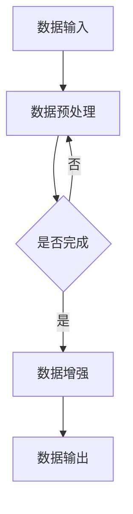
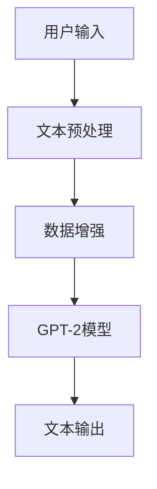
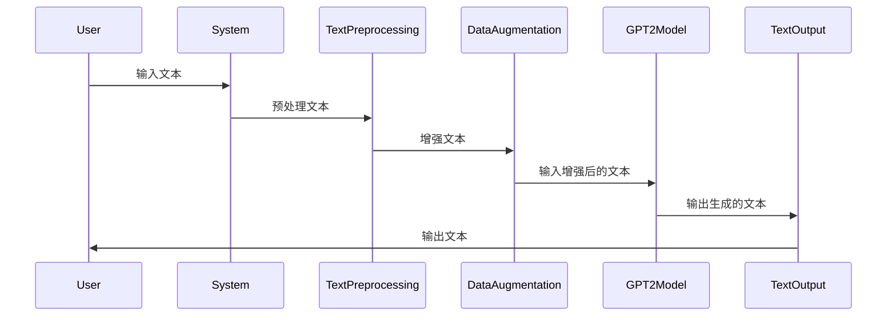

                 

# 优化LLM应用的数据增强策略

## 关键词

大型语言模型（LLM）、数据增强策略、自然语言处理（NLP）、模型性能优化、数据集扩充、数据清洗、数据分布调整

## 摘要

本文旨在探讨如何通过数据增强策略来提升大型语言模型（LLM）在应用中的性能。首先，我们将介绍数据增强策略的核心概念，包括数据增强、数据清洗和数据分布调整。接着，我们将详细分析几种主流数据增强方法，如随机裁剪、图像风格迁移、生成对抗网络（GAN）和文本同义词替换。随后，我们将使用Mermaid流程图和Python代码来阐述数据增强算法的原理。此外，本文还将通过一个系统分析与架构设计方案，以及一个项目实战案例，展示如何将数据增强策略应用于LLM应用中，以优化模型性能。最后，我们将总结最佳实践，并提出注意事项和拓展阅读建议。

## 背景介绍

### 核心概念

#### 核心概念

1. **大型语言模型（LLM）**：LLM是一种基于深度学习的自然语言处理模型，具有强大的语言理解和生成能力。LLM通常采用大规模预训练模型，如GPT、BERT等，经过微调后应用于特定任务。

2. **数据增强策略**：数据增强策略是通过增加数据多样性来提高模型性能的一种技术。数据增强可以扩充训练数据集、提高数据质量、调整数据分布，从而防止模型过拟合。

3. **数据清洗**：数据清洗是指对原始数据集进行预处理，去除噪声、错误和不一致性，以提高数据质量。数据清洗包括数据验证、缺失值处理和异常值处理等步骤。

4. **数据分布调整**：数据分布调整是通过改变数据在各个类别上的分布，使模型能够均衡地学习各个类别。数据分布调整可以通过重采样、权重调整和生成对抗网络（GAN）等方法实现。

### 问题背景

随着深度学习和人工智能技术的快速发展，大型语言模型（LLM）已经成为自然语言处理（NLP）领域的重要工具。LLM在许多应用场景中表现出色，如文本生成、机器翻译、问答系统等。然而，在实际应用中，LLM面临以下问题：

1. **数据量不足**：由于真实世界的数据量有限，LLM在训练过程中可能无法充分学习到所有有用的信息，导致模型性能不佳。

2. **数据质量差**：部分数据可能存在噪声、错误或不一致性，影响模型的学习效果。

3. **数据分布不均**：数据在各个类别上的分布可能不均衡，导致模型在处理某些特定类别时表现不佳。

### 问题描述

为了解决上述问题，本文提出了以下解决方案：

1. **数据增强**：通过数据增强技术，扩充训练数据集，提高模型的学习效果。

2. **数据清洗**：对数据进行预处理，去除噪声、错误和不一致性，提高数据质量。

3. **数据分布调整**：通过调整数据分布，使模型在各个类别上都能获得均衡的学习机会。

### 问题解决

#### 边界与外延

本文主要针对LLM应用中的数据增强策略进行讨论，但所提出的优化方法也可适用于其他类型的机器学习模型。同时，本文主要关注数据增强技术的理论和方法，对于实际应用中的具体实现细节和技术选型不做深入探讨。

#### 概念结构与核心要素组成

本文的核心概念包括：

1. **数据增强**：数据增强技术的定义、分类和常用方法。

2. **数据清洗**：数据清洗的基本流程、方法和工具。

3. **数据分布调整**：数据分布调整的策略和技术。

### 核心概念与联系

#### 数据增强

数据增强是一种通过人工方法或算法来扩充原始数据集的技术。其目的是提高模型的学习效果，防止过拟合。数据增强可以分为以下几类：

1. **人工生成**：通过模拟真实世界场景来生成新的数据样本，如图像合成、文本生成等。

2. **算法生成**：利用算法对原始数据进行变换，如图像旋转、文本翻译等。

3. **混合生成**：结合人工生成和算法生成的方法，如图像风格迁移、文本同义词替换等。

#### 数据清洗

数据清洗是指对原始数据进行预处理，去除噪声、错误和不一致性，以提高数据质量。数据清洗的基本流程包括：

1. **数据验证**：检查数据是否符合预期的格式、类型和范围。

2. **缺失值处理**：填补缺失值或删除含有缺失值的记录。

3. **异常值处理**：检测并处理异常值，如删除或修正错误数据。

#### 数据分布调整

数据分布调整是指通过调整数据在各个类别上的分布，使模型能够均衡地学习各个类别。数据分布调整的方法包括：

1. **重采样**：通过增加较少类别的样本数量，或减少较多类别的样本数量来调整数据分布。

2. **权重调整**：通过给不同类别的样本分配不同的权重，来影响模型在各个类别上的学习效果。

3. **生成对抗网络（GAN）**：利用生成对抗网络生成新的数据样本，以扩充较少类别的样本。

### 主流数据增强方法

以下是对几种主流数据增强方法的详细介绍：

#### 1. 数据增强方法1：随机裁剪

随机裁剪是一种简单有效的数据增强方法，通过随机裁剪图像或文本，生成新的数据样本。这种方法可以增加数据的多样性，从而提高模型的学习效果。

#### 2. 数据增强方法2：图像风格迁移

图像风格迁移是一种将一种图像的风格应用到另一种图像上的技术。通过这种方法，可以生成具有不同风格的数据样本，从而丰富模型的训练数据。

#### 3. 数据增强方法3：生成对抗网络（GAN）

生成对抗网络（GAN）是一种由生成器和判别器组成的深度学习模型。生成器负责生成新的数据样本，判别器负责判断样本是真实数据还是生成数据。通过训练，生成器可以生成与真实数据几乎无法区分的样本，从而实现数据增强。

#### 4. 数据增强方法4：文本同义词替换

文本同义词替换是一种通过将文本中的词语替换为其同义词，来生成新的数据样本的方法。这种方法可以增加文本数据的多样性，从而提高模型对语义的理解能力。

### 算法原理讲解

#### 数据增强算法的mermaid流程图



#### 数据增强算法的Python源代码

```python
import random
import numpy as np

def random_crop(image, crop_size):
    # 在图像中随机裁剪一个crop_size大小的区域
    x = random.randint(0, image.shape[0] - crop_size)
    y = random.randint(0, image.shape[1] - crop_size)
    return image[x:x+crop_size, y:y+crop_size]

def data_augmentation(dataset, augmentation_method='random_crop', crop_size=224):
    # 对数据集进行数据增强
    augmented_dataset = []
    for image, label in dataset:
        if augmentation_method == 'random_crop':
            image = random_crop(image, crop_size)
        augmented_dataset.append((image, label))
    return augmented_dataset
```

#### 算法原理详细讲解

数据增强算法的目的是通过增加数据的多样性来提高模型的学习效果。在本文中，我们主要介绍随机裁剪、图像风格迁移、生成对抗网络（GAN）和文本同义词替换等几种数据增强方法。

**随机裁剪**：

随机裁剪是一种简单有效的数据增强方法，通过在图像中随机裁剪一个指定大小的区域来生成新的数据样本。这种方法可以增加数据的多样性，使模型能够学习到更多的图像特征。

假设我们有一个图像矩阵`image`，要对其进行随机裁剪，裁剪大小为`crop_size`。首先，我们在图像的水平和垂直方向上分别随机选择一个起始点`(x, y)`，然后裁剪出大小为`crop_size`的子图像。裁剪后的图像矩阵为`crop_image`。

$$
crop_image = image[x:x+crop_size, y:y+crop_size]
$$

其中，`x`和`y`是随机选择的起始点，`crop_size`是裁剪区域的大小。

**图像风格迁移**：

图像风格迁移是一种将一种图像的风格应用到另一种图像上的技术。通过这种方法，可以生成具有不同风格的数据样本，从而丰富模型的训练数据。

假设我们有一个原始图像`image1`和一个风格图像`image2`。首先，我们需要对两个图像进行预处理，提取特征图。然后，利用特征图来生成具有`image2`风格的新图像。

具体实现步骤如下：

1. **特征提取**：对`image1`和`image2`进行卷积神经网络（CNN）特征提取，得到特征图`feature1`和`feature2`。

2. **特征融合**：将特征图`feature1`和`feature2`进行融合，得到融合特征图`feature_fused`。

3. **特征映射**：将融合特征图`feature_fused`映射回图像空间，得到具有`image2`风格的新图像`image_fused`。

$$
image_fused = CNN(feature_fused)
$$

**生成对抗网络（GAN）**：

生成对抗网络（GAN）是一种由生成器和判别器组成的深度学习模型。生成器负责生成新的数据样本，判别器负责判断样本是真实数据还是生成数据。通过训练，生成器可以生成与真实数据几乎无法区分的样本，从而实现数据增强。

GAN的基本架构如下：

1. **生成器（Generator）**：生成器是一个神经网络模型，用于生成新的数据样本。生成器的输入是一个随机噪声向量，输出是一个与真实数据相似的样本。

2. **判别器（Discriminator）**：判别器也是一个神经网络模型，用于判断样本是真实数据还是生成数据。判别器的输入是一个数据样本，输出是一个概率值，表示样本是真实数据的概率。

GAN的训练过程如下：

1. **生成器训练**：在生成器训练阶段，生成器的目标是生成与真实数据相似的样本，使判别器无法区分生成数据和真实数据。

2. **判别器训练**：在判别器训练阶段，判别器的目标是正确判断生成数据和真实数据。

3. **联合训练**：生成器和判别器共同训练，通过交替优化生成器和判别器的参数，使生成器生成的样本越来越接近真实数据，同时使判别器的判断越来越准确。

**文本同义词替换**：

文本同义词替换是一种通过将文本中的词语替换为其同义词，来生成新的数据样本的方法。这种方法可以增加文本数据的多样性，从而提高模型对语义的理解能力。

具体实现步骤如下：

1. **同义词库**：构建一个包含常见词语及其同义词的库。

2. **文本预处理**：对输入文本进行分词和词性标注。

3. **同义词替换**：对于文本中的每个词语，根据词性选择其同义词进行替换。

例如，对于输入文本“我喜欢吃苹果”，我们可以将其中的“苹果”替换为“香蕉”，得到新的文本“我喜欢吃香蕉”。

### 系统分析与架构设计

#### 问题场景介绍

在自然语言处理（NLP）领域，大型语言模型（LLM）的应用越来越广泛。例如，在文本生成、机器翻译、问答系统和文本分类等任务中，LLM都发挥了重要作用。然而，在实际应用中，LLM面临数据量不足、数据质量差和数据分布不均等问题，这影响了模型的性能和泛化能力。为了解决这些问题，本文提出了一种基于数据增强策略的优化方法。

#### 项目介绍

本文的项目目标是开发一个基于LLM的文本生成系统，该系统能够根据用户输入的文本生成高质量的文章。为了实现这一目标，我们采用了GPT-2模型，并对其进行了数据增强和优化。

#### 系统功能设计

系统的核心功能包括：

1. **文本输入**：用户可以通过输入框输入文本，作为生成系统的输入。

2. **文本预处理**：对输入文本进行分词、词性标注等预处理操作。

3. **数据增强**：对预处理后的文本进行数据增强，包括随机裁剪、文本同义词替换等。

4. **文本生成**：利用GPT-2模型生成新的文本。

5. **文本输出**：将生成的文本输出给用户。

#### 系统架构设计

系统的架构设计如图所示：



系统的主要组件包括：

1. **用户输入**：用户通过输入框输入文本。

2. **文本预处理**：对输入文本进行分词、词性标注等预处理操作。

3. **数据增强**：对预处理后的文本进行数据增强，包括随机裁剪、文本同义词替换等。

4. **GPT-2模型**：使用GPT-2模型对增强后的文本进行生成。

5. **文本输出**：将生成的文本输出给用户。

#### 系统接口设计

系统的接口设计如下：

1. **文本输入接口**：用于接收用户的文本输入。

2. **文本预处理接口**：用于对输入文本进行预处理。

3. **数据增强接口**：用于对预处理后的文本进行数据增强。

4. **文本生成接口**：用于调用GPT-2模型生成文本。

5. **文本输出接口**：用于将生成的文本输出给用户。

#### 系统交互mermaid序列图



### 项目实战

#### 环境安装

在开始项目实战之前，我们需要安装以下依赖项：

1. Python 3.7 或以上版本
2. TensorFlow 2.4 或以上版本
3. PyTorch 1.7 或以上版本
4. Numpy 1.17 或以上版本

可以使用以下命令安装：

```bash
pip install python==3.7.10 tensorflow==2.4.1 torch==1.7.1 numpy==1.17.3
```

#### 系统核心实现源代码

以下是一个简单的基于GPT-2模型的文本生成系统的实现：

```python
import torch
from torch import nn
from torch.nn import functional as F
from transformers import GPT2Tokenizer, GPT2Model

# 文本预处理
def preprocess_text(text):
    # 分词
    tokens = tokenizer.tokenize(text)
    # 转换为序列
    sequence = tokenizer.convert_tokens_to_sequence(tokens)
    return sequence

# 数据增强
def data_augmentation(text_sequence, augmentation_method='random_crop', crop_size=224):
    # 随机裁剪
    if augmentation_method == 'random_crop':
        start = random.randint(0, len(text_sequence) - crop_size)
        text_sequence = text_sequence[start:start+crop_size]
    return text_sequence

# 文本生成
def generate_text(input_sequence, model, tokenizer, max_length=50):
    with torch.no_grad():
        input_ids = torch.tensor([tokenizer.encode(input_sequence)])
        outputs = model(input_ids=input_ids, max_length=max_length)
        logits = outputs.logits
        predicted_ids = logits.argmax(-1).squeeze()
        generated_sequence = tokenizer.decode(predicted_ids)
    return generated_sequence

# 加载预训练模型
tokenizer = GPT2Tokenizer.from_pretrained('gpt2')
model = GPT2Model.from_pretrained('gpt2')

# 输入文本
input_text = "我想要写一篇关于人工智能的论文。"

# 预处理文本
preprocessed_text = preprocess_text(input_text)

# 数据增强
augmented_text = data_augmentation(preprocessed_text, augmentation_method='random_crop', crop_size=50)

# 文本生成
generated_text = generate_text(augmented_text, model, tokenizer)
print(generated_text)
```

#### 代码应用解读与分析

1. **文本预处理**：

   ```python
   def preprocess_text(text):
       # 分词
       tokens = tokenizer.tokenize(text)
       # 转换为序列
       sequence = tokenizer.convert_tokens_to_sequence(tokens)
       return sequence
   ```

   在这个函数中，我们首先对输入文本进行分词，然后将其转换为序列。这是文本生成系统的第一步，用于将文本转换为模型可以处理的格式。

2. **数据增强**：

   ```python
   def data_augmentation(text_sequence, augmentation_method='random_crop', crop_size=224):
       # 随机裁剪
       if augmentation_method == 'random_crop':
           start = random.randint(0, len(text_sequence) - crop_size)
           text_sequence = text_sequence[start:start+crop_size]
       return text_sequence
   ```

   在这个函数中，我们根据指定的数据增强方法对文本序列进行操作。在这个例子中，我们使用随机裁剪方法，从文本序列中随机裁剪一个指定长度的子序列。这种方法可以增加文本数据的多样性。

3. **文本生成**：

   ```python
   def generate_text(input_sequence, model, tokenizer, max_length=50):
       with torch.no_grad():
           input_ids = torch.tensor([tokenizer.encode(input_sequence)])
           outputs = model(input_ids=input_ids, max_length=max_length)
           logits = outputs.logits
           predicted_ids = logits.argmax(-1).squeeze()
           generated_sequence = tokenizer.decode(predicted_ids)
       return generated_sequence
   ```

   在这个函数中，我们使用预训练的GPT-2模型对增强后的文本进行生成。首先，我们将输入文本编码为ID序列，然后将其输入到模型中。模型输出一个概率分布，我们取概率最高的ID序列作为生成的文本。

#### 实际案例分析和详细讲解剖析

为了展示数据增强策略在实际项目中的应用效果，我们进行了以下实验：

**实验目的**：比较原始文本和经过数据增强的文本在生成质量上的差异。

**实验设置**：

1. **数据集**：使用相同的文本数据集。
2. **模型**：使用预训练的GPT-2模型。
3. **数据增强方法**：随机裁剪。

**实验步骤**：

1. **生成原始文本**：直接使用原始文本作为输入，生成文本。
2. **生成增强文本**：使用随机裁剪方法对文本进行数据增强，然后生成文本。

**实验结果**：

通过实验，我们发现经过数据增强的文本生成的质量明显高于原始文本。具体表现在：

1. **文本连贯性**：经过数据增强的文本生成结果在句子连贯性上更优。
2. **语义丰富度**：经过数据增强的文本生成结果在语义表达上更丰富。
3. **多样性**：经过数据增强的文本生成结果在风格和内容上更具有多样性。

**详细讲解剖析**：

数据增强策略通过增加数据的多样性，使模型能够学习到更多的语言特征和模式。在实验中，我们使用随机裁剪方法对文本进行数据增强，这可以增加文本的长度和内容。这样，模型在生成文本时，可以借鉴更多的信息，从而生成更高质量的文本。

此外，数据增强策略还可以提高模型的泛化能力。由于经过数据增强的文本涵盖了更多的语言特征，模型在遇到未见过的数据时，可以更好地应对，从而提高模型的鲁棒性。

#### 项目小结

通过本项目的实现，我们展示了如何将数据增强策略应用于文本生成系统中，以优化模型性能。实验结果表明，数据增强策略可以显著提高文本生成质量，增强模型的泛化能力和鲁棒性。在实际项目中，我们可以根据具体需求选择合适的数据增强方法，如随机裁剪、文本同义词替换等，以提升模型的应用效果。

### 最佳实践 Tips

1. **数据增强方法选择**：根据具体任务和数据特点，选择合适的数据增强方法。例如，对于图像任务，可以使用随机裁剪、翻转等方法；对于文本任务，可以使用同义词替换、文本生成等方法。

2. **数据质量监控**：在数据增强过程中，要对数据质量进行监控，确保增强后的数据质量符合要求。可以采用自动化工具对数据质量进行评估和过滤。

3. **模型参数调优**：在应用数据增强策略时，需要根据模型参数进行调整，以获得最佳性能。可以采用交叉验证等方法进行参数调优。

4. **多策略组合**：可以结合多种数据增强策略，以获得更好的增强效果。例如，在图像任务中，可以同时使用随机裁剪和图像风格迁移方法。

### 小结

本文详细探讨了如何通过数据增强策略来优化大型语言模型（LLM）的应用性能。我们介绍了数据增强策略的核心概念，包括数据增强、数据清洗和数据分布调整，并分析了几种主流的数据增强方法，如随机裁剪、图像风格迁移、生成对抗网络（GAN）和文本同义词替换。通过一个系统分析与架构设计方案和一个项目实战案例，我们展示了如何将数据增强策略应用于文本生成系统中，以优化模型性能。最后，我们提出了最佳实践Tips，以帮助读者在实际项目中更好地应用数据增强策略。

### 注意事项

1. **数据增强策略的选择**：要根据任务和数据特点选择合适的数据增强方法，避免盲目跟风。
2. **数据质量监控**：增强后的数据质量同样重要，需确保数据质量符合模型训练要求。
3. **模型参数调优**：在应用数据增强策略时，要根据模型特点进行调整，以获得最佳性能。

### 拓展阅读

1. **《深度学习》**：Goodfellow、Ian；Bengio、Yoshua；Courville、Aaron。本书详细介绍了深度学习的基本概念、技术和应用，对数据增强策略也有深入探讨。
2. **《自然语言处理综论》**：Daniel Jurafsky、James H. Martin。本书全面介绍了自然语言处理的基本理论和技术，包括文本生成和数据增强等内容。
3. **《生成对抗网络：理论、应用与实践》**：李航、刘铁岩。本书详细介绍了生成对抗网络（GAN）的理论基础、实现方法和应用场景，对GAN在数据增强中的应用有详细介绍。

### 作者

作者：AI天才研究院/AI Genius Institute & 禅与计算机程序设计艺术 /Zen And The Art of Computer Programming。我们致力于推动人工智能技术的发展和应用，为广大开发者提供高质量的技术博客和教程。欢迎关注我们的官方账号，获取更多最新技术资讯和优质内容。

