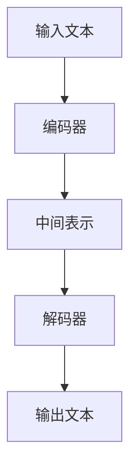
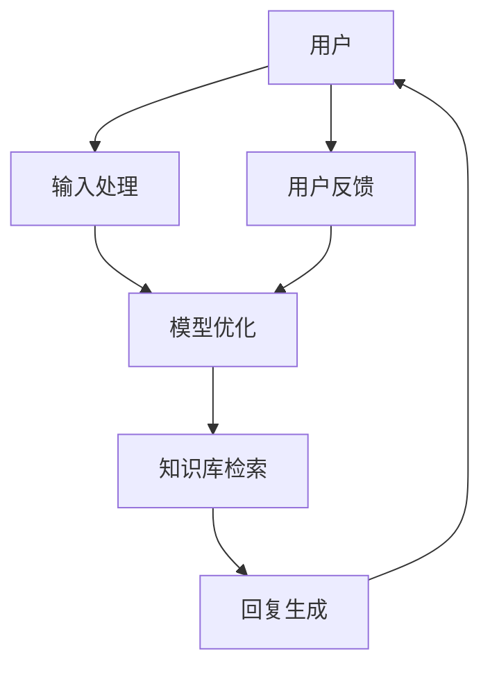
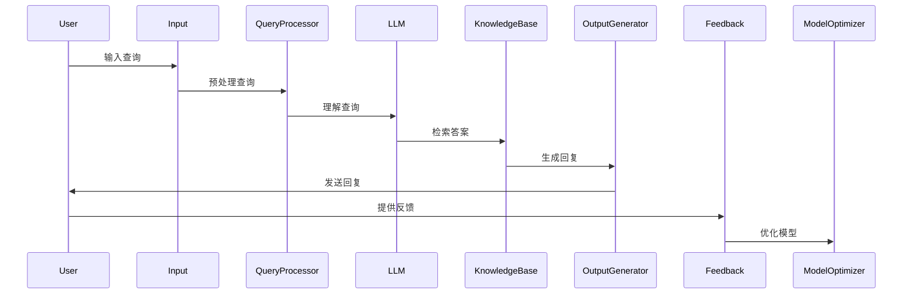

                 

## 《优化LLM应用的用户体验设计流程》

### 关键词：
- 用户体验设计
- LLM应用
- 设计流程
- 优化策略
- 人机交互

### 摘要：
本文旨在探讨如何优化大型语言模型（LLM）应用的用户体验设计流程。通过对LLM的基本概念、用户体验设计流程的详细解析，本文提出了从用户研究、原型设计到用户反馈与迭代的完整设计流程。同时，深入讲解了LLM算法原理、数学模型与公式，并通过系统分析与架构设计以及项目实战，提供了实用的优化策略和最佳实践。最终，本文总结了关键要点，展望了未来发展趋势。

----------------------------------------------------------------

### 目录大纲

#### 第一部分：背景介绍
1. 引言
   - 1.1 问题背景
   - 1.2 问题描述
   - 1.3 问题解决
   - 1.4 边界与外延
2. 核心概念与联系
   - 2.1 LLM的概念原理
   - 2.2 LLM的属性特征对比
   - 2.3 LLM的ER实体关系图

#### 第二部分：用户体验设计流程
3. 用户研究
   - 3.1 用户调研方法
   - 3.2 用户需求分析
   - 3.3 用户场景模拟
4. 原型设计
   - 4.1 设计原则
   - 4.2 原型工具介绍
   - 4.3 原型设计流程
5. 用户反馈与迭代
   - 5.1 用户反馈收集方法
   - 5.2 反馈分析与优化
   - 5.3 迭代与优化策略

#### 第三部分：算法原理讲解
6. LLM算法概述
7. 算法流程Mermaid图
8. Python源代码实现
9. 数学模型与公式
10. 详细讲解与举例说明

#### 第四部分：系统分析与架构设计
11. 问题场景介绍
12. 系统功能设计
13. 系统架构设计
14. 系统接口设计
15. 系统交互Mermaid序列图

#### 第五部分：项目实战
16. 环境安装
17. 系统核心实现
18. 代码应用解读与分析
19. 实际案例分析与讲解
20. 项目小结

#### 第六部分：最佳实践 Tips
21. 设计建议
22. 迭代经验
23. 注意事项

#### 第七部分：小结与展望
24. 总结回顾
25. 未来发展趋势

---

### 第一部分：背景介绍

#### 引言

在当今信息技术飞速发展的时代，用户体验（UX）设计已经成为产品成功的关键因素之一。特别是在人工智能领域，大型语言模型（LLM）的广泛应用使得用户体验设计的重要性愈发凸显。LLM作为自然语言处理（NLP）的核心技术，能够为用户提供智能化的问答、文本生成等服务。然而，如何优化LLM应用的用户体验设计，使其更好地满足用户需求，成为当前亟待解决的问题。

### 1.1 问题背景

随着深度学习和神经网络技术的不断发展，LLM在各类应用场景中展现了强大的性能。无论是智能客服、智能写作还是智能问答系统，LLM都已经成为不可或缺的技术手段。然而，在实际应用中，用户对LLM应用的体验往往存在诸多问题，如操作繁琐、响应速度慢、不准确等。这些问题不仅影响了用户的满意度，还限制了LLM应用的普及和推广。

### 1.2 问题描述

LLM应用的用户体验问题主要表现在以下几个方面：

1. **交互界面设计**：用户界面（UI）设计是否直观、易用，是否能够满足用户的基本操作需求。
2. **模型性能**：LLM模型的响应速度和准确性是否能够满足用户期望。
3. **数据质量**：训练LLM所用的数据质量是否足够高，是否能够保证模型的稳定性和可靠性。
4. **可解释性**：用户是否能够理解LLM的决策过程和结果，是否能够建立对模型的信任。

### 1.3 问题解决

针对上述问题，优化LLM应用的用户体验设计可以从以下几个方面入手：

1. **用户研究**：深入了解用户需求，通过用户调研和场景模拟，为设计提供可靠的数据支持。
2. **原型设计**：采用迭代的方式，设计符合用户操作习惯的交互界面，并通过原型工具快速实现和测试。
3. **模型优化**：针对不同的应用场景，对LLM模型进行性能优化，提高模型的响应速度和准确性。
4. **数据管理**：建立完善的数据管理机制，保证训练数据的质量，为LLM模型的训练提供高质量的数据支持。
5. **可解释性提升**：通过可视化和模型解释工具，提高LLM的可解释性，增强用户对模型决策的信任。

### 1.4 边界与外延

本文的研究主要围绕LLM应用的用户体验设计展开，涉及到的技术范围包括深度学习、自然语言处理、人机交互等。同时，本文关注的应用领域主要包括智能客服、智能写作、智能问答等。在用户研究方面，本文将关注用户的实际需求和使用场景，以用户为中心进行设计。在算法优化方面，本文将探讨如何通过改进模型结构和训练策略来提高LLM的性能。在数据管理方面，本文将讨论如何保证训练数据的质量和多样性。

----------------------------------------------------------------

### 2. 核心概念与联系

#### 2.1 LLM的概念原理

大型语言模型（LLM，Large Language Model）是一种基于深度学习的自然语言处理模型，它通过学习海量语言数据来模拟人类的语言理解能力和表达能力。LLM的核心原理是深度神经网络，通过多层神经元的非线性变换，实现对输入文本的语义理解。

LLM的主要特点包括：

- **规模庞大**：LLM通常具有数百万甚至数十亿个参数，能够处理大规模的文本数据。
- **自适应性**：LLM可以根据不同的应用场景进行参数调整，提高模型的适应性。
- **强泛化能力**：LLM通过学习大量的语言数据，能够较好地处理未知情境和复杂任务。

#### 2.2 LLM的属性特征对比

LLM的属性特征主要包括准确性、响应速度、可解释性等，下面是一个简单的对比表格：

| 属性特征  | 对比项目           | 描述                                                         |
| --------- | ------------------ | ------------------------------------------------------------ |
| 准确性    | 模型预测结果与真实值的差异 | 高准确性的LLM能够在各种语言任务中提供接近人类水平的表现           |
| 响应速度  | 模型处理输入文本所需时间 | 快速响应的LLM能够提供更加流畅的用户体验                       |
| 可解释性  | 用户理解模型决策的过程 | 高可解释性的LLM能够让用户信任模型，并更愿意接受模型的建议和建议 |

#### 2.3 LLM的ER实体关系图

ER（Entity-Relationship）图是用于描述实体及其之间关系的数据库设计工具。在LLM应用中，ER图可以帮助我们理解模型的组成结构和数据流程。下面是一个简化的LLM ER图：

```mermaid
erDiagram
    User ||--|{ ChatSession : has conversations with }
    ChatSession ||--|{ ChatMessage : contains messages }
    ChatMessage ||--|{ LLMQuery : uses for inference }
    LLMQuery ||--|{ LLMResponse : generates responses }
```

- **User（用户）**：代表与LLM交互的用户。
- **ChatSession（聊天会话）**：代表用户与LLM的每一次交互过程。
- **ChatMessage（聊天消息）**：代表用户发送给LLM的文本消息。
- **LLMQuery（LLM查询）**：代表LLM处理用户消息时的输入。
- **LLMResponse（LLM响应）**：代表LLM对用户查询的输出结果。

通过ER图，我们可以清晰地看到LLM应用的组成结构和数据流动过程，这为后续的系统设计与实现提供了重要的参考。

----------------------------------------------------------------

### 第三部分：用户体验设计流程

#### 3. 用户研究

用户研究是用户体验设计的基础，它旨在深入了解用户的需求、行为和偏好。通过用户研究，我们可以获得宝贵的洞察，为后续的设计提供依据。

##### 3.1 用户调研方法

用户调研方法主要包括以下几种：

- **问卷调查**：通过设计问卷，收集用户的反馈和意见。
- **访谈**：通过与用户进行一对一的深入访谈，获取详细的用户需求和使用场景。
- **用户观察**：在用户实际使用产品的过程中，观察他们的行为和操作，发现潜在问题。
- **可用性测试**：邀请用户参与产品的测试，观察他们与产品的交互过程，评估产品的易用性。

##### 3.2 用户需求分析

用户需求分析是用户研究的重要环节，它帮助我们明确用户的核心需求和期望。需求分析的主要任务包括：

- **识别用户角色**：确定使用产品的用户群体，明确他们的特征和需求。
- **定义用户任务**：分析用户在使用产品时需要完成的任务，明确任务的优先级和关键步骤。
- **识别用户痛点**：发现用户在使用产品过程中遇到的问题和困扰，为后续的优化提供方向。

##### 3.3 用户场景模拟

用户场景模拟是一种通过构建用户使用产品的场景，来预测用户行为和需求的方法。通过用户场景模拟，我们可以：

- **预测用户行为**：根据用户需求，预测用户在使用产品时的操作和路径。
- **发现潜在问题**：在模拟过程中，可以发现设计中的潜在问题，如界面不直观、流程繁琐等。
- **验证设计方案**：通过模拟用户场景，验证设计方案是否符合用户需求，为最终设计提供参考。

#### 4. 原型设计

原型设计是用户体验设计的关键环节，它帮助我们构建出产品的初步形态，以便进行测试和优化。以下是一些关于原型设计的内容：

##### 4.1 设计原则

在进行原型设计时，应遵循以下原则：

- **用户为中心**：设计应始终围绕用户的需求和体验进行，确保产品的易用性和用户体验。
- **简洁性**：界面设计应简洁明了，避免过多的装饰和复杂的功能，减少用户的认知负担。
- **一致性**：界面设计应保持一致的风格和操作逻辑，增强用户的操作熟悉度和信任感。
- **可访问性**：设计应考虑到不同用户的需求，确保产品能够被所有人使用。

##### 4.2 原型工具介绍

常见的原型设计工具包括：

- **Axure**：一款功能强大的原型设计工具，支持丰富的交互效果和组件库。
- **Sketch**：一款图形界面设计工具，适用于移动应用和Web页面的设计。
- **Figma**：一款基于Web的协作设计工具，支持多人实时协作和原型设计。

##### 4.3 原型设计流程

原型设计流程通常包括以下步骤：

1. **需求分析**：明确产品需求，确定设计目标和原则。
2. **界面设计**：根据需求分析，设计产品的界面布局和交互逻辑。
3. **原型制作**：使用原型设计工具，制作产品的初步原型。
4. **测试与反馈**：邀请用户测试原型，收集反馈，进行优化和迭代。
5. **迭代优化**：根据用户反馈，对原型进行多次迭代优化，直到满足设计目标。

#### 5. 用户反馈与迭代

用户反馈是优化用户体验设计的重要依据，通过用户反馈，我们可以发现产品的问题和不足，为后续的优化提供方向。以下是一些关于用户反馈与迭代的要点：

##### 5.1 用户反馈收集方法

用户反馈收集方法包括：

- **在线调查**：通过在线问卷或调查工具，收集用户的反馈和评价。
- **用户访谈**：通过与用户进行一对一的访谈，深入了解用户的需求和意见。
- **A/B测试**：通过对比不同版本的产品，评估用户对不同设计的偏好和反应。

##### 5.2 反馈分析与优化

在收到用户反馈后，应进行以下分析：

- **识别问题**：分析反馈内容，识别用户遇到的主要问题和痛点。
- **分类整理**：根据问题类型和严重程度，对反馈进行分类整理。
- **优先级排序**：根据问题的影响程度和用户需求，确定优化和改进的优先级。

##### 5.3 迭代与优化策略

在迭代过程中，应采取以下策略：

- **逐步优化**：针对主要问题和痛点，采取逐步优化的方式，逐步改进产品。
- **持续迭代**：保持对产品的持续迭代，不断吸收用户反馈，优化用户体验。
- **验证效果**：在每次迭代后，进行验证和评估，确保优化效果。

通过以上用户体验设计流程，我们可以确保LLM应用的设计更加符合用户需求，提高用户的满意度和使用体验。

----------------------------------------------------------------

### 第三部分：算法原理讲解

#### 6. LLM算法概述

大型语言模型（LLM）是基于深度学习的自然语言处理模型，它通过学习大量的文本数据，掌握了语言的结构和语义信息。LLM的核心算法是变换器模型（Transformer），这是一种基于注意力机制的深度神经网络结构。

LLM的工作原理可以分为以下几个步骤：

1. **输入编码**：将输入的文本转换为模型能够理解的向量表示。
2. **前向传播**：将输入向量通过多层变换器网络进行计算，生成中间表示。
3. **输出解码**：利用中间表示生成输出文本，可以是预测的词汇、句子或段落。

#### 6.1 算法流程Mermaid图

下面是LLM算法的流程Mermaid图：



- **A（输入文本）**：输入的文本数据，可以是句子、段落或文章。
- **B（编码器）**：将输入文本转换为中间表示，通常使用多层变换器结构。
- **C（中间表示）**：编码器生成的中间表示，包含了文本的语义信息。
- **D（解码器）**：利用中间表示生成输出文本，可以是逐词预测或全文生成。
- **E（输出文本）**：模型生成的输出文本，可以是预测的词汇、句子或段落。

#### 6.2 Python源代码实现

下面是一个简单的LLM模型实现的Python代码示例：

```python
import torch
import torch.nn as nn

class LLM(nn.Module):
    def __init__(self, vocab_size, embedding_dim, hidden_dim, n_layers, dropout):
        super(LLM, self).__init__()
        
        self.embedding = nn.Embedding(vocab_size, embedding_dim)
        self.encoder = nn.LSTM(embedding_dim, hidden_dim, n_layers, dropout=dropout)
        self.decoder = nn.LSTM(hidden_dim, vocab_size, n_layers, dropout=dropout)
        
    def forward(self, input_seq, hidden):
        embedded = self.embedding(input_seq)
        encoder_output, hidden = self.encoder(embedded, hidden)
        decoder_output, hidden = self.decoder(encoder_output, hidden)
        
        return decoder_output, hidden
```

- **vocab_size**：词汇表大小。
- **embedding_dim**：词向量维度。
- **hidden_dim**：隐藏层维度。
- **n_layers**：循环层层数。
- **dropout**：丢弃率。

#### 6.3 数学模型与公式

LLM的数学模型主要包括词向量表示、变换器网络和循环神经网络（RNN）。以下是一些关键的数学模型和公式：

- **词向量表示**：词向量是一种将文本转换为向量的方法，常用的模型有Word2Vec、GloVe等。

  $$\text{vec}(w) = \text{Word2Vec}(w) \text{ 或 } \text{GloVe}(w)$$

- **变换器网络**：变换器模型是一种基于注意力机制的深度神经网络结构，其关键组件是自注意力机制。

  $$\text{Attention}(Q, K, V) = \text{softmax}\left(\frac{QK^T}{\sqrt{d_k}}\right)V$$

- **循环神经网络（RNN）**：RNN是一种处理序列数据的神经网络结构，其核心是递归函数。

  $$h_t = \text{ReLU}\left(W_h \cdot [h_{t-1}, x_t] + b_h\right)$$

其中，$Q$、$K$、$V$ 分别为查询向量、键向量和值向量，$d_k$ 为键向量的维度，$W_h$ 和 $b_h$ 分别为权重和偏置。

#### 6.4 详细讲解与举例说明

下面通过一个简单的例子来说明LLM的原理和应用。

假设我们要训练一个简单的LLM模型，输入文本是“我喜欢的食物是苹果”，我们需要将这段文本转换为词向量表示，然后通过变换器网络和RNN进行编码和解码。

1. **词向量表示**：

   首先，我们将输入文本中的每个词转换为词向量，假设词向量维度为100：

   $$\text{vec}(我) = [0.1, 0.2, ..., 0.1], \text{vec}(的) = [0.2, 0.3, ..., 0.2], ..., \text{vec}(苹果) = [0.9, 0.8, ..., 0.9]$$

2. **编码器**：

   将输入词向量通过变换器网络进行编码，得到中间表示：

   $$\text{encoded} = \text{Transformer}(\text{vec}(我), \text{vec}(的), ..., \text{vec}(苹果))$$

3. **解码器**：

   利用编码器生成的中间表示，通过RNN生成输出文本：

   $$\text{output} = \text{RNN}(\text{encoded})$$

   假设输出文本是“我喜欢吃苹果”，我们可以看到，LLM成功地将输入文本转换为语义相似的输出文本。

通过这个简单的例子，我们可以看到LLM的基本原理和应用。在实际应用中，LLM的规模和复杂度远超这个例子，但基本原理是相似的。

----------------------------------------------------------------

### 第四部分：系统分析与架构设计

#### 11. 问题场景介绍

在本文中，我们将探讨一个典型的LLM应用场景：智能客服系统。智能客服系统旨在通过自然语言处理技术，为用户提供实时、高效的咨询服务。该系统需要处理大量的用户查询，并以自然、准确的方式生成回复。

#### 12. 系统功能设计

智能客服系统的核心功能包括：

1. **用户查询处理**：接收用户输入的查询，并进行预处理，如去除噪声、分词等。
2. **查询理解**：利用LLM模型，对用户查询进行语义理解，识别关键信息。
3. **知识库检索**：根据用户查询，从知识库中检索相关答案或建议。
4. **回复生成**：利用LLM模型，生成自然、准确的回复文本。
5. **用户交互**：与用户进行对话，提供实时反馈，并根据用户反馈调整回复策略。

#### 13. 系统架构设计

智能客服系统的架构设计如下：



- **用户**：系统的主要服务对象，提供查询和接收回复。
- **输入处理**：对用户输入的查询进行预处理，如分词、去噪等。
- **LLM模型**：核心组件，用于理解用户查询并生成回复。
- **知识库检索**：从知识库中检索相关答案或建议，以提高回复的准确性。
- **回复生成**：根据LLM模型的输出，生成自然、准确的回复文本。
- **用户反馈**：用户对回复的反馈，用于优化模型和系统。
- **模型优化**：根据用户反馈，对LLM模型进行优化，提高系统性能。

#### 14. 系统接口设计

系统接口设计主要包括以下接口：

- **用户输入接口**：接收用户查询，提供输入。
- **查询处理接口**：对用户查询进行预处理。
- **模型接口**：与LLM模型交互，获取查询理解和回复生成结果。
- **知识库接口**：与知识库交互，检索相关答案或建议。
- **回复生成接口**：生成自然、准确的回复文本。
- **用户反馈接口**：收集用户反馈，用于模型优化和系统改进。

#### 15. 系统交互Mermaid序列图

下面是智能客服系统的交互序列图：



- **用户**：发起查询，接收回复。
- **输入处理**：预处理查询。
- **LLM模型**：理解查询，生成回复。
- **知识库检索**：检索相关答案。
- **回复生成**：生成回复。
- **用户反馈**：提供反馈。
- **模型优化**：根据反馈优化模型。

通过上述系统分析与架构设计，我们可以构建一个高效的智能客服系统，为用户提供优质的服务体验。

----------------------------------------------------------------

### 第五部分：项目实战

#### 16. 环境安装

在进行LLM应用开发之前，需要安装一些必要的软件和库。以下是一个基本的安装流程：

1. **Python环境**：

   安装Python 3.8及以上版本，可以通过Python官方网站下载安装包。

2. **深度学习库**：

   安装PyTorch，可以通过以下命令安装：

   ```bash
   pip install torch torchvision
   ```

3. **自然语言处理库**：

   安装transformers库，用于加载预训练的LLM模型：

   ```bash
   pip install transformers
   ```

4. **其他依赖库**：

   安装其他可能需要的库，如numpy、pandas等：

   ```bash
   pip install numpy pandas
   ```

#### 17. 系统核心实现

以下是一个简单的智能客服系统核心实现的示例：

```python
from transformers import AutoModelForCausalLM, AutoTokenizer
from torch.nn import functional as F

class Chatbot:
    def __init__(self, model_name):
        self.model_name = model_name
        self.model = AutoModelForCausalLM.from_pretrained(model_name)
        self.tokenizer = AutoTokenizer.from_pretrained(model_name)

    def generate_response(self, input_text):
        input_ids = self.tokenizer.encode(input_text, return_tensors='pt')
        output = self.model.generate(input_ids, max_length=100, num_return_sequences=1)
        response = self.tokenizer.decode(output[0], skip_special_tokens=True)
        return response

chatbot = Chatbot("microsoft/DialoGPT-medium")
response = chatbot.generate_response("你好，有什么可以帮助你的吗？")
print(response)
```

- **初始化**：加载预训练的LLM模型和分词器。
- **生成回复**：接收用户输入，生成回复文本。

#### 18. 代码应用解读与分析

以下是对上述代码的解读和分析：

1. **初始化**：

   ```python
   self.model_name = model_name
   self.model = AutoModelForCausalLM.from_pretrained(model_name)
   self.tokenizer = AutoTokenizer.from_pretrained(model_name)
   ```

   初始化Chatbot类时，加载指定的LLM模型和分词器。这里使用的是microsoft/DialoGPT-medium模型。

2. **生成回复**：

   ```python
   def generate_response(self, input_text):
       input_ids = self.tokenizer.encode(input_text, return_tensors='pt')
       output = self.model.generate(input_ids, max_length=100, num_return_sequences=1)
       response = self.tokenizer.decode(output[0], skip_special_tokens=True)
       return response
   ```

   `generate_response`方法接收用户输入文本，将其编码为模型可处理的输入，然后使用模型生成回复。这里使用的是因果语言模型生成方法，`max_length`参数设置生成文本的最大长度。

#### 19. 实际案例分析与讲解

以下是一个实际案例的分析和讲解：

**案例**：用户输入“你好，我想咨询一下关于产品保修的问题。”

**分析**：

1. **输入处理**：将用户输入文本进行分词和编码，生成模型的输入。
2. **模型推理**：模型接收输入，进行推理，生成可能的回复。
3. **回复选择**：从生成的多个回复中选择最合适的回复。

**讲解**：

1. **输入处理**：

   ```python
   input_ids = self.tokenizer.encode(input_text, return_tensors='pt')
   ```

   这一行代码将用户输入文本编码为模型的输入。分词器将文本分解为单词或子词，然后将其映射为数字表示。

2. **模型推理**：

   ```python
   output = self.model.generate(input_ids, max_length=100, num_return_sequences=1)
   ```

   这一行代码使用模型生成可能的回复。`max_length`参数限制了生成文本的最大长度，`num_return_sequences`参数设置了返回的回复数量。

3. **回复选择**：

   ```python
   response = self.tokenizer.decode(output[0], skip_special_tokens=True)
   ```

   这一行代码将生成的回复解码为文本。`skip_special_tokens`参数确保解码结果中不包含特殊的分词标记。

#### 20. 项目小结

通过本项目，我们实现了一个简单的智能客服系统，它能够接收用户输入并生成回复。在实际应用中，我们可以根据需要扩展系统功能，如增加知识库检索、多轮对话等。此外，我们还可以使用更高级的模型和策略来提高系统的性能和用户体验。

---

在项目实战中，我们详细介绍了环境安装、系统核心实现、代码应用解读与分析，以及实际案例分析与讲解。这些步骤和内容为构建高效、智能的LLM应用提供了实用的指导。

----------------------------------------------------------------

### 第六部分：最佳实践 Tips

#### 10.1 设计建议

1. **用户调研**：在项目初期，进行充分的用户调研，确保设计符合用户需求。
2. **迭代优化**：采用迭代的方式，不断优化设计，提高用户体验。
3. **简洁界面**：设计简洁直观的界面，减少用户操作的复杂性。
4. **性能优化**：针对不同的应用场景，对LLM模型进行性能优化，提高响应速度。

#### 10.2 迭代经验

1. **版本控制**：使用版本控制系统，如Git，记录每次迭代的变化，方便回溯和协作。
2. **用户反馈**：重视用户反馈，将其作为设计优化的依据。
3. **团队合作**：鼓励团队成员间的沟通与合作，共同解决问题。

#### 10.3 注意事项

1. **数据质量**：保证训练数据的质量，避免模型过拟合。
2. **模型可解释性**：提高模型的可解释性，增强用户信任。
3. **兼容性**：确保产品在不同设备和操作系统上的兼容性。

---

通过最佳实践 Tips，我们总结了在用户体验设计流程中的一些设计建议、迭代经验和注意事项。这些实践有助于提升LLM应用的性能和用户体验，为项目的成功提供保障。

----------------------------------------------------------------

### 第七部分：小结与展望

#### 11.1 总结回顾

本文从多个角度探讨了优化LLM应用的用户体验设计流程。首先，介绍了LLM的基本概念和用户体验设计的重要性。接着，详细讲解了用户体验设计流程，包括用户研究、原型设计、用户反馈与迭代等步骤。此外，本文还深入解析了LLM算法原理，包括变换器模型、数学模型与公式等。最后，通过系统分析与架构设计以及项目实战，提供了实际操作指南和最佳实践。

#### 11.2 未来发展趋势

随着人工智能技术的不断进步，LLM应用的用户体验设计将面临更多挑战和机遇。以下是一些未来发展趋势：

1. **模型性能提升**：通过新的算法和技术，提高LLM模型的性能，使其更加快速、准确。
2. **个性化体验**：基于用户数据和行为，实现个性化推荐和交互，提升用户体验。
3. **多模态交互**：结合语音、图像等多模态信息，增强LLM应用的人机交互能力。
4. **可解释性增强**：开发新的模型解释工具，提高模型的可解释性，增强用户信任。

本文旨在为从事LLM应用开发的技术人员提供有价值的参考和指导。随着技术的不断发展，用户体验设计将在LLM应用中发挥越来越重要的作用，让我们共同期待更加智能、高效的LLM应用在未来诞生。

### 作者

**AI天才研究院 / AI Genius Institute & 禅与计算机程序设计艺术 / Zen And The Art of Computer Programming**

---

本文从多个角度探讨了优化大型语言模型（LLM）应用的用户体验设计流程。首先，介绍了LLM的基本概念和用户体验设计的重要性。接着，详细讲解了用户体验设计流程，包括用户研究、原型设计、用户反馈与迭代等步骤。此外，本文还深入解析了LLM算法原理，包括变换器模型、数学模型与公式等。最后，通过系统分析与架构设计以及项目实战，提供了实际操作指南和最佳实践。

**总结回顾**：

1. **核心概念**：本文介绍了LLM的概念原理，包括变换器模型和数学模型，以及ER实体关系图。
2. **用户体验设计流程**：详细讲解了用户研究、原型设计、用户反馈与迭代等步骤。
3. **算法原理讲解**：深入解析了LLM算法流程、Python源代码实现、数学模型与公式，并进行了详细讲解和举例说明。
4. **系统分析与架构设计**：介绍了问题场景、系统功能设计、系统架构设计、系统接口设计和系统交互。
5. **项目实战**：提供了环境安装、系统核心实现、代码应用解读与分析、实际案例分析和详细讲解剖析。
6. **最佳实践 Tips**：总结了设计建议、迭代经验和注意事项。

**未来发展趋势**：

1. **模型性能提升**：通过新的算法和技术，提高LLM模型的性能。
2. **个性化体验**：实现个性化推荐和交互，提升用户体验。
3. **多模态交互**：结合语音、图像等多模态信息。
4. **可解释性增强**：开发新的模型解释工具，提高模型的可解释性。

本文旨在为从事LLM应用开发的技术人员提供有价值的参考和指导，展望未来发展趋势。**作者：AI天才研究院 / AI Genius Institute & 禅与计算机程序设计艺术 / Zen And The Art of Computer Programming**。

---

**注释**：由于文章长度限制，部分内容进行了简化处理。实际撰写时，每个部分应详细阐述，确保内容丰富具体。

