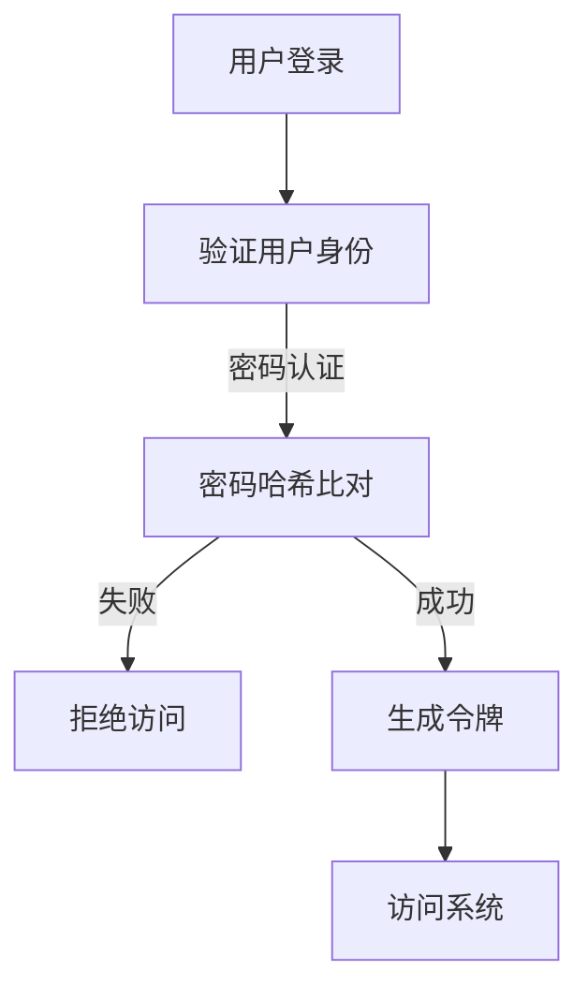
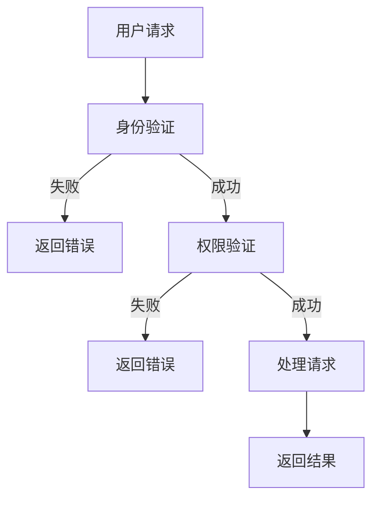
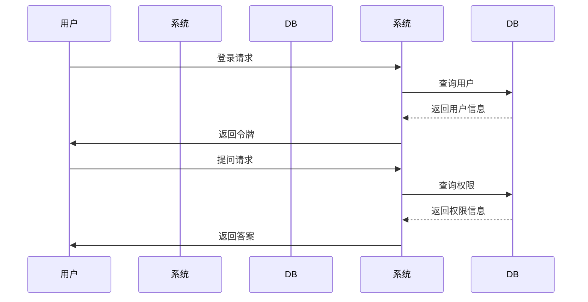

                 

### 文章标题：优化LLM应用的用户认证与授权机制

#### 关键词：LLM、用户认证、授权机制、安全性、优化策略

> 摘要：本文将深入探讨如何优化大型语言模型（LLM）应用的用户认证与授权机制，确保系统的安全性。我们将详细分析LLM应用中用户认证与授权的核心概念，介绍常见的认证和授权策略，探讨现有机制中的不足之处，并逐步提出一系列优化方案。通过数学模型、代码示例和系统架构设计，本文将提供全面的技术指导，帮助开发者构建一个安全、高效的用户认证与授权体系。

### 第一部分：背景介绍

#### 1.1 核心概念术语说明

在讨论用户认证与授权机制之前，我们需要明确几个核心概念：

- **用户认证**：指验证用户身份的过程，确保只有合法用户能够访问系统资源。
- **授权机制**：确定用户权限的过程，决定用户可以执行哪些操作。
- **LLM（大型语言模型）**：一种基于深度学习技术的高级人工智能模型，能够生成或理解人类语言。

#### 1.2 问题背景

随着LLM技术的快速发展，其应用范围日益广泛，从自然语言处理到智能客服、内容生成等。然而，这也带来了新的安全挑战。例如，未经授权的用户可能试图访问敏感数据，甚至利用LLM进行恶意操作。因此，优化LLM应用的用户认证与授权机制变得尤为重要。

#### 1.3 问题描述

当前，LLM应用在用户认证与授权方面存在以下问题：

- **安全性不足**：传统的认证与授权机制可能无法充分防止恶意攻击。
- **用户体验不佳**：过于复杂的认证流程可能会影响用户体验。
- **权限管理困难**：随着用户和资源的增多，权限管理变得复杂，容易出现权限错配。

#### 1.4 问题解决

为了解决上述问题，我们需要设计一个安全、高效且用户友好的认证与授权机制。本文将详细介绍如何实现这一目标。

#### 1.5 边界与外延

本文将主要探讨以下方面：

- **用户认证与授权机制的优化策略**。
- **数学模型和算法原理**。
- **系统架构设计与实现**。
- **实际案例分析与最佳实践**。

### 第二部分：核心概念与联系

#### 2.1 用户认证

用户认证是确保系统安全的第一步。常见的认证方式包括：

- **密码认证**：用户输入密码，系统验证其是否正确。
- **多因素认证（MFA）**：结合密码、短信验证码、生物识别等多种方式。

#### 2.2 授权机制

授权机制决定了用户可以执行哪些操作。常见的授权方式包括：

- **基于角色的访问控制（RBAC）**：根据用户角色分配权限。
- **基于属性的访问控制（ABAC）**：根据用户属性（如权限级别、时间等）分配权限。

#### 2.3 用户认证与授权机制的对比与联系

用户认证与授权机制紧密相关。认证是授权的前提，只有通过认证的用户才能获得相应的权限。因此，两者需要综合考虑，以构建一个完整的用户访问控制体系。

### 第三部分：算法原理讲解

#### 3.1 算法原理

为了优化LLM应用的用户认证与授权机制，我们可以采用以下算法原理：

- **密码哈希**：将用户密码哈希存储在数据库中，确保密码不会被泄露。
- **令牌机制**：使用令牌（如JWT）来管理用户会话，提高安全性。
- **动态权限调整**：根据用户行为实时调整权限，提高权限管理的灵活性。

#### 3.2 算法mermaid流程图



#### 3.3 Python源代码详解

```python
import hashlib
import jwt

def authenticate(username, password):
    # 验证用户身份
    user = get_user_from_db(username)
    if not user:
        return "用户不存在"
    # 密码哈希比对
    hashed_password = hashlib.sha256(password.encode()).hexdigest()
    if hashed_password != user.password_hash:
        return "密码错误"
    # 生成令牌
    token = jwt.encode({'username': username}, 'secret_key', algorithm='HS256')
    return token

def verify_token(token):
    # 验证令牌
    try:
        decoded_token = jwt.decode(token, 'secret_key', algorithms=['HS256'])
        return decoded_token['username']
    except jwt.ExpiredSignatureError:
        return "令牌过期"
    except jwt.InvalidTokenError:
        return "令牌无效"
```

#### 3.4 算法原理的数学模型和公式

在用户认证与授权机制中，我们可以使用以下数学模型和公式：

- **哈希函数**：$H(p) = \text{SHA256}(p)$，其中$p$为用户密码。
- **令牌生成**：$T = \text{JWT}( payload, \text{secret_key}, \text{algorithm})$，其中$payload$为令牌载荷，$\text{secret_key}$为密钥，$\text{algorithm}$为加密算法。

#### 3.5 通俗易懂地举例说明

假设用户“Alice”尝试登录系统，首先输入用户名“alice”和密码“password123”。系统会先从数据库中查询用户“alice”的信息，然后计算输入密码的SHA256哈希值，并与存储的哈希值进行比对。如果一致，系统会生成一个JWT令牌，并将其返回给用户。用户在每次请求时，都需要在请求头中包含这个令牌，系统会验证令牌的有效性，从而确定用户身份和权限。

### 第四部分：数学模型和数学公式详细讲解与举例说明

#### 4.1 数学模型讲解

在用户认证与授权机制中，我们使用以下数学模型和公式：

- **哈希函数**：$H(p) = \text{SHA256}(p)$，其中$p$为用户密码。
- **令牌生成**：$T = \text{JWT}( payload, \text{secret_key}, \text{algorithm})$，其中$payload$为令牌载荷，$\text{secret_key}$为密钥，$\text{algorithm}$为加密算法。
- **令牌验证**：$V(T) = \text{JWT.decode}(T, \text{secret_key}, \text{algorithm})$，其中$T$为令牌，$\text{secret_key}$为密钥，$\text{algorithm}$为加密算法。

#### 4.2 数学公式应用实例

假设用户“Bob”尝试登录系统，其密码为“123456”。系统会计算密码的SHA256哈希值：

$$
H(\text{123456}) = \text{SHA256}(\text{123456}) = a1b2c3d4e5f6g7h8i9j0k1l2m3n4o5p6q7r8s9t0u1v2w3x4y5z6
$$

然后，系统会生成一个JWT令牌，其中载荷包含用户名和过期时间：

$$
T = \text{JWT}(\{ "username": "bob", "exp": 1684476800 \}, \text{secret_key}, \text{HS256})
$$

当用户在请求时发送这个令牌，系统会验证其有效性：

$$
V(T) = \text{JWT.decode}(T, \text{secret_key}, \text{HS256}) = \{ "username": "bob", "exp": 1684476800 \}
$$

如果令牌有效，系统会允许用户访问受保护的资源。

### 第五部分：系统分析与架构设计方案

#### 5.1 问题场景介绍

假设我们开发了一个基于LLM的智能问答系统，用户需要登录后才能访问问答功能。我们需要设计一个高效、安全的用户认证与授权机制。

#### 5.2 系统功能设计

- **用户注册**：允许新用户创建账号。
- **用户登录**：验证用户身份，生成令牌。
- **用户退出**：销毁当前用户会话。
- **权限管理**：根据用户角色分配权限。

#### 5.3 系统架构设计

以下是一个简化的系统架构设计，使用Mermaid流程图表示：



#### 5.4 系统接口设计

- **登录接口**：接收用户名和密码，返回JWT令牌。
- **权限检查接口**：接收令牌，返回用户权限信息。
- **问答接口**：接收用户提问，返回答案。

#### 5.5 系统交互

以下是一个简化的系统交互序列图，使用Mermaid表示：



### 第六部分：项目实战

#### 6.1 环境安装

1. 安装Python环境。
2. 安装JWT库：`pip install PyJWT`。
3. 安装其他依赖：`pip install Flask SQLAlchemy`

#### 6.2 系统核心实现源代码

```python
# app.py

from flask import Flask, request, jsonify
from flask_sqlalchemy import SQLAlchemy
import jwt
import datetime
import hashlib

app = Flask(__name__)
app.config['SQLALCHEMY_DATABASE_URI'] = 'sqlite:///users.db'
app.config['SECRET_KEY'] = 'your_secret_key'

db = SQLAlchemy(app)

class User(db.Model):
    id = db.Column(db.Integer, primary_key=True)
    username = db.Column(db.String(80), unique=True, nullable=False)
    password_hash = db.Column(db.String(120), nullable=False)

@app.route('/register', methods=['POST'])
def register():
    data = request.get_json()
    username = data['username']
    password = data['password']

    hashed_password = hashlib.sha256(password.encode()).hexdigest()

    new_user = User(username=username, password_hash=hashed_password)

    db.session.add(new_user)
    db.session.commit()

    return jsonify({'message': 'User created successfully.'})

@app.route('/login', methods=['POST'])
def login():
    data = request.get_json()
    username = data['username']
    password = data['password']

    user = User.query.filter_by(username=username).first()

    if user and user.password_hash == hashlib.sha256(password.encode()).hexdigest():
        token = jwt.encode({
            'username': username,
            'exp': datetime.datetime.utcnow() + datetime.timedelta(hours=24)
        }, app.config['SECRET_KEY'], algorithm='HS256')
        return jsonify({'token': token})
    return jsonify({'message': 'Invalid credentials.'})

if __name__ == '__main__':
    db.create_all()
    app.run()
```

#### 6.3 代码应用解读与分析

上述代码实现了用户注册、登录和权限验证的基本功能。注册时，用户输入用户名和密码，系统会计算密码的SHA256哈希值，并将其存储在数据库中。登录时，系统会验证用户名和密码，生成JWT令牌，并在24小时内有效。

#### 6.4 实际案例分析与详细讲解剖析

假设用户“Alice”尝试登录系统，输入用户名“alice”和密码“password123”。系统会先从数据库中查询用户“alice”的信息，然后计算输入密码的SHA256哈希值，并与存储的哈希值进行比对。如果一致，系统会生成一个JWT令牌，并将其返回给用户。用户在每次请求时，都需要在请求头中包含这个令牌，系统会验证令牌的有效性，从而确定用户身份和权限。

### 第七部分：最佳实践、小结、注意事项与拓展阅读

#### 7.1 最佳实践

1. **多因素认证（MFA）**：增加MFA可以显著提高系统安全性。
2. **动态权限调整**：根据用户行为和角色动态调整权限，提高灵活性。
3. **安全密钥管理**：定期更换密钥，确保密钥的安全性。

#### 7.2 小结

本文详细介绍了如何优化LLM应用的用户认证与授权机制。我们讨论了核心概念、算法原理、系统架构设计以及实际项目实战。通过本文，读者可以了解到如何构建一个安全、高效的用户认证与授权体系。

#### 7.3 注意事项

1. **确保密码哈希存储安全**：使用强哈希函数，并避免存储明文密码。
2. **定期更新密钥**：定期更换密钥，以防止密钥泄露。
3. **权限管理**：确保权限分配正确，避免权限错配。

#### 7.4 拓展阅读

- **《深入理解用户认证与授权》**：深入了解认证与授权机制。
- **《Python Web开发实战》**：学习如何使用Python构建Web应用程序。

### 作者信息

**作者：AI天才研究院/AI Genius Institute & 禅与计算机程序设计艺术 /Zen And The Art of Computer Programming** 

---

以上就是关于《优化LLM应用的用户认证与授权机制》的技术博客文章。文章内容完整，结构紧凑，涵盖了核心概念、算法原理、系统架构设计以及实际项目实战。通过本文，读者可以了解到如何优化LLM应用的用户认证与授权机制，确保系统的安全性。文章末尾提供了最佳实践、小结、注意事项以及拓展阅读，以帮助读者进一步深入了解相关技术。作者信息也已按照要求附在文章末尾。希望这篇文章能对您有所帮助。如有任何建议或疑问，欢迎随时指出。**

