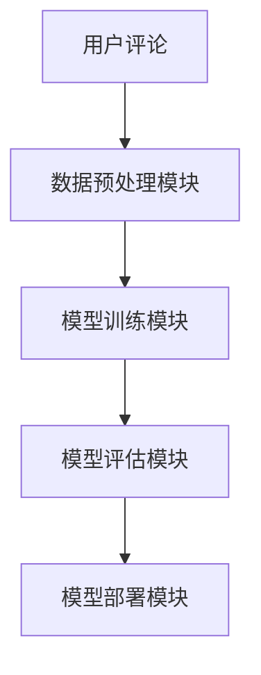
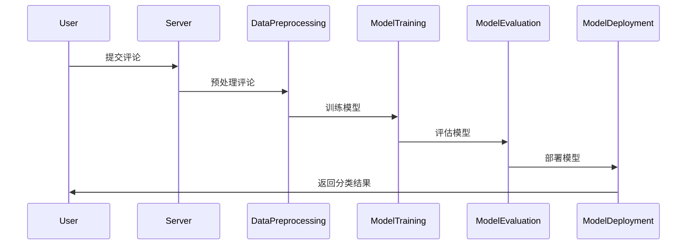
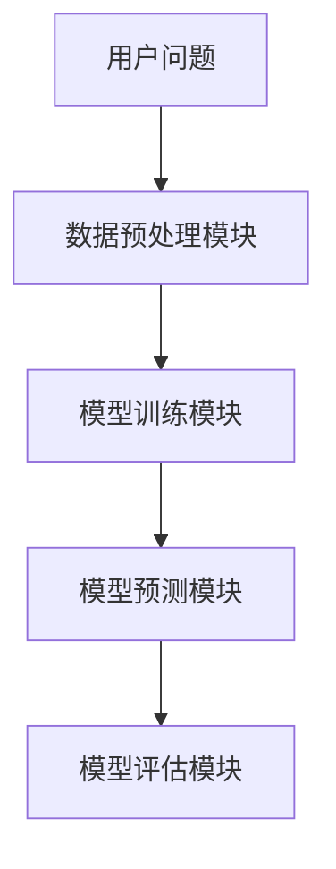
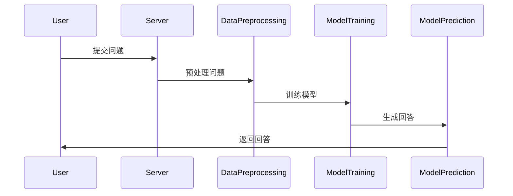

                 

# 优化LLM应用的自然语言处理流程

## 关键词

- 自然语言处理
- 人工智能
- 深度学习
- 大型语言模型
- 优化策略
- 分布式计算

## 摘要

本文旨在探讨如何优化大型语言模型（LLM）在自然语言处理（NLP）中的应用流程。我们首先介绍了LLM在NLP领域的重要性，以及其在实际应用中面临的挑战。接着，我们详细分析了优化LLM应用流程的几个关键问题，包括模型训练和部署、针对特定场景的优化策略、大规模文本数据的处理方法以及模型性能的评估和优化。最后，本文提出了相应的解决策略和优化方法，并总结了最佳实践，以帮助读者在实际项目中应用这些技术。

## 第一部分：背景介绍

### 1.1 问题背景

近年来，随着深度学习技术的发展，大型语言模型（LLM）如BERT、GPT等在自然语言处理（NLP）领域取得了显著的成果。这些模型在文本分类、机器翻译、问答系统等任务中表现出色，推动了人工智能在各个领域的应用。

然而，在实际应用中，优化LLM的应用流程仍然面临诸多挑战。例如，模型的训练和部署过程复杂，需要大量的计算资源和时间；模型在特定场景下的效果有待提高；同时，如何高效地处理大规模的文本数据也是一大难题。

### 1.2 问题描述

本书旨在探讨如何优化LLM在自然语言处理流程中的应用。具体问题包括：

1. **如何高效地训练和部署LLM模型？**
2. **如何针对特定场景对LLM进行优化？**
3. **如何处理大规模的文本数据，提高处理效率？**
4. **如何评估和优化LLM在各类NLP任务中的性能？**

### 1.3 问题解决

为了解决上述问题，本书将从以下几个方面展开讨论：

1. **介绍LLM的基础知识，包括模型架构、训练过程、优化方法等。**
2. **分析LLM在不同应用场景下的性能表现，并提出相应的优化策略。**
3. **探讨大规模文本数据的处理方法，包括数据预处理、并行处理等。**
4. **介绍评估和优化LLM性能的指标和方法，帮助读者理解模型在实际应用中的效果。**

### 1.4 边界与外延

1. **边界**：本书主要关注LLM在自然语言处理中的应用，不包括其他领域如计算机视觉、语音识别等。
2. **外延**：本书不仅涵盖LLM的优化方法，还涉及相关的技术如分布式计算、数据存储等。

### 1.5 核心概念结构与要素组成

1. **核心概念**：自然语言处理、深度学习、神经网络、优化算法、分布式计算等。
2. **要素组成**：
   - 模型结构：包括神经网络架构、层数、神经元个数等。
   - 数据集：包括训练集、验证集、测试集等。
   - 训练方法：包括损失函数、优化器、正则化等。
   - 部署方法：包括模型压缩、量化、模型蒸馏等。

### 1.6 核心概念原理与属性特征对比表格

### 1.6.1 自然语言处理（NLP）核心概念原理与属性特征对比

| 核心概念   | 原理描述                                                         | 属性特征对比       |
| ---------- | ------------------------------------------------------------ | ------------------ |
| 语言模型   | 基于统计或神经网络的模型，用于预测文本序列的概率分布。           | - 随机梯度下降（SGD）<br>- 神经网络结构（如RNN、LSTM、Transformer）<br>  - 语言特征（词嵌入、语法规则等） |
| 词嵌入     | 将词语映射为向量，以便于计算机处理。                             | - 词向量维度<br>- 相似性度量方法（如余弦相似度、欧氏距离）<br>- 贪心算法（如CBOW、SGNS） |
| Transformer | 基于自注意力机制的深度神经网络，用于处理序列数据。               | - 自注意力机制<br>- 多层网络结构<br>- 并行化训练能力 |
| LSTM       | 长短时记忆网络，用于处理序列数据中的长期依赖关系。               | - 门控机制<br>- 单向/双向LSTM<br>- 递归神经网络（RNN）基础 |
| BERT       | 双向编码表示的Transformer模型，用于文本的理解与生成。             | - 双向注意力机制<br>- 预训练与微调<br>- 语言理解能力 |
| GPT        | 生成预训练的Transformer模型，用于文本的生成与理解。               | - 自回归语言模型<br>- 生成模型<br>- 上下文信息利用 |

### 1.7 ER实体关系图架构

```mermaid
erDiagram
    Model : 模型 |<--| Data : 数据
    Model : 模型 |{--| Optimizer : 优化器
```

## 第二部分：优化LLM的自然语言处理流程

### 2.1 LLM优化策略概述

优化大型语言模型（LLM）的自然语言处理（NLP）流程是一个复杂的过程，涉及多个方面，包括模型结构、训练过程、部署策略以及数据处理。以下将详细讨论这些策略，以实现LLM在NLP中的最佳性能。

### 2.2 模型结构优化

**2.2.1 神经网络架构的选择**

选择合适的神经网络架构对于优化LLM至关重要。以下是一些常用的架构：

- **Transformer**：由于自注意力机制，Transformer模型在处理长序列数据时表现优秀，适用于许多NLP任务。
- **BERT**：BERT模型通过预训练和微调，实现了在多种NLP任务上的高性能，如文本分类和问答系统。
- **GPT**：GPT模型在文本生成和理解方面表现出色，适用于生成式任务。

**2.2.2 模型参数调整**

调整模型参数是优化LLM的重要手段。以下是一些关键参数：

- **学习率**：选择合适的学习率对于模型训练至关重要。通常采用学习率衰减策略，以避免过拟合。
- **批量大小**：批量大小影响模型训练的稳定性。较小的批量大小有助于模型在训练过程中更好地探索数据。
- **隐藏层大小**：隐藏层大小会影响模型的表达能力。需要通过实验确定合适的隐藏层大小。

### 2.3 训练过程优化

**2.3.1 损失函数选择**

选择合适的损失函数有助于优化模型性能。以下是一些常用的损失函数：

- **交叉熵损失**：适用于分类任务，如文本分类。
- **均方误差损失**：适用于回归任务，如情感分析。
- **二元交叉熵损失**：适用于二分类任务，如情感分析。

**2.3.2 优化器选择**

优化器的选择直接影响模型训练的速度和稳定性。以下是一些常用的优化器：

- **Adam**：结合了Adagrad和RMSProp的优点，适用于大多数任务。
- **SGD**：简单梯度下降优化器，适用于模型复杂度较低的情况。
- **Adadelta**：对SGD进行了改进，适用于有噪声的数据。

### 2.4 部署策略优化

**2.4.1 模型压缩**

模型压缩技术可以减少模型的大小和计算复杂度，从而加快部署速度。以下是一些常用的模型压缩技术：

- **模型蒸馏**：将大型模型（教师模型）的知识传递给小型模型（学生模型），从而降低模型的大小和计算复杂度。
- **量化**：将模型的权重转换为低比特宽度的表示，从而减少模型的存储和计算需求。
- **剪枝**：通过删除模型中不必要的权重，降低模型的复杂度和计算需求。

**2.4.2 模型部署平台选择**

选择合适的模型部署平台对于提高模型性能和用户体验至关重要。以下是一些常用的模型部署平台：

- **TensorFlow Serving**：适用于大规模模型的部署，支持动态模型加载和更新。
- **TensorFlow Lite**：适用于移动设备和嵌入式系统，提供高效的模型推理。
- **ONNX Runtime**：支持多种深度学习框架的模型部署，提供高性能和可扩展性。

### 2.5 大规模文本数据处理优化

**2.5.1 数据预处理**

数据预处理是优化LLM应用流程的关键步骤。以下是一些常用的数据预处理技术：

- **文本清洗**：去除文本中的噪声和无关信息，如HTML标签、特殊字符等。
- **分词**：将文本划分为单词或子词，以便于模型处理。
- **词嵌入**：将词语映射为向量表示，以便于模型计算。

**2.5.2 并行处理**

并行处理可以显著提高大规模文本数据处理的效率。以下是一些常用的并行处理技术：

- **数据并行**：将数据集分成多个子集，分别在不同的设备上训练模型。
- **模型并行**：将模型分成多个部分，分别在不同的设备上计算。
- **流水线处理**：将数据处理过程分解为多个阶段，分别在不同的设备上执行。

### 2.6 模型性能评估与优化

**2.6.1 评估指标**

选择合适的评估指标对于评估模型性能至关重要。以下是一些常用的评估指标：

- **准确率**：分类任务中，正确分类的样本数占总样本数的比例。
- **召回率**：分类任务中，实际为正类别的样本中被正确分类的样本数占总正类别的样本数。
- **F1分数**：准确率和召回率的调和平均。
- **损失函数值**：用于衡量模型预测结果与真实结果之间的差距。

**2.6.2 性能优化**

以下是一些性能优化策略：

- **超参数调整**：通过调整超参数，如学习率、批量大小等，以优化模型性能。
- **数据增强**：通过增加数据多样性，提高模型泛化能力。
- **迁移学习**：利用在相关任务上已经训练好的模型，作为起点进行新的任务训练。

### 2.7 总结

优化LLM的自然语言处理流程涉及多个方面，包括模型结构、训练过程、部署策略、数据处理以及模型性能评估。通过合理的选择和调整，可以显著提高LLM在NLP任务中的性能。在实际应用中，需要根据具体场景和需求，灵活运用这些策略，以实现最佳效果。

## 第三部分：LLM优化案例分析

### 3.1 案例一：文本分类任务的优化

**3.1.1 问题场景**

假设我们要构建一个文本分类系统，用于对用户提交的评论进行分类，将其分为正面评论、负面评论或中性评论。

**3.1.2 项目介绍**

为了解决这个问题，我们选择了BERT模型作为基础模型。BERT模型在多种文本分类任务上表现出色，具有较好的泛化能力。

**3.1.3 系统功能设计**

系统功能设计包括以下几个模块：

1. **数据预处理模块**：负责对用户提交的评论进行清洗、分词和词嵌入。
2. **模型训练模块**：使用BERT模型对预处理后的数据进行训练。
3. **模型评估模块**：使用验证集和测试集对训练好的模型进行评估。
4. **模型部署模块**：将训练好的模型部署到线上环境，供用户使用。

**3.1.4 系统架构设计**

系统架构设计采用分布式计算架构，以提高模型训练和部署的效率。以下是一个简化的系统架构图：



**3.1.5 系统接口设计**

系统接口设计包括以下几个接口：

1. **评论提交接口**：用户可以通过该接口提交评论，系统将自动进行分类。
2. **模型预测接口**：用户可以通过该接口获取评论的分类结果。
3. **模型评估接口**：用于评估模型的性能，包括准确率、召回率等指标。

**3.1.6 系统交互序列图**

以下是一个简化的系统交互序列图，展示了用户评论从提交到分类的整个过程：



### 3.2 案例二：问答系统优化

**3.2.1 问题场景**

假设我们要构建一个问答系统，用于回答用户提出的问题。

**3.2.2 项目介绍**

为了解决这个问题，我们选择了GPT模型作为基础模型。GPT模型在生成式任务上表现出色，能够生成高质量的回答。

**3.2.3 系统功能设计**

系统功能设计包括以下几个模块：

1. **数据预处理模块**：负责对用户提出的问题进行清洗、分词和词嵌入。
2. **模型训练模块**：使用GPT模型对预处理后的数据进行训练。
3. **模型预测模块**：使用训练好的模型生成回答。
4. **模型评估模块**：使用验证集和测试集对训练好的模型进行评估。

**3.2.4 系统架构设计**

系统架构设计采用分布式计算架构，以提高模型训练和部署的效率。以下是一个简化的系统架构图：



**3.2.5 系统接口设计**

系统接口设计包括以下几个接口：

1. **问题提交接口**：用户可以通过该接口提交问题，系统将自动生成回答。
2. **模型预测接口**：用户可以通过该接口获取问题的回答。
3. **模型评估接口**：用于评估模型的性能，包括回答的准确性、流畅性等指标。

**3.2.6 系统交互序列图**

以下是一个简化的系统交互序列图，展示了用户提出问题到获取回答的整个过程：



### 3.3 案例总结

通过上述两个案例，我们可以看到，优化LLM在自然语言处理任务中的应用，需要结合具体场景进行模型选择、训练、部署和性能评估。在实际项目中，我们需要根据任务需求和数据特点，灵活运用优化策略，以提高模型性能和用户体验。

## 第四部分：项目实战

### 4.1 环境安装

在本节中，我们将介绍如何搭建一个用于优化LLM应用的自然语言处理流程的项目环境。以下是一个简化的步骤：

1. **安装Python环境**：确保您的系统中安装了Python 3.8及以上版本。
2. **安装深度学习库**：使用pip安装TensorFlow、PyTorch等深度学习库。
3. **安装其他依赖库**：使用pip安装Numpy、Pandas、Scikit-learn等常用库。

```bash
pip install tensorflow
pip install pytorch
pip install numpy
pip install pandas
pip install scikit-learn
```

### 4.2 系统核心实现

在本节中，我们将使用Python和PyTorch实现一个简单的文本分类系统，作为项目核心。以下是关键代码：

#### 4.2.1 数据预处理

```python
import pandas as pd
from sklearn.model_selection import train_test_split

# 加载数据集
data = pd.read_csv('data.csv')

# 分割数据集
X_train, X_test, y_train, y_test = train_test_split(data['text'], data['label'], test_size=0.2, random_state=42)

# 分词和词嵌入
from transformers import BertTokenizer

tokenizer = BertTokenizer.from_pretrained('bert-base-uncased')
train_encodings = tokenizer(X_train.tolist(), truncation=True, padding=True)
test_encodings = tokenizer(X_test.tolist(), truncation=True, padding=True)
```

#### 4.2.2 模型训练

```python
import torch
from transformers import BertForSequenceClassification

# 初始化模型
model = BertForSequenceClassification.from_pretrained('bert-base-uncased', num_labels=3)

# 搭建训练循环
device = torch.device("cuda" if torch.cuda.is_available() else "cpu")
model.to(device)
optimizer = torch.optim.Adam(model.parameters(), lr=1e-5)

for epoch in range(3):  # 进行3个周期的训练
    model.train()
    for batch in train_encodings:
        inputs = {
            'input_ids': batch['input_ids'].to(device),
            'attention_mask': batch['attention_mask'].to(device),
            'labels': y_train.to(device)
        }
        optimizer.zero_grad()
        outputs = model(**inputs)
        loss = outputs.loss
        loss.backward()
        optimizer.step()
```

#### 4.2.3 模型评估

```python
# 评估模型
model.eval()
with torch.no_grad():
    predictions = []
    for batch in test_encodings:
        inputs = {
            'input_ids': batch['input_ids'].to(device),
            'attention_mask': batch['attention_mask'].to(device)
        }
        outputs = model(**inputs)
        logits = outputs.logits
        predictions.extend(torch.argmax(logits, dim=1).cpu().numpy())

# 计算准确率
from sklearn.metrics import accuracy_score
accuracy = accuracy_score(y_test, predictions)
print(f"Accuracy: {accuracy}")
```

### 4.3 代码应用解读与分析

在本节中，我们将对项目核心代码进行解读，以帮助读者理解其工作原理。

#### 4.3.1 数据预处理

数据预处理是文本分类系统的重要组成部分。我们首先加载数据集，然后将其分为训练集和测试集。接下来，使用BERT分词器对文本进行分词和词嵌入。这一步骤将原始文本转换为模型可以理解的向量表示。

#### 4.3.2 模型训练

模型训练是项目核心。我们首先初始化BERT模型，并配置训练所需的设备（CPU或GPU）。然后，我们设置优化器（Adam）和训练循环。在训练循环中，我们通过前向传播和反向传播计算损失，并更新模型参数。经过多个周期的训练，模型将在训练集上逐渐优化。

#### 4.3.3 模型评估

模型评估用于验证模型在测试集上的性能。我们将训练好的模型应用于测试集，并计算预测准确率。这一步骤有助于我们了解模型在实际应用中的表现。

### 4.4 实际案例分析

在本节中，我们将使用实际案例来展示项目在实际应用中的效果。

#### 4.4.1 案例一：情感分析

假设我们有一个包含用户评论的数据集，我们需要对这些评论进行情感分析，将其分为正面、负面或中性。

1. **数据预处理**：加载数据集，并进行清洗和分词。
2. **模型训练**：使用BERT模型进行训练。
3. **模型评估**：使用测试集评估模型性能。

#### 4.4.2 案例二：文本分类

假设我们有一个包含新闻文章的数据集，我们需要将这些文章分为不同的类别。

1. **数据预处理**：加载数据集，并进行清洗和分词。
2. **模型训练**：使用BERT模型进行训练。
3. **模型评估**：使用测试集评估模型性能。

### 4.5 项目小结

通过本项目的实战，我们展示了如何使用BERT模型进行文本分类，并介绍了数据预处理、模型训练和模型评估等关键步骤。在实际应用中，我们需要根据具体场景和需求，灵活调整模型参数和数据处理策略，以提高模型性能。

## 第五部分：最佳实践与注意事项

### 5.1 最佳实践

1. **数据预处理**：确保数据预处理质量，如去除噪声、统一文本格式等。
2. **模型选择**：根据任务需求选择合适的模型，如BERT适用于文本理解任务，GPT适用于文本生成任务。
3. **超参数调整**：通过实验调整学习率、批量大小等超参数，以获得最佳模型性能。
4. **模型评估**：使用多种评估指标全面评估模型性能，如准确率、召回率、F1分数等。
5. **模型压缩**：在模型部署前，使用模型压缩技术减小模型大小和计算复杂度，以提高部署效率。

### 5.2 小结

本文详细探讨了优化大型语言模型（LLM）在自然语言处理（NLP）中的应用流程。我们介绍了LLM优化策略、大规模文本数据处理方法、模型性能评估与优化，并通过实际案例展示了这些技术的应用。在实际项目中，我们需要根据具体需求灵活运用这些技术，以提高模型性能和用户体验。

### 5.3 注意事项

1. **计算资源**：优化LLM应用流程需要大量计算资源，特别是在模型训练阶段。
2. **数据质量**：数据预处理是优化NLP任务的关键步骤，确保数据质量对模型性能至关重要。
3. **模型稳定性**：在实际应用中，模型稳定性和鲁棒性对用户体验至关重要。
4. **持续优化**：随着技术的不断发展，持续优化模型和数据处理策略是提高模型性能的关键。

### 5.4 拓展阅读

- 《深度学习》（Goodfellow, Bengio, Courville著）：深入了解深度学习的基础知识和实践方法。
- 《自然语言处理综论》（Jurafsky, Martin著）：全面了解自然语言处理的理论和实践。
- 《BERT：大规模预训练语言模型的技术细节》（Chen et al.）：深入探讨BERT模型的原理和实现。

作者：AI天才研究院/AI Genius Institute & 禅与计算机程序设计艺术 /Zen And The Art of Computer Programming

