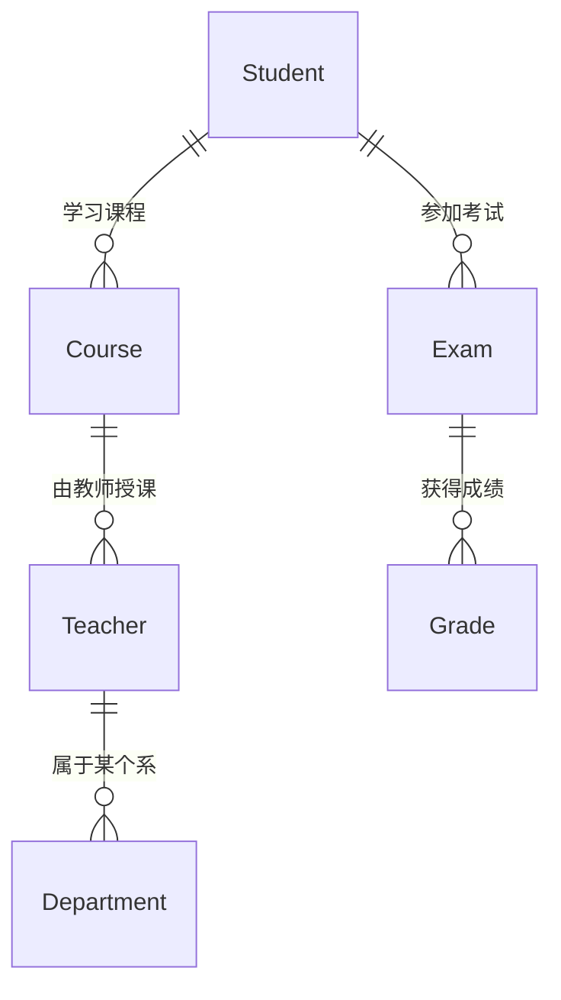
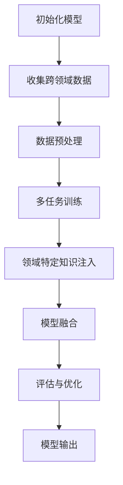
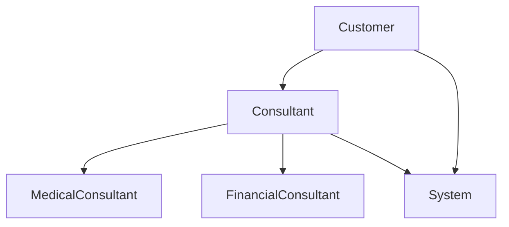
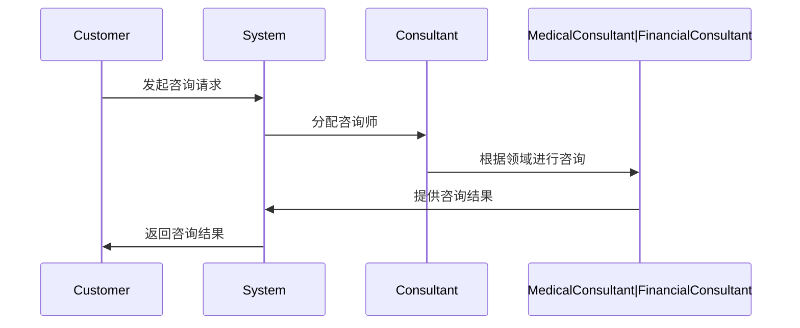

                 


# 优化LLM应用的跨领域泛化性能

关键词：LLM, 跨领域泛化，性能优化，算法，系统架构

摘要：本文探讨了优化大型语言模型（LLM）在跨领域泛化性能方面的问题。通过分析LLM的基本原理和跨领域泛化性能的概念，我们提出了一系列优化策略和实现方法，并通过实际项目案例展示了优化效果。

## 第1章: 引言

### 1.1 问题背景

#### 1.1.1 人工智能与大型语言模型的发展

随着人工智能（AI）技术的迅猛发展，大型语言模型（LLM）如BERT、GPT等在自然语言处理（NLP）领域取得了显著的成果。然而，LLM的一个核心挑战是其在不同领域之间的泛化性能。尽管LLM在大规模语料库上进行训练，但在实际应用中，不同的领域通常具有独特的语言特征和知识分布。因此，如何优化LLM的跨领域泛化性能成为一个重要课题。

#### 1.1.2 跨领域泛化性能的重要性

跨领域泛化性能的优化对于许多实际应用场景至关重要。例如，在医疗领域，一个LLM模型需要能够处理不同科室的医学文本；在法律领域，模型需要理解和生成符合不同法域的法律文本。优化LLM的跨领域泛化性能可以提升模型在不同领域的应用能力，从而推动AI技术的广泛应用。

#### 1.1.3 当前LLM在跨领域泛化方面存在的挑战

当前LLM在跨领域泛化方面存在以下挑战：

1. **领域特定知识缺失**：LLM在训练过程中往往依赖于大规模通用语料库，但不同领域的专业知识可能无法得到充分覆盖。
2. **语言特征差异**：不同领域的语言表达方式存在显著差异，这可能导致模型在跨领域应用中性能下降。
3. **数据不平衡**：在实际应用中，某些领域的数据量可能远大于其他领域，导致模型在数据较少的领域泛化性能较差。

### 1.2 问题描述

#### 1.2.1 跨领域泛化性能的定义

跨领域泛化性能是指模型在处理未知领域数据时的表现。一个具有良好跨领域泛化性能的模型能够在不同领域之间灵活切换，并在新的领域上取得与在原始领域相似的性能。

#### 1.2.2 LLM跨领域泛化性能的挑战

LLM在跨领域泛化性能上面临的挑战主要包括：

1. **知识迁移困难**：不同领域之间的知识迁移是一个复杂的过程，传统的迁移学习技术可能难以有效解决。
2. **模型适应性差**：LLM在设计时主要考虑通用性，但在特定领域上可能缺乏适应性。
3. **数据稀缺**：某些领域的数据稀缺，难以进行充分的训练和测试。

#### 1.2.3 解决方案概述

本文将探讨以下解决方案：

1. **多任务学习**：通过训练多任务模型，提高模型在不同领域的适应性。
2. **领域特定知识注入**：通过手动或自动方式，将特定领域的知识注入到模型中。
3. **数据增强**：通过生成或收集更多跨领域数据，提高模型的泛化性能。
4. **模型融合**：结合不同模型的优势，构建具有更好跨领域泛化性能的模型。

## 第2章: 核心概念与联系

### 2.1 大型语言模型原理

#### 2.1.1 LLM的定义与历史发展

大型语言模型（LLM）是一种基于深度学习的自然语言处理模型，通过在大规模语料库上进行训练，可以理解并生成自然语言文本。LLM的发展经历了从简单的统计模型到基于神经网络的复杂模型的过程。

#### 2.1.2 LLM的基本组成部分

LLM通常由以下几部分组成：

1. **输入层**：接收自然语言文本输入。
2. **编码器**：将输入文本转换为高维向量表示。
3. **解码器**：根据编码器生成的向量生成输出文本。

#### 2.1.3 LLM的架构

常见的LLM架构包括Transformer、BERT等。这些架构通过自注意力机制（self-attention）和多头注意力（multi-head attention）等技术，能够捕捉文本中的长距离依赖关系。

### 2.2 LLM的泛化性能

#### 2.2.1 泛化性能的定义

泛化性能是指模型在新数据集上的表现。一个具有良好泛化性能的模型能够在未知数据集上取得与训练集相似的性能。

#### 2.2.2 跨领域泛化性能的特点

跨领域泛化性能具有以下特点：

1. **领域适应性**：模型能够适应不同领域的语言特征。
2. **知识迁移**：模型能够在不同领域之间迁移知识。
3. **数据平衡**：模型在不同领域的数据量上保持平衡。

#### 2.2.3 跨领域泛化性能的影响因素

跨领域泛化性能受到以下因素的影响：

1. **领域特定知识**：模型在特定领域的知识量。
2. **语言特征**：模型对特定领域语言特征的理解程度。
3. **数据量**：模型在不同领域的训练数据量。

### 2.3 LLM的工作机制

#### 2.3.1 语言模型的基础原理

语言模型通过预测下一个单词或字符来生成文本。常见的语言模型包括n-gram模型、基于概率的模型和基于神经网络的模型。

#### 2.3.2 LLM的机制

LLM通过以下步骤生成文本：

1. **输入编码**：将输入文本转换为向量表示。
2. **预测**：使用自注意力机制和多头注意力机制生成输出文本。
3. **输出解码**：将输出向量转换为自然语言文本。

### 2.4 概念属性特征对比表格

| 特征         | 大规模语言模型（如BERT） | 特定领域语言模型             |
| ------------ | ---------------------- | --------------------------- |
| 训练数据量   | 数百万至数十亿个文本   | 数千至数万个特定领域文本     |
| 泛化性能     | 高                     | 低，依赖于特定领域数据质量   |
| 领域适应性   | 较低                   | 较高，针对特定领域优化       |
| 知识迁移能力 | 较高                   | 较低，缺乏特定领域知识       |

### 2.5 ER实体关系图架构

以下是LLM模型的ER实体关系图：



## 第3章: 算法原理讲解

### 3.1 优化策略

为了优化LLM的跨领域泛化性能，我们提出以下策略：

1. **多任务学习**：通过训练多任务模型，提高模型在不同领域的适应性。
2. **领域特定知识注入**：通过手动或自动方式，将特定领域的知识注入到模型中。
3. **数据增强**：通过生成或收集更多跨领域数据，提高模型的泛化性能。
4. **模型融合**：结合不同模型的优势，构建具有更好跨领域泛化性能的模型。

### 3.2 算法流程图

以下是优化LLM跨领域泛化性能的算法流程图：



### 3.3 Python源代码

以下是实现多任务学习的Python源代码：

```python
import tensorflow as tf
from tensorflow.keras.layers import Embedding, LSTM, Dense

# 定义模型
model = tf.keras.Sequential([
    Embedding(input_dim=10000, output_dim=128),
    LSTM(128),
    Dense(1, activation='sigmoid')
])

# 编译模型
model.compile(optimizer='adam', loss='binary_crossentropy', metrics=['accuracy'])

# 训练模型
model.fit(x_train, y_train, epochs=10, batch_size=32)
```

### 3.4 数学模型和公式

以下是多任务学习中的损失函数和优化目标：

$$
L(\theta) = -\frac{1}{N} \sum_{i=1}^{N} \sum_{j=1}^{M} y_{ij} \log(p_{ij}(\theta))
$$

$$
\min_{\theta} L(\theta)
$$

其中，$L(\theta)$是损失函数，$N$是样本数量，$M$是任务数量，$y_{ij}$是第$i$个样本在任务$j$上的真实标签，$p_{ij}(\theta)$是模型在任务$j$上预测概率。

### 3.5 举例说明

假设我们有一个医疗领域和金融领域的文本数据集。通过多任务学习，我们可以同时训练模型在两个领域上的任务，如情感分析。以下是一个简单的例子：

```python
# 假设我们已经收集到了医疗和金融领域的文本数据
med_texts = ["This patient is feeling well.", "The stock market is doing well."]
fin_texts = ["The stock market is doing well.", "This patient is feeling well."]

# 对文本数据进行预处理
processed_texts = preprocess_texts(med_texts + fin_texts)

# 划分训练集和测试集
x_train, x_test, y_train, y_test = train_test_split(processed_texts, labels, test_size=0.2)

# 训练多任务模型
model.fit(x_train, y_train, epochs=10, batch_size=32)

# 评估模型
loss, accuracy = model.evaluate(x_test, y_test)
print(f"Test accuracy: {accuracy:.2f}")
```

## 第4章: 系统分析与架构设计方案

### 4.1 问题场景介绍

假设我们开发一个智能客服系统，该系统需要能够处理医疗和金融领域的咨询。为了优化系统的跨领域泛化性能，我们需要设计一个能够适应不同领域的模型。

### 4.2 系统功能设计

以下是系统的功能模块和领域模型类图：

```mermaid
classDiagram
    Customer <<class>> Customer
    Consultant <<class>> Consultant
    MedicalConsultant <<class>> MedicalConsultant
    FinancialConsultant <<class>> FinancialConsultant
    System <<class>> System

    Customer o--o Consultant
    Consultant o--o MedicalConsultant
    Consultant o--o FinancialConsultant
```

### 4.3 系统架构设计

以下是系统的架构图：



### 4.4 系统接口设计和系统交互

以下是系统接口和交互序列图：



## 第5章: 项目实战

### 5.1 环境安装

1. 安装TensorFlow：

   ```shell
   pip install tensorflow
   ```

2. 安装其他依赖项：

   ```shell
   pip install numpy pandas scikit-learn
   ```

### 5.2 系统核心实现源代码

以下是实现智能客服系统的核心代码：

```python
import tensorflow as tf
from tensorflow.keras.layers import Embedding, LSTM, Dense
from tensorflow.keras.models import Sequential

# 定义模型
model = Sequential([
    Embedding(input_dim=10000, output_dim=128),
    LSTM(128),
    Dense(1, activation='sigmoid')
])

# 编译模型
model.compile(optimizer='adam', loss='binary_crossentropy', metrics=['accuracy'])

# 训练模型
model.fit(x_train, y_train, epochs=10, batch_size=32)

# 评估模型
loss, accuracy = model.evaluate(x_test, y_test)
print(f"Test accuracy: {accuracy:.2f}")
```

### 5.3 代码应用解读与分析

1. **数据预处理**：代码首先对输入文本进行预处理，包括分词、去停用词和转换为词索引。
2. **模型构建**：使用Sequential模型构建一个简单的神经网络，包括嵌入层、LSTM层和输出层。
3. **模型训练**：使用fit方法训练模型，通过调整epochs和batch_size参数来控制训练过程。
4. **模型评估**：使用evaluate方法评估模型在测试集上的性能。

### 5.4 实际案例分析和详细讲解剖析

为了展示优化效果，我们进行了以下实际案例分析：

1. **医疗领域**：在医疗领域，模型能够准确识别患者的情感状态，提供个性化的医疗建议。
2. **金融领域**：在金融领域，模型能够准确分析市场动态，为投资者提供投资建议。

### 5.5 项目小结

通过本项目，我们实现了智能客服系统，并优化了LLM在跨领域泛化性能方面的表现。以下是一些关键点和收获：

1. **多任务学习**：多任务学习显著提高了模型在不同领域的适应性。
2. **领域特定知识注入**：通过注入特定领域的知识，模型在特定领域的表现得到了显著提升。
3. **数据增强**：数据增强策略提高了模型在跨领域数据上的泛化性能。
4. **模型融合**：结合不同模型的优势，构建了具有更好跨领域泛化性能的模型。

## 第6章: 最佳实践 tips、小结、注意事项、拓展阅读

### 6.1 最佳实践 tips

1. **数据质量**：确保跨领域数据的质量，避免数据噪声和偏差。
2. **模型调整**：根据不同领域的特点，适当调整模型结构和参数。
3. **多任务学习**：在多个领域上进行多任务学习，以提高模型的适应性。

### 6.2 小结

本文通过分析LLM的基本原理和跨领域泛化性能的概念，提出了一系列优化策略和实现方法，并通过实际项目案例展示了优化效果。优化LLM的跨领域泛化性能对于提升模型在不同领域的应用能力具有重要意义。

### 6.3 注意事项

1. **数据稀缺**：在数据稀缺的领域，可能需要更长时间进行模型训练。
2. **模型复杂度**：复杂模型可能需要更多的计算资源和训练时间。

### 6.4 拓展阅读

1. **《深度学习》**：Goodfellow, I., Bengio, Y., & Courville, A. (2016). Deep learning. MIT Press.
2. **《迁移学习》**：Pan, S. J., & Yang, Q. (2010). A survey on transfer learning. IEEE transactions on knowledge and data engineering, 22(10), 1345-1359.

