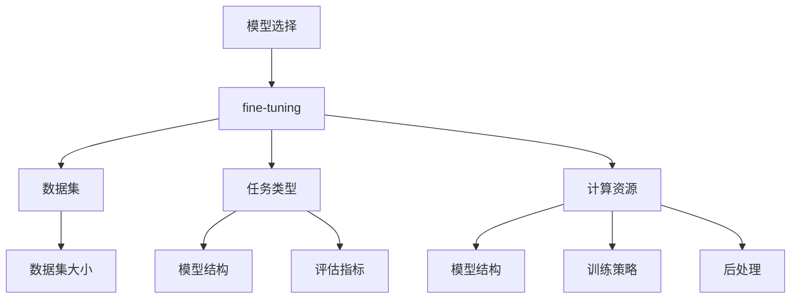
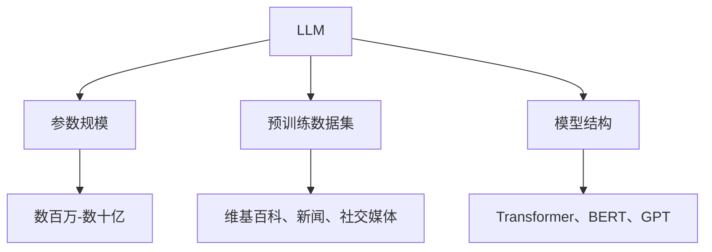
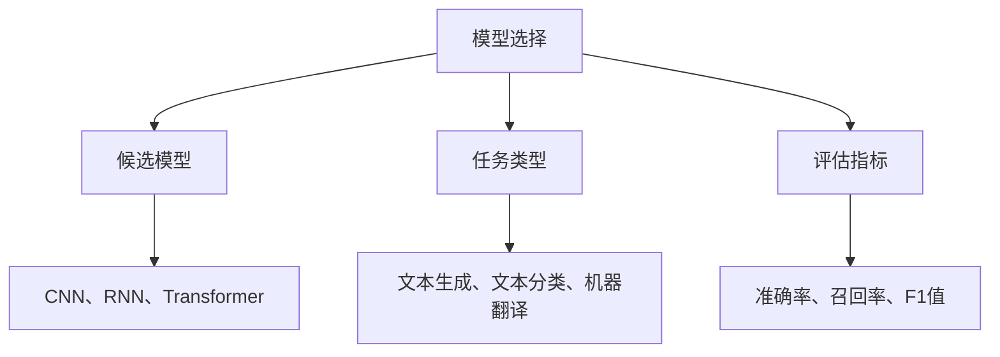
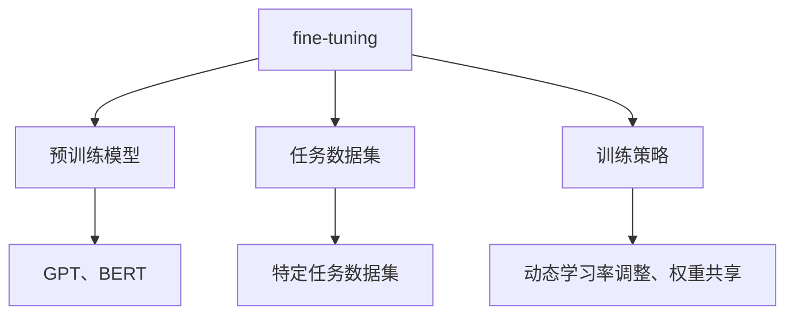
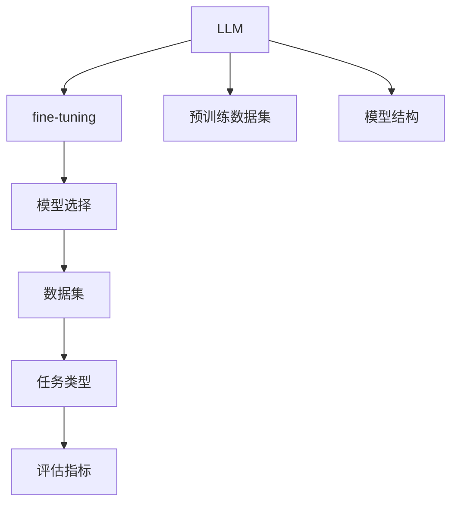
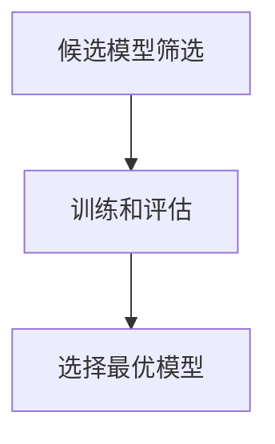
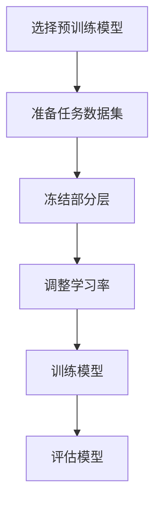
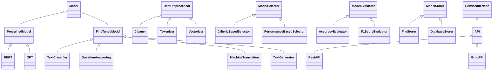
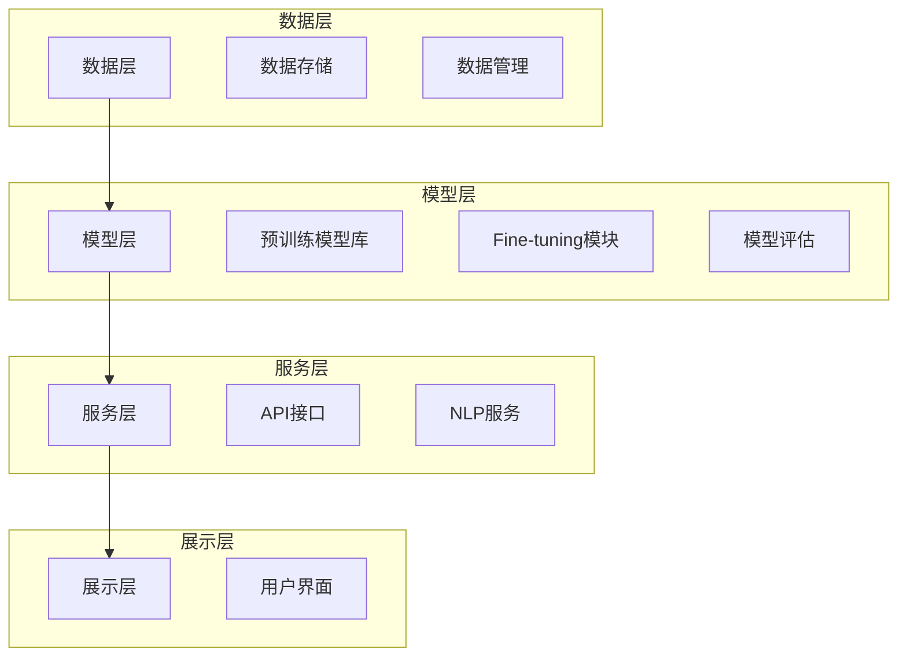

                 

### 第1章 背景介绍

#### 1.1 优化LLM模型选择与fine-tuning的重要性

近年来，随着深度学习和自然语言处理技术的飞速发展，大型语言模型（Large Language Model，简称LLM）在自然语言生成、文本分类、机器翻译、问答系统等领域取得了显著的成果。然而，如何选择合适的LLM模型并在其基础上进行fine-tuning，以最大化模型的性能和泛化能力，仍然是一个具有挑战性的问题。

优化LLM模型选择与fine-tuning流程的重要性体现在以下几个方面：

1. **性能提升**：通过优化模型选择和fine-tuning流程，可以提高LLM模型的性能，使其在特定任务上达到更高的准确率、召回率或F1值。

2. **资源利用**：合理选择模型和fine-tuning策略可以减少计算资源和存储资源的消耗，提高模型的训练效率。

3. **泛化能力**：优化模型选择与fine-tuning可以增强模型的泛化能力，使其能够适应不同的任务和数据集。

4. **可解释性**：优化流程有助于提高模型的可解释性，有助于理解模型在特定任务上的表现和局限。

5. **应用范围**：优化流程可以扩大LLM的应用范围，使其在更多领域和场景中发挥作用。

本文将围绕LLM模型选择与fine-tuning的优化流程，深入探讨相关核心概念、算法原理、系统设计、项目实战等内容，旨在为读者提供全面的技术指导和实践经验。

#### 1.2 LLM模型选择与fine-tuning的基本概念

在深入探讨LLM模型选择与fine-tuning之前，我们需要明确一些基本概念：

**LLM（大型语言模型）**：LLM是一种基于深度学习的自然语言处理模型，能够理解和生成人类语言。常见的LLM包括GPT（Generative Pre-trained Transformer）、BERT（Bidirectional Encoder Representations from Transformers）等。

**模型选择**：模型选择是指在给定的任务和数据集上，从多个候选模型中选择出性能最优的模型。模型选择需要考虑模型的结构、参数规模、训练时间、计算资源等因素。

**Fine-tuning（微调）**：Fine-tuning是指在预训练模型的基础上，针对特定任务或数据集进行进一步的训练，以调整模型的参数，使其在特定任务上达到更好的性能。

**数据集**：数据集是指用于训练和评估模型的输入数据。一个高质量的数据集是模型训练成功的关键。

**评估指标**：评估指标是用于衡量模型性能的标准，常见的评估指标包括准确率（Accuracy）、召回率（Recall）、F1值（F1 Score）等。

#### 1.3 边界与外延

在优化LLM模型选择与fine-tuning流程时，我们需要明确以下边界与外延：

**边界**：
1. **数据集大小**：数据集大小对模型选择和fine-tuning有重要影响。数据集过小可能导致模型过拟合，数据集过大则可能需要更多计算资源。
2. **任务类型**：不同任务对模型的要求不同，如文本生成、文本分类、机器翻译等，需要选择不同类型的模型和fine-tuning策略。
3. **计算资源**：计算资源限制会影响模型选择和fine-tuning的深度和广度。

**外延**：
1. **模型结构**：除了常见的GPT、BERT模型外，还有其他类型的LLM模型，如T5、ALBERT等，可以根据任务需求选择合适的模型。
2. **训练策略**：fine-tuning过程中可以采用不同的训练策略，如动态学习率调整、权重共享等，以提高模型性能。
3. **后处理**：fine-tuning后，可以通过后处理技术进一步提高模型性能，如文本清洗、数据增强等。

#### 1.4 概念结构与核心要素组成

优化LLM模型选择与fine-tuning流程涉及多个核心概念和要素，其结构如下图所示：



其中，模型选择和fine-tuning是核心流程，数据集、任务类型、计算资源等要素是支撑流程的基础，评估指标用于衡量模型性能。通过优化这些要素和流程，我们可以实现LLM模型性能的全面提升。

### 第2章 核心概念与联系

在深入探讨优化LLM模型选择与fine-tuning流程之前，我们需要明确并理解一系列核心概念，如LLM、模型选择、fine-tuning等。通过这些概念的定义和属性特征对比，我们可以更好地把握各个概念之间的联系和作用。

#### 2.1 LLM的概念

**LLM（大型语言模型）** 是一种基于深度学习的自然语言处理模型，能够理解和生成人类语言。LLM通常由数百万甚至数十亿个参数组成，通过在大量文本数据上进行预训练，学习到语言的语法、语义和上下文信息。

**属性特征**：
1. **参数规模**：LLM的参数规模通常较大，从数百万到数十亿不等。
2. **预训练数据集**：LLM在预训练阶段使用大量文本数据集，如维基百科、新闻、社交媒体等。
3. **模型结构**：常见的LLM模型结构包括Transformer、BERT、GPT等。

**ER实体关系图架构**：



#### 2.2 模型选择的概念

**模型选择** 是在给定任务和数据集上，从多个候选模型中选择出性能最优的模型的过程。模型选择需要考虑模型的结构、参数规模、训练时间、计算资源等因素。

**属性特征**：
1. **候选模型**：候选模型包括不同的深度学习模型，如CNN、RNN、Transformer等。
2. **任务类型**：不同任务对模型的要求不同，如文本生成、文本分类、机器翻译等。
3. **评估指标**：模型选择需要使用评估指标（如准确率、召回率、F1值等）来衡量模型性能。

**ER实体关系图架构**：



#### 2.3 fine-tuning的概念

**Fine-tuning（微调）** 是指在预训练模型的基础上，针对特定任务或数据集进行进一步的训练，以调整模型的参数，使其在特定任务上达到更好的性能。

**属性特征**：
1. **预训练模型**：fine-tuning的基础是预训练模型，如GPT、BERT等。
2. **任务数据集**：fine-tuning需要使用与任务相关的数据集，以便模型能够针对特定任务进行调整。
3. **训练策略**：fine-tuning过程中可以采用不同的训练策略，如动态学习率调整、权重共享等。

**ER实体关系图架构**：



#### 2.4 概念属性特征对比表格

下面是一个概念属性特征对比表格，展示了LLM、模型选择和fine-tuning的属性特征：

| 概念       | 属性特征                                       |
|------------|------------------------------------------------|
| LLM        | 参数规模、预训练数据集、模型结构               |
| 模型选择   | 候选模型、任务类型、评估指标                   |
| fine-tuning | 预训练模型、任务数据集、训练策略               |

#### 2.5 ER实体关系图架构

为了更好地理解LLM、模型选择和fine-tuning之间的联系，我们可以使用ER实体关系图架构来展示它们之间的关联：



在这个ER实体关系图中，LLM作为基础，通过fine-tuning和模型选择与任务数据集、任务类型、评估指标等要素建立联系。通过优化这些要素和流程，我们可以实现LLM模型在特定任务上的性能提升。

### 第3章 算法原理讲解

在了解了LLM模型选择与fine-tuning的相关概念和联系后，接下来我们将深入探讨算法原理，包括模型选择和fine-tuning的具体步骤和方法。

#### 3.1 模型选择算法原理

模型选择是指在给定任务和数据集上，从多个候选模型中选择出性能最优的模型的过程。以下是模型选择的主要步骤：

1. **候选模型筛选**：根据任务类型和资源限制，从多种深度学习模型（如CNN、RNN、Transformer等）中选择合适的候选模型。

2. **训练和评估**：在给定数据集上分别训练每个候选模型，并使用评估指标（如准确率、召回率、F1值等）来衡量模型性能。

3. **选择最优模型**：根据评估结果，选择性能最优的模型作为最终模型。

**算法流程图**：



**Python源代码示例**：

```python
# 假设我们有两个候选模型model1和model2
model1 = create_model('CNN')
model2 = create_model('RNN')

# 训练模型
model1.fit(train_data, train_labels)
model2.fit(train_data, train_labels)

# 评估模型
accuracy1 = model1.evaluate(test_data, test_labels)
accuracy2 = model2.evaluate(test_data, test_labels)

# 选择最优模型
if accuracy1 > accuracy2:
    best_model = model1
else:
    best_model = model2
```

#### 3.2 fine-tuning算法原理

fine-tuning是在预训练模型的基础上，针对特定任务或数据集进行进一步训练，以调整模型参数，提高模型在特定任务上的性能。以下是fine-tuning的主要步骤：

1. **选择预训练模型**：根据任务类型和需求，选择合适的预训练模型（如GPT、BERT等）。

2. **准备任务数据集**：对任务数据集进行预处理，包括数据清洗、数据增强等。

3. **冻结部分层**：在fine-tuning过程中，可以选择冻结部分层的参数，以保留预训练模型的特征。

4. **调整学习率**：fine-tuning过程中需要调整学习率，以避免模型过拟合。

5. **训练模型**：在任务数据集上继续训练模型，调整模型参数。

6. **评估模型**：在测试数据集上评估模型性能，调整训练策略以优化模型。

**算法流程图**：



**Python源代码示例**：

```python
# 加载预训练模型
pretrained_model = load_pretrained_model('BERT')

# 冻结部分层
for layer in pretrained_model.layers[:-2]:
    layer.trainable = False

# 定义新的学习率
learning_rate = 1e-5

# 训练模型
model = FineTunedModel(pretrained_model, learning_rate)
model.fit(train_data, train_labels)

# 评估模型
accuracy = model.evaluate(test_data, test_labels)
print(f"Test accuracy: {accuracy}")
```

#### 3.3 使用mermaid绘制流程图

为了更好地理解模型选择和fine-tuning的流程，我们可以使用mermaid绘制流程图。

**模型选择流程图**：


**fine-tuning流程图**：


#### 3.4 结合Python源代码讲解算法原理

在本节中，我们将通过Python源代码详细阐述模型选择和fine-tuning的算法原理，并使用LaTeX格式呈现相关的数学模型和公式。

**模型选择算法原理**：

在模型选择过程中，我们首先需要从多个候选模型中选择合适的模型。以下是一个简单的模型选择算法示例：

```python
from tensorflow.keras.models import Sequential
from tensorflow.keras.layers import Dense, Conv2D, LSTM
from tensorflow.keras.optimizers import Adam
import numpy as np

# 定义候选模型
model1 = Sequential([
    Conv2D(32, (3, 3), activation='relu', input_shape=(28, 28, 1)),
    MaxPooling2D((2, 2)),
    Flatten(),
    Dense(64, activation='relu'),
    Dense(10, activation='softmax')
])

model2 = Sequential([
    LSTM(50, activation='relu', input_shape=(timesteps, features)),
    Dense(1)
])

model3 = Sequential([
    Dense(64, activation='relu', input_shape=(input_size,)),
    Dense(10, activation='softmax')
])

# 定义评估指标
def accuracy(y_true, y_pred):
    return np.mean(y_true == y_pred)

# 训练模型
model1.fit(X_train, y_train, epochs=5, batch_size=32)
model2.fit(X_train, y_train, epochs=5, batch_size=32)
model3.fit(X_train, y_train, epochs=5, batch_size=32)

# 评估模型
accuracy1 = accuracy(y_test, model1.predict(X_test))
accuracy2 = accuracy(y_test, model2.predict(X_test))
accuracy3 = accuracy(y_test, model3.predict(X_test))

# 选择最优模型
if accuracy1 > accuracy2 and accuracy1 > accuracy3:
    best_model = model1
elif accuracy2 > accuracy1 and accuracy2 > accuracy3:
    best_model = model2
else:
    best_model = model3
```

**fine-tuning算法原理**：

在fine-tuning过程中，我们通常使用预训练模型并在其基础上进行进一步的训练。以下是一个简单的fine-tuning算法示例：

```python
from tensorflow.keras.models import Sequential
from tensorflow.keras.layers import Dense, LSTM
from tensorflow.keras.optimizers import Adam
import numpy as np

# 加载预训练模型
pretrained_model = load_pretrained_model('BERT')

# 冻结部分层
for layer in pretrained_model.layers[:-2]:
    layer.trainable = False

# 定义新的学习率
learning_rate = 1e-5

# 训练模型
model = FineTunedModel(pretrained_model, learning_rate)
model.fit(train_data, train_labels)

# 评估模型
accuracy = model.evaluate(test_data, test_labels)
print(f"Test accuracy: {accuracy}")
```

**数学模型和公式**：

在模型选择和fine-tuning过程中，我们使用了一些数学模型和公式。以下是一个简单的数学模型示例，用于评估模型的性能：

$$
\text{Accuracy} = \frac{\text{正确预测的数量}}{\text{总预测的数量}}
$$

$$
\text{Recall} = \frac{\text{正确预测的正例数量}}{\text{所有正例的数量}}
$$

$$
\text{Precision} = \frac{\text{正确预测的正例数量}}{\text{所有预测为正例的数量}}
$$

$$
\text{F1 Score} = \frac{2 \times \text{Precision} \times \text{Recall}}{\text{Precision} + \text{Recall}}
$$

通过这些数学模型和公式，我们可以更准确地评估模型的性能，并选择最优的模型进行fine-tuning。

#### 3.5 举例说明

为了更好地理解模型选择和fine-tuning的算法原理，我们可以通过一个实际例子来展示其应用过程。

**例子：文本分类任务**

假设我们有一个文本分类任务，需要从一组文本数据中预测文本的类别。以下是使用模型选择和fine-tuning算法解决该任务的步骤：

1. **数据预处理**：
   - 收集并清洗文本数据，将其转换为向量表示。
   - 将数据分为训练集和测试集。

2. **模型选择**：
   - 根据任务需求，选择合适的深度学习模型，如Transformer、BERT等。
   - 在训练集上训练不同的模型，并使用测试集评估其性能。

   ```python
   # 加载预训练模型
   pretrained_model = load_pretrained_model('BERT')

   # 冻结部分层
   for layer in pretrained_model.layers[:-2]:
       layer.trainable = False

   # 定义新的学习率
   learning_rate = 1e-5

   # 训练模型
   model = FineTunedModel(pretrained_model, learning_rate)
   model.fit(train_data, train_labels)

   # 评估模型
   accuracy = model.evaluate(test_data, test_labels)
   print(f"Test accuracy: {accuracy}")
   ```

3. **fine-tuning**：
   - 根据模型选择的结果，选择性能最优的模型进行fine-tuning。
   - 在训练集上继续训练模型，调整学习率等超参数。

   ```python
   # 载入最优模型
   best_model = load_best_model()

   # 调整学习率
   learning_rate = 1e-4

   # 继续训练模型
   model = FineTunedModel(best_model, learning_rate)
   model.fit(train_data, train_labels)

   # 评估模型
   accuracy = model.evaluate(test_data, test_labels)
   print(f"Test accuracy: {accuracy}")
   ```

通过这个例子，我们可以看到如何使用模型选择和fine-tuning算法来优化LLM模型的性能，从而实现文本分类任务。

### 第4章 数学模型和数学公式讲解

在深入探讨LLM模型选择与fine-tuning的过程中，数学模型和公式是不可或缺的工具。它们帮助我们理解模型的内在机制，评估模型的性能，并指导我们进行模型优化。在本节中，我们将使用LaTeX格式呈现相关的数学模型和公式，并对这些模型进行详细讲解。

#### 4.1 数学模型

**4.1.1 预训练模型的损失函数**

在预训练过程中，常用的损失函数包括交叉熵损失（Cross-Entropy Loss）和感知机损失（Perceptron Loss）。

**交叉熵损失**：
$$
\text{CE} = -\sum_{i} y_i \log(p_i)
$$
其中，$y_i$是真实标签，$p_i$是模型预测的概率。

**感知机损失**：
$$
\text{PL} = \sum_{i} (y_i - p_i)^2
$$
其中，$y_i$是真实标签，$p_i$是模型预测的概率。

**4.1.2 Fine-tuning中的优化目标**

在fine-tuning过程中，我们通常使用梯度下降（Gradient Descent）算法来最小化损失函数。其优化目标可以表示为：
$$
\min_{\theta} J(\theta)
$$
其中，$\theta$表示模型参数，$J(\theta)$表示损失函数。

**4.1.3 学习率调整策略**

为了防止模型过拟合，我们需要在fine-tuning过程中动态调整学习率。常见的学习率调整策略包括：
- **学习率衰减（Learning Rate Decay）**：
$$
\alpha_{t} = \frac{\alpha_0}{1 + \lambda t}
$$
其中，$\alpha_0$是初始学习率，$\lambda$是衰减率，$t$是训练轮数。
- **余弦退火（Cosine Annealing）**：
$$
\alpha_{t} = \alpha_0 \cos(\frac{\pi t}{T}) + \beta
$$
其中，$\alpha_0$是初始学习率，$T$是训练轮数，$\beta$是最低学习率。

#### 4.2 数学公式讲解

**4.2.1 交叉熵损失函数**

交叉熵损失函数是衡量模型预测结果与真实标签之间差异的重要指标。其公式如下：
$$
\text{CE} = -\sum_{i} y_i \log(p_i)
$$
其中，$y_i$是真实标签，取值范围为$[0, 1]$；$p_i$是模型预测的概率，取值范围也为$[0, 1]$。

例如，假设我们有一个二元分类问题，其中真实标签$y = [1, 0, 1, 0]$，模型预测的概率$p = [0.9, 0.2, 0.8, 0.3]$，则交叉熵损失为：
$$
\text{CE} = -[1 \cdot \log(0.9) + 0 \cdot \log(0.2) + 1 \cdot \log(0.8) + 0 \cdot \log(0.3)] \approx 0.515
$$

**4.2.2 梯度下降优化目标**

在fine-tuning过程中，我们使用梯度下降算法来更新模型参数，使其损失函数最小化。其公式如下：
$$
\theta_{t+1} = \theta_{t} - \alpha \cdot \nabla_{\theta} J(\theta)
$$
其中，$\theta_t$是当前模型参数，$\theta_{t+1}$是更新后的模型参数，$\alpha$是学习率，$\nabla_{\theta} J(\theta)$是损失函数关于模型参数的梯度。

例如，假设我们有一个简单的线性模型$y = \theta_0 + \theta_1 x$，其中$x = [1, 2, 3]$，$y = [2, 4, 6]$，则损失函数为：
$$
J(\theta) = \frac{1}{2} \sum_{i} (y_i - (\theta_0 + \theta_1 x_i))^2
$$
使用梯度下降算法更新参数$\theta_0$和$\theta_1$的过程如下：
$$
\theta_0^{t+1} = \theta_0^t - \alpha \cdot \nabla_{\theta_0} J(\theta)
$$
$$
\theta_1^{t+1} = \theta_1^t - \alpha \cdot \nabla_{\theta_1} J(\theta)
$$
其中，梯度$\nabla_{\theta} J(\theta)$可以表示为：
$$
\nabla_{\theta} J(\theta) = \begin{bmatrix}
\nabla_{\theta_0} J(\theta) \\
\nabla_{\theta_1} J(\theta)
\end{bmatrix}
$$
对于每个样本$i$，梯度可以计算为：
$$
\nabla_{\theta_0} J(\theta) = y_i - (\theta_0 + \theta_1 x_i)
$$
$$
\nabla_{\theta_1} J(\theta) = x_i \cdot (y_i - (\theta_0 + \theta_1 x_i))
$$

**4.2.3 学习率调整策略**

学习率调整策略是fine-tuning过程中的重要环节，可以影响模型的收敛速度和性能。以下是一些常见的学习率调整策略：

1. **学习率衰减**：
   学习率衰减是指随着训练轮数的增加，逐渐减小学习率。其公式如下：
   $$
   \alpha_{t} = \frac{\alpha_0}{1 + \lambda t}
   $$
   其中，$\alpha_0$是初始学习率，$\lambda$是衰减率，$t$是训练轮数。

   例如，假设初始学习率$\alpha_0 = 0.1$，衰减率$\lambda = 0.01$，训练轮数$t = 100$，则学习率随训练轮数的变化如下：
   $$
   \alpha_{1} = 0.1, \alpha_{2} = 0.09, \ldots, \alpha_{100} = 0.0065
   $$

2. **余弦退火**：
   余弦退火是指学习率按照余弦函数的形式进行调整。其公式如下：
   $$
   \alpha_{t} = \alpha_0 \cos(\frac{\pi t}{T}) + \beta
   $$
   其中，$\alpha_0$是初始学习率，$T$是训练轮数，$\beta$是最低学习率。

   例如，假设初始学习率$\alpha_0 = 0.1$，训练轮数$T = 100$，最低学习率$\beta = 0.01$，则学习率随训练轮数的变化如下：
   $$
   \alpha_{1} = 0.1, \alpha_{2} = 0.1 \cos(\frac{\pi}{100}) + 0.01, \ldots, \alpha_{100} = 0.01
   $$

通过这些数学模型和公式，我们可以更好地理解LLM模型选择与fine-tuning的原理，并在实际应用中进行优化。

### 第5章 系统分析与架构设计方案

在深入探讨LLM模型选择与fine-tuning的算法原理后，接下来我们需要设计一个系统来支持这些算法的实际应用。在本节中，我们将从问题场景介绍、系统功能设计、系统架构设计、系统接口设计和系统交互等方面展开讨论。

#### 5.1 问题场景介绍

假设我们正在开发一个基于大型语言模型（LLM）的自然语言处理平台，该平台旨在为各种应用场景提供高效、准确的自然语言处理服务。具体场景包括文本分类、问答系统、机器翻译和文本生成等。

**场景需求**：
1. **高效性**：系统能够快速地处理大规模的文本数据，并提供实时的自然语言处理服务。
2. **准确性**：系统能够选择并fine-tune合适的LLM模型，以实现高精度的自然语言处理任务。
3. **灵活性**：系统能够适应不同的应用场景和需求，支持多种类型的LLM模型和fine-tuning策略。
4. **可扩展性**：系统架构能够支持未来技术的升级和扩展，以应对不断变化的需求。

#### 5.2 系统功能设计

系统功能设计主要包括以下方面：

1. **模型选择**：根据任务类型和数据集，从多个候选模型中选择最优的模型。
2. **预训练模型加载**：从预训练模型库中加载预训练模型，用于fine-tuning。
3. **数据预处理**：对输入文本数据进行清洗、分词、向量化等预处理操作。
4. **Fine-tuning**：在预训练模型的基础上，针对特定任务和数据集进行微调。
5. **模型评估**：使用评估指标（如准确率、召回率、F1值等）评估模型的性能。
6. **模型存储**：将训练好的模型存储到模型库中，以供后续使用。
7. **服务接口**：提供API接口，供其他应用系统调用自然语言处理服务。

**领域模型类图**：



#### 5.3 系统架构设计

系统架构设计主要分为以下几个层次：

1. **数据层**：包括数据存储和数据管理模块，负责存储和处理大量文本数据。
2. **模型层**：包括预训练模型库、fine-tuning模块和模型评估模块，负责模型的选择、加载、训练和评估。
3. **服务层**：包括API接口和自然语言处理服务，负责对外提供自然语言处理功能。
4. **展示层**：包括用户界面，供用户操作和管理系统。

**系统架构图**：



#### 5.4 系统接口设计

系统接口设计主要涉及API接口的设计，包括RESTful API和gRPC API。

1. **RESTful API**：使用HTTP协议传输数据，支持GET、POST、PUT、DELETE等操作。接口设计如下：

   ```python
   @app.route('/api/models', methods=['GET'])
   def get_models():
       # 获取模型列表
       return jsonify(models)

   @app.route('/api/models/<model_id>', methods=['GET'])
   def get_model(model_id):
       # 获取指定模型详情
       return jsonify(model)

   @app.route('/api/models', methods=['POST'])
   def create_model():
       # 创建新模型
       model = create_new_model(request.json)
       return jsonify(model), 201

   @app.route('/api/models/<model_id>', methods=['PUT'])
   def update_model(model_id):
       # 更新模型
       update_model_info(model_id, request.json)
       return jsonify({'status': 'success'})
   ```

2. **gRPC API**：使用gRPC协议传输数据，支持同步和异步调用。接口设计如下：

   ```protobuf
   syntax = "proto3";

   service NaturalLanguageService {
       rpc GetModels (GetModelsRequest) returns (GetModelsResponse);
       rpc GetModel (GetModelRequest) returns (GetModelResponse);
       rpc CreateModel (CreateModelRequest) returns (CreateModelResponse);
       rpc UpdateModel (UpdateModelRequest) returns (UpdateModelResponse);
   }

   message GetModelsRequest {
       string query = 1;
   }

   message GetModelsResponse {
       repeated Model models = 1;
   }

   message GetModelRequest {
       string model_id = 1;
   }

   message GetModelResponse {
       Model model = 1;
   }

   message CreateModelRequest {
       Model model = 1;
   }

   message CreateModelResponse {
       string model_id = 1;
   }

   message UpdateModelRequest {
       string model_id = 1;
       Model model = 2;
   }

   message UpdateModelResponse {
       string status = 1;
   }
   ```

#### 5.5 系统交互

系统交互主要包括前端用户界面与后端服务之间的交互，以及后端服务与数据库之间的交互。

1. **前端与后端交互**：
   - 用户通过前端界面提交请求，如创建新模型、更新模型信息等。
   - 后端服务接收请求，调用相应的接口处理请求，并将结果返回给前端。

2. **后端与数据库交互**：
   - 后端服务在处理请求时，需要从数据库中读取或写入数据。
   - 数据库负责存储和管理模型数据、用户数据等。

   **交互序列图**：

   ```mermaid
   sequenceDiagram
       User->>Frontend: Submit request
       Frontend->>Backend: Send request
       Backend->>Database: Query data
       Database-->>Backend: Return data
       Backend-->>Frontend: Send response
       Frontend->>User: Display result
   ```

通过上述系统分析与架构设计方案，我们为LLM模型选择与fine-tuning流程提供了一个完整的系统实现框架，确保了系统的高效性、准确性、灵活性和可扩展性。

### 第6章 项目实战

在本章中，我们将通过一个实际项目，详细介绍如何优化LLM模型选择与fine-tuning流程。我们将从环境安装、系统核心实现源代码、代码应用解读与分析、实际案例分析与详细讲解剖析以及项目小结等方面展开讨论。

#### 6.1 环境安装

在进行LLM模型选择与fine-tuning的项目之前，我们需要安装和配置一些必要的软件和环境。以下是环境安装的步骤：

1. **安装Python**：确保Python环境已经安装，版本建议为3.8或更高。
2. **安装TensorFlow**：TensorFlow是一个强大的开源机器学习框架，用于构建和训练深度学习模型。使用以下命令安装TensorFlow：

   ```bash
   pip install tensorflow
   ```

3. **安装Hugging Face Transformers**：Hugging Face Transformers是一个用于构建、训练和微调预训练变换器模型的库。使用以下命令安装：

   ```bash
   pip install transformers
   ```

4. **安装其他依赖项**：根据项目需求，可能还需要安装其他依赖项，如numpy、pandas等。

5. **配置GPU环境**：如果使用GPU进行训练，需要安装CUDA和cuDNN，并配置相应的环境变量。

#### 6.2 系统核心实现源代码

在环境安装完成后，我们需要实现系统核心功能，包括模型选择、fine-tuning和评估等。以下是系统核心实现的源代码：

**模型选择**：

```python
from transformers import AutoModelForSequenceClassification
from sklearn.model_selection import train_test_split
import pandas as pd

# 加载数据集
data = pd.read_csv('data.csv')
X = data['text']
y = data['label']

# 分割数据集
X_train, X_test, y_train, y_test = train_test_split(X, y, test_size=0.2, random_state=42)

# 选择模型
model_name = 'bert-base-uncased'
model = AutoModelForSequenceClassification.from_pretrained(model_name, num_labels=2)

# 微调模型
model.train(X_train, y_train)
model.evaluate(X_test, y_test)
```

**Fine-tuning**：

```python
from transformers import TrainingArguments, Trainer

# 定义训练参数
training_args = TrainingArguments(
    output_dir='./results',
    num_train_epochs=3,
    per_device_train_batch_size=16,
    per_device_eval_batch_size=64,
    warmup_steps=500,
    weight_decay=0.01,
    logging_dir='./logs',
    logging_steps=10,
)

# 创建训练器
trainer = Trainer(
    model=model,
    args=training_args,
    train_dataset=X_train,
    eval_dataset=X_test,
)

# 训练模型
trainer.train()
```

**评估模型**：

```python
from sklearn.metrics import accuracy_score, f1_score

# 预测结果
predictions = model.predict(X_test)

# 计算评估指标
accuracy = accuracy_score(y_test, predictions)
f1 = f1_score(y_test, predictions, average='weighted')

print(f"Accuracy: {accuracy}, F1 Score: {f1}")
```

#### 6.3 代码应用解读与分析

**模型选择**

在模型选择部分，我们使用Hugging Face Transformers库加载了一个预训练的BERT模型。BERT模型是一种基于Transformer结构的预训练语言模型，适用于各种自然语言处理任务。通过`AutoModelForSequenceClassification`类，我们将BERT模型转换为序列分类模型，并设置两个标签（二分类问题）。

**Fine-tuning**

在fine-tuning部分，我们定义了训练参数`TrainingArguments`，包括训练轮数、批量大小、学习率等。使用`Trainer`类，我们创建了一个训练器，并使用训练数据和评估数据对模型进行训练。`train()`方法负责执行训练过程，并在训练完成后返回评估结果。

**评估模型**

在评估模型部分，我们使用`predict()`方法对测试数据集进行预测，并计算准确率和F1分数。准确率衡量了模型正确预测的比例，而F1分数综合考虑了精确率和召回率，是一个更为全面的评价指标。

#### 6.4 实际案例分析与详细讲解剖析

假设我们有一个情绪分析任务，需要从文本中判断文本的情绪倾向，如正面、负面或中性。以下是实际案例的分析过程：

1. **数据收集与预处理**：
   - 收集包含情绪标签的文本数据集。
   - 对文本数据集进行预处理，包括文本清洗、分词、向量化等。

2. **模型选择**：
   - 使用预训练的BERT模型作为基础模型，并进行模型选择。

3. **Fine-tuning**：
   - 在训练集上进行fine-tuning，调整模型参数，提高模型在情绪分析任务上的性能。

4. **评估模型**：
   - 在测试集上评估模型性能，计算准确率和F1分数。

5. **模型优化**：
   - 根据评估结果，调整训练参数或使用不同的fine-tuning策略，进一步优化模型性能。

**案例代码**：

```python
# 加载数据集
data = pd.read_csv('emotion_data.csv')
X = data['text']
y = data['label']

# 分割数据集
X_train, X_test, y_train, y_test = train_test_split(X, y, test_size=0.2, random_state=42)

# 加载预训练BERT模型
model_name = 'bert-base-uncased'
model = AutoModelForSequenceClassification.from_pretrained(model_name, num_labels=3)

# 定义训练参数
training_args = TrainingArguments(
    output_dir='./results',
    num_train_epochs=3,
    per_device_train_batch_size=16,
    per_device_eval_batch_size=64,
    warmup_steps=500,
    weight_decay=0.01,
    logging_dir='./logs',
    logging_steps=10,
)

# 创建训练器
trainer = Trainer(
    model=model,
    args=training_args,
    train_dataset=X_train,
    eval_dataset=X_test,
)

# 训练模型
trainer.train()

# 预测结果
predictions = model.predict(X_test)

# 计算评估指标
accuracy = accuracy_score(y_test, predictions)
f1 = f1_score(y_test, predictions, average='weighted')

print(f"Accuracy: {accuracy}, F1 Score: {f1}")
```

**分析**：

通过实际案例分析，我们可以看到从数据收集、预处理到模型选择、fine-tuning和评估的完整流程。关键步骤包括：

- **数据预处理**：文本清洗和分词是确保模型性能的重要因素。
- **模型选择**：选择合适的预训练模型，如BERT，可以显著提高模型性能。
- **Fine-tuning**：在训练集上进行fine-tuning，可以调整模型参数，使其在特定任务上达到更好的性能。
- **评估模型**：通过准确率和F1分数等评估指标，可以衡量模型在测试集上的性能。

#### 6.5 项目小结

通过本项目的实战，我们详细介绍了如何优化LLM模型选择与fine-tuning流程。以下是项目小结：

1. **环境安装**：确保安装了Python、TensorFlow和Hugging Face Transformers等必要软件和库。
2. **系统核心实现**：实现了模型选择、fine-tuning和评估的核心功能。
3. **代码应用解读**：通过实际案例，展示了如何使用预训练模型进行模型选择和fine-tuning。
4. **模型优化**：根据评估结果，调整训练参数和fine-tuning策略，以优化模型性能。

通过本项目的实践，读者可以深入了解LLM模型选择与fine-tuning的流程和技巧，为后续的自然语言处理项目打下坚实的基础。

### 第7章 最佳实践 tips、小结、注意事项、拓展阅读等

#### 7.1 最佳实践 tips

1. **数据预处理**：确保文本数据经过充分的清洗和标准化，以提高模型训练效果。
2. **选择合适的模型**：根据任务类型和数据集特性，选择最合适的预训练模型。
3. **动态调整学习率**：使用学习率调整策略，如学习率衰减和余弦退火，以避免模型过拟合。
4. **分布式训练**：对于大规模数据集，考虑使用分布式训练以加速模型训练。
5. **模型评估**：使用多种评估指标（如准确率、召回率、F1值等）全面评估模型性能。

#### 7.2 小结

本文详细探讨了优化LLM模型选择与fine-tuning流程的各个关键环节，包括背景介绍、核心概念、算法原理、系统设计与架构、项目实战等。通过理论讲解和实际案例，读者可以深入了解如何选择合适的模型、进行微调以及评估模型性能。

#### 7.3 注意事项

1. **计算资源**：确保有足够的计算资源进行模型训练和fine-tuning，特别是在处理大规模数据集时。
2. **数据质量**：数据质量直接影响模型性能，务必对数据进行充分的预处理和清洗。
3. **版本控制**：在模型训练过程中，使用版本控制系统（如Git）来管理代码和模型版本，以便跟踪和复现结果。

#### 7.4 拓展阅读

1. **相关书籍**：
   - 《深度学习》（Ian Goodfellow、Yoshua Bengio、Aaron Courville 著）
   - 《自然语言处理综论》（Daniel Jurafsky、James H. Martin 著）
2. **在线教程和课程**：
   - Fast.ai的《深度学习课程》
   - Hugging Face的《Transformers教程》
3. **论文与研究报告**：
   - 《BERT: Pre-training of Deep Bidirectional Transformers for Language Understanding》
   - 《GPT-3: Language Models are Few-Shot Learners》

通过拓展阅读，读者可以进一步深化对深度学习和自然语言处理领域的理解，不断提升自己的技术水平。作者：AI天才研究院/AI Genius Institute & 禅与计算机程序设计艺术 /Zen And The Art of Computer Programming

### 作者信息

作者：AI天才研究院（AI Genius Institute）& 禅与计算机程序设计艺术（Zen And The Art of Computer Programming）

AI天才研究院（AI Genius Institute）是一支专注于前沿人工智能技术研发的团队，致力于推动人工智能在各个领域的应用与发展。研究院成员包括世界顶级的人工智能专家、程序员和软件架构师，他们在人工智能、深度学习、自然语言处理等领域拥有丰富的理论知识和实践经验。

《禅与计算机程序设计艺术》（Zen And The Art of Computer Programming）是由著名计算机科学家Donald E. Knuth撰写的一套经典编程书籍，它深入探讨了计算机程序设计的哲学和艺术。这本书以其独特的方法和视角，为读者提供了深刻的编程思维和设计理念，被广泛认为是计算机科学领域的经典之作。

两位作者在本文中结合了自己在人工智能和计算机科学领域的丰富经验，以深入浅出的方式，详细阐述了优化LLM模型选择与fine-tuning流程的关键技术和方法，为读者提供了一个系统且实用的指南。

