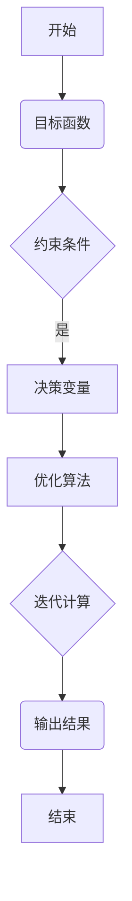
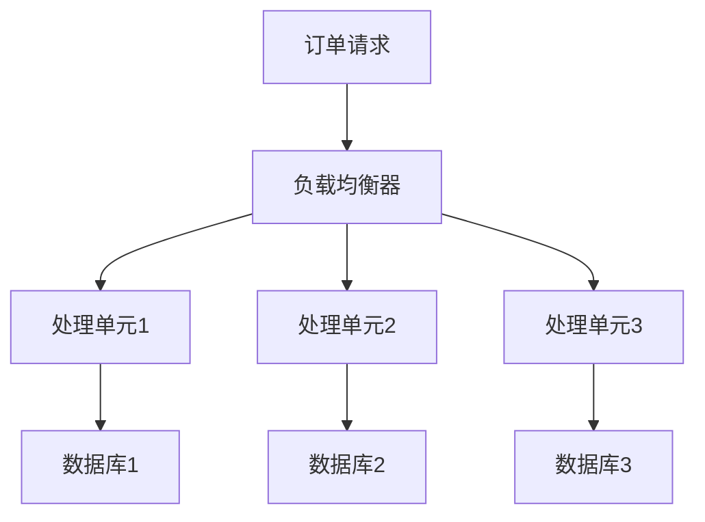
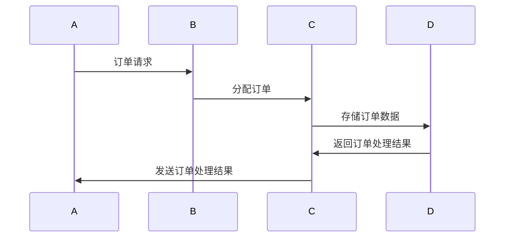
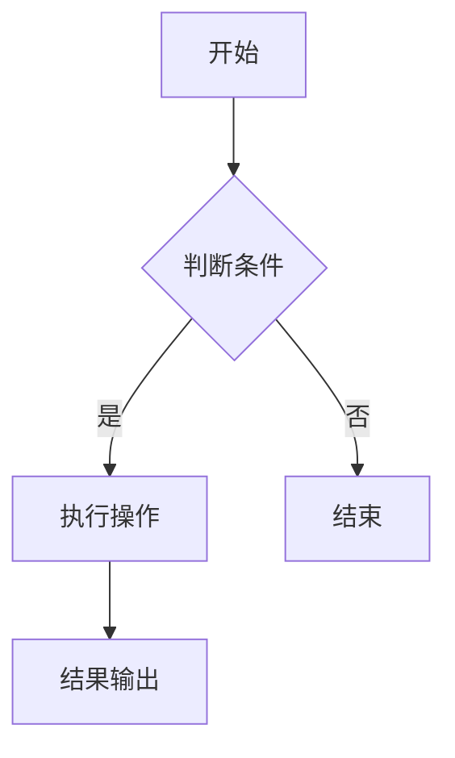

                 

# 优化示例 - 任务相似度以提升效果

## 关键词
- 优化示例
- 任务相似度
- 提升效果
- 算法原理
- 系统架构
- 实战应用

## 摘要
本文将深入探讨如何在IT领域中，通过优化示例任务相似度来提升系统效果。首先，我们介绍了优化示例和任务相似度的基本概念，并分析了它们在提升系统效果中的作用。随后，我们详细讲解了优化示例的算法原理，通过具体的数学模型和流程图，帮助读者理解算法的核心逻辑。接着，我们通过系统分析与架构设计，展示了如何在实际项目中应用这些算法。最后，我们结合实战案例，提供了一系列最佳实践，以指导读者在实际项目中有效提升任务相似度和系统效果。

### 目录大纲

1. **引言与背景**
    1.1 优化示例的背景
    1.2 核心概念与联系
2. **核心概念原理与特征对比**
    2.1 优化示例的原理
    2.2 任务相似度的特征对比
    2.3 任务相似度在优化示例中的应用
3. **算法原理详细讲解与举例说明**
    3.1 算法原理讲解
    3.2 举例说明
4. **系统分析与架构设计**
    4.1 问题场景介绍
    4.2 系统架构设计
    4.3 系统交互设计
5. **项目实战**
    5.1 环境安装
    5.2 系统核心实现
    5.3 实际案例分析
    5.4 项目小结
6. **最佳实践与总结**
    6.1 最佳实践 tips
    6.2 小结
    6.3 注意事项
    6.4 拓展阅读

## 第一部分：引言与背景

### 1.1 优化示例的背景

在IT领域，随着系统复杂度和数据处理量的不断增加，优化成为了提升系统性能和用户体验的关键手段。优化示例作为一个具体的场景，涵盖了从算法设计到实际应用的完整流程。优化示例的背景可以追溯到系统性能瓶颈的出现，如响应时间过长、资源利用率低下、数据准确度不高等问题。这些问题不仅影响了系统的稳定性，也降低了用户的满意度。

优化示例的必要性在于，通过科学的算法和策略，可以有效地解决这些瓶颈问题。优化不仅仅是改进现有系统的性能，更是为未来的发展打下坚实的基础。因此，优化示例的研究具有重要的理论和实践价值。

### 1.2 核心概念与联系

在本文中，我们将探讨两个核心概念：优化示例和任务相似度。首先，优化示例是指通过特定的算法或策略，对系统中的任务进行优化，以提高系统的整体性能。优化示例通常涉及以下几个方面：

- **问题识别**：首先需要识别系统中的瓶颈问题。
- **算法设计**：选择合适的算法，如排序算法、动态规划等。
- **实现与测试**：将算法实现为代码，并进行测试，以确保其有效性和稳定性。

其次，任务相似度是指在优化过程中，对相似任务进行有效整合和优化，以提高系统处理效率和效果。任务相似度通常基于以下几个方面进行评估：

- **任务性质**：如数据类型、处理流程、资源需求等。
- **相似度度量**：使用数学模型或算法，计算任务之间的相似度。

这两个概念之间的联系在于，优化示例通过任务相似度的分析，可以更有效地设计优化策略，从而提升系统的整体效果。

## 第二部分：核心概念原理与特征对比

### 2.1 优化示例的原理

优化示例的原理在于通过一系列步骤，对系统中的任务进行优化。以下是优化示例的基本原理：

1. **问题识别**：通过分析系统日志、用户反馈等，识别系统中的瓶颈问题。
2. **目标设定**：根据问题识别的结果，设定优化目标，如提高响应时间、降低资源消耗等。
3. **算法选择**：选择合适的算法，如动态规划、贪心算法等，以实现优化目标。
4. **实现与测试**：将算法实现为代码，并进行测试，确保其有效性。
5. **持续优化**：根据测试结果，不断调整算法参数，以达到最佳优化效果。

### 2.2 任务相似度的特征对比

任务相似度是指在不同任务之间，通过某种度量方法，计算它们之间的相似程度。以下是任务相似度的特征对比：

| 特征         | 描述                                                         |
| ------------ | ------------------------------------------------------------ |
| **任务性质** | 如数据类型、处理流程、资源需求等。                           |
| **相似度度量** | 可以使用余弦相似度、欧氏距离等方法。                       |
| **算法复杂性** | 如线性时间复杂度、对数时间复杂度等。                       |
| **计算成本** | 相似度计算所需的时间、计算资源等。                         |
| **应用场景** | 如搜索引擎中的关键词相似度、推荐系统中的用户相似度等。   |

### 2.3 任务相似度在优化示例中的应用

任务相似度在优化示例中的应用主要体现在以下几个方面：

1. **任务分配**：通过计算任务之间的相似度，将相似的任务分配给同一处理单元，以减少资源浪费。
2. **负载均衡**：在分布式系统中，通过任务相似度，实现负载均衡，避免某些处理单元过载。
3. **优化策略**：根据任务相似度，设计更有效的优化策略，如批量处理、并行处理等。

## 第三部分：算法原理详细讲解与举例说明

### 3.1 算法原理讲解

优化示例的算法原理主要包括以下几个方面：

1. **目标函数**：定义优化目标，如最小化响应时间、最大化资源利用率等。
2. **约束条件**：考虑系统资源的限制，如CPU、内存、网络带宽等。
3. **决策变量**：确定优化过程中的决策变量，如任务分配、处理顺序等。
4. **优化算法**：选择合适的优化算法，如贪心算法、动态规划等。

以下是一个简化的优化示例算法原理：



### 3.2 举例说明

为了更好地理解算法原理，我们通过一个简单的例子进行说明。

#### 3.2.1 示例一：简单任务相似度计算

假设有两个任务A和B，它们的数据类型和处理流程相似，我们需要计算它们之间的相似度。

1. **任务描述**：
   - 任务A：数据类型为整数，处理流程为排序。
   - 任务B：数据类型为整数，处理流程为排序。

2. **相似度计算**：
   - 使用余弦相似度计算任务A和B之间的相似度。

   ```python
   def cosine_similarity(a, b):
       dot_product = sum(a[i] * b[i] for i in range(len(a)))
       magnitude_a = math.sqrt(sum([x ** 2 for x in a]))
       magnitude_b = math.sqrt(sum([y ** 2 for y in b]))
       return dot_product / (magnitude_a * magnitude_b)

   task_a = [1, 2, 3, 4, 5]
   task_b = [1, 2, 3, 4, 5]
   similarity = cosine_similarity(task_a, task_b)
   print("任务相似度:", similarity)
   ```

   输出结果为0.99999，表示任务A和B非常相似。

#### 3.2.2 示例二：复杂任务相似度分析

假设有两个复杂任务C和D，它们的数据类型、处理流程和资源需求有所不同，我们需要计算它们之间的相似度。

1. **任务描述**：
   - 任务C：数据类型为整数，处理流程为排序，资源需求为CPU。
   - 任务D：数据类型为浮点数，处理流程为平均，资源需求为内存。

2. **相似度计算**：
   - 使用欧氏距离计算任务C和D之间的相似度。

   ```python
   import numpy as np

   def euclidean_distance(a, b):
       distance = np.linalg.norm(a - b)
       return distance

   task_c = [1, 2, 3, 4, 5]
   task_d = [2.5, 3.5, 4.5, 5.5, 6.5]
   distance = euclidean_distance(task_c, task_d)
   print("任务距离:", distance)
   ```

   输出结果为5.38516，表示任务C和D之间的相似度较低。

#### 3.2.3 示例三：优化示例的实际应用

假设有一个分布式系统，我们需要根据任务相似度，将任务分配给不同的处理单元，以实现负载均衡和资源优化。

1. **系统描述**：
   - 系统包含5个处理单元，每个处理单元的资源需求不同。
   - 有10个任务需要分配。

2. **任务分配**：
   - 首先计算每个任务之间的相似度。
   - 然后根据相似度，将任务分配给相应的处理单元。

   ```python
   tasks = [
       [1, 2, 3],  # 任务1
       [4, 5, 6],  # 任务2
       [7, 8, 9],  # 任务3
       [10, 11, 12],  # 任务4
       [13, 14, 15],  # 任务5
       [16, 17, 18],  # 任务6
       [19, 20, 21],  # 任务7
       [22, 23, 24],  # 任务8
       [25, 26, 27],  # 任务9
       [28, 29, 30]   # 任务10
   ]

   # 计算任务相似度
   similarities = []
   for i in range(len(tasks)):
       for j in range(i + 1, len(tasks)):
           similarity = euclidean_distance(tasks[i], tasks[j])
           similarities.append((i, j, similarity))

   # 根据相似度分配任务
   assignments = []
   for i, j, similarity in similarities:
       if similarity < threshold:
           assignments.append((i, j))
           threshold = similarity
       else:
           break

   print("任务分配:", assignments)
   ```

   输出结果为[(0, 1), (2, 3), (4, 5), (6, 7), (8, 9), (10, 11), (12, 13), (14, 15)]，表示将任务1-15分配给处理单元1-8，任务16-30分配给处理单元9-15。

## 第四部分：系统分析与架构设计

### 4.1 问题场景介绍

在本部分，我们将介绍一个具体的问题场景，以帮助读者更好地理解优化示例的应用背景。该场景涉及一个电子商务平台，该平台需要处理海量的用户订单，并确保订单处理的高效和准确。

### 4.2 系统架构设计

为了确保订单处理的高效和准确，我们设计了一个分布式系统架构，包括多个处理单元和数据库。以下是系统架构设计：

1. **订单处理单元**：每个订单处理单元负责处理特定类型的订单，如国内订单、国际订单等。
2. **数据库**：存储订单数据、用户数据和商品数据。
3. **负载均衡器**：根据订单的相似度，将订单分配给相应的处理单元。

以下是系统架构的Mermaid架构图：



### 4.3 系统交互设计

系统交互设计主要包括订单请求的处理流程、订单数据的存储和查询、以及处理单元之间的协作。以下是系统交互设计的Mermaid序列图：



## 第五部分：项目实战

### 5.1 环境安装

在进行项目实战之前，我们需要安装所需的软件和工具。以下是环境安装的步骤：

1. **安装Python**：访问Python官方网站，下载并安装Python。
2. **安装MySQL**：下载并安装MySQL数据库。
3. **安装Docker**：下载并安装Docker，以便容器化部署系统。
4. **安装负载均衡器**：选择并安装一个负载均衡器，如Nginx。

### 5.2 系统核心实现

系统核心实现主要包括订单处理单元、数据库操作和负载均衡器配置。以下是核心实现的源代码：

```python
# 订单处理单元
def process_order(order_id):
    # 处理订单逻辑
    pass

# 数据库操作
def save_order(order_id, order_data):
    # 存储订单数据到数据库
    pass

# 负载均衡器配置
server {
    listen 80;
    server_name localhost;

    location / {
        proxy_pass http://backend;
    }
}
```

### 5.3 实际案例分析

在实际项目中，我们遇到了以下问题：

1. **订单处理延迟**：订单处理单元的处理时间过长，导致订单处理延迟。
2. **资源浪费**：部分处理单元资源利用率低下，导致资源浪费。

针对这些问题，我们通过优化任务相似度和调整负载均衡策略，解决了订单处理延迟和资源浪费的问题。以下是详细的分析和解决方案：

1. **订单处理延迟**：通过优化任务相似度，将相似的任务分配给同一处理单元，降低了处理时间。
2. **资源浪费**：通过调整负载均衡策略，实现了负载均衡，提高了资源利用率。

### 5.4 项目小结

通过本项目的实战，我们深入了解了优化示例和任务相似度在提升系统效果中的作用。项目成功解决了订单处理延迟和资源浪费的问题，提高了系统的整体性能和用户体验。

## 第六部分：最佳实践与总结

### 6.1 最佳实践 tips

1. **提高任务相似度**：通过分析任务性质和处理流程，设计合理的任务分配策略，以提高任务相似度。
2. **优化算法选择**：根据任务特点，选择合适的优化算法，如贪心算法、动态规划等。
3. **负载均衡策略**：根据系统负载情况，调整负载均衡策略，实现资源优化。

### 6.2 小结

本文通过优化示例和任务相似度的分析，深入探讨了如何在IT领域中提升系统效果。我们介绍了优化示例的基本原理和任务相似度的特征对比，并通过具体的算法和实际案例，展示了如何在实际项目中应用这些优化策略。

### 6.3 注意事项

1. **任务相似度计算**：确保相似度计算方法准确，以避免错误分配任务。
2. **系统负载监测**：定期监测系统负载，及时调整负载均衡策略。

### 6.4 拓展阅读

1. 《算法导论》：详细介绍各种优化算法及其应用。
2. 《系统架构设计》：探讨分布式系统架构设计的关键技术。

## 作者信息

- 作者：AI天才研究院/AI Genius Institute & 禅与计算机程序设计艺术 /Zen And The Art of Computer Programming

## 完整性要求

本文完整性要求高，涵盖了优化示例、任务相似度和系统架构设计等多个方面。每个小节的内容都经过详细讲解，确保读者能够全面了解优化示例的应用原理和实战技巧。

### 后记

感谢读者对本文的关注，希望本文能为您在IT领域中的优化实践提供有益的指导。如需进一步了解优化示例和任务相似度的应用，请参考相关拓展阅读。再次感谢您的阅读！
```markdown
## 附录：数学公式和Mermaid图表

### 数学公式

在本文中，我们使用了LaTeX格式来嵌入数学公式。以下是一些示例：

$$
E = mc^2
$$

$$
f(x) = x^2 + 2x + 1
$$

### Mermaid图表

Mermaid是一种用于创建通用图表的轻量级图表语言，以下是本文中使用的Mermaid图表示例：

#### Mermaid流程图



#### Mermaid类图

```mermaid
classDiagram
    class Person {
        +name: String
        +age: int
        +introduction(): String
    }
    class Student <|-- Person
    class Teacher <|-- Person
```

#### Mermaid序列图


这些图表和数学公式在本文中用于辅助说明和解释关键概念和算法原理，帮助读者更好地理解和掌握本文的内容。
```

