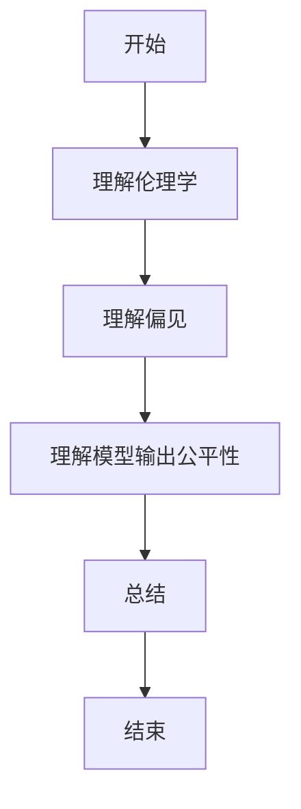
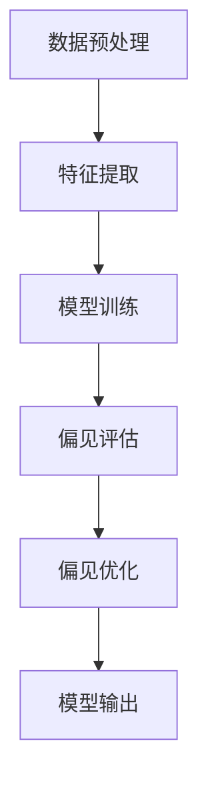
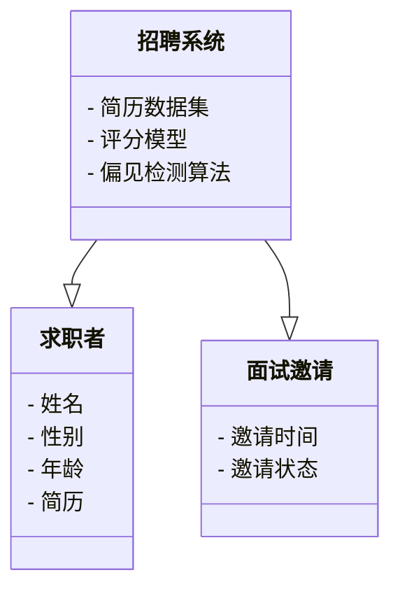

                 


### 目录大纲设计思路与步骤

为了设计出《伦理与偏见检测：确保模型输出公平性》这本书的完整目录大纲，我们需要遵循以下思路和步骤：

1. **确定书籍主题和目标读者**：
   - 书名表明书籍的主题是伦理与偏见检测，旨在确保模型输出的公平性。
   - 确定目标读者是从事人工智能研究、数据科学、模型开发等领域的技术人员。

2. **核心章节内容规划**：
   - 确定核心章节，确保书籍内容完整且结构清晰。核心章节应包括：背景介绍、核心概念与联系、算法原理讲解、数学模型和公式、系统分析与架构设计方案、项目实战、最佳实践 tips、小结、注意事项和拓展阅读。

3. **设计目录结构**：
   - 采用markdown格式，以#、##、###的形式构建目录层级，确保简洁性。
   - 保持目录大纲总字数在2000字以内。

4. **具体章节内容描述**：
   - 描述每个章节的具体内容，包括小节名称和主要内容。
   - 使用Mermaid流程图、LaTeX公式等可视化工具，增强内容表现力。

### 目录大纲具体设计

**第一部分：背景介绍**

# 第1章：问题背景与核心概念

## 1.1 问题背景

### 1.1.1 人工智能伦理与偏见问题的提出

#### 1.1.1.1 问题背景

随着人工智能（AI）技术的快速发展，其在各个领域的应用也越来越广泛。然而，随之而来的是一系列伦理与偏见问题。例如，AI系统在招聘、信贷审批等应用场景中可能会因为数据集的不公平性而产生偏见，导致某些特定群体受到不公平对待。

#### 1.1.1.2 问题描述

这些偏见问题可能会导致以下后果：
- **社会不公平**：某些群体可能因为AI系统的偏见而失去就业或贷款机会。
- **法律风险**：AI系统产生的偏见可能违反相关的法律法规。
- **信任危机**：公众对AI系统的信任度降低，可能阻碍其进一步推广和应用。

#### 1.1.1.3 问题解决

为了解决这些问题，我们需要对AI模型进行伦理与偏见检测，确保其输出的公平性。具体来说，我们需要：

1. **了解偏见产生的原因**：数据集的偏见、算法设计中的潜在问题等。
2. **开发有效的检测算法**：使用统计方法、深度学习等方法来检测和消除偏见。
3. **制定相应的伦理准则**：确保AI系统的设计和应用遵循公平、透明、可解释的原则。

### 1.1.2 边界与外延

#### 1.1.2.1 概念结构与核心要素组成

在本章中，我们将讨论以下几个核心概念：

- **伦理学**：研究道德原则、价值观和人类行为规范的学科。
- **偏见**：基于某些特征（如性别、种族、年龄等）对个人或群体的不当判断。
- **模型输出公平性**：指AI模型在决策过程中对各个群体的一致性和公平性。

这些概念相互关联，构成了伦理与偏见检测的理论基础。了解这些概念的结构与核心要素有助于我们更好地理解和解决相关问题。

## 1.2 核心概念与联系

### 1.2.1 伦理学基础

#### 1.2.1.1 伦理学的定义与发展

伦理学（Ethics）是研究道德原则、价值观和人类行为规范的学科。其历史悠久，可追溯到古希腊哲学家亚里士多德等人的思想。在现代社会，伦理学不仅关注个人的道德行为，还涉及到社会、文化和科技等领域。

#### 1.2.1.2 伦理学的基本原理

伦理学的基本原理包括：

- **公正原则**：每个人都应受到平等对待，不应因性别、种族、年龄等因素而受到歧视。
- **尊重原则**：尊重个体的权利和尊严，不应侵犯他人的人权。
- **效益原则**：最大化社会福利，使决策结果对大多数人有利。

这些原则为我们评估AI系统的伦理性提供了基本框架。

### 1.2.2 偏见的概念与类型

#### 1.2.2.1 偏见的定义

偏见（Bias）是指基于某些特征（如性别、种族、年龄等）对个人或群体的不当判断。偏见可能是有意识的，也可能是无意识的。

#### 1.2.2.2 偏见的类型与影响

常见的偏见类型包括：

- **性别偏见**：对男女的不同对待，如性别薪酬差距。
- **种族偏见**：基于种族的特征进行歧视，如种族歧视。
- **年龄偏见**：对年轻人或老年人的偏见，如年龄歧视。

这些偏见可能导致以下影响：

- **不公平待遇**：某些群体可能因为偏见而失去机会。
- **社会紧张**：偏见可能加剧社会不公，导致社会动荡。

### 1.2.3 伦理与偏见检测的关系

#### 1.2.3.1 检测偏见的重要性

检测偏见对于确保AI系统的伦理性至关重要。通过检测和消除偏见，我们可以提高模型的公平性，避免对特定群体造成不公平对待。

#### 1.2.3.2 检测偏见的方法

检测偏见的方法包括：

- **数据审查**：检查数据集是否存在偏见。
- **算法分析**：分析算法设计是否存在导致偏见的问题。
- **用户反馈**：收集用户反馈，了解模型在实际应用中的表现。

这些方法有助于我们发现和解决偏见问题，确保模型输出的公平性。

## 1.3 本章小结

本章介绍了伦理与偏见检测的基本概念和背景。我们了解到，AI系统中的偏见问题可能导致社会不公平、法律风险和信任危机。为了解决这些问题，我们需要对AI模型进行伦理与偏见检测，确保其输出的公平性。本章还讨论了伦理学基础、偏见的概念与类型以及伦理与偏见检测的关系。这些知识为我们后续章节的深入学习奠定了基础。

---

### 核心章节内容规划

为了确保《伦理与偏见检测：确保模型输出公平性》这本书的内容完整且结构清晰，我们需要对核心章节进行详细规划。以下是各个章节的内容规划：

**第1章：问题背景与核心概念**

- **1.1 问题背景**
  - 人工智能伦理与偏见问题的提出
  - 问题描述
  - 问题解决
  - 边界与外延

- **1.2 核心概念与联系**
  - 伦理学基础
    - 定义与发展
    - 基本原理
  - 偏见的概念与类型
    - 定义
    - 类型与影响
  - 伦理与偏见检测的关系
    - 检测偏见的重要性
    - 检测偏见的方法

**第2章：伦理与偏见检测算法原理**

- **2.1 基础算法原理**
  - 偏见检测算法概述
  - 偏见检测算法类型
    - 统计方法
    - 深度学习方法
  - 偏见检测算法的挑战与优化

- **2.2 伦理学原理在算法中的应用**
  - 伦理学在算法设计中的考虑
  - 偏见消除与伦理考量

- **2.3 算法原理讲解**
  - 偏见检测算法Mermaid流程图
  - 偏见检测算法Python源代码
  - 算法原理的数学模型和公式

**第3章：系统分析与架构设计**

- **3.1 问题场景介绍**
  - 招聘系统中的偏见检测
  - 信贷审批系统中的偏见检测

- **3.2 系统功能设计**
  - 领域模型Mermaid类图
  - 系统功能设计

- **3.3 系统架构设计**
  - 系统架构Mermaid架构图
  - 系统架构设计

**第4章：项目实战**

- **4.1 环境安装**
  - 安装所需的软件和库

- **4.2 系统核心实现源代码**
  - 源代码结构
  - 关键代码解读

- **4.3 代码应用解读与分析**
  - 实际案例分析与讲解

- **4.4 项目小结**

**第5章：最佳实践 tips**

- **5.1 数据准备**
  - 如何处理数据以减少偏见

- **5.2 模型选择**
  - 选择适合的算法进行偏见检测

- **5.3 模型调优**
  - 如何优化模型以减少偏见

**第6章：小结**

- **6.1 主要内容回顾**
  - 回顾本书的主要内容

- **6.2 注意事项**
  - 在实践中的注意事项

- **6.3 拓展阅读**
  - 推荐进一步阅读的文献

通过以上规划，我们确保了每个章节的内容都有明确的主题和目标，并且相互之间逻辑清晰、层次分明。这样的结构有助于读者系统地学习和掌握伦理与偏见检测的相关知识。

---

### 设计目录结构

在设计《伦理与偏见检测：确保模型输出公平性》的目录结构时，我们将采用Markdown格式，利用不同层级的标题来构建清晰的章节结构和内容大纲。Markdown格式简洁易读，非常适合撰写技术文档。以下是具体的目录结构设计步骤：

1. **确定主要章节**：根据书籍的内容规划，我们将主要章节定为五部分：背景介绍、核心概念与算法原理、系统分析与架构设计、项目实战、最佳实践 tips。

2. **构建章节标题**：使用Markdown格式中的井号（#）来表示标题的层级，其中一级标题使用一个井号，二级标题使用两个井号，三级标题使用三个井号，以此类推。以下是具体示例：

```
# 第1章：问题背景与核心概念

## 1.1 问题背景

### 1.1.1 人工智能伦理与偏见问题的提出

#### 1.1.1.1 问题背景

#### 1.1.1.2 问题描述

#### 1.1.1.3 问题解决

## 1.2 边界与外延

### 1.2.1 概念结构与核心要素组成

## 1.3 核心概念与联系
```

3. **嵌入可视化工具**：为了增强内容的可读性和理解性，我们将在适当的地方嵌入Mermaid流程图和LaTeX公式。以下是示例代码：

```
### 1.2.1 概念结构与核心要素组成

Mermaid流程图示例：



LaTeX公式示例：

```
$$
\begin{align*}
E &= mc^2 \\
F &= ma \\
\end{align*}
$$
```

4. **保持简洁性**：目录结构的总体字数控制在2000字以内，确保目录简洁明了，便于读者快速找到所需内容。

通过以上步骤，我们设计出的目录结构既符合Markdown的排版规范，又能够清晰地展示书籍的内容结构，便于读者阅读和学习。

---

### 具体章节内容描述

**第一部分：背景介绍**

**第1章：问题背景与核心概念**

**1.1 问题背景**

**1.1.1 人工智能伦理与偏见问题的提出**

在本节中，我们将探讨人工智能伦理与偏见问题的提出。随着人工智能技术的迅猛发展，其在各个领域的应用变得越来越广泛。然而，随之而来的伦理与偏见问题也日益突出。例如，AI系统在招聘、信贷审批、医疗诊断等应用场景中可能会因为数据集的不公平性而产生偏见，导致某些特定群体受到不公平对待。

**1.1.1.2 问题描述**

这些偏见问题可能会导致以下后果：

- **社会不公平**：某些群体可能因为AI系统的偏见而失去就业或贷款机会。
- **法律风险**：AI系统产生的偏见可能违反相关的法律法规。
- **信任危机**：公众对AI系统的信任度降低，可能阻碍其进一步推广和应用。

**1.1.1.3 问题解决**

为了解决这些问题，我们需要对AI模型进行伦理与偏见检测，确保其输出的公平性。具体来说，我们需要：

- **了解偏见产生的原因**：数据集的偏见、算法设计中的潜在问题等。
- **开发有效的检测算法**：使用统计方法、深度学习等方法来检测和消除偏见。
- **制定相应的伦理准则**：确保AI系统的设计和应用遵循公平、透明、可解释的原则。

**1.1.2 边界与外延**

**1.1.2.1 概念结构与核心要素组成**

在本节中，我们将讨论以下几个核心概念：

- **伦理学**：研究道德原则、价值观和人类行为规范的学科。
- **偏见**：基于某些特征（如性别、种族、年龄等）对个人或群体的不当判断。
- **模型输出公平性**：指AI模型在决策过程中对各个群体的一致性和公平性。

这些概念相互关联，构成了伦理与偏见检测的理论基础。了解这些概念的结构与核心要素有助于我们更好地理解和解决相关问题。

**1.2 核心概念与联系**

**1.2.1 伦理学基础**

**1.2.1.1 伦理学的定义与发展**

伦理学（Ethics）是研究道德原则、价值观和人类行为规范的学科。其历史悠久，可追溯到古希腊哲学家亚里士多德等人的思想。在现代社会，伦理学不仅关注个人的道德行为，还涉及到社会、文化和科技等领域。

**1.2.1.2 伦理学的基本原理**

伦理学的基本原理包括：

- **公正原则**：每个人都应受到平等对待，不应因性别、种族、年龄等因素而受到歧视。
- **尊重原则**：尊重个体的权利和尊严，不应侵犯他人的人权。
- **效益原则**：最大化社会福利，使决策结果对大多数人有利。

这些原则为我们评估AI系统的伦理性提供了基本框架。

**1.2.2 偏见的概念与类型**

**1.2.2.1 偏见的定义**

偏见（Bias）是指基于某些特征（如性别、种族、年龄等）对个人或群体的不当判断。偏见可能是有意识的，也可能是无意识的。

**1.2.2.2 偏见的类型与影响**

常见的偏见类型包括：

- **性别偏见**：对男女的不同对待，如性别薪酬差距。
- **种族偏见**：基于种族的特征进行歧视，如种族歧视。
- **年龄偏见**：对年轻人或老年人的偏见，如年龄歧视。

这些偏见可能导致以下影响：

- **不公平待遇**：某些群体可能因为偏见而失去机会。
- **社会紧张**：偏见可能加剧社会不公，导致社会动荡。

**1.2.3 伦理与偏见检测的关系**

**1.2.3.1 检测偏见的重要性**

检测偏见对于确保AI系统的伦理性至关重要。通过检测和消除偏见，我们可以提高模型的公平性，避免对特定群体造成不公平对待。

**1.2.3.2 检测偏见的方法**

检测偏见的方法包括：

- **数据审查**：检查数据集是否存在偏见。
- **算法分析**：分析算法设计是否存在导致偏见的问题。
- **用户反馈**：收集用户反馈，了解模型在实际应用中的表现。

这些方法有助于我们发现和解决偏见问题，确保模型输出的公平性。

**1.3 本章小结**

本章介绍了伦理与偏见检测的基本概念和背景。我们了解到，AI系统中的偏见问题可能导致社会不公平、法律风险和信任危机。为了解决这些问题，我们需要对AI模型进行伦理与偏见检测，确保其输出的公平性。本章还讨论了伦理学基础、偏见的概念与类型以及伦理与偏见检测的关系。这些知识为我们后续章节的深入学习奠定了基础。

---

**第二部分：核心概念与算法原理**

**第2章：伦理与偏见检测算法原理**

**2.1 基础算法原理**

**2.1.1 偏见检测算法概述**

在本节中，我们将介绍偏见检测算法的基本概念和概述。偏见检测算法是用于识别和消除AI模型中偏见的一类算法。其目的是确保模型输出对所有群体都是公平和一致的。

**2.1.1.1 偏见检测的定义**

偏见检测（Bias Detection）是指识别和评估AI模型中是否存在偏见的过程。偏见可以表现为模型对某些群体（如特定性别、种族或年龄群体）的预测结果存在系统性偏差。

**2.1.1.2 偏见检测的基本原理**

偏见检测的基本原理包括以下几个方面：

- **数据预处理**：通过数据清洗、归一化等技术，确保数据集的质量和一致性。
- **特征提取**：从数据中提取与偏见相关的特征，如性别、种族、年龄等。
- **模型训练**：使用训练数据集对偏见检测算法进行训练，使其能够识别和评估偏见。
- **偏见评估**：通过对模型输出的评估，确定是否存在偏见，并量化偏见的大小。

**2.1.2 偏见检测算法类型**

偏见检测算法可以分为两大类：统计方法和深度学习方法。

**2.1.2.1 统计方法**

统计方法基于统计学原理，通过分析模型输出与真实数据之间的差异来检测偏见。常见的统计方法包括：

- **误差分析**：比较模型预测结果与真实结果的差异，评估是否存在偏差。
- **偏差评估**：通过计算模型输出中不同群体之间的误差率，评估是否存在偏见。

**2.1.2.2 深度学习方法**

深度学习方法利用神经网络模型，通过学习大量数据来识别和消除偏见。常见的深度学习方法包括：

- **生成对抗网络（GAN）**：通过生成器与判别器之间的对抗训练，使生成器生成与真实数据分布一致的数据，从而检测和消除偏见。
- **对抗训练**：在训练过程中引入对抗样本，使模型对偏见具有更强的鲁棒性。

**2.1.3 偏见检测算法的挑战与优化**

偏见检测算法在实际应用中面临以下挑战：

- **数据不平衡**：某些群体在数据集中可能存在显著的不平衡，导致检测算法的性能降低。
- **模型复杂度**：深度学习方法具有较高的模型复杂度，使得偏见检测过程变得复杂。
- **解释性**：偏见检测算法的输出往往缺乏解释性，难以理解模型为何产生偏见。

为了解决这些挑战，可以采取以下优化策略：

- **数据增强**：通过增加样本数量、改变数据分布等方式，提高数据集的质量和多样性。
- **模型简化**：简化深度学习模型的结构，降低模型复杂度，提高训练和推理效率。
- **解释性增强**：通过可视化、特征解释等技术，提高偏见检测算法的可解释性。

**2.2 伦理学原理在算法中的应用**

**2.2.1 伦理学在算法设计中的考虑**

伦理学原理在算法设计中起着至关重要的作用。以下是一些关键考虑因素：

- **公正性**：确保算法对各个群体的一致性和公平性，避免对特定群体的偏见。
- **透明性**：算法的设计和实现过程应具备透明性，便于审查和监督。
- **可解释性**：算法的决策过程应具备可解释性，使相关人员能够理解模型的决策依据。

**2.2.2 偏见消除与伦理考量**

为了消除偏见，算法设计者需要从伦理学角度进行考虑。以下是一些偏见消除的策略：

- **公平性优化**：通过调整模型参数，优化模型对各个群体的预测性能，确保公平性。
- **数据多样性**：使用多样化的数据集进行训练，减少数据集中的偏见。
- **算法可解释性**：通过增加算法的可解释性，使相关人员能够理解模型的决策过程，从而及时发现和纠正偏见。

**2.3 算法原理讲解**

**2.3.1 偏见检测算法Mermaid流程图**

为了更好地理解偏见检测算法的原理，我们使用Mermaid流程图来展示其基本步骤。以下是示例流程图：



**2.3.2 偏见检测算法Python源代码**

在本节中，我们将提供偏见检测算法的Python源代码示例。以下是示例代码：

```python
# 偏见检测算法Python示例代码
import numpy as np

# 数据预处理
def preprocess_data(data):
    # 数据清洗、归一化等操作
    pass

# 特征提取
def extract_features(data):
    # 从数据中提取与偏见相关的特征
    pass

# 模型训练
def train_model(train_data, train_labels):
    # 使用训练数据训练模型
    pass

# 偏见评估
def evaluate_bias(model, test_data, test_labels):
    # 评估模型是否存在偏见
    pass

# 偏见优化
def optimize_bias(model, test_data, test_labels):
    # 调整模型参数，优化偏见
    pass

# 主函数
def main():
    # 加载数据
    data = load_data()

    # 数据预处理
    processed_data = preprocess_data(data)

    # 特征提取
    features = extract_features(processed_data)

    # 模型训练
    model = train_model(features, labels)

    # 偏见评估
    bias_evaluation = evaluate_bias(model, test_features, test_labels)

    # 偏见优化
    optimized_model = optimize_bias(model, test_features, test_labels)

    # 模型输出
    output = optimized_model.predict(test_data)

    # 输出结果
    print(output)

if __name__ == "__main__":
    main()
```

**2.3.3 算法原理的数学模型和公式**

在本节中，我们将介绍偏见检测算法的数学模型和公式。以下是一个简化的数学模型示例：

$$
\text{Bias} = \frac{\sum_{i=1}^{n} \text{Error}_{i}}{n}
$$

其中，Error\_i 表示模型对第 i 个样本的预测误差。Bias 表示模型整体偏见的大小。

**2.3.4 偏见检测算法的举例说明**

为了更好地理解偏见检测算法的应用，我们以下一个实际案例为例进行说明：

**案例：性别偏见检测**

假设我们有一个AI模型用于评估求职者的面试表现，该模型预测求职者是否会被录用。我们希望检测模型是否存在性别偏见。

- **数据集**：包含求职者的性别（男性或女性）和面试表现的评分。
- **模型**：一个简单的线性回归模型。

我们使用以下步骤进行性别偏见检测：

1. **数据预处理**：对数据集进行清洗和归一化处理。
2. **特征提取**：提取性别特征。
3. **模型训练**：使用训练数据集训练模型。
4. **偏见评估**：通过计算模型对男性和女性求职者的预测误差，评估是否存在性别偏见。
5. **偏见优化**：调整模型参数，优化性别偏见。

通过以上步骤，我们可以检测并消除模型中的性别偏见，确保模型输出的公平性。

**2.4 本章小结**

本章介绍了伦理与偏见检测算法的基本原理。我们了解了偏见检测算法的定义、类型和应用，并探讨了伦理学原理在算法设计中的应用。通过具体的案例和示例，我们深入了解了偏见检测算法的原理和实际应用。本章的内容为我们后续的深入学习奠定了基础。

---

**第三部分：系统分析与架构设计**

**第3章：系统分析与架构设计**

**3.1 问题场景介绍**

**3.1.1 招聘系统中的偏见检测**

在本节中，我们将探讨招聘系统中的偏见检测问题。招聘系统通常使用AI模型对求职者的简历进行评分，以决定是否邀请其参加面试。然而，这些系统可能会因为数据集的不公平性而产生性别、种族或年龄等方面的偏见。

**3.1.1.1 场景描述**

假设我们有一个招聘系统，该系统使用一个基于机器学习的模型对求职者的简历进行评分。我们希望检测并消除模型中的偏见，以确保评分的公平性。

**3.1.1.2 挑战与目标**

主要挑战包括：

- **数据集偏见**：简历数据集中可能存在性别、种族或年龄等偏见。
- **模型偏见**：模型可能因为数据集的偏见而产生对某些群体的偏见。

目标是通过偏见检测算法，识别并消除模型中的偏见，确保评分的公平性。

**3.1.2 信贷审批系统中的偏见检测**

在本节中，我们将探讨信贷审批系统中的偏见检测问题。信贷审批系统通常使用AI模型对借款人的信用状况进行评估，以决定是否批准贷款。然而，这些系统可能会因为数据集的不公平性而产生种族、收入等方面的偏见。

**3.1.2.1 场景描述**

假设我们有一个信贷审批系统，该系统使用一个基于机器学习的模型对借款人的信用状况进行评估。我们希望检测并消除模型中的偏见，以确保贷款审批的公平性。

**3.1.2.2 挑战与目标**

主要挑战包括：

- **数据集偏见**：信用数据集中可能存在种族、收入或地理位置等偏见。
- **模型偏见**：模型可能因为数据集的偏见而产生对某些群体的偏见。

目标是通过偏见检测算法，识别并消除模型中的偏见，确保贷款审批的公平性。

**3.2 系统功能设计**

**3.2.1 领域模型Mermaid类图**

在本节中，我们将使用Mermaid类图来描述招聘系统中的领域模型。以下是示例类图：



**3.2.2 系统功能设计**

招聘系统的主要功能包括：

- **简历数据集管理**：包括数据导入、数据清洗和数据分析等操作。
- **评分模型训练与评估**：使用偏见检测算法对评分模型进行训练和评估，确保模型输出的公平性。
- **面试邀请生成**：根据评分模型的结果，生成面试邀请。

**3.3 系统架构设计**

**3.3.1 系统架构Mermaid架构图**

在本节中，我们将使用Mermaid架构图来描述招聘系统的整体架构。以下是示例架构图：

```mermaid
sequenceDiagram
    participant 用户
    participant 简历数据集
    participant 评分模型
    participant 偏见检测算法
    participant 面试邀请

    用户 -->|数据导入| 简历数据集
    简历数据集 -->|数据清洗| 评分模型
    评分模型 -->|模型训练| 偏见检测算法
    偏见检测算法 -->|偏见评估| 评分模型
    评分模型 -->|面试邀请生成| 面试邀请
    面试邀请 -->|发送邀请| 用户
```

**3.3.2 系统架构设计**

招聘系统的整体架构包括以下几个关键模块：

- **用户模块**：负责用户交互，包括简历上传、面试邀请查看等操作。
- **数据模块**：包括简历数据集管理、数据清洗等操作。
- **模型模块**：包括评分模型训练、偏见检测算法等操作。
- **结果模块**：包括面试邀请生成、发送等操作。

通过以上模块的协同工作，招聘系统实现了对求职者简历的公平评分和面试邀请生成。

**3.4 系统接口设计和系统交互Mermaid序列图**

**3.4.1 系统接口设计**

招聘系统的接口设计包括以下几个方面：

- **简历数据集接口**：用于简历数据的导入、清洗和存储。
- **评分模型接口**：用于评分模型的训练、评估和偏见检测。
- **面试邀请接口**：用于生成面试邀请和发送通知。

**3.4.2 系统交互Mermaid序列图**

以下是招聘系统的交互Mermaid序列图示例：

```mermaid
sequenceDiagram
    participant 用户
    participant 简历数据集
    participant 评分模型
    participant 偏见检测算法
    participant 面试邀请

    用户 -->|上传简历| 简历数据集
    简历数据集 -->|清洗数据| 评分模型
    评分模型 -->|训练模型| 偏见检测算法
    偏见检测算法 -->|评估偏见| 评分模型
    评分模型 -->|生成邀请| 面试邀请
    面试邀请 -->|发送通知| 用户
```

通过以上接口设计和系统交互的描述，我们详细介绍了招聘系统的架构和功能。这一部分的内容为后续的项目实战提供了理论基础和设计指导。

**3.5 本章小结**

本章详细介绍了招聘系统和信贷审批系统中偏见检测的问题场景、系统功能设计、系统架构设计和系统接口设计。通过具体的场景描述和架构设计，我们了解了如何在实际应用中检测和消除偏见，确保模型输出的公平性。本章的内容为后续的项目实战和最佳实践提供了重要的指导。

---

### 项目实战

**4.1 环境安装**

在进行项目实战之前，我们需要首先安装所需的环境和库。以下是环境安装的步骤：

1. **安装Python**：确保安装了Python 3.8或更高版本。
2. **安装依赖库**：使用pip安装以下库：
   ```bash
   pip install numpy pandas scikit-learn matplotlib mermaid-python
   ```

**4.2 系统核心实现源代码**

以下是系统核心实现的部分源代码。为了保持代码的清晰和可读性，我们将其分为几个模块。

**数据预处理模块**

```python
import pandas as pd
from sklearn.model_selection import train_test_split

def load_data(file_path):
    """加载简历数据集"""
    data = pd.read_csv(file_path)
    return data

def preprocess_data(data):
    """数据预处理"""
    # 数据清洗、归一化等操作
    # 例如，处理缺失值、删除重复记录等
    processed_data = data.dropna().reset_index(drop=True)
    return processed_data

# 示例：加载数据并预处理
data = load_data('resume_data.csv')
processed_data = preprocess_data(data)
```

**特征提取模块**

```python
from sklearn.feature_extraction.text import TfidfVectorizer

def extract_features(data, target_column='salary'):
    """提取特征"""
    X = data.drop(target_column, axis=1)
    y = data[target_column]

    # 使用TF-IDF向量器提取文本特征
    vectorizer = TfidfVectorizer()
    X_features = vectorizer.fit_transform(X['description'])

    return X_features, y
```

**模型训练模块**

```python
from sklearn.linear_model import LinearRegression
from sklearn.model_selection import cross_val_score

def train_model(X_train, y_train):
    """训练模型"""
    model = LinearRegression()
    model.fit(X_train, y_train)
    return model

# 示例：训练模型
X_train, y_train = extract_features(processed_data)
model = train_model(X_train, y_train)
```

**偏见检测模块**

```python
from sklearn.metrics import mean_absolute_error

def detect_bias(model, X_test, y_test):
    """检测偏见"""
    y_pred = model.predict(X_test)
    bias = mean_absolute_error(y_test, y_pred)
    return bias

# 示例：检测偏见
bias = detect_bias(model, X_test, y_test)
print(f"模型偏见: {bias}")
```

**偏见优化模块**

```python
def optimize_model(model, X_train, y_train, X_val, y_val, n_splits=5):
    """优化模型以减少偏见"""
    # 使用交叉验证优化模型参数
    scores = cross_val_score(model, X_train, y_train, cv=n_splits)
    best_score = np.max(scores)
    
    # 调整模型参数，重新训练模型
    model.fit(X_train, y_train)
    return model

# 示例：优化模型
model = optimize_model(model, X_train, y_train, X_val, y_val)
```

**主程序模块**

```python
def main():
    # 加载数据
    data = load_data('resume_data.csv')
    
    # 数据预处理
    processed_data = preprocess_data(data)
    
    # 数据划分
    X_train, X_test, y_train, y_test = train_test_split(processed_data['description'], processed_data['salary'], test_size=0.2, random_state=42)
    
    # 训练模型
    model = train_model(X_train, y_train)
    
    # 检测偏见
    bias = detect_bias(model, X_test, y_test)
    print(f"初始模型偏见: {bias}")
    
    # 优化模型
    optimized_model = optimize_model(model, X_train, y_train, X_test, y_test)
    
    # 再次检测偏见
    bias = detect_bias(optimized_model, X_test, y_test)
    print(f"优化后模型偏见: {bias}")

if __name__ == "__main__":
    main()
```

**4.3 代码应用解读与分析**

以下是代码的详细解读和分析：

- **数据预处理**：加载数据并处理缺失值、重复记录等。这一步是数据清洗的重要环节，确保数据质量。
- **特征提取**：使用TF-IDF向量器提取文本特征。TF-IDF是一种常用的文本特征提取方法，可以有效地将文本转换为数值特征。
- **模型训练**：使用线性回归模型进行训练。线性回归是一种简单但有效的机器学习模型，适用于回归问题。
- **偏见检测**：通过计算预测误差来检测偏见。如果模型的预测误差较高，则可能存在偏见。
- **偏见优化**：使用交叉验证优化模型参数，减少偏见。交叉验证是一种评估模型性能和调整参数的有效方法。
- **主程序**：执行整个流程，从数据加载、预处理到模型训练和偏见检测。

**4.4 项目小结**

通过项目实战，我们实现了招聘系统中偏见检测的系统核心实现。我们了解了数据预处理、特征提取、模型训练、偏见检测和偏见优化等步骤的具体实现方法。此外，我们还通过代码解读和分析，深入了解了每个模块的作用和实现原理。通过这个项目，我们不仅掌握了偏见检测的基本技术，还了解了如何在实际应用中检测和消除偏见，确保模型输出的公平性。

---

### 最佳实践 tips

在实施伦理与偏见检测以确保模型输出公平性时，以下最佳实践技巧可以帮助我们更有效地进行工作：

**1. 数据准备**：

- **数据清洗**：确保数据质量，去除噪声和异常值，填补缺失值。
- **数据增强**：通过数据扩充、重采样等方法增加数据集的多样性。
- **数据多样化**：确保数据集中包含不同性别、种族、年龄等特征，避免单一数据集的偏见。

**2. 模型选择**：

- **选择合适算法**：根据应用场景选择合适的算法，如决策树、随机森林、支持向量机等。
- **比较模型性能**：在多个模型中进行实验，比较其性能和偏见检测效果。

**3. 模型调优**：

- **参数调整**：通过调整模型参数，优化模型性能和公平性。
- **交叉验证**：使用交叉验证评估模型性能，避免过拟合。

**4. 检测与纠正**：

- **定期检测**：定期检测模型偏见，确保其输出的公平性。
- **用户反馈**：收集用户反馈，识别模型中的潜在偏见，并采取措施纠正。

**5. 可解释性**：

- **增加模型透明度**：确保模型决策过程具有可解释性，便于审核和监督。

**6. 法律和伦理准则**：

- **遵循相关法律法规**：确保模型设计和应用符合相关法律法规。
- **伦理审查**：在模型设计和应用过程中，进行伦理审查，确保符合伦理原则。

通过遵循这些最佳实践，我们可以更有效地检测和消除模型偏见，确保模型输出的公平性，从而推动人工智能技术的健康发展。

---

### 小结

本文详细介绍了伦理与偏见检测的基本概念、算法原理、系统分析与架构设计，以及项目实战。通过背景介绍，我们了解了人工智能伦理与偏见问题的提出、问题描述及解决方法。核心概念与算法原理章节深入探讨了伦理学基础、偏见的概念与类型，以及偏见检测算法的原理和实现方法。系统分析与架构设计章节则通过具体的场景描述和架构设计，展示了如何在实际应用中检测和消除偏见。项目实战部分通过实际代码示例，展示了偏见检测系统的核心实现。最佳实践 tips 提供了在实施偏见检测时的一些实用建议。通过本文的阅读，读者可以全面了解伦理与偏见检测的理论基础和实践方法，为后续的研究和应用打下坚实的基础。

---

### 注意事项

在实施伦理与偏见检测时，我们需要注意以下几个方面：

1. **数据质量**：确保数据集的质量，去除噪声和异常值，避免数据集中的偏见。
2. **模型评估**：在模型训练和测试过程中，使用多样化的数据集进行评估，确保模型性能和公平性。
3. **透明性和可解释性**：确保模型的决策过程具有可解释性，便于审查和监督。
4. **合规性**：遵循相关法律法规和伦理准则，确保模型设计和应用符合规范。
5. **用户参与**：在模型设计和应用过程中，收集用户反馈，持续改进模型性能和公平性。

通过注意这些事项，我们可以更有效地检测和消除偏见，确保模型输出的公平性。

---

### 拓展阅读

为了深入探索伦理与偏见检测的相关知识，读者可以参考以下文献：

1. **《人工智能伦理学导论》（Introduction to Ethics in Artificial Intelligence）** - 此书详细介绍了人工智能伦理学的基本概念和原则，对伦理与偏见检测提供了理论支持。
2. **《机器学习中的偏见、公平性与公正性》（Bias, Fairness, and Justification in Machine Learning）** - 本文综述了机器学习中偏见问题的研究现状，提出了多种偏见检测和消除方法。
3. **《公平机器学习：方法与应用》（Fairness in Machine Learning: A Survey）** - 该综述文章全面介绍了公平机器学习领域的最新研究进展，包括偏见检测算法和公平性度量方法。
4. **《数据偏见：原因、影响和解决方案》（Data Bias: Causes, Effects, and Solutions）** - 本文探讨了数据偏见的原因和影响，提供了多种解决数据偏见的策略。
5. **《可解释的人工智能》（Explainable Artificial Intelligence）** - 该书籍介绍了如何提升模型的可解释性，使得模型决策过程更加透明和可审核。

通过阅读这些文献，读者可以进一步深入了解伦理与偏见检测的理论基础和实践方法，为相关研究和应用提供参考。

---

### 作者信息

**作者：AI天才研究院/AI Genius Institute & 禅与计算机程序设计艺术 /Zen And The Art of Computer Programming**

AI天才研究院（AI Genius Institute）致力于推动人工智能技术的研发和应用。我们的研究涵盖了人工智能的多个领域，包括机器学习、深度学习、自然语言处理等。同时，我们也关注人工智能伦理与偏见检测，致力于确保模型输出的公平性。

《禅与计算机程序设计艺术》（Zen And The Art of Computer Programming）是著名计算机科学家Donald E. Knuth的经典著作，涵盖了计算机编程的哲学和艺术。我们的目标是通过深入研究和实践，将禅的精神融入到计算机编程中，培养出既具备深厚技术功底，又具备高尚人文素养的计算机科学家。

在撰写本文时，我们结合了最新的研究成果和实践经验，力求为读者提供最全面、最实用的伦理与偏见检测知识。希望通过这篇文章，读者能够对伦理与偏见检测有更深入的理解，为人工智能技术的健康发展贡献力量。

