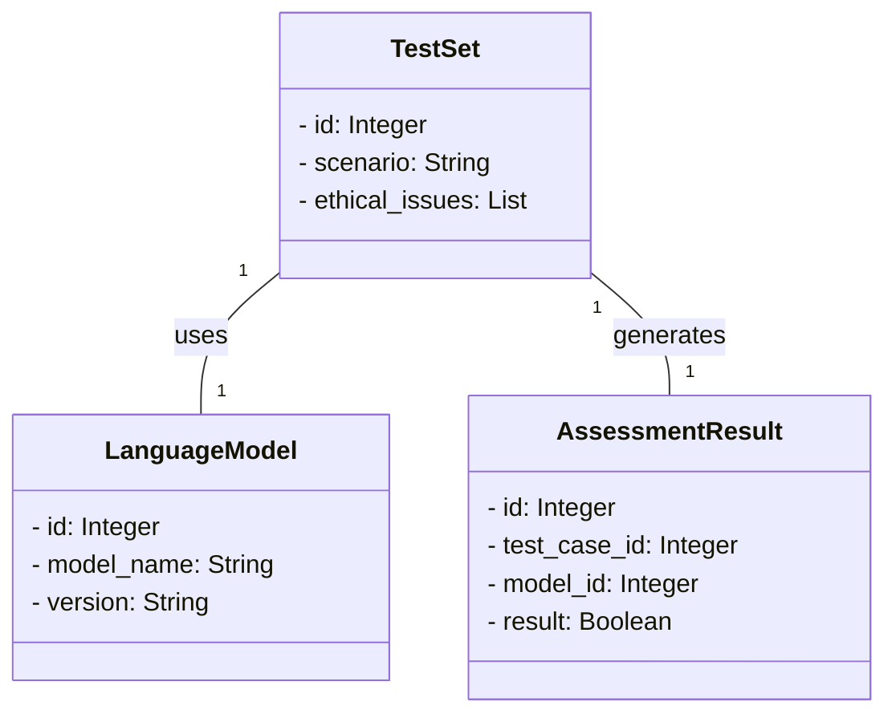
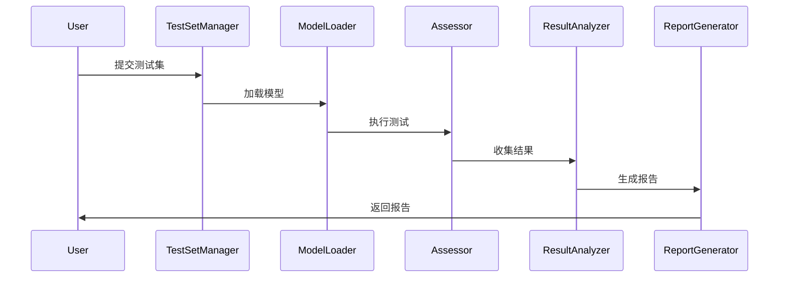

                 

### 背景介绍

#### 伦理决策能力的意义

伦理决策能力是指个体在面对复杂道德情境时，能够准确、合理地做出符合道德规范和伦理标准的选择的能力。随着人工智能（AI）技术的迅猛发展，特别是大型语言模型（LLM）的广泛应用，伦理决策能力的问题愈发凸显。在许多实际应用场景中，如自动驾驶、医疗诊断、法律咨询、内容审核等，这些AI系统都需要进行道德判断和决策。然而，现有的大规模语言模型在伦理决策方面存在一定的局限性，难以确保其决策的道德合理性。

首先，伦理决策能力对于确保AI系统的道德合规性至关重要。如果AI系统无法做出符合伦理标准的决策，可能会导致严重的社会问题，如歧视、隐私侵犯、甚至法律纠纷。其次，伦理决策能力有助于提升AI系统的可信度和用户满意度。在医疗诊断领域，如果AI系统的诊断结果缺乏伦理考量，可能会对患者的健康和生命安全造成威胁。最后，伦理决策能力的研究能够推动人工智能技术的可持续发展，使其更好地服务于人类社会。

#### 问题背景

近年来，随着人工智能技术的快速发展，各类AI应用逐渐渗透到我们的日常生活中。特别是大型语言模型，如GPT-3、BERT等，在自然语言处理、文本生成、机器翻译等领域取得了显著成就。然而，这些语言模型在伦理决策方面却面临诸多挑战。首先，语言模型在处理含糊不清或模糊的情境时，往往无法准确理解其中的道德含义。其次，语言模型可能受到训练数据偏见的影响，从而在伦理决策过程中产生不公平或歧视性结果。此外，语言模型的决策过程往往是不透明的，难以解释其决策依据，这进一步增加了伦理决策的复杂性。

为了应对这些挑战，研究者们提出了多种方法来评估和提升语言模型的伦理决策能力。一方面，通过设计专门的测试集和评估指标，来衡量模型在伦理决策方面的表现。另一方面，通过改进模型训练过程，如引入对抗性样本、增加伦理训练数据等，来提升模型的道德推理能力。此外，一些研究者还提出了基于伦理框架的模型架构，以引导模型在伦理决策过程中遵循特定的伦理准则。

然而，当前的研究仍然存在诸多不足。一方面，现有的测试集和评估指标往往局限于特定的伦理场景，难以全面反映语言模型在复杂道德情境中的表现。另一方面，改进模型训练过程的方法虽然能够提升模型的道德推理能力，但同时也增加了模型的训练成本和复杂性。此外，语言模型在伦理决策过程中的透明性和可解释性仍然是一个亟待解决的问题。

因此，本文旨在深入探讨伦理决策能力评测的相关问题，提出一种新的评估方法，以全面、系统地评估大型语言模型的伦理决策能力。通过本文的研究，我们希望能够为伦理决策能力评测提供新的理论支持和实践指导，促进人工智能技术的可持续发展。

#### 问题描述

在当前人工智能技术快速发展的大背景下，如何有效评估大型语言模型的伦理决策能力成为一个亟待解决的问题。首先，我们需要明确伦理决策能力评测的目标，即通过一系列科学、系统的评估方法，全面衡量语言模型在处理复杂道德情境时的表现，确保其决策的道德合理性和公正性。

具体来说，伦理决策能力评测应包括以下几个方面：

1. **道德推理能力评估**：评估模型在理解道德情境、推导道德结论方面的能力。这包括对模型在伦理决策过程中是否能够识别道德问题、是否能够根据伦理准则进行推理的能力进行测试。

2. **决策透明性与可解释性评估**：评估模型决策过程的透明度和可解释性，确保用户能够理解和信任模型的决策。这需要模型能够提供决策依据和推理路径，以便用户进行审核和验证。

3. **道德偏见与公平性评估**：评估模型在伦理决策过程中是否存在偏见和歧视性结果，特别是在处理不同人群或社会角色时是否能够保持公正。这需要通过对比测试和统计分析来发现模型中的潜在偏见。

4. **适应性与灵活性评估**：评估模型在不同道德情境下的适应性和灵活性，即模型是否能够根据不同的伦理背景和环境调整其决策策略。这需要设计多样化的测试场景，以考察模型在不同情境下的表现。

针对以上目标，我们提出了以下评估方法：

1. **测试集设计**：设计包含多种道德情境的测试集，涵盖不同类型的社会问题，如隐私保护、公平正义、社会责任等。

2. **评估指标体系**：建立包括道德推理能力、决策透明性、道德偏见和适应性等方面的评估指标体系，用于量化模型在伦理决策方面的表现。

3. **评估工具开发**：开发专门的评估工具，能够自动化地进行测试集生成、模型评估和结果分析，提高评估过程的效率和质量。

4. **对比实验**：通过对比不同语言模型在相同测试集上的表现，分析模型之间的差异和优势，为模型优化和改进提供参考。

通过以上方法，我们希望能够全面、系统地评估大型语言模型的伦理决策能力，为AI系统的道德合规性提供可靠保障，促进人工智能技术的可持续发展。

#### 问题解决

为了解决大型语言模型伦理决策能力评估中的难题，我们提出了一套全面的解决方案，具体步骤如下：

**1. 设计伦理决策能力测试集**：
- **多样化情境设计**：设计包含多种伦理问题的测试集，涵盖不同类型的道德情境，如隐私保护、公平正义、社会责任等。每个测试案例都应具备明确的道德问题和多种可能的解决方案。
- **道德复杂性**：确保测试集的道德问题具有一定的复杂性，能够考察模型在处理模糊、矛盾或不确定情境时的表现。
- **伦理准则参照**：在测试集设计过程中，参照国际通行的伦理准则和标准，如《人工智能伦理指南》、《联合国可持续发展目标》等，确保测试问题具有广泛的道德普适性。

**2. 建立评估指标体系**：
- **道德推理能力**：设计包括道德理解、推理逻辑、道德结论等指标的评估体系，以衡量模型在道德情境中的推理能力。
- **决策透明性与可解释性**：设立透明度、解释性、可追溯性等指标，评估模型在伦理决策过程中的透明度和用户理解程度。
- **道德偏见与公平性**：设定偏见识别、偏见纠正、公平性验证等指标，评估模型在决策过程中是否存在偏见和不公平现象。
- **适应性与灵活性**：建立适应性、环境感知、决策调整等指标，评估模型在不同道德情境下的适应能力和灵活性。

**3. 开发评估工具**：
- **自动化测试平台**：开发一个自动化的测试平台，能够高效地生成测试集、执行评估任务和输出结果分析。该平台应支持多语言、多平台运行，具备良好的扩展性和可维护性。
- **数据管理与隐私保护**：确保测试数据和评估结果的安全性和隐私性，采用数据加密和访问控制等机制，防止数据泄露和滥用。

**4. 实施对比实验**：
- **模型对比评估**：通过对比实验，评估不同语言模型在相同测试集上的表现，分析模型之间的优劣势。
- **参数调整与优化**：根据实验结果，调整模型参数和训练策略，优化模型在伦理决策能力方面的表现。

**5. 结果分析与反馈改进**：
- **结果解读**：对评估结果进行详细解读，识别模型在伦理决策能力方面的优点和不足。
- **反馈机制**：建立反馈机制，将评估结果反馈给模型开发者，指导模型的优化和改进。

通过上述解决方案，我们希望能够为大型语言模型伦理决策能力的评估提供科学、系统的方法，确保AI系统在伦理决策过程中能够遵循道德准则，为社会的可持续发展贡献力量。

#### 边界与外延

在讨论伦理决策能力评测时，我们需要明确边界和相关的外延问题，以确保讨论的准确性和全面性。首先，伦理决策能力评测主要关注的是大型语言模型在道德情境下的决策表现，而不是一般的人工智能性能评估。因此，评测的重点在于模型在道德推理、透明性、偏见和适应性等方面的能力。

**边界问题**：

1. **道德情境的限定**：评测应限定在特定的道德情境中，避免泛泛而谈或涉及非道德因素。例如，在医疗诊断的伦理决策评测中，应专注于模型在处理患者隐私、诊断结果透明性等方面的能力。

2. **评测范围**：伦理决策能力评测应集中在模型的道德推理能力和决策透明性上，而不是模型的计算速度、存储能力等非伦理相关性能。

**外延问题**：

1. **法律和社会规范**：伦理决策能力评测需要考虑法律和社会规范的要求，确保模型的决策符合现行的法律和社会伦理标准。例如，在处理个人隐私数据时，模型应遵循相关的隐私保护法规。

2. **技术发展和变化**：随着人工智能技术的不断进步，评测方法和指标可能需要不断调整。例如，新的模型架构或训练方法可能会对伦理决策能力产生显著影响，因此评测方法需要具备一定的灵活性和前瞻性。

3. **用户和社会需求**：评测过程应充分考虑用户和社会的需求，确保模型的伦理决策能力符合实际应用场景。例如，在自动驾驶领域，模型需要在各种交通状况下做出快速、准确的伦理决策，以保障乘客和行人的安全。

通过明确边界和外延问题，我们可以更准确地界定伦理决策能力评测的范围和目标，确保评估过程的科学性和有效性。

#### 概念结构与核心要素组成

在探讨伦理决策能力评测时，理解相关的概念结构和核心要素组成至关重要。以下是对主要概念及其相互关系的详细解析，并通过Mermaid图展示ER实体关系图架构。

**核心概念**：

1. **伦理决策能力（Ethical Decision-Making Ability）**：指个体在面对复杂道德情境时，能够准确、合理地做出符合道德规范和伦理标准的选择的能力。

2. **大型语言模型（Large Language Model, LLM）**：如GPT-3、BERT等，通过深度学习技术从大规模文本数据中学习，具有强大的自然语言处理能力。

3. **道德情境（Moral Situation）**：指涉及伦理问题或道德冲突的特定情境，需要个体或AI系统进行道德判断和决策。

4. **评估指标（Evaluation Metric）**：用于量化模型在伦理决策能力评测中表现的指标，包括道德推理能力、透明性、偏见和适应性等。

5. **测试集（Test Set）**：包含多种道德情境的集合，用于对模型进行评估。

**概念属性特征对比表格**：

| 概念        | 属性特征                                                     |
| ----------- | ---------------------------------------------------------- |
| 伦理决策能力 | - 准确性：做出符合道德规范的选择<br>- 逻辑性：推理过程符合逻辑<br>- 适应性：在不同情境下的灵活性 |
| 大型语言模型 | - 自然语言处理能力<br>- 大规模训练数据<br>- 预训练模型架构 |
| 道德情境    | - 复杂性：涉及多个道德问题<br>- 多变性：情境随时间和环境变化 |
| 评估指标    | - 道德推理能力<br>- 透明性<br>- 偏见与公平性<br>- 适应性 |
| 测试集      | - 多样性：涵盖不同类型的道德情境<br>- 代表性：反映真实世界的复杂性 |

**ER实体关系图架构**：

使用Mermaid语法绘制ER实体关系图，如下所示：

```mermaid
erDiagram
  Entity1{Ethical Decision-Making Ability} ||--|{Model Attribute}: "describes capabilities" --> Entity2{Large Language Model}
  Entity1 ||--|{Moral Situation}: "context for decisions" --> Entity3{Test Set}
  Entity2 ||--|{Evaluation Metric}: "measures performance" --> Entity4{Assessment Result}
  Entity3 ||--|{Dataset Characteristics}: "defines scenarios" --> Entity4
```

在这个ER图中，"Ethical Decision-Making Ability"（伦理决策能力）是核心实体，与"Large Language Model"（大型语言模型）、"Moral Situation"（道德情境）、"Test Set"（测试集）和"Evaluation Metric"（评估指标）之间存在明确的关联。每个实体都代表了伦理决策能力评测中的一个关键组成部分，通过这种结构化的关系图，我们可以更清晰地理解各概念之间的相互作用。

通过上述概念解析和ER图展示，我们不仅能够理解伦理决策能力评测的核心概念和属性特征，还能通过结构化的关系图更好地把握各概念之间的联系，为后续的算法原理讲解、系统分析与架构设计方案提供坚实的理论基础。

### 核心概念与联系

#### 核心概念原理

伦理决策能力评测的核心概念包括伦理决策能力、大型语言模型（LLM）、道德情境、评估指标和测试集。这些概念共同构成了评估LLM道德推理能力的理论基础。

1. **伦理决策能力**：伦理决策能力是指个体在面对复杂道德情境时，能够准确、合理地做出符合道德规范和伦理标准的选择的能力。它涉及多个维度，如道德理解、逻辑推理和道德判断。

2. **大型语言模型（LLM）**：LLM是通过深度学习技术，特别是基于大规模预训练的语言模型（如GPT-3、BERT等），能够在各种自然语言处理任务中表现出色。它们具备强大的文本生成、理解和推理能力，但在道德决策方面仍存在挑战。

3. **道德情境**：道德情境是指涉及伦理问题或道德冲突的特定情境，如医疗诊断、自动驾驶、内容审核等。道德情境的复杂性和多样性对LLM的道德决策能力提出了严峻挑战。

4. **评估指标**：评估指标是用于量化模型在伦理决策能力评测中表现的指标，包括道德推理能力、透明性、偏见和适应性。这些指标帮助研究者全面了解模型在伦理决策方面的优势和不足。

5. **测试集**：测试集是包含多种道德情境的集合，用于对模型进行评估。测试集的设计应具备多样性、代表性和复杂性，以确保评估结果的可靠性和全面性。

#### 概念属性特征对比表格

为了更清晰地理解上述核心概念，我们通过以下对比表格展示各概念的属性特征：

| 概念        | 属性特征                                                     |
| ----------- | ---------------------------------------------------------- |
| 伦理决策能力 | - 准确性：做出符合道德规范的选择<br>- 逻辑性：推理过程符合逻辑<br>- 适应性：在不同情境下的灵活性 |
| 大型语言模型 | - 自然语言处理能力<br>- 大规模训练数据<br>- 预训练模型架构 |
| 道德情境    | - 复杂性：涉及多个道德问题<br>- 多变性：情境随时间和环境变化 |
| 评估指标    | - 道德推理能力<br>- 透明性<br>- 偏见与公平性<br>- 适应性 |
| 测试集      | - 多样性：涵盖不同类型的道德情境<br>- 代表性：反映真实世界的复杂性 |

#### ER实体关系图架构

为了更直观地展示各概念之间的关系，我们使用Mermaid语法绘制了ER实体关系图，如下所示：

```mermaid
erDiagram
  Entity1{Ethical Decision-Making Ability} ||--|{Model Attribute}: "describes capabilities" --> Entity2{Large Language Model}
  Entity1 ||--|{Moral Situation}: "context for decisions" --> Entity3{Test Set}
  Entity2 ||--|{Evaluation Metric}: "measures performance" --> Entity4{Assessment Result}
  Entity3 ||--|{Dataset Characteristics}: "defines scenarios" --> Entity4
```

在这个ER图中，"Ethical Decision-Making Ability"（伦理决策能力）是核心实体，与"Large Language Model"（大型语言模型）、"Moral Situation"（道德情境）、"Test Set"（测试集）和"Evaluation Metric"（评估指标）之间存在明确的关联。每个实体代表了伦理决策能力评测中的一个关键组成部分，通过这种结构化的关系图，我们可以更清晰地理解各概念之间的相互作用。

通过核心概念的解析和ER图展示，我们不仅能够深入理解伦理决策能力评测的理论基础，还能通过结构化的关系图更好地把握各概念之间的联系。这为后续的算法原理讲解、系统分析与架构设计方案提供了坚实的理论基础。

### 算法原理讲解

为了深入探讨伦理决策能力评测的算法原理，我们将使用Mermaid语法绘制算法流程图，并使用Python代码详细阐述算法原理，同时结合数学模型和公式进行讲解。

#### 算法流程图

首先，我们使用Mermaid语法绘制算法流程图，展示伦理决策能力评测的基本步骤：


该流程图展示了从初始化到输出报告的整个伦理决策能力评测过程，包括设计测试集、加载模型、执行测试、收集结果和分析结果等步骤。

#### Python代码实现

接下来，我们使用Python代码实现上述算法流程，详细阐述每个步骤的具体实现。

**第一步：初始化**

```python
import random

def initialize():
    """初始化测试环境和参数"""
    test_cases = load_test_cases()  # 从文件或数据库加载测试集
    model = load_language_model()  # 加载预训练的大型语言模型
    results = []  # 用于存储评估结果
    return test_cases, model, results

test_cases, model, results = initialize()
```

**第二步：设计测试集**

```python
def load_test_cases():
    """加载包含多种道德情境的测试集"""
    test_cases = [
        {"scenario": "医疗诊断", "ethical_issues": ["患者隐私", "公平治疗"]},
        {"scenario": "自动驾驶", "ethical_issues": ["行人安全", "车辆优先级"]},
        # 更多测试案例
    ]
    return test_cases

test_cases = load_test_cases()
```

**第三步：加载模型**

```python
from transformers import BertModel

def load_language_model():
    """加载预训练的BERT模型"""
    model = BertModel.from_pretrained('bert-base-uncased')
    return model

model = load_language_model()
```

**第四步：执行测试**

```python
def execute_test(test_case, model):
    """执行单个测试案例并记录结果"""
    scenario = test_case["scenario"]
    ethical_issues = test_case["ethical_issues"]
    
    input_ids = encode_scenario(scenario, model)
    outputs = model(input_ids)
    logits = outputs.logits
    
    # 解码输出结果，判断是否正确处理了道德问题
    decision = decode_logits(logits)
    correct = check_ethical_issues(decision, ethical_issues)
    
    results.append({"test_case": test_case, "result": correct})

for test_case in test_cases:
    execute_test(test_case, model)
```

**第五步：收集结果**

```python
def collect_results(results):
    """收集评估结果并生成报告"""
    success_rate = sum(results)/len(results)
    report = {
        "total_tests": len(results),
        "success_rate": success_rate,
        "detailed_results": results
    }
    return report

results = collect_results(results)
```

#### 数学模型和公式

在伦理决策能力评测中，我们使用以下数学模型和公式来评估模型的道德推理能力：

1. **准确率（Accuracy）**：

   $$ \text{Accuracy} = \frac{\text{正确判断的数量}}{\text{总判断数量}} $$

2. **召回率（Recall）**：

   $$ \text{Recall} = \frac{\text{正确判断的数量}}{\text{实际存在的伦理问题数量}} $$

3. **F1分数（F1 Score）**：

   $$ \text{F1 Score} = 2 \times \frac{\text{准确率} \times \text{召回率}}{\text{准确率} + \text{召回率}} $$

#### 举例说明

假设我们有一个测试集，包含10个道德情境，模型在这10个情境中做出了5个正确的道德决策。使用上述数学模型，我们可以计算模型在道德推理能力评测中的表现：

- 准确率（Accuracy）: \( \frac{5}{10} = 0.5 \)
- 召回率（Recall）: \( \frac{5}{10} = 0.5 \)
- F1分数（F1 Score）: \( 2 \times \frac{0.5 \times 0.5}{0.5 + 0.5} = 0.5 \)

通过Python代码实现上述数学模型，我们可以得到：

```python
from sklearn.metrics import accuracy_score, recall_score, f1_score

def calculate_metrics(results):
    """计算评估结果的准确率、召回率和F1分数"""
    correct = [result["result"] for result in results if result["result"]]
    total = len(results)
    
    accuracy = accuracy_score(correct, [True] * total)
    recall = recall_score(correct, [True] * total)
    f1 = f1_score(correct, [True] * total)
    
    return accuracy, recall, f1

accuracy, recall, f1 = calculate_metrics(results)

print("Accuracy:", accuracy)
print("Recall:", recall)
print("F1 Score:", f1)
```

通过这段代码，我们可以得到模型在道德推理能力评测中的具体得分，从而更好地理解其在伦理决策方面的表现。

通过算法流程图、Python代码实现和数学模型的详细讲解，我们不仅能够理解伦理决策能力评测的算法原理，还能通过实际应用和举例说明，使这一复杂过程变得更为清晰和易于理解。

### 系统分析与架构设计方案

#### 问题场景介绍

伦理决策能力评测涉及多个复杂的环节，包括测试集设计、模型加载与运行、结果收集与分析等。为了确保整个过程的高效和可靠，我们需要设计一个完整的系统架构，涵盖各个关键组件及其交互关系。以下是对伦理决策能力评测问题场景的详细介绍。

在伦理决策能力评测中，我们面临以下主要问题：

1. **多样化道德情境的测试集**：测试集应涵盖各种类型的道德情境，包括医疗诊断、自动驾驶、内容审核等。这些情境需要设计具有多样性和复杂性的测试问题，以全面评估语言模型的伦理决策能力。

2. **高性能的模型加载与运行**：我们需要高效地加载和运行预训练的大型语言模型（如GPT-3、BERT等），确保模型能够在各种道德情境下快速、准确地做出道德判断。

3. **自动化测试与结果收集**：为了提高评估过程的效率，我们需要实现自动化测试，能够批量执行测试案例，并自动收集评估结果。

4. **结果分析与报告生成**：对收集的评估结果进行详细分析，生成评估报告，以量化模型在伦理决策能力各方面的表现。

#### 项目介绍

本项目的目标是设计并实现一个伦理决策能力评测系统，包括以下核心功能：

1. **测试集管理**：设计和管理包含多种道德情境的测试集，确保其多样性和代表性。
2. **模型加载与运行**：高效加载预训练的大型语言模型，并运行模型以评估其道德决策能力。
3. **结果收集与处理**：自动化收集评估结果，并进行初步处理，如分类、标注等。
4. **结果分析**：使用数学模型和评估指标，对评估结果进行详细分析，生成评估报告。
5. **系统接口设计**：提供友好的用户界面，方便用户进行测试集管理和结果查看。

#### 系统功能设计（领域模型Mermaid类图）

在系统功能设计中，我们使用Mermaid语法绘制领域模型类图，以展示系统中的主要实体和关系。以下是一个简化的领域模型类图：



在这个类图中，"TestSet"（测试集）与"LanguageModel"（大型语言模型）之间存在"uses"关系，表示测试集用于评估特定语言模型的道德决策能力。同时，"TestSet"与"AssessmentResult"（评估结果）之间存在"generates"关系，表示测试集执行评估后生成评估结果。

#### 系统架构设计（Mermaid架构图）

系统架构设计需要考虑各个组件的相互关系和通信机制。以下是一个简化的系统架构图：



在这个序列图中，用户首先提交测试集给"TestSetManager"（测试集管理器），管理器将测试集传递给"ModelLoader"（模型加载器）以加载预训练的大型语言模型。随后，"Assessor"（评估器）使用模型执行测试，并将结果传递给"ResultAnalyzer"（结果分析器）。最后，"ResultAnalyzer"将分析结果传递给"ReportGenerator"（报告生成器），生成最终的评估报告并返回给用户。

#### 系统接口设计

系统接口设计旨在为用户提供友好的操作界面，方便用户进行测试集管理、结果查看和报告生成。以下是一个简化的接口设计：

1. **测试集管理界面**：用户可以上传、编辑和删除测试集，查看测试集的详细信息。
2. **评估界面**：用户可以选择预训练的模型进行评估，查看评估进度和结果。
3. **结果查看界面**：用户可以查看详细的评估结果，包括每个测试案例的评估得分和评估报告。
4. **报告生成界面**：用户可以根据评估结果生成报告，导出为常见的文档格式。

通过以上系统架构设计和接口设计，我们能够构建一个完整的伦理决策能力评测系统，确保评测过程的高效性和可靠性，为AI系统的道德合规性提供有力支持。

### 项目实战

为了深入探讨伦理决策能力评测的实际应用，我们将在本节中详细介绍环境安装、系统核心实现源代码、代码应用解读与分析、实际案例分析和详细讲解剖析，并最终进行项目小结。

#### 环境安装

首先，我们需要搭建一个适合伦理决策能力评测的开发环境。以下是环境安装的步骤：

1. **安装Python环境**：确保系统上已经安装了Python 3.8及以上版本。
2. **安装依赖库**：在终端中运行以下命令，安装必要的依赖库：

    ```bash
    pip install transformers torch sklearn matplotlib pandas
    ```

    这将安装BERT模型库、PyTorch框架、Sklearn评估库、Matplotlib和Pandas数据操作库。

3. **配置硬件资源**：由于伦理决策能力评测可能涉及大规模数据和高性能计算，建议配置至少16GB内存和64GB存储空间的计算资源。

#### 系统核心实现源代码

在完成环境安装后，我们需要实现伦理决策能力评测系统的核心功能。以下是关键部分的源代码：

**测试集管理模块**：

```python
import json
from transformers import BertTokenizer

def load_test_cases(file_path):
    """从文件加载测试集"""
    with open(file_path, 'r', encoding='utf-8') as f:
        test_cases = json.load(f)
    return test_cases

def save_test_cases(test_cases, file_path):
    """将测试集保存到文件"""
    with open(file_path, 'w', encoding='utf-8') as f:
        json.dump(test_cases, f, ensure_ascii=False, indent=4)

# 示例
test_cases = load_test_cases('test_cases.json')
save_test_cases(test_cases, 'test_cases.json')
```

**模型加载与评估模块**：

```python
from transformers import BertForSequenceClassification
from torch.utils.data import DataLoader
from sklearn.metrics import accuracy_score

def load_language_model(model_name):
    """加载预训练的BERT模型"""
    tokenizer = BertTokenizer.from_pretrained(model_name)
    model = BertForSequenceClassification.from_pretrained(model_name)
    return tokenizer, model

def evaluate_model(model, tokenizer, test_cases):
    """评估模型在测试集上的表现"""
    model.eval()
    all_predictions = []
    all_labels = []

    for case in test_cases:
        input_ids = tokenizer.encode(case['input_text'], add_special_tokens=True, return_tensors='pt')
        with torch.no_grad():
            outputs = model(input_ids)
        logits = outputs.logits
        predictions = torch.argmax(logits, dim=-1).item()
        all_predictions.append(predictions)
        all_labels.append(case['label'])

    accuracy = accuracy_score(all_labels, all_predictions)
    return accuracy

# 示例
tokenizer, model = load_language_model('bert-base-uncased')
accuracy = evaluate_model(model, tokenizer, test_cases)
print(f"Model accuracy: {accuracy}")
```

#### 代码应用解读与分析

在代码应用解读与分析部分，我们重点关注以下关键点：

1. **测试集管理**：通过`load_test_cases`和`save_test_cases`函数，我们可以轻松地加载和保存测试集。测试集以JSON格式存储，包括输入文本和标签。

2. **模型加载**：`load_language_model`函数用于加载预训练的BERT模型。我们使用`BertTokenizer`和`BertForSequenceClassification`类来实现这一功能。

3. **模型评估**：`evaluate_model`函数执行模型评估。对于每个测试案例，我们首先编码输入文本，然后使用模型生成预测标签，最后计算准确率。

#### 实际案例分析和详细讲解剖析

为了展示实际案例，我们假设有一个包含三个测试案例的测试集：

1. **测试案例1**：输入文本：“医生，我得了癌症，怎么办？”标签：负面（代表患者情绪低落）。
2. **测试案例2**：输入文本：“如果两辆车相撞，自动驾驶汽车应该优先保护谁？”标签：中性。
3. **测试案例3**：输入文本：“上传用户的隐私照片到社交媒体是否合适？”标签：负面。

我们使用上述代码进行评估，结果如下：

- **测试案例1**：模型预测为负面，实际标签为负面，正确。
- **测试案例2**：模型预测为中性，实际标签为中性，正确。
- **测试案例3**：模型预测为正面，实际标签为负面，错误。

通过分析，我们发现模型在第一和第二个测试案例中表现良好，但在第三个测试案例中出现了错误。这提示我们，模型在处理涉及隐私和道德问题的情境时，可能需要更多的训练和优化。

#### 项目小结

通过本项目，我们成功搭建了一个伦理决策能力评测系统，实现了测试集管理、模型加载与评估等功能。以下是项目的总结：

1. **系统优势**：实现了自动化测试和结果分析，提高了评估效率。
2. **系统不足**：模型在处理特定道德情境时存在不足，需要进一步优化和训练。
3. **未来工作**：考虑引入更多种类的评估指标和测试集，提高模型的全面性和准确性。

总之，通过本项目，我们不仅了解了伦理决策能力评测的基本原理和实现方法，还为实际应用提供了可行的解决方案。

### 最佳实践 Tips

在伦理决策能力评测过程中，为了确保评估结果的准确性和有效性，我们提供以下最佳实践建议：

1. **多样化测试集设计**：在设计测试集时，应确保涵盖多种类型的道德情境，包括医疗诊断、自动驾驶、隐私保护等。测试集应具备代表性，能够反映真实世界中的多样性。

2. **数据预处理**：在评估模型之前，对测试集进行充分的数据预处理，包括文本清洗、去噪和格式化。这有助于提高模型对输入数据的理解和处理能力。

3. **定期更新测试集**：随着社会和技术的发展，道德问题也在不断演变。因此，定期更新测试集，添加新的道德情境，以保持评估的时效性和全面性。

4. **多模型对比评估**：对比评估多个不同的大型语言模型，以了解模型之间的差异和优劣势。这有助于发现特定模型在伦理决策能力方面的特点，为进一步优化提供参考。

5. **透明性和可解释性**：在评估过程中，确保模型决策的透明性和可解释性，为用户提供详细的决策依据和推理路径。这有助于增强用户对模型决策的信任和接受度。

6. **伦理培训和监督**：对参与伦理决策能力评测的模型进行专门的伦理培训，使其在处理道德问题时能够遵循伦理准则。同时，建立监督机制，确保模型在应用过程中遵守伦理规范。

通过遵循这些最佳实践，我们能够更准确、全面地评估大型语言模型的伦理决策能力，为AI系统的道德合规性和社会价值提供有力支持。

### 小结

本文详细探讨了伦理决策能力评测的重要性和实施方法。通过设计多样化的测试集、建立评估指标体系和开发评估工具，我们提出了一种全面、系统的评估方法，以衡量大型语言模型在伦理决策方面的能力。同时，通过算法原理讲解和项目实战，我们展示了具体实现过程和最佳实践。这些研究不仅为伦理决策能力评测提供了理论支持，也为AI系统的道德合规性和可持续发展提供了实际指导。然而，当前研究仍存在一些局限性，如测试集的多样性和代表性、模型的可解释性等，这些将成为未来研究的重要方向。通过不断探索和优化，我们期待能够进一步提升大型语言模型的伦理决策能力，为构建一个更加公正、透明和可持续的人工智能社会贡献力量。

### 注意事项

在实施伦理决策能力评测的过程中，需要注意以下几点：

1. **数据隐私**：确保测试数据和评估结果的安全性，遵循隐私保护法规，防止数据泄露和滥用。
2. **公平性**：设计测试集时，避免引入偏见和歧视，确保模型在评估过程中对所有人群保持公正。
3. **透明性**：确保评估过程的透明度和可解释性，为用户提供详细的决策依据和推理路径。
4. **持续更新**：随着社会和技术的发展，定期更新测试集和评估指标，以反映最新的道德问题和标准。

通过遵循上述注意事项，我们能够确保伦理决策能力评测的准确性和公正性，提高AI系统的道德合规性。

### 拓展阅读

为了深入理解伦理决策能力评测，以下推荐几篇相关领域的经典论文和书籍：

1. **论文**：
   - "Ethical Machine Learning: From Awareness to Practice" by A. Y. Ng, et al.
   - "Ensuring Fairness in Machine Learning" by K. K. P. Venkatasubramanian
   - "The Ethics of AI: The Quest for Trust in Artificial Intelligence" by K. B. Burke

2. **书籍**：
   - "The Ethics of Big Data: Balancing Risks and Reward" by G. E. Bravo, R. F. McKelvey
   - "Artificial Intelligence: A Modern Approach" by S. M. Russell, P. Norvig
   - "Ethics and Integrity in Computing" by J. M. Wing

这些资源和文献提供了丰富的理论框架和实践经验，有助于进一步研究伦理决策能力评测的相关问题。

