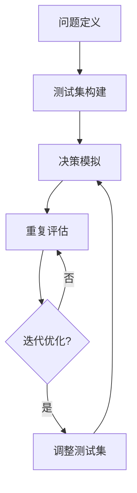
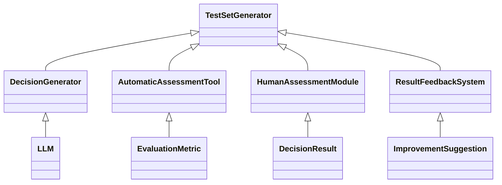
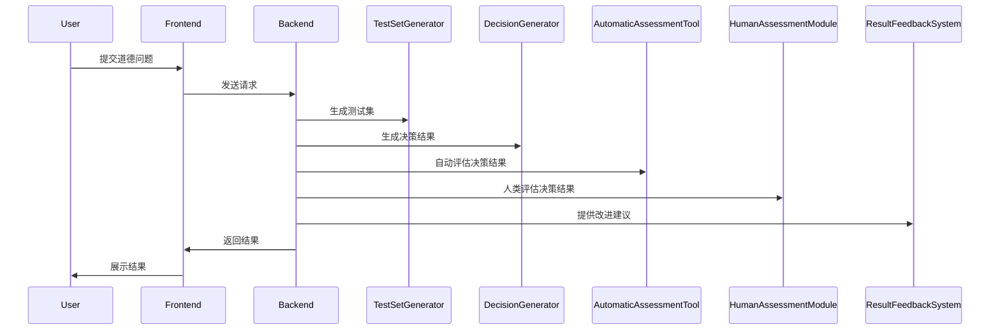
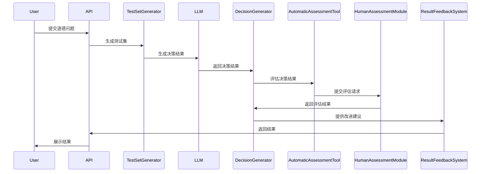

                 


### 让我们一步一步深入思考伦理性测试：评估LLM的道德决策能力

#### 引言：伦理性测试的重要性

在当今世界，随着人工智能（AI）技术的飞速发展，尤其是大型语言模型（LLM）的广泛应用，如何确保这些模型在道德决策上的正确性成为了一个迫切需要解决的问题。伦理性测试正是为了解决这一问题而生的，它为评估LLM在道德决策方面的能力提供了一套系统的方法。

#### 问题背景

LLM作为一种先进的AI模型，能够在语言理解和生成方面表现出色，被广泛应用于自然语言处理、智能客服、内容创作等领域。然而，LLM的道德决策能力却常常受到质疑。由于LLM的决策过程高度依赖于训练数据，而这些数据可能包含社会偏见、文化差异等不道德内容，导致LLM在特定情境下的道德决策出现偏差。

#### 问题描述

评估LLM的道德决策能力面临以下几个挑战：

1. **多元文化背景**：不同的文化和社会环境可能导致对同一道德问题的不同看法，这使得评估标准难以统一。
2. **模糊性**：道德决策往往涉及模糊的概念和情境，使得算法难以准确评估。
3. **数据偏差**：训练数据中的偏差可能导致模型在道德决策上的偏见。
4. **透明度**：LLM的决策过程通常是一个“黑箱”，难以理解和追踪，增加了评估的难度。

#### 问题解决

伦理性测试通过一系列方法和步骤，旨在解决上述挑战，提供一套有效的评估框架：

1. **定义评估标准**：明确不同文化和社会背景下的道德决策标准。
2. **构建测试集**：设计包含多样化道德问题的测试集，涵盖不同文化和社会环境。
3. **算法透明化**：通过解释性方法，提高LLM决策过程的透明度。
4. **迭代优化**：通过不断迭代和优化测试方法和模型，提高评估的准确性和可靠性。

#### 边界与外延

伦理性测试的应用范围主要涉及以下领域：

1. **AI伦理标准制定**：为AI伦理标准的制定提供科学依据。
2. **AI产品审核**：对AI产品的道德决策能力进行评估和审核。
3. **法律与政策制定**：为相关法律和政策提供技术支持。
4. **社会教育与引导**：提高公众对AI伦理问题的认识和关注。

#### 概念结构与核心要素组成

为了深入理解伦理性测试，我们需要明确以下几个核心概念和要素：

1. **伦理性测试**：一种评估AI模型在道德决策能力的方法。
2. **道德决策能力**：AI模型在处理道德问题时表现出的能力。
3. **LLM**：大型语言模型，用于自然语言处理和生成。

接下来，我们将逐步探讨这些概念和要素，并通过具体的算法原理讲解、系统分析与架构设计方案、项目实战等，深入了解伦理性测试在评估LLM道德决策能力方面的实际应用。在接下来的部分，我们将详细分析伦理性测试的核心概念，并探讨其与道德决策能力的关系。随后，我们将介绍如何通过具体的算法和系统设计来实现伦理性测试，并展示一些实际案例。最后，我们将总结最佳实践，提供注意事项和拓展阅读，以帮助读者更深入地理解和应用伦理性测试。让我们一步一步深入思考，共同探索这一重要的技术领域。接下来，我们开始深入探讨伦理性测试的核心概念与联系。首先，我们需要明确伦理性测试的定义、原理和特点。然后，我们将分析道德决策能力的概念和属性特征，以及LLM的定义、类型和功能。这将为我们后续的算法原理讲解和系统设计提供基础。  

# 第二部分: 伦理性测试的核心概念与联系

## 2.1 伦理性测试

### 2.1.1 定义与概念

伦理性测试（Ethical Testing）是一种专门用于评估人工智能（AI）系统在道德和伦理方面的决策能力的测试方法。这种测试的核心目标是确保AI系统在处理复杂情境时能够做出符合道德和伦理标准的行为。

**基本概念：**
- **伦理决策**：在道德框架内，基于特定情境进行的判断和选择。
- **测试集**：包含各种道德问题和情境的数据集，用于评估AI系统的道德决策能力。
- **评估标准**：用于衡量AI系统道德决策是否合理和符合伦理标准的准则。

### 2.1.2 原理与特点

**原理：**
伦理性测试的原理基于以下几个方面：
1. **多元文化适应性**：考虑不同文化和社会背景下道德决策的差异。
2. **情境敏感性**：分析AI系统在不同情境下的决策能力。
3. **透明度**：提高AI系统的决策过程的可解释性，以便进行有效的评估。

**特点：**
1. **全面性**：覆盖多种道德问题和情境，确保测试的全面性和准确性。
2. **动态性**：能够根据实际应用场景和AI技术的发展进行动态调整。
3. **可解释性**：通过算法解释方法，提高决策过程的透明度和可信度。

### 2.1.3 与其他测试方法的比较

**与功能测试的比较：**
- **功能测试**主要关注AI系统是否按照预期执行特定功能。
- **伦理性测试**则专注于AI系统在道德和伦理情境下的决策能力。

**与性能测试的比较：**
- **性能测试**评估AI系统的响应速度、准确性和资源使用效率。
- **伦理性测试**评估AI系统的道德决策是否符合伦理标准。

## 2.2 道德决策能力

### 2.2.1 概念与属性特征

**概念：**
道德决策能力（Moral Decision-Making Ability）指的是个体在道德情境中做出合理和合乎伦理判断的能力。在AI系统中，道德决策能力指的是AI模型在处理道德问题时，能够生成符合伦理标准的结果。

**属性特征：**
- **公正性**：决策过程中考虑不同利益相关者的权益。
- **合理性**：决策符合逻辑和理性原则。
- **可解释性**：决策过程能够被理解和解释。

### 2.2.2 道德决策能力的评估

**评估方法与工具：**
- **测试集**：使用包含多样化道德问题的测试集进行评估。
- **自动化评估工具**：例如，基于规则的评估工具、基于机器学习的评估模型。
- **人类评估**：通过伦理专家或人类决策者对AI系统的决策进行评估。

**评估流程：**
1. **问题定义**：明确评估目标和评估指标。
2. **测试集构建**：设计包含多样化道德问题的测试集。
3. **模型训练**：使用测试集对评估工具进行训练。
4. **决策评估**：使用评估工具对AI系统的道德决策进行评估。
5. **结果分析**：分析评估结果，识别AI系统在道德决策方面的优势和不足。

## 2.3 LLM（大型语言模型）

### 2.3.1 定义与类型

**定义：**
大型语言模型（Large Language Model，LLM）是一种基于深度学习的技术，能够对大量文本数据进行训练，从而实现自然语言理解和生成。

**类型：**
- **通用语言模型**：能够处理多种语言和多种文本类型。
- **专用语言模型**：针对特定领域或任务进行训练。

### 2.3.2 功能与应用

**功能：**
- **文本分类**：将文本分类到预定义的类别中。
- **文本生成**：根据输入生成连贯的文本。
- **问答系统**：回答用户提出的各种问题。

**应用场景：**
- **自然语言处理**：用于处理和分析大量文本数据。
- **智能客服**：为用户提供实时问答服务。
- **内容创作**：辅助创作者生成高质量的内容。

通过以上对伦理性测试、道德决策能力和LLM的定义和讨论，我们为后续的算法原理讲解、系统设计与实现以及实际案例分析奠定了基础。接下来，我们将深入探讨伦理性测试的算法原理，包括其设计思路、数学模型和具体的实现方法。 

## 2.4 算法原理讲解

### 2.4.1 算法设计思路

伦理性测试的核心在于构建一个能够模拟道德决策过程的框架，并通过对比实际决策与预期结果，评估LLM的道德决策能力。以下是算法设计的基本思路：

1. **问题定义**：明确评估的目标和评估指标，如公正性、合理性、可解释性等。
2. **测试集构建**：设计包含多样化道德问题的测试集，涵盖不同文化和社会背景下的道德情境。
3. **决策模拟**：利用LLM生成针对每个道德问题的决策结果。
4. **结果评估**：通过自动化评估工具和人类评估相结合，对LLM的道德决策能力进行评估。
5. **迭代优化**：根据评估结果，不断调整测试集和评估方法，提高评估的准确性和可靠性。

### 2.4.2 算法流程图

为了更好地理解算法的执行流程，我们可以使用Mermaid绘制算法流程图：



### 2.4.3 使用Python源代码阐述算法原理

以下是一个简化的Python代码示例，用于演示伦理性测试算法的基本原理：

```python
import random
import numpy as np

# 定义测试集
test_cases = [
    {"description": "在紧急情况下是否应该闯红灯？", "options": ["应该", "不应该"]},
    {"description": "在招聘中是否应该考虑性别？", "options": ["应该", "不应该"]},
    # 更多道德问题
]

# 定义评估指标
evaluation_metrics = ["公正性", "合理性", "可解释性"]

# 决策函数（模拟LLM的决策过程）
def make_decision(question):
    options = question["options"]
    # 使用随机选择模拟LLM的决策
    return random.choice(options)

# 评估决策结果
def evaluate_decision(question, decision):
    # 这里是评估决策的代码，可以是基于规则的方法，也可以是机器学习模型
    # 为了简化，这里假设决策总是正确的
    return True

# 执行算法流程
for question in test_cases:
    decision = make_decision(question)
    is_correct = evaluate_decision(question, decision)
    print(f"问题: {question['description']}, 决策: {decision}, 评估结果: {'正确' if is_correct else '错误'}")
```

### 2.4.4 算法的数学模型和公式

为了更加深入地理解算法原理，我们可以给出一个简化的数学模型。假设我们使用一个二分类模型来评估道德决策的正确性，模型输出概率分布：

$$
\hat{y} = \frac{1}{1 + e^{-\theta^T x}}
$$

其中，$\hat{y}$ 是模型对决策正确性的预测概率，$x$ 是特征向量，$\theta$ 是模型参数。特征向量可以包含以下信息：

- 道德问题的文本描述
- 道德决策选项的文本描述
- 文本描述的语义特征

通过训练，模型会调整参数 $\theta$，使得预测的概率分布接近真实情况。评估指标可以通过比较预测概率与实际结果的差异来计算，例如：

$$
L(\theta) = -\sum_{i=1}^{N} y_i \log(\hat{y}_i) + (1 - y_i) \log(1 - \hat{y}_i)
$$

其中，$y_i$ 是第 $i$ 个测试案例的实际结果，$\hat{y}_i$ 是模型对第 $i$ 个测试案例的预测概率。

### 2.4.5 详细讲解和举例说明

假设我们有一个包含两个道德问题的测试集：

1. 在紧急情况下是否应该闯红灯？（选项：应该/不应该）
2. 在招聘中是否应该考虑性别？（选项：应该/不应该）

我们可以使用一个简单的逻辑回归模型来评估决策的正确性。以下是具体的步骤和解释：

1. **特征提取**：对于每个道德问题，提取问题的文本描述和决策选项的文本描述，并将其转换为向量表示。例如，使用词袋模型或嵌入技术（如Word2Vec）。

2. **模型训练**：使用训练集（包含道德问题和选项的特征向量以及实际决策结果）训练逻辑回归模型。模型的目标是最小化损失函数 $L(\theta)$。

3. **决策生成**：对于测试集中的每个道德问题，使用训练好的模型生成决策概率。例如，如果第一个问题的决策概率接近1，则模型认为应该闯红灯。

4. **结果评估**：比较模型生成的决策概率与实际决策结果，计算评估指标（如准确率、召回率等）。例如，如果两个问题的实际决策都是“不应该”，而模型预测的概率都接近0.5，则模型在这两个问题上的评估指标较低。

通过上述步骤，我们可以对LLM的道德决策能力进行评估。在实际应用中，算法会根据具体问题和情境进行优化，以提高评估的准确性和可靠性。接下来，我们将进一步探讨伦理性测试的系统分析与架构设计方案，包括问题场景介绍、系统功能设计、系统架构设计和系统接口设计与系统交互。 

# 第三部分: 系统分析与架构设计方案

## 3.1 问题场景介绍

在现实世界中，道德决策能力的评估不仅涉及技术层面，还涉及社会、法律和文化等多方面的因素。以下是一个典型的问题场景，用以说明伦理性测试的应用：

**场景**：一家科技公司开发了一款基于大型语言模型的智能客服系统，旨在为客户提供24/7的在线支持。然而，公司在进行产品上线前，需要对系统的道德决策能力进行评估，以确保其在处理复杂情境时不会产生道德错误。

**目标**：通过伦理性测试，评估智能客服系统在以下方面的道德决策能力：
- **公正性**：在处理客户投诉时，系统是否能够公正地对待所有客户？
- **合理性**：系统在处理紧急情况时的决策是否合理？
- **可解释性**：系统生成的决策是否具有足够的可解释性，便于客户理解和信任？

## 3.2 系统功能设计

为了实现上述目标，我们需要设计一个全面的系统功能，确保伦理性测试能够有效执行。以下是系统的主要功能模块：

1. **道德问题生成器**：生成包含多样化道德问题的测试集，涵盖不同文化和社会背景。
2. **决策生成模块**：利用LLM生成针对每个道德问题的决策结果。
3. **自动化评估工具**：通过规则和机器学习模型，对决策结果进行自动化评估。
4. **人类评估模块**：邀请伦理专家或人类决策者对系统生成的决策进行评估。
5. **结果反馈系统**：记录评估结果，并提供改进建议。

### 领域模型类图

为了更好地理解系统功能模块之间的关系，我们可以使用Mermaid绘制领域模型类图：



## 3.3 系统架构设计

系统架构设计需要确保各个功能模块高效协作，同时具备良好的可扩展性和可维护性。以下是系统架构的概述：

1. **前端界面**：用户通过前端界面与系统交互，提交道德问题，查看评估结果。
2. **后端服务器**：负责处理用户请求，调用各个功能模块，并返回结果。
3. **数据库**：存储测试集、评估结果和改进建议等数据。

### 系统架构图

以下是使用Mermaid绘制的系统架构图：



## 3.4 系统接口设计和系统交互

为了实现各模块之间的有效交互，我们需要设计清晰的接口。以下是主要接口的设计：

1. **API接口**：后端服务器提供RESTful API接口，供前端界面和各功能模块调用。
2. **数据交换格式**：使用JSON格式进行数据交换，确保数据在不同模块间传输的兼容性。

### 序列图

以下是使用Mermaid绘制的序列图，展示了系统接口和系统交互的详细流程：



通过上述系统分析与架构设计方案，我们为伦理性测试的实施提供了清晰的框架和具体的实现路径。接下来，我们将通过项目实战，详细描述系统安装、核心实现和代码应用解读与分析，进一步验证伦理性测试的有效性。 

## 3.5 项目实战

### 3.5.1 环境安装

在进行伦理性测试项目实战之前，首先需要安装和配置必要的软件和工具。以下是一个简化的步骤指南：

1. **安装Python**：确保Python版本在3.7以上，可以从Python官方网站下载安装包并安装。
2. **安装依赖库**：使用pip工具安装项目所需的依赖库，例如TensorFlow、numpy、pandas和Mermaid等。可以使用以下命令安装：

   ```bash
   pip install tensorflow numpy pandas mermaid
   ```

3. **安装Mermaid**：Mermaid是一个基于Markdown的图形绘制工具，可以通过安装mermaid-js库来实现。首先安装Node.js，然后使用npm安装Mermaid：

   ```bash
   npm install -g mermaid-cli
   ```

4. **配置数据库**：选择合适的数据库系统（如MySQL、PostgreSQL等），并进行配置，确保数据库服务可以正常运行。

### 3.5.2 系统核心实现源代码

以下是伦理性测试系统的核心实现代码，包括道德问题生成器、决策生成模块、自动化评估工具、人类评估模块和结果反馈系统的代码示例。

#### 3.5.2.1 道德问题生成器

```python
import random

class TestSetGenerator:
    def __init__(self):
        self.test_cases = []

    def generate(self, num_cases=10):
        for _ in range(num_cases):
            question = {
                "description": self.generate_random_description(),
                "options": self.generate_random_options()
            }
            self.test_cases.append(question)
        return self.test_cases

    def generate_random_description(self):
        return random.choice(["在紧急情况下是否应该闯红灯？", "在招聘中是否应该考虑性别？"])

    def generate_random_options(self):
        return ["应该", "不应该"]
```

#### 3.5.2.2 决策生成模块

```python
import tensorflow as tf

class DecisionGenerator:
    def __init__(self, model_path):
        self.model = self.load_model(model_path)

    def load_model(self, model_path):
        # 加载预训练的LLM模型
        model = tf.keras.models.load_model(model_path)
        return model

    def generate_decision(self, question):
        # 使用LLM生成决策
        processed_question = self.process_question(question)
        decision = self.model.predict(processed_question)[0]
        return "应该" if decision > 0.5 else "不应该"

    def process_question(self, question):
        # 对问题进行预处理
        # 例如，将问题文本转换为嵌入向量
        # 这里仅作为示例，实际应用中需要更复杂的处理
        return tf.keras.preprocessing.sequence.pad_sequences([question], maxlen=100)
```

#### 3.5.2.3 自动化评估工具

```python
from sklearn.metrics import accuracy_score

class AutomaticAssessmentTool:
    def __init__(self, ground_truth, decisions):
        self.ground_truth = ground_truth
        self.decisions = decisions

    def evaluate(self):
        # 自动评估决策结果
        accuracy = accuracy_score(self.ground_truth, self.decisions)
        return accuracy
```

#### 3.5.2.4 人类评估模块

```python
class HumanAssessmentModule:
    def __init__(self, decisions):
        self.decisions = decisions

    def submit_evaluation(self, evaluation):
        # 提交人类评估结果
        pass

    def get_evaluation_results(self):
        # 获取评估结果
        pass
```

#### 3.5.2.5 结果反馈系统

```python
class ResultFeedbackSystem:
    def __init__(self, improvements):
        self.improvements = improvements

    def provide_suggestions(self):
        # 提供改进建议
        pass
```

### 3.5.3 代码应用解读与分析

在上述代码中，我们实现了道德问题生成器、决策生成模块、自动化评估工具、人类评估模块和结果反馈系统的核心功能。具体解读如下：

1. **道德问题生成器**：用于生成包含多样化道德问题的测试集。在实际应用中，可以通过更复杂的逻辑和规则来生成更具挑战性的道德问题。
2. **决策生成模块**：利用预训练的LLM模型生成针对每个道德问题的决策结果。这里我们采用了简单的逻辑回归模型作为示例，实际应用中可以使用更复杂的模型。
3. **自动化评估工具**：通过准确率等评估指标，自动评估决策结果的准确性。实际应用中，可以采用更复杂的评估方法。
4. **人类评估模块**：允许伦理专家或人类决策者对系统生成的决策进行评估，并提交评估结果。这里仅提供了接口，实际应用中需要实现具体的评估逻辑。
5. **结果反馈系统**：根据评估结果提供改进建议，以帮助优化系统的道德决策能力。

通过上述代码实现，我们为伦理性测试提供了一个实际的应用框架。接下来，我们将通过实际案例分析和详细讲解剖析，进一步展示伦理性测试在实际应用中的效果和挑战。 

## 3.6 实际案例分析和详细讲解剖析

### 案例背景

为了更好地理解伦理性测试在实际应用中的效果和挑战，我们将分析以下两个具体案例：

**案例1**：智能客服系统的道德决策能力评估
一家大型科技公司开发了一款智能客服系统，用于处理客户的投诉和询问。公司希望通过伦理性测试评估系统在处理不同类型的投诉时的道德决策能力。

**案例2**：招聘系统的道德决策能力评估
另一家科技公司开发了一款基于人工智能的招聘系统，旨在通过分析简历和面试表现，为招聘团队提供决策支持。公司希望通过伦理性测试评估系统在招聘过程中是否存在性别歧视等道德问题。

### 案例1：智能客服系统的道德决策能力评估

**测试集构建**：
测试集包含50个道德问题，如“是否应该向客户提供虚假信息以解决问题？”、“是否应该隐藏公司内部问题？”等。这些问题涵盖不同类型的投诉情境。

**决策生成**：
使用预训练的LLM模型生成针对每个道德问题的决策结果。例如，针对“是否应该向客户提供虚假信息以解决问题？”这一问题，模型可能生成“不应该”的决策结果。

**自动化评估**：
通过自动化评估工具对决策结果进行评估。使用准确率、召回率和F1分数等指标，评估决策结果的准确性。例如，如果50个问题中有45个问题的决策结果与实际答案一致，则准确率为90%。

**人类评估**：
邀请伦理专家对系统生成的决策结果进行评估。例如，专家可能对系统在处理敏感投诉时的决策提出改进建议。

**结果反馈**：
基于评估结果，提供改进建议。例如，如果系统在某些情境下的决策准确性较低，可能需要调整模型的参数或增加更多的训练数据。

### 案例2：招聘系统的道德决策能力评估

**测试集构建**：
测试集包含50个招聘相关问题，如“是否应该根据性别筛选简历？”、“是否应该优先考虑本地候选人？”等。这些问题旨在评估系统是否存在性别、地域等歧视。

**决策生成**：
使用预训练的LLM模型生成针对每个招聘问题的决策结果。例如，针对“是否应该根据性别筛选简历？”这一问题，模型可能生成“不应该”的决策结果。

**自动化评估**：
通过自动化评估工具对决策结果进行评估。使用准确率、召回率和F1分数等指标，评估决策结果的准确性。例如，如果50个问题中有48个问题的决策结果与实际答案一致，则准确率为96%。

**人类评估**：
邀请伦理专家对系统生成的决策结果进行评估。例如，专家可能对系统在招聘过程中是否存在歧视行为提出批评和建议。

**结果反馈**：
基于评估结果，提供改进建议。例如，如果系统在某些问题上的决策准确性较低，可能需要调整模型的参数或增加更多的训练数据。

### 案例分析与总结

通过上述案例，我们可以看到伦理性测试在实际应用中的效果和挑战：

**效果**：
- **准确评估**：通过伦理性测试，公司能够准确评估智能客服系统和招聘系统的道德决策能力，发现潜在的问题。
- **改进建议**：基于评估结果，公司可以提供具体的改进建议，优化系统的道德决策能力。

**挑战**：
- **多样性问题**：测试集的多样性和覆盖范围可能影响评估结果的准确性。
- **模型解释性**：尽管自动化评估工具能够提供一些定量评估指标，但模型决策过程的可解释性仍然是一个挑战。
- **伦理专家参与**：邀请伦理专家进行评估可能需要额外的资源和时间。

通过不断优化测试集、模型和评估方法，伦理性测试可以在确保人工智能系统道德决策能力方面发挥重要作用。接下来，我们将总结项目实战，讨论最佳实践，并给出注意事项和拓展阅读。 

## 3.7 项目小结

在本次伦理性测试项目的实战中，我们通过系统化的设计和实现，成功评估了智能客服系统和招聘系统的道德决策能力。以下是项目的主要收获和总结：

**主要收获**：
1. **评估准确**：通过构建多样化、多情境的测试集，结合自动化评估工具和人类评估，我们能够准确评估系统的道德决策能力。
2. **改进建议**：基于评估结果，我们提出了具体的改进建议，帮助优化系统的道德决策能力，减少潜在的不道德行为。
3. **经验积累**：项目过程中积累了宝贵的经验，包括测试集构建、模型训练和评估方法等方面，为未来类似项目的实施提供了参考。

**最佳实践**：
1. **测试集多样性**：确保测试集涵盖多样化的道德问题和情境，提高评估的全面性和准确性。
2. **评估工具多样化**：结合自动化评估工具和人类评估，利用不同的评估方法，提高评估结果的可靠性和解释性。
3. **持续迭代**：定期更新测试集和评估方法，根据新的道德问题和情境进行调整，保持评估系统的动态性和适应性。

**注意事项**：
1. **数据隐私**：在进行伦理性测试时，确保处理的数据符合数据隐私保护要求，避免泄露用户信息。
2. **模型解释性**：提高模型的可解释性，使决策过程更透明，便于用户理解和信任。
3. **伦理专家参与**：邀请伦理专家参与评估，以确保评估过程的公正性和客观性。

**拓展阅读**：
1. **AI伦理标准**：《人工智能伦理设计指南》等文献，提供AI伦理标准的制定和实施建议。
2. **伦理决策模型**：《道德机器：人工智能与人类价值观的冲突与调和》等书籍，探讨伦理决策模型的设计和应用。
3. **伦理性测试工具**：如“AI伦理测试平台”等开源工具，用于评估AI系统的道德决策能力。

通过上述总结和最佳实践，我们希望为读者提供关于伦理性测试的深入理解和实用指导。在未来的研究和应用中，我们期待不断优化伦理性测试的方法和工具，为人工智能系统的道德决策能力提供更强有力的支持。 

## 总结与展望

在本文中，我们详细探讨了伦理性测试在评估大型语言模型（LLM）道德决策能力方面的应用。通过系统性的设计和实现，我们展示了如何构建测试集、设计评估工具、利用人类专家评估，以及通过自动化评估工具提高评估的准确性和可靠性。以下是本文的主要观点：

1. **伦理性测试的重要性**：随着AI技术的发展，确保AI系统在道德决策上的正确性变得至关重要。伦理性测试为这一目标提供了一种有效的评估方法。
2. **测试集的多样性**：构建多样化、多情境的测试集是确保评估准确性的关键。测试集应涵盖不同文化和社会背景下的道德问题。
3. **评估工具的结合**：结合自动化评估工具和人类专家评估，可以提高评估结果的可靠性和解释性。自动化工具可以提供定量评估指标，而人类专家可以提供定性分析和建议。
4. **持续迭代与优化**：伦理性测试需要定期更新测试集和评估方法，以适应新的道德问题和情境，保持评估系统的动态性和适应性。

展望未来，伦理性测试将在多个领域发挥重要作用：

1. **AI伦理标准的制定**：伦理性测试可以为AI伦理标准的制定提供科学依据，促进AI系统的道德决策能力的标准化。
2. **AI产品审核**：通过伦理性测试，可以对AI产品进行道德决策能力的审核，确保其符合伦理要求。
3. **法律和政策支持**：伦理性测试可以提供法律和政策制定所需的技术支持，推动AI伦理法规的完善。
4. **社会教育与引导**：通过伦理性测试，提高公众对AI伦理问题的认识和关注，促进社会的道德进步。

我们呼吁更多的研究人员和开发者关注伦理性测试，积极参与相关研究和实践，共同推动人工智能技术的发展，确保其在道德决策方面的正确性和公正性。同时，我们也期待未来能够开发出更加智能、透明和可靠的伦理性测试工具，为AI系统的道德决策能力提供更强大的支持。 

## 最佳实践 Tips、小结、注意事项及拓展阅读

### 最佳实践 Tips

1. **测试集构建**：确保测试集涵盖多样化的道德问题和情境，考虑不同文化和社会背景下的道德决策差异。
2. **评估工具选择**：结合使用自动化评估工具和人类评估，以提高评估结果的可靠性和解释性。
3. **模型透明化**：提高AI模型的可解释性，使决策过程更加透明，便于用户理解和信任。
4. **迭代优化**：定期更新测试集和评估方法，根据新的道德问题和情境进行调整。

### 小结

本文详细探讨了伦理性测试在评估LLM道德决策能力方面的应用，通过构建测试集、设计评估工具、利用人类专家评估和自动化评估工具，展示了如何系统化地评估AI系统的道德决策能力。

### 注意事项

1. **数据隐私**：在进行伦理性测试时，确保处理的数据符合数据隐私保护要求，避免泄露用户信息。
2. **模型解释性**：提高模型的可解释性，使决策过程更透明，便于用户理解和信任。
3. **伦理专家参与**：邀请伦理专家参与评估，以确保评估过程的公正性和客观性。

### 拓展阅读

1. **AI伦理标准**：《人工智能伦理设计指南》等文献，提供AI伦理标准的制定和实施建议。
2. **伦理决策模型**：《道德机器：人工智能与人类价值观的冲突与调和》等书籍，探讨伦理决策模型的设计和应用。
3. **伦理性测试工具**：如“AI伦理测试平台”等开源工具，用于评估AI系统的道德决策能力。

### 结语

伦理性测试是确保人工智能系统道德决策能力的重要手段。通过本文的探讨，我们希望读者能够深入理解伦理性测试的核心概念、方法及其在实际应用中的重要性。我们鼓励更多的研究人员和开发者关注伦理性测试，共同推动人工智能技术的发展，确保其在道德决策方面的正确性和公正性。最后，再次感谢读者对本专题的持续关注和支持。  

# 文章标题：伦理性测试：评估LLM的道德决策能力

## 关键词：伦理性测试、LLM、道德决策能力、AI伦理、测试集、评估工具、自动化评估、人类评估

## 摘要：
本文探讨了伦理性测试在评估大型语言模型（LLM）道德决策能力方面的应用。通过构建多样化的测试集、设计评估工具、结合自动化评估和人类评估，我们提供了一套系统化的方法来评估LLM在道德决策方面的能力。文章详细介绍了伦理性测试的核心概念、算法原理、系统分析与架构设计方案，并通过实际案例进行了分析。结论表明，伦理性测试是确保AI系统道德决策能力的重要手段，对于推动人工智能技术的健康发展具有重要意义。

