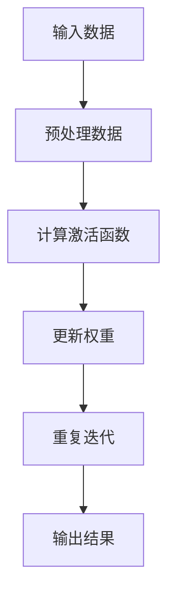
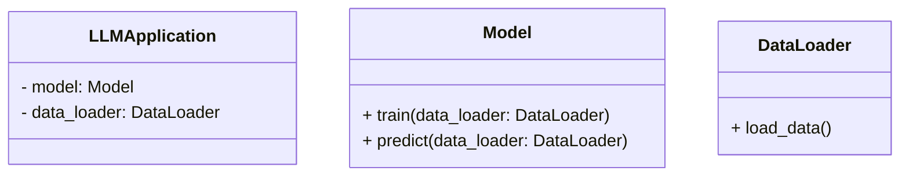
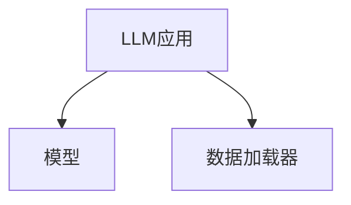
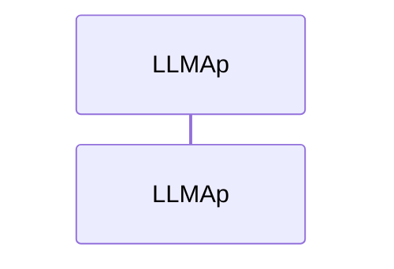

                 

# 依赖注入在LLM应用中的应用与好处

> 关键词：依赖注入、大型语言模型（LLM）、应用、好处、应用场景

> 摘要：
本文将深入探讨依赖注入（DI）在大型语言模型（LLM）应用中的重要性。首先，我们将回顾依赖注入的基本理论和核心概念，并探讨其在LLM应用中的重要性。接着，我们将通过具体的实现案例和数学模型讲解，展示依赖注入在LLM应用中的实际应用。最后，我们将从系统分析和架构设计的角度，详细阐述依赖注入在LLM应用中的系统设计与接口交互。

## 第一部分: 依赖注入在LLM应用中的基础理论

### 第1章: 问题背景与依赖注入概述

#### 1.1.1 问题背景
随着人工智能技术的快速发展，大型语言模型（LLM）如GPT-3、ChatGLM等已成为自然语言处理（NLP）领域的明星。然而，LLM应用在开发过程中面临诸多挑战，如复杂的依赖管理、可测试性差、维护成本高等。依赖注入作为一种先进的软件设计模式，旨在解决这些挑战。

#### 1.1.2 依赖注入概念
依赖注入是一种设计模式，它通过将对象的依赖关系从代码中解耦，由外部容器来管理。这种模式具有以下优点：
- 提高代码的可测试性：通过依赖注入，可以将依赖关系与具体的实现分离，使得单元测试更加简单和有效。
- 简化对象的创建：依赖注入可以自动创建和管理对象，减少代码冗余，提高开发效率。
- 提高代码的灵活性：依赖注入使得对象的依赖关系可以灵活地配置和替换，方便功能扩展和模块化设计。

#### 1.1.3 依赖注入的分类
依赖注入主要分为以下三种类型：
- **构造器注入**：通过构造函数来注入依赖关系，是最常用的一种方式。
- **属性注入**：通过属性的setter方法来注入依赖关系，适用于简单的依赖关系。
- **方法注入**：通过方法的方法体来注入依赖关系，适用于复杂的依赖关系。

## 第二部分: 核心概念与联系

### 第2章: 核心概念与联系

#### 2.1.1 核心概念
在本章中，我们将深入探讨依赖注入、控制反转（IoC）和容器这三个核心概念。

#### 2.1.2 概念属性特征对比

| 概念                 | 定义                                                         | 特征                               |
|----------------------|--------------------------------------------------------------|-----------------------------------|
| 控制反转（IoC）      | 将对象之间的依赖关系从代码中解耦，由外部容器来管理           | 提高代码的可测试性和可维护性       |
| 依赖注入（DI）      | 通过构造器、属性或方法来注入依赖关系                         | 简化对象的创建，提高代码的灵活性   |
| 容器                 | 用于管理对象及其依赖关系的框架或库                           | 管理对象的生命周期，提供依赖注入   |

#### 2.1.3 ER实体关系图架构

```mermaid
erDiagram
    ObjectA ||--|{控制反转}|| ObjectB
    ObjectB ||--|{依赖注入}|| ObjectC
    ObjectC ||--|{容器}|| ObjectD
```

## 第三部分: 依赖注入在LLM应用中的实现

### 第3章: 依赖注入在LLM应用中的实现

#### 3.1.1 依赖注入在LLM中的应用场景
在LLM应用中，依赖注入的主要应用场景包括：
- 模型训练与预测：通过依赖注入，可以灵活地配置和管理训练数据和预测数据。
- 数据预处理与后处理：依赖注入可以简化数据预处理和后处理流程，提高代码的可维护性。
- 模型优化与调整：依赖注入使得模型优化和调整更加灵活，方便开发者进行实验和验证。

#### 3.1.2 使用Python的依赖注入框架
Python拥有丰富的依赖注入框架，如Django、Flask等。以下将分别介绍这两个框架中的依赖注入实现。

##### 3.1.2.1 Django中的依赖注入
Django ORM提供了强大的依赖注入功能，使得在开发LLM应用时可以轻松管理依赖关系。

```python
from django.db import models

class LLMModel(models.Model):
    name = models.CharField(max_length=100)
    trained_data = models.ForeignKey('TrainedData', on_delete=models.CASCADE)

class TrainedData(models.Model):
    data = models.BinaryField()
```

##### 3.1.2.2 Flask中的依赖注入
Flask依赖注入库（如Flask-Depends）提供了简单的依赖注入机制，使得在开发LLM应用时可以更加灵活地管理依赖关系。

```python
from flask import Flask, request
from flask Depends import Depends

app = Flask(__name__)

@app.route('/predict', methods=['POST'])
def predict():
    data = request.get_json()
    model = Depends('get_model')
    prediction = model.predict(data)
    return prediction
```

## 第四部分: 数学模型与算法原理讲解

### 第4章: 数学模型与算法原理讲解

#### 4.1.1 数学模型
在LLM应用中，激活函数是一个重要的数学模型。以下是一个常见的激活函数：

$$
f(x) = \frac{1}{1 + e^{-x}}
$$

#### 4.1.2 算法原理讲解
以下是一个简单的算法流程图，展示了依赖注入在LLM应用中的实现过程。



## 第五部分: 系统分析与架构设计方案

### 第5章: 系统分析与架构设计方案

#### 5.1.1 问题场景介绍
假设我们开发一个基于LLM的智能客服系统，需要实现以下功能：
- 数据预处理：将用户输入的文本数据转换为适合模型处理的格式。
- 模型训练：使用训练数据对LLM模型进行训练。
- 模型预测：使用训练好的模型对用户输入进行预测。

#### 5.1.2 系统功能设计
以下是系统功能设计的领域模型类图：



#### 5.1.3 系统架构设计
以下是系统架构图：



#### 5.1.4 系统接口设计与交互
以下是系统接口设计和交互序列图：



## 总结
依赖注入在LLM应用中具有广泛的应用和显著的好处。通过本文的深入探讨，我们了解了依赖注入的基本理论、核心概念和实际应用，并看到了其在LLM应用中的具体实现和系统架构设计。希望本文能对读者在LLM应用开发过程中理解和运用依赖注入提供帮助。

### 作者
AI天才研究院/AI Genius Institute & 禅与计算机程序设计艺术 /Zen And The Art of Computer Programming

