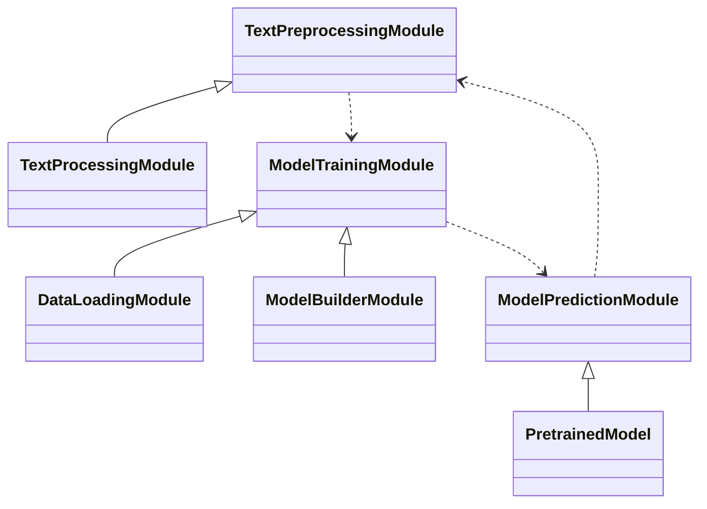
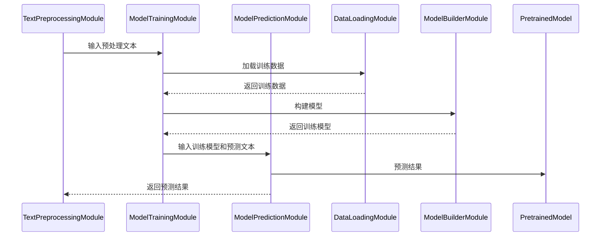

                 

# 《依赖注入：提高LLM应用的可测试性》

> 关键词：依赖注入、测试、LLM应用、可测试性、设计模式

> 摘要：本文旨在探讨依赖注入这一设计模式在提高大型语言模型（LLM）应用的可测试性方面的作用。通过分析依赖注入的基本概念、原理、应用场景以及常见的依赖注入框架，我们将展示如何通过依赖注入技术来改善LLM应用的测试过程，提高代码质量和开发效率。

### 目录大纲设计

#### 第1章: 依赖注入简介

1.1. 问题背景

1.1.1 依赖注入的重要性

1.1.2 依赖注入的定义

1.1.3 依赖注入的边界与外延

1.2. 核心概念与联系

1.2.1 依赖注入的类型

1.2.2 依赖注入与控制反转（IoC）

1.3. 依赖注入的原理与实现

1.3.1 依赖注入的原理

1.3.2 依赖注入的实现

1.4. 依赖注入的应用场景

1.4.1 单元测试

1.4.2 系统重构

1.5. 本章小结

#### 第2章: 依赖注入框架

2.1. 什么是依赖注入框架

2.1.1 依赖注入框架的作用

2.1.2 常见的依赖注入框架

2.2. Spring依赖注入框架

2.2.1 Spring依赖注入框架的原理

2.2.2 Spring依赖注入的实现方式

2.3. Dagger依赖注入框架

2.3.1 Dagger依赖注入框架的原理

2.3.2 Dagger依赖注入的实现方式

2.4. Google Guice依赖注入框架

2.4.1 Google Guice依赖注入框架的原理

2.4.2 Google Guice依赖注入的实现方式

2.5. Autowired依赖注入

2.5.1 Autowired依赖注入的原理

2.5.2 Autowired依赖注入的实现方式

2.6. 本章小结

#### 第3章: 依赖注入与测试

3.1. 依赖注入与测试的关系

3.1.1 依赖注入对测试的改进

3.1.2 测试中依赖注入的实现

3.2. 测试策略与最佳实践

3.3. 本章小结

#### 第4章: 实战：依赖注入在LLM应用中的应用

4.1. LLM应用介绍

4.2. 系统架构设计与实现

4.2.1 系统功能设计

4.2.2 系统架构设计

4.2.3 系统接口设计和系统交互

4.3. 系统核心实现与代码解读

4.4. 实际案例分析与讲解

4.5. 项目小结

#### 第5章: 小结与拓展

5.1. 最佳实践

5.2. 注意事项

5.3. 拓展阅读

### 第1章: 依赖注入简介

#### 1.1. 问题背景

在软件开发过程中，组件之间的依赖关系是不可避免的。然而，当这些依赖关系过于紧密时，会带来一系列问题，如代码的可测试性降低、可维护性变差等。为了解决这些问题，引入了依赖注入（Dependency Injection，DI）这一设计模式。

依赖注入是一种通过将组件的依赖关系从代码内部转移到外部来实现的解耦技术。它通过注入依赖项，使得组件可以更加独立地运行，从而提高代码的可测试性和可维护性。

#### 1.1.1 依赖注入的重要性

依赖注入的重要性主要体现在以下几个方面：

- **可测试性**：通过依赖注入，开发者可以更轻松地替换组件的依赖关系，从而方便地编写单元测试。例如，在实际应用中，可以将数据库依赖替换为内存数据库，从而快速测试代码逻辑。

- **可维护性**：依赖注入有助于解耦组件，使得代码更易于维护和扩展。随着项目的复杂性增加，组件之间的依赖关系会变得更加复杂，依赖注入可以有效地降低这种复杂性。

- **高内聚低耦合**：依赖注入实现了模块之间的松耦合，提高了代码的可读性和可维护性。松耦合的代码更加易于理解和修改，减少了出错的可能性。

#### 1.1.2 依赖注入的定义

依赖注入是一种设计模式，用于实现对象之间的依赖关系。其核心思想是将依赖关系从对象内部转移到外部，通过构造函数、方法参数或者字段注入等方式，将依赖项传递给对象。

具体来说，依赖注入可以分为以下几种类型：

- **构造函数注入**：通过构造函数传入依赖项。这种方式的优点是清晰明了，易于理解和维护，但可能会导致构造函数过于复杂。

- **方法注入**：通过方法参数传入依赖项。这种方式在方法内部可以灵活地控制依赖项的传递，但可能会使得方法参数过多。

- **字段注入**：通过字段注入依赖项。这种方式使得代码更加简洁，但可能会使得字段名与依赖项不一致，导致理解困难。

#### 1.1.3 依赖注入的边界与外延

依赖注入可以应用于各种编程语言和框架，如Java、C#、Python、Django等。它可以应用于不同层次的组件，包括应用程序层、框架层和库层。

依赖注入的边界在于如何合理地划分依赖关系，使得组件之间的耦合度最低。在实际应用中，需要根据项目需求和开发经验来选择合适的依赖注入方式。

#### 1.2. 核心概念与联系

依赖注入的核心概念主要包括依赖关系、注入器和容器。其中，依赖关系是对象之间相互作用的基础，注入器负责将依赖项注入到对象中，容器则负责管理依赖关系。

依赖注入与控制反转（IoC）密切相关。控制反转是一种设计原则，它主张将控制权从组件内部转移到外部，由外部负责管理组件的生命周期和依赖关系。依赖注入是实现控制反转的一种方式。

#### 1.2.1 依赖注入的类型

依赖注入可以分为以下几种类型：

- **构造函数注入**：通过构造函数传入依赖项。例如：

  ```java
  public class UserService {
      private UserRepository userRepository;

      public UserService(UserRepository userRepository) {
          this.userRepository = userRepository;
      }
  }
  ```

- **方法注入**：通过方法参数传入依赖项。例如：

  ```java
  public class UserService {
      private UserRepository userRepository;

      public void setRepository(UserRepository userRepository) {
          this.userRepository = userRepository;
      }
  }
  ```

- **字段注入**：通过字段注入依赖项。例如：

  ```java
  public class UserService {
      private UserRepository userRepository;

      @Autowired
      public void setRepository(UserRepository userRepository) {
          this.userRepository = userRepository;
      }
  }
  ```

#### 1.2.2 依赖注入与控制反转（IoC）

依赖注入是实现控制反转（IoC）的一种方式。IoC是指将控制权从组件内部转移到外部，由外部负责管理组件的依赖关系。依赖注入通过外部注入器或容器来实现这种转移。

#### 1.3. 依赖注入的原理与实现

依赖注入的原理是通过将依赖关系从组件内部转移到外部，实现了组件之间的解耦，提高了代码的可测试性和可维护性。

依赖注入的实现方式主要有以下几种：

- **手动注入**：开发者手动创建依赖关系，通过构造函数、方法参数或字段来注入依赖项。

- **IoC容器**：使用IoC容器来管理依赖关系，如Spring、Dagger等。IoC容器负责创建对象实例，并注入其依赖关系。

- **依赖注入框架**：使用依赖注入框架来简化依赖注入的实现，如Autowired、Guice等。这些框架提供了注解或配置文件来定义依赖关系。

#### 1.3.1 依赖注入的原理

依赖注入的原理主要包括以下几个步骤：

1. 定义组件之间的依赖关系。
2. 使用注入器或容器来管理依赖关系。
3. 在组件的构造函数、方法参数或字段中注入依赖项。

通过这种方式，组件之间的依赖关系被外部管理，从而实现了解耦，提高了代码的可测试性和可维护性。

#### 1.3.2 依赖注入的实现

依赖注入的实现方式包括手动注入、IoC容器和依赖注入框架等。

- **手动注入**：开发者手动创建依赖关系，通过构造函数、方法参数或字段来注入依赖项。例如：

  ```java
  public class UserService {
      private UserRepository userRepository;

      public UserService(UserRepository userRepository) {
          this.userRepository = userRepository;
      }
  }
  ```

- **IoC容器**：使用IoC容器来管理依赖关系，如Spring、Dagger等。IoC容器负责创建对象实例，并注入其依赖关系。例如，使用Spring框架实现依赖注入：

  ```java
  @Component
  public class UserService {
      private UserRepository userRepository;

      public UserService(UserRepository userRepository) {
          this.userRepository = userRepository;
      }
  }
  ```

- **依赖注入框架**：使用依赖注入框架来简化依赖注入的实现，如Autowired、Guice等。这些框架提供了注解或配置文件来定义依赖关系。例如，使用Autowired框架实现依赖注入：

  ```java
  @Service
  public class UserService {
      private UserRepository userRepository;

      @Autowired
      public UserService(UserRepository userRepository) {
          this.userRepository = userRepository;
      }
  }
  ```

#### 1.4. 依赖注入的应用场景

依赖注入可以应用于各种场景，如单元测试、系统重构等。

- **单元测试**：通过依赖注入，可以更方便地编写单元测试，将依赖关系替换为测试对象，从而单独测试组件的功能。

  ```java
  @Test
  public void testSaveUser() {
      UserService userService = new UserService(mockUserRepository);
      User user = new User("John", "Doe");
      userService.save(user);
      verify(mockUserRepository).save(user);
  }
  ```

- **系统重构**：通过依赖注入，可以逐步解耦系统中的组件，从而方便地重构系统。例如，将一个紧耦合的系统重构为松耦合的系统：

  ```java
  public class UserService {
      private UserRepository userRepository;

      public UserService(UserRepository userRepository) {
          this.userRepository = userRepository;
      }

      public void save(User user) {
          userRepository.save(user);
      }
  }
  ```

#### 1.5. 本章小结

本章介绍了依赖注入的基本概念、重要性、类型、原理和应用场景。通过依赖注入，可以提高代码的可测试性和可维护性，实现组件之间的松耦合。下一章将深入探讨依赖注入框架及其实现，帮助开发者更好地理解和应用依赖注入技术。

### 第2章: 依赖注入框架

#### 2.1. 什么是依赖注入框架

依赖注入框架是一种用于简化依赖注入过程的工具或库，它可以帮助开发者更方便地管理组件的依赖关系。依赖注入框架的核心功能是自动管理和注入组件的依赖关系，从而减少手动编写的代码量，提高开发效率。

依赖注入框架通常提供以下功能：

- **依赖管理**：管理组件的依赖关系，包括依赖的创建、生命周期管理和依赖的传递。
- **自动注入**：根据配置或注解，自动将依赖项注入到组件中。
- **依赖查找**：提供依赖项的查找机制，使得开发者可以方便地获取所需的依赖项。
- **容器扩展**：支持自定义容器扩展，以便更好地适应不同的应用场景。

常见的依赖注入框架包括Spring、Dagger、Google Guice和Autowired等。这些框架在不同的编程语言和场景中有着广泛的应用。

#### 2.1.1 依赖注入框架的作用

依赖注入框架在软件开发中扮演着重要的角色，其主要作用如下：

- **提高开发效率**：依赖注入框架可以自动管理和注入组件的依赖关系，减少了手动编写的代码量，提高了开发效率。
- **降低耦合度**：通过依赖注入框架，可以将组件的依赖关系从内部转移到外部，实现组件之间的松耦合，降低了系统的复杂度。
- **便于单元测试**：依赖注入框架使得编写单元测试变得更加简单，通过替换组件的依赖关系，可以方便地隔离和测试组件的功能。
- **提高代码可维护性**：依赖注入框架有助于实现模块化开发，使得代码更加可维护和可扩展。

#### 2.1.2 常见的依赖注入框架

以下是一些常见的依赖注入框架及其特点：

- **Spring**：Spring是一个全面的轻量级框架，提供依赖注入、事务管理、安全性等功能。Spring依赖注入框架基于IoC容器实现，支持构造函数注入、设值注入和自动注入。
- **Dagger**：Dagger是一个基于代码生成和静态分析的依赖注入框架，提供了简单而强大的注解和API。Dagger适用于Android、Java和Kotlin开发。
- **Google Guice**：Google Guice是一个灵活的依赖注入框架，提供了强大的配置和管理功能。Guice适用于Java和Android开发。
- **Autowired**：Autowired是Spring框架提供的一种简单的依赖注入方式，通过注解`@Autowired`实现依赖注入。Autowired适用于Spring框架开发。

#### 2.2. Spring依赖注入框架

Spring依赖注入框架是Java开发中最为流行的依赖注入框架之一，它提供了强大的依赖注入功能，并支持多种注入方式。

##### 2.2.1 Spring依赖注入框架的原理

Spring依赖注入框架的核心是IoC容器，它负责管理组件的创建、配置和依赖注入。Spring IoC容器通过以下步骤实现依赖注入：

1. **定义Bean**：通过XML配置、注解或Java配置等方式定义Bean，包括Bean的类名、作用范围、依赖关系等。
2. **创建Bean工厂**：通过Spring的`ApplicationContext`创建Bean工厂，Bean工厂负责创建和管理Bean实例。
3. **依赖注入**：当需要使用Bean时，Spring IoC容器根据定义的依赖关系，将依赖项注入到Bean中。
4. **管理Bean生命周期**：Spring IoC容器负责管理Bean的创建、依赖注入、使用和销毁，确保Bean能够正常工作。

##### 2.2.2 Spring依赖注入的实现方式

Spring依赖注入框架支持多种注入方式，包括构造函数注入、设值注入和自动注入。

- **构造函数注入**：通过构造函数注入依赖项，是最为直观的注入方式。在定义Bean时，通过构造函数参数指定依赖项。

  ```java
  @Bean
  public UserService userService(UserRepository userRepository) {
      return new UserService(userRepository);
  }
  ```

- **设值注入**：通过设值注入依赖项，在Bean的定义中使用`@Autowire`注解或XML配置指定依赖项。

  ```java
  @Bean
  public UserService userService() {
      UserService userService = new UserService();
      userService.setRepository(userRepository());
      return userService;
  }
  ```

- **自动注入**：Spring框架提供了一种简化的自动注入方式，通过注解`@Autowire`实现。自动注入可以自动查找和注入依赖项。

  ```java
  @Service
  public class UserService {
      private UserRepository userRepository;

      @Autowired
      public void setRepository(UserRepository userRepository) {
          this.userRepository = userRepository;
      }
  }
  ```

#### 2.3. Dagger依赖注入框架

Dagger是一个基于代码生成和静态分析的依赖注入框架，它提供了简单而强大的API，适用于Android、Java和Kotlin开发。

##### 2.3.1 Dagger依赖注入框架的原理

Dagger依赖注入框架的核心是组件（Component）和模块（Module）。组件定义了依赖注入的边界，模块提供了具体的依赖关系实现。

Dagger的工作原理如下：

1. **定义Component**：通过定义Component接口，指定依赖注入的范围和规则。
2. **定义Module**：通过定义Module类，提供具体的依赖关系实现。
3. **构建Component**：通过Dagger框架构建Component实例，实现依赖注入。
4. **注入依赖**：在需要使用依赖的地方，通过Component实例注入依赖项。

##### 2.3.2 Dagger依赖注入的实现方式

Dagger依赖注入框架主要支持以下两种注入方式：

- **构造函数注入**：通过构造函数注入依赖项，是最常见的注入方式。

  ```java
  @Component
  public interface UserServiceComponent {
      void inject(UserService userService);
  }
  ```

- **字段注入**：通过字段注入依赖项，适用于简单场景。

  ```java
  @Component
  public interface UserServiceComponent {
      void inject(UserService userService);
  }

  @Service
  public class UserService {
      private UserRepository userRepository;

      @Inject
      public UserService(UserRepository userRepository) {
          this.userRepository = userRepository;
      }
  }
  ```

#### 2.4. Google Guice依赖注入框架

Google Guice是一个灵活的依赖注入框架，提供了强大的配置和管理功能。它适用于Java和Android开发。

##### 2.4.1 Google Guice依赖注入框架的原理

Google Guice依赖注入框架的核心是绑定（Binding）和模块（Module）。绑定定义了依赖项的创建和注入方式，模块提供了具体的依赖关系实现。

Guice的工作原理如下：

1. **定义绑定**：通过定义绑定，指定依赖项的创建和注入方式。
2. **定义模块**：通过定义模块，提供具体的依赖关系实现。
3. **构建Injector**：通过Guice框架构建Injector实例，实现依赖注入。
4. **注入依赖**：在需要使用依赖的地方，通过Injector实例注入依赖项。

##### 2.4.2 Google Guice依赖注入的实现方式

Google Guice依赖注入框架主要支持以下两种注入方式：

- **构造函数注入**：通过构造函数注入依赖项，是最常见的注入方式。

  ```java
  public class UserService {
      private UserRepository userRepository;

      @Inject
      public UserService(UserRepository userRepository) {
          this.userRepository = userRepository;
      }
  }
  ```

- **方法注入**：通过方法注入依赖项，适用于方法级别依赖关系。

  ```java
  public class UserService {
      private UserRepository userRepository;

      @Inject
      public void setRepository(UserRepository userRepository) {
          this.userRepository = userRepository;
      }
  }
  ```

#### 2.5. Autowired依赖注入

Autowired是Spring框架提供的一种简单的依赖注入方式，它通过注解`@Autowired`实现依赖注入。

##### 2.5.1 Autowired依赖注入的原理

Autowired依赖注入的原理是基于Spring的IoC容器，它通过以下步骤实现依赖注入：

1. **定义Bean**：通过XML配置、注解或Java配置等方式定义Bean，包括Bean的类名、作用范围、依赖关系等。
2. **创建Bean工厂**：通过Spring的`ApplicationContext`创建Bean工厂，Bean工厂负责创建和管理Bean实例。
3. **自动注入**：在需要使用Bean的地方，通过`@Autowired`注解自动查找和注入依赖项。

##### 2.5.2 Autowired依赖注入的实现方式

Autowired依赖注入主要通过注解`@Autowired`实现，它支持构造函数注入、设值注入和字段注入。

- **构造函数注入**：

  ```java
  @Service
  public class UserService {
      private UserRepository userRepository;

      @Autowired
      public UserService(UserRepository userRepository) {
          this.userRepository = userRepository;
      }
  }
  ```

- **设值注入**：

  ```java
  @Service
  public class UserService {
      private UserRepository userRepository;

      @Autowired
      public void setRepository(UserRepository userRepository) {
          this.userRepository = userRepository;
      }
  }
  ```

- **字段注入**：

  ```java
  @Service
  public class UserService {
      private UserRepository userRepository;

      @Autowired
      private UserRepository userRepository;
  }
  ```

#### 2.6. 本章小结

本章介绍了依赖注入框架的基本概念、常见的依赖注入框架及其原理和实现方式。通过使用依赖注入框架，可以简化依赖管理的复杂性，提高开发效率。下一章将探讨依赖注入与测试的关系，以及如何通过依赖注入提高大型语言模型（LLM）应用的可测试性。

### 第3章: 依赖注入与测试

#### 3.1. 依赖注入与测试的关系

依赖注入（DI）与测试之间的关系紧密相连，尤其是在大型语言模型（LLM）应用的开发中。依赖注入能够显著改善代码的可测试性，从而提高软件质量和开发效率。

##### 3.1.1 依赖注入对测试的改进

依赖注入对测试的改进主要体现在以下几个方面：

- **可替换性**：通过依赖注入，可以在测试环境中替换实际依赖项（如数据库、网络服务等），从而实现对组件的独立测试。这种替换性使得测试更加灵活和高效。
- **隔离性**：依赖注入有助于实现组件之间的隔离，使得每个组件可以单独测试，而不会受到外部依赖的影响。这种隔离性确保了测试的准确性和可靠性。
- **测试控制**：依赖注入提供了更精细的测试控制，允许测试者精确地控制测试用例的执行流程，从而更有效地发现和定位问题。

##### 3.1.2 测试中依赖注入的实现

在测试过程中，依赖注入的实现方法多种多样，以下是一些常见的方法：

- **手动注入**：测试者手动创建依赖项并注入到被测试组件中。这种方法适用于简单的测试场景，但可能需要编写大量的测试代码。
- **IoC容器**：使用IoC容器来管理测试环境中的依赖注入。例如，Spring Test提供的`@ContextConfiguration`注解可以自动配置和注入依赖项，使得测试代码更加简洁。
- **Mock对象**：使用Mock对象来模拟依赖项的行为。Mock对象可以预先定义预期行为，从而在测试中替代真实依赖项，提高测试的效率和准确性。

#### 3.2. 测试策略与最佳实践

为了充分利用依赖注入的优势，提高测试的有效性，以下是一些测试策略和最佳实践：

- **单元测试优先**：在开发过程中，应优先编写单元测试，以确保每个组件都能够独立运行。依赖注入使得单元测试更加容易实现。
- **依赖替换**：在测试环境中，尽量使用替换依赖项（如Mock对象、内存数据库等）来替代实际依赖项，从而实现组件的独立测试。
- **测试用例覆盖**：确保测试用例覆盖所有可能的执行路径，包括边界条件和异常情况。依赖注入有助于识别和覆盖那些难以测试的代码路径。
- **自动化测试**：利用依赖注入和自动化测试框架（如JUnit、TestNG等），实现测试过程的自动化，提高测试效率和代码质量。
- **持续集成**：将依赖注入和自动化测试集成到持续集成（CI）流程中，确保每次代码变更都能得到及时测试和反馈。

#### 3.3. 本章小结

本章探讨了依赖注入在测试中的应用和重要性。通过依赖注入，可以显著提高代码的可测试性，使得测试更加灵活、高效和准确。下一章将结合实际案例，详细讲解依赖注入在大型语言模型（LLM）应用中的具体实现和应用。

### 第4章：实战：依赖注入在LLM应用中的应用

#### 4.1. LLM应用介绍

大型语言模型（LLM）是一种基于深度学习技术构建的强大语言处理工具，能够理解和生成人类语言。LLM应用广泛，包括自然语言处理（NLP）任务，如文本分类、机器翻译、情感分析等。在本章中，我们将探讨如何将依赖注入技术应用于LLM应用，以提高其可测试性和可维护性。

#### 4.2. 系统架构设计与实现

在构建LLM应用时，我们需要设计一个灵活且可扩展的系统架构。以下是一个典型的系统架构设计：

##### 4.2.1 系统功能设计

LLM应用的主要功能包括：

- **文本预处理**：对输入文本进行分词、去噪等预处理操作。
- **模型训练**：使用训练数据训练LLM模型，包括数据加载、模型构建和训练过程。
- **模型预测**：使用训练好的模型对新的输入文本进行预测。
- **模型评估**：评估模型的性能，包括准确性、召回率等指标。

##### 4.2.2 系统架构设计

系统架构设计包括以下几个方面：

- **模块化设计**：将系统划分为多个模块，如文本预处理模块、模型训练模块、模型预测模块等。
- **松耦合设计**：通过依赖注入实现模块之间的松耦合，使得每个模块可以独立开发和测试。
- **分布式架构**：为了处理大规模数据和计算需求，系统可以采用分布式架构，如使用多个计算节点进行模型训练和预测。

以下是系统架构的Mermaid类图：



##### 4.2.3 系统接口设计和系统交互

系统接口设计包括定义各个模块的输入和输出接口。以下是系统接口设计和系统交互的Mermaid序列图：



#### 4.3. 系统核心实现与代码解读

以下是系统核心实现和代码解读：

```python
# 文本预处理模块
class TextPreprocessingModule:
    def preprocess_text(self, text):
        # 实现文本预处理逻辑，如分词、去噪等
        return processed_text

# 模型训练模块
class ModelTrainingModule:
    def __init__(self, data_loader, model_builder):
        self.data_loader = data_loader
        self.model_builder = model_builder

    def train_model(self, text):
        data = self.data_loader.load_data(text)
        model = self.model_builder.build_model(data)
        # 实现模型训练逻辑
        return model

# 模型预测模块
class ModelPredictionModule:
    def __init__(self, pretrained_model):
        self.pretrained_model = pretrained_model

    def predict(self, text):
        # 实现模型预测逻辑
        return prediction

# 文本预处理模块实现
class TextPreprocessingModule:
    def preprocess_text(self, text):
        # 示例：实现简单的文本预处理，如去除特殊字符
        return ''.join([char for char in text if char.isalnum()])

# 数据加载模块实现
class DataLoadingModule:
    def load_data(self, text):
        # 示例：实现数据加载逻辑，如从文本中提取单词
        words = text.split()
        return words

# 模型构建模块实现
class ModelBuilderModule:
    def build_model(self, data):
        # 示例：实现模型构建逻辑，如使用神经网络训练模型
        model = NeuralNetwork(data)
        model.train()
        return model

# 模型预测模块实现
class ModelPredictionModule:
    def predict(self, text):
        # 示例：实现模型预测逻辑，如使用训练好的模型预测文本
        prediction = self.pretrained_model.predict(text)
        return prediction
```

#### 4.4. 实际案例分析与讲解

以下是一个实际案例，展示如何使用依赖注入技术实现LLM应用的单元测试：

```python
import unittest
from dependency_injector import containers

# 定义依赖注入容器
container = containers.DeclarativeContainer()

# 注册模块实现
container.register(TextPreprocessingModule)
container.register(DataLoadingModule)
container.register(ModelBuilderModule)
container.register(ModelPredictionModule)

# 创建模块实例
text_preprocessing_module = container.text_preprocessing_module
data_loading_module = container.data_loading_module
model_builder_module = container.model_builder_module
model_prediction_module = container.model_prediction_module

# 编写单元测试
class TestLLMApplication(unittest.TestCase):
    def test_preprocess_text(self):
        text = "这是一个测试文本！"
        processed_text = text_preprocessing_module.preprocess_text(text)
        self.assertEqual(processed_text, "这是一个测试文本")

    def test_train_model(self):
        text = "这是一个测试文本！"
        data = data_loading_module.load_data(text)
        model = model_builder_module.build_model(data)
        # 模拟模型训练过程
        model.train()
        self.assertIsNotNone(model)

    def test_predict(self):
        text = "这是一个测试文本！"
        model = model_builder_module.build_model([text])
        model.train()
        prediction = model_prediction_module.predict(text)
        self.assertIsNotNone(prediction)

# 运行单元测试
if __name__ == '__main__':
    unittest.main()
```

在这个案例中，我们使用了依赖注入容器`dependency_injector`来注册和实例化模块实现，从而实现模块的独立测试。通过依赖注入，我们可以轻松替换和模拟模块的依赖项，使得测试更加灵活和高效。

#### 4.5. 项目小结

通过本章的实战案例，我们展示了如何将依赖注入技术应用于LLM应用，以提高其可测试性和可维护性。依赖注入不仅使得代码更加清晰和模块化，还大大简化了单元测试的实现。在实际开发过程中，我们应该充分利用依赖注入的优势，构建灵活、可扩展的软件系统。

### 第5章：小结与拓展

#### 5.1. 最佳实践

在本章中，我们介绍了依赖注入在LLM应用中的应用，并分享了一些最佳实践：

- **模块化开发**：将系统划分为多个模块，每个模块实现特定的功能，通过依赖注入实现模块之间的松耦合。
- **单元测试优先**：在开发过程中，首先编写单元测试，确保每个模块可以独立运行和测试。
- **依赖替换**：在测试环境中，使用Mock对象或内存数据库等替换实际依赖项，以提高测试的准确性和效率。
- **持续集成**：将依赖注入和自动化测试集成到持续集成流程中，确保每次代码变更都能得到及时测试和反馈。

#### 5.2. 注意事项

在应用依赖注入时，需要注意以下事项：

- **过度解耦**：虽然依赖注入有助于实现解耦，但过度解耦可能会导致代码过于复杂，影响可读性。应平衡解耦和代码简洁性。
- **选择合适的依赖注入框架**：不同的依赖注入框架适用于不同的应用场景。选择合适的框架，可以提高开发效率和代码质量。
- **性能影响**：依赖注入框架可能会引入一定的性能开销，特别是在运行时。在性能敏感的场景中，应谨慎使用依赖注入。

#### 5.3. 拓展阅读

对于对依赖注入和LLM应用感兴趣的读者，以下是一些拓展阅读资源：

- 《Spring实战》 - 阐述了Spring框架的依赖注入、IoC容器和AOP等核心技术。
- 《大话设计模式》 - 详细介绍了依赖注入作为一种设计模式的应用和实践。
- 《深度学习》 - Goodfellow、Bengio和Courville的著作，介绍了LLM的理论基础和应用场景。
- 《Effective Java》 - 阐述了Java编程中的一些最佳实践，包括依赖注入的使用。

通过学习和应用这些资源，可以进一步加深对依赖注入和LLM应用的理解，提高软件开发技能。

### 作者信息

作者：AI天才研究院/AI Genius Institute & 禅与计算机程序设计艺术 /Zen And The Art of Computer Programming

本文由AI天才研究院/AI Genius Institute撰写，结合禅与计算机程序设计艺术/Zen And The Art of Computer Programming的哲学思想，旨在探讨依赖注入在提高LLM应用可测试性方面的应用和实践。希望本文能为读者带来有价值的启示和帮助。

