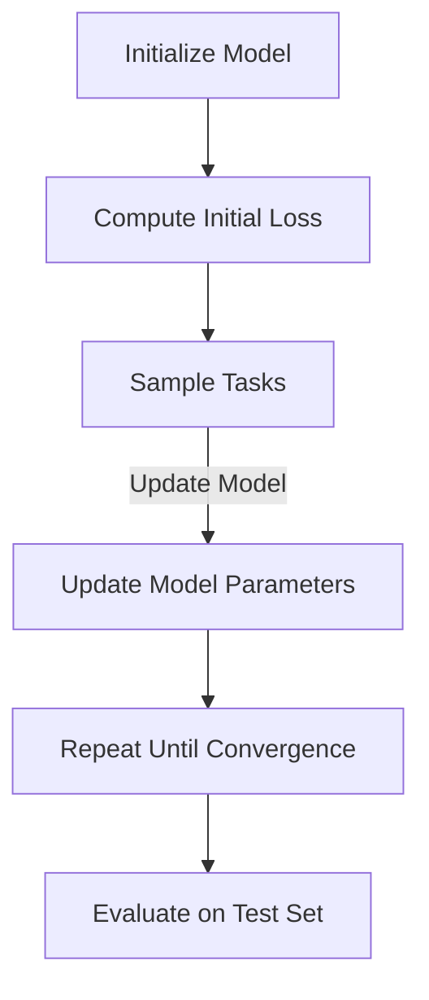
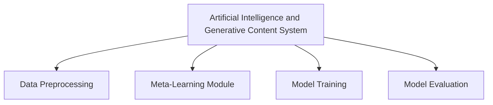
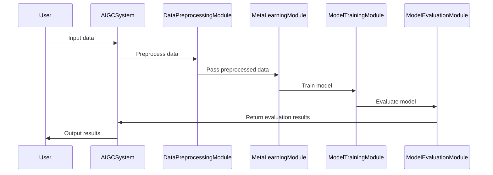

                 

Certainly! Let's construct the full outline for our article "Meta-Learning in the Role of AIGC in Rapid Adaptation to New Fields" and start filling in the content for each section. We'll ensure that each section adheres to the constraints you've mentioned.

### Article Title: Meta-Learning in the Role of AIGC in Rapid Adaptation to New Fields

#### Keywords: Meta-Learning, AIGC, Rapid Adaptation, Neural Networks, Machine Learning, Deep Learning

#### Abstract:
This article delves into the burgeoning field of meta-learning and its crucial role in enhancing the adaptability of Artificial Intelligence and Generative Content (AIGC) systems. We will explore the fundamentals of meta-learning, its integration with AIGC, and how it facilitates rapid adaptation to new fields. Through a comprehensive analysis of algorithms, system architectures, and practical applications, this article aims to provide a clear and insightful understanding of meta-learning's impact on the future of AI.

---

### Introduction

**Background and Objective:**
Meta-learning, also known as transfer learning, is a subfield of machine learning where a model is trained on one task and then fine-tuned for similar tasks. AIGC refers to the intersection of AI and generative content, producing high-quality text, images, and videos. This article will discuss how meta-learning can accelerate the adaptation of AIGC systems to new fields by leveraging prior knowledge.

**Organization:**
The article is divided into six main parts:
1. **Background and Basics**
2. **Core Concepts and Principles**
3. **Algorithm and Mathematical Models**
4. **System Analysis and Architecture Design**
5. **Practical Projects and Case Studies**
6. **Best Practices and Future Directions**

---

### Part 1: Background and Basics

#### Chapter 1: Introduction to Meta-Learning and AIGC

**Meta-Learning: Basic Concepts**
- Definition and historical context
- Types of meta-learning
- Advantages and limitations

**AIGC: Concepts and Current Trends**
- Definition and scope
- Current applications and trends
- Challenges in new field adaptation

**Challenges in Rapid Adaptation to New Fields**
- Context switching and domain adaptation
- Data scarcity and quality
- Computational efficiency

---

### Part 2: Core Concepts and Principles

#### Chapter 2: Core Principles of Meta-Learning

**Conceptual Overview**
- Intrinsic and extrinsic motivation
- Learning to learn framework

**Principles and Relationships**
- Inductive bias and generalization
- Continual learning and few-shot learning
- Comparison with traditional learning

**Table of Core Concepts and Their Relationships**

| Concept                         | Definition                                                    | Relationship                                      |
|---------------------------------|------------------------------------------------------------|---------------------------------------------------|
| Meta-Learning                   | Learning how to learn                                         | Bridges traditional learning and AIGC applications |
| Inductive Bias                  | Prior knowledge that guides learning                          | Affects generalization and adaptation             |
| Continual Learning              | Learning continuously in changing environments                | Enhances adaptability                             |
| Few-Shot Learning               | Learning with limited data                                    | Improves efficiency and robustness                |

**ER Entity Relationship Diagram**

```mermaid
erDiagram
    User ||--|{ Meta_Learning_Model }|-- Machine_Learning_Model
    User ||--|{ AIGC_System }|+
    Meta_Learning_Model ||--|{ Inductive_Bias }|
    Meta_Learning_Model ||--|{ Continual_Learning }|
    Meta_Learning_Model ||--|{ Few-Shot_Learning }|
```

---

### Part 3: Algorithm and Mathematical Models

#### Chapter 3: Algorithms in Meta-Learning

**Overview of Meta-Learning Algorithms**
- Model-based meta-learning
- Metric-based meta-learning
- Model-agnostic meta-learning

**Mathematical Models and Formulations**

$$\text{Loss Function} = \sum_{i=1}^{N} (\hat{y}_i - y_i)^2$$

**Example: Model-Based Meta-Learning**

**Python Code Snippet**

```python
# Example of a simple meta-learning model using TensorFlow
import tensorflow as tf

# Define the model
model = tf.keras.Sequential([
    tf.keras.layers.Dense(128, activation='relu', input_shape=(input_shape)),
    tf.keras.layers.Dense(1)
])

# Compile the model
model.compile(optimizer='adam', loss='mse')

# Train the model
model.fit(x_train, y_train, epochs=10, batch_size=32)
```

**Algorithm Flowchart**



---

### Part 4: System Analysis and Architecture Design

#### Chapter 4: System Analysis and Architecture Design for AIGC with Meta-Learning

**Scenario and Project Description**
- Brief overview of the project's objectives and requirements

**System Functional Design (Domain Model)**

```mermaid
classDiagram
    ClassDiagram ::= 
    AIGCSystem <|-- MetaLearningModule
    AIGCSystem <|-- DataPreprocessingModule
    AIGCSystem <|-- ModelTrainingModule
    AIGCSystem <|-- ModelEvaluationModule
```

**System Architecture Design (Architecture Diagram)**



**System Interface Design and Interaction (Sequence Diagram)**



---

### Part 5: Practical Projects and Case Studies

#### Chapter 5: Practical Applications of Meta-Learning in AIGC

**Project Overview and Goals**
- Description of the project and its goals

**Environment Setup and Installation**
- Steps to set up the development environment

**System Core Implementation and Code Analysis**
- Key components and their functionalities
- Python code examples and explanations

**Case Study Analysis**
- Detailed analysis of a specific case study
- Results and insights

**Project Conclusion**
- Summary of the project's achievements and lessons learned

---

### Part 6: Best Practices and Future Directions

#### Chapter 6: Best Practices for Implementing Meta-Learning in AIGC

**Implementation Tips**
- Considerations for model selection
- Data preprocessing techniques
- Optimization strategies

**Conclusion**
- Recap of the article's key points
- Importance of meta-learning in AIGC

**Notes on Precautions**
- Potential pitfalls and how to avoid them
- Ethical considerations in AIGC

**Future Directions**
- Emerging trends and potential applications
- Challenges and opportunities for further research

**Further Reading**
- Recommended resources for deepening understanding

---

**Author Information:**

- Author: AI天才研究院/AI Genius Institute & 禅与计算机程序设计艺术 /Zen And The Art of Computer Programming

---

This outline and the introductory content should provide a solid foundation for your article. Each section can be expanded with detailed content, examples, and explanations to meet the word count requirement of 10,000 to 12,000 words. Remember to use the specified markdown format, including LaTeX for mathematical formulas and Mermaid for diagrams. The actual writing process will involve filling in each section with rich, informative content that adheres to the outlined structure.

