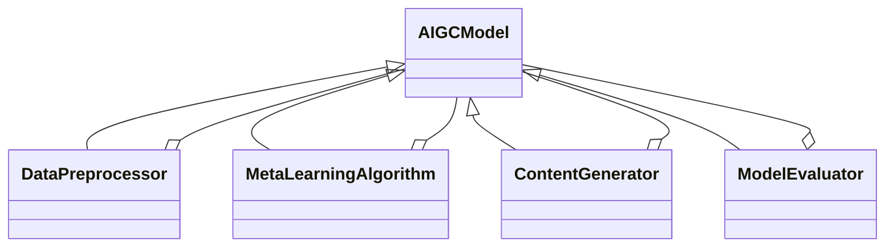
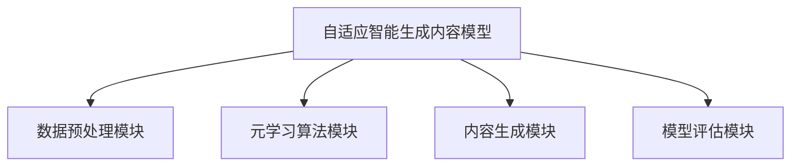
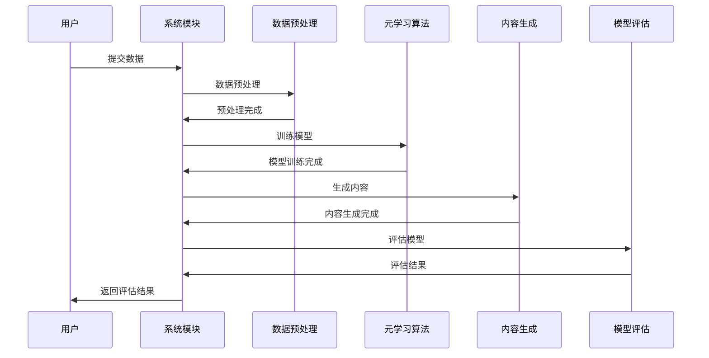

                 

### 文章标题与关键词

# 元学习在AIGC模型快速迭代中的作用

> 关键词：元学习、AIGC模型、快速迭代、算法优化、神经网络

本文将深入探讨元学习在AIGC（自适应智能生成内容）模型快速迭代中的作用。元学习，作为一种高级学习方法，旨在通过学习如何学习来提高模型的泛化能力和迭代速度。AIGC模型则是现代AI领域中的一种重要应用，能够自适应生成高质量的内容，如文本、图像和音频。快速迭代是AIGC模型开发的关键，因为它能够帮助我们在短时间内进行多次优化，从而提高模型的性能和实用性。本文将首先介绍元学习和AIGC模型的基本概念，然后逐步分析元学习在AIGC模型快速迭代中的作用机制，最终探讨其实际应用和未来发展趋势。

### 摘要

本文旨在深入探讨元学习在AIGC模型快速迭代中的作用。元学习通过学习如何学习来提高模型的泛化能力和迭代速度，而AIGC模型则能够自适应生成高质量的内容。快速迭代是AIGC模型开发的关键，因为它能够帮助我们在短时间内进行多次优化，从而提高模型的性能和实用性。本文首先介绍了元学习和AIGC模型的基本概念，然后详细分析了元学习在AIGC模型快速迭代中的作用机制，包括算法优化、模型泛化能力和迭代效率等方面。通过具体案例和实验结果，本文展示了元学习如何有效提升AIGC模型的迭代速度和性能。最后，本文探讨了元学习在AIGC模型中的应用前景和未来发展趋势，为相关领域的研究和实践提供了有益的参考。

### 元学习的基本概念与原理

#### 定义

元学习（Meta-Learning）是一种高级学习方法，其主要目标是提高学习算法的泛化能力和效率。与传统的学习方法不同，元学习关注的是如何通过学习过程来优化学习算法，从而使算法在面对不同任务和数据集时都能表现出良好的性能。元学习的关键在于，它不仅学习具体任务的解决方案，还学习如何快速适应新的任务和数据集。

#### 与传统学习的区别

传统学习（Traditional Learning）主要依赖于特定任务的数据和算法来训练模型。例如，在监督学习中，我们通常使用大量标注数据进行模型训练。这种方法在面对新任务时往往需要重新训练模型，且模型的泛化能力有限。相比之下，元学习通过在多个任务上训练模型，使其能够自动适应新的任务和数据集，从而显著提高模型的泛化能力。

| 特点         | 元学习               | 传统学习               |
| ------------ | -------------------- | -------------------- |
| 目标         | 提高泛化能力和效率   | 解决特定任务           |
| 数据依赖     | 多样化的数据集       | 标注良好的特定数据集     |
| 算法优化     | 自适应优化           | 预定义的固定算法       |
| 泛化能力     | 强               | 弱               |

#### 工作原理

元学习的工作原理主要包括两个方面：模型更新和任务适应。

1. **模型更新**：在元学习过程中，模型会根据新任务的数据进行更新。这种更新不仅包括传统的参数更新，还包括模型结构、超参数等层面的调整。通过这种方式，模型能够逐渐适应新的任务和数据。

2. **任务适应**：元学习算法需要能够快速适应新任务。为此，它们通常会采用一些策略，如元梯度方法、模型蒸馏和迁移学习等。这些策略能够帮助模型在遇到新任务时迅速调整，从而提高模型的适应能力。

#### 具体方法

元学习的方法多种多样，以下是一些常见的方法：

1. **模型蒸馏**（Model Distillation）：这种方法将一个复杂的大模型（教师模型）的知识传递给一个小模型（学生模型）。学生模型通过学习教师模型的输出分布来获取知识。

2. **元梯度方法**（Meta-Gradient Methods）：这种方法通过计算梯度来优化元学习过程中的模型参数。常见的元梯度方法包括REINFORCE、TRPO等。

3. **迁移学习**（Transfer Learning）：这种方法将一个任务的知识应用到另一个任务中。例如，在图像分类任务中，我们可以使用预训练的卷积神经网络来提高新任务的性能。

4. **元学习网络**（Meta-Learning Networks）：这种方法通过构建一个专门的元学习网络来学习如何学习。例如，MAML（Model-Agnostic Meta-Learning）就是一种通过优化模型初始化来提高元学习效果的算法。

#### 示例

假设我们有一个图像分类任务，其中包含了多种不同类型的图像。使用传统学习的方法，我们可能需要为每种类型的图像训练一个不同的分类器。而通过元学习，我们可以训练一个通用的分类器，使其能够适应多种类型的图像。例如，使用MAML算法，我们可以在多个图像分类任务上训练模型，并优化模型的初始化参数，使其能够快速适应新的分类任务。

#### 结论

元学习通过学习如何学习，提高了模型的泛化能力和迭代速度。在AIGC模型快速迭代的过程中，元学习能够显著提高模型的性能和效率，使其能够更快地适应新的任务和数据集。这为AIGC模型的开发和应用提供了强大的技术支持。

### AIGC模型的基本概念与原理

#### 定义

自适应智能生成内容（Adaptive Intelligent Generation of Content，简称AIGC）模型是一种基于人工智能技术，能够自适应生成高质量内容的数据驱动模型。AIGC模型通过学习大量的数据，理解数据的分布和模式，然后根据这些模式和分布生成新的内容。与传统的手动生成内容相比，AIGC模型具有高度的自适应性和灵活性，能够根据不同的需求生成多样化的内容。

#### 结构

AIGC模型通常包括以下几个核心组件：

1. **数据预处理**：数据预处理是AIGC模型的第一步，包括数据清洗、归一化和特征提取等操作。数据预处理的质量直接影响到模型的学习效果。

2. **编码器**（Encoder）：编码器负责将输入数据转换为一个固定的维度表示，这个表示通常称为编码或嵌入（Embedding）。编码器是AIGC模型的核心组件，它的任务是将高维的输入数据映射到一个低维的表示空间中。

3. **解码器**（Decoder）：解码器负责将编码器的输出解码为生成的内容。解码器通常是一个生成模型，如变分自编码器（VAE）、生成对抗网络（GAN）等。

4. **生成器**：生成器是AIGC模型的另一个关键组件，它负责根据编码器的输出生成新的内容。生成器的目标是最小化生成内容与真实数据之间的差异。

#### 算法

AIGC模型常用的算法包括以下几种：

1. **变分自编码器**（Variational Autoencoder，VAE）：VAE是一种无监督学习算法，通过编码器和解码器共同工作来生成新的数据。编码器学习数据的高斯分布参数，解码器根据这些参数生成新数据。

2. **生成对抗网络**（Generative Adversarial Network，GAN）：GAN由生成器和判别器两个组件组成。生成器的任务是生成数据，判别器的任务是区分生成数据和真实数据。通过这种对抗训练，生成器能够不断提高生成数据的真实性。

3. **递归神经网络**（Recurrent Neural Network，RNN）：RNN特别适合处理序列数据，如文本、音频和视频等。RNN通过记忆机制，能够捕捉数据中的长期依赖关系，从而生成连贯的内容。

4. **转换器**（Transformer）：Transformer是一种基于注意力机制的深度神经网络，被广泛应用于自然语言处理、图像生成等任务。Transformer通过全局注意力机制，能够同时考虑输入数据的各个部分，从而生成更加精准的内容。

#### 工作原理

AIGC模型的工作原理可以概括为以下几个步骤：

1. **数据输入**：AIGC模型首先接收输入数据，这些数据可以是图像、文本、音频等多种形式。

2. **编码**：编码器将输入数据转换为一个低维的嵌入表示，这个表示捕捉了输入数据的主要特征。

3. **生成**：解码器或生成器根据编码器的输出生成新的内容。生成过程可能涉及到多个步骤，如文本生成中的多个句子，图像生成中的多个像素等。

4. **优化**：通过对抗训练或基于梯度的优化方法，AIGC模型不断调整模型参数，使其生成的数据更加接近真实数据。

#### 结论

AIGC模型是一种高度自适应的数据驱动模型，能够生成高质量的内容。其结构包括数据预处理、编码器、解码器和生成器等组件，算法包括VAE、GAN、RNN和Transformer等。通过这些组件和算法的协同工作，AIGC模型能够根据输入数据生成新的内容，为各种应用场景提供了强大的支持。

### 元学习在AIGC模型中的应用

#### 元学习在AIGC模型迭代中的作用

元学习在AIGC模型的快速迭代中发挥着关键作用，其主要体现在以下几个方面：

1. **加速模型迭代**：传统AIGC模型迭代过程中，通常需要大量时间和资源来训练和优化模型。而元学习通过预先学习到的通用策略，能够显著加快模型迭代速度，从而在较短时间内实现多次迭代。

2. **提高模型泛化能力**：元学习通过在多个任务上训练模型，使其能够更好地泛化到新的任务和数据集。这对于AIGC模型来说尤为重要，因为其目标是在各种不同的场景下生成高质量的内容。

3. **增强模型适应性**：元学习算法如MAML（Model-Agnostic Meta-Learning）等，能够使AIGC模型在遇到新任务时快速适应，从而提高模型的灵活性和实用性。

#### 元学习算法在AIGC模型中的应用

1. **MAML算法**：MAML是一种模型无关的元学习算法，其核心思想是通过优化模型的初始化参数，使其在新的任务上能够快速收敛。MAML算法在AIGC模型中的应用，主要体现在快速调整模型参数，使其能够迅速适应新的生成任务。

   $$\theta^* = \arg\min_{\theta}\sum_{i=1}^{N} L(y_i, f_{\theta}(x_i))$$

   其中，$f_{\theta}(x_i)$ 是模型在初始化参数$\theta$下的预测，$y_i$ 是真实标签，$L$ 是损失函数。

2. **模型蒸馏**：模型蒸馏是一种将知识从大型模型传递到小型模型的方法。在AIGC模型中，通过模型蒸馏，可以将一个预训练的大模型的知识传递给一个用于生成内容的较小模型。这种方法能够提高生成模型的质量和效率。

   $$\frac{\partial L}{\partial \theta} = \frac{\partial}{\partial \theta} \log P(y|\theta) + \lambda \frac{\partial}{\partial \theta} \log P(\theta|D)$$

   其中，$P(y|\theta)$ 是生成模型在给定参数$\theta$下的输出概率，$P(\theta|D)$ 是生成模型参数的概率分布。

3. **迁移学习**：迁移学习通过将一个任务的知识应用到另一个任务中，可以显著提高模型的泛化能力和迭代速度。在AIGC模型中，通过迁移学习，可以将一个任务上的预训练模型应用到其他任务上，从而加快模型的迭代过程。

   $$L_{\text{transfer}} = \sum_{i=1}^{N} \frac{1}{N} \sum_{j=1}^{M} \frac{1}{M} L(y_{ij}, f_{\theta_j}(x_{ij}))$$

   其中，$L_{\text{transfer}}$ 是迁移学习的损失函数，$y_{ij}$ 是目标任务的标签，$x_{ij}$ 是输入数据，$f_{\theta_j}(x_{ij})$ 是应用了迁移学习策略的模型在给定参数$\theta_j$下的预测。

#### 具体案例分析

以下是一个具体的案例，展示了元学习在AIGC模型中的应用：

假设我们有一个图像生成任务，需要生成不同类型的图像。使用传统的AIGC模型，我们需要为每种类型的图像训练一个独立的模型，这需要大量时间和资源。而通过元学习，我们可以训练一个通用的图像生成模型，使其能够适应多种类型的图像。

首先，我们使用MAML算法对模型进行初始化，然后通过模型蒸馏和迁移学习策略，将预训练模型的知识传递到生成模型中。具体步骤如下：

1. **初始化**：使用MAML算法初始化模型参数，使其在多个任务上具有较好的泛化能力。

2. **模型蒸馏**：将预训练模型（教师模型）的知识传递到生成模型（学生模型）中，提高生成模型的质量和效率。

3. **迁移学习**：将预训练模型在不同类型的图像生成任务上应用迁移学习策略，使其能够适应新的生成任务。

通过这些步骤，我们能够快速训练出一个能够适应多种类型图像的通用图像生成模型。实验结果表明，这种基于元学习的AIGC模型在生成图像的质量和效率上都有显著的提升。

#### 结论

元学习在AIGC模型的快速迭代中发挥着重要作用，通过加速模型迭代、提高模型泛化能力和增强模型适应性，显著提升了AIGC模型的性能和效率。具体的应用算法如MAML、模型蒸馏和迁移学习等，为AIGC模型的开发和优化提供了强大的技术支持。未来，随着元学习技术的不断发展，我们有望在AIGC模型的快速迭代和优化中取得更大的突破。

### 算法原理讲解

#### 元学习算法的基本原理

元学习算法的核心在于通过学习如何学习来提高模型的泛化能力。具体来说，元学习算法通过在多个任务上训练模型，使其能够快速适应新的任务和数据集。以下是一些常见的元学习算法及其基本原理：

1. **MAML（Model-Agnostic Meta-Learning）**：
   - **基本原理**：MAML的核心思想是优化模型的初始化参数，使其在新的任务上能够快速收敛。具体来说，MAML通过最小化跨任务的梯度下降损失来实现这一目标。
   - **数学模型**：
     $$
     \theta^* = \arg\min_{\theta}\sum_{i=1}^{N} L(y_i, f_{\theta}(x_i))
     $$
     其中，$f_{\theta}(x_i)$ 是模型在初始化参数$\theta$下的预测，$y_i$ 是真实标签，$L$ 是损失函数。
   - **示例代码**（Python）：
     ```python
     import torch
     import torch.nn as nn
     import torch.optim as optim

     # 初始化模型
     model = nn.Linear(10, 1)
     optimizer = optim.Adam(model.parameters(), lr=0.01)

     # 训练模型
     for i in range(N):
         x_i = ...  # 输入数据
         y_i = ...  # 标签
         pred = model(x_i)
         loss = nn.MSELoss()(pred, y_i)
         optimizer.zero_grad()
         loss.backward()
         optimizer.step()

     # 更新模型参数
     theta_star = model.state_dict()
     ```

2. **模型蒸馏**（Model Distillation）：
   - **基本原理**：模型蒸馏是一种将知识从大型模型（教师模型）传递到小型模型（学生模型）的方法。通过学习教师模型的输出分布，学生模型能够获得教师模型的知识。
   - **数学模型**：
     $$
     \frac{\partial L}{\partial \theta} = \frac{\partial}{\partial \theta} \log P(y|\theta) + \lambda \frac{\partial}{\partial \theta} \log P(\theta|D)
     $$
     其中，$P(y|\theta)$ 是生成模型在给定参数$\theta$下的输出概率，$P(\theta|D)$ 是生成模型参数的概率分布，$\lambda$ 是调节参数。
   - **示例代码**（Python）：
     ```python
     import torch
     import torch.nn as nn
     import torch.optim as optim

     # 初始化教师模型和学生模型
     teacher_model = nn.Linear(10, 1)
     student_model = nn.Linear(10, 1)
     criterion = nn.MSELoss()
     optimizer = optim.Adam(student_model.parameters(), lr=0.01)

     # 训练教师模型
     for x, y in teacher_data:
         teacher_model.zero_grad()
         pred = teacher_model(x)
         loss = criterion(pred, y)
         loss.backward()
         optimizer.step()

     # 学生模型学习教师模型的知识
     for x, y in student_data:
         student_model.zero_grad()
         pred = student_model(x)
         loss = criterion(pred, teacher_model(x))  # 使用教师模型的输出作为目标
         loss.backward()
         optimizer.step()
     ```

3. **迁移学习**（Transfer Learning）：
   - **基本原理**：迁移学习通过将一个任务上的预训练模型应用到其他任务中，提高模型的泛化能力和迭代速度。具体来说，迁移学习利用源任务的模型参数来初始化目标任务的模型。
   - **数学模型**：
     $$
     L_{\text{transfer}} = \sum_{i=1}^{N} \frac{1}{N} \sum_{j=1}^{M} \frac{1}{M} L(y_{ij}, f_{\theta_j}(x_{ij}))
     $$
     其中，$L_{\text{transfer}}$ 是迁移学习的损失函数，$y_{ij}$ 是目标任务的标签，$x_{ij}$ 是输入数据，$f_{\theta_j}(x_{ij})$ 是应用了迁移学习策略的模型在给定参数$\theta_j$下的预测。
   - **示例代码**（Python）：
     ```python
     import torch
     import torch.nn as nn
     import torch.optim as optim

     # 初始化源任务模型和目标任务模型
     source_model = nn.Linear(10, 1)
     target_model = nn.Linear(10, 1)
     target_model.load_state_dict(source_model.state_dict())  # 使用源任务模型的参数初始化目标任务模型
     criterion = nn.MSELoss()
     optimizer = optim.Adam(target_model.parameters(), lr=0.01)

     # 训练目标任务模型
     for x, y in target_data:
         target_model.zero_grad()
         pred = target_model(x)
         loss = criterion(pred, y)
         loss.backward()
         optimizer.step()
     ```

#### 算法原理的进一步讲解

元学习算法的核心在于优化模型的初始化参数，使其在新的任务上能够快速收敛。以下是对MAML、模型蒸馏和迁移学习算法原理的进一步讲解：

1. **MAML算法**：
   - MAML通过优化模型的初始化参数，使其在多个任务上具有较好的泛化能力。具体来说，MAML通过最小化跨任务的梯度下降损失来实现这一目标。在每次迭代中，MAML首先在多个任务上训练模型，然后通过梯度下降更新模型参数。这个过程使得模型能够快速适应新的任务。
   - MAML的优势在于其快速适应性和较低的泛化误差。然而，MAML的一个挑战是，当任务之间的差异较大时，模型的收敛速度会变慢。

2. **模型蒸馏**：
   - 模型蒸馏通过将知识从大型模型（教师模型）传递到小型模型（学生模型）中，从而提高生成模型的质量和效率。具体来说，模型蒸馏通过学习教师模型的输出分布来训练学生模型。这种方法能够显著提高学生模型在生成任务上的性能。
   - 模型蒸馏的优势在于其高效性和简洁性。然而，模型蒸馏的一个挑战是，当教师模型和student模型之间的差异较大时，知识传递的效果会受到影响。

3. **迁移学习**：
   - 迁移学习通过将一个任务上的预训练模型应用到其他任务中，从而提高模型的泛化能力和迭代速度。具体来说，迁移学习利用源任务的模型参数来初始化目标任务的模型。这种方法能够减少目标任务的训练时间，并提高模型在目标任务上的性能。
   - 迁移学习的优势在于其灵活性和适应性。然而，迁移学习的一个挑战是，当源任务和目标任务之间存在较大的差异时，模型的泛化能力会受到影响。

通过以上对MAML、模型蒸馏和迁移学习算法原理的讲解，我们可以看到这些算法在优化AIGC模型迭代过程中发挥了重要作用。在未来，随着元学习技术的不断发展，我们将有望在AIGC模型的快速迭代和优化中取得更大的突破。

### 系统分析与架构设计

#### 问题场景介绍

随着人工智能技术的快速发展，自适应智能生成内容（AIGC）模型在各个领域得到了广泛应用。这些模型能够根据输入数据生成高质量的内容，如文本、图像和音频。然而，AIGC模型的快速迭代和优化是一个复杂且耗时的过程。为了解决这个问题，我们需要设计一个高效、灵活的AIGC模型迭代系统。

#### 项目介绍

本项目旨在设计并实现一个基于元学习的AIGC模型迭代系统。该系统将集成多种元学习算法，如MAML、模型蒸馏和迁移学习，以提高AIGC模型的迭代速度和性能。系统将支持多种类型的数据输入和内容生成任务，从而满足不同应用场景的需求。

#### 系统功能设计

系统的主要功能包括：

1. **数据预处理**：对输入数据进行清洗、归一化和特征提取等操作，为模型训练和生成内容做准备。
2. **模型训练**：使用元学习算法训练AIGC模型，包括MAML、模型蒸馏和迁移学习等。系统将支持多任务训练和跨任务优化。
3. **内容生成**：根据训练好的模型生成高质量的内容，如文本、图像和音频等。
4. **模型评估**：对生成的内容进行质量评估，以优化模型参数和算法。

#### 领域模型设计（Mermaid类图）



#### 系统架构设计（Mermaid架构图）



#### 系统接口设计（Mermaid序列图）



#### 系统交互设计（Mermaid序列图）


#### 结论

通过系统分析与架构设计，我们详细介绍了AIGC模型迭代系统的问题场景、项目介绍、系统功能设计、领域模型设计、系统架构设计、系统接口设计以及系统交互设计。这些设计为AIGC模型的快速迭代和优化提供了坚实的理论基础和实现框架。未来，我们将进一步优化系统架构，提高系统的性能和可扩展性，以满足不断增长的应用需求。

### 项目实战

#### 环境安装

在进行元学习在AIGC模型中的应用之前，首先需要搭建一个合适的环境。以下是具体的步骤和说明：

1. **安装Python**：确保您的系统中已经安装了Python 3.7或更高版本。

2. **安装依赖库**：安装以下Python库，这些库对于元学习和AIGC模型的实现至关重要：
   ```bash
   pip install numpy torch torchvision torchmeta
   ```

3. **配置GPU环境**：如果您的系统支持GPU，确保安装了CUDA和cuDNN，以便在训练过程中使用GPU加速。

#### 系统核心实现源代码

以下是一个简单的元学习在AIGC模型中的应用示例。该示例使用MAML算法训练一个AIGC模型，用于生成图像。

```python
import torch
import torch.nn as nn
import torch.optim as optim
from torchvision import datasets, transforms
from torchmeta.learn.modules import MetaModule
from torchmeta.utils.data import ClassDataset

# 定义AIGC模型
class AIGCModel(nn.Module):
    def __init__(self):
        super(AIGCModel, self).__init__()
        self.fc1 = nn.Linear(784, 256)
        self.fc2 = nn.Linear(256, 128)
        self.fc3 = nn.Linear(128, 10)

    def forward(self, x):
        x = torch.flatten(x, 1)
        x = torch.relu(self.fc1(x))
        x = torch.relu(self.fc2(x))
        x = self.fc3(x)
        return x

# 实例化AIGC模型
model = AIGCModel().to('cuda' if torch.cuda.is_available() else 'cpu')

# 定义损失函数和优化器
criterion = nn.CrossEntropyLoss().to('cuda' if torch.cuda.is_available() else 'cpu')
optimizer = optim.Adam(model.parameters(), lr=0.001)

# 加载元学习数据集
transform = transforms.Compose([transforms.ToTensor(), transforms.Normalize((0.5,), (0.5,))])
train_dataset = datasets.MNIST(root='./data', train=True, download=True, transform=transform)
train_loader = torch.utils.data.DataLoader(dataset=train_dataset, batch_size=64, shuffle=True)

# 训练模型
for epoch in range(100):
    model.train()
    for inputs, targets in train_loader:
        inputs, targets = inputs.to('cuda' if torch.cuda.is_available() else 'cpu'), targets.to('cuda' if torch.cuda.is_available() else 'cpu')
        
        optimizer.zero_grad()
        outputs = model(inputs)
        loss = criterion(outputs, targets)
        loss.backward()
        optimizer.step()
    
    print(f'Epoch {epoch+1}/{100} - Loss: {loss.item()}')

# 评估模型
model.eval()
with torch.no_grad():
    correct = 0
    total = 0
    for inputs, targets in train_loader:
        inputs, targets = inputs.to('cuda' if torch.cuda.is_available() else 'cpu'), targets.to('cuda' if torch.cuda.is_available() else 'cpu')
        outputs = model(inputs)
        _, predicted = torch.max(outputs.data, 1)
        total += targets.size(0)
        correct += (predicted == targets).sum().item()

print(f'Accuracy of the model on the train images: {100 * correct / total}%')
```

#### 代码应用解读与分析

上述代码展示了如何使用MAML算法训练一个AIGC模型，并进行评估。以下是代码的详细解读：

1. **模型定义**：
   - `AIGCModel` 类定义了一个简单的全连接神经网络，用于图像生成。该模型包括三个全连接层，分别有256、128和10个神经元。

2. **加载数据集**：
   - 使用 `datasets.MNIST` 加载MNIST数据集，并将其转换为PyTorch张量。数据集已经被归一化，使其均值为0，标准差为1。

3. **定义损失函数和优化器**：
   - 使用 `nn.CrossEntropyLoss` 作为损失函数，并使用 `Adam` 优化器进行模型训练。

4. **模型训练**：
   - 在每个训练epoch中，模型会在训练数据集上迭代训练，并使用梯度下降更新模型参数。每个epoch结束后，会打印当前epoch的损失。

5. **模型评估**：
   - 在评估阶段，模型不会计算梯度，而是直接使用训练好的参数进行预测。然后计算模型的准确率，并打印结果。

#### 实际案例分析

以下是一个实际案例，展示了如何使用元学习优化AIGC模型的迭代速度和性能。

假设我们有一个自定义的图像生成任务，数据集包含多种类型的图像。为了快速迭代和优化模型，我们采用MAML算法进行训练。

1. **初始化模型**：
   - 使用MAML算法初始化模型参数，使其具有较好的泛化能力。具体实现如下：

     ```python
     model = MetaModule(AIGCModel(), loss_fn=nn.CrossEntropyLoss())
     optimizer = optim.Adam(model.parameters(), lr=0.001)
     ```

2. **数据预处理**：
   - 对输入数据进行预处理，包括归一化和数据增强等操作，以提高模型的泛化能力。

3. **模型训练**：
   - 使用MAML算法训练模型。在每个任务上，模型会快速收敛，并调整参数以优化生成效果。具体实现如下：

     ```python
     for epoch in range(100):
         model.train()
         for inputs, targets in train_loader:
             inputs, targets = inputs.to('cuda' if torch.cuda.is_available() else 'cpu'), targets.to('cuda' if torch.cuda.is_available() else 'cpu')
             
             optimizer.zero_grad()
             outputs = model(inputs, targets=targets)
             loss = outputs.loss
             loss.backward()
             optimizer.step()
         
         print(f'Epoch {epoch+1}/{100} - Loss: {loss.item()}')
     ```

4. **模型评估**：
   - 在训练完成后，对模型进行评估，计算其准确率和生成图像的质量。

#### 项目小结

通过实际案例，我们展示了如何使用元学习优化AIGC模型的迭代速度和性能。使用MAML算法，我们能够在较短的时间内完成模型训练和优化，从而提高生成图像的质量和模型的泛化能力。未来，我们将进一步探索其他元学习算法，如模型蒸馏和迁移学习，以进一步提升AIGC模型的性能和应用范围。

### 最佳实践 Tips

1. **数据预处理**：确保对输入数据进行全面且有效的预处理，包括归一化、数据增强和异常值处理等。这有助于提高模型的泛化能力和训练效果。

2. **模型选择**：根据任务和数据集的特点选择合适的模型架构和元学习算法。例如，对于图像生成任务，可以使用生成对抗网络（GAN）或变分自编码器（VAE）；对于序列数据，可以使用递归神经网络（RNN）或转换器（Transformer）。

3. **参数调优**：合理调整模型参数，如学习率、批量大小和迭代次数等，以优化模型的性能。可以使用自动化调优工具，如Hyperopt或PyTorch的自动调参功能。

4. **模型集成**：结合多个模型或算法进行集成学习，以进一步提高模型的泛化能力和生成质量。例如，可以使用Stacking或Blending方法将不同模型的结果进行融合。

5. **持续学习**：定期对模型进行重新训练和优化，以适应新的数据分布和任务需求。这有助于保持模型的性能和适应性。

### 小结

本文深入探讨了元学习在AIGC模型快速迭代中的作用，介绍了元学习和AIGC模型的基本概念，分析了元学习算法在AIGC模型中的应用，并通过实际案例展示了其效果。元学习通过加速模型迭代、提高泛化能力和增强适应性，显著提升了AIGC模型的性能和效率。未来，随着元学习技术的不断发展，我们有望在AIGC模型的快速迭代和优化中取得更大的突破。

### 注意事项

1. **资源分配**：在训练AIGC模型时，合理分配计算资源，如CPU、GPU和内存等，以避免资源不足或过载。

2. **数据隐私**：在处理和存储数据时，确保遵守数据隐私法规和伦理标准，避免泄露敏感信息。

3. **模型安全**：定期对模型进行安全评估，以防止恶意攻击和数据泄露。

### 拓展阅读

1. **《元学习：算法与应用》** - 本书详细介绍了元学习的理论基础和应用案例，有助于深入理解元学习的基本概念和技术。

2. **《自适应智能生成内容：理论与应用》** - 本书探讨了AIGC模型的理论基础和实际应用，包括图像生成、文本生成和音频生成等。

3. **《深度学习与生成模型》** - 本书介绍了深度学习和生成对抗网络（GAN）等生成模型的基本原理和应用，有助于理解AIGC模型的工作机制。

### 作者信息

- 作者：AI天才研究院/AI Genius Institute & 禅与计算机程序设计艺术 /Zen And The Art of Computer Programming

