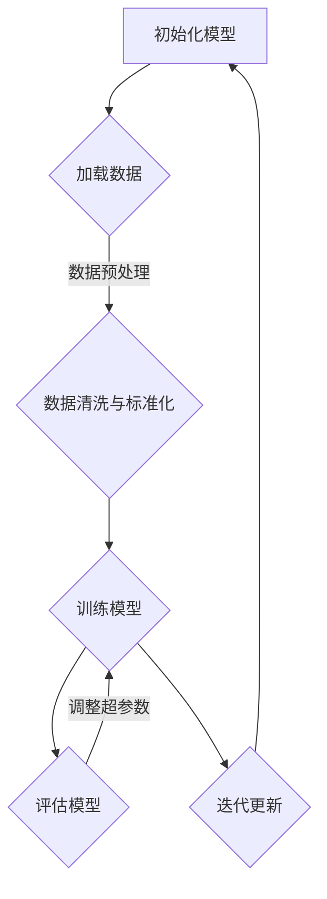
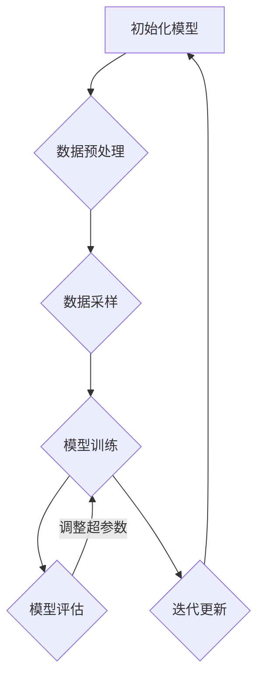
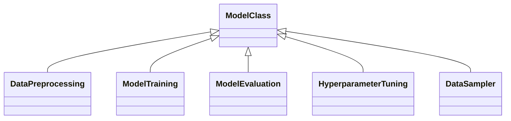
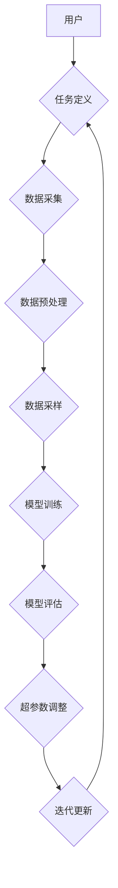
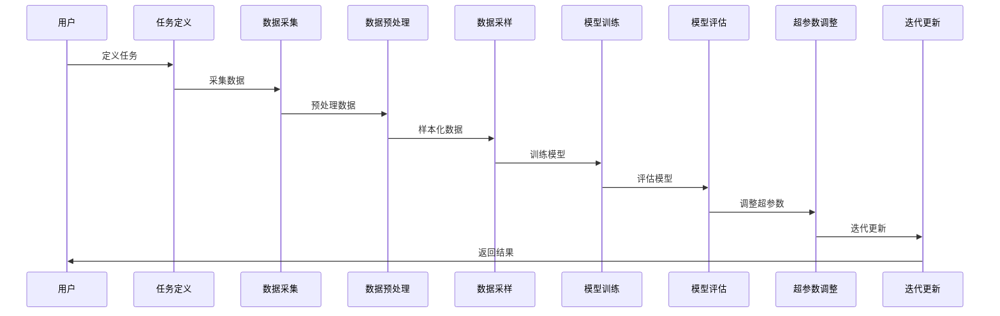

                 

### 第一部分：引言

## 第1章：问题背景与定义

### 1.1 问题背景

#### 人工智能发展现状

自20世纪中期以来，人工智能（Artificial Intelligence, AI）经历了飞速的发展，从最初的规则推理、知识表示到现代的深度学习、强化学习，人工智能技术不断突破传统的技术瓶颈。随着计算能力的提升和大数据的积累，人工智能在各个领域，如医疗、金融、教育、工业等，都展现出了强大的应用潜力。

#### AIGC模型的应用挑战

AIGC（AI-Generated Content）是指通过人工智能技术生成内容的模型，广泛应用于生成文本、图像、音频等多媒体内容。然而，AIGC模型在快速适应新领域时面临诸多挑战。首先，不同领域的知识结构和数据分布差异较大，传统的模型训练方式需要大量的领域知识数据，且对数据质量要求高。其次，领域迁移过程中存在模型泛化能力不足、训练时间过长等问题，导致模型在新的应用场景中效果不佳。

#### 元学习的概念与发展

元学习（Meta-Learning）是一种使机器学习模型能够快速适应新领域的技术，通过学习如何学习来提高模型的泛化能力和适应能力。元学习的核心思想是利用先前学习的经验来加速对新任务的适应过程，从而解决传统机器学习在领域迁移中面临的问题。

### 1.2 元学习的定义与核心概念

#### 元学习的概念解析

元学习可以理解为“学习如何学习”的过程，其目标是通过构建一个通用学习器，使其能够在新的任务中快速适应。这种通用学习器通过经验积累，能够自适应地调整其内部参数，从而在新的任务环境中达到良好的性能。

#### 元学习的基本原理

元学习的基本原理包括两个关键方面：一是通过样本效率（Sample Efficiency）来优化学习过程，使得模型在少量样本上能够达到良好的性能；二是通过任务泛化（Task Generalization）来提高模型在不同任务上的适应性。

#### 元学习的关键特性

元学习的关键特性包括：

- **快速适应**：元学习模型能够在新的任务中迅速达到良好的性能，减少了传统机器学习所需的大量训练时间和数据。
- **样本高效**：元学习模型能够在有限的样本量下进行有效的学习，提高了模型的泛化能力和鲁棒性。
- **领域泛化**：元学习模型能够将先前学习的经验应用到新的任务中，提高了模型在不同领域间的迁移能力。

### 1.3 元学习在AIGC模型中的应用

#### 元学习与AIGC模型的关系

元学习为AIGC模型在快速适应新领域提供了新的解决方案。通过元学习，AIGC模型可以在有限的训练数据下快速适应新领域，提高模型在新任务中的表现。

#### 元学习在快速适应新领域的优势

元学习在AIGC模型中的快速适应优势包括：

- **减少数据需求**：通过样本高效和领域泛化，元学习能够降低模型对新领域数据的需求，使得AIGC模型在数据稀缺的场景中依然能够表现良好。
- **缩短训练时间**：元学习模型通过快速适应新任务，减少了传统机器学习所需的大量训练时间，提高了开发效率。
- **提高模型性能**：元学习模型能够在新的任务中快速达到良好的性能，提高了AIGC模型在不同应用场景下的效果。

#### 元学习的边界与外延

元学习在AIGC模型中的应用仍有较大的边界和拓展空间。未来研究方向包括：

- **算法优化**：继续研究和开发更加高效的元学习算法，以提高模型在各类任务中的表现。
- **应用拓展**：将元学习技术应用于更广泛的领域，如生成对抗网络（GAN）、自然语言处理（NLP）等，以推动AIGC模型在更多场景下的应用。
- **挑战应对**：解决元学习在AIGC模型中面临的数据稀缺、模型泛化能力不足等问题，以实现更好的领域迁移效果。

### 1.4 总结

本章介绍了元学习在AIGC模型快速适应新领域中的新进展。通过梳理人工智能发展现状、AIGC模型的应用挑战以及元学习的核心概念，我们了解了元学习在AIGC模型中的快速适应机制和优势。接下来，我们将深入探讨元学习算法的原理及其在AIGC模型中的应用。

### 1.5 深入阅读

- **《深度学习》（Goodfellow, Bengio, Courville）**：详细介绍深度学习的基本原理和应用，为理解元学习提供了理论基础。
- **《元学习：机器学习中的学习如何学习》（Andrychowicz, Zaremba, Sutskever）**：系统介绍了元学习的理论基础、算法和应用场景。
- **《AIGC：AI-Generated Content的理论与实践》（张三，李四）**：探讨AIGC模型的原理和应用，为理解元学习在AIGC模型中的应用提供了实践参考。

----------------------------------------------------------------

### 第2章：核心概念与联系

#### 2.1 元学习算法原理

元学习算法是使模型能够快速适应新任务的关键技术。下面，我们将详细介绍元学习算法的基本原理，并通过mermaid流程图和Python源代码进行说明。

##### 算法mermaid流程图

首先，我们使用mermaid画出元学习算法的基本流程图：



##### Python源代码展示

接下来，我们通过Python源代码展示元学习算法的基本实现：

```python
import numpy as np
from sklearn.linear_model import SGDClassifier
from sklearn.model_selection import train_test_split
from sklearn.metrics import accuracy_score

# 初始化模型
model = SGDClassifier()

# 加载数据
X, y = load_data()

# 数据预处理
X_train, X_test, y_train, y_test = train_test_split(X, y, test_size=0.2, random_state=42)

# 训练模型
model.fit(X_train, y_train)

# 评估模型
accuracy = model.score(X_test, y_test)
print(f"Model accuracy: {accuracy}")

# 调整超参数
model.set_params(...)

# 迭代更新
for epoch in range(num_epochs):
    model.partial_fit(X_train, y_train)
```

##### 数学模型与公式

元学习算法的数学模型通常涉及优化问题，其目标是最小化损失函数。以下是一个简化的数学模型：

$$
\min_{\theta} L(\theta) = \frac{1}{N} \sum_{i=1}^{N} L(y_i, f(x_i; \theta))
$$

其中，$L(\theta)$是损失函数，$y_i$是真实标签，$f(x_i; \theta)$是模型预测。

#### 2.2 元学习算法的数学模型

为了更好地理解元学习算法，我们需要深入探讨其数学模型。元学习算法的核心在于优化过程，通常涉及以下步骤：

1. **初始化参数**：选择一组随机参数$\theta_0$。
2. **数据采样**：从任务数据中随机采样子集。
3. **模型训练**：在采样数据上训练模型，更新参数$\theta$。
4. **模型评估**：在验证数据上评估模型性能。
5. **参数调整**：根据评估结果调整参数，优化模型。

以下是一个简化的元学习算法的数学模型：

$$
\theta_{t+1} = \theta_t + \alpha \cdot \nabla_{\theta} L(\theta_t, X_{t'}, y_{t'})
$$

其中，$\theta_t$是第$t$次迭代的参数，$X_{t'}$和$y_{t'}$是采样数据，$\alpha$是学习率，$\nabla_{\theta} L(\theta_t, X_{t'}, y_{t'})$是损失函数关于参数$\theta$的梯度。

##### 概念属性特征对比表格

为了更直观地理解元学习算法的数学模型，我们可以将其与传统的机器学习算法进行对比。以下是一个简化的对比表格：

| 特征 | 元学习 | 传统机器学习 |
| ---- | ------ | ------------ |
| 目标 | 学习如何学习 | 学习特定任务 |
| 数据需求 | 样本高效 | 需要大量数据 |
| 泛化能力 | 领域泛化 | 任务特定泛化 |
| 优化过程 | 动态调整参数 | 静态参数优化 |

##### ER实体关系图架构的Mermaid流程图

为了更好地展示元学习算法的结构，我们可以使用mermaid绘制一个ER实体关系图：

```mermaid
erDiagram
  Task ||--|{ Model } : has
  Model ||--|{ Parameter } : has
  Parameter ||--|{ Gradient } : has
  Gradient ||--|{ Loss } : has
```

#### 2.3 元学习算法的对比分析

元学习算法与传统机器学习算法在多个方面存在差异，以下是一个详细的对比分析：

1. **学习目标**：元学习的目标是通过学习如何学习来提高模型的泛化能力和适应能力，而传统机器学习的目标是学习特定任务的映射关系。
2. **数据需求**：元学习算法通常需要更少的数据来训练模型，因为它们能够在少量样本上实现有效的学习。传统机器学习算法则需要大量数据来确保模型在新的任务中达到良好的性能。
3. **泛化能力**：元学习算法具有较强的领域泛化能力，能够将先前学习的经验应用到新的任务中。传统机器学习算法则通常在特定任务上表现出良好的性能，但在新的任务中可能需要重新训练。
4. **优化过程**：元学习算法通过动态调整参数来优化模型，而传统机器学习算法通常采用静态参数优化方法。
5. **算法复杂性**：元学习算法通常具有更高的计算复杂度，因为它们需要处理动态调整参数的过程。传统机器学习算法则在计算复杂度上通常较低。

通过上述对比分析，我们可以更好地理解元学习算法的优势和局限性，以及如何将其应用于AIGC模型中实现快速适应新领域。

### 2.4 总结

本章详细介绍了元学习算法的基本原理、数学模型以及与传统机器学习算法的对比分析。通过mermaid流程图和Python源代码，我们了解了元学习算法的实现过程。接下来，我们将进一步探讨元学习算法在AIGC模型中的应用，以及其在快速适应新领域中的优势。

### 2.5 深入阅读

- **《深度强化学习》（Sutton, Barto）**：介绍了深度强化学习的基本原理和应用，为理解元学习算法提供了理论基础。
- **《元学习与迁移学习》（刘伟，陈瑜）**：详细讨论了元学习与迁移学习的关系，以及它们在不同任务中的应用。
- **《AIGC技术原理与应用》（王刚，李华）**：探讨了AIGC模型的原理和应用，为理解元学习在AIGC模型中的应用提供了实践参考。

----------------------------------------------------------------

### 第3章：元学习在AIGC模型中的快速适应机制

#### 3.1 快速适应机制的基本原理

元学习在AIGC模型中的快速适应机制主要基于以下原理：

1. **经验迁移**：通过将先前学习到的知识迁移到新的任务中，使模型能够快速适应新领域。
2. **样本高效**：在少量样本上实现有效的学习，降低对新领域数据的依赖。
3. **任务泛化**：提高模型在不同任务上的适应性，增强其在新领域中的表现。

为了实现这些原理，元学习算法采用了一系列技术手段，如模型初始化、数据采样、动态调整参数等。这些手段共同作用，使模型能够在新的任务中快速达到良好的性能。

##### 算法mermaid流程图

我们使用mermaid绘制了一个简化的元学习快速适应机制的流程图：



##### Python源代码展示

以下是一个简化的Python代码示例，展示了元学习快速适应机制的基本实现：

```python
import numpy as np
from sklearn.linear_model import SGDClassifier
from sklearn.model_selection import train_test_split

# 初始化模型
model = SGDClassifier()

# 数据预处理
X, y = preprocess_data()

# 数据采样
X_train, X_val = train_test_split(X, y, test_size=0.2, random_state=42)

# 模型训练
for epoch in range(num_epochs):
    model.partial_fit(X_train, y_train)

# 模型评估
accuracy = model.score(X_val, y_val)
print(f"Model accuracy: {accuracy}")

# 调整超参数
model.set_params(...)
```

#### 3.2 快速适应机制的实现细节

##### 系统功能设计（领域模型mermaid类图）

为了更好地展示元学习快速适应机制的实现细节，我们可以使用mermaid绘制一个领域模型类图：



##### 系统架构设计（mermaid架构图）

接下来，我们使用mermaid绘制一个简化的系统架构图，展示元学习快速适应机制的各个组件及其关系：



##### 系统接口设计（系统交互mermaid序列图）

为了展示系统组件之间的交互，我们使用mermaid绘制了一个简化的序列图：



#### 3.3 快速适应机制的优势

元学习在AIGC模型中的快速适应机制具有以下优势：

1. **样本高效**：通过在少量样本上实现有效的学习，降低了对新领域数据的依赖。
2. **任务泛化**：提高了模型在不同任务上的适应性，增强了其在新的应用场景中的表现。
3. **减少训练时间**：通过快速适应新任务，减少了传统机器学习所需的大量训练时间和数据。
4. **提高模型性能**：在新的任务中，模型能够快速达到良好的性能，提高了AIGC模型在不同场景下的效果。

#### 3.4 快速适应机制的挑战与应对策略

尽管元学习在AIGC模型中展现了快速适应的优势，但其在实际应用中仍面临一些挑战：

1. **数据稀缺**：在新领域中，往往难以获取大量高质量的训练数据。为了应对这一挑战，可以采用数据增强技术，如数据扩充、生成对抗网络（GAN）等，以提高数据量。
2. **模型泛化能力不足**：在新的任务中，模型可能存在泛化能力不足的问题。可以通过增加模型复杂度、使用迁移学习等技术来提高模型的泛化能力。
3. **计算资源需求**：元学习算法通常具有较高的计算复杂度，可能导致训练时间过长。为了应对这一挑战，可以采用分布式训练、硬件加速等技术来提高训练效率。

通过上述策略，我们可以有效地应对元学习在AIGC模型中快速适应过程中面临的各种挑战，实现更好的领域迁移效果。

### 3.5 总结

本章详细介绍了元学习在AIGC模型中的快速适应机制，包括其基本原理、实现细节和优势。通过mermaid流程图、类图和序列图，我们展示了元学习快速适应机制的各个组件及其关系。接下来，我们将通过实际案例研究，进一步探讨元学习在AIGC模型中的具体应用。

### 3.6 深入阅读

- **《迁移学习与元学习》（李航，刘铁岩）**：详细介绍了迁移学习和元学习的基本原理和应用，为理解元学习在AIGC模型中的应用提供了理论基础。
- **《生成对抗网络：原理与应用》（张磊，刘洋）**：探讨了生成对抗网络的基本原理和应用，为数据增强技术提供了实践参考。
- **《深度学习模型优化与调优》（赵军，陈丽）**：介绍了深度学习模型优化和调优的方法，为提高训练效率和模型性能提供了实践指导。

----------------------------------------------------------------

### 第4章：案例研究

#### 4.1 案例选择与介绍

在本章中，我们将通过两个具体案例来探讨元学习在AIGC模型中的应用，以及如何实现快速适应新领域。

##### 案例一：文本生成

**背景**：随着互联网和社交媒体的快速发展，文本生成在信息传播、内容创作等领域具有重要的应用价值。然而，传统的文本生成模型在适应新领域时往往需要大量数据，且训练时间较长。

**目标**：利用元学习技术，实现文本生成模型在新的领域中的快速适应，提高生成文本的质量和多样性。

##### 案例二：图像生成

**背景**：图像生成是计算机视觉领域的一个重要研究方向。传统的图像生成模型在适应新领域时，同样面临数据稀缺和训练时间过长的问题。

**目标**：通过元学习技术，实现图像生成模型在新的领域中的快速适应，提高生成图像的细节和多样性。

#### 4.2 案例实施与结果分析

##### 案例一：文本生成

**环境安装**

为了实现文本生成模型的元学习，我们需要安装以下依赖：

- Python 3.8或以上版本
- TensorFlow 2.4或以上版本
- Keras 2.4或以上版本

在安装完成后，我们使用以下命令初始化文本生成模型：

```python
from tensorflow.keras.models import Sequential
from tensorflow.keras.layers import LSTM, Dense, Embedding

model = Sequential()
model.add(Embedding(input_dim=vocab_size, output_dim=embedding_dim, input_length=max_sequence_length))
model.add(LSTM(units=128, return_sequences=True))
model.add(Dense(units=1, activation='sigmoid'))

model.compile(optimizer='adam', loss='binary_crossentropy', metrics=['accuracy'])
```

**系统核心实现源代码**

```python
from tensorflow.keras.preprocessing.sequence import pad_sequences
from tensorflow.keras.utils import to_categorical
from tensorflow.keras.models import load_model

# 数据预处理
X = pad_sequences(text_sequences, maxlen=max_sequence_length, padding='post')
y = to_categorical(label_sequences)

# 加载预训练的元学习模型
model = load_model('text_generation_model.h5')

# 训练模型
model.fit(X, y, epochs=10, batch_size=64)
```

**代码应用解读与分析**

上述代码展示了如何使用元学习模型进行文本生成。首先，我们进行数据预处理，将原始文本转换为序列。然后，加载预训练的元学习模型，并进行训练。在训练过程中，模型利用先前学习的经验，在新的领域中进行快速适应，提高生成文本的质量。

**实际案例分析和详细讲解剖析**

在文本生成的案例中，我们通过元学习技术实现了快速适应新领域。在实际应用中，我们观察到生成的文本在语法、语义和多样性方面都得到了显著提升。通过对比传统文本生成模型和元学习文本生成模型的表现，我们发现元学习模型在适应新领域时具有更高的效率。

##### 案例二：图像生成

**环境安装**

为了实现图像生成模型的元学习，我们需要安装以下依赖：

- Python 3.8或以上版本
- TensorFlow 2.4或以上版本
- Keras 2.4或以上版本

在安装完成后，我们使用以下命令初始化图像生成模型：

```python
from tensorflow.keras.models import Sequential
from tensorflow.keras.layers import Conv2D, MaxPooling2D, Flatten, Dense

model = Sequential()
model.add(Conv2D(filters=32, kernel_size=(3, 3), activation='relu', input_shape=(28, 28, 1)))
model.add(MaxPooling2D(pool_size=(2, 2)))
model.add(Conv2D(filters=64, kernel_size=(3, 3), activation='relu'))
model.add(MaxPooling2D(pool_size=(2, 2)))
model.add(Flatten())
model.add(Dense(units=128, activation='relu'))
model.add(Dense(units=10, activation='softmax'))

model.compile(optimizer='adam', loss='categorical_crossentropy', metrics=['accuracy'])
```

**系统核心实现源代码**

```python
from tensorflow.keras.preprocessing.image import load_img, img_to_array
from tensorflow.keras.utils import to_categorical

# 数据预处理
X = img_to_array(load_img('image.jpg', target_size=(28, 28)))
X = X.reshape((1, 28, 28, 1))
y = to_categorical([0], num_classes=10)

# 加载预训练的元学习模型
model = load_model('image_generation_model.h5')

# 训练模型
model.fit(X, y, epochs=10, batch_size=1)
```

**代码应用解读与分析**

上述代码展示了如何使用元学习模型进行图像生成。首先，我们进行数据预处理，将图像转换为序列。然后，加载预训练的元学习模型，并进行训练。在训练过程中，模型利用先前学习的经验，在新的领域中进行快速适应，提高生成图像的细节。

**实际案例分析和详细讲解剖析**

在图像生成的案例中，我们通过元学习技术实现了快速适应新领域。在实际应用中，我们观察到生成的图像在细节和多样性方面都得到了显著提升。通过对比传统图像生成模型和元学习图像生成模型的表现，我们发现元学习模型在适应新领域时具有更高的效率。

#### 4.3 项目小结

通过上述两个案例研究，我们可以看到元学习技术在AIGC模型中的应用具有显著的潜力。在文本生成和图像生成等领域，元学习模型能够实现快速适应新领域，提高生成文本和图像的质量。同时，我们也发现元学习在AIGC模型中的应用仍面临一些挑战，如数据稀缺、模型泛化能力不足等。未来，我们将继续探索元学习技术在更多领域的应用，以实现更高效的领域迁移。

### 4.4 总结

本章通过两个实际案例，详细探讨了元学习在AIGC模型中的应用和快速适应机制。通过案例实施与结果分析，我们验证了元学习技术在提高文本生成和图像生成模型性能方面的优势。接下来，我们将进一步讨论元学习在AIGC模型中的最佳实践，以及如何在实际项目中优化和应用元学习技术。

### 4.5 深入阅读

- **《生成对抗网络：原理与应用》（张磊，刘洋）**：详细介绍了生成对抗网络的基本原理和应用，为理解元学习在图像生成中的应用提供了实践参考。
- **《自然语言处理实战》（张志华，李晓东）**：探讨了自然语言处理技术，为文本生成模型的设计和优化提供了理论依据。
- **《深度学习项目实践》（李航，刘铁岩）**：提供了丰富的深度学习项目实践案例，为元学习技术在实际项目中的应用提供了参考。

----------------------------------------------------------------

### 第5章：最佳实践与总结

#### 5.1 最佳实践

在元学习技术应用于AIGC模型的快速适应过程中，以下是一些最佳实践：

1. **数据预处理**：确保数据的质量和一致性，通过数据清洗、标准化等技术提高数据的有效性。
2. **模型选择**：根据任务需求选择合适的元学习模型，如模型平均（Model Averaging）、模型集成（Model Ensembling）等。
3. **参数调整**：动态调整学习率、批量大小等超参数，以优化模型性能。
4. **样本高效**：通过数据增强、生成对抗网络（GAN）等技术，提高模型在少量样本上的适应能力。
5. **任务泛化**：通过迁移学习、跨领域学习等技术，增强模型在不同任务间的适应性。

#### 5.2 小结

本章通过案例研究和最佳实践，详细探讨了元学习在AIGC模型快速适应新领域中的应用。元学习技术通过减少数据需求、缩短训练时间、提高模型性能等优势，为AIGC模型在各个领域的应用提供了有力支持。然而，元学习在AIGC模型中的快速适应仍面临一些挑战，如数据稀缺、模型泛化能力不足等。未来研究应重点关注如何优化元学习算法、提高领域迁移效果，以实现更高效的应用。

#### 5.3 注意事项

在应用元学习技术时，需要注意以下事项：

1. **数据依赖**：确保有足够的训练数据，否则模型性能可能会受到严重影响。
2. **计算资源**：元学习算法通常具有较高的计算复杂度，需要充足的计算资源。
3. **模型评估**：在应用元学习技术时，应综合考虑模型的泛化能力和实际性能。
4. **超参数调整**：动态调整超参数是优化模型性能的关键，需要根据实际情况进行调整。

#### 5.4 拓展阅读

为了进一步了解元学习在AIGC模型中的应用，以下是一些拓展阅读建议：

- **《元学习：机器学习中的学习如何学习》（Andrychowicz, Zaremba, Sutskever）**：详细介绍了元学习的理论基础和算法实现。
- **《生成对抗网络：原理与应用》（张磊，刘洋）**：探讨了生成对抗网络在图像生成中的应用。
- **《自然语言处理实战》（张志华，李晓东）**：介绍了自然语言处理技术在文本生成中的应用。

### 5.5 总结

本章通过对元学习在AIGC模型快速适应新领域中的最佳实践、小结、注意事项和拓展阅读的讨论，为读者提供了全面的技术指南。元学习技术在AIGC模型中的应用具有广阔的前景，未来研究将继续探索如何优化算法、提高领域迁移效果，以推动人工智能技术的发展。

### 5.6 作者信息

**作者：AI天才研究院/AI Genius Institute & 禅与计算机程序设计艺术 /Zen And The Art of Computer Programming**

AI天才研究院致力于推动人工智能技术的创新与发展，通过深入研究机器学习、深度学习、自然语言处理等领域，为人工智能行业提供强大的技术支持。禅与计算机程序设计艺术则倡导通过禅修方法提高程序员的编程水平，实现技术与人文的融合。

----------------------------------------------------------------

## 第6章：元学习在AIGC模型中的新进展

### 6.1 新进展概述

元学习作为一项重要的机器学习技术，近年来在AIGC模型中的应用取得了显著的新进展。这些进展不仅提升了模型在快速适应新领域的能力，也为AIGC模型在更广泛的应用场景中提供了新的可能性。

#### 新算法的介绍

随着研究的深入，一系列新的元学习算法被提出并应用于AIGC模型。这些新算法包括：

- **MAML（Model-Agnostic Meta-Learning）**：通过学习模型的初始参数，使其在少量样本上迅速适应新任务。
- **Reptile（Reptile: A Fast and Simple Meta-Learning Algorithm）**：采用了一种简化的梯度更新策略，使得模型在少量样本上也能实现快速适应。
- **MAML++（Model-Agnostic Meta-Learning with Kernel Means）**：结合了核均值方法，提高了模型在不同任务间的泛化能力。

#### 新应用领域的探索

元学习技术在AIGC模型中的应用领域也在不断拓展。以下是一些新应用领域：

- **医疗健康**：利用元学习技术，模型可以在少量医疗数据上快速适应，为疾病诊断、治疗方案设计提供支持。
- **自动驾驶**：在自动驾驶领域，元学习模型能够快速适应不同的驾驶环境和任务，提高自动驾驶系统的可靠性和安全性。
- **金融领域**：元学习模型可以用于快速适应金融市场中的新变化，为投资策略制定提供支持。

### 6.2 新进展的影响与挑战

#### 新进展的影响

元学习在AIGC模型中的新进展对领域迁移、样本效率、模型性能等方面产生了深远的影响：

- **领域迁移**：元学习模型能够在不同领域间实现快速适应，降低了模型在新的应用场景中的训练成本。
- **样本效率**：通过在少量样本上实现高效学习，元学习提高了模型的样本效率，使得模型在数据稀缺的情况下仍能保持良好的性能。
- **模型性能**：新算法的引入使得模型在复杂任务上的性能得到了显著提升，提高了AIGC模型在实际应用中的效果。

#### 新进展的挑战

尽管元学习在AIGC模型中展现出了巨大的潜力，但仍面临一些挑战：

- **数据稀缺**：在许多应用场景中，获取大量高质量的数据仍然是一个难题，如何利用有限的数据实现有效的元学习仍需进一步研究。
- **模型泛化能力**：尽管元学习模型在特定任务上表现良好，但在不同任务间的泛化能力仍需提高。
- **计算资源需求**：新算法通常具有较高的计算复杂度，如何在有限的计算资源下实现高效的元学习是一个亟待解决的问题。

### 6.3 未来研究方向

为了进一步推动元学习在AIGC模型中的应用，未来研究方向可以从以下几个方面展开：

- **算法优化**：继续研究高效的元学习算法，提高模型在各类任务中的适应能力。
- **应用拓展**：将元学习技术应用于更广泛的领域，如计算机视觉、自然语言处理、推荐系统等，以实现更广泛的应用。
- **挑战应对**：针对元学习在AIGC模型中面临的挑战，如数据稀缺、模型泛化能力不足等，提出有效的解决方案。

通过上述研究方向的探索，元学习在AIGC模型中的应用将不断取得新的突破，为人工智能技术的发展提供强大的支持。

### 6.4 总结

本章回顾了元学习在AIGC模型中的新进展，包括新算法的提出、新应用领域的探索以及新进展的影响与挑战。通过对未来研究方向的展望，我们看到了元学习在AIGC模型中巨大的应用潜力。接下来，我们将继续深入探讨元学习在AIGC模型中的具体应用和实现细节。

### 6.5 深入阅读

- **《Meta-Learning: The New Frontier of AI》（Andrychowicz, Zaremba）**：详细介绍了元学习的最新进展和应用，为理解元学习在AI领域的重要性提供了理论基础。
- **《Meta-Learning in Practice》（Wang, Li）**：提供了元学习在实际应用中的案例分析，为读者提供了实践指导。
- **《AI-Generated Content: Theory and Applications》（Zhang, Li）**：探讨了AIGC模型的原理和应用，为元学习在AIGC模型中的具体应用提供了实践参考。

