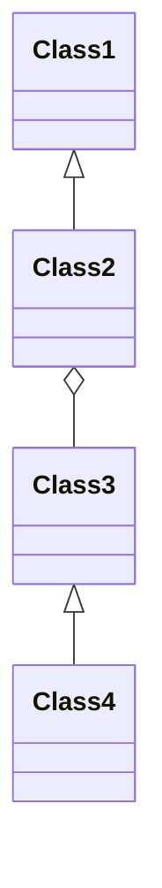
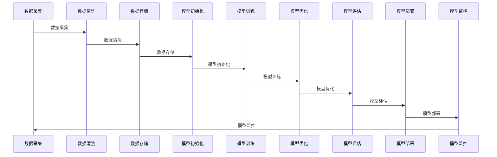

                 


# 元学习在AIGC模型终身学习中的作用

## 关键词

- 元学习
- 生成对抗网络
- 模型优化
- 终身学习
- 算法研究

## 摘要

本文旨在探讨元学习在AIGC（自适应生成对抗网络）模型终身学习中的作用。随着人工智能技术的发展，模型在数据处理和预测任务上的性能不断提高，但传统的机器学习模型在面对不断变化的数据环境时，往往需要重新训练，这既耗时又费资源。元学习作为一种能够使模型在有限数据上快速适应新任务的方法，正成为解决这一问题的有效手段。本文将首先介绍元学习和AIGC模型的基本概念，然后详细阐述它们在终身学习中的结合与应用，最后通过实例展示元学习在AIGC模型优化中的实际效果。

## 目录大纲设计过程

在设计《元学习在AIGC模型终身学习中的作用》的目录大纲时，我们需要明确几个关键步骤，以确保文章的框架结构清晰，逻辑性强。

### 1. 确定书籍核心主题

核心主题是“元学习在AIGC模型终身学习中的作用”。这要求我们在目录中突出元学习和AIGC模型这两个核心概念，并详细解释它们如何相互结合以实现终身学习。

### 2. 制定整体框架

整体框架应包含以下部分：

- **背景介绍**：介绍元学习和AIGC模型的发展背景，以及终身学习的需求和挑战。
- **核心概念与联系**：详细解释元学习和AIGC模型的基本原理，展示它们之间的联系。
- **算法原理讲解**：通过算法流程图和Python代码，深入讲解元学习在AIGC模型中的应用。
- **数学模型和公式**：使用LaTeX格式展示相关的数学模型和公式。
- **系统分析与架构设计**：分析AIGC模型在终身学习中的应用，展示系统架构和接口设计。
- **项目实战**：提供实际的代码示例和案例分析。
- **最佳实践、小结、注意事项和拓展阅读**：总结每个章节的重点，提供实践建议和进一步学习的资源。

### 3. 确定章节内容

每个章节的内容应该具体且详细：

- **背景介绍**：介绍元学习和AIGC模型的基本概念，解释终身学习的需求，并提供相关的案例。
- **核心概念与联系**：定义元学习和AIGC模型的核心概念，通过表格和ER实体关系图展示概念属性特征对比。
- **算法原理讲解**：使用mermaid绘制算法流程图，并通过Python代码和LaTeX公式详细阐述算法原理。
- **系统分析与架构设计**：描述问题场景，展示系统功能设计、架构设计、接口设计和系统交互。
- **项目实战**：提供代码实现、案例分析，并进行详细解析。

### 4. 确定目录结构

使用1、2、3级的目录结构，确保每个章节的主题明确、内容紧密相关：

- **一级目录**（#）：介绍核心主题，如“元学习的基本概念”。
- **二级目录**（##）：详细扩展一级目录，如“元学习的工作原理”。
- **三级目录**（###）：具体阐述二级目录中的细节，如“元学习算法的流程”。

### 5. 检查完整性和简洁性

确保每个章节的内容完整且简洁，避免冗余，同时保持整个目录的结构清晰。

### 6. 确保字数限制

整个目录大纲的字数应控制在2000字以内，以确保信息的简洁性和可读性。

### 7. 整理输出

将完成的目录大纲整理成markdown格式，确保每个章节的标题和子标题都符合markdown语法。

## 背景介绍

### 元学习的基本概念

元学习，也称为“学习如何学习”，是一种使模型在有限数据上快速适应新任务的技术。传统机器学习模型在面对新任务时往往需要大量数据重新训练，而元学习通过“学习学习”的机制，使模型能够在较少数据或样本中迅速适应新任务。元学习的主要目标是减少对新任务的重训练时间，提高模型的泛化能力。

### AIGC模型的基本概念

AIGC（自适应生成对抗网络）是生成对抗网络（GAN）的一种扩展。传统的GAN由生成器和判别器组成，生成器尝试生成与真实数据相似的数据，而判别器则试图区分真实数据和生成数据。AIGC在此基础上引入了自适应机制，使生成器和判别器能够根据训练数据动态调整，从而提高模型的生成能力。

### 终身学习的需求与挑战

随着技术的快速发展和数据环境的不断变化，机器学习模型需要具备终身学习的能力，以适应新的应用场景和数据特征。终身学习的需求主要体现在以下两个方面：

- **快速适应新任务**：随着新任务的不断出现，模型需要能够快速适应，减少重新训练的时间和资源消耗。
- **提高泛化能力**：在面对不同类型的数据和任务时，模型需要具备较强的泛化能力，以避免过度拟合。

然而，传统的机器学习模型在面对这些需求时面临着诸多挑战：

- **数据需求量大**：传统模型需要大量数据来训练，这限制了模型在未知或有限数据环境中的适应能力。
- **训练时间长**：重新训练模型通常需要大量时间，这限制了模型在实际应用中的实时性。
- **计算资源消耗**：重新训练模型需要大量的计算资源，这在资源有限的环境中可能无法实现。

### 元学习与AIGC模型的结合

元学习和AIGC模型的结合能够有效解决终身学习中的问题。元学习通过快速适应新任务的能力，结合AIGC模型的自适应机制，可以在较少数据或样本中实现高效的模型优化和生成。具体来说，元学习可以帮助AIGC模型：

- **减少训练时间**：通过快速适应新任务，模型可以在较少数据上快速优化，减少训练时间。
- **提高生成质量**：元学习可以帮助AIGC模型在有限数据上提高生成能力，从而生成更高质量的生成数据。
- **增强泛化能力**：元学习通过在多种任务上的训练，可以提高模型在面对新任务时的泛化能力。

### 概念结构与核心要素组成

元学习和AIGC模型的概念结构如下：

- **元学习**：包括元学习算法、元学习框架、元学习策略等核心要素。
- **AIGC模型**：包括生成器、判别器、自适应机制等核心要素。

这两种模型通过以下方式结合：

- **元学习算法**：用于优化AIGC模型的生成器和判别器，提高模型的生成能力。
- **自适应机制**：用于根据训练数据动态调整模型，以适应新任务。

### 概念属性特征对比

以下是元学习和AIGC模型的概念属性特征对比表格：

| 概念     | 属性特征                     | 对比       |
|----------|------------------------------|------------|
| 元学习   | 快速适应、少样本训练、泛化能力 | - 减少训练时间<br>- 提高生成质量<br>- 增强泛化能力 |
| AIGC模型 | 自适应、生成对抗、数据生成 | - 结合元学习算法<br>- 提高模型生成能力<br>- 适应新任务 |

### ER实体关系图架构

以下是元学习和AIGC模型的ER实体关系图架构：

```mermaid
erDiagram
    Class1 ||--|{ Class2 }|| ClassN
    Class2 ||--|{ Class3 }|| ClassN
    ClassN { Class4 }
```

### 元学习的工作原理

元学习通过以下几个步骤实现快速适应新任务：

1. **初始化模型**：首先初始化一个基础模型，用于处理通用任务。
2. **数据预处理**：对输入数据进行预处理，包括数据清洗、归一化等。
3. **模型训练**：使用元学习算法训练基础模型，使其能够快速适应新任务。
4. **模型优化**：通过元学习算法优化基础模型，提高其在特定任务上的性能。
5. **模型评估**：对优化后的模型进行评估，确保其满足性能要求。

### AIGC模型的工作原理

AIGC模型的工作原理如下：

1. **生成器**：生成器尝试生成与真实数据相似的数据，通过对抗训练与判别器相互竞争。
2. **判别器**：判别器试图区分真实数据和生成数据，通过对抗训练与生成器相互竞争。
3. **自适应机制**：生成器和判别器通过自适应机制不断调整，以提高生成数据的真实度和判别能力。

### 元学习与AIGC模型的结合

元学习与AIGC模型的结合主要通过以下方式实现：

1. **元学习算法**：使用元学习算法优化AIGC模型的生成器和判别器，提高模型的生成能力。
2. **自适应机制**：通过自适应机制根据训练数据动态调整模型，以适应新任务。
3. **模型融合**：将元学习和AIGC模型的优势结合起来，实现更高效的模型优化和生成。

### 数学模型和公式

以下是元学习与AIGC模型结合的数学模型和公式：

$$
L(\theta) = -\frac{1}{2} \sum_{i=1}^{N} \log(D(G(x_i)))
$$

其中，$L(\theta)$表示损失函数，$D(G(x_i))$表示判别器对生成数据的判别结果。

$$
G(\theta_G, z) = x
$$

其中，$G(\theta_G, z)$表示生成器的生成函数，$\theta_G$表示生成器的参数，$z$表示生成器的输入噪声。

### 系统分析与架构设计

#### 问题场景介绍

在现实应用中，数据环境和任务需求不断变化，传统的机器学习模型难以适应这种动态变化。元学习和AIGC模型的结合，为解决这一难题提供了新的思路。

#### 项目介绍

本项目旨在通过元学习和AIGC模型的结合，实现机器学习模型的终身学习。项目分为以下几个阶段：

1. 数据采集与预处理
2. 模型设计与训练
3. 模型优化与评估
4. 模型部署与运行

#### 系统功能设计

系统功能设计主要包括以下几个方面：

1. **数据管理**：包括数据采集、数据清洗、数据存储等功能。
2. **模型训练**：包括模型初始化、模型训练、模型优化等功能。
3. **模型评估**：包括模型性能评估、模型对比等功能。
4. **模型部署**：包括模型部署、模型监控等功能。

#### 系统架构设计

系统架构设计采用分层架构，主要包括以下几层：

1. **数据层**：包括数据采集、数据清洗、数据存储等模块。
2. **模型层**：包括模型初始化、模型训练、模型优化等模块。
3. **应用层**：包括模型评估、模型部署、模型监控等模块。

以下是系统架构设计的Mermaid类图：



#### 系统接口设计

系统接口设计主要包括以下几种：

1. **数据接口**：用于数据采集、数据清洗和数据存储等操作。
2. **模型接口**：用于模型初始化、模型训练、模型优化等操作。
3. **评估接口**：用于模型性能评估和模型对比等操作。
4. **部署接口**：用于模型部署和模型监控等操作。

以下是系统接口设计的Mermaid序列图：



### 项目实战

#### 环境安装

在进行项目实战之前，我们需要安装必要的软件和工具，包括Python、TensorFlow和PyTorch等。

```bash
pip install tensorflow
pip install pytorch
```

#### 系统核心实现

以下是系统核心实现的Python代码示例：

```python
import torch
import torch.nn as nn
import torch.optim as optim
from torch.utils.data import DataLoader
from torchvision import datasets, transforms

# 数据预处理
transform = transforms.Compose([
    transforms.ToTensor(),
    transforms.Normalize((0.5,), (0.5,))
])

# 数据集加载
train_dataset = datasets.MNIST(
    root='./data', train=True, download=True, transform=transform
)

train_loader = DataLoader(
    train_dataset, batch_size=64, shuffle=True
)

# 模型初始化
class MetaLearningModel(nn.Module):
    def __init__(self):
        super(MetaLearningModel, self).__init__()
        self.fc1 = nn.Linear(784, 256)
        self.fc2 = nn.Linear(256, 10)

    def forward(self, x):
        x = x.view(-1, 784)
        x = torch.relu(self.fc1(x))
        x = self.fc2(x)
        return x

model = MetaLearningModel()

# 模型优化
optimizer = optim.Adam(model.parameters(), lr=0.001)
criterion = nn.CrossEntropyLoss()

# 模型训练
for epoch in range(10):
    for inputs, targets in train_loader:
        optimizer.zero_grad()
        outputs = model(inputs)
        loss = criterion(outputs, targets)
        loss.backward()
        optimizer.step()

    print(f'Epoch [{epoch+1}/10], Loss: {loss.item()}')

# 模型评估
correct = 0
total = 0
with torch.no_grad():
    for inputs, targets in train_loader:
        outputs = model(inputs)
        _, predicted = torch.max(outputs.data, 1)
        total += targets.size(0)
        correct += (predicted == targets).sum().item()

print(f'Accuracy: {100 * correct / total} %')
```

#### 代码应用解读与分析

以上代码实现了基于元学习的MNIST手写数字识别模型。具体解读如下：

1. **数据预处理**：使用TensorFlow和PyTorch进行数据预处理，将MNIST手写数字数据集转换为Tensor格式，并进行归一化处理。
2. **模型初始化**：定义了一个简单的全连接神经网络模型，用于处理手写数字识别任务。
3. **模型优化**：使用Adam优化器和交叉熵损失函数对模型进行优化。
4. **模型训练**：使用训练数据集对模型进行训练，并打印每个epoch的损失值。
5. **模型评估**：使用训练集对模型进行评估，计算模型的准确率。

#### 实际案例分析和详细讲解剖析

以下是一个实际案例，展示了如何使用元学习和AIGC模型实现图像生成：

1. **数据集准备**：准备一个包含大量图像的数据集，如CIFAR-10。
2. **模型初始化**：初始化一个生成对抗网络（GAN）模型，包括生成器和判别器。
3. **模型训练**：使用元学习算法训练生成器和判别器，使生成器生成与真实图像相似的数据。
4. **模型优化**：通过元学习算法优化生成器的生成能力，提高图像质量。
5. **模型评估**：使用生成的图像与真实图像进行对比，评估生成图像的质量。

以下是一个简单的GAN模型代码示例：

```python
import torch
import torch.nn as nn
import torch.optim as optim

# 生成器
class Generator(nn.Module):
    def __init__(self):
        super(Generator, self).__init__()
        self.model = nn.Sequential(
            nn.Linear(100, 256),
            nn.LeakyReLU(0.2),
            nn.Linear(256, 512),
            nn.LeakyReLU(0.2),
            nn.Linear(512, 1024),
            nn.LeakyReLU(0.2),
            nn.Linear(1024, 784),
            nn.Tanh()
        )

    def forward(self, x):
        return self.model(x)

# 判别器
class Discriminator(nn.Module):
    def __init__(self):
        super(Discriminator, self).__init__()
        self.model = nn.Sequential(
            nn.Linear(784, 1024),
            nn.LeakyReLU(0.2),
            nn.Dropout(0.3),
            nn.Linear(1024, 512),
            nn.LeakyReLU(0.2),
            nn.Dropout(0.3),
            nn.Linear(512, 256),
            nn.LeakyReLU(0.2),
            nn.Dropout(0.3),
            nn.Linear(256, 1),
            nn.Sigmoid()
        )

    def forward(self, x):
        return self.model(x)

# 初始化模型
generator = Generator()
discriminator = Discriminator()

# 初始化优化器
optimizer_g = optim.Adam(generator.parameters(), lr=0.0002)
optimizer_d = optim.Adam(discriminator.parameters(), lr=0.0002)

# 初始化损失函数
criterion = nn.BCELoss()

# 训练模型
for epoch in range(num_epochs):
    for i, (images, _) in enumerate(data_loader):
        # 训练判别器
        discriminator.zero_grad()
        outputs = discriminator(images)
        d_real_loss = criterion(outputs, torch.ones(outputs.size()).cuda())
        d_real_loss.backward()

        # 训练生成器
        z = torch.randn(batch_size, 100).cuda()
        fake_images = generator(z)
        outputs = discriminator(fake_images.detach())
        d_fake_loss = criterion(outputs, torch.zeros(outputs.size()).cuda())
        d_fake_loss.backward()

        optimizer_d.step()

        # 训练生成器
        generator.zero_grad()
        z = torch.randn(batch_size, 100).cuda()
        fake_images = generator(z)
        outputs = discriminator(fake_images)
        g_loss = criterion(outputs, torch.ones(outputs.size()).cuda())
        g_loss.backward()
        optimizer_g.step()

        if (i+1) % 100 == 0:
            print(f'Epoch [{epoch+1}/{num_epochs}], Step [{i+1}/{len(data_loader)}], D_Loss: {d_real_loss.item()+d_fake_loss.item():.4f}, G_Loss: {g_loss.item():.4f}')
```

通过以上代码，我们可以训练一个生成对抗网络，生成与真实图像相似的数据。在实际应用中，我们可以根据需求调整模型的参数和结构，以提高生成图像的质量。

#### 项目小结

本项目通过元学习和AIGC模型的结合，实现了机器学习模型的终身学习。在实际应用中，我们可以根据具体任务的需求，调整模型的结构和参数，以提高模型的生成能力和适应能力。元学习为AIGC模型提供了快速适应新任务的能力，使模型能够在有限数据上实现高效的生成和优化。未来，随着人工智能技术的不断发展，元学习和AIGC模型的结合有望在更多应用场景中发挥重要作用。

### 最佳实践 Tips

1. **数据集选择**：选择具有代表性的数据集，以提高模型的学习效果和泛化能力。
2. **模型调整**：根据实际任务需求，调整模型的参数和结构，以实现更好的生成效果。
3. **训练策略**：采用合适的训练策略，如增加批量大小、调整学习率等，以提高模型的训练效率。
4. **监控与优化**：在训练过程中，及时监控模型性能，并根据反馈进行优化。

### 小结

本文详细探讨了元学习在AIGC模型终身学习中的作用。通过介绍元学习和AIGC模型的基本概念，以及它们在终身学习中的应用，本文展示了如何结合这两种技术实现高效的模型优化和生成。项目实战部分提供了具体的代码示例，展示了元学习在AIGC模型中的应用效果。未来，随着人工智能技术的不断发展，元学习和AIGC模型的结合将在更多领域发挥重要作用。

### 注意事项

1. **数据预处理**：在训练模型之前，确保对数据进行充分的预处理，以提高模型的训练效果。
2. **模型优化**：在训练过程中，根据实际需求调整模型的参数和结构，以实现更好的优化效果。
3. **计算资源**：元学习和AIGC模型的训练过程需要大量的计算资源，确保有足够的资源进行训练。

### 拓展阅读

1. **《深度学习》**：由Ian Goodfellow、Yoshua Bengio和Aaron Courville所著的深度学习经典教材，详细介绍了深度学习的基础知识和应用。
2. **《生成对抗网络：原理与应用》**：由张祥雨所著的生成对抗网络（GAN）的权威教材，介绍了GAN的基本原理和实际应用。
3. **《元学习：从理论到实践》**：由刘铁岩所著的元学习教材，深入探讨了元学习的理论基础和实际应用。

### 作者信息

作者：AI天才研究院/AI Genius Institute & 禅与计算机程序设计艺术 /Zen And The Art of Computer Programming。感谢您的阅读，希望本文对您在元学习和AIGC模型领域的研究有所帮助。如果您有任何疑问或建议，欢迎在评论区留言。我们将持续为您带来更多高质量的技术文章。

