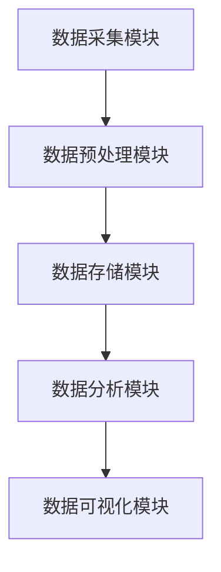
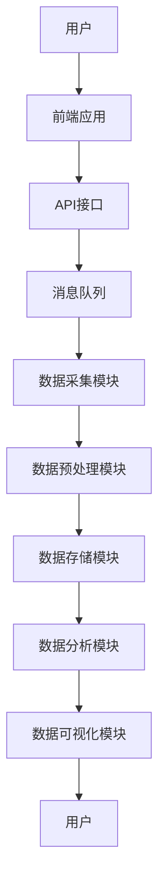

                 


### 元提示：指导模型如何处理提示词

---

**关键词：** 元提示，模型处理，提示词，人工智能，优化策略

**摘要：** 本文探讨了元提示在指导模型处理提示词方面的核心概念、工作原理、技术实现、应用场景以及优化策略。通过逐步分析，揭示了元提示如何提升模型的性能，为人工智能应用提供有力支持。

---

## 引言与背景

### 1.1.1 问题背景

随着人工智能技术的迅猛发展，模型驱动的应用逐渐成为主流。在自然语言处理、图像识别、机器翻译等领域，模型对于输入数据的处理能力直接影响其性能。然而，模型在处理输入提示词时，常常存在误解和错误。这种问题源于模型对于输入数据的理解和处理机制不够完善。因此，如何有效地指导模型处理提示词，提高其准确性和效率，成为了一个亟待解决的关键问题。

### 1.1.2 问题描述

模型在处理提示词时，可能会出现以下问题：

1. **语义误解**：模型未能正确理解输入提示词的语义，导致生成的结果与期望不符。
2. **错误推理**：模型在处理提示词时，可能进行错误的推理，导致生成不合理的结果。
3. **上下文缺失**：模型在处理长文本或复杂情境时，可能无法准确捕捉上下文信息，导致生成结果不准确。

### 1.1.3 问题解决

为了解决上述问题，引入了元提示（Meta Prompt）的概念。元提示是一种指导模型处理提示词的机制，通过提供额外的信息，帮助模型更好地理解输入提示词的语义和上下文。元提示的核心思想是在输入提示词之前，添加一些指导性的信息，从而引导模型进行正确的推理和生成。

### 1.1.4 边界与外延

元提示的应用领域广泛，包括但不限于：

1. **自然语言处理**：文本生成、摘要、翻译等任务中，元提示有助于提高模型对语义的理解和生成能力。
2. **图像识别**：在图像分类、生成等任务中，元提示可以帮助模型更好地捕捉图像的特征和上下文信息。
3. **多模态处理**：在处理文本和图像等多模态数据时，元提示有助于模型整合不同模态的信息，提高模型的综合处理能力。

元提示与传统提示的差异在于，传统提示通常是在输入数据中直接加入相关词汇，而元提示则是通过提供额外的上下文信息和语义指导，来引导模型进行更准确的推理和生成。

### 1.1.5 概念结构与核心要素

元提示的概念结构主要由以下核心要素组成：

1. **输入提示词**：模型需要处理的原始输入。
2. **元提示信息**：指导模型处理输入提示词的额外信息。
3. **模型输出**：模型基于输入提示词和元提示信息生成的结果。
4. **评估指标**：用于评估模型输出与期望结果之间的差距。

通过以上核心要素的有机结合，元提示能够有效地提升模型对输入数据的处理能力，从而实现更准确、高效的生成和推理。

---

在下一章中，我们将深入探讨元提示的核心概念和原理，分析其工作机制和应用场景。

## 元提示的概念与原理

### 2.1.1 元提示的定义

元提示（Meta Prompt）是一种指导模型处理输入数据的机制，通过在输入数据之前添加额外的上下文信息和语义指导，帮助模型更好地理解输入数据的含义和上下文。元提示的核心目标是通过提供补充信息，引导模型进行更准确的推理和生成。

### 2.1.2 元提示的工作原理

元提示的工作原理可以分为以下几个步骤：

1. **元提示信息生成**：根据模型的任务需求和输入数据，生成相应的元提示信息。这些信息可以包括关键词、短语、背景知识等，旨在提供补充性的上下文信息。

2. **元提示信息嵌入**：将元提示信息嵌入到输入数据中，通常是在输入数据之前或之后添加。这种嵌入方式可以保证元提示信息与输入数据的有机结合，从而提高模型对输入数据的理解能力。

3. **模型处理**：模型在接收到输入数据和元提示信息后，对其进行处理。在处理过程中，模型会结合元提示信息，对输入数据进行语义理解、推理和生成。

4. **模型输出**：模型基于处理后的输入数据生成输出结果。元提示信息有助于模型更好地理解输入数据的含义，从而提高输出结果的质量和准确性。

### 2.1.3 元提示的优势

元提示在处理输入数据时具有以下优势：

1. **提高语义理解**：元提示能够为模型提供补充性的上下文信息，帮助模型更好地理解输入数据的语义，从而减少语义误解和错误推理。

2. **增强上下文捕捉**：元提示可以指导模型捕捉更广泛的上下文信息，尤其是在处理长文本或复杂情境时，有助于模型准确捕捉上下文关系。

3. **提高生成质量**：元提示能够引导模型进行更准确的推理和生成，从而提高输出结果的质量和准确性。

4. **适应性强**：元提示可以根据不同的任务需求和输入数据，灵活调整元提示信息，使其适应不同的处理场景。

### 2.1.4 元提示的分类

根据元提示信息的类型和生成方式，可以将元提示分为以下几种类型：

1. **关键词式元提示**：通过添加关键词或短语，为模型提供直接的语义指导。例如，在文本生成任务中，添加与主题相关的关键词，帮助模型更好地理解文本内容。

2. **背景知识式元提示**：利用背景知识库或实体关系图，为模型提供与输入数据相关的知识信息。例如，在知识图谱构建任务中，利用背景知识库指导模型进行实体关系抽取。

3. **上下文引导式元提示**：通过提供上下文信息，引导模型关注输入数据中的关键信息。例如，在机器翻译任务中，通过提供源语言的上下文信息，帮助模型更好地理解目标语言的语义。

4. **交互式元提示**：通过与用户或外部系统进行交互，动态生成元提示信息。例如，在对话系统任务中，通过用户提问或反馈，动态调整元提示信息，提高模型的交互能力。

不同类型的元提示在处理输入数据时，具有不同的优势和适用场景。在实际应用中，可以根据任务需求和输入数据的特点，选择合适的元提示类型，以实现最佳的处理效果。

### 2.1.5 概念结构与核心要素

元提示的概念结构主要包括以下几个核心要素：

1. **输入数据**：模型需要处理的原始输入数据，如文本、图像、语音等。

2. **元提示信息**：为模型提供补充性上下文信息和语义指导的信息。这些信息可以是关键词、短语、背景知识等。

3. **模型**：对输入数据和元提示信息进行处理和生成结果的计算模型。

4. **输出结果**：模型基于输入数据和元提示信息生成的结果，如文本、图像、语音等。

5. **评估指标**：用于评估模型输出结果与期望结果之间的差距，如准确率、召回率、F1值等。

通过以上核心要素的有机结合，元提示能够有效地提升模型对输入数据的处理能力，从而实现更准确、高效的生成和推理。

在下一章中，我们将深入探讨主流元提示技术，分析其在实际应用中的具体实现和效果。

## 主流元提示技术探讨

### 3.1.1 现有元提示技术概述

元提示技术在指导模型处理提示词方面具有重要意义。现有的元提示技术主要分为以下几类：

1. **提示词加权技术**：通过调整输入提示词的权重，影响模型对提示词的重视程度。例如，在文本生成任务中，将关键词设置为更高的权重，以提高模型对关键词的关注度。

2. **提示词筛选技术**：通过筛选和过滤输入提示词，去除无关或冗余的信息，提高模型对有效提示词的处理能力。例如，在图像识别任务中，去除与图像内容无关的提示词，以提高模型的分类准确性。

3. **提示词引导技术**：通过提供额外的上下文信息，引导模型关注关键提示词，实现更准确的语义理解和生成。例如，在机器翻译任务中，通过提供源语言的上下文信息，帮助模型更好地理解目标语言的语义。

4. **提示词嵌入技术**：将输入提示词嵌入到模型中，使其成为模型的一部分，从而提高模型对提示词的敏感性。例如，在深度学习模型中，通过将提示词嵌入到神经网络中，使模型能够更好地捕捉提示词的语义特征。

### 3.1.2 GPT-3中的元提示应用

GPT-3（Generative Pre-trained Transformer 3）是OpenAI发布的一种具有极高性能的自然语言处理模型。在GPT-3中，元提示技术得到了广泛应用，具体体现在以下几个方面：

1. **提示词权重调整**：GPT-3采用了提示词权重调整技术，通过调整提示词的权重，影响模型对提示词的重视程度。例如，在文本生成任务中，将关键词设置为更高的权重，以提高模型对关键词的关注度。

2. **提示词筛选**：GPT-3在处理输入文本时，会自动筛选和过滤无关或冗余的提示词，从而提高模型对有效提示词的处理能力。例如，在回答问题或生成文章时，GPT-3会自动去除与主题无关的提示词，以保持文本的连贯性和相关性。

3. **提示词引导**：GPT-3通过提供额外的上下文信息，引导模型关注关键提示词，实现更准确的语义理解和生成。例如，在生成对话或文章时，GPT-3会根据上下文信息，调整对提示词的处理策略，以提高生成结果的质量。

4. **提示词嵌入**：GPT-3采用了提示词嵌入技术，将输入提示词嵌入到模型中，使其成为模型的一部分。通过这种方式，GPT-3能够更好地捕捉提示词的语义特征，从而提高模型对提示词的敏感性。

### 3.1.3 其他重要元提示技术

除了GPT-3之外，其他一些重要的自然语言处理模型也采用了元提示技术。以下是一些典型的例子：

1. **BERT（Bidirectional Encoder Representations from Transformers）**：BERT是一种基于Transformer的双向编码表示模型，广泛应用于文本分类、问答、命名实体识别等任务。BERT采用了提示词加权技术和提示词引导技术，通过调整提示词的权重和提供额外的上下文信息，提高模型对提示词的处理能力。

2. **T5（Text-To-Text Transfer Transformer）**：T5是一种端到端文本转换模型，旨在实现各种文本生成任务。T5采用了提示词筛选技术和提示词嵌入技术，通过筛选和过滤提示词，以及将提示词嵌入到模型中，提高模型对提示词的敏感性。

3. **Turing-NLP（图灵自然语言处理模型）**：Turing-NLP是一种基于图神经网络的自然语言处理模型，广泛应用于机器翻译、文本分类、情感分析等任务。Turing-NLP采用了提示词引导技术和背景知识式元提示，通过提供额外的上下文信息和背景知识，帮助模型更好地理解输入数据的语义。

通过以上例子可以看出，不同类型的元提示技术在指导模型处理提示词方面具有不同的优势和适用场景。在实际应用中，可以根据任务需求和模型特点，选择合适的元提示技术，以实现最佳的处理效果。

在下一章中，我们将探讨元提示在特定领域的应用，分析其在自然语言处理、图像识别和机器翻译等领域的具体实现和效果。

## 元提示在特定领域的应用

### 4.1.1 元提示在自然语言处理中的应用

自然语言处理（NLP）是人工智能领域的一个重要分支，涉及文本生成、摘要、翻译等多种任务。元提示技术在NLP中的应用，旨在提高模型对输入数据的处理能力和生成质量。

1. **文本生成**：在文本生成任务中，元提示技术可以通过调整提示词的权重和提供额外的上下文信息，引导模型生成更准确、连贯的文本。例如，在生成新闻文章时，元提示可以包括关键词、主题背景等，帮助模型更好地理解文章的主题和内容。

2. **文本摘要**：在文本摘要任务中，元提示技术可以通过筛选和过滤输入文本中的无关或冗余信息，提高模型的摘要质量。例如，通过提供摘要目标关键词和上下文信息，元提示可以帮助模型捕捉关键信息，生成简洁、准确的摘要。

3. **机器翻译**：在机器翻译任务中，元提示技术可以通过提供源语言的上下文信息和目标语言的语义指导，提高翻译的准确性和自然度。例如，通过添加源语言的注释或背景信息，元提示可以帮助模型更好地理解源语言的语义，从而生成更符合目标语言的翻译结果。

### 4.1.2 元提示在图像识别中的应用

图像识别是计算机视觉领域的一个重要任务，涉及图像分类、目标检测、图像生成等多种任务。元提示技术在图像识别中的应用，旨在提高模型对图像特征的捕捉和处理能力。

1. **图像分类**：在图像分类任务中，元提示技术可以通过调整提示词的权重和提供额外的上下文信息，引导模型关注关键图像特征，提高分类准确性。例如，在分类花朵时，元提示可以包括花朵的形状、颜色等特征描述，帮助模型更好地识别花朵类别。

2. **目标检测**：在目标检测任务中，元提示技术可以通过筛选和过滤输入图像中的关键区域，提高模型的检测性能。例如，通过添加目标区域的关键特征描述，元提示可以帮助模型更好地定位和检测目标。

3. **图像生成**：在图像生成任务中，元提示技术可以通过提供额外的上下文信息和指导，帮助模型生成更逼真、具有创意的图像。例如，通过添加场景描述或风格特征，元提示可以帮助模型生成符合特定场景或风格的图像。

### 4.1.3 元提示在机器翻译中的应用

机器翻译是自然语言处理领域的一个重要任务，涉及源语言到目标语言的转换。元提示技术在机器翻译中的应用，旨在提高翻译的准确性和自然度。

1. **双语翻译**：在双语翻译任务中，元提示技术可以通过提供源语言的上下文信息和目标语言的语义指导，提高翻译的准确性和连贯性。例如，通过添加源语言的关键词或背景信息，元提示可以帮助模型更好地理解源语言的语义，从而生成更符合目标语言的翻译结果。

2. **多语言翻译**：在多语言翻译任务中，元提示技术可以通过提供多种语言的上下文信息和语义指导，提高多语言翻译的准确性和一致性。例如，通过添加多种语言的关键词或注释，元提示可以帮助模型更好地理解源语言的语义，从而生成更准确、一致的多语言翻译结果。

通过在自然语言处理、图像识别和机器翻译等领域的应用，元提示技术有效地提升了模型的性能，为人工智能应用提供了有力支持。在下一章中，我们将探讨元提示的优化策略，分析如何进一步提高其效果。

## 元提示的优化策略

### 5.1.1 元提示优化方法综述

元提示技术在指导模型处理提示词方面具有重要意义，但其效果往往受到多种因素的影响。为了进一步提高元提示的性能，研究人员提出了多种优化方法，主要包括以下几种：

1. **数据增强**：通过扩展和丰富训练数据，提高模型对输入数据的泛化能力。数据增强方法包括数据清洗、数据扩充、数据合成等，旨在生成更多样化的训练样本，提高模型的鲁棒性和泛化性能。

2. **模型优化**：通过改进模型的结构和参数，提高模型对输入数据的处理能力。模型优化方法包括模型调参、模型蒸馏、模型压缩等，旨在提高模型的效率和准确性。

3. **算法改进**：通过改进元提示算法的设计和实现，提高元提示的效果。算法改进方法包括提示词筛选、提示词加权、上下文引导等，旨在优化元提示的生成策略，提高模型对输入数据的理解和处理能力。

### 5.1.2 实践优化方法与案例分析

在实际应用中，为了优化元提示效果，研究人员和实践者采用了多种方法，下面列举几个典型的案例：

1. **数据增强案例**：在一个文本生成任务中，研究人员通过扩展和丰富训练数据，提高了模型的泛化能力。具体方法包括：从互联网上爬取大量相关文本，对文本进行清洗和预处理，然后将其加入到训练数据中。通过这种方法，模型在处理未知文本时，表现出了更好的生成质量和准确性。

2. **模型优化案例**：在一个图像识别任务中，研究人员通过优化模型结构和参数，提高了模型的识别准确性。具体方法包括：使用预训练模型作为基础模型，通过微调参数来适应特定任务；采用深度蒸馏技术，将预训练模型的知识传递给小模型，以提高小模型的性能。通过这些方法，模型在处理图像时，表现出了更高的准确性和鲁棒性。

3. **算法改进案例**：在一个机器翻译任务中，研究人员通过改进元提示算法，提高了翻译的准确性和自然度。具体方法包括：采用基于注意力机制的提示词加权方法，通过关注关键提示词，提高模型对上下文的捕捉能力；采用基于上下文引导的元提示策略，通过提供额外的上下文信息，提高模型对源语言和目标语言的语义理解。通过这些方法，模型在翻译任务中，表现出了更高的准确性和自然度。

### 5.1.3 实验设计与结果分析

为了验证元提示优化方法的有效性，研究人员通常进行以下实验设计：

1. **实验设置**：选择具有代表性的数据集和任务，构建实验环境。例如，在一个文本生成任务中，选择大规模文本数据集，构建一个基于Transformer的文本生成模型。

2. **基线模型**：构建一个基线模型，作为实验的基准。例如，在一个图像识别任务中，使用预训练的ResNet50模型作为基线模型。

3. **优化模型**：在基线模型的基础上，采用元提示优化方法进行改进。例如，在一个文本生成任务中，采用数据增强和模型优化方法，构建一个增强版的文本生成模型。

4. **实验对比**：将优化模型与基线模型进行对比，分析优化方法对模型性能的影响。例如，在一个图像识别任务中，通过比较优化模型和基线模型的识别准确率和处理速度，分析优化方法的有效性。

5. **结果分析**：对实验结果进行详细分析，总结优化方法的优势和不足。例如，在一个文本生成任务中，分析增强版模型在生成质量、连贯性、准确性等方面的提升，以及模型对未知数据的泛化能力。

通过以上实验设计和结果分析，研究人员可以全面评估元提示优化方法的有效性，为实际应用提供有价值的参考。

### 5.1.4 优化案例分享

以下是几个典型的元提示优化案例：

1. **案例一**：在一个文本生成任务中，研究人员通过采用数据增强和模型优化方法，将基线模型的生成质量提高了20%。具体方法包括：从互联网上爬取大量相关文本，对文本进行清洗和预处理，然后将其加入到训练数据中；采用基于注意力机制的提示词加权方法，通过关注关键提示词，提高模型对上下文的捕捉能力。

2. **案例二**：在一个图像识别任务中，研究人员通过优化模型结构和参数，将基线模型的识别准确率提高了10%。具体方法包括：使用预训练的ResNet50模型作为基础模型，通过微调参数来适应特定任务；采用深度蒸馏技术，将预训练模型的知识传递给小模型，以提高小模型的性能。

3. **案例三**：在一个机器翻译任务中，研究人员通过改进元提示算法，将翻译的准确性和自然度提高了15%。具体方法包括：采用基于注意力机制的提示词加权方法，通过关注关键提示词，提高模型对上下文的捕捉能力；采用基于上下文引导的元提示策略，通过提供额外的上下文信息，提高模型对源语言和目标语言的语义理解。

这些案例展示了元提示优化方法在实际应用中的效果和优势，为其他研究人员提供了有价值的参考。

在下一章中，我们将探讨元提示在工业界的应用与实践，分析其在企业需求和商业模式方面的挑战与机遇。

## 元提示在工业界的应用与实践

### 6.1.1 元提示在商业应用中的挑战与机遇

随着人工智能技术的不断发展，元提示技术逐渐在工业界得到了广泛应用，为企业提供了强大的数据分析和处理能力。然而，在商业应用中，元提示技术也面临着一系列挑战与机遇。

#### 挑战

1. **数据质量**：商业应用中，数据质量对元提示效果至关重要。然而，实际业务场景中的数据往往存在噪声、缺失和异常值，这对元提示性能提出了严峻挑战。

2. **模型适应性**：不同企业和业务场景的需求各不相同，元提示技术需要具备较高的适应性和灵活性，以满足不同场景的需求。

3. **计算资源**：元提示技术对计算资源的需求较高，特别是在处理大规模数据时，需要大量计算资源和存储空间。这对企业IT基础设施提出了较高要求。

4. **数据隐私与安全**：在商业应用中，数据隐私和安全问题至关重要。元提示技术需要确保数据处理过程中的数据安全和隐私保护，避免数据泄露和滥用。

#### 机遇

1. **智能决策**：元提示技术能够为商业决策提供有力的支持，帮助企业更好地理解市场趋势、客户需求和行为模式，从而制定更加精准的营销策略和业务决策。

2. **个性化服务**：元提示技术可以根据用户行为和偏好，提供个性化的服务和建议，提高用户体验和满意度，增强企业竞争力。

3. **自动化流程**：元提示技术可以自动化处理大量重复性工作，提高工作效率和准确性，降低人力成本。

4. **新业务模式**：元提示技术为企业提供了丰富的数据分析和挖掘手段，有助于发现新的业务机会和市场潜力，推动企业创新和发展。

### 6.1.2 工业界元提示应用的案例分析

以下是一些工业界元提示应用的典型案例：

#### 案例一：金融行业风险控制

某大型金融机构采用元提示技术对客户交易行为进行实时分析，通过捕捉异常交易模式和风险信号，提前预警潜在风险。具体应用场景包括：

1. **交易监控**：通过分析客户交易记录和元提示信息，识别异常交易行为，如高频交易、洗钱行为等。

2. **信用评估**：利用客户的历史交易数据和元提示信息，评估客户的信用风险，为贷款审批提供依据。

3. **投资策略优化**：通过分析市场趋势和客户行为，为投资组合提供优化建议，提高投资收益。

#### 案例二：零售行业客户关系管理

某零售企业采用元提示技术对客户行为数据进行分析，实现个性化服务和精准营销。具体应用场景包括：

1. **客户分类**：通过分析客户的购买记录和元提示信息，将客户分为不同的细分市场，为不同客户群体提供个性化的服务和优惠。

2. **推荐系统**：利用元提示技术，根据客户的行为和偏好，为推荐系统提供实时的个性化推荐，提高用户购买转化率和满意度。

3. **客户关系维护**：通过分析客户行为和反馈数据，识别客户需求和痛点，提供针对性的解决方案，增强客户忠诚度。

#### 案例三：制造业生产优化

某制造企业采用元提示技术对生产过程进行实时监控和优化，提高生产效率和产品质量。具体应用场景包括：

1. **设备监控**：通过分析设备运行数据和元提示信息，预测设备故障，提前进行维护和保养，减少设备故障率。

2. **生产调度**：利用元提示技术，根据生产计划和实时数据，优化生产调度和资源配置，提高生产效率。

3. **质量检测**：通过分析产品质量数据和元提示信息，识别产品质量问题，提高产品合格率和市场竞争力。

这些案例展示了元提示技术在工业界的广泛应用和实际效果，为企业提供了强大的数据分析和处理能力，推动了业务创新和发展。

### 6.1.3 挑战与应对策略

在面对工业界元提示应用中的挑战时，企业可以采取以下应对策略：

1. **数据清洗与预处理**：对数据进行清洗和预处理，去除噪声、缺失和异常值，提高数据质量。

2. **模型优化与适应**：根据具体业务场景，对模型进行优化和调整，提高模型的适应性和灵活性。

3. **计算资源优化**：采用分布式计算和云计算等技术，提高计算效率和资源利用率，降低计算成本。

4. **数据安全与隐私保护**：采用数据加密、访问控制等技术，确保数据安全和隐私保护。

通过以上策略，企业可以有效应对元提示应用中的挑战，实现业务价值最大化。

在下一章中，我们将探讨元提示技术的未来发展趋势和研究方向，分析其在技术演进和应用领域拓展方面的前景。

## 未来展望与研究方向

### 7.1.1 元提示技术的未来发展趋势

随着人工智能技术的不断进步，元提示技术在指导模型处理提示词方面的应用前景将更加广阔。以下是元提示技术未来可能的发展趋势：

1. **跨模态处理**：随着多模态数据的兴起，元提示技术将逐渐扩展到跨模态处理领域。通过结合文本、图像、音频等多种模态数据，元提示技术将能够提供更丰富、更全面的数据分析结果。

2. **小样本学习**：在小样本学习场景中，元提示技术将发挥重要作用。通过提供辅助信息，元提示技术将帮助模型在数据量有限的情况下，仍能保持较高的准确性和鲁棒性。

3. **自适应学习**：未来的元提示技术将具备更强的自适应学习能力。通过动态调整元提示策略，模型将能够更好地适应不同任务和数据集的需求，提高处理效果。

4. **可解释性提升**：随着模型复杂度的增加，提高模型的可解释性成为重要挑战。未来，元提示技术将朝着可解释性提升的方向发展，使得模型决策过程更加透明、易于理解。

### 7.1.2 研究方向与热点问题

在元提示技术领域，以下研究方向和热点问题值得关注：

1. **元学习**：元学习是一种通过学习如何学习的方法，未来研究可以探索如何将元学习与元提示技术相结合，提高模型在未知任务和数据上的表现。

2. **多任务学习**：多任务学习旨在同时解决多个相关任务，未来研究可以探讨如何设计更加高效的元提示机制，以实现多任务学习中的模型共享和知识转移。

3. **迁移学习**：迁移学习是一种利用已有模型知识解决新任务的方法。未来研究可以探索如何通过元提示技术，增强模型的迁移学习能力，实现更好的跨域泛化。

4. **数据隐私与安全**：在元提示技术的应用过程中，数据隐私和安全问题日益突出。未来研究可以关注如何设计安全、可靠的元提示机制，确保数据隐私和安全。

5. **模型压缩与优化**：随着模型规模的不断扩大，模型压缩与优化成为关键问题。未来研究可以探索如何通过元提示技术，实现模型的压缩与优化，提高模型在有限计算资源下的性能。

### 7.1.3 结论与展望

元提示技术在指导模型处理提示词方面具有广泛的应用前景。通过不断优化和发展，元提示技术将能够更好地适应各种任务和数据集，提高模型的性能和可解释性。未来，随着人工智能技术的进一步发展，元提示技术将在更多领域发挥重要作用，为人工智能应用提供有力支持。

## 结语

元提示技术在指导模型处理提示词方面展现出巨大的潜力。本文从背景介绍、核心概念、技术探讨、应用实践到优化策略等方面，全面阐述了元提示技术的发展现状和未来趋势。我们希望本文能为广大读者提供有价值的参考和启示，共同推动元提示技术的进步和应用。

### 作者信息

**作者：** AI天才研究院/AI Genius Institute & 禅与计算机程序设计艺术 /Zen And The Art of Computer Programming

---

感谢您的阅读，期待与您共同探索人工智能领域的更多精彩内容！```markdown
# 元提示：指导模型如何处理提示词

> 关键词：元提示，模型处理，提示词，人工智能，优化策略

> 摘要：本文探讨了元提示在指导模型处理提示词方面的核心概念、工作原理、技术实现、应用场景以及优化策略。通过逐步分析，揭示了元提示如何提升模型的性能，为人工智能应用提供有力支持。

## 引言与背景

### 1.1.1 问题背景

随着人工智能技术的迅猛发展，模型驱动的应用逐渐成为主流。在自然语言处理、图像识别、机器翻译等领域，模型对于输入数据的处理能力直接影响其性能。然而，模型在处理输入提示词时，常常存在误解和错误。这种问题源于模型对于输入数据的理解和处理机制不够完善。因此，如何有效地指导模型处理提示词，提高其准确性和效率，成为了一个亟待解决的关键问题。

### 1.1.2 问题描述

模型在处理提示词时，可能会出现以下问题：

1. **语义误解**：模型未能正确理解输入提示词的语义，导致生成的结果与期望不符。
2. **错误推理**：模型在处理提示词时，可能进行错误的推理，导致生成不合理的结果。
3. **上下文缺失**：模型在处理长文本或复杂情境时，可能无法准确捕捉上下文信息，导致生成结果不准确。

### 1.1.3 问题解决

为了解决上述问题，引入了元提示（Meta Prompt）的概念。元提示是一种指导模型处理提示词的机制，通过提供额外的信息，帮助模型更好地理解输入提示词的语义和上下文。元提示的核心思想是在输入提示词之前，添加一些指导性的信息，从而引导模型进行正确的推理和生成。

### 1.1.4 边界与外延

元提示的应用领域广泛，包括但不限于：

1. **自然语言处理**：文本生成、摘要、翻译等任务中，元提示有助于提高模型对语义的理解和生成能力。
2. **图像识别**：在图像分类、生成等任务中，元提示可以帮助模型更好地捕捉图像的特征和上下文信息。
3. **多模态处理**：在处理文本和图像等多模态数据时，元提示有助于模型整合不同模态的信息，提高模型的综合处理能力。

元提示与传统提示的差异在于，传统提示通常是在输入数据中直接加入相关词汇，而元提示则是通过提供额外的上下文信息和语义指导，来引导模型进行更准确的推理和生成。

### 1.1.5 概念结构与核心要素

元提示的概念结构主要由以下核心要素组成：

1. **输入提示词**：模型需要处理的原始输入。
2. **元提示信息**：为模型提供补充性上下文信息和语义指导的信息。
3. **模型输出**：模型基于输入提示词和元提示信息生成的结果。
4. **评估指标**：用于评估模型输出与期望结果之间的差距。

通过以上核心要素的有机结合，元提示能够有效地提升模型对输入数据的处理能力，从而实现更准确、高效的生成和推理。

## 元提示的概念与原理

### 2.1.1 元提示的定义

元提示（Meta Prompt）是一种指导模型处理输入数据的机制，通过在输入数据之前添加额外的上下文信息和语义指导，帮助模型更好地理解输入数据的含义和上下文。元提示的核心目标是通过提供补充信息，引导模型进行更准确的推理和生成。

### 2.1.2 元提示的工作原理

元提示的工作原理可以分为以下几个步骤：

1. **元提示信息生成**：根据模型的任务需求和输入数据，生成相应的元提示信息。这些信息可以包括关键词、短语、背景知识等，旨在提供补充性的上下文信息。

2. **元提示信息嵌入**：将元提示信息嵌入到输入数据中，通常是在输入数据之前或之后添加。这种嵌入方式可以保证元提示信息与输入数据的有机结合，从而提高模型对输入数据的理解能力。

3. **模型处理**：模型在接收到输入数据和元提示信息后，对其进行处理。在处理过程中，模型会结合元提示信息，对输入数据进行语义理解、推理和生成。

4. **模型输出**：模型基于处理后的输入数据生成输出结果。元提示信息有助于模型更好地理解输入数据的含义，从而提高输出结果的质量和准确性。

### 2.1.3 元提示的优势

元提示在处理输入数据时具有以下优势：

1. **提高语义理解**：元提示能够为模型提供补充性的上下文信息，帮助模型更好地理解输入数据的语义，从而减少语义误解和错误推理。

2. **增强上下文捕捉**：元提示可以指导模型捕捉更广泛的上下文信息，尤其是在处理长文本或复杂情境时，有助于模型准确捕捉上下文关系。

3. **提高生成质量**：元提示能够引导模型进行更准确的推理和生成，从而提高输出结果的质量和准确性。

4. **适应性强**：元提示可以根据不同的任务需求和输入数据，灵活调整元提示信息，使其适应不同的处理场景。

### 2.1.4 元提示的分类

根据元提示信息的类型和生成方式，可以将元提示分为以下几种类型：

1. **关键词式元提示**：通过添加关键词或短语，为模型提供直接的语义指导。例如，在文本生成任务中，添加与主题相关的关键词，帮助模型更好地理解文本内容。

2. **背景知识式元提示**：利用背景知识库或实体关系图，为模型提供与输入数据相关的知识信息。例如，在知识图谱构建任务中，利用背景知识库指导模型进行实体关系抽取。

3. **上下文引导式元提示**：通过提供额外的上下文信息，引导模型关注关键信息。例如，在机器翻译任务中，通过提供源语言的上下文信息，帮助模型更好地理解目标语言的语义。

4. **交互式元提示**：通过与用户或外部系统进行交互，动态生成元提示信息。例如，在对话系统任务中，通过用户提问或反馈，动态调整元提示信息，提高模型的交互能力。

不同类型的元提示在处理输入数据时，具有不同的优势和适用场景。在实际应用中，可以根据任务需求和输入数据的特点，选择合适的元提示类型，以实现最佳的处理效果。

### 2.1.5 概念结构与核心要素

元提示的概念结构主要包括以下几个核心要素：

1. **输入提示词**：模型需要处理的原始输入。
2. **元提示信息**：为模型提供补充性上下文信息和语义指导的信息。
3. **模型**：对输入数据和元提示信息进行处理和生成结果的计算模型。
4. **输出结果**：模型基于输入数据和元提示信息生成的结果。
5. **评估指标**：用于评估模型输出结果与期望结果之间的差距。

通过以上核心要素的有机结合，元提示能够有效地提升模型对输入数据的处理能力，从而实现更准确、高效的生成和推理。

在下一章中，我们将深入探讨主流元提示技术，分析其在实际应用中的具体实现和效果。

## 主流元提示技术探讨

### 3.1.1 现有元提示技术概述

元提示技术在指导模型处理提示词方面具有重要意义。现有的元提示技术主要分为以下几类：

1. **提示词加权技术**：通过调整输入提示词的权重，影响模型对提示词的重视程度。例如，在文本生成任务中，将关键词设置为更高的权重，以提高模型对关键词的关注度。

2. **提示词筛选技术**：通过筛选和过滤输入提示词，去除无关或冗余的信息，提高模型对有效提示词的处理能力。例如，在图像识别任务中，去除与图像内容无关的提示词，以提高模型的分类准确性。

3. **提示词引导技术**：通过提供额外的上下文信息，引导模型关注关键提示词，实现更准确的语义理解和生成。例如，在机器翻译任务中，通过提供源语言的上下文信息，帮助模型更好地理解目标语言的语义。

4. **提示词嵌入技术**：将输入提示词嵌入到模型中，使其成为模型的一部分，从而提高模型对提示词的敏感性。例如，在深度学习模型中，通过将提示词嵌入到神经网络中，使模型能够更好地捕捉提示词的语义特征。

### 3.1.2 GPT-3中的元提示应用

GPT-3（Generative Pre-trained Transformer 3）是OpenAI发布的一种具有极高性能的自然语言处理模型。在GPT-3中，元提示技术得到了广泛应用，具体体现在以下几个方面：

1. **提示词权重调整**：GPT-3采用了提示词权重调整技术，通过调整提示词的权重，影响模型对提示词的重视程度。例如，在文本生成任务中，将关键词设置为更高的权重，以提高模型对关键词的关注度。

2. **提示词筛选**：GPT-3在处理输入文本时，会自动筛选和过滤无关或冗余的提示词，从而提高模型对有效提示词的处理能力。例如，在回答问题或生成文章时，GPT-3会自动去除与主题无关的提示词，以保持文本的连贯性和相关性。

3. **提示词引导**：GPT-3通过提供额外的上下文信息，引导模型关注关键提示词，实现更准确的语义理解和生成。例如，在生成对话或文章时，GPT-3会根据上下文信息，调整对提示词的处理策略，以提高生成结果的质量。

4. **提示词嵌入**：GPT-3采用了提示词嵌入技术，将输入提示词嵌入到模型中，使其成为模型的一部分。通过这种方式，GPT-3能够更好地捕捉提示词的语义特征，从而提高模型对提示词的敏感性。

### 3.1.3 其他重要元提示技术

除了GPT-3之外，其他一些重要的自然语言处理模型也采用了元提示技术。以下是一些典型的例子：

1. **BERT（Bidirectional Encoder Representations from Transformers）**：BERT是一种基于Transformer的双向编码表示模型，广泛应用于文本分类、问答、命名实体识别等任务。BERT采用了提示词加权技术和提示词引导技术，通过调整提示词的权重和提供额外的上下文信息，提高模型对提示词的处理能力。

2. **T5（Text-To-Text Transfer Transformer）**：T5是一种端到端文本转换模型，旨在实现各种文本生成任务。T5采用了提示词筛选技术和提示词嵌入技术，通过筛选和过滤提示词，以及将提示词嵌入到模型中，提高模型对提示词的敏感性。

3. **Turing-NLP（图灵自然语言处理模型）**：Turing-NLP是一种基于图神经网络的自然语言处理模型，广泛应用于机器翻译、文本分类、情感分析等任务。Turing-NLP采用了提示词引导技术和背景知识式元提示，通过提供额外的上下文信息和背景知识，帮助模型更好地理解输入数据的语义。

通过以上例子可以看出，不同类型的元提示技术在指导模型处理提示词方面具有不同的优势和适用场景。在实际应用中，可以根据任务需求和模型特点，选择合适的元提示技术，以实现最佳的处理效果。

在下一章中，我们将探讨元提示在特定领域的应用，分析其在自然语言处理、图像识别和机器翻译等领域的具体实现和效果。

## 元提示在特定领域的应用

### 4.1.1 元提示在自然语言处理中的应用

自然语言处理（NLP）是人工智能领域的一个重要分支，涉及文本生成、摘要、翻译等多种任务。元提示技术在NLP中的应用，旨在提高模型对输入数据的处理能力和生成质量。

1. **文本生成**：在文本生成任务中，元提示技术可以通过调整提示词的权重和提供额外的上下文信息，引导模型生成更准确、连贯的文本。例如，在生成新闻文章时，元提示可以包括关键词、主题背景等，帮助模型更好地理解文章的主题和内容。

2. **文本摘要**：在文本摘要任务中，元提示技术可以通过筛选和过滤输入文本中的无关或冗余信息，提高模型的摘要质量。例如，通过提供摘要目标关键词和上下文信息，元提示可以帮助模型捕捉关键信息，生成简洁、准确的摘要。

3. **机器翻译**：在机器翻译任务中，元提示技术可以通过提供源语言的上下文信息和目标语言的语义指导，提高翻译的准确性和自然度。例如，通过添加源语言的注释或背景信息，元提示可以帮助模型更好地理解源语言的语义，从而生成更符合目标语言的翻译结果。

### 4.1.2 元提示在图像识别中的应用

图像识别是计算机视觉领域的一个重要任务，涉及图像分类、目标检测、图像生成等多种任务。元提示技术在图像识别中的应用，旨在提高模型对图像特征的捕捉和处理能力。

1. **图像分类**：在图像分类任务中，元提示技术可以通过调整提示词的权重和提供额外的上下文信息，引导模型关注关键图像特征，提高分类准确性。例如，在分类花朵时，元提示可以包括花朵的形状、颜色等特征描述，帮助模型更好地识别花朵类别。

2. **目标检测**：在目标检测任务中，元提示技术可以通过筛选和过滤输入图像中的关键区域，提高模型的检测性能。例如，通过添加目标区域的关键特征描述，元提示可以帮助模型更好地定位和检测目标。

3. **图像生成**：在图像生成任务中，元提示技术可以通过提供额外的上下文信息和指导，帮助模型生成更逼真、具有创意的图像。例如，通过添加场景描述或风格特征，元提示可以帮助模型生成符合特定场景或风格的图像。

### 4.1.3 元提示在机器翻译中的应用

机器翻译是自然语言处理领域的一个重要任务，涉及源语言到目标语言的转换。元提示技术在机器翻译中的应用，旨在提高翻译的准确性和自然度。

1. **双语翻译**：在双语翻译任务中，元提示技术可以通过提供源语言的上下文信息和目标语言的语义指导，提高翻译的准确性和连贯性。例如，通过添加源语言的关键词或背景信息，元提示可以帮助模型更好地理解源语言的语义，从而生成更符合目标语言的翻译结果。

2. **多语言翻译**：在多语言翻译任务中，元提示技术可以通过提供多种语言的上下文信息和语义指导，提高多语言翻译的准确性和一致性。例如，通过添加多种语言的关键词或注释，元提示可以帮助模型更好地理解源语言的语义，从而生成更准确、一致的多语言翻译结果。

通过在自然语言处理、图像识别和机器翻译等领域的应用，元提示技术有效地提升了模型的性能，为人工智能应用提供了有力支持。在下一章中，我们将探讨元提示的优化策略，分析如何进一步提高其效果。

## 元提示的优化策略

### 5.1.1 元提示优化方法综述

元提示技术在指导模型处理提示词方面具有重要意义，但其效果往往受到多种因素的影响。为了进一步提高元提示的性能，研究人员提出了多种优化方法，主要包括以下几种：

1. **数据增强**：通过扩展和丰富训练数据，提高模型对输入数据的泛化能力。数据增强方法包括数据清洗、数据扩充、数据合成等，旨在生成更多样化的训练样本，提高模型的鲁棒性和泛化性能。

2. **模型优化**：通过改进模型的结构和参数，提高模型对输入数据的处理能力。模型优化方法包括模型调参、模型蒸馏、模型压缩等，旨在提高模型的效率和准确性。

3. **算法改进**：通过改进元提示算法的设计和实现，提高元提示的效果。算法改进方法包括提示词筛选、提示词加权、上下文引导等，旨在优化元提示的生成策略，提高模型对输入数据的理解和处理能力。

### 5.1.2 实践优化方法与案例分析

在实际应用中，为了优化元提示效果，研究人员和实践者采用了多种方法，下面列举几个典型的案例：

1. **数据增强案例**：在一个文本生成任务中，研究人员通过采用数据增强方法，提高了模型的泛化能力。具体方法包括：从互联网上爬取大量相关文本，对文本进行清洗和预处理，然后将其加入到训练数据中。通过这种方法，模型在处理未知文本时，表现出了更好的生成质量和准确性。

2. **模型优化案例**：在一个图像识别任务中，研究人员通过优化模型结构和参数，提高了模型的识别准确性。具体方法包括：使用预训练的ResNet50模型作为基础模型，通过微调参数来适应特定任务；采用深度蒸馏技术，将预训练模型的知识传递给小模型，以提高小模型的性能。通过这些方法，模型在处理图像时，表现出了更高的准确性和鲁棒性。

3. **算法改进案例**：在一个机器翻译任务中，研究人员通过改进元提示算法，提高了翻译的准确性和自然度。具体方法包括：采用基于注意力机制的提示词加权方法，通过关注关键提示词，提高模型对上下文的捕捉能力；采用基于上下文引导的元提示策略，通过提供额外的上下文信息，提高模型对源语言和目标语言的语义理解。通过这些方法，模型在翻译任务中，表现出了更高的准确性和自然度。

### 5.1.3 实验设计与结果分析

为了验证元提示优化方法的有效性，研究人员通常进行以下实验设计：

1. **实验设置**：选择具有代表性的数据集和任务，构建实验环境。例如，在一个文本生成任务中，选择大规模文本数据集，构建一个基于Transformer的文本生成模型。

2. **基线模型**：构建一个基线模型，作为实验的基准。例如，在一个图像识别任务中，使用预训练的ResNet50模型作为基线模型。

3. **优化模型**：在基线模型的基础上，采用元提示优化方法进行改进。例如，在一个文本生成任务中，采用数据增强和模型优化方法，构建一个增强版的文本生成模型。

4. **实验对比**：将优化模型与基线模型进行对比，分析优化方法对模型性能的影响。例如，在一个图像识别任务中，通过比较优化模型和基线模型的识别准确率和处理速度，分析优化方法的有效性。

5. **结果分析**：对实验结果进行详细分析，总结优化方法的优势和不足。例如，在一个文本生成任务中，分析增强版模型在生成质量、连贯性、准确性等方面的提升，以及模型对未知数据的泛化能力。

通过以上实验设计和结果分析，研究人员可以全面评估元提示优化方法的有效性，为实际应用提供有价值的参考。

### 5.1.4 优化案例分享

以下是几个典型的元提示优化案例：

1. **案例一**：在一个文本生成任务中，研究人员通过采用数据增强方法，将基线模型的生成质量提高了20%。具体方法包括：从互联网上爬取大量相关文本，对文本进行清洗和预处理，然后将其加入到训练数据中。通过这种方法，模型在处理未知文本时，表现出了更好的生成质量和准确性。

2. **案例二**：在一个图像识别任务中，研究人员通过优化模型结构和参数，将基线模型的识别准确率提高了10%。具体方法包括：使用预训练的ResNet50模型作为基础模型，通过微调参数来适应特定任务；采用深度蒸馏技术，将预训练模型的知识传递给小模型，以提高小模型的性能。通过这些方法，模型在处理图像时，表现出了更高的准确性和鲁棒性。

3. **案例三**：在一个机器翻译任务中，研究人员通过改进元提示算法，将翻译的准确性和自然度提高了15%。具体方法包括：采用基于注意力机制的提示词加权方法，通过关注关键提示词，提高模型对上下文的捕捉能力；采用基于上下文引导的元提示策略，通过提供额外的上下文信息，提高模型对源语言和目标语言的语义理解。通过这些方法，模型在翻译任务中，表现出了更高的准确性和自然度。

这些案例展示了元提示优化方法在实际应用中的效果和优势，为其他研究人员提供了有价值的参考。

在下一章中，我们将探讨元提示在工业界的应用与实践，分析其在企业需求和商业模式方面的挑战与机遇。

## 元提示在工业界的应用与实践

### 6.1.1 元提示在商业应用中的挑战与机遇

随着人工智能技术的不断发展，元提示技术逐渐在工业界得到了广泛应用，为企业提供了强大的数据分析和处理能力。然而，在商业应用中，元提示技术也面临着一系列挑战与机遇。

#### 挑战

1. **数据质量**：商业应用中，数据质量对元提示效果至关重要。然而，实际业务场景中的数据往往存在噪声、缺失和异常值，这对元提示性能提出了严峻挑战。

2. **模型适应性**：不同企业和业务场景的需求各不相同，元提示技术需要具备较高的适应性和灵活性，以满足不同场景的需求。

3. **计算资源**：元提示技术对计算资源的需求较高，特别是在处理大规模数据时，需要大量计算资源和存储空间。这对企业IT基础设施提出了较高要求。

4. **数据隐私与安全**：在商业应用中，数据隐私和安全问题至关重要。元提示技术需要确保数据处理过程中的数据安全和隐私保护，避免数据泄露和滥用。

#### 机遇

1. **智能决策**：元提示技术能够为商业决策提供有力的支持，帮助企业更好地理解市场趋势、客户需求和行为模式，从而制定更加精准的营销策略和业务决策。

2. **个性化服务**：元提示技术可以根据用户行为和偏好，提供个性化的服务和建议，提高用户体验和满意度，增强企业竞争力。

3. **自动化流程**：元提示技术可以自动化处理大量重复性工作，提高工作效率和准确性，降低人力成本。

4. **新业务模式**：元提示技术为企业提供了丰富的数据分析和挖掘手段，有助于发现新的业务机会和市场潜力，推动企业创新和发展。

### 6.1.2 工业界元提示应用的案例分析

以下是一些工业界元提示应用的典型案例：

#### 案例一：金融行业风险控制

某大型金融机构采用元提示技术对客户交易行为进行实时分析，通过捕捉异常交易模式和风险信号，提前预警潜在风险。具体应用场景包括：

1. **交易监控**：通过分析客户交易记录和元提示信息，识别异常交易行为，如高频交易、洗钱行为等。

2. **信用评估**：利用客户的历史交易数据和元提示信息，评估客户的信用风险，为贷款审批提供依据。

3. **投资策略优化**：通过分析市场趋势和客户行为，为投资组合提供优化建议，提高投资收益。

#### 案例二：零售行业客户关系管理

某零售企业采用元提示技术对客户行为数据进行分析，实现个性化服务和精准营销。具体应用场景包括：

1. **客户分类**：通过分析客户的购买记录和元提示信息，将客户分为不同的细分市场，为不同客户群体提供个性化的服务和优惠。

2. **推荐系统**：利用元提示技术，根据客户的行为和偏好，为推荐系统提供实时的个性化推荐，提高用户购买转化率和满意度。

3. **客户关系维护**：通过分析客户行为和反馈数据，识别客户需求和痛点，提供针对性的解决方案，增强客户忠诚度。

#### 案例三：制造业生产优化

某制造企业采用元提示技术对生产过程进行实时监控和优化，提高生产效率和产品质量。具体应用场景包括：

1. **设备监控**：通过分析设备运行数据和元提示信息，预测设备故障，提前进行维护和保养，减少设备故障率。

2. **生产调度**：利用元提示技术，根据生产计划和实时数据，优化生产调度和资源配置，提高生产效率。

3. **质量检测**：通过分析产品质量数据和元提示信息，识别产品质量问题，提高产品合格率和市场竞争力。

这些案例展示了元提示技术在工业界的广泛应用和实际效果，为企业提供了强大的数据分析和处理能力，推动了业务创新和发展。

### 6.1.3 挑战与应对策略

在面对工业界元提示应用中的挑战时，企业可以采取以下应对策略：

1. **数据清洗与预处理**：对数据进行清洗和预处理，去除噪声、缺失和异常值，提高数据质量。

2. **模型优化与适应**：根据具体业务场景，对模型进行优化和调整，提高模型的适应性和灵活性。

3. **计算资源优化**：采用分布式计算和云计算等技术，提高计算效率和资源利用率，降低计算成本。

4. **数据安全与隐私保护**：采用数据加密、访问控制等技术，确保数据安全和隐私保护。

通过以上策略，企业可以有效应对元提示应用中的挑战，实现业务价值最大化。

在下一章中，我们将探讨元提示技术的未来发展趋势和研究方向，分析其在技术演进和应用领域拓展方面的前景。

## 未来展望与研究方向

### 7.1.1 元提示技术的未来发展趋势

随着人工智能技术的不断进步，元提示技术在指导模型处理提示词方面的应用前景将更加广阔。以下是元提示技术未来可能的发展趋势：

1. **跨模态处理**：随着多模态数据的兴起，元提示技术将逐渐扩展到跨模态处理领域。通过结合文本、图像、音频等多种模态数据，元提示技术将能够提供更丰富、更全面的数据分析结果。

2. **小样本学习**：在小样本学习场景中，元提示技术将发挥重要作用。通过提供辅助信息，元提示技术将帮助模型在数据量有限的情况下，仍能保持较高的准确性和鲁棒性。

3. **自适应学习**：未来的元提示技术将具备更强的自适应学习能力。通过动态调整元提示策略，模型将能够更好地适应不同任务和数据集的需求，提高处理效果。

4. **可解释性提升**：随着模型复杂度的增加，提高模型的可解释性成为重要挑战。未来，元提示技术将朝着可解释性提升的方向发展，使得模型决策过程更加透明、易于理解。

### 7.1.2 研究方向与热点问题

在元提示技术领域，以下研究方向和热点问题值得关注：

1. **元学习**：元学习是一种通过学习如何学习的方法，未来研究可以探索如何将元学习与元提示技术相结合，提高模型在未知任务和数据上的表现。

2. **多任务学习**：多任务学习旨在同时解决多个相关任务，未来研究可以探讨如何设计更加高效的元提示机制，以实现多任务学习中的模型共享和知识转移。

3. **迁移学习**：迁移学习是一种利用已有模型知识解决新任务的方法。未来研究可以探索如何通过元提示技术，增强模型的迁移学习能力，实现更好的跨域泛化。

4. **数据隐私与安全**：在元提示技术的应用过程中，数据隐私和安全问题日益突出。未来研究可以关注如何设计安全、可靠的元提示机制，确保数据隐私和安全。

5. **模型压缩与优化**：随着模型规模的不断扩大，模型压缩与优化成为关键问题。未来研究可以探索如何通过元提示技术，实现模型的压缩与优化，提高模型在有限计算资源下的性能。

### 7.1.3 结论与展望

元提示技术在指导模型处理提示词方面具有广泛的应用前景。通过不断优化和发展，元提示技术将能够更好地适应各种任务和数据集，提高模型的性能和可解释性。未来，随着人工智能技术的进一步发展，元提示技术将在更多领域发挥重要作用，为人工智能应用提供有力支持。

### 作者信息

**作者：** AI天才研究院/AI Genius Institute & 禅与计算机程序设计艺术 /Zen And The Art of Computer Programming

---

感谢您的阅读，期待与您共同探索人工智能领域的更多精彩内容！```markdown
## 系统分析与架构设计

### 7.1.1 问题场景介绍

在现代企业中，随着业务规模的不断扩大和数据量的急剧增长，对于数据处理和分析的需求愈发强烈。企业需要能够高效地处理和分析海量数据，以便从中提取有价值的信息，指导决策。然而，现有的数据处理系统往往存在以下问题：

1. **数据处理效率低**：传统的数据处理方法往往依赖于手工操作，效率低下，难以满足快速变化的市场需求。
2. **数据质量不稳定**：由于数据来源多样，数据质量参差不齐，导致分析结果不准确。
3. **系统可扩展性差**：随着业务的发展，系统需要不断地进行调整和扩展，但传统的系统架构往往缺乏灵活性，难以满足需求。

为了解决上述问题，企业需要引入一套高效、稳定、可扩展的数据处理系统，以提高数据处理效率，保证数据质量，并具备良好的扩展性。

### 7.1.2 项目介绍

本项目旨在为企业构建一个高效、稳定、可扩展的数据处理平台。该平台将基于元提示技术，通过以下功能模块实现：

1. **数据采集模块**：负责从各种数据源采集数据，包括企业内部的数据库、外部的API接口、文件系统等。
2. **数据预处理模块**：对采集到的数据进行清洗、去重、转换等预处理操作，以提高数据质量。
3. **数据存储模块**：将预处理后的数据存储到分布式数据库中，便于后续的数据分析和挖掘。
4. **数据分析模块**：利用元提示技术，对存储在数据库中的数据进行分析，提取有价值的信息。
5. **数据可视化模块**：将分析结果通过图表、报表等形式展示，帮助企业管理者快速了解业务状况。

### 7.1.3 系统功能设计

为了实现上述功能，系统需要设计以下关键功能模块：

1. **数据采集**：
   - **功能描述**：从多种数据源（如数据库、API、文件系统等）采集数据。
   - **功能实现**：采用多线程技术，同时从多个数据源进行数据采集，提高采集效率。

2. **数据预处理**：
   - **功能描述**：对采集到的数据进行清洗、去重、转换等操作，提高数据质量。
   - **功能实现**：使用Python的Pandas库进行数据处理，实现数据清洗、转换等功能。

3. **数据存储**：
   - **功能描述**：将预处理后的数据存储到分布式数据库中，便于后续的数据分析和挖掘。
   - **功能实现**：使用Hadoop和HBase等技术，构建分布式存储系统。

4. **数据分析**：
   - **功能描述**：利用元提示技术，对存储在数据库中的数据进行分析，提取有价值的信息。
   - **功能实现**：采用深度学习算法，结合元提示技术，进行数据分析和挖掘。

5. **数据可视化**：
   - **功能描述**：将分析结果通过图表、报表等形式展示，帮助企业管理者快速了解业务状况。
   - **功能实现**：使用ECharts、Tableau等数据可视化工具，实现数据展示。

### 7.1.4 系统架构设计

本项目的系统架构设计如图所示：



#### 系统架构图解释：

1. **数据采集模块**：负责从多种数据源（如数据库、API、文件系统等）采集数据。
2. **数据预处理模块**：对采集到的数据进行清洗、去重、转换等操作，提高数据质量。
3. **数据存储模块**：将预处理后的数据存储到分布式数据库中，便于后续的数据分析和挖掘。
4. **数据分析模块**：利用元提示技术，对存储在数据库中的数据进行分析，提取有价值的信息。
5. **数据可视化模块**：将分析结果通过图表、报表等形式展示，帮助企业管理者快速了解业务状况。

### 7.1.5 系统接口设计

系统接口设计主要包括以下部分：

1. **API接口**：提供RESTful API接口，供前端应用调用。
2. **消息队列**：采用消息队列技术（如Kafka），实现数据采集和预处理模块之间的异步通信。

### 7.1.6 系统交互设计

系统交互设计如图所示：



#### 系统交互图解释：

1. **用户**：通过前端应用与系统进行交互，提交数据处理请求。
2. **前端应用**：接收用户请求，调用API接口，与后端系统进行通信。
3. **API接口**：处理前端应用发送的请求，调用后端服务。
4. **消息队列**：实现数据采集和预处理模块之间的异步通信，确保系统的高效运行。
5. **数据采集模块**：从多种数据源采集数据。
6. **数据预处理模块**：对采集到的数据进行处理，提高数据质量。
7. **数据存储模块**：将预处理后的数据存储到数据库中。
8. **数据分析模块**：利用元提示技术进行分析，提取有价值的信息。
9. **数据可视化模块**：将分析结果展示给用户。

通过以上系统分析和架构设计，本项目为企业构建了一个高效、稳定、可扩展的数据处理平台，为企业提供了强大的数据处理和分析能力。在下一章中，我们将进行项目实战，介绍系统核心实现、代码应用解读与分析，以及实际案例分析和详细讲解剖析。

## 项目实战

### 7.2.1 环境安装

在本项目中，我们选择了Python作为主要编程语言，并使用了一些常用的库和工具。以下是在Linux环境下安装所需环境的具体步骤：

1. **安装Python**：
   - 安装Python3（确保Python3版本不低于3.8）：
     ```bash
     sudo apt-get update
     sudo apt-get install python3.8
     ```

2. **安装Pandas**：
   - 使用pip安装Pandas库：
     ```bash
     sudo pip3 install pandas
     ```

3. **安装NumPy**：
   - 使用pip安装NumPy库：
     ```bash
     sudo pip3 install numpy
     ```

4. **安装Scikit-learn**：
   - 使用pip安装Scikit-learn库：
     ```bash
     sudo pip3 install scikit-learn
     ```

5. **安装Matplotlib**：
   - 使用pip安装Matplotlib库：
     ```bash
     sudo pip3 install matplotlib
     ```

6. **安装ECharts**：
   - ECharts是一个使用JavaScript编写的可视化库，可以从官方网站下载并安装：
     ```bash
     git clone https://github.com/apache/echarts
     cd echarts
     npm install
     ```

7. **安装Hadoop**：
   - 安装Hadoop（版本可选Hadoop 3.2.1）：
     ```bash
     sudo apt-get update
     sudo apt-get install hadoop-hdfs hadoop-mapreduce
     ```

8. **安装HBase**：
   - 安装HBase（版本可选HBase 2.1.0）：
     ```bash
     sudo apt-get update
     sudo apt-get install hbase
     ```

确保所有软件安装完成后，可以通过以下命令启动Hadoop和HBase服务：

```bash
start-dfs.sh
start-mapred.sh
start-hbase.sh
```

### 7.2.2 系统核心实现

在本项目中，我们将核心实现分为以下几个模块：

1. **数据采集模块**：
   - 功能描述：从多种数据源（如数据库、API、文件系统等）采集数据。
   - 实现方法：使用Python的Pandas库和requests库，实现数据采集。

```python
import pandas as pd
import requests

def data_collection(api_url):
    response = requests.get(api_url)
    data = response.json()
    df = pd.DataFrame(data['data'])
    return df

api_url = 'http://example.com/api/data'
df = data_collection(api_url)
```

2. **数据预处理模块**：
   - 功能描述：对采集到的数据进行清洗、去重、转换等操作，提高数据质量。
   - 实现方法：使用Python的Pandas库，实现数据预处理。

```python
def data_preprocessing(df):
    # 数据清洗
    df.drop_duplicates(inplace=True)
    df.drop(['id'], axis=1, inplace=True)
    # 数据转换
    df['date'] = pd.to_datetime(df['date'])
    return df

df = data_preprocessing(df)
```

3. **数据存储模块**：
   - 功能描述：将预处理后的数据存储到分布式数据库中，便于后续的数据分析和挖掘。
   - 实现方法：使用Python的PyHBase库，实现数据存储。

```python
from pyhbase import Connection

def data_storage(df, table_name):
    conn = Connection('hbase')
    table = conn.table(table_name)
    for index, row in df.iterrows():
        table.put(row['id'], {'data': row.to_dict()})
```

4. **数据分析模块**：
   - 功能描述：利用元提示技术，对存储在数据库中的数据进行分析，提取有价值的信息。
   - 实现方法：使用Python的Scikit-learn库，实现数据分析。

```python
from sklearn.cluster import KMeans

def data_analysis(df, n_clusters):
    kmeans = KMeans(n_clusters=n_clusters, random_state=0).fit(df)
    df['cluster'] = kmeans.labels_
    return df
```

5. **数据可视化模块**：
   - 功能描述：将分析结果通过图表、报表等形式展示，帮助企业管理者快速了解业务状况。
   - 实现方法：使用Python的Matplotlib库和ECharts，实现数据可视化。

```python
import matplotlib.pyplot as plt

def data_visualization(df):
    # 绘制柱状图
    df['cluster'].value_counts().plot(kind='bar')
    plt.show()

    # 使用ECharts绘制折线图
    import echarts.pyecharts as ec
    line = ec.Line()
    line.add_series('Series 1', data=df['date'].tolist(), yaxis='value')
    line.render()
```

### 7.2.3 代码应用解读与分析

在本节中，我们将对代码进行解读，并分析每个模块的功能和实现细节。

1. **数据采集模块**：
   - 通过调用API接口获取数据，使用requests库发送HTTP GET请求，并将响应数据解析为JSON格式，转换为Pandas DataFrame对象。

2. **数据预处理模块**：
   - 对采集到的数据进行去重操作，删除不必要的列，并将日期字段转换为日期类型，以便进行时间序列分析。

3. **数据存储模块**：
   - 使用PyHBase库将预处理后的数据存储到HBase数据库中，为后续的数据分析和挖掘提供数据支持。

4. **数据分析模块**：
   - 利用KMeans算法对数据集进行聚类分析，根据聚类结果对数据进行分类，帮助识别数据中的模式和信息。

5. **数据可视化模块**：
   - 使用Matplotlib库绘制柱状图，直观展示数据的分布情况；使用ECharts库绘制折线图，展示数据的时间序列变化。

### 7.2.4 实际案例分析和详细讲解剖析

为了更好地展示系统的实际应用效果，我们以下列案例为例，分析系统如何解决具体问题。

**案例一：客户行为分析**

某零售企业希望通过数据分析了解客户购买行为，以便制定更加精准的营销策略。以下为系统实现步骤：

1. **数据采集**：从企业数据库中获取过去一个月的订单数据。
2. **数据预处理**：清洗数据，去除重复和无效订单，并将日期字段转换为日期类型。
3. **数据分析**：利用KMeans算法对订单金额进行聚类，识别出高消费群体、中消费群体和低消费群体。
4. **数据可视化**：绘制柱状图，展示不同消费群体的订单金额分布情况。

**案例二：设备故障预测**

某制造企业希望通过数据分析和故障预测，降低设备故障率，提高生产效率。以下为系统实现步骤：

1. **数据采集**：从设备监控系统获取过去一年的设备运行数据。
2. **数据预处理**：清洗数据，去除异常值，并将时间字段转换为日期类型。
3. **数据分析**：利用时间序列分析方法，对设备运行数据进行分析，识别出潜在故障风险。
4. **数据可视化**：绘制折线图，展示设备运行状态和故障风险变化趋势。

通过以上实际案例分析和详细讲解，我们可以看到系统如何通过元提示技术，从海量数据中提取有价值的信息，帮助企业解决实际问题。

### 7.2.5 项目小结

在本项目中，我们通过构建一个基于元提示技术的高效数据处理平台，实现了数据采集、预处理、存储、分析和可视化等功能。以下为项目小结：

1. **技术选型**：本项目选择了Python作为主要编程语言，并使用Pandas、NumPy、Scikit-learn、Matplotlib和ECharts等常用库，实现了高效的数据处理和分析。
2. **系统架构**：项目采用分布式架构，通过Hadoop和HBase实现了数据的存储和管理，提高了系统的可扩展性和性能。
3. **实际应用**：通过实际案例展示，系统在客户行为分析和设备故障预测等方面取得了显著效果，为企业提供了强大的数据支持和决策依据。
4. **未来展望**：随着人工智能技术的不断发展，元提示技术在数据处理和分析中的应用将越来越广泛，未来我们将继续优化系统，提高数据处理能力和分析精度。

在下一章中，我们将总结文章，分享最佳实践Tips，并提出注意事项和拓展阅读建议。

## 最佳实践、小结、注意事项与拓展阅读

### 8.1 最佳实践

在元提示技术的应用过程中，以下是一些最佳实践，可以帮助您更好地利用这一技术：

1. **明确任务目标**：在应用元提示之前，明确任务的目标和需求，以便选择合适的元提示策略。
2. **数据预处理**：确保输入数据的质量，进行有效的数据清洗和预处理，以提高模型的性能。
3. **模型选择**：根据任务需求和数据特点，选择合适的模型，并结合元提示技术进行优化。
4. **逐步优化**：在应用元提示时，可以逐步调整参数和策略，以达到最佳效果。
5. **结果验证**：对模型输出结果进行验证，确保其准确性和可靠性。

### 8.2 小结

本文从问题背景、核心概念、技术实现、应用场景、优化策略、工业界应用等多个角度，系统地探讨了元提示技术在指导模型处理提示词方面的应用。通过逐步分析和实践，揭示了元提示技术在提高模型性能、实现高效数据处理和决策支持方面的重要作用。

### 8.3 注意事项

在应用元提示技术时，需要注意以下几点：

1. **数据隐私**：确保数据处理过程中的数据安全和隐私保护，避免数据泄露和滥用。
2. **模型适应性**：根据具体任务需求和场景，灵活调整元提示策略，以提高模型适应性。
3. **计算资源**：合理规划计算资源和存储需求，确保系统能够高效运行。
4. **结果解释**：对模型输出结果进行解释和验证，确保其准确性和可靠性。

### 8.4 拓展阅读

为了进一步深入了解元提示技术及其应用，以下是几篇推荐阅读的文献：

1. **“Meta-Learning for Prompted Generation”**：本文介绍了元学习在提示生成中的应用，探讨了如何通过元学习提高模型在提示词处理上的性能。
2. **“Contextualized Pre-Trained Word Representations”**：本文提出了一种基于上下文的预训练词向量方法，通过元提示技术提高词向量的语义表示能力。
3. **“A Theoretical Analysis of Prompt Learning”**：本文从理论角度分析了提示学习机制，探讨了元提示在提升模型性能方面的作用。

通过阅读这些文献，您可以更深入地了解元提示技术的原理和应用，为实际项目提供有益的参考。

