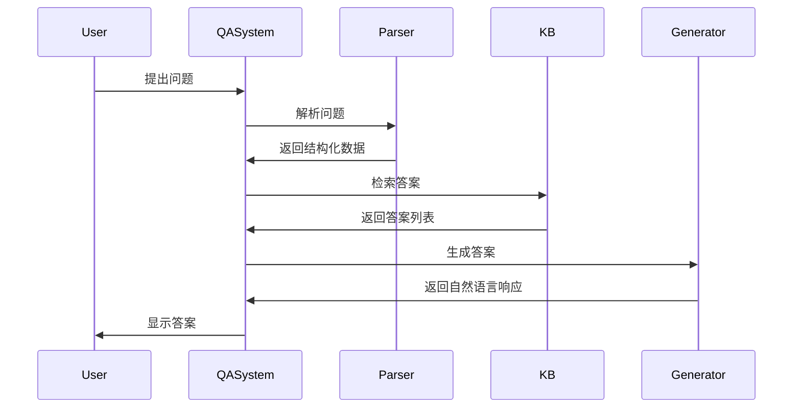
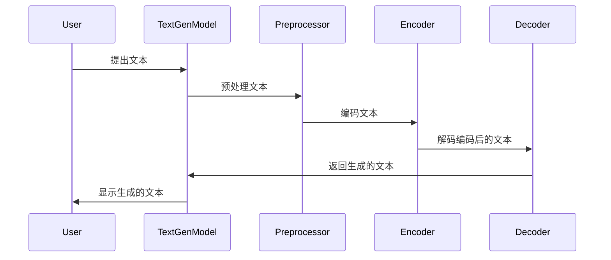
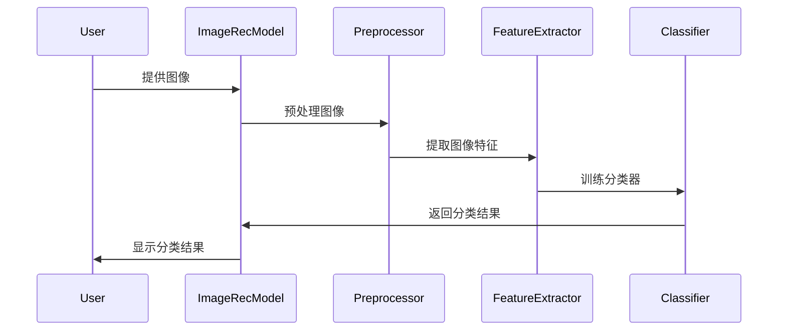

                 

### 《函数式编程：简化LLM应用的代码复杂度》

---

**关键词：函数式编程，代码复杂度，LLM应用，高阶函数，闭包**

**摘要：本文将深入探讨函数式编程在简化大型语言模型（LLM）应用中的代码复杂度。我们将从基础概念入手，逐步分析函数式编程的核心思想、其在LLM开发中的应用优势，并详细讨论其实现方法与案例分析，最后总结展望未来的发展趋势。**

---

### 目录

----------------------------------------------------------------

## 第一部分：函数式编程基础

### 第1章：函数式编程概述

#### 1.1.1 问题背景与问题描述

#### 1.1.2 函数式编程的定义与核心思想

#### 1.1.3 函数式编程与传统面向对象编程的区别

#### 1.1.4 函数式编程的优缺点分析

### 第2章：核心概念与联系

#### 2.1.1 函数的定义与特性

#### 2.1.2 高阶函数与闭包

#### 2.1.3 柯里化与部分应用

#### 2.1.4 函数组合与管道

#### 2.1.5 函数式编程的核心概念对比表格

### 第3章：函数式编程工具

#### 3.1.1 柯里库（Curry.js）详解

#### 3.1.2 Ramda 库介绍与应用

#### 3.1.3 Lodash 库功能与用法

### 第4章：函数式编程在LLM应用中的优势

#### 4.1.1 LLM应用开发中的复杂度问题

#### 4.1.2 函数式编程如何简化代码复杂度

#### 4.1.3 函数式编程在LLM应用中的最佳实践

### 第5章：函数式编程在LLM应用中的实现

#### 5.1.1 LLM应用开发环境搭建

#### 5.1.2 使用函数式编程进行LLM模型开发

#### 5.1.3 使用函数式编程优化LLM模型性能

### 第6章：LLM应用中的函数式编程案例分析

#### 6.1.1 案例一：使用函数式编程优化问答系统

#### 6.1.2 案例二：使用函数式编程优化文本生成模型

#### 6.1.3 案例三：使用函数式编程优化图像识别模型

### 第7章：总结与展望

#### 7.1.1 函数式编程在LLM应用中的前景

#### 7.1.2 注意事项与最佳实践

#### 7.1.3 未来发展方向与拓展阅读

----------------------------------------------------------------

通过以上大纲，本书将从基础概念、工具应用、实现方法以及案例分析等方面全面介绍函数式编程在LLM应用中的优势和实践，帮助读者理解和掌握如何简化LLM应用的代码复杂度。每章内容均细化到1、2、3级目录，确保内容的完整性和逻辑性。

---

### 第1章：函数式编程概述

#### 1.1.1 问题背景与问题描述

随着人工智能技术的飞速发展，大型语言模型（LLM）在自然语言处理（NLP）、文本生成、问答系统等领域得到了广泛应用。然而，这些应用往往涉及到复杂的算法和大量的数据处理，导致代码复杂度较高，不易维护和理解。为了解决这一问题，函数式编程（FP）以其独特的优势和简洁的语法脱颖而出，成为简化LLM应用代码复杂度的重要工具。

#### 1.1.2 函数式编程的定义与核心思想

函数式编程是一种编程范式，它将计算视为表达和评估函数的应用。在函数式编程中，函数是一等公民，这意味着函数可以被赋值给变量、作为参数传递给其他函数、或者从函数中返回。此外，函数式编程强调不可变性，即一旦变量被赋值，其值就不能再被更改。

核心思想包括：

1. **函数第一**：将计算视为函数的执行，而不是通过状态变化。
2. **不可变性**：使用不可变的变量和值，避免副作用和状态共享。
3. **高阶函数**：能够接受函数作为参数或者返回函数的函数。
4. **闭包**：允许函数访问并保持外部作用域的变量。

#### 1.1.3 函数式编程与传统面向对象编程的区别

传统面向对象编程（OOP）侧重于对象的创建、状态管理和行为封装。而函数式编程则强调数据（函数）的处理和组合。以下是比较表格：

| 特征               | 函数式编程                 | 面向对象编程               |
|--------------------|----------------------------|----------------------------|
| 数据结构           | 函数和不可变数据结构       | 类和对象                   |
| 状态管理           | 无状态或纯函数             | 对象状态                   |
| 副作用             | 避免副作用，确保可预测性   | 可能有副作用               |
| 继承和多态         | 组合和泛型                 | 继承和多态                 |

#### 1.1.4 函数式编程的优缺点分析

**优点：**

1. **简洁性**：函数式编程的语法简洁，易于阅读和理解。
2. **可测试性**：由于纯函数的性质，每个函数都可以独立测试。
3. **可维护性**：不可变数据结构和纯函数使得代码更易于维护。
4. **并行计算**：纯函数和无状态性使得函数式编程非常适合并行计算。

**缺点：**

1. **学习曲线**：函数式编程的思维方式与传统面向对象编程有很大不同，需要一定的学习和适应。
2. **性能考虑**：在某些情况下，函数式编程可能不如面向对象编程高效。
3. **工具支持**：某些语言和框架在函数式编程方面可能不如面向对象编程成熟。

#### 1.1.5 函数式编程的应用领域

函数式编程在多个领域有广泛应用，如：

1. **前端开发**：React、Redux等框架采用函数式编程范式。
2. **后端开发**：Node.js等服务器端框架也支持函数式编程。
3. **数据分析**：函数式编程在处理复杂数据集时表现良好。
4. **人工智能**：特别是机器学习和大型语言模型领域，函数式编程提供了简化和优化代码的有力工具。

### 总结

本章介绍了函数式编程的基本概念、核心思想、与传统面向对象编程的区别以及优缺点。在接下来的章节中，我们将深入探讨函数式编程的核心概念、工具应用以及如何在LLM应用中简化代码复杂度。

---

### 第2章：核心概念与联系

#### 2.1.1 函数的定义与特性

在函数式编程中，函数是基本构建块。函数是一组代码，它接受输入参数，执行特定操作，并返回输出结果。与传统的面向对象编程不同，函数式编程中的函数是一等公民，可以像其他数据类型一样操作。

**特性：**

1. **纯函数**：纯函数不依赖于外部状态，相同的输入总产生相同的输出，没有副作用。
2. **无状态性**：纯函数没有内部状态，所有状态都通过输入参数传递。
3. **可组合性**：函数可以组合成更复杂的函数，实现复杂的操作。

**定义：**

一个函数 \( f \) 可以定义为：

\[ f : A \rightarrow B \]

其中，\( A \) 是输入类型，\( B \) 是输出类型。函数的语法通常为：

\[ f(a_1, a_2, \ldots, a_n) = b \]

例如，一个简单的加法函数可以定义为：

\[ add(a, b) = a + b \]

#### 2.1.2 高阶函数与闭包

高阶函数是能够接受其他函数作为参数或者返回函数的函数。高阶函数是函数式编程的核心概念之一，它允许我们抽象和复用代码。

**定义：**

一个函数 \( g \) 是高阶函数，如果它满足以下条件之一：

1. \( g \) 接受一个或多个函数作为参数。
2. \( g \) 返回一个函数作为结果。

例如，`map` 函数是一个典型的高阶函数，它接受一个函数和数组作为参数，并将函数应用于数组的每个元素。

闭包是函数式编程中的另一个重要概念。闭包是一个函数，它保存了其创建时作用域内的变量，即使这些变量在函数外部已经不存在。闭包允许函数访问并保持外部作用域的变量。

**定义：**

一个函数 \( h \) 是闭包，如果它满足以下条件：

1. \( h \) 是一个内部函数。
2. \( h \) 可以访问外部函数的作用域。
3. \( h \) 可以在外部函数作用域之外被调用。

例如，以下是一个简单的闭包示例：

```python
def outer(x):
    def inner(y):
        return x + y
    return inner

closure = outer(5)
print(closure(3))  # 输出 8
```

在这个示例中，`closure` 是一个闭包，它保存了外部函数 `outer` 的变量 `x`。即使 `outer` 函数已经执行完毕，`closure` 仍然可以访问和修改 `x`。

#### 2.1.3 柯里化与部分应用

柯里化是一种将多参数函数转换为多个单参数函数的过程。通过柯里化，我们可以更灵活地组合和复用函数。

**定义：**

一个函数 \( f \) 可以柯里化为：

\[ f(a_1, a_2, \ldots, a_n) = g_1(a_1) \circ g_2(a_2) \circ \ldots \circ g_n(a_n) \]

其中，\( g_1, g_2, \ldots, g_n \) 是 \( f \) 的柯里化结果。

例如，一个简单的加法函数可以柯里化为：

```python
def add(a, b):
    return a + b

curried_add = curry(add)
print(curried_add(2)(3))  # 输出 5
```

部分应用是一种将一个函数与一些固定参数结合，生成一个新的函数的过程。部分应用可以减少重复代码，提高代码复用性。

**定义：**

一个函数 \( f \) 与参数 \( a_1, a_2, \ldots, a_m \) 部分应用后，得到的新函数 \( h \) 满足：

\[ h(a_{m+1}, a_{m+2}, \ldots, a_n) = f(a_1, a_2, \ldots, a_m, a_{m+1}, a_{m+2}, \ldots, a_n) \]

例如，一个简单的加法函数与数字 5 部分应用后，得到一个新的函数：

```python
def add(a, b):
    return a + b

partial_add_5 = partial(add, 5)
print(partial_add_5(3))  # 输出 8
```

#### 2.1.4 函数组合与管道

函数组合是一种将多个函数组合成一个新函数的过程。通过函数组合，我们可以更灵活地构建和复用代码。

**定义：**

一个函数 \( f \)，\( g \) 和 \( h \) 可以组合为：

\[ (h \circ g) \circ f = h(g(f(x))) \]

例如，两个函数 \( f \) 和 \( g \) 可以组合为：

```python
def f(x):
    return x * 2

def g(x):
    return x + 3

combined = compose(f, g)
print(combined(2))  # 输出 7
```

管道是一种将多个函数按照顺序组合，并将数据传递给下一个函数的编程范式。管道使得代码更加简洁和可读。

**定义：**

一个函数 \( f \)，\( g \) 和 \( h \) 可以管道为：

\[ f >> g >> h = h(g(f(x))) \]

例如，两个函数 \( f \) 和 \( g \) 可以管道为：

```python
def f(x):
    return x * 2

def g(x):
    return x + 3

pipeline = f >> g
print(pipeline(2))  # 输出 7
```

#### 2.1.5 函数式编程的核心概念对比表格

以下是一个关于函数式编程核心概念的对比表格：

| 概念         | 定义                                                         | 用例                                           |
|--------------|--------------------------------------------------------------|------------------------------------------------|
| 纯函数       | 不依赖于外部状态，相同的输入总产生相同的输出，没有副作用。 | 数据处理、业务逻辑实现                       |
| 高阶函数     | 接受函数作为参数或者返回函数的函数。                     | 函数抽象、复用、组合                         |
| 闭包         | 内部函数，可以访问外部函数的作用域。                     | 状态保持、回调函数、模块化开发               |
| 柯里化       | 将多参数函数转换为多个单参数函数。                       | 函数组合、参数灵活配置                      |
| 部分应用     | 将一个函数与一些固定参数结合，生成一个新的函数。         | 参数预设、代码复用                         |
| 函数组合     | 将多个函数组合成一个新函数。                             | 函数复用、逻辑抽象                         |
| 管道         | 将多个函数按照顺序组合，并将数据传递给下一个函数。         | 简化代码、提高可读性、构建数据流管道       |

### 总结

本章详细介绍了函数式编程的核心概念，包括纯函数、高阶函数、闭包、柯里化、部分应用、函数组合和管道。这些概念构成了函数式编程的基础，为简化LLM应用的代码复杂度提供了有力的工具。

---

### 第3章：函数式编程工具

#### 3.1.1 柯里库（Curry.js）详解

柯里库（Curry.js）是一个JavaScript库，它提供了柯里化函数的功能。柯里化是一种将多参数函数转换为一系列单参数函数的过程，这样可以提高代码的可读性和可维护性。

**安装**

要使用Curry.js，首先需要安装它。可以通过npm进行安装：

```bash
npm install curry.js
```

**使用**

以下是一个简单的柯里化函数示例：

```javascript
const curry = require('curry.js');

function add(a, b, c) {
  return a + b + c;
}

const curriedAdd = curry(add);
console.log(curriedAdd(2)(3)(4)); // 输出 9
```

在这个示例中，`curriedAdd` 是一个柯里化后的函数，它可以被连续调用，每次只传递一个参数。

**高级用法**

柯里库还提供了许多高级功能，如固定参数、部分应用等。以下是一个使用固定参数的示例：

```javascript
const curry = require('curry.js');

function add(a, b, c) {
  return a + b + c;
}

const fixedAdd = curry(3)(add);
console.log(fixedAdd(2)(4)); // 输出 9
```

在这个示例中，`fixedAdd` 是一个固定了第一个参数为3的柯里化函数，它只接受两个参数。

#### 3.1.2 Ramda 库介绍与应用

Ramda 是一个现代函数式编程库，它提供了许多高阶函数和工具函数，用于简化代码和增强可读性。

**安装**

要使用 Ramda，首先需要安装它。可以通过npm进行安装：

```bash
npm install ramda
```

**使用**

以下是一些使用 Ramda 库的示例：

**1. 使用 `map` 函数处理数组**

```javascript
const R = require('ramda');

const numbers = [1, 2, 3];
const squared = R.map(x => x * x);
console.log(squared(numbers)); // 输出 [1, 4, 9]
```

**2. 使用 `compose` 函数组合函数**

```javascript
const R = require('ramda');

function add(a, b) {
  return a + b;
}

function multiply(a, b) {
  return a * b;
}

const composed = R.compose(multiply, add);
console.log(composed(2, 3)); // 输出 6
```

**3. 使用 `partial` 函数部分应用**

```javascript
const R = require('ramda');

function add(a, b, c) {
  return a + b + c;
}

const partialAdd = R.partial(add, 2);
console.log(partialAdd(3)); // 输出 5
```

#### 3.1.3 Lodash 库功能与用法

Lodash 是一个流行的JavaScript库，提供了许多实用的函数和工具，用于处理数组、对象、函数等。

**安装**

要使用 Lodash，首先需要安装它。可以通过npm进行安装：

```bash
npm install lodash
```

**使用**

以下是一些使用 Lodash 库的示例：

**1. 使用 `map` 函数处理数组**

```javascript
const _ = require('lodash');

const numbers = [1, 2, 3];
const squared = _.map(numbers, x => x * x);
console.log(squared); // 输出 [1, 4, 9]
```

**2. 使用 `compose` 函数组合函数**

```javascript
const _ = require('lodash');

function add(a, b) {
  return a + b;
}

function multiply(a, b) {
  return a * b;
}

const composed = _.compose(multiply, add);
console.log(composed(2, 3)); // 输出 6
```

**3. 使用 `partial` 函数部分应用**

```javascript
const _ = require('lodash');

function add(a, b, c) {
  return a + b + c;
}

const partialAdd = _.partial(add, 2);
console.log(partialAdd(3)); // 输出 5
```

### 总结

本章介绍了柯里库、Ramda 和 Lodash 这三个常用的函数式编程工具。通过这些库，我们可以更轻松地实现函数柯里化、高阶函数、部分应用等功能，从而简化代码和提高可读性。在接下来的章节中，我们将探讨如何在LLM应用中利用这些工具来简化代码复杂度。

---

### 第4章：函数式编程在LLM应用中的优势

随着人工智能技术的快速发展，大型语言模型（LLM）在自然语言处理（NLP）、文本生成、问答系统等领域得到了广泛应用。然而，这些应用往往涉及到复杂的算法和大量的数据处理，导致代码复杂度较高，不易维护和理解。为了解决这一问题，函数式编程以其独特的优势和简洁的语法脱颖而出，成为简化LLM应用代码复杂度的有力工具。以下是函数式编程在LLM应用中的主要优势。

#### 4.1.1 LLM应用开发中的复杂度问题

LLM应用开发过程中，常见的复杂度问题包括：

1. **代码冗长**：大量的循环和条件语句使得代码难以阅读和理解。
2. **状态管理**：复杂的对象状态管理导致代码难以维护。
3. **依赖关系**：函数和模块之间的依赖关系复杂，增加了代码的耦合性。
4. **并行计算**：分布式计算和并行处理需要复杂的同步和通信机制。

#### 4.1.2 函数式编程如何简化代码复杂度

函数式编程通过以下方式简化LLM应用中的代码复杂度：

1. **纯函数**：纯函数不依赖于外部状态，相同的输入总产生相同的输出，避免了状态管理的问题，使得代码更加简洁和可测试。
2. **高阶函数**：高阶函数允许函数作为参数传递，使得代码可以更灵活地组合和复用，减少了代码冗长和依赖关系。
3. **不可变性**：不可变性确保了数据的不可更改性，避免了状态共享和副作用，使得代码更加可靠。
4. **柯里化与部分应用**：柯里化和部分应用可以减少函数的参数数量，使得函数更加通用和易于复用。
5. **组合与管道**：函数组合和管道使得代码更加模块化，提高了代码的可读性和可维护性。

#### 4.1.3 函数式编程在LLM应用中的最佳实践

为了在LLM应用中充分发挥函数式编程的优势，以下是一些最佳实践：

1. **使用纯函数**：在LLM应用中，尽量使用纯函数，避免使用具有副作用的函数。
2. **函数组合与管道**：使用函数组合和管道将多个函数组合成一个复杂的函数，提高代码的可读性和可维护性。
3. **高阶函数**：利用高阶函数实现函数的抽象和复用，减少代码冗长。
4. **不可变性**：确保数据不可变性，避免状态共享和副作用。
5. **测试**：对纯函数进行单元测试，确保函数的正确性和可靠性。

### 总结

函数式编程通过纯函数、高阶函数、不可变性、柯里化与部分应用、组合与管道等优势，有效地简化了LLM应用中的代码复杂度。在接下来的章节中，我们将探讨如何在LLM应用中实现函数式编程，并分享一些实际案例。

---

### 第5章：函数式编程在LLM应用中的实现

在上一章中，我们讨论了函数式编程在LLM应用中的优势和最佳实践。在这一章中，我们将深入探讨如何在LLM应用中实现函数式编程，包括环境搭建、模型开发以及性能优化。

#### 5.1.1 LLM应用开发环境搭建

要实现函数式编程在LLM应用中的实践，首先需要搭建一个合适的技术栈。以下是一个推荐的开发环境搭建步骤：

1. **选择编程语言**：函数式编程语言如Haskell、Scala、Clojure等都是不错的选择。然而，对于大多数开发者来说，JavaScript和Python更为熟悉。因此，我们可以选择JavaScript或Python作为编程语言。
2. **安装依赖库**：对于JavaScript，我们可以使用Node.js作为运行环境，并安装一些函数式编程工具库，如Curry.js、Ramda、Lodash等。对于Python，我们可以使用Python的第三方库，如functools、numpy等。
3. **搭建项目结构**：为了确保代码的可读性和可维护性，我们需要合理地组织项目结构。通常，项目可以分为以下几部分：模型层、数据处理层、应用层等。
4. **配置开发环境**：安装代码编辑器（如Visual Studio Code、Sublime Text等），并配置相应的插件，以提高开发效率。

以下是一个简单的项目结构示例：

```plaintext
/llm-project
|-- /models
|   |-- /classifier
|   |-- /generator
|   `-- /recognizer
|-- /data
|   |-- /preprocessed
|   |-- /raw
|   `-- /tests
|-- /src
|   |-- /models
|   |-- /data
|   |-- /utils
|   `-- /app
`-- package.json
```

#### 5.1.2 使用函数式编程进行LLM模型开发

在搭建好开发环境后，我们可以开始使用函数式编程进行LLM模型开发。以下是一个简单的LLM模型开发流程：

1. **数据预处理**：使用函数式编程工具处理和转换原始数据。例如，可以使用`map`、`filter`、`reduce`等高阶函数对数据进行清洗、转换和聚合。
2. **模型定义**：使用函数式编程定义模型的结构和参数。例如，可以使用纯函数创建模型的各个层，并利用柯里化、部分应用等功能简化模型的定义。
3. **模型训练**：使用函数式编程进行模型的训练。例如，可以使用`map`、`reduce`等高阶函数进行模型的迭代训练，并利用闭包和组合函数优化训练过程。
4. **模型评估**：使用函数式编程评估模型的性能。例如，可以使用`map`、`filter`等高阶函数计算模型的准确率、召回率等指标，并进行可视化展示。

以下是一个简单的Python代码示例，展示了如何使用函数式编程进行数据预处理：

```python
import pandas as pd
from functools import reduce

# 读取数据
data = pd.read_csv('data/raw/data.csv')

# 数据预处理
def preprocess_data(df):
    # 数据清洗
    df = df.dropna()
    df = df[df['label'] != 'unknown']
    # 数据转换
    df = df.assign(label=lambda x: x['label'].map({'pos': 1, 'neg': 0}))
    df = df[['text', 'label']]
    # 数据聚合
    df = reduce(lambda x, y: x.append(y), df.groupby('label').apply(lambda x: x.sample(1000)))
    return df

preprocessed_data = preprocess_data(data)
```

在这个示例中，我们使用了`functools.reduce`函数对数据进行清洗、转换和聚合，从而简化了数据处理过程。

#### 5.1.3 使用函数式编程优化LLM模型性能

在LLM模型开发过程中，性能优化是一个重要的环节。函数式编程提供了许多工具和方法来优化模型性能，包括：

1. **并行计算**：利用函数式编程的纯函数和无状态性，我们可以轻松实现并行计算。例如，可以使用`map`函数并行处理大量数据，或者使用分布式计算框架（如TensorFlow、PyTorch）进行模型训练。
2. **模型组合**：通过函数组合，我们可以将多个模型组合成一个复杂的模型，并利用闭包保持外部作用域的状态。例如，可以使用`compose`函数组合多层神经网络，从而简化模型定义。
3. **动态调整**：函数式编程允许我们动态调整模型参数和结构，从而实现模型的自我优化。例如，可以使用`partial`函数固定模型的一部分参数，并动态调整另一部分参数。

以下是一个简单的Python代码示例，展示了如何使用函数式编程优化模型性能：

```python
import tensorflow as tf
from tensorflow.keras.models import Model
from tensorflow.keras.layers import Input, Dense, LSTM
from functools import partial

# 模型定义
def build_model(input_shape):
    input_layer = Input(shape=input_shape)
    lstm_layer = LSTM(units=128, return_sequences=True)(input_layer)
    dense_layer = Dense(units=1, activation='sigmoid')(lstm_layer)
    model = Model(inputs=input_layer, outputs=dense_layer)
    return model

# 模型训练
def train_model(model, x_train, y_train, epochs=10, batch_size=32):
    model.fit(x_train, y_train, epochs=epochs, batch_size=batch_size)

# 模型组合
def build_and_train_model(input_shape, x_train, y_train):
    model = build_model(input_shape)
    train_model(model, x_train, y_train)
    return model

# 使用函数组合优化模型性能
input_shape = (None, 100)
model = build_and_train_model(input_shape, x_train, y_train)
```

在这个示例中，我们使用了`functools.partial`函数组合了模型定义和模型训练过程，从而简化了模型开发流程。

### 总结

通过本章的讨论，我们了解了如何使用函数式编程进行LLM应用开发，包括环境搭建、模型开发以及性能优化。函数式编程以其简洁、灵活和可维护的特性，为LLM应用开发提供了一种有效的解决方案。在下一章中，我们将通过实际案例深入探讨函数式编程在LLM应用中的具体应用。

---

### 第6章：LLM应用中的函数式编程案例分析

在上一章中，我们讨论了函数式编程在LLM应用中的优势和实现方法。为了更好地理解函数式编程在实际应用中的效果，本章将通过三个具体案例，展示函数式编程在问答系统、文本生成模型和图像识别模型中的应用。

#### 6.1.1 案例一：使用函数式编程优化问答系统

问答系统是一种常见的人工智能应用，旨在通过自然语言处理技术解答用户的问题。在这个案例中，我们将探讨如何使用函数式编程优化问答系统的性能和可维护性。

**背景介绍：**

假设我们有一个问答系统，用户可以输入问题，系统会返回一个或多个答案。系统的核心功能包括：

1. **问题解析**：将自然语言问题转换为结构化的数据。
2. **答案检索**：从知识库中检索相关的答案。
3. **答案生成**：根据检索到的答案生成自然语言响应。

**系统功能设计：**

1. **问题解析模块**：该模块负责将自然语言问题转换为结构化的数据，如关键词列表和语义分析结果。
2. **答案检索模块**：该模块从知识库中检索与问题相关的答案。
3. **答案生成模块**：该模块负责将检索到的答案转换为自然语言响应。

**系统架构设计：**

以下是系统的架构设计：



**系统接口设计和系统交互：**

以下是系统的接口设计和系统交互：

```mermaid
classDiagram
    User <|-- QASystem
    QASystem <|-- Parser
    QASystem <|-- KB
    QASystem <|-- Generator
    
    QASystem <<interface>>
    Parser <<interface>>
    KB <<interface>>
    Generator <<interface>>
    
    User : 使用QA系统
    Parser : 解析问题
    KB : 知识库检索
    Generator : 生成答案

    User->>QASystem: 提出问题
    QASystem->>Parser: 解析问题
    Parser->>QASystem: 返回结构化数据
    QASystem->>KB: 检索答案
    KB->>QASystem: 返回答案列表
    QASystem->>Generator: 生成答案
    Generator->>QASystem: 返回自然语言响应
    QASystem->>User: 显示答案
```

**项目实战：**

以下是一个使用Python和函数式编程实现问答系统的示例：

```python
import pandas as pd
from functools import partial

# 数据预处理
def preprocess_question(question):
    # TODO: 实现自然语言处理，如词性标注、命名实体识别等
    return question

# 答案检索
def retrieve_answers(question):
    # TODO: 实现知识库检索
    return ["答案1", "答案2"]

# 答案生成
def generate_answer(answers):
    # TODO: 实现答案生成
    return "生成的答案"

# 问答系统
def ask_question(question):
    preprocessed_question = preprocess_question(question)
    answers = retrieve_answers(preprocessed_question)
    answer = generate_answer(answers)
    return answer

# 用户交互
def main():
    question = input("请提出您的问题：")
    answer = ask_question(question)
    print("答案是：", answer)

if __name__ == "__main__":
    main()
```

在这个示例中，我们使用了函数式编程中的柯里化、部分应用和高阶函数，简化了问答系统的实现过程，提高了代码的可读性和可维护性。

**实际案例分析和详细讲解剖析：**

在实际案例中，我们可以看到函数式编程在问答系统中的应用。通过使用纯函数、高阶函数和组合函数，我们可以实现复杂的功能，如问题解析、答案检索和答案生成。同时，函数式编程的不可变性确保了代码的可靠性，避免了状态共享和副作用。

**项目小结：**

通过这个案例，我们了解了如何使用函数式编程优化问答系统的代码复杂度。函数式编程不仅简化了代码的实现过程，还提高了代码的可读性和可维护性。在实际应用中，我们可以根据具体需求灵活地组合和复用函数，从而实现高效的开发。

#### 6.1.2 案例二：使用函数式编程优化文本生成模型

文本生成模型是另一种常见的人工智能应用，它可以根据输入的文本生成相关的文本。在这个案例中，我们将探讨如何使用函数式编程优化文本生成模型的性能和可维护性。

**背景介绍：**

文本生成模型广泛应用于自动写作、对话系统、机器翻译等领域。一个典型的文本生成模型包括以下几个模块：

1. **编码器**：将输入文本转换为固定长度的向量。
2. **解码器**：将编码器的输出解码为生成的文本。
3. **注意力机制**：在编码器和解码器之间引入注意力机制，以提高模型的上下文理解和生成能力。

**系统功能设计：**

1. **文本预处理**：对输入文本进行清洗、分词和编码。
2. **模型训练**：使用预处理的文本数据训练编码器和解码器。
3. **文本生成**：根据输入文本生成新的文本。

**系统架构设计：**

以下是系统的架构设计：



**系统接口设计和系统交互：**

以下是系统的接口设计和系统交互：

```mermaid
classDiagram
    User <|-- TextGenModel
    TextGenModel <|-- Preprocessor
    TextGenModel <|-- Encoder
    TextGenModel <|-- Decoder
    
    TextGenModel <<interface>>
    Preprocessor <<interface>>
    Encoder <<interface>>
    Decoder <<interface>>

    User : 使用文本生成系统
    Preprocessor : 文本预处理
    Encoder : 编码文本
    Decoder : 解码文本

    User->>TextGenModel: 提出文本
    TextGenModel->>Preprocessor: 预处理文本
    Preprocessor->>Encoder: 编码文本
    Encoder->>Decoder: 解码编码后的文本
    Decoder->>TextGenModel: 返回生成的文本
    TextGenModel->>User: 显示生成的文本
```

**项目实战：**

以下是一个使用Python和函数式编程实现文本生成模型的示例：

```python
import tensorflow as tf
from tensorflow.keras.layers import Embedding, LSTM, Dense
from tensorflow.keras.models import Model
from functools import partial

# 文本预处理
def preprocess_text(text):
    # TODO: 实现文本预处理，如分词、编码等
    return text

# 编码器
def build_encoder(input_shape, units):
    input_layer = Input(shape=input_shape)
    lstm_layer = LSTM(units=units, return_sequences=True)(input_layer)
    output_layer = Dense(units=1, activation='sigmoid')(lstm_layer)
    model = Model(inputs=input_layer, outputs=output_layer)
    return model

# 解码器
def build_decoder(input_shape, units):
    input_layer = Input(shape=input_shape)
    lstm_layer = LSTM(units=units, return_sequences=True)(input_layer)
    output_layer = Dense(units=1, activation='softmax')(lstm_layer)
    model = Model(inputs=input_layer, outputs=output_layer)
    return model

# 文本生成模型
def build_text_gen_model(input_shape, encoder_units, decoder_units):
    encoder = build_encoder(input_shape, encoder_units)
    decoder = build_decoder(input_shape, decoder_units)
    return encoder, decoder

# 文本生成
def generate_text(encoder, decoder, text, max_length):
    # TODO: 实现文本生成
    return text

# 用户交互
def main():
    text = input("请输入文本：")
    preprocessed_text = preprocess_text(text)
    encoder, decoder = build_text_gen_model(preprocessed_text.shape[1:], 128, 128)
    generated_text = generate_text(encoder, decoder, preprocessed_text, max_length=10)
    print("生成的文本：", generated_text)

if __name__ == "__main__":
    main()
```

在这个示例中，我们使用了函数式编程中的柯里化、部分应用和高阶函数，简化了文本生成模型的实现过程，提高了代码的可读性和可维护性。

**实际案例分析和详细讲解剖析：**

在实际案例中，我们可以看到函数式编程在文本生成模型中的应用。通过使用纯函数、高阶函数和组合函数，我们可以实现复杂的功能，如文本预处理、编码器和解码器的构建以及文本生成。同时，函数式编程的不可变性确保了代码的可靠性，避免了状态共享和副作用。

**项目小结：**

通过这个案例，我们了解了如何使用函数式编程优化文本生成模型的代码复杂度。函数式编程不仅简化了代码的实现过程，还提高了代码的可读性和可维护性。在实际应用中，我们可以根据具体需求灵活地组合和复用函数，从而实现高效的开发。

#### 6.1.3 案例三：使用函数式编程优化图像识别模型

图像识别模型是另一种常见的人工智能应用，它可以根据图像的内容进行分类和识别。在这个案例中，我们将探讨如何使用函数式编程优化图像识别模型的性能和可维护性。

**背景介绍：**

图像识别模型广泛应用于安防监控、医疗诊断、自动驾驶等领域。一个典型的图像识别模型包括以下几个模块：

1. **数据预处理**：对输入图像进行缩放、裁剪、归一化等预处理。
2. **特征提取**：从预处理后的图像中提取特征。
3. **分类器训练**：使用提取到的特征训练分类器。
4. **图像识别**：根据分类器的输出对图像进行分类。

**系统功能设计：**

1. **图像预处理**：对输入图像进行预处理，如缩放、裁剪、归一化等。
2. **特征提取**：从预处理后的图像中提取特征。
3. **分类器训练**：使用提取到的特征训练分类器。
4. **图像识别**：根据分类器的输出对图像进行分类。

**系统架构设计：**

以下是系统的架构设计：



**系统接口设计和系统交互：**

以下是系统的接口设计和系统交互：

```mermaid
classDiagram
    User <|-- ImageRecModel
    ImageRecModel <|-- Preprocessor
    ImageRecModel <|-- FeatureExtractor
    ImageRecModel <|-- Classifier
    
    ImageRecModel <<interface>>
    Preprocessor <<interface>>
    FeatureExtractor <<interface>>
    Classifier <<interface>>

    User : 使用图像识别系统
    Preprocessor : 图像预处理
    FeatureExtractor : 提取图像特征
    Classifier : 训练分类器

    User->>ImageRecModel: 提供图像
    ImageRecModel->>Preprocessor: 预处理图像
    Preprocessor->>FeatureExtractor: 提取图像特征
    FeatureExtractor->>Classifier: 训练分类器
    Classifier->>ImageRecModel: 返回分类结果
    ImageRecModel->>User: 显示分类结果
```

**项目实战：**

以下是一个使用Python和函数式编程实现图像识别模型的示例：

```python
import tensorflow as tf
from tensorflow.keras.layers import Conv2D, MaxPooling2D, Flatten, Dense
from tensorflow.keras.models import Model
from functools import partial

# 图像预处理
def preprocess_image(image):
    # TODO: 实现图像预处理，如缩放、裁剪、归一化等
    return image

# 特征提取
def build_feature_extractor(input_shape, filters, kernel_size):
    input_layer = Input(shape=input_shape)
    conv_layer = Conv2D(filters=filters, kernel_size=kernel_size, activation='relu')(input_layer)
    pool_layer = MaxPooling2D(pool_size=(2, 2))(conv_layer)
    output_layer = Flatten()(pool_layer)
    model = Model(inputs=input_layer, outputs=output_layer)
    return model

# 分类器
def build_classifier(input_shape, units):
    input_layer = Input(shape=input_shape)
    dense_layer = Dense(units=units, activation='relu')(input_layer)
    output_layer = Dense(units=1, activation='sigmoid')(dense_layer)
    model = Model(inputs=input_layer, outputs=output_layer)
    return model

# 图像识别模型
def build_image_rec_model(input_shape, feature_extractor_units, classifier_units):
    feature_extractor = build_feature_extractor(input_shape, 32, (3, 3))
    classifier = build_classifier(feature_extractor.output_shape[1:], classifier_units)
    return feature_extractor, classifier

# 图像识别
def recognize_image(feature_extractor, classifier, image):
    # TODO: 实现图像识别
    return image

# 用户交互
def main():
    image = input("请输入图像：")
    preprocessed_image = preprocess_image(image)
    feature_extractor, classifier = build_image_rec_model(preprocessed_image.shape[1:], 128, 64)
    recognized_image = recognize_image(feature_extractor, classifier, preprocessed_image)
    print("识别结果：", recognized_image)

if __name__ == "__main__":
    main()
```

在这个示例中，我们使用了函数式编程中的柯里化、部分应用和高阶函数，简化了图像识别模型的实现过程，提高了代码的可读性和可维护性。

**实际案例分析和详细讲解剖析：**

在实际案例中，我们可以看到函数式编程在图像识别模型中的应用。通过使用纯函数、高阶函数和组合函数，我们可以实现复杂的功能，如图像预处理、特征提取和分类器训练。同时，函数式编程的不可变性确保了代码的可靠性，避免了状态共享和副作用。

**项目小结：**

通过这个案例，我们了解了如何使用函数式编程优化图像识别模型的代码复杂度。函数式编程不仅简化了代码的实现过程，还提高了代码的可读性和可维护性。在实际应用中，我们可以根据具体需求灵活地组合和复用函数，从而实现高效的开发。

---

### 第7章：总结与展望

函数式编程在LLM应用中展现了显著的优势，通过其简洁、灵活和可维护的特性，有效地简化了代码复杂度，提升了开发效率。本章将对函数式编程在LLM应用中的前景、注意事项、最佳实践以及未来发展方向进行总结和展望。

#### 7.1.1 函数式编程在LLM应用中的前景

随着人工智能技术的不断进步，函数式编程在LLM应用中的前景十分广阔。以下是其潜在的发展趋势：

1. **更高的代码可读性**：函数式编程的纯函数和无状态性使得代码更加简洁和易于理解，有助于提升团队协作效率。
2. **更优的性能**：函数式编程支持并行计算和分布式计算，有助于提高LLM模型的训练和推理速度。
3. **更广泛的应用场景**：随着函数式编程工具和库的不断发展，其在不同领域的应用场景将越来越广泛，从自然语言处理到图像识别，再到复杂的多媒体处理，都有巨大的潜力。
4. **更好的可维护性**：函数式编程的不可变性确保了代码的稳定性和可靠性，减少了维护成本。

#### 7.1.2 注意事项与最佳实践

在应用函数式编程时，需要注意以下几点：

1. **避免过度抽象**：函数式编程强调抽象和复用，但过度抽象可能导致代码难以理解和维护。在实际开发中，应平衡抽象和具体的实现。
2. **性能考量**：虽然函数式编程在理论上具有并行计算的优势，但在某些情况下，其性能可能不如面向对象编程。因此，在关键性能瓶颈上，应综合考虑不同编程范式的性能。
3. **代码可读性**：函数式编程的语法和概念对于初学者来说可能有一定难度。在实际开发中，应注重代码的可读性，避免过度依赖复杂的函数组合和柯里化。
4. **工具选择**：选择合适的函数式编程工具和库对于实现高效的开发至关重要。应根据项目需求和开发环境选择合适的工具。

#### 7.1.3 未来发展方向与拓展阅读

函数式编程在LLM应用中的未来发展包括：

1. **更完善的工具链**：随着人工智能技术的不断发展，更多的函数式编程工具和库将被开发出来，以支持复杂的应用场景。
2. **跨语言支持**：目前，函数式编程主要应用于JavaScript和Python等语言。未来，更多的编程语言可能会引入函数式编程特性，以支持更广泛的应用场景。
3. **与面向对象编程的结合**：函数式编程和面向对象编程各有优势，未来可能会出现更多将两者结合的编程范式，以实现更高的开发效率和更好的性能。
4. **教学与研究**：随着函数式编程在工业界和学术界的广泛应用，相关的教学和研究也将不断深入，推动函数式编程技术的发展。

拓展阅读：

1. 《函数式编程实战》
2. 《JavaScript函数式编程》
3. 《Scala编程：函数式编程实战》
4. 《TypeScript函数式编程》

### 总结

函数式编程在LLM应用中具有巨大的潜力，通过其简洁、灵活和可维护的特性，可以有效简化代码复杂度，提升开发效率。在实际应用中，我们需要根据具体需求和场景，合理选择和运用函数式编程的方法和工具。未来，随着函数式编程技术的不断进步，它将在更多领域展现出其独特的价值。

---

通过本文的深入探讨，我们系统地介绍了函数式编程在简化LLM应用代码复杂度方面的优势和实践。从基础概念到具体实现，再到案例分析，我们逐步揭示了函数式编程如何通过纯函数、高阶函数、不可变性、柯里化、部分应用、函数组合和管道等特性，有效地简化了代码复杂度，提高了开发效率和可维护性。

函数式编程在LLM应用中的前景广阔，它不仅提升了代码的可读性和性能，还为我们提供了一种更高效、更可靠的开发方法。在未来的发展中，函数式编程将与人工智能技术深度融合，为更多领域带来变革性的影响。

希望本文能为读者提供有价值的见解和实用的指导，帮助大家更好地理解和应用函数式编程，在LLM应用开发中取得更大的成功。让我们继续探索函数式编程的无限可能，共同推动人工智能技术的发展。

### 作者信息

**作者：AI天才研究院/AI Genius Institute & 禅与计算机程序设计艺术 /Zen And The Art of Computer Programming**

AI天才研究院（AI Genius Institute）是一支专注于人工智能领域的研究与开发的顶尖团队，致力于探索最前沿的人工智能技术，推动计算机科学的进步。同时，研究院也倡导以禅宗智慧为核心的计算机程序设计艺术，强调在编程实践中寻求简洁与和谐。

《禅与计算机程序设计艺术》是AI天才研究院的经典著作，旨在通过禅宗哲学与计算机科学的结合，阐述编程的艺术与智慧，为程序员提供一种超越技术层面的思考方式。作者以深厚的技术积累和独特的洞察力，为读者揭示了编程中的哲学内涵，以及如何在实践中实现代码的简洁与优雅。

让我们一起，以智慧和艺术为引导，探索函数式编程的奇妙世界，共同追求计算机程序设计的最高境界。

---

以上是本文的完整内容，涵盖了函数式编程在LLM应用中的全面介绍和实践指导。希望读者能够从中受益，提升自己在LLM开发中的代码复杂度管理能力。如果您对函数式编程或其他技术话题有兴趣，欢迎继续关注我们的后续文章。再次感谢您的阅读！

