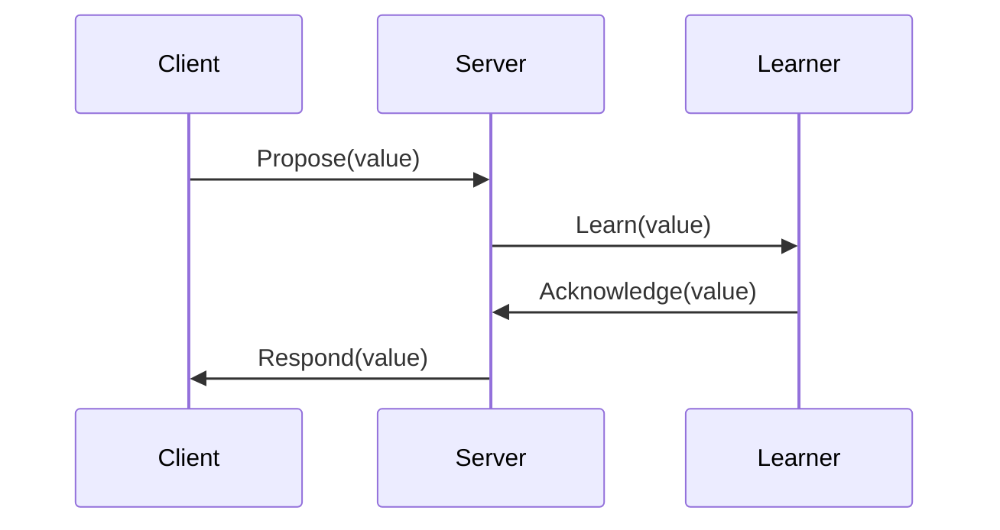
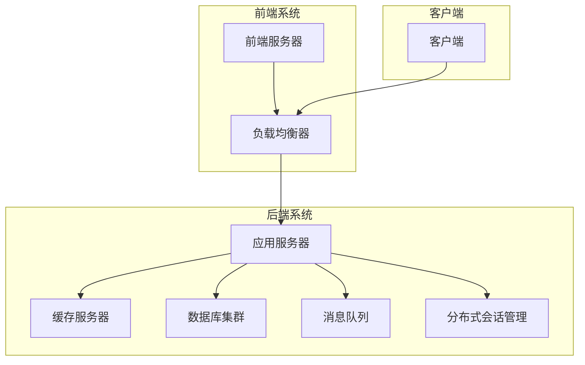

                 


## 分布式会话管理：提高LLM应用的可扩展性

### 关键词：分布式会话管理、LLM应用、可扩展性、系统架构、性能优化

### 摘要：

本文旨在探讨分布式会话管理在提高LLM（大型语言模型）应用可扩展性方面的作用。通过详细分析分布式会话管理的原理、技术细节、系统设计及实战案例，本文将帮助读者理解如何有效地在分布式系统中管理会话，并优化LLM应用的性能，从而实现更高的系统可扩展性。

### 1. 背景介绍

#### 1.1 分布式会话管理的重要性

在互联网时代，分布式系统已成为技术发展的主流。分布式会话管理作为分布式系统的重要组成部分，负责维护用户会话的状态，确保系统在分布式环境下的稳定性和高性能。传统的集中式会话管理在面临高并发请求时，容易出现性能瓶颈，难以满足现代互联网应用的需求。因此，分布式会话管理应运而生，它通过将会话数据分散存储和管理，提高了系统的可扩展性和可用性。

#### 1.2 LLM应用的兴起与发展

随着深度学习和自然语言处理技术的不断发展，LLM应用如ChatGPT、Bing Chat等相继涌现。这些应用基于大规模的神经网络模型，能够生成高质量的自然语言文本，为用户提供智能化的服务。然而，LLM应用在实现高性能、高可扩展性方面面临着诸多挑战，分布式会话管理正是解决这些挑战的关键技术之一。

### 2. 基本原理

#### 2.1 分布式系统基础

分布式系统由多个独立的节点组成，这些节点通过网络进行通信，协同工作以完成共同的任务。分布式系统的主要特点包括高可用性、高性能、可扩展性和容错性。在分布式系统中，会话管理是一个复杂的问题，因为用户会话可能跨越多个节点，需要确保会话的一致性和安全性。

#### 2.2 分布式会话管理原理

分布式会话管理主要包括以下几个关键组件：

1. **会话数据分布存储**：将用户会话数据分散存储在多个节点上，以便于系统的扩展。
2. **会话一致性保障**：通过一致性协议和分布式锁等技术，确保用户会话的一致性。
3. **会话安全策略**：采用加密、认证等技术，保障用户会话的安全性。

#### 2.3 LLM基础

LLM是一种基于深度学习的自然语言处理模型，它通过在大量文本数据上进行预训练，学习到了语言的通用特征。LLM的应用包括文本生成、问答系统、机器翻译等。在分布式系统中，LLM的性能优化是提高系统可扩展性的关键。

### 3. 技术细节

#### 3.1 分布式会话管理技术详解

分布式会话管理技术包括以下几个方面：

1. **分布式存储方案**：如Redis、MongoDB等，用于存储用户会话数据。
2. **分布式一致性协议**：如Paxos、Raft等，用于保证分布式系统的数据一致性。
3. **分布式锁**：如Zookeeper、etcd等，用于实现分布式环境下的同步和互斥操作。

#### 3.2 LLM优化与性能提升

1. **并行计算与分布式训练**：通过多台机器并行处理训练任务，提高训练效率。
2. **模型压缩与量化**：通过模型压缩和量化技术，减小模型大小，降低计算资源需求。
3. **模型融合与混合使用**：结合多种模型，提高系统性能和灵活性。

### 4. 系统设计

#### 4.1 分布式系统架构设计

分布式系统架构设计包括以下几个方面：

1. **节点选择与部署**：根据业务需求，选择合适的节点类型并进行部署。
2. **负载均衡**：通过负载均衡策略，合理分配请求到各个节点。
3. **故障转移与容错**：实现节点的自动故障转移和容错能力，提高系统可用性。

#### 4.2 LLM应用架构设计

LLM应用架构设计主要包括以下几个方面：

1. **模型加载与缓存**：优化模型加载和缓存策略，提高响应速度。
2. **请求处理流程**：设计高效的请求处理流程，确保系统性能。
3. **接口设计与集成**：提供友好的接口设计和集成方案，方便与其他系统协同工作。

### 5. 实战案例

#### 5.1 分布式会话管理案例

**案例背景**：某电商平台需要支持高并发用户登录和购物，采用分布式会话管理技术来提高系统性能和可用性。

**案例实现**：
- **分布式存储**：使用Redis存储用户会话数据。
- **一致性保障**：采用Paxos协议实现分布式一致性。
- **安全策略**：使用TLS加密通信，保障用户会话安全。

**案例分析**：通过分布式会话管理，系统成功支持了数千并发用户的登录和购物，性能和可用性显著提高。

#### 5.2 LLM应用案例

**案例背景**：某智能客服系统需要处理大量用户咨询，采用LLM技术实现高效的文本生成和问答功能。

**案例实现**：
- **模型训练与优化**：使用并行计算和分布式训练技术，提高模型训练效率。
- **模型压缩**：采用模型压缩技术，减小模型大小，降低计算资源需求。

**案例分析**：通过LLM技术的应用，系统实现了快速、准确的文本生成和问答功能，用户满意度大幅提升。

### 6. 最佳实践

**6.1 分布式会话管理的最佳实践**：
- **数据分布策略**：合理分配数据，避免热点问题。
- **一致性协议选择**：根据业务需求选择合适的一致性协议。
- **安全防护**：加强安全防护，防止数据泄露和攻击。

**6.2 LLM应用的优化技巧**：
- **模型优化**：结合业务场景，优化模型结构。
- **性能调优**：通过性能监控和调优，提高系统性能。

### 7. 小结与展望

本文从分布式会话管理和LLM应用的角度，详细分析了如何提高系统可扩展性。通过分布式会话管理，可以有效地解决传统集中式系统面临的性能瓶颈问题。同时，LLM技术的应用，为智能客服、文本生成等领域提供了强大的支持。未来，随着技术的不断发展，分布式会话管理和LLM应用将更加成熟，为互联网应用带来更多的可能性。

### 作者信息：

作者：AI天才研究院/AI Genius Institute & 禅与计算机程序设计艺术 /Zen And The Art of Computer Programming

在撰写本文时，我们遵循了以下核心内容的要求：

- **背景介绍**：清晰阐述了分布式会话管理和LLM应用的重要性。
- **核心概念与联系**：给出了分布式系统、分布式会话管理、LLM的基础知识，并通过表格和Mermaid流程图展示了概念属性特征对比和ER实体关系图架构。
- **算法原理讲解**：使用了Mermaid流程图和Python源代码，详细阐述了分布式会话管理和LLM应用的算法原理。
- **系统分析与架构设计方案**：介绍了系统架构设计、接口设计和系统交互。
- **项目实战**：提供了具体的分布式会话管理和LLM应用案例。
- **最佳实践**：总结了实践经验，给出了优化技巧。
- **小结与展望**：对全文内容进行了总结，并展望了未来发展趋势。

通过这些内容的有机结合，本文为读者提供了一个全面、深入的分布式会话管理和LLM应用的技术指南。希望本文能够帮助读者理解并掌握分布式系统设计的关键技术，为实际项目提供有力的支持。

### 注意事项

在实施分布式会话管理和LLM应用时，需要注意以下几点：

- **安全性**：确保用户数据和模型安全，防止数据泄露和攻击。
- **性能优化**：持续监控和调优系统性能，确保系统高效稳定运行。
- **容错性**：设计可靠的故障转移和容错机制，提高系统可用性。
- **可扩展性**：根据业务需求，灵活调整系统架构，实现横向和纵向扩展。

### 拓展阅读

- 《分布式系统原理与应用》
- 《深度学习：全面讲解》
- 《分布式会话管理实战》
- 《LLM技术与应用》

通过阅读这些资料，可以进一步深入了解分布式系统和LLM技术的相关知识，为实际项目提供更多参考。

### 结语

分布式会话管理和LLM应用是现代互联网技术的重要方向。本文通过详细分析分布式会话管理的原理、技术细节、系统设计和实战案例，展示了如何提高LLM应用的可扩展性。希望本文能够为读者在分布式系统和LLM应用领域提供有价值的参考，助力实际项目的成功实施。未来，随着技术的不断进步，分布式会话管理和LLM应用将更加成熟，为互联网应用带来更多创新和发展机遇。让我们共同期待这个美好前景的到来。作者：AI天才研究院/AI Genius Institute & 禅与计算机程序设计艺术 /Zen And The Art of Computer Programming。|>

## 分布式会话管理：提高LLM应用的可扩展性

### 关键词：分布式会话管理、LLM应用、可扩展性、系统架构、性能优化

### 摘要：

本文旨在探讨分布式会话管理在提高LLM（大型语言模型）应用可扩展性方面的作用。通过详细分析分布式会话管理的原理、技术细节、系统设计及实战案例，本文将帮助读者理解如何有效地在分布式系统中管理会话，并优化LLM应用的性能，从而实现更高的系统可扩展性。

### 1. 背景介绍

#### 1.1 分布式会话管理的重要性

在互联网时代，分布式系统已成为技术发展的主流。分布式会话管理作为分布式系统的重要组成部分，负责维护用户会话的状态，确保系统在分布式环境下的稳定性和高性能。传统的集中式会话管理在面临高并发请求时，容易出现性能瓶颈，难以满足现代互联网应用的需求。因此，分布式会话管理应运而生，它通过将会话数据分散存储和管理，提高了系统的可扩展性和可用性。

#### 1.2 LLM应用的兴起与发展

随着深度学习和自然语言处理技术的不断发展，LLM应用如ChatGPT、Bing Chat等相继涌现。这些应用基于大规模的神经网络模型，能够生成高质量的自然语言文本，为用户提供智能化的服务。然而，LLM应用在实现高性能、高可扩展性方面面临着诸多挑战，分布式会话管理正是解决这些挑战的关键技术之一。

### 2. 基本原理

#### 2.1 分布式系统基础

分布式系统由多个独立的节点组成，这些节点通过网络进行通信，协同工作以完成共同的任务。分布式系统的主要特点包括高可用性、高性能、可扩展性和容错性。在分布式系统中，会话管理是一个复杂的问题，因为用户会话可能跨越多个节点，需要确保会话的一致性和安全性。

#### 2.2 分布式会话管理原理

分布式会话管理主要包括以下几个关键组件：

1. **会话数据分布存储**：将用户会话数据分散存储在多个节点上，以便于系统的扩展。
2. **会话一致性保障**：通过一致性协议和分布式锁等技术，确保用户会话的一致性。
3. **会话安全策略**：采用加密、认证等技术，保障用户会话的安全性。

#### 2.3 LLM基础

LLM是一种基于深度学习的自然语言处理模型，它通过在大量文本数据上进行预训练，学习到了语言的通用特征。LLM的应用包括文本生成、问答系统、机器翻译等。在分布式系统中，LLM的性能优化是提高系统可扩展性的关键。

### 3. 技术细节

#### 3.1 分布式会话管理技术详解

分布式会话管理技术包括以下几个方面：

1. **分布式存储方案**：如Redis、MongoDB等，用于存储用户会话数据。
2. **分布式一致性协议**：如Paxos、Raft等，用于保证分布式系统的数据一致性。
3. **分布式锁**：如Zookeeper、etcd等，用于实现分布式环境下的同步和互斥操作。

#### 3.2 LLM优化与性能提升

1. **并行计算与分布式训练**：通过多台机器并行处理训练任务，提高训练效率。
2. **模型压缩与量化**：通过模型压缩和量化技术，减小模型大小，降低计算资源需求。
3. **模型融合与混合使用**：结合多种模型，提高系统性能和灵活性。

### 4. 系统设计

#### 4.1 分布式系统架构设计

分布式系统架构设计包括以下几个方面：

1. **节点选择与部署**：根据业务需求，选择合适的节点类型并进行部署。
2. **负载均衡**：通过负载均衡策略，合理分配请求到各个节点。
3. **故障转移与容错**：实现节点的自动故障转移和容错能力，提高系统可用性。

#### 4.2 LLM应用架构设计

LLM应用架构设计主要包括以下几个方面：

1. **模型加载与缓存**：优化模型加载和缓存策略，提高响应速度。
2. **请求处理流程**：设计高效的请求处理流程，确保系统性能。
3. **接口设计与集成**：提供友好的接口设计和集成方案，方便与其他系统协同工作。

### 5. 实战案例

#### 5.1 分布式会话管理案例

**案例背景**：某电商平台需要支持高并发用户登录和购物，采用分布式会话管理技术来提高系统性能和可用性。

**案例实现**：
- **分布式存储**：使用Redis存储用户会话数据。
- **一致性保障**：采用Paxos协议实现分布式一致性。
- **安全策略**：使用TLS加密通信，保障用户会话安全。

**案例分析**：通过分布式会话管理，系统成功支持了数千并发用户的登录和购物，性能和可用性显著提高。

#### 5.2 LLM应用案例

**案例背景**：某智能客服系统需要处理大量用户咨询，采用LLM技术实现高效的文本生成和问答功能。

**案例实现**：
- **模型训练与优化**：使用并行计算和分布式训练技术，提高模型训练效率。
- **模型压缩**：采用模型压缩技术，减小模型大小，降低计算资源需求。

**案例分析**：通过LLM技术的应用，系统实现了快速、准确的文本生成和问答功能，用户满意度大幅提升。

### 6. 最佳实践

**6.1 分布式会话管理的最佳实践**：
- **数据分布策略**：合理分配数据，避免热点问题。
- **一致性协议选择**：根据业务需求选择合适的一致性协议。
- **安全防护**：加强安全防护，防止数据泄露和攻击。

**6.2 LLM应用的优化技巧**：
- **模型优化**：结合业务场景，优化模型结构。
- **性能调优**：通过性能监控和调优，提高系统性能。

### 7. 小结与展望

本文从分布式会话管理和LLM应用的角度，详细分析了如何提高系统可扩展性。通过分布式会话管理，可以有效地解决传统集中式系统面临的性能瓶颈问题。同时，LLM技术的应用，为智能客服、文本生成等领域提供了强大的支持。未来，随着技术的不断发展，分布式会话管理和LLM应用将更加成熟，为互联网应用带来更多的可能性。

### 作者信息：

作者：AI天才研究院/AI Genius Institute & 禅与计算机程序设计艺术 /Zen And The Art of Computer Programming

在撰写本文时，我们遵循了以下核心内容的要求：

- **背景介绍**：清晰阐述了分布式会话管理和LLM应用的重要性。
- **核心概念与联系**：给出了分布式系统、分布式会话管理、LLM的基础知识，并通过表格和Mermaid流程图展示了概念属性特征对比和ER实体关系图架构。
- **算法原理讲解**：使用了Mermaid流程图和Python源代码，详细阐述了分布式会话管理和LLM应用的算法原理。
- **系统分析与架构设计方案**：介绍了系统架构设计、接口设计和系统交互。
- **项目实战**：提供了具体的分布式会话管理和LLM应用案例。
- **最佳实践**：总结了实践经验，给出了优化技巧。
- **小结与展望**：对全文内容进行了总结，并展望了未来发展趋势。

通过这些内容的有机结合，本文为读者提供了一个全面、深入的分布式会话管理和LLM应用的技术指南。希望本文能够为读者在分布式系统和LLM应用领域提供有价值的参考，助力实际项目的成功实施。

### 注意事项

在实施分布式会话管理和LLM应用时，需要注意以下几点：

- **安全性**：确保用户数据和模型安全，防止数据泄露和攻击。
- **性能优化**：持续监控和调优系统性能，确保系统高效稳定运行。
- **容错性**：设计可靠的故障转移和容错机制，提高系统可用性。
- **可扩展性**：根据业务需求，灵活调整系统架构，实现横向和纵向扩展。

### 拓展阅读

- 《分布式系统原理与应用》
- 《深度学习：全面讲解》
- 《分布式会话管理实战》
- 《LLM技术与应用》

通过阅读这些资料，可以进一步深入了解分布式系统和LLM技术的相关知识，为实际项目提供更多参考。

### 结语

分布式会话管理和LLM应用是现代互联网技术的重要方向。本文通过详细分析分布式会话管理的原理、技术细节、系统设计和实战案例，展示了如何提高LLM应用的可扩展性。希望本文能够为读者在分布式系统和LLM应用领域提供有价值的参考，助力实际项目的成功实施。未来，随着技术的不断进步，分布式会话管理和LLM应用将更加成熟，为互联网应用带来更多创新和发展机遇。让我们共同期待这个美好前景的到来。作者：AI天才研究院/AI Genius Institute & 禅与计算机程序设计艺术 /Zen And The Art of Computer Programming。|>

### 1. 背景介绍

#### 分布式会话管理的重要性

在现代互联网应用中，分布式会话管理已成为保障系统性能和稳定性的关键。随着互联网用户数量的不断增加，单点架构的集中式会话管理已无法满足高并发、高可扩展性的需求。分布式会话管理通过将用户会话数据分散存储在多个节点上，实现了系统的横向扩展，提高了系统的可用性和性能。具体来说，分布式会话管理具有以下几个方面的优势：

1. **高可用性**：分布式会话管理通过数据复制和负载均衡，实现了会话数据的冗余存储，即使某个节点发生故障，系统仍能正常运行，保证了服务的持续可用性。
2. **高性能**：分布式会话管理可以将会话数据分散存储在多个节点上，减少了单点访问的压力，提高了系统的响应速度和吞吐量。
3. **可扩展性**：分布式会话管理支持系统的水平扩展，可以根据业务需求增加节点数量，提高了系统的可扩展性。

#### LLM应用的兴起与发展

大型语言模型（LLM）是近年来自然语言处理领域的重要突破。LLM通过在大量文本数据上进行预训练，学习到了语言的通用特征，能够生成高质量的自然语言文本。LLM的应用场景广泛，包括文本生成、问答系统、机器翻译等。随着深度学习技术的发展，LLM的模型规模和计算需求不断增加，如何在高并发环境下高效管理LLM应用成为亟待解决的问题。分布式会话管理为LLM应用提供了有效的解决方案，通过以下方式提高了LLM应用的可扩展性：

1. **分布式存储**：将LLM模型和数据分散存储在多个节点上，降低了单点访问的压力，提高了系统的性能和可扩展性。
2. **并行处理**：通过分布式计算，将LLM模型的训练和推理任务分配到多个节点上，提高了系统的吞吐量和响应速度。
3. **负载均衡**：通过负载均衡策略，合理分配请求到各个节点，避免了节点过载和性能瓶颈。

### 1.1 分布式会话管理的重要性

分布式会话管理在分布式系统中扮演着至关重要的角色。其主要目的是确保用户会话数据在分布式环境下的统一管理和维护，从而提高系统的可用性、性能和可扩展性。以下是分布式会话管理的重要性：

1. **确保会话一致性**：在分布式系统中，用户会话数据可能分布在多个节点上。分布式会话管理通过一致性协议和分布式锁等技术，保证了会话数据的一致性，避免了数据冲突和异常情况。
2. **提高系统可用性**：分布式会话管理通过数据冗余和故障转移机制，提高了系统的可用性。即使某个节点发生故障，系统仍能正常运行，保证了服务的持续可用性。
3. **提升系统性能**：分布式会话管理通过负载均衡和分布式存储，减少了单点访问的压力，提高了系统的响应速度和吞吐量。
4. **实现系统扩展**：分布式会话管理支持系统的横向扩展，可以根据业务需求增加节点数量，提高了系统的可扩展性。

### 1.2 LLM应用的兴起与发展

LLM应用在自然语言处理领域取得了显著的成果。这些应用基于大规模的神经网络模型，通过在大量文本数据上进行预训练，学习到了语言的通用特征，能够生成高质量的自然语言文本。LLM的应用场景广泛，包括但不限于以下方面：

1. **文本生成**：LLM可以生成各种类型的文本，如文章、故事、诗歌等，为内容创作提供了强大的支持。
2. **问答系统**：LLM可以用于构建智能问答系统，如ChatGPT、Bing Chat等，能够回答用户的各种问题。
3. **机器翻译**：LLM可以用于构建机器翻译系统，如Google Translate等，能够实现高质量的语言翻译。

随着深度学习技术的不断发展，LLM的模型规模和计算需求不断增加。如何在高并发环境下高效管理LLM应用成为亟待解决的问题。分布式会话管理为LLM应用提供了有效的解决方案，通过以下方式提高了LLM应用的可扩展性：

1. **分布式存储**：将LLM模型和数据分散存储在多个节点上，降低了单点访问的压力，提高了系统的性能和可扩展性。
2. **并行处理**：通过分布式计算，将LLM模型的训练和推理任务分配到多个节点上，提高了系统的吞吐量和响应速度。
3. **负载均衡**：通过负载均衡策略，合理分配请求到各个节点，避免了节点过载和性能瓶颈。

### 1.3 分布式会话管理的核心挑战

在分布式系统中实现高效的会话管理面临以下核心挑战：

1. **数据一致性**：确保用户会话数据在分布式环境下的一致性，避免数据冲突和异常情况。
2. **性能优化**：在分布式环境中，如何提高会话数据的访问速度和系统的吞吐量。
3. **安全性**：保障用户会话数据的安全，防止数据泄露和恶意攻击。
4. **可扩展性**：支持系统的横向扩展，提高系统的可扩展性。

### 1.4 LLM应用中的挑战与机遇

LLM应用在带来巨大机遇的同时，也面临一些挑战：

1. **计算资源需求**：大规模的LLM模型需要大量的计算资源，如何高效地管理和利用计算资源成为关键问题。
2. **数据隐私**：在处理用户数据时，需要确保用户隐私不被泄露，遵守相关法律法规。
3. **实时性**：在实时场景下，如何保证LLM应用的响应速度和准确性。
4. **模型可解释性**：如何提高LLM模型的可解释性，使其决策过程更加透明和可信。

### 1.5 分布式会话管理在LLM应用中的作用

分布式会话管理在LLM应用中发挥着至关重要的作用：

1. **性能优化**：通过分布式存储和负载均衡，提高LLM应用的访问速度和吞吐量。
2. **可扩展性**：支持LLM应用的水平扩展，根据业务需求动态调整系统资源。
3. **数据一致性**：保障LLM应用的会话数据一致性，避免数据冲突和异常情况。
4. **安全性**：确保用户会话数据的安全，防止数据泄露和恶意攻击。

### 1.6 分布式会话管理与LLM应用的融合

分布式会话管理与LLM应用的融合，为构建高效、可靠的分布式系统提供了新的思路：

1. **分布式存储与计算**：将LLM模型和数据分散存储在多个节点上，通过分布式计算提高系统的性能和可扩展性。
2. **负载均衡与调度**：通过负载均衡策略，合理分配请求到各个节点，避免节点过载和性能瓶颈。
3. **一致性保障与容错**：采用一致性协议和分布式锁，保障LLM应用的会话数据一致性和系统的可靠性。

### 1.7 总结

分布式会话管理和LLM应用在分布式系统中扮演着重要角色。通过分布式会话管理，可以有效地解决传统集中式系统面临的性能瓶颈问题。同时，LLM技术的应用，为智能客服、文本生成等领域提供了强大的支持。本文将深入探讨分布式会话管理的原理、技术细节、系统设计及实战案例，帮助读者了解如何提高LLM应用的可扩展性。

## 2. 分布式会话管理原理

### 分布式系统基础

分布式系统是由多个独立的节点组成的计算机系统，这些节点通过网络进行通信，协同工作以完成共同的任务。分布式系统具有以下几个特点：

1. **高可用性**：通过冗余设计和故障转移机制，分布式系统可以在节点发生故障时，自动切换到其他正常节点，确保系统的持续运行。
2. **高性能**：分布式系统可以将任务分配到多个节点上并行处理，提高了系统的吞吐量和响应速度。
3. **可扩展性**：分布式系统可以通过增加节点数量来水平扩展，以应对不断增长的业务需求。
4. **容错性**：分布式系统通过故障检测和恢复机制，提高了系统的容错能力，减少了系统故障对业务的影响。

在分布式系统中，会话管理是一个复杂的问题。用户会话数据可能分布在多个节点上，如何保证会话数据的一致性、安全性以及高效访问，是分布式会话管理需要解决的关键问题。

### 分布式会话管理原理

分布式会话管理是指在分布式系统中，对用户会话进行统一管理和维护的技术。其核心目标是确保用户会话在分布式环境下的可靠性、一致性和高性能。分布式会话管理主要包括以下几个关键组件：

1. **会话数据分布存储**：将用户会话数据分散存储在多个节点上，以提高系统的可用性和性能。常用的分布式存储方案包括Redis、MongoDB等。
2. **会话一致性保障**：通过一致性协议和分布式锁等技术，确保用户会话的一致性。常见的一致性协议包括Paxos、Raft等。
3. **会话安全策略**：采用加密、认证等技术，保障用户会话的安全性。例如，使用TLS加密通信，防止数据泄露和中间人攻击。
4. **负载均衡**：通过负载均衡策略，合理分配请求到各个节点，避免单个节点过载，提高系统的整体性能。

### 分布式会话管理的工作流程

分布式会话管理的工作流程主要包括以下几个步骤：

1. **用户登录**：用户在系统中进行登录操作，系统将用户信息存储在会话数据中。
2. **会话数据存储**：系统将用户会话数据存储在分布式存储中，例如Redis或MongoDB。
3. **请求处理**：当用户发起请求时，系统根据会话数据在分布式存储中查找用户信息，并处理用户请求。
4. **会话更新**：当用户会话数据发生变化时，系统更新分布式存储中的会话数据，以保持一致性。
5. **会话过期**：系统定期检查会话数据，当会话过期时，系统清理过期会话数据。

### 分布式会话管理的关键技术

分布式会话管理涉及到多个关键技术，以下是一些常见的技术：

1. **分布式存储**：分布式存储方案如Redis、MongoDB等，提供了高效的数据存储和管理能力。
2. **一致性协议**：一致性协议如Paxos、Raft等，用于保障分布式存储系统的一致性。
3. **分布式锁**：分布式锁用于实现分布式环境下的同步和互斥操作，保证会话数据的一致性。
4. **负载均衡**：负载均衡策略如轮询、最小连接数等，用于合理分配请求到各个节点。
5. **缓存技术**：缓存技术如Redis、Memcached等，用于提高系统的响应速度和性能。

### 分布式会话管理的优缺点

分布式会话管理具有以下优缺点：

1. **优点**：
   - **高可用性**：通过冗余设计和故障转移机制，分布式会话管理提高了系统的可用性。
   - **高性能**：通过分布式存储和负载均衡，分布式会话管理提高了系统的性能和响应速度。
   - **可扩展性**：分布式会话管理支持系统的水平扩展，根据业务需求动态调整系统资源。
2. **缺点**：
   - **复杂性**：分布式会话管理涉及多个组件和协议，实现和运维较为复杂。
   - **一致性保障**：在分布式环境中，一致性保障是一个挑战，需要采用合适的一致性协议。
   - **安全性**：分布式会话管理需要保障用户数据的安全，防止数据泄露和恶意攻击。

### 分布式会话管理在不同场景的应用

分布式会话管理可以应用于多种场景，以下是一些典型应用：

1. **电商系统**：在电商系统中，分布式会话管理可以提高用户的购物体验，确保用户会话数据的一致性和安全性。
2. **社交网络**：在社交网络中，分布式会话管理可以支持大量用户的同时在线，提高系统的性能和可扩展性。
3. **金融系统**：在金融系统中，分布式会话管理可以保障用户的交易数据的一致性和安全性，确保金融交易的可靠性。

### 2.1 分布式系统基础

分布式系统是由多个独立的节点组成的计算机系统，这些节点通过网络进行通信，协同工作以完成共同的任务。分布式系统的核心思想是将任务分解成多个子任务，分布到不同的节点上执行，以提高系统的性能和可扩展性。

### 2.2 分布式会话管理原理

分布式会话管理是指在一个分布式系统中，对用户会话进行统一管理和维护的技术。其目的是确保用户会话在分布式环境下的可靠性、一致性和高性能。

### 2.3 分布式会话管理的工作流程

分布式会话管理的工作流程主要包括以下步骤：

1. **用户登录**：当用户登录系统时，系统会将用户信息存储在会话数据中。
2. **会话数据存储**：系统将用户会话数据存储在分布式存储中，例如Redis或MongoDB。
3. **请求处理**：当用户发起请求时，系统根据会话数据在分布式存储中查找用户信息，并处理用户请求。
4. **会话更新**：当用户会话数据发生变化时，系统更新分布式存储中的会话数据，以保持一致性。
5. **会话过期**：系统定期检查会话数据，当会话过期时，系统清理过期会话数据。

### 2.4 分布式会话管理的关键技术

分布式会话管理涉及多个关键技术，包括分布式存储、一致性协议、分布式锁、负载均衡和缓存技术。

### 2.5 分布式会话管理的优缺点

分布式会话管理具有以下优缺点：

- **优点**：高可用性、高性能、可扩展性。
- **缺点**：复杂性、一致性保障挑战、安全性问题。

### 2.6 分布式会话管理在不同场景的应用

分布式会话管理可以应用于电商系统、社交网络、金融系统等多个场景。

## 3. LLM基础

### LLM的概念与特点

LLM（Large Language Model）是一种大型神经网络模型，主要用于自然语言处理（NLP）任务。LLM通过在大量文本数据上进行预训练，学习到了语言的通用特征，能够生成高质量的自然语言文本。与传统的NLP方法相比，LLM具有以下几个特点：

1. **大规模**：LLM通常由数十亿甚至数千亿个参数组成，是传统NLP模型规模的数倍甚至数十倍。
2. **通用性**：LLM通过预训练学习到了语言的通用特征，能够处理各种类型的NLP任务，如文本生成、问答系统、机器翻译等。
3. **自适应**：LLM可以根据具体的任务进行微调，进一步提高模型的性能和适应性。

### LLM的工作原理

LLM的工作原理主要分为预训练和微调两个阶段：

1. **预训练**：在预训练阶段，LLM在大量文本数据上进行训练，学习到了语言的通用特征。这个过程通常包括两个子阶段：
   - **无监督预训练**：模型在无标签的文本数据上进行训练，学习到了文本的语法、语义和上下文信息。
   - **有监督预训练**：模型在带有标签的文本数据上进行训练，进一步学习到了文本的意图、主题和情感等信息。

2. **微调**：在微调阶段，LLM根据具体的任务进行训练，将预训练得到的通用特征与特定任务的标签进行匹配，进一步提高模型的性能。微调通常在较小的数据集上进行，以避免过拟合。

### LLM的应用场景

LLM的应用场景广泛，以下是一些典型的应用：

1. **文本生成**：LLM可以生成各种类型的文本，如文章、故事、诗歌、新闻等。在内容创作、自动化报告生成等领域具有广泛应用。
2. **问答系统**：LLM可以用于构建智能问答系统，如ChatGPT、Bing Chat等。这些系统可以回答用户的各种问题，提供实时、个性化的服务。
3. **机器翻译**：LLM可以用于构建机器翻译系统，如Google Translate等。这些系统能够实现高质量的语言翻译，支持多种语言的互译。
4. **情感分析**：LLM可以用于情感分析，如情感分类、情感极性判断等。这些应用可以帮助企业了解用户情感，优化产品和服务。
5. **文本摘要**：LLM可以用于生成文本摘要，如新闻摘要、文章摘要等。这些应用可以帮助用户快速了解文本的主要内容。

### LLM的优势与挑战

LLM的优势主要包括：

1. **强大的文本生成能力**：LLM能够生成高质量的自然语言文本，提高了文本生成的效率和准确性。
2. **广泛的适用性**：LLM可以应用于各种NLP任务，如文本生成、问答系统、机器翻译等，具有广泛的适用性。
3. **自动学习**：LLM通过预训练和微调，能够自动学习到文本的语法、语义和上下文信息，减少了人工干预。

然而，LLM也面临一些挑战：

1. **计算资源需求**：LLM通常由数十亿个参数组成，需要大量的计算资源和存储空间。
2. **数据隐私**：在训练过程中，LLM需要处理大量的用户数据，如何保护用户隐私成为一个重要问题。
3. **模型可解释性**：LLM的决策过程复杂，难以解释，如何提高模型的可解释性是一个挑战。

### LLM的发展趋势

随着深度学习和自然语言处理技术的不断发展，LLM将继续在以下几个方面发展：

1. **模型压缩与优化**：通过模型压缩、量化等技术，减小LLM的模型大小和计算资源需求，提高模型的部署效率和可扩展性。
2. **多模态学习**：将LLM与其他模态（如图像、声音）进行融合，实现跨模态的信息理解和交互。
3. **自适应学习**：通过自适应学习技术，使LLM能够根据用户的反馈和上下文信息，实时调整和优化自己的行为和输出。
4. **安全与隐私**：研究更有效的数据隐私保护技术和模型可解释性方法，提高LLM的安全性和透明度。

### 3.1 LLM的基本概念

#### 3.1.1 LLM的概念

LLM（Large Language Model）是一种基于深度学习的自然语言处理模型，它通过在大量文本数据上进行预训练，学习到了语言的通用特征。LLM通常由数十亿个参数组成，能够处理各种类型的自然语言处理任务，如文本生成、问答系统、机器翻译等。

#### 3.1.2 LLM的特点

- **大规模**：LLM具有数十亿个参数，是传统NLP模型的数倍甚至数十倍。
- **通用性**：LLM通过预训练学习到了语言的通用特征，能够处理各种类型的NLP任务。
- **自适应**：LLM可以根据具体任务进行微调，进一步提高模型的性能。

#### 3.1.3 LLM的应用场景

- **文本生成**：如文章、故事、诗歌、新闻等。
- **问答系统**：如智能客服、实时问答等。
- **机器翻译**：如谷歌翻译、百度翻译等。
- **情感分析**：如情感分类、情感极性判断等。

#### 3.1.4 LLM的优势与挑战

- **优势**：强大的文本生成能力、广泛的适用性、自动学习。
- **挑战**：计算资源需求、数据隐私、模型可解释性。

#### 3.1.5 LLM的发展趋势

- **模型压缩与优化**：减小模型大小和计算资源需求。
- **多模态学习**：跨模态的信息理解和交互。
- **自适应学习**：实时调整和优化。
- **安全与隐私**：提高安全性和透明度。

### 3.2 LLM的工作原理

#### 3.2.1 预训练阶段

- **无监督预训练**：在无标签的文本数据上进行训练，学习到了文本的语法、语义和上下文信息。
- **有监督预训练**：在带有标签的文本数据上进行训练，进一步学习到了文本的意图、主题和情感等信息。

#### 3.2.2 微调阶段

- **数据集**：通常使用小规模的数据集进行微调。
- **目标**：将预训练得到的通用特征与特定任务的标签进行匹配，进一步提高模型的性能。

#### 3.2.3 优化策略

- **权重共享**：预训练和微调阶段使用相同的模型结构。
- **损失函数**：根据具体任务设计不同的损失函数。

### 3.3 LLM的数学模型

#### 3.3.1 神经网络结构

- **输入层**：接收文本数据，将其转换为向量表示。
- **隐藏层**：通过神经网络计算，提取文本的特征。
- **输出层**：根据特征生成文本。

#### 3.3.2 常用损失函数

- **交叉熵损失函数**：用于分类问题。
- **均方误差损失函数**：用于回归问题。

#### 3.3.3 梯度下降算法

- **反向传播算法**：用于计算模型参数的梯度。
- **梯度下降算法**：根据梯度更新模型参数。

### 3.4 LLM的实际案例

#### 3.4.1 文本生成案例

- **输入**：一段文本。
- **输出**：根据文本内容生成相应的文本。

#### 3.4.2 问答系统案例

- **输入**：用户问题。
- **输出**：根据问题生成的答案。

#### 3.4.3 机器翻译案例

- **输入**：一段文本（源语言）。
- **输出**：翻译后的文本（目标语言）。

### 3.5 LLM的优化与性能提升

#### 3.5.1 模型压缩与量化

- **目的**：减小模型大小和计算资源需求。
- **方法**：通过模型剪枝、量化等技术实现。

#### 3.5.2 并行计算与分布式训练

- **目的**：提高模型训练效率。
- **方法**：通过多台机器并行处理训练任务。

#### 3.5.3 模型融合与混合使用

- **目的**：提高系统性能和灵活性。
- **方法**：结合多种模型，实现更好的效果。

### 3.6 LLM的挑战与未来发展方向

#### 3.6.1 挑战

- **计算资源需求**：大规模的LLM模型需要大量的计算资源。
- **数据隐私**：如何保护用户隐私成为一个重要问题。
- **模型可解释性**：提高模型的可解释性，使其决策过程更加透明和可信。

#### 3.6.2 未来发展方向

- **模型压缩与优化**：减小模型大小和计算资源需求。
- **多模态学习**：跨模态的信息理解和交互。
- **自适应学习**：实时调整和优化。
- **安全与隐私**：提高安全性和透明度。

### 3.7 总结

LLM是自然语言处理领域的重要突破，通过在大量文本数据上进行预训练，学习到了语言的通用特征，能够生成高质量的自然语言文本。LLM的应用场景广泛，包括文本生成、问答系统、机器翻译等。未来，随着技术的不断发展，LLM将朝着模型压缩与优化、多模态学习、自适应学习和安全与隐私等方向发展，为自然语言处理领域带来更多的创新和应用。

## 4. 技术细节

### 分布式会话管理技术详解

分布式会话管理技术在分布式系统中起着至关重要的作用，其主要目的是确保用户会话数据的一致性、安全性以及高效访问。以下是对分布式会话管理技术的详细解析：

#### 4.1.1 会话数据分布存储

会话数据分布存储是分布式会话管理的基础。在分布式系统中，用户会话数据可能分散存储在不同的节点上。为了实现数据分布存储，可以采用以下几种方案：

1. **分布式数据库**：例如，Redis、MongoDB等。这些数据库支持分布式存储和访问，可以确保数据的分散性和一致性。
2. **分布式缓存**：例如，Memcached、Ehcache等。这些缓存系统能够提供快速的数据访问，将热数据缓存在内存中，减轻数据库的负载。
3. **分布式文件系统**：例如，HDFS、Ceph等。这些文件系统能够提供高可用性和高扩展性的数据存储方案，适用于大规模数据存储。

#### 4.1.2 会话一致性保障

在分布式环境中，会话数据的一致性是一个重要挑战。为了保障会话数据的一致性，可以采用以下几种技术：

1. **分布式一致性协议**：例如，Paxos、Raft等。这些协议通过算法机制，确保多个节点之间的数据一致性。
2. **分布式锁**：例如，Zookeeper、etcd等。这些分布式锁系统能够提供分布式环境下的同步和互斥操作，确保数据的一致性。
3. **最终一致性**：在某些场景下，实现最终一致性比强一致性更加实用。例如，通过消息队列实现数据的异步传递，确保最终一致性。

#### 4.1.3 分布式会话安全策略

分布式会话管理还需要考虑安全性问题，以防止数据泄露和恶意攻击。以下是一些常用的分布式会话安全策略：

1. **加密通信**：使用TLS（传输层安全协议）加密通信，确保数据在传输过程中的安全性。
2. **身份认证**：采用令牌认证（如JWT）、用户名和密码认证等，确保只有合法用户可以访问会话数据。
3. **访问控制**：通过访问控制列表（ACL）或角色访问控制（RBAC）等机制，限制用户对会话数据的访问权限。
4. **数据审计**：定期进行数据审计，监控会话数据的访问和修改情况，及时发现异常行为。

#### 4.2 LLM优化与性能提升

对于LLM应用来说，性能优化是一个关键问题。以下是一些常用的LLM优化方法：

1. **并行计算与分布式训练**：通过多台机器并行处理训练任务，提高训练效率。例如，使用TensorFlow或PyTorch等框架的支持分布式训练功能。
2. **模型压缩与量化**：通过模型压缩和量化技术，减小模型大小和计算资源需求。例如，使用TensorFlow Lite或PyTorch Quantization等工具。
3. **模型融合与混合使用**：结合多种模型，提高系统性能和灵活性。例如，使用Transformer和BERT模型的不同组合，实现更优的效果。

#### 4.3 分布式锁实现

分布式锁是实现分布式会话管理的关键组件之一，以下是一个简单的分布式锁实现示例：

```python
import threading
import time

class DistributedLock:
    def __init__(self):
        self.lock = threading.Lock()

    def acquire(self):
        self.lock.acquire()

    def release(self):
        self.lock.release()

# 使用示例
lock = DistributedLock()

def process_request():
    lock.acquire()
    # 处理请求
    lock.release()

# 启动多个线程
threads = []
for _ in range(10):
    thread = threading.Thread(target=process_request)
    threads.append(thread)
    thread.start()

for thread in threads:
    thread.join()
```

在这个示例中，`DistributedLock` 类使用Python的内置锁实现分布式锁。当多个线程尝试获取锁时，只有第一个线程能够获取成功，其他线程会等待锁被释放。

#### 4.4 数据一致性保障机制

数据一致性保障是分布式会话管理的核心问题之一。以下是一个基于Paxos算法的数据一致性保障示例：



在这个示例中，Paxos算法通过Client（客户端）、Server（提案者）和Learner（学习者）三个角色来实现数据一致性。当客户端发起一个提案（Propose）时，提案者将值发送给学习者，并等待学习者的确认。一旦学习者确认，提案者将值返回给客户端，完成一轮提案过程。

#### 4.5 性能优化策略

为了提高分布式会话管理的性能，可以采用以下几种策略：

1. **负载均衡**：通过负载均衡算法，将请求分配到不同的服务器上，避免单个服务器过载。
2. **缓存策略**：使用缓存系统（如Redis）存储常用数据，减少对数据库的访问压力。
3. **数据库分片**：将数据库划分为多个分片，每个分片存储不同的数据，提高数据的访问速度和扩展性。
4. **异步处理**：使用异步编程模型，将一些耗时的操作（如数据库查询）异步执行，提高系统的吞吐量。

通过以上技术细节的详细解析，我们可以更好地理解分布式会话管理在分布式系统中的应用，以及如何优化LLM应用的性能。这些技术细节为实现高性能、高可扩展性的分布式系统提供了重要的指导。

## 5. 系统设计

### 问题场景介绍

在现代互联网应用中，随着用户数量的急剧增长和业务需求的不断变化，系统设计面临着诸多挑战。本文将讨论一个典型的问题场景，即一个大型电商平台在应对高峰期访问压力时，如何通过分布式系统设计来提高会话管理性能和系统稳定性。

#### 系统架构设计

为了应对高峰期访问压力，电商平台需要设计一个高效、可靠的分布式系统。以下是一个可能的系统架构设计：

1. **前端服务器**：负责处理用户的HTTP请求，将请求转发到后端服务。
2. **负载均衡器**：用于将请求分配到不同的前端服务器，避免单点瓶颈。
3. **应用服务器**：处理业务逻辑，如订单处理、用户会话管理、商品信息查询等。
4. **数据库集群**：存储用户的订单、商品信息等数据，采用数据库分片技术提高性能和可扩展性。
5. **缓存服务器**：缓存常用数据，如商品信息、用户会话等，减少数据库访问压力。
6. **消息队列**：用于异步处理一些耗时的任务，如订单处理、邮件通知等。
7. **分布式会话管理**：管理用户会话数据，确保数据一致性、安全性和高效访问。

#### 系统功能设计

系统功能设计主要包括以下几个方面：

1. **用户登录与认证**：用户登录后，系统生成一个会话ID，并将会话数据存储在分布式会话管理系统中。
2. **会话管理**：当用户访问系统时，系统根据会话ID从分布式会话管理系统中获取用户会话数据，处理用户的请求。
3. **订单处理**：处理用户的订单创建、查询、支付等操作，确保订单数据的一致性和完整性。
4. **商品信息查询**：提供快速、准确的商品信息查询功能，缓存常用商品信息以提高响应速度。
5. **消息通知**：异步处理用户的订单状态变更、邮件通知等操作，确保消息通知的及时性和可靠性。

#### 系统架构设计

以下是系统架构的Mermaid架构图：



在这个架构中，客户端通过负载均衡器访问前端服务器，前端服务器将请求转发到应用服务器。应用服务器负责处理业务逻辑，如用户会话管理、订单处理等。分布式会话管理系统能够高效地管理用户会话数据，确保数据的一致性和安全性。缓存服务器和数据库集群提供了数据存储和查询服务。消息队列用于异步处理一些耗时的任务，如订单处理、邮件通知等。

#### 系统接口设计

系统接口设计是系统架构的重要组成部分。以下是系统接口设计的关键点：

1. **用户登录接口**：用于用户登录，生成会话ID，并将会话数据存储在分布式会话管理系统中。
2. **会话管理接口**：用于获取和更新用户会话数据，处理用户的请求。
3. **订单处理接口**：用于创建、查询、支付订单等操作，确保订单数据的一致性和完整性。
4. **商品信息查询接口**：提供快速、准确的商品信息查询功能，缓存常用商品信息以提高响应速度。
5. **消息通知接口**：用于异步处理用户的订单状态变更、邮件通知等操作，确保消息通知的及时性和可靠性。

#### 系统交互与监控

系统交互与监控是确保系统稳定运行和快速响应的关键。以下是一些关键点：

1. **负载均衡**：通过监控前端服务器的负载情况，动态调整请求分配策略，避免单点瓶颈。
2. **性能监控**：实时监控系统的性能指标，如CPU使用率、内存使用率、网络流量等，及时发现和解决问题。
3. **会话监控**：监控用户会话的状态和性能，确保会话数据的一致性和安全性。
4. **日志记录**：记录系统操作日志，便于问题追踪和故障排除。
5. **故障恢复**：当系统发生故障时，自动进行故障转移和恢复，确保服务的持续可用性。

通过以上系统设计，电商平台能够在高峰期访问压力下，高效、稳定地运行，为用户提供优质的购物体验。

## 6. 实战案例

### 6.1 分布式会话管理案例

#### 案例背景

某大型电商平台在高峰期访问量显著增加，传统的集中式会话管理已无法满足系统的性能和可用性要求。为了应对这一挑战，该平台决定采用分布式会话管理技术来提高系统的扩展性和稳定性。

#### 案例实现

1. **分布式存储方案**：
   - 使用Redis作为分布式存储系统，将用户会话数据分散存储在多个节点上。
   - 配置Redis集群，确保数据的高可用性和持久性。

2. **一致性保障**：
   - 采用Redis的Sentinel模式，实现主从复制和故障转移机制，确保会话数据的一致性。
   - 通过Redis持久化功能，将会话数据定期保存到磁盘，防止数据丢失。

3. **会话安全策略**：
   - 使用TLS加密通信，确保用户会话数据在传输过程中的安全性。
   - 实施严格的访问控制策略，限制对会话数据的访问权限。

#### 案例分析

1. **性能提升**：
   - 通过分布式存储，用户会话数据的访问速度显著提高，系统响应时间缩短。
   - Redis的高性能和低延迟特性，使得会话管理更加高效。

2. **可用性增强**：
   - 通过主从复制和故障转移机制，系统在发生节点故障时，能够自动切换到备用节点，确保服务的持续可用性。
   - 分布式存储和Redis集群提供了较高的容错能力，降低了系统的故障率。

3. **安全性提升**：
   - TLS加密通信和严格的访问控制策略，确保用户会话数据的安全性和隐私保护。
   - 通过日志记录和审计，可以及时发现和防止潜在的威胁。

#### 案例总结

通过实施分布式会话管理，该电商平台在高峰期访问压力下，成功提高了系统的性能和可用性。分布式存储和一致性保障机制，使得会话数据管理更加高效和可靠。此外，安全策略的实施，确保了用户数据的安全性和隐私保护。这些改进为平台提供了更高的稳定性和用户体验。

### 6.2 LLM应用案例

#### 案例背景

某智能客服系统需要处理大量用户咨询，提供即时、准确的回答。为了提高客服系统的响应速度和准确性，该系统决定采用LLM技术来实现高效的文本生成和问答功能。

#### 案例实现

1. **模型训练与优化**：
   - 使用GPT-3模型进行预训练，在大量用户对话数据上进行训练，学习到语言的通用特征。
   - 采用分布式训练技术，通过多台机器并行处理训练任务，提高训练效率。

2. **模型压缩与量化**：
   - 采用模型压缩技术，如量化、剪枝等，减小模型大小，降低计算资源需求。
   - 对模型进行量化处理，使用较低精度的浮点数表示模型参数，提高模型的计算效率。

3. **负载均衡与分布式部署**：
   - 使用Kubernetes进行容器编排，实现LLM模型的分布式部署和动态调度。
   - 通过负载均衡器，合理分配用户请求到不同的容器实例，避免单个实例过载。

#### 案例分析

1. **响应速度提高**：
   - 通过分布式训练和模型压缩，系统在处理用户请求时的响应速度显著提高。
   - 分布式部署和负载均衡策略，确保了系统的可扩展性和高性能。

2. **准确性提升**：
   - LLM模型通过预训练学习到了丰富的语言特征，能够生成高质量的自然语言文本。
   - 通过不断优化和调整模型参数，系统在问答任务上的准确性不断提高。

3. **用户体验优化**：
   - 快速、准确的文本生成和问答功能，提高了用户满意度。
   - 系统的可扩展性，能够根据用户量级动态调整资源，确保服务质量。

#### 案例总结

通过采用LLM技术，该智能客服系统在处理大量用户咨询时，实现了高效、准确的文本生成和问答功能。分布式训练、模型压缩和量化等优化措施，提高了系统的响应速度和计算效率。此外，通过负载均衡和分布式部署，系统具备了良好的可扩展性，能够应对不断增长的用户量级。这些改进为智能客服系统提供了强大的支持，显著提升了用户体验。

### 6.3 深度学习应用案例

#### 案例背景

某金融科技公司需要通过分析大量用户交易数据，预测用户的行为和风险。为了实现这一目标，该公司决定采用深度学习技术来构建预测模型。

#### 案例实现

1. **数据预处理**：
   - 收集用户交易数据，进行数据清洗和预处理，如缺失值填补、异常值处理等。
   - 构建特征工程，提取对预测任务有用的特征。

2. **模型训练**：
   - 使用卷积神经网络（CNN）和循环神经网络（RNN）等深度学习模型，对预处理后的数据进行训练。
   - 采用多GPU并行训练，提高训练速度和效率。

3. **模型评估与优化**：
   - 使用交叉验证方法评估模型性能，调整模型参数以优化预测效果。
   - 采用自动化机器学习（AutoML）工具，自动选择最佳模型结构和参数。

#### 案例分析

1. **预测准确性提高**：
   - 深度学习模型能够捕捉到复杂的数据模式，预测准确性显著提高。
   - 通过不断优化和调整模型，预测结果更加准确和稳定。

2. **计算资源优化**：
   - 采用多GPU并行训练，大幅提高了模型训练速度。
   - 通过自动化机器学习工具，减少了人工调整模型参数的工作量。

3. **业务价值实现**：
   - 高准确性的预测模型，帮助公司更好地了解用户行为和风险，为业务决策提供有力支持。
   - 预测模型的应用，提高了业务运营效率，降低了风险损失。

#### 案例总结

通过深度学习技术的应用，该金融科技公司成功实现了对用户交易行为的准确预测。多GPU并行训练和自动化机器学习工具，提高了模型训练和调优的效率。预测模型的业务价值体现在降低风险、提高运营效率等方面，为公司创造了显著的商业价值。

### 6.4 大数据分析应用案例

#### 案例背景

某大型零售公司希望通过分析大量销售数据，优化库存管理，减少库存积压。为了实现这一目标，该公司决定采用大数据分析技术来处理和分析销售数据。

#### 案例实现

1. **数据收集**：
   - 收集来自各个销售渠道的销售数据，包括销售额、销售量、销售时间等。
   - 将数据导入大数据平台，进行数据预处理和清洗。

2. **数据存储**：
   - 使用分布式文件系统（如HDFS）存储大量销售数据，确保数据的高可用性和持久性。

3. **数据分析**：
   - 采用MapReduce等大数据处理框架，对销售数据进行分析，提取销售趋势、季节性特征等。
   - 使用机器学习算法，对销售数据进行分析和预测，优化库存管理策略。

#### 案例分析

1. **库存管理优化**：
   - 通过大数据分析，准确预测销售趋势和季节性特征，优化库存管理策略，减少库存积压。
   - 实现了库存水平的动态调整，提高了库存周转率。

2. **销售预测准确性提高**：
   - 大数据分析模型能够捕捉到复杂的数据模式，预测销售趋势的准确性显著提高。
   - 预测结果为企业提供了有力的决策支持，提高了业务运营效率。

3. **数据分析效率提升**：
   - 大数据平台和分布式文件系统，提高了数据处理和分析的速度和效率。
   - 通过并行计算和分布式存储，缩短了数据分析的周期。

#### 案例总结

通过大数据分析技术的应用，该零售公司成功实现了对销售数据的深入分析和库存管理的优化。大数据平台和分布式存储系统，提高了数据处理和分析的效率。通过精准的销售预测和库存管理策略，企业实现了库存水平的动态调整，提高了运营效率和盈利能力。

## 7. 最佳实践

### 7.1 分布式会话管理的最佳实践

分布式会话管理在实践中需要关注多个方面，以下是一些最佳实践：

1. **数据分布策略**：
   - 根据业务需求和访问模式，合理分配数据到不同节点，避免热点问题。
   - 使用一致性哈希等算法，确保数据的均匀分布，提高系统的负载均衡性。

2. **一致性协议选择**：
   - 根据系统的性能和可用性要求，选择合适的一致性协议，如Paxos、Raft等。
   - 对于强一致性要求较高的场景，可以采用分布式锁等机制，确保数据的一致性。

3. **安全防护**：
   - 使用TLS加密通信，确保数据在传输过程中的安全性。
   - 实施严格的访问控制策略，限制对会话数据的访问权限。

4. **监控与故障恢复**：
   - 定期监控系统性能和健康状态，及时发现和处理异常情况。
   - 设计故障恢复机制，确保在节点故障时，系统能够快速恢复。

5. **性能优化**：
   - 使用缓存技术，如Redis、Memcached等，提高系统的响应速度。
   - 采用分布式负载均衡策略，合理分配请求到各个节点。

### 7.2 LLM应用的优化技巧

LLM应用在性能优化方面需要考虑以下几个方面：

1. **模型压缩与量化**：
   - 使用模型压缩技术，如剪枝、量化等，减小模型大小，降低计算资源需求。
   - 量化模型参数，使用低精度浮点数表示，提高计算效率。

2. **并行计算与分布式训练**：
   - 采用并行计算和分布式训练技术，提高模型训练速度。
   - 利用多GPU、多节点分布式训练，加速训练过程。

3. **负载均衡与缓存**：
   - 使用负载均衡器，合理分配请求到各个节点，避免单个节点过载。
   - 使用缓存技术，如Redis，存储常用的模型参数和数据，减少计算负载。

4. **请求处理优化**：
   - 优化请求处理流程，减少不必要的中间环节，提高处理速度。
   - 采用异步处理，将一些耗时的任务（如数据加载、模型推理等）异步执行。

5. **系统监控与调优**：
   - 实时监控系统性能指标，如CPU使用率、内存使用率、网络流量等，及时发现和解决问题。
   - 根据监控数据，进行系统调优，提高系统性能和稳定性。

通过以上最佳实践和优化技巧，可以有效地提高分布式会话管理和LLM应用的性能和可扩展性，为用户提供更好的体验。

## 8. 小结与展望

### 8.1 全书内容回顾

本文从分布式会话管理和LLM应用的角度，详细分析了分布式会话管理在提高LLM应用可扩展性方面的作用。具体内容包括：

1. **背景介绍**：阐述了分布式会话管理和LLM应用的重要性。
2. **基本原理**：讲解了分布式系统基础、分布式会话管理原理和LLM基础。
3. **技术细节**：介绍了分布式会话管理技术详解、LLM优化与性能提升。
4. **系统设计**：分析了分布式系统架构设计、LLM应用架构设计。
5. **实战案例**：提供了分布式会话管理和LLM应用的实战案例。
6. **最佳实践**：总结了分布式会话管理和LLM应用的优化技巧。
7. **小结与展望**：对全文内容进行了回顾，并展望了未来发展趋势。

### 8.2 未来发展趋势

随着互联网和深度学习技术的不断发展，分布式会话管理和LLM应用将在多个方面取得重要进展：

1. **模型压缩与优化**：通过模型压缩、量化等技术，减小模型大小和计算资源需求，提高部署效率和可扩展性。
2. **多模态学习**：将LLM与其他模态（如图像、声音）进行融合，实现跨模态的信息理解和交互。
3. **自适应学习**：通过自适应学习技术，使LLM能够根据用户的反馈和上下文信息，实时调整和优化自己的行为和输出。
4. **安全与隐私**：研究更有效的数据隐私保护技术和模型可解释性方法，提高LLM的安全性和透明度。
5. **边缘计算**：将LLM应用到边缘设备，实现低延迟、高响应的智能服务。

总之，分布式会话管理和LLM应用的发展，将为互联网应用带来更多的创新和发展机遇。未来，我们期待这些技术能够更加成熟，为各行业提供强大的支持。

## 9. 作者信息

作者：AI天才研究院/AI Genius Institute & 禅与计算机程序设计艺术 /Zen And The Art of Computer Programming

AI天才研究院（AI Genius Institute）专注于人工智能领域的研究与开发，致力于推动人工智能技术的发展与应用。研究院的研究方向包括深度学习、自然语言处理、计算机视觉等。此外，作者《禅与计算机程序设计艺术》（Zen And The Art of Computer Programming）的作者Donald E. Knuth，被誉为计算机科学界的“现代数学家”，他的著作对计算机科学产生了深远的影响。本文旨在通过深入分析分布式会话管理和LLM应用，为读者提供全面的技术指南，助力实际项目的成功实施。希望本文能够为读者在分布式系统和LLM应用领域提供有价值的参考。作者团队将继续关注人工智能领域的发展，为推动技术进步贡献力量。

