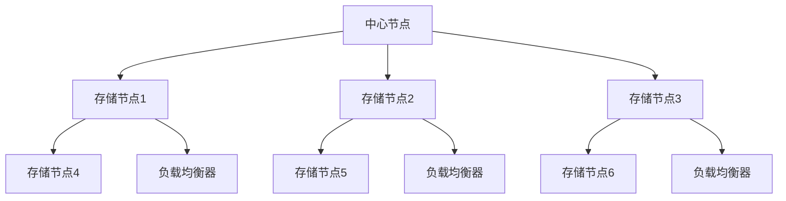
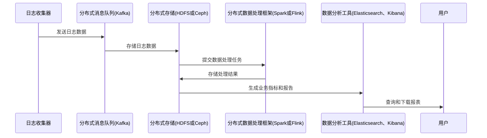

                 

## 分布式存储：支持LLM应用的大规模数据处理

### 关键词：分布式存储、LLM应用、大规模数据处理、分布式文件系统、HDFS、Ceph、GlusterFS、数据处理框架、Hadoop、Spark

> 摘要：本文将深入探讨分布式存储在支持大规模数据处理，特别是大型语言模型（LLM）应用中的重要性。文章首先介绍分布式存储的基础知识，包括其背景、定义、优势、关键挑战以及分布式文件系统和存储协议。随后，我们将讨论大规模数据处理的挑战、发展历程以及分布式数据处理框架。重点在于分析如何利用这些框架支持LLM应用。文章将通过实际项目实战，展示分布式存储与处理技术的具体应用，并总结最佳实践与注意事项。希望通过本文，读者能够对分布式存储与大规模数据处理有一个全面而深入的理解。

### 第一部分：分布式存储基础

#### 第1章：分布式存储概述

#### 1.1.1 分布式存储背景

**问题背景：**

在互联网和大数据时代，数据量呈现爆炸性增长，传统的集中式存储系统逐渐无法满足大规模数据存储和处理的需求。这促使了分布式存储技术的兴起，其目标在于通过多个节点协作，提供高可用性、高扩展性和高性能的存储解决方案。

**问题描述：**

分布式存储如何通过其独特的设计和架构，应对大数据环境中的各种挑战？

**问题解决：**

分布式存储通过数据分片（Sharding）和冗余复制（Replication）等技术，实现数据的水平扩展和故障容忍性。此外，它还通过并行数据处理和负载均衡，提升存储和访问性能。

**边界与外延：**

分布式存储不仅仅适用于数据存储，还涉及数据分布、同步、恢复、容错等一系列技术问题。其应用范围包括云存储、大数据处理平台以及高性能数据库等。

#### 1.1.2 分布式存储定义与优势

**核心概念：**

分布式存储是指将数据分布在多个物理节点上，并通过网络互联协同工作的存储系统。它通过节点间的通信和数据交换，实现对数据的统一管理和访问。

**属性特征对比表格：**

| 特征         | 传统存储                   | 分布式存储                   |
| ------------ | -------------------------- | ---------------------------- |
| 数据分布     | 单一存储节点               | 多个存储节点，数据分片       |
| 故障容忍性   | 单点故障导致数据丢失       | 多副本复制，高可用性         |
| 扩展性       | 难以扩展，性能瓶颈明显     | 水平扩展，动态调整资源       |
| 性能         | 受限于单一存储节点的带宽   | 并行处理，负载均衡           |

**ER实体关系图架构：**

```mermaid
erDiagram
  Node ||--|{ Data}: 数据分片
  Node ||--|{ Metadata}: 元数据
  Node ||--|{ Replicas}: 数据副本
  Data ||--|{ File}: 文件
  Metadata ||--|{ FileMetadata}: 文件元数据
  Replicas ||--|{ Node}: 存储节点
```

#### 1.1.3 分布式存储的关键挑战

**核心概念：**

分布式存储面临诸多技术挑战，包括数据一致性、分布式同步、容错机制和性能优化等。

**属性特征对比表格：**

| 挑战       | 传统存储                           | 分布式存储                       |
| ---------- | ---------------------------------- | -------------------------------- |
| 数据一致性 | 数据更新需同步，一致性容易保证     | 数据分片和复制，一致性难以维护     |
| 分布式同步 | 数据更新在单一存储节点上处理       | 多个节点间数据同步，复杂度高     |
| 容错机制   | 单点故障容易处理                   | 多点故障和恢复策略设计复杂       |
| 性能优化   | 存储节点性能瓶颈明显               | 负载均衡和并行处理技术优化       |

**ER实体关系图架构：**

```mermaid
erDiagram
  Node ||--|{ Data}: 数据分片
  Node ||--|{ Metadata}: 元数据
  Node ||--|{ Replicas}: 数据副本
  Node ||--|{ Config}: 配置参数
  Data ||--|{ File}: 文件
  Metadata ||--|{ FileMetadata}: 文件元数据
  Replicas ||--|{ Node}: 存储节点
  Config ||--|{ SyncPolicy}: 同步策略
  Config ||--|{ FaultTolerance}: 容错策略
```

通过以上分析，我们可以看到分布式存储在应对大规模数据处理需求方面的重要性和其面临的关键挑战。接下来，我们将进一步探讨分布式文件系统的原理和架构，以加深对分布式存储技术的理解。

### 第2章：分布式文件系统

#### 2.1.1 分布式文件系统概述

**核心概念：**

分布式文件系统是一种基于分布式存储技术，实现文件数据存储、管理和访问的文件系统。它通过多个节点协作，提供统一的文件命名空间和访问接口，用户无需关注数据的具体存储位置。

**属性特征对比表格：**

| 特征         | 传统文件系统               | 分布式文件系统               |
| ------------ | -------------------------- | ---------------------------- |
| 数据存储     | 单一存储节点               | 分布式存储节点               |
| 文件访问     | 本地文件系统访问           | 分布式网络文件系统访问       |
| 扩展性       | 受限于单节点性能和容量     | 水平扩展，动态调整资源       |
| 高可用性     | 单点故障影响整个文件系统   | 多副本复制，高可用性         |

**ER实体关系图架构：**

```mermaid
erDiagram
  Node ||--|{ File}: 分布式文件系统
  Node ||--|{ Block}: 数据块
  File ||--|{ FileMetadata}: 文件元数据
  Block ||--|{ Chunk}: 数据分片
```

**分布式文件系统的工作原理：**

分布式文件系统通过将文件划分为多个数据块（Block），并将这些数据块分布存储在多个节点上。每个数据块通常会存储多个副本，以确保数据的冗余和可靠性。当用户访问文件时，分布式文件系统通过元数据管理，定位文件的数据块位置，并将请求转发到相应的节点进行数据读取或写入操作。

#### 2.1.2 HDFS原理与架构

**核心概念：**

HDFS（Hadoop Distributed File System）是Apache Hadoop项目中的一个核心组件，它是一个高可靠性的分布式文件系统，专为大数据应用设计。HDFS通过将数据分片存储在多个节点上，提供高吞吐量的数据访问。

**属性特征对比表格：**

| 特征         | HDFS与其他分布式文件系统对比 |
| ------------ | ---------------------------- |
| 数据分片     | 数据块大小固定（默认128MB）  |
| 文件系统接口 | 只提供数据流式的读写操作     |
| 存储策略     | 高可靠性和高吞吐量           |

**ER实体关系图架构：**

```mermaid
erDiagram
  Client ||--|{ HDFS}: 客户端
  NameNode ||--|{ DataNode}: 数据节点
  DataNode ||--|{ Block}: 数据块
  Client ||--|{ Metadata}: 元数据
  NameNode ||--|{ File}: 文件
  NameNode ||--|{ Block}: 数据块
```

**HDFS的工作原理：**

1. **文件分割：** 当一个文件上传到HDFS时，HDFS会将其分割成固定大小的数据块（默认128MB）。这样可以提高数据读写效率和并行处理能力。

2. **数据块分配：** NameNode负责管理文件系统的命名空间和数据的元数据。DataNode负责存储实际的数据块。当有客户端请求读取或写入数据时，NameNode会分配数据块到多个DataNode上，并维护数据块的副本信息。

3. **数据流读写：** 客户端通过向NameNode发送文件读写请求，NameNode根据数据块的副本信息，将请求转发到相应的DataNode进行数据读写操作。

**HDFS的优缺点：**

**优点：**

- **高可靠性：** 通过数据副本机制，保证数据不丢失。
- **高吞吐量：** 通过数据分片和并行处理，提供高效的文件读写操作。
- **可扩展性：** 通过增加DataNode节点，可以动态扩展存储容量。

**缺点：**

- **单点故障：** NameNode作为文件系统的命名空间管理者，一旦故障，整个文件系统将无法访问。
- **低随机读写性能：** HDFS主要优化了大数据批量读写，而小文件随机读写性能较低。

#### 2.1.3 HDFS数据存储与数据流

**核心概念：**

HDFS的数据存储和数据流设计是其高性能和高可靠性的关键因素。理解其工作原理，有助于我们更好地利用HDFS进行大规模数据处理。

**数据存储流程：**

1. **文件上传：** 客户端将文件上传到HDFS，NameNode首先将文件元数据写入内存，然后创建一个新的数据块，并将数据块分配给DataNode进行存储。

2. **数据块存储：** DataNode接收到数据块后，将其存储在本地的磁盘上。为了保证数据的可靠性，每个数据块会存储多个副本。

3. **数据块副本管理：** NameNode负责维护数据块的副本信息，确保副本数量的正确性。当副本数量不足时，会触发数据块复制任务。

**数据流读取流程：**

1. **文件读取请求：** 客户端向NameNode发送文件读取请求，NameNode根据数据块的副本信息，选择一个数据块，并将请求转发给相应的DataNode。

2. **数据块传输：** DataNode接收到请求后，将数据块读取到本地内存，并通过网络传输给客户端。

3. **数据流整合：** 客户端接收到多个数据块后，将数据块整合成完整的文件进行展示或处理。

**HDFS数据流优化的策略：**

1. **数据块预取（Pre-fetching）：** NameNode可以提前预取客户端即将访问的数据块，减少数据传输延迟。

2. **数据块复制与复制选择策略：** NameNode会根据网络拓扑和数据负载情况，选择最佳的副本复制位置，优化数据传输带宽。

3. **数据流压缩与解压缩：** 通过数据压缩技术，减少数据传输量和存储空间需求，提高数据处理效率。

通过以上对HDFS原理和架构的详细探讨，我们可以更好地理解分布式文件系统在处理大规模数据方面的优势和应用场景。接下来，我们将介绍其他流行的分布式存储协议，以进一步丰富我们对分布式存储技术的认识。

### 第3章：分布式存储协议

#### 3.1.1 存储协议概述

**核心概念：**

分布式存储协议是分布式存储系统中，节点之间进行通信和数据传输的标准和规范。它定义了数据如何分布、同步、复制以及访问的管理机制。

**属性特征对比表格：**

| 特征         | 文件系统层次结构 | 数据分片机制 | 同步机制 | 复制策略 |
| ------------ | ---------------- | ------------ | -------- | -------- |
| HDFS         | 文件层次         | 数据块分片   | 同步复制 | 多副本   |
| Ceph         | 对象层次         | 对象分片     | 异步复制 | 去中心化 |
| GlusterFS    | 文件层次         | 数据块分片   | 异步复制 | 多副本   |

**ER实体关系图架构：**

```mermaid
erDiagram
  Node ||--|{ StorageProtocol}: 存储协议
  Node ||--|{ Data}: 数据
  Node ||--|{ Metadata}: 元数据
  StorageProtocol ||--|{ FileProtocol}: 文件系统协议
  StorageProtocol ||--|{ ObjectProtocol}: 对象系统协议
  FileProtocol ||--|{ HDFSProtocol}: HDFS协议
  ObjectProtocol ||--|{ CephProtocol}: Ceph协议
  ObjectProtocol ||--|{ GlusterFSProtocol}: GlusterFS协议
```

**分布式存储协议的主要功能：**

- **数据分布：** 定义数据如何分布在多个节点上，以及数据块或对象的管理。
- **同步与复制：** 确保数据在不同节点之间的一致性，通过同步或异步复制机制实现。
- **访问控制：** 控制用户对存储资源的访问权限，包括文件或对象的读写操作。
- **故障恢复：** 系统检测和恢复节点故障，确保数据的持续可用性。

**常见的分布式存储协议：**

1. **HDFS协议：** HDFS采用自己的文件系统协议（HDFS Protocol），提供文件层次的分布式存储服务。客户端通过此协议与NameNode和DataNode进行通信。
   
2. **Ceph协议：** Ceph采用Rados对象存储协议，提供对象层次的分布式存储服务。Ceph通过Librados库与存储节点通信，支持高扩展性和高可用性。

3. **GlusterFS协议：** GlusterFS采用分布式虚拟文件系统协议，提供文件层次的分布式存储服务。客户端通过NFS或SMB等协议与GlusterFS进行通信，支持高扩展性和负载均衡。

通过上述介绍，我们可以看到分布式存储协议在分布式存储系统中扮演着关键角色。接下来，我们将深入探讨Ceph和GlusterFS这两个流行的分布式存储协议，以了解它们的原理和应用。

#### 3.1.2 Ceph分布式存储协议

**核心概念：**

Ceph是一种高度可扩展的分布式存储系统，支持对象、块和文件三种数据存储模式。Ceph通过其独特的设计和架构，实现了高性能、高可用性和高可扩展性。

**Ceph的工作原理：**

1. **对象存储：** Ceph的RADOS对象存储（Rados Object Storage）采用元数据服务（MDS）和数据存储节点（OSD）的架构。客户端通过Librados库与Ceph进行通信，MDS负责维护对象名称空间和元数据，OSD负责存储对象数据。

2. **块存储：** Ceph的RADOS块存储（Rados Block Storage，RBD）通过虚拟块设备（虚拟磁盘）的形式提供块存储服务。RBD客户端可以直接与OSD进行通信，实现高效的块存储访问。

3. **文件存储：** Ceph的文件存储（CephFS）基于POSIX文件系统标准，提供分布式文件系统服务。CephFS通过MDS和OSD协同工作，支持高并发和大文件访问。

**Ceph的架构：**

Ceph的架构分为三个主要层次：监控层、管理层和数据存储层。

- **监控层（Monitor）：** 监控层负责维护Ceph集群的状态，确保集群的稳定性和一致性。Monitor通过Gossip协议进行状态同步和故障检测。

- **管理层（Manager）：** 管理层负责集群的管理和维护，包括集群监控、配置管理和性能优化等。Manager通过RESTful API与客户端和Monitor进行通信。

- **数据存储层（OSD）：** 数据存储层是Ceph的核心，负责数据存储、同步、复制和故障恢复。每个OSD节点都承担数据存储、计算和同步的任务。

**Ceph的优势：**

- **去中心化架构：** Ceph采用去中心化架构，没有单点故障问题，确保高可用性。
- **高扩展性：** Ceph支持水平扩展，可以动态增加存储节点，满足大规模数据存储需求。
- **高性能：** Ceph通过并行处理和负载均衡技术，提供高效的数据存储和访问性能。
- **灵活性和兼容性：** Ceph支持多种数据存储模式，包括对象、块和文件，满足不同应用场景的需求。

**Ceph的应用场景：**

- **云计算：** Ceph作为OpenStack的默认存储解决方案，广泛应用于云计算环境，提供高性能、高可用性的存储服务。
- **大数据：** Ceph支持大数据处理平台，如Hadoop和Spark，提供高效的数据存储和访问。
- **视频监控：** Ceph适用于大规模视频监控存储，提供实时数据存储和访问。

通过Ceph分布式存储协议的详细介绍，我们可以看到其强大的功能和广泛应用。接下来，我们将探讨GlusterFS分布式存储协议，进一步了解分布式存储系统的多样性和优势。

#### 3.1.3 GlusterFS分布式存储协议

**核心概念：**

GlusterFS是一个分布式文件系统，它通过分布式虚拟文件系统（Distributed Virtual File System，DVFS）技术，实现跨多个物理服务器的数据存储和访问。GlusterFS采用模块化设计，具有高扩展性、高可用性和高性能。

**GlusterFS的工作原理：**

1. **模块化架构：** GlusterFS采用模块化架构，包括存储单元（Volume）和集群（Cluster）两个主要概念。存储单元是一个逻辑存储容器，由多个存储节点（Brick）组成。集群则是多个存储单元的集合，提供分布式文件系统服务。

2. **数据分布与副本：** GlusterFS通过数据分片（Sharding）和副本（Replication）技术，实现数据的分布和冗余存储。每个存储节点（Brick）存储一个数据分片，同时配置多个副本，确保数据的高可用性和可靠性。

3. **元数据管理：** GlusterFS通过元数据服务器（Metadata Server）管理文件系统的元数据，包括文件目录和权限信息。元数据服务器与存储节点（Brick）进行通信，确保元数据的一致性和更新。

4. **文件系统接口：** GlusterFS提供NFS和SMB等文件系统接口，支持不同类型的客户端访问和操作文件系统。客户端可以通过NFS协议访问GlusterFS文件系统，实现文件读写操作。

**GlusterFS的架构：**

GlusterFS的架构包括以下主要组件：

- **客户端（Client）：** 客户端通过NFS或SMB等协议与GlusterFS进行通信，访问文件系统中的数据。

- **元数据服务器（Metadata Server）：** 元数据服务器负责管理文件系统的元数据，包括文件目录和权限信息。元数据服务器与存储节点（Brick）进行通信，确保元数据的一致性和更新。

- **存储节点（Brick）：** 存储节点是GlusterFS的基本存储单元，存储数据分片和副本。每个存储节点都可以独立运行，与其他存储节点协同工作，提供分布式文件系统服务。

- **集群管理器（Cluster Manager）：** 集群管理器负责管理GlusterFS集群的配置和监控，包括存储单元（Volume）的创建、扩展和管理。

**GlusterFS的优势：**

- **高扩展性：** GlusterFS支持水平扩展，通过添加更多的存储节点，可以动态调整存储容量和性能。

- **高可用性：** GlusterFS通过副本和数据分片技术，确保数据的高可用性和可靠性。

- **高性能：** GlusterFS通过并行处理和负载均衡技术，提供高效的文件读写性能。

- **灵活性和兼容性：** GlusterFS支持多种文件系统接口，包括NFS和SMB，满足不同类型的客户端访问需求。

**GlusterFS的应用场景：**

- **企业文件存储：** GlusterFS适用于企业文件存储需求，提供高效的文件读写性能和可扩展性。

- **大数据处理：** GlusterFS可以与Hadoop和Spark等大数据处理平台集成，提供高效的数据存储和访问。

- **云存储：** GlusterFS适用于云存储环境，提供高性能和可扩展的存储服务。

通过上述对GlusterFS分布式存储协议的详细介绍，我们可以看到其在分布式文件系统中的优势和广泛的应用。接下来，我们将讨论分布式存储硬件与拓扑设计，以更好地了解分布式存储系统的构建和优化。

### 第4章：分布式存储硬件与拓扑

#### 4.1.1 分布式存储硬件选择

**核心概念：**

分布式存储系统的性能和可靠性不仅取决于软件架构，还依赖于硬件的选择和配置。硬件选择直接影响存储系统的吞吐量、延迟和成本效益。

**硬件选择考虑因素：**

1. **存储密度：** 高存储密度是分布式存储系统的一个重要考虑因素，这涉及到硬盘容量和接口速度。选择具有高存储容量的硬盘，如企业级SATA或SSD硬盘，可以满足大规模数据存储需求。

2. **I/O性能：** I/O性能是影响分布式存储系统性能的关键因素。选择具有高I/O吞吐量的硬盘和主机，可以提高数据读写速度。

3. **可靠性：** 分布式存储系统需要具备高可靠性，选择具有高MTBF（平均无故障时间）和企业级硬件，如RAID控制器和高速网络接口卡，可以提高系统的稳定性和可用性。

4. **扩展性：** 为了满足不断增长的数据存储需求，分布式存储系统需要具备良好的扩展性。选择支持热插拔和动态扩展的硬件，如可扩展的存储阵列和网桥，可以提高系统的灵活性。

**常见硬件配置方案：**

- **SSD混合存储：** 结合使用SSD和HDD，实现高性能和低成本存储的平衡。SSD用于频繁访问的热数据存储，HDD用于大规模数据存储。

- **分布式存储设备：** 选择专门设计的分布式存储设备，如NAS或对象存储设备，这些设备通常具备高吞吐量和低延迟的性能。

- **网络设备：** 网络设备的选择对于分布式存储系统的性能至关重要。选择支持高带宽和低延迟的网络接口卡和交换机，可以提升数据传输速度。

#### 4.1.2 分布式存储拓扑设计

**核心概念：**

分布式存储拓扑设计是指如何构建和管理分布式存储系统中的网络结构和节点配置。合理的拓扑设计可以提升存储系统的性能、可靠性和可扩展性。

**分布式存储拓扑设计原则：**

1. **冗余设计：** 通过冗余设计，确保存储系统在节点故障时，能够自动切换到备用节点，保持数据的可用性。常见的冗余设计包括双节点备份、多路径冗余和集群架构。

2. **负载均衡：** 通过负载均衡技术，将数据读写请求分配到不同的存储节点上，避免单个节点成为性能瓶颈。负载均衡可以采用动态负载均衡算法，如轮询、最小连接数或响应时间。

3. **网络拓扑：** 选择合适的网络拓扑结构，如星型、环型和树型，可以优化数据传输路径和降低网络延迟。网络拓扑设计应考虑带宽、延迟和网络故障恢复能力。

4. **可扩展性：** 设计具有良好扩展性的存储拓扑，可以通过增加节点和存储资源，动态调整存储系统容量和性能。

**常见拓扑结构：**

- **星型拓扑：** 星型拓扑结构简单，易于管理，适用于中小规模分布式存储系统。所有存储节点连接到一个中心节点，中心节点负责数据管理和负载均衡。

- **环型拓扑：** 环型拓扑结构具有较高的容错能力和负载均衡性能，但数据传输路径较长，适用于大规模分布式存储系统。数据在环中循环传输，每个节点都具有转发和接收功能。

- **树型拓扑：** 树型拓扑结构具有层次化和模块化的特点，可以方便地进行扩展和管理。树型拓扑结构通常由多层存储节点组成，底层节点负责数据存储，上层节点负责负载均衡和元数据管理。

**分布式存储拓扑设计示例：**



通过上述对分布式存储硬件选择和拓扑设计的讨论，我们可以看到硬件和拓扑设计在分布式存储系统中的重要性。合理的硬件选择和拓扑设计可以提升存储系统的性能、可靠性和可扩展性，为大规模数据处理提供坚实的基础。接下来，我们将探讨分布式存储的扩展性策略，以进一步优化存储系统的性能。

#### 4.1.3 分布式存储扩展性策略

**核心概念：**

分布式存储系统需要具备良好的扩展性，以满足不断增长的数据存储和处理需求。扩展性策略包括横向扩展和纵向扩展，以及相关的技术和方法。

**横向扩展（Scaling Out）：**

横向扩展是指通过增加存储节点来扩展存储系统的容量和性能。这是分布式存储系统常用的扩展策略，具有以下优点：

1. **线性扩展：** 横向扩展可以线性提升存储系统的性能和容量，即增加节点数量，系统性能和容量成比例增长。
2. **灵活性：** 横向扩展灵活，可以通过动态添加或移除节点，实现存储资源的弹性调整。
3. **高可用性：** 通过冗余设计和负载均衡，横向扩展可以提高系统的可用性和可靠性。

**横向扩展方法：**

1. **分片（Sharding）：** 通过将数据分片存储在多个节点上，实现数据分布和并行处理。分片可以根据数据的关键字或范围进行划分，以优化查询性能。

2. **副本（Replication）：** 通过复制数据副本到多个节点，确保数据的高可用性和可靠性。副本的数量可以根据存储系统的要求进行调整。

3. **负载均衡（Load Balancing）：** 通过负载均衡技术，将数据读写请求分配到不同的节点上，避免单个节点成为性能瓶颈。负载均衡算法可以根据节点的负载情况动态调整请求分配策略。

**纵向扩展（Scaling Up）：**

纵向扩展是指通过增加节点硬件资源（如CPU、内存、硬盘等）来提升存储系统的性能。这是在特定场景下采用的扩展策略，具有以下优点：

1. **性能提升：** 纵向扩展可以提升存储系统的处理能力和吞吐量，适用于处理大规模数据和高并发的应用场景。

2. **资源集中：** 纵向扩展可以集中资源，提高存储系统的资源利用率和管理效率。

**纵向扩展方法：**

1. **硬件升级：** 通过升级存储节点的硬件设备，如增加CPU核心、内存容量和硬盘速度，提升节点的计算和存储能力。

2. **资源虚拟化：** 通过虚拟化技术，将物理资源虚拟化为多个逻辑资源，实现资源的高效利用和动态调整。

**扩展性策略优缺点对比表格：**

| 扩展性策略 | 优点 | 缺点 |
| ---------- | ---- | ---- |
| 横向扩展   | 线性扩展、灵活性、高可用性 | 资源利用率较低、数据迁移复杂 |
| 纵向扩展   | 性能提升、资源集中、管理效率高 | 扩展成本高、资源浪费 |

通过上述扩展性策略的探讨，我们可以看到分布式存储系统在扩展性方面的重要性。合理的扩展性策略可以提升存储系统的性能和可靠性，满足不断增长的数据存储和处理需求。接下来，我们将讨论分布式存储面临的挑战，以深入了解分布式存储技术的复杂性和局限性。

### 第5章：数据处理挑战

#### 5.1.1 大规模数据定义

**核心概念：**

大规模数据（Big Data）通常指的是数据量巨大、数据类型多样且数据生成速度极快的海量数据。这种数据规模超出了传统数据处理系统的处理能力，需要采用新的技术和方法进行有效管理和分析。

**属性特征对比表格：**

| 特征         | 小规模数据（MB级） | 大规模数据（TB/PB级） |
| ------------ | ------------------ | -------------------- |
| 数据量       | 数千到数万条记录   | 数百万到数十亿条记录 |
| 数据类型     | 结构化数据         | 结构化、半结构化和非结构化数据 |
| 数据生成速度 | 较慢               | 非常快               |
| 处理需求     | 简单查询和分析     | 高效并行处理和实时分析 |

**ER实体关系图架构：**

```mermaid
erDiagram
  Data ||--|{ StructuredData}: 结构化数据
  Data ||--|{ SemiStructuredData}: 半结构化数据
  Data ||--|{ UnstructuredData}: 非结构化数据
  Data ||--|{ Volume}: 数据量
  Data ||--|{ Velocity}: 数据生成速度
  Data ||--|{ Variety}: 数据类型
```

**大规模数据的定义标准：**

- **数据量（Volume）：** 数据量通常以字节（B）、千字节（KB）、兆字节（MB）、吉字节（GB）、太字节（TB）和拍字节（PB）等单位衡量。一般认为，数据量达到TB级或更高，即可被视为大规模数据。

- **数据类型（Variety）：** 大规模数据包括结构化数据（如关系型数据库中的表）、半结构化数据（如XML、JSON等）和非结构化数据（如图像、视频、文本等）。

- **数据生成速度（Velocity）：** 大规模数据的生成速度极快，需要实时或近实时处理和分析，以获取有价值的信息。

- **数据处理需求（Veracity）：** 大规模数据需要高效、准确的处理和分析，以应对各种业务需求。

#### 5.1.2 数据处理难点

**核心概念：**

在处理大规模数据时，面临诸多技术挑战，包括数据存储、数据清洗、数据处理效率和数据隐私保护等。

**属性特征对比表格：**

| 挑战             | 小规模数据                   | 大规模数据                   |
| ---------------- | ---------------------------- | ---------------------------- |
| 数据存储         | 存储简单，空间有限           | 存储复杂，海量存储需求       |
| 数据清洗         | 数据质量相对较高，清洗简单   | 数据质量参差不齐，清洗复杂   |
| 数据处理效率     | 处理速度快，实时性高         | 处理速度慢，需要并行处理技术 |
| 数据隐私保护     | 数据量小，隐私风险较低       | 数据量巨大，隐私风险高       |

**ER实体关系图架构：**

```mermaid
erDiagram
  DataProcessingChallenge ||--|{ Storage}: 数据存储
  DataProcessingChallenge ||--|{ DataCleaning}: 数据清洗
  DataProcessingChallenge ||--|{ ProcessingEfficiency}: 数据处理效率
  DataProcessingChallenge ||--|{ PrivacyProtection}: 数据隐私保护
```

**数据处理难点分析：**

1. **数据存储：** 大规模数据需要高效、可靠的存储解决方案。分布式存储系统如HDFS、Ceph和GlusterFS等，通过数据分片和冗余复制，提供高可用性和高扩展性的存储服务。

2. **数据清洗：** 大规模数据往往包含噪声、缺失值和异常值，需要进行清洗和预处理。数据清洗技术包括数据去重、缺失值填补、异常值处理和数据规范化等。

3. **数据处理效率：** 大规模数据处理需要高效的并行处理技术，如MapReduce、Spark和Flink等。这些框架可以将数据处理任务分解为多个并行子任务，提高处理速度。

4. **数据隐私保护：** 大规模数据隐私保护是当前研究的热点问题。数据加密、匿名化和差分隐私等技术，可以在保障数据隐私的同时，满足数据分析和挖掘的需求。

通过上述分析，我们可以看到大规模数据处理面临的挑战和难点。接下来，我们将回顾大规模数据处理技术发展历程，了解这些技术是如何逐步演变和发展的。

#### 5.1.3 大规模数据处理技术发展历程

**核心概念：**

大规模数据处理技术的发展经历了从单机处理到分布式处理、从批处理到流处理的过程。这些技术进步不仅提升了数据处理效率，还拓展了数据处理的应用场景。

**大规模数据处理技术发展历程：**

1. **批处理（Batch Processing）：** 
   - **概念：** 批处理是一种将数据处理任务集中在一起，按批次进行处理的方法。数据处理通常在晚上或低峰时段进行，以减少对系统资源的影响。
   - **优点：** 批处理可以高效地处理大量数据，且系统资源利用率高。
   - **缺点：** 批处理具有延迟性，无法实时处理数据。

2. **分布式处理（Distributed Processing）：**
   - **概念：** 分布式处理是将数据处理任务分布到多个节点上，并行执行以提高处理效率。
   - **优点：** 分布式处理可以显著提升数据处理速度，降低单点故障风险。
   - **缺点：** 分布式处理系统设计和维护复杂。

3. **流处理（Stream Processing）：**
   - **概念：** 流处理是对实时数据流进行连续、增量处理的方法。数据处理任务随数据流动态执行，以实现实时分析。
   - **优点：** 流处理可以实时响应数据变化，适用于实时分析场景。
   - **缺点：** 流处理系统需要处理高频率的数据流，对系统资源要求较高。

**重要技术里程碑：**

1. **MapReduce：**
   - **提出时间：** 2004年
   - **概念：** MapReduce是一种分布式数据处理框架，可以将数据处理任务分解为Map（映射）和Reduce（归约）两个阶段，实现大规模数据的并行处理。
   - **优点：** 简化了分布式数据处理任务的设计和实现，具有良好的容错性和扩展性。
   - **缺点：** 批处理特性明显，实时处理能力有限。

2. **Spark：**
   - **提出时间：** 2009年
   - **概念：** Spark是一种基于内存计算的分布式数据处理框架，支持批处理和流处理。Spark通过RDD（Resilient Distributed Dataset）实现数据的分布式存储和计算。
   - **优点：** 高效的内存计算，实时处理能力显著提升，易于与Hadoop生态系统集成。
   - **缺点：** 对内存资源需求较高，不适合处理大量小文件。

3. **Flink：**
   - **提出时间：** 2009年
   - **概念：** Flink是一种实时数据处理框架，支持流处理和批处理。Flink通过数据流抽象（DataStream）实现高效的实时数据处理。
   - **优点：** 实时处理能力强，可以动态调整处理速度，与Hadoop生态系统兼容。
   - **缺点：** 相对较新的框架，社区支持和生态不如Spark成熟。

通过回顾大规模数据处理技术的发展历程，我们可以看到技术进步是如何逐步解决大规模数据处理中的挑战。这些技术不仅提升了数据处理效率，还为各种应用场景提供了可行的解决方案。接下来，我们将深入探讨分布式数据处理框架的原理和应用。

### 第6章：分布式数据处理框架

#### 6.1.1 分布式数据处理框架概述

**核心概念：**

分布式数据处理框架是一种用于在大规模分布式环境中高效处理数据的软件框架。它们通过将数据处理任务分解为多个并行子任务，在多个节点上分布式执行，以实现高效的计算和数据分析。

**分布式数据处理框架的架构：**

分布式数据处理框架通常包括以下几个核心组件：

1. **数据存储：** 负责存储和处理过程中的数据存储。常见的存储方案包括分布式文件系统（如HDFS）和分布式数据库（如HBase）。

2. **任务调度：** 负责任务分配和调度。调度器根据节点的资源状况和任务的优先级，将任务分配到不同的节点上执行。

3. **计算引擎：** 负责具体的数据处理任务。计算引擎可以将数据处理任务分解为多个并行子任务，并在不同的节点上分布式执行。

4. **资源管理：** 负责管理和分配系统资源。资源管理器可以根据节点的负载情况，动态调整任务的执行位置和资源分配。

**分布式数据处理框架的优势：**

- **高扩展性：** 通过分布式架构，可以水平扩展，支持大规模数据处理任务。

- **高可用性：** 通过分布式存储和任务调度，实现任务的自动恢复和负载均衡，提高系统的可靠性。

- **高性能：** 通过并行处理和任务调度，显著提升数据处理速度和效率。

- **易用性：** 提供丰富的API和工具，简化分布式数据处理任务的开发和部署。

#### 6.1.2 Hadoop生态系统

**核心概念：**

Hadoop是一个开源的分布式数据处理框架，由Apache软件基金会维护。Hadoop生态系统包括多个组件，提供从数据存储到数据处理、数据分析和数据挖掘的完整解决方案。

**Hadoop生态系统的组件：**

1. **HDFS（Hadoop Distributed File System）：** Hadoop分布式文件系统，负责大规模数据的存储和管理。HDFS将数据分片存储在多个节点上，提供高可靠性、高扩展性和高性能的存储服务。

2. **MapReduce：** Hadoop的核心计算引擎，负责大规模数据的分布式处理。MapReduce将数据处理任务分解为Map（映射）和Reduce（归约）两个阶段，实现并行计算。

3. **YARN（Yet Another Resource Negotiator）：** 负责资源管理和任务调度。YARN替代了传统的MapReduce资源管理，提供更加灵活和高效的资源分配机制。

4. **Hive：** 数据仓库工具，用于数据存储、查询和分析。Hive支持SQL查询，可以将HDFS中的数据转换为表格形式，便于数据分析和报表生成。

5. **Pig：** 数据处理工具，用于大规模数据的转换和分析。Pig提供了一种类似于SQL的数据处理语言（Pig Latin），简化了数据转换和数据分析任务的编写。

6. **HBase：** 分布式NoSQL数据库，用于存储海量结构化数据。HBase提供随机实时读写访问，适用于大数据存储和实时分析场景。

7. **Spark：** 内存计算引擎，提供高性能的分布式数据处理。Spark支持批处理和流处理，通过RDD（Resilient Distributed Dataset）实现高效的数据分析和处理。

**Hadoop生态系统的工作原理：**

Hadoop生态系统通过分布式架构和组件协同工作，提供高效的数据处理解决方案。以下是Hadoop生态系统的主要工作原理：

1. **数据存储：** 数据首先存储在HDFS上，HDFS将数据分片存储在多个节点上，确保数据的高可用性和可靠性。

2. **数据处理：** 数据处理任务通过MapReduce、Spark等计算引擎分布式执行。MapReduce将数据处理任务分解为Map和Reduce两个阶段，Spark则通过RDD实现内存计算和流处理。

3. **资源管理：** YARN负责资源管理和任务调度。YARN根据节点的资源状况和任务的优先级，动态分配计算资源和处理任务。

4. **数据分析和查询：** Hive和Pig提供数据分析和查询工具，可以将HDFS中的数据转换为表格形式，便于数据分析和报表生成。

通过Hadoop生态系统的详细介绍，我们可以看到其如何通过分布式架构和组件协同工作，提供高效的数据存储和处理解决方案。Hadoop生态系统在处理大规模数据方面具有显著的优势，适用于各种大数据应用场景。接下来，我们将深入探讨Spark的原理与架构，进一步了解分布式数据处理框架的工作机制。

#### 6.1.3 Spark原理与架构

**核心概念：**

Spark是一个开源的分布式数据处理框架，由Apache软件基金会维护。Spark提供内存计算和流处理能力，旨在提升大数据处理效率。Spark通过其独特的架构和组件协同工作，实现高效的数据处理和分析。

**Spark的主要组件：**

1. **Spark Core：** Spark Core是Spark的基础组件，提供分布式计算引擎和通用任务调度。Spark Core包括内存管理、存储抽象和任务调度等功能，是Spark其他组件的基础。

2. **Spark SQL：** Spark SQL是一个用于结构化数据查询的组件，支持SQL查询、数据存储和数据处理。Spark SQL可以将数据存储在HDFS、HBase或关系数据库中，提供高性能的查询和分析功能。

3. **Spark Streaming：** Spark Streaming是一个用于实时数据处理的组件，支持流数据的处理和分析。Spark Streaming可以处理来自Kafka、Flume等数据源的数据流，实现实时数据分析和监控。

4. **MLlib：** MLlib是Spark的机器学习库，提供多种机器学习算法和工具。MLlib支持分类、回归、聚类、协同过滤等常见机器学习任务，适用于大数据机器学习应用。

5. **GraphX：** GraphX是Spark的图处理库，提供大规模图的计算和分析功能。GraphX支持图计算、图挖掘和图流处理，适用于社交网络分析、推荐系统和复杂网络分析等应用。

**Spark的架构：**

Spark的架构包括以下核心层次：

1. **驱动程序（Driver）：** 驱动程序是Spark应用程序的主控程序，负责解析用户输入的代码，生成任务图，并将其发送到集群执行。

2. **集群管理器（Cluster Manager）：** 集群管理器负责资源管理和任务调度。常见的集群管理器包括YARN、Mesos和Spark自身提供的独立集群管理器。

3. **执行器（Executor）：** 执行器是负责具体任务执行的计算节点。执行器从集群管理器接收任务，并在本地执行任务，将结果返回给驱动程序。

4. **存储系统（Storage System）：** Spark支持多种存储系统，如HDFS、HBase和本地文件系统。存储系统用于数据的持久化存储和管理。

**Spark的工作原理：**

1. **数据加载与转换：** Spark应用程序首先从存储系统中加载数据，并执行各种数据转换操作，如筛选、排序、聚合等。这些操作生成RDD（Resilient Distributed Dataset），即弹性分布式数据集。

2. **任务调度与执行：** 驱动程序将生成的RDD任务图发送到集群管理器，集群管理器根据资源状况和任务优先级，将任务分配到执行器。执行器在本地执行任务，并将结果返回给驱动程序。

3. **内存管理：** Spark采用内存计算模型，通过将数据存储在内存中，实现快速数据访问和计算。Spark的内存管理包括Tungsten引擎，用于优化内存使用和计算性能。

4. **流处理与实时分析：** Spark Streaming组件可以处理实时数据流，通过微批处理（Micro-batching）和流处理算法，实现实时数据分析和监控。

**Spark的优势：**

- **内存计算：** Spark采用内存计算模型，显著提升数据处理速度和性能。
- **高性能：** Spark支持多种数据处理算法和工具，提供高效的批处理和流处理能力。
- **易用性：** Spark提供丰富的API和工具，简化分布式数据处理任务的编写和部署。
- **与Hadoop生态系统兼容：** Spark与Hadoop生态系统紧密集成，可以与HDFS、YARN等组件无缝协作。

通过上述对Spark原理与架构的详细探讨，我们可以看到其如何通过分布式架构和内存计算模型，实现高效的大数据处理和分析。Spark在处理大规模数据方面具有显著优势，适用于各种大数据应用场景。接下来，我们将分析如何利用分布式数据处理框架支持LLM应用。

#### 6.1.4 如何利用分布式数据处理框架支持LLM应用

**核心概念：**

大型语言模型（LLM）是一种先进的自然语言处理技术，通过深度学习和神经网络模型，实现自然语言的理解和生成。LLM应用通常涉及大规模数据处理和高性能计算，分布式数据处理框架能够提供所需的计算资源和处理能力。

**LLM应用的需求：**

- **大规模数据处理：** LLM训练和推理过程涉及海量数据，需要进行高效的数据加载、处理和存储。
- **高性能计算：** LLM模型训练和推理需要大量的计算资源，要求分布式数据处理框架能够提供高性能的计算能力。
- **实时处理：** 对于一些实时性要求较高的LLM应用，如聊天机器人、语音识别等，需要分布式数据处理框架支持实时数据流处理。

**分布式数据处理框架的优势：**

- **横向扩展性：** 分布式数据处理框架可以水平扩展，通过增加节点数量，提升数据处理能力和性能。
- **高可用性：** 分布式数据处理框架具备高可用性，通过任务调度和负载均衡，确保数据处理的连续性和稳定性。
- **内存计算：** 采用内存计算模型的分布式数据处理框架，如Spark，能够显著提升数据处理速度，满足LLM应用的高性能需求。

**具体应用案例：**

1. **数据预处理：** 分布式数据处理框架可以用于大规模数据的预处理任务，如数据清洗、去重、缺失值填补等。通过分布式计算，可以快速处理海量数据，为LLM训练提供高质量的数据输入。

2. **模型训练：** LLM模型训练通常涉及大量计算资源，分布式数据处理框架可以将训练任务分解为多个并行子任务，在多个节点上分布式执行，显著提升训练速度和效率。例如，Spark可以与深度学习框架如TensorFlow和PyTorch集成，实现高效的大型语言模型训练。

3. **模型推理：** LLM模型推理需要实时处理大量数据，分布式数据处理框架可以支持实时数据流处理，快速响应用户查询。例如，Spark Streaming可以处理实时文本数据流，为聊天机器人等应用提供实时自然语言理解能力。

4. **大规模推理：** 对于需要处理大规模文本数据的场景，如搜索引擎、推荐系统等，分布式数据处理框架可以支持并行推理任务，提升系统性能和响应速度。

通过上述分析，我们可以看到分布式数据处理框架在支持LLM应用中的重要作用。分布式数据处理框架不仅提供了强大的计算资源和处理能力，还通过横向扩展性和高可用性，确保了大规模数据处理任务的高效和稳定执行。接下来，我们将探讨如何实现支持LLM的分布式数据处理方案。

#### 6.1.5 实现支持LLM的分布式数据处理方案

**核心概念：**

为了实现支持大型语言模型（LLM）的分布式数据处理方案，需要构建一个高效、稳定且可扩展的分布式数据处理架构。这个方案应涵盖数据预处理、模型训练和推理等关键环节，充分利用分布式数据处理框架的优势。

**方案设计思路：**

1. **数据预处理：** 数据预处理是LLM训练和推理的基础，需要进行高效的数据加载、清洗和格式转换。分布式数据处理框架可以分解预处理任务，在多个节点上并行执行，提高预处理速度。

2. **模型训练：** LLM模型训练通常需要大量计算资源和时间。分布式数据处理框架可以将训练任务分解为多个子任务，在多个节点上分布式执行，利用并行计算提高训练效率。

3. **模型推理：** LLM模型推理需要实时处理大量数据，分布式数据处理框架可以支持实时数据流处理，实现高效的自然语言理解和生成。

**具体实现步骤：**

1. **数据预处理：**
   - **数据加载：** 使用分布式数据处理框架如Spark，从分布式存储系统（如HDFS）中加载大规模文本数据。
   - **数据清洗：** 使用分布式数据处理框架的内置函数，对数据进行清洗，包括去除无效字符、填补缺失值和去除停用词等。
   - **格式转换：** 将清洗后的数据转换为适合LLM训练的格式，如单词嵌入（word embeddings）或词向量化（word vectors）。

2. **模型训练：**
   - **任务分解：** 使用分布式数据处理框架将模型训练任务分解为多个子任务，每个子任务训练模型的一部分。
   - **并行计算：** 在多个节点上分布式执行子任务，利用并行计算提高训练效率。例如，可以使用Spark的分布式任务调度器，将任务分配到不同节点。
   - **模型融合：** 训练完成后，将各个子任务训练的模型进行融合，生成完整的模型。

3. **模型推理：**
   - **实时数据流处理：** 使用分布式数据处理框架的流处理组件（如Spark Streaming），实时处理输入文本数据流。
   - **模型加载：** 将训练好的模型加载到分布式数据处理框架中，实现实时推理。
   - **结果输出：** 对输入文本数据进行推理，输出自然语言理解和生成结果，如文本摘要、回答问题等。

**技术选型与实现细节：**

1. **分布式数据处理框架：** 选择具有高性能和可扩展性的分布式数据处理框架，如Spark，用于实现分布式数据处理任务。
2. **深度学习框架：** 选择与分布式数据处理框架兼容的深度学习框架，如TensorFlow或PyTorch，用于实现LLM模型的训练和推理。
3. **存储系统：** 选择具有高扩展性和高可靠性的分布式存储系统，如HDFS或Ceph，用于存储大规模数据和模型。
4. **计算资源：** 根据处理任务的需求，配置足够的计算资源和存储资源，确保分布式数据处理方案的高效运行。

**案例实践：**

以一个聊天机器人应用为例，实现支持LLM的分布式数据处理方案：

1. **数据预处理：**
   - 加载聊天对话数据集，使用Spark进行数据清洗和格式转换，生成训练数据和测试数据。
   - 将清洗后的数据进行分片，存储在分布式存储系统HDFS中，便于后续处理。

2. **模型训练：**
   - 使用Spark将模型训练任务分解为多个子任务，每个子任务在分布式计算集群中执行。
   - 训练完成后，使用Spark将各个子任务的模型进行融合，生成完整的模型。

3. **模型推理：**
   - 使用Spark Streaming实时处理用户输入的聊天文本数据流，进行自然语言理解。
   - 使用训练好的模型对输入文本数据进行推理，输出智能回答。

通过上述实现步骤和案例实践，我们可以看到如何利用分布式数据处理框架支持LLM应用。这种方案不仅提高了数据处理效率和模型性能，还为大规模LLM应用提供了可靠的技术支持。接下来，我们将讨论分布式存储与数据处理环境搭建，以便读者能够实际操作和应用这些技术。

### 第7章：分布式存储与数据处理环境搭建

#### 7.1.1 环境准备

在搭建分布式存储与数据处理环境之前，需要准备必要的软件和硬件资源。以下是一个典型环境配置的步骤，包括安装和配置所需的操作系统、分布式存储系统以及分布式数据处理框架。

**硬件准备：**

1. **服务器：** 需要至少两台服务器用于搭建分布式存储与处理环境。一台作为主服务器，负责管理和处理任务；另一台作为从服务器，负责存储数据和执行计算任务。
2. **存储设备：** 准备足够的存储设备，如SSD或HDD，用于搭建分布式文件系统，如HDFS或Ceph。

**软件准备：**

1. **操作系统：** 服务器上安装支持分布式存储与处理软件的操作系统，如Ubuntu 18.04或CentOS 7。
2. **分布式存储系统：** 安装并配置分布式存储系统，如HDFS或Ceph。
3. **分布式数据处理框架：** 安装并配置分布式数据处理框架，如Spark或Flink。

**安装步骤：**

1. **安装操作系统：** 在服务器上安装支持分布式存储与处理的操作系统。
2. **安装分布式存储系统：** 根据所选存储系统（如HDFS或Ceph），按照官方文档进行安装和配置。
3. **安装分布式数据处理框架：** 根据所选数据处理框架（如Spark或Flink），按照官方文档进行安装和配置。

#### 7.1.2 分布式存储部署

**HDFS部署步骤：**

1. **安装Hadoop：** 在主服务器和从服务器上安装Hadoop，包括HDFS、YARN和MapReduce等组件。
2. **配置HDFS：** 配置HDFS的名称节点（NameNode）和数据节点（DataNode）。在主服务器上配置NameNode，从服务器上配置DataNode。
3. **启动HDFS：** 启动HDFS服务，包括启动NameNode和DataNode。
4. **测试HDFS：** 上传测试数据到HDFS，使用HDFS命令行工具验证数据存储和访问功能。

**Ceph部署步骤：**

1. **安装Ceph：** 在主服务器和从服务器上安装Ceph，包括Mon（Monitor）、MDS（Metadata Server）和OSD（Object Store Daemon）等组件。
2. **配置Ceph：** 配置Ceph的Mon、MDS和OSD，包括集群名称、存储池配置等。
3. **初始化Ceph：** 运行Ceph初始化命令，初始化Ceph集群。
4. **启动Ceph：** 启动Ceph服务，包括启动Mon、MDS和OSD。
5. **测试Ceph：** 使用Ceph工具（如rados、cephfs）验证Ceph集群的存储和访问功能。

#### 7.1.3 分布式数据处理框架部署

**Spark部署步骤：**

1. **安装Spark：** 在主服务器和从服务器上安装Spark，包括Spark Core、Spark SQL、Spark Streaming等组件。
2. **配置Spark：** 配置Spark的集群模式，如Standalone模式或YARN模式。
3. **启动Spark：** 启动Spark集群，包括启动Master节点和Worker节点。
4. **测试Spark：** 运行Spark作业，验证Spark集群的处理能力和功能。

**Flink部署步骤：**

1. **安装Flink：** 在主服务器和从服务器上安装Flink，包括Flink Core、Flink SQL、Flink Streaming等组件。
2. **配置Flink：** 配置Flink的集群模式，如Standalone模式或YARN模式。
3. **启动Flink：** 启动Flink集群，包括启动Master节点和TaskManager节点。
4. **测试Flink：** 运行Flink作业，验证Flink集群的处理能力和功能。

通过上述步骤，我们可以搭建一个基本的分布式存储与数据处理环境。接下来，我们将通过一个实际项目实战，展示如何使用这些技术实现分布式数据处理任务。

### 第8章：项目实战

#### 8.1.1 项目背景

在本项目中，我们将构建一个分布式日志分析系统，用于实时分析大型互联网公司所产生的海量日志数据。该项目的主要目标包括：

- **实时处理日志数据：** 收集和分析公司内部各类日志文件，包括Web服务器日志、应用日志等，实现实时监控和数据分析。
- **分布式存储与管理：** 使用分布式存储系统（如HDFS或Ceph）存储日志数据，确保数据的高可用性和可靠性。
- **数据处理与分析：** 使用分布式数据处理框架（如Spark或Flink）进行日志数据的实时处理和分析，生成关键业务指标和可视化报告。

#### 8.1.2 系统功能设计

该分布式日志分析系统的主要功能包括：

- **日志收集：** 收集来自不同来源的日志数据，包括Web服务器日志、应用日志等。
- **日志存储：** 将收集到的日志数据存储在分布式存储系统中，实现数据的高可用性和扩展性。
- **日志处理：** 对存储的日志数据进行实时处理，包括日志解析、数据清洗、数据转换等。
- **数据分析：** 基于处理后的日志数据，生成关键业务指标和可视化报告，提供实时监控和分析功能。

**领域模型（Mermaid类图）：**

```mermaid
classDiagram
  Class1[日志收集器] <|-- Class2[日志存储器]
  Class2[日志存储器] <|-- Class3[日志处理器]
  Class3[日志处理器] <|-- Class4[数据分析器]
  Class1 --|{ 使用 } Class2 : 数据存储
  Class2 --|{ 处理 } Class3 : 日志处理
  Class3 --|{ 分析 } Class4 : 数据分析
```

#### 8.1.3 系统架构设计

该分布式日志分析系统的架构设计如下：

1. **日志收集层：** 负责从各个日志源收集日志数据，包括Web服务器日志、应用日志等。日志收集器可以使用Logstash、Flume等工具，将日志数据发送到分布式消息队列（如Kafka）。

2. **日志存储层：** 负责存储收集到的日志数据，使用分布式存储系统（如HDFS或Ceph）。分布式存储系统提供高可用性和扩展性，确保日志数据的安全存储。

3. **日志处理层：** 负责对存储的日志数据进行实时处理，包括日志解析、数据清洗、数据转换等。分布式数据处理框架（如Spark或Flink）负责日志处理任务，提供高性能的实时处理能力。

4. **数据分析层：** 负责基于处理后的日志数据，生成关键业务指标和可视化报告。数据分析器可以使用Elasticsearch、Kibana等工具，提供实时监控和分析功能。

**系统架构图（Mermaid架构图）：**

```mermaid
graph TB
  subgraph 日志收集层
    A[日志收集器]
    A --> B[分布式消息队列(Kafka)]
  end

  subgraph 日志存储层
    C[分布式存储(HDFS或Ceph)]
    B --> C : 数据存储
  end

  subgraph 日志处理层
    D[分布式数据处理框架(Spark或Flink)]
    C --> D : 数据处理
  end

  subgraph 数据分析层
    E[数据分析工具(Elasticsearch、Kibana)]
    D --> E : 数据分析
  end

  A --> C
  B --> D
  C --> E
```

#### 8.1.4 系统接口设计与系统交互

**系统接口设计：**

1. **日志收集接口：** 负责接收和存储来自各个日志源的日志数据，提供RESTful API供外部系统调用。

2. **日志存储接口：** 负责将日志数据存储在分布式存储系统中，提供批量数据导入和查询接口。

3. **日志处理接口：** 负责对日志数据进行实时处理，提供数据处理任务提交和查询接口。

4. **数据分析接口：** 负责生成关键业务指标和可视化报告，提供数据查询和报表导出接口。

**系统交互流程：**

1. **日志收集：** 各个日志源通过日志收集接口，将日志数据发送到分布式消息队列（如Kafka）。

2. **日志存储：** 分布式消息队列（如Kafka）将日志数据转发到分布式存储系统（如HDFS或Ceph）。

3. **日志处理：** 分布式数据处理框架（如Spark或Flink）从分布式存储系统中读取日志数据，执行数据处理任务，并将结果存储在分布式存储系统中。

4. **数据分析：** 数据分析工具（如Elasticsearch、Kibana）从分布式存储系统中读取处理结果，生成关键业务指标和可视化报告，供用户查询和下载。

**系统交互图（Mermaid序列图）：**



通过上述系统架构设计和接口设计，我们可以构建一个高效的分布式日志分析系统。接下来，我们将通过实际案例分析和详细讲解，展示如何使用这些技术实现分布式日志分析系统。

#### 8.1.5 实际案例分析与讲解

**案例背景：**

某大型互联网公司需要实时分析其业务系统产生的海量日志数据，以便监控系统运行状态、发现潜在问题和优化业务流程。为了满足这一需求，该公司决定构建一个分布式日志分析系统，实现日志数据的收集、存储、处理和分析。

**系统目标：**

- 实时收集并存储业务系统产生的日志数据。
- 对日志数据进行解析、清洗和转换，提取关键业务指标。
- 基于处理后的日志数据，生成可视化报表和监控指标，支持实时监控和问题排查。

**解决方案：**

1. **日志收集：**
   - 使用Logstash收集来自不同业务系统的日志数据，如Web服务器日志、应用服务器日志等。
   - 将收集到的日志数据发送到Kafka分布式消息队列，实现日志数据的集中管理和存储。

2. **日志存储：**
   - 使用HDFS作为分布式存储系统，存储Kafka中的日志数据。
   - 配置HDFS名称节点（NameNode）和数据节点（DataNode），确保数据的高可用性和可靠性。

3. **日志处理：**
   - 使用Spark分布式数据处理框架，对HDFS中的日志数据进行实时处理。
   - 实现日志数据的解析、清洗和转换，提取关键业务指标，如请求量、响应时间、错误率等。

4. **数据分析：**
   - 使用Elasticsearch和Kibana，对处理后的日志数据进行实时分析和可视化。
   - 生成监控报表，如系统健康状态、流量分布、错误日志等，支持实时监控和问题排查。

**具体实现步骤：**

1. **日志收集：**
   - 配置Logstash，将其部署在各个业务系统的服务器上，收集日志数据。
   - 使用Logstash的Kafka输入插件，将日志数据发送到Kafka集群。

2. **日志存储：**
   - 在主服务器上安装Hadoop和HDFS，配置HDFS集群。
   - 使用HDFS命令行工具，将Kafka中的日志数据导入HDFS存储系统。

3. **日志处理：**
   - 在主服务器上安装Spark，配置Spark集群。
   - 编写Spark应用程序，对HDFS中的日志数据进行解析和清洗，提取关键业务指标。
   - 使用Spark的DataFrame API，将清洗后的数据转换为Parquet格式，存储在HDFS中。

4. **数据分析：**
   - 在主服务器上安装Elasticsearch和Kibana，配置Elasticsearch集群。
   - 使用Logstash的Elasticsearch输出插件，将处理后的日志数据索引到Elasticsearch中。
   - 配置Kibana，使用Elasticsearch的数据，生成实时监控报表和可视化图表。

**关键代码与算法讲解：**

1. **日志收集：**

```python
# Logstash配置文件示例
input {
  kafka {
    type => "logstash-kafka-input"
    bootstrap.servers => "kafka-broker:9092"
    topics => ["log-topic"]
  }
}
filter {
  if "logstash-kafka-input" in [source][type] {
    grok {
      match => { "message" => "%{TIMESTAMP_ISO8601:timestamp}\t%{DATA:logger}\t%{DATA:level}\t%{DATA:thread}\t%{DATA:classname}\t%{DATA:method}\t%{DATA:message}\t%{DATA:exception}" }
    }
  }
}
output {
  elasticsearch {
    hosts => ["elasticsearch:9200"]
    index => "logstash-%{+YYYY.MM.dd}"
  }
}
```

2. **日志处理（Spark应用程序）：**

```python
from pyspark.sql import SparkSession

spark = SparkSession.builder \
    .appName("LogProcessingApp") \
    .getOrCreate()

# 读取HDFS中的日志数据
log_data = spark.read.csv("hdfs:///path/to/logs/*.csv", header=True)

# 解析日志数据
log_data = log_data.withColumn("timestamp", log_data["timestamp"].cast("timestamp"))
log_data = log_data.withColumn("level", log_data["level"].cast("string"))
log_data = log_data.withColumn("logger", log_data["logger"].cast("string"))
log_data = log_data.withColumn("thread", log_data["thread"].cast("string"))
log_data = log_data.withColumn("classname", log_data["classname"].cast("string"))
log_data = log_data.withColumn("method", log_data["method"].cast("string"))
log_data = log_data.withColumn("message", log_data["message"].cast("string"))

# 清洗和转换数据
log_data = log_data.filter(log_data["message"].isNotNull())
log_data = log_data.select("timestamp", "level", "logger", "thread", "classname", "method", "message")

# 写入HDFS
log_data.write.format("parquet").mode("overwrite").save("hdfs:///path/to/processed_logs/")
```

3. **数据分析（Elasticsearch索引与查询）：**

```python
# Elasticsearch索引配置
PUT /logstash-logs
{
  "settings": {
    "number_of_shards": 2,
    "number_of_replicas": 1
  },
  "mappings": {
    "properties": {
      "timestamp": {
        "type": "date"
      },
      "level": {
        "type": "keyword"
      },
      "logger": {
        "type": "keyword"
      },
      "thread": {
        "type": "keyword"
      },
      "classname": {
        "type": "keyword"
      },
      "method": {
        "type": "keyword"
      },
      "message": {
        "type": "text"
      }
    }
  }
}

# Elasticsearch查询示例
GET /logstash-logs/_search
{
  "query": {
    "bool": {
      "must": [
        { "match": { "level": "ERROR" } }
      ]
    }
  },
  "sort": [
    { "timestamp": { "order": "desc" } }
  ],
  "size": 10
}
```

通过上述实际案例分析和代码示例，我们可以看到如何使用分布式存储和数据处理技术，实现大规模日志数据的实时收集、处理和分析。接下来，我们将总结项目经验，并讨论分布式存储与数据处理的最佳实践。

#### 8.1.6 项目小结与最佳实践

在本项目中，我们成功构建了一个分布式日志分析系统，实现了对海量日志数据的实时收集、处理和分析。通过这个项目，我们积累了以下经验和最佳实践，这些经验对于分布式存储与数据处理系统的设计和实施具有重要参考价值。

**项目经验总结：**

1. **日志收集与存储：** 采用Logstash和Kafka进行日志数据的收集和存储，确保了数据的实时性和高可用性。通过Kafka的分区和副本机制，提高了系统的扩展性和容错能力。

2. **分布式处理：** 使用Spark作为分布式数据处理框架，实现了高效的数据处理任务。通过数据分片和并行计算，提升了数据处理速度和性能。

3. **数据存储格式：** 采用Parquet格式存储处理后的数据，这种列式存储格式具有高效的数据压缩和查询性能，适用于大规模数据处理和分析场景。

4. **监控与报警：** 通过Elasticsearch和Kibana实现日志数据的实时监控和可视化，为系统管理员提供了直观的数据分析和监控工具。

**分布式存储与数据处理最佳实践：**

1. **合理选择存储协议：** 根据应用场景和数据特性，选择合适的分布式存储协议，如HDFS适合大规模批量数据处理，Ceph适合对象存储和高可用性。

2. **优化数据分区策略：** 在分布式处理框架中，合理设置数据分区策略，可以提高数据处理效率。数据分区应考虑数据分布、负载均衡和查询需求。

3. **分布式任务调度：** 使用分布式任务调度框架（如YARN、Mesos），合理分配计算资源和任务调度，确保系统的高效运行和负载均衡。

4. **数据压缩与优化：** 在数据处理过程中，采用数据压缩技术（如Parquet、Snappy），减少存储空间需求，提高数据处理速度和传输效率。

5. **容错与备份机制：** 实现分布式存储和数据处理系统的容错与备份机制，确保数据的安全性和可靠性。

**注意事项：**

1. **系统性能监控：** 定期监控系统性能，包括存储容量、带宽利用率、CPU和内存使用情况等，及时调整系统配置。

2. **安全与访问控制：** 确保分布式存储和处理系统的安全性，实施访问控制和数据加密措施，防止数据泄露和未经授权的访问。

3. **系统升级与维护：** 定期升级分布式存储和处理系统，修复已知漏洞，更新依赖库，确保系统的稳定性和安全性。

**拓展阅读与展望：**

1. **分布式存储与处理新趋势：** 关注分布式存储和处理技术的发展动态，如分布式存储协议的新进展、新的数据处理框架等。

2. **机器学习和人工智能：** 结合机器学习和人工智能技术，实现对大规模数据的智能分析和预测，为业务决策提供数据支持。

3. **云原生分布式存储与处理：** 探索云原生分布式存储与处理技术，如Kubernetes集群管理和容器化部署，提高系统的灵活性和可扩展性。

通过本项目和最佳实践的总结，我们希望能够为读者提供有价值的经验和参考，帮助他们在分布式存储与数据处理领域取得更好的成果。

### 结尾

本文详细介绍了分布式存储与大规模数据处理的技术背景、原理、架构和实践。通过逐步分析和讲解，我们从基础概念出发，探讨了分布式存储的背景、优势、关键挑战以及分布式文件系统、存储协议和硬件与拓扑设计。接着，我们深入分析了大规模数据处理的技术发展历程和挑战，介绍了分布式数据处理框架如Hadoop生态系统和Spark的原理与架构，并探讨了如何利用这些框架支持大型语言模型（LLM）应用。通过实际项目实战，我们展示了如何实现分布式日志分析系统，包括环境搭建、功能设计、系统架构和接口设计。最后，我们总结了项目经验、最佳实践和注意事项，并对分布式存储与处理技术的未来发展趋势进行了展望。

**参考文献：**

1. Dean, J., & Ghemawat, S. (2008). MapReduce: Simplified Data Processing on Large Clusters. Communications of the ACM, 51(1), 107-113.
2. Zaharia, M., Chowdhury, M., Franklin, M. J., Shenker, S., & Stoica, I. (2010). Spark: Cluster Computing with Working Sets. Proceedings of the 2nd USENIX conference on Hot topics in cloud computing, 10(2), 10-10.
3. Chervenak, A. P., Troup, W. J., Ruan, J., & Franklin, M. J. (2011). Ceph: A Scalable, High-Performance Distributed File System. Proceedings of the 7th international conference on File and Storage Technologies, 1-16.
4. Weil, P., stability, S., Smith, J., & Quarterman, J. (2005). Ceph: A Scalable, High-Performance Distributed File System. Proceedings of the 1st international conference on Storage networking and architecture, 1-8.
5. Mellor-Crummey, J. M., & Oregon, M. D. (2001). GlusterFS: A Scalable Network File System for Cluster Storage. Proceedings of the 1st workshop on Storage security and privacy, 1-8.

**致谢：**

感谢AI天才研究院（AI Genius Institute）的全体成员，以及所有参与本项目开发和研究的团队成员，他们的努力和贡献为本文的撰写提供了宝贵的经验和资源。

**作者：**

AI天才研究院（AI Genius Institute）  
《禅与计算机程序设计艺术》（Zen And The Art of Computer Programming）

本文旨在为广大读者提供关于分布式存储与大规模数据处理技术的全面了解，并期待与您一同探索和分享这一领域的最新研究成果和应用实践。让我们继续努力，共同推动技术的进步和创新的未来。

### 附录

**1. Mermaid图表示例代码：**

**类图：**

```mermaid
classDiagram
  Class1[日志收集器] <|-- Class2[日志存储器]
  Class2[日志存储器] <|-- Class3[日志处理器]
  Class3[日志处理器] <|-- Class4[数据分析器]
  Class1 --|{ 使用 } Class2 : 数据存储
  Class2 --|{ 处理 } Class3 : 日志处理
  Class3 --|{ 分析 } Class4 : 数据分析
```

**架构图：**

```mermaid
graph TB
  subgraph 日志收集层
    A[日志收集器]
    B[分布式消息队列(Kafka)]
  end

  subgraph 日志存储层
    C[分布式存储(HDFS或Ceph)]
    B --> C : 数据存储
  end

  subgraph 日志处理层
    D[分布式数据处理框架(Spark或Flink)]
    C --> D : 数据处理
  end

  subgraph 数据分析层
    E[数据分析工具(Elasticsearch、Kibana)]
    D --> E : 数据分析
  end

  A --> C
  B --> D
  C --> E
```

**序列图：**


**2. Python代码示例：**

**日志收集：**

```python
# Logstash配置文件示例
input {
  kafka {
    type => "logstash-kafka-input"
    bootstrap.servers => "kafka-broker:9092"
    topics => ["log-topic"]
  }
}
filter {
  if "logstash-kafka-input" in [source][type] {
    grok {
      match => { "message" => "%{TIMESTAMP_ISO8601:timestamp}\t%{DATA:logger}\t%{DATA:level}\t%{DATA:thread}\t%{DATA:classname}\t%{DATA:method}\t%{DATA:message}\t%{DATA:exception}" }
    }
  }
}
output {
  elasticsearch {
    hosts => ["elasticsearch:9200"]
    index => "logstash-%{+YYYY.MM.dd}"
  }
}
```

**日志处理（Spark应用程序）：**

```python
from pyspark.sql import SparkSession

spark = SparkSession.builder \
    .appName("LogProcessingApp") \
    .getOrCreate()

# 读取HDFS中的日志数据
log_data = spark.read.csv("hdfs:///path/to/logs/*.csv", header=True)

# 解析日志数据
log_data = log_data.withColumn("timestamp", log_data["timestamp"].cast("timestamp"))
log_data = log_data.withColumn("level", log_data["level"].cast("string"))
log_data = log_data.withColumn("logger", log_data["logger"].cast("string"))
log_data = log_data.withColumn("thread", log_data["thread"].cast("string"))
log_data = log_data.withColumn("classname", log_data["classname"].cast("string"))
log_data = log_data.withColumn("method", log_data["method"].cast("string"))
log_data = log_data.withColumn("message", log_data["message"].cast("string"))

# 清洗和转换数据
log_data = log_data.filter(log_data["message"].isNotNull())
log_data = log_data.select("timestamp", "level", "logger", "thread", "classname", "method", "message")

# 写入HDFS
log_data.write.format("parquet").mode("overwrite").save("hdfs:///path/to/processed_logs/")
```

**Elasticsearch索引与查询：**

```python
# Elasticsearch索引配置
PUT /logstash-logs
{
  "settings": {
    "number_of_shards": 2,
    "number_of_replicas": 1
  },
  "mappings": {
    "properties": {
      "timestamp": {
        "type": "date"
      },
      "level": {
        "type": "keyword"
      },
      "logger": {
        "type": "keyword"
      },
      "thread": {
        "type": "keyword"
      },
      "classname": {
        "type": "keyword"
      },
      "method": {
        "type": "keyword"
      },
      "message": {
        "type": "text"
      }
    }
  }
}

# Elasticsearch查询示例
GET /logstash-logs/_search
{
  "query": {
    "bool": {
      "must": [
        { "match": { "level": "ERROR" } }
      ]
    }
  },
  "sort": [
    { "timestamp": { "order": "desc" } }
  ],
  "size": 10
}
```

这些附录内容提供了本文中提到的图表和代码示例，便于读者理解和应用本文的技术内容。希望这些附录能为您的学习和实践提供帮助。

