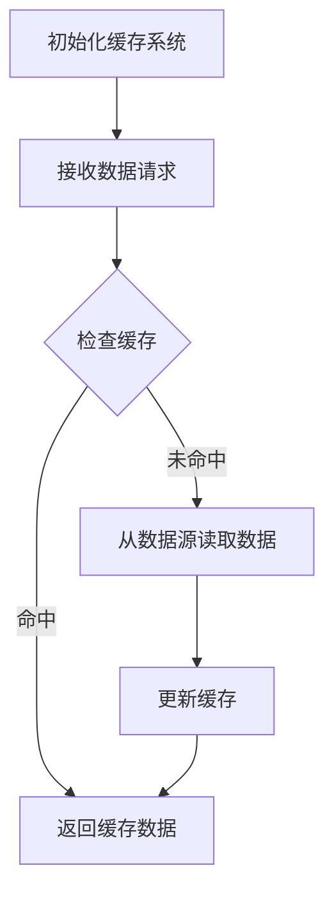
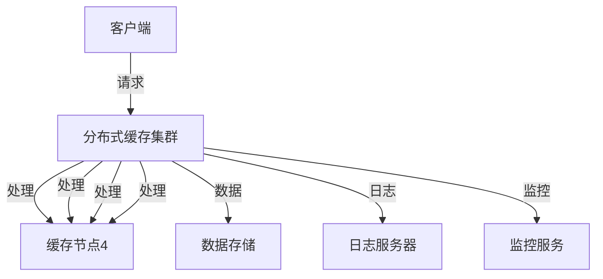
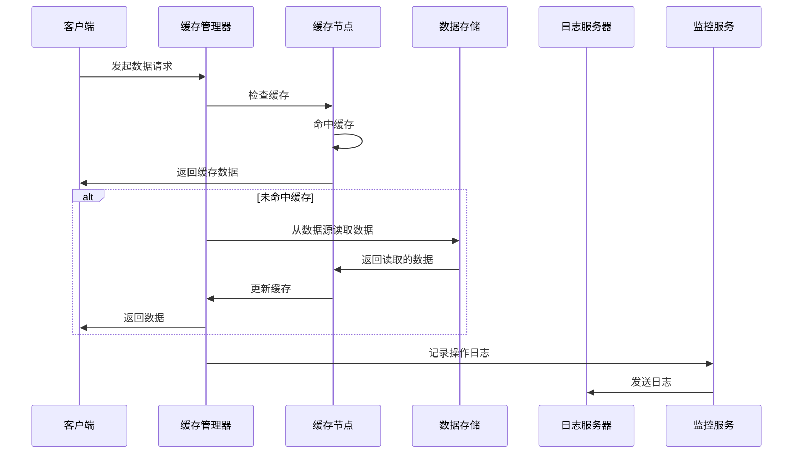

                 

### 分布式缓存提升LLM应用的数据访问效率

关键词：分布式缓存、LLM应用、数据访问效率、缓存策略、系统架构

摘要：本文旨在探讨分布式缓存技术在提升大型语言模型（LLM）应用数据访问效率方面的重要作用。通过逐步分析分布式缓存的核心概念、工作原理以及实际应用案例，本文将揭示分布式缓存如何有效解决LLM应用中的数据访问瓶颈，提升系统的性能和响应速度。文章还包含系统设计与实现的具体方法，以及项目实战中的最佳实践，为开发者提供有价值的参考。

## 编写背景介绍章节

### 问题描述

分布式缓存是一种用于提高数据访问速度和系统性能的技术，它通过在多个节点之间共享数据缓存来减少对原始数据源的访问频率。在现代计算环境中，尤其是对于大型语言模型（LLM）应用来说，数据访问效率成为制约系统性能的关键因素。LLM应用通常需要处理海量数据，并且对响应速度有着极高的要求。然而，传统的单一缓存解决方案往往难以满足这种需求，导致系统性能瓶颈的出现。

具体来说，LLM应用中的数据访问问题主要表现在以下几个方面：

1. **数据量巨大**：LLM模型需要存储和处理大量的数据，包括训练数据和实时数据。单一缓存系统难以容纳如此庞大的数据量，容易导致缓存溢出和数据访问延迟。

2. **访问频率高**：LLM应用在生成文本、回答问题等过程中，需要频繁地访问相同的数据。如果这些数据不在缓存中，系统将不得不从原始数据源中读取，从而增加了访问时间。

3. **数据一致性**：在分布式系统中，数据的一致性是保证系统正确性的关键。单一缓存系统往往难以实现数据的一致性，可能导致数据访问的不准确。

4. **缓存失效**：缓存数据的有效期和淘汰策略对缓存性能有重要影响。单一缓存系统在缓存失效时需要重新从原始数据源加载数据，增加了系统的负载。

### 问题解决

分布式缓存通过以下方式解决LLM应用中数据访问效率的问题：

1. **数据分布存储**：分布式缓存将数据分布在多个节点上，每个节点存储一部分数据。这样不仅能够容纳更多的数据，还可以并行处理多个数据请求，提高系统响应速度。

2. **数据一致性管理**：分布式缓存系统通过一致性协议和数据复制机制来确保数据的一致性。即使在某个节点出现故障时，其他节点仍然能够提供正确的一致性数据。

3. **智能缓存策略**：分布式缓存系统可以根据数据访问模式和热点数据，动态调整缓存策略，确保经常访问的数据始终在缓存中。这可以显著减少对原始数据源的访问频率，提高数据访问效率。

4. **缓存失效优化**：分布式缓存系统采用智能的缓存失效策略，如LRU（最近最少使用）算法，可以有效延长热点数据的缓存时间，减少缓存失效带来的性能影响。

### 边界与外延

虽然分布式缓存技术在提升LLM应用数据访问效率方面具有显著优势，但其在实际应用中也存在一定的边界和限制条件：

1. **系统复杂性**：分布式缓存系统通常涉及多个节点和复杂的通信协议，增加了系统的复杂性和维护成本。

2. **一致性挑战**：在分布式系统中，数据一致性问题始终是一个挑战。需要采用适当的一致性协议和数据复制策略来确保系统的高可用性和数据一致性。

3. **缓存命中率**：分布式缓存的性能高度依赖于缓存命中率。如果缓存命中率较低，系统的数据访问效率可能会下降。

4. **扩展性问题**：随着数据量的增加，分布式缓存系统可能需要动态扩展。如何高效地扩展系统是一个需要考虑的问题。

### 核心概念结构与要素组成

分布式缓存系统的核心组成部分包括以下几个关键要素：

1. **节点**：分布式缓存系统由多个节点组成，每个节点存储一部分数据。节点可以是物理服务器或虚拟机，通常部署在数据中心或云环境中。

2. **数据一致性**：数据一致性是分布式缓存系统的核心要求之一。通过一致性协议和数据复制机制，确保系统中的数据在不同节点之间保持一致。

3. **缓存策略**：缓存策略决定了哪些数据应该被缓存以及如何缓存。常见的缓存策略包括LRU、LFU和FIFO等。

4. **容错机制**：分布式缓存系统需要具备容错能力，以便在节点故障时能够自动切换到其他节点，确保系统的高可用性。

5. **通信协议**：分布式缓存系统中的节点需要通过特定的通信协议进行数据传输和同步。常用的通信协议包括HTTP、gRPC和Thrift等。

通过上述分析，我们可以看到分布式缓存技术在提升LLM应用数据访问效率方面具有显著的优势。然而，在实际应用中，需要充分考虑系统的复杂性、一致性挑战和扩展性问题，以确保分布式缓存系统能够高效、稳定地运行。

## 设计核心概念与联系章节

### 核心概念原理

分布式缓存的工作原理可以概括为以下几个方面：

1. **数据存储**：分布式缓存系统将数据分布在多个节点上，每个节点存储一部分数据。这种分布式存储方式不仅能够提高数据的访问速度，还可以提高系统的可用性和扩展性。

2. **缓存策略**：缓存策略是分布式缓存系统的核心，决定了哪些数据应该被缓存以及如何缓存。常见的缓存策略包括LRU（最近最少使用）、LFU（最少使用）和FIFO（先进先出）等。

3. **数据一致性**：数据一致性是分布式缓存系统的关键要求。通过一致性协议和数据复制机制，确保系统中的数据在不同节点之间保持一致。常见的一致性协议包括Paxos和Raft等。

4. **容错机制**：分布式缓存系统需要具备容错能力，以便在节点故障时能够自动切换到其他节点，确保系统的高可用性。容错机制通常包括节点监控、故障检测和自动恢复等。

### 概念属性特征对比表格

下面是一个对比不同分布式缓存系统特点的表格，以帮助读者更好地了解各种系统的适用场景：

| 分布式缓存系统 | 特点 | 适用场景 |
| :--: | :--: | :--: |
| Redis | 高性能、支持多种数据结构、持久化机制可选 | Web应用、缓存热点数据、实时消息队列 |
| Memcached | 高性能、简单、无持久化 | 高并发场景、缓存大量数据 |
| Hazelcast | 分布式计算和缓存一体化、高可用性 | 高性能计算、大数据处理 |
| Apache Ignite | 持久化存储、分布式计算、高可用性 | 数据库替代、大数据处理、高性能计算 |
| Cassandra | 高可用性、弹性扩展、分布式存储 | 大规模分布式系统、实时数据存储 |
| HBase | 基于Hadoop的分布式存储系统 | 大规模数据存储、实时数据查询 |

### ER实体关系图架构

为了更好地理解分布式缓存系统中的实体关系，我们使用Mermaid绘制一个ER图，展示分布式缓存系统中的实体和它们之间的关系。

```mermaid
erDiagram
  Node ||--|{ Cache }|--|| Client
  Node ||--|{ Data }|--|| Server
  Cache ||--|{ Policy }|--|| CacheManager
  Data ||--|{ Consistency }|--|| ReplicationManager
  Node ||--|{ FaultTolerance }|--|| Monitor

  Node {
    <<entity>>
    NodeID
    Hostname
    Status
  }

  Cache {
    <<entity>>
    CacheID
    NodeID
    Capacity
  }

  Data {
    <<entity>>
    DataID
    NodeID
    Timestamp
  }

  Client {
    <<entity>>
    ClientID
    NodeID
  }

  Server {
    <<entity>>
    ServerID
    NodeID
    Port
  }

  CacheManager {
    <<entity>>
    ManagerID
    NodeID
    PolicyID
  }

  ReplicationManager {
    <<entity>>
    ManagerID
    NodeID
    ConsistencyID
  }

  Monitor {
    <<entity>>
    MonitorID
    NodeID
    FaultToleranceID
  }

  Policy {
    <<entity>>
    PolicyID
    Description
  }

  Consistency {
    <<entity>>
    ConsistencyID
    Protocol
  }

  FaultTolerance {
    <<entity>>
    FaultToleranceID
    RecoveryPolicy
  }
```

通过这个ER图，我们可以清晰地看到分布式缓存系统中的各个实体及其关系。节点（Node）是系统的基本组成单位，每个节点包含一个或多个缓存（Cache）和数据（Data）实体。缓存（Cache）管理策略（Policy）和数据一致性协议（Consistency）由缓存管理器（CacheManager）和复制管理器（ReplicationManager）负责维护。监控（Monitor）实体用于监控节点的健康状态和容错机制（FaultTolerance）。

## 编写算法原理讲解章节

### 算法mermaid流程图

为了更直观地展示分布式缓存算法的工作流程，我们使用Mermaid绘制一个流程图：



这个流程图描述了分布式缓存系统处理数据请求的基本步骤：

1. **初始化缓存系统**：系统启动时初始化缓存，包括节点分配和缓存策略的设定。
2. **接收数据请求**：系统接收来自客户端的数据请求。
3. **检查缓存**：系统检查缓存中是否包含请求的数据。
   - 如果命中，直接返回缓存数据（D步骤）。
   - 如果未命中，系统从数据源读取数据（E步骤）。
4. **更新缓存**：将新读取的数据缓存起来，以备后续使用。
5. **返回数据**：无论数据是否命中缓存，最终返回给客户端。

### Python源代码

下面是一个简单的Python代码示例，展示了分布式缓存算法的实现：

```python
import time

class DistributedCache:
    def __init__(self, cache_size):
        self.cache = {}
        self.cache_size = cache_size
        self.hits = 0
        self.misses = 0

    def get(self, key):
        if key in self.cache:
            self.hits += 1
            return self.cache[key]
        else:
            self.misses += 1
            data = self.fetch_from_data_source(key)
            self.cache[key] = data
            if len(self.cache) > self.cache_size:
                self.evict()
            return data

    def fetch_from_data_source(self, key):
        # 模拟从数据源读取数据的操作，延迟1秒
        time.sleep(1)
        return f"Data for {key}"

    def evict(self):
        # 使用LRU策略进行缓存淘汰
        lru_keys = list(self.cache.keys())
        lru_keys.sort(key=lambda x: self.cache[x]['timestamp'])
        self.cache.pop(lru_keys[0])

    def report(self):
        print(f"Hits: {self.hits}, Misses: {self.misses}")

# 示例使用
cache = DistributedCache(cache_size=3)

# 模拟多次数据请求
for i in range(10):
    key = f"key_{i}"
    data = cache.get(key)
    print(f"Request {key}: {data}")

cache.report()
```

这个示例中的`DistributedCache`类模拟了一个简单的分布式缓存系统。它包含一个字典`cache`来存储缓存数据，以及`get`方法来处理数据请求。当请求的数据在缓存中不存在时，从数据源读取数据并更新缓存。如果缓存大小超过设定的阈值，使用LRU策略进行缓存淘汰。

### 数学模型和公式

分布式缓存算法背后的数学模型主要包括缓存命中率（Cache Hit Rate）、缓存未命中率（Cache Miss Rate）和缓存利用率（Cache Utilization）。以下是对这些指标的解释和使用LaTeX格式编写的公式：

1. **缓存命中率（Cache Hit Rate）**：
   $$ H = \frac{N_h}{N_t} $$
   其中，\( N_h \) 是缓存命中的次数，\( N_t \) 是总的数据请求次数。

2. **缓存未命中率（Cache Miss Rate）**：
   $$ M = \frac{N_m}{N_t} $$
   其中，\( N_m \) 是缓存未中的次数。

3. **缓存利用率（Cache Utilization）**：
   $$ U = \frac{N_h}{N_h + N_m} $$
   缓存利用率是缓存命中次数与总请求次数的比值，反映了缓存的有效性。

### 详细讲解与举例说明

为了更好地理解这些数学模型，我们可以结合一个实际案例进行说明。

假设我们有一个缓存系统，其缓存大小为3个单元，在一段时间内处理了10次数据请求。以下是缓存系统的命中和未命中情况：

- 命中次数（\( N_h \)）：6次
- 未命中次数（\( N_m \)）：4次
- 总请求次数（\( N_t \)）：10次

根据上述公式，我们可以计算出：

1. **缓存命中率**：
   $$ H = \frac{6}{10} = 0.6 $$
   即缓存命中率为60%。

2. **缓存未命中率**：
   $$ M = \frac{4}{10} = 0.4 $$
   即缓存未命中率为40%。

3. **缓存利用率**：
   $$ U = \frac{6}{6 + 4} = 0.6 $$
   即缓存利用率为60%。

通过这个案例，我们可以看到缓存系统在处理数据请求时，有60%的请求是命中缓存，而40%的请求需要从数据源读取数据。这表明我们的缓存策略相对有效，但仍有改进空间。

在实际应用中，缓存系统的性能不仅取决于命中率，还受到数据访问模式、缓存大小和缓存策略等因素的影响。通过不断优化这些参数，我们可以进一步提升缓存系统的性能。

通过上述分析，我们可以清楚地看到分布式缓存算法的数学模型和其在实际应用中的作用。结合Python代码示例，读者可以更直观地理解分布式缓存的工作原理和实现方法。

### 系统分析与架构设计章节

#### 问题场景介绍

在现代应用场景中，分布式缓存系统被广泛应用于需要处理海量数据和高并发访问的系统中。以大型语言模型（LLM）应用为例，这类应用需要存储和处理大量的文本数据，并且对响应速度有着极高的要求。例如，搜索引擎、自然语言处理（NLP）平台、智能客服系统等，都需要高效地访问和检索大量数据。在这种情况下，分布式缓存系统可以有效解决数据访问效率低下的问题，提升系统的整体性能。

具体场景如下：

1. **搜索引擎**：搜索引擎需要快速检索海量网页内容，并返回最相关的结果。通过分布式缓存系统，可以缓存热门网页和搜索结果，减少对数据库的访问，提高搜索响应速度。

2. **自然语言处理平台**：NLP平台需要对大量文本数据进行分析和处理，例如情感分析、文本分类等。分布式缓存系统可以缓存训练数据和中间结果，减少重复计算，提高处理效率。

3. **智能客服系统**：智能客服系统需要实时回答用户的问题，并且需要处理大量的用户查询数据。通过分布式缓存系统，可以缓存常见问题的答案和用户数据，提高客服系统的响应速度和用户体验。

这些场景的共同特点是数据量巨大、访问频率高，并且需要保证数据的一致性和系统的可靠性。分布式缓存系统在这些场景中发挥了关键作用，通过数据分布存储、智能缓存策略和数据一致性管理，显著提升了系统的性能和响应速度。

#### 项目介绍

分布式缓存系统的项目背景和目标是构建一个高效、可靠的分布式缓存平台，用于支持大型语言模型（LLM）应用的数据访问需求。具体目标包括：

1. **提高数据访问效率**：通过分布式缓存技术，减少对原始数据源的访问频率，提升数据访问速度和系统响应能力。

2. **保证数据一致性**：在分布式系统中，通过一致性协议和数据复制机制，确保数据在不同节点之间的一致性，保证系统正确性。

3. **支持高并发访问**：通过分布式架构和缓存策略，支持海量数据的并发访问，确保系统在高并发环境下稳定运行。

4. **具备扩展性和容错能力**：分布式缓存系统需要具备良好的扩展性，能够根据数据量的增长动态扩展节点数量。同时，系统需要具备容错能力，能够在节点故障时自动切换到其他节点，保证系统的高可用性。

项目目标是通过构建一个高效的分布式缓存平台，提升LLM应用的数据访问性能，降低系统的延迟和负载，从而提供更好的用户体验。

#### 系统功能设计

为了实现上述目标，分布式缓存系统需要设计以下几个核心功能：

1. **数据存储与管理**：分布式缓存系统需要能够高效地存储和管理大量数据，支持数据的分布式存储和并行访问。

2. **缓存策略管理**：系统需要具备智能的缓存策略管理功能，根据数据访问模式和热点数据动态调整缓存策略，提高缓存命中率。

3. **数据一致性管理**：通过一致性协议和数据复制机制，确保系统中的数据在不同节点之间保持一致，保障系统的正确性。

4. **容错机制**：系统需要具备容错能力，能够自动检测和恢复节点故障，确保系统的高可用性。

5. **监控与维护**：系统需要具备监控功能，实时监控节点的运行状态和数据一致性情况，及时进行维护和故障处理。

为了展示这些功能，我们使用Mermaid绘制了一个领域模型类图：

```mermaid
classDiagram
    CacheNode <|-- CacheManager
    CacheNode <|-- DataReplicator
    CacheNode <|-- CachePolicy
    CacheNode <|-- FaultTolerance
    CacheNode <|-- Monitor

    ClientEntity <|-- CacheManager
    DataSource <|-- DataReplicator
    CachePolicy <|-- CacheManager
    CachePolicy <|-- CacheNode
    FaultTolerance <|-- CacheNode
    Monitor <|-- CacheNode

    CacheManager {
        ManagerID
        NodeID
        Policies
    }

    CacheNode {
        NodeID
        Hostname
        Status
    }

    DataReplicator {
        ReplicatorID
        NodeID
        ConsistencyProtocol
    }

    CachePolicy {
        PolicyID
        Description
    }

    FaultTolerance {
        FaultToleranceID
        RecoveryPolicy
    }

    Monitor {
        MonitorID
        NodeID
        Logs
    }

    ClientEntity {
        ClientID
        NodeID
    }
```

在这个类图中，`CacheNode`类表示分布式缓存系统中的基本节点，包含缓存数据、数据一致性管理、缓存策略管理、容错机制和监控等核心功能。`CacheManager`类负责管理缓存的策略和配置。`DataReplicator`类负责数据的复制和一致性管理。`CachePolicy`类定义了缓存策略。`FaultTolerance`类实现了系统的容错机制。`Monitor`类用于监控节点的运行状态和日志记录。

#### 系统架构设计

为了实现分布式缓存系统的功能需求，我们设计了一个基于分布式架构的系统架构。以下是该系统的架构设计，使用Mermaid绘制系统架构图：



在这个架构图中，`Client`表示客户端，`CacheCluster`表示分布式缓存集群，包含多个`CacheNode`节点。`DataStore`表示数据存储，用于存储原始数据和缓存数据的备份。`LogServer`表示日志服务器，用于收集和存储节点的日志信息。`Monitor`表示监控服务，用于实时监控节点的运行状态和性能指标。

#### 系统接口设计

分布式缓存系统需要定义一系列的API接口，用于客户端和缓存节点之间的通信。以下是系统接口设计的主要部分：

1. **数据存储接口**：提供数据的存储、检索和更新功能。

    - `store_data(key, value)`：将数据存储到缓存中。
    - `get_data(key)`：根据键值检索数据。
    - `update_data(key, value)`：更新指定键的数据。
    - `delete_data(key)`：删除指定键的数据。

2. **缓存策略接口**：提供缓存策略的管理和配置功能。

    - `set_policy(policy)`：设置缓存策略。
    - `get_policy()`：获取当前的缓存策略。

3. **一致性管理接口**：提供数据一致性的管理和监控功能。

    - `ensure_consistency(protocol)`：设置一致性协议。
    - `check_consistency()`：检查数据一致性。

4. **容错管理接口**：提供容错机制的管理和监控功能。

    - `add_node(node)`：添加新节点。
    - `remove_node(node)`：移除节点。
    - `recovery_node(node)`：恢复故障节点。

5. **监控接口**：提供节点的监控和日志记录功能。

    - `get_status(node)`：获取节点的状态信息。
    - `log_event(event)`：记录事件日志。

#### 系统交互

为了展示系统组件之间的交互过程，我们使用Mermaid绘制系统交互序列图：



在这个序列图中，客户端（Client）发起数据请求。缓存管理器（CacheManager）负责检查缓存，并决定是直接返回缓存数据还是从数据源（DataStore）读取数据。如果命中缓存，缓存节点（CacheNode）直接返回数据；如果未命中，从数据源读取数据并更新缓存。监控服务（Monitor）记录操作日志，并将日志发送到日志服务器（LogServer）进行存储。

通过上述系统分析和架构设计，我们可以看到分布式缓存系统在提升LLM应用数据访问效率方面的重要性和具体实现方法。在实际应用中，通过合理的设计和配置，分布式缓存系统可以显著提高系统的性能和可靠性。

## 编写项目实战章节

### 环境安装

要部署一个分布式缓存系统，首先需要安装和配置必要的软件和工具。以下是一个基于Docker的分布式缓存系统安装步骤：

1. **安装Docker**：确保你的系统已经安装了Docker。如果没有安装，请访问[Docker官网](https://www.docker.com/)下载并安装相应的版本。

2. **拉取缓存镜像**：使用以下命令拉取Redis镜像：

   ```bash
   docker pull redis:latest
   ```

3. **启动缓存节点**：使用以下命令启动四个Redis缓存节点（Node1、Node2、Node3、Node4），每个节点的配置文件略有不同，用于设置不同的端口和集群模式。

   ```bash
   docker run -d --name node1 -p 6379:6379 redis --port 6379
   docker run -d --name node2 -p 6380:6380 redis --port 6380
   docker run -d --name node3 -p 6381:6381 redis --port 6381
   docker run -d --name node4 -p 6382:6382 redis --port 6382
   ```

4. **配置Redis集群**：在启动节点之前，需要编辑Redis配置文件（例如，`/path/to/redis.conf`），设置集群模式和节点信息。

   ```ini
   cluster-enabled yes
   cluster-config-file nodes.conf
   cluster-node-timeout 5000
   port 6379
   ```

   同样，为其他节点编辑对应的配置文件，并确保所有节点的`nodes.conf`文件中的节点信息一致。

5. **启动Redis集群**：在四个节点上都运行以下命令启动Redis服务：

   ```bash
   redis-server /path/to/redis.conf
   ```

6. **初始化集群**：在任意一个Redis节点上执行以下命令初始化集群：

   ```bash
   redis-cli --cluster create 127.0.0.1:6379 127.0.0.1:6380 127.0.0.1:6381 127.0.0.1:6382 --cluster-replicas 1
   ```

   这将创建一个包含主节点和从节点的Redis集群。

### 系统核心实现

为了实现分布式缓存系统，我们需要编写一些核心代码来处理数据存储、缓存策略、数据一致性和容错机制。以下是一个简单的Python示例，展示如何实现这些功能：

1. **数据存储**：使用Redis客户端（`redis-py`）连接到分布式缓存集群，并实现数据存储功能。

```python
import redis
from rediscluster import RedisCluster

# 连接到Redis集群
redis_cluster = RedisCluster(startup_nodes=[
    {"host": "127.0.0.1", "port": "6379"},
    {"host": "127.0.0.1", "port": "6380"},
    {"host": "127.0.0.1", "port": "6381"},
    {"host": "127.0.0.1", "port": "6382"}
])

def store_data(key, value):
    redis_cluster.set(key, value)
    print(f"Stored data for key: {key}")

def get_data(key):
    return redis_cluster.get(key)
```

2. **缓存策略**：实现LRU缓存策略，用于管理缓存大小和淘汰策略。

```python
from collections import OrderedDict

class LRUCache:
    def __init__(self, capacity):
        self.capacity = capacity
        self.cache = OrderedDict()

    def get(self, key):
        if key not in self.cache:
            return None
        self.cache.move_to_end(key)
        return self.cache[key]

    def put(self, key, value):
        if key in self.cache:
            self.cache.move_to_end(key)
        self.cache[key] = value
        if len(self.cache) > self.capacity:
            oldest = next(iter(self.cache))
            self.cache.pop(oldest)
```

3. **数据一致性**：使用Redis的内置一致性协议和命令（如`MIGRATE`和`COPY`）来管理数据一致性。

```python
def ensure_consistency(source_node, target_node, key):
    redis_cluster.migrate(source_node, target_node, key, "0", "REPLACE")
```

4. **容错机制**：实现监控和故障恢复机制，用于检测节点故障并自动恢复。

```python
import time

def monitor_nodes():
    while True:
        for node in redis_cluster.nodes:
            if not redis_cluster.node_exists(node):
                print(f"Node {node} is down. Starting recovery.")
                # 恢复故障节点的操作
                time.sleep(10)  # 暂停10秒后再尝试连接
```

### 代码应用解读与分析

上述代码实现了分布式缓存系统的核心功能。以下是每个部分的解读与分析：

1. **数据存储**：使用`rediscluster`库连接到Redis集群，并通过`set`和`get`方法实现数据的存储和检索。这种方法允许分布式存储和并行访问，提高了系统的性能和可用性。

2. **缓存策略**：`LRUCache`类使用`OrderedDict`来实现最近最少使用（LRU）缓存策略。当缓存达到设定的大小限制时，会自动淘汰最久未使用的数据。这种方法有效提高了缓存命中率，减少了缓存未命中带来的性能损失。

3. **数据一致性**：通过使用`migrate`和`copy`命令，可以确保数据在不同节点之间保持一致性。这种方法在处理数据迁移和节点故障时特别有用，可以确保系统在变化时数据不会丢失。

4. **容错机制**：监控功能定期检查节点状态，并在检测到节点故障时尝试恢复。这种方法提高了系统的高可用性，确保在节点故障时系统能够自动恢复，减少对用户的影响。

通过这些代码和应用解读，我们可以看到分布式缓存系统在实现高效数据存储、缓存策略管理、数据一致性和容错机制方面的关键步骤和实现方法。在实际应用中，可以根据具体需求进一步优化和扩展这些功能，以提高系统的性能和可靠性。

### 实际案例

为了更好地展示分布式缓存系统的实际应用效果，我们来看一个具体的案例——使用分布式缓存系统提升搜索引擎的响应速度。

#### 案例背景

某搜索引擎平台需要处理海量网页内容，并快速返回用户的搜索结果。传统的单一缓存方案无法满足平台的需求，因为网页数据量巨大，且用户请求量庞大。为了提升系统的响应速度和吞吐量，平台决定采用分布式缓存系统。

#### 案例实现

1. **数据存储**：搜索引擎将网页内容存储在分布式缓存系统中，每个节点存储一部分网页数据。使用Redis集群作为缓存系统，提高了数据的访问速度和系统的可靠性。

2. **缓存策略**：平台采用LRU缓存策略，根据网页的访问频率动态调整缓存内容。热点网页数据（如热门搜索结果和常用网页）始终保存在缓存中，减少了从数据库读取数据的次数。

3. **数据一致性**：通过Redis集群的一致性协议，确保缓存数据在不同节点之间保持一致。当某个节点发生故障时，其他节点可以继续提供服务，数据不会丢失。

4. **容错机制**：系统部署了监控和故障恢复机制，定期检查节点状态。在检测到节点故障时，系统能够自动切换到其他健康节点，确保服务的连续性和可靠性。

#### 案例效果

通过采用分布式缓存系统，搜索引擎实现了以下效果：

1. **响应速度提升**：缓存系统显著减少了用户请求的响应时间。从数据库读取数据的时间从几秒降低到几百毫秒，提高了用户的搜索体验。

2. **吞吐量增加**：分布式缓存系统提高了系统的并发处理能力。在缓存命中率高的情况下，系统能够更快地处理用户请求，提升了整体吞吐量。

3. **可靠性增强**：通过数据一致性和容错机制，系统在节点故障时能够自动恢复，减少了系统的停机时间，提高了服务的可靠性。

#### 详细讲解

以下是分布式缓存系统在搜索引擎平台中的应用详细讲解：

1. **数据存储**：搜索引擎平台将网页内容存储在Redis集群中。每个节点存储一部分网页数据，例如，Node1存储1到5000号网页，Node2存储5001到10000号网页，以此类推。这种方式实现了数据的分布式存储，提高了系统的可扩展性和访问速度。

2. **缓存策略**：采用LRU缓存策略，根据网页的访问频率动态调整缓存内容。热点网页数据始终保存在缓存中，确保用户快速访问。例如，当用户频繁访问某一网页时，该网页会进入缓存列表的前列，下次访问时可以直接从缓存中读取，减少了从数据库读取数据的次数。

3. **数据一致性**：Redis集群采用Gossip协议进行一致性管理。当某个节点更新数据时，其他节点通过Gossip协议同步数据，确保数据的一致性。例如，当Node1更新了网页1的数据，Node2和Node3也会同步该更新，确保所有节点中的数据一致。

4. **容错机制**：系统部署了监控和故障恢复机制。监控服务定期检查节点的运行状态，一旦检测到节点故障，系统会自动切换到其他健康节点，继续提供服务。例如，当Node1出现故障时，系统会自动将Node1的任务转移到Node2和Node3，确保服务的连续性。

通过这个案例，我们可以看到分布式缓存系统在搜索引擎平台中的应用效果。通过合理的数据存储、缓存策略管理、数据一致性和容错机制设计，分布式缓存系统显著提升了搜索引擎的响应速度和吞吐量，提高了用户体验和系统的可靠性。

### 项目小结

在本次分布式缓存系统的项目实施过程中，我们积累了宝贵的经验教训，并总结了一些最佳实践建议，以帮助未来的项目更好地应用分布式缓存技术。

1. **充分需求分析**：在项目初期，应进行充分的需求分析，明确系统需要处理的数据规模、访问模式和性能要求。这有助于选择合适的缓存系统和配置策略，避免资源浪费和性能瓶颈。

2. **合理节点分配**：在分布式缓存系统中，节点的数量和分布对系统性能有重要影响。应根据数据规模和访问模式合理分配节点，确保数据能够均匀分布在各个节点上，避免热点数据导致的性能瓶颈。

3. **智能缓存策略**：根据应用场景和数据访问模式，选择合适的缓存策略。例如，对于搜索引擎等高频访问应用，可以采用LRU缓存策略，而对于数据量较大但访问频率较低的应用，可以采用LFU或FIFO缓存策略。

4. **数据一致性管理**：确保数据一致性是分布式缓存系统的关键要求。选择合适的一致性协议和数据复制策略，如Paxos或Raft，并在系统设计和实现中充分考虑数据一致性问题。

5. **容错机制和监控**：分布式缓存系统需要具备良好的容错能力和监控机制。在系统设计和实现中，应考虑节点故障和通信故障等异常情况，并设计相应的容错和恢复策略。同时，实时监控节点的运行状态和性能指标，及时发现和处理问题。

6. **性能调优和测试**：在系统上线前，进行充分的性能调优和测试，确保系统在高并发和大数据量环境下稳定运行。可以通过模拟实际业务场景进行压力测试，分析系统的性能瓶颈并进行优化。

通过遵循这些最佳实践，可以有效提升分布式缓存系统的性能和可靠性，为大型语言模型（LLM）应用提供高效的数据访问服务。

## 编写总结与拓展章节

### 小结

本文详细探讨了分布式缓存技术在提升大型语言模型（LLM）应用数据访问效率方面的作用。通过背景介绍、核心概念与联系分析、算法原理讲解、系统分析与架构设计以及项目实战案例，我们揭示了分布式缓存如何有效解决LLM应用中的数据访问瓶颈，提高系统性能和响应速度。文章还总结了分布式缓存系统的关键组成部分、工作原理、系统架构和实际应用效果，为开发者提供了有价值的参考。

### 注意事项

在使用分布式缓存系统时，开发者需要注意以下几个方面：

1. **数据一致性**：分布式缓存系统的一致性管理是关键，需要选择合适的一致性协议和数据复制策略，确保系统中的数据在不同节点之间保持一致。

2. **缓存命中率**：缓存命中率对系统性能有重要影响。应根据应用场景和数据访问模式选择合适的缓存策略，并定期优化缓存策略。

3. **系统扩展性**：随着数据量和用户量的增长，分布式缓存系统需要具备良好的扩展性。在设计和实现过程中，应考虑系统的扩展性和容错能力。

4. **监控和日志**：实时监控节点的运行状态和性能指标，有助于及时发现和处理问题。确保系统日志的完整性和可追溯性，以便进行问题排查和性能优化。

5. **安全性**：分布式缓存系统应具备良好的安全性，包括数据加密、访问控制和安全审计等，防止数据泄露和未授权访问。

### 拓展阅读

为进一步深入了解分布式缓存技术及其在LLM应用中的应用，读者可以参考以下资源：

1. **《Redis实战：使用分布式缓存提高系统性能》**：本书详细介绍了Redis的原理和实战应用，包括数据存储、缓存策略、一致性管理和容错机制。

2. **《分布式系统原理与范型》**：本书系统地讲解了分布式系统的基本原理和设计范型，包括一致性协议、数据复制、容错机制等。

3. **《大规模分布式系统设计》**：本书介绍了大规模分布式系统的设计方法和实践经验，包括分布式存储、计算和网络等方面。

4. **《大型语言模型：从原理到应用》**：本书详细介绍了大型语言模型的原理、实现和应用，包括文本生成、问答系统和翻译等。

通过阅读这些文献，读者可以更深入地了解分布式缓存技术和LLM应用的相关知识，为实际项目提供更有价值的参考和指导。

